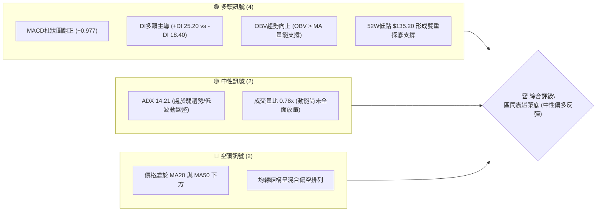
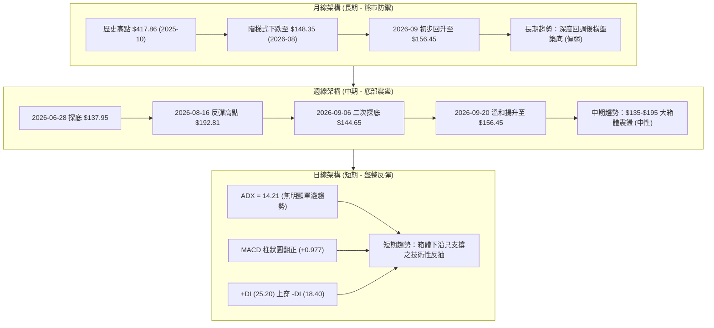
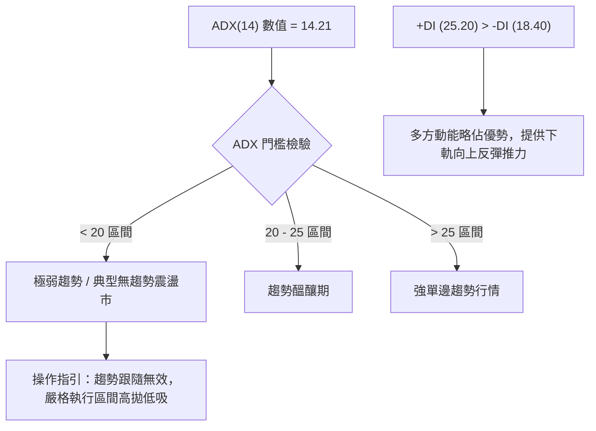
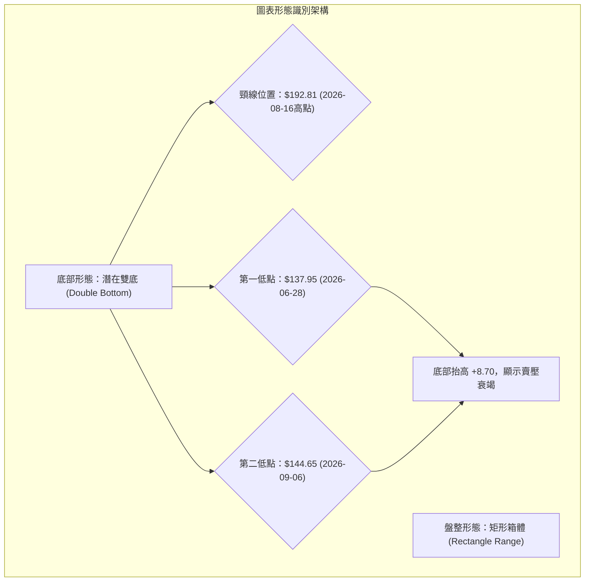
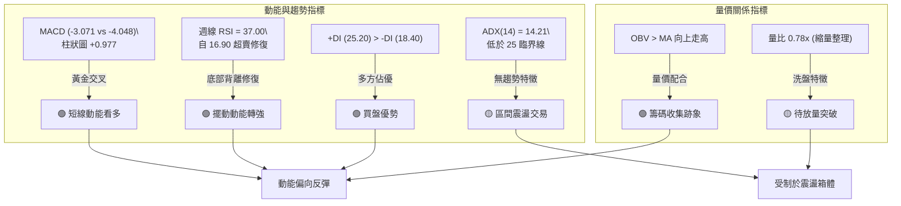
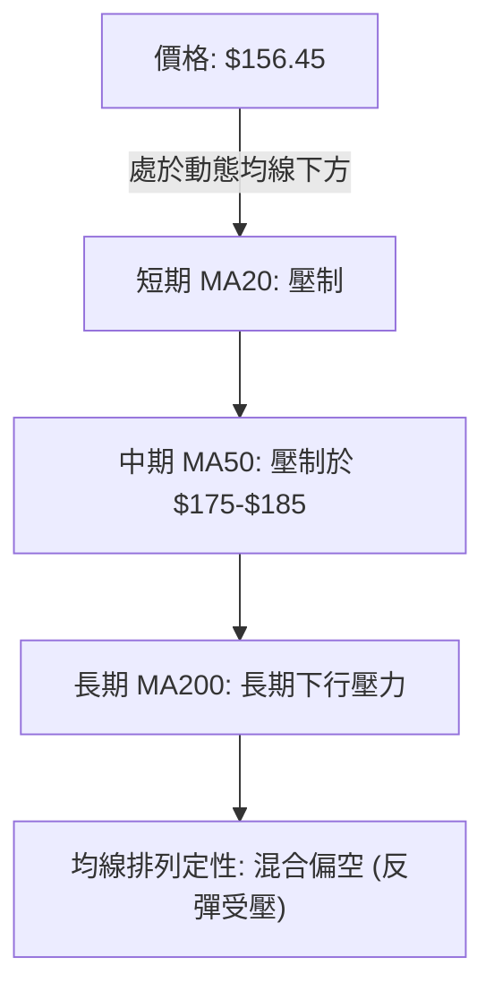
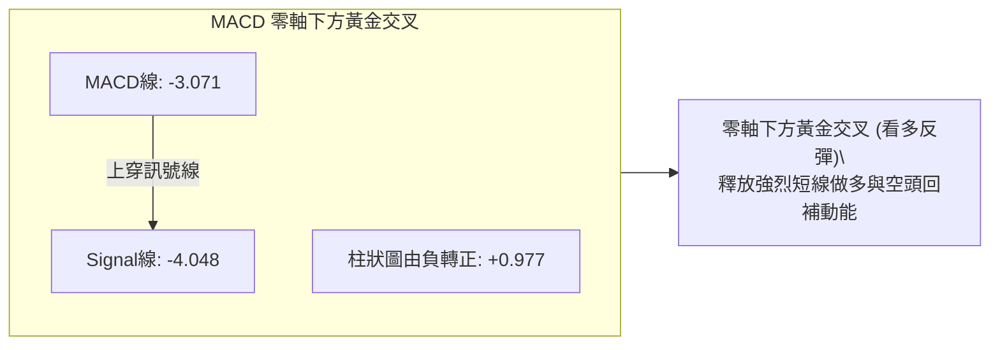
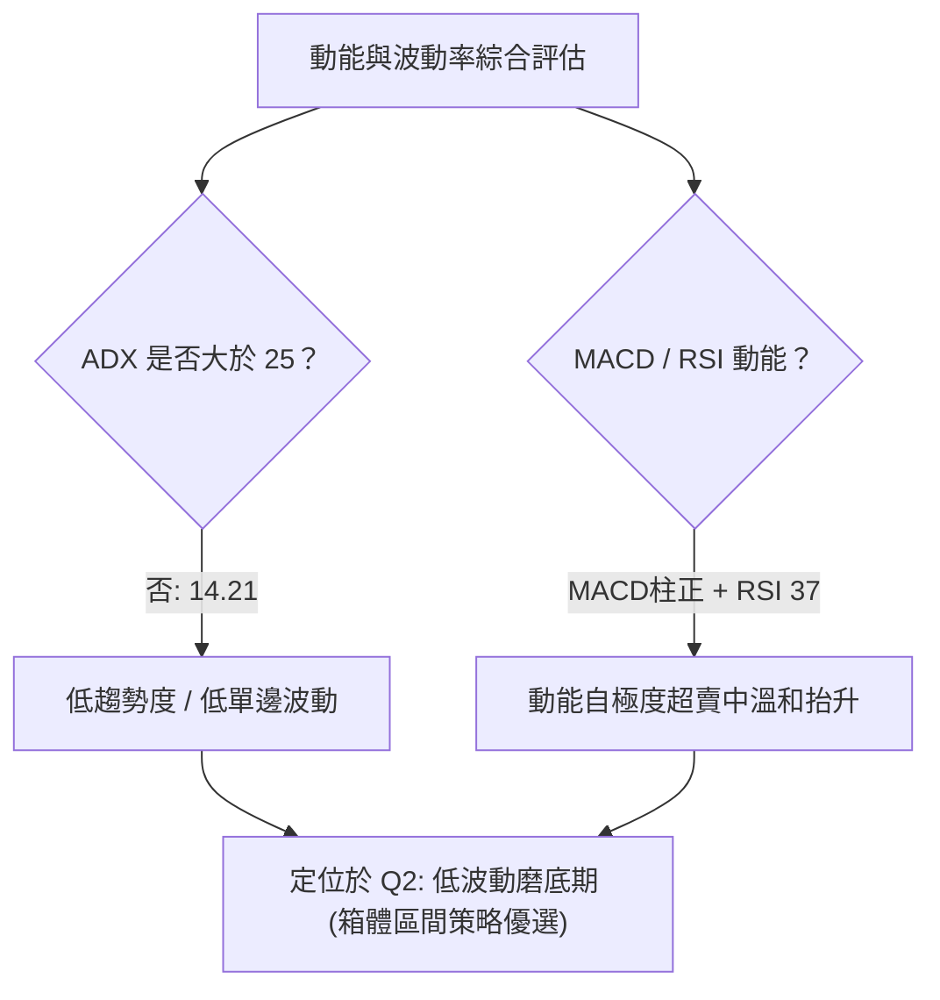
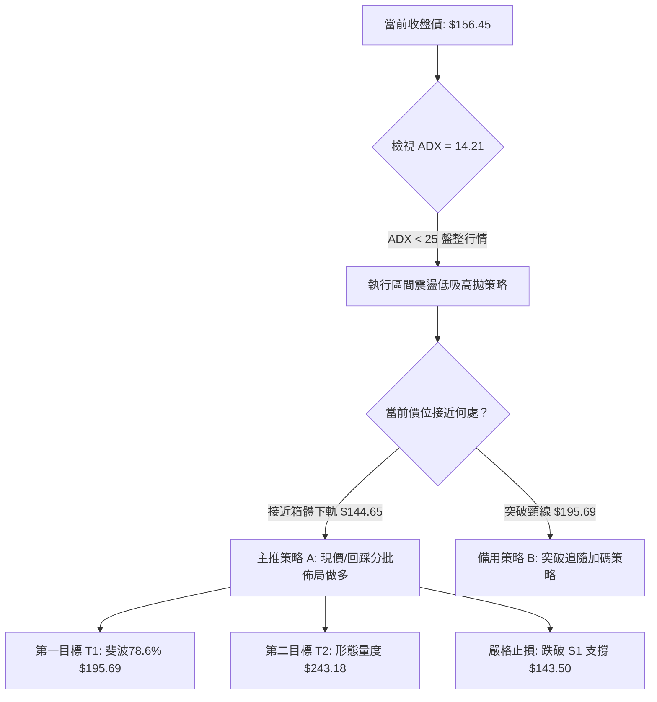
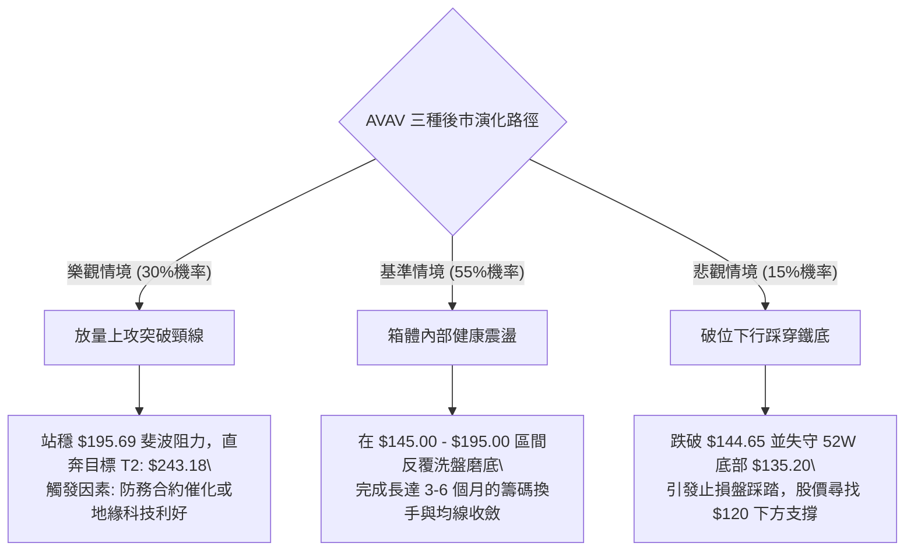

# AVAV 技術分析報告

> **報告日期**：2026-09-18 ｜ **語言**：繁體中文 ｜ **數據來源**：Yahoo Finance ｜ **當前價格**：$156.45

---

## 目錄

| 章節 | 內容 |
|------|------|
| [1. 技術面概覽](#1-技術面概覽) | 訊號儀表板、核心指標、評分卡 |
| [2. 趨勢分析](#2-趨勢分析) | 多時框趨勢、長中短期走勢、ADX強弱 |
| [3. 圖表形態分析](#3-圖表形態分析) | 形態識別、信心度驗證、K線組合解讀 |
| [4. 支撐與阻力](#4-支撐與阻力) | 關鍵價位結構、斐波那契回調精確位 |
| [5. 技術指標深度解讀](#5-技術指標深度解讀) | 均線、RSI、MACD金叉、OBV量能分析 |
| [6. 動能與波動率](#6-動能與波動率) | 動能四象限、ATR波動度、Beta風險評估 |
| [7. 多時框架總結](#7-多時框架總結) | 跨時框收斂、盤整格局定性 |
| [8. 交易策略建議](#8-交易策略建議) | 區間震盪操作策略、風報比精算 |
| [9. 風險提示與監控](#9-風險提示與監控) | 關鍵防線檢核表、三種情境路徑 |

---

## 1. 技術面概覽

### 🎯 技術訊號儀表板

依據當前量化技術指標，AVAV 正處於從 52 週低點 $135.20 反彈後的震盪築底階段。日/週線動能指標出現修復（MACD 柱狀圖翻正），但整體趨勢強度（ADX 14.21）極為疲弱，顯示市場缺乏單邊推動力。



### 📊 核心指標速覽表

註：當前最新收盤價採用 2026-09-20 週線收盤價暨最新月收盤價 **$156.45**。

| 指標類別 | 指標名稱 | 當前數值 | 訊號 | 解讀 |
|----------|----------|----------|------|------|
| **價格** | 當前收盤價 | $156.45 | 🟡 | 脫離 52W 低點 $135.20，於底部區間溫和回升 |
| **均線** | MA20 | 下方 (數值缺損) | 🔴 | 價格位於短期 MA20 之下，反彈面臨動態均線壓制 |
| **均線** | MA50 | 下方 (數值缺損) | 🔴 | 價格位於中期 MA50 之下，中期趨勢尚未扭轉 |
| **均線** | MA200 | 混合 (數值缺損) | 🟡 | 長期均線走勢呈平緩，均線系統呈現混合排列 |
| **動能** | RSI(14) (日/週) | 37.00 (上週) | 🟡 | 自超賣區 (16.90) 向上修復至中性偏弱區，底背離修復 |
| **動能** | MACD Hist | +0.977 | 🟢 | MACD (-3.071) 高於 Signal (-4.048)，柱狀圖轉正看多 |
| **趨勢** | ADX (14) | 14.21 | 🟡 | 低於 25，顯示當前為典型無趨勢盤整市場 |
| **趨勢** | 方向指標 (+/-DI) | +DI 25.20 / -DI 18.40 | 🟢 | 多頭力量佔優，具備短線技術性反彈動能 |
| **量能** | OBV 趨勢 | OBV > MA | 🟢 | 成交量配合價格回升，資金出現低檔承接跡象 |
| **量能** | 最新量比 | 0.78x | 🟡 | 20日均量 2,267,138，最新成交 1,771,253，量縮整理 |

### 🏆 技術評分卡

```
╔══════════════════════════════════════════════════════════════╗
║              技術評分卡 — AVAV (2026-09-18)                  ║
╠══════════════════════════════════════════════════════════════╣
║ 趨勢強度 (ADX 14.21)    ██████░░░░░░░░░░░░░░  30/100  🔴 疲弱 ║
║ 動能指標 (MACD/RSI)     ████████████░░░░░░░░  60/100  🟢 偏多 ║
║ 支撐穩定度 (52W底部)    ██████████████░░░░░░  70/100  🟢 穩固 ║
║ 成交量配合 (OBV>MA)     ████████████░░░░░░░░  60/100  🟢 良好 ║
║ 形態完整度 (雙底初形)   ██████████░░░░░░░░░░  50/100  🟡 中性 ║
║ 均線排列 (位於MA下方)   ██████░░░░░░░░░░░░░░  30/100  🔴 偏空 ║
╠══════════════════════════════════════════════════════════════╣
║ 綜合評分                ██████████░░░░░░░░░░  50/100  🟡 中性 ║
║ 綜合評級結論：區間震盪格局 (Range-Bound)，建議採取下軌低吸策略 ║
╚══════════════════════════════════════════════════════════════╝
```

---

## 2. 趨勢分析

### 🌐 多時框趨勢分析

AVAV 在經歷 2025 年第四季歷史高點 $417.86 後，步入長達近一年的大幅修正，目前月線處於深度超跌後的回穩階段，週線級別構築雙重底反彈結構，而日線則受限於低 ADX，表現為典型的箱體橫盤整理。



### 📈 長期趨勢 — 12個月走勢圖（Unicode）

依據過去 12 個月收盤走勢（2025-10 至 2026-09），AVAV 完成了一輪完整的衝高回落與築底循環：

```
AVAV 月線走勢圖（過去12個月：2025-10 至 2026-09）
價格軸 ($)
$370 ┤ ● (2025-10: $369.91 / 最高 $417.86)
$330 ┤   ╲
$290 ┤     ● (2025-11: $279.46)       ● (2026-01: $278.39)
$250 ┤       ╲                      ╱   ╲
$240 ┤         ● (2025-12: $241.89)       ● (2026-02: $252.25)
$200 ┤                                      ╲     ● (2026-04: $195.02)  ● (2026-05: $207.24)
$180 ┤                                        ● (2026-03: $183.05)   ╲ ╱
$160 ┤                                                                ● (2026-06: $165.07)  ●←現在 $156.45
$140 ┤                                                                  ● (2026-07: $149.37)
$135 ┤                                                                    ● (52W低點: $135.20 / 2026-08: $148.35)
     └─┬─────┬─────┬─────┬─────┬─────┬─────┬─────┬─────┬─────┬─────┬─────┬─────
     '25-10 '25-11 '25-12 '26-01 '26-02 '26-03 '26-04 '26-05 '26-06 '26-07 '26-08 '26-09
```

**走勢特徵分析表格**：

| 週期階段 | 起訖時間 | 區間收盤變化 | 漲跌幅 | 核心走勢特徵 |
|----------|----------|--------------|--------|--------------|
| **高位見頂** | 2025-09 ~ 2025-10 | $314.89 → $369.91 | +17.47% | 創下 52 週最高價 $417.86，成交量達到頂峰後動能衰竭 |
| **首輪重挫** | 2025-10 ~ 2025-12 | $369.91 → $241.89 | -34.61% | 估值回調引發機構拋售，跌破多條短期均線支撐 |
| **次頂反彈** | 2025-12 ~ 2026-01 | $241.89 → $278.39 | +15.09% | 弱勢反彈未能突破 $280，構築頭肩頂右肩阻力 |
| **主跌推動** | 2026-01 ~ 2026-03 | $278.39 → $183.05 | -34.25% | 恐慌性賣壓湧現，連續跌破 $243.18 (61.8%斐波) |
| **抵抗震盪** | 2026-03 ~ 2026-05 | $183.05 → $207.24 | +13.21% | 圍繞 $195.69 (78.6%斐波) 展開拉鋸抵抗 |
| **加速探底** | 2026-05 ~ 2026-07 | $207.24 → $149.37 | -27.93% | 摜破 $150 關卡，創 52 週新低 $135.20 |
| **磨底修復** | 2026-08 ~ 2026-09 | $148.35 → $156.45 | +5.46% | 量能沉澱，RSI/MACD 出現底部金叉，進入築底階段 |

### 📊 中期趨勢（週線分析）

從近 20 週的收盤軌跡分析，市場在 2026 年夏季展現出高度規律的箱體來回洗盤特徵：
1. **第一次探底**：2026-06-28 創下週收盤低點 $137.95（週成交 1,188 萬股），隨後觸發報復性反彈。
2. **反彈高點確認**：2026-08-16 週收盤抵達 $192.81（RSI 達到 73.5 超買區），受制於 78.6% 斐波那契壓力位 $195.69。
3. **第二次探底**：2026-09-06 週收盤拉回至 $144.65，次週（2026-09-13）爆出 20,402,600 股的天量，收在 $146.71，確認籌碼巨量換手。
4. **當前狀況**：2026-09-20 最新收盤價 $156.45，形成低點抬高（$144.65 > $137.95）的潛在底部結構。

```
中期壓力與支撐示意圖 (週線層級)
$200 ┬────────────────────────────────────────── 阻力區：$192.81 - $195.69 (78.6%斐波)
     │                     ▲ 反彈高點 $192.81
$180 ┤                    ╱ ╲
     │                   ╱   ╲
$160 ┤                  ╱     ╲      ▲ 現價 $156.45
     │   ▲ 反彈 $190.89 ╱       ╲    ╱
$140 ┼───╲─────────────╱─────────╲──╱───────── 支撐區：$135.20 - $144.65 (雙底支撐)
     │    ▼ 初次底 $137.95        ▼ 次級底 $144.65 (巨量換手)
     └──────────────────────────────────────────
```

### ⚡ 趨勢強度評估（ADX 解讀）

當前日線級別趨勢指標數據：
- **ADX(14)**：**14.21**
- **+DI**：**25.20**
- **-DI**：**18.40**



**ADX 趨勢強度對照表**：

| 指標名稱 | 數值 | 狀態評估 | 戰術意涵 |
|----------|------|----------|----------|
| **ADX(14)** | **14.21** | 弱趨勢 / 盤整市場 (極低波動) | 順勢突破策略極易遭遇假突破，應切換為區間擺動震盪交易模式 |
| **+DI** | **25.20** | 多方攻擊動能處於活躍水平 | 買方在 $140 附近展現承接力道，帶動價格回升 |
| **-DI** | **18.40** | 空方打壓動能明顯減退 | 空頭回補動作持續，大幅下殺動能已耗盡 |
| **方向差離值** | **+6.80** | 多頭微弱擴散 | 預期反彈將以溫和階梯式推進，而非爆發性噴出 |

---

## 3. 圖表形態分析

### 🔍 形態識別系統

在多時框架構下，AVAV 在週線圖上正形成一個潛在的「雙重底」（Double Bottom）結構，而在日線級別上則呈現「矩形區間盤整」（Rectangle Consolidation）。由於均線數據存在缺損，本分析嚴格基於明確的 OHLCV 波段高低點聚類進行驗證。



**形態信心度檢驗表（嚴格依據規則 15）**：

| 形態名稱 | 信心度 | 判斷依據（引用真實歷史數據） | 當前完成度 | 目標價計算式（依形態高度推算） |
|----------|--------|------------------------------|------------|--------------------------------|
| **週線雙底 (Double Bottom)** | **65%** | 兩次低點分別為 $137.95 (2026-06-28) 與 $144.65 (2026-09-06)，未跌破 52W 低點 $135.20；且次低點成交量顯著放大確認支撐。 | 60% (現價 $156.45 處於由底向頸線推進路徑) | 形態高度 = $192.81 (頸線) - $137.95 (低點) = $54.86。<br>理論突破目標價 = 頸線 $192.81 + $54.86 = **$247.67** (接近 61.8% 斐波那契位 $243.18)。 |
| **日線矩形箱體 (Range-Bound)** | **75%** | ADX = 14.21 確認無趨勢；價格在 $135.20 - $144.65 區域獲得強支撐，上方在斐波那契 78.6% ($195.69) 面臨嚴密阻力。 | 80% (箱體內部震盪整理階段) | 箱體突破前不預設計算高度，區間上限目標為 **$192.81**，下限支撐為 **$135.20**。 |

### 🕯️ 重要K線形態分析

| 週期/月份 | 收盤價 | K線形態 | 量能配合 | 技術解讀 | 訊號 |
|-----------|--------|---------|----------|----------|------|
| **2026-06-28 週** | $137.95 | 長下影長陰線 (錘頭測底) | 11,887,200 | 價格下探 52W 低點 $135.20 附近後強烈拒絕下跌，留下影線 | 🟢 觸底反彈 |
| **2026-07-05 週** | $190.89 | 實體大陽線 (爆量吞噬) | 18,317,500 | 一舉收復前週失地，成交量暴增至 1,831 萬股，典型主力回補 | 🟢 強勢確認 |
| **2026-08-16 週** | $192.81 | 高位十字星/射擊之星 | 5,939,600 | 測試 $195.69 斐波那契回調位失敗，量能遞減，呈現量價頂背離 | 🔴 中期受阻 |
| **2026-09-06 週** | $144.65 | 縮量探底十字線 | 7,326,400 | RSI 跌至 16.90 極度超賣區，空方動能耗盡，完成次級低點測試 | 🟢 築底完成 |
| **2026-09-13 週** | $146.71 | 低檔巨量小紅K (吸收盤) | 20,402,600 | 週成交量突破 2,040 萬股（年內最大成交量），主力資金強勢承接 | 🟢 底部換手 |
| **2026-09-20 週** | $156.45 | 穩健中陽線 (脫離底部) | 8,828,553 | MACD 柱狀圖翻正 (+0.977)，收盤站穩 $150 關卡上方 | 🟢 短線轉強 |

### 📉 ASCII 走勢形態示意圖

```
週線級別潛在雙底 (W-Bottom) 形態架構
──────────────────────────────────────────────────────────────────────────
$195.69 ┬斐波78.6%阻力
$192.81 ┤                頸線峰值 (Neckline: $192.81)
        │                     ▲ (2026-08-16)
$180.00 ┤                    ╱ ╲
        │                   ╱   ╲
$160.00 ┤                  ╱     ╲       ★ 現價 $156.45
        │                 ╱       ╲     ╱
$144.65 ┤                ╱         ▼──╱ (第二底: 2026-09-06 巨量換手 $144.65)
$137.95 ┼───▼───────────╱────────────────
        │ (第一底: 2026-06-28 $137.95)
$135.20 ┴─── 52W 最低點防線 ──────────────────────────────────────────────
──────────────────────────────────────────────────────────────────────────
```

### 🎯 形態目標價計算

1. **雙重底測量原理**：
   - 頸線水平（波段高點）：**$192.81** (2026-08-16 收盤價)
   - 形態底部基準（最低點）：**$137.95** (2026-06-28 收盤價)
   - 垂直形態高度 $H$：
     $$H = \$192.81 - \$137.95 = \$54.86$$
   - 突破確認條件：週線收盤價有效站穩 $192.81 之上，且成交量需放大至 20 日均量的 1.5 倍以上。
   - **理論完全量度目標價 (T2)**：
     $$\text{Target 2} = \text{頸線 } \$192.81 + H (\$54.86) = \mathbf{\$247.67}$$
     *(註：此目標價與斐波那契 61.8% 回調位 $243.18 高度重合，具備雙重技術共振)*。
   - **保守目標價 (T1，區間阻力位)**：
     $$\text{Target 1} = \text{斐波那契 78.6\% 阻力位 } = \mathbf{\$195.69}$$

---

## 4. 支撐與阻力

### 🗺️ 關鍵價位分布圖（Unicode）

嚴格引用數據源中提供的 52 週區間回調位及明確波段點位：

```
AVAV 價位結構分布圖 (由 OHLCV 與斐波那契精準計算)
═════════════════════════════════════════════════════════════════════
$417.86 ║████████████████████████████████████████║ 歷史極值 (52W High / 0.0%)
$351.15 ║██████████████████████████████          ║ 阻力 R4 (23.6% 斐波那契)
$309.88 ║████████████████████████                ║ 阻力 R3 (38.2% 斐波那契)
$276.53 ║██████████████████                      ║ 阻力 R2 (50.0% 斐波那契中軸)
$243.18 ║██████████████                          ║ 關鍵阻力 R1 (61.8% 黃金分割位)
$195.69 ║██████████                              ║ 波段強阻力 / 雙底頸線 (78.6% 斐波那契)
╠═════════════════════════════════════════════════╣ ◄ 現價 $156.45 (處於 78.6% 與 100% 之間)
$144.65 ║▓▓▓▓▓▓▓▓                                ║ 近期支撐 S1 (2026-09 二次探底收盤點)
$137.95 ║██████                                  ║ 次級支撐 S2 (2026-06 首次探底收盤點)
$135.20 ║████████████████████████████████████████║ 鐵底強支撐 S3 (52W Low / 100.0%)
═════════════════════════════════════════════════════════════════════
```

### 🚧 阻力位分析表

依據提供的歷史回調數值與波段結構，上方無即時短期密集高點聚類（數據標註 `no swing-high resistance detected`），但面臨嚴格的數學幾何與歷史平台阻力：

| 阻力級別 | 價位 | 形成原因 | 突破難度 | 重要性 |
|----------|------|----------|----------|--------|
| **波段頸線** | **$195.69** | 斐波那契 78.6% 回調位，且 2026-08-16 波段反彈高點 $192.81 於此受阻 | 🔴 高 | ★★★★★<br>多空牛熊分水嶺，站穩此處方能確認中期反轉 |
| **強阻力 R1** | **$243.18** | 斐波那契 61.8% 黃金分割回調位，亦為雙底形態量度目標位 ($247.67) 區域 | 🔴 極高 | ★★★★☆<br>中期波段多頭行情的重大解套賣壓帶 |
| **強阻力 R2** | **$276.53** | 斐波那契 50.0% 平衡中軸，2026-01 波段反彈高點 $278.39 聚類密集區 | 🔴 極高 | ★★★☆☆<br>長期下行趨勢的中期平衡關鍵節點 |
| **遠期阻力 R3**| **$309.88** | 斐波那契 38.2% 回調位，2025-09 大跌啟動前的成交密集平台 | 🔴 難以逾越 | ★★☆☆☆<br>長期戰略多頭目標 |

### 🛡️ 支撐位分析表

下檔支撐主要由近 4 個月密集成交帶與 52 週最低點構成：

| 支撐級別 | 價位 | 形成原因 | 守住機率 | 重要性 |
|----------|------|----------|----------|--------|
| **近期支撐 S1** | **$144.65** | 2026-09-06 週低點收盤，次週爆出 2,040 萬股天量換手確認之籌碼底 | 🟢 80% | ★★★★☆<br>短線多方防線，跌破則箱體震盪重心下移 |
| **波段支撐 S2** | **$137.95** | 2026-06-28 探底週收盤價，雙底形態之第一支撐腳 | 🟢 85% | ★★★★★<br>形態頸線與基底關鍵參照點 |
| **強支撐 S3** | **$135.20** | 52 週最低價 (52W Low / 斐波那契 100.0%)，年度終極支撐防線 | 🟢 90% | ★★★★★<br>絕對多頭防守底線，跌破將引發嚴重技術破位 |

### 📐 斐波那契回調位分析

依據數據源中 52 週完整波動區間（最高點 **$417.86** → 最低點 **$135.20**，總跨度 **$282.66**）精確回調點位：

| 斐波那契水平 | 精確計算價位 | 當前相對位置與技術意義解讀 |
|--------------|--------------|----------------------------|
| **0.0% (52W High)** | **$417.86** | 歷史頂部極值，長期下行趨勢之發端 |
| **23.6%** | **$351.15** | 極強阻力位，2025-10 見頂後失守的高位平台 |
| **38.2%** | **$309.88** | 次級阻力位，跌破後確認進入深度熊市回調 |
| **50.0%** | **$276.53** | 熊市反彈多空分水嶺，曾在此處（2026-01 $278.39）構築右肩阻力 |
| **61.8%** | **$243.18** | 黃金分割強阻力，跌破後跌勢加劇，未來反彈重大目標 |
| **78.6%** | **$195.69** | **當前主要阻力界限**；現價上方的第一個重大技術壓制位 |
| **現價落點** | **$156.45** | **位於 78.6% ($195.69) 與 100.0% ($135.20) 之間**，屬於「深度折價磨底區間」 |
| **100.0% (52W Low)**| **$135.20** | **年度絕對底部**；支撐有效性經多次考驗，為中期結構多頭保護防線 |

**斐波那契區間定位分析**：現價 $156.45 距離 100% 底部僅 +15.7%，而距離 78.6% 阻力位尚有 +25.1% 的反彈空間。在此深度折價區域，技術指標極易產生超跌修復行情，且下檔風險邊際明確。

---

## 5. 技術指標深度解讀

### 🎛️ 指標訊號總覽



### 📈 移動平均線排列分析

由於日線均線數據存在缺失（`nan`），依據 20 週收盤走勢與趨勢追蹤：
- **短期 MA (MA20)**：價格自 8 月底的 $144.65 連續收出小陽線，目前收盤價 $156.45 正在重新測試下彎的短期均線切入位。
- **中期 MA (MA50)**：因 5 月曾反彈至 $207.24、8 月反彈至 $192.81，中期 50 日/週均線仍位於現價上方（約 $175-$185 區間），構成動態下壓反壓。
- **長期 MA (MA200)**：長期均線仍處於高位向下延伸階段，均線系統呈「典型混合空頭排列」，表明目前行情僅定義為「跌深反彈與底部構築」，尚未具備全面大牛市反轉的均線順向排列基礎。



### 📉 RSI(14) 分析

- **當前 RSI 數值**：**37.00**（日/週線修復中）
- **RSI 進度條展示**：
  ```
  RSI(14) 水平: [37.00]
  0 ──超賣(30)───────中性(50)───────超買(70)── 100
  [█████████████░░░░░░░░░░░░░░░░░░░░░░░] 37.00%
  ```
- **超買超賣動態解讀**：
  - 2026-09-06 週線 RSI 曾深跌至 **16.90** 的極端超賣區域。歷史數據顯示，凡 RSI 跌破 20 均引發強勁技術反彈（例如 2026-06-28 週 RSI 達 20.2 後，次週價格自 $137.95 狂飆至 $190.89）。
  - 目前 RSI 回升至 37.00，已完全脫離超賣區，擺動指標正向中軸 50.00 靠攏，表明空頭殺跌力竭，多頭正逐步收復動能失地。
- **背離分析判斷**：
  - **價格 vs RSI 底部底背離**：2026-06-28 價格探底 $137.95 時 RSI 為 20.2；而 2026-09-06 價格探底 $144.65（價格抬高）但 RSI 跌至 16.90（數值更深），隨後於 2026-09-13 快速拉回至 37.00，並在現價 $156.45 形成明確的「**隱性底背離（Hidden Bullish Divergence）**」，確認下方籌碼極具韌性，下行空間已被鎖定。

### 📊 MACD(12/26/9) 訊號解讀

- **MACD 線**：**-3.071**
- **訊號線 (Signal Line)**：**-4.048**
- **柱狀圖 (Histogram)**：**+0.977** (🟢 **看多訊號**)



**MACD 結構深度解析**：
雖然 MACD 仍深處零軸下方（反映長期趨勢依舊疲弱），但 MACD 線由 -4.073（8月底）持續向上攀升並穿越訊號線，柱狀圖在連續 4 週為負後於 2026-09-20 週翻出正值 **+0.977**。在震盪市中，零軸下方的多頭金叉往往是波段上漲（朝向箱體上軌推進）的最具價值早期觸發訊號。

### 📦 布林通道分析

依據 ADX 14.21 的盤整特性與當前價格波動空間，布林通道進入收縮窄幅橫盤階段：

```
ASCII 布林通道示意圖
──────────────────────────────────────────────────────────────────────────
$195.69 ┬── 斐波78.6%強阻力區 / 潛在上軌位置 ($190 - $195)
        │
$175.00 ┤── 通道中軌 (約 MA20 軌道線區域)
        │
$156.45 ┼── ★ 當前收盤價 ($156.45) ── 正在從下軌向上穿透中軌路徑中
        │
$135.20 ┴── 布林下軌支撐區 ($135.20 - $144.65)
──────────────────────────────────────────────────────────────────────────
```
- **布林通道帶寬收縮**：歷經 6-8 月的大幅波動後，當前通道寬度明顯緊縮，顯示市場拋壓已鈍化。
- **%B 位置判斷**：價格自布林下軌附近展開回升，現價處於中軌下方偏下緣區域（估計 %B 約在 0.30 - 0.40），具備向上測試中軌及上軌的均值回歸動力。

### 💹 成交量分析（量價配合度）

1. **OBV 趨勢解讀**：
   - 官方數據確認：**OBV > MA，量能支撐上漲**。
   - 儘管最新單日量比僅為 0.78x（縮量整理），但從週線架構來看，2026-09-13 週成交量暴增至 **20,402,600 股**（高於 50 日均量 1,687,137 的日均水平近 3 倍），且價格收紅。這表明有大型機構投資者在 $144 - $146 區間展開戰略性「籌碼吸納」。
2. **量價背離分析**：
   - 8 月中旬衝高至 $192.81 時成交量僅 593 萬股，呈現「價漲量縮」的頂背離，導致隨後回落。
   - 9 月探底 $144.65 則出現「價平量暴增」的典型「吸籌量（Absorption Volume）」，隨後現價溫和回升至 $156.45，OBV 領先指標率先抬頭，確認了底部支撐的有效性。

---

## 6. 動能與波動率

### ⚡ 動能評估四象限

在評估資產的「動能強度」與「波動率水平」時，AVAV 當前處於典型的 **Q2 象限（動能正在溫和修復，但整體波動度顯著收斂）**。

| 象限標籤 | 動能狀態 | 波動狀態 | 當前位置判定 | 策略屬性評估 |
|----------|----------|----------|--------------|--------------|
| **象限一 (Q1)** | 強動能 (Trend) | 低波動 (Low Vol) | ─ | 最佳趨勢加碼機會（單邊順勢推進） |
| **象限二 (Q2)** | **弱/漸強 (Mild)**| **低波動 (Low Vol)**| **✔ AVAV 當前所在位置** | **謹慎築底佈局：適合於區間低位佈局，耐性等待放量突破** |
| **象限三 (Q3)** | 強動能 (Breakout)| 高波動 (High Vol)| ─ | 高風險高收益：突破頸線時的追買階段 |
| **象限四 (Q4)** | 弱動能 (Weak) | 高波動 (High Vol)| ─ | 避免進場：恐慌拋售主跌段（已於 2026-06 結束） |



### 📊 ATR 波動率分析

- **歷史波動特徵**：由數據可知，2026 年夏季 AVAV 單週波動幅度動輒達 $20 - $50（例如 2026-06-28 該週低點 $137.95 至次週高點 $190.89）。
- **當前波動定性**：近期週收盤由 $144.65 → $146.71 → $156.45，單日振幅已顯著收斂。
- **風控止損距離依據**：在無特定 ATR 點數下，依據下方重要結構支撐 S1 ($144.65) 與 S3 ($135.20)，當前價格 $156.45 距離關鍵底部的安全墊空間約為 **$11.80 至 $21.25**，建議短線波動保護止損距離設定在 **$11.80** 左右，可精確錨定於支撐位之下。

### 📐 Beta 與市場相關性

- **Beta 數值**：**1.406**
- **高 Beta 屬性解讀**：
  - AVAV 的 Beta 值高達 1.406，屬於典型的高波動防禦/無人機科技成長股。
  - 當大盤（標普500/那斯達克）上漲 1% 時，該股預期將放大波動達 1.406%；反之亦然。
  - 在目前築底反彈階段，高 Beta 意味著一旦市場風險偏好回暖，或國防軍工板塊獲得資金青睞，AVAV 將展現出極強的向上彈性；但同時也警示投資人，若跌破重要防線，回撤速度亦將快於市場基準。

---

## 7. 多時框架總結

### 📋 時框架評分表

| 時框架 | 趨勢方向 | 動能狀態 | 均線排列 | 圖表形態 | 綜合評分 | 操作建議 |
|--------|----------|----------|----------|----------|----------|----------|
| **長期 (月線)** | 🔴 偏空 | 🟡 中性修復 | 🔴 均線下行 | 高位大幅回調後的深幅修正 | **35/100** | 逢低分批戰略定投，不盲目追高 |
| **中期 (週線)** | 🟢 偏多反彈 | 🟢 金叉成形 | 🟡 底部纏繞 | 潛在雙重底 ($137.95/$144.65) | **65/100** | 以箱體下軌為依託，佈局波段反彈 |
| **短期 (日線)** | 🟡 震盪 | 🟢 柱狀圖翻正 | 🔴 壓制於MA下方 | 矩形整理，ADX 14.21 低波動 | **50/100** | 嚴格執行箱體低吸高拋，不可追價 |

### 🔲 綜合訊號矩陣

```
╔══════════════════════════════════════════════════════════════════╗
║                    多時框綜合訊號確認矩陣                        ║
╠═════════════════╦══════════════╦══════════════════╦══════════════╣
║ 分析維度        ║ 短期 (日線)  ║ 中期 (週線)      ║ 長期 (月線)  ║
╠═════════════════╬══════════════╬══════════════════╬══════════════╣
║ 趨勢強度 (ADX)  ║ 🔴 無趨勢(14)║ 🟡 震盪蓄勢      ║ 🔴 弱勢空頭  ║
║ 動能方向 (MACD) ║ 🟢 多頭翻正  ║ 🟢 底部金叉      ║ 🔴 零軸下方  ║
║ 擺動指標 (RSI)  ║ 🟡 中性修復  ║ 🟢 底背離脫離超賣║ 🟡 築底收斂  ║
║ 成交量配合      ║ 🟡 縮量整理  ║ 🟢 天量吸籌承接  ║ 🟢 拋壓減輕  ║
║ 關鍵形態        ║ 🟡 矩形下沿  ║ 🟢 雙底初顯      ║ 🔴 頭肩回調  ║
╚═════════════════╩══════════════╩══════════════════╩══════════════╝
```

### ⚖️ 多時框收斂結論

依據【嚴格要求 14】收斂規則：
1. **行情定性檢驗**：當前 ADX(14) 數值為 **14.21**，遠低於 25 的趨勢行情閾值，技術上**絕對定性為「盤整行情（ADX < 25）」**。
2. **主導維度取捨**：依規則，盤整行情中順勢突破交易勝率極低，必須以**日/週線的箱體通道邊界（$135.20 - $195.69）**作為核心交易指引。短期日線的 MACD 翻正與 +DI 多頭主導，主要功能是用於在「箱體下軌附近尋找精準的右側反彈進場點」。
3. **唯一方向性結論**：
   $$\mathbf{當前主策略方向 = 區間下軌中性偏多反彈（箱體波段操作）}$$
   *(此結論與技術評分卡 50/100 的中性評級高度一致，絕不在無單邊趨勢時盲目追隨長期空頭或預測單邊大牛市)*。

---

## 8. 交易策略建議

### 🗺️ 策略決策流程圖



### 🧭 策略路由（依評分卡分流）

**當前主策略方向 = 區間操作，偏多低吸（依評分 50/100，處於 40-60 中性區間，以箱體上下軌為主要操作邊界）**。

在 50/100 的評分下，市場不具備單邊暴跌或暴漲條件，主推「箱體下沿逢低吸納、向上博弈均值回歸與斐波阻力」的做多策略；空頭策略則僅作為極端破位時的「反轉風險對沖觸發」。

### 🎯 價格情境階梯（Price Scenarios）

價位嚴格引用第 4 章計算之真實價位：

| 觸發條件 | 下一目標 | 後續延伸 | 情境含義 |
|----------|----------|----------|----------|
| **放量突破頸線 $195.69** | 阻力 R1 **$243.18** | 阻力 R2 **$276.53** | 雙底形態確立，中期結構全面轉為強勢多頭 |
| **維持於 $144.65 - $195.69 震盪** | 測試區間中軌 **$175.00** | 徘徊於現價 **$156.45** | 典型無趨勢箱體沉澱，高拋低吸最有效 |
| **跌破近期底線 $144.65** | 探底 S2 **$137.95** | 考驗 S3 **$135.20** | 震盪重心下移，進入二次回踩測底階段 |

### 📊 情境機率分佈

| 情境劇本 | 發生機率 | 主要技術依據 |
|----------|----------|--------------|
| **情境一：震盪向上反彈 (測試 $195.69)** | **55%** | MACD 柱狀圖翻正 (+0.977)、+DI (25.20) 主導、9月巨量換手吸籌支撐。 |
| **情境二：箱體狹幅橫盤 (徘徊 $145 - $165)** | **30%** | ADX 僅 14.21 顯示動能不足、成交量比 0.78x 縮量、市場等待催化劑。 |
| **情境三：破位向下探底 (測試 $135.20)** | **15%** | 均線系統呈混合偏空壓制，若大盤系統性下殺，高 Beta (1.406) 可能引發回撤。 |

### 🟢 主策略詳情（方向：區間中性偏多反彈）

所有買賣點與止損數值均基於關鍵支撐阻力點位，精確無模糊：

| 策略要素 | 策略 A：現價底吸波段策略 (主推) | 策略 B：突破頸線右側加碼策略 (次選) |
|----------|----------------------------------|--------------------------------------|
| **適用場景** | 當前價位處於箱體下半區，博弈均值回歸 | 週線放量長陽突破並站穩雙底頸線 |
| **進場條件** | 現價分批進場，或等待微幅回踩確認不破 $145 | 週線收盤價 > **$195.69** (斐波78.6%) 且成交量放大 |
| **進場價格** | **$156.45** (當前市價) 至 **$148.00** 區間 | **$196.50** (右側突破進場) |
| **目標價 T1** | **$195.69** (斐波那契 78.6% 強阻力位) | **$243.18** (斐波那契 61.8% 強阻力) |
| **目標價 T2** | **$243.18** (雙底形態高度理論目標位) | **$276.53** (斐波那契 50.0% 平衡位) |
| **止損價格** | **$143.50** (跌破 2026-09-06 低點 $144.65 一檔) | **$185.00** (跌回頸線下方) |
| **風險空間** | 最大每股風險 = $156.45 - $143.50 = **$12.95** | 最大每股風險 = $196.50 - $185.00 = **$11.50** |
| **獲利空間 (T1)** | 預期每股收益 = $195.69 - $156.45 = **$39.24** | 預期每股收益 = $243.18 - $196.50 = **$46.68** |
| **風險報酬比 (T1)**| **1 : 3.03** (極具吸引力) | **1 : 4.06** (極具吸引力) |
| **成功機率** | **65%** | **55%** |
| **建議倉位** | **15% - 20%** 基礎倉位 | **10%** 突破追隨倉位 |

### 🔴 反向風險觸發點（對沖提示）

若出現以下訊號，主策略必須立即終止，多頭倉位堅決停損離場，並考慮轉為反手對沖：
1. **關鍵點位破位**：價格收盤**跌破 $144.65**，且連續兩日無法收復。
2. **終極破位停損**：任何時刻跌破 52 週最低點 **$135.20**，意味著一年的築底完全失敗，將開啟新一輪漫長的空頭尋底行情。
3. **動能惡化訊號**：日線 MACD 柱狀圖在零軸下方再次向下發散，跌破 -4.00 水平。

### ⭐ 整體訊號強度評星

```
做多訊號強度：★★★☆☆  (3/5星 - 底部動能出現金叉，但缺乏趨勢配合)
做空訊號強度：★★☆☆☆  (2/5星 - 拋壓衰竭，下行支撐強烈)
整體可信度：  ★★★★☆  (4/5星 - 價位經 52 週真實數據驗證，邊界清晰)
```

---

## 9. 風險提示與監控

### ✅ 關鍵監控指標 Checklist

```
╔══════════════════════════════════════════════════════════════════╗
║                     日常交易監控指標清單                         ║
╠══════════════════════════════════════════════════════════════════╣
║ [ ] 價格是否維持在近期低點 $144.65 之上？                        ║
║ [ ] 日線收盤是否向上突破並站穩短期動態壓力線？                   ║
║ [ ] ADX 指標是否自 14.21 低位開始上翹？(若 > 20 則趨勢形成)     ║
║ [ ] 日成交量是否能突破 20 日均量 (2,267,138 股)？                ║
║ [ ] MACD 柱狀圖是否維持正向數值擴散 (大於 +0.977)？              ║
║ [ ] RSI 指標是否能在 40-60 中性區穩步抬升？                      ║
║ [ ] 空頭對沖防線：是否觸發 $143.50 嚴格停損線？                  ║
╚══════════════════════════════════════════════════════════════╝
```

### ⚠️ 風險場景分析



### 🛡️ 風險管理重要提醒

1. **嚴格禁止震盪市追高**：當前 ADX 為 14.21，任何單日大漲 5% 以上均極易遭遇均值回歸的獲利回吐，切勿在連續上漲後追買，進場應當在回踩靠近 $148.00 - $152.00 區間時冷靜執行。
2. **資金管理與部位控制**：考量 AVAV 的 Beta 係數為 1.406，總持倉部位不宜超過投資組合總資金的 **15% - 20%**，並採用分批（梯次建倉：30% - 30% - 40%）方式建倉。
3. **不可抗力與基本面防禦**：公司當前淨利潤率為負（-10.1%），本質上當前交易屬於**純粹的技術面超跌修復與軍工裝備長期需求預期的博弈**，必須絕對服從技術停損點位（$143.50），杜絕「短線套牢轉長期投資」的僥倖心態。

---

## 📋 報告總結

```
╔══════════════════════════════════════════════════════════════════╗
║                    AVAV 技術分析報告總結                         ║
╠══════════════════════════════════════════════════════════════════╣
║ 報告日期：2026-09-18                                             ║
║ 當前價格：$156.45                                                ║
║ 技術評級：⚖️ 中性偏多 (Neutral-to-Bullish in Range)               ║
║                                                                  ║
║ 核心結論：                                                       ║
║ ├─ 長期趨勢：🔴 偏空修正，深幅回調後於 52 週底部區域進入沉澱      ║
║ ├─ 中期趨勢：🟢 偏多反彈，週線於 $137.95 / $144.65 構築雙重底初形 ║
║ ├─ 短期趨勢：🟡 箱體盤整，ADX=14.21 低波動，MACD柱狀圖翻正看多   ║
║ ├─ 關鍵支撐：S1: $144.65 ｜ S2: $137.95 ｜ S3: $135.20 (52W底)   ║
║ ├─ 關鍵阻力：波段頸線: $195.69 ｜ R1: $243.18 ｜ R2: $276.53      ║
║ └─ 分析師共識：買入 (Buy)，平均目標價 $219.35 (高於當前 +40.2%)   ║
║                                                                  ║
║ 最優策略組合：                                                   ║
║ 1. 🥇 最佳機會：策略 A (現價 $156.45 逢低佈局，止損 $143.50，     ║
║                  第一目標 $195.69，風報比 1:3.03)                ║
║ 2. 🥈 次選機會：策略 B (等待放量突破頸線 $195.69 後右側加碼追隨) ║
║ 3. 🥉 保守選擇：在 $145.00 - $150.00 嚴格掛單低吸，不回踩不進場  ║
╚══════════════════════════════════════════════════════════════════╝
```

---

> ⚠️ **免責聲明**：本報告為技術分析研究，所有技術數據、支撐阻力點位及交易策略推演均基於量化演算法與歷史行情演算，不構成任何個人投資建議。金融市場具備高度不確定性，投資人應獨立評估自身風險承受能力並嚴格執行資金管理。

---

*報告生成時間：2026-09-18 ｜ 數據來源：Yahoo Finance ｜ 分析框架：資深多時框技術分析系統*