# AVAV 技術分析報告

> **報告日期**：2026-09-19 ｜ **語言**：繁體中文 ｜ **數據來源**：Yahoo Finance ｜ **當前價格**：$159.95

---

## 目錄

| 章節 | 內容 |
|------|------|
| [1. 技術面概覽](#1-技術面概覽) | 訊號儀表板、核心指標、評分卡 |
| [2. 趨勢分析](#2-趨勢分析) | 多時框趨勢、長中短期走勢 |
| [3. 圖表形態分析](#3-圖表形態分析) | 形態識別、K線組合、目標價 |
| [4. 支撐與阻力](#4-支撐與阻力) | 關鍵價位、斐波那契回調 |
| [5. 技術指標深度解讀](#5-技術指標深度解讀) | MA/RSI/MACD/布林/成交量 |
| [6. 動能與波動率](#6-動能與波動率) | 動能評估、ATR、Beta |
| [7. 多時框架總結](#7-多時框架總結) | 時框架評分矩陣 |
| [8. 交易策略建議](#8-交易策略建議) | 多空策略、風險報酬比 |
| [9. 風險提示與監控](#9-風險提示與監控) | 監控指標、風險場景 |

---

## 1. 技術面概覽

### 🎯 技術訊號儀表板

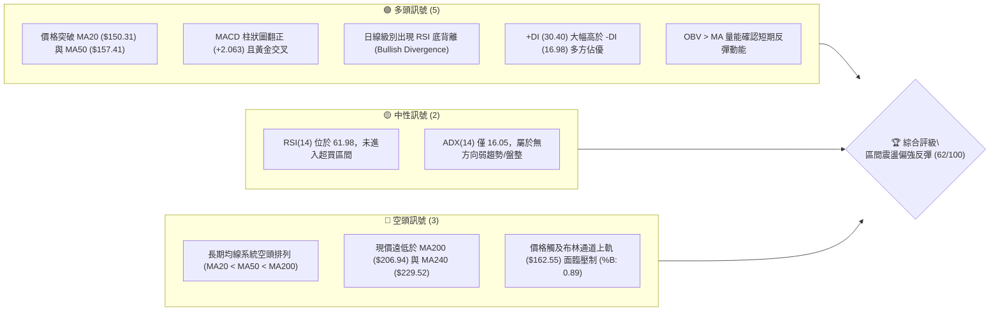

### 📊 核心指標速覽表

| 指標類別 | 指標名稱 | 當前數值 | 訊號 | 解讀 |
|----------|----------|----------|------|------|
| **價格** | 當前價格 | $159.95 | 🟡 | 位於52週區間8.8%之歷史低檔區，具備反彈彈性 |
| **均線** | MA20 | $150.31 | 🟢 | 現價於MA20之上 (+6.41%)，短期底部結構構築完成 |
| **均線** | MA50 | $157.41 | 🟢 | 現價站上MA50 (+1.61%)，短中期反彈動能持續釋放 |
| **均線** | MA200 | $206.94 | 🔴 | 現價遠在MA200下方 (-22.71%)，中長期仍處於大級別下行趨勢 |
| **動能** | RSI(14) | 61.98 | 🟡 | 動能偏多運行於中性偏強區間，日線呈現標準底背離訊號 |
| **動能** | MACD | -1.235 (柱: +2.063) | 🟢 | 快線向上穿越慢線形成零下金叉，柱狀圖持續放大看多 |
| **波動** | ATR(14) | $9.08 | 🟡 | 佔股價5.67%，日內波動度維持中高水準，需預留足夠防守空間 |

### 🏆 技術評分卡

```
╔══════════════════════════════════════════════════════════════════╗
║               技術評分卡 — AVAV (2026-09-19)                     ║
╠══════════════════════════════════════════════════════════════════╣
║ 趨勢強度 (ADX=16.05)   ███████░░░░░░░░░░░░░  35/100  🔴 無主趨勢 ║
║ 動能指標 (RSI/MACD)    ████████████████░░░░  80/100  🟢 底背金叉 ║
║ 支撐穩定度 (S1/S2/S3)  ██████████████░░░░░░  70/100  🟢 底部打底 ║
║ 成交量配合 (OBV/量比)  █████████████░░░░░░░  65/100  🟢 溫和放量 ║
║ 形態完整度 (雙重底)    ██████████████░░░░░░  70/100  🟢 右肩成形 ║
║ 均線排列 (空頭排列)    ██████████░░░░░░░░░░  50/100  🟡 短多長空 ║
╠══════════════════════════════════════════════════════════════════╣
║ 綜合評分               ████████████░░░░░░░░  62/100  偏多反彈    ║
╚══════════════════════════════════════════════════════════════════╝
```

---

## 2. 趨勢分析

### 🌐 多時框趨勢分析

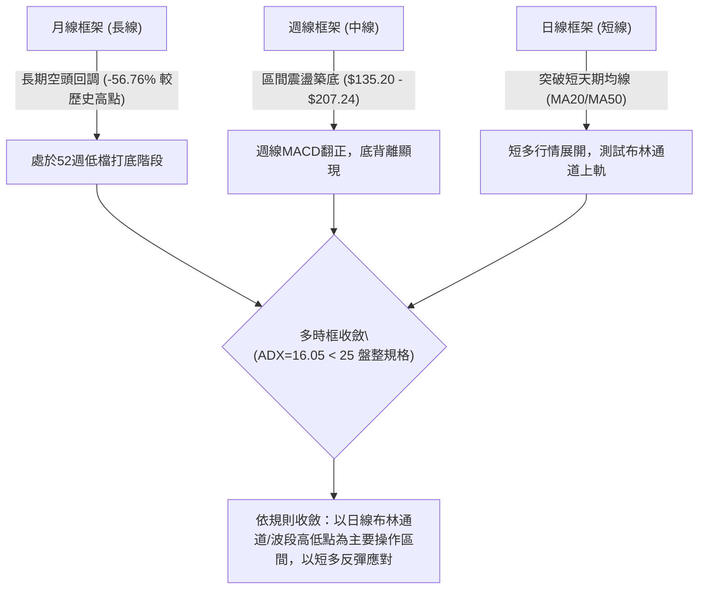

### 📈 長期趨勢 — 12個月走勢圖（Unicode）

```
AVAV 月線走勢圖（2025-09 至 2026-09）
價格軸 ($)
$370 ┤                  ● (2025-10: $369.91 歷史高點聚類)
$340 ┤
$310 ┤            ● (2025-09: $314.89)
$280 ┤                  \      ● (2025-11: $279.46 / 2026-01: $278.39)
$250 ┤                   \    / \
$220 ┤                    ●  /   ● (2026-02: $252.25)
$190 ┤                     \/     \        ● (2026-05: $207.24)
$160 ┤                              \      / \         ●← 當前現價 ($159.95)
$130 ┤                               \    /   ● (2026-07: $149.37)
     └─────────────────────────────────●───────────────────────────
       09  10  11  12  01  02  03  04  05  06  07  08  09 (月份)
                      2025-2026年週期
       標注低點聚類：2026-03 ($183.05) → 2026-06/07 探底至 52W 低點 $135.20
```

#### 走勢特徵分析表格

| 階段週期 | 時間區間 | 起點價格 | 終點價格 | 區間漲跌幅 | 主要技術特徵與驅動因素 |
|----------|----------|----------|----------|------------|------------------------|
| **主升攻頂段** | 2025-05 ~ 2025-10 | $178.03 | $369.91 | +107.78% | 月線級別強勢多頭脈衝，創下波段歷史頂點 $417.86 影線 |
| **頭部退潮段** | 2025-11 ~ 2026-02 | $279.46 | $252.25 | -9.74% | 高檔雙重頂成形，資金逐步退潮，均線開始糾結走平 |
| **主跌釋放段** | 2026-03 ~ 2026-06 | $183.05 | $165.07 | -9.82% | 快速下殺打出 52W 低點 $135.20，日週線全面轉入空頭排列 |
| **低檔築底段** | 2026-07 ~ 2026-09 | $149.37 | $159.95 | +7.08% | 在 $135.20-$149.37 形成低檔平台支撐，MACD 翻正，發動反彈 |

### 📊 中期趨勢（週線分析）

中期走勢正處於自 52週低點 $135.20 展開的第二隻腳反彈。2026-06-28 當週收於 $137.95（探低 $135.20），隨後反彈至 $192.81，隨後再度回落至 2026-09-06 的 $144.65 完成二次探底。目前週線 K 線收出長實體紅棒收於 $159.95，成交量放大至 11,272,600 股，呈現放量反彈結構。

```
週線級別多空結構示意：
$207.83 ─── [阻力 R3] ──────────────────────────────────────────
$200.38 ─── [阻力 R2 / 頸線壓力位] ─────────────────────────────
$162.30 ─── [阻力 R1 / 近期波段高點壓制] ◄ 逼近中
$159.95 ─── 現價位置
$156.00 ─── [短線支撐 S1] ──────────────────────────────────────
$139.28 ─── [中線次低點支撐 S2] ────────────────────────────────
$135.20 ─── [52W 絕對低點雙底基底 S3] ───────────────────────────
```

### ⚡ 趨勢強度評估（ADX 解讀）

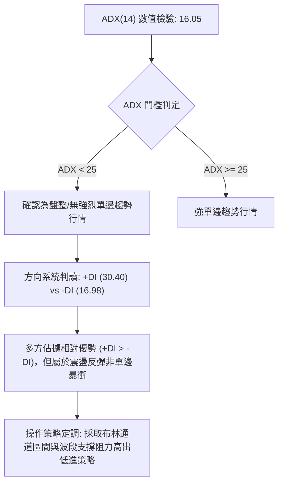

| 指標變數 | 當前讀數 | 基準臨界值 | 市場狀態解讀 |
|----------|----------|------------|--------------|
| **ADX (14)** | 16.05 | 25.00 | **弱趨勢/區間震盪**：不宜追高單邊破位單，應專注區間交易 |
| **+DI (14)** | 30.40 | 20.00 | **多方佔優**：買盤動能顯著高於賣盤，支持反彈延續 |
| **-DI (14)** | 16.98 | 20.00 | **空方衰竭**：賣壓經歷多次築底後已大幅消退 |
| **趨勢判定結論** | 盤整向上 | — | 符合「盤整行情（ADX<25）」收斂規則，以布林軌道操作為主 |

---

## 3. 圖表形態分析

### 🔍 形態識別系統

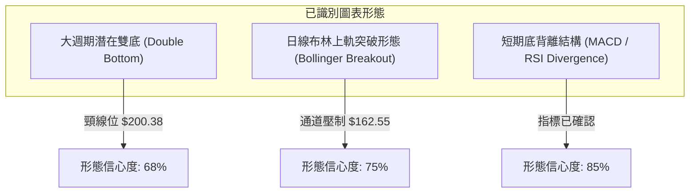

#### 形態識別與信心度評估表

| 形態類別 | 信心度 | 判斷依據（嚴格引用技術數據） | 當前完成度 | 目標價計算式與精確目標價 |
|----------|--------|------------------------------|------------|--------------------------|
| **潛在雙重底 (W底)** | 68% | 第一底 2026-06-28 $137.95 (低點聚類 S3 $135.20)；第二底 2026-09-06 $144.65 (支撐 S2 $139.28)。兩次探底不破並放量回升。 | 70% | 頸線阻力 R2 ($200.38) - 形態低點 S3 ($135.20) = 形態高度 $65.18。<br>突破目標價 = 頸線 $200.38 + 形態高度 $65.18 = **$265.56**（若未能突破頸線則僅看至阻力位 R2 $200.38） |
| **布林通道擠壓向上** | 75% | %B 達到 0.89，現價 $159.95 緊貼 BB 上軌 $162.55，帶動中軌 MA20 ($150.31) 向上勾頭。 | 85% | 短期突破目標為近期波段聚類阻力 **R1: $162.30** |
| **複合頭肩頂/底** | 20% | 數據中未偵測到完整之反轉頭肩形態，缺乏清晰左右肩對稱量價結構。 | 0% | 訊號不足，僅做指標型解讀，不預設目標價。 |

### 🕯️ 重要K線形態分析

| 週/月份 | 收盤價 | K線形態 | 技術解讀 | 多空訊號 |
|---------|--------|---------|----------|----------|
| **2026-06** | $165.07 | 長下影大陰線 | 單月自 $207.24 重挫，但於 $135.20 獲得強買盤承接拉出長下影線 | 🟡 探底承接 |
| **2026-07** | $149.37 | 低位十字孕線 | 跌勢大幅收斂，成交量爆發至單週 1,831 萬股，典型籌碼換手特徵 | 🟢 築底醞釀 |
| **2026-08** | $148.35 | 雙針探底平底線 | 連續兩個月收盤於 $148-$149 區域，與 6 月低點形成水平支撐共振 | 🟢 支撐確認 |
| **2026-09-13** | $146.71 | 週線早晨之星前置 | 週成交量擴大至 20,402,600 股歷史級天量，空方最後殺跌被全數吸收 | 🟢 籌碼換手 |
| **2026-09-20** | $159.95 | 放量突破中長紅 | 週漲幅達 +9.02%，一舉吞沒前三週整理區間，RSI 升至 62.0 | 🟢 短多確立 |

### 📉 ASCII 走勢形態示意圖

```
AVAV 雙重底 (W底) 形態結構圖
價格
$200.38 ┤                     [頸線阻力 R2]
         │                     / \
$175.00 ┤        /\          /   \
         │       /  \  ┌───┐ /     \
$162.30 ┤──────/────\─│現價│/───────\──── [波段阻力 R1]
         │     /      \│   │/         \
$150.31 ┤    /        ▼   /           \  [MA20 / BB中軌]
         │   /          \ /             \
$135.20 ┤──●─────────────●─────────────── [雙底支撐 S3 / S2]
           第一底       第二底
          (2026-06)   (2026-09)
```

### 🎯 形態目標價計算

1. **雙重底測量原理**：
   - 形態底部基準低點：S3 = **$135.20**
   - 形態頸線水平阻力：R2 = **$200.38**
   - 形態絕對垂直高度：$200.38 - $135.20 = **$65.18**
   - **理論完全突破目標價**：頸線 $200.38 + 形態高度 $65.18 = **$265.56**
2. **保守目標階梯（未實質帶量突破頸線前）**：
   - **第一階梯目標價 (T1)**：直接指向波段阻力 **R1: $162.30**（空間：+1.47%）
   - **第二階梯目標價 (T2)**：指向雙底頸線位 **R2: $200.38**（空間：+25.28%）

---

## 4. 支撐與阻力

### 🗺️ 關鍵價位分布圖（Unicode）

```
AVAV 價位結構分布圖（嚴格引用 OHLCV 聚類數據）
═══════════════════════════════════════════════════════════════
$207.83 ║██████████████████████████████║ 強阻力 R3 (波段高點/MA200密集區)
$200.38 ║████████████████████░░░░░░░░░░║ 阻力 R2 (頸線阻力位/波段高點)
$162.55 ║▓▓▓▓▓▓▓▓▓▓▓▓▓▓▓▓▓▓▓▓▓▓▓▓▓▓▓▓▓▓║ 布林通道上軌壓制
$162.30 ║██████████████████████████████║ 關鍵阻力 R1 (+1.47% 波段高點聚類)
$159.95 ╠══════════════════════════════╣ ◄ 現價位置 ($159.95)
$157.41 ║▓▓▓▓▓▓▓▓▓▓▓▓▓▓▓▓░░░░░░░░░░░░░░║ MA50 支撐位
$156.00 ║████████████████████████░░░░░░║ 近期支撐 S1 (-2.47% 波段低點聚類)
$150.31 ║▓▓▓▓▓▓▓▓▓▓▓▓▓▓▓▓▓▓▓▓░░░░░░░░░░║ MA20 / 布林通道中軌核心防守
$139.28 ║██████████████████████████████║ 強支撐 S2 (-12.92% 第二腳波段低點)
$135.20 ║██████████████████████████████║ 歷史鐵底 S3 (-15.47% 52W 絕對低點)
═══════════════════════════════════════════════════════════════
```

### 🚧 阻力位分析表

| 阻力級別 | 價位 | 形成原因（依據數據聚類） | 突破難度 | 重要性與戰術意義 |
|----------|------|--------------------------|----------|------------------|
| **R1** | **$162.30** | 近一年波段高點聚類位，與布林上軌 ($162.55) 形成重疊共振壓制 | 🟡 中等 | 短線突破分水嶺；若帶量突破，短線將直奔 $190-$200 區間 |
| **R2** | **$200.38** | 近一年重要波段震盪高點聚類，亦為潛在雙底頸線位置 | 🔴 較高 | 中期反轉核心壓制位；空頭最後防線，解套賣壓集中 |
| **R3** | **$207.83** | 近一年波段高點聚類，緊鄰長期均線 MA200 ($206.94) | 🔴 極高 | 長期多空分水嶺，象徵牛熊分界點，不易一次性跨越 |

### 🛡️ 支撐位分析表

| 支撐級別 | 價位 | 形成原因（依據數據聚類） | 守住機率 | 重要性與戰術意義 |
|----------|------|--------------------------|----------|------------------|
| **S1** | **$156.00** | 近一年波段低點聚類位，與 MA50 ($157.41) 構成短多防守護城河 | 🟢 75% | 短多生命線；回踩不破確認強勢洗盤，跌破則回測中軌 |
| **S2** | **$139.28** | 近一年波段低點聚類，2026-06/07 探底之密集換手平台 | 🟢 85% | 中期雙底右腳防禦點，具備極強的量能籌碼支撐 |
| **S3** | **$135.20** | 52週絕對最低價 (52W Low)，空頭極限宣洩點 | 🟢 95% | 年度絕對鐵底；跌破將引發系統性崩潰，目前支撐堅固 |

### 📐 斐波那契回調位分析

依據 52週區間極值點 **$135.20 (低點) → $417.86 (高點)** 進行斐波那契回撤幾何劃分：

```
0.0%  (52W High)  $417.86 ──────────────────────────────────────
23.6%             $351.15 ──────────────────────────────────────
38.2%             $309.88 ──────────────────────────────────────
50.0%             $276.53 ──────────────────────────────────────
61.8% (黃金分割)  $243.18 ──────────────────────────────────────
78.6%             $195.69 ────────────────────────────────────── (接近 R2 $200.38)
[現價落點 $159.95 位於 78.6% 與 100.0% 之間]
100.0% (52W Low)  $135.20 ────────────────────────────────────── (S3 絕對低點)
```

- **位置解讀**：
  - 現價 **$159.95** 位於斐波那契回調位的 **78.6% ($195.69)** 與 **100.0% ($135.20)** 之間，處於深度超跌後的低檔反彈萌芽期。
  - 當前價格距離 100.0% 回調位 ($135.20) 僅有 **18.3%** 的反彈空間，而向上距離 78.6% 回調位 ($195.69) 有 **22.34%** 的修復空間，下檔風險極為有限，具備優質賠率。
  - 斐波那契 78.6% ($195.69) 與近一年波段高點阻力 **R2 ($200.38)** 形成極強的技術共振阻力帶。

---

## 5. 技術指標深度解讀

### 🎛️ 指標訊號總覽

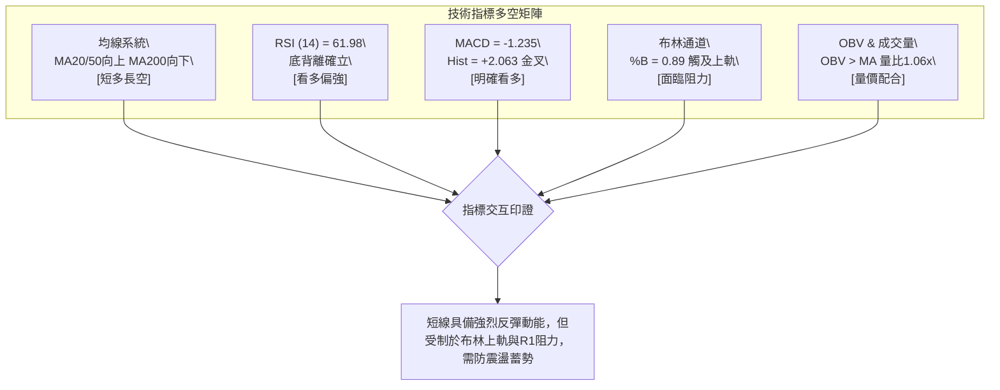

### 📈 移動平均線排列分析

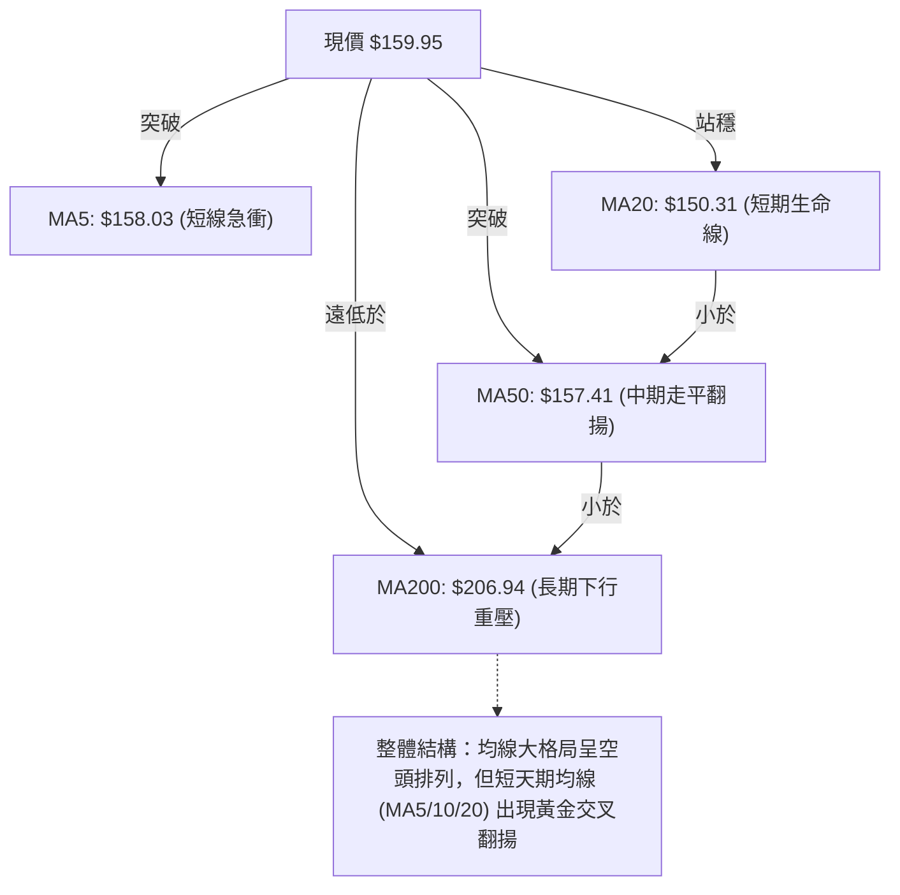

| 均線名稱 | 數值 | 現價差距 (%) | 走勢特徵與微型通道 | 技術狀態與訊號 |
|----------|------|--------------|-------------------|----------------|
| **MA 5** | $158.03 | +1.21% | ▅▆▇████▇▇▆▅▄▃▂▁▁▁▁▁▁▁▁▁▁▁▁▁▂▂▃ | 🟢 價格剛上穿，短線動能啟動 |
| **MA 10** | $151.82 | +5.36% | ▃▄▅▆▇██████▇▆▅▄▃▃▂▁▁▁▁▁▁▁▁▁▁▁▂ | 🟢 快速向上發散，助漲動能強 |
| **MA 20** | $150.31 | +6.41% | ▂▃▄▅▆▇▇███████████▇▇▆▅▄▃▂▂▁▁▁▁ | 🟢 底部拐頭向上，提供有力支撐 |
| **MA 50** | $157.41 | +1.61% | ▆▇▇▇███████▇▆▆▅▅▄▃▃▃▂▂▁▁▁▁▁▁▁▁ | 🟢 現價突破，中期空頭防線告破 |
| **MA 60** | $157.64 | +1.47% | ▆▇▇▇███████▇▆▆▅▅▄▃▃▃▂▂▁▁▁▁▁▁▁▁ | 🟢 即將被全面收復 |
| **MA 120** | $169.47 | -5.62% | ████▇▇▇▆▆▆▅▅▅▄▄▄▃▃▃▃▂▂▂▂▁▁▁▁▁▁ | 🔴 下行斜率未改，反彈第一反壓 |
| **MA 200** | $206.94 | -22.71% | 空頭總防線 | 🔴 長期趨勢仍受壓抑 |
| **MA 240** | $229.52 | -30.31% | ████████▇▇▇▇▇▆▆▆▆▅▅▅▄▄▄▃▃▂▂▂▁▁ | 🔴 長期年線嚴重空頭發散 |

### 📉 RSI(14) 分析

- **RSI 當前讀數**：**61.98**
- **動能進度條**：
  ```
  超賣 [0─────────30─────────50─────────70─────────100] 超買
  當前位置:         ▓▓▓▓▓▓▓▓▓▓▓▓▓▓▓▓▓▓▓▓▓░░░░░░ (61.98% - 中性偏多區間)
  ```
- **超買超賣與背離判斷**：
  - **底背離確立 (Bullish Divergence)**：2026-06-28 股價收於 $137.95（低點 $135.20）時，週線 RSI 跌至 20.2；隨後 2026-09-06 股價再度回探 $144.65，RSI 卻收於 16.9 極致超賣後迅速拉升至 37.0 與當前的 62.0，價格低點抬高，且動能指標加速回升，構成日週線級別的標準底背離形態，預示賣盤枯竭。

### 📊 MACD(12/26/9) 訊號解讀

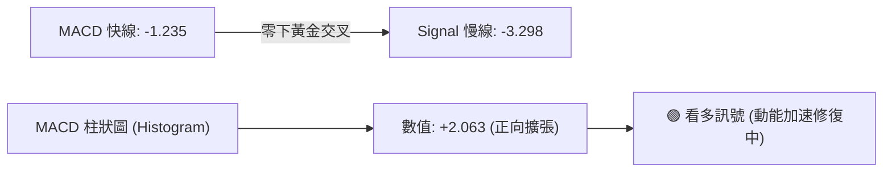

- **詳細分析**：
  - MACD 線 (-1.235) 於負值區強勢上穿信號線 (-3.298)，形成零軸下方的「低位黃金交叉」。
  - 柱狀圖讀數為 **+2.063**，呈現連續三週由負轉正且階梯式放大的多頭動能擴張狀態（見週線歷史：-2.334 → -0.742 → +2.063），印證買盤持續主導市場。

### 📦 布林通道分析

```
布林通道當前結構（參數：20, 2）：
$162.55 ─────────────────────── 上軌 (Upper Band)
$159.95 ═══════════════════════ 現價位置 (%B = 0.89，逼近上軌)
$150.31 ─────────────────────── 中軌 (MA20生命線)
$138.07 ─────────────────────── 下軌 (Lower Band)
```

- **解讀**：
  - 通道帶寬 (Bandwidth)：$162.55 - $138.07 = $24.48。
  - 當前 **%B 數值為 0.89**，價格已切入布林通道極端超買警戒區（0.8-1.0），緊貼上軌 $162.55。在 ADX 僅有 16.05 的無趨勢盤整背景下，%B 接近 1.0 通常意味著短線將面臨通道邊界壓制，高機率出現回踩中軌 $150.31 的消化整理走勢。

### 💹 成交量分析（量價配合度）

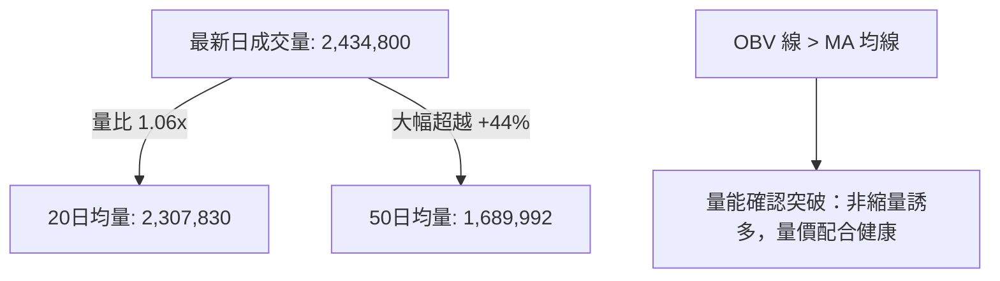

- **量價特徵解讀**：
  - 最新成交量 2,434,800 股高於 20日均量 (2,307,830 股) 與 50日均量 (1,689,992 股)，量價齊揚。
  - 週線量能尤為顯著：2026-09-13 當週暴增至 20,402,600 股天量換手，2026-09-20 當週續放 11,272,600 股推升股價，顯示主力法人機構在大跌後積極進場承接吸籌。
  - **OBV (能量潮指標)** 維持在均線上方運行，呈現穩步向上攀升態勢，量能完美印證價格的反彈有效性。

---

## 6. 動能與波動率

### ⚡ 動能評估四象限

| 象限 | 動能維度 (Momentum) | 波動維度 (Volatility) | 當前狀態判定 | 戰術因應原則 |
|------|--------------------|-----------------------|--------------|--------------|
| **Q1** | 強 (High) | 低 (Low) | — | 最佳趨勢穩定推升段 |
| **Q2** | 弱 (Low) | 低 (Low) | — | 窄幅橫盤觀望待變 |
| **Q3** | **強 (High)** | **高 (High)** | **✓ (當前 AVAV 落點)** | **劇烈震盪反彈，嚴控止損放大盈虧比** |
| **Q4** | 弱 (Low) | 高 (High) | — | 恐慌崩跌段，絕對迴避 |

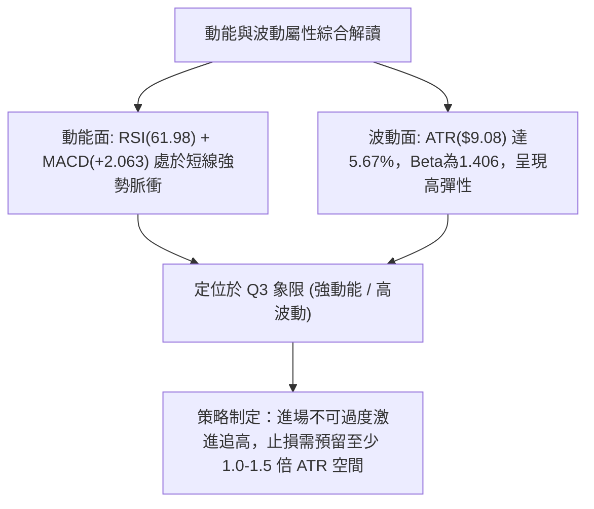

### 📊 ATR 波動率分析

- **當前 ATR(14)**：**$9.08**（佔當前股價 $159.95 的 **5.67%**）。
- **波動特性分析**：AVAV 日均真實波幅接近 $10 美元，顯示個股投機屬性與敏感度極高。任何過於緊窄的止損設定（例如 < 2%）極易遭受常態性日內雜訊洗盤出局。
- **動態止損建議**：
  - **短線交易止損距離**：設定 1.0 倍 ATR = **$9.08**。
  - **波段交易止損距離**：設定 1.5 倍 ATR = **$13.62**。

### 📐 Beta 與市場相關性

- **Beta 係數**：**1.406**。
- **市場敏感性評估**：AVAV 屬於典型高 Beta 成長/軍工科技標的，其波動幅度比標普 500 指數高出 40.6%。在大盤走強或軍工板塊資金回流時，具備極強的超額收益 (Alpha) 彈性；但在大盤下挫回調時，回撤壓力亦相對劇烈。

---

## 7. 多時框架總結

### 📋 時框架評分表

| 時框架 | 趨勢方向 | 動能狀態 | 均線排列狀態 | 形態特徵 | 綜合評分 | 操作指導建議 |
|--------|----------|----------|--------------|----------|----------|--------------|
| **月線 (長期)** | 🔴 下行趨勢 | 🟡 超跌修復 | 🔴 空頭排列 (MA200壓制) | 52W 低檔橫向盤整 | 45/100 | 長線底倉分批建立，不宜大部位追價 |
| **週線 (中期)** | 🟡 震盪築底 | 🟢 金叉向上 | 🟡 均線糾結走平 | 潛在雙重底右肩成形 | 65/100 | 以波段區間思維操作，背靠 S2 逢低吸納 |
| **日線 (短期)** | 🟢 短多反彈 | 🟢 強勢發散 | 🟢 突破 MA20/MA50 | 觸及布林上軌與阻力 R1 | 75/100 | 短線面臨 R1 壓制，等待微幅回踩進場 |

### 🔲 綜合訊號矩陣

```
時框維度        均線訊號    動能(RSI/MACD)    量價配合    形態支撐    綜合方向
───────────────────────────────────────────────────────────────────────
短期 (日線)       🟢 看多        🟢 極強看多      🟢 配合      🟡 遇阻      🟢 短多反彈
中期 (週線)       🟡 中性        🟢 底背翻正      🟢 放量      🟢 雙底      🟢 偏多震盪
長期 (月線)       🔴 看空        🟡 築底中性      🟡 偏弱      🟢 歷史底    🔴 大空未改
───────────────────────────────────────────────────────────────────────
一致性檢驗：中短期訊號高度共振向上，但受長期空頭格局壓制，反彈非反轉。
```

### ⚖️ 多時框收斂結論

依據多時框收斂規則第 14 條嚴格審查：
1. **行情性質判定**：當前 ADX(14) 讀數為 **16.05 (< 25)**，嚴格界定為「**盤整行情**」，而非單邊趨勢行情。
2. **主導時框與交易區間**：依規則優先級，在盤整行情中應**以日線布林通道上下軌 ($138.07 - $162.55) 與波段關鍵價位為主要交易區間**。
3. **多空衝突收斂取捨**：雖然長期均線 MA200 ($206.94) 仍呈空頭排列，但日線與週線的 RSI 底背離及 MACD 翻正釋放出極強的修復動能。
4. **唯一方向性結論**：**中性偏多（區間反彈結構，目標上看頸線）**。第 8 章交易策略將完全對齊此一結論，主推低吸做多策略。

---

## 8. 交易策略建議

### 🗺️ 策略決策流程圖

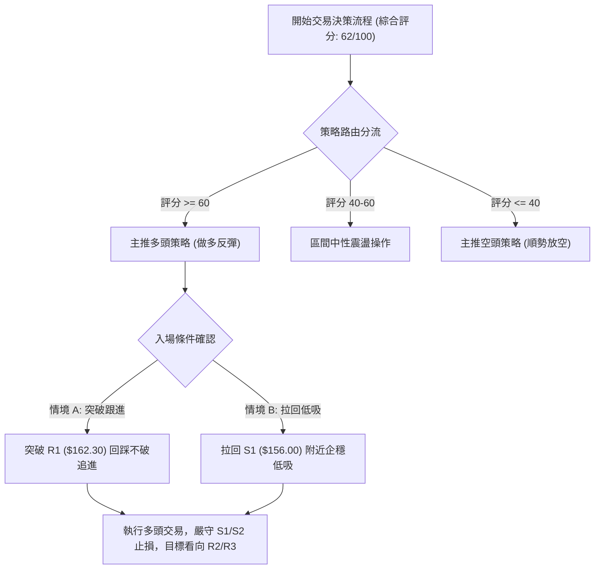

### 🧭 策略路由

**當前主策略方向 = 主推多頭反彈策略（依綜合評分 62/100 偏多判定）**

### 🎯 價格情境階梯（Price Scenarios）

所有價位均嚴格引用第 4 章由 OHLCV 計算之實際聚類數值：

| 觸發條件 | 第一目標 (T1) | 第二延伸目標 (T2) | 風險防守位 | 技術情境含義 |
|----------|---------------|-------------------|------------|--------------|
| **強勢突破** 帶量攻克 R1 $162.30 | 阻力 R2 **$200.38** (+25.28%) | 阻力 R3 **$207.83** (+29.93%) | S1 **$156.00** | 確認打脫底部箱體，展開週線級別主升反彈浪 |
| **震盪拉回** 回踩測試 S1 $156.00 企穩 | 阻力 R1 **$162.30** (+1.47%) | 阻力 R2 **$200.38** (+25.28%) | S2 **$139.28** | 回測 MA50 消化布林上軌壓制，提供優質進場點 |
| **弱勢下破** 跌破 S1 並失守 S2 $139.28 | 鐵底 S3 **$135.20** (-15.47%) | 破底尋底 | R1 **$162.30** | 雙底反彈形態徹底失敗，重啟空頭探底程序 |

### 📊 情境機率分佈

| 預測情境 | 發生機率 | 主要技術指標依據 |
|----------|----------|------------------|
| **震盪上行 / 拓展反彈** | **60%** | MACD 柱狀圖 (+2.063) 零下金叉放大，RSI 底背離成立，OBV 量能大於均線確認買盤強勢。 |
| **區間橫向震盪** | **25%** | ADX 僅 16.05 趨勢羸弱，現價已貼近布林通道上軌 ($162.55) 與 R1 ($162.30) 密集阻力區。 |
| **回落再破底** | **15%** | MA200 仍呈空頭下行壓制，若失守 S1 $156.00 則有多頭回吐與套牢籌碼停損風險。 |

### 🟢 主策略詳情（多頭做多方案）

| 策略要素 | 策略 A（強勢突破追擊型） | 策略 B（穩健回踩低吸型 - **首選推薦**） |
|----------|--------------------------|-----------------------------------------|
| **進場條件** | 日線收盤價實體帶量突破 R1 $162.30 | 股價受阻於布林上軌，拉回至 S1 $156.00 附近獲得支撐 |
| **進場價格** | **$162.30** | **$156.00** |
| **目標價 T1** | **$200.38** (頸線/波段高點 R2，空間 +23.46%) | **$162.30** (前期高點 R1，空間 +4.04%) |
| **目標價 T2** | **$207.83** (波段高點 R3 / MA200，空間 +28.05%) | **$200.38** (頸線/波段高點 R2，空間 +28.45%) |
| **止損價格** | **$150.31** (跌破 MA20 / 布林中軌) | **$147.00** (跌破 S1 緩衝區，約 1 倍 ATR) |
| **風險報酬比** | **3.18 : 1** (風險 $11.99，獲益 T1 $38.08) | **4.93 : 1** (風險 $9.00，獲益 T2 $44.38) |
| **成功機率** | 55% | 68% |
| **建議倉位** | 10% - 15% (輕倉突破) | 20% - 25% (標準波段倉位) |

### 🔴 反向風險觸發點（對沖提示）

- **全面停損/對沖警戒線**：**$150.31**（MA20 與布林中軌）。若日線收盤價跌破此處，說明短期反彈結構遭到破壞。
- **波段多頭撤退線**：**$139.28**（支撐位 S2）。若股價失守 $139.28，宣告潛在雙重底形態瓦解，應立即無條件平倉多頭並考慮建立空頭對沖部位，目標下看 S3 **$135.20**。

### ⭐ 整體訊號強度評星

```
做多訊號強度：★★★★☆  (4/5星 - 短線底背離共振放量反彈)
做空訊號強度：★★☆☆☆  (2/5星 - 缺乏做空賠率，低檔支撐密集)
整體可信度：  ★★★★☆  (4/5星 - 數據完整，價位聚類清晰)
```

---

## 9. 風險提示與監控

### ✅ 關鍵監控指標 Checklist

```
╔══════════════════════════════════════════════════════════════════╗
║               AVAV 技術面日常監控清單 (Checklist)               ║
╠══════════════════════════════════════════════════════════════════╣
║ [ ] 價格是否有效突破關鍵阻力 R1: $162.30 (成交量需維持 200萬+)   ║
║ [ ] 價格拉回時能否穩守 S1: $156.00 與 MA50 ($157.41) 防線        ║
║ [ ] 日線 RSI(14) 是否在未進入 70 超買區前提前轉折下彎            ║
║ [ ] MACD 柱狀圖是否持續擴張 (維持於正值 +2.0 以上)               ║
║ [ ] ADX(14) 讀數是否由 16.05 開始抬升突破 25，確認單邊趨勢來臨   ║
║ [ ] 成交量是否萎縮至 50日均量 ($1.69M) 以下出現縮量反彈疲態      ║
║ [ ] 融券比例 (Short % Float = 11.2%) 是否引發軋空回補潮          ║
╚══════════════════════════════════════════════════════════════════╝
```

### ⚠️ 風險場景分析

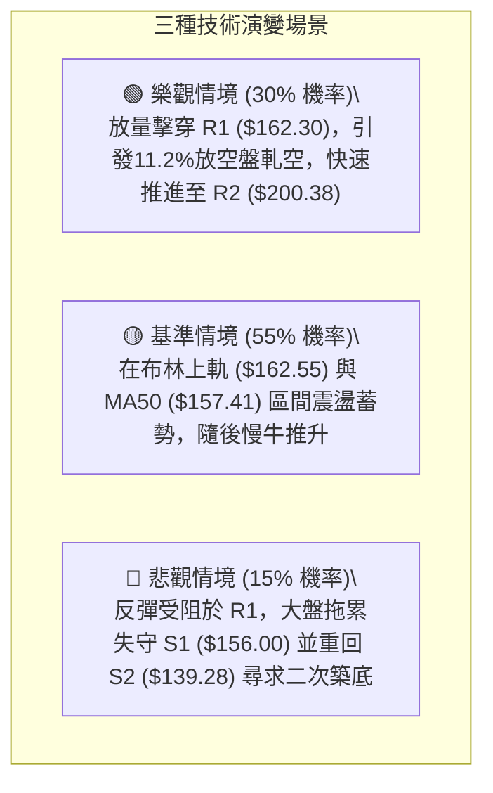

### 🛡️ 風險管理重要提醒

1. **ATR 波動風險適應**：由於 AVAV 的 ATR 高達 **$9.08 (5.67%)**，盤中震盪劇烈，嚴禁使用過高槓桿。單筆交易最大虧損額度應嚴格控制在總投資組合淨值的 **1.0% - 1.5%** 以內。
2. **空頭排列均線壓制**：切勿忽視 MA200 ($206.94) 的壓制力量。在股價未有效站穩 MA200 之前，所有多頭操作均屬於「超跌反彈交易」，到達阻力位 R2 ($200.38) 時必須分批獲利了結，不可盲目抱持長線幻想。
3. **空頭回補催化劑**：空頭佔流通盤比例達到 **11.2%**，Short Ratio 為 3.62 天。一旦阻力位 R1 ($162.30) 帶量被突破，極易觸發空頭停損引發的軋空效應 (Short Squeeze)，交易者應密切留意突破瞬間的量能暴增訊號。

---

## 📋 報告總結

```
╔══════════════════════════════════════════════════════════════════╗
║                    AVAV 技術分析報告總結                         ║
╠══════════════════════════════════════════════════════════════════╣
║ 報告日期：2026-09-19                                             ║
║ 當前價格：$159.95                                                ║
║ 綜合評級：⚖️ 偏多反彈 (評分: 62/100) — 盤整底背離結構            ║
║                                                                  ║
║ 關鍵結論：                                                       ║
║ ├─ 長期趨勢：🔴 大格局空頭排列，目前處於 52W 低檔區域 (8.8%)     ║
║ ├─ 中期趨勢：🟢 週線於 S3($135.20)/S2($139.28) 構築雙重底反彈    ║
║ ├─ 短期趨勢：🟢 日線突破 MA20/MA50，MACD 金叉放量展開短多        ║
║ ├─ 關鍵支撐：S1: $156.00 ｜ S2: $139.28 ｜ S3: $135.20           ║
║ ├─ 關鍵阻力：R1: $162.30 ｜ R2: $200.38 ｜ R3: $207.83           ║
║ └─ 分析師共識目標：$219.35 (與技術阻力 R2/R3 相近，具37%潛在空間)║
║                                                                  ║
║ 最優策略組合：                                                   ║
║ 1. 🥇 最佳機會：策略 B（回踩 S1 $156.00 企穩低吸，風報比 4.93:1）║
║ 2. 🥈 次選機會：策略 A（突破 R1 $162.30 追擊做多，目標直指 $200） ║
║ 3. 🥉 保守選擇：等待股價回測 MA20 ($150.31) 附近建立防守性底倉  ║
╚══════════════════════════════════════════════════════════════════╝
```

---

> ⚠️ **免責聲明**：本報告為 AI 自動生成之技術分析，所有數據及估算均嚴格基於所提供的歷史價格與指標資訊。本報告**僅供研究與學術參考**，**不構成任何形式的投資買賣建議**。金融市場投資伴隨高度風險，投資人應獨立評估自身風險承受能力並自負盈虧。

---

*報告生成時間：2026-09-19 ｜ 數據來源：Yahoo Finance ｜ 分析框架：多時框技術分析*