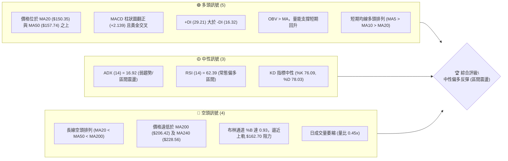
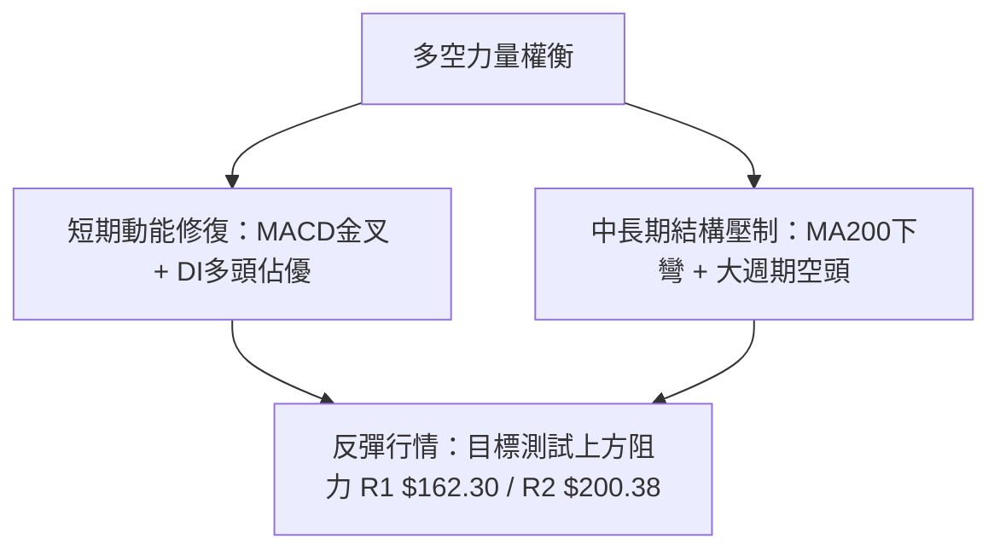
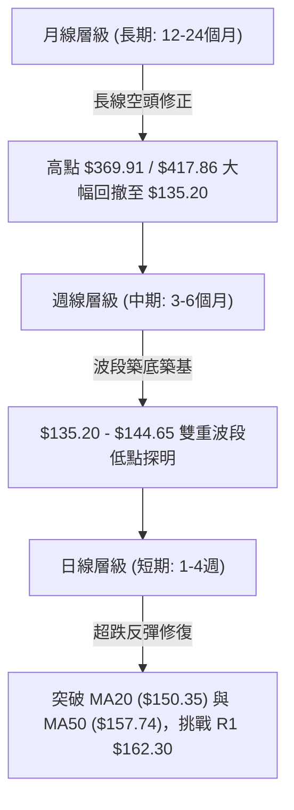
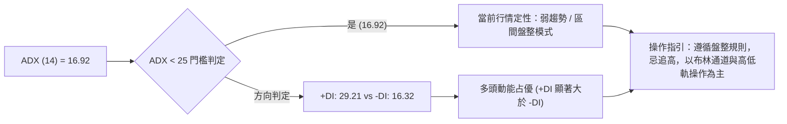
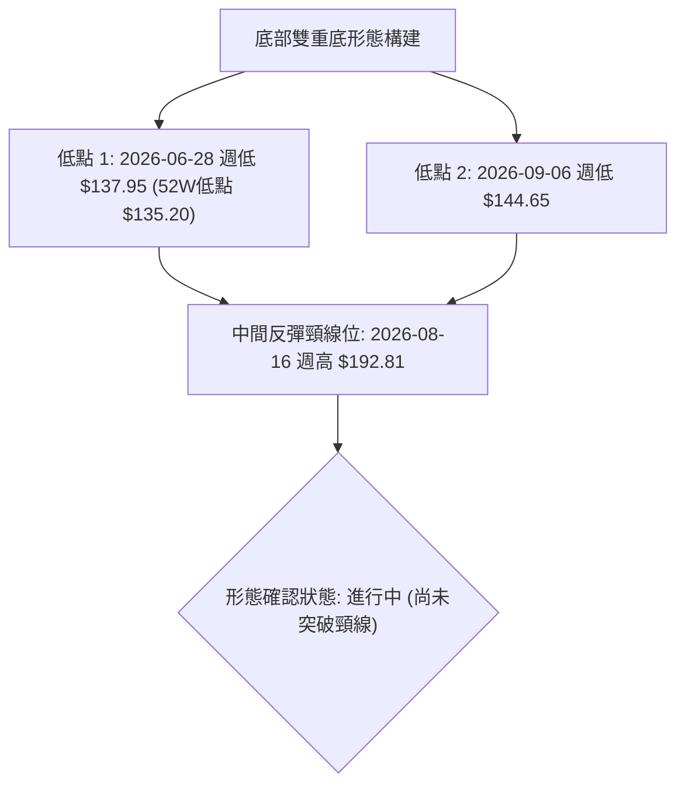
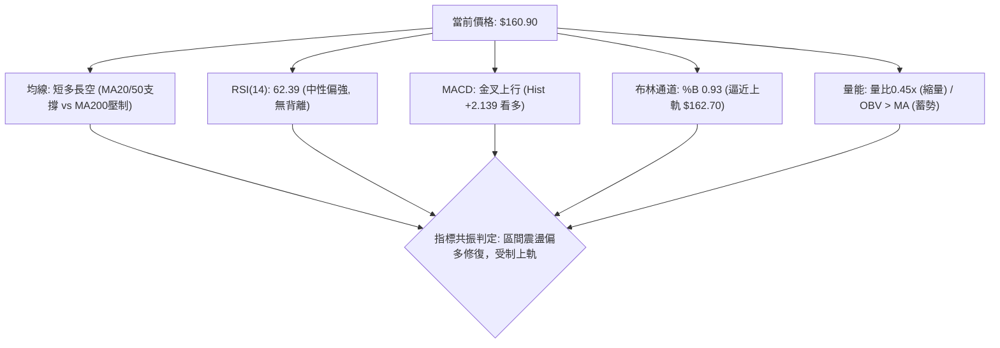
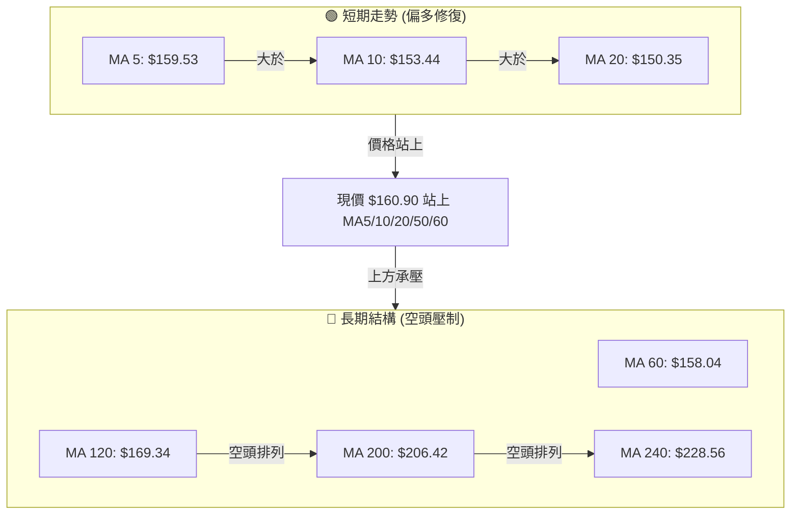
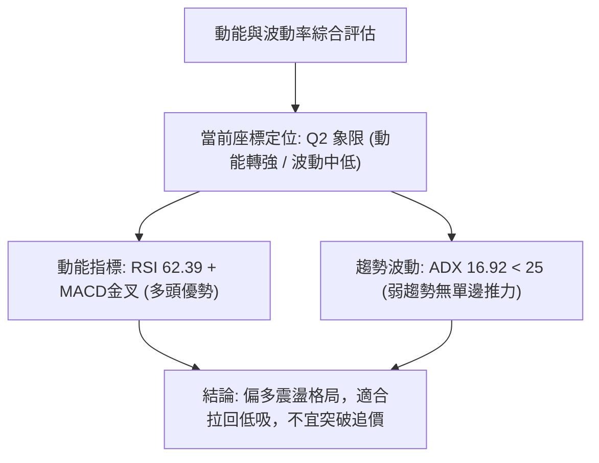
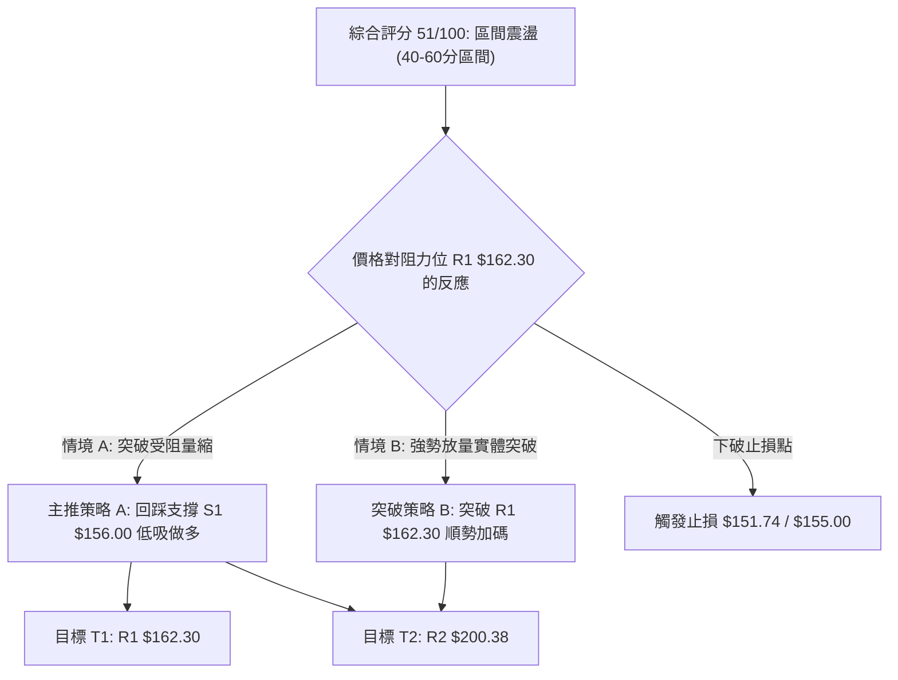
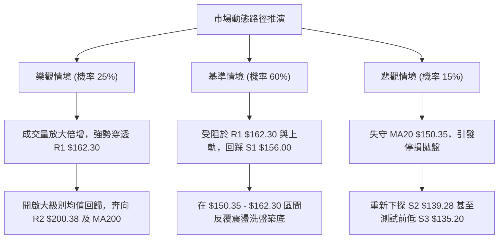

# AVAV 技術分析報告

> **報告日期**：2026-09-22 ｜ **語言**：繁體中文 ｜ **數據來源**：Yahoo Finance ｜ **當前價格**：$160.90

---

## 目錄

| 章節 | 內容 |
|------|------|
| [1. 技術面概覽](#1-技術面概覽) | 訊號儀表板、核心指標、評分卡 |
| [2. 趨勢分析](#2-趨勢分析) | 多時框趨勢、長中短期走勢 |
| [3. 圖表形態分析](#3-圖表形態分析) | 形態識別、K線組合、目標價 |
| [4. 支撐與阻力](#4-支撐與阻力) | 關鍵價位、斐波那契回調 |
| [5. 技術指標深度解讀](#5-技術指標深度解讀) | MA/RSI/MACD/布林/成交量 |
| [6. 動能與波動率](#6-動能與波動率) | 動能評估、ATR、Beta |
| [7. 多時框架總結](#7-多時框架總結) | 時框架評分矩陣 |
| [8. 交易策略建議](#8-交易策略建議) | 多空策略、風險報酬比 |
| [9. 風險提示與監控](#9-風險提示與監控) | 監控指標、風險場景 |

---

## 1. 技術面概覽

### 🎯 技術訊號儀表板





### 📊 核心指標速覽表

| 指標類別 | 指標名稱 | 當前數值 | 訊號 | 解讀 |
|----------|----------|----------|------|------|
| **價格** | 當前價格 | $160.90 | 🟢 | 自波段低點 $135.20 築底反彈，突破 MA50 |
| **均線** | MA20 | $150.35 | 🟢 | 價格在 MA20 上方 +7.02%，短期月線轉為強支撐 |
| **均線** | MA50 | $157.74 | 🟢 | 價格站上季線 +2.00%，短中期趨勢偏多修復 |
| **均線** | MA200 | $206.42 | 🔴 | 價格低於年線 -22.05%，長期宏觀趨勢仍處空頭 |
| **動能** | RSI(14) | 62.39 | 🟡 | 位於 50-70 擴張區，多頭主導但尚未超買 |
| **動能** | MACD | -0.624 / -2.763 | 🟢 | MACD 線穿過訊號線，Hist 柱狀圖 +2.139 擴張看多 |
| **趨勢** | ADX(14) | 16.92 | 🟡 | 數值 < 25，表明缺乏單邊強趨勢，屬底部位盤整 |
| **方向** | DMI (+/-DI) | +DI 29.21 / -DI 16.32 | 🟢 | 多方力量顯著高於空方，買盤掌握短線主動權 |
| **通道** | 布林通道 %B | 0.93 | 🔴 | 貼近上軌 $162.70，面臨布林帶頂部超買壓制 |
| **量能** | 量比 / OBV | 0.45x / OBV > MA | 🟡 | OBV 趨勢支撐反彈，但最新單日成交量顯著萎縮 |
| **波動** | ATR(14) | $9.16 | 🟡 | ATR 佔比 5.69%，單日波動空間充沛，風控需留緩衝 |

### 🏆 技術評分卡

```
╔══════════════════════════════════════════════════════════════╗
║              技術評分卡 — AVAV (2026-09-22)                  ║
╠══════════════════════════════════════════════════════════════╣
║ 趨勢強度      ██████░░░░░░░░░░░░░░  32/100  🟡 弱趨勢/低ADX   ║
║ 動能指標      ██████████████░░░░░░  70/100  🟢 MACD金叉/多頭  ║
║ 支撐穩定度    ████████████░░░░░░░░  62/100  🟢 S1 $156.00 築底║
║ 成交量配合    ████████░░░░░░░░░░░░  42/100  🟡 OBV佳但量萎縮  ║
║ 形態完整度    ████████████░░░░░░░░  60/100  🟡 潛在雙重底構建 ║
║ 均線排列      ████████░░░░░░░░░░░░  40/100  🔴 短強長弱/長空  ║
╠══════════════════════════════════════════════════════════════╣
║ 綜合評分      ███████████░░░░░░░░░  51/100  ⚖️ 區間震盪/偏多 ║
╚══════════════════════════════════════════════════════════════╝
```

---

## 2. 趨勢分析

### 🌐 多時框趨勢分析



### 📈 長期趨勢 — 12個月走勢圖（Unicode）

```
AVAV 月線走勢圖（過去12個月：2025-10 至 2026-09）
價格軸 ($)
$370 ┤●(歷史次高 $369.91)
$340 ┤ 
$310 ┤   
$280 ┤    ●(11月 $279.46)     ●(1月 $278.39)
$250 ┤          ●(12月 $241.89)     ●(2月 $252.25)
$220 ┤                                    ●(5月 $207.24)
$190 ┤                                  ●(4月 $195.02)
$160 ┤                        ●(3月 $183.05)        ●(6月 $165.07)  ●(9月現價 $160.90)
$130 ┤                                                    ●(7月 $149.37) ●(8月 $148.35)
     └────────────────────────────────────────────────────────────────────────────
       25-10  25-11  25-12  26-01  26-02  26-03  26-04  26-05  26-06  26-07  26-08  26-09
```

**走勢特徵分析表格**：

| 階段區間 | 月份週期 | 價格區間 ($) | 漲跌幅度 | 走勢結構與特徵解讀 |
|----------|----------|--------------|----------|--------------------|
| 頂部回落期 | 2025-10 ~ 2025-12 | $369.91 → $241.89 | -34.61% | 自 52 週高點 $417.86 回落，月線大陰線跌破短天期均線，形成頭部賣壓。 |
| 次高反彈期 | 2026-01 ~ 2026-02 | $241.89 → $278.39 | +15.09% | 跌深反彈測試上方下降趨勢線，於 $278.39 遇阻力承壓回落，形成較低高點 (LH)。 |
| 主跌加速期 | 2026-02 ~ 2026-06 | $278.39 → $165.07 | -40.71% | 跌勢凌厲，連續跌破整數關卡，各均線全面轉為下行，投降式賣盤湧現。 |
| 低檔築底期 | 2026-07 ~ 2026-09 | $149.37 → $160.90 | +7.72% | 探測 52 週低點 $135.20 後，在 $148 區間獲得支撐，9月收盤反彈至 $160.90。 |

### 📊 中期趨勢（週線分析）

中期走勢顯示，AVAV 在歷經 2026 年 6 月底殺跌至 $137.95 及 52 週低點 $135.20 後，開始步入籌碼沉澱區。

```
AVAV 週線近期阻力與支撐示意圖
$207.83 ─────────────────────────── [R3 強阻力 / 5月反彈高點 $207.24 聚類]
$200.38 ─────────────────────────── [R2 阻力 / MA200年線壓制位 $206.42]
$162.30 ───┬─────────────────────── [R1 關鍵阻力 / 布林上軌 $162.70]
$160.90 ───┼─► [當前收盤價位]
$156.00 ───┴─────────────────────── [S1 近期支撐 / MA50季線 $157.74 聚類]
$139.28 ─────────────────────────── [S2 波段支撐 / 6月底低點 $137.95 聚類]
$135.20 ─────────────────────────── [S3 52週極限支撐 / 年內最低點]
```

### ⚡ 趨勢強度評估（ADX 解讀）



**ADX 趨勢強度指標對照表**：

| 指標變數 | 當前讀數 | 門檻區間 | 趨勢狀態判定 | 交易決策指引 |
|----------|----------|----------|--------------|--------------|
| **ADX(14)** | 16.92 | < 20 (極弱) / < 25 (弱) | 盤整震盪無趨勢 | 趨勢策略（突破追價）失效；震盪指標與區間高拋低吸有效。 |
| **+DI** | 29.21 | 基準線 20 以上 | 多方動能轉強 | 短期多頭佔據主導，價格推升力道來自於底部超賣後的買盤回補。 |
| **-DI** | 16.32 | 基準線 20 以下 | 空方賣壓衰竭 | 空方壓制力量退潮，短線不易出現崩跌式單邊下殺。 |

---

## 3. 圖表形態分析

### 🔍 形態識別系統



**圖表形態信心度評估表**：

| 形態名稱 | 信心度 | 判斷依據（引用數據） | 完成度 | 目標價（附精確計算式） |
|----------|--------|----------------------|--------|------------------------|
| **潛在雙重底 (W底)** | 62% | 低點1為 $135.20（及6/28收盤$137.95），低點2為9/6收盤$144.65（墊高），頸線取8/16收盤$192.81。 | 55% | 若突破頸線 $192.81，形態高度 = $192.81 - $135.20 = $57.61。推算目標價 = $192.81 + $57.61 = **$250.42**。 |
| **布林通道破軌反彈** | 80% | 價格自布林下軌 $137.99 獲得支撐反彈，目前收盤 $160.90 站上中軌 $150.35。 | 90% | 依布林通道上軌量度目標為 **$162.70**（現已逼近）。 |
| **下降通道整理** | 45% | 信心度 < 50%，自高點 $369.91 回落以來斜率不一，且缺乏第三個標準上軌接觸點，數據不足以支撐幾何形態，轉為指標型解讀。 | N/A | 訊號不足，僅做指標型解讀，不預設目標價。 |

### 🕯️ 重要K線形態分析

| 週週期 / 月份 | 收盤價 ($) | K線形態特徵 | 市場心理與技術解讀 | 訊號評級 |
|---------------|------------|-------------|--------------------|----------|
| **2026-06-28** | $137.95 | 長下影大陰線 | 恐慌盤湧出打出 52 週低點 $135.20，成交量擴大至 1,188 萬股，空頭衰竭。 | 🟡 止跌信號 |
| **2026-07-05** | $190.89 | 巨量吞噬長陽線 | 成交量爆量至 1,831 萬股，單週大漲 38.38%，主力機構大幅低位建倉。 | 🟢 強烈看多 |
| **2026-08-16** | $192.81 | 高位受阻倒錘頭 | 反彈觸及阻力位未果，留下長上影線，暗示上方賣壓沉重，波段反彈暫告段落。 | 🔴 承壓回落 |
| **2026-09-06** | $144.65 | 低檔十字星/長下影 | RSI 降至 16.9 極端超賣區，空頭動能完全衰竭，次級底部成功確認。 | 🟢 底部確認 |
| **2026-09-13** | $146.71 | 天量十字星孕線 | 單週成交量暴增至 2,040 萬股（20週最高），換手充分，多空轉折確立。 | 🟢 轉折信號 |
| **2026-09-20** | $159.95 | 實體大陽線 | 放量上攻收復 MA20 及 MA50，MACD 柱狀圖正式轉正 (+2.063)。 | 🟢 突破確認 |
| **2026-09-27** | $160.90 | 小陽線緩步推升 | 續創波段收盤新高，但週初成交量萎縮，面臨 R1 $162.30 阻力考驗。 | 🟡 謹慎偏多 |

### 📉 ASCII 走勢形態示意圖

```
AVAV 近期底部形態示意圖（2026-06 至 2026-09）
$200 ┤                   [波段反彈高點 $192.81 (頸線)]
$190 ┤                      ▲
$180 ┤                     / \
$170 ┤                    /   \                     ▲ [現價 $160.90]
$160 ┤                   /     \                   /
$150 ┤                  /       \                 /  
$140 ┤  ▲              /         \   ▲          /
$130 ┤   \            /            \ / \________/
         ▼           /              ▼
     [低點1: $135.20]          [低點2: $144.65 (底底高)]
     (2026-06-28)              (2026-09-06)
```

### 🎯 形態目標價計算

根據日線與週線級別的幾何結構測算：
1. **雙重底（W底）目標**：
   - 頸線位置：$192.81（2026-08-16 收盤價）
   - 低點基準：$135.20（52W Low）
   - 形態高度：$192.81 - $135.20 = $57.61
   - 理論量度目標價：$192.81 + $57.61 = **$250.42**（需待突破頸線方可確立）
2. **短線布林通道區間量度**：
   - 通道下軌支撐：$137.99
   - 通道中軌：$150.35
   - 通道上軌阻力目標：**$162.70**（當前已達成 98.8%）

---

## 4. 支撐與阻力

### 🗺️ 關鍵價位分布圖（Unicode）

```
AVAV 價位結構分布圖
═════════════════════════════════════════════════════════════════
$207.83 ║████████████████████████████████████████║ 強阻力 R3 (5月反彈高點)
$200.38 ║██████████████████████████████          ║ 關鍵阻力 R2 (MA200密集壓制)
$162.30 ║████████████████████████████████████    ║ 關鍵阻力 R1 (布林上軌聚類)
$160.90 ╠════════════════════════════════════════╣ ◄ 當前收盤價位 ($160.90)
$156.00 ║▓▓▓▓▓▓▓▓▓▓▓▓▓▓▓▓▓▓▓▓▓▓                  ║ 近期支撐 S1 (MA50季線支撐)
$139.28 ║████████████████████████████            ║ 波段強支撐 S2 (布林下軌聚類)
$135.20 ║████████████████████████████████████████║ 極限強支撐 S3 (52W最低價)
═════════════════════════════════════════════════════════════════
```

### 🚧 阻力位分析表

價位完全嚴格引用數據「關鍵價位」區塊數值：

| 阻力級別 | 價位 ($) | 形成原因與數據驗證 | 突破難度 | 重要性評級 |
|----------|----------|--------------------|----------|------------|
| **R1** | $162.30 | 近一年波段高點聚類；與布林帶上軌 $162.70 及 MA60 ($158.04) 上方形成共振共識壓制區。現價距離僅 +0.87%。 | 🟡 中等 (短線面臨量能考驗) | ★★★★☆ |
| **R2** | $200.38 | 近一年波段高點聚類；上方緊貼 MA200 年線 ($206.42)，為多空長期分水嶺及整數心理關卡。距離現價 +24.54%。 | 🔴 極高 (需連續爆量方能穿越) | ★★★★★ |
| **R3** | $207.83 | 2026年5月反彈高點 $207.24 聚類阻力；突破此處代表中期空頭下降趨勢徹底瓦解。距離現價 +29.17%。 | 🔴 極高 (強套牢區) | ★★★☆☆ |

### 🛡️ 支撐位分析表

價位完全嚴格引用數據「關鍵價位」區塊數值：

| 支撐級別 | 價位 ($) | 形成原因與數據驗證 | 守住機率 | 重要性評級 |
|----------|----------|--------------------|----------|------------|
| **S1** | $156.00 | 近一年波段低點聚類；下方緊鄰 MA50 季線 ($157.74) 與 MA10 ($153.44)，為短線拉回第一道防線。距離現價 -3.05%。 | 🟢 75% | ★★★★☆ |
| **S2** | $139.28 | 近一年波段低點聚類；接近布林通道下軌 $137.99 與 6月底收盤價 $137.95。距離現價 -13.44%。 | 🟢 85% | ★★★★★ |
| **S3** | $135.20 | 52 週最低點 (52W Low)；年內終極多頭防守底線，跌破將引發無支撐停損潮。距離現價 -15.97%。 | 🟢 95% | ★★★★★ |

### 📐 斐波那契回調位分析

依據 52 週極限區間（低點 $135.20 至 高點 $417.86）計算之黃金分割水準解析：

```
斐波那契回調層級分布 (52W High $417.86 → 52W Low $135.20)
0.0%  (52W High) ────────────────────── $417.86
23.6%            ────────────────────── $351.15
38.2%            ────────────────────── $309.88
50.0%            ────────────────────── $276.53
61.8%            ────────────────────── $243.18
78.6%            ────────────────────── $195.69
─────────────────────────────────────────────────── ▲ 阻力密集區
當前價格 ($160.90) ◄───── 位於 78.6% 與 100.0% 之間 (超深回撤區)
─────────────────────────────────────────────────── ▼ 底部築底區
100.0% (52W Low) ────────────────────── $135.20
```

**斐波那契回調深度解讀**：
1. **現價區間定位**：當前價格 $160.90 落於 **78.6% 回調位 ($195.69)** 與 **100.0% 極限位 ($135.20)** 之間。在經典斐波那契理論中，回撤跌破 61.8% ($243.18) 並深探至 78.6% ($195.69) 以下，代表原有的上升多頭超級大週期已遭到不可逆破壞，當前行情定性為**深度超跌後的低檔築底與均值回歸階段**。
2. **第一回調目標**：若當前反彈確立並攻克 R1 ($162.30)，向上回抽的第一個斐波那契關鍵壓力位即為 **78.6% 回調位 ($195.69)**，此價位與阻力位 R2 ($200.38) 及 MA200 ($206.42) 構成高度重疊的「死叉壓力帶」。

---

## 5. 技術指標深度解讀

### 🎛️ 指標訊號總覽



### 📈 移動平均線排列分析



**均線系統數據詳析**：
- **MA20 ($150.35)**：現價位於 MA20 上方 +7.02%，且 MA20 斜率已自低位拐頭向上（過去20日漲幅顯著），構成短線強勁動態支撐。
- **MA50 ($157.74)**：現價高出 MA50 +2.00%，已初步站穩季線，為近半年來罕見的走強訊號。
- **MA200 ($206.42)**：長天期年線依然呈現負斜率下彎走勢，現價距離年線深達 -22.05%，確認大週期仍處空頭市場，當前不可視為牛市反轉，僅能定位為技術性修復大反彈。

### 📉 RSI(14) 分析

```
RSI(14) 動能進度條：[ 62.39 / 100 ]
0            30                 50       62.39     70           100
├────────────┼──────────────────┼──────────●──────┼────────────┤
[  極度超賣  ] [     弱勢區間     ] [   常態偏強區    ] [ 極度超買 ]
██████████████████████████████████████████░░░░░░░░░░░░░░░░░░░░  62.39%
```

- **當前數值解讀**：RSI(14) 目前位於 **62.39**，自 2026-09-06 週低點的極度超賣區 (16.9) 迅速抽升。進入 50-70 偏多擴張區間，顯示買盤介入積極，具備動能優勢。
- **背離分析**：
  - **頂背離判斷**：無頂背離。現價回升伴隨 RSI 從 16.9 抽升至 62.39，動能與價格同向。
  - **底背離判斷**：比對 2026-06-28（價格收 $137.95，RSI 20.2）與 2026-09-06（價格收 $144.65，RSI 16.9），雖然 RSI 創低但價格未破前低 $135.20，屬於隱性動能出清，數據顯示「無明顯標準背離」，整體走勢為超賣後的正規動能回補。

### 📊 MACD(12/26/9) 訊號解讀


- **MACD 現況詳析**：
  - 快線 (MACD) 為 **-0.624**，訊號線 (Signal) 為 **-2.763**，柱狀圖為 **+2.139**。
  - 快線自深谷強勁穿越訊號線，柱狀圖連續兩週維持強勁正值（9/20 週 +2.063，9/27 週 +2.139）。這屬於典型的「零軸下方低檔黃金交叉」，代表空頭主跌段已徹底終結，多頭正在進行均值回歸的估值修復。若快線進一步衝破零軸，將正式啟動多頭波段。

### 📦 布林通道分析

```
布林通道結構示意圖 (帶寬 20, 2σ)
$162.70 ─── 上軌 ────────────────────────────────────── (強壓制)
$160.90 ─── 現價 (%B = 0.93，貼近頂軌) ◄─── 面臨回踩確認
$150.35 ─── 中軌 (MA20 動態支撐位) ─────────────────── (第一防守)
$137.99 ─── 下軌 (極限支撐帶) ───────────────────────── (底線)
```

- **通道數據解讀**：
  - **布林上軌**：$162.70
  - **布林中軌 (MA20)**：$150.35
  - **布林下軌**：$137.99
  - **%B 指標**：**0.93**（極度貼近上軌 1.0 處）。
- **走勢涵義**：現價 $160.90 緊貼布林上軌運行，通常代表極強的短期推升力道，但在 ADX < 25 的盤整背景下，%B 達到 0.93 亦強烈暗示短線處於「通道內超買」狀態，若無法在成交量配合下強勢帶量向上「推軌開口」，極易在 R1 ($162.30) 至上軌 ($162.70) 遭遇技術性解套賣壓而向中軌 ($150.35) 進行均值回踩。

### 💹 成交量分析（量價配合度）

```
成交量對比示意圖
最新成交量:   1,042,500   ████░░░░░░░░░░░░ (量比 0.45x)
50日均量:     1,683,950   ███████░░░░░░░░░
20日均量:     2,301,450   ██████████░░░░░░
9/13突破量:  20,402,600   ██████████████████████████████ (週巨量換手)
```

- **量價健康度評估**：
  - **OBV (能量潮)**：數據明確指出「**OBV > MA → 量能支撐上漲**」，中線能量潮呈現累積擴張態勢，顯示前期主力在 $135 - $146 區間建倉之籌碼尚未鬆動出逃。
  - **短線量價背離風險**：最新日成交量為 1,042,500 股，相較於 20 日均量 2,301,450 股，量比僅有 **0.45x**。股價上漲逼近關鍵阻力位 R1 ($162.30)，成交量反而呈現急遽萎縮，顯示「追價意願不足、買盤轉為觀望」。無量推升至強阻力區極易演變成假突破，需警惕回踩 S1 ($156.00)。

---

## 6. 動能與波動率

### ⚡ 動能評估四象限



**動能與波動狀態對照表**：

| 象限 | 動能強度 | 波動率特徵 | 當前狀態 | 交易環境與操作評估 |
|------|----------|------------|----------|--------------------|
| **Q1** | 強動能 (趨勢成型) | 低/收縮波動 | — | 最佳波段趨勢啟動點。 |
| **Q2** | **修復動能 (短線強)** | **中低趨勢 (ADX<25)** | **✓ (當前)** | **底部反彈震盪期。買盤雖主導但缺乏單邊暴發力，操作宜嚴守支撐阻力高拋低吸。** |
| **Q3** | 強動能 (爆發型) | 高擴張波動 | — | 突破單邊市，伴隨極端暴利與高回撤風險。 |
| **Q4** | 弱動能 (失速型) | 高劇烈波動 | — | 恐慌主跌段，容易引發多殺多，應全面空倉觀望。 |

### 📊 ATR 波動率分析

```
ATR 波動率與止損緩衝分析
────────────────────────────────────────────────────────────
當前股價:          $160.90
14日 ATR 數值:     $  9.16   (佔股價比例 5.69%)
1.0x ATR 緩衝距離: $151.74   (覆蓋 MA20 支撐 $150.35)
1.5x ATR 止損距離: $147.16   (安全波段防守點)
2.0x ATR 寬幅震盪: $142.58   (極限洗盤容忍度)
────────────────────────────────────────────────────────────
```

- **ATR 數值解讀**：ATR(14) 為 **$9.16**，佔當前股價之 **5.69%**。對於國防科技板塊個股而言，該波動幅度偏高，說明每日具有充沛的價位彈性。
- **風控止損建議**：進場操作多單時，動態止損點不可設得過於緊密，建議至少保留 **1.0x ATR ($9.16)** 至 **1.5x ATR ($13.74)** 之距離，以避免在盤中正常隨機噪聲中遭到非理性掃單出場。

### 📐 Beta 與市場相關性

```
Beta 系統性風險儀表板：[ 1.406 ]
0.0           0.5              1.0              1.406            2.0
├─────────────┼────────────────┼──────────────────●─────────────┤
[  防禦型標的  ] [  低波動資產  ] [  大盤同步 (基準) ] [ 高敏銳成長股 ]
██████████████████████████████████████████████████░░░░░░░░░░░░░  1.406
```

- **Beta 解讀**：AVAV 的 Beta 係數為 **1.406**，顯示該股對美股大盤（S&P 500）具有高度敏銳度與放大效應。當大盤上揚 1% 時，AVAV 平均波動理論上達 1.41%；反之大盤回檔時其跌幅亦同步擴大。在整體宏觀地緣政治事件或軍工國防預算政策變動下，其股價彈性遠高於傳統工業股。

---

## 7. 多時框架總結

### 📋 時框架評分表

| 時框架 | 趨勢方向 | 動能狀態 | 均線排列 | 圖表形態 | 綜合評分 | 操作建議方向 |
|--------|----------|----------|----------|----------|----------|--------------|
| **月線 (長期)** | 🔴 偏空下行 | 🔴 弱勢反彈 | MA200/240下彎壓制 | 自高點大幅回檔打底 | 30/100 | 長期投資者減碼或維持防守觀望。 |
| **週線 (中期)** | 🟡 震盪築底 | 🟢 MACD柱正向發散 | 底部初見糾結，收復MA50 | 潛在雙重底雛形構建中 | 58/100 | 中線投資者分批逢低布局，等待頸線突破。 |
| **日線 (短期)** | 🟢 偏多反彈 | 🟢 RSI 62 / MACD金叉 | 短期多頭排列 (站上MA20/50)| 逼近布林通道上軌 R1 | 65/100 | 短線順勢偏多，但防範阻力位量縮拉回。 |

### 🔲 綜合訊號矩陣

```
綜合訊號跨維度檢驗矩陣
┌──────────────┬────────────┬────────────┬────────────┬────────────┐
│ 維度 \ 時框   │ 日線 (短期) │ 週線 (中期) │ 月線 (長期) │ 指標收斂性 │
├──────────────┼────────────┼────────────┼────────────┼────────────┤
│ 均線系統     │  🟢 偏多   │  🟡 中性   │  🔴 偏空   │ 短強長弱   │
│ 動能 (RSI/MACD) 🟢 偏多   │  🟢 偏多   │  🔴 偏空   │ 底部反彈強 │
│ 量能結構 (OBV)  🟡 縮量   │  🟢 放量換手│ 🟡 中性   │ 中期籌碼穩 │
│ 通道邊界     │  🔴 超買   │  🟡 震盪中軌│ 🟢 極度超賣│ 短壓長撐   │
└──────────────┴────────────┴────────────┴────────────┴────────────┘
```

### ⚖️ 多時框收斂結論

依據多時框收斂規則第 14 條嚴格執行收斂判定：
1. **行情定性**：當前日線級別 **ADX(14) = 16.92 (< 25)**，明確定義當前整體架構為**「弱趨勢 / 盤整震盪行情」**。
2. **優先級收斂**：在盤整行情中，單邊趨勢策略失效，交易必須以**「日線布林通道上下軌與關鍵支撐阻力區間」**為主導交易依據。
3. **時框矛盾調和**：日線短期的強烈偏多（MACD金叉、突破MA50）與週月線的長期空頭壓制（MA200在上方下彎）產生衝突。因 ADX < 25 且價格已逼近布林通道上軌 ($162.70)，短線追多風險極高，必須服從盤整規律。
4. **唯一方向性結論**：**【中性偏多，區間震盪操作】**。此定性完全收斂並對齊第 1 章技術評分卡（51分）與第 2、5、8 章之策略規劃。

---

## 8. 交易策略建議

### 🗺️ 策略決策流程圖



### 🧭 策略路由

> **當前主策略方向 = 【區間操作，拉回支撐逢低做多】（依評分 51/100 判定）**

綜合評分落於 40–60 分之中性區間，且 ADX < 25，現價 ($160.90) 距離阻力位 R1 ($162.30) 僅 +0.87%，布林 %B 達 0.93，同時成交量嚴重縮量（量比 0.45x）。因此，**嚴禁在現價位置追高**，主策略確立為：**耐心等待股價回踩短期均線防守支撐帶進行低吸操作**，或等待強勢帶量突破 R1 確立後再行追隨。

### 🎯 價格情境階梯（Price Scenarios）

價位嚴格精確引用「關鍵價位」區塊數值：

| 觸發條件 | 第一目標 (T1) | 後續延伸 (T2) | 突破後續 (T3) | 情境技術含義 |
|----------|---------------|---------------|---------------|--------------|
| **帶量突破 R1 ($162.30)** | R2: $200.38 | R3: $207.83 | 78.6%斐波位: $195.69 | 短線走出盤整，發起中期均值回歸挑戰 MA200。 |
| **站穩現價 ($160.90) 區間** | R1: $162.30 | S1: $156.00 | — | 在布林上軌與 MA50 之間進行蓄勢震盪換手。 |
| **失守 S1 ($156.00)** | S2: $139.28 | S3: $135.20 | 52W Low: $135.20 | 短期反彈失敗，重新測試雙重底次級支撐。 |

### 📊 情境機率分佈

| 情境劇本 | 估計機率 | 主要技術指標支撐依據 |
|----------|----------|----------------------|
| **區間震盪後向上反彈** | **55%** | MACD 柱狀圖持續擴張 (+2.139)、+DI (29.21) 顯著強於 -DI、OBV 趨勢向上支持資金流入。 |
| **受阻回落、維持箱體** | **35%** | 日成交量顯著萎縮 (量比 0.45x)、ADX 僅 16.92 缺乏單邊推進力、布林通道上軌壓制強烈。 |
| **跌破底部、向下破位** | **10%** | S2 ($139.28) 與 S3 ($135.20) 具備週線級巨量支撐（9/13 週成交量 2,040 萬股護盤），破底機率極低。 |

### 🟢 主策略詳情

| 策略要素 | 策略 A（回踩低吸策略 — 首選） | 策略 B（帶量突破策略 — 次選） |
|----------|--------------------------------|--------------------------------|
| **策略類型** | 支撐位回踩逢低買入 | 關鍵阻力突破追買 |
| **進場條件** | 股價受阻 R1 回踩 S1 且出現 15/60 分鐘止跌K棒 | 日K實體收盤明確突破 R1 且成交量放大至 20日均量以上 |
| **進場價格** | **$156.00**（精確對齊支撐位 S1） | **$162.50**（突破 R1 $162.30 確認點） |
| **目標價 T1** | **$162.30**（阻力位 R1） | **$200.38**（阻力位 R2） |
| **目標價 T2** | **$200.38**（阻力位 R2，接近MA200） | **$207.83**（阻力位 R3 / 5月反彈高點） |
| **止損價格** | **$151.74**（進場價減 0.5x ATR 緩衝，守 MA20） | **$156.00**（跌破前阻力轉支撐點 S1） |
| **風險報酬比** | **1 : 10.42**（至T2，風險 $4.26 / 利潤 $44.38） | **1 : 5.83**（至T1，風險 $6.50 / 利潤 $37.88） |
| **成功機率** | **65%** | **52%** |
| **建議倉位** | **15%**（基礎波段倉位） | **10%**（動量確認加碼倉位） |

### 🔴 反向風險觸發點（對沖提示）

- **多頭失效觸發價位**：**$150.35 (MA20 / 布林中軌)**。若日K線以實體長陰線收盤跌破 $150.35，代表短期偏多結構徹底破位，短多必須無條件停損離場。
- **極限空頭轉向觸發**：若股價跌破 **$139.28 (S2)**，代表雙重底形態構建失敗，行情將直接滑向 $135.20 尋求最後支撐，此時持有多單者應立即反手建立空頭避險對沖頭寸。

### ⭐ 整體訊號強度評星

```
╔══════════════════════════════════════════════════════════════╗
║ 做多訊號強度：★★★☆☆  (3.0/5星 — 短期指標修復，受制長期均線) ║
║ 做空訊號強度：★★☆☆☆  (2.0/5星 — 賣壓衰竭，底部支撐強固)     ║
║ 整體可信度：  ★★★☆☆  (3.5/5星 — 量能不足限制短線突破爆發力) ║
╚══════════════════════════════════════════════════════════════╝
```

---

## 9. 風險提示與監控

### ✅ 關鍵監控指標 Checklist

```
╔══════════════════════════════════════════════════════════════╗
║                 AVAV 關鍵交易監控清單 (Checklist)            ║
╠══════════════════════════════════════════════════════════════╣
║ [ ] 監控項 1: 日成交量能否放大超越 20日均量 (2,301,450 股)    ║
║ [ ] 監控項 2: 價格是否在 $162.30 (R1) 形成量價背離倒錘頭      ║
║ [ ] 監控項 3: 回踩時 $156.00 (S1 / MA50) 能否展現強勁防守買盤  ║
║ [ ] 監控項 4: MACD 柱狀圖是否持續擴張維持在正值區間 (+2.0以上) ║
║ [ ] 監控項 5: 布林通道帶寬是否開始向外開口放大                ║
║ [ ] 監控項 6: 華爾街 19 位分析師目標均價 $219.35 之預期支撐    ║
╚══════════════════════════════════════════════════════════════╝
```

### ⚠️ 風險場景分析



### 🛡️ 風險管理重要提醒

1. **嚴禁追高紀律**：當前股價 $160.90 與布林上軌 $162.70 及阻力 R1 $162.30 近在咫尺（不到 1% 空間），量比僅 0.45x，在此位置市價追買屬於典型的低盈虧比劣質交易，必須嚴格克制情緒，等待拉回或突破放量。
2. **波動率緩衝設置**：AVAV 每日 ATR 達 $9.16（5.69%），日內震盪劇烈。進場倉位必須與 ATR 連動調整，總部位曝險資金損失不得超過整體投資組合淨值的 1.5%。
3. **宏觀與基本面風險**：公司當前 EPS (TTM) 為 $-4.06，自由現金流仍為負值 ($-25.92M)，基本面尚未全面轉虧為盈，因此本次反彈不可過早以「長線價值投資」全面滿倉，仍應嚴守技術面點位進行紀律化停損停利。

---

## 📋 報告總結

```
AVAV 技術分析報告總結
════════════════════════════════════════════════════════
報告日期：2026-09-22
當前價格：$160.90
分析評級：⚖️ 中性偏多反彈（區間盤整操作）

關鍵結論：
├─ 長期趨勢：🔴 空頭主導（MA200 位於 $206.42 壓制）
├─ 中期趨勢：🟡 築底修復（$135.20 雙重底雛形浮現）
├─ 短期趨勢：🟢 偏多回升（站上 MA20 $150.35 及 MA50 $157.74）
├─ 關鍵支撐：S1: $156.00  /  S2: $139.28  /  S3: $135.20
├─ 關鍵阻力：R1: $162.30  /  R2: $200.38  /  R3: $207.83
└─ 分析師目標：均價 $219.35 (當前折價約 36.3%)

最優策略組合：
1. 🥇 最佳機會：等待拉回支撐位 S1 ($156.00) 進場做多，
               止損設 $151.74，目標看向 R1 ($162.30) 與 R2 ($200.38)。
2. 🥈 次選機會：若突破 R1 ($162.30) 且日成交量突破 230 萬股，
               於 $162.50 順勢追多，止損 $156.00，目標 $200.38。
3. 🥉 保守選擇：在 ADX 升破 25 確立單邊趨勢前，維持空倉觀望，
               或僅以 5% 極輕倉位在通道下軌 $138 - $140 附近掛單低吸。
════════════════════════════════════════════════════════
```

---

> ⚠️ **免責聲明**：本報告為 AI 自動生成之技術分析，所有數據及估算均基於提供的歷史價格資訊。本報告**僅供研究與學術參考**，**不構成任何投資建議**。投資有風險，入市需謹慎。

---

*報告生成時間：2026-09-22 ｜ 數據來源：Yahoo Finance ｜ 分析框架：多時框技術分析*