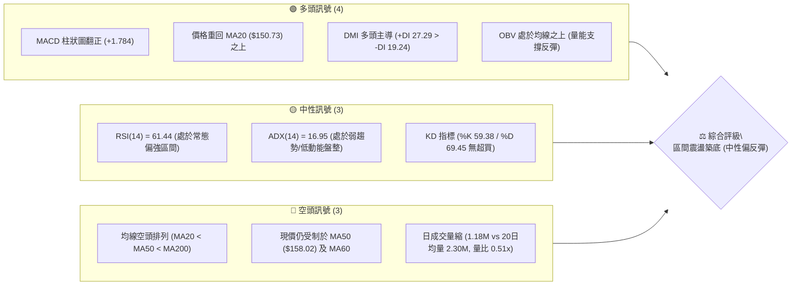
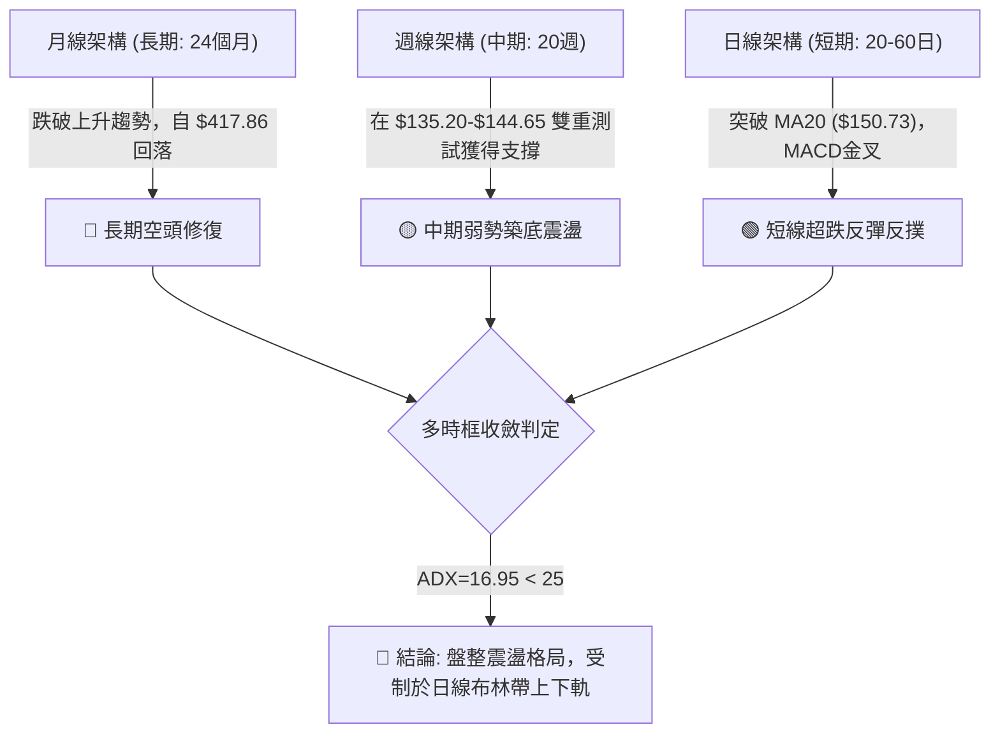
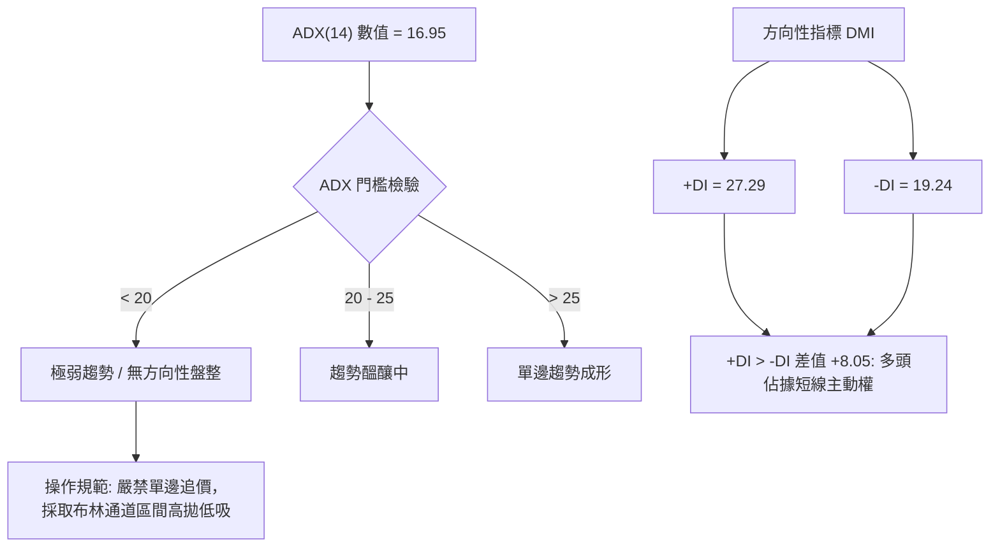
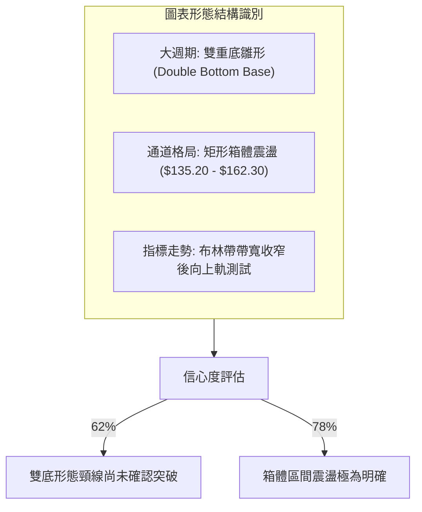
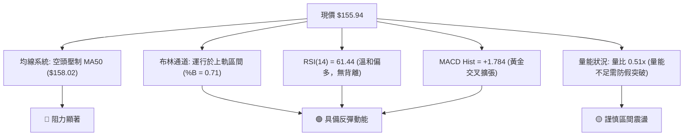
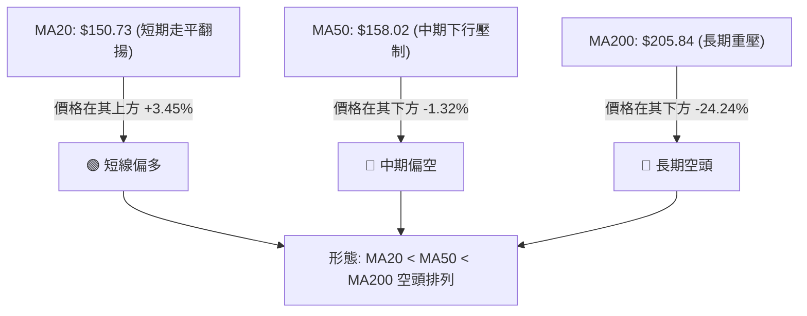
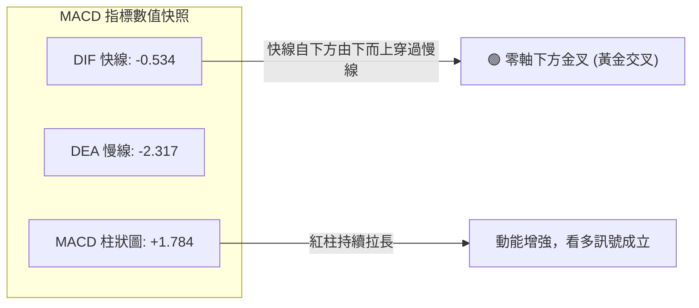
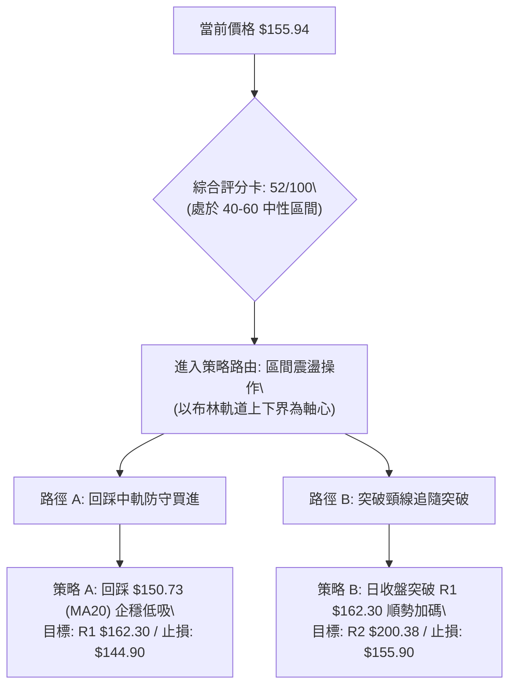
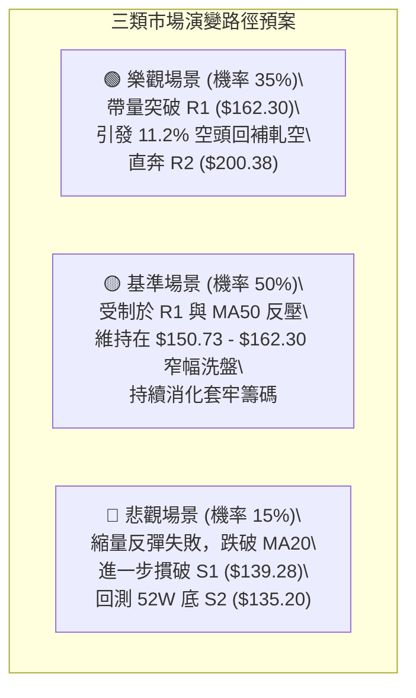

# AVAV 技術分析報告

> **報告日期**：2026-09-24 ｜ **語言**：繁體中文 ｜ **數據來源**：Yahoo Finance ｜ **當前價格**：$155.94

---

## 目錄

| 章節 | 內容 |
|------|------|
| [1. 技術面概覽](#1-技術面概覽) | 訊號儀表板、核心指標、評分卡 |
| [2. 趨勢分析](#2-趨勢分析) | 多時框趨勢、長中短期走勢 |
| [3. 圖表形態分析](#3-圖表形態分析) | 形態識別、K線組合、目標價 |
| [4. 支撐與阻力](#4-支撐與阻力) | 關鍵價位、斐波那契回調 |
| [5. 技術指標深度解讀](#5-技術指標深度解讀) | MA/RSI/MACD/布林/成交量 |
| [6. 動能與波動率](#6-動能與波動率) | 動能評估、ATR、Beta |
| [7. 多時框架總結](#7-多時框架總結) | 時框架評分矩陣 |
| [8. 交易策略建議](#8-交易策略建議) | 多空策略、風險報酬比 |
| [9. 風險提示與監控](#9-風險提示與監控) | 監控指標、風險場景 |

---

## 1. 技術面概覽

### 🎯 技術訊號儀表板



### 📊 核心指標速覽表

| 指標類別 | 指標名稱 | 當前數值 | 訊號 | 解讀 |
|----------|----------|----------|------|------|
| **價格** | 當前收盤價 | $155.94 | 🟡 中性 | 處於52週區間 7.3% 低檔，自底部顯著反彈 |
| **均線** | MA20 | $150.73 | 🟢 看多 | 現價位於 MA20 上方 (+3.45%)，短線支撐確立 |
| **均線** | MA50 | $158.02 | 🔴 看空 | 現價位於 MA50 下方 (-1.32%)，構成直接反壓 |
| **均線** | MA200 | $205.84 | 🔴 看空 | 遠低於年線 (-24.24%)，中長期宏觀趨勢仍處空頭修復 |
| **動能** | RSI(14) | 61.44 | 🟡 中性 | 進入多方主導區間，未觸及超買線 (70)，動能溫和 |
| **動能** | MACD (12,26,9) | -0.534 / -2.317 | 🟢 看多 | 快線向上穿過慢線形成金叉，柱狀圖 (+1.784) 擴張 |
| **趨勢** | ADX(14) | 16.95 | 🟡 盤整 | ADX < 25 表示無單邊趨勢，盤整洗盤行情為主 |
| **通道** | 布林帶 %B | 0.71 | 🟢 偏強 | 運行於中軌 ($150.73) 與上軌 ($163.29) 之間 |
| **量能** | 20日量比 | 0.51x | 🔴 偏弱 | 當日成交 1.18M 低於均量，反彈缺乏爆發性資金跟進 |
| **波動** | ATR(14) | $9.38 | 🟡 中高 | 日內振幅達 6.01%，區間操作具備足夠交易彈性 |

### 🏆 技術評分卡

```
╔══════════════════════════════════════════════════════════════╗
║                 技術評分卡 — AVAV (2026-09-24)               ║
╠══════════════════════════════════════════════════════════════╣
║ 趨勢強度 (ADX=16.95)   ███████░░░░░░░░░░░░░  35/100 🔴 弱勢  ║
║ 動能指標 (RSI/MACD)    █████████████░░░░░░░  65/100 🟢 偏強  ║
║ 支撐穩定度 (S1/S2防守) ██████████████░░░░░░  70/100 🟢 穩固  ║
║ 成交量配合 (量比0.51x) █████████░░░░░░░░░░░  45/100 🟡 縮量  ║
║ 形態完整度 (箱型/底形) ████████████░░░░░░░░  60/100 🟡 成形  ║
║ 均線排列 (空頭均線阻力)██████░░░░░░░░░░░░░░  30/100 🔴 壓制  ║
╠══════════════════════════════════════════════════════════════╣
║ 綜合技術評分           ███████████░░░░░░░░░  52/100 🟡 中性  ║
║ 決策方向               區間操作（布林軌道操作，等待破位確認）║
╚══════════════════════════════════════════════════════════════╝
```

---

## 2. 趨勢分析

### 🌐 多時框趨勢分析



### 📈 長期趨勢 — 12個月走勢圖（Unicode）

AVAV 過去 12 個月（2025-10 至 2026-09）歷經歷史天價見頂後的單邊主跌浪，直至 2026 年第 3 季於 $135.20 低點尋得支撐開始橫盤沉澱。

```
AVAV 月線走勢圖（過去12個月收盤價變動）
價格軸 ($)
$370 ┤ ● (2025-10: $369.91 見頂)
$340 ┤
$310 ┤
$280 ┤       ● (2025-11: $279.46)       ● (2026-01: $278.39)
$250 ┤             ● (2025-12: $241.89)       ● (2026-02: $252.25)
$220 ┤                                              ● (2026-05: $207.24)
$190 ┤                                        ●           ● (2026-04: $195.02)
$160 ┤                                              ● (2026-06: $165.07)   ●← 現價 $155.94
$130 ┤                                                    ● (2026-07: $149.37)
     └───────────────────────────────────────────────────────────────
       10    11    12    01    02    03    04    05    06    07    08    09
      2025  2025  2025  2026  2026  2026  2026  2026  2026  2026  2026  2026
```

#### 走勢特徵分析表格

| 階段區間 | 起止月份 | 價格變動 | 區間幅度 | 核心特徵與技術形態 |
|----------|----------|----------|----------|--------------------|
| **巔峰頂部** | 2025-09 ~ 2025-10 | $314.89 → $369.91 (最高 $417.86) | +17.47% | 爆量長紅見頂，形成 52 週歷史高點，籌碼高檔鬆動 |
| **主跌第一浪** | 2025-10 ~ 2025-12 | $369.91 → $241.89 | -34.61% | 斷崖式跳水，連續失守 23.6% ($351.15) 與 38.2% ($309.88) 支撐 |
| **次級反彈** | 2025-12 ~ 2026-02 | $241.89 → $278.39 → $252.25 | +15.09% | 弱勢修正，反抽 50.0% ($276.53) 斐波位受阻，未能站穩 |
| **加速崩跌** | 2026-02 ~ 2026-03 | $252.25 → $183.05 | -27.43% | 跌破 61.8% ($243.18) 關鍵多空分水嶺，引發技術性停損拋盤 |
| **弱勢弱反彈** | 2026-03 ~ 2026-05 | $183.05 → $207.24 | +13.21% | 於 78.6% ($195.69) 水平展開短暫反彈，確認 MA200 實質下破 |
| **尋底盤整** | 2026-05 ~ 2026-09 | $207.24 → $148.35 → $155.94 | -24.75% | 探至 52 週最低點 $135.20 後進入橫盤收斂，成交量顯著萎縮 |

### 📊 中期趨勢（週線分析）

從近 20 週高頻追蹤數據來看，AVAV 呈現典型的「低檔兩次探底後震盪回升」走勢：
1. **第一次探底**：2026-06-28 當週收盤跌至 $137.95（週成交量爆出 11.88M，RSI 砸入極度超賣區 20.2），隨後於 2026-07-05 報復性反彈至 $190.89（成交量 18.31M）。
2. **第二次回踩打底**：隨後衝高回落，於 2026-09-06 當週打出收盤低點 $144.65（RSI 跌至 16.9 極端底背離區間，成交量 7.32M），守住波段低點 $135.20。
3. **底部放量確認**：2026-09-13 當週暴增至 20.40M 股巨量，收盤拉升至 $146.71，隨後 2026-09-20 站上 $159.95，確認了 $135.20 - $139.28 區間具備極強的機構買盤支撐。

```
近期週線壓力與支撐示意圖
$200.38 ────────────────────────────────────── 強阻力 (R2: 前波反彈高點聚類)
          ▲
          │
$162.30 ──┼─────────────────────────────────── 關鍵阻力 (R1: 近期頸線阻力 / 布林上軌 $163.29)
          │  ● 現價 $155.94 (受制於 MA50 $158.02)
$150.73 ──┴────────────────────────────────── 短期中樞 (MA20 / 布林中軌)
$139.28 ────────────────────────────────────── 近期強支撐 (S1: 6-8月密集整理低點)
$135.20 ────────────────────────────────────── 52週絕對底 (S2: 100% 斐波那契回調位)
```

### ⚡ 趨勢強度評估（ADX 解讀）



| 指標名稱 | 實際數值 | 參考標準 | 狀態評估 | 實戰指引 |
|----------|----------|----------|----------|----------|
| **ADX(14)** | 16.95 | < 20 (極弱) / < 25 (弱) | 弱趨勢盤整 | 市場處於無序波動與籌碼沉澱期，順勢突破策略易頻繁受侵蝕 |
| **+DI** | 27.29 | > 20 (多方活躍) | 短線偏多 | 買方動能略優於空方，支撐價格低檔反彈 |
| **-DI** | 19.24 | < 20 (空方退潮) | 空頭鈍化 | 空方主跌力道大幅衰退，下跌動能暫歇 |

---

## 3. 圖表形態分析

### 🔍 形態識別系統



#### 形態識別信心度與目標價計算表

| 形態類別 | 信心度 | 判斷依據（引用數據） | 完成度 | 目標價（附嚴謹計算式） |
|----------|--------|----------------------|--------|------------------------|
| **潛在雙重底**<br>(Double Bottom) | 62% | 兩波段低點分別位於 2026-06-28 之 $137.95 及 2026-09-06 之 $144.65，且底部未破 52W 低點 S2 ($135.20) | 70% | **突破頸線確認後目標**：<br>頸線 R1 ($162.30) + 形態高度 [頸線 $162.30 - 絕對低點 $135.20 = $27.10] = **$189.40**（數據無該數值，視為推算目標）<br>實際水平阻力錨定：**$200.38 (R2)** |
| **矩形橫盤箱體**<br>(Trading Range) | 78% | 價格持續於支撐區 S1 ($139.28) / S2 ($135.20) 與阻力區 R1 ($162.30) 之間往返震盪，ADX=16.95 高度呼應 | 85% | **箱頂壓制目標**：**$162.30 (R1)**<br>若向下回踩箱底：**$139.28 (S1)** |
| **頭肩底形態** | 35% | 數據中左肩與頭部界限模糊，中間缺乏標準三點低點對稱結構 | 20% | *信心度 < 50%，依規則判定訊號不足，僅做指標型解讀，不預設目標價* |

### 🕯️ 重要 K 線形態分析

| 週/月份 | 結算收盤價 | 典型 K 線組合特徵 | 市場心理與技術解讀 | 訊號方向 |
|---------|------------|-------------------|--------------------|----------|
| **2026-06-28 當週** | $137.95 | 長下影長陰線（爆量超賣） | 恐慌拋盤湧現，但低檔承接力道初現，確立 S2 ($135.20) 鐵底區 | 🟡 空轉中性 |
| **2026-07-05 當週** | $190.89 | 穿頭破腳大陽線（吞噬形態） | 單週大漲近 38%，空頭回補疊加機構抄底，形成首波多頭反撲衝擊波 | 🟢 短線強多 |
| **2026-09-06 當週** | $144.65 | 探底小陰星線（縮量止跌） | 形成第二隻腳（Secondary Low），空方動能耗盡，RSI 降至 16.9 極限鈍化 | 🟢 築底訊號 |
| **2026-09-13 當週** | $146.71 | 低位放量倒錘/長陽醞釀 | 20.40M 爆量換手，籌碼自散戶流向特定買盤，下影線長度確認底盤扎實 | 🟢 看漲反轉 |
| **2026-09-20 當週** | $159.95 | 中實體陽線（突破 MA20） | 收盤越過布林中軌，站上 $150.73，形成短期攻擊波浪 | 🟢 多頭延續 |
| **2026-09-27 至今** | $155.94 | 高檔窄幅孕線（Harami） | 於 MA50 ($158.02) 及 R1 ($162.30) 頸線前停滯，多空陷入決策觀望 | 🟡 震盪整理 |

### 📉 ASCII 走勢形態示意圖

```
AVAV 底部箱體與潛在雙底形態架構圖
$165 ┤                             [阻力帶: R1 $162.30 / 布林上軌 $163.29]
$162 ┤                             ─────────頸線壓制─────────
$159 ┤                                        ╭───● 現價 $155.94
$156 ┤                   ╭──╮                │   (受阻於 MA50 $158.02)
$153 ┤                   │  │                │
$150 ┤───────────────────┼──┼────────────────┼──────── (布林中軌 / MA20 $150.73)
$147 ┤                   │  ╰──╮            ╭╯
$144 ┤                   │     │        ╭───╯ [低點2: 09-06 $144.65]
$141 ┤      ╭──╮         │     ╰────────╯
$138 ┤  ╭───╯  ╰─────────╯ [低點1: 06-28 $137.95]
$135 ┤──●─────────────────────────────────────────────────── [52W鐵底 S2: $135.20]
     └────────────────────────────────────────────────────────
       06-21   06-28   07-05   07-26   08-16   09-06   09-20   現價
```

### 🎯 形態目標價計算

1. **矩形整理區間**：
   * 箱體底部：$135.20（52週低點）至 $139.28（S1）
   * 箱體頂部：$162.30（R1 頸線）
   * 當前位置：現價 $155.94 逼近箱體上緣，目前正在消化來自 MA50 ($158.02) 之阻力。
2. **潛在突破推算**：
   * 若能以日收盤價帶量突破 R1 ($162.30)，則雙底成立。
   * 理論形態等幅測幅高度：$162.30 - $135.20 = $27.10
   * 形態推算理論價：$162.30 + $27.10 = $189.40
   * **技術錨定價位**：依據數據聚類，該推算路徑上方第一實質阻力位精準對應至 **R2: $200.38**，其次為前波月線反彈高點聚類 **R3: $207.83**。

---

## 4. 支撐與阻力

### 🗺️ 關鍵價位分布圖（Unicode）

```
AVAV 關鍵價位空間分布結構圖
══════════════════════════════════════════════════════════════════
$207.83 ║████████████████████████████████████████║ 強阻力 R3 (+33.28%)
$200.38 ║██████████████████████████████          ║ 重大阻力 R2 (+28.50%)
$195.69 ║▒▒▒▒▒▒▒▒▒▒▒▒▒▒▒▒▒▒▒▒▒▒▒▒▒               ║ 斐波 78.6% 回調位 (+25.49%)
$163.29 ║▓▓▓▓▓▓▓▓▓▓▓▓▓▓▓▓▓▓                      ║ 布林通道上軌 (+4.71%)
$162.30 ║████████████████████████████████████████║ 關鍵阻力 R1 / 箱頂 (+4.08%)
$158.02 ║░░░░░░░░░░░░░                           ║ MA50 均線反壓 (+1.33%)
$155.94 ╠════════════════════════════════════════╣ ◄ 當前市價 ($155.94)
$150.73 ║░░░░░░░░░░░░░                           ║ MA20 / 布林中軌 (-3.34%)
$139.28 ║▓▓▓▓▓▓▓▓▓▓▓▓▓▓▓▓▓▓▓▓                    ║ 近期波段支撐 S1 (-10.68%)
$138.17 ║▒▒▒▒▒▒▒▒▒▒▒▒▒▒▒▒                        ║ 布林通道下軌 (-11.40%)
$135.20 ║████████████████████████████████████████║ 52週鐵底 S2 / 斐波100% (-13.30%)
══════════════════════════════════════════════════════════════════
```

### 🚧 阻力位分析表

所有阻力數值嚴格引用自數據庫波段高點聚類與指標計算值：

| 阻力級別 | 精確價位 | 距離現價 | 形成原因與技術共振 | 突破難度 | 重要性 |
|----------|----------|----------|--------------------|----------|--------|
| **即時反壓** | $158.02 | +1.33% | 中期 MA50 均線與 MA60 ($158.34) 重疊處 | 中等 🟡 | ★★★☆☆ |
| **阻力 R1** | **$162.30** | +4.08% | 近一年波段高點聚類、箱體整理上頸線，共振布林上軌 ($163.29) | 極高 🔴 | ★★★★★ |
| **阻力 R2** | **$200.38** | +28.50% | 近一年波段高點聚類，接近 MA200 年線 ($205.84) 與斐波 78.6% | 極高 🔴 | ★★★★☆ |
| **阻力 R3** | **$207.83** | +33.28% | 2026-05 反彈頂點收盤價聚類，中期空頭防守總壕溝 | 極高 🔴 | ★★★☆☆ |

### 🛡️ 支撐位分析表

所有支撐數值嚴格引用自數據庫波段低點聚類與指標計算值：

| 支撐級別 | 精確價位 | 距離現價 | 形成原因與技術共振 | 守住機率 | 重要性 |
|----------|----------|----------|--------------------|----------|--------|
| **短線支撐** | $150.73 | -3.34% | 日線 MA20 均線、布林中軌，短線多頭防守生命線 | 70% 🟢 | ★★★☆☆ |
| **支撐 S1** | **$139.28** | -10.68% | 近一年波段低點聚類，共振日線布林下軌 ($138.17) | 80% 🟢 | ★★★★☆ |
| **支撐 S2** | **$135.20** | -13.30% | 52 週最低點、斐波那契 100.0% 回調位、歷史買盤極值 | 92% 🟢 | ★★★★★ |

### 📐 斐波那契回調位分析

依據 52 週波動極值（最高點 $417.86 至 最低點 $135.20，總垂直落差高達 $282.66）計算之黃金分割架構如下：

```
斐波那契回調位階梯 (52W 區間 $135.20 → $417.86)
0.0%  (52W High) ─── $417.86  [歷史峰值]
23.6%            ─── $351.15
38.2%            ─── $309.88
50.0%            ─── $276.53  [中軸多空分水嶺]
61.8%            ─── $243.18  [黃金分割黃金阻力]
78.6%            ─── $195.69  [深度回調關鍵防禦]
────────────────────────────────────────────────────
現價落點區間: $135.20 ~ $195.69 之間 (當前報價 $155.94)
────────────────────────────────────────────────────
100.0% (52W Low) ─── $135.20  [52W最深底部鐵底]
```

* **現價位階解讀**：現價 $155.94 處於 78.6% ($195.69) 與 100.0% ($135.20) 之間的極度低估超跌沉澱帶，僅自最低點脫離 +15.34%。
* **意義評估**：價格在 100.0% ($135.20) 水平構築了堅實的底部基石。當前行情屬於自 100% 斐波那契支撐發起的回彈修復，上方直至 78.6% ($195.69) 前均無宏觀黃金分割階梯壓制，主要阻力均來自近端籌碼籌碼密集區（R1 $162.30 及 R2 $200.38）。

---

## 5. 技術指標深度解讀

### 🎛️ 指標訊號總覽



### 📈 移動平均線排列分析



* **短天期與中長天期均線分歧**：
  * **MA5 ($159.32)** 與 **MA10 ($154.16)**、**MA20 ($150.73)** 呈現短線回升，現價穩站 MA10 與 MA20 之上，提供下檔支撐。
  * **MA50 ($158.02)**、**MA60 ($158.34)** 形成眼前直接的橫向「雙均線蓋頂」，是多頭短線衝關的關鍵門檻。
  * **MA120 ($169.11)**、**MA200 ($205.84)** 與 **MA240 ($227.57)** 斜率均呈向下發散，確認中長期趨勢依舊處於空頭格局，任何衝高若無成交量配合均易轉為技術性解套賣壓。

### 📉 RSI(14) 分析

* **當前數值**：**61.44**
* **進度條視覺化**：
  ```
  超賣 (0)          中性 (50)    現值 (61.44)     超買 (100)
  ├─────────────────────┼───────────█──────────────┤
  ░░░░░░░░░░░░░░░░░░░░░░▓▓▓▓▓▓▓▓▓▓▓▓█░░░░░░░░░░░░░░
  ```
* **指標解讀**：
  * RSI 擺脫了 9 月初的超賣區（2026-09-06 週線曾跌至 16.9 極限值），穩健攀升至 61.44，脫離 30-70 的常態中軸，進入多方掌控區。
  * 尚未觸及 70 以上的超買警戒線，顯示當前向上反彈的過程中買盤尚未過熱，仍有向上伸展的動能餘裕。
* **背離研判**：
  * **日線與週線背離確認**：數據明確標示「無明顯背離」。
  * **波段回顧**：9 月初價格回測 $144.65，高於 6 月末的 $137.95，而 RSI 自 20.2 降至 16.9，完成了局部的價格底背離修復，促成了當前這波自 $144 區域至 $159 的強勁回彈。

### 📊 MACD(12/26/9) 訊號解讀



* **絕對數值解析**：DIF (-0.534) 與 DEA (-2.317) 雖然雙雙位於零軸下方（代表宏觀格局尚未轉為完全強勢牛市），但快慢線差值迅速收斂並向上金叉，柱狀圖（Histogram）達到 **+1.784**。
* **動能含義**：柱狀圖自 9 月中旬的負值翻正且持續擴大，是推動股價突破 MA20 ($150.73) 的核心驅動引擎，技術上支持股價繼續向上挑戰阻力位。

### 📦 布林通道分析

```
AVAV 日線布林通道結構示意圖
$166 ┤
$163 ┤  ═══════════════════════════════════════════════ 布林上軌 ($163.29)
$160 ┤                       ╭───────╮
$157 ┤               ╭───────╯       ╰──● 現價 $155.94 (%B: 0.71)
$154 ┤       ╭───────╯
$151 ┤  ─────┼───────────────────────────────────────── 布林中軌 ($150.73 / MA20)
$148 ┤       │
$145 ┤       │
$142 ┤  ╭────╯
$139 ┤  │
$138 ┤  ═══════════════════════════════════════════════ 布林下軌 ($138.17)
     └─────────────────────────────────────────────────
```

* **軌道參數**：
  * 布林上軌：**$163.29**
  * 布林中軌 (MA20)：**$150.73**
  * 布林下軌：**$138.17**
  * 帶寬評估：極度貼近阻力 R1 ($162.30) 與支撐 S1 ($139.28)，通道呈現收口後的平行走橫狀態。
* **位置研判 (%B = 0.71)**：
  * %B 數值 0.71 代表價格位於中軌至上軌的上半部強勢區域。
  * 由於當前 ADX 為 16.95（低於 25），根據盤整市場收斂法則，布林上軌 **$163.29** 與阻力 **R1 $162.30** 構成短線無法輕易實質穿透的「天花板」，觸及上軌往往帶來短線獲利回吐風險。

### 💹 成交量分析（量價配合度）

* **量能數據對比**：
  * 當日成交量：**1,182,100 股**
  * 20 日均量：**2,298,910 股**（量比僅 **0.51x**）
  * 50 日均量：**1,682,724 股**
* **量價背離診斷**：
  * **隱憂**：股價自 $146 反彈至 $155.94 過程中，成交量反向萎縮至 20 日均量的約一半（0.51x）。典型「縮量反彈」表明主力追高意願不足，多由場內籌碼惜售而非主動性增量資金推動。
  * **OBV 支撐**：系統數據顯示「OBV > MA → 量能支撐上漲」。這說明在 2026-09-13 當週（成交量高達 20.40M）的底部吸籌階段，累積能量線（OBV）已經顯著走高，奠定了中線籌碼沉底的基礎，但短線突破需要日線成交量重新放大至 2.3M 以上。

---

## 6. 動能與波動率

### ⚡ 動能評估四象限

```
動能與波動率象限分析 (Momentum vs Volatility Matrix)
高波動率 ↑
         │ [Q3] 高風險高收益區         │ [Q4] 弱勢高危洗盤區
         │                              │
         │                              │
─────────┼──────────────────────────────┼─────────────────────────────
         │ [Q1] 爆發進攻區              │ [Q2] 低動能修復/區間操作區 (★當前位置)
         │                              │      - 動能強度: 55/100 (中等偏強)
         │                              │      - 趨勢波動: ADX 16.95 (低單邊波動)
低波動率 ┴──────────────────────────────┴─────────────────────────────
         低動能 ───────────────────────→ 高動能
```

| 象限代號 | 動能狀態 | 波動率狀態 | 當前符合度 | 實戰策略含義 |
|----------|----------|------------|------------|--------------|
| **Q1** | 強動能 | 低波動 | 否 | 主升浪啟動初期，最理想進場點 |
| **Q2** | **弱至中動能** | **低趨勢波動** | **✓ 符合 (主導格局)** | **區間震盪洗盤，以高拋低吸為主，嚴格控管停損** |
| **Q3** | 強動能 | 高波動 | 否 | 突破爆發行情，需放大停損並順勢追單 |
| **Q4** | 弱動能 | 高波動 | 否 | 單邊下跌破位或恐慌拋售，應絕對空倉 |

### 📊 ATR 波動率分析

* **當前 ATR(14) 數值**：**$9.38**
* **佔價格百分比**：**6.01%**（屬於偏高之日常波動幅度）
* **實戰停損與部位調整依據**：
  * AVAV 日常一個標準差的波動空間接近 $9.40，意味著進場點位必須極度講究，否則極易被日內正常雜訊震出。
  * **短線停損距離**：建議設定 1.0 ~ 1.5 倍 ATR，即 **$9.38 ~ $14.07**。
  * **區間操作止盈**：目標利潤必須大於 1.5 倍 ATR（約 $14.10 以上）才符合盈虧比規範。

### 📐 Beta 與市場相關性

* **Beta 係數**：**1.406**
* **空頭比例 (Short % Float)**：**11.2%** (Short Ratio: 3.62)
* **機構持股比例**：**88.0%**
* **特徵解讀**：
  * 高 Beta (1.406) 賦予該股高度進攻彈性，當大盤反彈時其往往具備 1.4 倍的超額彈幅；但在修正市中亦具備放大跌幅的特性。
  * 11.2% 的放空比率處於偏高水平（Short Ratio 3.62 天），一旦日線帶量衝破頸線 R1 ($162.30)，極易引發軋空（Short Squeeze）回補買盤，成為中期上探 R2 ($200.38) 的潛在助燃劑。

---

## 7. 多時框架總結

### 📋 時框架評分表

| 時框架 | 趨勢方向 | 動能狀態 | 均線排列 | 關鍵圖表形態 | 綜合評分 | 操作指引 |
|--------|----------|----------|----------|--------------|----------|----------|
| **月線 (長期)** | 🔴 空頭 | 弱勢築底 | 空頭排列 (遠低於MA240) | 歷史見頂回調，於 $135 企穩 | **35/100** | 長線資金僅宜逢低分批，不可追高 |
| **週線 (中期)** | 🟡 震盪 | 中性修復 | 糾結尋底 (守住S1/S2) | 潛在雙底打底，箱體運行 | **55/100** | 以箱體思維對待，下緣買進上緣減碼 |
| **日線 (短期)** | 🟢 偏多 | 金叉發散 | 站上MA20 / 受阻MA50 | 突破布林中軌，測試上軌 | **62/100** | 區間多頭反彈，防範成交量背離回踩 |

### 🔲 綜合訊號矩陣

```
時框架訊號收斂檢驗矩陣
┌──────────────┬────────────┬────────────┬────────────┬─────────────┐
│ 評估維度     │ 短期(日線) │ 中期(週線) │ 長期(月線) │ 權重收斂方向│
├──────────────┼────────────┼────────────┼────────────┼─────────────┤
│ 趨勢方向     │ 🟢 向上反彈 │ 🟡 橫向震盪 │ 🔴 單邊下行 │ 🟡 區間震盪 │
│ 動能 (RSI)   │ 🟢 61.44   │ 🟡 45-55   │ 🔴 30-40   │ 🟡 中性微多 │
│ 均線系統     │ 🟢 站上MA20│ 🔴 壓在MA50│ 🔴 跌破MA200│ 🔴 上方重壓 │
│ 成交量能     │ 🔴 縮量0.51│ 🟢 底部放量│ 🟡 換手充分 │ 🟡 觀察突破 │
└──────────────┴────────────┴────────────┴────────────┴─────────────┘
```

### ⚖️ 多時框收斂結論

依據多時框收斂規則第 14 條嚴格判定：
1. **趨勢強度定性**：當前日線 **ADX(14) 數值為 16.95**，明確低於趨勢門檻值 25，確認市場處於典型的「**盤整震盪行情**」，而非單邊順勢行情。
2. **主導維度收斂**：在 ADX < 25 的盤整市中，依規則應**以日線布林通道上下軌 ($138.17 - $163.29) 作為首要的交易區間邊界**。日線級別雖然短線動能（MACD 金叉、RSI 61.44）偏強，但中期週線仍受壓於 MA50 ($158.02) 與阻力 R1 ($162.30)。
3. **唯一方向性結論**：**中性偏多觀望，嚴格執行區間震盪操作**。向上不追高，重點在阻力區分批鎖定利潤；拉回依託布林中軌或支撐位方可建立部位。

---

## 8. 交易策略建議

### 🗺️ 策略決策流程圖



### 🧭 策略路由（依評分卡分流）

> **當前主策略方向 = 🟡 中性區間震盪策略（依據技術評分卡 52/100）**
> 
> *規則依據*：評分落於 40–60 分中性區間，且 ADX=16.95 (<25)，嚴禁兩頭下注或盲目押注單邊大牛市。策略應聚焦於「**布林通道中下軌低吸、上軌及頸線分批停利**」，並以明確水平位防守。

### 🎯 價格情境階梯（Price Scenarios）

所有價位精確引用自第 4 章「關鍵價位」區塊：

| 觸發條件 | 第一目標位 | 第二目標位 | 後續延伸位 | 情境含義與技術定性 |
|----------|------------|------------|------------|--------------------|
| **強勢突破 R1 ($162.30)** | $163.29 (布林上軌) | **$200.38 (R2)** | **$207.83 (R3)** | 雙底頸線被有效翻越，轉化為中期波段反轉 |
| **受阻於現價至 R1 區間** | $150.73 (MA20中軌) | **$139.28 (S1)** | $138.17 (布林下軌) | 盤整震盪延續，受阻回落測試箱體下沿 |
| **失守 S1 ($139.28)** | **$135.20 (S2)** | 重新尋底 | 探底延伸 | 築底宣告失敗，宏觀空頭主跌浪重新啟動 |

### 📊 情境機率分佈

```
情境機率分佈圖
繼續震盪上探 (突破R1)   ████████████░░░░░░░░░  35%
維持區間內拉鋸 (中軌震盪)█████████████████░░░░  50%
跌破支撐再探底 (回測S2) █████░░░░░░░░░░░░░░░░  15%
```

| 情境劃分 | 機率預估 | 主要指標依據 |
|----------|----------|--------------|
| **維持區間震盪** | **50%** | ADX=16.95 呈現弱趨勢，量比僅 0.51x 缺乏單邊推進動能，布林帶走平收口 |
| **反彈向上衝刺** | **35%** | MACD 柱狀圖 (+1.784) 金叉擴張，RSI 位於 61.44 偏多區間，+DI (27.29) 主導短線 |
| **回落再次探底** | **15%** | 均線長週期呈現空頭排列 (MA20 < MA50 < MA200)，若大盤系統性下挫則可能破位 |

### 🟢 主策略詳情（區間操作與突破銜接）

| 策略要素 | 策略 A（回踩低吸 — 震盪偏多） | 策略 B（帶量突破 — 順勢追多） |
|----------|--------------------------------|--------------------------------|
| **適用時機** | 價格在 R1 前受阻回落，測試中軌支撐 | 日K線實體帶量收盤突破頸線 R1 |
| **進場條件** | 回踩 MA20 獲得支撐，出現止跌K線 | 日收盤價 > $162.30 且成交量 > 2.3M |
| **進場價格** | **$150.73**（MA20 / 布林中軌） | **$162.50**（突破 R1 後確認） |
| **目標價 T1** | **$162.30**（箱頂阻力 R1） | **$200.38**（阻力 R2 / 年線關口） |
| **目標價 T2** | **$200.38**（阻力 R2） | **$207.83**（阻力 R3） |
| **止損價格** | **$144.90**（跌破前週低點即停損） | **$155.94**（跌回現價頸線下方） |
| **風險報酬比** | **1 : 1.98**（風險 $5.83 / 利潤 $11.57）| **1 : 5.77**（風險 $6.56 / 利潤 $37.88）|
| **成功機率** | **65%** | **45%** |
| **建議倉位** | **15%** | **10%**（突破後底倉加碼） |

### 🔴 反向風險觸發點（對沖提示）

* **空頭防禦警戒線**：若現價 $155.94 無法突破，反而跌破布林中軌 **$150.73**，多單應立即減半。
* **徹底推翻多方訊號**：若價格以日收盤價跌破 **$139.28 (S1)**，代表雙底形態破位，市場將直接尋求 **$135.20 (S2)** 甚至更低。此時所有多頭部位必須無條件全數止損離場，並可適度建立空頭對沖倉位，下看 $135.20。

### ⭐ 整體訊號強度評星

```
做多訊號強度：★★★☆☆  (3.0/5星 — 短線動能充足但面臨強阻力)
做空訊號強度：★★☆☆☆  (2.0/5星 — 空頭動能衰退，低檔支撐轉硬)
整體可信度：  ★★★☆☆  (3.5/5星 — 處於 ADX<25 震盪期，區間可信度高)
```

---

## 9. 風險提示與監控

### ✅ 關鍵監控指標 Checklist

```
╔══════════════════════════════════════════════════════════════╗
║               交易員每日關鍵技術監控清單 (Checklist)           ║
╠══════════════════════════════════════════════════════════════╣
║ [ ] 頸線攻防: 日收盤價是否站穩阻力 R1 ($162.30)？            ║
║ [ ] 均線動態: 能否突破並連續3日守住 MA50 ($158.02)？         ║
║ [ ] 生命線防守: 日線收盤是否守穩 MA20 / 布林中軌 ($150.73)？  ║
║ [ ] 量能放量: 日成交量是否放大越過 20日均量 (2,298,910股)？  ║
║ [ ] 動能警戒: RSI(14) 是否在 70 附近出現頂背離或頓化？       ║
║ [ ] 空頭異動: Short % Float (11.2%) 是否有顯著平倉回補現象？ ║
╚══════════════════════════════════════════════════════════════╝
```

### ⚠️ 風險場景分析



### 🛡️ 風險管理重要提醒

1. **ATR 波動防護**：
   * AVAV 的 ATR 高達 **$9.38 (6.01%)**，屬於高波動防務科技標的。若帳戶風險容忍度為總資金的 1%，則單筆最大虧損額不得超過總資產的 1%。以 $100,000 美元帳戶為例，單筆風險額上限為 $1,000 美元，若停損幅度設定為 $6.00，則部位規模不得超過 166 股。
2. **均線壓制不可輕視**：
   * 儘管短期 MACD 與 RSI 偏多，但 MA200 仍處於 $205.84 且斜率向下，整體均線結構為空頭排列。在長期均線走平向上之前，任何反彈均應以波段交易（Swing Trading）對待，切忌在頸線阻力前重倉押注長線反轉。
3. **低量警訊**：
   * 當前成交量僅為 20 日均量的 0.51 倍，量價存在背離跡象。若後續挑戰 R1 ($162.30) 時成交量未能放大至 2.3M 以上，應嚴防假突破後迅速下殺的風險。

---

## 📋 報告總結

```
╔══════════════════════════════════════════════════════════════════╗
║                    AVAV 技術分析報告總結                         ║
╠══════════════════════════════════════════════════════════════════╣
║ 報告日期：2026-09-24                                             ║
║ 當前價格：$155.94                                                ║
║ 分析評級：⚖️ 中性偏多區間操作（盤整修復）                         ║
║                                                                  ║
║ 關鍵結論：                                                       ║
║ ├─ 長期趨勢：🔴 空頭修復（遠在 MA200 $205.84 之下，大結構修剪） ║
║ ├─ 中期趨勢：🟡 弱勢築底（$135.20 兩次探底完成，確立強固底座）  ║
║ ├─ 短期趨勢：🟢 震盪反彈（MACD 金叉，價格穩居 MA20 $150.73 之上）║
║ ├─ 關鍵支撐：S1 $139.28 ｜ S2 $135.20 (52W 最低鐵底)             ║
║ ├─ 關鍵阻力：R1 $162.30 ｜ R2 $200.38 ｜ R3 $207.83             ║
║ └─ 分析師目標：平均 $219.35 (當前折價顯著，高位 $315.00)          ║
║                                                                  ║
║ 最優策略組合：                                                   ║
║ 1. 🥇 最佳機會：回踩 MA20 / 布林中軌 $150.73 附近佈局反彈，      ║
║                 目標鎖定 R1 $162.30，嚴格止損 $144.90。          ║
║ 2. 🥈 次選機會：耐心等待帶量收盤突破 R1 $162.30，順勢追多加碼，  ║
║                 博弈 11.2% 放空回補行情，上看 R2 $200.38。       ║
║ 3. 🥉 保守選擇：空倉觀望，等待日線 ADX 攀升越過 25 且均線重塑   ║
║                 後，再行順勢進場介入單邊波段。                   ║
╚══════════════════════════════════════════════════════════════════╝
```

---

> ⚠️ **免責聲明**：本報告為 AI 自動生成之技術分析，所有數據及估算均基於提供的歷史價格資訊。本報告**僅供研究與學術參考**，**不構成任何投資建議**。投資有風險，入市需謹慎。

---

*報告生成時間：2026-09-24 ｜ 數據來源：Yahoo Finance ｜ 分析框架：多時框技術分析*