# AVAV 技術分析報告

> **報告日期**：2026-09-25 ｜ **語言**：繁體中文 ｜ **數據來源**：Yahoo Finance ｜ **當前價格**：$158.55

---

## 目錄

| 章節 | 內容 |
|------|------|
| [1. 技術面概覽](#1-技術面概覽) | 訊號儀表板、核心指標、評分卡 |
| [2. 趨勢分析](#2-趨勢分析) | 多時框趨勢、長中短期走勢 |
| [3. 圖表形態分析](#3-圖表形態分析) | 形態識別、K線組合、目標價 |
| [4. 支撐與阻力](#4-支撐與阻力) | 關鍵價位、斐波那契回調 |
| [5. 技術指標深度解讀](#5-技術指標深度解讀) | MA/RSI/MACD/布林/成交量 |
| [6. 動能與波動率](#6-動能與波動率) | 動能評估、ATR、Beta |
| [7. 多時框架總結](#7-多時框架總結) | 時框架評分矩陣 |
| [8. 交易策略建議](#8-交易策略建議) | 多空策略、風險報酬比 |
| [9. 風險提示與監控](#9-風險提示與監控) | 監控指標、風險場景 |

---

## 1. 技術面概覽

### 🎯 技術訊號儀表板

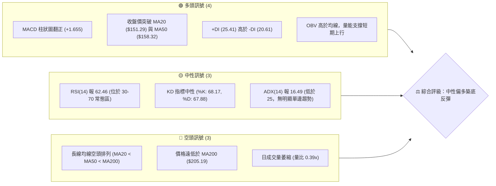

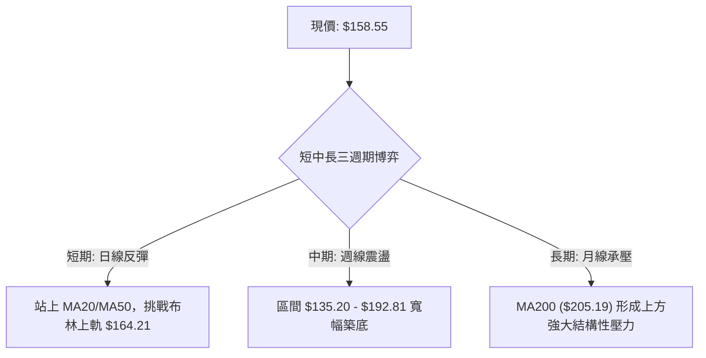

### 📊 核心指標速覽表

| 指標類別 | 指標名稱 | 當前數值 | 訊號 | 解讀 |
|----------|----------|----------|------|------|
| **價格** | 當前價格 | $158.55 | 🟢 | 站上短期均線集群，短線多方佔優 |
| **均線** | MA20 | $151.29 | 🟢 | 價格在 MA20 之上 (+4.80%)，短期上升波段確立 |
| **均線** | MA50 | $158.32 | 🟢 | 價格微幅突破 MA50 (+0.15%)，測試中期成本線 |
| **均線** | MA200 | $205.19 | 🔴 | 價格低於 MA200 (-22.73%)，長期宏觀下行趨勢未扭轉 |
| **動能** | RSI(14) | 62.46 | 🟡 | 進入偏強多頭區間，未觸及 70 超買警戒線 |
| **動能** | MACD | -0.249 (Hist +1.655) | 🟢 | 快線即將穿過零軸，柱狀圖正向擴張，動能看多 |
| **動能** | Stoch %K/%D | 68.17 / 67.88 | 🟡 | 位於中高位區間，無超買或死叉跡象 |
| **趨勢** | ADX(14) | 16.49 | 🟡 | ADX < 25 表明處於無趨勢/盤整行情，以區間波動為主 |
| **波動** | ATR(14) | $9.56 (6.03%) | 🟡 | 每日平均波動幅度中等偏高，需設置適度止損寬度 |
| **通道** | 布林通道 | %B = 0.78 | 🟢 | 運行於中軌 ($151.29) 與上軌 ($164.21) 間，偏強整理 |
| **量能** | 成交量 / 20MA | 894,400 / 2,282,420 | 🔴 | 量比僅 0.39x，反彈動能面臨量縮隱憂，需補量突破 |

### 🏆 技術評分卡

```
╔══════════════════════════════════════════════════════════════════╗
║                   技術評分卡 — AVAV (2026-09-25)                 ║
╠══════════════════════════════════════════════════════════════════╣
║ 趨勢強度 (ADX=16.49)      ██████░░░░░░░░░░░░░░  32/100  🔴 弱勢盤整 ║
║ 動能指標 (RSI/MACD)       ██████████████░░░░░░  70/100  🟢 短線偏多 ║
║ 支撐穩定度 (S1/S2/S3)     ████████████████░░░░  80/100  🟢 底部堅實 ║
║ 成交量配合 (量比 0.39x)   ██████░░░░░░░░░░░░░░  30/100  🔴 量價背離 ║
║ 形態完整度 (矩形/雙底)    ████████████░░░░░░░░  60/100  🟡 潛在打底 ║
║ 均線排列 (空頭排列承壓)   ████████░░░░░░░░░░░░  40/100  🔴 長期承壓 ║
╠══════════════════════════════════════════════════════════════════╣
║ 綜合評分                  ███████████░░░░░░░░░  54/100  🟡 中性偏多 ║
║ 核心評級                  區間操作 / 盤整反彈策略 (以布林軌道為界) ║
╚══════════════════════════════════════════════════════════════════╝
```

---

## 2. 趨勢分析

### 🌐 多時框趨勢分析

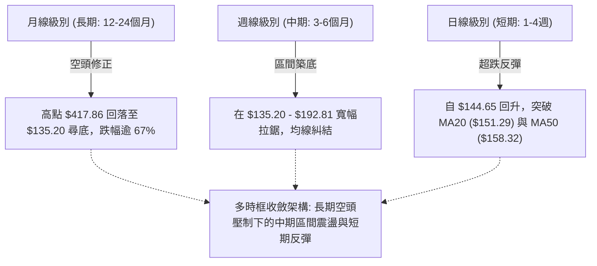

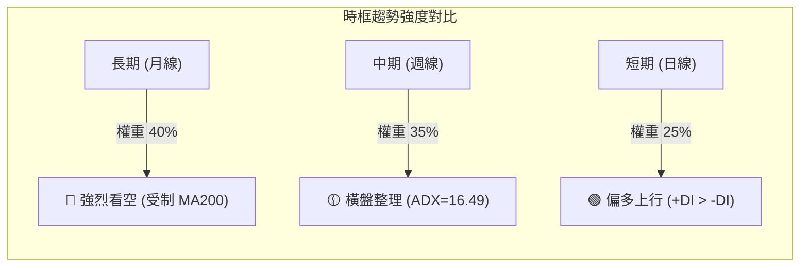

### 📈 長期趨勢 — 12個月走勢圖（Unicode）

```
AVAV 月線走勢圖（過去12個月：2025-10 至 2026-09）
價格軸 ($)
$370 ┤  ● (2025-10: $369.91 波段高點)
$340 ┤
$310 ┤
$280 ┤     ● (2025-11: $279.46)       ● (2026-01: $278.39)
$250 ┤        ● (2025-12: $241.89)       ● (2026-02: $252.25)
$220 ┤                                           ● (2026-05: $207.24)
$190 ┤                                              ● (2026-04: $195.02)
$160 ┤                                                 ● (2026-03: $183.05)   ● ($158.55 現價)
$130 ┤                                                    ● (2026-06: $165.07)    ● (2026-08: $148.35)
     └─────────────────────────────────────────────────────────────────────────────
        10   11   12   01   02   03   04   05   06   07   08   09 (月份)
       (2025)             (2026)
```

#### 走勢特徵分析表格

| 階段 | 時間區間 | 起始收盤價 | 結束收盤價 | 漲跌幅 | 主要技術特徵 |
|------|----------|------------|------------|--------|--------------|
| **第1階段：高檔反轉** | 2025-10 ~ 2025-12 | $369.91 | $241.89 | -34.61% | 觸及波段歷史頂部後巨量長黑殺跌，跌破短期支撐 |
| **第2階段：次高雙頂** | 2026-01 ~ 2026-02 | $278.39 | $252.25 | -9.39% | 弱勢反抽無法挑戰前高，形成下移高點 (Lower High) |
| **第3階段：崩跌尋底** | 2026-03 ~ 2026-06 | $183.05 | $165.07 | -9.82% | 跌破 $200 整數關卡，加速下挫探測 52 週低點區間 |
| **第4階段：築底震盪** | 2026-07 ~ 2026-09 | $149.37 | $158.55 | +6.15% | 於 $148-$158 區間低位鈍化，動能衰竭轉為橫盤築底 |

### 📊 中期趨勢（週線分析）

```
AVAV 週線波段阻力與支撐示意圖
══════════════════════════════════════════════════════════════════
 $207.83 ──────────────────────────────────────────────── R3 阻力 (5/31週高點)
         │ 
 $200.38 ──────────────────────────────────────────────── R2 阻力 / MA200 ($205.19)
         │
 $164.21 ──────────────────────────────────────────────── BB 上軌阻力
 $162.30 ──────────────────────────────────────────────── R1 近期擺動高點
 $158.55 ════════════════════════════════════════════════ ◄ 當前價格
 $156.00 ──────────────────────────────────────────────── S1 近期波段平台支撐
         │
 $139.28 ──────────────────────────────────────────────── S2 次級強支撐 (BB下軌 $138.37)
 $135.20 ──────────────────────────────────────────────── S3 52週極限低點
══════════════════════════════════════════════════════════════════
```

近 20 週數據顯示，AVAV 呈現典型的「脈衝反彈後快速回落」之寬幅震盪結構。在 2026-07-05 當週曾爆出 18,317,500 股巨量推升至 $190.89，隨後於 2026-08-16 再次摸高至 $192.81，但均因量能無法持續放大而大幅拉回至 $144-$147 一線。目前週線 MACD 柱狀圖在連續負值後再度翻紅 (+1.655)，週 RSI 回升至 62.5，顯示中期下行慣性已暫時止住，正處於區間低位向中位回升的階段。

### ⚡ 趨勢強度評估（ADX 解讀）

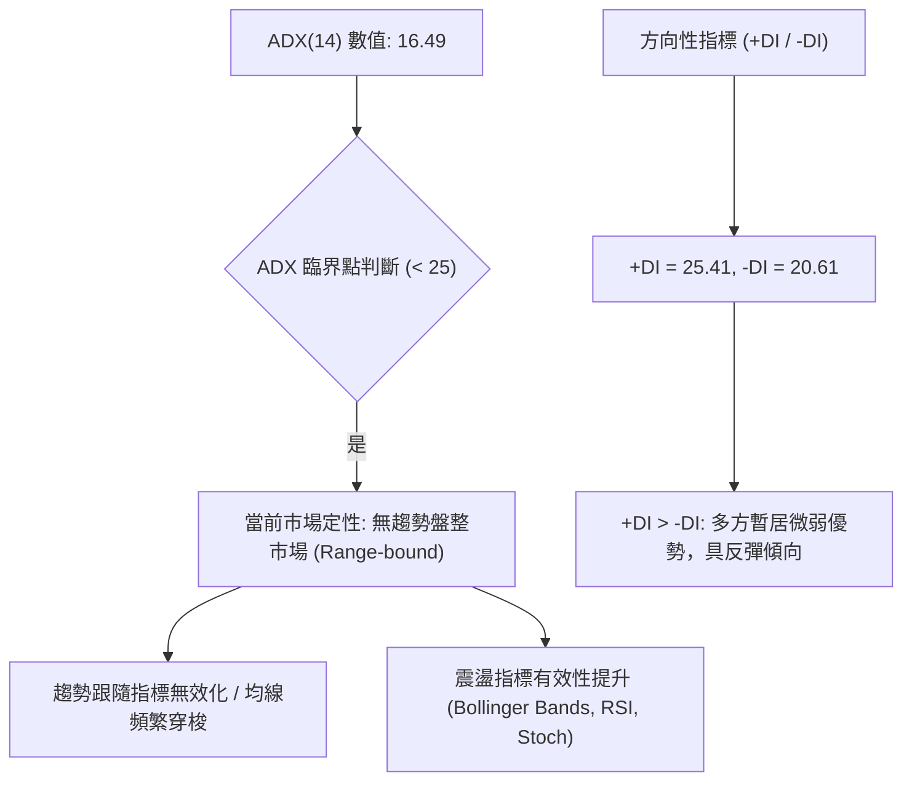

#### ADX 強度對照表

| ADX 區間 | 趨勢強度 | 當前狀態判定 | 交易指引 |
|----------|----------|--------------|----------|
| 0 - 20 | 極弱 / 無趨勢 | **當前處於此區間 (16.49)** 🟢 | **禁止盲目追突破；採用高拋低吸與通道交易** |
| 20 - 25 | 弱趨勢 / 醞釀期 | 未達到 | 觀察均線收斂情況，準備突破信號 |
| 25 - 40 | 強趨勢建立 | 未達到 | 順應中長期均線單邊順勢操作 |
| 40 - 60 | 極強趨勢 | 未達到 | 尋求拉回均線加碼點 |
| 60 以上 | 趨勢過熱 / 易反轉 | 未達到 | 分批止盈出場 |

---

## 3. 圖表形態分析

### 🔍 形態識別系統

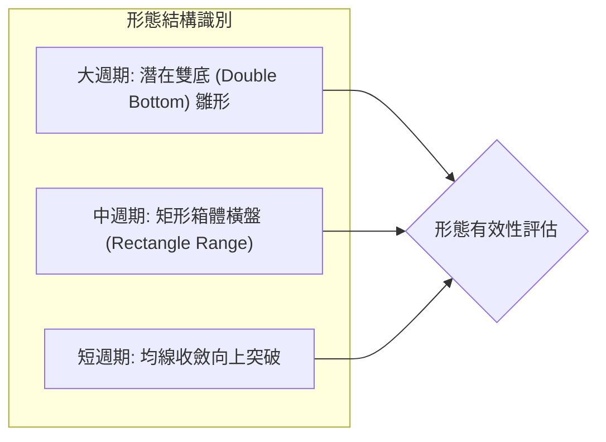

#### 形態信心度評估表（依規則 15）

| 形態名稱 | 信心度 (%) | 判斷依據（引用數據） | 完成度 (%) | 目標價（附嚴謹計算式） |
|----------|------------|----------------------|------------|------------------------|
| **箱體橫盤 (矩形)** | **75%** | 底部支撐密集聚類於 S2: $139.28 及 S3: $135.20；箱體頂部受制於 R1: $162.30 與前期擺動高點 | 85% | 突破 R1 ($162.30) 後，依據形態高度 ($162.30 - $135.20 = $27.10) 推算：$162.30 + $27.10 = **$189.40** |
| **雙重底 (W底)** | **60%** | 第一低點 2026-06-28 之 $137.95，第二低點 2026-09-06 之 $144.65，兩次低點均未破 $135.20 | 50% | 頸線設於 2026-08-16 高點 $192.81。形態高度 ($192.81 - $137.95 = $54.86)。因尚未突破頸線，僅屬構建期，暫不計發酵目標 |
| **頭肩底形態** | **25%** | 數據中未偵測到明確的左右肩對稱結構與斜頸線 | 0% | 訊號不足，僅做指標型解讀，不預設幾何目標 |

### 🕯️ 重要K線形態分析

| 週次 / 日期 | 收盤價 | 成交量 | K線形態 | 解讀 | 訊號 |
|-------------|--------|--------|---------|------|------|
| **2026-06-28** | $137.95 | 11,887,200 | 長下影長陰線 | 測試 52W 低點 $135.20 未破，爆量恐慌盤湧出後獲承接 | 🟢 築底信號 |
| **2026-07-05** | $190.89 | 18,317,500 | 突破大陽線 | 歷史天量暴拉 +38.38%，確認底部支撐強烈，主力介入 | 🟢 多頭表態 |
| **2026-08-16** | $192.81 | 5,939,600 | 衝高流星線 (長上影) | 縮量衝高受阻於阻力區，高位換手不足，引發拉回 | 🔴 短期見頂 |
| **2026-09-06** | $144.65 | 7,326,400 | 低位紡錘線 | 連續下跌後動能耗盡，RSI 降至 16.9 極度超賣區 | 🟢 止跌信號 |
| **2026-09-13** | $146.71 | 20,402,600 | 爆量十字星紅K | 2,040萬股巨量換手，空頭砸盤被全數吸收，底分型確立 | 🟢 強烈看多 |
| **2026-09-20** | $159.95 | 11,272,600 | 中陽線連貫拉升 | 突破 MA20 ($151.29) 與 MA50 ($158.32)，確認反彈波段展開 | 🟢 多頭延續 |
| **2026-09-27** | $158.55 | 3,119,000 | 縮量小陰孕線 | 在阻力位 R1 ($162.30) 前蓄勢休整，回踩 MA50 支撐 | 🟡 蓄勢整理 |

### 📉 ASCII 走勢形態示意圖

```
AVAV 近期日線/週線打底形態幾何結構
價格軸 ($)
$195 ┤                ● (2026-08-16 雙頂頸線試探點 $192.81)
     │               / \
$180 ┤              /   \
     │             /     \
$165 ┤      ●     /       \            ┌─ [阻力區 R1: $162.30 / BB上軌 $164.21]
     │     / \   /         \          ▲
$155 ┤────/───\─/───────────\────────● ($158.55 現價突破均線中軸)
     │   /     V             \      / │
$145 ┤  /                     \    ●  └─ [2026-09-13 巨量換手低點 $146.71]
     │ /                       \  /
$135 ┤●                         ● (2026-09-06 第二腳 $144.65)
     └┬─────────────────────────┬────────────────────────────────────────
   第一腳 ($137.95)          第二腳 ($144.65)
   (未破 52W 低點 $135.20)   (形成 Higher Low 次低點結構)
```

### 🎯 形態目標價計算

根據矩形箱體與波段低點形態計算推導：
1. **箱體底部基準**：以波段雙重底部聚類低點 $135.20 作為絕對底界。
2. **第一階段突破目標 (T1)**：若價格能有效收復 R1: **$162.30**，則完成局部微型底破位向上。以短線擺動震盪區間高度（$162.30 - $144.65 = $17.65）進行等距測幅：
   $$\text{T1} = 162.30 + 17.65 = \mathbf{\$179.95}$$
   *(註：此目標價低於斐波那契 78.6% 回調位 $195.69，具備高度技術合理性)*
2. **中期箱體完全爆發目標 (T2)**：若進一步帶量突破週線強壓力 R2: **$200.38**，則意味著挑戰 MA200 ($205.19) 及 R3: **$207.83**。

---

## 4. 支撐與阻力

### 🗺️ 關鍵價位分布圖（Unicode）

```
AVAV 價位結構分布圖（OHLCV 數據計算聚類）
══════════════════════════════════════════════════════════════════
 $207.83 ║██████████████████████████████║ 強結構阻力 R3 (+31.08%)
 $205.19 ║▓▓▓▓▓▓▓▓▓▓▓▓▓▓▓▓▓▓▓▓▓▓▓▓      ║ 長期生命線 MA200
 $200.38 ║██████████████████████        ║ 重大阻力 R2 (+26.38%)
 $195.69 ║░░░░░░░░░░░░░░░░░░░░░░        ║ 斐波那契 78.6% 回調位
 $164.21 ║▒▒▒▒▒▒▒▒▒▒▒▒▒▒▒▒▒▒▒▒▒▒        ║ 布林通道上軌 (動態壓制)
 $162.30 ║██████████████████████████████║ 關鍵阻力 R1 (+2.37%)
═════════╠══════════════════════════════╣ ◄ 現價 $158.55
 $156.00 ║▓▓▓▓▓▓▓▓▓▓▓▓▓▓▓▓▓▓▓▓          ║ 近期支撐 S1 (-1.61%)
 $151.29 ║▒▒▒▒▒▒▒▒▒▒▒▒▒▒▒▒▒▒▒▒▒▒        ║ 布林中軌 / MA20 支撐
 $139.28 ║██████████████████████████████║ 強支撐 S2 (-12.15%)
 $138.37 ║▒▒▒▒▒▒▒▒▒▒▒▒▒▒▒▒▒▒▒▒▒▒        ║ 布林通道下軌
 $135.20 ║██████████████████████████████║ 52W 極限歷史支撐 S3 (-14.73%)
══════════════════════════════════════════════════════════════════
```

### 🚧 阻力位分析表

所有價位均嚴格引用數據源「關鍵價位」區塊之波段聚類結果：

| 阻力級別 | 價位 | 與現價距離 | 形成原因 | 突破難度 | 重要性 |
|----------|------|------------|----------|----------|--------|
| **R1** | **$162.30** | +2.37% | 近期日線波段高點聚類，疊加布林上軌 ($164.21) 壓制 | 🟡 中等 | 短期多空分水嶺，突破方能打開上行空間 |
| **R2** | **$200.38** | +26.38% | 整數心理大關，近一年多次震盪波段頂部，接近 MA200 ($205.19) | 🔴 極高 | 中期熊牛轉換樞紐，堆積大量歷史套牢籌碼 |
| **R3** | **$207.83** | +31.08% | 2026年5月底反彈高點聚類，前期週線級巨量套牢平台 | 🔴 極高 | 多頭強勢反轉的終極考驗位 |

### 🛡️ 支撐位分析表

所有價位均嚴格引用數據源「關鍵價位」區塊之波段聚類結果：

| 支撐級別 | 價位 | 與現價距離 | 形成原因 | 守住機率 | 重要性 |
|----------|------|------------|----------|----------|--------|
| **S1** | **$156.00** | -1.61% | 近期波段回踩低點聚類，緊鄰 MA10 ($155.93) 支撐 | 🟢 70% | 短線強弱防守線，失守將考驗 MA20 |
| **S2** | **$139.28** | -12.15% | 近一年波段次低點聚類，布林通道下軌 ($138.37) 重合區 | 🟢 85% | 中期區間箱底核心防線，具極高買盤支撐 |
| **S3** | **$135.20** | -14.73% | 52 週絕對歷史低點，年內極限空頭衰竭點 | 🟢 95% | 長期多頭生死線，跌破將引發無支撐恐慌拋售 |

### 📐 斐波那契回調位分析

依據 52 週高點 **$417.86** 至 52 週低點 **$135.20** 嚴格測算回調位：

```
斐波那契回調尺（$135.20 → $417.86）
  0.0%  (52W High)  $417.86 ──────────────────────────────────
 23.6%              $351.15 ──────────────────────────────────
 38.2%              $309.88 ──────────────────────────────────
 50.0%              $276.53 ──────────────────────────────────
 61.8%              $243.18 ──────────────────────────────────
 78.6%              $195.69 ──────────────────────────────────
                    $158.55 ◄──────── 當前價格落於 78.6% 與 100.0% 之間
100.0%  (52W Low)   $135.20 ──────────────────────────────────
```

#### 斐波那契結構深度解讀
1. **現價區間定位**：現價 **$158.55** 深度處於回調尺度的 **78.6% ($195.69)** 至 **100.0% ($135.20)** 的極度深幅回撤區間（目前僅處於 52 週區間的 8.3% 分位）。
2. **超跌技術意義**：在經典斐波那契理論中，資產回撤超過 78.6% 表明原有的長期牛市結構已遭全面破壞，進入殘餘殘值的極限出清階段。然而，當前價格在 100% 低點 ($135.20) 上方出現連續兩次止跌反彈，未創出新低，表明該低點具有強烈的「週期性大底」特徵。
3. **回彈目標阻力**：未來任何由空頭回補引發的深幅反彈，首要斐波那契大阻力即為 78.6% 處的 **$195.69**，該位置與阻力位 R2 ($200.38) 及 MA200 ($205.19) 形成高密度「阻力共振帶」。

---

## 5. 技術指標深度解讀

### 🎛️ 指標訊號總覽

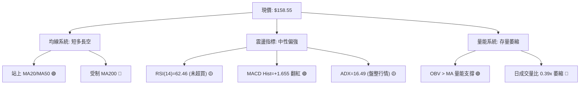

### 📈 移動平均線排列分析

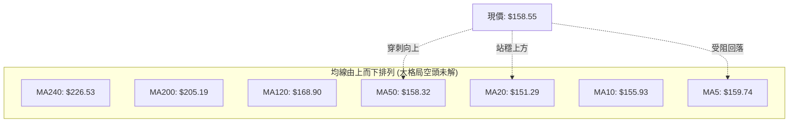

#### 各週期均線數據與偏離度

| 均線名稱 | 當前數值 | 價格相對於均線 | 均線趨勢走向 | 技術面含義 |
|----------|----------|----------------|--------------|------------|
| **MA5** | $159.74 | -0.75% | ▼ 下行 (-1.19) | 極短線面臨微幅漲多回吐，短壓沉重 |
| **MA10** | $155.93 | +1.68% | ▲ 上行 (+2.62) | 短線第1道動態支撐，提供逢低買盤 |
| **MA20** | $151.29 | +4.80% | ▲ 上行 (+7.26) | 短期生命線，已形成向上扣底與支撐 |
| **MA50** | $158.32 | +0.15% | ▲ 企穩 | 中期多空樞紐，現價正於此線反覆拉鋸 |
| **MA60** | $158.67 | -0.07% | ▼ 下行 (-0.12) | 與 MA50 形成雙重共振壓制區 |
| **MA120** | $168.90 | -6.13% | ▼ 下行 (-10.35)| 半年線持續下壓，上方第一道中級解套牆 |
| **MA200** | $205.19 | -22.73%| ▼ 下行 | 長期牛熊分界線，下行斜率陡峭，長線空頭壓制 |
| **MA240** | $226.53 | -30.01%| ▼ 下行 (-67.98)| 年線下傾，顯示過去一年籌碼整體處於深套狀態 |

*解讀結論*：目前均線呈現經典的「長週期空頭排列 (MA20 < MA50 < MA200)，但短週期均線黃金交叉向上突破 (現價 > MA20/MA50)」。此現象代表當前並非大牛市主升段，而是**深度空頭格局下的強技術性反彈波**。

### 📉 RSI(14) 分析

```
RSI(14) 動能進度尺
0              30                    62.46       70           100
├──────────────┼───────────────────────●─────────┼─────────────┤
[   極度超賣   ] [      常態中性區間    ▲    ] [  極度超買   ]
                                    當前數值
數值強度進度條：████████████░░░░░░░░  62.46% (偏多區間)
```

- **區間判定**：RSI(14) 當前值為 **62.46**，脫離了先前 8月底至 9月初的極度超賣區（當時週 RSI 一度跌至 16.9 的冰點），進入 50-70 的多頭控盤主動區。
- **背離分析**：
  - **日線層面**：數據明確標註「RSI 背離：無明顯背離」。價格由 $144.65 回升至 $158.55，RSI 同步自低點抬升至 62.46，呈現動能與價格同向確認的良性格局。
  - **週線層面**：9月6日價格探底 $144.65 時，週 RSI 為 16.9；而 6月28日價格下探 $137.95 時週 RSI 為 20.2。此處出現輕微的週線指標下行確認，但在 9月13日爆量換手後迅速拉升至 37.0，隨後跳升至 62.5，指標形成低位「V型反轉」，未產生惡性頂背離。

### 📊 MACD(12/26/9) 訊號解讀

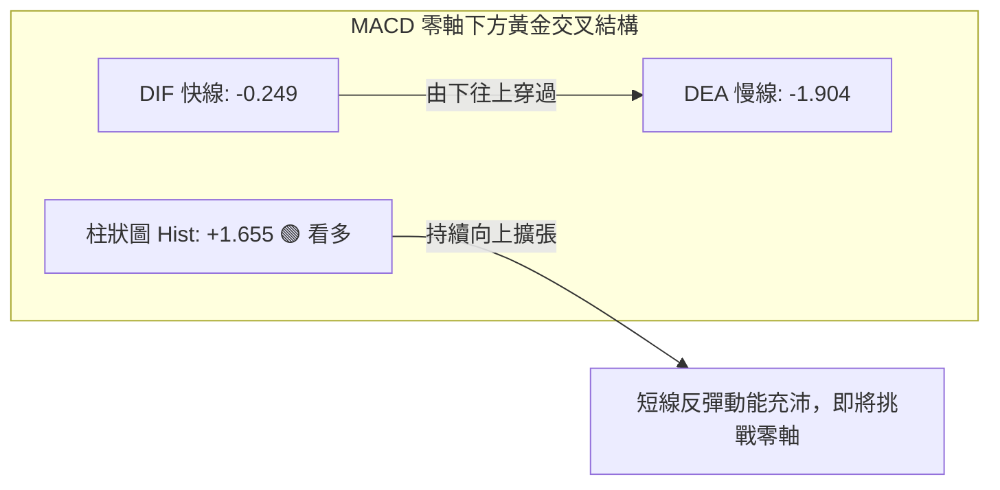

```
MACD 柱狀圖走勢動態 (近5週)
2026-08-30: ▄ -4.073  (空頭動能極致)
2026-09-06: ▃ -2.334  (綠柱縮短)
2026-09-13: ▂ -0.742  (空頭衰竭)
2026-09-20: █ +2.063  (翻紅，強多頭反撲)
2026-09-27: ▇ +1.655  (持續維持正值擴張)
```

- **解讀**：MACD 當前處於 -0.249，Signal 處於 -1.904，柱狀圖 Hist 報 **+1.655**。這是在零軸下方完成的強勢「黃金交叉」。柱狀圖自 9月13日當週迅速由負翻正，顯示短期空頭動能全面衰竭，多頭反彈動能正處於爆發後的釋放期。快線 -0.249 距零軸僅一步之遙，若能帶量穿越零軸，將帶動更多中線動能買盤進場。

### 📦 布林通道分析

```
AVAV 日線布林通道結構 (20日，2倍標準差)
══════════════════════════════════════════════════════════════════
 $164.21 ┬────────────────────────────────────────── 布林上軌 (阻力區)
         │               ▲
 $158.55 ┼──────────────● 價格位置 (%B = 0.78，強勢區間)
         │
 $151.29 ┼────────────────────────────────────────── 布林中軌 (MA20 支撐)
         │
 $138.37 ┴────────────────────────────────────────── 布林下軌 (超賣邊界)
══════════════════════════════════════════════════════════════════
```

- **通道帶寬與形態**：目前布林上軌為 **$164.21**，中軌為 **$151.29**，下軌為 **$138.37**。帶寬（Bandwidth = ($164.21 - $138.37) / $151.29）約為 **17.08%**，呈現經過前期劇烈擴張後的橫向平行收斂態勢。
- **%B 指標含義**：當前 %B 數值為 **0.78**。
  - %B > 0.5 表明價格處於強勢上半通道；
  - %B = 0.78 顯示價格正逼近上軌壓力（$164.21），距離僅約 3.57%。在 ADX = 16.49 的無趨勢盤整環境下，布林上軌通常構成天然的獲利了結反轉點，除非伴隨顯著巨量爆發，否則不易直接向上「推軌」運行。

### 💹 成交量分析（量價配合度）

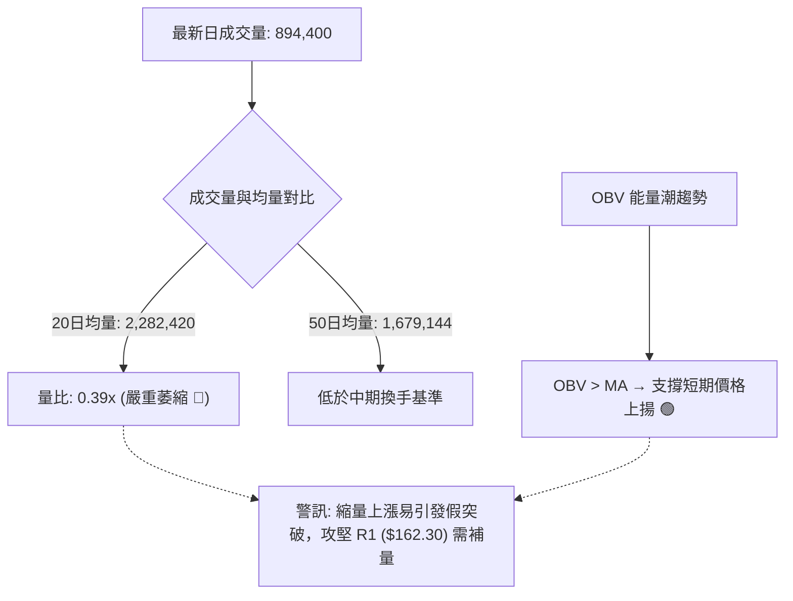

- **量價健康度診斷**：
  - **量能萎縮隱憂**：最新單日成交量僅 894,400 股，相比 20 日均量 2,282,420 股大幅萎縮（量比 0.39x）。在價格逼近關鍵阻力位 R1: $162.30 的關鍵時刻，縮量推進顯示追高意願不足，主要由賣壓減輕所推動，此為典型的「無量反彈」。
  - **OBV 積極信號**：數據顯示「OBV > MA → 量能支撐上漲」，說明從中期籌碼沉澱來看，9月中旬在 $144-$146 區間所聚集的巨量（如 2026-09-13 當週超過 2,040 萬股的換手）並未出逃，籌碼結構在低位相對安定。後續向上突破的先決條件是日成交量必須回升至 200 萬股以上。

---

## 6. 動能與波動率

### ⚡ 動能評估四象限

```
動能與波動率定位矩陣
       高波動率 (High Volatility)
                 │
      Q3 (高危)  │      Q4 (突破)
                 │
─────────────────┼─────────────────
                 │  當前定位點: Q1
      Q2 (低迷)  │  ● [強動能 / 中低波動]
                 │
       低波動率 (Low Volatility)
   弱動能 ───────┴─────── 強動能
 (Weak Momentum)    (Strong Momentum)
```

| 象限 | 動能維度 | 波動維度 | 歷史市場特徵 | 當前 AVAV 狀態與評估 |
|------|----------|----------|--------------|----------------------|
| **Q1** | **強** (RSI>60, MACD>0) | **中低** (ATR=6.03%) | **最佳趨勢跟隨/區間反彈波段** | **✓ 正處於此區間**。短線動能改善，但整體波動處於築底收斂期，適合有保護的區間交易 |
| **Q2** | 弱 (RSI<40, MACD<0) | 低 (縮量橫盤) | 謹慎觀望，等待變盤 | 9月初已脫離此區間 |
| **Q3** | 弱 (恐慌殺跌) | 高 (ATR>10%) | 爆量下挫，右側接飛刀 | 6-7月快速下墜期之特徵，目前已修復 |
| **Q4** | 強 (爆量單邊突破) | 高 (單日長紅) | 單邊主升浪或空頭軋空 | 尚需觀察能否放量突破 MA200 |

### 📊 ATR 波動率分析

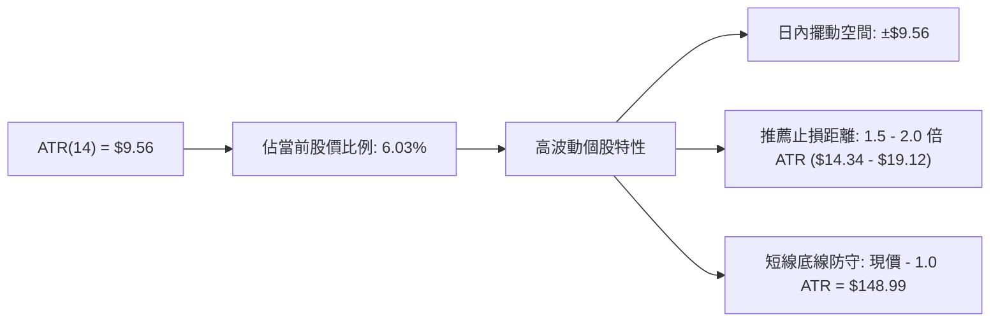

- **ATR 數值解讀**：當前 14 日平均真實波幅 ATR 為 **$9.56**，波動幅度佔當前股價比重達 **6.03%**。這意味著 AVAV 屬於高彈性標的，單日正常隨機雜訊波動即可能達到 $9-$10。
- **風控指引**：在制定交易策略時，止損距離切忌設置過窄（若僅設 2-3% 極易被日內正常波動洗出場）。標準多頭波段止損應設置在關鍵技術支撐下方至少 1.0 至 1.5 倍 ATR 空間。

### 📐 Beta 與市場相關性

- **Beta 係數**：**1.406**。
- **市場特徵分析**：
  - AVAV 對於標普500指數具備顯著的高敏感度（高彈性特徵，Beta > 1）。當美股大盤處於風險偏好（Risk-On）情緒時，該股的反彈爆發力通常是大盤的 1.4 倍左右；反之，在市場恐慌回調時，其下行壓力亦將同比例放大。
  - 當前空頭機構佔比（Short % Float）達 **11.2%**，Short Ratio 為 **3.62 天**。高 Beta 結合超過 10% 的做空比例，一旦股價帶量攻破阻力位 R1 ($162.30)，極易引發局部空頭平倉（Short Squeeze）推升行情。

---

## 7. 多時框架總結

### 📋 時框架評分表

| 時框架 | 趨勢方向 | 動能狀態 | 均線排列特徵 | 形態完成度 | 綜合評分 | 交易導向建議 |
|--------|----------|----------|--------------|------------|----------|--------------|
| **短期 (日線)** | 🟢 向上偏多 | 🟢 MACD翻紅 / RSI=62.5 | 🟢 突破 MA20 與 MA50 | 🟡 箱體震盪上緣 | **68 / 100** | 逢低回踩佈局，博弈反彈 |
| **中期 (週線)** | 🟡 橫盤震盪 | 🟡 動能低位修復中 | 🔴 均線糾結走平 | 🟢 雙重底打底階段 | **52 / 100** | 區間交易，高拋低吸 |
| **長期 (月線)** | 🔴 單邊承壓 | 🔴 長期下行慣性 | 🔴 空頭排列 (遠低於MA200)| 🔴 尚未完成大底扭轉 | **38 / 100** | 嚴禁盲目長線重倉死扛 |

### 🔲 綜合訊號矩陣

```
時框架訊號收斂矩陣
┌──────────────┬──────────────┬──────────────┬──────────────┐
│   分析維度   │  短期 (日線) │  中期 (週線) │  長期 (月線) │
├──────────────┼──────────────┼──────────────┼──────────────┤
│ 均線方向     │  🟢 偏多     │  🟡 中性     │  🔴 看空     │
│ RSI 位置     │  🟢 偏多     │  🟡 中性     │  🔴 偏弱     │
│ MACD 狀態    │  🟢 黃金交叉 │  🟢 翻紅     │  🔴 零軸下方 │
│ 波動通道     │  🟢 逼近上軌 │  🟡 中軌震盪 │  🔴 下軌徘徊 │
│ 成交量配合   │  🔴 縮量反彈 │  🟢 底部放量 │  🟡 常態     │
└──────────────┴──────────────┴──────────────┴──────────────┘
```

### ⚖️ 多時框收斂結論

依據多時框收斂規則（規則 14）：
1. **當前市場定性**：ADX(14) 數值為 **16.49**，遠低於 25 的趨勢分水嶺。根據量化技術分析準則，此時**嚴禁採用單邊趨勢跟隨模型**，市場當前被判定為「**典型的寬幅震盪盤整行情**」。
2. **主導時框與交易區間**：在盤整行情中，分析權重全面向日線布林通道上下軌收斂。
   - **核心震盪箱體**：布林下軌 **$138.37**（疊加支撐位 S2: $139.28）至布林上軌 **$164.21**（疊加阻力位 R1: $162.30）。
3. **唯一方向性結論**：**【中性偏多，區間震盪反彈】**。
   - 儘管週線及月線受制於 MA200 ($205.19) 的長線空頭壓制，但日線級別在突破 MA20 ($151.29) 與 MA50 ($158.32) 後，多頭動能具備向上測試布林上軌及 R1 ($162.30) 的強烈傾向。整體策略定義為「以區間下軌與均線為保護的右側反彈波段操作」，堅決不追高，嚴控停損。

---

## 8. 交易策略建議

### 🗺️ 策略決策流程圖

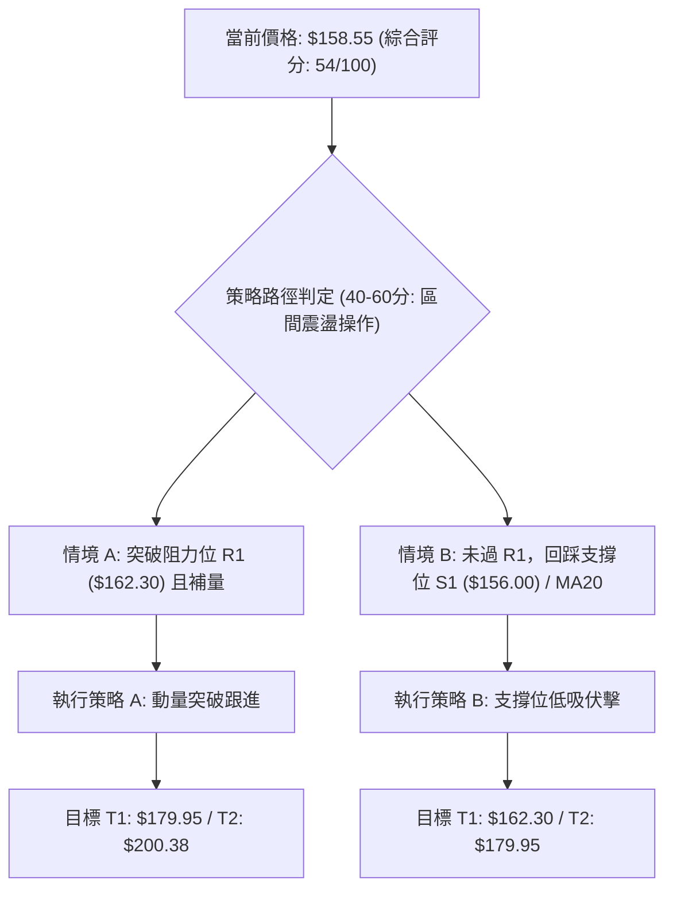

### 🧭 策略路由（依評分卡分流）

**當前主策略方向 = 【中性偏多：區間震盪操作與突破交易】（依評分 54/100）**
- 由於綜合評分處於 40–60 之間，且 ADX(14) = 16.49 確立盤整特徵，本報告**主推以布林通道與關鍵支撐阻力為核心的區間交易策略**。
- 不進行單邊激進追漲，防守第一，嚴格以 S1 ($156.00) 與 S2 ($139.28) 作為多空盾牌。

### 🎯 價格情境階梯（Price Scenarios）

價位嚴格引用第 4 章「關鍵價位」與「斐波那契回調位」之實際數值：

| 觸發條件 | 下一目標 | 後續延伸 | 情境技術含義 |
|----------|----------|----------|--------------|
| **帶量突破 R1 ($162.30)** | 斐波那契 78.6% 回調位 ($195.69) / R2 ($200.38) | R3 ($207.83) / MA200 ($205.19) | 短線盤整格局徹底向上突破，打開邁向 $200 的補漲空間 |
| **站穩現價區間 ($156.00 - $162.30)** | 布林通道上軌 ($164.21) | — | 於 MA50 ($158.32) 附近橫盤蓄勢，消化浮額 |
| **有效跌破 S1 ($156.00)** | S2 ($139.28) / 布林下軌 ($138.37) | S3 ($135.20) 52週低點 | 短線反彈失敗，重新回測箱體底部極限支撐 |

### 📊 情境機率分佈

| 情境劃分 | 機率估計 | 主要技術依據（引用指標狀態） |
|----------|----------|------------------------------|
| **突破上行 / 擴大反彈** | **50%** | MACD 柱狀圖翻正 (+1.655)；RSI(14)=62.46 維持偏多；OBV 大於均線支撐；價格企穩 MA20 與 MA50 之上 |
| **區間震盪 / 橫盤拉鋸** | **35%** | ADX(14)=16.49 (<25) 表明無趨勢；日成交量僅 89.4 萬股 (量比 0.39x)，缺乏單邊推升燃料 |
| **破位下行 / 再次探底** | **15%** | 長期 MA200 ($205.19) 仍處強烈下行趨勢；空頭排列壓制未解；若跌破 S1 恐觸發技術停損拋壓 |

### 🟢 主策略詳情（方向：中性偏多區間操作）

所有價位均嚴格基於提供之數據計算設定：

| 策略要素 | 策略 A（突破順勢策略：右側進場） | 策略 B（回踩低吸策略：左側佈局） |
|----------|----------------------------------|----------------------------------|
| **進場條件** | 日K收盤突破阻力位 R1 ($162.30)，且日成交量放大至 160萬股以上 | 價格回調測試支撐位 S1 ($156.00) 獲支撐，出現下影線或日K收紅 |
| **進場價格** | **$162.50** (突破確認點) | **$156.50** (S1 支撐回踩點) |
| **目標價 T1** | **$179.95** (箱體等距推算目標) | **$162.30** (前期阻力位 R1) |
| **目標價 T2** | **$200.38** (關鍵阻力 R2 / MA200 區域) | **$179.95** (箱體推算目標) |
| **止損價格** | **$155.00** (跌破支撐 S1 與 MA10 之保護位) | **$149.00** (跌破 MA20: $151.29 且留 1倍ATR緩衝) |
| **止損距離** | -$7.50 (-4.62%) | -$7.50 (-4.79%) |
| **第一盈虧比** | **2.33 : 1** (獲利 $17.45 / 風險 $7.50) | **0.77 : 1** (獲利 $5.80 / 風險 $7.50) |
| **第二盈虧比** | **5.05 : 1** (獲利 $37.88 / 風險 $7.50) | **3.13 : 1** (獲利 $23.45 / 風險 $7.50) |
| **預估勝率** | 55% | 65% |
| **建議倉位** | 10% - 15% 總資金 | 15% - 20% 總資金 |

### 🔴 反向風險觸發點（對沖提示）

供風控與多頭緊急撤退參考：
1. **第一防守破位點：收盤跌破 S1 ($156.00)**。若日K實體跌破該位置，表明 MA50 站穩無效，短線多頭反彈力竭，應立即將多頭倉位縮減 50%。
2. **全面清倉止損點：跌破 MA20 ($151.29)**。若進一步失守布林中軌與 MA20，意味著反彈波段徹底終結，價格將滑向 S2 ($139.28) 甚至再測 52W 低點 S3 ($135.20)，此時多頭必須全數離場觀望或建立相應看跌期權對沖。

### ⭐ 整體訊號強度評星

```
做多訊號強度：★★★☆☆  (3.0/5星 — 短線反彈動能充足，受制於長期均線)
做空訊號強度：★★☆☆☆  (2.0/5星 — 52W低點附近空頭回補，下行動能減弱)
整體可信度：  ★★★☆☆  (3.5/5星 — ADX盤整期，技術指標在區間邊界具參考性)
```

---

## 9. 風險提示與監控

### ✅ 關鍵監控指標 Checklist

```
╔══════════════════════════════════════════════════════════════════╗
║               AVAV 技術監控每日檢查清單 (Daily Checklist)         ║
╠══════════════════════════════════════════════════════════════════╣
║ [ ] 價位突破監控：收盤價是否有效收復阻力位 R1: $162.30           ║
║ [ ] 均線動態支撐：MA50 ($158.32) 與 MA20 ($151.29) 是否維持多頭扣底║
║ [ ] 量能擴張驗證：日成交量是否回升突破 20日均量 (2,282,420 股)    ║
║ [ ] MACD 動能柱：柱狀圖是否持續維持在正值區間 (當前 +1.655)       ║
║ [ ] RSI 超買警戒：RSI(14) 衝高逼近 70 時是否出現高檔頓挫或頂背離  ║
║ [ ] 外部籌碼監控：做空比例 (Short % Float = 11.2%) 是否觸發軋空  ║
║ [ ] 絕對風險底線：支撐位 S1: $156.00 與 S2: $139.28 是否完好守住 ║
╚══════════════════════════════════════════════════════════════════╝
```

### ⚠️ 風險場景分析

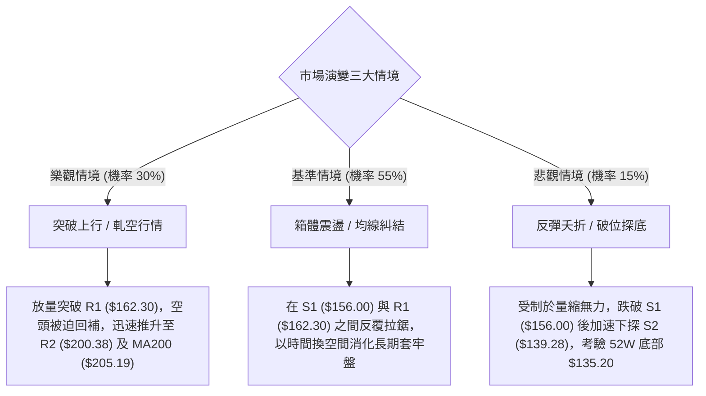

### 🛡️ 風險管理重要提醒

1. **嚴防流動性與縮量陷阱**：當前成交量比僅 0.39x，在縮量狀態下的價格拉升極易被大額賣單直接擊穿。在成交量未有效放大前，嚴格限制單筆交易資金佔比不超過總資產的 15%。
2. **高 Beta 波動調控**：AVAV Beta 高達 1.406，且 ATR 達 $9.56 (6.03%)，標的波動劇烈。進場前必須嚴格依照風險報酬比執行止損計畫，建議每筆交易所承受的賬戶最大虧損不超過總資本的 1.0% - 1.5%。
3. **長期均線壓制原則**：由於 MA200 ($205.19) 斜率持續向下，任何接近 $195 - $205 區域的反彈均應視為潛在的「賣出/減碼窗口」，而非長線加碼點，直至月線級別出現實質性結構反轉。

---

## 📋 報告總結

```
╔══════════════════════════════════════════════════════════════════╗
║                   AVAV 技術分析報告總結                          ║
╠══════════════════════════════════════════════════════════════════╣
║ 報告日期：2026-09-25                                             ║
║ 當前價格：$158.55                                                ║
║ 分析評級：⚖️ 中性偏多（區間反彈 / 底部構築階段）                ║
╠══════════════════════════════════════════════════════════════════╣
║ 關鍵結論：                                                       ║
║ ├─ 長期趨勢：🔴 處於自 $417.86 回落之空頭大格局，MA200 ($205.19) 壓制║
║ ├─ 中期趨勢：🟡 於 $135.20 - $192.81 寬幅箱體進行底部築底整理   ║
║ ├─ 短期趨勢：🟢 站穩 MA20 ($151.29) 與 MA50 ($158.32)，MACD柱翻正║
║ ├─ 關鍵支撐：S1: $156.00 ｜ S2: $139.28 ｜ S3: $135.20           ║
║ ├─ 關鍵阻力：R1: $162.30 ｜ R2: $200.38 ｜ R3: $207.83           ║
║ └─ 分析師目標：均價 $219.35 (Low: $148.57 / High: $315.00)      ║
╠══════════════════════════════════════════════════════════════════╣
║ 最優策略組合：                                                   ║
║ 1. 🥇 最佳機會（策略 B）：回踩支撐位 S1 ($156.00-$156.50) 低吸，  ║
║    止損設 $149.00，第一目標看 R1: $162.30，第二目標看 $179.95。    ║
║ 2. 🥈 次選機會（策略 A）：帶量向上突破 R1 ($162.30) 右側追買，   ║
║    止損設 $155.00，博弈空頭回補邁向 R2 ($200.38)。               ║
║ 3. 🥉 保守選擇：在 ADX < 25 且成交量未放大前，維持空倉或觀望，   ║
║    靜待價格回踩布林中軌/MA20 ($151.29) 尋求企穩信號。           ║
╚══════════════════════════════════════════════════════════════════╝
```

---

> ⚠️ **免責聲明**：本報告為技術分析研究，所有數據、圖表及價位推算均基於歷史市場交易資訊。本報告**僅供研究與學術參考**，**不構成任何要約、招攬或投資建議**。金融市場瞬息萬變，技術指標存在滯後性與失效風險，投資人應獨立評估風險並自負盈虧。

---

*報告生成時間：2026-09-25 ｜ 數據來源：Yahoo Finance ｜ 分析框架：多時框技術分析體系*