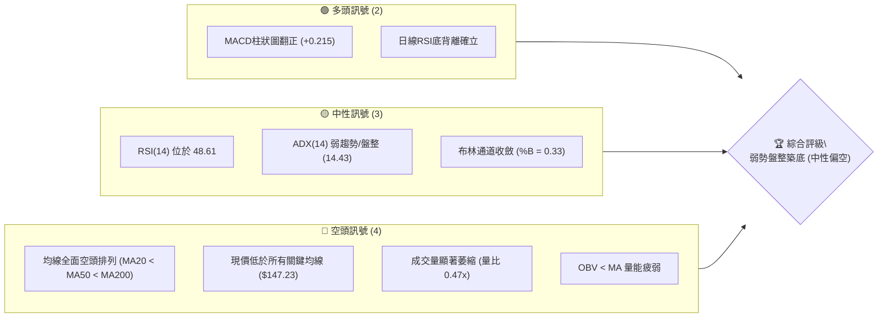
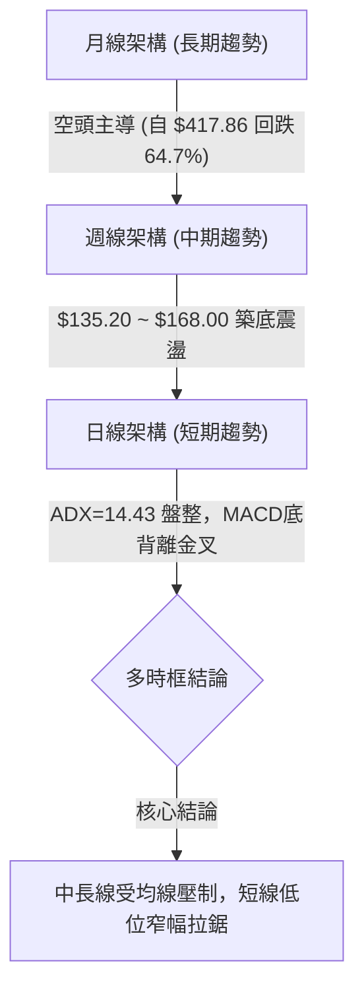
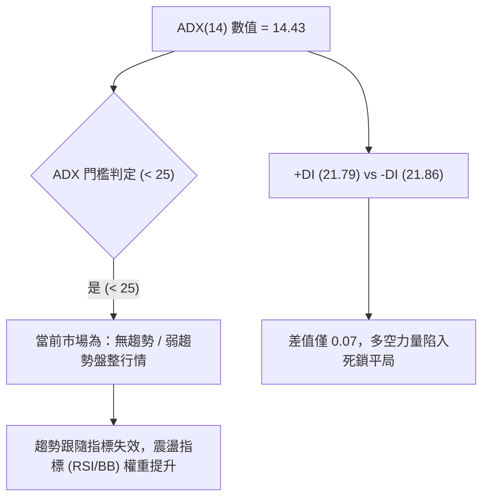
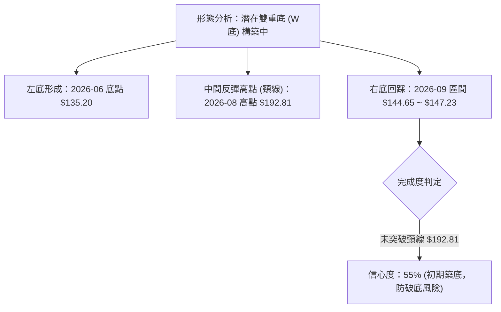
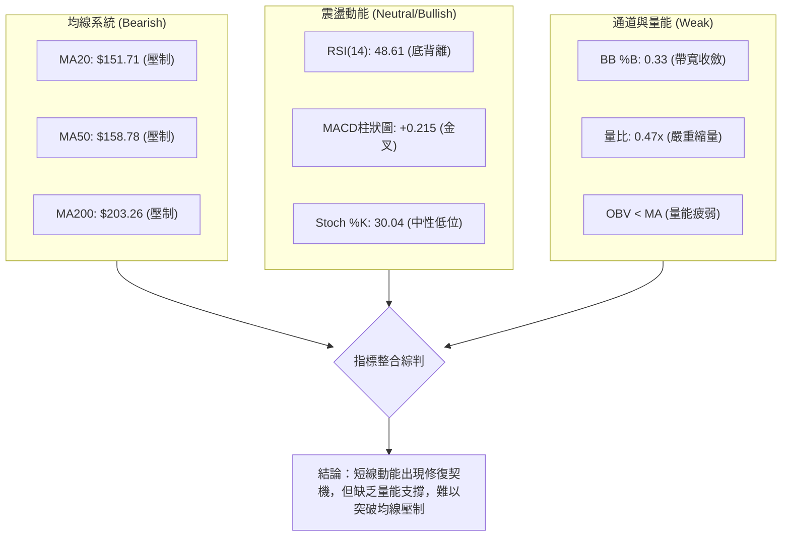
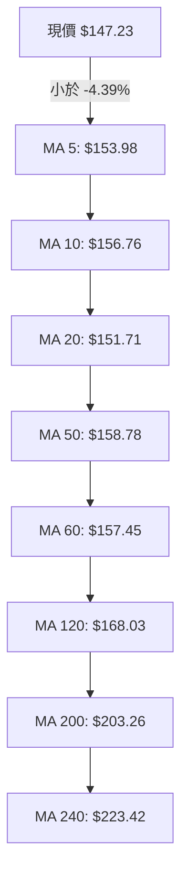
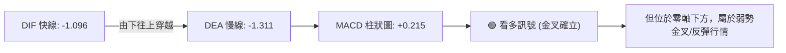
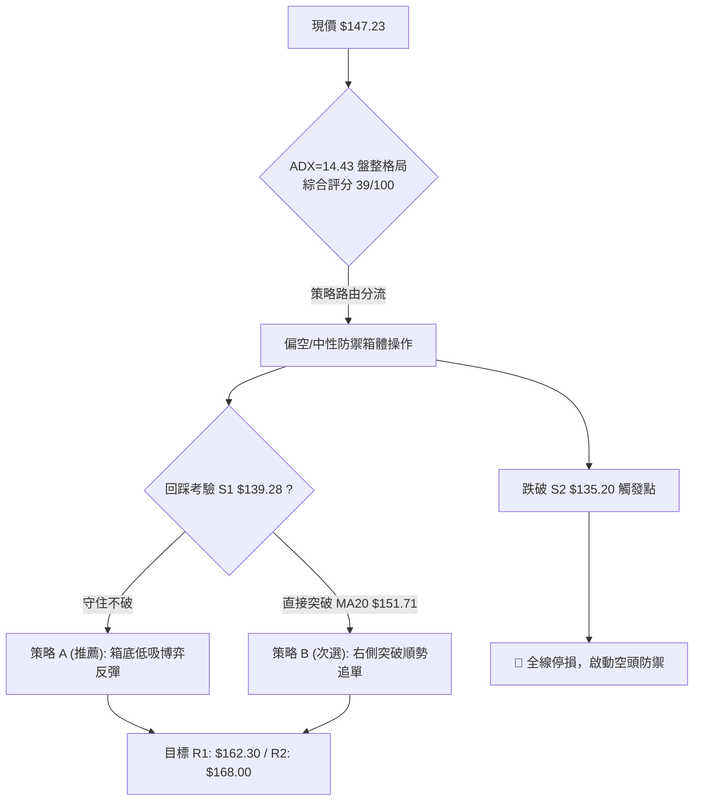
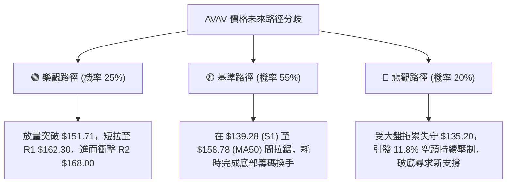

# AVAV 技術分析報告

> **報告日期**：2026-09-29 ｜ **語言**：繁體中文 ｜ **數據來源**：Yahoo Finance ｜ **當前價格**：$147.23

---

## 目錄

| 章節 | 內容 |
|------|------|
| [1. 技術面概覽](#1-技術面概覽) | 訊號儀表板、核心指標、評分卡 |
| [2. 趨勢分析](#2-趨勢分析) | 多時框趨勢、長中短期走勢、ADX強度 |
| [3. 圖表形態分析](#3-圖表形態分析) | 形態識別、K線組合、目標價計算 |
| [4. 支撐與阻力](#4-支撐與阻力) | 關鍵價位、斐波那契回調結構 |
| [5. 技術指標深度解讀](#5-技術指標深度解讀) | 均線系統、RSI背離、MACD、布林通道、OBV |
| [6. 動能與波動率](#6-動能與波動率) | 動能象限、ATR風控參數、Beta關聯度 |
| [7. 多時框架總結](#7-多時框架總結) | 時框架矩陣、多時框收斂定調 |
| [8. 交易策略建議](#8-交易策略建議) | 策略路由、價格情境、主策略詳解 |
| [9. 風險提示與監控](#9-風險提示與監控) | 監控Checklist、三情境路徑、風控規則 |
| [10. 報告總結](#-報告總結) | 核心結論與執行摘要 |

---

## 1. 技術面概覽

### 🎯 技術訊號儀表板



AVAV 目前處於自 52 週高點 $417.86 大幅回檔後的底部震盪整理階段。技術面呈現典型的「均線全面壓制、動能出現超跌底背離、趨勢進入無方向震盪」之複合格局。

### 📊 核心指標速覽表

| 指標類別 | 指標名稱 | 當前數值 | 訊號 | 解讀 |
|:---|:---|:---:|:---:|:---|
| **價格** | 當前收盤價 | $147.23 | 🔴 | 位於 52 週高低區間底部 4.3% 分位，弱勢承壓 |
| **均線** | 短期 MA20 | $151.71 | 🔴 | 現價低於 MA20 (-2.95%)，短線反彈受阻 |
| **均線** | 中期 MA50 | $158.78 | 🔴 | 現價低於 MA50 (-7.27%)，中期空頭結構未破 |
| **均線** | 長期 MA200| $203.26 | 🔴 | 現價遠低於年線 (-27.57%)，長線處於熊市修正 |
| **動能** | RSI(14) | 48.61 | 🟡 | 位於中性平衡區，但具備顯著底背離反彈訊號 |
| **動能** | MACD (12,26,9)| -1.096 / -1.311 | 🟢 | 快線上穿慢線，柱狀圖正值 (+0.215)，動能修復 |
| **隨機指標**| Stoch %K / %D | 30.04 / 48.16 | 🟡 | 脫離超賣區震盪上行，尚未形成強多頭推動力 |
| **趨勢強度**| ADX(14) | 14.43 | 🟡 | 遠低於 25，表明方向性單邊走勢停滯，轉為箱體盤整 |
| **方向指標**| +DI / -DI | 21.79 / 21.86 | 🔴 | -DI 微幅領先 +DI，空方力量略佔優勢但雙方勢均力敵 |
| **通道指標**| 布林通道 | 138.74 ~ 164.67 | 🟡 | %B 為 0.33，位於中軌與下軌之間，帶寬收縮 |
| **量能** | 成交量 / 20日均量 | 1.089M / 2.293M | 🔴 | 量比 0.47x，量能極度萎縮；OBV < MA 確認買盤觀望 |
| **波動** | ATR(14) | $9.67 | 🟡 | 波動率佔股價 6.57%，屬於中高波動範圍 |

### 🏆 技術評分卡

```
╔══════════════════════════════════════════════════════════════════╗
║                   技術評分卡 — AVAV (2026-09-29)                 ║
╠══════════════════════════════════════════════════════════════════╣
║ 趨勢強度 (Trend)     ████░░░░░░░░░░░░░░░░  20/100 🔴 弱勢空頭盤整║
║ 動能指標 (Momentum)  ██████████░░░░░░░░░░  52/100 🟡 MACD修復背離║
║ 支撐穩定度 (Support) ████████████░░░░░░░░  60/100 🟢 S1/S2防禦力尚存║
║ 成交量配合 (Volume)  ██████░░░░░░░░░░░░░░  30/100 🔴 量能嚴重枯竭║
║ 形態完整度 (Pattern) ██████████░░░░░░░░░░  50/100 🟡 雙底構築初期║
║ 均線排列 (MA System) ████░░░░░░░░░░░░░░░░  20/100 🔴 空頭全覆蓋排列║
╠══════════════════════════════════════════════════════════════════╣
║ 綜合技術評分         ████████░░░░░░░░░░░░  39/100 🔴 偏空箱體震盪║
╚══════════════════════════════════════════════════════════════════╝
```

---

## 2. 趨勢分析

### 🌐 多時框趨勢分析



### 📈 長期趨勢 — 12個月走勢圖（Unicode）

AVAV 過去 12 個月（2025-10 至 2026-09）經歷了由強轉極弱的深幅修正，自 2025 年 10 月歷史高點 $369.91（收盤價）以及 52 週天價 $417.86 一路破位下行。

```
AVAV 月線收盤走勢圖（2025-10 至 2026-09）
價格軸 ($)
$370 ┤ ● (2025-10: $369.91 高點)
$330 ┤   
$290 ┤     ● 
$250 ┤       ●       ● 
$210 ┤                 ●       ● (2026-05: $207.24 反彈頂)
$170 ┤                           ●
$130 ┤                             ●   ●   ● (2026-09: $147.23 現在)
     └─┬───┬───┬───┬───┬───┬───┬───┬───┬───┬───┬───
      10  11  12  01  02  03  04  05  06  07  08  09 (月份)
```

**12 個月走勢特徵分析表格**：

| 階段區間 | 時間跨度 | 起止收盤價 | 區間漲跌幅 | 走勢特徵與技術解讀 |
|:---|:---:|:---:|:---:|:---|
| **主跌第一波** | 2025/10 - 2025/12 | $369.91 → $241.89 | -34.61% | 觸頂暴跌，高位籌碼快速崩潰，多頭連環停損 |
| **弱勢抵抗期** | 2025/12 - 2026/02 | $241.89 → $252.25 | +4.28% | 嘗試於 $250.00 一線構築中繼平台，但無量反抽 |
| **主跌第二波** | 2026/02 - 2026/03 | $252.25 → $183.05 | -27.43% | 摜破 MA200，機構資金退場，技術結構全面惡化 |
| **次級反彈波** | 2026/03 - 2026/05 | $183.05 → $207.24 | +13.22% | 跌深技術性抽腳，反抽 MA120/MA200 頸線即遭空頭打壓 |
| **末跌築底期** | 2026/05 - 2026/09 | $207.24 → $147.23 | -28.96% | 探底至 52W 低點 $135.20 後進入低位鈍化，振幅收斂 |

### 📊 中期趨勢（週線分析）

中期走勢聚焦於 2026 年 6 月以來的 20 週收盤結構。股價在 2026-06-28 創下週收盤低點 $137.95（盤中觸及 52 週低點 $135.20），其後於 2026-08-16 伴隨量能反彈至 $192.81，隨後再度回落。

```
中期週線結構示意圖 ($)
$200.38 ┤==================== [強阻力 R3]
$192.81 ┤         ● (08/16 高點)
$168.00 ┤---------|---------- [阻力 R2 / MA120: $168.03]
$162.30 ┤---------|----●----- [阻力 R1 / 09/20: $159.95]
$147.23 ┤=========|====|===●= [現價 $147.23]
$139.28 ┤---------|----|----- [支撐 S1]
$135.20 ┤    ●----+----+----- [52W 低點 / 強支撐 S2]
        └────┬─────────┬──────
           06/28     09/29 (週別)
```

中期走勢顯示，每當價格突破 $160.00 均會遭遇賣壓回吐，而在 $135.20 至 $139.28 區間則顯現穩定承接盤，呈現標準的「低位寬幅箱體整理」。

### ⚡ 趨勢強度評估（ADX 解讀）



**ADX 趨勢強度對照表**：

| ADX 數值區間 | 趨勢強度判定 | 當前數值 | 交易意涵與操作指導 |
|:---:|:---:|:---:|:---|
| 0 - 20 | 極弱 / 無方向盤整 | **14.43** 🟢 (落入此區) | **嚴禁追高殺跌，以布林通道邊界與高拋低吸為主** |
| 20 - 25 | 弱趨勢 / 醞釀期 | — | 密切觀察均線收斂，準備捕捉單邊突破 |
| 25 - 40 | 強趨勢 (單邊行情) | — | 趨勢策略（均線突破、順勢加碼）權重提高 |
| > 40 | 極強趨勢 / 超買超賣 | — | 嚴防動能竭盡與反轉行情 |

---

## 3. 圖表形態分析

### 🔍 形態識別系統



**形態識別與信心度評估表**：

| 形態名稱 | 信心度 | 判斷依據（引用數據） | 完成度 | 目標價（附計算式） |
|:---|:---:|:---|:---:|:---|
| **潛在雙重底 (W-Bottom)** | **55%** | 兩次下探支撐：左底 52W 低點 $135.20，右底 9月低點 $144.65，現價 $147.23 獲得支撐。 | 60% (右底成形，待放量) | 若放量突破頸線 $192.81：<br>形態高度 = $192.81 - $135.20 = $57.61<br>理論目標 = $192.81 + $57.61 = **$250.42** (受阻於 R3 $200.38) |
| **矩形箱體整理 (Rectangle)** | **80%** | 價格長期受困於阻力 R1 $162.30 / R2 $168.00 與支撐 S1 $139.28 / S2 $135.20 之間。 | 90% (已多次回測上下軌) | 箱體突破目標：<br>箱頂 $168.00 + 高度 ($168.00 - $135.20 = $32.80) = **$200.80** (與 R3 $200.38 重合) |
| **均線死叉收斂形態** | **70%** | MA5 ($153.98) 至 MA240 ($223.42) 呈扇形空頭展開，但短期 MA5/10/20 振幅大幅壓縮。 | 85% (短期黏合) | 僅作指標型解讀：空頭勢頭放緩，即將引發均線修復或二次下探。 |

### 🕯️ 重要K線形態分析（近 5 個月收盤走勢）

| 月份 | 收盤價 | K線形態 | 解讀 | 訊號 |
|:---:|:---:|:---|:---|:---:|
| **2026-05** | $207.24 | 長上影小陽線 | 向上試探 MA200 失敗，空方強力拋壓進場 | 🔴 假突破翻空 |
| **2026-06** | $165.07 | 破位中長陰線 | 跌破 $180 重要心理關口，引發恐慌性停損 | 🔴 空頭吞噬 |
| **2026-07** | $149.37 | 下影長十字星 (Hammer) | 探底 $135.20 獲得強勁逢低買盤支撐，空頭動能趨緩 | 🟡 止跌錘子線 |
| **2026-08** | $148.35 | 沖高回落倒錘頭線 | 月中上探 $192.81 受阻回落，上方套牢籌碼沉重 | 🟡 沖高遇阻 |
| **2026-09** | $147.23 | 窄幅縮量紡錘線 (Spinning Top) | 波動率極度萎縮，多空雙方陷入僵局，量能降至冰點 | 🟡 變盤前夕 |

### 📉 ASCII 走勢形態示意圖

```
雙底 (W底) 構築與矩形箱體示意圖
價格 ($)
$192.81 ┤                ▲ 頸線 (08/16 波段高點)
$180.00 ┤               / \
$168.00 ┤=======/======/===\=================== [箱頂 R2]
$162.30 ┤------/------/-----\-------/---------- [阻力 R1]
$147.23 ┤     /      /       \     /  ● 現價 ($147.23)
$139.28 ┤    /      /         \   /            [箱底 S1]
$135.20 ┤   ▼ 左底 /           ▼ 右底          [強支撐 S2]
        └───(06/28)────────────(09/06)────────
```

### 🎯 形態目標價計算

依據形態學原則，計算如下：
1. **箱體破位/突破測量法**：
   - 箱頂基準價位：$168.00 (R2)
   - 箱底基準價位：$135.20 (S2 / 52W Low)
   - 箱體垂直高度：$168.00 - $135.20 = $32.80
   - **向上突破量度目標價** = $168.00 + $32.80 = **$200.80**（此數值與由 OHLCV 歷史計算之阻力位 **R3: $200.38** 吻合）。
   - **向下破位量度目標價** = $135.20 - $32.80 = **$102.40**（若不幸跌破 52 週低點，將開啟新一輪下跌空間）。

---

## 4. 支撐與阻力

### 🗺️ 關鍵價位分布圖（Unicode）

```
AVAV 價位結構分布圖 (由 OHLCV 計算之實體聚類)
══════════════════════════════════════════════════════════════════
$200.38 ║██████████████████████████████║ 強阻力 R3 (年線/波段高點聚類)
$168.00 ║████████████████████          ║ 阻力 R2 (MA120 與反彈高點聚類)
$162.30 ║████████████████              ║ 關鍵阻力 R1 (布林上軌與短波高點)
$147.23 ╠══════════════════════════════╣ ◄ 現價 ($147.23)
$139.28 ║▓▓▓▓▓▓▓▓▓▓▓▓▓▓▓▓              ║ 近期支撐 S1 (布林下軌防線)
$135.20 ║██████████████████████████████║ 強支撐 S2 (52W 最低點/生命線)
══════════════════════════════════════════════════════════════════
```

### 🚧 阻力位分析表

所有阻力價位嚴格引用系統計算之波段高點聚類數值：

| 阻力級別 | 價位 | 距現價幅動 | 形成原因與技術匯聚點 | 突破難度 | 重要性 |
|:---:|:---:|:---:|:---|:---:|:---:|
| **R1** | **$162.30** | +10.24% | 近期波段高點聚類，接近布林通道上軌 ($164.67) 及 MA60 ($157.45) 壓制帶 | 🟡 中等 | 🟢 短線多空分水嶺 |
| **R2** | **$168.00** | +14.11% | 近一年密集套牢中繼區，與半年線 MA120 ($168.03) 形成強大共振阻力 | 🔴 較高 | 🟡 中期翻多必經之路 |
| **R3** | **$200.38** | +36.10% | 2026年5月反彈高點 ($207.24) 聚類區，疊加年線 MA200 ($203.26) 壓制 | 🔴 極高 | 🔴 牛熊牛市分界點 |

### 🛡️ 支撐位分析表

所有支撐價位嚴格引用系統計算之波段低點聚類數值：

| 支撐級別 | 價位 | 距現價幅動 | 形成原因與技術匯聚點 | 守住機率 | 重要性 |
|:---:|:---:|:---:|:---|:---:|:---:|
| **S1** | **$139.28** | -5.40% | 近一年次級低點聚類，與當前日線布林通道下軌 ($138.74) 形成動態重疊 | 🟢 70% | 🟡 日常箱體下緣防線 |
| **S2** | **$135.20** | -8.17% | 52 週最低點 (2026-06/07 探底低點)，斐波那契 100% 絕對回撤支撐 | 🟢 85% | 🔴 決定是否破底的關鍵水準 |

### 📐 斐波那契回調位分析

依據 52 週極值區間（高點 **$417.86** → 低點 **$135.20**，垂直落差 $282.66）之精確計算：

```
斐波那契黃金分割結構梯隊 ($)
$417.86 ┤ 0.0%  (52W High)
$351.15 ┤ 23.6% 回調位
$309.88 ┤ 38.2% 回調位
$276.53 ┤ 50.0% 均衡位
$243.18 ┤ 61.8% 黃金分割位
$195.69 ┤ 78.6% 極限回調位 ────────────────────── (接近 R3 $200.38)
$147.23 ┤ ◄ 現價位於 78.6% 與 100.0% 之間 (超深回撤區)
$135.20 ┤ 100.0% (52W Low) ─────────────────────── (強支撐 S2)
```

**斐波那契結構深度解讀**：
1. **現價區間定位**：現價 $147.23 處於 **78.6% ($195.69)** 至 **100.0% ($135.20)** 的極度深水回撤區。股價跌破 78.6% 意味著先前的長期上升趨勢在結構上已遭破壞，目前屬於超跌後的底部基底重建。
2. **阻力共振確認**：斐波那契 78.6% 回調位 **$195.69** 與前期反彈高點 $192.81 以及歷史聚類阻力 **R3: $200.38** 形成多重共振阻力帶。若未來有反彈行情，該區間將是難以逾越的技術鴻溝。

---

## 5. 技術指標深度解讀

### 🎛️ 指標訊號總覽



### 📈 移動平均線排列分析



**均線矩陣詳細分析表**：

| 均線名稱 | 價位 | 現價相對偏離 | 斜率/走勢 | 技術評估與市場意涵 |
|:---:|:---:|:---:|:---:|:---|
| **MA5** | $153.98 | -4.39% | 下彎 | 短線下行微壓，限制日內反彈 |
| **MA10** | $156.76 | -6.08% | 下彎 | 超短期阻力，壓制週初多頭情緒 |
| **MA20** | $151.71 | -2.95% | 走平 | 月線生命線，突破方能擺脫超短線弱勢 |
| **MA50** | $158.78 | -7.27% | 下彎 | 中期生命線，多空分界核心阻力帶 |
| **MA60** | $157.45 | -6.49% | 下彎 | 季線阻力，與 MA50 形成雙重阻力屏障 |
| **MA120** | $168.03 | -12.38% | 下行 | 半年線，與阻力位 R2 $168.00 形成共振壓制 |
| **MA200** | $203.26 | -27.57% | 下行 | 長期牛熊分界線，代表長線空頭佔據絕對優勢 |
| **MA240** | $223.42 | -34.10% | 下行 | 年線基線，長期趨勢嚴重破位 |

**排列總結**：所有週期均線呈現嚴格的空頭扇形發散向下排列（現價 < MA5 < MA20 < MA50 < MA200）。價格在突破 MA20 ($151.71) 之前，任何反彈均屬弱勢技術抽腳。

### 📉 RSI(14) 分析與背離判定

- **當前數值**：**48.61**（處於 30 至 70 中性平衡區，偏向弱勢端）。
- **進度條展示**：
  ```
  超賣 [0] ────────── [30] ────────────── [70] ────────── [100] 超買
  RSI(14) 數值: 48.61 ▓▓▓▓▓▓▓▓▓▓▓▓▓▓▓▓░░░░░░░░░░░░░░░░░░ (中性)
  ```
- **背離分析（重要）**：
  - **形態特徵**：日線圖上明確確認 **底背離 (Bullish Divergence)**。
  - **數據比對**：2026-09-06 價格觸及低點 $144.65 時，RSI 跌至 16.9（極度超賣）；隨後價格在 2026-09-29 下探至 $147.23 附近時，RSI 卻維持在 48.61。
  - **結論**：價格維持低位震盪，但 RSI 低點大幅抬高，顯示空方動能大幅衰竭，潛在反彈動能正在蓄積。

### 📊 MACD(12,26,9) 訊號解讀



- **MACD 快線**：-1.096
- **MACD 慢線**：-1.311
- **MACD 柱狀圖**：**+0.215**（由負翻正，呈現連續兩週溫和擴張）
- **解讀**：MACD 線與訊號線在零軸下方形成低位金叉。由於快慢線均位於零軸下方負值區域，顯示這並非牛市強勢推動浪，而是深幅下跌後的動能修復期，目標首看挑戰零軸。

### 📦 布林通道分析 (Bollinger Bands, 20, 2)

```
布林通道價格位置示意圖 ($)
$164.67 ┤------------------------------ 上軌 (Upper Band)
        │
$151.71 ┤------------------------------ 中軌 (MA20)
        │       ● 現價: $147.23 (%B = 0.33)
$138.74 ┤------------------------------ 下軌 (Lower Band)
```

- **通道帶寬**：上軌 $164.67 與下軌 $138.74 相差 $25.93（帶寬壓縮至 17.6%），表明前期高波動性正被壓縮，即將迎來波動率變盤點。
- **%B 指標**：**0.33**（位於 0 與 0.5 之間，偏向通道下半部）。
- **解讀**：現價受到中軌 $151.71 壓制，但距離下軌 $138.74（與支撐 S1 $139.28 高度吻合）仍有安全緩衝。若跌至下軌且出現縮量十字星，將是短線極佳的逆勢博弈點。

### 💹 成交量分析（量價配合度與 OBV）

- **最新成交量**：1,089,200 股
- **20日均量**：2,293,440 股（**量比：0.47x**）
- **50日均量**：1,658,686 股
- **OBV 趨勢**：OBV < 20日均線，呈現疲弱走勢。
- **量價背離解讀**：最新量能僅達 20 日均量的 47%，呈現「低位嚴重縮量」特徵。量能萎縮表明拋壓已基本宣洩完畢（無人願意在 $147 殺跌），但缺乏主動性買盤入場承接。在沒有出現超過 2.3M 股的放量長陽之前，市場難以發起針對阻力位 R1 ($162.30) 的有效攻擊。

---

## 6. 動能與波動率

### ⚡ 動能評估四象限

```
動能與波動率四象限分佈
       高波動率 (High Volatility)
                 │
      Q3 (高波強動能)   │    Q4 (高波弱動能)
      高風險高回報     │    主力出貨/崩盤
────────────────┼────────────────
      Q1 (低波強動能)   │    Q2 (低波弱動能)  ◄ [AVAV 當前定位: Q2]
      最佳順勢發起點   │    低位築底/觀望震盪
                 │
       低波動率 (Low Volatility)
```

| 象限 | 動能狀態 | 波動狀態 | AVAV 狀態判定 | 交易決策指引 |
|:---:|:---:|:---:|:---:|:---|
| **Q1** | 強 (ADX>25, MACD>0) | 低 (ATR收斂) | — | 突破進場最佳時機 |
| **Q2** | **弱 (ADX=14.43)** | **低 (布林收縮)** | **✓ 確診在此象限** | **低吸高拋，不可追價，控制整體倉位** |
| **Q3** | 強 (動能充沛) | 高 (寬幅震盪) | — | 順勢波段持股，動態停利 |
| **Q4** | 弱 (跌勢洶湧) | 高 (恐慌拋售) | — | 嚴格停損出場，空手觀望 |

### 📊 ATR 波動率分析

- **ATR(14) 數值**：**$9.67**
- **ATR 佔比**：$9.67 / $147.23 = **6.57%**（日均波幅顯著，屬於中高波動率個股）。
- **風控參數設置依據**：
  - **日內安全噪音過濾距離** = 1.0 × ATR = **$9.67**
  - **波段止損標準距離** = 1.5 × ATR = 1.5 × $9.67 = **$14.51**
  - **寬鬆止損極限距離** = 2.0 × ATR = 2.0 × $9.67 = **$19.34**
  - **操作意涵**：由於每日波動近 $10，若進場點選擇不當，極易被隨機噪音掃出場。止損點設定必須與結構性支撐位（S1: $139.28）結合，不可設置過窄。

### 📐 Beta 與市場相關性

- **Beta 數值**：**1.406**（高於大盤基準 1.0）。
- **空頭部位佔流通股比例 (Short % Float)**：**11.8%**（Short Ratio: 2.11）。
- **解讀**：AVAV 具備顯著的高 Beta 特性，對大盤情緒及軍工國防板塊波動具備放大效應（若標普500波動 1%，AVAV 預期波動 1.41%）。同時，近 12% 的做空比例顯示市場存在大量空頭籌碼，一旦短線放量越過阻力位 R1 ($162.30)，將具備誘發空頭回補（Short Squeeze）的潛在動能。

---

## 7. 多時框架總結

### 📋 時框架評分表

| 時框架 | 趨勢方向 | 動能狀態 | 均線排列 | 形態結構 | 綜合評分 | 戰術建議 |
|:---:|:---:|:---:|:---:|:---:|:---:|:---|
| **長期 (月線)** | 🔴 強烈空頭 | 🔴 疲弱破位 | 🔴 空頭排列 (現價<<年線) | 深幅回撤 64.7% | **25/100** | 逢反彈減碼，不可長線重倉死守 |
| **中期 (週線)** | 🟡 橫向整理 | 🟡 動能止跌 | 🔴 均線死叉壓制 | 區間震盪 ($135~$168) | **45/100** | 以箱體思維對待，高拋低吸 |
| **短期 (日線)** | 🟡 築底反彈 | 🟢 RSI底背離 | 🟡 均線黏合微壓 | 雙底雛形/布林收縮 | **52/100** | 依托支撐 S1 尋求短多波段博弈 |

### 🔲 綜合訊號矩陣

| 維度 | 短期 (1-5天) | 中期 (1-4週) | 長期 (1-3月) | 矩陣一致性判定 |
|:---|:---:|:---:|:---:|:---|
| **趨勢方向** | 橫向偏多 (修復) | 橫盤震盪 (整理) | 顯著下行 (熊市) | ⚠️ **多時框分歧**：短多中橫長空 |
| **動能配合** | MACD 金叉柱擴張 | 跌勢減緩指標鈍化 | 動能長期負值 | 🟡 **底部收斂**：下行動能顯著枯竭 |
| **關鍵位制約** | 受阻 MA20 $151.71 | 受阻 R2 $168.00 | 受阻 R3 $200.38 | 🔴 **層層套牢**：上方空間被均線封鎖 |

### ⚖️ 多時框收斂結論

**嚴格依據多時框收斂規則定調**：
1. **行情性質判定**：當前 ADX(14) 為 **14.43 (< 25)**，明確定義當前市場處於**「盤整行情」**，而非單邊趨勢行情。
2. **主導時框收斂**：在 ADX < 25 的盤整結構中，日線布林通道上下軌 ($138.74 ~ $164.67) 及歷史聚類箱體（$135.20 ~ $168.00）取代長期均線成為主導交易信號。
3. **唯一收斂結論**：**中性觀望偏短多（低吸高拋箱體操作）**。日線級別的 RSI 底背離與 MACD 金叉提供了技術反彈的動能條件，但由於週線與月線均線全面壓制，此處不可視為反轉，僅定義為「箱體下沿獲得支撐後的技術性防守反抽」。

---

## 8. 交易策略建議

### 🗺️ 策略決策流程圖



### 🧭 策略路由（依評分卡分流）

> **當前主策略方向**：**偏空背景下的低位箱體防禦型多頭策略（依評分 39/100 定位為低位博弈）**
> 
> *註：由於整體評分為 39/100（落於 ≤40 偏空區間但逼近中性閾值），長線空頭仍為主旋律。然因 ADX=14.43 處於極度盤整期，且日線顯現極佳底背離，盲目於 $147 低位追空極易遭遇軋空。故主推「**依托關鍵支撐之區間低吸操作**」，並將跌破 52 週低點嚴格設定為反轉停損點。*

### 🎯 價格情境階梯（Price Scenarios）

價位嚴格引用第四章 OHLCV 計算之關鍵價位：

| 觸發條件 | 下一目標 | 後續延伸 | 情境含義與技術演變 |
|:---|:---:|:---:|:---|
| **向上突破 R1 $162.30** | R2 $168.00 | R3 $200.38 | 短線反轉轉強，挑戰半年線與箱頂 |
| **突破 MA20 $151.71** | R1 $162.30 | R2 $168.00 | 短線動能修復，展開常規反彈 |
| **維持現價 $147.23 震盪** | — | — | 窄幅無序盤整，等待量能釋放 |
| **向下回踩 S1 $139.28** | S2 $135.20 | — | 考驗布林下軌支撐，箱體下沿尋求買盤 |
| **跌破 S2 $135.20 (52W Low)**| $102.40 (測量目標) | — | 中長期破位崩潰，展開新一輪單邊暴跌 |

### 📊 情境機率分佈

| 情境劇本 | 機率 | 主要技術依據 |
|:---|:---:|:---|
| **情境一：箱體內技術反彈** (上測 R1/R2) | **45%** | 日線 RSI 底背離確立、MACD 柱狀圖翻正、拋壓耗盡（量比 0.47x） |
| **情境二：窄幅區間拉鋸** ($139 ~ $152) | **35%** | ADX(14)=14.43 無方向，+DI/-DI 糾纏，機構買盤觀望 |
| **情境三：摜破底線下行** (跌破 S2) | **20%** | 全均線呈空頭排列，基本面成長放緩，若大盤重挫可能引發多殺多 |

### 🟢 主策略詳情

本策略專注於箱體邊界的勝率與風險報酬比：

| 策略要素 | 策略 A：左側支撐低吸博弈 (首選) | 策略 B：右側突破加碼跟進 (次選) |
|:---|:---|:---|
| **策略類型** | 支撐位回踩承接 (Range Trading) | 突破確認追擊 (Momentum Breakout) |
| **進場條件** | 股價回踩 S1 附近獲得支撐，出現止跌K線 | 日線收盤放量突破 MA20 ($151.71) 且量比>1.2 |
| **進場價格** | **$140.50** (位於 S1 $139.28 上方保護區) | **$152.50** (確認突破 MA20 站穩) |
| **目標價 T1** | **$162.30** (阻力位 R1) | **$162.30** (阻力位 R1) |
| **目標價 T2** | **$168.00** (阻力位 R2 / MA120) | **$168.00** (阻力位 R2 / 箱頂) |
| **止損價格** | **$134.20** (跌破 52W 低點 S2 $135.20 下方 1$) | **$146.50** (跌破前日震盪平台中位) |
| **潛在空間** | T1: +$21.80 (+15.5%) / T2: +$27.50 (+19.6%)| T1: +$9.80 (+6.4%) / T2: +$15.50 (+10.2%) |
| **承受風險** | -$6.30 (-4.48%) | -$6.00 (-3.93%) |
| **風險報酬比 (R:R)**| **1 : 3.46** (以 T1 計算) / **1 : 4.37** (T2) | **1 : 1.63** (以 T1 計算) / **1 : 2.58** (T2) |
| **成功機率** | **65%** | **55%** |
| **建議倉位** | **總資金 8% - 10%** (試探性質) | **總資金 5% - 8%** (短線順勢) |

### 🔴 反向風險觸發點（對沖與止損提示）

若發生以下事件，原交易邏輯徹底推翻，必須執行嚴格風控：
1. **多頭停損終極防線**：任何時候只要**日線收盤價跌破 S2: $135.20**，表明 52 週底部徹底瓦解，潛在雙底演變為向下破位，所有多頭部位必須無條件清倉。
2. **空頭對沖觸發點**：若價格放量跳空擊穿 $135.20，可立即將投資組合切換為空頭避險，做空目標下看形態量度跌幅目標 $102.40。

### ⭐ 整體訊號強度評星

```
做多訊號強度：★★☆☆☆  (2.5/5星 — 僅限超跌反彈博弈)
做空訊號強度：★★★☆☆  (3.0/5星 — 大趨勢依然偏空，但低位空間受限)
整體可信度：  ★★★☆☆  (3.5/5星 — 指標低位修復，量能制約高度)
```

---

## 9. 風險提示與監控

### ✅ 關鍵監控指標 Checklist

```
╔══════════════════════════════════════════════════════════════════╗
║               AVAV 技術監控 CHECKLIST (每日盤後掃描)             ║
╠══════════════════════════════════════════════════════════════════╣
║ [ ] 價位維度: 收盤價是否突破 MA20 ($151.71)？                     ║
║ [ ] 價位維度: 收盤價是否跌破強支撐 S2 ($135.20)？ (🚨 極度危險)  ║
║ [ ] 動能維度: 日線 RSI(14) 是否持續維持在 45 之上拒絕下探？      ║
║ [ ] 動能維度: MACD 柱狀圖是否維持正擴張 (+0.215 之上)？          ║
║ [ ] 趨勢維度: ADX(14) 是否放量抬頭突破 20，宣告單邊行情開啟？    ║
║ [ ] 量能維度: 單日成交量是否放大至 2.3M 股之上 (量比 > 1.0)？     ║
║ [ ] 通道維度: 布林通道 %B 是否有效向上突破 0.5 (站穩中軌)？       ║
╚══════════════════════════════════════════════════════════════════╝
```

### ⚠️ 風險場景分析



### 🛡️ 風險管理重要提醒

1. **ATR 波動適應原則**：AVAV 目前日均波動值 ATR 達 $9.67，佔比高達 6.57%。這意味著即便在盤整市中，日內上下波動 $5~$8 亦屬正常噪音。投資者切忌以 1%~2% 的超窄止損入場，止損設定必須嚴格參考支撐結構外側（$134.20）。
2. **倉位管理軍規**：鑑於空頭均線排列尚未扭轉，當前參與反彈僅屬「輔助性交易」。整體 AVAV 部位不應超過投資組合總資金的 **8% - 10%**。單筆交易最大虧損額必須嚴格控制在總帳戶淨值的 **0.5% - 1%** 範圍內。
3. **空頭回補假象辨別**：當前做空比率達 11.8%，若股價出現無量急拉，多為空頭被動平倉（Short Covering），而非主動長線買盤建倉。除非見到成交量連續數日顯著放大（超過 20 日均量 2.29M 股），否則切勿在 $160 以上追漲。

---

## 📋 報告總結

```
╔══════════════════════════════════════════════════════════════════╗
║                   AVAV 技術分析報告總結                          ║
╠══════════════════════════════════════════════════════════════════╣
║ 報告日期：2026-09-29                                             ║
║ 當前價格：$147.23                                                ║
║ 分析評級：⚖️ 中性偏空 (弱勢低位築底，防守反彈操作)               ║
║                                                                  ║
║ 核心結構結論：                                                   ║
║ ├─ 長期趨勢：🔴 強烈空頭 (自 $417.86 回落 64.7%，處均線壓制深處) ║
║ ├─ 中期趨勢：🟡 箱體震盪 (鎖死於 $135.20 至 $168.00 區間拉鋸)    ║
║ ├─ 短期趨勢：🟡 醞釀反彈 (ADX=14.43 弱趨勢，日線 RSI 底背離確立) ║
║ ├─ 關鍵支撐：S1: $139.28 (布林下軌) │ S2: $135.20 (52週生命線)  ║
║ ├─ 關鍵阻力：R1: $162.30 (反彈分界) │ R2: $168.00 (箱體頂/半年線)║
║ └─ 機構共識：買入 (19位分析師目標均價 $219.35，高於現價 +49%)   ║
║                                                                  ║
║ 最優交易策略矩陣：                                               ║
║ 1. 🥇 最佳機會 (策略 A)：回踩 S1 支撐 $140.50 低吸，止損設 $134.20║
║    目標 T1: $162.30，T2: $168.00，預期風報比高達 1:3.46。        ║
║ 2. 🥈 次選機會 (策略 B)：右側突破 MA20 ($152.50) 順勢加碼短多，   ║
║    止損設 $146.50，目標看至 R1: $162.30。                        ║
║ 3. 🥉 防守指令：收盤跌破 S2 ($135.20) 即刻全線撤退，嚴防破底崩潰。║
╚══════════════════════════════════════════════════════════════════╝
```

---

> ⚠️ **免責聲明**：本報告由量化技術分析系統自動生成，所有數據、支撐阻力位及推算均嚴格基於歷史 OHLCV 市場行情數據。本報告**僅供研究與學術參考**，**不構成任何形式的要約、招攬或投資操作建議**。金融市場瞬息萬變，技術指標存在滯後與失效風險，投資者應獨立評估市場環境，嚴格執行個人風險控管紀律。

---
*報告生成時間：2026-09-29 ｜ 數據來源：Yahoo Finance ｜ 分析框架：資深多時框量化技術分析架構*