# AVAV 技術分析報告

> **報告日期**：2026-09-30 ｜ **語言**：繁體中文 ｜ **數據來源**：Yahoo Finance ｜ **當前價格**：$143.24

---

## 目錄

| 章節 | 內容 |
|------|------|
| [1. 技術面概覽](#1-技術面概覽) | 訊號儀表板、核心指標、評分卡 |
| [2. 趨勢分析](#2-趨勢分析) | 多時框趨勢、長中短期走勢 |
| [3. 圖表形態分析](#3-圖表形態分析) | 形態識別、K線組合、目標價 |
| [4. 支撐與阻力](#4-支撐與阻力) | 關鍵價位、斐波那契回調 |
| [5. 技術指標深度解讀](#5-技術指標深度解讀) | MA/RSI/MACD/布林/成交量 |
| [6. 動能與波動率](#6-動能與波動率) | 動能評估、ATR、Beta |
| [7. 多時框架總結](#7-多時框架總結) | 時框架評分矩陣 |
| [8. 交易策略建議](#8-交易策略建議) | 多空策略、風險報酬比 |
| [9. 風險提示與監控](#9-風險提示與監控) | 監控指標、風險場景 |

---

## 1. 技術面概覽

### 🎯 技術訊號儀表板

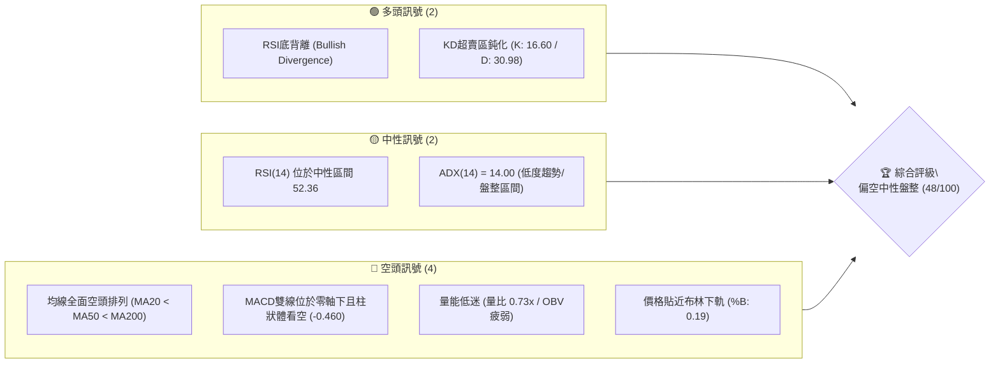

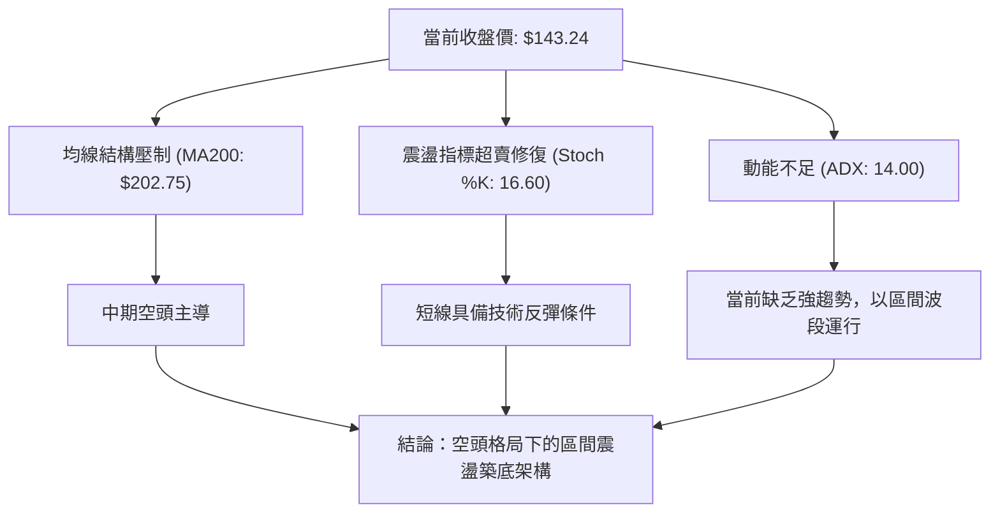

### 📊 核心指標速覽表

| 指標類別 | 指標名稱 | 當前數值 | 訊號 | 解讀 |
|----------|----------|----------|------|------|
| **價格** | 當前收盤價 | $143.24 | 🔴 | 位於52週區間下緣 2.8%，價格極度疲弱 |
| **均線** | MA20 (短天期) | $151.45 | 🔴 | 現價低於MA20達 5.42%，短線承壓 |
| **均線** | MA50 (中天期) | $158.79 | 🔴 | 現價低於MA50，中期下降壓力沉重 |
| **均線** | MA200 (長天期) | $202.75 | 🔴 | 價格遠低於牛熊分界線達 29.35%，長期空頭確立 |
| **動能** | RSI(14) | 52.36 | 🟡 | 數值處於中性區間，惟已出現顯著底背離訊號 |
| **動能** | MACD (12,26,9) | -1.886 / -1.426 | 🔴 | 雙線在零軸下方運行，柱狀體 -0.460 持續發散 |
| **動能** | KD 隨機指標 | %K: 16.60 / %D: 30.98 | 🟢 | 進入超賣臨界值，短期具反彈契機 |
| **趨勢** | ADX (14) / DMI | ADX: 14.00 (-DI: 24.38) | 🟡 | 趨勢動能極弱 (<25)，市場處於低波幅橫盤狀態 |
| **通道** | 布林通道 (%B) | 0.19 (軌道 $138.01 - $164.89) | 🔴 | 價格貼近下軌，空方佔優但擴散動能放緩 |
| **成交量**| 成交量與量比 | 1,709,500 / 0.73x | 🔴 | 成交量萎縮，低於20日均量 (2,336,035)，OBV疲弱 |
| **波動** | ATR(14) | $9.43 (6.58%) | 🟡 | 日內波動幅度中等，下檔空間受限但磨人 |

### 🏆 技術評分卡

```
╔══════════════════════════════════════════════════════════════════╗
║              技術評分卡 — AVAV (2026-09-30)                     ║
╠══════════════════════════════════════════════════════════════════╣
║ 趨勢強度 (Trend)      ██████░░░░░░░░░░░░░░  30/100  🔴 空頭壓制  ║
║ 動能指標 (Momentum)   ██████████░░░░░░░░░░  50/100  🟡 背離反彈  ║
║ 支撐穩定度 (Support)  ████████████░░░░░░░░  60/100  🟢 雙底支撐  ║
║ 成交量配合 (Volume)   ████████░░░░░░░░░░░░  40/100  🔴 量能退潮  ║
║ 形態完整度 (Pattern)  ████████████░░░░░░░░  60/100  🟡 潛在打底  ║
║ 均線排列 (MAs)        ██████░░░░░░░░░░░░░░  30/100  🔴 完全空頭  ║
╠══════════════════════════════════════════════════════════════════╣
║ 綜合評分              █████████░░░░░░░░░░░  48/100  🟡 區間震盪  ║
╚══════════════════════════════════════════════════════════════════╝
```

---

## 2. 趨勢分析

### 🌐 多時框趨勢分析

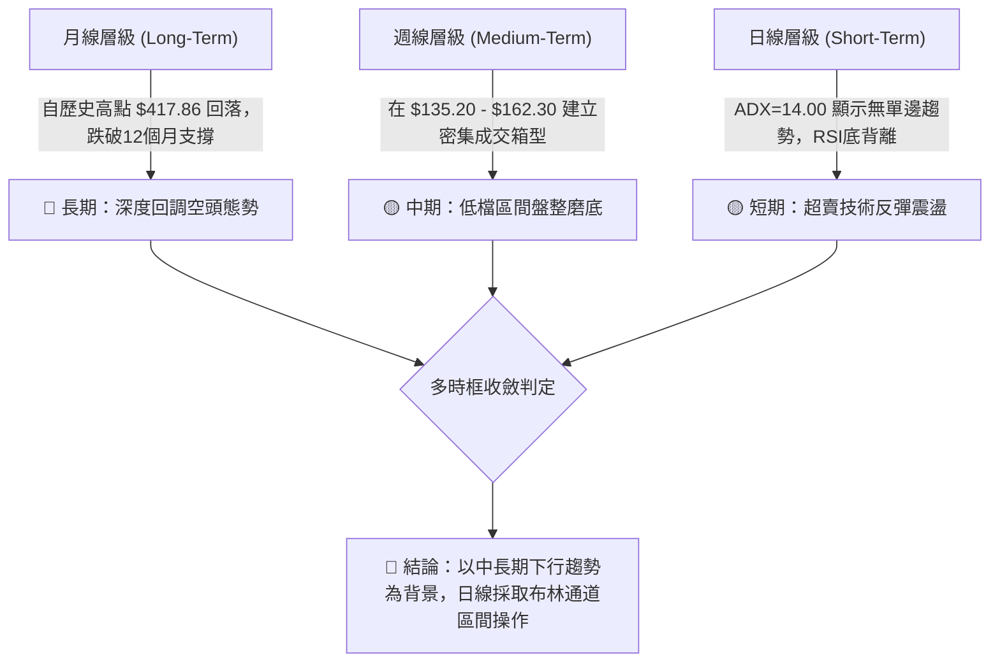

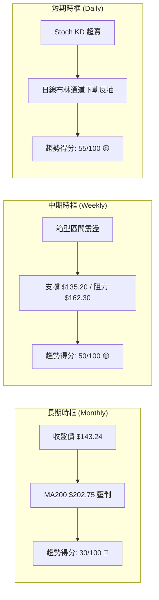

### 📈 長期趨勢 — 12個月走勢圖（Unicode）

```
AVAV 月線走勢圖（過去12個月：2025-10 至 2026-09）
價格軸 ($)
$370 ┤● (2025-10 高點 $369.91)
$330 ┤ ╲
$290 ┤  ● (11月 $279.46)   ● (2026-01 $278.39)
$250 ┤   ╲                ╱ ╲
$240 ┤    ● (12月 $241.89)   ● (02月 $252.25)
$200 ┤                        ╲       ● (05月 $207.24)
$180 ┤                         ● (03月 $183.05) ╲
$160 ┤                                           ● (06月 $165.07)
$145 ┤                                            ╲   ●    ● (08月 $148.35)
$135 ┤                                             ● (07月 $149.37) ╲  ●←現價 $143.24
     └─────────────────────────────────────────────────────────────────────────────
      10月  11月  12月  01月  02月  03月  04月  05月  06月  07月  08月  09月 (2026)
```

**走勢特徵分析表格**：

| 階段區間 | 時間跨度 | 起訖價位 | 區間漲跌幅 | 主要技術特徵與驅動因素 |
|----------|----------|----------|------------|------------------------|
| **見頂反轉** | 2025-10 ~ 2025-12 | $369.91 → $241.89 | -34.61% | 觸及波段歷史極限後高檔爆量長黑，跌破前波均線支撐 |
| **次級反彈** | 2025-12 ~ 2026-01 | $241.89 → $278.39 | +15.09% | 跌深技術性抽腳，反彈受阻於 $280 關卡形成次高點 |
| **加速崩跌** | 2026-01 ~ 2026-03 | $278.39 → $183.05 | -34.25% | 主跌段展開，空頭排列形成，連續下破重要心理整數關卡 |
| **築底試探** | 2026-03 ~ 2026-05 | $183.05 → $207.24 | +13.21% | 於 $180 附近獲逢低買盤介入，短線嘗試挑戰 MA200 反壓 |
| **低檔盤整** | 2026-06 ~ 2026-09 | $165.07 → $143.24 | -13.22% | 跌勢減緩進入低波幅橫盤，回測52週低點 $135.20 尋求支撐 |

### 📊 中期趨勢（週線分析）

```
近20週關鍵走勢示意與結構演變：
$210 ┤         ● (05-31 $207.24)
$195 ┤                ● (07-05 $190.89)  ● (08-16 $192.81)
$180 ┤               ╱ ╲                ╱ ╲
$165 ┤              ╱   ● (06-21 $169.61)   ● (08-23 $160.22)
$150 ┤             ╱     ╲                 ╱ ╲         ● (09-20 $159.95)
$140 ┤● (06-28 $137.95)   ● (07-19 $142.20)   ● (09-06 $144.65)  ●←現價 $143.24
$135 ┴────────────────────────────────────────────────────────────────────────
      06/28           07/19               09/06              09/30 (建立箱型底部)
```

週線層面顯示，AVAV 在 2026 年 6 月底創下 $137.95 低點後，雖然歷經數次脈衝式反彈至 $190.00 以上（如 07-05 的 $190.89 及 08-16 的 $192.81），但每次反彈皆未能站穩 MA60/MA120，隨後均回落至 $140.00-$150.00 區間。近 4 週收盤價分別為 $144.65、$146.71、$159.95、$152.05 與本週的 $143.24，顯示 $140.00 具備多頭抵抗力道。

### ⚡ 趨勢強度評估（ADX 解讀）

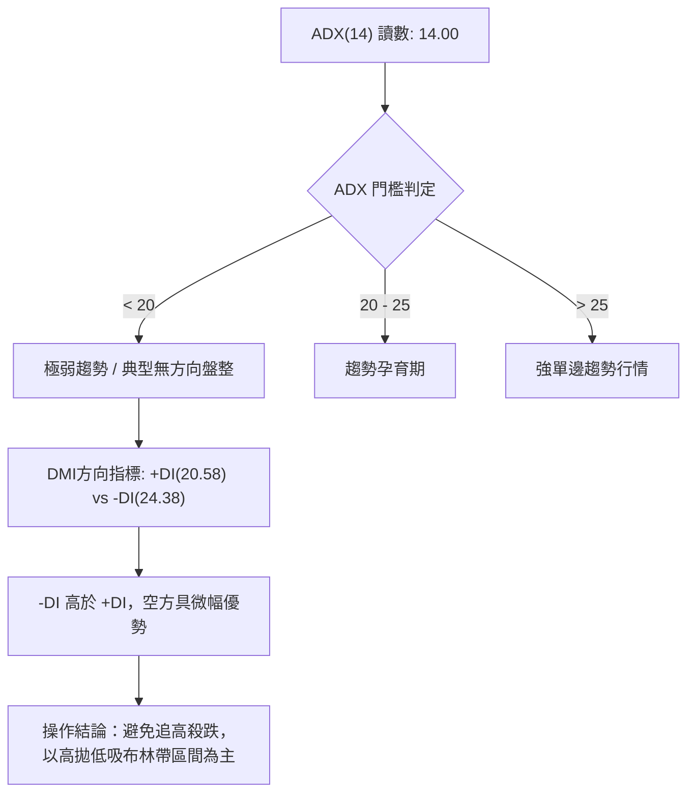

| ADX 數值區間 | 當前狀態 (ADX=14.00) | 趨勢強度評級 | 市場特徵與交易指引 |
|--------------|----------------------|--------------|--------------------|
| **0 - 20**   | **當前落點 (14.00)** | ⚪ 極弱 / 無趨勢 | 均線指標失效頻率高，假突破極多，震盪指標 (RSI/KD) 優先度提升 |
| **20 - 25**  | 未達到               | 🟡 弱趨勢    | 行情醞釀突破，需密切觀察帶量方向 |
| **25 - 40**  | 未達到               | 🟢 明確趨勢  | 適合順勢突破交易與波段持倉 |
| **40 以上**  | 未達到               | 🔴 極強/過熱 | 動能消耗過劇，容易引發均線乖離修正 |

---

## 3. 圖表形態分析

### 🔍 形態識別系統

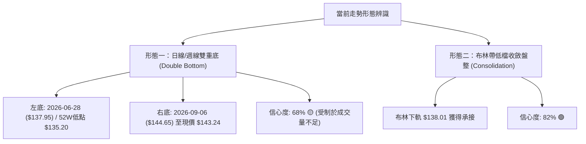

**形態信心度評估表**：

| 形態類別 | 信心度 | 判斷依據（引用數據） | 完成度 | 目標價（附計算式） |
|----------|--------|----------------------|--------|--------------------|
| **低檔雙底** (Double Bottom) | 68% | 2026-06-28 收盤 $137.95（低點 S2 $135.20 附近）與當前 $143.24 形成次級雙底架構；頸線位於 R1 $162.30。 | 60% | 頸線 R1 $162.30 + 形態高度 ($162.30 - $135.20 = $27.10) = **$189.40**（接近近20週波段高點 $190.89） |
| **矩形箱型整理** (Range Box) | 80% | 價格持續在支撐群 S1/S2 ($139.28-$135.20) 與阻力群 R1/R2 ($162.30-$168.00) 之間往返震盪。 | 85% | 突破 R1 $162.30 後看至 R2 **$168.00**，若站穩則進一步挑戰 R3 **$200.38** |
| **下降通道邊界** | 45% | 訊號不足，僅做指標型解讀（長期均線下壓，但短線振幅收縮，通道特徵退化）。 | 30% | 數據不足以支撐完整通道幾何，暫不推算 |

### 🕯️ 重要K線形態分析

| 月份 / 日期 | 收盤價 | K線形態 | 解讀 | 訊號 |
|-------------|--------|---------|------|------|
| **2026-06-28** | $137.95 | 破底大長黑帶長下影 | 恐慌盤湧出測出52週極值低點 $135.20，週量放大至 11.88M，出現止跌流動性汲取 | 🟡 中性轉多 |
| **2026-07-05** | $190.89 | 巨量吞噬長紅 | 成交量激增至 18.31M，單週暴力反抽 38.37%，確認 $135 區域具機構抄底買盤 | 🟢 強烈看多 |
| **2026-08-16** | $192.81 | 高檔帶長上影倒錘頭 | 反彈觸及 R3 $200.38 下方反壓，量能無法持續放大，形成中期次高點壓力 | 🔴 局部看空 |
| **2026-09-06** | $144.65 | 低檔縮量十字星 (Doji) | 回測 S1 $139.28 上方，賣壓極度衰竭，RSI 觸及 16.9 極限超賣區 | 🟢 短線築底 |
| **2026-09-30** | $143.24 | 縮量小陰線回踩 | 日量 1.70M 低於均量，測試布林下軌 $138.01 與 S1 $139.28 之支撐防線 | 🟡 觀望蓄勢 |

### 📉 ASCII 走勢形態示意圖

```
雙底打底形態與頸線突破推算圖解：
$190 ┤                 [高點: $190.89] (雙底量度目標推算區間)
$180 ┤                    ╱       ╲
$170 ┤                   ╱         ╲
$162 ┤━━━━━━━━━━━━━━━━━━● (頸線 R1: $162.30) ━━━━━━━━━━━━━━━
$150 ┤        ╲        ╱             ╲        ╱
$143 ┤         ╲      ╱               ╲      ●←現價 $143.24 (右底建構中)
$137 ┤          ● (左底: $137.95)       ● (次低點: $144.65)
$135 ┴───────────────┴────────────────────────┴─────────────
     時間軸:   2026-06-28                 2026-09-30
     
     形態高度 H = $162.30 - $135.20 = $27.10
     突破目標 T = $162.30 + $27.10  = $189.40
```

### 🎯 形態目標價計算

根據經典技術形態分析量度規則：
1. **雙底頸線位置**：依據近一年波段高點聚類判定為 **R1 = $162.30**。
2. **形態基底支撐**：52週波段低點聚類 **S2 = $135.20**（左底低點為 $137.95，極限為 $135.20）。
3. **垂直形態高度 (Height)**：
   $$\text{Height} = \text{R1} - \text{S2} = \$162.30 - \$135.20 = \$27.10$$
4. **理論最小量度漲幅目標 (Target)**：
   $$\text{Target 1} = \text{R1} + \text{Height} = \$162.30 + \$27.10 = \$189.40$$
   *注：此數值極度貼近 2026-07-05 的波段高點 $190.89 與 2026-08-16 的高點 $192.81。若後續有效放量突破 R2 ($168.00)，將確認向理論目標 $189.40 挺進。*

---

## 4. 支撐與阻力

### 🗺️ 關鍵價位分布圖（Unicode）

```
AVAV 價位結構分布圖（嚴格基於 OHLCV 聚類計算）
═════════════════════════════════════════════════════════════════════
$200.38 ║████████████████████████████████████║ 強結構阻力 R3 (MA200 重合區)
$168.00 ║████████████████████                ║ 次級阻力 R2 (MA120 下壓點)
$162.30 ║████████████████████████            ║ 關鍵波段頸線阻力 R1 (布林上軌附近)
$151.45 ║────────────────────────────────────║ 均線中樞位 (MA20 / 布林中軌)
$143.24 ╠════════════════════════════════════╣ ◄ 現價 ($143.24)
$139.28 ║▓▓▓▓▓▓▓▓▓▓▓▓▓▓▓▓▓▓▓▓                ║ 近期波段關鍵支撐 S1 (布林下軌 $138.01)
$135.20 ║████████████████████████████████████║ 52週歷史絕對鐵底支撐 S2
═════════════════════════════════════════════════════════════════════
```

### 🚧 阻力位分析表

| 阻力級別 | 價位 | 形成原因 | 突破難度 | 重要性 |
|----------|------|----------|----------|--------|
| **R1** | **$162.30** | 近一年波段高點聚類、箱型震盪上緣頸線、貼近布林通道上軌 ($164.89) | 🟡 中等 (需日成交量 > 2.5M 放量配合) | ★★★★☆ |
| **R2** | **$168.00** | 中期均線密集區 (MA120: $167.66)、前期多次反彈受阻高點密集群 | 🔴 較高 (上方套牢籌碼開始釋出) | ★★★☆☆ |
| **R3** | **$200.38** | 長期生命線 MA200 ($202.75) 重合區、心理整數重大防線 | 🔴 極高 (需基本面利多或趨勢性資金轉向) | ★★★★★ |

### 🛡️ 支撐位分析表

| 支撐級別 | 價位 | 形成原因 | 守住機率 | 重要性 |
|----------|------|----------|----------|--------|
| **S1** | **$139.28** | 近一年波段低點聚類、布林通道下軌 ($138.01) 動態保護層 | 70% | ★★★★☆ |
| **S2** | **$135.20** | 52週歷史最低點、機構最後防禦底線、斐波那契 100.0% 終極支撐 | 85% | ★★★★★ |

### 📐 斐波那契回調位分析

依據 52 週完整波段週期（最高點 $417.86 至 最低點 $135.20，總落差 $282.66）計算之黃金分割水準如下：

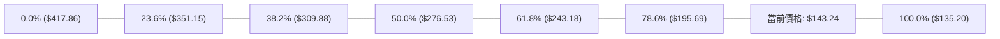

| 斐波那契層級 | 精確價位 | 與現價距離 | 技術意涵與結構地位 |
|--------------|----------|------------|--------------------|
| **0.0% (52W High)** | **$417.86** | +191.72% | 歷史多頭天花板，週期起跌原點 |
| **23.6%** | **$351.15** | +145.15% | 極淺回調位，前期高檔盤整失守點 |
| **38.2%** | **$309.88** | +116.34% | 強勢回檔分水嶺 |
| **50.0%** | **$276.53** | +93.05% | 週期多空對稱軸心 |
| **61.8%** | **$243.18** | +69.77% | 黃金分割強防守位（失守轉入大熊市） |
| **78.6%** | **$195.69** | +36.62% | 深幅回調極限位，與阻力 R3 ($200.38) 構成共振區 |
| **100.0% (52W Low)**| **$135.20** | -5.61% | 全週期基準支撐，與支撐 S2 完全重合 |

**現價區間解讀**：
當前價格 **$143.24** 處於 **78.6% ($195.69)** 至 **100.0% ($135.20)** 的極度深水回調區間內，目前僅高於週期基準低點 5.61%。在斐波那契理論中，當資產跌破 78.6% 水準後，通常代表原上升趨勢被完全破壞，轉為以 100.0% ($135.20) 作為基準軸的重新定價或築底階段。只要現價不跌破 $135.20，在 78.6%-100.0% 之間醞釀反彈具備極佳的下檔安全邊際。

---

## 5. 技術指標深度解讀

### 🎛️ 指標訊號總覽

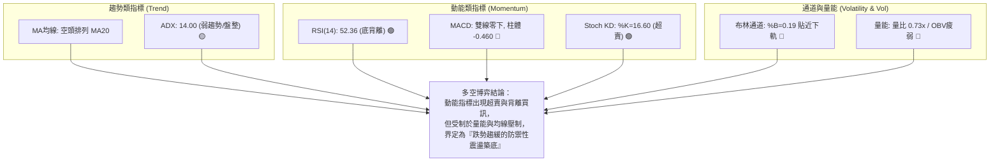

### 📈 移動平均線排列分析

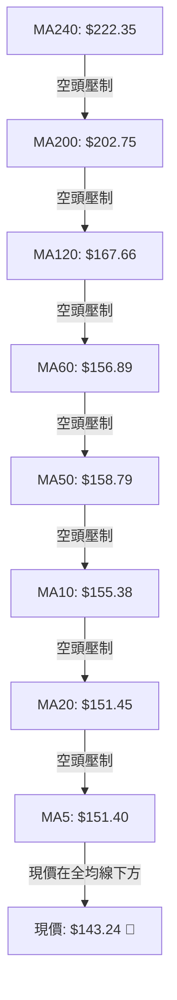

均線系統呈現完美的**空頭排列**（Bearish Alignment）：
- **短期均線**：MA5 ($151.40) 與 MA20 ($151.45) 幾乎黏合，與 MA10 ($155.38) 形成第一道下行壓制網，現價落後短期均線約 5.4%。
- **中期均線**：MA50 ($158.79) 及 MA60 ($156.89) 位於阻力位 R1 ($162.30) 下緣，構成中期反彈的強大蓋頭天花板。
- **長期均線**：MA200 ($202.75) 與 MA240 ($222.35) 遠高於現價（負乖離率達 -29.35% 與 -35.58%），顯示長期多頭趨勢已被徹底瓦解，後續縱有反彈，MA200 亦將扮演終極巨壓。

### 📉 RSI(14) 分析

```
RSI(14) 數值儀表板:
0 ─────── 20 ──────── 30 ──────────────── 50 ── 52.36 ──────── 70 ─────── 80 ────── 100
[ 極度超賣 ] [ 超賣區 ]    [      空方區間      ] 🟡 [   多方區間   ]  [ 超買區 ] [ 極度超買 ]
當前位置: 52.36  █████████████░░░░░░░░░░░░ 52.4% (中性偏多微幅復甦)
```

**背離判斷 (Divergence Analysis)**：
- **明確訊號**：**週線 / 日線級別 RSI 底背離 (Bullish Divergence) 確立** 🟢。
- **證據鏈條**：在 2026-06-28 週線收盤價跌至 $137.95 時，RSI(14) 探底至 **20.2**；而在 2026-09-06 週線價格收在 $144.65、乃至當前現價 $143.24 再次接近該底部時，RSI 讀數已大幅墊高至 **52.36**。
- **技術解讀**：價格在低檔維持橫向築底，而 RSI 動能底部顯著抬高，顯示市場內在下跌動能大幅衰退，空方動能竭盡，屬於典型的蓄勢反彈背離型態。

### 📊 MACD(12/26/9) 訊號解讀

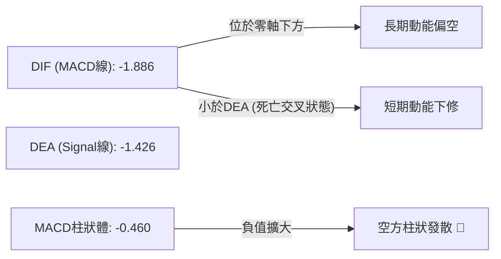

- **MACD 線**：-1.886
- **訊號線 (Signal)**：-1.426
- **柱狀圖 (Histogram)**：-0.460 (負值，看空)
- **綜合解析**：MACD 雙線均位於零軸（0.00）下方，表明市場整體仍處於空頭控制場域。雖然過去數週柱狀體曾數度翻紅（如 09-20 達到 +2.063），但由於缺乏跟隨性買盤，柱狀體再度轉負 (-0.460)。然而，對比 6 月底柱狀體達到的 -4.576，當前負值幅度已大幅收斂，顯示空方打壓力道已非主跌段的猛烈暴跌，而是轉為低檔拉鋸。

### 📦 布林通道分析

```
AVAV 日線布林通道 (20, 2) 結構示意圖：
$164.89 ┼──────────────────────────────────────── 布林上軌 (Upper Band)
        │
$151.45 ┼ - - - - - - - - - - - - - - - - - - - - 布林中軌 (MA20: $151.45)
        │
$143.24 ┼........................................ [現價 $143.24 (%B = 0.19)]
        │
$138.01 ┼──────────────────────────────────────── 布林下軌 (Lower Band)
```

- **通道帶寬與位置**：上軌 $164.89、中軌 $151.45、下軌 $138.01。
- **通道指標 %B**：**0.19**（處於 0.0 至 0.2 的極弱勢超跌邊界）。
- **帶寬特徵**：通道帶寬 $(\$164.89 - \$138.01) / \$151.45 = 17.75\%$，通道呈現水平收縮走平態勢。
- **操作意義**：在 ADX < 25 的盤整環境中，布林通道邊界具備極強的均值回歸牽引力。現價 $143.24 逼近下軌 $138.01，空頭繼續向下開拓空間的動能不足，價格具備向中軌 $151.45 回歸的內在動力。

### 💹 成交量分析（量價配合度）

```
量能結構對比：
今日成交量:    1,709,500   ███████░░░ (量比: 0.73x)
20日均量:      2,336,035   ██████████
50日均量:      1,666,246   ███████░░░
```

- **量比現況**：最新成交量為 1,709,500 股，僅為 20 日均量的 73%，呈現明顯的**價跌量縮**態勢。
- **OBV (能量潮指標)**：當前 OBV 位於其均線下方，指示量能疲弱，市場追價熱情低落，機構大資金並未出現規模性的左側掃貨動作。
- **量價背離現象**：週線級別成交量從 2026-09-13 的 20.40M 迅速萎縮至本週的 2.79M，顯示下殺過程中並沒有爆發恐慌拋盤，屬於典型的「縮量陰跌與築底沉澱」。低量能意味著行情難以展開單邊 V 型反轉，後續突破必須見到單日成交量擴大至 2.5M（或週成交量 > 10M）方可確認真實突破。

---

## 6. 動能與波動率

### ⚡ 動能評估四象限

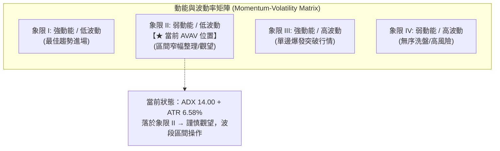

| 象限代號 | 動能強度 | 波動率水準 | 當前匹配 | 市場狀態與應對方針 |
|----------|----------|------------|----------|--------------------|
| **Q1** | 強 (ADX > 25) | 低波動 | ─ | 最佳波段加碼點，勝率高 |
| **Q2** | **弱 (ADX = 14.00)** | **中低波動 (ATR = 6.58%)** | **✓ 當前狀態** | **謹慎觀望，等待震盪區間下軌承接，嚴格執行區間止盈** |
| **Q3** | 強 (ADX > 25) | 高波動 | ─ | 突破行情，順勢追單 |
| **Q4** | 弱 (ADX < 20) | 高波動 | ─ | 無序掃蕩，容易頻繁停損，應空倉 |

### 📊 ATR 波動率分析

- **ATR(14) 數值**：**$9.43**
- **波動佔比**：佔當前股價比例為 **6.58%**。
- **止損距離建議**：
  - **日內交易 / 短線擺動**：以 $1.0 \times \text{ATR} = \$9.43$ 為緩衝邊界。
  - **波段防守止損**：以 $1.5 \times \text{ATR} = \$14.15$ 為動態停損基準。若自現價 $143.24 扣除 1.5 ATR 則為 $129.09，已跌破歷史底點 $135.20；因此實戰止損應結合結構支撐，直接設定於 S2 關鍵防線 $135.20 稍下方（即 **$134.50**）。

### 📐 Beta 與市場相關性

- **Beta 係數**：**1.406**
- **市場特徵解析**：AVAV 展現出相較標普 500 指數高出 40.6% 的高波動彈性，屬於高 Beta 成長型/國防科技軍工標的。
- **空頭環境影響**：高 Beta 屬性意味著當大盤走弱或防禦情緒上升時，該股面臨的系統性折價更為劇烈（52週下挫近 65% 正印證此特徵）。然而，一旦大盤止跌反彈且軍工無人機題材發酵，其反彈力道亦將具備超越大盤的爆發潛力。

---

## 7. 多時框架總結

### 📋 時框架評分表

| 時框架 | 趨勢方向 | 動能狀態 | 均線排列 | 圖表形態 | 綜合評分 | 建議方針 |
|--------|----------|----------|----------|----------|----------|----------|
| **月線 (長期)** | 🔴 強烈空頭 | 弱 (自高點腰斬) | 完全空頭壓制 (MA200下) | 頂部回落深幅拉回 | 30/100 | 長期部位減碼或觀望 |
| **週線 (中期)** | 🟡 橫向築底 | 中性 (RSI 底背離) | 空頭收斂 | 潛在大雙底結構 | 50/100 | 箱型區間逢低佈局 |
| **日線 (短期)** | 🟡 區間震盪 | KD超賣反彈訊號 | 短均線糾纏壓制 | 布林下軌支撐測試 | 55/100 | 嚴守支撐做技術反彈 |

### 🔲 綜合訊號矩陣

```mermaid
quadrantChart
    title 多時框多空訊號矩陣分析
    x-axis 偏空 (Bearish) --> 偏多 (Bullish)
    y-axis 短期時框 (Short-Term) --> 長期時框 (Long-Term)
    quadrant-1 長多短多 (全面共振)
    quadrant-2 長多短空 (回檔買點)
    quadrant-3 長空短空 (全面主跌)
    quadrant-4 長空短多 (超跌築底反彈)
    "MA200趨勢": [0.15, 0.85]
    "週線MACD": [0.25, 0.65]
    "日線布林通道": [0.45, 0.35]
    "RSI底背離": [0.65, 0.45]
    "Stoch超賣": [0.75, 0.25]
    "★ AVAV 綜合落點": [0.55, 0.38]
```

### ⚖️ 多時框收斂結論

**嚴格遵循收斂規則**：
1. **趨勢/盤整判定**：當前日線與週線 **ADX(14) 僅為 14.00 (< 25)**，嚴格定義為**盤整行情**。
2. **主導依據**：根據收斂規則第 14 條，「盤整行情（ADX<25）：以日線布林通道上下軌為主要交易區間」，均線突破之趨勢追價策略暫時失效。
3. **時框衝突化解**：雖然長期月線與中長天期均線（MA50/MA200）呈偏空壓制，但日線與週線在下檔支撐群 S1 ($139.28) / S2 ($135.20) 出現極度超賣與 RSI 底背離共振。因此，當前時框訊號收斂至**日線布林通道 ($138.01 - $164.89) 內的箱型震盪築底**。
4. **唯一方向性結論**：**中性偏多區間操作（Neutral-Range Trading）**。以防守 S2 ($135.20) 為前提，博弈向中軌 ($151.45) 及阻力 R1 ($162.30) 的均值回歸修復走勢。

---

## 8. 交易策略建議

### 🗺️ 策略決策流程圖

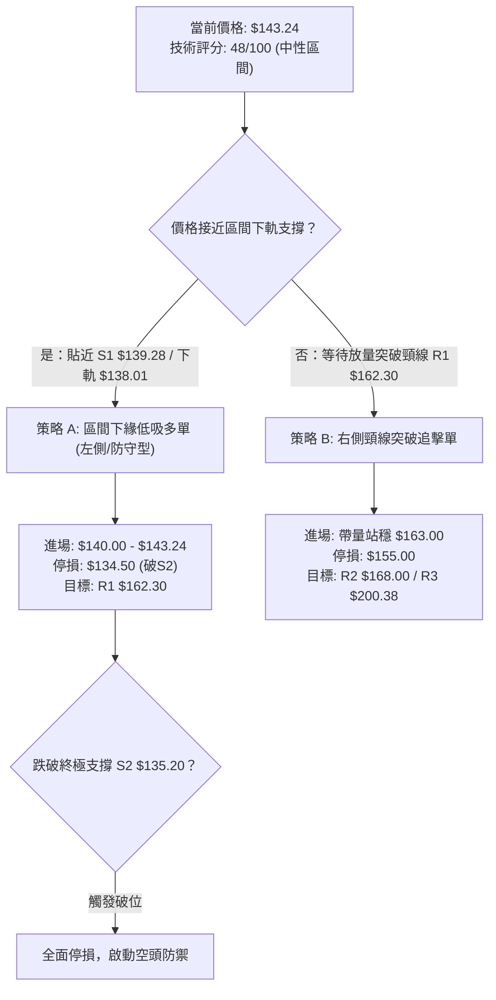

### 🧭 策略路由（依評分卡分流）

> **當前主策略方向 = 區間震盪低吸策略（依綜合評分 48/100）**
> 
> *評分落於 40–60 分之中性區間，且 ADX 為 14.00，嚴禁任何無腦追漲殺跌行為。策略重點鎖定在以布林下軌 $138.01 至 S1 $139.28 為緩衝的低階進場，目標看至中軌與阻力位 R1。*

### 🎯 價格情境階梯（Price Scenarios）

價位嚴格引用關鍵價位計算數值：

| 觸發條件 | 下一目標 | 後續延伸 | 情境含義 |
|----------|----------|----------|----------|
| **向上突破 R1 $162.30** | **R2 $168.00** | **R3 $200.38** | 雙底形態頸線確認突破，正式扭轉中期弱勢格局 |
| **向上收復 MA20 $151.45** | **R1 $162.30** | **R2 $168.00** | 短線走出弱勢區，布林通道均值回歸確立 |
| **現價 $143.24 區間震盪** | **MA20 $151.45**| **S1 $139.28** | 處於布林下軌至中軌之間，籌碼換手沉澱築底 |
| **向下跌破 S1 $139.28** | **S2 $135.20** | 重新探底 | 短線多頭防線失守，下探測試歷史極限低點 |
| **跌破 52W 底 S2 $135.20**| 開啟無支撐區間 | 下方無數據 | 空頭破位崩跌，雙底破滅，必須立即執行全面停損 |

### 📊 情境機率分佈

```
情境機率分佈柱狀圖：
區間震盪築底 (45%)    ███████████████████████░░░░░░░░░░
技術反彈上行 (35%)    ██████████████████░░░░░░░░░░░░░░
破位再探低點 (20%)    ██████████░░░░░░░░░░░░░░░░░░░░░░
```

| 情境類別 | 機率預估 | 主要技術依據 |
|----------|----------|--------------|
| **情境一：區間震盪築底** | **45%** | ADX=14.00 顯示無單邊動能；布林通道帶寬收窄走平；成交量萎縮至均量以下 (量比 0.73x)，多空僵持。 |
| **情境二：超賣反彈向上** | **35%** | RSI 顯著底背離；KD 指標位於超賣區 (%K: 16.60)；19 位華爾街分析師共識 Target Mean 為 $219.35 (現價具深幅折價)。 |
| **情境三：跌破底線走空** | **20%** | 全均線呈空頭排列；MACD 柱體負向發散 (-0.460)；若空頭突發放量打穿 S2 $135.20 則引發多殺多停損盤。 |

### 🟢 主策略詳情（方向：區間低吸 / 突破加碼）

| 策略要素 | 策略 A（下軌支撐逢低承接） | 策略 B（頸線突破追順勢） |
|----------|----------------------------|--------------------------|
| **策略邏輯** | 利用布林下軌與 S1 支撐博弈超賣反彈 | 確認雙底突破，順勢吃取波段主升段 |
| **進場條件** | 價格回踩 S1 $139.28-$143.24 區間且收腳 | 帶量突破頸線 R1 $162.30（單日量 > 2.5M） |
| **進場價格** | **$141.50**（分批進場，現價 $143.24 建立底倉） | **$163.00**（突破確認後追進） |
| **目標價 T1** | **$151.45**（布林中軌 MA20，先平半倉） | **$168.00**（阻力 R2 / MA120） |
| **目標價 T2** | **$162.30**（關鍵阻力位 R1） | **$189.40**（形態高度推算）/ **$200.38** (R3) |
| **止損價格** | **$134.50**（嚴格設定於 S2 $135.20 下方 0.5%） | **$155.00**（回跌至 MA10 下方停損） |
| **風險報酬比** | **1 : 2.97** (風險 $7.00 vs 報酬 $20.80) | **1 : 3.30** (風險 $8.00 vs 報酬 $26.40) |
| **成功機率** | **65%** | **55%** |
| **建議倉位** | **10% - 15%**（中性防禦型資金） | **15% - 20%**（確認放量後右側配置） |

### 🔴 反向風險觸發點（對沖與撤退提示）

若發生下列技術破位事件，必須徹底推翻當前「低吸反彈」之主策略，嚴格執行防禦：
1. **收盤價跌破 $135.20 (S2 / 52週低點)**：宣告日線/週線雙底形態徹底破產，空頭擴散，下檔缺乏歷史密集支撐，應立即全數砍倉出場。
2. **反彈受阻於布林中軌 $151.45 且放量下挫**：若價格連 MA20 均無法觸碰即遭遇空方大陰線摜壓，代表下跌中繼未完，應逢高平倉所有反彈多單。

### ⭐ 整體訊號強度評星

```
做多訊號強度：★★★☆☆  (3/5星 — 超賣與背離具備反彈條件，惟欠缺量能)
做空訊號強度：★★☆☆☆  (2/5星 — 均線雖空，但空間逼近極限底部，勝率偏低)
整體可信度：  ★★★★☆  (4/5星 — 價位聚類明確，布林通道邊界具高參考性)
```

---

## 9. 風險提示與監控

### ✅ 關鍵監控指標 Checklist

```
╔══════════════════════════════════════════════════════════════════╗
║                技術面日常追蹤監控清單 (Checklist)                 ║
╠══════════════════════════════════════════════════════════════════╣
║ [ ] 價格防守線：收盤價是否嚴格守在 S2 $135.20 關鍵低點之上？    ║
║ [ ] RSI 指標：RSI(14) 能否持續維持在 45-50 之上，維持背離有效性？║
║ [ ] 動能翻轉：MACD 柱狀體能否由當前的 -0.460 收斂並向 0 軸轉正？ ║
║ [ ] 量能異動：日成交量是否放大突破 20 日均量 (2,336,035 股)？    ║
║ [ ] 均線攻防：價格能否在 3-5 個交易日內站上 MA20 ($151.45)？    ║
║ [ ] 空頭回補：放空比率 (Short % Float) 達 11.8%，關注軋空動向    ║
╚══════════════════════════════════════════════════════════════════╝
```

### ⚠️ 風險場景分析

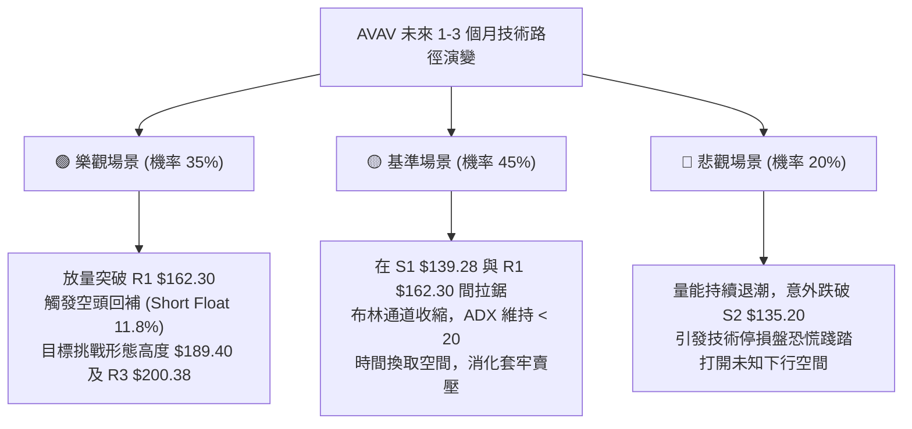

### 🛡️ 風險管理重要提醒

1. **基本面財務槓桿與獲利警訊**：
   AVAV 當前 EPS (TTM) 為 **$-3.95**，自由現金流為 **$-25.92M**，且淨負債達 **$270.60M**。儘管機構持股比例高達 88.0%，且 19 位分析師維持 Buy 共識評級，但在財務數據轉正前，任何技術反彈都可能遭到基本面獲利了結者的壓制。
2. **高放空比率軋空 (Short Squeeze) 雙刃劍**：
   放空比率高達 **11.8%**（Short Ratio: 2.11 天）。一旦股價放量突破 R1 $162.30，容易觸發空方停損而演化為暴力軋空；反之，若跌破 $135.20，空頭將更加肆無忌憚打壓。
3. **部位規模控管**：
   因 Beta 高達 1.406 且 ATR 佔股價高達 6.58%，單筆交易虧損應嚴格限制在總投資組合資金的 **1.0%** 以內。若以進場價 $141.50、止損 $134.50（風險點數 $7.00）計算，總資產 10 萬美元之投資組合，單筆建議買進股數不應超過 140 股。

---

## 📋 報告總結

```
╔══════════════════════════════════════════════════════════════════╗
║                     AVAV 技術分析報告總結                        ║
╠══════════════════════════════════════════════════════════════════╣
║ 報告日期：2026-09-30                                             ║
║ 當前價格：$143.24                                                ║
║ 技術評分：48 / 100                                               ║
║ 分析評級：⚖️ 偏空中性（區間震盪打底架構）                        ║
╠══════════════════════════════════════════════════════════════════╣
║ 關鍵結論：                                                       ║
║ ├─ 長期趨勢：🔴 深度空頭，MA200 ($202.75) 形成重度蓋頭壓力       ║
║ ├─ 中期趨勢：🟡 築底震盪，於 $135.20 - $162.30 箱型拉鋸          ║
║ ├─ 短期趨勢：🟢 超跌蓄勢，RSI 底背離與 KD 超賣醞釀反抽           ║
║ ├─ 關鍵支撐：S1: $139.28  /  S2: $135.20 (52W極限防禦)           ║
║ ├─ 關鍵阻力：R1: $162.30  /  R2: $168.00  /  R3: $200.38         ║
║ └─ 分析師目標：共識均價 $219.35 (隱含 +53.1% 修復空間)           ║
╠══════════════════════════════════════════════════════════════════╣
║ 最優策略組合：                                                   ║
║ 1. 🥇 最佳機會：在 S1 $139.28 至布林下軌 $138.01 逢低分批吸納，  ║
║                嚴守 $134.50 止損，目標看至 MA20 與 R1 $162.30。   ║
║ 2. 🥈 次選機會：右側等待日線收盤放量突破頸線 R1 $162.30 後順勢加 ║
║                碼，搏擊理論雙底目標價 $189.40。                  ║
║ 3. 🥉 保守選擇：在 ADX 升破 25 且均線扭轉前保持空倉觀望。        ║
╚══════════════════════════════════════════════════════════════════╝
```

---

> ⚠️ **免責聲明**：本報告為技術分析專研內容，所有數據指標及價位估算均基於市場所提供之客觀歷史行情計算。本報告**僅供學術研究與決策參考**，**不構成任何形式的要約、招攬或實質投資建議**。市場具有高度不確定性，交易者應獨立評估風險並自負盈虧。

---

*報告生成時間：2026-09-30 ｜ 數據來源：Yahoo Finance ｜ 分析框架：多時框技術分析體系*