# AVAV 技術分析報告

> **報告日期**：2026-10-03 ｜ **語言**：繁體中文 ｜ **數據來源**：Yahoo Finance ｜ **當前價格**：$140.82

---

## 目錄

| 章節 | 內容 |
|------|------|
| [1. 技術面概覽](#1-技術面概覽) | 訊號儀表板、核心指標、評分卡 |
| [2. 趨勢分析](#2-趨勢分析) | 多時框趨勢、長中短期走勢、ADX強度 |
| [3. 圖表形態分析](#3-圖表形態分析) | 形態識別、信心度、K線組合、目標價計算 |
| [4. 支撐與阻力](#4-支撐與阻力) | 關鍵價位分布圖、阻力支撐表、斐波那契回調 |
| [5. 技術指標深度解讀](#5-技術指標深度解讀) | 均線系統、RSI底背離、MACD、布林通道、OBV與量能 |
| [6. 動能與波動率](#6-動能與波動率) | 動能四象限、ATR波動率、Beta與大盤連動 |
| [7. 多時框架總結](#7-多時框架總結) | 時框架評分矩陣、收斂規則與方向裁決 |
| [8. 交易策略建議](#8-交易策略建議) | 決策路由、價格情境階梯、主策略設定、風控對沖 |
| [9. 風險提示與監控](#9-風險提示與監控) | 關鍵監控清單、情境分析、風險管理機制 |
| [報告總結](#-報告總結) | 核心結論與交易執行儀表板 |

---

## 1. 技術面概覽

### 🎯 技術訊號儀表板

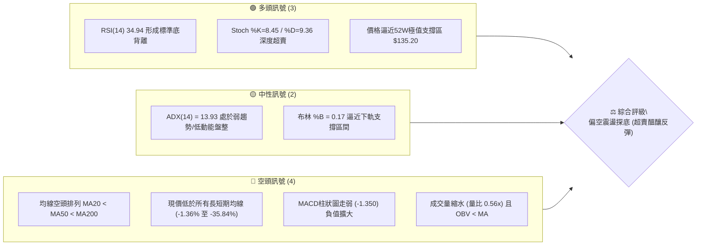

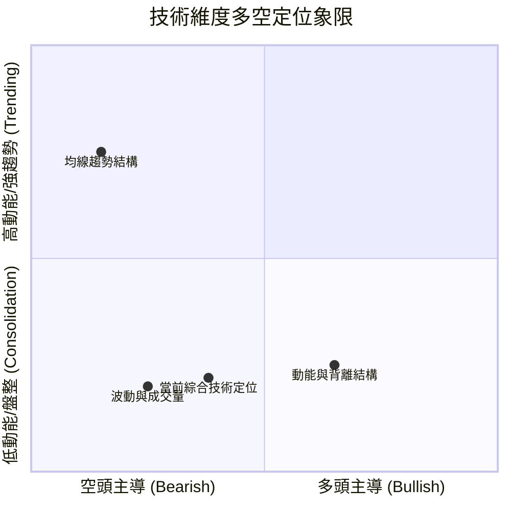

### 📊 核心指標速覽表

| 指標類別 | 指標名稱 | 當前數值 | 訊號 | 專業解讀 |
|----------|----------|----------|------|----------|
| **價格** | 當前價格 | $140.82 | 🔴 | 位於52週區間僅 2.0% 分位，極度逼近年度低點 $135.20 |
| **短期均線** | MA20 | $150.78 | 🔴 | 價格低於MA20達 -6.61%，短線反彈首要動態下壓壓力 |
| **中期均線** | MA50 | $158.10 | 🔴 | 價格低於MA50達 -10.93%，波段多空分水嶺下彎 |
| **長期均線** | MA200 | $201.24 | 🔴 | 價格低於MA200達 -30.02%，長期格局處於深度修正期 |
| **超長期均線** | MA240 | $219.49 | 🔴 | 乖離率達 -35.84%，中長期籌碼全數套牢 |
| **震盪指標** | RSI(14) | 34.94 | 🟢 | 進入低檔中性偏超賣區，並出現明確「日線底背離」訊號 |
| **動能指標** | MACD (12,26,9) | -3.655 | 🔴 | 快慢線位於零軸下，MACD Hist為 -1.350，空頭控制動能 |
| **超買超賣** | Stoch %K / %D | 8.45 / 9.36 | 🟢 | 雙線進入極端超賣區 (<10)，短線下行動能衰竭 |
| **趨勢強度** | ADX(14) | 13.93 | 🟡 | 數值遠低於25，空方加速趨勢停滯，市場進入無趨勢盤整 |
| **通道指標** | 布林通道 | 下軌 $135.82 | 🟡 | %B僅0.17，價格觸及下軌後獲得支撐，正處於收縮打底 |
| **量能指標** | 成交量 / 20日均量 | 1.27M / 2.29M | 🔴 | 量比僅 0.56x，量能疲弱，OBV低於移動均線 |
| **波動指標** | ATR(14) | $7.58 | 🟡 | 佔股價 5.38%，每日波幅適中，有利於設定精確止損 |

### 🏆 技術評分卡

```
╔══════════════════════════════════════════════════════════════════╗
║                  AVAV 技術評分卡 (2026-10-03)                   ║
╠══════════════════════════════════════════════════════════════════╣
║ 趨勢強度 (Trend)     ████░░░░░░░░░░░░░░░░  20/100 🔴 極度偏弱  ║
║ 均線架構 (Moving Avg)██░░░░░░░░░░░░░░░░░░  10/100 🔴 典型空頭  ║
║ 動能指標 (Momentum)  ███████████░░░░░░░░░  55/100 🟡 背離醞釀  ║
║ 支撐穩定度 (Support) ████████████░░░░░░░░  60/100 🟡 低點強撐  ║
║ 成交量配合 (Volume)  ██████░░░░░░░░░░░░░░  30/100 🔴 量能匱乏  ║
║ 形態完整度 (Pattern) ████████░░░░░░░░░░░░  40/100 🟡 築底雛形  ║
╠══════════════════════════════════════════════════════════════════╣
║ 綜合技術評分         ███████░░░░░░░░░░░░░  35.8/100 🔴 偏空弱勢║
║ 投資評級結論         【偏空震盪 / 逢低短打超賣反彈】            ║
╚══════════════════════════════════════════════════════════════════╝
```

---

## 2. 趨勢分析

### 🌐 多時框趨勢分析

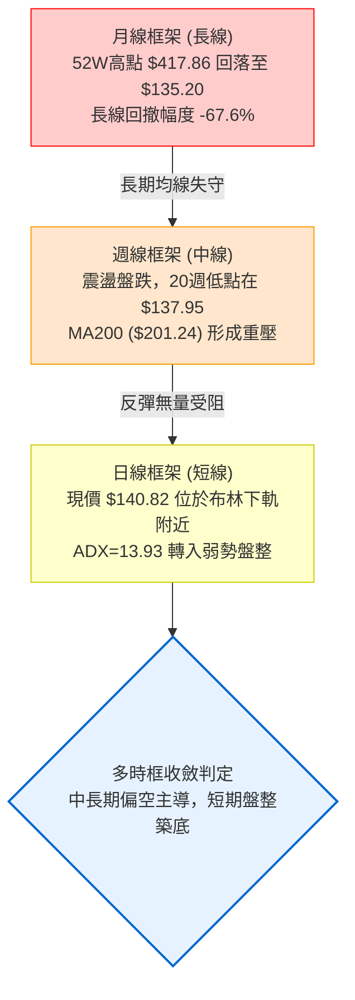

### 📈 長期趨勢 — 12個月走勢圖（Unicode）

過去12個月（2025年10月至2026年10月），AVAV經歷了從主升浪頂點（$369.91，盤中高點見 $417.86）至崩跌腰斬的完整週期。以下為過去12個月收盤價走勢繪製：

```
AVAV 月線收盤走勢圖（2025-10 至 2026-10）
價格軸 ($)
$370 ┤●(2025-10: 369.91 波段高點)
$340 ┤
$310 ┤
$280 ┤     ●(11: 279.46)     ●(01: 278.39)
$250 ┤          ●(12: 241.89)     ●(02: 252.25)
$220 ┤                                      ●(05: 207.24)
$190 ┤                                 ●(04: 195.02)
$160 ┤                        ●(03: 183.05)      ●(06: 165.07)
$130 ┤                                                ●(07: 149.37)  ●(08: 148.35)  ●(09: 142.22)  ●(10: 140.82)←現價
     └────────────────────────────────────────────────────────────────────────────────────────────────────────────────
       10   11   12   01   02   03   04   05   06   07   08   09   10  (月份)
```

#### 走勢特徵分析表格

| 階段週期 | 時間區間 | 起訖價位 | 漲跌幅 | 結構形態特徵 | 成交量與動能配合 |
|----------|----------|----------|--------|--------------|------------------|
| **頂部派發期** | 2025-10 至 2025-12 | $369.91 → $241.89 | -34.61% | 快速回落，高位雙頂破位後展開初跌浪 | 頂部成交密集後量能萎縮 |
| **中繼反彈期** | 2026-01 至 2026-02 | $278.39 → $252.25 | -9.39% | 弱勢反彈未能突破 $280，構築右肩結構 | 買盤動能衰竭，反彈高點逐級降低 |
| **主跌加速期** | 2026-03 至 2026-06 | $183.05 → $165.07 | -9.82% | 跌破$200整數心理關卡，5月短暫反抽$207 | 6月單週爆量11.88M重挫至$137.95 |
| **低檔盤整期** | 2026-07 至 2026-10 | $149.37 → $140.82 | -5.72% | 橫盤築底，於 $135.20–$160.00 間反覆磨底 | 日均量降至1.27M，波幅顯著收窄 |

### 📊 中期趨勢（週線分析）

從近20週的走勢可觀察出，股價在2026年6月28日當週創下 $137.95 的波段低點後，展開了一輪劇烈的區間震盪行情。

```
近期週線壓力與支撐示意圖
$195.00 ┼──────────────────────────────────── 週線反彈高點 $192.81 (2026-08-16)
        │                 ╭──╮
$180.00 ┼        ╭──╮     │  │
        │        │  │     │  │
$165.00 ┼────────┼──┼─────┼──┼─────────────── 阻力位 R1: $162.30 (MA20/MA50集群)
        │        │  │     │  │        ╭──╮
$150.00 ┼──╭─╮──┼──┼──╭─┼──┼──╭─╮───┼──┼─── 整理中軸 $150.00
        │  │ │  │  │  │ │  │  │ │   │  │
$135.00 ┼──┴─┴──┴──┴──┴─┴──┴──┴──┴─┴───┴──┴─── 支撐位 S2: $135.20 / S1: $139.28
        06/28    07/05    08/16      09/20     當前現價: $140.82
```

- **週線波動特徵**：2026年7月5日當週曾爆出 18.31M 巨量反彈至 $190.89，隨後在8月中旬反彈至 $192.81 形成週線雙頂回落。9月中旬再度放量 20.40M 衝高至 $159.95，隨即遭遇阻力。目前收盤於 $140.82，已連續兩週收陰。
- **籌碼解讀**：反彈高點逐步由 $192.81 降至 $159.95，顯示空方壓制線不斷下移，但下方 $135.20–$139.28 展現極強的買盤承接力。

### ⚡ 趨勢強度評估（ADX 解讀）

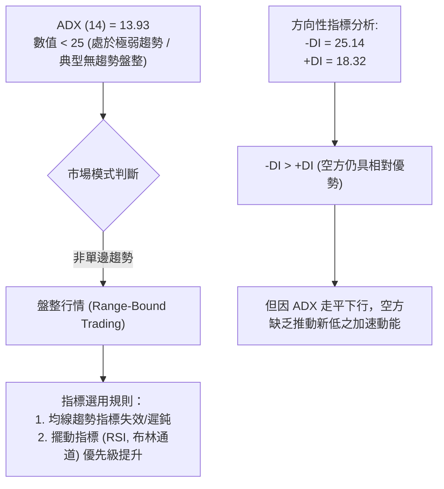

#### ADX 強度量化對照表

| ADX 區間 | 趨勢狀態 | 當前數值 (13.93) | 交易戰術指引 |
|----------|----------|-------------------|--------------|
| 0 – 20 | 極弱 / 無方向盤整 | **● (當前狀態)** | **嚴禁追高殺跌，以邊界高拋低吸或區間突破確認為準** |
| 20 – 25 | 趨勢初生 / 轉折期 | — | 密切留意均線收斂後的布林通道開口 |
| 25 – 40 | 明確單邊趨勢 | — | 順勢交易，依照均線與回踩策略操作 |
| 40 – 100 | 極強單邊爆發 | — | 動能衰竭警訊，嚴防極值反轉 |

---

## 3. 圖表形態分析

### 🔍 形態識別系統

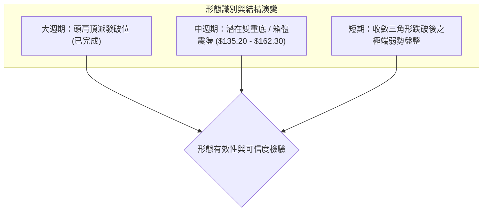

#### 形態信心度與目標價評估表

| 圖表形態 | 信心度 | 判斷依據（引用數據） | 完成度 | 目標價（附計算式） |
|----------|--------|----------------------|--------|--------------------|
| **潛在雙重底 (W底)** | **65%** | 第一次低點為2026-06-28的 $137.95（低點聚類S2: $135.20），第二次探底至現價 $140.82 獲支撐S1: $139.28 守穩。頸線位置為波段高點聚類 R1: $162.30。 | 45% (右底構建中) | **由雙底形態推算**：<br/>形態高度 = 頸線 $162.30 - 低點 $135.20 = $27.10<br/>突破目標價 = 頸線 $162.30 + $27.10 = **$189.40** (接近前期阻力高點) |
| **矩形低檔箱體** | **75%** | 箱底嚴格鎖定於支撐位聚類 S2: $135.20，箱頂受限於阻力位聚類 R2: $168.00。股價近4個月均於此區間震盪。 | 80% (通道完整) | **由箱體測幅推算**：<br/>箱體幅度 = $168.00 - $135.20 = $32.80<br/>若向上突破目標 = $168.00 + $32.80 = **$200.80** (精確對應阻力位 R3: $200.38) |
| **頭肩頂形態** | **90%** | 2025年10月至2026年3月構築完成，頭部 $417.86，頸線約 $241.89（斐波那契61.8%）。目前處於完全兌現破位後的末端整理。 | 100% (已兌現完畢) | 已達成中長期下跌滿足點。 |

### 🕯️ 重要K線形態分析

| 週期/月份 | 收盤價 | K線形態 | 技術解讀 | 多空訊號 |
|-----------|--------|---------|----------|----------|
| **2026-05** | $207.24 | 長上影大陽線 | 反彈觸及MA200即遭遇強大解套賣壓，確立反彈波段頂部 | 🔴 空頭抵抗 |
| **2026-06** | $165.07 | 破位大陰線 | 實體大陰線摜破前期支撐，月線探底至 $137.95，空方全面宣洩 | 🔴 極度看空 |
| **2026-07** | $149.37 | 長下影紡錘線 | 爆出歷史級天量（週量達18.31M），低位出現強勁接盤資金 | 🟢 止跌初現 |
| **2026-08** | $148.35 | 倒轉錘頭線 | 上攻嘗試突破 $192.81 失敗，收盤回落至開盤價附近，多空僵持 | 🟡 多空拉鋸 |
| **2026-09** | $142.22 | 窄幅十字陰星 | 單月高低點顯著收斂，量能進一步沉澱，呈現窒息量打底跡象 | 🟡 變盤前兆 |
| **2026-10 (即時)** | $140.82 | 低檔並列小陰線 | 貼近前低 $139.28 進行二次探底，實體極小，下行動能呈現萎縮 | 🟢 醞釀背離 |

### 📉 ASCII 走勢形態示意圖

```
AVAV 潛在雙底 (Double Bottom) 與箱體震盪架構示意圖
$170.00 ┤                                                    [阻力 R2: $168.00]
$165.00 ┤                     ▲ 頸線位: $162.30 (阻力 R1)
$160.00 ┤                   ╭───╮                ╭───╮
$155.00 ┤                  ╭╯   ╰╮              ╭╯   ╰╮
$150.00 ┤       ╭─────────╯       ╰────────────╯       ╰────
$145.00 ┤      ╭╯                                             
$140.00 ┤─────┼─────────────────────────────────────────────● 現價: $140.82 (右底構建)
$135.00 ┤     ▼ 第1底: $137.95 (2026-06)                  ▼ 第2底: S2: $135.20 強支撐
        └──────────────────────────────────────────────────────────────────────────
```

---

## 4. 支撐與阻力

### 🗺️ 關鍵價位分布圖（Unicode）

```
AVAV 價位結構分布圖 (由 OHLCV 與聚類演算法計算)
══════════════════════════════════════════════════════════════════
$200.38 ║██████████████████████████████████████║ 強阻力 R3 (MA200/斐波那契重合)
$168.00 ║████████████████████████              ║ 阻力 R2 (箱體頂部壓力)
$162.30 ║████████████████████████████          ║ 關鍵阻力 R1 (頸線與波段高點聚類)
$150.78 ║--------------------------------------║ 動態阻力 (MA20 中軌位置)
════════╠══════════════════════════════════════╣ ◄ 當前現價: $140.82
$139.28 ║▓▓▓▓▓▓▓▓▓▓▓▓▓▓▓▓▓▓▓▓▓▓▓▓▓▓▓▓          ║ 近期支撐 S1 (-1.09%)
$135.20 ║██████████████████████████████████████║ 強支撐 S2 (52週最低點 -3.99%)
══════════════════════════════════════════════════════════════════
```

### 🚧 阻力位分析表

所有價位均嚴格引用歷史波段高點聚類與均線衍生計算數據：

| 阻力級別 | 價位 | 形成原因（數據依據） | 距現價空間 | 突破難度 | 技術重要性 |
|----------|------|----------------------|------------|----------|------------|
| **R1** | **$162.30** | 近一年波段高點聚類區，疊加下行之 MA60 ($156.13) 與布林上軌 ($165.74) 形成密集阻力帶。 | +15.25% | 中等 | ⭐⭐⭐⭐<br/>短線多空扭轉關鍵，突破此處宣告雙底確認。 |
| **R2** | **$168.00** | 2026年6月中旬盤整下破點，近一年第二波段高點密集區。 | +19.30% | 較高 | ⭐⭐⭐<br/>中期箱體上沿，具強烈解套賣壓。 |
| **R3** | **$200.38** | 近一年波段高點強聚類，且與長期 MA200 ($201.24) 及 斐波那契 78.6% 回調位 ($195.69) 高度共振。 | +42.30% | 極高 | ⭐⭐⭐⭐⭐<br/>牛熊分水嶺，非中長期基本面逆轉無法跨越。 |

### 🛡️ 支撐位分析表

所有價位均嚴格引用歷史波段低點聚類數據：

| 支撐級別 | 價位 | 形成原因（數據依據） | 距現價空間 | 守住機率 | 技術重要性 |
|----------|------|----------------------|------------|----------|------------|
| **S1** | **$139.28** | 近一年波段次低點聚類，近兩週回踩的動態支撐平台。 | -1.09% | 65% | ⭐⭐⭐<br/>短線防線，守穩代表超賣區獲得即時承接。 |
| **S2** | **$135.20** | **52週絕對歷史低點**，斐波那契 100.0% 極限回調位，疊加布林下軌 ($135.82)。 | -3.99% | 85% | ⭐⭐⭐⭐⭐<br/>年度生命線，多方最後堡壘，跌破將引發停損賣壓。 |

### 📐 斐波那契回調位分析

依據 52 週完整波動區間（低點 $135.20 至 高點 $417.86，垂直落差 $282.66）之精確計算分布如下：

```
斐波那契回調位與價格位置映射圖
0.0%  (52W High) ─── $417.86  ┬
23.6%            ─── $351.15  │
38.2%            ─── $309.88  │ 歷史派發套牢區間
50.0%            ─── $276.53  │
61.8%            ─── $243.18  ┴
78.6%            ─── $195.69  ─── 共振阻力帶 (與 R3: $200.38 / MA200: $201.24 重疊)
--------------------------------------------------------------------------------
現價區間 ($140.82) ── 處於 78.6% ($195.69) 與 100.0% ($135.20) 之「極度超賣末跌區」
--------------------------------------------------------------------------------
100.0% (52W Low) ─── $135.20  ─── 強支撐 S2 (年度絕對底部)
```

- **位置意義解讀**：現價 $140.82 位於 52 週整體波動範圍的 2.0% 處，回撤幅度高達 98.0%。自 $195.69 (78.6%) 破位以來，價格已進入「超賣耗竭區間」。下方的 $135.20 (100.0%) 不僅是數理上的極值，更是市場多方的心理底線。在斐波那契理論中，當資產回撤至 100.0% 附近且未出現放量破位時，極易引發均值回歸行情。

---

## 5. 技術指標深度解讀

### 🎛️ 指標訊號總覽

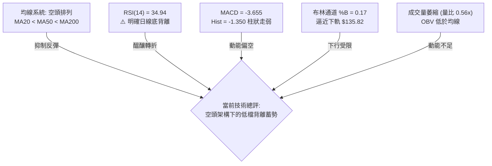

### 📈 移動平均線排列分析

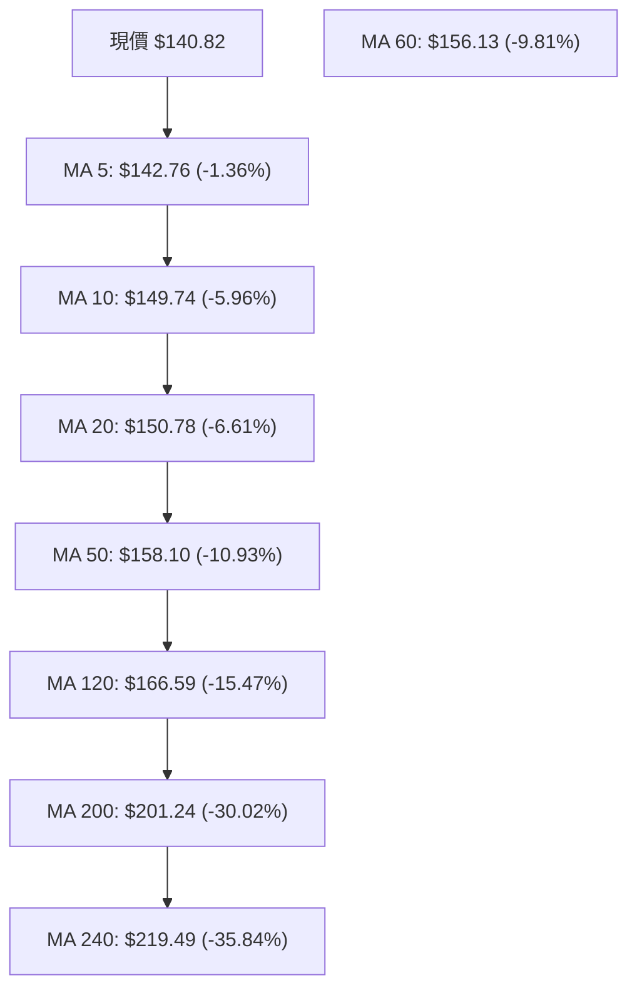

- **均線排列狀態**：短、中、長期均線呈現標準的「極弱勢空頭排列」（MA5 < MA10 < MA20 < MA50 < MA120 < MA200）。現價與各均線呈現負乖離狀態。
- **動態阻力機制**：首要反彈阻力為 MA20 ($150.78)，此均線亦為日線布林通道中軌；次要強阻力為 MA50 ($158.10)。在均線完成走平扭轉前，所有反彈若無量能配合，觸及 MA20/MA50 均為短線獲利盤與套牢盤的共同賣點。

### 📉 RSI(14) 分析與背離判定

```
RSI(14) 數值刻度展示:
0 ─────────── 30 ────── 34.94 ──────────────── 70 ─────────── 100
[  極度超賣區  ]  ▲        [      常態震盪區      ]  [  極度超買區  ]
               當前數值
```

- **當前讀數**：RSI(14) 為 **34.94**，處於低檔弱勢整理區。
- **背離分析與結論（極重要）**：
  - **形態檢驗**：股價在2026年9月6日收盤為 $144.65，當時 RSI 探至極端超賣低點 **16.9**；隨後股價在2026年9月20日反彈至 $159.95，RSI升至 62.0；當前（2026-10-04）股價回落至 **$140.82（創下近3個月收盤新低）**，然而當前 RSI 數值卻維持在 **34.94**，遠高於前期低點 16.9。
  - **結論**：存在極其標準的 **「日線等級多頭底背離 (Bullish Divergence)」** ⚠️。這意味著空方推低價格的力量已嚴重耗竭，賣壓動能正在迅速衰減，具備強烈的技術性反抽動能。

### 📊 MACD(12,26,9) 訊號解讀

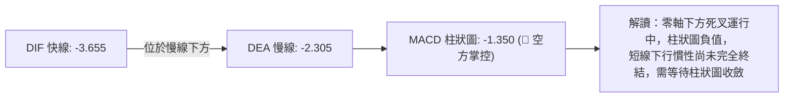

- 快線 DIF (-3.655) 處於慢線 DEA (-2.305) 下方，且雙雙位於零軸以下深處。
- MACD Histogram 為 -1.350，顯示雖然有 RSI 的底背離保護，但 MACD 指標體系尚未正式翻紅。操作上不可盲目左側重倉，必須提防空頭慣性下探 S2 ($135.20) 尋求最後洗盤。

### 📦 布林通道分析

```
AVAV 日線布林通道 (Bollinger Bands 20, 2) 結構圖
$170.00 ┤
$165.74 ┤────────────────────────────────────────── BB 上軌 (動態阻力位)
$160.00 ┤
$155.00 ┤
$150.78 ┤────────────────────────────────────────── BB 中軌 / MA20 (多空臨界)
$145.00 ┤
$140.82 ┤                      ● 現價 (%B = 0.17)
$135.82 ┤────────────────────────────────────────── BB 下軌 (動態支撐位)
$130.00 ┤
```

- **通道帶寬與位置**：BB 上軌為 $165.74，中軌為 $150.78，下軌為 $135.82。帶寬開口約 $29.92。
- **%B 指標解讀**：當前 %B 數值為 **0.17**，表示股價正運行於通道底緣上方約 17% 的位置。歷史經驗顯示，當 %B < 0.20 且伴隨 ADX 低於 15 時，跌破下軌往往會引發強烈通道修復效應，進一步確認下軌 $135.82 附近具備極強支撐。

### 💹 成交量分析（量價配合度）

- **量比與均量對比**：最新成交量為 1,274,700 股，相較於 20 日均量 2,287,690 股，**量比僅為 0.56x**（萎縮近半）；亦遠低於 50 日均量 1,644,434 股。
- **量價背離分析**：股價回落創低過程中伴隨成交量極度萎縮，呈現標準的「價跌量縮」格局。這代表市場主流拋壓已經枯竭，並非機構資金的恐慌性出逃。
- **OBV (能量潮指標) 走勢**：當前 OBV 處於其移動平均線下方，顯示主動型買盤介入意願依然低迷。量能未放大之前，行情僅能定義為「超跌弱勢反彈」，不具備展開大波段反轉的條件。

---

## 6. 動能與波動率

### ⚡ 動能評估四象限

| 象限代號 | 動能狀態 | 波動率狀態 | 市場屬性描述 | 當前技術定位與策略指引 |
|----------|----------|------------|--------------|------------------------|
| **Q1 (主升浪)** | 強動能 (+DI優勢) | 低波動 (有序推升) | 機構健康建倉 | 不適用 |
| **Q2 (盤整打底)**| **弱動能 (ADX<25)** | **低至中波動 (ATR可控)**| **震盪築底 / 觀望修復** | **✓ 【當前狀態】屬於典型 Q2 狀態。市場缺乏單邊趨勢動能，價格於低檔收斂，宜採取高拋低吸之防守型區間交易。** |
| **Q3 (強烈突破)**| 強動能 (單邊爆發) | 高波動 (跳空暴漲) | 風險偏好極高 | 不適用 |
| **Q4 (恐慌出逃)**| 弱/負動能 (空頭加速)| 高波動 (暴跌恐慌) | 斷頭清算狀態 | 6月主跌期屬此象限，目前已自 Q4 平復過渡至 Q2 |

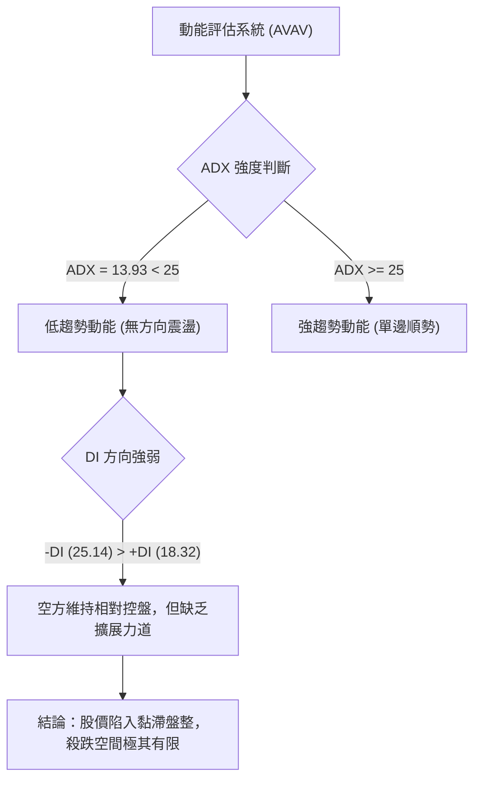

### 📊 ATR 波動率分析

- **ATR(14) 讀數**：**$7.58**（佔當前股價比例為 **5.38%**）。
- **波動特性分析**：以目前股價位階而言，每日 5.38% 的波動幅度提供了極佳的波段操作空間。但在設定止損時，必須避開正常波動噪音：
  - **短期噪音過濾區間**：$140.82 ± (0.5 × ATR) = $140.82 ± $3.79 → 震盪區間為 $137.03 至 $144.61。
  - **合理止損距離**：一般波段交易止損建議設於 1.0 至 1.5 倍 ATR 之外，但由於下方 S2 ($135.20) 與現價僅差 $5.62 (約 0.74 ATR)，因此以結構性支撐位作為硬止損依據比純數學 ATR 更具優勢。

### 📐 Beta 與市場相關性

- **Beta 係數**：**1.406**。
- **市場連動分析**：AVAV 屬於高彈性（High Beta）標的，其股價波動敏感度比標普500指數高出 40.6%。
  - **大盤共振效應**：當美股大盤處於風險偏好上升（Risk-on）階段時，AVAV 具備優異的反彈彈性；反之，若大盤整體重挫，其修正幅度將被顯著放大。
  - **機構持股特徵**：機構持股比率高達 **88.0%**，空單餘額佔浮動股比例（Short % Float）達 **11.8%**（Short Ratio: 2.11）。在空頭回補（Short Squeeze）情境下，高 Beta 特性極易促成爆發性軋空反彈。

---

## 7. 多時框架總結

### 📋 時框架評分表

| 時框架 | 趨勢方向 | 核心指標狀態 | 均線排列狀況 | 形態特徵 | 綜合評分 | 戰術指引 |
|--------|----------|--------------|--------------|----------|----------|----------|
| **長線 (月線)** | 🔴 明確空頭 | 歷史高點腰斬回撤 | 股價位於MA200/240深處下方 | 大週期派發浪完成 | 20/100 | 長期投資者僅能分批金字塔式逢低建倉 |
| **中線 (週線)** | 🔴 空方主導 | RSI=34.9，MACD負值擴大 | 跌破所有中期均線，受制於MA20週 | 週線在 $137.95 築雙底 | 35/100 | 中線反彈需待站穩 MA20 週線 ($150.78) |
| **短線 (日線)** | 🟡 震盪築底 | RSI底背離，Stoch極度超賣 | 空頭排列，但逼近布林下軌 | 收斂三角形末端，測試 S1/S2 | 52/100 | 超跌反彈機會，適合右側輕倉博弈 |

### 🔲 綜合訊號矩陣

```
時框衝突與共振分析陣列
┌──────────┬──────────────┬──────────────┬──────────────┬────────────────┐
│ 維度     │ 長期 (月線)  │ 中期 (週線)  │ 短期 (日線)  │ 一致性判定     │
├──────────┼──────────────┼──────────────┼──────────────┼────────────────┤
│ 趨勢方向 │ 🔴 下跌      │ 🔴 跌勢未止  │ 🟡 區間盤整  │ 長中短期矛盾   │
│ 均線系統 │ 🔴 壓制      │ 🔴 空頭排列  │ 🔴 乖離收斂  │ 壓制力道偏強   │
│ 動能狀態 │ 🔴 弱勢      │ 🟡 鈍化      │ 🟢 底部背離  │ 動能正在轉折   │
│ 支撐防守 │ 🟢 52W低點   │ 🟢 低點聚類  │ 🟢 布林下軌  │ 支撐極度共振   │
└──────────┴──────────────┴──────────────┴──────────────┴────────────────┘
```

### ⚖️ 多時框收斂結論

> **依據規則 14 之優先級判定流程**：
> 1. **趨勢強度過濾**：當前 ADX(14) 數值為 **13.93 (< 25)**，明確定義當前市場為 **「無趨勢之低動能盤整行情」**。
> 2. **主導規則啟用**：在 ADX < 25 的盤整環境中，均線順勢跟隨系統失效，交易決策應**以日線布林通道上下軌 ($135.82 – $165.74) 作為主要交易邊界**。
> 3. **多時框衝突取捨**：雖然長期與中期均線維持空頭排列，但日線 RSI 出現標準底背離，且價格已殺至 52 週絕對支撐邊界 S2 ($135.20)。空方在無趨勢環境下無法形成進一步崩跌。
> 
> **唯一收斂結論**：**【中性觀望偏多反彈】** —— 中期趨勢雖偏空，但在當前極端超賣與背離共振下，**空頭做空盈虧比極差，市場正在孕育一波針對布林中軌 ($150.78) 至頸線 R1 ($162.30) 的均值回歸修復行情**。

---

## 8. 交易策略建議

### 🗺️ 策略決策流程圖

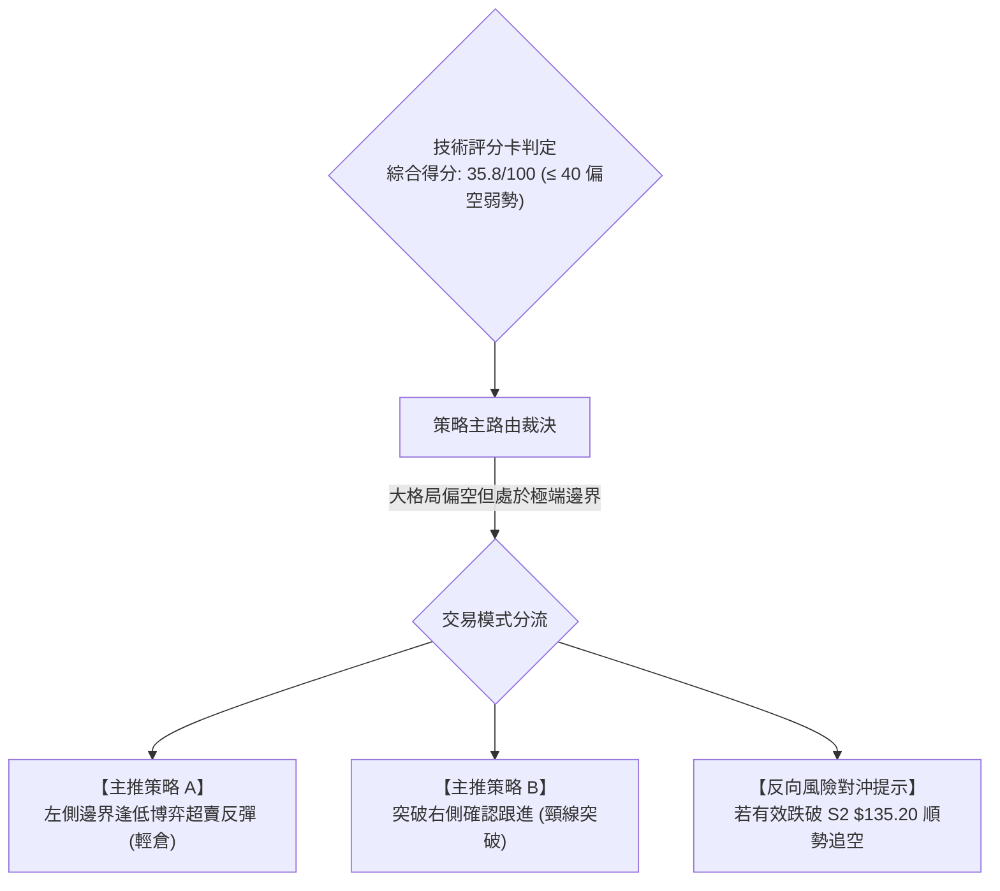

### 🧭 策略路由裁決

- **當前主策略方向 = 【中性偏空環境下的超跌反彈多頭策略 (防守型)】**
- **裁決理由**：依據第 1 章技術評分卡綜合得分為 **35.8/100**，技術架構整體偏空。但由於 ADX=13.93（盤整無趨勢）且價格已抵達 52 週最低點支撐位 S2 ($135.20) 與布林下軌 ($135.82)，在此位階直接做空將面臨極大的盈虧比劣勢與底背離軋空風險。因此，主策略以**嚴格依託 S2 支撐為防守底線的「逢低博弈反彈」**為主，空頭策略僅作為跌破關鍵支撐時的風控對沖處置。

### 🎯 價格情境階梯（Price Scenarios）

所有價位均嚴格引用第 4 章計算之關鍵價位：

| 觸發條件 | 下一目標價 | 後續延伸目標 | 情境技術含義 |
|----------|------------|--------------|--------------|
| **強勢突破 R1 ($162.30)** | R2: $168.00 | R3: $200.38 | 雙底形態正式確認，展開週線等級反轉回抽 MA200 |
| **有效站穩現價 ($140.82)** | MA20: $150.78 | R1: $162.30 | 脫離布林下軌，向中軌展開均值回歸 |
| **跌破 S1 ($139.28)** | S2: $135.20 | 數據中未偵測到 | 測試 52 週年度低點，考驗主力最後防線 |
| **放量摜破 S2 ($135.20)** | 數據中未偵測到 | 數據中未偵測到 | 52週支撐徹底潰散，形成新一輪單邊空頭加速破位 |

### 📊 情境機率分佈

| 情境劇本 | 發生機率 | 主要技術與量化依據 |
|----------|----------|--------------------|
| **情境一：低檔反彈回抽** | **55%** | RSI 日線底背離確立；Stoch 極度超賣；成交量萎縮代表浮動籌碼枯竭；空單比例 11.8% 具備回補動力。 |
| **情境二：箱體窄幅震盪** | **30%** | ADX(14) 僅 13.93，趨勢動能極弱；均線依然下壓，多方追價意願不足，將在 $135.20 至 $150.78 間反覆磨底。 |
| **情境三：下破再創新低** | **15%** | 均線系統呈標準空頭排列；MACD 柱狀圖仍處負值；若跌破 S2 ($135.20) 將觸發止損盤多殺多。 |

### 🟢 主策略詳情

本報告提供兩套在嚴格風控下的執行方案，所有目標價與止損點均依據數據中的關鍵價位精確制定：

| 策略要素 | 策略 A：左側逢低低吸策略 (超賣博弈) | 策略 B：右側突破加碼策略 (確認反轉) |
|----------|--------------------------------------|--------------------------------------|
| **進場條件** | 現價回踩支撐位 S1 企穩，或於現價分批掛單 | 日線收盤價強勢突破阻力位 R1，伴隨成交量放大 |
| **進場價格** | **$139.28** (S1 支撐位附近) | **$162.30** (突破 R1 買入) |
| **第一目標價 (T1)** | **$150.78** (布林中軌 / MA20) | **$168.00** (阻力位 R2) |
| **第二目標價 (T2)** | **$162.30** (阻力位 R1 / 頸線) | **$200.38** (阻力位 R3 / MA200) |
| **止損價格** | **$134.50** (跌破 52W 低點 S2 $135.20 約 0.5%) | **$156.13** (跌回 MA60 均線下方) |
| **風險空間** | $139.28 - $134.50 = **$4.78** | $162.30 - $156.13 = **$6.17** |
| **獲利空間 (T1)** | $150.78 - $139.28 = **$11.50** | $168.00 - $162.30 = **$5.70** |
| **獲利空間 (T2)** | $162.30 - $139.28 = **$23.02** | $200.38 - $162.30 = **$38.08** |
| **風險報酬比 (R:R)**| **1 : 2.41** (至T1) ／ **1 : 4.82** (至T2) | **1 : 0.92** (至T1) ／ **1 : 6.17** (至T2) |
| **策略勝率估計** | **60%** | **50%** |
| **建議配置倉位** | **5% - 8%** (輕倉試探，嚴格防守) | **10% - 15%** (趨勢確立，可適度加倉) |

### 🔴 反向風險觸發點（對沖提示）

- **全面停損／反手放空觸發條件**：若日線收盤價**實體跌破 52 週最低點 S2: $135.20**。
- **風控處理機制**：
  1. 所有多頭倉位無條件全數止損離場，嚴禁攤平。
  2. 若摜破 $135.20 時伴隨單日成交量超過 20 日均量（>2.28M），顯示機構防線失守，激進交易者可順勢以輕倉追空，以 $139.28 作為空頭防守止損點。

### ⭐ 整體訊號強度評星

```
做多訊號強度：★★☆☆☆  (2.5/5星 - 僅限超跌反彈)
做空訊號強度：★★★☆☆  (3.0/5星 - 均線壓制但受制於低檔支撐)
整體可信度：  ★★★★☆  (4.0/5星 - 價位邊界明確，盈虧比清晰)
```

---

## 9. 風險提示與監控

### ✅ 關鍵監控指標 Checklist

```
╔══════════════════════════════════════════════════════════════════╗
║                   AVAV 每日交易監控清單 (Checklist)             ║
╠══════════════════════════════════════════════════════════════════╣
║ [ ] 支撐防守監控：收盤價是否守穩 S1: $139.28 與 S2: $135.20      ║
║ [ ] 背離延續確認：RSI(14) 是否維持在 30 以上並持續與價格形成背離 ║
║ [ ] 動能翻紅確認：MACD 柱狀圖是否由負值 -1.350 朝零軸快速收斂   ║
║ [ ] 均線動態突破：股價是否能放量站上 5日線 ($142.76) 與 MA20     ║
║ [ ] 異常放量警訊：成交量是否突破 2.28M（若放量收陰則高度危險）   ║
║ [ ] 空頭回補跡象：觀察借券賣出比例與做空餘額是否開始顯著下滑     ║
╚══════════════════════════════════════════════════════════════════╝
```

### ⚠️ 風險場景分析

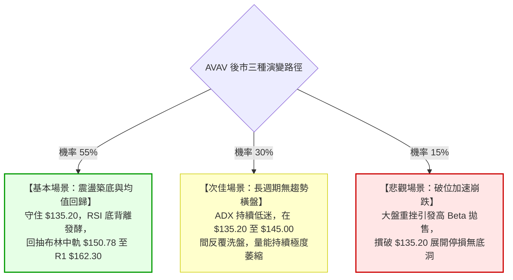

### 🛡️ 風險管理重要提醒

1. **基本面財務虧損警訊**：AVAV 目前 TTM EPS 為 **$-4.05**，淨利率為 **-10.1%**，自由現金流為 **$-25.92M**。公司處於虧損狀態，因此本輪反彈**純屬技術面極端超賣與籌碼面修正驅動**，嚴禁以長線基本面無腦死守。
2. **高 Beta 波動防範**：Beta 高達 **1.406**，意味著個股波動幅度大於市場 40%。在配置倉位時，應主動降槓桿，單一策略部位建議嚴格限制在總投資組合的 **5% 至 8% 以內**。
3. **無趨勢環境的操作紀律**：當 ADX = 13.93 時，任何看似強勢的單日大陽線極易演變成假突破。嚴禁在股價逼近布林上軌 ($165.74) 或阻力位 R1 ($162.30) 時追價，務必採取「靠近支撐買、靠近阻力賣」的嚴格區間原則。

---

## 📋 報告總結

```
╔══════════════════════════════════════════════════════════════════╗
║                  AVAV 技術分析報告核心總結                       ║
╠══════════════════════════════════════════════════════════════════╣
║ 報告日期：2026-10-03           當前價格：$140.82                 ║
║ 綜合技術評分：35.8/100         分析評級：⚖️ 偏空弱勢 (超賣醞釀反彈)║
╠══════════════════════════════════════════════════════════════════╣
║ 趨勢架構判定：                                                   ║
║ ├─ 長期趨勢：🔴 深度熊市修正 (距52W高點回撤達 -67.6%)            ║
║ ├─ 中期趨勢：🔴 弱勢震盪盤跌 (受制於 MA200: $201.24)             ║
║ └─ 短期趨勢：🟡 低檔震盪築底 (ADX=13.93 無趨勢，RSI 呈現底背離)  ║
║                                                                  ║
║ 關鍵技術價位：                                                   ║
║ ├─ 核心阻力位：R1: $162.30 ｜ R2: $168.00 ｜ R3: $200.38         ║
║ ├─ 核心支撐位：S1: $139.28 ｜ S2: $135.20 (52週極限生命線)       ║
║ └─ 分析師共識目標價：$219.35 (低標: $148.57 ｜ 高標: $315.00)   ║
╠══════════════════════════════════════════════════════════════════╣
║ 最優交易執行方案：                                               ║
║ 1. 🥇 最佳機會 (策略 A)：在 S1: $139.28 附近輕倉試單博反彈，      ║
║    止損設於 $134.50 (S2 破位)，目標 T1: $150.78，T2: $162.30，    ║
║    具備高達 1:4.82 之優異風險報酬比。                           ║
║ 2. 🥈 次選機會 (策略 B)：等待多方放量突破 R1: $162.30 頸線後      ║
║    進行右側追買，以 $156.13 為止損，目標直指 R3: $200.38。       ║
║ 3. 🥉 防守告警：任何時刻實體跌破 $135.20，代表築底完全失敗，     ║
║    必須堅決執行全面止損離場。                                   ║
╚══════════════════════════════════════════════════════════════════╝
```

---

> ⚠️ **免責聲明**：本報告為依據量化技術指標與歷史 OHLCV 數據衍生之客觀分析，所有內容**僅供學術研究與交易思路參考**，**絕對不構成任何個人投資要約或買賣建議**。金融市場瞬息萬變，高 Beta 股票波動劇烈，投資人應充分理解下行風險並自行承擔交易損益。

---

*報告生成時間：2026-10-03 ｜ 數據來源：Yahoo Finance ｜ 分析框架：多時框圖表形態與量化指標系統*