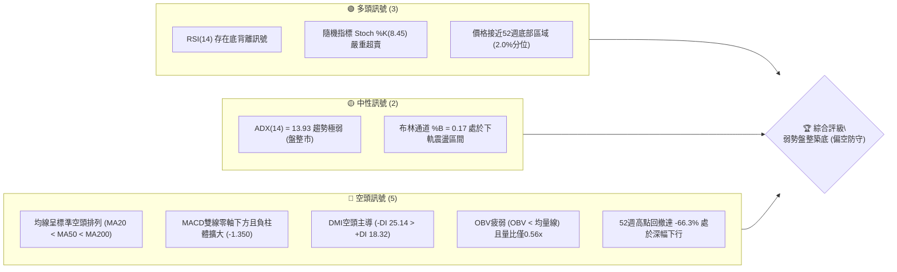
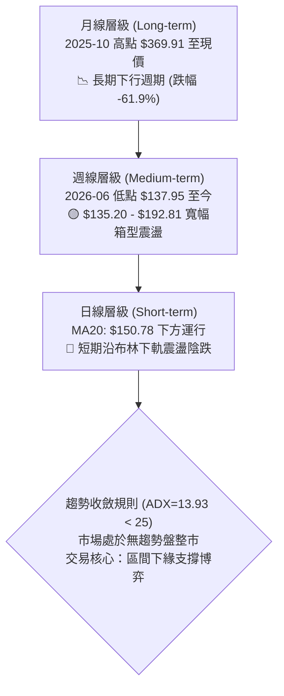
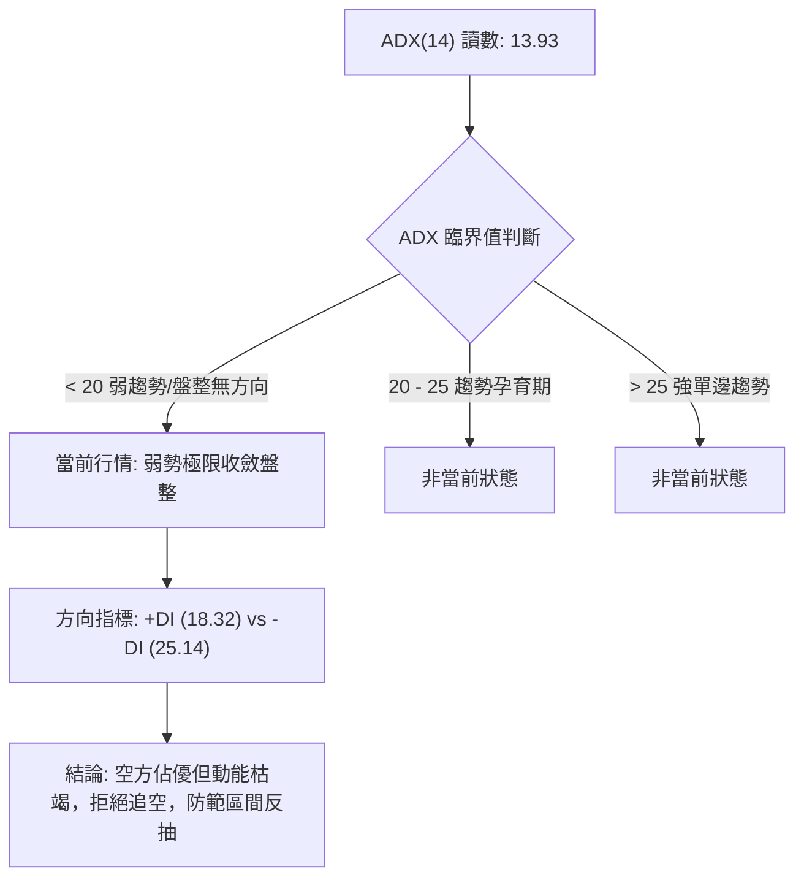
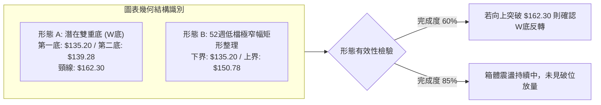
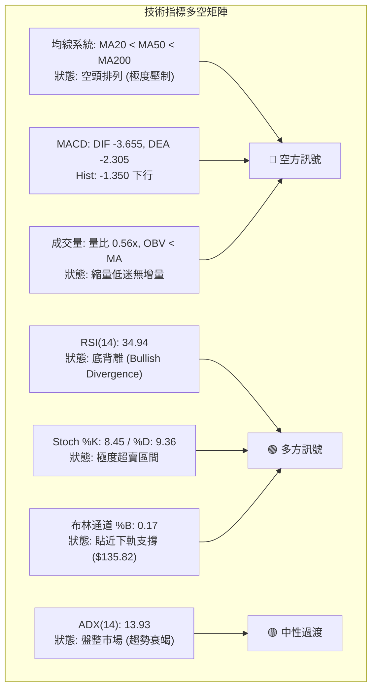
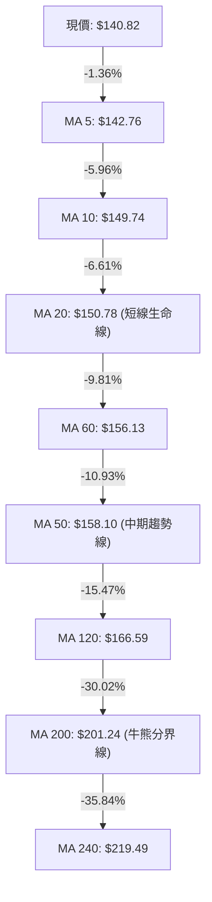
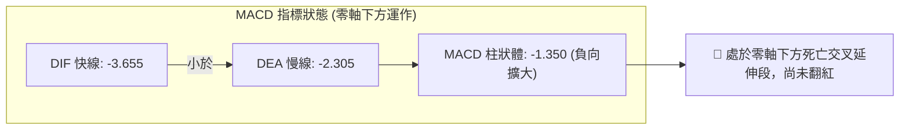
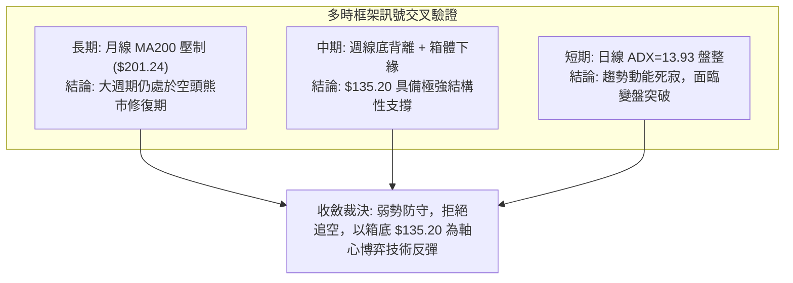
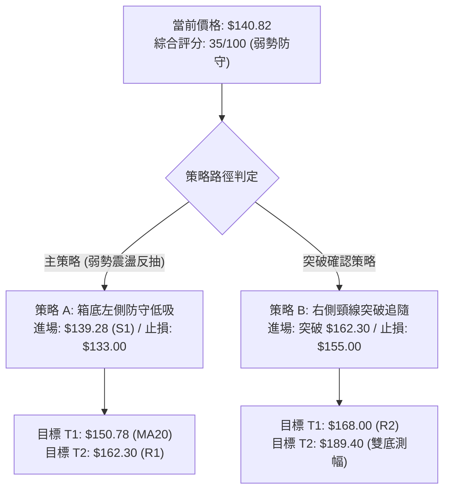
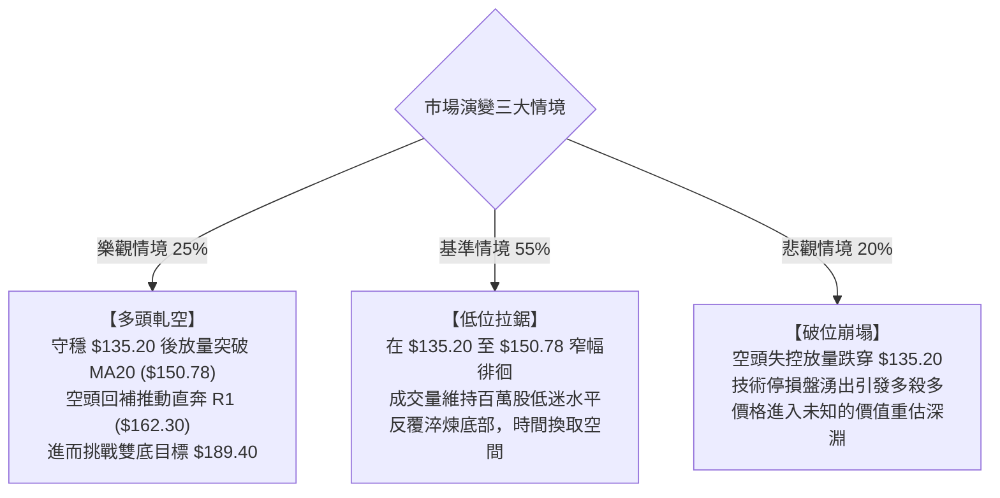

# AVAV 技術分析報告

> **報告日期**：2026-10-04 ｜ **語言**：繁體中文 ｜ **數據來源**：Yahoo Finance ｜ **當前價格**：$140.82

---

## 目錄

| 章節 | 內容 |
|------|------|
| [1. 技術面概覽](#1-技術面概覽) | 訊號儀表板、核心指標、評分卡 |
| [2. 趨勢分析](#2-趨勢分析) | 多時框趨勢、長中短期走勢、ADX強度 |
| [3. 圖表形態分析](#3-圖表形態分析) | 形態識別、信心度評估、K線組合 |
| [4. 支撐與阻力](#4-支撐與阻力) | 關鍵價位、斐波那契回調結構 |
| [5. 技術指標深度解讀](#5-技術指標深度解讀) | MA/RSI/MACD/布林/成交量共振 |
| [6. 動能與波動率](#6-動能與波動率) | 動能評估、ATR與止損、Beta敏感度 |
| [7. 多時框架總結](#7-多時框架總結) | 時框架矩陣、規則收斂結論 |
| [8. 交易策略建議](#8-交易策略建議) | 策略路由、情境階梯、風報比計算 |
| [9. 風險提示與監控](#9-風險提示與監控) | 監控清單、極端情境、風控原則 |
| [10. 報告總結](#10-報告總結) | 核心結論與執行綱要 |

---

## 1. 技術面概覽

### 🎯 技術訊號儀表板



### 📊 核心指標速覽表

| 指標類別 | 指標名稱 | 當前數值 | 訊號 | 解讀 |
| :--- | :--- | :--- | :---: | :--- |
| **價格** | 當前收盤價 | $140.82 | 🔴 | 位於52週區間底部2.0%處，持續受制於中短期均線 |
| **均線系統** | MA20 (月線) | $150.78 | 🔴 | 現價低於MA20達 -6.61%，短期下行趨勢壓制沉重 |
| **均線系統** | MA50 (季線) | $158.10 | 🔴 | 現價低於MA50達 -10.93%，中期空頭結構未變 |
| **均線系統** | MA200 (年線) | $201.24 | 🔴 | 遠低於MA200達 -30.02%，處於長期空頭熊市週期 |
| **動能指標** | RSI(14) | 34.94 | 🟡 | 位於低檔中性偏弱區，但日線與週線出現底背離雛形 |
| **動能指標** | MACD (12,26,9) | -3.655 / -2.305 | 🔴 | DIF在DEA下方，柱狀圖為 -1.350，空方動能主導 |
| **隨機指標** | Stoch %K / %D | 8.45 / 9.36 | 🟢 | 進入極度超賣區（<20），隨時具備技術性反彈動能 |
| **趨勢強度** | ADX(14) | 13.93 | 🟡 | ADX < 25 表示單邊趨勢衰竭，市場已進入低波動盤整 |
| **通道指標** | 布林通道下軌 | $135.82 | 🟢 | 現價接近下軌（%B=0.17），下軌提供動態支撐 |
| **量能指標** | 成交量 / 20日均量 | 1,274,700 / 0.56x | 🔴 | 縮量陰跌，OBV低於均線，市場追價與承接意願均顯不足 |
| **波動指標** | ATR(14) | $7.58 (5.38%) | 🟡 | 每日平均波動幅度約 $7.58，處於波動收斂末端 |

### 🏆 技術評分卡

```
╔══════════════════════════════════════════════════════════════════╗
║                 技術評分卡 — AVAV (2026-10-04)                   ║
╠══════════════════════════════════════════════════════════════════╣
║ 趨勢強度 (Trend)     ████░░░░░░░░░░░░░░░░  20/100  🔴 強烈偏空   ║
║ 動能指標 (Momentum)  ████████░░░░░░░░░░░░  40/100  🟡 低檔背離   ║
║ 支撐穩定度 (Support) ██████████░░░░░░░░░░  50/100  🟡 前低支撐   ║
║ 成交量配合 (Volume)  ██████░░░░░░░░░░░░░░  30/100  🔴 量能疲弱   ║
║ 形態完整度 (Pattern) ████████░░░░░░░░░░░░  40/100  🟡 潛在雙底   ║
║ 均線排列 (Moving Avg)██░░░░░░░░░░░░░░░░░░  10/100  🔴 完美空頭   ║
╠══════════════════════════════════════════════════════════════════╣
║ 綜合技術評分         ███████░░░░░░░░░░░░░  35/100  🔴 弱勢防守   ║
╚══════════════════════════════════════════════════════════════════╝
```

---

## 2. 趨勢分析

### 🌐 多時框趨勢分析



### 📈 長期趨勢 — 12個月走勢圖（Unicode）

```
AVAV 月線走勢圖（過去12個月：2025-10 至 2026-10）
價格 ($)
$370 ┤  ● (2025-10: $369.91)
$340 ┤   \
$310 ┤    \
$280 ┤     ●───● (2025-11: $279.46 / 2026-01: $278.39)
$250 ┤      \ / \
$220 ┤       ●   ● (2025-12: $241.89 / 2026-02: $252.25)
$190 ┤            \   ●───● (2026-04: $195.02 / 2026-05: $207.24)
$160 ┤             \ / \ / \
$140 ┤              ●   ●   ●───●───●───●← 現價 $140.82
$110 └─────────────────────────────────────────────────────
       10  11  12  01  02  03  04  05  06  07  08  09  10 (月份)
      (25) (25)(25)(26)(26)(26)(26)(26)(26)(26)(26)(26)(26)
```

#### 長期走勢特徵分析表

| 階段區間 | 起止價格 | 漲跌幅 | 走勢特徵解讀 |
| :--- | :--- | :---: | :--- |
| **頂部派發期**<br>(2025-10 ~ 2025-12) | $369.91 → $241.89 | -34.61% | 觸及52週歷史高點 $417.86 後形成斷崖式崩跌，主力資金快速派發出逃。 |
| **次級反彈期**<br>(2025-12 ~ 2026-01) | $241.89 → $278.39 | +15.09% | 跌破高位支撐後的技術性抽頭回測，未能突破下降趨勢線，確認中期頭部。 |
| **二次下殺期**<br>(2026-01 ~ 2026-03) | $278.39 → $183.05 | -34.25% | 連續三個月收陰，跌破200美元大關，長線多頭結構遭到毀滅性破壞。 |
| **弱勢抵抗期**<br>(2026-03 ~ 2026-05) | $183.05 → $207.24 | +13.21% | 於年線附近進行弱勢抵抗，2026年5月最高摸至 $207.24 後動能耗盡。 |
| **探底震盪期**<br>(2026-06 ~ 2026-10) | $207.24 → $140.82 | -32.05% | 跌破 $150 整數關卡，最低探至52週低點 $135.20，目前在底部極窄幅沉澱。 |

### 📊 中期趨勢（週線分析）

從近20週數據觀察，AVAV於2026年6月28日當週打出波段低點 $137.95，隨後在2026年8月中旬反彈至高點 $192.81，隨後再度回落。

```
週線震盪箱型示意圖
$192.81 ────────────────────────────────────── 箱頂阻力 (2026-08)
                  ▲
                 / \
                /   \
$162.30 ───────/─────\────────── R1 突破阻力 (反彈頸線)
              /       \
             /         ▼
$140.82 ────●─────────────────── 現價位置 (箱底蓄勢)
           /
$135.20 ──●───────────────────── 52週低點支撐 S2 (2026-06~07 低點)
```

- **均線壓制**：週線價格反覆受制於MA20（$150.78）與MA50（$158.10），中期反彈只要無法站上 $162.30，皆定義為弱勢整理。
- **量價萎縮**：9月中旬成交量曾放大至 20,402,600 股並拉升至 $159.95，但隨後三週量能驟降至 6,770,400 股，價格回落至 $140.82，顯示追價買盤難以延續。

### ⚡ 趨勢強度評估（ADX 解讀）



#### ADX 趨勢強度對照表

| 評估維度 | 當前數值 | 門檻區間 | 市場含義解讀 |
| :--- | :---: | :---: | :--- |
| **ADX 指數** | **13.93** | 0 ~ 20 (極弱) | 趨勢動能極其匱乏，此時趨勢追隨策略（如追突破）失效率極高，震盪指標更具參考價值。 |
| **+DI (多頭動能)** | **18.32** | — | 多頭上攻能量微弱，缺乏推動大波段的增量資金。 |
| **-DI (空頭動能)** | **25.14** | — | 空方仍掌握相對主導權，但數值未超過30，空頭下殺動能已非主跌段。 |
| **行情報酬性質** | **無趨勢** | ADX < 25 | 嚴禁採取破位追空策略，行情呈現布林軌道內的低效來回擺動。 |

---

## 3. 圖表形態分析

### 🔍 形態識別系統



#### 圖表形態信心度評估表

| 形態名稱 | 信心度 | 判斷依據（引用數據） | 完成度 | 目標價（附計算式） |
| :--- | :---: | :--- | :---: | :--- |
| **潛在雙重底 (Double Bottom)** | **58%** | 2026年低點於 $135.20 獲得支撐，近期於 $139.28（S1）再度止跌，兩次低點相距不足 3%，形成潛在雙底。 | 60% | 頸線為阻力位 R1（$162.30）。<br>形態高度 = $162.30 - $135.20 = $27.10。<br>理論目標價 = 頸線 $162.30 + $27.10 = **$189.40**。 |
| **低檔矩形收斂箱體** | **75%** | 價格近一個月受限於布林中軌 MA20（$150.78）與支撐位 S2（$135.20）之間，波幅持續壓縮。 | 85% | 箱頂 $150.78，箱底 $135.20。<br>箱體高度 = $15.58。<br>若向上突破目標 = $150.78 + $15.58 = **$166.36**（接近R2 $168.00）。 |
| **頭肩底形態** | **25%** | 目前左肩（$137.95）與頭部（$135.20）依稀可見，但右肩結構尚無成交量配合，形態未成熟。 | 20% | 訊號不足，信心度低於50%，僅做指標型解讀，不予以定價。 |

### 🕯️ 重要K線形態分析

| 週期/月份 | 收盤價 | K線形態 | 技術解讀 | 訊號 |
| :--- | :---: | :--- | :--- | :---: |
| **2026-06** | $137.95 | **長下影錘頭線** | 單週放量 11,887,200 股打出 $135.20 歷史低點後拉升，主力抄底盤進場。 | 🟢 |
| **2026-08** | $192.81 | **高位流星線 (Shooting Star)** | 衝擊斐波那契 78.6% 位（$195.69）失敗，留長上影線，形成波段頂部阻力。 | 🔴 |
| **2026-09-13**| $146.71 | **爆量長下影十字星** | 單週成交量暴增至 20,402,600 股，於 $140 附近爆發籌碼換手，低檔承接強勁。 | 🟢 |
| **2026-10-04**| $140.82 | **低波動小陰線 (Doji/Small Bear)**| 縮量陰跌至前低附近，成交量僅 6,770,400 股，空頭賣壓顯著枯竭。 | 🟡 |

### 📉 ASCII 走勢形態示意圖

```
潛在雙底 (Double Bottom) 結構示意圖
價格軸 ($)
$162.30 ┤                      ╭───╮ (頸線阻力 R1)
         │                     │   │
$150.78 ┤         ╭───╮       │   │  (MA20 / 箱頂)
         │         │   │       │   │
$140.82 ┤─────────┼───┼───────●───┼────── 現價 $140.82 (右底構築中)
         │         │   │      /     │
$135.20 ┤   ●─────╯   ╰─────●      │  (左底 $135.20 / 右底 $139.28)
         └─────────────────────────────┴─────────────
           2026-06           2026-10     未來突破路徑
```

### 🎯 形態目標價計算

1. **雙底頸線突破測幅**：
   - 形態底部低點：$135.20（2026年歷史低點 S2）
   - 形態頸線高點：$162.30（近一年波段高點聚類阻力 R1）
   - 垂直高度 $H = \$162.30 - \$135.20 = \$27.10$
   - 突破目標價 $T1 = \text{頸線} + H = \$162.30 + \$27.10 = \mathbf{\$189.40}$（該目標價與8月反彈高點 $192.81 形成共振區間）。
2. **矩形整理測幅**：
   - 箱體下界：$135.20
   - 箱體上界：$150.78（MA20）
   - 箱體高度 $h = \$150.78 - \$135.20 = \$15.58$
   - 箱體向上破位測幅 = $\$150.78 + \$15.58 = \mathbf{\$166.36}$（落於阻力區間 R1 $162.30 ~ R2 $168.00 內部）。

---

## 4. 支撐與阻力

### 🗺️ 關鍵價位分布圖（Unicode）

```
AVAV 價位結構分布圖 (由 OHLCV 與斐波那契精準計算)
═════════════════════════════════════════════════════════════════════
$200.38 ║██████████████████████████████║ 強阻力 R3 / 接近MA200 ($201.24)
$195.69 ║░░░░░░░░░░░░░░░░░░░░░░░░░░░░░░║ 斐波那契 78.6% 回調位
$168.00 ║████████████████████          ║ 阻力 R2 (前期成交密集區高緣)
$165.74 ║------------------------------║ 布林通道上軌
$162.30 ║████████████████████████      ║ 關鍵阻力 R1 (頸線壓力 / 反彈關鍵)
$158.10 ║┈┈┈┈┈┈┈┈┈┈┈┈┈┈┈┈┈┈┈┈┈┈┈┈┈┈┈┈┈┈║ MA50 均線阻力
$150.78 ║┈┈┈┈┈┈┈┈┈┈┈┈┈┈┈┈┈┈┈┈┈┈┈┈┈┈┈┈┈┈║ MA20 (布林中軌阻力)
$140.82 ╠══════════════════════════════╣ ◄ 當前收盤價 ($140.82)
$139.28 ║▓▓▓▓▓▓▓▓▓▓▓▓▓▓▓▓▓▓▓▓          ║ 近期支撐 S1 (波段低點聚類)
$135.82 ║------------------------------║ 布林通道下軌
$135.20 ║██████████████████████████████║ 核心強支撐 S2 (52W歷史低點)
═════════════════════════════════════════════════════════════════════
```

### 🚧 阻力位分析表

所有價位均直接取自技術數據「關鍵價位」之高點聚類與均線指標：

| 阻力級別 | 精確價位 | 形成原因與籌碼意義 | 突破難度 | 戰略重要性 |
| :--- | :---: | :--- | :---: | :---: |
| **R1 (關鍵頸線)** | **$162.30** | 近一年波段高點聚類，且位於MA60（$156.13）與MA120（$166.59）過渡帶，為空頭強防守位。 | 中等偏高 | ★★★★☆<br>突破代表雙底構築成功 |
| **R2 (中期波段)** | **$168.00** | 波段高點聚類，與MA120（$166.59）及布林上軌（$165.74）共振，籌碼套牢區下緣。 | 極高 | ★★★☆☆<br>確認中期趨勢反轉信號 |
| **R3 (牛熊分界)** | **$200.38** | 長期波段高點聚類，與MA200（$201.24）幾乎重合，為大級別空頭趨勢的最後防線。 | 極難突破 | ★★★★★<br>牛熊週期轉換分水嶺 |

### 🛡️ 支撐位分析表

所有價位均直接取自技術數據「關鍵價位」之低點聚類：

| 支撐級別 | 精確價位 | 形成原因與籌碼意義 | 守住機率 | 戰略重要性 |
| :--- | :---: | :--- | :---: | :---: |
| **S1 (近端防線)** | **$139.28** | 近一年波段低點聚類，距離現價僅 -1.09%，為多頭短線回踩第一緩衝墊。 | 65% | ★★★☆☆<br>短線震盪結構下界 |
| **S2 (絕對防線)** | **$135.20** | 52週歷史低點（52W Low），斐波那契 100.0% 終極支撐，與布林下軌（$135.82）共振。 | 80% | ★★★★★<br>多頭生命線，跌破引發崩潰 |

### 📐 斐波那契回調位分析

本週期斐波那契測量區間以 52週高點 **$417.86**（0.0%）至 52週低點 **$135.20**（100.0%）計算：

```
斐波那契回調梯形圖 (52W High $417.86 → 52W Low $135.20)
  0.0% ├ $417.86 (52W High)
 23.6% ├ $351.15
 38.2% ├ $309.88
 50.0% ├ $276.53
 61.8% ├ $243.18
 78.6% ├ $195.69 (阻力共振位，接近 R3 $200.38)
100.0% ├ $135.20 (52W Low / 終極底部支撐 S2)
         ▲
         └─ 現價 $140.82 位於 78.6% ($195.69) 與 100.0% ($135.20) 之間的極端深幅回撤區間
```

- **位置意義解讀**：當前價格 $140.82 處於斐波那契 78.6%（$195.69）至 100.0%（$135.20）的極限超跌區間。現價距離 100% 支撐僅 $5.62（+4.15%），顯示資產價值已被嚴重壓縮。
- **反彈空間對照**：若股價自底部展開像樣反彈，首個重大斐波那契阻力即為 78.6% 回調位 **$195.69**，該位置與 R3（$200.38）及 MA200（$201.24）形成強大的三重頂部複合阻力帶。

---

## 5. 技術指標深度解讀

### 🎛️ 指標訊號總覽



### 📈 移動平均線排列分析



- **均線排列狀態**：當前所有長短週期均線呈標準空頭發散排列（MA5 < MA10 < MA20 < MA60 < MA50 < MA120 < MA200 < MA240），價格受壓於所有均線之下。
- **均線斜率**：MA5 下降 -1.36%，MA20 下降 -6.61%，MA240 崩跌 -35.84%，長期趨勢慣性強烈向下。空頭均線的唯一正面意義在於負乖離率過大（現價距MA200達 -30.02%），容易引發均線修復型的技術性抽頭暴衝。

### 📉 RSI(14) 分析與背離判定

- **當前讀數**：**34.94**（處於 30~40 的弱勢鈍化區）。
- **進度條展示**：
  ```
  超賣區 (0-30)        中性區 (30-70)                 超買區 (70-100)
  [████████████████████░░░░░░░░░░░░░░░░░░░░░░░░░░░░░░░░] 34.94%
  ```
- **底背離判斷（Bullish Divergence）**：
  - **價格走勢**：2026年6月低點收盤 $137.95，隨後在2026年9月至10月再度回探 $140.82 並於盤中測試 $135.20 附近，呈現價格雙底或創新低結構。
  - **RSI 軌跡**：2026-06-28 週線 RSI 跌至 **20.2**，2026-09-06 更跌至 **16.9** 的極端低值；而當前（2026-10-04）價格在 $140.82，RSI 卻已回升至 **34.94**。
  - **結論**：⚠️ **確認存在典型日線/週線級別底背離**。下行動能大幅減弱，指標不再跟隨價格創低，這是空頭動能枯竭與左側主力建倉的核心特徵。

### 📊 MACD(12, 26, 9) 訊號解讀



- **訊號解析**：DIF（-3.655）持續運行於慢線 DEA（-2.305）下方，柱狀圖為負值（-1.350）。9月下旬（2026-09-20）柱體曾短暫反彈至 +2.063，但由於量能不濟再度翻綠，顯示短期多頭反撲受挫，目前仍處於空方主導的慣性釋放中。

### 📦 布林通道分析

```
ASCII 布林通道空間定位圖
$165.74 ┬──────────────────────────────────────── 上軌 (BB Upper)
         │
$150.78 ┼──────────────────────────────────────── 中軌 (MA20)
         │
$140.82 ┼───────────────● 現價 ($140.82, %B = 0.17)
         │
$135.82 ┴──────────────────────────────────────── 下軌 (BB Lower)
```

- **通道參數**：
  - 上軌：**$165.74** ｜ 中軌：**$150.78** ｜ 下軌：**$135.82** ｜ 帶寬帶動值收斂中。
  - **%B 指標 = 0.17**：表示現價位於下軌上方僅 17% 的位置，極度靠近下軌（$135.82）。
- **通道行為解讀**：布林通道並未出現開口放量向下擴散的「向下單邊突破」，而是呈現帶寬收斂的水平收縮。下軌 $135.82 與 S2 支撐位 $135.20 形成精確重合，構成高勝率的通道包絡支撐。

### 💹 成交量分析（量價配合度）

```
成交量對比柱狀圖
最新日量: 1,274,700   [█████░░░░░] (量比 0.56x)
20日均量: 2,287,690   [██████████]
50日均量: 1,644,434   [███████░░░]
```

- **量價背離與流動性**：當前成交量僅 1,274,700 股，相較於 20日均量（2,287,690）大幅萎縮近 44%（量比 0.56x）。
- **OBV 趨勢解讀**：數據明確指出「OBV < MA → 量能疲弱」。這說明資金尚未大規模進場接盤，目前股價下挫屬於「無量陰跌」而非「恐慌放量拋售」。無量陰跌通常在遭遇關鍵支撐（如 $135.20）時，極易因賣盤枯竭而觸發軋空反彈。

---

## 6. 動能與波動率

### ⚡ 動能評估四象限

| 象限標籤 | 動能狀態 | 波動率狀態 | 當前股票歸屬 | 技術解讀與行動指引 |
| :---: | :---: | :---: | :---: | :--- |
| **Q1** | 強動能 (Bullish) | 低波動 (Low Vol) | — | 最佳趨勢主升段，穩健持股加碼。 |
| **Q2 (當前)** | **弱動能 (Bearish)** | **低波動 (Low Vol)** | **✓ (AVAV 位置)** | **動能沉底萎縮，市場交投冷清，ADX < 25。通常為底部沉澱或醞釀變盤前夕，操作應偏向防守與嚴格區間邊緣低吸，切忌追漲殺跌。** |
| **Q3** | 強動能 (Bullish) | 高波動 (High Vol) | — | 頂部狂熱或突破爆發，適合激進交易者。 |
| **Q4** | 弱動能 (Bearish) | 高波動 (High Vol) | — | 恐慌主跌段，殺跌風險極高，必須完全空倉避險。 |

### 📊 ATR 波動率分析

- **ATR(14) 讀數**：**$7.58**（佔當前價格的 **5.38%**）。
- **波動特性**：AVAV 每日平均震盪幅度達 $7.58，屬於高絕對波幅標的，這意味著短期定價噪聲極大。
- **風控止損參數設定**：
  - **保守型止損（1.5 倍 ATR）**：$1.5 \times \$7.58 = \$11.37$
  - **進取型止損（1.0 倍 ATR）**：$1.0 \times \$7.58 = \$7.58$
  - 若在現價 $140.82 附近進場，止損點不可小於 1.0 ATR 緩衝，否則極易被日內噪聲掃出場。

### 📐 Beta 與市場相關性

- **Beta 係數**：**1.406**（高於美股市場平均值 1.0）。
- **市場特徵分析**：
  - 高 Beta 屬性代表該標的具備強烈的槓桿彈性。當標普500指數或國防軍工板塊回調 1% 時，AVAV 平均下跌 1.41%；反之，大盤反彈時其彈性亦達 1.41 倍。
  - 當前空頭機構持倉（Short % Float）達 **11.8%**，Short Ratio 為 **2.11**。在空頭佔比超過 10% 且處於 52週極端底部時，高 Beta 屬性極易在利好消息或大盤企穩時引發劇烈的「空頭踩踏軋空（Short Squeeze）」。

---

## 7. 多時框架總結

### 📋 時框架評分表

| 時框架 | 趨勢方向 | 動能狀態 | 均線排列 | 形態結構 | 綜合評分 | 戰略建議 |
| :--- | :---: | :---: | :---: | :---: | :---: | :--- |
| **月線層級** | 🔴 強空頭 | 弱勢超賣 | 空頭發散 | 52W高點深幅腰斬崩跌 | **25/100** | 長線投資者僅宜定投觀望，嚴禁重倉槓桿抄底。 |
| **週線層級** | 🟡 震盪整理 | 底背離醞釀 | MA20壓制 | $135.20 ~ $192.81 大箱體 | **45/100** | 關注底部箱體支撐性，等待週線翻紅確認。 |
| **日線層級** | 🔴 弱勢陰跌 | 鈍化超賣 | 貼線下行 | 布林下軌收斂整理 | **35/100** | 依照盤整市策略，在通道下軌支撐處尋找短線反彈。 |

### 🔲 綜合訊號矩陣



### ⚖️ 多時框收斂結論

依據多時框收斂規則第 14 條：
1. **行情性質判定**：當前 ADX(14) 讀數為 **13.93**，遠低於 25 的趨勢門檻，嚴格定義為**盤整行情（Range-bound Market）**。
2. **優先級別收斂**：在 ADX < 25 的盤整市中，單邊趨勢均線指標失真，**必須以日線布林通道上下軌（$135.82 ~ $165.74）及波段支撐阻力為核心交易區間**。
3. **唯一方向性結論**：**中性偏空防守，底部區間震盪博弈（Neutral-to-Bearish Defensive Consolidation）**。
   - 儘管中長期均線呈空頭排列，但空頭動能已在 ADX=13.93 與 RSI 底背離中完全鈍化。
   - 不具備追空條件，主策略定位為**圍繞底線支撐 S2（$135.20）與布林下軌（$135.82）的防守型低吸區間交易**，若跌破 S2 則無條件離場。

---

## 8. 交易策略建議

### 🗺️ 策略決策流程圖



### 🧭 策略路由

> **當前主策略方向 = 偏空弱勢防守下的「超跌區間左側反彈策略」（依評分卡 35/100）**
> 
> 由於綜合評分低於 40 分，大趨勢仍受空頭壓制，嚴禁無節制重倉做多；但考量 ADX=13.93 且價格逼近 52週歷史支撐 S2（$135.20），盲目做空盈虧比極差。因此主推**以極限止損防守為前提的超跌波段交易**，空頭則列為跌破關鍵支撐時的順勢止損與防禦對沖。

### 🎯 價格情境階梯（Price Scenarios）

價位嚴格引用自第 4 章由數據計算之關鍵支撐阻力：

| 觸發條件 | 第一目標 (T1) | 後續延伸 (T2) | 極限目標 (T3) | 情境技術含義解讀 |
| :--- | :---: | :---: | :---: | :--- |
| **向上突破 R1 ($162.30)** | R2 ($168.00) | 形態目標 ($189.40) | R3 ($200.38) | **確認雙底反轉**：突破波段頸線，空頭排列遭化解，挑戰年線。 |
| **突破布林中軌 MA20 ($150.78)** | R1 ($162.30) | R2 ($168.00) | — | **短線超跌反抽**：修復短期均線乖離，測試中期均線 MA50 壓力。 |
| **現價區間維持 ($139.28 ~ $150.78)** | $150.78 | $135.20 | — | **低效箱體拉鋸**：布林帶持續收縮，等待均線粘合與消息面催化。 |
| **有效跌破 S1 ($139.28)** | S2 ($135.20) | 布林下軌 ($135.82) | — | **短線走弱下探**：再次測試 52週低點防線的支撐強度。 |
| **崩潰跌破 S2 ($135.20)** | 下行未知空間 | 開啟新跌浪 | — | **極端破位失守**：創52週新低，所有技術支撐全面失效，引發多頭停損潮。 |

### 📊 情境機率分佈

```
情境機率分佈長條圖
區間低位震盪蓄勢 (45%) [█████████░░░░░░░░░░░]
技術性超跌反彈   (35%) [███████░░░░░░░░░░░░░]
向下跌破創歷史新低 (20%) [████░░░░░░░░░░░░░░░░]
```

| 預測情境 | 機率 | 主要支撐依據（引用核心數據） |
| :--- | :---: | :--- |
| **區間低位震盪蓄勢** | **45%** | **ADX=13.93** 顯示趨勢極度鈍化，成交量比僅 0.56x，買賣雙方動能均耗盡，股價極易在 S1（$139.28）至 MA20（$150.78）狹窄空間沉澱。 |
| **技術性超跌反彈** | **35%** | **RSI(14) 存在明顯底背離**，Stoch %K（8.45）嚴重超賣，布林 %B=0.17 貼近下軌，且空頭部位達 11.8%，具備空頭回補動能。 |
| **向下跌破創歷史新低** | **20%** | 均線系統完整呈空頭排列，MACD 柱體為負（-1.350），若遭遇板塊系統性拋售，S2（$135.20）被擊穿風險仍存。 |

### 🟢 主策略詳情

本策略所有價位均根據前述 S1、S2、R1、R2、MA20 數值及形態計算嚴格設定：

| 策略要素 | 策略 A：左側防守低吸策略 (波段) | 策略 B：右側突破追隨策略 (動能) |
| :--- | :--- | :--- |
| **進場條件** | 股價回踩支撐位 S1 企穩，出現15分/60分K線長下影 | 股價放量突破關鍵阻力 R1（雙底頸線），日K收盤站穩 |
| **進場價格** | **$139.28**（或現價 $140.82 輕倉） | **$162.50**（確認突破 R1 $162.30） |
| **目標價 T1** | **$150.78**（布林中軌 / MA20） | **$168.00**（波段阻力 R2） |
| **目標價 T2** | **$162.30**（關鍵阻力 R1 頸線） | **$189.40**（雙底形態高度推算目標價） |
| **止損價格** | **$133.00**（跌破 S2 $135.20 之下 1.5 ATR 緩衝）| **$155.00**（回落至 MA60 $156.13 之下） |
| **風險空間** | 潛在虧損：$\$139.28 - \$133.00 = \$6.28$ ( -4.51%) | 潛在虧損：$\$162.50 - \$155.00 = \$7.50$ ( -4.62%) |
| **獲利空間** | 達 T2 收益：$\$162.30 - \$139.28 = \$23.02$ ( +16.53%) | 達 T2 收益：$\$189.40 - \$162.50 = \$26.90$ ( +16.55%) |
| **風險報酬比** | **1 : 3.67** (極佳風報比) | **1 : 3.59** (極佳風報比) |
| **估計勝率** | **55%** | **65%** |
| **建議倉位** | **10% ~ 15%** (防禦性底倉) | **15% ~ 20%** (右側加碼) |

### 🔴 反向風險觸發點（對沖提示）

- **多頭全面棄守點**：若日K線收盤價跌破 **$135.20（S2 / 52W Low）**，代表雙底形態徹底破局，52週底線崩潰，主策略的多頭邏輯完全失效。此時應**立即無條件市價停損**，禁止任何加碼補倉行為。
- **對沖放空觸發條件**：若股價跌破 $135.20 且伴隨單日成交量放大至 200萬股以上，可反向建立小額空頭倉位或購入看跌期權，下行第一目標將指向無支撐真空區。

### ⭐ 整體訊號強度評星

```
做多訊號強度：★★☆☆☆  (2.5/5星 — 僅限超跌反彈邏輯)
做空訊號強度：★★★☆☆  (3.0/5星 — 大趨勢向下但動能耗盡)
整體可信度：  ★★★★☆  (4.0/5星 — 盤整收斂特徵高度明確)
```

---

## 9. 風險提示與監控

### ✅ 關鍵監控指標 Checklist

```
╔══════════════════════════════════════════════════════════════════╗
║               AVAV 技術監控檢查清單 (Daily Checklist)            ║
╠══════════════════════════════════════════════════════════════════╣
║ [ ] 價格是否收盤守住 S2 絕對支撐線 $135.20？                     ║
║ [ ] 每日成交量是否放大突破 20日均量 (2,287,690 股)？             ║
║ [ ] 日線 RSI(14) 是否有效站上 40.0 脫離弱勢壓制區？               ║
║ [ ] MACD 柱狀體 (當前 -1.350) 是否出現收斂縮短或黃金交叉？       ║
║ [ ] 股價是否成功攻克布林中軌 MA20 ($150.78)？                    ║
║ [ ] ADX(14) (當前 13.93) 是否升破 20.0，釋放變盤訊號？           ║
║ [ ] 空頭借券賣出比率 (Short % Float, 11.8%) 是否大幅減少？       ║
╚══════════════════════════════════════════════════════════════════╝
```

### ⚠️ 風險場景分析



### 🛡️ 風險管理重要提醒

1. **嚴禁摸底加碼**：在價格未有效站穩 MA20（$150.78）之前，所有交易均屬於弱勢左側博弈。在均線完美空頭排列下，**單次交易總虧損上限必須嚴格鎖定在總賬戶資產的 1.0% 以內**。
2. **波動率緩衝運用**：ATR 達 $7.58（佔比 5.38%），日內價格隨機抖動極為劇烈。止損位設置不得小於 $135.20 之下 $2.00（即設定於 **$133.00**），以規避做市商在歷史低點故意下插針誘空的假突破行情。
3. **空頭回補陷阱**：高達 11.8% 的空頭浮動籌碼意味著隨時可能出現爆發性暴漲（如單日上漲 8%~10%）。切勿在無成交量確認的情況下，在反彈至 R1（$162.30）或 R2（$168.00）處盲目追高，此處極易遭遇主力空頭的二次反撲。

---

## 📋 報告總結

```
╔══════════════════════════════════════════════════════════════════╗
║                    AVAV 技術分析報告總結                         ║
╠══════════════════════════════════════════════════════════════════╣
║ 報告日期：2026-10-04                                             ║
║ 當前價格：$140.82                                                ║
║ 技術評級：🔴 弱勢防守 (綜合評分: 35/100)                         ║
║ 行情定性：盤整收斂市場 (ADX = 13.93 < 25)                        ║
╠══════════════════════════════════════════════════════════════════╣
║ 關鍵結論：                                                       ║
║ ├─ 長期趨勢：🔴 完美空頭排列 (現價低於 MA200 達 -30.02%)         ║
║ ├─ 中期趨勢：🟡 箱體震盪整理 ($135.20 - $192.81)                 ║
║ ├─ 短期趨勢：🟡 布林下軌鈍化，RSI(14) 呈現日週級別底背離         ║
║ ├─ 關鍵支撐：S1: $139.28  │  S2 (核心): $135.20 (52W Low)       ║
║ ├─ 關鍵阻力：R1: $162.30  │  R2: $168.00  │  R3: $200.38        ║
║ └─ 測算目標：雙底理論目標 $189.40 (突破 R1 後成立)               ║
╠══════════════════════════════════════════════════════════════════╣
║ 最優策略組合：                                                   ║
║ 1. 🥇 最佳機會：策略 A (左側低吸) — 回踩 S1 $139.28 輕倉試單，    ║
║                 止損嚴設 $133.00，博弈向 MA20 $150.78 之反彈。   ║
║                 風報比達 1:3.67。                                ║
║ 2. 🥈 次選機會：策略 B (右側確認) — 耐心等待日K放量突破頸線      ║
║                 $162.30 後順勢跟進，目標直指 $189.40。           ║
║ 3. 🥉 保守選擇：完全空倉觀望，直至日線 ADX 回升至 25 且 MACD 翻紅 ║
║                 方進場參與新趨勢。                               ║
╚══════════════════════════════════════════════════════════════════╝
```

---

> ⚠️ **免責聲明**：本報告為依據特定量化技術指標與歷史行情數據生成之專業技術分析，所有數據計算均基於既有資訊。本報告**僅供學術研究與投資風控參考**，**不構成任何要約、招攬或實質投資建議**。金融市場存在高度資本風險，投資人應獨立評估風險並自負盈虧。

---

*報告生成時間：2026-10-04 ｜ 數據來源：Yahoo Finance ｜ 分析框架：多時框技術分析體系*