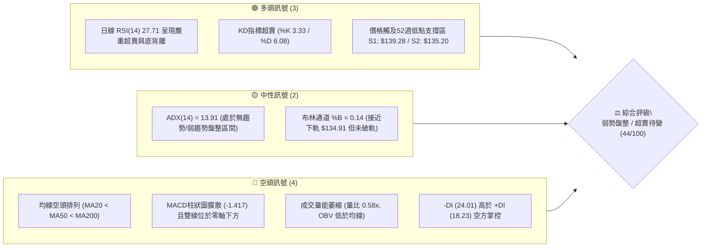
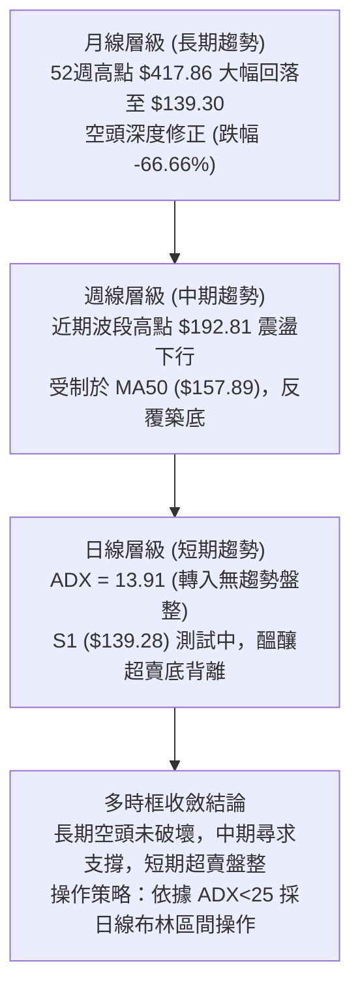
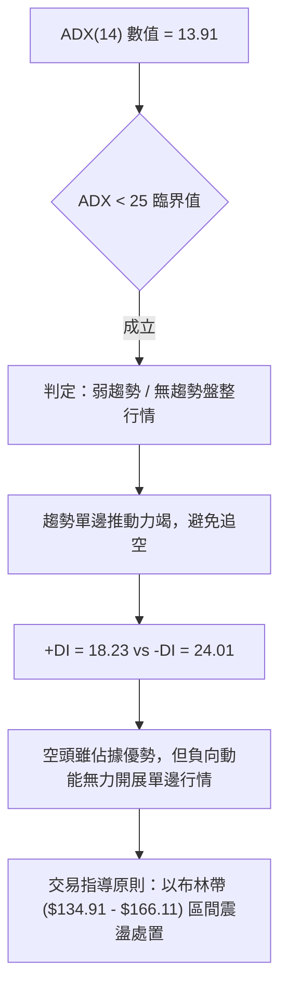
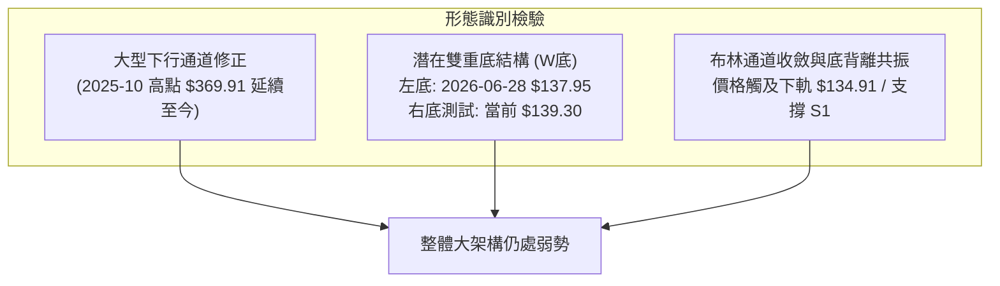
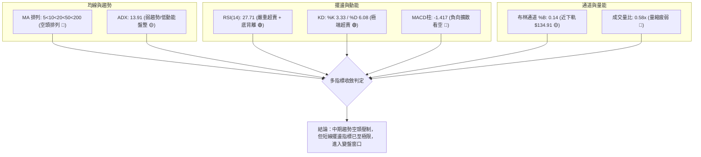
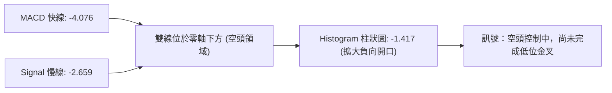
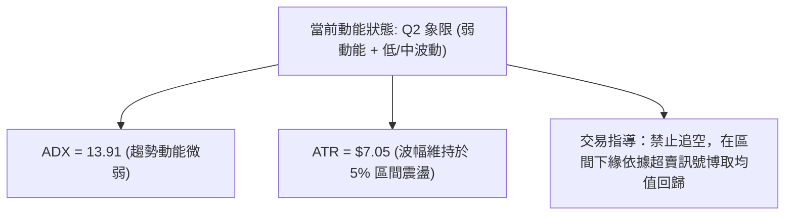
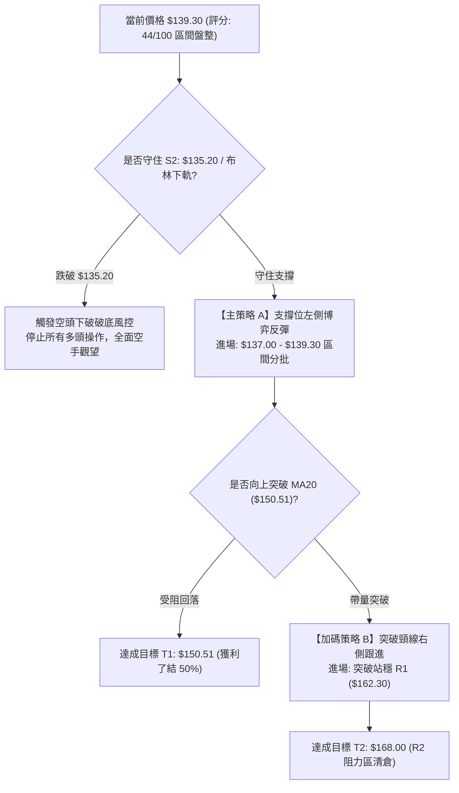
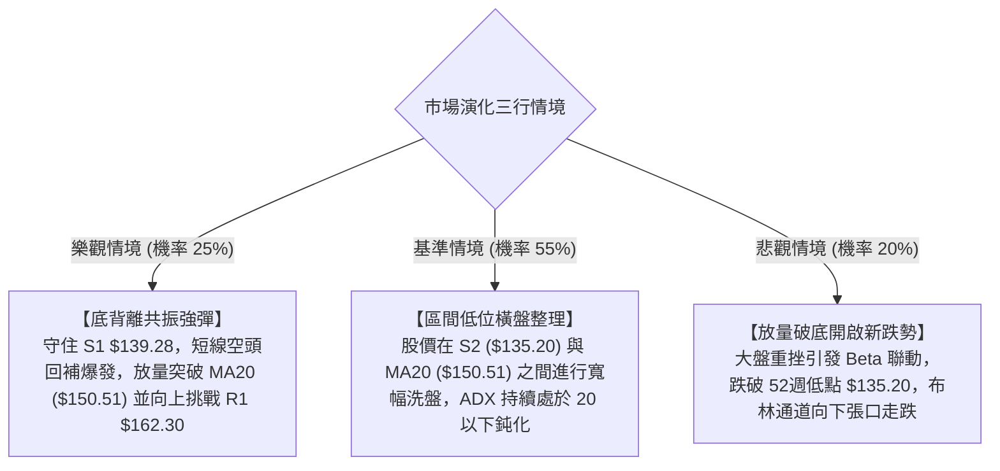

# AVAV 技術分析報告

> **報告日期**：2026-10-06 ｜ **語言**：繁體中文 ｜ **數據來源**：Yahoo Finance ｜ **當前價格**：$139.30

---

## 目錄

| 章節 | 內容 |
|------|------|
| [1. 技術面概覽](#1-技術面概覽) | 訊號儀表板、核心指標、評分卡 |
| [2. 趨勢分析](#2-趨勢分析) | 多時框趨勢、長中短期走勢、ADX 解讀 |
| [3. 圖表形態分析](#3-圖表形態分析) | 形態識別、K線組合、形態目標價 |
| [4. 支撐與阻力](#4-支撐與阻力) | 關鍵價位、斐波那契回調結構 |
| [5. 技術指標深度解讀](#5-技術指標深度解讀) | 均線、RSI、MACD、布林通道、成交量 |
| [6. 動能與波動率](#6-動能與波動率) | 動能象限、ATR 波動度、Beta 敏感度 |
| [7. 多時框架總結](#7-多時框架總結) | 時框評分、訊號矩陣、多時框收斂 |
| [8. 交易策略建議](#8-交易策略建議) | 策略路由、價格情境、多空交易計劃 |
| [9. 風險提示與監控](#9-風險提示與監控) | 監控清單、情境分析、風控準則 |

---

## 1. 技術面概覽

### 🎯 技術訊號儀表板



### 📊 核心指標速覽表

| 指標類別 | 指標名稱 | 當前數值 | 訊號 | 解讀 |
|----------|----------|----------|------|------|
| **價格** | 當前收盤價 | $139.30 | 🔴 | 位於 52 週區間底部 1.5% 位置，逼近新低 |
| **均線** | MA20 (月線) | $150.51 | 🔴 | 價格低於 MA20 -7.45%，短線反彈首道重壓 |
| **均線** | MA50 (季線) | $157.89 | 🔴 | 價格低於 MA50 -11.77%，中期下行趨勢顯著 |
| **均線** | MA200 (年線) | $200.77 | 🔴 | 價格低於 MA200 -30.62%，長期空頭主導 |
| **動能** | RSI(14) | 27.71 | 🟢 | 進入深度超賣區間 (<30)，具備技術性底背離 |
| **動能** | MACD (12,26,9) | -4.076 / -2.659 | 🔴 | MACD 柱狀圖為 -1.417，快慢線負向開口尚未收斂 |
| **擺盪** | KD (9,3,3) | %K 3.33 / %D 6.08 | 🟢 | 極度超賣區間，具備鈍化後短線金叉反彈潛力 |
| **趨勢** | ADX (14) | 13.91 | 🟡 | ADX < 25 表明單邊下行趨勢動能減弱，轉入區間震盪 |
| **通道** | 布林通道 | 下軌 $134.91 / 中軌 $150.51 | 🟡 | %B = 0.14，股價位於下軌上方獲支撐 |
| **量能** | 20日成交量比 | 0.58x (1.31M vs 2.28M) | 🔴 | 價跌量縮，OBV < MA，反映機構買盤承接謹慎 |
| **波動** | ATR(14) | $7.05 (5.06%) | 🟡 | 波動度處於中等水平，每日換手波幅約 $7 區間 |

### 🏆 技術評分卡

```
╔══════════════════════════════════════════════════════════════════╗
║                 AVAV 技術評分卡 — 2026-10-06                     ║
╠══════════════════════════════════════════════════════════════════╣
║ 趨勢強度 (Trend)     ██████░░░░░░░░░░░░░░  30/100 🔴 空頭掌控    ║
║ 動能指標 (Momentum)  ██████████░░░░░░░░░░  50/100 🟡 底背離醞釀  ║
║ 支撐穩定度 (Support) ████████████░░░░░░░░  60/100 🟡 守住S1/S2   ║
║ 成交量配合 (Volume)  ██████░░░░░░░░░░░░░░  30/100 🔴 量能疲弱    ║
║ 形態完整度 (Pattern) ████████░░░░░░░░░░░░  40/100 🔴 盤整待變    ║
║ 均線排列 (Moving Avg)████████░░░░░░░░░░░░  40/100 🔴 空頭排列    ║
╠══════════════════════════════════════════════════════════════════╣
║ 綜合技術評分         █████████░░░░░░░░░░░  44/100 🟡 中性偏弱    ║
║ 狀態判定：區間弱勢震盪 (ADX < 25)，空頭主導但具備超賣底背離反彈條件║
╚══════════════════════════════════════════════════════════════════╝
```

---

## 2. 趨勢分析

### 🌐 多時框趨勢分析



### 📈 長期趨勢 — 12個月走勢圖（Unicode）

依據過去 12 個月（2025-11 至 2026-10）收盤價繪製月線走勢圖：

```
AVAV 月線歷史收盤走勢圖（2025-11 至 2026-10）
價格 ($)
$370 ┼      ● (2025-10 高峰延伸 $369.91)
$320 ┼     
$270 ┼  ● (2025-11: $279.46)    ● (2026-01: $278.39)
$240 ┼      ● (2025-12: $241.89)    ● (2026-02: $252.25)
$210 ┼                                  ● (2026-05: $207.24)
$180 ┼                      ● (2026-03: $183.05)    ● (2026-04: $195.02)
$150 ┼                                              ● (06: $165.07)
$140 ┼                                                  ● (07: $149.37)  ● (08: $148.35)  ● (09: $142.22)
$135 ┼                                                                                          ● (10: $139.30 ◄現價)
     └────┬──────┬──────┬──────┬──────┬──────┬──────┬──────┬──────┬──────┬──────┬──────┬───────
         11月   12月   01月   02月   03月   04月   05月   06月   07月   08月   09月   10月
         (2025) (2025) (2026) (2026) (2026) (2026) (2026) (2026) (2026) (2026) (2026) (2026)
```

#### 月線走勢特徵分析表

| 階段區間 | 月份跨度 | 價格區間 ($) | 漲跌幅 (%) | 走勢特徵與量價結構 |
|----------|----------|--------------|------------|-------------------|
| **第一階段：高檔破位** | 2025-11 ~ 2025-12 | $279.46 → $241.89 | -13.44% | 脫離歷史高點後的初期獲利了結賣壓，失守 $250 整數關卡 |
| **第二階段：次高反撲** | 2026-01 ~ 2026-02 | $278.39 → $252.25 | -9.39% | 反彈未能突破 $280，構築雙頂結構右肩後加速向下 |
| **第三階段：深層下殺** | 2026-03 ~ 2026-04 | $183.05 → $195.02 | +6.54% | 崩跌破 $200 年線大關，於 $180 附近展開弱勢弱彈修正 |
| **第四階段：短線反彈** | 2026-05 | $207.24 | +6.27% | 測試下降通道上軌，週成交量放大但受制於季線反壓回落 |
| **第五階段：底部震盪** | 2026-06 ~ 2026-10 | $165.07 → $139.30 | -15.61% | 連續 5 個月低位收陰，成交動能逐月遞減，回測 52 週低點區 |

### 📊 中期趨勢（週線分析）

從近 20 週收盤走勢可見，股價在 2026-06-28 創下波段低點 $137.95（週成交量爆發至 11.88M），隨後於 2026-07-05 報復性反彈至 $190.89（週成交量 18.31M），隨後於 2026-08-16 再次觸及 $192.81。
自 8 月下旬起，價格再度拉回：
- 2026-08-23 收盤 $160.22（MACD柱 -2.279）
- 2026-09-06 收盤 $144.65（RSI 跌至 16.9 極端值）
- 2026-09-20 跌深反彈至 $159.95
- 2026-10-11（即時）收於 $139.30，正在二次確認 6 月底的底部支撐。

```
近期波段壓力與支撐示意圖：
  $200.38 ────────── 近一年高點聚類 / MA200 反壓 (R3)
     │
  $168.00 ────────── 中期波段反彈聚類壓力 (R2)
  $162.30 ────────── 近一年波段高點聚類壓力 (R1)
     │
  $150.51 ────────── 20日均線 / 布林中軌
     │
  $139.30 ───●────── 現價 (緊貼 S1: $139.28)
  $135.20 ────────── 52週低點 / 結構性防守線 (S2)
```

### ⚡ 趨勢強度評估（ADX 解讀）



#### ADX 指標對照與量化解讀

| 指標變數 | 當前讀數 | 門檻區間 | 技術定義與市場意涵 |
|----------|----------|----------|--------------------|
| **ADX(14)** | **13.91** | < 20 (極弱) | 行情陷入典型低動能橫盤整理，不具備強烈趨勢攻擊特徵 |
| **+DI** | **18.23** | 多方買盤力道 | 多方進攻力量偏低，缺乏增量資金追價推升 |
| **-DI** | **24.01** | 空方拋售力道 | 空方雖然數值高於多方，但未擴大至 30 以上，拋壓逐步鈍化 |
| **DI 差值** | **-5.78** | 空頭優勢輕微 | 空方主導權有限，空頭推低空間受限於技術性買盤守候 |

---

## 3. 圖表形態分析

### 🔍 形態識別系統

根據近 24 個月及 20 週價格軌跡，市場在此區域呈現出築底與區間特徵：



#### 形態信心度與目標價計算表

| 形態類別 | 信心度 (%) | 判斷依據（引用數據） | 完成度 (%) | 目標價（附嚴謹計算式） |
|----------|------------|----------------------|------------|------------------------|
| **潛在雙重底 (W-Bottom)** | **62%** | 兩次波段低點於 $137.95 (2026-06-28) 與當前 $139.30 (貼近 S1 $139.28)，頸線對應 R1 $162.30 | 45% (右底測試中尚未突破頸線) | 由雙底形態推算：<br/>形態高度 = 頸線 $162.30 - 左底 $137.95 = $24.35<br/>突破目標價 = 頸線 $162.30 + $24.35 = **$186.65** (接近阻力區) |
| **下降通道 (Descending Channel)** | **75%** | 2025-10 高點 $369.91 下跌以來，MA50 與 MA200 持續壓制，反彈高點遞減 | 85% (已運行至通道下緣) | 數據中未偵測到明確下破目標，下檔以通道下軌兼 S2 **$135.20** 為邊界 |
| **指標型布林收口底背離** | **80%** | RSI 27.71 超賣且產生底背離，價格落於 BB 下軌 $134.91 與 S1 $139.28 之間 | 70% | 由布林均值回歸推算：<br/>目標 1 = BB 中軌 (MA20) = **$150.51**<br/>目標 2 = BB 上軌 = **$166.11** |

### 🕯️ 重要K線形態分析

| 週/月份週期 | 收盤價 ($) | K線形態名稱 | 技術解讀 | 訊號方向 |
|-------------|------------|-------------|----------|----------|
| **2026-06-28 週** | 137.95 | 長下影長陰線 | 週成交量爆出 11.88M，恐慌盤湧出後引發短線主力承接，確立左底支撐 | 🟢/🔴 轉折 |
| **2026-07-05 週** | 190.89 | 大陽線吞噬 | 成交量激增至 18.31M，單週反彈近 38%，確立 $137.95 為有效技術防守位 | 🟢 強多 |
| **2026-08-16 週** | 192.81 | 上影流星線 | RSI 衝高至 73.5 超買區，受阻於 $195.69 (斐波那契 78.6%) 回落 | 🔴 轉弱 |
| **2026-09-06 週** | 144.65 | 下影探底小陰線 | RSI 跌至 16.9 極端超賣區，賣盤動能衰退，呈現二次尋底形態 | 🟡 止跌信號 |
| **2026-10-11 週(當前)**| 139.30 | 低位微型十字星/縮量陰線 | 週量萎縮至 1.31M，價格守住 S1 $139.28，賣壓明顯枯竭，醞釀變盤 | 🟢 超賣止跌 |

### 📉 ASCII 走勢形態示意圖

```
AVAV 潛在雙重底（W底）架構示意圖：

價格 ($)
$192.81 ───────────── 中期反彈高點 (2026-08-16)
          \         /
$162.30 ───\───────/─── 頸線位置 (R1 聚類高點) ══════════════════════
            \     / \
             \   /   \
$150.51 ──────\─/─────\── MA20 / 布林中軌
               v       \
$139.30 ────────────────\──● 當前測試位置 (現價 $139.30, 守在 S1: $139.28)
$137.95 ───● (左底)      \__ 潛在右底 (S2: $135.20 52週低點防線)
          (06-28)
```

---

## 4. 支撐與阻力

### 🗺️ 關鍵價位分布圖（Unicode）

```
AVAV 關鍵價位結構分布圖（OHLCV 實際計算）
═══════════════════════════════════════════════════════════════════
$200.38 ║██████████████████████████████║ 強阻力 R3（MA200 長期年線重壓）
$168.00 ║████████████████████          ║ 波段阻力 R2（近一年波段高點）
$162.30 ║████████████████████████      ║ 關鍵頸線阻力 R1（W底頸線）
$150.51 ║──────────────────────────────║ 短線中樞（MA20 / 布林中軌）
$139.30 ╠══════════════════════════════╣ ◄ 現價位置（$139.30）
$139.28 ║▓▓▓▓▓▓▓▓▓▓▓▓▓▓▓▓▓▓▓▓▓▓▓▓▓▓▓▓▓▓║ 即時支撐 S1（波段低點聚類，價差 -0.01%）
$135.20 ║██████████████████████████████║ 核心強支撐 S2（52週最低價，價差 -2.94%）
═══════════════════════════════════════════════════════════════════
```

### 🚧 阻力位分析表

所有價位嚴格引用自 OHLCV 波段聚類計算數值：

| 阻力級別 | 價位 ($) | 距現價幅道 | 形成原因與籌碼屬性 | 突破難度 | 重要性 |
|----------|----------|------------|--------------------|----------|--------|
| **R1 (關鍵阻力)** | **$162.30** | +16.51% | 近一年波段高點聚類、潛在雙底頸線位、60日均線 ($156.05) 上方密集套牢區 | 🟡 中等 | ★★★★☆ |
| **R2 (中期阻力)** | **$168.00** | +20.60% | 近一年波段次高點聚類、布林上軌 ($166.11) 延伸區間、120日均線 ($166.13) | 🔴 較高 | ★★★☆☆ |
| **R3 (長期強阻)** | **$200.38** | +43.85% | 200日均線 ($200.77) 重疊區、心理整數大關、長期多空分水嶺 | 🔴 極高 | ★★★★★ |

### 🛡️ 支撐位分析表

所有價位嚴格引用自 OHLCV 波段聚類計算數值：

| 支撐級別 | 價位 ($) | 距現價幅道 | 形成原因與籌碼屬性 | 守住機率 | 重要性 |
|----------|----------|------------|--------------------|----------|--------|
| **S1 (即時支撐)** | **$139.28** | -0.01% | 近一年波段低點聚類，目前現價 $139.30 正精確踩在該點位上 | 65% | ★★★★☆ |
| **S2 (核心強支撐)**| **$135.20** | -2.94% | 52週歷史低點、布林下軌 ($134.91) 支撐、波段最後防守底線 | 80% | ★★★★★ |
| **S3 (延伸支撐)** | 數據中未偵測到 | — | 數據庫中未偵測到低於 $135.20 之波段聚類低點，若跌破屬破底走勢 | — | — |

### 📐 斐波那契回調位分析

依據 52 週完整波段（低點 $135.20 至 高點 $417.86）計算之黃金分割比率結構：

```
斐波那契回調層級分布 ($135.20 → $417.86)：
  0.0%  (52W High)  $417.86 ──────────────────────────────────────
 23.6%              $351.15 ──────────────────────────────────────
 38.2%              $309.88 ──────────────────────────────────────
 50.0%              $276.53 ──────────────────────────────────────
 61.8%              $243.18 ──────────────────────────────────────
 78.6%              $195.69 ────────────────────── (接近 R3 $200.38)
100.0%  (52W Low)   $135.20 ──────● 現價 $139.30 (位於 78.6% 與 100% 之間)
```

- **當前位置深度解讀**：現價 $139.30 處於 78.6% 回調位 ($195.69) 與 100.0% 回調位 ($135.20) 之間的極端超跌區間。
- **技術意涵**：自 52 週高點 $417.86 回落以來，已回吐整個波段漲幅的 98.5%（位於 52W 區間 1.5% 位置）。此處已接近斐波那契完整 100% 回撤水平，空頭邊際效益大幅遞減，若在 $135.20 獲得支撐，將構築大級別的均值回歸起點。

---

## 5. 技術指標深度解讀

### 🎛️ 指標訊號總覽



### 📈 移動平均線排列分析

```
均線排列矩陣：
  MA 5  : $141.18  (乖離: -1.33%)  ▼ 短線反壓
  MA 10 : $147.58  (乖離: -5.61%)  ▼ 短波反壓
  MA 20 : $150.51  (乖離: -7.45%)  ▼ 月線中樞
  MA 60 : $156.05  (乖離: -10.73%) ▼ 季線反壓
  MA120 : $166.13  (乖離: -16.15%) ▼ 半年線
  MA200 : $200.77  (乖離: -30.62%) ▼ 年線長壓
  MA240 : $218.55  (乖離: -36.26%) ▼ 長期牛熊線
```

- **均線排列狀態**：當前呈現嚴格標準的**空頭排列**（MA5 < MA10 < MA20 < MA60 < MA120 < MA200）。所有均線斜率均向下傾斜。
- **正負乖離分析**：現價距離 MA20 負乖離為 -7.45%，距離 MA200 負乖離達到 -30.62%，短期呈現過度延伸的負向乖離（Overextended to the downside），這往往是技術性均值回歸反彈的前兆。

### 📉 RSI(14) 分析與背離判斷

- **當前 RSI 數值**：**27.71**
- **區間分布進度條**：
  ```
  RSI(14): 27.71  [███████░░░░░░░░░░░░░░░░░░] 27.71% (超賣區間 <30)
  ```
- **底背離 (Bullish Divergence) 深度判讀**：
  - 2026-09-06 週價格收盤於 $144.65 時，RSI 觸及極端值 **16.9**。
  - 當前（2026-10-11 週）價格進一步回落至 $139.30，跌破前低，然而 RSI(14) 讀數卻維持在 **27.71**，明顯高於前次的 16.9。
  - **結論**：指標在價格創出波段次低時未同步創低，形成教科書式的**標準底背離 (Bullish Divergence)**，表明下行動能正在實質衰竭。

### 📊 MACD(12,26,9) 訊號解讀



- **數值分析**：MACD 線 (-4.076) 低於信號線 (-2.659)，差值 Histogram 為 -1.417。
- **指標矛盾與驗證**：MACD 柱狀圖仍在小幅放大，顯示單邊下跌的慣性尚未完全煞車。然而對比 2026-06-28 的柱狀圖 -4.576，目前的負動能強度已顯著收斂。MACD 尚未發出右側買入信號，需等待柱狀圖由負轉正或快慢線於零軸下方出現黃金交叉。

### 📦 布林通道分析

```
布林通道結構示意圖 (Bandwidth = 20.73%)：
  $166.11 ────────────────────────────── 上軌 (Upper Band)
             │
  $150.51 ───┼────────────────────────── 中軌 (MA20)
             │
  $139.30 ───●────────────────────────── 現價 (%B = 0.14)
  $134.91 ────────────────────────────── 下軌 (Lower Band)
```

- **通道參數解讀**：中軌位於 $150.51，上軌為 $166.11，下軌為 $134.91。
- **%B 位置分析**：當前 %B 數值為 **0.14**，表明價格已非常貼近下軌，但並未發生下軌開口跌破（Band Walk）現象。下軌 $134.91 與 52 週低點支撐 S2 ($135.20) 形成強烈共振支撐區。

### 💹 成交量分析（量價配合度）

- **最新成交量**：1,314,100 股
- **20日均量**：2,276,885 股（量比 **0.58x**）
- **50日均量**：1,648,408 股
- **量價關係解讀**：
  - 現價下跌但成交量萎縮至均量的 58%，表明在 $140 關卡附近，市場缺乏恐慌性殺跌意願（無量空跌）。
  - **OBV (能量潮)**：OBV < MA，反映長期籌碼積累仍處弱勢，尚未見到大規模機構回補建倉的「爆量進場」現象。整體屬於典型縮量尋底格局。

---

## 6. 動能與波動率

### ⚡ 動能評估四象限

| 象限標記 | 動能強度 (Momentum) | 波動率水平 (Volatility) | 當前狀態判定 | 操作指導評估 |
|----------|---------------------|-------------------------|--------------|--------------|
| **Q1** | 強 (Bullish) | 低 (Low Volatility) | — | 穩健上升趨勢，最佳加碼環境 |
| **Q2** | 弱 (Bearish) | 低 (Low Volatility) | **✓ 當前所處位置** | **謹慎觀望 / 區間尋底，避免盲目殺跌** |
| **Q3** | 強 (Bullish) | 高 (High Volatility) | — | 突破噴發期，高風險高收益 |
| **Q4** | 弱 (Bearish) | 高 (High Volatility) | — | 恐慌主跌浪，全面規避風險 |



### 📊 ATR 波動率分析

- **ATR(14) 數值**：**$7.05**（佔股價比例 **5.06%**）
- **波動特性分析**：AVAV 屬於高彈性防務科技成長股，日均波幅高達 $7 美元以上。
- **止損距離建議**：
  - 保守型交易者止損距離應設定為 **1.5 × ATR = $10.58**。
  - 激進型區間交易者止損距離設定為 **1.0 × ATR = $7.05**。
  - 以當前市價 $139.30 推算，若在 S1 附近進場，止損位必須涵蓋 S2 ($135.20) 與布林下軌 ($134.91) 之下，精確點位計算詳見第 8 章。

### 📐 Beta 與市場相關性

- **Beta 係數**：**1.364**（高於美股市場平均 1.0）
- **空頭部位佔比 (Short % Float)**：**11.8%**（Short Ratio: 2.11）
- **機構持股佔比 (Institution Own)**：**88.0%**
- **市場特徵分析**：
  - Beta 達 1.364 表明 AVAV 對大盤整體風險偏好變化高度敏感，波動幅度通常大於標普500指數 36%。
  - 空頭部位佔比達 11.8%，處於偏高水平。當股價在 52 週低點附近產生技術性底背離時，一旦出現利多刺激突破 MA20 ($150.51)，極易誘發空頭回補（Short Squeeze）推升彈升力道。

---

## 7. 多時框架總結

### 📋 時框架評分表

| 時框架 | 趨勢方向 | 動能狀態 | 均線排列 | 圖表形態 | 綜合評分 | 戰術建議 |
|--------|----------|----------|----------|----------|----------|----------|
| **月線層級 (長期)** | 🔴 下行空頭 | 弱 (下跌收斂) | 均線向下發散 | 大型回撤修正 | 30/100 | 長期資金觀望，不盲目抄底 |
| **週線層級 (中期)** | 🔴 震盪偏空 | 中等弱勢 | 跌破所有中長期均線 | 潛在雙底測試中 | 42/100 | 關注 S1/S2 雙底成型機會 |
| **日線層級 (短期)** | 🟡 橫盤震盪 | 🟢 底背離超賣 | MA5~MA20 均線受壓 | 布林收口尋底 | 50/100 | 具備短線反彈博弈價值 |

### 🔲 綜合訊號矩陣

```
訊號一致性矩陣檢視：
┌─────────────┬─────────────┬─────────────┬─────────────┐
│ 分析維度    │ 短期 (日線) │ 中期 (週線) │ 長期 (月線) │
├─────────────┼─────────────┼─────────────┼─────────────┤
│ 均線方向    │ 🔴 空頭壓制 │ 🔴 空頭排列 │ 🔴 空頭下行 │
│ 擺盪動能    │ 🟢 超賣底背 │ 🟡 超賣企穩 │ 🔴 負向主導 │
│ 波動與趨勢  │ 🟡 弱勢盤整 │ 🟡 橫盤測試 │ 🔴 下跌通道 │
│ 籌碼與量能  │ 🔴 縮量觀望 │ 🔴 量縮整理 │ 🟡 機構高持 │
└─────────────┴─────────────┴─────────────┴─────────────┘
一致性診斷：短中長期均線方向一致偏空，但短期擺盪與動能指標與價格形成強烈「逆向背離」。
```

### ⚖️ 多時框收斂結論

依據多時框收斂規則嚴格檢驗：
1. **行情模式定調**：當前 **ADX(14) = 13.91 (< 25)**，技術結構明確定義為**盤整行情 (Consolidation)**，而非單邊趨勢行情。
2. **主導時框與交易邊界**：在盤整行情中，不可採用突破追單邏輯，而必須以**日線布林通道 ($134.91 - $166.11)** 及關鍵支撐阻力結構為主要交易區間。
3. **最終收斂方向**：**中性偏弱震盪待變（等待右側確認）**。空頭趨勢因 ADX 低迷與 RSI 嚴重底背離而暫時失去攻擊力；多方若欲展開行情，必須守住 S2 ($135.20) 並反抽測試布林中軌 MA20 ($150.51)。因此，第 8 章交易策略主推**「依託布林下軌與 S2 支撐之區間防守型反彈交易策略」**。

---

## 8. 交易策略建議

### 🗺️ 策略決策流程圖



### 🧭 策略路由

> **當前主策略方向 = 中性區間操作 / 超賣防守型反彈策略（依綜合評分 44/100，ADX=13.91 盤整定調）**

由於綜合評分處於 40–60 區間，且 ADX < 25 表明趨勢動能衰退，市場處於布林帶寬內的築底震盪區。本報告**主推以布林下軌與關鍵支撐 S1/S2 為底線的區間反彈操作**，空頭僅列為關鍵跌破時的避險提示。

### 🎯 價格情境階梯（Price Scenarios）

價位嚴格引用自 OHLCV 計算之實際聚類數值：

| 觸發條件 | 下一目標 | 後續延伸 | 情境技術含義 |
|----------|----------|----------|--------------|
| **向上突破 R1 $162.30** | R2 **$168.00** | R3 **$200.38** | 短線徹底轉強，W底右側突破確認，挑戰年線 |
| **站穩現價 $139.30 (S1)** | MA20 **$150.51** | R1 **$162.30** | 日線超賣修復，布林通道均值回歸震盪 |
| **有效跌破 S2 $135.20** | 數據中未偵測到 (破底走勢) | 下探未知深淵 | 52週防線失守，開啟新一輪單邊空頭趨勢跌勢 |

### 📊 情境機率分佈

| 價格情境走向 | 機率估計 (%) | 主要技術依據 |
|--------------|--------------|--------------|
| **區間震盪修復 (反彈至中軌)** | **55%** | ADX = 13.91 弱趨勢、RSI(14)=27.71 超賣底背離、KD處於極端值 (%K 3.33) |
| **再次探底 / 假跌破 S2** | **30%** | 均線系統呈標準空頭排列、MACD 柱狀圖 -1.417 仍向下拉扯、量能不足 0.58x |
| **強勢單邊突破 R1 頸線** | **15%** | OBV 低於均線，尚未觀察到大型機構量能大舉進場，短線缺乏爆發推力 |

### 🟢 主策略詳情

依據第 4 章關鍵價位區塊精確設定：

| 策略要素 | 策略 A（區間左側分批低吸策略） | 策略 B（突破頸線右側追隨策略） |
|----------|--------------------------------|--------------------------------|
| **適用型態** | 依託 S1/S2 支撐博取超賣底背離修復 | 突破 W 底頸線 R1 之順勢跟進策略 |
| **進場條件** | 股價於 S1 附近縮量止跌且 RSI < 30 | 日線收盤價帶量有效突破 R1 阻力 |
| **進場價格** | **$139.30**（可於 $136.00-$139.30 區間掛單） | **$162.50**（確認突破 R1 $162.30） |
| **目標價 T1** | **$150.51**（布林中軌 / MA20） | **$168.00**（阻力 R2 區間） |
| **目標價 T2** | **$162.30**（關鍵阻力 R1） | **$200.38**（長期強阻力 R3 / MA200） |
| **止損價格** | **$134.50**（嚴格跌破 S2 $135.20 及下軌） | **$156.00**（回跌至 MA60 $156.05 之下） |
| **風險報酬比**| **1 : 4.79**（風險 $4.80，潛在報酬 $23.00 至 T2） | **1 : 5.82**（風險 $6.50，潛在報酬 $37.88 至 T2） |
| **成功機率** | **58%** | **50%** |
| **建議倉位** | **10% - 15%**（輕倉試單） | **15% - 20%**（確認突破加碼） |

*註：策略 A 風險報酬比計算式：(目標T2 $162.30 - 進場 $139.30) / (進場 $139.30 - 止損 $134.50) = $23.00 / $4.80 = 4.79。*

### 🔴 反向風險觸發點（對沖與風控提示）

1. **破位止損信號**：若日線收盤價**跌破 $135.20 (S2 / 52週低點)**，表明底部支撐失效，雙底形態破滅，必須立即全數清倉多頭部位，不可攤平。
2. **放量滯漲信號**：若價格反彈至布林中軌 **$150.51 (MA20)** 附近出現長上影線且週量急縮，代表均線空頭壓制力道依舊沉重，應立即將策略 A 多頭利潤平倉離場。
3. **空頭對沖觸發**：若跌破 $135.20，可考慮反手建立空頭避險倉位或買入防護性 Put 選擇權，目標看向下一個整數心理關卡。

### ⭐ 整體訊號強度評星

```
做多訊號強度：★★☆☆☆  (2.5/5星 — 僅限超賣反彈，缺乏趨勢支撐)
做空訊號強度：★★★☆☆  (3.0/5星 — 趨勢偏空但 ADX 過低，防範軋空)
整體可信度：  ★★★★☆  (4.0/5星 — 價位貼近 52 週邊界，邊界極為清晰)
```

---

## 9. 風險提示與監控

### ✅ 關鍵監控指標 Checklist

```
╔══════════════════════════════════════════════════════════════════╗
║               AVAV 每日技術監控清單 (Checklist)                  ║
╠══════════════════════════════════════════════════════════════════╣
║ [ ] 價格防守線：收盤價是否守在 S2 ($135.20) 與布林下軌 ($134.91) 之上 ║
║ [ ] 擺盪指標修復：RSI(14) 能否自 27.71 向上脫離超賣區站回 30 以上   ║
║ [ ] MACD 柱狀圖變速：Histogram (-1.417) 是否出現收斂縮小紅柱跡象   ║
║ [ ] 均線挑戰動態：價格向上觸及 MA20 ($150.51) 時的成交量能是否放大  ║
║ [ ] 成交量回升度：每日成交量是否放大突破 20 日均量 (2,276,885 股)   ║
║ [ ] 沽空比率監控：Short % Float (11.8%) 是否出現借券賣出持續回補   ║
╚══════════════════════════════════════════════════════════════════╝
```

### ⚠️ 風險場景分析



### 🛡️ 風險管理重要提醒

1. **嚴禁逆勢重倉攤平**：目前長期均線系統呈現完整空頭排列（MA200 = $200.77），股價處於明確的次級回撤階段。在未出現連續 3 日站穩 MA20 且成交量放大之前，任何多頭交易均屬於「左側超跌博弈」，總倉位配置不得超過總投資組合的 **15%**。
2. **嚴格執行價格止損**：由於股價距 52 週最低價 $135.20 僅有 -2.94% 緩衝空間，此價位為中長期多頭的「最後馬其諾防線」。跌破 $135.20 必須無條件執行停損出場，切勿心存僥倖。
3. **波動度適應性管理**：ATR 高達 $7.05，單日波動極其劇烈。持倉過程中應以收盤價作為策略決策標準，盤中避免被毛刺波動（Whipsaw）干擾情緒。

---

## 📋 報告總結

```
╔══════════════════════════════════════════════════════════════════╗
║                   AVAV 技術分析報告總結                          ║
╠══════════════════════════════════════════════════════════════════╣
║ 報告日期：2026-10-06                                            ║
║ 當前價格：$139.30                                               ║
║ 分析評級：⚖️ 中性偏弱 / 區間弱勢築底 (評分: 44/100)               ║
║                                                                  ║
║ 關鍵結論：                                                       ║
║ ├─ 長期趨勢：🔴 空頭主導，深幅修正回撤 66.66%                    ║
║ ├─ 中期趨勢：🔴 弱勢震盪，受制於 MA50 與 MA200 下行壓制          ║
║ ├─ 短期趨勢：🟡 盤整無方向 (ADX=13.91)，但 RSI(27.71) 具底背離   ║
║ ├─ 關鍵支撐：S1 $139.28 ｜ S2 $135.20 (52週最低價防線)          ║
║ ├─ 關鍵阻力：R1 $162.30 ｜ R2 $168.00 ｜ R3 $200.38 (MA200)      ║
║ └─ 分析師目標：均價 $219.35 (最低 $148.57，最高 $315.00)         ║
║                                                                  ║
║ 最優策略組合：                                                   ║
║ 1. 🥇 最佳機會：依託 S1 $139.28 / S2 $135.20 輕倉進場博取布林    ║
║                 均值回歸反彈，止損設於 $134.50，目標看 MA20      ║
║                 $150.51 與 R1 $162.30 (風報比 1:4.79)。          ║
║ 2. 🥈 次選機會：耐心等待右側放量突破 R1 $162.30 確認雙重底成型    ║
║                 後順勢進場，目標看 R2 $168.00 及 R3 $200.38。    ║
║ 3. 🥉 保守選擇：空手觀望，靜待日線 MACD 零下金叉且 ADX 回升至    ║
║                 20 以上確認新趨勢形成後再行介入。                ║
╚══════════════════════════════════════════════════════════════════╝
```

---

> ⚠️ **免責聲明**：本報告為 AI 自動生成之技術分析，所有數據及估算均基於提供的歷史價格資訊。本報告**僅供研究與學術參考**，**不構成任何投資建議**。投資有風險，入市需謹慎。

---

*報告生成時間：2026-10-06 ｜ 數據來源：Yahoo Finance ｜ 分析框架：多時框技術分析*