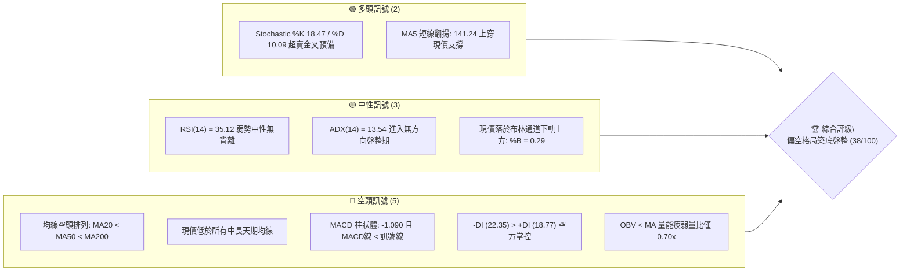
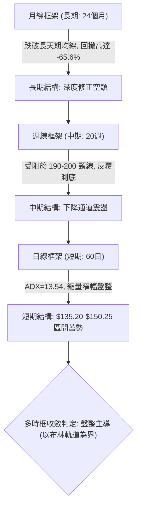
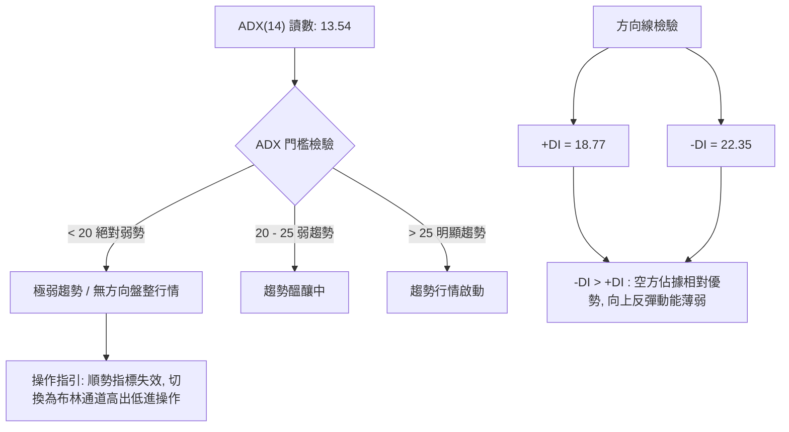
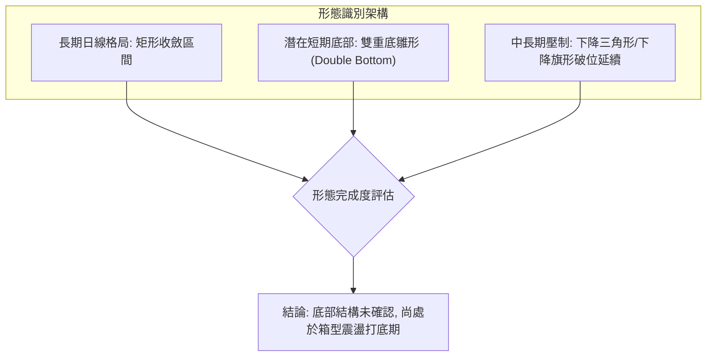
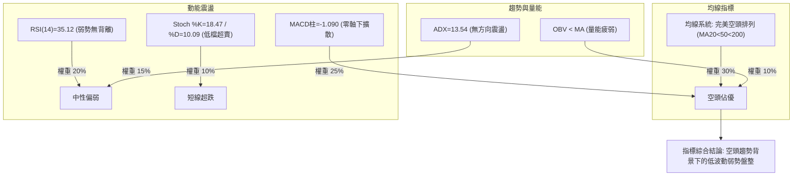
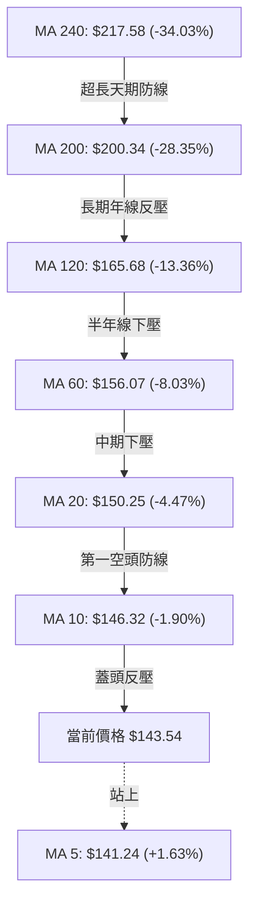
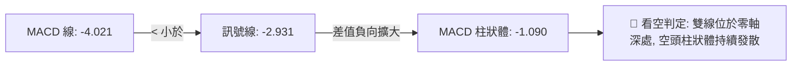
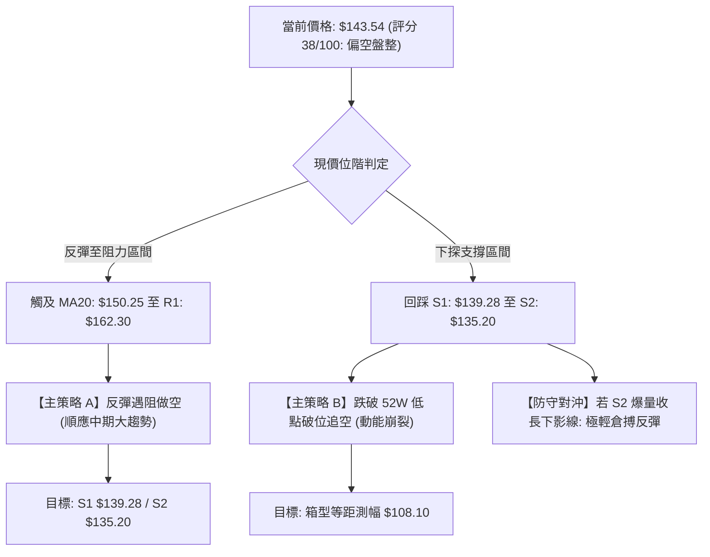
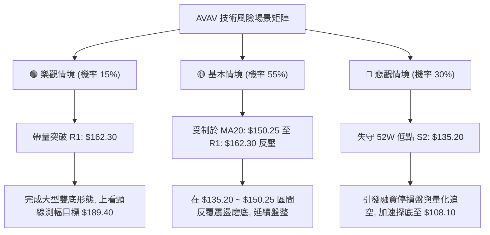

# AVAV 技術分析報告

> **報告日期**：2026-10-07 ｜ **語言**：繁體中文 ｜ **數據來源**：Yahoo Finance ｜ **當前價格**：$143.54

---

## 目錄

| 章節 | 內容 |
|------|------|
| [1. 技術面概覽](#1-技術面概覽) | 訊號儀表板、核心指標、評分卡 |
| [2. 趨勢分析](#2-趨勢分析) | 多時框趨勢、長中短期走勢 |
| [3. 圖表形態分析](#3-圖表形態分析) | 形態識別、K線組合、目標價 |
| [4. 支撐與阻力](#4-支撐與阻力) | 關鍵價位、斐波那契回調 |
| [5. 技術指標深度解讀](#5-技術指標深度解讀) | MA/RSI/MACD/布林/成交量 |
| [6. 動能與波動率](#6-動能與波動率) | 動能評估、ATR、Beta |
| [7. 多時框架總結](#7-多時框架總結) | 時框架評分矩陣 |
| [8. 交易策略建議](#8-交易策略建議) | 多空策略、風險報酬比 |
| [9. 風險提示與監控](#9-風險提示與監控) | 監控指標、風險場景 |
| [📋 報告總結](#-報告總結) | 總體評級與精華摘要 |

---

## 1. 技術面概覽

### 🎯 技術訊號儀表板



### 📊 核心指標速覽表

| 指標類別 | 指標名稱 | 當前數值 | 訊號 | 解讀 |
|----------|----------|----------|------|------|
| **價格** | 當前價格 | $143.54 | 🔴 | 位於 52 週高低區間底部 3.0%，受壓嚴重 |
| **均線** | MA20 | $150.25 | 🔴 | 價格低於 MA20 (-4.47%)，短中期下行阻力重重 |
| **均線** | MA50 | $157.68 | 🔴 | 價格低於 MA50，中期下降通道未打破 |
| **均線** | MA200 | $200.34 | 🔴 | 價格遠低於長期生命線 (-28.35%)，長空格局明確 |
| **動能** | RSI(14) | 35.12 | 🟡 | 位於弱勢中性偏冷區間，尚未進入極端超賣 (<30) |
| **動能** | MACD | -4.021 | 🔴 | 雙線位於零軸下方，柱狀體 -1.090 顯示空方延續 |
| **動能** | KD(14,3) | 18.47 / 10.09 | 🟢 | KD 指標進入超賣區，短線存在技術性反彈契機 |
| **趨勢** | ADX(14) | 13.54 | 🟡 | ADX < 25 處於無趨勢/弱趨勢盤整區間 |
| **通道** | 布林通道 | $134.35 ~ $166.15 | 🟡 | %B = 0.29，收斂於下軌與中軌間，波動壓縮 |
| **量能** | 20日成交量比 | 0.70x | 🔴 | 縮量陰跌，OBV < MA 顯示主力買盤退潮 |
| **波動** | ATR(14) | $7.10 | 🟡 | 佔股價 4.95%，單日震盪幅度中等偏高 |

### 🏆 技術評分卡

```
╔══════════════════════════════════════════════════════════════╗
║              技術評分卡 — AVAV (2026-10-07)                   ║
╠══════════════════════════════════════════════════════════════╣
║ 趨勢強度      ██████░░░░░░░░░░░░░░  30/100  🔴 空頭主導      ║
║ 動能指標      ████████░░░░░░░░░░░░  40/100  🟡 弱勢修正      ║
║ 支撐穩定度    ██████████░░░░░░░░░░  50/100  🟡 52W低點邊緣   ║
║ 成交量配合    ██████░░░░░░░░░░░░░░  30/100  🔴 量縮背馳      ║
║ 形態完整度    ████████░░░░░░░░░░░░  42/100  🟡 築底雛形中    ║
║ 均線排列      ████░░░░░░░░░░░░░░░░  20/100  🔴 完美空頭排列  ║
╠══════════════════════════════════════════════════════════════╣
║ 綜合評分      ███████░░░░░░░░░░░░░  38/100  🔴 偏空弱勢築底  ║
╚══════════════════════════════════════════════════════════════╝
```

---

## 2. 趨勢分析

### 🌐 多時框趨勢分析



### 📈 長期趨勢 — 12個月走勢圖（Unicode）

過去 12 個月（2025-11 至 2026-10），AVAV 經歷了一輪慘烈的派發與崩跌週期。股價自歷史次高點 $369.91 一路下挫至最低 $135.20，跌幅極深。

```
AVAV 月線走勢圖（過去12個月：2025-11 至 2026-10）
價格軸 ($)
$370 ┤  ● (2025-10 高點 $369.91)
$320 ┤   ╲
$280 ┤    ●─────● (2026-01: $278.39)
$240 ┤     ╲   ╱ ╲
$200 ┤      ●     ● (2026-05: $207.24)
$160 ┤             ╲  ●  ●
$140 ┤              ╲╱ ╲╱ ╲●──● ($143.54 ◄ 現在)
$135 ┤                     ● (52W 低點 $135.20)
     └─────────────────────────────────────────────
      11  12  01  02  03  04  05  06  07  08  09  10 (月份)
```

**走勢特徵分析表格**：

| 階段區間 | 起止價格 | 漲跌幅 | 成交量特徵 | 技術面實質含義 |
|----------|----------|--------|------------|----------------|
| **主跌第一浪 (2025-11 ~ 2025-12)** | $369.91 → $241.89 | -34.61% | 帶量長黑 | 頂部破位，機構集體獲利了結，多頭瓦解 |
| **跌深反彈浪 (2026-01 ~ 2026-02)** | $241.89 → $278.39 | +15.09% | 縮量反抽 | 次高點假突破，受制於長期籌碼套牢區 |
| **主跌第二浪 (2026-02 ~ 2026-03)** | $278.39 → $183.05 | -34.25% | 恐慌性拋售 | 跌破 $200.00 整數關卡與 MA200，空頭確立 |
| **中期拉鋸波 (2026-04 ~ 2026-05)** | $183.05 → $207.24 | +13.22% | 溫和回升 | 測驗 $200.00 轉化之反壓，構築雙重頂頸線反彈失敗 |
| **陰跌築底期 (2026-06 ~ 2026-10)** | $207.24 → $143.54 | -30.74% | 持續窒息量 | 探底至 52W 低點 $135.20 後進入橫向牛皮盤整 |

### 📊 中期趨勢（週線分析）

中期走勢圖展示了近 20 週股價反覆在 $135.20 與 $200.38 之間拉鋸，近期高點不斷降低（Lower Highs），呈現弱勢收斂：

```
AVAV 中期週線壓力與支撐示意圖
價格 ($)
210 ┼─ 週高點 $207.24 (2026-05)
200 ┼────────────────────────────── R3: $200.38 (MA200 / 強阻力)
190 ┼     ● 週高點 $192.81 (2026-08)
180 ┼    ╱ ╲
170 ┼   ╱   ╲                      R2: $168.00 (波段密集阻力)
160 ┼──╱─────╲─────────●───────── R1: $162.30 (反彈第一目標)
150 ┼─●       ╲       ╱ ╲   ●───── BB 中軌 $150.25
140 ┼──────────●─────●───╲─●────── 現價: $143.54 / S1: $139.28
135 ┼────────────●──────────────── S2: $135.20 (52W 低點強支撐)
    └─────────────────────────────────► 時間 (週線維度)
```

### ⚡ 趨勢強度評估（ADX 解讀）



**ADX 趨勢強度對照解讀**：
- **當前讀數**：13.54。這表明市場已完全脫離了 2026 年初的單邊暴跌趨勢，殺跌動能已大幅耗盡。
- **行情性質**：標準的**盤整震盪行情**（Consolidation Phase）。依多時框收斂原則（規則 14），此時所有順勢突破系統均容易出現假突破，交易必須以日線布林通道上下軌（$134.35 ~ $166.15）為核心邊界。

---

## 3. 圖表形態分析

### 🔍 形態識別系統



**形態信心度與目標價評估表**：

| 形態名稱 | 信心度 | 判斷依據（引用數據） | 完成度 | 目標價（附嚴格計算式） |
|----------|--------|----------------------|--------|------------------------|
| **矩形箱型震盪 (Rectangle)** | **75%** | 價格受制於下軌支撐 S2: $135.20 與阻力 R1: $162.30 之間長達數週 | 85% | 向上突破：頸線 $162.30 + 高度($162.30 - $135.20 = $27.10) = **$189.40**；向下破位：$135.20 - $27.10 = **$108.10** |
| **潛在雙重底 (Double Bottom)** | **45%** | 兩次低點分別為 2026-06 末的 $137.95 與 52W 低點 $135.20。但中間反彈頸線未能有效站穩，量能未爆發 | 40% | 依規則 15：**信心度 < 50%，訊號不足，僅做指標型解讀**，不予盲目預測等高翻轉目標 |
| **均線空頭發散形態** | **90%** | MA20($150.25) < MA50($157.68) < MA200($200.34)，標準空頭排列 | 100% | 均線蓋頭壓制，第一防守點為 MA20 即 **$150.25** |

### 🕯️ 重要K線形態分析

| 週期/日期 | 收盤價 | K線形態 | 解讀 | 訊號 |
|-----------|--------|---------|------|------|
| **2026-06-28 週** | $137.95 | 長黑重挫爆量陰線 | 爆出 1,188 萬股巨量長黑，恐慌盤湧出，探測波段低點 | 🔴 強烈空頭 |
| **2026-07-05 週** | $190.89 | 巨量吞噬長陽線 | 伴隨 1,831 萬股天量報復性反彈，形成中長線下影底標記 | 🟢 多頭抵抗 |
| **2026-09-13 週** | $146.71 | 低檔換手長十字星 | 成交量激增至 2,040 萬股，多空於 $140 附近激烈爭奪 | 🟡 底部換手 |
| **2026-10-04 週** | $140.82 | 縮量陰十字星 | 下探近 S1($139.28)，空方動能減弱，賣壓衰竭 | 🟡 止跌信號 |
| **2026-10-11 週** | $143.54 | 窄幅微幅紅K線 | 交易量極度萎縮至 288.9 萬股，典型的築底牛皮窒息量 | 🟢 變盤前兆 |

### 📉 ASCII 走勢形態示意圖

```
AVAV 潛在箱型打底形態結構示意圖
價格 ($)
168.00 ┼────────────────────────────── R2 波段阻力
       │         ▲ (2026-09 高點 $159.95)
162.30 ┼─────────┼──────────────────── R1 箱型頂部頸線 ($162.30)
       │        ╱ ╲
150.25 ┼───────╱───╲────────────────── MA20 / BB中軌 ($150.25)
       │      ╱     ╲       ▲
143.54 ┼─────╱───────╲─────┼────────── 現價 ($143.54)
139.28 ┼────╱─────────╲───╱────────── S1 波段支撐 ($139.28)
       │   ●           ● ╱ (低點拉高?)
135.20 ┼───┴───────────┴───────────── S2 箱型底部強支撐 ($135.20)
       └──────────────────────────────► 日線維度
           低點 1       低點 2
```

### 🎯 形態目標價計算

若以當前箱型整理形態（Rectangle Consolidation）推算：
1. **箱型頂部頸線**：採用波段阻力聚類 R1 = **$162.30**
2. **箱型底部支撐**：採用波段極限低點 S2 = **$135.20**
3. **形態垂直高度**：$162.30 - $135.20 = **$27.10**
4. **向上突破等距測幅目標**：頸線 $162.30 + 高度 $27.10 = **$189.40**（此點位高度貼近 2026-07 反彈高點 $190.89 與 Fib 78.6% 回調位 $195.69 區域）
5. **向下破位等距測幅目標**：支撐 $135.20 - 高度 $27.10 = **$108.10**

---

## 4. 支撐與阻力

### 🗺️ 關鍵價位分布圖（Unicode）

```
AVAV 價位結構分布圖（OHLCV 精確計算）
═════════════════════════════════════════════════════════════════
$200.38 ║████████████████████████████████║ 強阻力 R3 / MA200 反壓
$168.00 ║██████████████████████          ║ 密集套牢阻力 R2
$162.30 ║████████████████████████████    ║ 箱型頸線關鍵阻力 R1
$150.25 ║--------------------------------║ BB 中軌 / MA20 短期心理關卡
$143.54 ╠════════════════════════════════╣ ◄ 現價 ($143.54)
$139.28 ║▓▓▓▓▓▓▓▓▓▓▓▓▓▓▓▓▓▓▓▓            ║ 近期波段第一支撐 S1
$135.20 ║████████████████████████████████║ 52週歷史底部強支撐 S2
═════════════════════════════════════════════════════════════════
```

### 🚧 阻力位分析表

依據數據「關鍵價位」區塊聚類成果嚴格對照：

| 阻力級別 | 價位 | 形成原因 | 突破難度 | 重要性 |
|----------|------|----------|----------|--------|
| **R1** | **$162.30** | 近一年波段高點聚類；與 60日均線 ($156.07) 及 BB上軌 ($166.15) 形成重疊壓力帶 | 相當高 | ★★★★☆ |
| **R2** | **$168.00** | 近期多次週線反彈受阻高點，120日均線 ($165.68) 反壓區 | 極高 | ★★★☆☆ |
| **R3** | **$200.38** | MA200 均線位置 ($200.34) 與歷史長期整數關卡重合之大頂頸線 | 極端困難 | ★★★★★ |

### 🛡️ 支撐位分析表

依據數據「關鍵價位」區塊聚類成果嚴格對照：

| 支撐級別 | 價位 | 形成原因 | 守住機率 | 重要性 |
|----------|------|----------|----------|--------|
| **S1** | **$139.28** | 近一年波段低點聚類，近 20 週多個回踩低點集結處 | 65% | ★★★★☆ |
| **S2** | **$135.20** | 52 週最低價，布林通道下軌 ($134.35) 底部共振防線 | 80% | ★★★★★ |
| **S3** | 數據未偵測到 | *根據數據紀律，數據未列出 S3，不予編造精確數值* | — | — |

### 📐 斐波那契回調位分析

依據 52 週極端波段區間（低點 $135.20 至高點 $417.86，垂直落差達 $282.66）計算之黃金分割水準：

```
斐波那契回調位階梯圖
0.0%  (52W High) ─── $417.86  [歷史天頂]
23.6%            ─── $351.15
38.2%            ─── $309.88
50.0%            ─── $276.53  [牛熊分水嶺]
61.8%            ─── $243.18  [黃金分割轉折點]
78.6%            ─── $195.69  [最後多頭防線 / 接近 R3]
100.0% (52W Low) ─── $135.20  [52W 低點]
─────────────────────────────────────────────────────────────
► 當前股價 $143.54 處於 78.6% ($195.69) 與 100.0% ($135.20) 之間的極端超跌谷底區。
```

- **技術深度解讀**：股價目前自高點回撤已達 97.0% 的波段幅度，距離 100.0% 極限回調位 $135.20 僅差 5.81%。在斐波那契理論中，當資產跌破 78.6% 回調位後，通常意味著原有多頭趨勢遭到徹底毀滅。現價位於最下層的「超深回撤廢墟區」，意味著任何回升走勢在觸及 $195.69（78.6%）之前，在技術結構上都僅能被定義為「超跌弱勢反彈」，而非新一輪多頭浪潮的展開。

---

## 5. 技術指標深度解讀

### 🎛️ 指標訊號總覽



### 📈 移動平均線排列分析



均線系統呈現無可爭議的**標準空頭排列**（Bearish Alignment）：
- 現價唯一站上的僅有極短期的 MA5 ($141.24)，代表近 5 個交易日有微弱的抵抗動作。
- 上方 MA10 ($146.32)、MA20 ($150.25) 形成第一層近身阻力網。
- 中長天期均線 MA60 ($156.07)、MA120 ($165.68)、MA200 ($200.34) 呈階梯狀向下俯衝，表明中長線持有者全數處於嚴重套牢狀態，向上反彈將遭遇持續解套賣壓。

### 📉 RSI(14) 分析

```
RSI(14) 讀數儀表板:
0 ──────── 30 ─────── 50 ─────── 70 ─────── 100
[超賣區]      [弱勢區]    [強勢區]     [超買區]
░░░░░░░░░░░░█ 35.12 ░░░░░░░░░░░░░░░░░░░░░░░░
進度條: ███████░░░░░░░░░░░░░  35.12%
```

- **數值診斷**：RSI(14) 當前讀數為 **35.12**，處於 30 至 50 之間的弱勢空頭控制區，但並未跌破 30，尚未觸發「極端恐慌超賣」。
- **背離分析**：
  - 價格在 2026-09-06 錄得低點 $144.65（對應週 RSI 16.9），隨後在 2026-10-04 錄得低點 $140.82（對應週 RSI 34.9）。
  - **日線層級背離結論**：數據明確提示「**無明顯背離**」。雖然週線層級低點價格稍微走低而 RSI 數值偏高，但由於成交量極度萎縮且日線 RSI 缺乏標準底背離雙底拐點，**不能判定為有效底背離**。買方不可在此盲目依賴背離信號進行激進抄底。

### 📊 MACD(12/26/9) 訊號解讀



- **解讀**：MACD 線 (-4.021) 位於訊號線 (-2.931) 下方，Hist 柱狀體為 **-1.090**。雙線處於零軸下方深水區，代表整體大環境處於空頭週期。柱狀體尚未出現翻紅收斂的右側買入信號。

### 📦 布林通道分析

```
AVAV 日線布林通道 (Bollinger Bands, 20, 2) 結構示意圖
價格 ($)
166.15 ┼────────────────────────────── BB 上軌 ($166.15)
       │
150.25 ┼────────────────────────────── BB 中軌 (MA20: $150.25)
       │
143.54 ┼──────────●─────────────────── 現價 ($143.54, %B = 0.29)
       │
134.35 ┼────────────────────────────── BB 下軌 ($134.35)
════════════════════════════════════════════════════════════════
帶寬帶寬評估: (上軌 $166.15 - 下軌 $134.35) / 中軌 $150.25 = 21.16%
```

- **位置判定**：%B 指標值為 **0.29**（0 代表下軌，0.5 代表中軌，1 代表上軌），顯示價格運行於中軌與下軌之間的弱勢通道。
- **形態含義**：布林通道上下軌開口呈現收斂走勢，股價未破下軌 $134.35，且與 52W 低點 $135.20 形成技術共振。這表明股價在 $134.35 ~ $135.20 區間具有極強的通道物理支撐。

### 💹 成交量分析（量價配合度）

- **量比萎縮**：最新成交量為 1,574,900 股，相較於 20 日均量 2,255,370 股，**量比僅為 0.70x**；亦低於 50 日均量（1,660,458 股）。
- **OBV（能量潮）狀態**：**OBV < MA**，代表資金活躍度持續低迷，機構資金未見明顯建倉進場痕跡。
- **量價關係判定**：呈現「價跌量縮、反彈無量」的典型特徵。在空頭市場末端，成交量極度萎縮（窒息量）通常代表賣壓已大幅減輕，但若缺乏主動性攻擊量能（量比需大於 1.5x 以上），股價將難以發動突破 R1 的實質性行情。

---

## 6. 動能與波動率

### ⚡ 動能評估四象限

```
動能與波動率定位矩陣
                高動能 (High Momentum)
                        │
          Q3: 高風險高收益│  Q1: 強勢領先
                        │
── 低波動 ──────────────┼────────────── 高波動 ──
  (Low Volatility)      │  (High Volatility)
      ★ AVAV (當前位置) │
          Q2: 弱勢防守觀望│  Q4: 恐慌拋售
                        │
                低動能 (Low Momentum)
```

| 象限代號 | 動能狀態 | 波動狀態 | 當前符合度 | 操作策略指引 |
|----------|----------|----------|------------|--------------|
| **Q1 (最佳機會)** | 強 (RSI>60, ADX>25) | 低 (ATR低位收斂) | 否 | 順勢做多突破 |
| **Q2 (謹慎觀望)** | **弱 (RSI=35.12, ADX=13.54)** | **低 (波動收斂, 窄幅整理)** | **★ 是 (符合現狀)** | **嚴禁追高，僅限箱型下軌低吸或持幣觀望** |
| **Q3 (投機博弈)** | 強 (爆量單邊反彈) | 高 (ATR擴張) | 否 | 突破追隨 |
| **Q4 (避免進場)** | 弱 (恐慌性重挫) | 高 (暴跌行情) | 否 | 嚴格停損出場 |

### 📊 ATR 波動率分析

- **ATR(14) 絕對值**：**$7.10**
- **ATR 佔比比率**：$7.10 / $143.54 = **4.95%**
- **風控參數換算**：
  - **日內安全噪音區間**：約 ±$7.10，日內價格在 $136.44 至 $150.64 之間波動均屬正常市場隨機噪聲。
  - **合理止損距離設置**：技術交易止損距離應至少設置為 1.0 ~ 1.5 倍 ATR，即 **$7.10 ~ $10.65**，以避免在窄幅震盪中被隨機毛刺掃出場外。

### 📐 Beta 與市場相關性

- **Beta 係數**：**1.364**
- **波動特徵**：AVAV 屬於**高波動性成長型國防科技標的**。當標普 500 指數或大盤波動 1% 時，AVAV 平均波動約 1.364%。
- **空頭部位警示**：高 Beta 特性意味著一旦市場出現系統性修正或國防板塊情緒回落，AVAV 的下行放大效應將更為劇烈；反之，若大盤展開報復性反彈，其短線彈升速度亦將快於傳統防禦型工業股。

---

## 7. 多時框架總結

### 📋 時框架評分表

| 時框架 | 趨勢方向 | 動能狀態 | 均線排列 | 形態特徵 | 綜合評分 | 交易建議 |
|--------|----------|----------|----------|----------|----------|----------|
| **日線 (短期)** | 震盪偏弱 | KD 超賣 / RSI 35.12 | 偏空 (MA5翻揚但受制MA20) | 布林下軌支撐箱型 | 42/100 🟡 | 靠近 S1/S2 輕倉試多或觀望 |
| **週線 (中期)** | 下降通道 | MACD 柱綠 / -DI主導 | 空頭排列 (承壓MA50) | 密集下影線打底 | 35/100 🔴 | 反彈遇 R1/R2 分批減碼 |
| **月線 (長期)** | 深度回撤 | 零軸下深潛 | 跌破 240日線大空頭 | 歷史天頂派發崩跌後遺症 | 25/100 🔴 | 長線資金不可盲目進場 |

### 🔲 綜合訊號矩陣

```
時框架訊號交叉驗證矩陣:
┌─────────────────┬───────────┬───────────┬───────────┐
│     指標維度    │ 短期 (日) │ 中期 (週) │ 長期 (月) │
├─────────────────┼───────────┼───────────┼───────────┤
│ 均線系統 (MA)   │    🔴     │    🔴     │    🔴     │ 一致性極高 (全空頭)
│ 動能震盪 (Osc)  │    🟡     │    🔴     │    🔴     │ 短期存在超賣抵抗
│ 波動趨勢 (ADX)  │    🟡     │    🔴     │    🔴     │ 短期轉入無趨勢盤整
│ 量能結構 (OBV)  │    🔴     │    🔴     │    🔴     │ 主力資金持續退潮
└─────────────────┴───────────┴───────────┴───────────┘
```

### ⚖️ 多時框收斂結論

依據多時框收斂規則（規則 14）：
1. **行情性質判定**：當前 ADX(14) 為 **13.54 (< 25)**，明確定義為**盤整行情（Consolidation Market）**。
2. **主導時框與交易邊界**：在盤整行情下，單邊趨勢追單失效，交易應**以日線布林通道上下軌（$134.35 ~ $166.15）為主要交易區間**。
3. **優先級取捨**：雖然長期與中期均線呈現壓倒性空頭排列，但日線短週期已進入「縮量極致 + KD低檔超賣 (%K 18.47 / %D 10.09) + 緊鄰 52W 歷史底部 S2($135.20)」的三重收斂共振區。
4. **唯一方向性結論**：**【中性偏空，區間防守震盪】**。基於技術評分卡綜合評分為 **38/100 (≤ 40 偏空格局)**，系統戰略上**主推「反彈高空（逢壓力沽空）或嚴守 S2 破位追空」之空頭策略**，多頭僅限極輕倉之「下軌超跌反彈博弈」，絕不可視為反轉行情。

---

## 8. 交易策略建議

### 🗺️ 策略決策流程圖



### 🧭 策略路由

> **當前主策略方向 = 【空頭偏向策略：反彈逢高沽空為主、破位追空為輔】（依據評分 38/100）**

### 🎯 價格情境階梯（Price Scenarios）

以現價 $143.54 為基準，嚴格引用第 4 章計算之關鍵價位構建技術階梯：

| 觸發條件 | 下一目標 | 後續延伸 | 情境含義 |
|----------|----------|----------|----------|
| **強勢突破 R1 $162.30** | R2 $168.00 | R3 $200.38 | 短線技術結構徹底逆轉，空頭停損，觸發深度反彈 |
| **溫和反彈觸及 $150.25 (MA20)** | R1 $162.30 | 受阻回落 | 弱勢技術性抽腳，提供最佳反彈放空點位 |
| **維持在 $139.28 ~ $150.25** | — | — | 箱型下緣無方向牛皮盤整，ADX 鈍化，消耗市場耐心 |
| **跌破 S1 $139.28** | S2 $135.20 | 考驗歷史底 | 短線防守崩潰，空頭測試最後防線 |
| **有效跌破 S2 $135.20** | 箱型測幅 $108.10 | 估值下殺 | 52 週大底正式失守，引發新一輪單邊暴跌浪潮 |

### 📊 情境機率分佈

| 情境劇本 | 機率 | 主要技術依據 |
|----------|------|--------------|
| **弱勢反彈受阻回落** | **55%** | 均線系統呈壓倒性空頭排列，MACD 處於零軸下方擴散，反彈缺乏量能支持 (量比 0.70x) |
| **區間窄幅橫向震盪** | **30%** | ADX 降至 13.54 極低水準，KD 處於超賣區，空方短線亦缺乏直接砸穿 S2 的爆發力 |
| **強勢逆轉向上突破** | **15%** | 必須同時滿足站上 MA20($150.25) 並爆出大於 2 倍均量，目前機率極低 |

### 🟢 主策略詳情（偏空主導路由）

本報告根據評分卡 38/100 偏空判定，主推兩套嚴格順應中長期均線的空頭交易策略：

| 策略要素 | 策略 A：反彈受阻沽空 (Primary) | 策略 B：跌破 52W 底破位沽空 (Breakdown) |
|----------|--------------------------------|------------------------------------------|
| **策略類型** | 順勢反彈放空（高空） | 支撐破位順勢追空 |
| **進場條件** | 股價反彈至 MA20 或 R1 遇阻收上影陰線 | 日線收盤價實質跌破 52W 最低價 S2 |
| **進場價格** | **$150.25**（或反彈至 **$162.30** 分批空） | **$134.35**（跌破 S2 $135.20 兼破 BB下軌） |
| **目標價 T1** | **$139.28** (S1 支撐) | **$120.00** (心理關卡) |
| **目標價 T2** | **$135.20** (S2 52週低點) | **$108.10** (箱型垂直測幅目標價) |
| **止損價格** | **$157.68** (MA50 突破止損) | **$141.24** (MA5 重新站回止損) |
| **風險報酬比** | **1 : 2.02**（以 $150.25 入場計） | **1 : 3.81**（以目標 T2 計） |
| **成功機率** | **65%** | **55%** |
| **建議倉位** | **8% - 10%** 總資金 | **5%** 總資金（破位追空需防假跌破） |

*風險報酬比計算備註*：
- *策略 A*：風險 = $157.68 - $150.25 = $7.43；報酬 (至 T2) = $150.25 - $135.20 = $15.05。風報比 = 15.05 / 7.43 = **2.02**。符合專業交易 > 1.5 門檻。
- *策略 B*：風險 = $141.24 - $134.35 = $6.89；報酬 (至 T2) = $134.35 - $108.10 = $26.25。風報比 = 26.25 / 6.89 = **3.81**。

### 🔴 反向風險觸發點（對沖提示）

若發生以下技術事件，將**徹底推翻**上述偏空主策略，空頭部位必須立即停損離場，並啟動反手防禦機制：
1. **多頭反轉觸發價位**：日線收盤價強勢突破 **$162.30 (R1)** 且伴隨日成交量大於 3,500,000 股（量比 > 1.5x）。
2. **指標失效警訊**：日線 MACD 雙線在零軸下方完成「黃金交叉」，且柱狀體連續 3 日由負翻正並快速擴張。
3. **對沖操作**：若已持有空單，當價格觸及 **$157.68 (MA50)** 時必須無條件執行停損；保守型投資人可在價格突破 **$150.25 (MA20)** 時即減碼 50% 空單。

### ⭐ 整體訊號強度評星

```
╔══════════════════════════════════════════════════════════════╗
║ 做多訊號強度：★★☆☆☆  (2.0/5星) — 僅超賣技術指標弱反彈支撐   ║
║ 做空訊號強度：★★★★☆  (4.0/5星) — 均線與中長趨勢壓倒性看空   ║
║ 整體可信度：  ★★★☆☆  (3.5/5星) — 盤整期需提防低量隨機雜音   ║
╚══════════════════════════════════════════════════════════════╝
```

---

## 9. 風險提示與監控

### ✅ 關鍵監控指標 Checklist

```
╔══════════════════════════════════════════════════════════════════╗
║              AVAV 每日技術風控監控清單 (Checklist)               ║
╠══════════════════════════════════════════════════════════════════╣
║ [ ] 價位維度：是否跌破 52 週絕對低點 S2: $135.20？              ║
║ [ ] 均線維度：股價能否收復短期第一道生命線 MA20: $150.25？      ║
║ [ ] 動能維度：日線 MACD Hist 是否由 -1.090 出現連續收斂向上？    ║
║ [ ] 震盪維度：KD 指標自超賣區 (%K 18.47) 是否形成有效交叉金叉？ ║
║ [ ] 量能維度：日成交量是否回升突破 20日均量 2,255,370 股？      ║
║ [ ] 波動維度：ADX(14) 是否突破 20 開始展現新一輪方向性趨勢？    ║
╚══════════════════════════════════════════════════════════════════╝
```

### ⚠️ 風險場景分析



### 🛡️ 風險管理重要提醒

1. **破底無支撐風險**：當前股價距 52 週最低點 $135.20 僅有 5.81% 的緩衝空間。歷史數據顯示，$135.20 以下為近兩年從未交易過的真空區域（數據中未偵測到近一年更低支撐聚類）。一旦失守，下方將面臨流動性斷崖，極易出現跳空重挫。
2. **量能萎縮假突破風險**：量比僅 0.70x 表明流動性極度乾燥。在低成交量環境下，日內的急拉或急跌往往由少數撮合盤推動，極易形成影線陷阱（Whipsaw）。因此，任何突破信號**必須以日線收盤價為準**，盤中急漲切勿貿然追多。
3. **高 Beta 波動懲罰**：Beta 高達 1.364，單日 ATR 高達 $7.10。交易者嚴禁使用超過 10% 的倉位進行單邊下注，且每筆交易承擔之技術風險金額不得超過總帳戶淨值的 1.5%。

---

## 📋 報告總結

```
╔══════════════════════════════════════════════════════════════════╗
║                  AVAV 技術分析報告總結                          ║
╠══════════════════════════════════════════════════════════════════╣
║ 報告日期：2026-10-07                                             ║
║ 當前價格：$143.54                                                ║
║ 分析評級：🔴 偏空弱勢築底 (技術評分 38/100)                     ║
║                                                                  ║
║ 關鍵結論：                                                       ║
║ ├─ 長期趨勢：🔴 深度空頭 (MA200 $200.34 蓋頂, 自高點回撤 65.6%)  ║
║ ├─ 中期趨勢：🔴 下降通道震盪 (受阻於週線反壓, 底部逐步下移)     ║
║ ├─ 短期趨勢：🟡 區間縮量盤整 (ADX=13.54 無趨勢, %B=0.29 弱勢)    ║
║ ├─ 關鍵支撐：S1: $139.28  ｜  S2: $135.20 (52週極限大底)       ║
║ ├─ 關鍵阻力：R1: $162.30  ｜  R2: $168.00  ｜  R3: $200.38      ║
║ └─ 分析師目標：均價 $216.63 (低 $148.57 / 高 $315.00)            ║
║                                                                  ║
║ 最優策略組合：                                                   ║
║ 1. 🥇 最佳機會：反彈逢高沽空 (反彈至 MA20 $150.25 遇阻放空,      ║
║                  止損 $157.68, 目標 S2 $135.20, 風報比 1:2.02)   ║
║ 2. 🥈 次選機會：52W 低點破位追空 (收盤跌破 $135.20 放空,        ║
║                  目標測幅 $108.10, 嚴設止損 $141.24)             ║
║ 3. 🥉 保守選擇：空手觀望，靜待日線走出 $135.20 - $162.30 箱型    ║
║                  且 ADX 重新回升至 25 以上確認新趨勢再行介入     ║
╚══════════════════════════════════════════════════════════════════╝
```

---

> ⚠️ **免責聲明**：本報告為技術分析研究成果，所有價位、支撐阻力、均線及指標均基於歷史 OHLCV 數據計算推導。本報告**僅供研究與學術參考**，**不構成任何要約、招攬或投資買賣建議**。金融市場瞬息萬變，高 Beta 股票波動劇烈，投資人應獨立評估風險並自行承擔交易損益。

---

*報告生成時間：2026-10-07 ｜ 數據來源：Yahoo Finance ｜ 分析框架：多時框架技術分析*