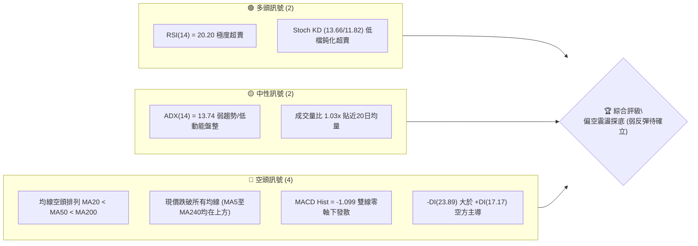
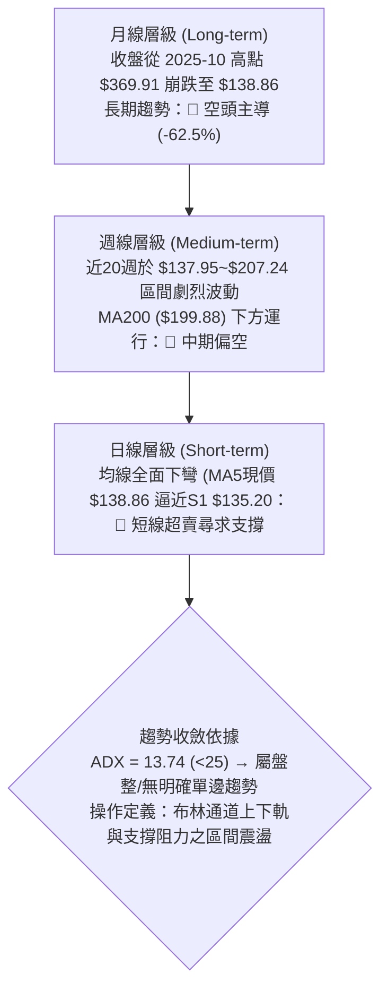
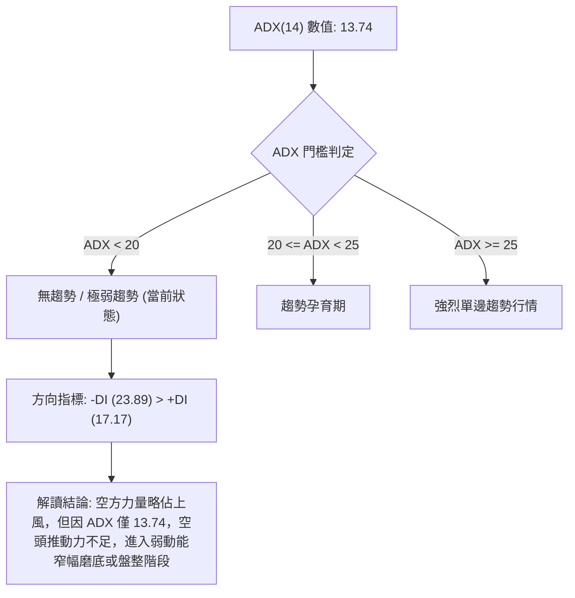
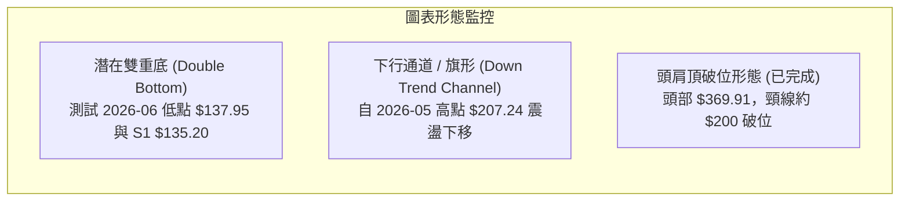
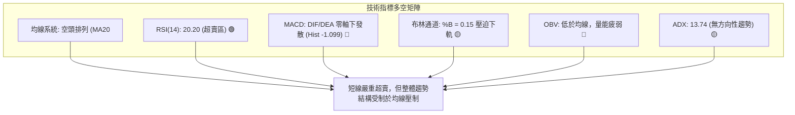
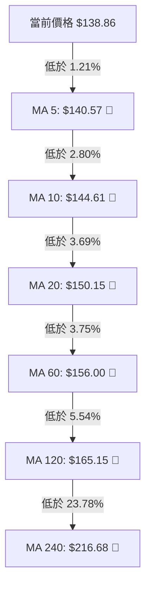
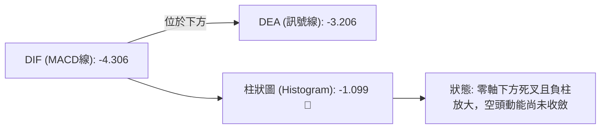
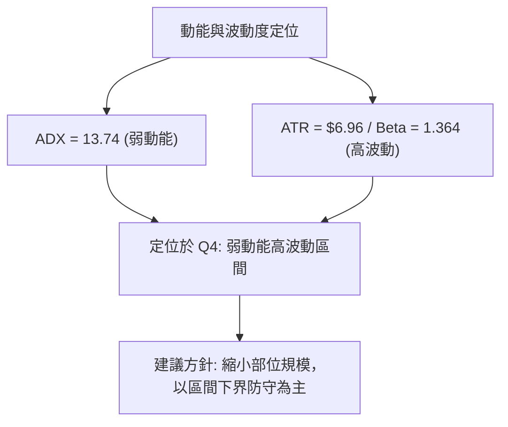
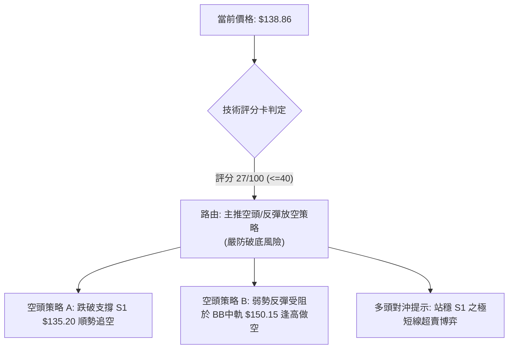
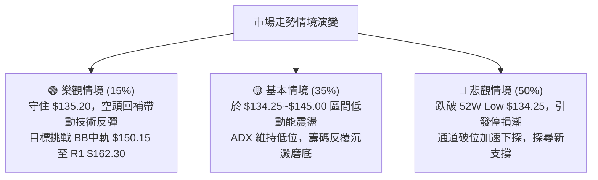

# AVAV 技術分析報告

> **報告日期**：2026-10-08 ｜ **語言**：繁體中文 ｜ **數據來源**：Yahoo Finance ｜ **當前價格**：$138.86

---

## 目錄

| 章節 | 內容 |
|------|------|
| [1. 技術面概覽](#1-技術面概覽) | 訊號儀表板、核心指標、評分卡 |
| [2. 趨勢分析](#2-趨勢分析) | 多時框趨勢、長中短期走勢 |
| [3. 圖表形態分析](#3-圖表形態分析) | 形態識別、K線組合、目標價 |
| [4. 支撐與阻力](#4-支撐與阻力) | 關鍵價位、斐波那契回調 |
| [5. 技術指標深度解讀](#5-技術指標深度解讀) | MA/RSI/MACD/布林/成交量 |
| [6. 動能與波動率](#6-動能與波動率) | 動能評估、ATR、Beta |
| [7. 多時框架總結](#7-多時框架總結) | 時框架評分矩陣 |
| [8. 交易策略建議](#8-交易策略建議) | 多空策略、風險報酬比 |
| [9. 風險提示與監控](#9-風險提示與監控) | 監控指標、風險場景 |

---

## 1. 技術面概覽

### 🎯 技術訊號儀表板



### 📊 核心指標速覽表

| 指標類別 | 指標名稱 | 當前數值 | 訊號 | 解讀 |
|----------|----------|----------|------|------|
| **價格** | 當前價格 | $138.86 | 🔴 | 位於52週區間 1.6%，極度貼近波段歷史低點 |
| **均線** | MA20 | $150.15 | 🔴 | 價格在MA20下方 -7.52%，短線承壓沉重 |
| **均線** | MA50 | $157.33 | 🔴 | 價格在MA50下方 -11.74%，中期均線呈下彎壓制 |
| **均線** | MA200 | $199.88 | 🔴 | 價格在MA200下方 -30.53%，長期走勢結構為空頭 |
| **動能** | RSI(14) | 20.20 | 🟢 | 極度超賣區間 (<30)，具技術性跌深反彈潛能 |
| **動能** | MACD | -4.306 / -3.206 | 🔴 | DIF在訊號線下方，柱狀圖 -1.099 持續發散看空 |
| **動能** | Stoch %K/%D | 13.66 / 11.82 | 🟢 | 進入雙重超賣區間，賣壓出現耗竭跡象 |
| **趨勢** | ADX(14) | 13.74 | 🟡 | 數值 <25，屬低動能震盪或趨勢末端盤整 |
| **通道** | BB %B | 0.15 | 🟡 | 緊貼布林下軌 $133.99，空頭壓迫通道邊界 |
| **量能** | OBV 趨勢 | OBV < MA | 🔴 | 資金持續呈現淨流出，量能尚未出現逆轉確認 |
| **波動** | ATR(14) | $6.96 | 🟡 | 每日平均波動率 5.01%，波動處中高水平 |

### 🏆 技術評分卡

```
╔══════════════════════════════════════════════════════════════════╗
║                 技術評分卡 — AVAV (2026-10-08)                  ║
╠══════════════════════════════════════════════════════════════════╣
║ 趨勢強度 (Trend)     ████░░░░░░░░░░░░░░░░  20/100 🔴 空頭主導/弱趨勢 ║
║ 動能指標 (Momentum)  ██████░░░░░░░░░░░░░░  30/100 🔴 零軸下方但超賣 ║
║ 支撐穩定度 (Support) ████████░░░░░░░░░░░░  40/100 🟡 逼近52W Low   ║
║ 成交量配合 (Volume)  ██████░░░░░░░░░░░░░░  30/100 🔴 OBV疲弱未增量 ║
║ 形態完整度 (Pattern) ██████░░░░░░░░░░░░░░  30/100 🔴 破位下行整理   ║
║ 均線排列 (MAs)       ██░░░░░░░░░░░░░░░░░░  10/100 🔴 完整空頭排列   ║
╠══════════════════════════════════════════════════════════════════╣
║ 綜合評分 (Overall)   █████░░░░░░░░░░░░░░░  27/100 🔴 強烈偏空/弱反彈 ║
╚══════════════════════════════════════════════════════════════════╝
```

---

## 2. 趨勢分析

### 🌐 多時框趨勢分析



### 📈 長期趨勢 — 12個月走勢圖（Unicode）

```
AVAV 月線走勢圖（過去12個月：2025-10 至 2026-10）
價格軸 ($)
$370 ┤● (2025-10 高點: $369.91)
$330 ┤ ╲
$290 ┤  ● (2025-11: $279.46)     ● (2026-01: $278.39)
$250 ┤   ╲       ● (2025-12)     ╱ ╲ (2026-02: $252.25)
$210 ┤    ╲                     ╱   ╲             ● (2026-05: $207.24)
$170 ┤     ╲                   ╱     ● (2026-03) ╱ ╲ (2026-06: $165.07)
$130 ┤      ━━━━━━━━━━━━━━━━━━━━━━━━━━━━━━━━━━━━━●━━●━━● (2026-10: $138.86)
     └─────────────────────────────────────────────────────────────
      10   11   12   01   02   03   04   05   06   07   08   09   10 (月份)
     2025 ───────────────────────── 2026 ──────────────────────────
```

#### 走勢特徵分析表格

| 階段區間 | 起始/結束價 | 漲跌幅 | 主要走勢特徵與結構 |
|----------|------------|--------|-------------------|
| **2025-10 ~ 2025-12** | $369.91 → $241.89 | -34.61% | 高點反轉暴跌，獲利了結賣壓湧現，長黑摜破短中期均線 |
| **2026-01 ~ 2026-02** | $278.39 → $252.25 | -9.39%  | 反彈乏力，形成次級高點後再度承壓回落 |
| **2026-03 ~ 2026-05** | $183.05 → $207.24 | +13.21% | 觸及波段低點後展開技術性反彈，受制於日線壓力帶 |
| **2026-06 ~ 2026-10** | $165.07 → $138.86 | -15.88% | 階梯式陰跌破底，目前正測試 52 週最低點 $134.25 |

### 📊 中期趨勢（週線分析）

```
近期週線支撐與壓力拓撲圖：
 [阻力位 R3] $200.38 ══════════════════════════════ (MA200 防線 / 2026-05 反彈頂部)
                      ▲
 [阻力位 R2] $168.00 ────────────────────────────── (2026-06 密集震盪頭部)
                      ▲
 [阻力位 R1] $162.30 ────────────────────────────── (日線 MA60 與週線反彈頸線)
                      ▲
 [現  價]    $138.86 ───► 當前運行位置 (BB %B = 0.15，逼近超賣底線)
                      ▼
 [支撐位 S1] $135.20 ────────────────────────────── (近一年波段低點聚類)
                      ▼
 [52W 低點]  $134.25 ══════════════════════════════ (極限關鍵防線 / 斐波那契 100%)
```

### ⚡ 趨勢強度評估（ADX 解讀）



| 指標項 | 數值 | 狀態區間 | 技術意義解讀 |
|--------|------|----------|--------------|
| **ADX(14)** | 13.74 | 0 ~ 20 (極弱) | 單邊動能匱乏，市場參與者觀望，容易出現假突破或超賣反抽 |
| **+DI (14)** | 17.17 | 低檔壓制 | 多頭動能微弱，缺乏推動波段上攻的主動買盤 |
| **-DI (14)** | 23.89 | 空方優勢 | 賣壓雖主導短期走勢，但未形成暴跌型強動能（未突破 30） |

---

## 3. 圖表形態分析

### 🔍 形態識別系統



#### 形態信心度與目標價評估表

| 形態名稱 | 信心度 | 判斷依據（引用數據） | 完成度 | 目標價（附計算式） |
|----------|--------|----------------------|--------|--------------------|
| **潛在雙重底 (Double Bottom)** | 45% (訊號不足，僅作指標型解讀) | 2026-06-28 探底 $137.95，當前現價 $138.86 逼近 S1 $135.20 與 52W Low $134.25。尚未突破頸線。 | 50% (右底測試中) | 若以頸線 R1 $162.30 與低點 $134.25 計算：<br/>$162.30 + ($162.30 - $134.25) = **$190.35** (形態未確立，純推算) |
| **下行通道壓制** | 75% | 自 2026-05-31 收盤 $207.24、08-16 收盤 $192.81、09-20 收盤 $159.95，高點持續下移；各期均線呈標準空頭排列。 | 85% (運行於軌道下緣) | 依通道下軌延伸測算，支撐指向 S1 **$135.20** 至 52W Low **$134.25** |
| **頭肩頂形態** | 80% (已完成釋放) | 左肩 2025-06 $284.95，頭部 2025-10 $369.91，右肩 2026-01 $278.39，頸線支撐落在 R3 $200.38。 | 100% | 跌破頸線 $200.38 後已滿足目標位，當前處於超跌延伸期 |

*註：由於潛在雙重底信心度低於 50%，本報告依據規則 15，不強行視為反轉幾何形態，而定義為「超賣區間的技術性邊界測試」。*

### 🕯️ 重要K線形態分析

| 週/月份 | 收盤價 | K線形態 | 解讀 | 訊號 |
|---------|--------|---------|------|------|
| **2026-06-28** | $137.95 | 長黑破底帶長下影 | 放量至 11.88M 股摜壓，隨後帶動強勁技術性反彈至 $190.89 | 🟢 跌深買盤介入 |
| **2026-08-16** | $192.81 | 週線倒錘/衝高受阻 | 觸及 MA120/MA200 壓力區，多頭動能耗盡，RSI 達 73.5 超買 | 🔴 波段高點見頂 |
| **2026-09-13** | $146.71 | 爆量長下影十字星 | 單週成交量達 20.40M 股歷史級天量，顯示 $140 附近有主力護盤接刀 | 🟡 多空激烈換手 |
| **2026-10-11** | $138.86 | 縮量連續小陰線 | 週量萎縮至 5.05M 股，陰跌探底，逼近前低，多方轉入觀望防守 | 🔴 賣壓沉重但量能縮小 |

### 📉 ASCII 走勢形態示意圖

```
        $207.24 (2026-05 高點)
          ▲
         ╱ ╲        $192.81 (2026-08 次高)
        ╱   ╲        ▲
       ╱     ╲      ╱ ╲               $159.95 (2026-09 反彈頂)
      ╱       ╲    ╱   ╲               ▲
     ╱         ╲  ╱     ╲             ╱ ╲
    ╱           ▼        ╲           ╱   ▼
───╱─────── $137.95 ──────╲─────────╱─── $138.86 (現價) ───
  低點 1 (2026-06)         ╲       ╱     低點 2 (潛在雙底測試中)
                            ▼     ╱
                       S1 $135.20 / 52W Low $134.25 (關鍵底線)
```

---

## 4. 支撐與阻力

### 🗺️ 關鍵價位分布圖（Unicode）

```
╔══════════════════════════════════════════════════════════════════╗
║                    AVAV 價位結構分布圖                           ║
╠══════════════════════════════════════════════════════════════════╣
║ $200.38 ║██████████████████████████████║ 強阻力 R3 (MA200 關卡)  ║
║ $168.00 ║████████████████████░░░░░░░░░░║ 阻力 R2 (密集成交區頂)  ║
║ $162.30 ║███████████████░░░░░░░░░░░░░░░║ 關鍵阻力 R1 (反彈頸線)  ║
║ $150.15 ║▒▒▒▒▒▒▒▒▒▒▒▒▒▒▒░░░░░░░░░░░░░░░║ BB 中軌 / MA20 短壓    ║
║ $138.86 ╠══════════════════════════════╣ ◄ 當前市價 ($138.86)   ║
║ $135.20 ║▓▓▓▓▓▓▓▓▓▓▓▓▓▓▓▓▓▓▓▓░░░░░░░░░░║ 波段支撐 S1 (-2.64%)   ║
║ $134.25 ║██████████████████████████████║ 52週最低點 (極限防線)   ║
╚══════════════════════════════════════════════════════════════════╝
```

### 🚧 阻力位分析表

| 阻力級別 | 價位 | 形成原因 | 突破難度 | 重要性 |
|----------|------|----------|----------|--------|
| **R1** | $162.30 | 近一年波段高點聚類；與 MA60 ($156.00) 及布林上軌 ($166.31) 形成共振壓力區 | 中等偏高 | ★★★★☆ 短線多空強弱分水嶺 |
| **R2** | $168.00 | 2026 年 6 月跌破後的反彈高點平台聚類，該處累積大量套牢籌碼 | 高 | ★★★★☆ 中期反彈主要阻力位 |
| **R3** | $200.38 | 年線 MA200 ($199.88) 心理防線；2026-05 反彈波段頂部聚類 | 極高 | ★★★★★ 牛熊長期趨勢轉換界限 |

### 🛡️ 支撐位分析表

| 支撐級別 | 價位 | 形成原因 | 守住機率 | 重要性 |
|----------|------|----------|----------|--------|
| **S1** | $135.20 | 近一年波段低點聚類；距現價僅 -2.64%，為短期多頭最後防線 | 55% | ★★★★★ 當前防守核心基石 |
| **52W Low** | $134.25 | 過去 52 週最低點，斐波那契回調 100.0% 水準 | 50% | ★★★★★ 跌破將觸發停損賣壓 |
| *S2 / S3* | 數據未偵測 | *歷史 OHLCV 聚類數據中無更低級別聚類數值* | — | 跌破 $134.25 將進入無支撐真空區 |

### 📐 斐波那契回調位分析

依據 52 週區間波段（高點 $417.86 → 低點 $134.25），回調位分佈如下：

```
0.0%  (52W High) ────────────────────────────── $417.86
23.6%            ────────────────────────────── $350.93
38.2%            ────────────────────────────── $309.52
50.0%            ────────────────────────────── $276.05
61.8%            ────────────────────────────── $242.59
78.6%            ────────────────────────────── $194.94 (貼近 R3 $200.38)
───────────────────────────────────────────────────────
當前現價區間      ►►► $138.86 (落於 78.6% 至 100.0% 之間)
───────────────────────────────────────────────────────
100.0% (52W Low) ────────────────────────────── $134.25
```

**解讀**：現價 $138.86 已經完全回吐了自低點 $134.25 以來的所有漲幅，處於斐波那契回調的 100% 邊緣（當前位於整個 52 週振幅的 1.6% 位置）。這意味著若多方無法在此處組織有效抵抗，自 2025 年以來的多頭結構將被徹底瓦解。

---

## 5. 技術指標深度解讀

### 🎛️ 指標訊號總覽



### 📈 移動平均線排列分析



- **均線排列狀態**：當前所有長短天期均線呈現教科書級別的「完美空頭排列」（MA5 < MA10 < MA20 < MA60 < MA120 < MA240）。
- **乖離率分析**：現價與 MA20 乖離率為 -7.52%，與 MA200 乖離率達 -30.53%。負乖離已擴大至極值水平，預示下跌空間受限，但上方層層均線下壓將壓抑反彈幅度。

### 📉 RSI(14) 分析

```
RSI(14) 水平：20.20
0 ──────── 20.20 ── 30 ────────────────────── 50 ────────────────────── 70 ────── 100
[ 極度超賣區間 ]  [ 超賣臨界 ]               [ 中性 ]               [ 超買區間 ]
████████░░░░░░░░░░░░░░░░░░░░░░░░░░░░░░░░ 20.20%
```

- **超買超賣判定**：數值 20.20 處於嚴重超賣（<30），為 2026 年以來的波段相對低點。
- **背離分析**：
  - 2026-06-28 股價低點 $137.95，當時週線 RSI 為 20.2；
  - 2026-10-11 當前股價 $138.86，日/週 RSI 亦為 20.20；
  - **結論**：指標在低檔呈現水平打底，**無明顯底背離**現象，亦無頂背離。表明當前為單純的賣壓超跌，尚未出現買盤主動推升形成的結構性背離。

### 📊 MACD(12/26/9) 訊號解讀



- DIF 與 DEA 雙雙深陷零軸之下，MACD Histogram 報 -1.099，顯示短期下行動能雖有趨緩跡象但空頭仍具掌控力，尚未形成向上金叉的買進訊號。

### 📦 布林通道分析

```
布林通道 (20, 2) 結構示意圖：
$166.31 ─────────────────────────────── BB 上軌 (+2σ)
                │
$150.15 ─────────────────────────────── BB 中軌 (MA20)
                │
$138.86 ───► 當前市價 (BB %B = 0.15)
$133.99 ─────────────────────────────── BB 下軌 (-2σ)
```

- **帶寬與位置**：通道寬度為 $32.32 ($166.31 - $133.99)。
- **%B 指標**：當前 %B 僅為 0.15，表示價格已高度貼近下軌（0 代表下軌，0.5 為中軌）。當價格緊貼下軌運行且帶寬未急遽擴散時，常伴隨通道邊界的回抽測試。

### 💹 成交量分析（量價配合度）

- **量比與均量**：最新日成交量為 2,168,900 股，相較於 20 日均量 2,113,125 股，量比為 **1.03x**，基本持平；相較於 50 日均量 1,682,996 股則略有放大。
- **量價關係**：2026-09-13 當週曾爆出 20,402,600 股的非典型天量，隨後幾週量能急遽縮減至 505 萬股左右。當前價格在低檔縮量陰跌，顯示市場殺跌意願減弱，但買盤承接極為謹慎。
- **OBV 趨勢**：OBV 指標持續位於其均線下方，量能結構呈現淨流出疲弱狀態，尚未出現資金回流確認訊號。

---

## 6. 動能與波動率

### ⚡ 動能評估

| 象限分類 | 動能強度 | 波動率水準 | AVAV 當前狀態判定 | 交易意涵與應對策略 |
|----------|----------|------------|-------------------|--------------------|
| **Q1 (高動能/低波動)** | 強 | 低 | ❌ 非此狀態 | 穩定單邊趨勢，持股續抱 |
| **Q2 (低動能/低波動)** | 弱 | 低 | ❌ 非此狀態 | 沉悶牛皮整理，觀望為主 |
| **Q3 (高動能/高波動)** | 強 | 高 | ❌ 非此狀態 | 單邊突破追價，波動激烈 |
| **Q4 (低動能/高波動)** | 弱 | 高 | **✓ 吻合 (當前位置)** | **跌深震盪期，盲目殺跌易砍在低點，追多易受阻** |



### 📊 ATR 波動率分析

- **ATR(14) 數值**：**$6.96**，佔現價之 **5.01%**。
- **單日波動意涵**：個股單日正常價格擺動幅度接近 7 美元，屬於典型的高波動性中小型國防科技標的。
- **風控止損距離建議**：
  - *短期保守交易*：1.0 × ATR = **$6.96**
  - *中波段交易止損寬容度*：1.5 × ATR = **$10.44**
  - *考量當前現價 ($138.86)*：若進場博取反彈，止損設置不可過於狹窄，必須預留至少 1 個 ATR 的價格噪音空間。

### 📐 Beta 與市場相關性

- **Beta 係數**：**1.364**。
- **市場敏感度分析**：AVAV 對大盤（S&P 500）具備高敏感度，理論上大盤波動 1%，該股將放大波動 1.36 倍。在當前弱勢走勢下，若大盤出現系統性回調，AVAV 測試並跌破支撐 S1 的風險將顯著提升。

---

## 7. 多時框架總結

### 📋 時框架評分表

| 時框架 | 趨勢方向 | 動能指標 | 均線排列 | 圖表形態 | 綜合評分 | 建議 |
|--------|----------|----------|----------|----------|----------|------|
| **月線** (長期) | 🔴 空頭 | 🔴 疲弱 | 🔴 空頭 (跌破 MA240) | 🔴 跌破頭肩頸線 | 20/100 | 長期資金保守觀望 |
| **週線** (中期) | 🔴 空頭 | 🟡 超賣中性 | 🔴 空頭排列 | 🟡 下行通道下軌 | 30/100 | 嚴控部位，防範破底 |
| **日線** (短期) | 🟡 震盪探底 | 🟢 極度超賣 | 🔴 空頭排列 | 🟡 測試前低支撐 | 35/100 | 僅適合極短線逆勢搶彈 |

### 🔲 綜合訊號矩陣

```
╔══════════════════════════════════════════════════════════════════╗
║                    多時框架訊號矩陣對照表                        ║
╠══════════════╦══════════════╦══════════════╦═════════════════════╣
║ 分析維度     ║ 長期 (月線)  ║ 中期 (週線)  ║ 短期 (日線)         ║
╠══════════════╬══════════════╬══════════════╬═════════════════════╣
║ 趨勢方向     ║ 🔴 強烈空頭  ║ 🔴 空頭壓制  ║ 🟡 弱動能磨底       ║
║ 動能狀態     ║ 🔴 負向發散  ║ 🔴 動能不足  ║ 🟢 RSI 20.20 超賣   ║
║ 均線位置     ║ 🔴 均線下方  ║ 🔴 MA200下方 ║ 🔴 MA20/50 下方     ║
║ 量價配合     ║ 🔴 持續失血  ║ 🟡 縮量陰跌  ║ 🟡 量比 1.03x 平衡  ║
╚══════════════╩══════════════╩══════════════╩═════════════════════╣
║ 矩陣收斂一致性：中長期趨勢完全看空，短期僅受「嚴重超賣」支撐   ║
╚══════════════════════════════════════════════════════════════════╝
```

### ⚖️ 多時框收斂結論

> **依據規則 14 嚴格收斂**：
> 1. **趨勢/盤整判定**：當前日線 ADX(14) 為 **13.74 (< 25)**，明確定義當前市場為「**弱動能盤整 / 尋底行情**」，而非強烈單邊趨勢行情。
> 2. **交易區間定義**：以日線布林通道下軌（$133.99）至中軌（$150.15）為主要運行區間。
> 3. **主導時框與方向收斂**：雖然中長期（週線/月線）為明確空頭，但短線價格逼近波段歷史低點 S1 $135.20 且 RSI 深跌至 20.20，跌勢動能暫時鈍化。
> 4. **唯一結論**：**中性偏空，嚴防破底；交易上僅能採取極嚴格風控之「區間下軌防守型操作」，策略路由以防範下行風險為核心。**

---

## 8. 交易策略建議

### 🗺️ 策略決策流程圖



### 🧭 策略路由

- **當前主策略方向 = 主推空頭與反彈放空策略（依評分 27/100，綜合評級偏空）**
- **策略指引**：在均線完全空頭排列且 OBV 量能疲弱的格局下，絕不可逆勢盲目做多。主策略鎖定「破位順勢做空」或「反彈受阻加空」；多頭僅列為短線反轉對沖提示。

### 🎯 價格情境階梯（Price Scenarios）

| 觸發條件 | 下一目標 | 後續延伸 | 情境含義 |
|----------|----------|----------|----------|
| **跌破 S1 $135.20** | **52W Low $134.25** | 支撐真空區 | 空頭破位加速，觸發大規模停損賣壓 |
| **守住 S1，反彈突破 MA20 $150.15** | **R1 $162.30** | **R2 $168.00** | 短線技術性超跌反彈展開 |
| **強勢突破 R2 $168.00** | **R3 $200.38** | — | 中期趨勢出現逆轉曙光 |

### 📊 情境機率分佈

| 情境劇本 | 機率 | 主要技術依據 |
|----------|------|--------------|
| **跌破 S1 續探新低** | **50%** | 均線完美空頭排列，OBV 呈現淨流出，-DI(23.89) 主導市場，缺乏買盤支撐 |
| **區間磨底震盪** | **35%** | ADX 僅 13.74 動能疲弱，RSI 20.20 超賣嚴重，空方殺跌意願暫時降低 |
| **強勁反彈走高** | **15%** | 短線負乖離率過大，但上方 MA20、MA50 下壓沉重，反彈空間受限 |

### 🔴 主策略詳情（空頭主導策略）

依據嚴格數據紀律，價位引用第 4 章關鍵價位區塊已存在數值：

| 策略要素 | 策略 A：跌破 S1 順勢追空 | 策略 B：反彈遇阻做空 (反彈空) |
|----------|--------------------------|-------------------------------|
| **進場條件** | 日線收盤實體跌破支撐 S1 | 股價弱勢反彈至布林中軌/MA20 受阻回落 |
| **進場價格** | **$134.00** (確認跌破 S1 $135.20 及 52W Low $134.25) | **$150.15** (MA20 / 布林中軌壓力位) |
| **目標價 T1** | **$120.00** (整數關卡 / 跌破真空推算) | **$138.86** (當前現價水平) |
| **目標價 T2** | **$110.00** (極限下行目標) | **$135.20** (關鍵支撐位 S1) |
| **止損價格** | **$138.86** (回抽現價即止損) | **$157.33** (MA50 壓力位突破止損) |
| **風險報酬比** | **2.88 : 1** [風險 $4.86, T1 利潤 $14.00] | **1.57 : 1** [風險 $7.18, T1 利潤 $11.29] |
| **成功機率** | 60% | 55% |
| **建議倉位** | 10% (控制單一標的曝險) | 15% |

### 🟢 反向風險觸發點（多頭對沖提示）

若欲利用 RSI(14)=20.20 進行極短線「左側博弈反彈」，必須嚴守以下風控條件：
- **觸發買點**：現價 **$138.86** 或回踩 **$135.20** 不破出現長下影。
- **嚴格止損點**：**$134.25** (52週最低點跌破即無條件停損出場，潛在虧損 -3.3%)。
- **第一反彈目標**：**$150.15** (MA20 / 布林中軌，潛在利潤 +8.1%)。
- **第二反彈目標**：**$162.30** (阻力 R1)。

### ⭐ 整體訊號強度評星

```
做多訊號強度：★☆☆☆☆  (1/5星 - 僅存超賣指標，趨勢極度不利)
做空訊號強度：★★★★☆  (4/5星 - 均線空頭排列，量能疲弱)
整體可信度：  ★★★☆☆  (3/5星 - ADX偏低，防範低檔震盪洗盤)
```

---

## 9. 風險提示與監控

### ✅ 關鍵監控指標 Checklist

```
╔══════════════════════════════════════════════════════════════════╗
║                    每日盤後關鍵技術監控清單                      ║
╠══════════════════════════════════════════════════════════════════╣
║ [ ] 價格防線：日線收盤價是否跌破支撐 S1 $135.20？              ║
║ [ ] 極限底線：盤中是否刺穿 52 週最低點 $134.25？               ║
║ [ ] 超賣修復：RSI(14) 是否脫離 30 以下並向上金叉？              ║
║ [ ] 動能轉向：MACD Histogram 是否出現縮腳收斂 (大於 -1.099)？  ║
║ [ ] 均線動態：價格是否能收復 MA5 ($140.57) 與 MA10 ($144.61)？ ║
║ [ ] 量能異動：單日成交量是否異常放大至 300 萬股以上？          ║
╚══════════════════════════════════════════════════════════════════╝
```

### ⚠️ 風險場景分析



### 🛡️ 風險管理重要提醒

1. **破底骨牌效應風險**：AVAV 目前距離 52 週最低點 $134.25 僅有些微距離（約 3.4%）。此類位置一旦失守，常伴隨程式化停損單出籠與融資追繳，可能出現跳空重挫，多頭切忌在跌破 $134.25 時「越跌越買」。
2. **波動率放大的部位調控**：ATR 為 $6.96（單日波動率高達 5.01%），且 Beta 為 1.364。操作本標的時，單筆交易虧損額度應嚴格限制於總資金的 1.0% 以內，整體持股倉位不宜超過總資金之 15%。
3. **空頭排列的做多陷阱**：在 MA20、MA50、MA200 呈顯著負斜率壓制下，任何未伴隨爆量突破 R1 ($162.30) 的上漲，均應優先視為「死貓跳（Dead Cat Bounce）」或空頭回補，逢高反彈反而提供空方更佳的風險報酬進場點。

---

## 📋 報告總結

```
╔══════════════════════════════════════════════════════════════════╗
║                    AVAV 技術分析報告總結                         ║
╠══════════════════════════════════════════════════════════════════╣
║ 報告日期：2026-10-08                                             ║
║ 當前價格：$138.86                                                ║
║ 分析評級：🔴 強烈偏空 / 弱動能尋底 (評分: 27/100)               ║
║                                                                  ║
║ 關鍵結論：                                                       ║
║ ├─ 長期趨勢：🔴 跌破年線 MA200，大型頭肩頂滿足後維持弱勢         ║
║ ├─ 中期趨勢：🔴 均線呈現空頭排列，下行通道持續壓制              ║
║ ├─ 短期趨勢：🟡 RSI(14)=20.20 極度超賣，但 ADX=13.74 屬弱勢盤整 ║
║ ├─ 關鍵支撐：S1: $135.20 / 52W Low: $134.25                      ║
║ ├─ 關鍵阻力：R1: $162.30 / R2: $168.00 / R3: $200.38             ║
║ └─ 分析師目標均價：$216.63 (低檔預期 $148.57)                    ║
║                                                                  ║
║ 最優策略組合：                                                   ║
║ 1. 🥇 最佳機會：破位做空 — 跌破 $134.25 順勢做空，目標下看真空區 ║
║ 2. 🥈 次選機會：反彈放空 — 反彈至 MA20 $150.15 受阻逢高做空     ║
║ 3. 🥉 保守選擇：空手觀望 — 靜待放量突破 R1 $162.30 底部確認     ║
╚══════════════════════════════════════════════════════════════════╝
```

---

> ⚠️ **免責聲明**：本報告為 AI 自動生成之技術分析，所有數據及估算均基於提供的歷史價格資訊。本報告**僅供研究與學術參考**，**不構成任何投資建議**。投資有風險，入市需謹慎。

---

*報告生成時間：2026-10-08 ｜ 數據來源：Yahoo Finance ｜ 分析框架：多時框技術分析*