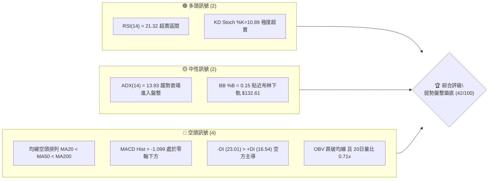
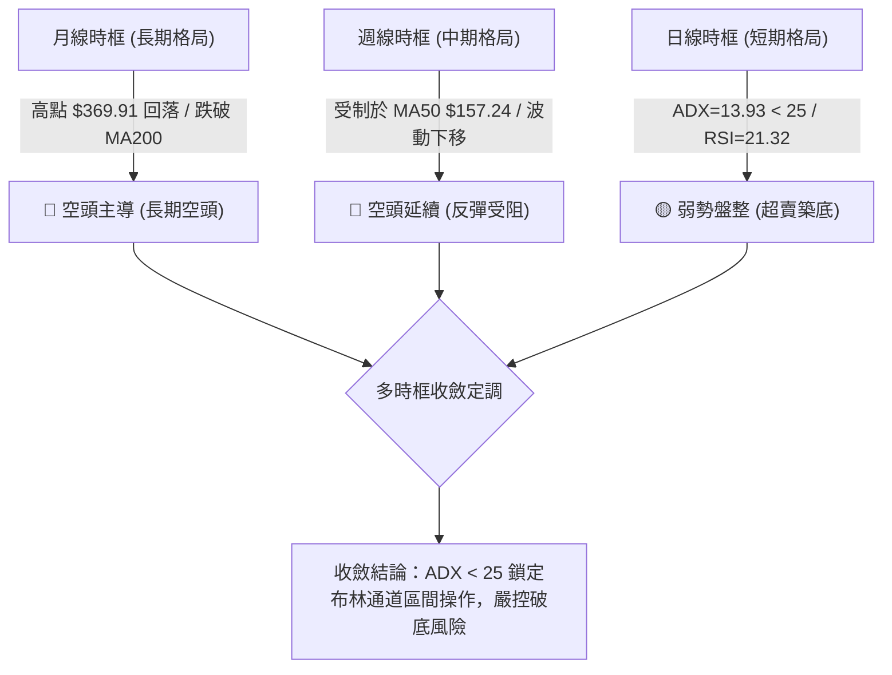
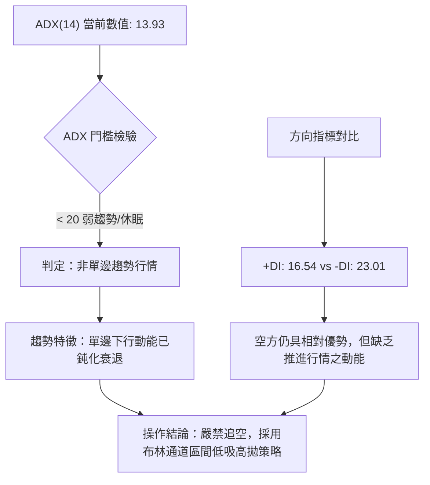
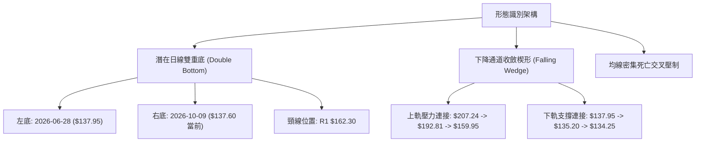
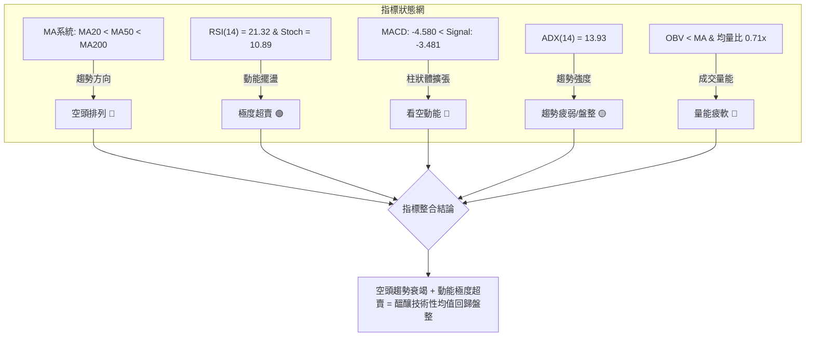
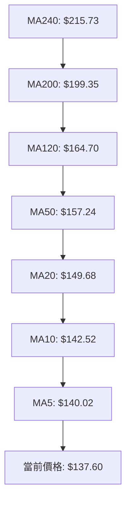
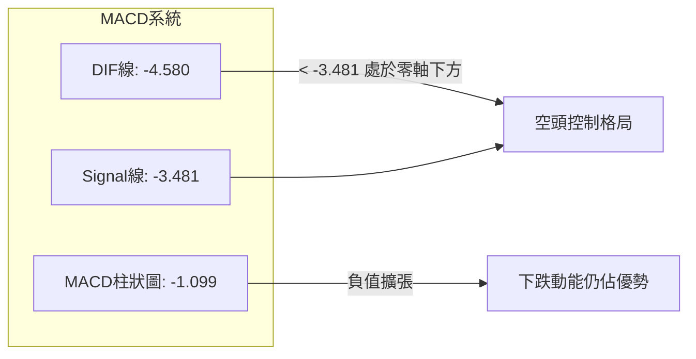
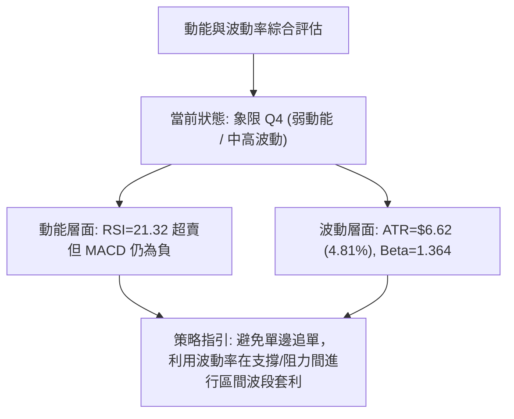
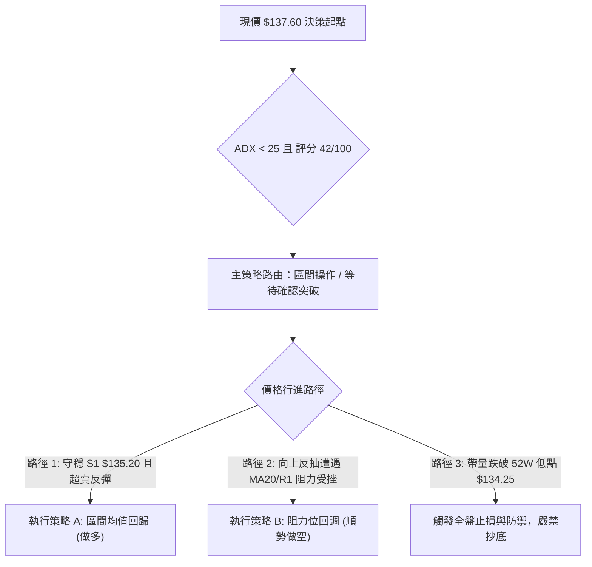
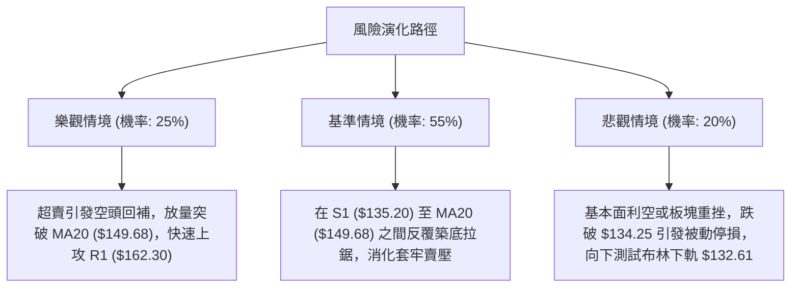

# AVAV 技術分析報告

> **報告日期**：2026-10-09 ｜ **語言**：繁體中文 ｜ **數據來源**：Yahoo Finance ｜ **當前價格**：$137.60

---

## 目錄

| 章節 | 內容 |
|------|------|
| [1. 技術面概覽](#1-技術面概覽) | 訊號儀表板、核心指標、評分卡 |
| [2. 趨勢分析](#2-趨勢分析) | 多時框趨勢、長中短期走勢、ADX 解讀 |
| [3. 圖表形態分析](#3-圖表形態分析) | 形態識別、K線組合、目標價推算 |
| [4. 支撐與阻力](#4-支撐與阻力) | 關鍵價位、斐波那契回調結構 |
| [5. 技術指標深度解讀](#5-技術指標深度解讀) | MA/RSI/MACD/布林/成交量全面驗證 |
| [6. 動能與波動率](#6-動能與波動率) | 動能四象限、ATR 止損、Beta 市場相關性 |
| [7. 多時框架總結](#7-多時框架總結) | 時框架矩陣、ADX 規則收斂結論 |
| [8. 交易策略建議](#8-交易策略建議) | 區間震盪策略、情境階梯、風控路由 |
| [9. 風險提示與監控](#9-風險提示與監控) | 關鍵監控清單、場景分析、風控準則 |

---

## 1. 技術面概覽

### 🎯 技術訊號儀表板



### 📊 核心指標速覽表

| 指標類別 | 指標名稱 | 當前數值 | 訊號 | 解讀 |
| :--- | :--- | :--- | :---: | :--- |
| **價格** | 當前價格 | $137.60 | 🔴 | 位於 52 週區間底部 1.2% 位置，極度貼近波段低點 |
| **均線** | MA20 | $149.68 | 🔴 | 價格低於 MA20 (-8.07%)，短線承壓 |
| **均線** | MA50 | $157.24 | 🔴 | 價格低於 MA50 (-12.49%)，中期空頭防禦位 |
| **均線** | MA200 | $199.35 | 🔴 | 價格低於 MA200 (-30.98%)，長期格局維持空頭排列 |
| **動能** | RSI(14) | 21.32 | 🟢 | 進入深度超賣區（<30），隨時具備技術性均值回歸動能 |
| **動能** | MACD (12,26,9) | -4.580 / -3.481 | 🔴 | DIF 位於 Signal 線下方，MACD 柱狀圖為 -1.099 看空 |
| **動能** | KD (14,3,3) | %K 10.89 / %D 14.34 | 🟢 | 雙線落入 20 以下鈍化超賣區，存在短線反彈契機 |
| **趨勢** | ADX(14) | 13.93 | 🟡 | 數值低於 25，顯示原先下墜趨勢動能減弱，轉入盤整 |
| **波動** | ATR(14) | $6.62 | 🟡 | 日均波幅佔比 4.81%，屬於中高波動防禦股特性 |
| **通道** | 布林通道 | 下軌 $132.61 / 上軌 $166.75 | 🟡 | %B 為 0.15，價格緊貼下軌邊界，面臨支撐考驗 |
| **量能** | 成交量 / 20日均量 | 1,238,700 / 1,737,380 | 🔴 | 量比 0.71x，買盤動能觀望，OBV 疲軟弱於均線 |

### 🏆 技術評分卡

```
╔══════════════════════════════════════════════════════════════════╗
║                 技術評分卡 — AVAV (2026-10-09)                   ║
╠══════════════════════════════════════════════════════════════════╣
║ 趨勢強度 (Trend)      ████░░░░░░░░░░░░░░░░  20/100  🔴 強烈空頭  ║
║ 動能指標 (Momentum)   ██████████░░░░░░░░░░  50/100  🟡 極端超賣  ║
║ 支撐穩定度 (Support)  ██████████░░░░░░░░░░  50/100  🟡 臨近S1/52W║
║ 成交量配合 (Volume)   ██████░░░░░░░░░░░░░░  30/100  🔴 量能萎縮  ║
║ 形態完整度 (Pattern)  ████████░░░░░░░░░░░░  40/100  🟡 盤整打底  ║
║ 均線排列 (Moving Avg) ████░░░░░░░░░░░░░░░░  20/100  🔴 空頭排列  ║
╠══════════════════════════════════════════════════════════════════╣
║ 綜合評分              ████████░░░░░░░░░░░░  42/100  🟡 區間盤整  ║
╚══════════════════════════════════════════════════════════════════╝
```

---

## 2. 趨勢分析

### 🌐 多時框趨勢分析



### 📈 長期趨勢 — 12個月走勢圖（Unicode）

```
AVAV 月線歷史收盤走勢圖（2025-10 至 2026-10）
價格軸 ($)
$370 ┤● (2025-10: $369.91 波段歷史峰值)
$340 ┤   ╲
$310 ┤    ╲
$280 ┤     ●──● (2025-11: $279.46 / 2026-01: $278.39 雙頂結構)
$250 ┤        ╲  ● (2025-12: $241.89 / 2026-02: $252.25)
$220 ┤         ╲  ╲
$190 ┤          ╲  ● (2026-04: $195.02 / 05: $207.24 頸線反抽)
$160 ┤           ╲   ╲  ● (2026-06: $165.07)
$130 ┤            ●───┴────●──●──●──●←現價 $137.60 (回測 52W 底)
     └─────────────────────────────────────────────────────
       10  11  12  01  02  03  04  05  06  07  08  09  10 (月份)
```

#### 走勢特徵分析表格

| 階段區間 | 起止價格 | 漲跌幅 | 主要走勢特徵與結構意涵 |
| :--- | :--- | :---: | :--- |
| **高位派發期** (2025.10–2026.01) | $369.91 → $278.39 | -24.74% | 於 $370 高位快速放量下殺，隨後在 $278 構建反彈次高點，機構資金逐步出脫。 |
| **加速下跌期** (2026.01–2026.03) | $278.39 → $183.05 | -34.25% | 跌破多道中期均線支撐，市場多頭防線全面瓦解，呈現單邊瀑布式下挫。 |
| **波段弱反彈** (2026.03–2026.05) | $183.05 → $207.24 | +13.22% | 跌深後的死貓反彈（Dead Cat Bounce），反抽未碰觸下降趨勢軌道，在 $207.24 見頂。 |
| **底部反覆測底** (2026.05–2026.10) | $207.24 → $137.60 | -33.60% | 階梯式陰跌，近四個月於 $140 附近窄幅收斂，成交量顯著萎縮，現價逼近 52 週低點。 |

### 📊 中期趨勢（週線分析）

```
近 10 週核心價格軌跡與壓力支撐關係：
[阻力 R3: $200.38] ───────────────────────────────────────── (長期多空分水嶺)
                     ▲ 2026-08-16 盤中高點觸及波段頂部
[阻力 R2: $168.00] ──┼──────────────────────────────────────
[阻力 R1: $162.30] ──┼─────────────▲ 2026-09-20 收盤 $159.95 反彈高點
                     │             │
[現價 : $137.60]   ──┼─────────────┼──────────────────────── ◄ 當前位置 (弱勢整固)
[支撐 S1: $135.20] ──┴─────────────┴────────────▲ 2026-06/07 密集低點防線
[52W Low: $134.25] ─────────────────────────────┴────────── (破位將打開下行空間)
```

近 20 週數據展現出標準的「空頭階梯收斂」架構：2026-05-31 觸及 $207.24 後拉回；2026-08-16 衝高至 $192.81 形成次高點；2026-09-20 短暫反彈至 $159.95 即再度力竭。反彈高點依序下移（$207.24 → $192.81 → $159.95），表明中期賣壓沉重。然而，下檔在 2026-06-28 探底 $137.95、2026-07-19 探底 $142.20，至今日的 $137.60，低點並未劇烈跌破前低，呈現收斂三角形或潛在雙重底雛形。

### ⚡ 趨勢強度評估（ADX 解讀）



#### ADX 趨勢強度級別對照

| 指標名稱 | 當前讀數 | 標準閾值區間 | 當前市場狀態判定 |
| :--- | :---: | :---: | :--- |
| **ADX(14)** | **13.93** | < 20 (極弱趨勢 / 盤整) | 🟡 **無趨勢或盤整震盪**。前期劇烈下行趨勢告一段落。 |
| **+DI(14)** | **16.54** | — | 多方進攻力量偏弱，買盤缺乏持續推升能力。 |
| **-DI(14)** | **23.01** | — | 空方掌控總體局勢，但未高於 30，並無新一波加速恐慌拋售。 |
| **差值 (-DI - +DI)** | **6.47** | > 10 為空頭擴張 | 空方優勢收斂，空頭推力逐步進入弱化期。 |

---

## 3. 圖表形態分析

### 🔍 形態識別系統



#### 圖表形態信心度評估表

| 形態名稱 | 信心度 | 判斷依據（引用數據） | 完成度 | 目標價（附嚴謹計算式） |
| :--- | :---: | :--- | :---: | :--- |
| **潛在雙重底 (W底)** | **55%** | 兩次低點分別落於 2026-06-28 的 $137.95 與當前 2026-10-09 的 $137.60，極度貼近支撐 S1 ($135.20)。 | 40% (尚未突破頸線) | 頸線阻力 R1 $162.30 ＋ 形態高度 ($162.30 - $137.60 = $24.70) = **$187.00**（由形態高度推算） |
| **下降收斂楔形** | **60%** | 高點快速下移（$207.24 → $192.81 → $159.95），而低點於 $135.20 - $137.95 呈現平底承接，波動幅度劇烈壓縮。 | 70% (行至楔形末端) | 突破楔形上軌後，回測第 4 章阻力位 **R1: $162.30** 與 **R2: $168.00** |
| **頭肩頂形態** | **<30%** | 「數據不足，歷史大頂部過於久遠（2025-10），近半年無完整頭肩架構，訊號不足，僅做指標型解讀。」 | 0% | 不適用 |

### 🕯️ 重要K線形態分析

| 週期/月份 | 收盤價 | K線形態 | 深入解讀 | 訊號 |
| :--- | :---: | :--- | :--- | :---: |
| **2026-06** | $165.07 | 長下影陰線 | 月中探低 $137.95 後爆發超跌反彈，代表 $135 附近存在特定長期買盤。 | 🟡 |
| **2026-07** | $149.37 | 探底十字星 | 上下影線對稱，月跌幅收斂至 -9.51%，空方動能減弱，多空陷入焦土戰。 | 🟡 |
| **2026-08** | $148.35 | 倒錘子線 (反抽受阻) | 盤中週線一度反彈至 $192.81，但月末遭遇強烈回吐，顯示反彈遭遇解套賣壓。 | 🔴 |
| **2026-09** | $142.22 | 縮量窄幅小陰線 | 全月波幅極低，成交量顯著萎縮，呈現標準的「量縮陰跌築底」特徵。 | 🟡 |
| **2026-10 (即時)** | $137.60 | 測試前低十字小陰 | 緊貼 52 週低點 $134.25，下影線微幅抵抗，呈現典型的超賣鈍化探底狀態。 | 🔴 |

### 📉 ASCII 走勢形態示意圖

```
AVAV 雙重底打底與楔形收斂形態分析示意圖
價格 ($)
$170 ┤                                (頸線阻力 R1: $162.30)
$165 ┤                       ╭───╮             ▲
$160 ┤                      ╭╯   ╰╮ (2026-09: $159.95)
$155 ┤                     ╭╯     ╰╮           │
$150 ┤          ╭─────────╯        ╰╮          │ 形態高度: $24.70
$145 ┤         ╭╯ (2026-07: $149.51) ╰╮        │
$140 ┤  ●─────╯                        ╰───●   ▼
$135 ┤  (2026-06 底: $137.95)             (2026-10 當前: $137.60)
$130 ┤═════════════════════════════════════════════════════════
         支撐防禦線 S1: $135.20 ── 52W 低點: $134.25
```

### 🎯 形態目標價計算

根據經典技術分析幾何測量法則，潛在雙底反轉成立的標準計算步驟如下：
1. **基準底點確認**：以 2026-10-09 當前築底價位 **$137.60** 作為基準右底。
2. **關鍵頸線確認**：波段回升聚類高點確定為阻力位 **R1: $162.30**。
3. **形態垂直高度 ($H$)**：
   $$H = \text{頸線價位} - \text{形態低點} = \$162.30 - \$137.60 = \$24.70$$
4. **理論突破最小目標價 ($T_1$)**：
   $$T_1 = \text{頸線價位} + H = \$162.30 + \$24.70 = \$187.00$$（由雙底形態高度推算）
5. **第二延伸目標價 ($T_2$)**：
   若動能持續放大，將直接挑戰第 4 章中長期強阻力位 **R3: $200.38**。

---

## 4. 支撐與阻力

### 🗺️ 關鍵價位分布圖（Unicode）

```
AVAV 價位結構分布圖與籌碼分佈防線
══════════════════════════════════════════════════════════════════
$200.38 ║████████████████████████████████║ 強阻力 R3 (MA200 匯合區)
$194.94 ║▓▓▓▓▓▓▓▓▓▓▓▓▓▓▓▓▓▓▓▓▓▓▓▓▓▓      ║ 斐波那契 78.6% 回調位
$168.00 ║████████████████████            ║ 阻力 R2 (布林上軌附近)
$162.30 ║████████████████████████        ║ 關鍵頸線阻力 R1
$149.68 ║▒▒▒▒▒▒▒▒▒▒▒▒▒▒▒                 ║ MA20 / 布林中軌動態壓力
$137.60 ╠════════════════════════════════╣ ◄ 當前收盤價位
$135.20 ║██████████████████████████████  ║ 近期關鍵支撐 S1
$134.25 ║████████████████████████████████║ 52週歷史低點 (Fib 100.0%)
══════════════════════════════════════════════════════════════════
```

### 🚧 阻力位分析表

所有阻力價位嚴格引用自 OHLCV 波段高點聚類與數據快照：

| 阻力級別 | 價位 | 形成原因與籌碼結構 | 突破難度 | 重要性 |
| :--- | :---: | :--- | :---: | :---: |
| **動態阻力** | **$149.68** | **MA20 暨布林中軌**：短期下跌趨勢線均線壓制，過去數週多次反抽未果。 | 中等 | 🟡 短線強弱分水嶺 |
| **阻力 R1** | **$162.30** | **近一年波段高點聚類**：與 2026-09-20 高點 $159.95 及 MA60 ($155.94) 形成重疊共振區。 | 高 | 🔴 雙底形態成立之頸線門檻 |
| **阻力 R2** | **$168.00** | **波段次高密集區**：接近布林通道上軌 ($166.75) 與 MA120 ($164.70)，空頭重要反撲防線。 | 極高 | 🔴 中期反彈極限考驗 |
| **阻力 R3** | **$200.38** | **長期多空牛熊線**：與 MA200 ($199.35) 完美重疊，代表長達一年的持倉成本分界線。 | 突破極難 | 🔴 長期趨勢扭轉標誌 |

### 🛡️ 支撐位分析表

所有支撐價位嚴格引用自 OHLCV 波段低點聚類與數據快照：

| 支撐級別 | 價位 | 形成原因與防守邏輯 | 守住機率 | 重要性 |
| :--- | :---: | :--- | :---: | :---: |
| **支撐 S1** | **$135.20** | **近一年波段低點聚類**：過去數月空頭多次測試均未有效貫穿的密集買盤區間。 | 65% | 🟢 多頭短線生死線 |
| **終極支撐** | **$134.25** | **52 週低點 (Fib 100.0%)**：全數據集最低點，一旦收盤跌破將引發停損賣壓。 | 55% | 🟢 長期趨勢最後防線 |
| **通道支撐** | **$132.61** | **布林下軌動態支撐**：統計學 2 倍標準差下限，跌破通常伴隨極端非理性拋售。 | 75% | 🟡 極端超賣保護位 |
| **支撐 S2/S3** | *未偵測到* | 數據中未偵測到獨立聚類 S2/S3，以下方 52 週低點 $134.25 及布林下軌 $132.61 作為實質防線。 | — | — |

### 📐 斐波那契回調位分析

依據 52 週波動區間（高點 **$417.86** 下跌至低點 **$134.25**，落差達 **$283.61**），回調水平精確計算如下：

```
0.0%  (52W High) ────────────────────────── $417.86
23.6%            ────────────────────────── $350.93
38.2%            ────────────────────────── $309.52
50.0%            ────────────────────────── $276.05
61.8%            ────────────────────────── $242.59
78.6%            ────────────────────────── $194.94 (接近阻力 R3: $200.38)
100.0% (52W Low) ────────────────────────── $134.25 (極度貼近現價 $137.60)
```

- **當前位置解讀**：現價 **$137.60** 處於 78.6% 回調位 ($194.94) 與 100.0% 底部 ($134.25) 之間，百分比位置僅在 **1.2%** 的極端低位區間。
- **技術意義**：整個長週期上漲波段已遭 **98.8%** 的回吐回撤。在斐波那契架構中，100.0% 水平（$134.25）是「全面回歸起點」的關鍵防線。若在此處企穩，將具備向上回抽測試 78.6% ($194.94) 與 R3 ($200.38) 的巨大理論空間；若跌破 $134.25，則宣告技術面將進入無歷史籌碼依託的探底期。

---

## 5. 技術指標深度解讀

### 🎛️ 指標訊號總覽



### 📈 移動平均線排列分析



#### 均線數據明細矩陣

| 週期名稱 | 當前價位 | 與現價乖離率 | 排列狀態 | 技術含義解讀 |
| :--- | :---: | :---: | :---: | :--- |
| **MA 5** | $140.02 | -1.73% | 空頭下方 | 超短期動態下壓線，突破此線為止跌第一步。 |
| **MA 10** | $142.52 | -3.45% | 空頭下方 | 短線反彈第一道心理障礙。 |
| **MA 20** | $149.68 | -8.07% | 空頭下方 | 布林中軌，短波段多空防守中樞。 |
| **MA 50** | $157.24 | -12.49% | 空頭下方 | 中期均線下彎，顯示中期套牢籌碼沉重。 |
| **MA 60** | $155.94 | -11.76% | 空頭下方 | 季線下壓，與 MA50 形成雙重阻力帶。 |
| **MA 120**| $164.70 | -16.45% | 空頭下方 | 半年線下壓，壓制反彈空間。 |
| **MA 200**| $199.35 | -30.98% | 空頭下方 | 牛熊生命線，長期趨勢嚴重偏空。 |
| **MA 240**| $215.73 | -36.22% | 空頭下方 | 年線下壓，長期空頭格局定錨。 |

**均線結構綜合判定**：全系統呈典型的**空頭排列**（$MA5 < MA10 < MA20 < MA50 < MA200$），所有均線斜率均向下傾斜。然而，現價與 MA20 負乖離達到 **-8.07%**，與 MA200 負乖離達到 **-30.98%**，均線負乖離率過大通常限制了進一步深跌的空間。

### 📉 RSI(14) 分析

```
RSI(14) 讀數水平示意：
0 ───────[ 21.32 ]──────── 30 ────────────────── 50 ────────────────── 70 ─────── 100
 深度超賣區 (綠燈)           │ 超賣分界線        中性線               超買分界線
```

- **RSI 當前數值**：**21.32**（進入極度超賣區間，低於標準閾值 30）。
- **進度條展示**：`████░░░░░░░░░░░░░░░░` (21.32%)
- **背離分析判斷**：
  - 檢視前低（2026-06-28 收盤 $137.95，週 RSI 20.2）與當前（2026-10-09 收盤 $137.60，日 RSI 21.32）。
  - **結論**：價格略創新低或持平，但 RSI 數值基本對等（20.2 vs 21.32），**未出現典型底背離**（即價格大幅破底而 RSI 明顯抬升）。因此，當前僅能定義為「**深度超賣狀態下的鈍化**」，尚不可草率認定為背離反轉。

### 📊 MACD(12/26/9) 訊號解讀



- **核心數據**：DIF 數值為 **-4.580**，Signal 線為 **-3.481**，二者之差（Histogram）為 **-1.099**。
- **背離檢驗**：MACD DIF 位於零軸下方深處，柱狀圖持續為負值（-1.099），未出現柱狀圖收斂的金叉翻揚訊號，亦**無顯著底背離**。此架構表明當前仍處於空頭動能壓制之下，不宜過早盲目開展激進追多。

### 📦 布林通道分析

```
AVAV 日線布林通道 (20, 2) 結構圖
價格軸 ($)
$166.75 ┤────────────────────────── 布林上軌 (Upper Band)
        │
$149.68 ┤- - - - - - - - - - - - -  布林中軌 (MA20 Baseline)
        │       
$137.60 ┤══════════════════════════ ◄ 現價位置 (%B = 0.15)
$132.61 ┤────────────────────────── 布林下軌 (Lower Band)
```

- **通道參數解讀**：上軌 **$166.75**，中軌 **$149.68**，下軌 **$132.61**，頻寬（Bandwidth）為 **$34.14**（24.8%）。
- **%B 指標**：數值為 **0.15**，表明價格處於下軌與中軌之間的極低分位，逼近通道下限。
- **通道形態**：布林通道上下軌呈現水平延伸而非開口發散狀態，與 **ADX=13.93** 的盤整特徵相互印證。價格觸及 %B=0.15 意味著若回踩下軌 $132.61，將獲得強烈統計學均值回歸支撐。

### 💹 成交量分析（量價配合度）

- **成交量對比**：最新成交量為 **1,238,700 股**，對比 20 日均量 **1,737,380 股**，量比僅為 **0.71x**；對比 50 日均量 **1,682,214 股** 同樣顯著萎縮。
- **OBV（能量潮）分析**：OBV 指標持續位於其均線下方（`OBV < MA`），量能指標疲弱。
- **量價關係解讀**：價格跌至 52 週低點附近，伴隨著成交量萎縮 29%，顯示市場**並未出現恐慌性踩踏性拋盤**（Selling Climax），而是呈現「**縮量陰跌**」；這意味著殺跌動能正在減竭，但同時也證明場外主力增量資金尚未進場掃貨。

---

## 6. 動能與波動率

### ⚡ 動能評估四象限

| 象限 | 動能維度 (Momentum) | 波動率維度 (Volatility) | 當前判定 | 特徵與應對策略 |
| :---: | :---: | :---: | :---: | :--- |
| **Q1** | 強 (Bullish) | 低 (Low Volatility) | — | 穩健上升趨勢，積極順勢做多。 |
| **Q2** | 弱 (Bearish) | 低 (Low Volatility) | — | 陰跌磨底期，資金沉澱缺乏彈性。 |
| **Q3** | 強 (Bullish) | 高 (High Volatility) | — | 劇烈拉升，高風險高回報。 |
| **Q4** | **弱 (Bearish)** | **高 (High Volatility)** | **✓ (AVAV)** | **下行衰竭期，伴隨中高波動（ATR 4.81%），適合設定嚴格停損的區間網格交易。** |



### 📊 ATR 波動率分析

- **ATR(14) 數值**：**$6.62**，佔當前股價比例高達 **4.81%**。
- **波動特性分析**：雖然股價處於 52 週低位，但單日平均波幅達到 $6.62，意味著市場短線博弈依舊劇烈。
- **風控止損距離建議**：
  - **一般波段操作止損距離**：建議設定為 $1.0 \times \text{ATR} = \$6.62$ 至 $1.5 \times \text{ATR} = \$9.93$。
  - **針對關鍵支撐之止損設定**：若以 S1（$135.20）及 52W 低點（$134.25）作為依託，保護性止損不宜超過 $1.0 \times \text{ATR}$，建議設定在低點下方約 $2.50–$3.50 處，以避免承擔破位後的單邊風險。

### 📐 Beta 與市場相關性

- **Beta 係數**：**1.364**（高於美股大盤基準 1.00）。
- **市場特徵解讀**：AVAV 展現出相對於標普 500 指數更高的彈性與系統性風險敏感度。在大盤回調時其跌幅往往會放大 36.4%；同理，一旦大盤防禦板塊或軍工無人機題材回暖，其具備顯著高於大盤的反彈彈性。
- **機構持股與空頭指標**：機構持股佔比高達 **88.3%**，空頭佔比（Short % Float）為 **11.8%**（Short Ratio 為 2.11 天）。較高的空頭比例在極度超賣（RSI=21.32）狀態下，一旦觸發利多，極易引發**軋空反彈（Short Squeeze）**。

---

## 7. 多時框架總結

### 📋 時框架評分表

| 時框架 | 趨勢方向 | 動能狀態 | 均線排列 | 圖表形態 | 綜合評分 | 操作建議 |
| :---: | :---: | :---: | :---: | :---: | :---: | :--- |
| **長期 (月線)** | 🔴 強烈空頭 | 弱勢回落 | 空頭排列 (下穿MA200) | 歷史高點 $369 派發下行 | 25/100 | 長期投資者保持觀望 |
| **中期 (週線)** | 🔴 偏空震盪 | 負向擴張 | 空頭排列 ($< MA50$) | 次高點下移 ($207→$192→$159) | 35/100 | 等待週線級別放量吞噬 |
| **短期 (日線)** | 🟡 弱勢盤整 | 極度超賣 | 全空頭 (負乖離擴大) | 測試 S1 $135.20 潛在打底 | 50/100 | 依託下軌與支撐輕倉博弈 |

### 🔲 綜合訊號矩陣

```
時框維度與指標矩陣比對圖
┌───────────┬──────────────┬──────────────┬──────────────┐
│ 分析維度  │ 長期 (月線)  │ 中期 (週線)  │ 短期 (日線)  │
├───────────┼──────────────┼──────────────┼──────────────┤
│ 均線系統  │ 🔴 偏空      │ 🔴 空頭排列  │ 🔴 嚴重下壓  │
│ 動能指標  │ 🔴 偏弱      │ 🔴 MACD柱負  │ 🟢 RSI超賣   │
│ 形態架構  │ 🔴 破位      │ 🟡 下降楔形  │ 🟡 雙底測試  │
│ 量能配合  │ 🔴 缺乏主力  │ 🔴 縮量陰跌  │ 🟡 賣盤縮手  │
│ 波動狀態  │ 🟡 中等波幅  │ 🟡 逐步收斂  │ 🔴 ATR 4.81% │
└───────────┴──────────────┴──────────────┴──────────────┘
```

### ⚖️ 多時框收斂結論

依據多時框收斂規則（嚴格要求 14）：
1. **當前行情屬性判斷**：日線 **ADX(14) 讀數為 13.93（遠低於 25）**，明確定義當前市場處於**盤整行情（Consolidation Regime）**而非強勢單邊趨勢行情。
2. **主導時框與交易邊界收斂**：在 ADX < 25 的盤整結構中，日線布林通道上下軌（**下軌 $132.61** 至 **上軌 $166.75**）以及近期高低聚類價位（**支撐 S1: $135.20** 至 **阻力 R1: $162.30**）成為主導行情的真實有效交易區間。
3. **時框衝突取捨**：雖然長期與中期均線呈現空頭排列，但日線 RSI(14) 達 21.32 的極度超賣狀態與縮量特徵，否定了在 52 週低點附近直接追空的合理性。
4. **唯一方向性結論**：**中性偏弱區間震盪（Neutral-to-Bearish Consolidation）**。策略重點在於依託布林通道下軌與 S1 支撐進行低風險區間反彈操作，同時將突破/跌破作為嚴格進出場依據。

---

## 8. 交易策略建議

### 🗺️ 策略決策流程圖



### 🧭 策略路由（依評分卡分流）

> **當前主策略方向 = 區間操作（等待區間邊界確認與突破，依評分 42/100 判定）**

因技術評分卡綜合得分為 **42/100**（落入 40–60 中性震盪區間），且日線 ADX=13.93，策略嚴禁單邊激進追漲殺跌，統一以**日線布林通道邊界與關鍵支撐阻力進行區間波段操作**。

### 🎯 價格情境階梯（Price Scenarios）

所有價位均嚴格引用第 4 章及數據集計算值：

| 觸發條件 | 下一目標 | 後續延伸 | 情境含義與操作指引 |
| :--- | :---: | :---: | :--- |
| **突破動態中軌 $149.68** | R1 **$162.30** | R2 **$168.00** | **短線轉強**：站穩 MA20 扭轉短期下行慣性，挑戰頸線阻力。 |
| **突破頸線 R1 $162.30** | R2 **$168.00** | R3 **$200.38** | **中期反轉**：雙重底形態確認成立，目標直指牛熊分水嶺。 |
| **站穩現價區間 $135–$140** | MA20 **$149.68** | — | **區間震盪**：在 52W 低位反覆拉鋸，指標進行鈍化修復。 |
| **跌破支撐 S1 $135.20** | 52W低 **$134.25** | 下軌 **$132.61** | **弱勢警訊**：多頭最後防禦線告急，防範破位停損盤。 |
| **跌破 52W 低點 $134.25** | 布林下軌 **$132.61** | 無聚類數據 | **全面破位轉弱**：跌入無歷史支撐真空區，必須即刻停損。 |

### 📊 情境機率分佈

| 情境劇本 | 機率 | 主要依據與指標驗證 |
| :--- | :---: | :--- |
| **情境一：超賣修復，區間震盪反彈** | **55%** | RSI(14)=21.32 深度超賣、KD Stoch %K=10.89 鈍化、ADX=13.93 顯示下墜趨勢衰竭、成交量比萎縮至 0.71x 顯示拋壓耗盡。 |
| **情境二：窄幅橫盤，時間換取空間** | **30%** | 空頭均線系統壓制強烈，OBV 疲軟，場外買盤觀望氣氛濃厚，多空於 S1 與 MA20 之間陷入僵局。 |
| **情境三：向下破位，探尋全新低點** | **15%** | MACD 柱狀體仍為負 (-1.099)、-DI (23.01) 主導局勢，若整體防務板塊承壓，可能貫穿 52 週低點引發止損浪潮。 |

### 🟢 主策略詳情

針對當前區間盤整格局，規劃兩套依據嚴格數學期望值制定的交易策略：

| 策略要素 | 策略 A（區間下軌超跌反彈做多） | 策略 B（阻力回抽受阻做空） |
| :--- | :--- | :--- |
| **核心邏輯** | 依託 S1 與極端超賣，博弈均值回歸中軌 | 順應大週期空頭排列，逢反彈至阻力處沽空 |
| **進場條件** | 於 S1 附近企穩且 5分/日K 出現止跌十字星 | 價格反抽至 MA20 或 R1 遇阻收長上影線 |
| **進場價格** | **$137.60**（當前現價分批掛單） | **$149.68**（MA20 / 布林中軌處） |
| **目標價 T1** | **$149.68**（MA20 / 布林中軌，預期 +8.78%） | **$137.60**（回測當前平台，預期 +8.07%） |
| **目標價 T2** | **$162.30**（阻力 R1 頸線，預期 +17.95%） | **$135.20**（測試支撐 S1，預期 +9.67%） |
| **止損價格** | **$133.50**（嚴格跌破 52W 低點 $134.25 下方） | **$153.50**（突破 MA20 上方約 0.6x ATR） |
| **止損空間** | **-$4.10** (-2.98%) | **-$3.82** (-2.55%) |
| **風險報酬比**| **1 : 2.95**（以 T1 計算）/ **1 : 6.02**（以 T2 計算） | **1 : 3.16**（以 T1 計算）/ **1 : 3.79**（以 T2 計算） |
| **成功機率** | **55%** | **50%** |
| **建議倉位** | **8%–10%**（輕倉防禦型參與） | **5%–8%**（嚴禁過度逆超賣重倉） |

### 🔴 反向風險觸發點（對沖提示）

- **多頭策略對沖/撤退觸發點**：
  - 日線收盤價**實質跌破 $134.25**（52 週低點）：宣告雙底構築失敗，必須無條件平倉多頭頭寸。
  - 成交量突然放量至 20 日均量 2 倍以上（> 3,500,000 股）並向下擊穿 $135.20，表明機構資金進行清倉拋售。
- **空頭策略撤退觸發點**：
  - 日線強勢放量突破頸線 **R1: $162.30**：宣告雙底反轉型態正式確立，空頭必須立即停損避險。

### ⭐ 整體訊號強度評星

```
做多訊號強度：★★☆☆☆  (2.5/5 星 — 僅限於極度超賣之逆勢技術性反彈)
做空訊號強度：★★☆☆☆  (2.5/5 星 — 大趨勢向下但當前位置盈虧比極差，嚴禁低位追空)
整體可信度：  ★★★☆☆  (3.0/5 星 — 指標陷入低位鈍化，靜待布林通道邊界抉擇)
```

---

## 9. 風險提示與監控

### ✅ 關鍵監控指標 Checklist

```
╔══════════════════════════════════════════════════════════════════╗
║                    每日技術監控 Checklist                        ║
╠══════════════════════════════════════════════════════════════════╣
║ [ ] 價格是否跌破 52週低點 $134.25？ (破位即觸發一票否決停損)     ║
║ [ ] RSI(14) 是否由超賣區 (<30) 向上突破 30 形成黃金交叉？        ║
║ [ ] 當日成交量是否超越 20日均量 (1,737,380) 的 1.2倍以上？       ║
║ [ ] 日K線收盤價是否成功站上 MA5 ($140.02) 及 MA10 ($142.52)？   ║
║ [ ] MACD 柱狀體負值是否開始由 -1.099 收斂至 -0.500 以上？        ║
║ [ ] 布林通道下軌 $132.61 是否提供實質彈性支撐？                  ║
╚══════════════════════════════════════════════════════════════════╝
```

### ⚠️ 風險場景分析



### 🛡️ 風險管理重要提醒

1. **嚴禁在 52 週低點附近盲目加槓桿追空**：雖然均線系統高度偏空，但 RSI 為 21.32，空頭回補隨時可能引發 8%–15% 的劇烈軋空抽喉反彈。
2. **單筆交易嚴守 2% 賬戶總額風控原則**：若採用策略 A（進場價 $137.60，止損價 $133.50，每股風險 $4.10），對於 10 萬美元賬戶（單筆最大承擔 2,000 美元損失），最大開倉股數不得超過 $2,000 / \$4.10 \approx 487$ 股（倉位市值約 67,000 美元，約佔總倉 67% 之名義上限，但考量中性評分，建議實質配置壓縮至 8%–10% 資金即可）。
3. **警惕流動性與短線摩擦風險**：AVAV 目前日成交量僅約 123 萬股，量比萎縮，盤中買賣價差（Bid-Ask Spread）可能擴大，下單宜採用限價單（Limit Order），嚴禁使用市價單追擊。

---

## 📋 報告總結

```
╔══════════════════════════════════════════════════════════════════╗
║                   AVAV 技術分析報告總結                          ║
╠══════════════════════════════════════════════════════════════════╣
║ 報告日期：2026-10-09                                             ║
║ 當前價格：$137.60                                                ║
║ 分析評級：⚖️ 弱勢盤整 / 超賣防禦 (評分: 42/100)                  ║
║                                                                  ║
║ 關鍵結論：                                                       ║
║ ├─ 長期趨勢：🔴 空頭主導 (價格遠低於 MA200 $199.35，跌幅近一年)  ║
║ ├─ 中期趨勢：🔴 弱勢承壓 (高點持續下移，受制於 MA50 $157.24)    ║
║ ├─ 短期趨勢：🟡 弱勢盤整 (ADX=13.93 趨勢鈍化，鎖定布林通道震盪) ║
║ ├─ 關鍵支撐：S1 $135.20 ｜ 終極防線 52W Low $134.25              ║
║ ├─ 關鍵阻力：MA20 $149.68 ｜ 頸線 R1 $162.30 ｜ 強阻 R2 $168.00  ║
║ └─ 分析師目標：華爾街平均目標價 $216.63 (最低 $148.57/最高 $315)  ║
║                                                                  ║
║ 最優策略組合：                                                   ║
║ 1. 🥇 最佳機會：依託現價 $137.60 輕倉佈局策略 A，止損嚴設 $133.50║
║                 博弈均值回歸至 MA20 ($149.68)，盈虧比 1:2.95。   ║
║ 2. 🥈 次選機會：耐心等待價格反彈至 MA20 ($149.68) 出現滯漲信號，  ║
║                 順勢執行策略 B 逢高沽空，停損設於 $153.50。      ║
║ 3. 🥉 保守選擇：完全空倉觀望，直至價格有效站穩 $149.68 或帶量突破║
║                 頸線 R1 $162.30，確認雙底形態完成後再行順勢跟進。║
╚══════════════════════════════════════════════════════════════════╝
```

---

> ⚠️ **免責聲明**：本報告為 AI 自動生成之技術分析，所有數據及估算均基於提供的歷史價格資訊。本報告**僅供研究與學術參考**，**不構成任何投資建議**。投資有風險，入市需謹慎。

---

*報告生成時間：2026-10-09 ｜ 數據來源：Yahoo Finance ｜ 分析框架：多時框技術分析*