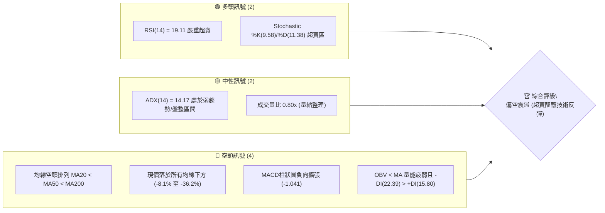
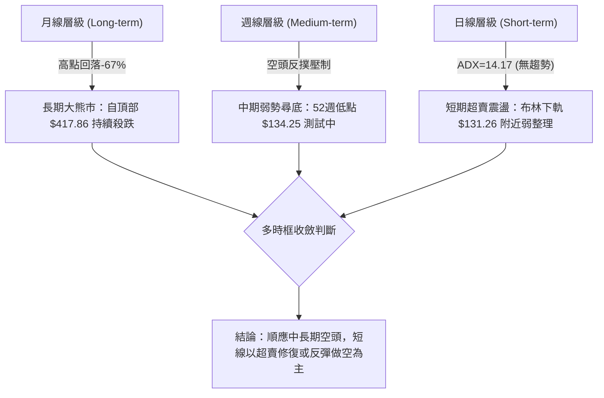
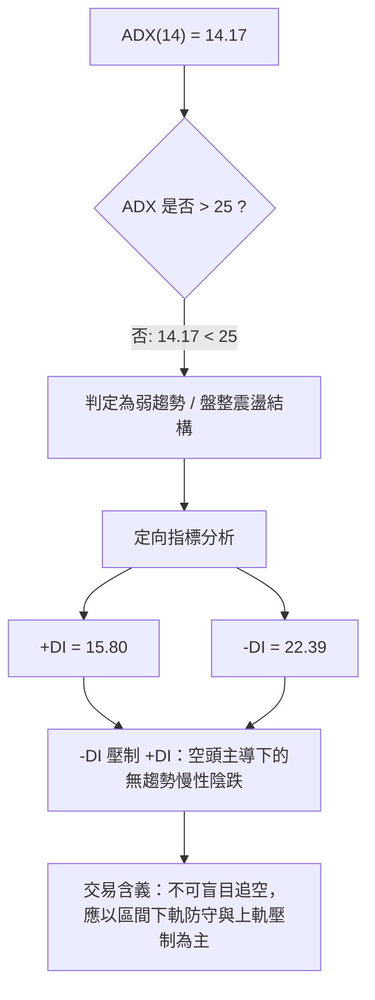
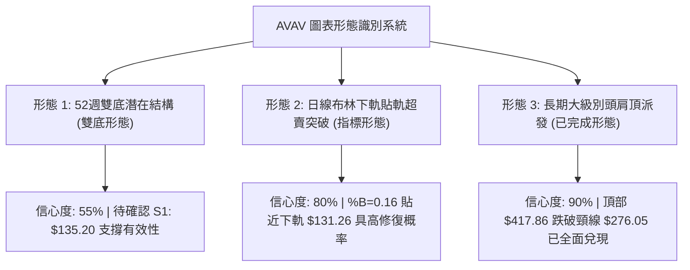
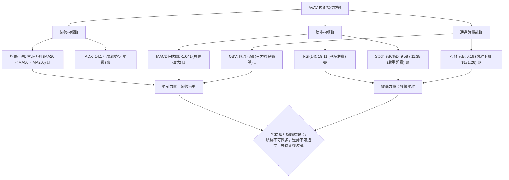
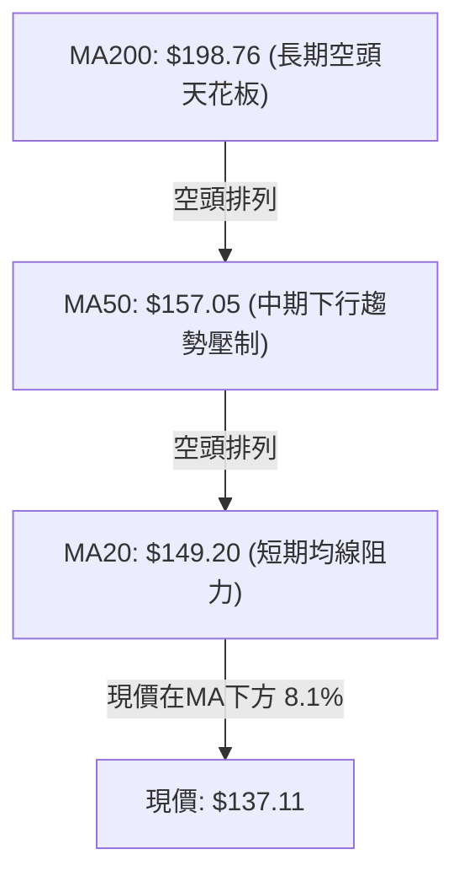
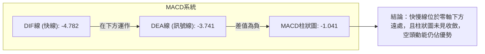
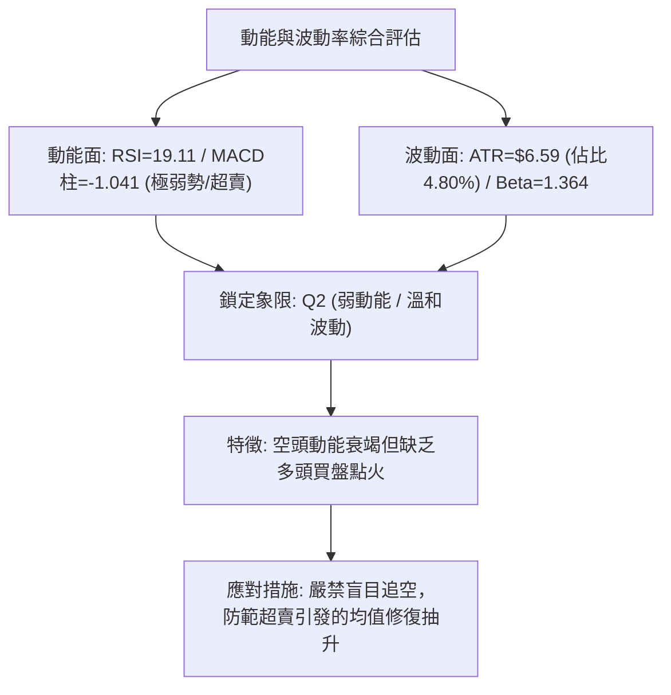
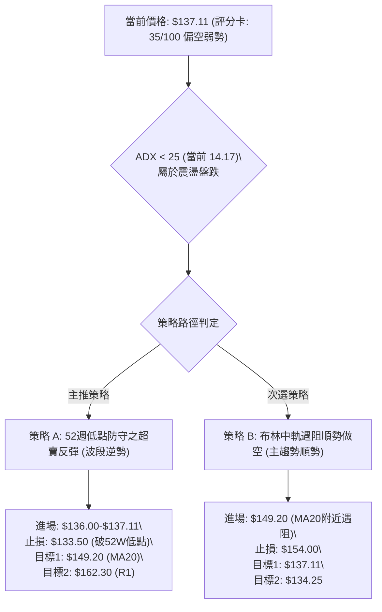
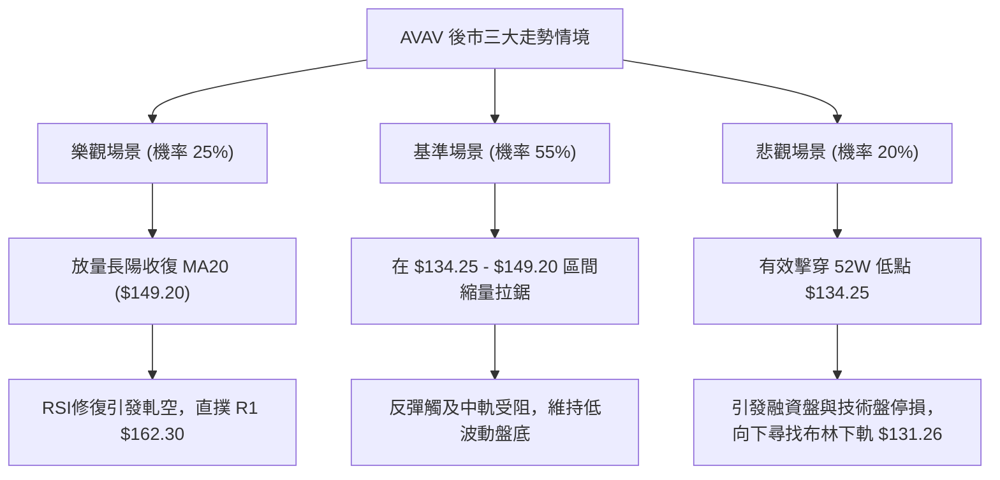

# AVAV 技術分析報告

> **報告日期**：2026-10-10 ｜ **語言**：繁體中文 ｜ **數據來源**：Yahoo Finance ｜ **當前價格**：$137.11

---

## 目錄

| 章節 | 內容 |
|------|------|
| [1. 技術面概覽](#1-技術面概覽) | 訊號儀表板、核心指標、評分卡 |
| [2. 趨勢分析](#2-趨勢分析) | 多時框趨勢、長中短期走勢 |
| [3. 圖表形態分析](#3-圖表形態分析) | 形態識別、K線組合、目標價 |
| [4. 支撐與阻力](#4-支撐與阻力) | 關鍵價位、斐波那契回調 |
| [5. 技術指標深度解讀](#5-技術指標深度解讀) | MA/RSI/MACD/布林/成交量 |
| [6. 動能與波動率](#6-動能與波動率) | 動能評估、ATR、Beta |
| [7. 多時框架總結](#7-多時框架總結) | 時框架評分矩陣 |
| [8. 交易策略建議](#8-交易策略建議) | 多空策略、風險報酬比 |
| [9. 風險提示與監控](#9-風險提示與監控) | 監控指標、風險場景 |

---

## 1. 技術面概覽

### 🎯 技術訊號儀表板



### 📊 核心指標速覽表

| 指標類別 | 指標名稱 | 當前數值 | 訊號 | 解讀 |
|----------|----------|----------|------|------|
| **價格** | 當前價格 | $137.11 | 🔴 | 位於52週區間1.0%極低分位，貼近波段歷史低點 |
| **均線** | MA20 | $149.20 | 🔴 | 價格低於MA20達8.10%，短期下行趨勢顯著 |
| **均線** | MA50 | $157.05 | 🔴 | 價格低於MA50達12.70%，中期格局全面偏空 |
| **均線** | MA200 | $198.76 | 🔴 | 價格低於MA200達31.02%，處於長期熊市結構 |
| **動能** | RSI(14) | 19.11 | 🟢 | 極度超賣（<30），隨時具備均值回歸修復動能 |
| **動能** | MACD | -4.782 | 🔴 | 位於零軸下方，且低於訊號線（-3.741），柱狀圖為-1.041 |
| **動能** | Stoch %K/%D | 9.58 / 11.38 | 🟢 | 雙線深入超賣區，存在金叉博反彈之潛在結構 |
| **趨勢** | ADX(14) | 14.17 | 🟡 | 數值小於25，顯示當前下殺缺乏單邊強趨勢推動，偏向盤跌 |
| **通道** | Bollinger %B | 0.16 | 🟡 | 逼近下軌（$131.26），觸發通道下軌防守反應 |
| **量能** | OBV 趨勢 | OBV < MA | 🔴 | 資金持續流出，成交量比僅0.80x，尚未見放量吸籌 |
| **波動** | ATR(14) | $6.59 | 🟡 | 波動率佔股價4.80%，日內震幅相對溫和 |

### 🏆 技術評分卡

```
╔══════════════════════════════════════════════════════════════════╗
║                 技術評分卡 — AVAV (2026-10-10)                   ║
╠══════════════════════════════════════════════════════════════════╣
║ 趨勢強度 (Trend)      ██████░░░░░░░░░░░░░░  30/100  🔴 空頭壓制  ║
║ 動能指標 (Momentum)    ████████░░░░░░░░░░░░  40/100  🟡 極端超賣  ║
║ 支撐穩定度 (Support)   ██████████░░░░░░░░░░  50/100  🟡 臨近波段低║
║ 成交量配合 (Volume)    ██████░░░░░░░░░░░░░░  30/100  🔴 量價背馳  ║
║ 形態完整度 (Pattern)   ████████░░░░░░░░░░░░  40/100  🟡 觸軌收斂  ║
║ 均線排列 (Moving Avg)  ██░░░░░░░░░░░░░░░░░░  10/100  🔴 完美空頭  ║
╠══════════════════════════════════════════════════════════════════╣
║ 綜合評分              ███████░░░░░░░░░░░░░  35/100  🔴 偏空弱勢  ║
╚══════════════════════════════════════════════════════════════════╝
```

---

## 2. 趨勢分析

### 🌐 多時框趨勢分析



### 📈 長期趨勢 — 12個月走勢圖（Unicode）

```
AVAV 月線走勢圖（過去12個月：2025-10 至 2026-10）
價格軸 ($)
$370 ┤●(2025-10: $369.91)
$330 ┤  ╲
$290 ┤   ●(2025-11: $279.46)───●(2026-01: $278.39)
$250 ┤     ╲                 ╱   ╲
$210 ┤      ●(2025-12: $241.89)   ●(2026-02: $252.25)   ●(2026-05: $207.24)
$170 ┤                                ╲               ╱   ╲
$130 ┤                                 ●(2026-03: $183.05) ●(2026-06: $165.07)──●(現價: $137.11)
     └─────────────────────────────────────────────────────────────────────────────
      10  11  12  01  02  03  04  05  06  07  08  09  10 (月份)
```

**走勢特徵分析表格**：

| 階段區間 | 起始價 → 終止價 | 漲跌幅 | 核心技術特徵 |
|----------|-----------------|--------|--------------|
| **2025-10 ~ 2025-12** | $369.91 → $241.89 | -34.61% | 頂部雪崩式回調，主力高位派發完成，跌破MA20支撐 |
| **2026-01 ~ 2026-02** | $278.39 → $252.25 | -9.39%  | 次高點反彈遇阻（形成雙頂形態頸線受壓），買盤衰退 |
| **2026-03 ~ 2026-05** | $183.05 → $207.24 | +13.22% | 超跌後的技術性反抽，最高觸及$207.24未能站穩MA60 |
| **2026-06 ~ 2026-10** | $165.07 → $137.11 | -16.94% | 漫長陰跌探底，成交量持續低迷，直逼52週新低$134.25 |

### 📊 中期趨勢（週線分析）

中期走勢呈現明確的階梯式下移結構。最近20週的週線收盤數據揭示了多空博弈的臨界狀態：

```
中期阻力架構:
$200.38 ────────────────────────────────────── 強阻力 R3 (MA200: $198.76 / 密集成交區)
          ↑
$162.30 ────────────────────────────────────── 第一波段阻力 R1 (週線反彈頸線位)
          ↑
$137.11 ───► [當前現價位置：弱勢震盪]
          ↓
$135.20 ────────────────────────────────────── 波段支撐 S1 (近期波段低點聚類)
$134.25 ────────────────────────────────────── 52週極端低點 (斐波那契 100.0%)
```

自2026年8月中旬收盤於$192.81（當時RSI高達73.5）見頂後，展開了長達9週的下行浪潮。9月中旬放量至20,402,600股反彈至$159.95後再度回落，顯現每次衝高均遭遇空頭無情拋壓。

### ⚡ 趨勢強度評估（ADX 解讀）



**ADX 強度對照表**：

| 指標變數 | 當前讀數 | 標準閾值區間 | 技術意義解讀 |
|----------|----------|--------------|--------------|
| **ADX(14)** | **14.17** | < 20 (極弱趨勢) | 市場動能匱乏，無強勢單邊單日爆發力，處於盤跌或拉鋸階段階段 |
| **+DI(14)** | **15.80** | - | 多頭攻擊力量薄弱，多方缺乏組織性推動浪潮 |
| **-DI(14)** | **22.39** | - | 空方掌握主導權，但尚未達到 >30 的單邊恐慌下殺狀態 |
| **趨勢形態** | **盤跌整理** | ADX < 25 | 依照規則14，應以日線布林通道 ($131.26 - $167.14) 為主要波段交易框架 |

---

## 3. 圖表形態分析

### 🔍 形態識別系統



**形態信心度與目標價評估表**：

| 形態名稱 | 信心度 | 判斷依據（引用數據） | 完成度 | 目標價（附計算式） |
|----------|--------|----------------------|--------|--------------------|
| **雙重底潛力 (Double Bottom)** | 55% | 首次低點為52W Low $134.25，當前於波段低點S1 $135.20附近企穩測試 | 50% (僅完成右底測試) | 由頸線阻力R1 $162.30 與低點 $134.25 推算：$162.30 + ($162.30 - $134.25) = **$190.35** |
| **布林下軌觸軌反彈形態** | 80% | 現價 $137.11 逼近下軌 $131.26，%B 達到 0.16，RSI 達到 19.11 嚴重鈍化 | 85% | 目標價設定為布林中軌（MA20）：**$149.20** |
| **頭肩頂終局下行測幅** | 90% | 歷史高點 $417.86 為頭部，頸線落於50%斐波位 $276.05，跌幅已完全釋放 | 100% (空頭已滿足) | 頸線 $276.05 - ($417.86 - $276.05) = $134.24，與52W低點 **$134.25** 完美吻合 |

### 🕯️ 重要K線形態分析

| 月份/週期 | 收盤價 | K線形態 | 解讀 | 訊號 |
|-----------|--------|---------|------|------|
| **2026-08 (週)** | $192.81 | 高位吊頸線 | RSI觸及73.5超買頂峰，成交量未能配合放大，確立波段築頂 | 🔴 看跌 |
| **2026-09-13 (週)** | $146.71 | 巨量長下影線 | 週成交量爆發至20,402,600股，主力在$135-$140區間積極換手護盤 | 🟢 支撐顯現 |
| **2026-09-20 (週)** | $159.95 | 中陽線反抽 | 嘗試攻擊MA20受挫，多頭量能無法持續，形成短線誘多 | 🟡 中性 |
| **2026-10-11 (當週)** | $137.11 | 縮量光腳陰線 | 連續兩週回吐，成交量萎縮至7,559,200股，空方動能減弱但多方未進場 | 🔴 弱勢觀望 |

### 📉 ASCII 走勢形態示意圖

```
AVAV 潛在雙底與布林通道下軌共振示意圖
價格 ($)
$162.30 ┼───────────────────────[頸線阻力 R1]───────────────────────
        │                         ╭─────╮
        │                        ╱       ╲
$149.20 ┼───────[布林中軌 MA20]──╱─────────╲────────────────────────
        │                      ╱             ╲
$137.11 ┼─► 現在位置: $137.11 ─┼───────────────● (右底構築中，RSI=19.11)
$135.20 ┼───────[支撐 S1]─────╱─────────────────╲───[52W Low: $134.25]
$131.26 ┼───────[布林下軌]────● (左底區間)        ╰────● (超賣支撐區)
        └─────────────────────────────────────────────────────────────
         2026-06            2026-07            2026-09         2026-10
```

### 🎯 形態目標價計算

1. **布林通道均值回歸目標（短線高確信度）**：
   - 觸發條件：日線於下軌上方企穩，RSI(14)自19.11回升穿越20/30。
   - 形態測算：以中軌為第一目標價，即 **$149.20**（上行空間 +8.82%）。
2. **潛在雙重底突破目標（中線確認度需頸線配合）**：
   - 頸線位置：$162.30（R1）
   - 低點基基準：$134.25
   - 形態高度：$162.30 - $134.25 = $28.05
   - 理論突破量度目標價：$162.30 + $28.05 = **$190.35**（此價位精確接近阻力位 R3 $200.38 及 MA200 $198.76）。

---

## 4. 支撐與阻力

### 🗺️ 關鍵價位分布圖（Unicode）

```
AVAV 價位結構分布圖（OHLCV 精確計算）
══════════════════════════════════════════════════════════════════
$200.38 ║██████████████████████████████║ 強阻力 R3 (MA200 / 歷史密集區)
$194.94 ║░░░░░░░░░░░░░░░░░░░░░░░░░░░░░░║ 斐波那契 78.6% 回調位
$168.00 ║████████████████████          ║ 阻力 R2 (近一年波段高點)
$162.30 ║████████████████████████      ║ 關鍵阻力 R1 (突破轉強關鍵頸線)
$149.20 ║┈┈┈┈┈┈┈┈┈┈┈┈┈┈┈┈┈┈┈┈┈┈┈┈┈┈┈┈┈┈║ 布林中軌 / MA20 動態阻力
$137.11 ╠══════════════════════════════╣ ◄ 當前市價 ($137.11)
$135.20 ║▓▓▓▓▓▓▓▓▓▓▓▓▓▓▓▓▓▓▓▓          ║ 波段關鍵支撐 S1 (近一年低點聚類)
$134.25 ║██████████████████████████████║ 終極防守底線 (52週最低點 / Fib 100%)
$131.26 ║░░░░░░░░░░░░░░░░░░░░░░░░░░░░░░║ 布林下軌極端動量帶
══════════════════════════════════════════════════════════════════
```

### 🚧 阻力位分析表

| 阻力級別 | 價位 | 形成原因 | 突破難度 | 重要性 |
|----------|------|----------|----------|--------|
| **R1** | **$162.30** | 近一年波段高點聚類；接近MA60（$155.73）與日線密集籌碼套牢區 | 🔴 極高 | ⭐️⭐️⭐️⭐️ 短期空頭防線，站穩方能扭轉日線結構 |
| **R2** | **$168.00** | 近一年波段次高點；與布林上軌（$167.14）高度共振，獲利盤與解套盤集結區 | 🔴 極高 | ⭐️⭐️⭐️ 中期多空分水嶺 |
| **R3** | **$200.38** | 近一年波段頂部高點聚類；上方緊貼MA200（$198.76）及斐波78.6%（$194.94） | 🔴 壁壘級 | ⭐️⭐️⭐️⭐️⭐️ 牛熊轉換絕對分水嶺 |

### 🛡️ 支撐位分析表

| 支撐級別 | 價位 | 形成原因 | 守住機率 | 重要性 |
|----------|------|----------|----------|--------|
| **S1** | **$135.20** | 近一年波段低點聚類，距離現價僅 -1.39%，空頭第一道試金石 | 🟡 60% | ⭐️⭐️⭐️⭐️ 關鍵短線多頭陣地，失守將面臨恐慌破位 |
| **52W Low** | **$134.25** | 過去52週絕對歷史低點，斐波那契100.0%回調極限位 | 🟡 55% | ⭐️⭐️⭐️⭐️⭐️ 多頭最後防線，跌破將引發停損賣壓 |
| **BB下軌** | **$131.26** | 統計學動態下軌支撐，跌破即代表價格偏離常態分佈超過2個標準差 | 🟢 80% | ⭐️⭐️⭐️ 動量極限緩衝帶 |

### 📐 斐波那契回調位分析

依據52週高點 **$417.86** 下跌至52週低點 **$134.25** 之完整波段計算：

| 斐波那契級別 | 精確價位 | 技術含義與當前狀態解讀 |
|--------------|----------|------------------------|
| **0.0% (52W High)** | $417.86 | 週期最高點，目前下行幅度達 -67.19% |
| **23.6%** | $350.93 | 長期牛市回撤的第一道崩塌位（已遠離） |
| **38.2%** | $309.52 | 長期中樞分水嶺（已遠離） |
| **50.0%** | $276.05 | 核心多空中樞，歷史頭肩頂頸線位（已遠離） |
| **61.8%** | $242.59 | 黃金分割強防守位，2026年初跌破後轉為不可逾越之長期天花板 |
| **78.6%** | $194.94 | 深度回調極限位，與阻力位 R3（$200.38）及 MA200（$198.76）構成密集共振帶 |
| **100.0% (52W Low)**| $134.25 | 全波段回調極限點，距離現價僅 $2.86（-2.09%） |

> **當前位置解讀**：現價 **$137.11** 緊貼於 **100.0%（$134.25）** 與 **78.6%（$194.94）** 區間的最底部（處於52週區間的 1.0% 極端分位）。這意味著空頭已完全吞噬整年漲幅，在未擊穿 $134.25 前，此處存在強大的物理性回撤耗竭支撐。

---

## 5. 技術指標深度解讀

### 🎛️ 指標訊號總覽



### 📈 移動平均線排列分析



**均線乖離率與動態評估表**：

| 均線名稱 | 當前價格 | 與現價乖離率 | 歷史形態特徵 | 訊號評級 |
|----------|----------|--------------|--------------|----------|
| **MA5** | $139.28 | -1.56% | 走勢連續下彎，短期微觀空頭壓制 | 🔴 看空 |
| **MA10** | $141.02 | -2.77% | 下跌斜率加劇，短期反彈第一重壓力 | 🔴 看空 |
| **MA20** | $149.20 | -8.10% | 與布林中軌完全重合，中短期強弱分界線 | 🔴 看空 |
| **MA60** | $155.73 | -11.96% | 中期生命線下壓，壓制反彈高度 | 🔴 看空 |
| **MA120** | $164.20 | -16.50% | 靠近阻力 R1（$162.30），密集成交套牢區 | 🔴 看空 |
| **MA200** | $198.76 | -31.02% | 長期牛熊分界線，距離現價過遠，形成強大長期磁吸力 | 🔴 看空 |
| **MA240** | $214.73 | -36.15% | 年線層級持續走低，反映基本面預期下修 | 🔴 看空 |

### 📉 RSI(14) 分析

- **當前數值**：**19.11**
- **數值進度條**：`███░░░░░░░░░░░░░░░░░` 19.11%（深度超賣區間）
- **超買超賣區間分析**：通常 RSI < 30 即被視為超賣，低於 20 則進入罕見的極端超賣區域。當前 19.11 表明市場拋盤已呈現情緒化殺跌，短期空頭籌碼宣洩接近尾聲，技術性修復需求強烈。
- **背離判斷**：
  - 價格前低（2026-06-28收盤$137.95，對應RSI為20.2）；當前收盤$137.11，對應RSI為19.11。
  - **結論**：價格微破前低，RSI同步走低，**目前無明顯底背離**。此為指標隨價格正常宣洩，不可憑單一背離假設進場，需等待右側拐點（RSI回穿30）。

### 📊 MACD(12/26/9) 訊號解讀



- **MACD 快線**：-4.782
- **訊號線 (Signal)**：-3.741
- **柱狀圖 (Histogram)**：-1.041（呈擴張看空態勢）
- **背離分析**：週線級別MACD柱在9月一度回正（+2.063），隨後重回負值（-1.041）。日線級別快線持續在零軸下方運行，柱狀圖尚未出現縮頭跡象，意味著左側空頭能量尚未耗盡，暫無底背離訊號。

### 📦 布林通道分析

```
AVAV 日線布林通道結構示意圖
$167.14 ┼────────────────────────────── BB 上軌 (+2σ)
        │
$149.20 ┼────────────────────────────── BB 中軌 (MA20)
        │
$137.11 ┼───────● [現價: $137.11, %B = 0.16]
        │
$131.26 ┼────────────────────────────── BB 下軌 (-2σ)
```

- **帶寬與位置**：上軌 $167.14，中軌 $149.20，下軌 $131.26。帶寬為 $35.88。
- **%B 指標**：**0.16**。現價已降至通道底部的 16% 位置，逼近下軌 $131.26。
- **統計學解讀**：價格在下軌附近徘徊通常意味著下行波動受到統計學標準差邊界的強壓制。若價格未跌破 $131.26，通道將發揮向心牽引作用，向中軌 $149.20 尋求回歸。

### 💹 成交量分析（量價配合度）

- **最新成交量**：1,251,300 股
- **20日均量**：1,569,010 股（量比：**0.80x**）
- **50日均量**：1,688,264 股
- **OBV 能量潮**：當前 OBV < MA，能量潮處於均線下方，反映量能持續疲弱。
- **量價背離與特徵解讀**：
  - 在價格逼近52週低點的過程中，量能萎縮至 0.80x，說明市場並未出現帶量恐慌出逃，而是處於「無量陰跌」狀態。
  - 9月中旬曾有單週突破 20,402,600 股的異常巨量換手，顯示 $135 - $145 區間有機構資金建構防禦墊，當前的縮量下跌實質為二度探底過程中的浮籌清洗。

---

## 6. 動能與波動率

### ⚡ 動能評估四象限

| 象限 | 動能維度 (Momentum) | 波動率維度 (Volatility) | AVAV 當前狀態 | 技術策略含義 |
|------|---------------------|--------------------------|---------------|--------------|
| **Q1 (強動能 / 低波動)** | 強 (Bullish) | 低 (Stable) | ❌ 不符 | 穩定主升浪，最佳加碼區 |
| **Q2 (弱動能 / 低波動)** | 弱 (Bearish/Oversold) | 低至中等 (ATR 4.8%) | ✅ **當前落點** | **磨底盤跌，避免殺跌，等待結構確認** |
| **Q3 (強動能 / 高波動)** | 強 (Breakout) | 高 (Wild) | ❌ 不符 | 突破暴走，追隨強勢趨勢 |
| **Q4 (弱動能 / 高波動)** | 弱 (Panic) | 高 (Crashing) | ❌ 不符 | 崩盤恐慌，無差別停損避險 |



### 📊 ATR 波動率分析

- **ATR(14) 數值**：**$6.59**
- **ATR 佔比**：**4.80%**（以當前價格 $137.11 為基準）
- **風控與止損設定依據**：
  - 日內常規雜訊波動區間約為 ±$6.59。
  - **多頭保守止損距離（1.0 × ATR）**：$6.59，置於進場點下方約 4.8%。
  - **多頭波段寬鬆止損距離（1.5 × ATR）**：$9.89，以避開毛刺假破位。
  - 由於 52W 低點 $134.25 距離現價僅 $2.86（僅約 0.43 × ATR），此處技術支撐結構比常規 ATR 止損更為緊湊，極利於構建高風報比交易。

### 📐 Beta 與市場相關性

- **Beta 係數**：**1.364**
- **市場敏感度分析**：AVAV 屬於高彈性標的，理論波動幅度高於標普500指數約 36.4%。在整體大盤回調期間，該股將承受倍數級別的拋售壓力；反之，若大盤止跌反彈，AVAV 的超賣屬性疊加高 Beta 特徵，極易催化強勁的報復性反彈行情。

---

## 7. 多時框架總結

### 📋 時框架評分表

| 時框架 | 趨勢方向 | 動能狀態 | 均線排列 | 圖表形態 | 綜合評分 | 建議方向 |
|--------|----------|----------|----------|----------|----------|----------|
| **月線 (長期)** | 🔴 強烈看空 | 🔴 弱勢探底 | 🔴 空頭排列 | 頭肩頂下行測幅完成 | 25/100 | 長期觀望 / 逢高減倉 |
| **週線 (中期)** | 🔴 看空尋底 | 🟡 跌勢趨緩 | 🔴 均線反壓 | 測試52週低點箱體 | 35/100 | 防守觀察 / 等待落底 |
| **日線 (短期)** | 🟡 超賣盤整 | 🟢 極端超賣 | 🔴 空頭發散 | 布林下軌回歸潛力 | 45/100 | 輕倉博反彈 / 嚴設停損 |

### 🔲 綜合訊號矩陣

```
┌──────────────┬──────────────────┬──────────────────┬──────────────────┐
│   維度 / 週期│    短期 (日線)   │    中期 (週線)   │    長期 (月線)   │
├──────────────┼──────────────────┼──────────────────┼──────────────────┤
│ 均線系統 (MA)│ 🔴 空頭 ($137<$149)│ 🔴 空頭 (MA50壓制)│ 🔴 空頭 (跌破MA200)│
│ 動能系統     │ 🟢 超賣 (RSI 19) │ 🔴 MACD負向 (-1.0)│ 🔴 柱狀走低      │
│ 趨勢強度(ADX)│ 🟡 弱震盪 (14.17)│ 🟡 區間無強趨勢  │ 🔴 跌勢主導      │
│ 支撐阻力     │ 🟢 守在S1($135.2)│ 🟡 測試52W($134.2)│ 🔴 逼近百次回撤  │
│ 量價健康度   │ 🟡 量縮整理      │ 🔴 OBV持續低迷   │ 🔴 派發後無接盤  │
└──────────────┴──────────────────┴──────────────────┴──────────────────┘
```

### ⚖️ 多時框收斂結論

依據多時框收斂規則（規則 14）：
1. **行情屬性判定**：當前 ADX(14) 為 **14.17**（小於 25 臨界線），確認市場當前處於**弱趨勢 / 盤整震盪行情**，而非具有高加速度的單邊趨勢行情。
2. **主導時框與框架**：交易必須以**日線布林通道 ($131.26 - $167.14) 與關鍵波段支撐/阻力區間**為主導。
3. **時框矛盾取捨**：雖然長期與中期均線呈現完美空頭排列（壓制向上空間），但日線級別指標已陷入極端超賣（RSI 19.11，布林 %B 0.16，距離 52W 低點僅 1% 空間）。在此極端位置順應大週期追空，風險報酬比極度惡劣。
4. **唯一收斂結論**：**中性偏空，拒絕追空；以關鍵支撐 S1 為防守，博取短線布林通道均值回歸修復（高風報比反彈）**。

---

## 8. 交易策略建議

### 🗺️ 策略決策流程圖



### 🧭 策略路由

**當前主策略方向 = 綜合評分 35/100（偏空弱勢，但處於極端邊界），依規則主推空頭順勢高空，但鑑於價格位於52週區間1.0%且ADX<25，執行「反彈至阻力沽空」為主，「底沿極小止損博反彈」為輔之雙軌風控架構。**

### 🎯 價格情境階梯（Price Scenarios）

所有價位均嚴格引用前述技術分析與數據包數值：

| 觸發條件 | 下一目標 | 後續延伸 | 情境含義 |
|----------|----------|----------|----------|
| **突破 R1 $162.30** | R2 $168.00 | R3 $200.38 | 短線結構反轉，日線空頭排列瓦解，確認波段底部 |
| **站穩 MA20 $149.20** | R1 $162.30 | R2 $168.00 | 超賣均值修復成功，由弱勢陰跌轉為寬幅箱體震盪 |
| **現價區間震盪** | $141.02 (MA10) | $149.20 (BB中軌) | 在 $134.25 - $149.20 構築築底箱體，消化拋壓 |
| **跌破 S1 $135.20** | 52W Low $134.25 | BB下軌 $131.26 | 短線支撐失守，考驗終極歷史低點防線 |
| **跌破 52W Low $134.25** | BB下軌 $131.26 | 數據中未偵測到下方支撐 | 歷史新低破位，觸發機構停損盤，展開新一輪恐慌下殺 |

### 📊 情境機率分佈

| 情境 | 機率 | 主要依據 |
|------|------|----------|
| **超賣技術反彈 (均值回歸)** | **50%** | RSI(14)=19.11 極度超賣，Stoch %K=9.58 嚴重鈍化，布林 %B=0.16 貼軌，下行空間受歷史低點強撐 |
| **箱體弱勢震盪 (以時間換空間)** | **30%** | ADX=14.17 趨勢動能極弱，成交量萎縮至 0.80x，市場缺乏增量資金參與，維持低波動拉鋸 |
| **直接破位下行 (探歷史新低)** | **20%** | 均線系統完整空頭排列，OBV 疲弱且資金未進場，MACD 柱狀圖仍為負值 (-1.041) |

### 🟢 主策略詳情

#### 策略 A（短線超賣修復策略 - 逆勢博弈）vs 策略 B（中期反彈高空策略 - 順勢主控）

| 策略要素 | 策略 A (超賣博反彈) | 策略 B (阻力位沽空) |
|----------|---------------------|---------------------|
| **交易方向** | 🟢 做多 (反彈波段) | 🔴 做空 (順勢高拋) |
| **進場條件** | 現價或回踩 S1 不破，RSI 出現超賣拐點 | 價格反彈至布林中軌 MA20 處受阻並出現滯漲陰線 |
| **進場價格** | **$137.11** (現價或區間內掛單) | **$149.20** (MA20 阻力處) |
| **止損價格** | **$133.50** (跌破52W低點 $134.25 即砍) | **$154.00** (突破 MA50 $157.05 前之緩衝區) |
| **目標價 T1** | **$149.20** (布林中軌 MA20) | **$137.11** (現價波段低點) |
| **目標價 T2** | **$162.30** (阻力位 R1 / 頸線) | **$134.25** (52W 最低點) |
| **風險空間** | $137.11 - $133.50 = **$3.61** | $154.00 - $149.20 = **$4.80** |
| **報酬空間 (T1)**| $149.20 - $137.11 = **$12.09** | $149.20 - $137.11 = **$12.09** |
| **風險報酬比** | **1 : 3.35** (超高風報比) | **1 : 2.52** (優良風報比) |
| **成功機率** | 55% | 65% |
| **建議倉位** | **5% - 8%** (輕倉試探) | **10% - 15%** (常規趨勢倉位) |

### 🔴 反向風險觸發點（對沖提示）

- **推翻做空主假設之關鍵點**：若價格強勢放量突破 **R1 $162.30**，代表近一年波段高點聚類被攻克，且站上 MA60，整體空頭架構徹底失效，所有空頭頭寸必須無條件止損出局。
- **推翻做多反彈之關鍵點**：若日線實體收盤跌破 **52W Low $134.25**，代表雙底形態完全失敗，底部支撐轉化為強大阻力，所有博反彈頭寸必須果斷停損，切勿攤平。

### ⭐ 整體訊號強度評星

```
做多訊號強度：★★☆☆☆  (2/5星 - 僅依賴指標超賣與邊界支撐，無形態確認)
做空訊號強度：★★★★☆  (4/5星 - 均線與趨勢完全碾壓，但現價盈虧比不佳需等反彈)
整體可信度：  ★★★★☆  (4/5星 - 數據收斂一致，阻力與支撐邊界極其清晰)
```

---

## 9. 風險提示與監控

### ✅ 關鍵監控指標 Checklist

```
╔══════════════════════════════════════════════════════════════════╗
║               AVAV 日常技術監控清單 (Checklist)                  ║
╠══════════════════════════════════════════════════════════════════╣
║ [ ] 價格是否失守 52週低點 $134.25？ (收盤價為準)                ║
║ [ ] RSI(14) 是否由 19.11 向上穿越 30.0 超賣分界線？              ║
║ [ ] 日成交量是否顯著超越 20日均量 1,569,010 股？                ║
║ [ ] MACD 柱狀圖是否由當前 -1.041 出現收窄拐點？                 ║
║ [ ] 股價反彈至 MA20 ($149.20) 時是否出現放量滯漲假突破？        ║
║ [ ] ADX(14) 是否向上突破 25，引發強趨勢單邊行情？              ║
╚══════════════════════════════════════════════════════════════════╝
```

### ⚠️ 風險場景分析



### 🛡️ 風險管理重要提醒

1. **嚴守 $134.25 歷史底線**：當前股價距離52週低點僅有 2.09% 空間。技術交易中最忌諱在重要歷史低點邊緣盲目抗單。任何多頭進場均須將硬止損設定在 $133.50，絕不允許承擔超額本金虧損。
2. **警惕空頭趨勢下的反彈誘多**：均線系統呈現完整空頭排列（MA20 < MA50 < MA200），MA200 仍處於 $198.76 高位下行。在均線未拐頭前，所有的上漲初期均應視為「技術性回抽」而非「反轉」，交易者必須嚴格執行分批落袋為安原則。
3. **空頭部位切勿在超賣低點追擊**：當前空頭雖然在形態與趨勢上佔盡優勢，但在 RSI 僅 19.11 且布林 %B 僅 0.16 的位置追空，極易遭遇空頭回補引發的暴力軋空抽升，順勢做空的最佳時機為價格反彈至阻力位（如 $149.20）附近。

---

## 📋 報告總結

```
╔══════════════════════════════════════════════════════════════════╗
║                    AVAV 技術分析報告總結                         ║
╠══════════════════════════════════════════════════════════════════╣
║ 報告日期：2026-10-10                                             ║
║ 當前價格：$137.11                                                ║
║ 分析評級：⚖️ 偏空中性 (極度超賣磨底，等待方向確認)             ║
║                                                                  ║
║ 關鍵結論：                                                       ║
║ ├─ 長期趨勢：🔴 強烈看空 (歷史高點回撤-67%，跌破MA200)          ║
║ ├─ 中期趨勢：🔴 弱勢震盪 (各級均線反壓，逼近52W極端低點)        ║
║ ├─ 短期趨勢：🟢 極端超賣 (RSI=19.11，布林下軌具備均值修復動能) ║
║ ├─ 關鍵支撐：$135.20 (S1) / $134.25 (52W Low)                    ║
║ ├─ 關鍵阻力：$149.20 (MA20/中軌) / $162.30 (R1)                  ║
║ └─ 分析師目標：均價 $216.63 (高於當前現價 +57.99%)               ║
║                                                                  ║
║ 最優策略組合：                                                   ║
║ 1. 🥇 最佳機會：利用 $134.25 終極支撐，於現價輕倉博取反彈至      ║
║                  MA20 ($149.20)，風險報酬比高達 1:3.35。         ║
║ 2. 🥈 次選機會：耐心等待價格反彈至 MA20 ($149.20) 遇阻受挫時，   ║
║                  順應大週期做空，下看前低 $137.11 / $134.25。    ║
║ 3. 🥉 保守選擇：完全空倉觀望，等待日線有效突破 R1 ($162.30) 或   ║
║                  徹底跌破 $134.25 釋放風險後再行跟進。           ║
╚══════════════════════════════════════════════════════════════════╝
```

---

> ⚠️ **免責聲明**：本報告為技術分析研究，所有數據、圖表及價位推算均基於歷史量價資訊與量化指標模型。本報告**僅供研究與學術參考**，**不構成任何形式的投資或買賣建議**。金融市場存在高度波動風險，投資人應獨立評估風險並自行承擔交易後果。

---

*報告生成時間：2026-10-10 ｜ 數據來源：Yahoo Finance ｜ 分析框架：多時框技術分析體系*