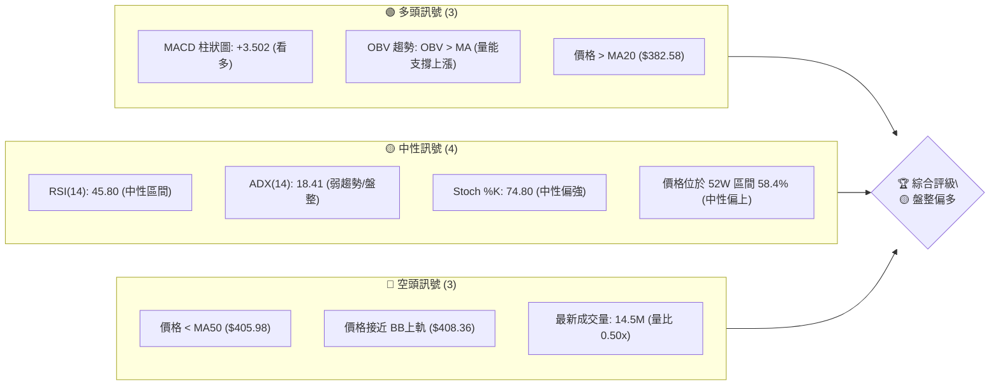
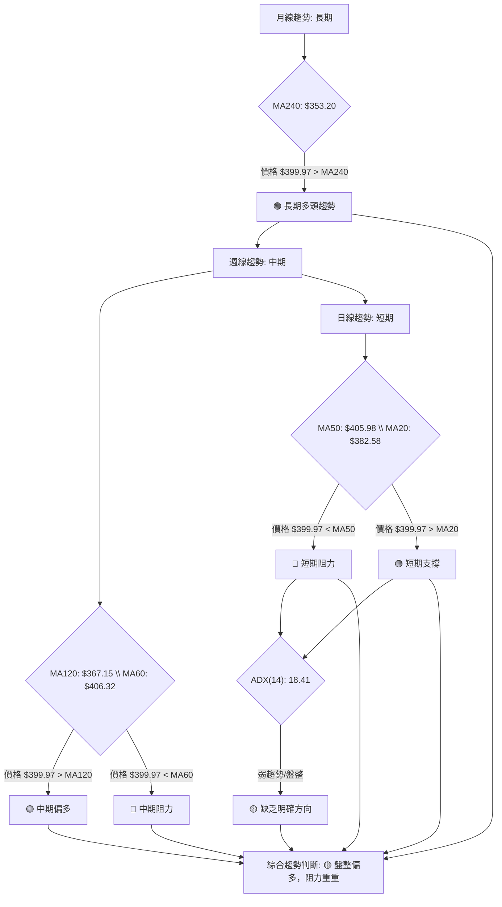
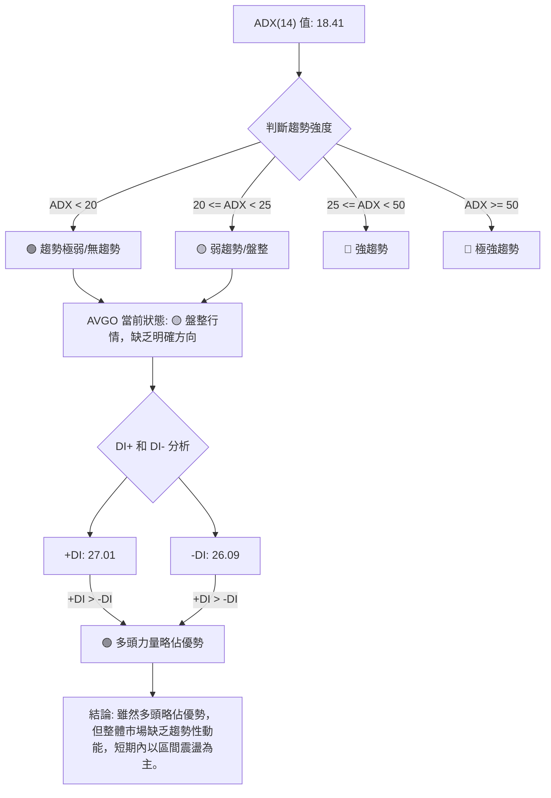
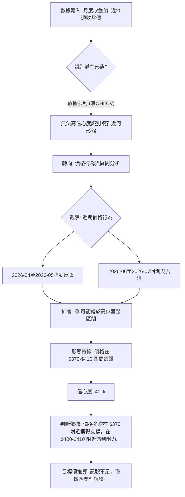
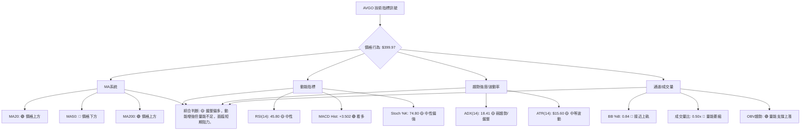
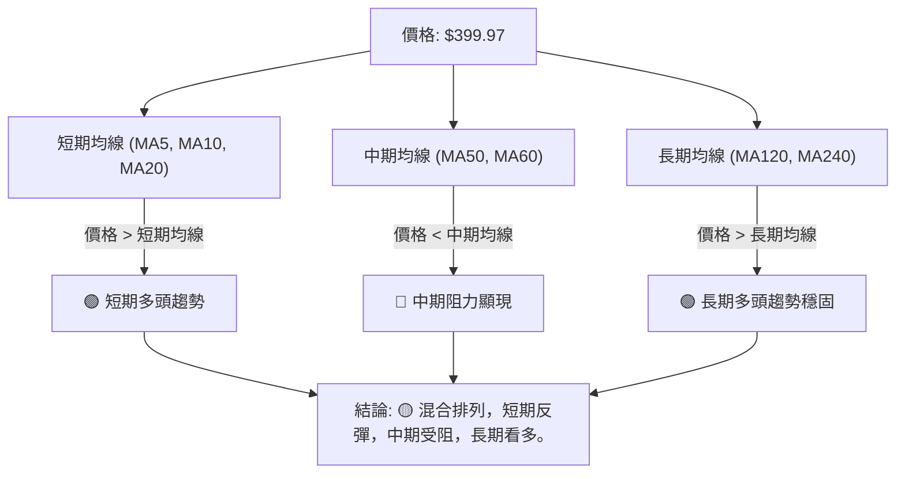
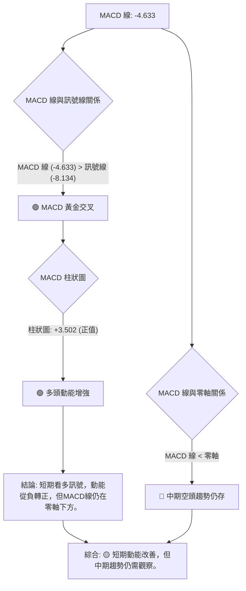
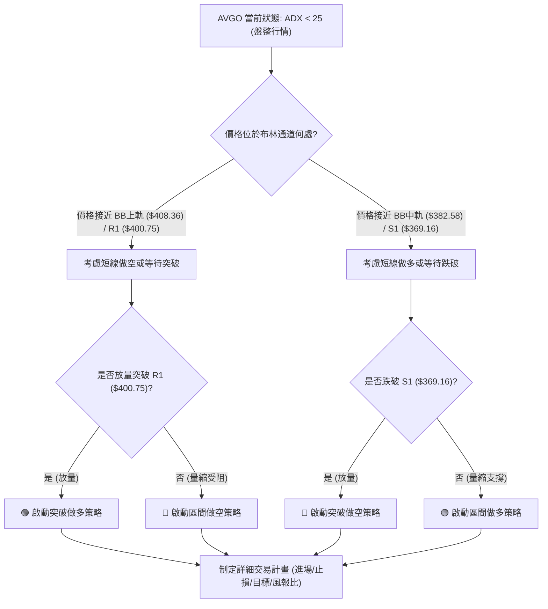
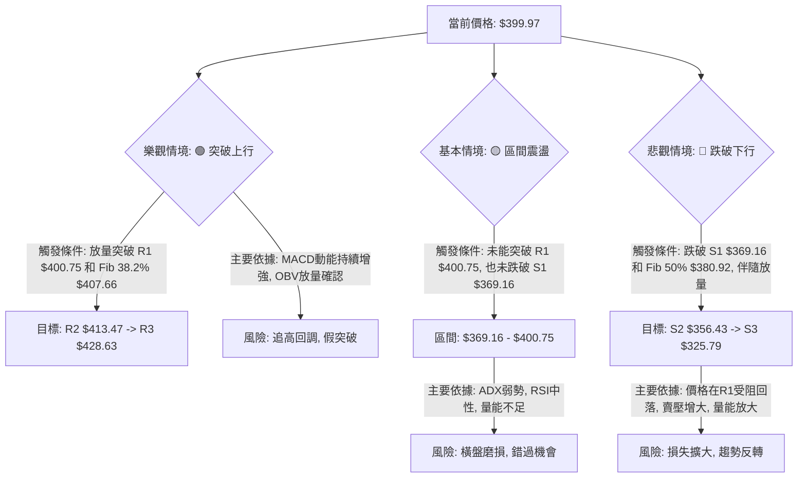

<details>
<summary>📊 靜態圖表 (點擊展開)</summary>

</details>

<html>
<head><meta charset="utf-8" /></head>
<body>
    <div style="height:500px; width:100%;">                        <script>window.PlotlyConfig = {MathJaxConfig: 'local'};</script>
        <script charset="utf-8" src="https://cdn.plot.ly/plotly-3.7.0.min.js" integrity="sha256-jvTGqxNp8AGWEcvNLVuKr+8j5dGe9Yw51LQkmDH+IYA=" crossorigin="anonymous"></script>                <div id="candlestick-chart" class="plotly-graph-div" style="height:100%; width:100%;"></div>            <script>                window.PLOTLYENV=window.PLOTLYENV || {};                                if (document.getElementById("candlestick-chart")) {                    Plotly.newPlot(                        "candlestick-chart",                        [{"close":{"dtype":"f8","bdata":"AAAAYNEQdUAAAACAtBZ1QAAAAKCh43RAAAAAwKbKdEAAAACAKWF0QAAAAKAkgXRAAAAAQIO4dEAAAACguQR1QAAAAKC\u002fB3VAAAAA4OzZdEAAAABAkOh0QAAAAGAxeXVAAAAAQI5xdUAAAABAIi10QAAAAOBkK3ZAAAAAIGVjdUAAAADg89V1QAAAAGDSAnZAAAAAoCG2dUAAAAAAs7R1QAAAAKABTHVAAAAA4HQmdUAAAADg8GV1QAAAAOCAAnZAAAAAYISAdkAAAABgQy53QAAAAIBD\u002fXdAAAAAoPNld0AAAAAAH\u002fl2QAAAAOB4iHZAAAAAoKjfdUAAAADgq092QAAAAKC7GXZAAAAA4Li3dUAAAADASEZ2QAAAACD633VAAAAAwNgTdkAAAACAXSF1QAAAAODSSHVAAAAA4NhLdUAAAACAoyl1QAAAACAeB3ZAAAAAIDKOdUAAAACg3SR1QAAAAKCofXdAAAAAACbud0AAAACAq7V4QAAAAOBtC3lAAAAAwNr+d0AAAADgGLd3QAAAAGDSp3dAAAAAQIGud0AAAAAgC0F4QAAAAODV7XhAAAAAoGlAeUAAAABgsqp5QAAAAICvQXlAAAAAQMledkAAAAAAqR51QAAAAABeNnVAAAAA4D9DdEAAAACAqoB0QAAAAEBpJ3VAAAAAQCZDdUAAAABgm8B1QAAAAED0znVAAAAA4GbtdUAAAAAgucF1QAAAAEAOyXVAAAAAwEaNdUAAAACggaV1QAAAAMCNYnVAAAAAACJodUAAAAAg1GN1QAAAAOAntHRAAAAAIEN7dUAAAABgre51QAAAAKDvFHZAAAAAAEgqdUAAAABALVx1QAAAAOC05nVAAAAAoBG2dEAAAADgfXl0QAAAAOC5RHRAAAAAgAHuc0AAAAAghjp0QAAAAAAZuXRAAAAAYEXAdEAAAABAQph0QAAAAEBYoXRAAAAA4FCedEAAAAAAePJzQAAAAOC1LnNAAAAAIO1Vc0AAAACgK7t0QAAAAMDXanVAAAAAYAwzdUAAAABACFh1QAAAAOBFn3RAAAAAAKA\u002fdEAAAADAHLV0QAAAAECTxHRAAAAAADrMdEAAAACg3bZ0QAAAAKAKknRAAAAA4LlEdEAAAAAgcrF0QAAAAABPCHRAAAAAAAnmc0AAAADgZdpzQAAAAMACi3NAAAAAYNXFc0AAAABAx7h0QAAAAABGlHRAAAAAYLKHdUAAAACgKVV1QAAAAOAPRXVAAAAAgMrrdEAAAABgpA90QAAAAOCjO3RAAAAAgBcCdEAAAADgU6xzQAAAAICo6nNAAAAAIO1Vc0AAAACgASB0QAAAAMCX3HNAAAAAQObkc0AAAACg5U5zQAAAACBHw3JAAAAAQCRPckAAAADAVVBzQAAAAADqj3NAAAAA4Nigc0AAAAAg7p5zQAAAAIAT13RAAAAAIDfhdUAAAABAliV2QAAAAOBnL3dAAAAAIGayd0AAAABA2sJ3QAAAAGB9wXhAAAAAIHLdeEAAAACgXF55QAAAAOD573hAAAAAYI0YeUAAAADAtl96QAAAAEBsNHpAAAAAwHhhekAAAACAoBh6QAAAAMAr83hAAAAAAPNMeUAAAACAUwx6QAAAACDUSXpAAAAAQHj9eUAAAACA9Kp6QAAAAKBIjHpAAAAAgIe+eUAAAADgINV6QAAAAEAMvHpAAAAA4DIqekAAAABAGgJ6QAAAAGCFcXtAAAAAQEqIekAAAAAguUB6QAAAACC6pnlAAAAAIJkRekAAAACAo955QAAAAADF13lAAAAAoH1VekAAAAAAGFN6QAAAAKB+nnpAAAAAQAbhe0AAAAAA5LN8QAAAAODxDH5AAAAAYJDnfUAAAAAA+CN6QAAAAIDtEXhAAAAAoJK\u002feEAAAAAgpXh4QAAAAEAxOHdAAAAAIF8PeEAAAADgddd3QAAAAIAUlXhAAAAA4NWBd0AAAABgd4R4QAAAAEAzq3lAAAAAgBSCeEAAAABgZsJ3QAAAAMAe4XdAAAAAYI+ud0AAAADgUdB2QAAAAEAzR3dAAAAAAACcd0AAAACgcBV3QAAAAEAzh3ZAAAAAYGZed0AAAADgeix3QAAAAEAKS3hAAAAAgMIReUAAAAAghf94QA=="},"high":{"dtype":"f8","bdata":"s5YC5rx0dUDxl4LM9CJ1QLMGmwLRAnVAqAbZowsTdUASCzu0YzJ1QIDBWvpHk3RAxlTX6BABdUCxZ+idw5p1QF+h3dqwZ3VATV3vJmVjdUDSFe+RnAN1QHfAkYK9iXVAnSAZ2v2VdUDBoGmQVsp1QIb+7PIIVnZAC0B3tnPLdUC5RY1pWlZ2QLTm34Fzk3ZATuppsDnQdUBwBzrZpCl2QGdtADhL0nVASgu9ISGhdUCQ44a0N4p1QDnIH\u002fDZRHZA9EtmpaeLdkDLBGcemz93QErPMBY4BXhAofIzNfIDeEC+o414V4t3QGJfs\u002fosTHdARoDBV03udkAvzmnNYq12QNiChHCWl3ZA3LCS5GMIdkDJAvZ\u002f5l92QGuNLtX4fXZAgdgYz+tNdkAS6vhdRvl1QEfBfLQZbXVA+5mqwcvjdUCMRf0bfqB1QEToELT3WnZAhrUwGr9fd0DwH55BhKp1QD6G4UfwvXdAbBTh3HgfeECLLae\u002fQ9p4QDxfNNYQDHlAwrukTHaTeEC3FVnO6XR4QAn\u002fLQy2wndAREkslwLcd0BG2WzmY3V4QEM5CtRSUHlAXZgrZJhKeUDA8IVQysR5QBSwWd5NcHlAg8QlN\u002fC9d0AHa5G5uH92QALYZrkDmXVA\u002fwjvftqKdUBgugV+hOJ0QGWTHXeTWHVA8FkV\u002foGPdUBkgsg\u002fM811QILIH\u002fAJ+XVAR2m2iUH\u002fdUAOCJIetdB1QGhJx1Qr9nVAYD8AzYjJdUB3zjV3YXV2QOwVpbehG3ZAoWFGgE28dUBtlWQrqsZ1QIS\u002fx6CyZnVAmO+VHtehdUDgOCQ4ngl2QFQ\u002fecO6YnZA5alZZXLWdUAsfEuBWMZ1QMe4SahXE3ZA39Cs8x2CdUD0mrqkFOl0QGFqiv4M\u002fHRAL8wYlu4MdEAJ3WcslHd0QKrlfIKA2HRAt2LU5t8rdUDepg3neOt0QCCQQQVXD3VA2A\u002fztTntdEB4kL6Ufxp1QCs1Ftll5XNAuREyLE5VdEC2m1b7U9x0QPh+v9i\u002f8HVA8n\u002f9UrmrdUCDvsDAz551QDPFPBNOkHVALLkL0nzRdEB3fmOeSOh0QAdT\u002fA09CnVA3tPrWSoTdUDZFnuayS11QAlYqFQfFHVAf+lFO65xdEC5Doqh1ep0QJg0JwMaVnRAAOoqfDXtc0C8BNao2O1zQAXjRPWHq3NA6TATLksXdEBzIG+DLu50QMoYif78Y3VAvk1cL2CzdUAF7lHAgP11QPIKcyKniHVA3BwV+VIpdUDV9nfRQBF1QM0suWjef3RAYbQC2c9jdEDB9Tnp7UN0QE7Y7i9WIXRAWXRFw0cFdEAcNBcObV90QD+RCLQyPnRA2bFLt5k8dECjyp4UtcZzQGZQrLs5MHNArnesOJ0Ec0C\u002f1nxSHV1zQIHwFP2ntHNA6soBeBWjc0BJ6dJ\u002fZr5zQCk+wpXz2XRAFNxAaEkZdkDbfzCYIWJ2QBuWI4NHf3dA11rXcCHEd0COh4iK0Np3QFH7hYs9x3hA3gMra8bweED64i6lZWF5QFkvJM1xXHlArMWZXmUveUCLT6IQgGh6QConpRobynpAuUeDQEGFekBthf3MT2F6QAuEdCuzUnlAPTQtBfxPeUA88OeZgBt6QOHJTWQFaHpAAb22bpByekAXesx4SAt7QAgtFmfQT3tApdjxlg6dekBlTVmDACV7QGMttZZvD3tA4tFgxJXKekAUGUH3fh96QAxatl2TmntA+roqbgQCe0CYJPWVfVV6QDmGNxiiFHpAfnQuA\u002f93ekCoM9EKU1l6QCG65qI4NXpAruQiS\u002fQpe0ArZsdw2wF7QPCCfC8E0HpAuRLI9gwDfED7Tc9FBBV9QKbzX\u002fPCgH5ArStRLnzjfkB1p+TA5Zx6QOUNUw2fnXlAZUyPPEEjeUB78DqRm3N5QGTPfaM0E3hAT1cZ8CZOeEAlBmJq8gV4QA8bS98uuXhAQgcSBbxyeEDJzck2RQB5QJ\u002fxKiPEwHlAAAAAgD3qeUAAAADgUXB4QAAAAADXS3hAAAAAwMxMeEAAAABAClt3QAAAACBcg3dAAAAAgOu5d0AAAAAAAFx3QAAAAAAAYHdAAAAAYI\u002fyd0AAAAAgXE93QAAAAKBwsXhAAAAA4FF4eUAAAABACid5QA=="},"hovertemplate":"\u003cb\u003e%{x|%Y-%m-%d}\u003c\u002fb\u003e\u003cbr\u003e\u958b: $%{open:.2f}\u003cbr\u003e\u9ad8: $%{high:.2f}\u003cbr\u003e\u4f4e: $%{low:.2f}\u003cbr\u003e\u6536: $%{close:.2f}\u003cextra\u003e\u003c\u002fextra\u003e","low":{"dtype":"f8","bdata":"WSfZ00TydEDQAqwLMr90QGoYvJ+dV3RAIdEnqs2LdED3207dl1t0QAqZWLvQLHRA2sZirhArdEBQCQNCG9Z0QChfzCjn3XRAZeuI2iDLdEBRqP7iKEx0QK4kDeJCrHRA1F9rNQwodUDPqGq95yN0QPxNG1ywWXVA7hGgQx0cdUA+EiytA5l1QOlGG1+tuHVAGPmwChgudUD\u002fpQ6VbJ51QBNL5dCGNnVAI4+zdj7adEA0FdArDCh1QHbd0w\u002fLznVAf0z9WZ4RdkDrphtwJ4h2QEfK7pPDMXdAkHdtkfb\u002fdkAwq96HC7F2QAw9wkJnf3ZALVoH1bPQdUCkZ4BNOcJ1QNM8z93o63VAM3\u002f+Ej\u002f2dECExc8IJAp2QNmGp6WKu3VAZdgyroXbdUDwmAOaw8R0QHeI3GCec3RARzedeTn6dEBoDLdnPtp0QDe6fuGt\u002fnRAuQl9Dxp0dUBNh4\u002feNp90QEVvcoSPm3VANhmuQtoad0CBHcNm\u002fNF3QGxEBoUlr3hAd36cHkPvd0AJg4ihxpp3QODo7JpZCXdA3J1C+Odmd0D5GAewDvB3QDajbRX3snhA6btP0uSUeEAotDsbVdV4QPc4xkbkf3hAyIqFfLsSdkCWMU7AEPp0QHEXN3AV03RAQ9S4YA\u002f6c0D+CF8qOR10QKKzNfefq3RAiY3rtrf\u002fdEDrfqOOwhR1QI9DNe3anXVAWR9lOJSndUApLLyHzHZ1QPu+v6RJwHVAeqPkuG+CdUA6X\u002fPXqoR1QAsvRWc99HRAV4Rr3SYMdUD3GGEtW+p0QBOWFoSXlHRAr8lDbmrEdECcDELFLTt1QPCxPx\u002f02XVAXqy9GhXTdEDz\u002flALqEZ1QCA0F6eYbHVAh\u002f3XxlCpdED5CNuGKTB0QBuq\u002fWQpO3RA45t\u002fi1CPc0DdKGsd88ZzQABjz70dXXRAjTzo8ANYdECbXWoYrPFzQDq3DMb\u002fcXRAZYbT895IdECGcdFWRjhzQMGBSIt1Y3JA5ymCpjAZc0ChT9bYObJzQJWdZqr7lnRAHkwcxXspdUCNW1bZPch0QHe2FnSbhXRA3zlVF\u002fk3dEDXvf2cYrJzQO60s8h2YHRAqtU5C4WHdECRKdEG7YV0QIOCKTcEQnRArI0TF7yUc0BaNNDMJIF0QG5bqwLMLHNAsJJJ0MtNc0BMAHMPKSFzQJvklU9ZJHNArHXhiohpc0C8Zoysgh10QL63VI0sY3RA4BwgtMEmdECG5jmCyTh1QKkidZyoD3VA5XaSTLGvdED0IWQ5AQR0QN+Ubk8q7nNAF92tyF7Bc0BKyW0WRaZzQIpbmDILNnNAyT2PXoVMc0DHkVvv6qZzQG84g9R6pXNAJ08LJ4PDc0A\u002f+T4+50pzQNyXDRddpnJA1GeeVAcYckAzLZqd8n1yQCAMQpvUX3NAG42M+F7UckDQtUucolxzQK2qQ+WpFHRAKDPt7NFfdUAvdyryHO91QL+BR1P\u002fg3ZARTaRuFYOd0CWVRv+mnt3QE7Q8ipfD3hAypQ0PK57eEDF4wQP2vJ4QIG7huRjtHhAULmv8CSfeEBRWJQFhkN5QNuV1pk8EnpAFpA+N2yDeUC3QEDbmN95QJGI9QZsoHhA7Tu6vXLCeECqdU\u002fPdTl5QKQBwecHynlAVqnQPCCOeUDym8t3\u002fyp6QKMLKNTqEXpA8p9pBIdaeUCJO+JuiNV5QPOhgaANhnpAuXP5+zt8eUDJ\u002fKC6kEJ5QBOH4MHu7nlA\u002fcPmoi8yekCv8vGIcdt5QOkBt5h\u002fU3lAkI7SiFGseUAZ47MXn515QFDx1g\u002f9mHlA1sogDXUFekBaXOdBT\u002f15QEykp1ux1XlAz1WlhpzsekB8Q7ziVph7QCy9Vih3W31ARYsgZ0p+fUAmpnWJ+CV5QNxc\u002f+ewD3hAPtgPm7RreEDSjWKr6ht3QNIA7wRWKXdAQF3NV24fd0D4CY3wd4Z3QCdbEXDGP3hATDQ9ftd9d0BIvom3ueB3QJ4BusPUS3lAAAAAYI9+eEAAAABgj4p3QAAAACBcj3dAAAAAQDNLd0AAAACgR712QAAAACBch3ZAAAAAgD0qd0AAAADgegB3QAAAAEDhRnZAAAAAQOEyd0AAAAAAKaB2QAAAAIA9jndAAAAAQOE+eEAAAABAM7t4QA=="},"name":"\u50f9\u683c","open":{"dtype":"f8","bdata":"Fypac4AldUCas1F63R11QJaWq\u002f0lsnRAgAOy7cr4dEBplIQ6CuJ0QLg74\u002fR7hHRAJeP+vCNldECxZ+idw5p1QMXfYa2MOXVAj04ab8TgdEBIKPqYbfJ0QEUdnr1av3RAfPMatit9dUBk8cZdcXd1QLnI4DXd7HVAOH0WKtzCdUAhi8uy6Qd2QMkdjEL8LHZARbnMG5a6dUBSqAapQP11QPNR\u002f7PKwHVAkRzSFtWVdUA0FdArDCh1QA7Fqlq66HVARhAfJGd4dkAplDIClol2QEfK7pPDMXdAofIzNfIDeEABYa8ml4J3QAYuNWnUHndADjD6DFpIdkCBEIjq8851QOttqFKmYXZAk1UYOHUDdkCXqnbPfD52QMyIfhyDT3ZAvCkpIbdAdkBhF\u002fI17tl1QO5Xpb32mXRARZpD2dEedUDflxgemVR1QBwGedT6LHVAMF36kF2\u002fdkBiV7CHyHN1QIR\u002fWqusnHVAFKxkqI7sd0AXrOjga\u002fZ3QJHZccf90XhArmuJj2SKeEA7+HIGViJ4QN\u002fwjcwdnndAxeNMne+od0DioGpnSQB4QBspyt\u002fKA3lAd9wC3XHIeEBuKfBXVv94QF4sKscuKXlAIGkx6Hqdd0Afd0i8+H12QDSJYKZb4nRA\u002fwjvftqKdUB4l1JNCuJ0QNINBJ63t3RAPsU4BimMdUCuD6BO8jh1QLL5N09y1nVA8\u002fjoNVjcdUDqY4LSCrd1QGSxMvL3ynVA51E9riTHdUD8uZltw\u002fd1QGTWuTMCF3ZAEf8qTmxldUCDYDZvIkd1QIv9achZWHVAHEjbW+AKdUCcDELFLTt1QFjKxKFb+XVAz2eZIAe7dUCPLGssa711QO6jimf8j3VAknWivmRtdUBzK7NAdeR0QKho+kXo4XRAg5NMxgzic0CdCNoqBepzQEB75KzLiHRA0yQGqrMZdUDnaWBdbrV0QK9Up5yEs3RA4IZtCpxOdEA6E5atEPh0QCs1Ftll5XNA9LKQLPuSc0AmaMWYze5zQC32mVzlmHRA85IzkR2jdUB41jxEb5h1QFlYi84WaXVAqMvx5DqKdEB2lptzG+hzQKnjrBv4hHRA4xiAu5q8dEDcfRYcPrJ0QA6zc0l9sHRAMRLuGLMVdECtKRr6aph0QM1e\u002fJbTVHRA3h5aivRYc0CxwM\u002fWl0NzQElToMCefXNALUzCj1eoc0AfLaePfY90QBo6qtIzcXRAbN\u002fPe8hgdEDLOfmrM7d1QLOxlWpSVXVADThOxAEIdUBXCYTwDAd1QAca0tYsTXRAD+le2gdJdEAAcvw5EPRzQLsz3sordXNAzyylKB\u002fvc0C2xqbQ9ddzQNJOn87o93NAWq+vqEghdECoCupZYZhzQG7OulQyKXNArsnnFlDGckAHnvq\u002fq65yQLAi0kb\u002fjXNALhmbPCQAc0D3dB6M\u002fqhzQGa4ZVxrY3RAVMRGYBvzdUDCqqKE5Pt1QGJkcwzqhXZAYV5VzjYRd0CTpxpk2JR3QPrZggU5VHhAq9FvdQOmeEDzav6gQwR5QDToKVbxUHlAI2AlPXbseEB3m8DsY2V5QIEWhaSPW3pAbA6ige+EekDK0TOeDD16QJEHpsTW+nhAc6oPX8wteUAOCbl80O15QDnGpPDx5nlARV8TPvIYekDpxldE5k96QMPeyZ\u002fyLXtAk1fKkHRSekCyZrWkLzJ6QD6QIL4br3pA48XbpCxsekBkVs93cvJ5QD8L8uAkAXpA+roqbgQCe0DyiiDY50t6QAYYLjfCknlAy1u96YXCeUCi6RgaWM55QOm4RNFIDXpAMefDV2sdekBanxl5X4Z6QDdNsLWXR3pAMgZoEkEEe0DwdJpyDxZ8QDiIFEVIgH5Au67XevjffkDtt\u002fHUf4V5QCFr8EF0b3lAzQkYib0feUAjBMsVmw95QOwO3MhazndAjI9vprFDd0BWYRuS0fF3QKl+lhYprnhA9\u002fcWf35ZeEA5A4s+iEF4QFE1wbTsjnlAAAAAYI\u002faeUAAAACA6513QAAAAIDrKXhAAAAAoEcpeEAAAABAMyd3QAAAAIDrWXdAAAAA4KNsd0AAAACA6z13QAAAACCu23ZAAAAAgMJZd0AAAADA9eh2QAAAAOBRmHdAAAAAQAojeUAAAAAAAOh4QA=="},"x":["2025-09-23T00:00:00-04:00","2025-09-24T00:00:00-04:00","2025-09-25T00:00:00-04:00","2025-09-26T00:00:00-04:00","2025-09-29T00:00:00-04:00","2025-09-30T00:00:00-04:00","2025-10-01T00:00:00-04:00","2025-10-02T00:00:00-04:00","2025-10-03T00:00:00-04:00","2025-10-06T00:00:00-04:00","2025-10-07T00:00:00-04:00","2025-10-08T00:00:00-04:00","2025-10-09T00:00:00-04:00","2025-10-10T00:00:00-04:00","2025-10-13T00:00:00-04:00","2025-10-14T00:00:00-04:00","2025-10-15T00:00:00-04:00","2025-10-16T00:00:00-04:00","2025-10-17T00:00:00-04:00","2025-10-20T00:00:00-04:00","2025-10-21T00:00:00-04:00","2025-10-22T00:00:00-04:00","2025-10-23T00:00:00-04:00","2025-10-24T00:00:00-04:00","2025-10-27T00:00:00-04:00","2025-10-28T00:00:00-04:00","2025-10-29T00:00:00-04:00","2025-10-30T00:00:00-04:00","2025-10-31T00:00:00-04:00","2025-11-03T00:00:00-05:00","2025-11-04T00:00:00-05:00","2025-11-05T00:00:00-05:00","2025-11-06T00:00:00-05:00","2025-11-07T00:00:00-05:00","2025-11-10T00:00:00-05:00","2025-11-11T00:00:00-05:00","2025-11-12T00:00:00-05:00","2025-11-13T00:00:00-05:00","2025-11-14T00:00:00-05:00","2025-11-17T00:00:00-05:00","2025-11-18T00:00:00-05:00","2025-11-19T00:00:00-05:00","2025-11-20T00:00:00-05:00","2025-11-21T00:00:00-05:00","2025-11-24T00:00:00-05:00","2025-11-25T00:00:00-05:00","2025-11-26T00:00:00-05:00","2025-11-28T00:00:00-05:00","2025-12-01T00:00:00-05:00","2025-12-02T00:00:00-05:00","2025-12-03T00:00:00-05:00","2025-12-04T00:00:00-05:00","2025-12-05T00:00:00-05:00","2025-12-08T00:00:00-05:00","2025-12-09T00:00:00-05:00","2025-12-10T00:00:00-05:00","2025-12-11T00:00:00-05:00","2025-12-12T00:00:00-05:00","2025-12-15T00:00:00-05:00","2025-12-16T00:00:00-05:00","2025-12-17T00:00:00-05:00","2025-12-18T00:00:00-05:00","2025-12-19T00:00:00-05:00","2025-12-22T00:00:00-05:00","2025-12-23T00:00:00-05:00","2025-12-24T00:00:00-05:00","2025-12-26T00:00:00-05:00","2025-12-29T00:00:00-05:00","2025-12-30T00:00:00-05:00","2025-12-31T00:00:00-05:00","2026-01-02T00:00:00-05:00","2026-01-05T00:00:00-05:00","2026-01-06T00:00:00-05:00","2026-01-07T00:00:00-05:00","2026-01-08T00:00:00-05:00","2026-01-09T00:00:00-05:00","2026-01-12T00:00:00-05:00","2026-01-13T00:00:00-05:00","2026-01-14T00:00:00-05:00","2026-01-15T00:00:00-05:00","2026-01-16T00:00:00-05:00","2026-01-20T00:00:00-05:00","2026-01-21T00:00:00-05:00","2026-01-22T00:00:00-05:00","2026-01-23T00:00:00-05:00","2026-01-26T00:00:00-05:00","2026-01-27T00:00:00-05:00","2026-01-28T00:00:00-05:00","2026-01-29T00:00:00-05:00","2026-01-30T00:00:00-05:00","2026-02-02T00:00:00-05:00","2026-02-03T00:00:00-05:00","2026-02-04T00:00:00-05:00","2026-02-05T00:00:00-05:00","2026-02-06T00:00:00-05:00","2026-02-09T00:00:00-05:00","2026-02-10T00:00:00-05:00","2026-02-11T00:00:00-05:00","2026-02-12T00:00:00-05:00","2026-02-13T00:00:00-05:00","2026-02-17T00:00:00-05:00","2026-02-18T00:00:00-05:00","2026-02-19T00:00:00-05:00","2026-02-20T00:00:00-05:00","2026-02-23T00:00:00-05:00","2026-02-24T00:00:00-05:00","2026-02-25T00:00:00-05:00","2026-02-26T00:00:00-05:00","2026-02-27T00:00:00-05:00","2026-03-02T00:00:00-05:00","2026-03-03T00:00:00-05:00","2026-03-04T00:00:00-05:00","2026-03-05T00:00:00-05:00","2026-03-06T00:00:00-05:00","2026-03-09T00:00:00-04:00","2026-03-10T00:00:00-04:00","2026-03-11T00:00:00-04:00","2026-03-12T00:00:00-04:00","2026-03-13T00:00:00-04:00","2026-03-16T00:00:00-04:00","2026-03-17T00:00:00-04:00","2026-03-18T00:00:00-04:00","2026-03-19T00:00:00-04:00","2026-03-20T00:00:00-04:00","2026-03-23T00:00:00-04:00","2026-03-24T00:00:00-04:00","2026-03-25T00:00:00-04:00","2026-03-26T00:00:00-04:00","2026-03-27T00:00:00-04:00","2026-03-30T00:00:00-04:00","2026-03-31T00:00:00-04:00","2026-04-01T00:00:00-04:00","2026-04-02T00:00:00-04:00","2026-04-06T00:00:00-04:00","2026-04-07T00:00:00-04:00","2026-04-08T00:00:00-04:00","2026-04-09T00:00:00-04:00","2026-04-10T00:00:00-04:00","2026-04-13T00:00:00-04:00","2026-04-14T00:00:00-04:00","2026-04-15T00:00:00-04:00","2026-04-16T00:00:00-04:00","2026-04-17T00:00:00-04:00","2026-04-20T00:00:00-04:00","2026-04-21T00:00:00-04:00","2026-04-22T00:00:00-04:00","2026-04-23T00:00:00-04:00","2026-04-24T00:00:00-04:00","2026-04-27T00:00:00-04:00","2026-04-28T00:00:00-04:00","2026-04-29T00:00:00-04:00","2026-04-30T00:00:00-04:00","2026-05-01T00:00:00-04:00","2026-05-04T00:00:00-04:00","2026-05-05T00:00:00-04:00","2026-05-06T00:00:00-04:00","2026-05-07T00:00:00-04:00","2026-05-08T00:00:00-04:00","2026-05-11T00:00:00-04:00","2026-05-12T00:00:00-04:00","2026-05-13T00:00:00-04:00","2026-05-14T00:00:00-04:00","2026-05-15T00:00:00-04:00","2026-05-18T00:00:00-04:00","2026-05-19T00:00:00-04:00","2026-05-20T00:00:00-04:00","2026-05-21T00:00:00-04:00","2026-05-22T00:00:00-04:00","2026-05-26T00:00:00-04:00","2026-05-27T00:00:00-04:00","2026-05-28T00:00:00-04:00","2026-05-29T00:00:00-04:00","2026-06-01T00:00:00-04:00","2026-06-02T00:00:00-04:00","2026-06-03T00:00:00-04:00","2026-06-04T00:00:00-04:00","2026-06-05T00:00:00-04:00","2026-06-08T00:00:00-04:00","2026-06-09T00:00:00-04:00","2026-06-10T00:00:00-04:00","2026-06-11T00:00:00-04:00","2026-06-12T00:00:00-04:00","2026-06-15T00:00:00-04:00","2026-06-16T00:00:00-04:00","2026-06-17T00:00:00-04:00","2026-06-18T00:00:00-04:00","2026-06-22T00:00:00-04:00","2026-06-23T00:00:00-04:00","2026-06-24T00:00:00-04:00","2026-06-25T00:00:00-04:00","2026-06-26T00:00:00-04:00","2026-06-29T00:00:00-04:00","2026-06-30T00:00:00-04:00","2026-07-01T00:00:00-04:00","2026-07-02T00:00:00-04:00","2026-07-06T00:00:00-04:00","2026-07-07T00:00:00-04:00","2026-07-08T00:00:00-04:00","2026-07-09T00:00:00-04:00","2026-07-10T00:00:00-04:00"],"type":"candlestick"},{"hovertemplate":"MA30: $%{y:.2f}\u003cextra\u003e\u003c\u002fextra\u003e","line":{"color":"#2196F3","dash":"dash","width":2},"mode":"lines","name":"MA30","x":["2025-09-23T00:00:00-04:00","2025-09-24T00:00:00-04:00","2025-09-25T00:00:00-04:00","2025-09-26T00:00:00-04:00","2025-09-29T00:00:00-04:00","2025-09-30T00:00:00-04:00","2025-10-01T00:00:00-04:00","2025-10-02T00:00:00-04:00","2025-10-03T00:00:00-04:00","2025-10-06T00:00:00-04:00","2025-10-07T00:00:00-04:00","2025-10-08T00:00:00-04:00","2025-10-09T00:00:00-04:00","2025-10-10T00:00:00-04:00","2025-10-13T00:00:00-04:00","2025-10-14T00:00:00-04:00","2025-10-15T00:00:00-04:00","2025-10-16T00:00:00-04:00","2025-10-17T00:00:00-04:00","2025-10-20T00:00:00-04:00","2025-10-21T00:00:00-04:00","2025-10-22T00:00:00-04:00","2025-10-23T00:00:00-04:00","2025-10-24T00:00:00-04:00","2025-10-27T00:00:00-04:00","2025-10-28T00:00:00-04:00","2025-10-29T00:00:00-04:00","2025-10-30T00:00:00-04:00","2025-10-31T00:00:00-04:00","2025-11-03T00:00:00-05:00","2025-11-04T00:00:00-05:00","2025-11-05T00:00:00-05:00","2025-11-06T00:00:00-05:00","2025-11-07T00:00:00-05:00","2025-11-10T00:00:00-05:00","2025-11-11T00:00:00-05:00","2025-11-12T00:00:00-05:00","2025-11-13T00:00:00-05:00","2025-11-14T00:00:00-05:00","2025-11-17T00:00:00-05:00","2025-11-18T00:00:00-05:00","2025-11-19T00:00:00-05:00","2025-11-20T00:00:00-05:00","2025-11-21T00:00:00-05:00","2025-11-24T00:00:00-05:00","2025-11-25T00:00:00-05:00","2025-11-26T00:00:00-05:00","2025-11-28T00:00:00-05:00","2025-12-01T00:00:00-05:00","2025-12-02T00:00:00-05:00","2025-12-03T00:00:00-05:00","2025-12-04T00:00:00-05:00","2025-12-05T00:00:00-05:00","2025-12-08T00:00:00-05:00","2025-12-09T00:00:00-05:00","2025-12-10T00:00:00-05:00","2025-12-11T00:00:00-05:00","2025-12-12T00:00:00-05:00","2025-12-15T00:00:00-05:00","2025-12-16T00:00:00-05:00","2025-12-17T00:00:00-05:00","2025-12-18T00:00:00-05:00","2025-12-19T00:00:00-05:00","2025-12-22T00:00:00-05:00","2025-12-23T00:00:00-05:00","2025-12-24T00:00:00-05:00","2025-12-26T00:00:00-05:00","2025-12-29T00:00:00-05:00","2025-12-30T00:00:00-05:00","2025-12-31T00:00:00-05:00","2026-01-02T00:00:00-05:00","2026-01-05T00:00:00-05:00","2026-01-06T00:00:00-05:00","2026-01-07T00:00:00-05:00","2026-01-08T00:00:00-05:00","2026-01-09T00:00:00-05:00","2026-01-12T00:00:00-05:00","2026-01-13T00:00:00-05:00","2026-01-14T00:00:00-05:00","2026-01-15T00:00:00-05:00","2026-01-16T00:00:00-05:00","2026-01-20T00:00:00-05:00","2026-01-21T00:00:00-05:00","2026-01-22T00:00:00-05:00","2026-01-23T00:00:00-05:00","2026-01-26T00:00:00-05:00","2026-01-27T00:00:00-05:00","2026-01-28T00:00:00-05:00","2026-01-29T00:00:00-05:00","2026-01-30T00:00:00-05:00","2026-02-02T00:00:00-05:00","2026-02-03T00:00:00-05:00","2026-02-04T00:00:00-05:00","2026-02-05T00:00:00-05:00","2026-02-06T00:00:00-05:00","2026-02-09T00:00:00-05:00","2026-02-10T00:00:00-05:00","2026-02-11T00:00:00-05:00","2026-02-12T00:00:00-05:00","2026-02-13T00:00:00-05:00","2026-02-17T00:00:00-05:00","2026-02-18T00:00:00-05:00","2026-02-19T00:00:00-05:00","2026-02-20T00:00:00-05:00","2026-02-23T00:00:00-05:00","2026-02-24T00:00:00-05:00","2026-02-25T00:00:00-05:00","2026-02-26T00:00:00-05:00","2026-02-27T00:00:00-05:00","2026-03-02T00:00:00-05:00","2026-03-03T00:00:00-05:00","2026-03-04T00:00:00-05:00","2026-03-05T00:00:00-05:00","2026-03-06T00:00:00-05:00","2026-03-09T00:00:00-04:00","2026-03-10T00:00:00-04:00","2026-03-11T00:00:00-04:00","2026-03-12T00:00:00-04:00","2026-03-13T00:00:00-04:00","2026-03-16T00:00:00-04:00","2026-03-17T00:00:00-04:00","2026-03-18T00:00:00-04:00","2026-03-19T00:00:00-04:00","2026-03-20T00:00:00-04:00","2026-03-23T00:00:00-04:00","2026-03-24T00:00:00-04:00","2026-03-25T00:00:00-04:00","2026-03-26T00:00:00-04:00","2026-03-27T00:00:00-04:00","2026-03-30T00:00:00-04:00","2026-03-31T00:00:00-04:00","2026-04-01T00:00:00-04:00","2026-04-02T00:00:00-04:00","2026-04-06T00:00:00-04:00","2026-04-07T00:00:00-04:00","2026-04-08T00:00:00-04:00","2026-04-09T00:00:00-04:00","2026-04-10T00:00:00-04:00","2026-04-13T00:00:00-04:00","2026-04-14T00:00:00-04:00","2026-04-15T00:00:00-04:00","2026-04-16T00:00:00-04:00","2026-04-17T00:00:00-04:00","2026-04-20T00:00:00-04:00","2026-04-21T00:00:00-04:00","2026-04-22T00:00:00-04:00","2026-04-23T00:00:00-04:00","2026-04-24T00:00:00-04:00","2026-04-27T00:00:00-04:00","2026-04-28T00:00:00-04:00","2026-04-29T00:00:00-04:00","2026-04-30T00:00:00-04:00","2026-05-01T00:00:00-04:00","2026-05-04T00:00:00-04:00","2026-05-05T00:00:00-04:00","2026-05-06T00:00:00-04:00","2026-05-07T00:00:00-04:00","2026-05-08T00:00:00-04:00","2026-05-11T00:00:00-04:00","2026-05-12T00:00:00-04:00","2026-05-13T00:00:00-04:00","2026-05-14T00:00:00-04:00","2026-05-15T00:00:00-04:00","2026-05-18T00:00:00-04:00","2026-05-19T00:00:00-04:00","2026-05-20T00:00:00-04:00","2026-05-21T00:00:00-04:00","2026-05-22T00:00:00-04:00","2026-05-26T00:00:00-04:00","2026-05-27T00:00:00-04:00","2026-05-28T00:00:00-04:00","2026-05-29T00:00:00-04:00","2026-06-01T00:00:00-04:00","2026-06-02T00:00:00-04:00","2026-06-03T00:00:00-04:00","2026-06-04T00:00:00-04:00","2026-06-05T00:00:00-04:00","2026-06-08T00:00:00-04:00","2026-06-09T00:00:00-04:00","2026-06-10T00:00:00-04:00","2026-06-11T00:00:00-04:00","2026-06-12T00:00:00-04:00","2026-06-15T00:00:00-04:00","2026-06-16T00:00:00-04:00","2026-06-17T00:00:00-04:00","2026-06-18T00:00:00-04:00","2026-06-22T00:00:00-04:00","2026-06-23T00:00:00-04:00","2026-06-24T00:00:00-04:00","2026-06-25T00:00:00-04:00","2026-06-26T00:00:00-04:00","2026-06-29T00:00:00-04:00","2026-06-30T00:00:00-04:00","2026-07-01T00:00:00-04:00","2026-07-02T00:00:00-04:00","2026-07-06T00:00:00-04:00","2026-07-07T00:00:00-04:00","2026-07-08T00:00:00-04:00","2026-07-09T00:00:00-04:00","2026-07-10T00:00:00-04:00"],"y":{"dtype":"f8","bdata":"AAAAAAAA+H8AAAAAAAD4fwAAAAAAAPh\u002fAAAAAAAA+H8AAAAAAAD4fwAAAAAAAPh\u002fAAAAAAAA+H8AAAAAAAD4fwAAAAAAAPh\u002fAAAAAAAA+H8AAAAAAAD4fwAAAAAAAPh\u002fAAAAAAAA+H8AAAAAAAD4fwAAAAAAAPh\u002fAAAAAAAA+H8AAAAAAAD4fwAAAAAAAPh\u002fAAAAAAAA+H8AAAAAAAD4fwAAAAAAAPh\u002fAAAAAAAA+H8AAAAAAAD4fwAAAAAAAPh\u002fAAAAAAAA+H8AAAAAAAD4fwAAAAAAAPh\u002fAAAAAAAA+H8AAAAAAAD4fxERETEllnVAvLu7OwqddUARERHheKd1QERERBTPsXVAVVVVFba5dUCrqqrK4cl1QDMzM5OT1XVA3t3dfSfhdUAzMzPjG+J1QCIiIjJH5HVAREREVBPodUAzMzOjPup1QKuqqrr57nVAAAAAIO7vdUCrqqoaMPh1QBEREaF2A3ZAmpmZuScZdkCJiIjYrTF2QFVVVeWQS3ZAiYiIiA5fdkAAAAAQNHB2QO\u002fu7p5UhHZAIiIiou6ZdkAAAABgTbJ2QLy7u5s2y3ZA7+7uLq3idkBVVVUV5Pd2QLy7u3u0AndA3t3dze75dkAiIiISHup2QImIiOjY3nZA7+7urhnRdkBERES0qsF2QEREROSWuXZAMzMzI7S1dkDNzMxsP7F2QJqZmSmusHZAmpmZGWavdkDNzMx8vrR2QLy7u7sEuXZAAAAAEDO7dkARERERVL92QJqZmcnXuXZAvLu7+5K4dkBERERErLp2QFVVVbXjonZAd3d3R\u002f6NdkBEREQkS3Z2QKuqqqoCXXZAREREpNtEdkCJiIi4wjB2QFVVVUXKIXZAd3d3N3EIdkBmZmbGMOh1QDMzM5NrwHVAREREtAGTdUBERETUmWR1QFVVVSXqPXVAMzMz8xgwdUDv7u4Onit1QGZmZmamJnVAAAAAgK8pdUBVVVUV8iR1QN7d3U0fFHVAd3d3d64DdUCrqqqK9\u002fp0QCIiIkKh93RAq6qqCmvxdEBVVVUl5e10QBERERH443RAiYiI6NjYdEC8u7uL1dB0QGZmZnaRy3RAAAAAEF\u002fGdEDNzMwcm8B0QBEREQF4v3RAiYiIGB61dEDe3d0Ni6p0QLy7uzsOmXRAVVVVVT+OdECrqqpaY4F0QBEREdFDbXRA7+7uzkFldECrqqraXWd0QImIiKgEanRAAAAAsKx3dECamZmJGIF0QGZmZubChXRAVVVVRTaHdECamZl5qIJ0QImIiJhEf3RAvLu7ew96dEAiIiLyuHd0QERERMT8fXRARERExPx9dEAzMzOz0Hh0QM3MzEyKa3RAVVVV5WZgdEAAAADgB090QM3MzAwqP3RAREREZJ0udEBERETkuCJ0QLy7u\u002ftuGHRAd3d3R3QOdEDv7u5+HwV0QHd3d5dsB3RAAAAAgCwVdECrqqoalCF0QFVVVVV7PHRAZmZm1uRcdEDNzMwMPn50QKuqqpq5qnRAMzMzwy3WdEAAAADg1P10QJqZmYkFI3VAzczMPHNBdUARERHxd2x1QO\u002fu7p6UlnVA7+7ufivFdUDe3d1dq\u002fh1QBEREaHrIHZAREREFBVOdkB3d3d3e4R2QJqZmcnaunZAERERsaPzdkBmZmaWeCt3QERERASHZHdAq6qqynKWd0B3d3f3p9Z3QJqZmYmuGnhA7+7ujrddeEBVVVW115Z4QO\u002fu7p4Y2nhAzczMzAIVeUAiIiKimk15QImIiLiodnlAiYiIuGeaeUDe3d1tLLp5QDMzMzPa0HlAvLu7+1rneUCJiIjoOv15QJqZmVkhDXpAzczMfNkmekDv7u7uTEN6QM3MzMzubnpA7+7ubveXekC8u7ub+ZV6QO\u002fu7i7Cg3pAzczMHNR1ekBmZmZm9md6QBEREVEyWXpAIiIiUpxOekAiIiIiyDt6QGZmZjY5LXpAIiIiIgkYekARERGhrwV6QKuqquou\u002fnlAzczMjKLzeUAiIiIiadl5QCIiIuILwXlARERExNureUCrqqpamZB5QFVVVRUObXlAzczMrBxUeUCamZm5ETl5QImIiBhrHnlA7+7u3mAHeUBERESEX\u002fB4QHd3dxcm43hAZmZmllvYeEBERETkCc14QA=="},"type":"scatter"},{"hovertemplate":"MA60: $%{y:.2f}\u003cextra\u003e\u003c\u002fextra\u003e","line":{"color":"#9C27B0","dash":"dash","width":2},"mode":"lines","name":"MA60","x":["2025-09-23T00:00:00-04:00","2025-09-24T00:00:00-04:00","2025-09-25T00:00:00-04:00","2025-09-26T00:00:00-04:00","2025-09-29T00:00:00-04:00","2025-09-30T00:00:00-04:00","2025-10-01T00:00:00-04:00","2025-10-02T00:00:00-04:00","2025-10-03T00:00:00-04:00","2025-10-06T00:00:00-04:00","2025-10-07T00:00:00-04:00","2025-10-08T00:00:00-04:00","2025-10-09T00:00:00-04:00","2025-10-10T00:00:00-04:00","2025-10-13T00:00:00-04:00","2025-10-14T00:00:00-04:00","2025-10-15T00:00:00-04:00","2025-10-16T00:00:00-04:00","2025-10-17T00:00:00-04:00","2025-10-20T00:00:00-04:00","2025-10-21T00:00:00-04:00","2025-10-22T00:00:00-04:00","2025-10-23T00:00:00-04:00","2025-10-24T00:00:00-04:00","2025-10-27T00:00:00-04:00","2025-10-28T00:00:00-04:00","2025-10-29T00:00:00-04:00","2025-10-30T00:00:00-04:00","2025-10-31T00:00:00-04:00","2025-11-03T00:00:00-05:00","2025-11-04T00:00:00-05:00","2025-11-05T00:00:00-05:00","2025-11-06T00:00:00-05:00","2025-11-07T00:00:00-05:00","2025-11-10T00:00:00-05:00","2025-11-11T00:00:00-05:00","2025-11-12T00:00:00-05:00","2025-11-13T00:00:00-05:00","2025-11-14T00:00:00-05:00","2025-11-17T00:00:00-05:00","2025-11-18T00:00:00-05:00","2025-11-19T00:00:00-05:00","2025-11-20T00:00:00-05:00","2025-11-21T00:00:00-05:00","2025-11-24T00:00:00-05:00","2025-11-25T00:00:00-05:00","2025-11-26T00:00:00-05:00","2025-11-28T00:00:00-05:00","2025-12-01T00:00:00-05:00","2025-12-02T00:00:00-05:00","2025-12-03T00:00:00-05:00","2025-12-04T00:00:00-05:00","2025-12-05T00:00:00-05:00","2025-12-08T00:00:00-05:00","2025-12-09T00:00:00-05:00","2025-12-10T00:00:00-05:00","2025-12-11T00:00:00-05:00","2025-12-12T00:00:00-05:00","2025-12-15T00:00:00-05:00","2025-12-16T00:00:00-05:00","2025-12-17T00:00:00-05:00","2025-12-18T00:00:00-05:00","2025-12-19T00:00:00-05:00","2025-12-22T00:00:00-05:00","2025-12-23T00:00:00-05:00","2025-12-24T00:00:00-05:00","2025-12-26T00:00:00-05:00","2025-12-29T00:00:00-05:00","2025-12-30T00:00:00-05:00","2025-12-31T00:00:00-05:00","2026-01-02T00:00:00-05:00","2026-01-05T00:00:00-05:00","2026-01-06T00:00:00-05:00","2026-01-07T00:00:00-05:00","2026-01-08T00:00:00-05:00","2026-01-09T00:00:00-05:00","2026-01-12T00:00:00-05:00","2026-01-13T00:00:00-05:00","2026-01-14T00:00:00-05:00","2026-01-15T00:00:00-05:00","2026-01-16T00:00:00-05:00","2026-01-20T00:00:00-05:00","2026-01-21T00:00:00-05:00","2026-01-22T00:00:00-05:00","2026-01-23T00:00:00-05:00","2026-01-26T00:00:00-05:00","2026-01-27T00:00:00-05:00","2026-01-28T00:00:00-05:00","2026-01-29T00:00:00-05:00","2026-01-30T00:00:00-05:00","2026-02-02T00:00:00-05:00","2026-02-03T00:00:00-05:00","2026-02-04T00:00:00-05:00","2026-02-05T00:00:00-05:00","2026-02-06T00:00:00-05:00","2026-02-09T00:00:00-05:00","2026-02-10T00:00:00-05:00","2026-02-11T00:00:00-05:00","2026-02-12T00:00:00-05:00","2026-02-13T00:00:00-05:00","2026-02-17T00:00:00-05:00","2026-02-18T00:00:00-05:00","2026-02-19T00:00:00-05:00","2026-02-20T00:00:00-05:00","2026-02-23T00:00:00-05:00","2026-02-24T00:00:00-05:00","2026-02-25T00:00:00-05:00","2026-02-26T00:00:00-05:00","2026-02-27T00:00:00-05:00","2026-03-02T00:00:00-05:00","2026-03-03T00:00:00-05:00","2026-03-04T00:00:00-05:00","2026-03-05T00:00:00-05:00","2026-03-06T00:00:00-05:00","2026-03-09T00:00:00-04:00","2026-03-10T00:00:00-04:00","2026-03-11T00:00:00-04:00","2026-03-12T00:00:00-04:00","2026-03-13T00:00:00-04:00","2026-03-16T00:00:00-04:00","2026-03-17T00:00:00-04:00","2026-03-18T00:00:00-04:00","2026-03-19T00:00:00-04:00","2026-03-20T00:00:00-04:00","2026-03-23T00:00:00-04:00","2026-03-24T00:00:00-04:00","2026-03-25T00:00:00-04:00","2026-03-26T00:00:00-04:00","2026-03-27T00:00:00-04:00","2026-03-30T00:00:00-04:00","2026-03-31T00:00:00-04:00","2026-04-01T00:00:00-04:00","2026-04-02T00:00:00-04:00","2026-04-06T00:00:00-04:00","2026-04-07T00:00:00-04:00","2026-04-08T00:00:00-04:00","2026-04-09T00:00:00-04:00","2026-04-10T00:00:00-04:00","2026-04-13T00:00:00-04:00","2026-04-14T00:00:00-04:00","2026-04-15T00:00:00-04:00","2026-04-16T00:00:00-04:00","2026-04-17T00:00:00-04:00","2026-04-20T00:00:00-04:00","2026-04-21T00:00:00-04:00","2026-04-22T00:00:00-04:00","2026-04-23T00:00:00-04:00","2026-04-24T00:00:00-04:00","2026-04-27T00:00:00-04:00","2026-04-28T00:00:00-04:00","2026-04-29T00:00:00-04:00","2026-04-30T00:00:00-04:00","2026-05-01T00:00:00-04:00","2026-05-04T00:00:00-04:00","2026-05-05T00:00:00-04:00","2026-05-06T00:00:00-04:00","2026-05-07T00:00:00-04:00","2026-05-08T00:00:00-04:00","2026-05-11T00:00:00-04:00","2026-05-12T00:00:00-04:00","2026-05-13T00:00:00-04:00","2026-05-14T00:00:00-04:00","2026-05-15T00:00:00-04:00","2026-05-18T00:00:00-04:00","2026-05-19T00:00:00-04:00","2026-05-20T00:00:00-04:00","2026-05-21T00:00:00-04:00","2026-05-22T00:00:00-04:00","2026-05-26T00:00:00-04:00","2026-05-27T00:00:00-04:00","2026-05-28T00:00:00-04:00","2026-05-29T00:00:00-04:00","2026-06-01T00:00:00-04:00","2026-06-02T00:00:00-04:00","2026-06-03T00:00:00-04:00","2026-06-04T00:00:00-04:00","2026-06-05T00:00:00-04:00","2026-06-08T00:00:00-04:00","2026-06-09T00:00:00-04:00","2026-06-10T00:00:00-04:00","2026-06-11T00:00:00-04:00","2026-06-12T00:00:00-04:00","2026-06-15T00:00:00-04:00","2026-06-16T00:00:00-04:00","2026-06-17T00:00:00-04:00","2026-06-18T00:00:00-04:00","2026-06-22T00:00:00-04:00","2026-06-23T00:00:00-04:00","2026-06-24T00:00:00-04:00","2026-06-25T00:00:00-04:00","2026-06-26T00:00:00-04:00","2026-06-29T00:00:00-04:00","2026-06-30T00:00:00-04:00","2026-07-01T00:00:00-04:00","2026-07-02T00:00:00-04:00","2026-07-06T00:00:00-04:00","2026-07-07T00:00:00-04:00","2026-07-08T00:00:00-04:00","2026-07-09T00:00:00-04:00","2026-07-10T00:00:00-04:00"],"y":{"dtype":"f8","bdata":"AAAAAAAA+H8AAAAAAAD4fwAAAAAAAPh\u002fAAAAAAAA+H8AAAAAAAD4fwAAAAAAAPh\u002fAAAAAAAA+H8AAAAAAAD4fwAAAAAAAPh\u002fAAAAAAAA+H8AAAAAAAD4fwAAAAAAAPh\u002fAAAAAAAA+H8AAAAAAAD4fwAAAAAAAPh\u002fAAAAAAAA+H8AAAAAAAD4fwAAAAAAAPh\u002fAAAAAAAA+H8AAAAAAAD4fwAAAAAAAPh\u002fAAAAAAAA+H8AAAAAAAD4fwAAAAAAAPh\u002fAAAAAAAA+H8AAAAAAAD4fwAAAAAAAPh\u002fAAAAAAAA+H8AAAAAAAD4fwAAAAAAAPh\u002fAAAAAAAA+H8AAAAAAAD4fwAAAAAAAPh\u002fAAAAAAAA+H8AAAAAAAD4fwAAAAAAAPh\u002fAAAAAAAA+H8AAAAAAAD4fwAAAAAAAPh\u002fAAAAAAAA+H8AAAAAAAD4fwAAAAAAAPh\u002fAAAAAAAA+H8AAAAAAAD4fwAAAAAAAPh\u002fAAAAAAAA+H8AAAAAAAD4fwAAAAAAAPh\u002fAAAAAAAA+H8AAAAAAAD4fwAAAAAAAPh\u002fAAAAAAAA+H8AAAAAAAD4fwAAAAAAAPh\u002fAAAAAAAA+H8AAAAAAAD4fwAAAAAAAPh\u002fAAAAAAAA+H8AAAAAAAD4f83MzAx\u002fOnZAVVVV9RE3dkCrqqrKkTR2QERERPyyNXZAREREHLU3dkC8u7ubkD12QGZmZt4gQ3ZAvLu7y0ZIdkAAAAAwbUt2QO\u002fu7valTnZAIiIiMqNRdkAiIiJayVR2QCIiIsJoVHZA3t3djUBUdkB3d3cvbll2QDMzMystU3ZAiYiIAJNTdkBmZmZ+\u002fFN2QAAAAMhJVHZAZmZmFvVRdkBERERke1B2QCIiInIPU3ZAzczM7C9RdkAzMzMTP012QHd3dxfRRXZAmpmZcdc6dkDNzMz0Pi52QImIiFBPIHZAiYiI4AMVdkCJiIgQ3gp2QHd3d6e\u002fAnZAd3d3l2T9dUDNzMxkTvN1QBERERnb5nVAVVVVTbHcdUC8u7t7G9Z1QN7d3bUn1HVAIiIikmjQdUARERHRUdF1QGZmZmZ+znVARERE\u002fAXKdUBmZmbOFMh1QAAAAKC0wnVA3t3dBXm\u002fdUCJiIiwo711QDMzM9stsXVAAAAAMI6hdUAREREZa5B1QDMzM3MIe3VAzczMfI1pdUCamZkJE1l1QDMzMwuHR3VAMzMzg9k2dUCJiIhQxyd1QN7d3R04FXVAIiIiMlcFdUDv7u4u2fJ0QN7d3YXW4XRAREREnKfbdEBEREREI9d0QHd3d3\u002f10nRA3t3dfd\u002fRdEC8u7uDVc50QBEREQkOyXRA3t3dndXAdEDv7u4e5Ll0QHd3d8eVsXRAAAAA+OiodECrqqqCdp50QO\u002fu7g6RkXRAZmZmJruDdEAAAAA4x3l0QBERETkAcnRAvLu7q2lqdEDe3d1N3WJ0QERERExyY3RARERETCVldEBERESUD2Z0QImIiMjEanRA3t3dFZJ1dEC8u7uz0H90QN7d3bX+i3RAERERybeddEBVVVVdmbJ0QBERERmFxnRAZmZm9o\u002fcdEBVVVU9yPZ0QKuqqsIrDnVAIiIi4jAmdUC8u7vrqT11QM3MzBwYUHVAAAAASBJkdUDNzMw0Gn51QO\u002fu7sZrnHVAq6qqOtC4dUDNzMykJNJ1QImIiKgI6HVAAAAA2Gz7dUC8u7vr1xJ2QDMzM0vsLHZAmpmZeSpGdkDNzMxMyFx2QFVVVc1DeXZAIiIiiruRdkCJiIgQXal2QAAAAKgKv3ZAREREHMrXdkBERERE4O12QERERMSqBndAERER6R8id0Crqqp6vD13QCIiInrtW3dAAAAAoIN+d0B3d3fnkKB3QDMzMyv6yHdA3t3dVbXsd0BmZmbGOAF4QO\u002fu7mYrDXhA3t3dzX8deEAiIiLiUDB4QBEREfkOPXhAMzMzs1hOeEDNzMzMIWB4QAAAAAAKdHhAmpmZadaFeEC8u7sblJh4QHd3d\u002fdasXhAvLu7qwrFeEDNzMyMCNh4QN7d3TXd7XhAmpmZqckEeUAAAACIuBN5QCIiIlqTI3lAzczMvI80eUDe3d0tVkN5QImIiOiJSnlAvLu7S+RQeUARERH5RVV5QFVVVSUAWnlAERERSdtfeUBmZmZmImV5QA=="},"type":"scatter"},{"hovertemplate":"MA200: $%{y:.2f}\u003cextra\u003e\u003c\u002fextra\u003e","line":{"color":"#FF6F00","dash":"solid","width":2},"mode":"lines","name":"MA200","x":["2025-09-23T00:00:00-04:00","2025-09-24T00:00:00-04:00","2025-09-25T00:00:00-04:00","2025-09-26T00:00:00-04:00","2025-09-29T00:00:00-04:00","2025-09-30T00:00:00-04:00","2025-10-01T00:00:00-04:00","2025-10-02T00:00:00-04:00","2025-10-03T00:00:00-04:00","2025-10-06T00:00:00-04:00","2025-10-07T00:00:00-04:00","2025-10-08T00:00:00-04:00","2025-10-09T00:00:00-04:00","2025-10-10T00:00:00-04:00","2025-10-13T00:00:00-04:00","2025-10-14T00:00:00-04:00","2025-10-15T00:00:00-04:00","2025-10-16T00:00:00-04:00","2025-10-17T00:00:00-04:00","2025-10-20T00:00:00-04:00","2025-10-21T00:00:00-04:00","2025-10-22T00:00:00-04:00","2025-10-23T00:00:00-04:00","2025-10-24T00:00:00-04:00","2025-10-27T00:00:00-04:00","2025-10-28T00:00:00-04:00","2025-10-29T00:00:00-04:00","2025-10-30T00:00:00-04:00","2025-10-31T00:00:00-04:00","2025-11-03T00:00:00-05:00","2025-11-04T00:00:00-05:00","2025-11-05T00:00:00-05:00","2025-11-06T00:00:00-05:00","2025-11-07T00:00:00-05:00","2025-11-10T00:00:00-05:00","2025-11-11T00:00:00-05:00","2025-11-12T00:00:00-05:00","2025-11-13T00:00:00-05:00","2025-11-14T00:00:00-05:00","2025-11-17T00:00:00-05:00","2025-11-18T00:00:00-05:00","2025-11-19T00:00:00-05:00","2025-11-20T00:00:00-05:00","2025-11-21T00:00:00-05:00","2025-11-24T00:00:00-05:00","2025-11-25T00:00:00-05:00","2025-11-26T00:00:00-05:00","2025-11-28T00:00:00-05:00","2025-12-01T00:00:00-05:00","2025-12-02T00:00:00-05:00","2025-12-03T00:00:00-05:00","2025-12-04T00:00:00-05:00","2025-12-05T00:00:00-05:00","2025-12-08T00:00:00-05:00","2025-12-09T00:00:00-05:00","2025-12-10T00:00:00-05:00","2025-12-11T00:00:00-05:00","2025-12-12T00:00:00-05:00","2025-12-15T00:00:00-05:00","2025-12-16T00:00:00-05:00","2025-12-17T00:00:00-05:00","2025-12-18T00:00:00-05:00","2025-12-19T00:00:00-05:00","2025-12-22T00:00:00-05:00","2025-12-23T00:00:00-05:00","2025-12-24T00:00:00-05:00","2025-12-26T00:00:00-05:00","2025-12-29T00:00:00-05:00","2025-12-30T00:00:00-05:00","2025-12-31T00:00:00-05:00","2026-01-02T00:00:00-05:00","2026-01-05T00:00:00-05:00","2026-01-06T00:00:00-05:00","2026-01-07T00:00:00-05:00","2026-01-08T00:00:00-05:00","2026-01-09T00:00:00-05:00","2026-01-12T00:00:00-05:00","2026-01-13T00:00:00-05:00","2026-01-14T00:00:00-05:00","2026-01-15T00:00:00-05:00","2026-01-16T00:00:00-05:00","2026-01-20T00:00:00-05:00","2026-01-21T00:00:00-05:00","2026-01-22T00:00:00-05:00","2026-01-23T00:00:00-05:00","2026-01-26T00:00:00-05:00","2026-01-27T00:00:00-05:00","2026-01-28T00:00:00-05:00","2026-01-29T00:00:00-05:00","2026-01-30T00:00:00-05:00","2026-02-02T00:00:00-05:00","2026-02-03T00:00:00-05:00","2026-02-04T00:00:00-05:00","2026-02-05T00:00:00-05:00","2026-02-06T00:00:00-05:00","2026-02-09T00:00:00-05:00","2026-02-10T00:00:00-05:00","2026-02-11T00:00:00-05:00","2026-02-12T00:00:00-05:00","2026-02-13T00:00:00-05:00","2026-02-17T00:00:00-05:00","2026-02-18T00:00:00-05:00","2026-02-19T00:00:00-05:00","2026-02-20T00:00:00-05:00","2026-02-23T00:00:00-05:00","2026-02-24T00:00:00-05:00","2026-02-25T00:00:00-05:00","2026-02-26T00:00:00-05:00","2026-02-27T00:00:00-05:00","2026-03-02T00:00:00-05:00","2026-03-03T00:00:00-05:00","2026-03-04T00:00:00-05:00","2026-03-05T00:00:00-05:00","2026-03-06T00:00:00-05:00","2026-03-09T00:00:00-04:00","2026-03-10T00:00:00-04:00","2026-03-11T00:00:00-04:00","2026-03-12T00:00:00-04:00","2026-03-13T00:00:00-04:00","2026-03-16T00:00:00-04:00","2026-03-17T00:00:00-04:00","2026-03-18T00:00:00-04:00","2026-03-19T00:00:00-04:00","2026-03-20T00:00:00-04:00","2026-03-23T00:00:00-04:00","2026-03-24T00:00:00-04:00","2026-03-25T00:00:00-04:00","2026-03-26T00:00:00-04:00","2026-03-27T00:00:00-04:00","2026-03-30T00:00:00-04:00","2026-03-31T00:00:00-04:00","2026-04-01T00:00:00-04:00","2026-04-02T00:00:00-04:00","2026-04-06T00:00:00-04:00","2026-04-07T00:00:00-04:00","2026-04-08T00:00:00-04:00","2026-04-09T00:00:00-04:00","2026-04-10T00:00:00-04:00","2026-04-13T00:00:00-04:00","2026-04-14T00:00:00-04:00","2026-04-15T00:00:00-04:00","2026-04-16T00:00:00-04:00","2026-04-17T00:00:00-04:00","2026-04-20T00:00:00-04:00","2026-04-21T00:00:00-04:00","2026-04-22T00:00:00-04:00","2026-04-23T00:00:00-04:00","2026-04-24T00:00:00-04:00","2026-04-27T00:00:00-04:00","2026-04-28T00:00:00-04:00","2026-04-29T00:00:00-04:00","2026-04-30T00:00:00-04:00","2026-05-01T00:00:00-04:00","2026-05-04T00:00:00-04:00","2026-05-05T00:00:00-04:00","2026-05-06T00:00:00-04:00","2026-05-07T00:00:00-04:00","2026-05-08T00:00:00-04:00","2026-05-11T00:00:00-04:00","2026-05-12T00:00:00-04:00","2026-05-13T00:00:00-04:00","2026-05-14T00:00:00-04:00","2026-05-15T00:00:00-04:00","2026-05-18T00:00:00-04:00","2026-05-19T00:00:00-04:00","2026-05-20T00:00:00-04:00","2026-05-21T00:00:00-04:00","2026-05-22T00:00:00-04:00","2026-05-26T00:00:00-04:00","2026-05-27T00:00:00-04:00","2026-05-28T00:00:00-04:00","2026-05-29T00:00:00-04:00","2026-06-01T00:00:00-04:00","2026-06-02T00:00:00-04:00","2026-06-03T00:00:00-04:00","2026-06-04T00:00:00-04:00","2026-06-05T00:00:00-04:00","2026-06-08T00:00:00-04:00","2026-06-09T00:00:00-04:00","2026-06-10T00:00:00-04:00","2026-06-11T00:00:00-04:00","2026-06-12T00:00:00-04:00","2026-06-15T00:00:00-04:00","2026-06-16T00:00:00-04:00","2026-06-17T00:00:00-04:00","2026-06-18T00:00:00-04:00","2026-06-22T00:00:00-04:00","2026-06-23T00:00:00-04:00","2026-06-24T00:00:00-04:00","2026-06-25T00:00:00-04:00","2026-06-26T00:00:00-04:00","2026-06-29T00:00:00-04:00","2026-06-30T00:00:00-04:00","2026-07-01T00:00:00-04:00","2026-07-02T00:00:00-04:00","2026-07-06T00:00:00-04:00","2026-07-07T00:00:00-04:00","2026-07-08T00:00:00-04:00","2026-07-09T00:00:00-04:00","2026-07-10T00:00:00-04:00"],"y":{"dtype":"f8","bdata":"AAAAAAAA+H8AAAAAAAD4fwAAAAAAAPh\u002fAAAAAAAA+H8AAAAAAAD4fwAAAAAAAPh\u002fAAAAAAAA+H8AAAAAAAD4fwAAAAAAAPh\u002fAAAAAAAA+H8AAAAAAAD4fwAAAAAAAPh\u002fAAAAAAAA+H8AAAAAAAD4fwAAAAAAAPh\u002fAAAAAAAA+H8AAAAAAAD4fwAAAAAAAPh\u002fAAAAAAAA+H8AAAAAAAD4fwAAAAAAAPh\u002fAAAAAAAA+H8AAAAAAAD4fwAAAAAAAPh\u002fAAAAAAAA+H8AAAAAAAD4fwAAAAAAAPh\u002fAAAAAAAA+H8AAAAAAAD4fwAAAAAAAPh\u002fAAAAAAAA+H8AAAAAAAD4fwAAAAAAAPh\u002fAAAAAAAA+H8AAAAAAAD4fwAAAAAAAPh\u002fAAAAAAAA+H8AAAAAAAD4fwAAAAAAAPh\u002fAAAAAAAA+H8AAAAAAAD4fwAAAAAAAPh\u002fAAAAAAAA+H8AAAAAAAD4fwAAAAAAAPh\u002fAAAAAAAA+H8AAAAAAAD4fwAAAAAAAPh\u002fAAAAAAAA+H8AAAAAAAD4fwAAAAAAAPh\u002fAAAAAAAA+H8AAAAAAAD4fwAAAAAAAPh\u002fAAAAAAAA+H8AAAAAAAD4fwAAAAAAAPh\u002fAAAAAAAA+H8AAAAAAAD4fwAAAAAAAPh\u002fAAAAAAAA+H8AAAAAAAD4fwAAAAAAAPh\u002fAAAAAAAA+H8AAAAAAAD4fwAAAAAAAPh\u002fAAAAAAAA+H8AAAAAAAD4fwAAAAAAAPh\u002fAAAAAAAA+H8AAAAAAAD4fwAAAAAAAPh\u002fAAAAAAAA+H8AAAAAAAD4fwAAAAAAAPh\u002fAAAAAAAA+H8AAAAAAAD4fwAAAAAAAPh\u002fAAAAAAAA+H8AAAAAAAD4fwAAAAAAAPh\u002fAAAAAAAA+H8AAAAAAAD4fwAAAAAAAPh\u002fAAAAAAAA+H8AAAAAAAD4fwAAAAAAAPh\u002fAAAAAAAA+H8AAAAAAAD4fwAAAAAAAPh\u002fAAAAAAAA+H8AAAAAAAD4fwAAAAAAAPh\u002fAAAAAAAA+H8AAAAAAAD4fwAAAAAAAPh\u002fAAAAAAAA+H8AAAAAAAD4fwAAAAAAAPh\u002fAAAAAAAA+H8AAAAAAAD4fwAAAAAAAPh\u002fAAAAAAAA+H8AAAAAAAD4fwAAAAAAAPh\u002fAAAAAAAA+H8AAAAAAAD4fwAAAAAAAPh\u002fAAAAAAAA+H8AAAAAAAD4fwAAAAAAAPh\u002fAAAAAAAA+H8AAAAAAAD4fwAAAAAAAPh\u002fAAAAAAAA+H8AAAAAAAD4fwAAAAAAAPh\u002fAAAAAAAA+H8AAAAAAAD4fwAAAAAAAPh\u002fAAAAAAAA+H8AAAAAAAD4fwAAAAAAAPh\u002fAAAAAAAA+H8AAAAAAAD4fwAAAAAAAPh\u002fAAAAAAAA+H8AAAAAAAD4fwAAAAAAAPh\u002fAAAAAAAA+H8AAAAAAAD4fwAAAAAAAPh\u002fAAAAAAAA+H8AAAAAAAD4fwAAAAAAAPh\u002fAAAAAAAA+H8AAAAAAAD4fwAAAAAAAPh\u002fAAAAAAAA+H8AAAAAAAD4fwAAAAAAAPh\u002fAAAAAAAA+H8AAAAAAAD4fwAAAAAAAPh\u002fAAAAAAAA+H8AAAAAAAD4fwAAAAAAAPh\u002fAAAAAAAA+H8AAAAAAAD4fwAAAAAAAPh\u002fAAAAAAAA+H8AAAAAAAD4fwAAAAAAAPh\u002fAAAAAAAA+H8AAAAAAAD4fwAAAAAAAPh\u002fAAAAAAAA+H8AAAAAAAD4fwAAAAAAAPh\u002fAAAAAAAA+H8AAAAAAAD4fwAAAAAAAPh\u002fAAAAAAAA+H8AAAAAAAD4fwAAAAAAAPh\u002fAAAAAAAA+H8AAAAAAAD4fwAAAAAAAPh\u002fAAAAAAAA+H8AAAAAAAD4fwAAAAAAAPh\u002fAAAAAAAA+H8AAAAAAAD4fwAAAAAAAPh\u002fAAAAAAAA+H8AAAAAAAD4fwAAAAAAAPh\u002fAAAAAAAA+H8AAAAAAAD4fwAAAAAAAPh\u002fAAAAAAAA+H8AAAAAAAD4fwAAAAAAAPh\u002fAAAAAAAA+H8AAAAAAAD4fwAAAAAAAPh\u002fAAAAAAAA+H8AAAAAAAD4fwAAAAAAAPh\u002fAAAAAAAA+H8AAAAAAAD4fwAAAAAAAPh\u002fAAAAAAAA+H8AAAAAAAD4fwAAAAAAAPh\u002fAAAAAAAA+H8AAAAAAAD4fwAAAAAAAPh\u002fAAAAAAAA+H8AAAAsFJR2QA=="},"type":"scatter"}],                        {"template":{"data":{"barpolar":[{"marker":{"line":{"color":"rgb(17,17,17)","width":0.5},"pattern":{"fillmode":"overlay","size":10,"solidity":0.2}},"type":"barpolar"}],"bar":[{"error_x":{"color":"#f2f5fa"},"error_y":{"color":"#f2f5fa"},"marker":{"line":{"color":"rgb(17,17,17)","width":0.5},"pattern":{"fillmode":"overlay","size":10,"solidity":0.2}},"type":"bar"}],"carpet":[{"aaxis":{"endlinecolor":"#A2B1C6","gridcolor":"#506784","linecolor":"#506784","minorgridcolor":"#506784","startlinecolor":"#A2B1C6"},"baxis":{"endlinecolor":"#A2B1C6","gridcolor":"#506784","linecolor":"#506784","minorgridcolor":"#506784","startlinecolor":"#A2B1C6"},"type":"carpet"}],"choropleth":[{"colorbar":{"outlinewidth":0,"ticks":""},"type":"choropleth"}],"contourcarpet":[{"colorbar":{"outlinewidth":0,"ticks":""},"type":"contourcarpet"}],"contour":[{"colorbar":{"outlinewidth":0,"ticks":""},"colorscale":[[0.0,"#0d0887"],[0.1111111111111111,"#46039f"],[0.2222222222222222,"#7201a8"],[0.3333333333333333,"#9c179e"],[0.4444444444444444,"#bd3786"],[0.5555555555555556,"#d8576b"],[0.6666666666666666,"#ed7953"],[0.7777777777777778,"#fb9f3a"],[0.8888888888888888,"#fdca26"],[1.0,"#f0f921"]],"type":"contour"}],"heatmap":[{"colorbar":{"outlinewidth":0,"ticks":""},"colorscale":[[0.0,"#0d0887"],[0.1111111111111111,"#46039f"],[0.2222222222222222,"#7201a8"],[0.3333333333333333,"#9c179e"],[0.4444444444444444,"#bd3786"],[0.5555555555555556,"#d8576b"],[0.6666666666666666,"#ed7953"],[0.7777777777777778,"#fb9f3a"],[0.8888888888888888,"#fdca26"],[1.0,"#f0f921"]],"type":"heatmap"}],"histogram2dcontour":[{"colorbar":{"outlinewidth":0,"ticks":""},"colorscale":[[0.0,"#0d0887"],[0.1111111111111111,"#46039f"],[0.2222222222222222,"#7201a8"],[0.3333333333333333,"#9c179e"],[0.4444444444444444,"#bd3786"],[0.5555555555555556,"#d8576b"],[0.6666666666666666,"#ed7953"],[0.7777777777777778,"#fb9f3a"],[0.8888888888888888,"#fdca26"],[1.0,"#f0f921"]],"type":"histogram2dcontour"}],"histogram2d":[{"colorbar":{"outlinewidth":0,"ticks":""},"colorscale":[[0.0,"#0d0887"],[0.1111111111111111,"#46039f"],[0.2222222222222222,"#7201a8"],[0.3333333333333333,"#9c179e"],[0.4444444444444444,"#bd3786"],[0.5555555555555556,"#d8576b"],[0.6666666666666666,"#ed7953"],[0.7777777777777778,"#fb9f3a"],[0.8888888888888888,"#fdca26"],[1.0,"#f0f921"]],"type":"histogram2d"}],"histogram":[{"marker":{"pattern":{"fillmode":"overlay","size":10,"solidity":0.2}},"type":"histogram"}],"mesh3d":[{"colorbar":{"outlinewidth":0,"ticks":""},"type":"mesh3d"}],"parcoords":[{"line":{"colorbar":{"outlinewidth":0,"ticks":""}},"type":"parcoords"}],"pie":[{"automargin":true,"type":"pie"}],"scatter3d":[{"line":{"colorbar":{"outlinewidth":0,"ticks":""}},"marker":{"colorbar":{"outlinewidth":0,"ticks":""}},"type":"scatter3d"}],"scattercarpet":[{"marker":{"colorbar":{"outlinewidth":0,"ticks":""}},"type":"scattercarpet"}],"scattergeo":[{"marker":{"colorbar":{"outlinewidth":0,"ticks":""}},"type":"scattergeo"}],"scattergl":[{"marker":{"line":{"color":"#283442"}},"type":"scattergl"}],"scattermapbox":[{"marker":{"colorbar":{"outlinewidth":0,"ticks":""}},"type":"scattermapbox"}],"scattermap":[{"marker":{"colorbar":{"outlinewidth":0,"ticks":""}},"type":"scattermap"}],"scatterpolargl":[{"marker":{"colorbar":{"outlinewidth":0,"ticks":""}},"type":"scatterpolargl"}],"scatterpolar":[{"marker":{"colorbar":{"outlinewidth":0,"ticks":""}},"type":"scatterpolar"}],"scatter":[{"marker":{"line":{"color":"#283442"}},"type":"scatter"}],"scatterternary":[{"marker":{"colorbar":{"outlinewidth":0,"ticks":""}},"type":"scatterternary"}],"surface":[{"colorbar":{"outlinewidth":0,"ticks":""},"colorscale":[[0.0,"#0d0887"],[0.1111111111111111,"#46039f"],[0.2222222222222222,"#7201a8"],[0.3333333333333333,"#9c179e"],[0.4444444444444444,"#bd3786"],[0.5555555555555556,"#d8576b"],[0.6666666666666666,"#ed7953"],[0.7777777777777778,"#fb9f3a"],[0.8888888888888888,"#fdca26"],[1.0,"#f0f921"]],"type":"surface"}],"table":[{"cells":{"fill":{"color":"#506784"},"line":{"color":"rgb(17,17,17)"}},"header":{"fill":{"color":"#2a3f5f"},"line":{"color":"rgb(17,17,17)"}},"type":"table"}]},"layout":{"annotationdefaults":{"arrowcolor":"#f2f5fa","arrowhead":0,"arrowwidth":1},"autotypenumbers":"strict","coloraxis":{"colorbar":{"outlinewidth":0,"ticks":""}},"colorscale":{"diverging":[[0,"#8e0152"],[0.1,"#c51b7d"],[0.2,"#de77ae"],[0.3,"#f1b6da"],[0.4,"#fde0ef"],[0.5,"#f7f7f7"],[0.6,"#e6f5d0"],[0.7,"#b8e186"],[0.8,"#7fbc41"],[0.9,"#4d9221"],[1,"#276419"]],"sequential":[[0.0,"#0d0887"],[0.1111111111111111,"#46039f"],[0.2222222222222222,"#7201a8"],[0.3333333333333333,"#9c179e"],[0.4444444444444444,"#bd3786"],[0.5555555555555556,"#d8576b"],[0.6666666666666666,"#ed7953"],[0.7777777777777778,"#fb9f3a"],[0.8888888888888888,"#fdca26"],[1.0,"#f0f921"]],"sequentialminus":[[0.0,"#0d0887"],[0.1111111111111111,"#46039f"],[0.2222222222222222,"#7201a8"],[0.3333333333333333,"#9c179e"],[0.4444444444444444,"#bd3786"],[0.5555555555555556,"#d8576b"],[0.6666666666666666,"#ed7953"],[0.7777777777777778,"#fb9f3a"],[0.8888888888888888,"#fdca26"],[1.0,"#f0f921"]]},"colorway":["#636efa","#EF553B","#00cc96","#ab63fa","#FFA15A","#19d3f3","#FF6692","#B6E880","#FF97FF","#FECB52"],"font":{"color":"#f2f5fa"},"geo":{"bgcolor":"rgb(17,17,17)","lakecolor":"rgb(17,17,17)","landcolor":"rgb(17,17,17)","showlakes":true,"showland":true,"subunitcolor":"#506784"},"hoverlabel":{"align":"left"},"hovermode":"closest","mapbox":{"style":"dark"},"paper_bgcolor":"rgb(17,17,17)","plot_bgcolor":"rgb(17,17,17)","polar":{"angularaxis":{"gridcolor":"#506784","linecolor":"#506784","ticks":""},"bgcolor":"rgb(17,17,17)","radialaxis":{"gridcolor":"#506784","linecolor":"#506784","ticks":""}},"scene":{"xaxis":{"backgroundcolor":"rgb(17,17,17)","gridcolor":"#506784","gridwidth":2,"linecolor":"#506784","showbackground":true,"ticks":"","zerolinecolor":"#C8D4E3"},"yaxis":{"backgroundcolor":"rgb(17,17,17)","gridcolor":"#506784","gridwidth":2,"linecolor":"#506784","showbackground":true,"ticks":"","zerolinecolor":"#C8D4E3"},"zaxis":{"backgroundcolor":"rgb(17,17,17)","gridcolor":"#506784","gridwidth":2,"linecolor":"#506784","showbackground":true,"ticks":"","zerolinecolor":"#C8D4E3"}},"shapedefaults":{"line":{"color":"#f2f5fa"}},"sliderdefaults":{"bgcolor":"#C8D4E3","bordercolor":"rgb(17,17,17)","borderwidth":1,"tickwidth":0},"ternary":{"aaxis":{"gridcolor":"#506784","linecolor":"#506784","ticks":""},"baxis":{"gridcolor":"#506784","linecolor":"#506784","ticks":""},"bgcolor":"rgb(17,17,17)","caxis":{"gridcolor":"#506784","linecolor":"#506784","ticks":""}},"title":{"x":0.05},"updatemenudefaults":{"bgcolor":"#506784","borderwidth":0},"xaxis":{"automargin":true,"gridcolor":"#283442","linecolor":"#506784","ticks":"","title":{"standoff":15},"zerolinecolor":"#283442","zerolinewidth":2},"yaxis":{"automargin":true,"gridcolor":"#283442","linecolor":"#506784","ticks":"","title":{"standoff":15},"zerolinecolor":"#283442","zerolinewidth":2}}},"xaxis":{"rangeslider":{"visible":false},"title":{"text":"\u65e5\u671f"}},"font":{"size":11},"title":{"text":"AVGO  |  MA(30\u002f60\u002f200)  |  \u6700\u8fd1200\u4ea4\u6613\u65e5"},"yaxis":{"title":{"text":"\u80a1\u50f9 (USD)"}},"hovermode":"x unified","height":500},                        {"responsive": true}                    )                };            </script>        </div>
</body>
</html>

# AVGO 技術分析報告

> **報告日期**：2026-07-11 ｜ **語言**：繁體中文 ｜ **數據來源**：FINANCIAL DATA PACKAGE ｜ **當前價格**：$399.97

---

## 目錄

| 章節 | 內容 |
|------|------|
| [1. 技術面概覽](#1-技術面概覽) | 訊號儀表板、核心指標、評分卡 |
| [2. 趨勢分析](#2-趨勢分析) | 多時框趨勢、長中短期走勢 |
| [3. 圖表形態分析](#3-圖表形態分析) | 形態識別、K線組合、目標價 |
| [4. 支撐與阻力](#4-支撐與阻力) | 關鍵價位、斐波那契回調 |
| [5. 技術指標深度解讀](#5-技術指標深度解讀) | MA/RSI/MACD/布林/成交量 |
| [6. 動能與波動率](#6-動能與波動率) | 動能評估、ATR、Beta |
| [7. 多時框架總結](#7-多時框架總結) | 時框架評分矩陣 |
| [8. 交易策略建議](#8-交易策略建議) | 多空策略、風險報酬比 |
| [9. 風險提示與監控](#9-風險提示與監控) | 監控指標、風險場景 |

---

## 1. 技術面概覽

AVGO (Broadcom Inc.) 目前股價為 $399.97，正處於一個關鍵的技術交匯點。在過去一年中，該股表現出顯著的波動性，並在近期從低點反彈。本節將提供一個快速的技術面總覽，通過訊號儀表板、核心指標速覽表和技術評分卡來初步評估當前的市場狀況。

### 🎯 技術訊號儀表板

當前AVGO的技術訊號呈現出多空交織的複雜局面。雖然短期動能指標顯示一定程度的看漲傾向，但整體趨勢強度不足，且價格面臨多重阻力，暗示市場可能處於盤整或區間震盪階段。



### 📊 核心指標速覽表

下表彙整了AVGO當前的關鍵技術指標數值及其所傳達的初步訊號與解讀。

| 指標類別 | 指標名稱 | 當前數值 | 訊號 | 解讀 |
|----------|----------|----------|------|------|
| **價格** | 當前價格 | $399.97 | 🟡 | 位於52週區間中上部，接近短期阻力 |
| **均線** | MA20 | $382.58 | 🟢 | 價格位於MA20上方，短線支撐 |
| **均線** | MA50 | $405.98 | 🔴 | 價格位於MA50下方，中線壓力 |
| **均線** | MA200 | $361.25 | 🟢 | 價格位於MA200上方，長線趨勢看好 |
| **動能** | RSI(14) | 45.80 | 🟡 | 處於中性區間，未超買或超賣 |
| **動能** | MACD | +3.502 (Hist) | 🟢 | MACD柱狀圖轉正，顯示短期動能增強 |
| **趨勢** | ADX(14) | 18.41 | 🟡 | 趨勢強度較弱，市場處於盤整階段 |
| **波動** | ATR(14) | $15.60 | 🟡 | 每日波動約3.90%，屬中等波動 |
| **布林** | BB %B | 0.84 | 🔴 | 價格靠近布林通道上軌，短期超買壓力 |
| **成交量** | 量比(20日) | 0.50x | 🔴 | 成交量顯著低於均量，買盤動能不足 |

### 🏆 技術評分卡

根據上述指標的綜合表現，AVGO的技術評分如下。目前整體評分偏向中性，顯示市場缺乏明確的方向性，可能需要進一步的催化劑來打破盤整格局。

```
技術評分卡 — AVGO (2026-07-11)
════════════════════════════════════════════════════
趨勢強度      █████░░░░░░░░░░░░░░░░  25/100  🟡 (ADX < 25, 趨勢不明顯)
動能指標      ███████░░░░░░░░░░░░░░  35/100  🟡 (RSI中性，MACD轉正但非強勢)
支撐穩定度    ████████████░░░░░░░░  60/100  🟢 (價格位於S1、S2上方，MA200提供強支撐)
成交量配合    ██░░░░░░░░░░░░░░░░░░  10/100  🔴 (成交量顯著萎縮，量價配合度差)
形態完整度    ████░░░░░░░░░░░░░░░░  20/100  🟡 (無明顯幾何形態，處於震盪)
均線排列      ██████░░░░░░░░░░░░░░  30/100  🟡 (MA20/50/200混合排列，缺乏一致性)
════════════════════════════════════════════════════
綜合評分      ████░░░░░░░░░░░░░░░░  30/100  🟡 (中性偏空，等待方向)
════════════════════════════════════════════════════
```
**評級理由**：綜合評分30/100，顯示AVGO當前技術面偏向中性至謹慎。主要拖累因素為趨勢強度不足（ADX低）、成交量萎縮（量價配合差）以及均線排列混亂。儘管短期動能（MACD柱狀圖）轉正，且價格受到下方支撐保護，但缺乏強勁的買盤推動和明確的趨勢方向。市場可能需要等待更強的催化劑才能打破目前的盤整格局。

---

## 2. 趨勢分析

對AVGO進行多時框架趨勢分析，可以幫助我們理解股價在不同時間維度上的表現，從而更全面地評估其市場地位。當前ADX指標顯示趨勢強度較弱，因此我們將重點關注價格在不同均線和歷史區間內的表現。

### 🌐 多時框趨勢分析



**分析**：
*   **長期趨勢 (月線/MA240)**：AVGO股價 $399.97 遠高於MA240 $353.20，表明長期趨勢依然強勁，處於上升通道中。
*   **中期趨勢 (週線/MA120, MA60)**：股價 $399.97 位於MA120 $367.15 之上，但略低於MA60 $406.32。這顯示中期趨勢略顯疲軟，面臨回調壓力，但整體仍維持在上升格局。
*   **短期趨勢 (日線/MA50, MA20)**：股價 $399.97 位於MA20 $382.58 之上，但未能站穩MA50 $405.98。這反映了短期內多空力量的拉鋸，價格在MA20獲得支撐，但MA50構成上方阻力，導致短期走勢呈現震盪。

### 📈 長期趨勢 — 12個月走勢圖（Unicode）

過去12個月的AVGO股價走勢呈現出先強勁上漲後經歷回調，近期再次反彈的格局。最高點位於2026年5月的$446.06，最低點則在2025年7月之後的2026年3月的$309.02附近。

```
AVGO 月線走勢圖（過去12個月）
價格軸 ($)
$450 ┤                                   ●(2026-05 $446.06)
$400 ┤                     ●             ●(2026-07 $399.97)
$350 ┤           ●     ●         ●
$300 ┤ ●─────────────────●(2026-03 $309.02)
$250 ┤
     └───────────────────────────────────────────────────
      25-07 25-08 25-09 25-10 25-11 25-12 26-01 26-02 26-03 26-04 26-05 26-06 26-07
      (291.56)                                                              (399.97)
```
**走勢特徵分析表格**：
| 階段 | 時間區間 | 主要走勢 | 漲跌幅 | 特徵分析 |
|------|----------|----------|--------|----------|
| **強勁上漲** | 2025-07 至 2025-11 | 穩步上升 | +37.4% | 從 $291.56 上漲至 $400.71，量能溫和放大，趨勢明確。 |
| **高位震盪/回調** | 2025-12 至 2026-03 | 震盪下跌 | -23.0% | 從 $400.71 回調至 $309.02，市場獲利了結壓力顯現，ADX趨勢減弱。 |
| **快速反彈** | 2026-04 至 2026-05 | 強勢反彈 | +44.2% | 從 $309.02 迅速反彈至 $446.06，伴隨強勁買盤，RSI進入超買區。 |
| **近期回調與反彈** | 2026-06 至 2026-07 | 震盪整理 | -10.4% (高點算起) | 從 $446.06 回調至 $377.75，隨後反彈至 $399.97，顯示多空拉鋸，進入盤整。 |

### 📊 中期趨勢（週線分析）

中期來看，AVGO在經歷了2026年4-5月的強勁反彈後，於6月出現較大幅度回調，目前正試圖在關鍵支撐位上方企穩並反彈。然而，MA50 ($405.98) 仍對價格構成壓力，若不能有效突破，則可能繼續在中期區間內震盪。

**近期壓力與支撐示意圖**
```
AVGO 週線主要價位示意圖
═══════════════════════════════════════════════════════
$413.47 ║████████████████████████║ 中期阻力 R2
$405.98 ║████████████████████    ║ MA50 阻力
$400.75 ║████████████████████████║ 短期阻力 R1
$399.97 ╠════════════════════════╣ ◄ 現價
$382.58 ║▓▓▓▓▓▓▓▓▓▓▓▓▓▓▓▓        ║ MA20 支撐
$369.16 ║████████████████████████║ 近期支撐 S1
═══════════════════════════════════════════════════════
```
**分析**：當前價格 $399.97 位於MA20 ($382.58) 和MA50 ($405.98) 之間，顯示中期趨勢正處於一個關鍵的轉折點。MA50構成上方壓力，而MA20則提供下方支撐。若能有效突破MA50及R1 ($400.75)，則中期上升趨勢有望恢復；反之，若跌破MA20及S1 ($369.16)，則可能進一步下探。

### ⚡ 趨勢強度評估（ADX 解讀）

ADX (Average Directional Index) 用於衡量趨勢的強度，而非方向。當前ADX指標值為18.41，顯著低於25的閾值，這明確指出AVGO目前處於弱趨勢或盤整行情中。


**ADX 強度對照表**：
| ADX 值 | 趨勢強度 | 狀態 |
|--------|----------|------|
| < 20   | 極弱     | 無趨勢 / 盤整 |
| 20-25  | 弱       | 盤整 / 趨勢萌芽 |
| 25-50  | 強       | 明確趨勢 |
| > 50   | 極強     | 趨勢非常強勁 |

**解讀**：ADX(14) 為 18.41，明確指示AVGO正處於盤整行情。這意味著市場缺乏足夠的買盤或賣盤力量來推動股價形成持續的趨勢。在這種環境下，價格更有可能在支撐與阻力之間來回震盪。儘管 +DI (27.01) 略高於 -DI (26.09)，表明多頭力量在微弱的趨勢中略佔上風，但由於ADX整體偏低，這僅代表多頭在當前盤整區間內稍強，不足以形成強勁的上升趨勢。因此，應避免追漲殺跌，轉而關注區間操作機會。

---

## 3. 圖表形態分析

基於提供的數據，由於缺乏詳細的日線或週線K棒形態，且僅有月度收盤價和20週收盤走勢，難以辨識複雜的幾何圖表形態（如頭肩頂、雙底等）並給出高信心度評估。因此，本章將著重於對價格行為和K線組合的觀察，並依據價格區間推斷潛在的形態特徵，但信心度會相對較低。

### 🔍 形態識別系統



**形態信心度表格**：
| 形態 | 信心度 | 判斷依據（引用數據） | 完成度 | 目標價（附計算式） |
|------|--------|----------------------|--------|--------------------|
| **高位盤整區間** | 40% | 價格在2026年6月從高點 $446.06 回落後，於 $365.02 (2026-06-28) 找到支撐，並反彈至 $399.97。上方阻力可見於 R1 $400.75 及 BB上軌 $408.36。 | 進行中 | 訊號不足，僅做區間型解讀。若突破區間，目標價可依區間高度推算。 |
| **矩形整理** | 35% | 依據近期的收盤價走勢，價格在 $360-$410 區間內波動，尤其在 $369.16 (S1) 和 $400.75 (R1) 之間。 | 進行中 | 訊號不足，目標價計算需待形態完成並突破頸線。 |

**分析**：由於數據限制，我們無法高信心度地識別典型的幾何形態。然而，從近20週的收盤價走勢來看，AVGO在經歷了2026年4-5月的強勁上漲後，於6月進行了回調，並在 $360-$370 區域（接近S1 $369.16）獲得支撐，隨後反彈至 $399.97。目前價格正試圖挑戰 $400-$410 區間的阻力（R1 $400.75，38.2%斐波那契回調 $407.66，BB上軌 $408.36）。這暗示股價可能正在構築一個高位盤整區間，或稱矩形整理形態。

### 🕯️ 重要K線形態分析

根據「近20週收盤走勢」數據，我們可以觀察到以下幾個重要的週K線行為：

| 月份 | 收盤價 | K線形態 (週) | 解讀 | 訊號 |
|------|--------|---------------|------|------|
| 2026-03-29 | $300.20 | 長陰線 (RSI 23.6) | 價格跌破支撐，RSI進入超賣區，空頭力量強勁。 | 🔴 強烈空頭 |
| 2026-04-12 | $370.96 | 強勢陽線 | 價格突破多條均線，RSI飆升，多頭反攻。 | 🟢 強烈多頭 |
| 2026-04-19 | $405.90 | 延續陽線 (RSI 93.9) | 價格持續上漲，RSI嚴重超買，短期過熱。 | 🟢 多頭過熱 |
| 2026-06-07 | $385.12 | 長陰線 (巨量) | 價格從高點大幅回落，伴隨巨量，空頭獲利了結。 | 🔴 強烈空頭 |
| 2026-07-12 | $399.97 | 中陽線 (MACD柱轉正) | 價格從低點反彈，MACD柱轉正，顯示短期動能恢復。 | 🟢 短期反彈 |

**分析**：
*   **2026年3月底**：價格跌至 $300.20，RSI達23.6，顯示嚴重超賣，為後續反彈奠定基礎。
*   **2026年4月**：出現強勢反彈，尤其是在4月12日和4月19日兩週，股價迅速從 $314.05 飆升至 $405.90，RSI達到93.9，顯示極度超買，預示短期回調風險。
*   **2026年6月上旬**：在 $446.06 高點後，6月7日收盤 $385.12，伴隨巨量，形成一根長陰線，這是一個強烈的看跌訊號，表明市場在該高點附近存在大量拋壓。
*   **2026年7月上旬**：價格在經歷6月的下跌後，於7月12日收盤 $399.97，MACD柱狀圖轉正，顯示短期內多頭動能有所恢復，但成交量僅為20日均量的一半，反彈力度存疑。

### 📉 ASCII 走勢形態示意圖

以下示意圖描繪了AVGO近期在高位震盪的走勢，以及潛在的盤整區間。

```
AVGO 近期高位盤整示意圖
價格軸 ($)
$446.06 ┤                ● (2026-05 高點)
$420.00 ┤            ╱╲
$400.75 ┤───────R1───────● (現價 $399.97)
$380.00 ┤           ╱  ╲
$369.16 ┤────S1────●───────
$350.00 ┤          ╱
     └───────────────────────────────────
        (高位震盪/矩形整理區間)
        (價格在 S1 和 R1 之間波動)
```
**分析**：從示意圖中可以看出，AVGO在衝擊 $446.06 高點後，進入了一個約在 $369.16 (S1) 至 $400.75 (R1) 之間的盤整區間。當前價格 $399.97 恰好位於該區間的頂部，面臨R1的考驗。若能有效突破R1，則可能向上拓展空間；若受阻回落，則可能繼續在該區間內震盪。

### 🎯 形態目標價計算

由於缺乏高信心度的幾何形態，我們無法提供傳統意義上的形態目標價。然而，如果我們將當前價格行為視為一個**矩形整理形態**，其潛在的區間範圍約為 $369.16 (S1) 至 $400.75 (R1)。

*   **區間高度**：$400.75 - $369.16 = $31.59
*   **向上突破目標價**：若能有效突破 R1 $400.75，潛在目標價可能為 $400.75 + $31.59 = $432.34。
*   **向下突破目標價**：若跌破 S1 $369.16，潛在目標價可能為 $369.16 - $31.59 = $337.57。

**結論**：目前訊號不足以支撐精確的形態目標價計算。我們將主要依賴支撐阻力位和斐波那契回調位來制定交易策略。上述的區間突破目標價僅為理論推算，需等待實際突破確認。

---

## 4. 支撐與阻力

識別關鍵的支撐與阻力位是技術分析的核心，它們代表了買賣雙方力量的交匯點，對於預測股價未來走勢至關重要。AVGO當前價格 $399.97 正位於多個關鍵價位附近，需要仔細分析。

### 🗺️ 關鍵價位分布圖（Unicode）

以下圖表展示了AVGO當前價格與主要支撐阻力位的相對位置。

```
AVGO 價位結構分布圖 (2026-07-11)
═══════════════════════════════════════════════════
$428.63 ║████████████████████████║ 強阻力 R3 (7.17% 上方)
$413.47 ║████████████████████    ║ 阻力 R2 (3.38% 上方)
$408.36 ║████████████████████████║ 布林上軌 (2.10% 上方)
$407.66 ║████████████████████████║ 斐波那契 38.2% 回調 (1.92% 上方)
$405.98 ║████████████████████████║ MA50 阻力 (1.50% 上方)
$400.75 ║████████████████████████║ 關鍵阻力 R1 (0.20% 上方)
$399.97 ╠════════════════════════╣ ◄ 現價
$382.58 ║▓▓▓▓▓▓▓▓▓▓▓▓▓▓▓▓        ║ MA20 支撐 (4.35% 下方)
$380.92 ║▓▓▓▓▓▓▓▓▓▓▓▓▓▓▓▓        ║ 斐波那契 50.0% 回調 (4.76% 下方)
$369.16 ║████████████████████████║ 近期支撐 S1 (7.70% 下方)
$356.80 ║████████████████████████║ 布林下軌 (10.80% 下方)
$356.43 ║████████████████████████║ 強支撐 S2 (10.89% 下方)
$325.79 ║████████████████████████║ 關鍵支撐 S3 (18.55% 下方)
═══════════════════════════════════════════════════════
```

### 🚧 阻力位分析表

AVGO目前正處於挑戰短期阻力的關鍵位置，上方存在多重壓力，需要較大的買盤動能才能突破。

| 阻力級別 | 價位 | 形成原因 | 突破難度 | 重要性 |
|----------|------|----------|----------|--------|
| **R1**   | $400.75 | 近一年波段高點聚類，也是當前價格最近的技術關口。 | 中等 | ★★★★☆ - 突破R1是短期轉強的關鍵訊號。 |
| **MA50** | $405.98 | 50日移動平均線，代表中期趨勢的壓力線。 | 中等 | ★★★☆☆ - 突破MA50有助於改善中期走勢。 |
| **Fib 38.2%** | $407.66 | 52週高低點斐波那契回調位，心理與技術雙重阻力。 | 中等 | ★★★☆☆ - 突破此位可能預示更深的反彈。 |
| **BB上軌** | $408.36 | 布林通道上軌，短期價格波動的上限，價格接近此處易回調。 | 中等 | ★★★☆☆ - 若能突破並站穩，則可能形成布林帶口擴張行情。 |
| **R2**   | $413.47 | 近一年波段高點聚類，為更高一級的阻力區。 | 較高 | ★★★☆☆ - 突破R2將確認中期反彈趨勢。 |
| **R3**   | $428.63 | 近一年波段高點聚類，強勁阻力，突破難度大。 | 高 | ★★☆☆☆ - 突破R3預示著強勁的上升趨勢。 |

**分析**：當前價格 $399.97 僅略低於 R1 $400.75，這是一個非常關鍵的短期阻力位。隨後上方還有MA50 ($405.98)、38.2%斐波那契回調位 ($407.66) 以及布林通道上軌 ($408.36) 等多重壓力。這表明AVGO在短期內面臨強大的上行阻力。要實現進一步上漲，需要強勁的買盤和成交量配合才能有效突破這些密集阻力區。

### 🛡️ 支撐位分析表

AVGO下方存在多層穩固的支撐，尤其是在長期均線和斐波那契回調位附近，為股價提供了較強的保護。

| 支撐級別 | 價位 | 形成原因 | 守住機率 | 重要性 |
|----------|------|----------|----------|--------|
| **MA20** | $382.58 | 20日移動平均線，當前價格的短期動態支撐。 | 中等 | ★★★★☆ - 短期內守住MA20是維持反彈的關鍵。 |
| **Fib 50.0%** | $380.92 | 52週高低點斐波那契回調位，重要的心理和技術支撐。 | 中等 | ★★★★☆ - 跌破此位可能預示更深的回調。 |
| **S1**   | $369.16 | 近一年波段低點聚類，重要的短期底部區間。 | 較高 | ★★★★★ - S1是近期盤整區間的下沿，守住則區間不變。 |
| **BB下軌** | $356.80 | 布林通道下軌，短期價格波動的下限，具有強支撐作用。 | 較高 | ★★★★☆ - 跌至此處常伴隨反彈。 |
| **S2**   | $356.43 | 近一年波段低點聚類，較強的支撐區間。 | 高 | ★★★★☆ - S2是重要的中期支撐位，跌破則趨勢轉弱。 |
| **MA200** | $361.25 | 200日移動平均線，長線趨勢的生命線，提供強勁支撐。 | 極高 | ★★★★★ - MA200是判斷長期牛熊的重要分界線，其下方有S2、S3。 |
| **S3**   | $325.79 | 近一年波段低點聚類，極為重要的長期支撐。 | 極高 | ★★★☆☆ - 跌破S3將預示長期趨勢的嚴峻考驗。 |

**分析**：AVGO下方最直接的支撐來自於MA20 ($382.58) 和50.0%斐波那契回調位 ($380.92)。若價格回調，S1 $369.16 將是關鍵的防線，它代表了近期盤整區間的下沿。更深層次的支撐則由MA200 ($361.25) 和S2 $356.43 共同構成，這兩者為長期多頭趨勢提供了堅實的基礎。只要這些關鍵支撐位不被有效跌破，AVGO的長期看漲結構就不會改變。

### 📐 斐波那契回調位分析

斐波那契回調位是基於52週高點 $494.22 和52週低點 $267.62 計算得出的，它們提供了潛在的支撐和阻力區域。

*   0.0% (52W High): $494.22
*   23.6%: $440.74
*   **38.2%: $407.66**
*   **50.0%: $380.92**
*   61.8%: $354.18
*   78.6%: $316.11
*   100.0% (52W Low): $267.62

**分析**：當前價格 $399.97 位於 **38.2% 回調位 ($407.66)** 和 **50.0% 回調位 ($380.92)** 之間。這是一個非常關鍵的區域。
*   **上方阻力**：38.2% 回調位 $407.66 構成一個重要的阻力。如果AVGO能夠有效突破並站穩 $407.66，則可能預示著從近期高點回調的結束，並有望進一步向 $440.74 (23.6% 回調位) 邁進。
*   **下方支撐**：50.0% 回調位 $380.92 則提供了一個強勁的潛在支撐。如果價格未能突破上方阻力並回落，這個價位將是重要的觀察點。守住 $380.92 對於維持短期反彈勢頭至關重要。跌破此位可能意味著更深層次的回調，目標可能是 $354.18 (61.8% 回調位)。

總體而言，AVGO目前正處於斐波那契回調的關鍵中段，多空雙方在此區域的爭奪將決定其短期方向。

---

## 5. 技術指標深度解讀

本章將對AVGO的各項技術指標進行詳盡分析，包括移動平均線、RSI、MACD、布林通道和成交量，並探討它們之間的相互關係，以形成更全面的市場判斷。

### 🎛️ 指標訊號總覽



### 📈 移動平均線排列分析

AVGO的移動平均線排列呈現「混合排列」的特徵，這通常發生在盤整行情中，表明市場缺乏一致的方向性。

| 移動平均線 | 當前數值 | 相對價格 ($399.97) | 趨勢判斷 |
|------------|----------|--------------------|----------|
| MA5 ($386.89) | 價格上方 | 🟢 短期看多 |
| MA10 ($377.95) | 價格上方 | 🟢 短期看多 |
| MA20 ($382.58) | 價格上方 | 🟢 短期看多 |
| MA50 ($405.98) | 價格下方 | 🔴 中期看空 (阻力) |
| MA60 ($406.32) | 價格下方 | 🔴 中期看空 (阻力) |
| MA120 ($367.15)| 價格上方 | 🟢 長期看多 (支撐) |
| MA240 ($353.20)| 價格上方 | 🟢 長期看多 (支撐) |

**Mermaid 圖表展示 MA 排列情況**

**分析**：
*   **短期均線 (MA5, MA10, MA20)**：價格 $399.97 均高於這些短期均線，且這些均線呈現向上趨勢，表明AVGO在極短期內呈現反彈或上升勢頭。這提供了短線的支撐。
*   **中期均線 (MA50, MA60)**：價格 $399.97 均低於MA50 ($405.98) 和MA60 ($406.32)。這是一個重要的阻力區，顯示中期趨勢仍然偏弱，或至少處於回調後的盤整階段。要確認中期走強，價格必須有效突破並站穩這些均線。
*   **長期均線 (MA120, MA240)**：價格 $399.97 均高於MA120 ($367.15) 和MA240 ($353.20)。這確認了AVGO的長期上升趨勢依然穩固，長期投資者可以相對放心。

**均線排列結論**：AVGO的均線系統呈現「短期多頭、中期受阻、長期多頭」的混合排列。這種情況通常發生在股票從回調中反彈，但尚未完全扭轉中期弱勢的階段，或者在一個較大的盤整區間內波動。當前價格面臨 $405-$406 區域的中期均線阻力。

### 📉 RSI(14) 分析

**RSI(14) 數值**：45.80

**RSI 強度進度條**：▓▓▓▓▓▓▓▓▓▓▓▓▓▓▓▓▓▓▓▓▓▓▓▓▓▓▓▓▓▓▓▓▓▓▓▓▓▓▓▓▓▓▓▓▓▓▓▓░░░░░░░░░░░░░░░░░░░░░░░░░░░░░░░░░░░░░░░░░░░░░░░░░░ 45.80%

**分析**：
*   **超買/超賣區間**：RSI(14) 的數值為 45.80，處於 30-70 的中性區間內。這意味著AVGO既沒有處於超買狀態（>70），也沒有處於超賣狀態（<30）。當前RSI值沒有發出立即的買入或賣出訊號，市場情緒相對平衡。
*   **動能判斷**：RSI在中性區間徘徊，表明當前市場動能不強，與ADX所顯示的弱趨勢/盤整行情相符。儘管近期價格有所反彈，但RSI並未快速進入超買區，說明反彈的力度和持續性可能受到限制。
*   **RSI 背離**：數據中明確指出「RSI 背離: 無明顯背離」。這是一個重要的觀察結果，因為背離訊號（尤其是頂背離或底背離）通常預示著趨勢的反轉。當前沒有背離，說明價格走勢與動能指標相對一致，尚未出現即將反轉的明確訊號。

**結論**：RSI指標目前呈中性，沒有提供明確的方向性指引。它支持了AVGO處於盤整階段的判斷，投資者應等待RSI突破中性區間或出現背離訊號，以尋找更明確的交易機會。

### 📊 MACD(12/26/9) 訊號解讀

**MACD 數值**：
*   MACD 線: -4.633
*   MACD Signal 線: -8.134
*   MACD Hist (柱狀圖): +3.502

**Mermaid MACD 訊號關係圖**

**分析**：
*   **MACD 黃金交叉**：MACD 線 (-4.633) 高於其訊號線 (-8.134)，這形成了一個**黃金交叉**，是一個傳統的短期買入訊號。
*   **MACD 柱狀圖轉正**：MACD 柱狀圖為 +3.502，從負值轉為正值。這表示短期多頭動能正在增強，是價格近期反彈的直接體現。
*   **MACD 線與零軸**：儘管MACD線已黃金交叉並柱狀圖轉正，但MACD線本身仍位於零軸下方。MACD線在零軸下方表示中期趨勢仍然偏空。這是一個重要的限制，說明當前的反彈可能只是中期下跌趨勢中的一次修正，而非趨勢的完全反轉。

**MACD 背離**：數據中指出「MACD 背離: 無明顯背離」。這與RSI的判斷一致，表明當前價格與動能指標之間沒有出現趨勢反轉的預警訊號。

**結論**：MACD指標發出短期看漲訊號，黃金交叉和柱狀圖轉正顯示買盤力量正在積聚。然而，MACD線仍在零軸下方，提醒我們對中期趨勢仍需保持謹慎，當前可能仍處於中期回調後的反彈階段。這與ADX的盤整判斷相符，即在一個無明顯趨勢的市場中，短期動能可能會週期性地出現。

### 📦 布林通道分析

布林通道 (Bollinger Bands) 用於衡量價格的波動區間。AVGO當前價格 $399.97 位於布林通道上軌附近。

**布林通道數值**：
*   BB上軌: $408.36
*   BB中軌(MA20): $382.58
*   BB下軌: $356.80
*   BB %B: 0.84 (0=下軌, 0.5=中軌, 1=上軌)

**ASCII 布林通道示意圖**
```
AVGO 布林通道示意圖
════════════════════════════════════════════════════════
$408.36 ║████████████████████████║ ← BB上軌 (Resistance)
        ║                      ▲ (現價 $399.97)
$399.97 ╠════════════════════════╣ ◄ 現價
        ║                      │
$382.58 ║▓▓▓▓▓▓▓▓▓▓▓▓▓▓▓▓        ║ ← BB中軌 (MA20 Support)
        ║                      │
$356.80 ║████████████████████████║ ← BB下軌 (Support)
════════════════════════════════════════════════════════
```
**分析**：
*   **價格位置**：當前價格 $399.97 位於布林通道上軌 ($408.36) 附近，BB %B 值為 0.84，表示價格非常接近上軌。這通常被視為短期超買或價格達到短期阻力區的訊號，預示著價格可能面臨回調壓力或漲勢放緩。
*   **通道寬度**：從數據中無法直接判斷布林通道的寬度變化，但價格在通道內波動，且ADX顯示弱趨勢，可能意味著布林通道正在收窄或維持中等寬度，支持盤整的判斷。
*   **中軌作為支撐**：布林中軌 $382.58 (即MA20) 目前對價格構成短期支撐。如果價格從上軌回調，中軌將是第一個重要的支撐位。

**結論**：布林通道顯示AVGO的價格已接近短期波動區間的上限，短期內面臨回調或震盪的風險。這與RSI的中性偏上、ADX的弱趨勢判斷相吻合。在盤整行情中，價格觸及布林通道上軌後回調至中軌或下軌是常見現象。

### 💹 成交量分析（量價配合度）

**成交量數據**：
*   最新成交量: 14,582,400
*   20日均量: 29,285,075
*   50日均量: 27,566,148
*   量比 (最新/20日均量): 0.50x

**OBV趨勢**：OBV > MA → 量能支撐上漲

**分析**：
*   **最新成交量與均量比較**：最新成交量 14,582,400 僅為20日均量 29,285,075 的一半 (量比 0.50x)。這是一個重要的**看空訊號**。通常，價格上漲需要伴隨成交量的放大來確認其有效性。當前價格雖然有所反彈，但成交量顯著萎縮，表明買盤動能不足，反彈的可靠性存疑。這可能預示著當前的反彈缺乏持續性，或市場參與度不高。
*   **OBV 趨勢**：OBV (On-Balance Volume) 顯示「OBV > MA → 量能支撐上漲」。這是一個**看多訊號**。OBV是累積成交量指標，其趨勢向上表明儘管近期日均量可能不大，但總體買盤壓力仍在積累，或至少沒有出現大規模的資金流出。這與MACD的短期看多訊號形成一定的呼應。

**量價配合度結論**：成交量分析呈現矛盾訊號。一方面，最新的低量比對當前價格的反彈構成質疑，顯示買盤動能不足，可能導致反彈無力。另一方面，OBV的上升趨勢則表明資金流向仍偏向買方，支撐了價格的潛在上升。這種矛盾的量價關係在盤整行情中並不罕見，它提醒我們，儘管有短期動能，但缺乏強勁的市場共識，任何突破都需要放量才能確認。因此，對於當前的反彈，應保持謹慎，關注後續成交量的變化。

---

## 6. 動能與波動率

本章將從動能和波動率兩個維度深入分析AVGO的市場行為，幫助我們理解其價格變動的潛在驅動力和風險水平。

### ⚡ 動能評估四象限

動能評估四象限分析，透過結合「動能強度」和「波動率」來評估股票的當前狀態。由於ADX(14)為18.41，顯示趨勢強度弱，因此動能強度評級為「弱」。ATR(14)為 $15.60，佔股價的3.90%，屬於中等波動。

| 象限 | 動能 (ADX) | 波動 (ATR) | 當前狀態 (AVGO) | 評估 |
|------|------------|------------|-----------------|------|
| Q1 | 強         | 低         | -               | 最佳機會 (少見) |
| Q2 | 弱         | 低         | -               | 謹慎觀望，等待趨勢確認 |
| Q3 | 強         | 高         | -               | 高風險高收益，適合趨勢追蹤 |
| Q4 | 弱         | 高         | ✓               | **當前AVGO狀態** (ADX 18.41, ATR 3.90%) | 避免進場，市場不確定性高，易被套牢 |

**分析**：AVGO當前ADX為18.41（弱趨勢），ATR為3.90%（中等波動，考慮其半導體行業屬性，這屬於中等偏高波動）。這使得AVGO落入「**弱動能，高波動**」的Q4象限。
*   **弱動能**：ADX數值低，表明市場缺乏明確的趨勢方向，多空力量拉鋸，價格容易陷入盤整。
*   **高波動**：ATR相對較高，意味著儘管缺乏方向，但價格的每日變動幅度仍然較大。這會增加交易的難度，因為價格可能在沒有明確趨勢的情況下劇烈波動，導致止損頻繁觸發。

**結論**：AVGO目前的市場狀態不適合趨勢追蹤型交易。在Q4象限中，投資者應避免盲目進場，而是等待趨勢的明確化或波動率的下降。對於激進的交易者，可以在明確的支撐與阻力區間內進行短線高拋低吸，但需嚴格控制風險。

### 📊 ATR 波動率分析

**ATR(14) 數值**：$15.60 (佔當前價格 $399.97 的 3.90%)

**分析**：
*   **波動率水平**：ATR為 $15.60，表示AVGO在過去14天內平均每日波動範圍為 $15.60。與其股價 $399.97 相比，3.90% 的波動幅度在半導體板塊中屬於中等偏高水平。這意味著AVGO的股價每天可能出現較大的漲跌幅。
*   **風險評估**：較高的ATR增加了短期交易的風險。價格的快速變動可能導致止損點更容易被觸發，同時也提供了更大的潛在盈利空間。
*   **止損距離建議**：根據ATR，我們可以設定合理的止損距離。一般建議將止損設定在1到2倍ATR之外。
    *   **保守止損**：1 * ATR = $15.60。
    *   **激進止損**：2 * ATR = $31.20。
    因此，如果從 $399.97 進場，保守止損點約在 $399.97 - $15.60 = $384.37。激進止損點約在 $399.97 - $31.20 = $368.77。這些止損點應與關鍵支撐位結合使用。例如，S1 $369.16 是一個重要的支撐，如果跌破此位，則激進止損也將被觸發。

**結論**：AVGO的中等偏高波動率要求交易者在設置止損和倉位管理時更加謹慎。應根據個人的風險承受能力，將止損點設定在關鍵技術支撐位下方，並考慮ATR的波動範圍。

### 📐 Beta 與市場相關性

**Beta 數值**：1.462

**分析**：
*   **市場相關性**：Beta 值為 1.462，這表示AVGO的股價波動性比大盤（通常以S&P 500指數為基準，Beta為1）高出46.2%。當大盤上漲1%時，理論上AVGO可能上漲1.462%；當大盤下跌1%時，AVGO可能下跌1.462%。
*   **風險敞口**：較高的Beta值意味著AVGO對市場的敏感度較高。在牛市中，它可能帶來更高的收益；但在熊市或市場調整中，它也可能經歷更大幅度的下跌。
*   **投資組合影響**：對於投資組合而言，持有高Beta值的股票會增加整個組合的市場風險。投資者在配置AVGO時，應考慮其對整體投資組合波動性的影響，並可能需要通過其他低Beta資產進行對沖或平衡。

**結論**：AVGO的高Beta值表明其股價波動較大且與大盤高度相關。投資者應密切關注大盤走勢，尤其是在市場情緒不明朗或波動加劇時，AVGO的風險敞口將會放大。

---

## 7. 多時框架總結

本章將整合前述所有時框架和指標分析，對AVGO的技術面進行總結，並根據「多時框收斂規則」給出最終的方向性結論。

### 📋 時框架評分表

| 時框架 | 趨勢方向 | 動能 | 均線排列 | 形態 | 綜合評分 | 建議 |
|--------|----------|------|----------|------|----------|------|
| **長期** | 🟢 上升 | 🟢 穩定 | 🟢 多頭排列 (價格 > MA120/MA240) | 🟡 穩定築底 (從高點回調後) | 8/10 | 🟢 長期看好 |
| **中期** | 🟡 震盪 | 🟡 減弱 | 🟡 混合排列 (價格 < MA50/MA60，> MA120) | 🟡 盤整 (高位回調後) | 6/10 | 🟡 區間操作 |
| **短期** | 🟡 反彈 | 🟢 增強 (MACD) | 🟢 短期多頭 (價格 > MA5/10/20) | 🟡 挑戰阻力 (R1/BB上軌) | 7/10 | 🟡 謹慎偏多 |

### 🔲 綜合訊號矩陣

下表展示了AVGO在不同時框架下各維度訊號的一致性。

| 指標/時框架 | 長期趨勢 (MA240) | 中期趨勢 (MA50/MA60) | 短期趨勢 (MA20/BBands) | 動能 (RSI/MACD) | 成交量 (OBV/量比) |
|-------------|------------------|----------------------|----------------------|-----------------|-------------------|
| **趨勢方向** | 🟢 上升           | 🟡 震盪/受阻         | 🟡 反彈/挑戰阻力     | 🟢 短期增強       | 🟢 OBV支持上升    |
| **支撐阻力** | 🟢 穩固支撐       | 🟡 中期壓力         | 🔴 接近短期阻力      | -               | -                 |
| **波動率**   | -                | -                    | 🟡 中等偏高          | -               | -                 |
| **ADX**      | 🟡 弱趨勢         | 🟡 弱趨勢             | 🟡 弱趨勢            | -               | -                 |
| **整體結論** | 🟢 長期看多       | 🟡 中期盤整         | 🟡 短期反彈受阻      | 🟡 短期動能改善   | 🟡 量能配合不足   |

**矩陣分析**：
*   **長期**：AVGO的長期趨勢依然強勁，價格遠高於MA240，顯示了穩固的牛市基礎。
*   **中期**：中期趨勢則顯得較為複雜，價格在MA50和MA60下方運行，表明中期面臨壓力，處於回調後的盤整階段。
*   **短期**：短期內，MACD柱狀圖轉正，價格高於MA20，顯示有反彈動能。然而，價格同時接近R1、MA50和布林上軌等密集阻力區，且成交量萎縮，使得反彈的持續性存疑。
*   **ADX**：所有時框架下的ADX都指向弱趨勢/盤整，這是最關鍵的觀察結果。

### ⚖️ 多時框收斂結論

根據「嚴格要求 14」的多時框收斂規則，我們首先判斷當前市場狀態。
**ADX(14) 為 18.41，顯著低於 25 的閾值，因此判斷 AVGO 當前為一個明確的「盤整行情」**。

在盤整行情中，應以日線布林通道上下軌為主要交易區間。
*   **主導時框**：在盤整行情中，日線級別的布林通道和短期支撐阻力位是主要參考依據。
*   **方向性結論**：
    *   **長期來看**，AVGO仍處於穩固的上升趨勢中 (價格 > MA240)。
    *   **中期來看**，價格受MA50和MA60壓制，處於回調後的震盪。
    *   **短期來看**，MACD柱狀圖轉正，OBV趨勢向上，顯示短期有反彈動能。然而，價格已接近R1 ($400.75)、38.2%斐波那契回調位 ($407.66) 和布林通道上軌 ($408.36) 等密集阻力區。更重要的是，本次反彈的成交量顯著萎縮。

**綜合收斂結論**：AVGO目前處於**長期看漲，但中期盤整、短期反彈受阻的局面**。由於ADX指示為盤整行情，儘管短期動能指標（MACD柱狀圖、OBV）給出偏多訊號，但價格已運行至短期阻力區間的上限，且量能不足。因此，**AVGO的整體方向性結論為：🟡 中性偏空，短期有反彈，但面臨上方強阻，警惕回調，以區間震盪操作為主。** 在這種情況下，若價格無法有效突破 R1 ($400.75) 並放量上漲，則從當前位置考慮短線做空或等待回調至支撐位附近再考慮做多，會是更為謹慎的策略。

---

## 8. 交易策略建議

基於多時框架分析和ADX判斷，AVGO目前處於盤整行情，且價格正接近短期阻力區。儘管MACD柱狀圖轉正顯示短期動能有所回升，但量能不足和ADX的弱趨勢限制了上行空間。因此，我們的策略將以**中性偏空**的區間操作為主，並密切關注關鍵阻力位的突破情況。

### 🗺️ 策略決策流程圖



### 🧭 策略路由（依評分卡分流，不得兩頭下注）

**當前主策略方向 = 🟡 中性偏空，區間操作為主（依評分 30/100）**

根據第1章技術評分卡，綜合評分僅為30/100，屬於中性偏空。且ADX明確指示為盤整行情，價格正接近短期阻力區。因此，主策略將側重於在阻力位附近尋找做空機會，或等待明確的突破訊號。

### 🎯 價格情境階梯（Price Scenarios）

| 觸發條件 | 下一目標 | 後續延伸 | 情境含義 |
|----------|----------|----------|----------|
| **突破 R1 $400.75 (並站穩)** | **R2 $413.47** | **R3 $428.63** | **短線轉強**：若能放量突破R1，將挑戰中期壓力位MA50 ($405.98) 和斐波那契38.2% ($407.66)，若能進一步突破這些阻力，則有望向上挑戰R2和R3。此情境下，盤整區間可能被打破，轉向偏多。 |
| **站穩現價區間 ($399.97)** | **—** | **—** | **區間震盪**：若未能突破R1，也未跌破S1，則價格將繼續在 $369.16 (S1) 至 $400.75 (R1) 之間震盪。此為最可能的情境，需等待明確方向。 |
| **跌破 S1 $369.16 (並跌破)** | **S2 $356.43** | **S3 $325.79** | **中期轉弱**：若價格從R1附近回落，並跌破S1，則可能加速下行，目標指向S2和MA200 ($361.25)。若S2也告失守，則中期趨勢將明顯轉弱，可能進一步探底S3。 |

### 📊 情境機率分佈

| 情境 | 機率 | 主要依據 |
|------|------|----------|
| **繼續上行 / 反彈** | 30% | MACD柱狀圖轉正，OBV趨勢向上，價格位於MA20上方。但量能不足，上方阻力密集。 |
| **區間震盪** | 50% | ADX指示弱趨勢/盤整，RSI中性，價格位於斐波那契38.2%和50%之間，且接近布林上軌。 |
| **回落 / 再探底** | 20% | 價格接近R1和布林上軌，量能萎縮，中期均線MA50/MA60構成壓力。 |

**分析**：當前AVGO最可能的情境是**區間震盪 (50%)**，因為ADX明確指示為弱趨勢/盤整。儘管短期動能指標（MACD、OBV）顯示偏多，但價格已運行至短期阻力區間的上限，且成交量萎縮，使得「繼續上行」的機率相對較低（30%）。「回落/再探底」的機率為20%，主要基於價格在阻力位受阻和量能不足的考量。

### 🟢 主策略詳情（中性偏空，區間操作為主）

鑒於ADX < 25，我們將以布林通道和S/R區間操作為主。當前價格 $399.97 接近 R1 ($400.75) 和布林上軌 ($408.36)，因此主策略偏向在阻力位附近尋找做空機會。

| 策略要素 | 策略 A (區間做空) | 策略 B (突破做多) |
|----------|-------------------|-------------------|
| 進場條件 | 價格在R1受阻，或在布林上軌附近出現看跌K線形態，且量能無放大。 | 價格放量突破 R1 ($400.75) 並站穩，或突破布林上軌 ($408.36) 並站穩。 |
| 進場價格 | $400.75 - $408.36 區間內 | $401.00 (突破 R1) 或 $408.50 (突破布林上軌) |
| 目標價 T1 | $382.58 (MA20 / BB中軌) | $413.47 (R2) |
| 目標價 T2 | $369.16 (S1) | $428.63 (R3) |
| 止損價格 | $413.47 (R2，若被突破則空頭策略失效) | $399.97 (現價，若跌回R1下方則突破失敗) |
| 風險報酬比 | 若進場 $404.00，止損 $413.47，目標T1 $382.58，則風險 $9.47，報酬 $21.42。約 1:2.26 | 若進場 $401.00，止損 $399.97，目標T1 $413.47，則風險 $1.03，報酬 $12.47。約 1:12.1 |
| 成功機率 | 50% (基於區間震盪機率) | 30% (基於上行機率) |
| 建議倉位 | 中等 (5%-10%) | 輕倉 (2%-5%) |

**策略 A (區間做空) 分析**：
*   **進場理由**：AVGO當前價格接近R1 ($400.75)，上方還有MA50 ($405.98)、斐波那契38.2% ($407.66) 和布林上軌 ($408.36) 等密集阻力。ADX指示為盤整行情，且近期成交量萎縮，反彈動能存疑。在阻力位附近做空，符合區間操作的思路。
*   **風險報酬**：止損設置在R2上方，確保了在突破關鍵阻力時及時止損。目標價設置在MA20/BB中軌和S1，具有較好的風險報酬比。

**策略 B (突破做多) 分析**：
*   **進場理由**：儘管目前為盤整行情，但MACD柱狀圖轉正和OBV趨勢向上顯示短期動能偏多。若AVGO能放量突破R1 ($400.75) 並站穩，這將是一個強烈的多頭訊號，可能預示著盤整區間的向上突破，並挑戰更高的阻力位。
*   **風險報酬**：止損設置在突破點下方，確保了突破失敗時的風險控制。由於突破行情可能帶來較大的空間，風險報酬比潛力較高。但因當前ADX弱勢，突破的成功機率相對較低，需要嚴格的風控和確認。

### 🔴 反向風險觸發點（對沖提示）

以下為可能推翻主策略（區間做空）的關鍵訊號，可作為風險管理或對沖參考：
1.  **價格有效站穩 R2 $413.47**：若AVGO放量突破並站穩R2，則區間做空策略應立即止損，市場可能轉為強勢多頭。
2.  **成交量持續放大**：若在價格上漲過程中，成交量持續且顯著放大，則表明買盤動能強勁，可能支持價格突破上行。
3.  **MACD線突破零軸**：若MACD線從負值區突破零軸，將是中期趨勢轉強的訊號，對空頭不利。

### ⭐ 整體訊號強度評星

```
做多訊號強度：★★☆☆☆  (2/5星) (短期動能有，但缺乏趨勢和量能)
做空訊號強度：★★★☆☆  (3/5星) (價格接近阻力，量能不足，ADX盤整)
整體可信度：  ★★★☆☆  (3/5星) (ADX指示盤整，策略應以區間操作為主)
```

---

## 9. 風險提示與監控

投資AVGO面臨多重風險，尤其是在當前盤整不明確的市場環境下。有效的風險管理和持續監控是保護資本的關鍵。

### ✅ 關鍵監控指標 Checklist

以下是交易AVGO時需要密切關注的關鍵技術指標清單，以確保及時調整策略。

```
AVGO 關鍵監控指標 Checklist
═════════════════════════════════════════════════════════════
[ ] 價格是否有效突破 R1 ($400.75) 或跌破 S1 ($369.16)？
[ ] 成交量是否伴隨價格突破或跌破而顯著放大？
[ ] ADX(14) 是否突破 25，預示趨勢強度變化？
[ ] MACD 線是否突破零軸，或出現新的黃金/死亡交叉？
[ ] RSI(14) 是否進入超買 (>70) 或超賣 (<30) 區間？
[ ] 價格是否脫離布林通道上軌或下軌，或通道寬度是否顯著變化？
[ ] +DI 和 -DI 的相對位置和強度是否有明顯變化？
[ ] 52週高點/低點以及斐波那契關鍵回調位是否被觸及或突破？
[ ] 大盤指數 (如S&P 500) 走勢是否與AVGO產生背離？
═════════════════════════════════════════════════════════════
```

### ⚠️ 風險場景分析



**分析**：
*   **樂觀情境 (🟢 突破上行)**：如果AVGO能夠成功突破 R1 ($400.75) 及其上方的一系列阻力（如MA50 $405.98、斐波那契38.2% $407.66、布林上軌 $408.36），並且伴隨成交量顯著放大，則可能確認盤整結束，轉向新的上升趨勢。
*   **基本情境 (🟡 區間震盪)**：這是當前ADX指標所指示的最可能情境。AVGO在未能有效突破R1或跌破S1的情況下，將繼續在 $369.16 至 $400.75 的區間內震盪。這種情況下，高拋低吸是主要策略，但需注意波動性。
*   **悲觀情境 (🔴 跌破下行)**：如果AVGO在R1處受阻回落，並進一步跌破S1 ($369.16) 和斐波那契50%回調位 ($380.92)，尤其在放量下跌的情況下，則可能預示著中期趨勢的進一步惡化，甚至可能挑戰更深層次的支撐位，如S2 ($356.43) 和S3 ($325.79)。

### 🛡️ 風險管理重要提醒

1.  **嚴格止損**：在盤整行情中，價格波動大且方向不明，嚴格設置並執行止損位是保護資本的基礎。ATR可用於輔助止損點的設定。
2.  **倉位管理**：避免在趨勢不明時重倉，應根據風險承受能力和策略信心度調整倉位大小。在突破或跌破關鍵價位前，保持輕倉或觀望。
3.  **觀察成交量**：任何價格突破或跌破，如果沒有伴隨成交量的顯著放大，都應被視為潛在的假突破/跌破訊號，增加交易風險。
4.  **大盤聯動**：AVGO的Beta值較高，對大盤波動敏感。應密切關注整體市場走勢，若大盤出現明顯的趨勢變化，AVGO也可能隨之波動。
5.  **耐心等待**：在盤整行情中，耐心是成功的關鍵。避免頻繁交易，等待明確的趨號和趨勢確認，或等待價格到達區間邊緣再進行操作。

---

## 📋 報告總結

```
AVGO 技術分析報告總結
════════════════════════════════════════════════════════
報告日期：2026-07-11
當前價格：$399.97
分析評級：⚖️ 中性偏空，區間震盪 (ADX<25)

關鍵結論：
├─ 長期趨勢：🟢 穩固上升趨勢，價格高於MA240。
├─ 中期趨勢：🟡 盤整受阻，價格位於MA50/MA60下方。
├─ 短期趨勢：🟡 反彈動能增強 (MACD)，但面臨密集阻力且量能不足。
├─ 關鍵支撐：$369.16 (S1)，其下方有 $382.58 (MA20) 和 $380.92 (Fib 50%)。
├─ 關鍵阻力：$400.75 (R1)，其上方有 $405.98 (MA50) 和 $407.66 (Fib 38.2%)。
└─ 分析師目標：$523.73 (來自基本面，技術面目標需待形態確認或突破)。

最優策略組合：
1. 🥇 **最佳機會（區間做空）**：在 $400.75 (R1) 至 $408.36 (BB上軌) 區間內尋找做空機會，目標 $382.58 (MA20/BB中軌) 或 $369.16 (S1)。止損設置在 $413.47 (R2) 上方。
2. 🥈 **次選機會（區間做多）**：若價格回調至 $369.16 (S1) 或 $356.43 (S2) 附近並獲得支撐，可考慮短線做多，目標 $400.75 (R1)。止損設置在支撐位下方。
3. 🥉 **保守選擇（等待突破）**：等待價格放量突破 $400.75 (R1) 或 $369.16 (S1) 後，再順勢追蹤，以避免在盤整區間內被來回震盪。
════════════════════════════════════════════════════════
```

---

> ⚠️ **免責聲明**：本報告為 AI 自動生成之技術分析，所有數據及估算均基於提供的歷史價格資訊。本報告**僅供研究與學術參考**，**不構成任何投資建議**。投資有風險，入市需謹慎。

---

*報告生成時間：2026-07-11 ｜ 數據來源：FINANCIAL DATA PACKAGE ｜ 分析框架：多時框技術分析*