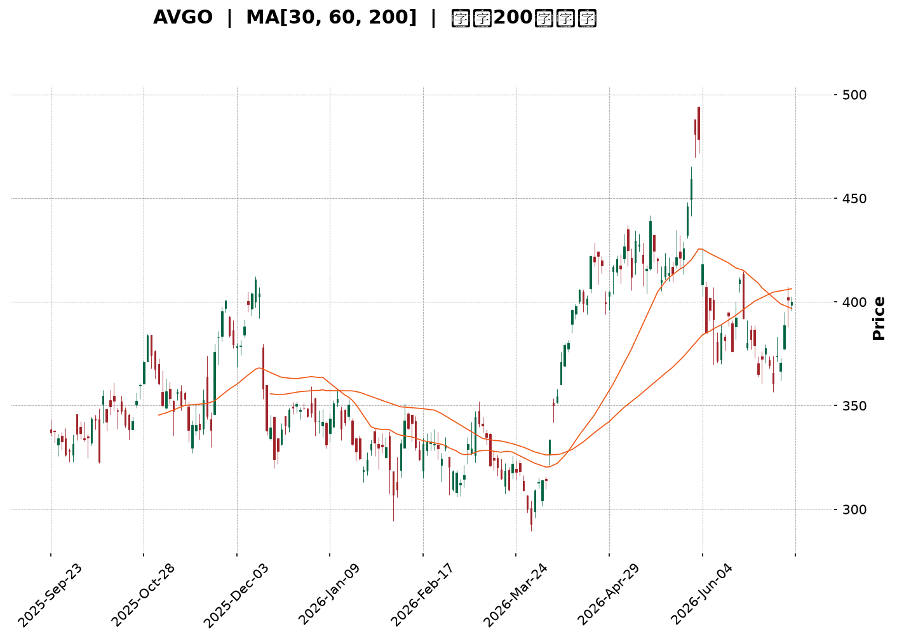
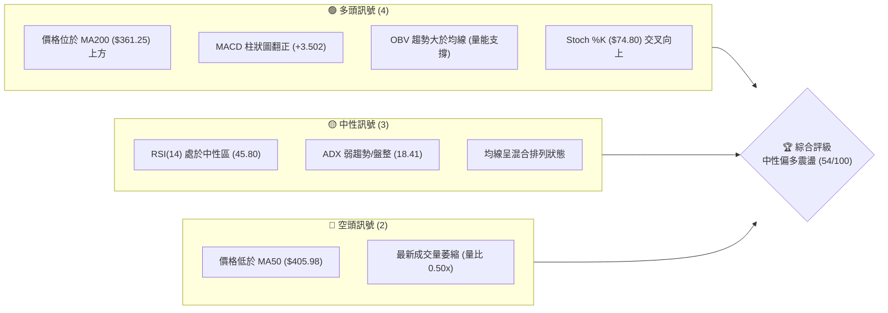
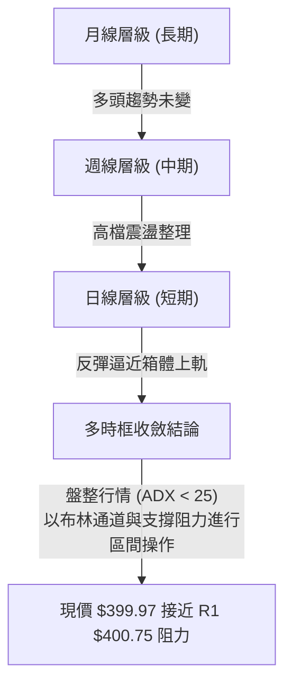
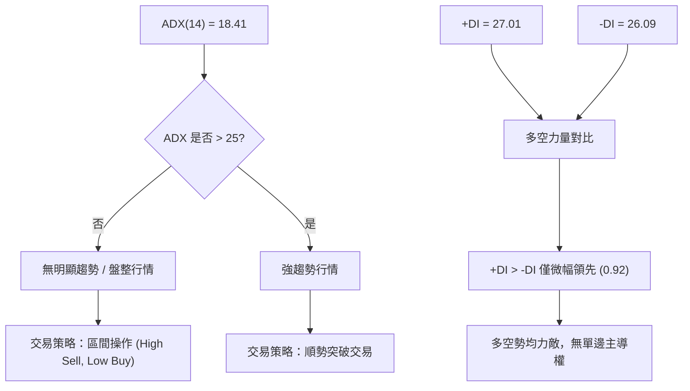
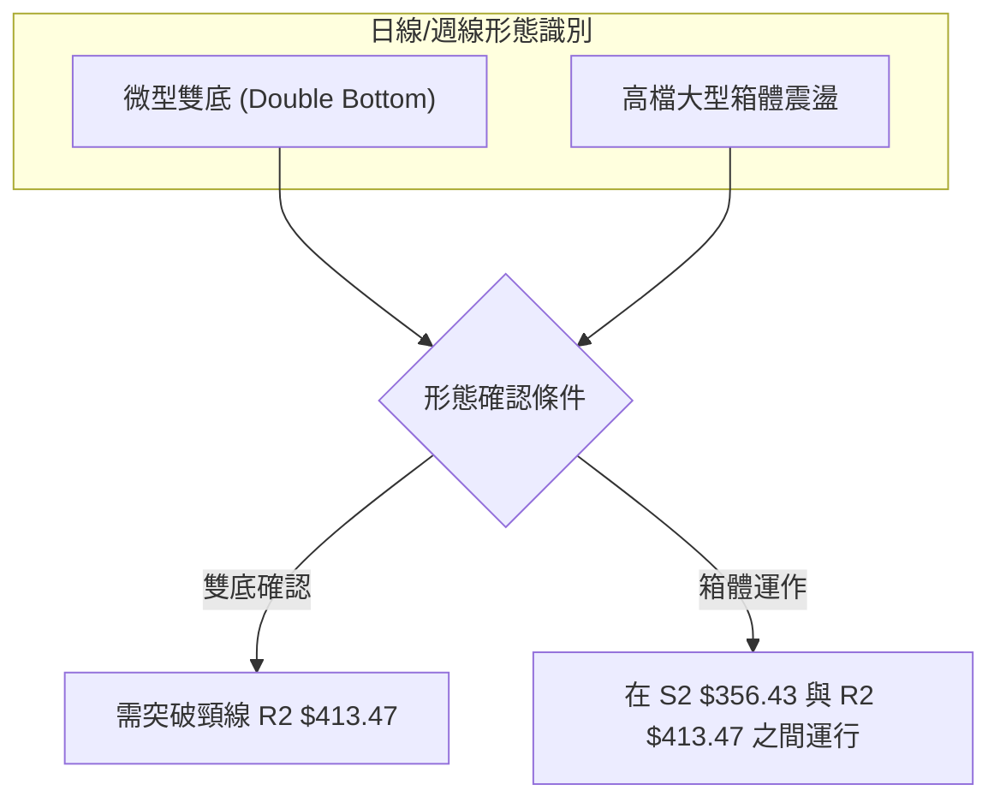
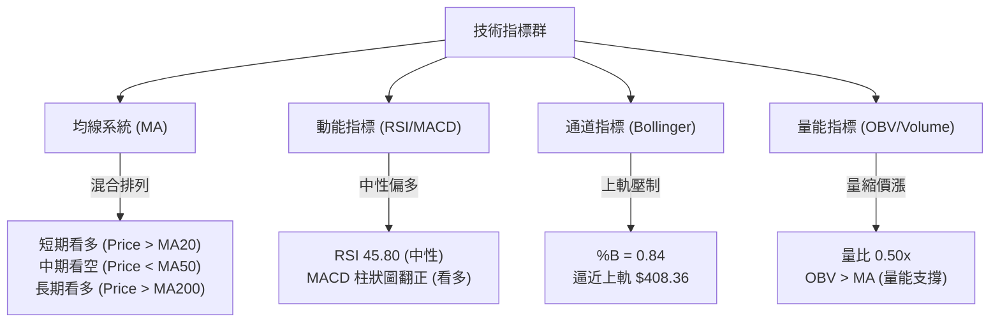
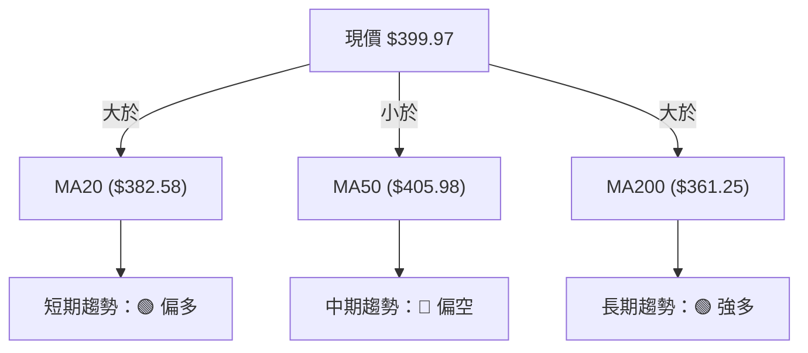
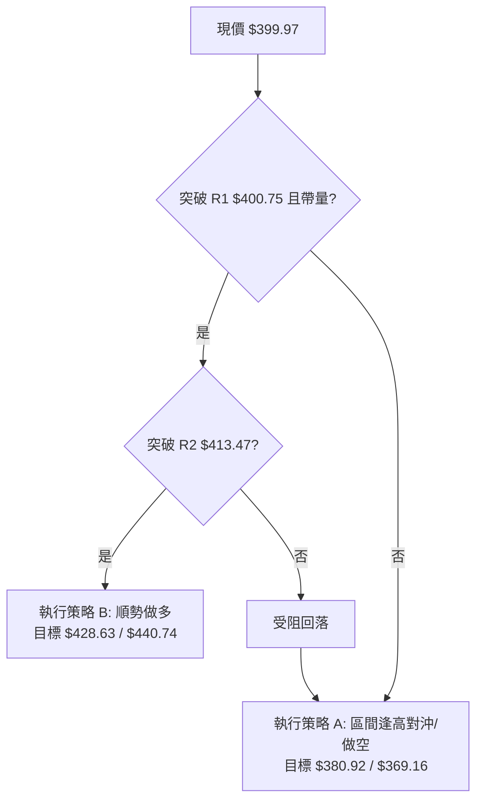
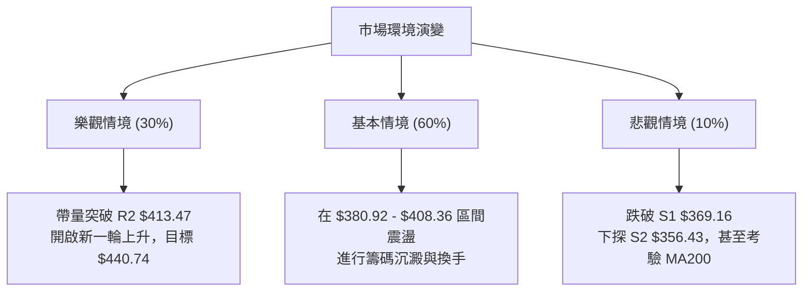

<details>
<summary>📊 靜態圖表 (點擊展開)</summary>

</details>

<html>
<head><meta charset="utf-8" /></head>
<body>
    <div style="height:500px; width:100%;">                        <script>window.PlotlyConfig = {MathJaxConfig: 'local'};</script>
        <script charset="utf-8" src="https://cdn.plot.ly/plotly-3.7.0.min.js" integrity="sha256-jvTGqxNp8AGWEcvNLVuKr+8j5dGe9Yw51LQkmDH+IYA=" crossorigin="anonymous"></script>                <div id="candlestick-chart" class="plotly-graph-div" style="height:100%; width:100%;"></div>            <script>                window.PLOTLYENV=window.PLOTLYENV || {};                                if (document.getElementById("candlestick-chart")) {                    Plotly.newPlot(                        "candlestick-chart",                        [{"close":{"dtype":"f8","bdata":"AAAAYNEQdUAAAACAtBZ1QAAAAKCh43RAAAAAwKbKdEAAAACAKWF0QAAAAKAkgXRAAAAAQIO4dEAAAACguQR1QAAAAKC\u002fB3VAAAAA4OzZdEAAAABAkOh0QAAAAGAxeXVAAAAAQI5xdUAAAABAIi10QAAAAOBkK3ZAAAAAIGVjdUAAAADg89V1QAAAAGDSAnZAAAAAoCG2dUAAAAAAs7R1QAAAAKABTHVAAAAA4HQmdUAAAADg8GV1QAAAAOCAAnZAAAAAYISAdkAAAABgQy53QAAAAIBD\u002fXdAAAAAoPNld0AAAAAAH\u002fl2QAAAAOB4iHZAAAAAoKjfdUAAAADgq092QAAAAKC7GXZAAAAA4Li3dUAAAADASEZ2QAAAACD633VAAAAAwNgTdkAAAACAXSF1QAAAAODSSHVAAAAA4NhLdUAAAACAoyl1QAAAACAeB3ZAAAAAIDKOdUAAAACg3SR1QAAAAKCofXdAAAAAACbud0AAAACAq7V4QAAAAOBtC3lAAAAAwNr+d0AAAADgGLd3QAAAAGDSp3dAAAAAQIGud0AAAAAgC0F4QAAAAODV7XhAAAAAoGlAeUAAAABgsqp5QAAAAICvQXlAAAAAQMledkAAAAAAqR51QAAAAABeNnVAAAAA4D9DdEAAAACAqoB0QAAAAEBpJ3VAAAAAQCZDdUAAAABgm8B1QAAAAED0znVAAAAA4GbtdUAAAAAgucF1QAAAAEAOyXVAAAAAwEaNdUAAAACggaV1QAAAAMCNYnVAAAAAACJodUAAAAAg1GN1QAAAAOAntHRAAAAAIEN7dUAAAABgre51QAAAAKDvFHZAAAAAAEgqdUAAAABALVx1QAAAAOC05nVAAAAAoBG2dEAAAADgfXl0QAAAAOC5RHRAAAAAgAHuc0AAAAAghjp0QAAAAAAZuXRAAAAAYEXAdEAAAABAQph0QAAAAEBYoXRAAAAA4FCedEAAAAAAePJzQAAAAOC1LnNAAAAAIO1Vc0AAAACgK7t0QAAAAMDXanVAAAAAYAwzdUAAAABACFh1QAAAAOBFn3RAAAAAAKA\u002fdEAAAADAHLV0QAAAAECTxHRAAAAAADrMdEAAAACg3bZ0QAAAAKAKknRAAAAA4LlEdEAAAAAgcrF0QAAAAABPCHRAAAAAAAnmc0AAAADgZdpzQAAAAMACi3NAAAAAYNXFc0AAAABAx7h0QAAAAABGlHRAAAAAYLKHdUAAAACgKVV1QAAAAOAPRXVAAAAAgMrrdEAAAABgpA90QAAAAOCjO3RAAAAAgBcCdEAAAADgU6xzQAAAAICo6nNAAAAAIO1Vc0AAAACgASB0QAAAAMCX3HNAAAAAQObkc0AAAACg5U5zQAAAACBHw3JAAAAAQCRPckAAAADAVVBzQAAAAADqj3NAAAAA4Nigc0AAAAAg7p5zQAAAAIAT13RAAAAAIDfhdUAAAABAliV2QAAAAOBnL3dAAAAAIGayd0AAAABA2sJ3QAAAAGB9wXhAAAAAIHLdeEAAAACgXF55QAAAAOD573hAAAAAYI0YeUAAAADAtl96QAAAAEBsNHpAAAAAwHhhekAAAACAoBh6QAAAAMAr83hAAAAAAPNMeUAAAACAUwx6QAAAACDUSXpAAAAAQHj9eUAAAACA9Kp6QAAAAKBIjHpAAAAAgIe+eUAAAADgINV6QAAAAEAMvHpAAAAA4DIqekAAAABAGgJ6QAAAAGCFcXtAAAAAQEqIekAAAAAguUB6QAAAACC6pnlAAAAAIJkRekAAAACAo955QAAAAADF13lAAAAAoH1VekAAAAAAGFN6QAAAAKB+nnpAAAAAQAbhe0AAAAAA5LN8QAAAAODxDH5AAAAAYJDnfUAAAAAA+CN6QAAAAIDtEXhAAAAAoJK\u002feEAAAAAgpXh4QAAAAEAxOHdAAAAAIF8PeEAAAADgddd3QAAAAIAUlXhAAAAA4NWBd0AAAABgd4R4QAAAAEAzq3lAAAAAgBSCeEAAAABgZsJ3QAAAAMAe4XdAAAAAYI+ud0AAAADgUdB2QAAAAEAzR3dAAAAAAACcd0AAAACgcBV3QAAAAEAzh3ZAAAAAYGZed0AAAADgeix3QAAAAEAKS3hAAAAAgMIReUAAAAAghf94QA=="},"high":{"dtype":"f8","bdata":"s5YC5rx0dUDxl4LM9CJ1QLMGmwLRAnVAqAbZowsTdUASCzu0YzJ1QIDBWvpHk3RAxlTX6BABdUCxZ+idw5p1QF+h3dqwZ3VATV3vJmVjdUDSFe+RnAN1QHfAkYK9iXVAnSAZ2v2VdUDBoGmQVsp1QIb+7PIIVnZAC0B3tnPLdUC5RY1pWlZ2QLTm34Fzk3ZATuppsDnQdUBwBzrZpCl2QGdtADhL0nVASgu9ISGhdUCQ44a0N4p1QDnIH\u002fDZRHZA9EtmpaeLdkDLBGcemz93QErPMBY4BXhAofIzNfIDeEC+o414V4t3QGJfs\u002fosTHdARoDBV03udkAvzmnNYq12QNiChHCWl3ZA3LCS5GMIdkDJAvZ\u002f5l92QGuNLtX4fXZAgdgYz+tNdkAS6vhdRvl1QEfBfLQZbXVA+5mqwcvjdUCMRf0bfqB1QEToELT3WnZAhrUwGr9fd0DwH55BhKp1QD6G4UfwvXdAbBTh3HgfeECLLae\u002fQ9p4QDxfNNYQDHlAwrukTHaTeEC3FVnO6XR4QAn\u002fLQy2wndAREkslwLcd0BG2WzmY3V4QEM5CtRSUHlAXZgrZJhKeUDA8IVQysR5QBSwWd5NcHlAg8QlN\u002fC9d0AHa5G5uH92QALYZrkDmXVA\u002fwjvftqKdUBgugV+hOJ0QGWTHXeTWHVA8FkV\u002foGPdUBkgsg\u002fM811QILIH\u002fAJ+XVAR2m2iUH\u002fdUAOCJIetdB1QGhJx1Qr9nVAYD8AzYjJdUB3zjV3YXV2QOwVpbehG3ZAoWFGgE28dUBtlWQrqsZ1QIS\u002fx6CyZnVAmO+VHtehdUDgOCQ4ngl2QFQ\u002fecO6YnZA5alZZXLWdUAsfEuBWMZ1QMe4SahXE3ZA39Cs8x2CdUD0mrqkFOl0QGFqiv4M\u002fHRAL8wYlu4MdEAJ3WcslHd0QKrlfIKA2HRAt2LU5t8rdUDepg3neOt0QCCQQQVXD3VA2A\u002fztTntdEB4kL6Ufxp1QCs1Ftll5XNAuREyLE5VdEC2m1b7U9x0QPh+v9i\u002f8HVA8n\u002f9UrmrdUCDvsDAz551QDPFPBNOkHVALLkL0nzRdEB3fmOeSOh0QAdT\u002fA09CnVA3tPrWSoTdUDZFnuayS11QAlYqFQfFHVAf+lFO65xdEC5Doqh1ep0QJg0JwMaVnRAAOoqfDXtc0C8BNao2O1zQAXjRPWHq3NA6TATLksXdEBzIG+DLu50QMoYif78Y3VAvk1cL2CzdUAF7lHAgP11QPIKcyKniHVA3BwV+VIpdUDV9nfRQBF1QM0suWjef3RAYbQC2c9jdEDB9Tnp7UN0QE7Y7i9WIXRAWXRFw0cFdEAcNBcObV90QD+RCLQyPnRA2bFLt5k8dECjyp4UtcZzQGZQrLs5MHNArnesOJ0Ec0C\u002f1nxSHV1zQIHwFP2ntHNA6soBeBWjc0BJ6dJ\u002fZr5zQCk+wpXz2XRAFNxAaEkZdkDbfzCYIWJ2QBuWI4NHf3dA11rXcCHEd0COh4iK0Np3QFH7hYs9x3hA3gMra8bweED64i6lZWF5QFkvJM1xXHlArMWZXmUveUCLT6IQgGh6QConpRobynpAuUeDQEGFekBthf3MT2F6QAuEdCuzUnlAPTQtBfxPeUA88OeZgBt6QOHJTWQFaHpAAb22bpByekAXesx4SAt7QAgtFmfQT3tApdjxlg6dekBlTVmDACV7QGMttZZvD3tA4tFgxJXKekAUGUH3fh96QAxatl2TmntA+roqbgQCe0CYJPWVfVV6QDmGNxiiFHpAfnQuA\u002f93ekCoM9EKU1l6QCG65qI4NXpAruQiS\u002fQpe0ArZsdw2wF7QPCCfC8E0HpAuRLI9gwDfED7Tc9FBBV9QKbzX\u002fPCgH5ArStRLnzjfkB1p+TA5Zx6QOUNUw2fnXlAZUyPPEEjeUB78DqRm3N5QGTPfaM0E3hAT1cZ8CZOeEAlBmJq8gV4QA8bS98uuXhAQgcSBbxyeEDJzck2RQB5QJ\u002fxKiPEwHlAAAAAgD3qeUAAAADgUXB4QAAAAADXS3hAAAAAwMxMeEAAAABAClt3QAAAACBcg3dAAAAAgOu5d0AAAAAAAFx3QAAAAAAAYHdAAAAAYI\u002fyd0AAAAAgXE93QAAAAKBwsXhAAAAA4FF4eUAAAABACid5QA=="},"hovertemplate":"\u003cb\u003e%{x|%Y-%m-%d}\u003c\u002fb\u003e\u003cbr\u003e\u958b: $%{open:.2f}\u003cbr\u003e\u9ad8: $%{high:.2f}\u003cbr\u003e\u4f4e: $%{low:.2f}\u003cbr\u003e\u6536: $%{close:.2f}\u003cextra\u003e\u003c\u002fextra\u003e","low":{"dtype":"f8","bdata":"WSfZ00TydEDQAqwLMr90QGoYvJ+dV3RAIdEnqs2LdED3207dl1t0QAqZWLvQLHRA2sZirhArdEBQCQNCG9Z0QChfzCjn3XRAZeuI2iDLdEBRqP7iKEx0QK4kDeJCrHRA1F9rNQwodUDPqGq95yN0QPxNG1ywWXVA7hGgQx0cdUA+EiytA5l1QOlGG1+tuHVAGPmwChgudUD\u002fpQ6VbJ51QBNL5dCGNnVAI4+zdj7adEA0FdArDCh1QHbd0w\u002fLznVAf0z9WZ4RdkDrphtwJ4h2QEfK7pPDMXdAkHdtkfb\u002fdkAwq96HC7F2QAw9wkJnf3ZALVoH1bPQdUCkZ4BNOcJ1QNM8z93o63VAM3\u002f+Ej\u002f2dECExc8IJAp2QNmGp6WKu3VAZdgyroXbdUDwmAOaw8R0QHeI3GCec3RARzedeTn6dEBoDLdnPtp0QDe6fuGt\u002fnRAuQl9Dxp0dUBNh4\u002feNp90QEVvcoSPm3VANhmuQtoad0CBHcNm\u002fNF3QGxEBoUlr3hAd36cHkPvd0AJg4ihxpp3QODo7JpZCXdA3J1C+Odmd0D5GAewDvB3QDajbRX3snhA6btP0uSUeEAotDsbVdV4QPc4xkbkf3hAyIqFfLsSdkCWMU7AEPp0QHEXN3AV03RAQ9S4YA\u002f6c0D+CF8qOR10QKKzNfefq3RAiY3rtrf\u002fdEDrfqOOwhR1QI9DNe3anXVAWR9lOJSndUApLLyHzHZ1QPu+v6RJwHVAeqPkuG+CdUA6X\u002fPXqoR1QAsvRWc99HRAV4Rr3SYMdUD3GGEtW+p0QBOWFoSXlHRAr8lDbmrEdECcDELFLTt1QPCxPx\u002f02XVAXqy9GhXTdEDz\u002flALqEZ1QCA0F6eYbHVAh\u002f3XxlCpdED5CNuGKTB0QBuq\u002fWQpO3RA45t\u002fi1CPc0DdKGsd88ZzQABjz70dXXRAjTzo8ANYdECbXWoYrPFzQDq3DMb\u002fcXRAZYbT895IdECGcdFWRjhzQMGBSIt1Y3JA5ymCpjAZc0ChT9bYObJzQJWdZqr7lnRAHkwcxXspdUCNW1bZPch0QHe2FnSbhXRA3zlVF\u002fk3dEDXvf2cYrJzQO60s8h2YHRAqtU5C4WHdECRKdEG7YV0QIOCKTcEQnRArI0TF7yUc0BaNNDMJIF0QG5bqwLMLHNAsJJJ0MtNc0BMAHMPKSFzQJvklU9ZJHNArHXhiohpc0C8Zoysgh10QL63VI0sY3RA4BwgtMEmdECG5jmCyTh1QKkidZyoD3VA5XaSTLGvdED0IWQ5AQR0QN+Ubk8q7nNAF92tyF7Bc0BKyW0WRaZzQIpbmDILNnNAyT2PXoVMc0DHkVvv6qZzQG84g9R6pXNAJ08LJ4PDc0A\u002f+T4+50pzQNyXDRddpnJA1GeeVAcYckAzLZqd8n1yQCAMQpvUX3NAG42M+F7UckDQtUucolxzQK2qQ+WpFHRAKDPt7NFfdUAvdyryHO91QL+BR1P\u002fg3ZARTaRuFYOd0CWVRv+mnt3QE7Q8ipfD3hAypQ0PK57eEDF4wQP2vJ4QIG7huRjtHhAULmv8CSfeEBRWJQFhkN5QNuV1pk8EnpAFpA+N2yDeUC3QEDbmN95QJGI9QZsoHhA7Tu6vXLCeECqdU\u002fPdTl5QKQBwecHynlAVqnQPCCOeUDym8t3\u002fyp6QKMLKNTqEXpA8p9pBIdaeUCJO+JuiNV5QPOhgaANhnpAuXP5+zt8eUDJ\u002fKC6kEJ5QBOH4MHu7nlA\u002fcPmoi8yekCv8vGIcdt5QOkBt5h\u002fU3lAkI7SiFGseUAZ47MXn515QFDx1g\u002f9mHlA1sogDXUFekBaXOdBT\u002f15QEykp1ux1XlAz1WlhpzsekB8Q7ziVph7QCy9Vih3W31ARYsgZ0p+fUAmpnWJ+CV5QNxc\u002f+ewD3hAPtgPm7RreEDSjWKr6ht3QNIA7wRWKXdAQF3NV24fd0D4CY3wd4Z3QCdbEXDGP3hATDQ9ftd9d0BIvom3ueB3QJ4BusPUS3lAAAAAYI9+eEAAAABgj4p3QAAAACBcj3dAAAAAQDNLd0AAAACgR712QAAAACBch3ZAAAAAgD0qd0AAAADgegB3QAAAAEDhRnZAAAAAQOEyd0AAAAAAKaB2QAAAAIA9jndAAAAAQOE+eEAAAABAM7t4QA=="},"name":"\u50f9\u683c","open":{"dtype":"f8","bdata":"Fypac4AldUCas1F63R11QJaWq\u002f0lsnRAgAOy7cr4dEBplIQ6CuJ0QLg74\u002fR7hHRAJeP+vCNldECxZ+idw5p1QMXfYa2MOXVAj04ab8TgdEBIKPqYbfJ0QEUdnr1av3RAfPMatit9dUBk8cZdcXd1QLnI4DXd7HVAOH0WKtzCdUAhi8uy6Qd2QMkdjEL8LHZARbnMG5a6dUBSqAapQP11QPNR\u002f7PKwHVAkRzSFtWVdUA0FdArDCh1QA7Fqlq66HVARhAfJGd4dkAplDIClol2QEfK7pPDMXdAofIzNfIDeEABYa8ml4J3QAYuNWnUHndADjD6DFpIdkCBEIjq8851QOttqFKmYXZAk1UYOHUDdkCXqnbPfD52QMyIfhyDT3ZAvCkpIbdAdkBhF\u002fI17tl1QO5Xpb32mXRARZpD2dEedUDflxgemVR1QBwGedT6LHVAMF36kF2\u002fdkBiV7CHyHN1QIR\u002fWqusnHVAFKxkqI7sd0AXrOjga\u002fZ3QJHZccf90XhArmuJj2SKeEA7+HIGViJ4QN\u002fwjcwdnndAxeNMne+od0DioGpnSQB4QBspyt\u002fKA3lAd9wC3XHIeEBuKfBXVv94QF4sKscuKXlAIGkx6Hqdd0Afd0i8+H12QDSJYKZb4nRA\u002fwjvftqKdUB4l1JNCuJ0QNINBJ63t3RAPsU4BimMdUCuD6BO8jh1QLL5N09y1nVA8\u002fjoNVjcdUDqY4LSCrd1QGSxMvL3ynVA51E9riTHdUD8uZltw\u002fd1QGTWuTMCF3ZAEf8qTmxldUCDYDZvIkd1QIv9achZWHVAHEjbW+AKdUCcDELFLTt1QFjKxKFb+XVAz2eZIAe7dUCPLGssa711QO6jimf8j3VAknWivmRtdUBzK7NAdeR0QKho+kXo4XRAg5NMxgzic0CdCNoqBepzQEB75KzLiHRA0yQGqrMZdUDnaWBdbrV0QK9Up5yEs3RA4IZtCpxOdEA6E5atEPh0QCs1Ftll5XNA9LKQLPuSc0AmaMWYze5zQC32mVzlmHRA85IzkR2jdUB41jxEb5h1QFlYi84WaXVAqMvx5DqKdEB2lptzG+hzQKnjrBv4hHRA4xiAu5q8dEDcfRYcPrJ0QA6zc0l9sHRAMRLuGLMVdECtKRr6aph0QM1e\u002fJbTVHRA3h5aivRYc0CxwM\u002fWl0NzQElToMCefXNALUzCj1eoc0AfLaePfY90QBo6qtIzcXRAbN\u002fPe8hgdEDLOfmrM7d1QLOxlWpSVXVADThOxAEIdUBXCYTwDAd1QAca0tYsTXRAD+le2gdJdEAAcvw5EPRzQLsz3sordXNAzyylKB\u002fvc0C2xqbQ9ddzQNJOn87o93NAWq+vqEghdECoCupZYZhzQG7OulQyKXNArsnnFlDGckAHnvq\u002fq65yQLAi0kb\u002fjXNALhmbPCQAc0D3dB6M\u002fqhzQGa4ZVxrY3RAVMRGYBvzdUDCqqKE5Pt1QGJkcwzqhXZAYV5VzjYRd0CTpxpk2JR3QPrZggU5VHhAq9FvdQOmeEDzav6gQwR5QDToKVbxUHlAI2AlPXbseEB3m8DsY2V5QIEWhaSPW3pAbA6ige+EekDK0TOeDD16QJEHpsTW+nhAc6oPX8wteUAOCbl80O15QDnGpPDx5nlARV8TPvIYekDpxldE5k96QMPeyZ\u002fyLXtAk1fKkHRSekCyZrWkLzJ6QD6QIL4br3pA48XbpCxsekBkVs93cvJ5QD8L8uAkAXpA+roqbgQCe0DyiiDY50t6QAYYLjfCknlAy1u96YXCeUCi6RgaWM55QOm4RNFIDXpAMefDV2sdekBanxl5X4Z6QDdNsLWXR3pAMgZoEkEEe0DwdJpyDxZ8QDiIFEVIgH5Au67XevjffkDtt\u002fHUf4V5QCFr8EF0b3lAzQkYib0feUAjBMsVmw95QOwO3MhazndAjI9vprFDd0BWYRuS0fF3QKl+lhYprnhA9\u002fcWf35ZeEA5A4s+iEF4QFE1wbTsjnlAAAAAYI\u002faeUAAAACA6513QAAAAIDrKXhAAAAAoEcpeEAAAABAMyd3QAAAAIDrWXdAAAAA4KNsd0AAAACA6z13QAAAACCu23ZAAAAAgMJZd0AAAADA9eh2QAAAAOBRmHdAAAAAQAojeUAAAAAAAOh4QA=="},"x":["2025-09-23T00:00:00-04:00","2025-09-24T00:00:00-04:00","2025-09-25T00:00:00-04:00","2025-09-26T00:00:00-04:00","2025-09-29T00:00:00-04:00","2025-09-30T00:00:00-04:00","2025-10-01T00:00:00-04:00","2025-10-02T00:00:00-04:00","2025-10-03T00:00:00-04:00","2025-10-06T00:00:00-04:00","2025-10-07T00:00:00-04:00","2025-10-08T00:00:00-04:00","2025-10-09T00:00:00-04:00","2025-10-10T00:00:00-04:00","2025-10-13T00:00:00-04:00","2025-10-14T00:00:00-04:00","2025-10-15T00:00:00-04:00","2025-10-16T00:00:00-04:00","2025-10-17T00:00:00-04:00","2025-10-20T00:00:00-04:00","2025-10-21T00:00:00-04:00","2025-10-22T00:00:00-04:00","2025-10-23T00:00:00-04:00","2025-10-24T00:00:00-04:00","2025-10-27T00:00:00-04:00","2025-10-28T00:00:00-04:00","2025-10-29T00:00:00-04:00","2025-10-30T00:00:00-04:00","2025-10-31T00:00:00-04:00","2025-11-03T00:00:00-05:00","2025-11-04T00:00:00-05:00","2025-11-05T00:00:00-05:00","2025-11-06T00:00:00-05:00","2025-11-07T00:00:00-05:00","2025-11-10T00:00:00-05:00","2025-11-11T00:00:00-05:00","2025-11-12T00:00:00-05:00","2025-11-13T00:00:00-05:00","2025-11-14T00:00:00-05:00","2025-11-17T00:00:00-05:00","2025-11-18T00:00:00-05:00","2025-11-19T00:00:00-05:00","2025-11-20T00:00:00-05:00","2025-11-21T00:00:00-05:00","2025-11-24T00:00:00-05:00","2025-11-25T00:00:00-05:00","2025-11-26T00:00:00-05:00","2025-11-28T00:00:00-05:00","2025-12-01T00:00:00-05:00","2025-12-02T00:00:00-05:00","2025-12-03T00:00:00-05:00","2025-12-04T00:00:00-05:00","2025-12-05T00:00:00-05:00","2025-12-08T00:00:00-05:00","2025-12-09T00:00:00-05:00","2025-12-10T00:00:00-05:00","2025-12-11T00:00:00-05:00","2025-12-12T00:00:00-05:00","2025-12-15T00:00:00-05:00","2025-12-16T00:00:00-05:00","2025-12-17T00:00:00-05:00","2025-12-18T00:00:00-05:00","2025-12-19T00:00:00-05:00","2025-12-22T00:00:00-05:00","2025-12-23T00:00:00-05:00","2025-12-24T00:00:00-05:00","2025-12-26T00:00:00-05:00","2025-12-29T00:00:00-05:00","2025-12-30T00:00:00-05:00","2025-12-31T00:00:00-05:00","2026-01-02T00:00:00-05:00","2026-01-05T00:00:00-05:00","2026-01-06T00:00:00-05:00","2026-01-07T00:00:00-05:00","2026-01-08T00:00:00-05:00","2026-01-09T00:00:00-05:00","2026-01-12T00:00:00-05:00","2026-01-13T00:00:00-05:00","2026-01-14T00:00:00-05:00","2026-01-15T00:00:00-05:00","2026-01-16T00:00:00-05:00","2026-01-20T00:00:00-05:00","2026-01-21T00:00:00-05:00","2026-01-22T00:00:00-05:00","2026-01-23T00:00:00-05:00","2026-01-26T00:00:00-05:00","2026-01-27T00:00:00-05:00","2026-01-28T00:00:00-05:00","2026-01-29T00:00:00-05:00","2026-01-30T00:00:00-05:00","2026-02-02T00:00:00-05:00","2026-02-03T00:00:00-05:00","2026-02-04T00:00:00-05:00","2026-02-05T00:00:00-05:00","2026-02-06T00:00:00-05:00","2026-02-09T00:00:00-05:00","2026-02-10T00:00:00-05:00","2026-02-11T00:00:00-05:00","2026-02-12T00:00:00-05:00","2026-02-13T00:00:00-05:00","2026-02-17T00:00:00-05:00","2026-02-18T00:00:00-05:00","2026-02-19T00:00:00-05:00","2026-02-20T00:00:00-05:00","2026-02-23T00:00:00-05:00","2026-02-24T00:00:00-05:00","2026-02-25T00:00:00-05:00","2026-02-26T00:00:00-05:00","2026-02-27T00:00:00-05:00","2026-03-02T00:00:00-05:00","2026-03-03T00:00:00-05:00","2026-03-04T00:00:00-05:00","2026-03-05T00:00:00-05:00","2026-03-06T00:00:00-05:00","2026-03-09T00:00:00-04:00","2026-03-10T00:00:00-04:00","2026-03-11T00:00:00-04:00","2026-03-12T00:00:00-04:00","2026-03-13T00:00:00-04:00","2026-03-16T00:00:00-04:00","2026-03-17T00:00:00-04:00","2026-03-18T00:00:00-04:00","2026-03-19T00:00:00-04:00","2026-03-20T00:00:00-04:00","2026-03-23T00:00:00-04:00","2026-03-24T00:00:00-04:00","2026-03-25T00:00:00-04:00","2026-03-26T00:00:00-04:00","2026-03-27T00:00:00-04:00","2026-03-30T00:00:00-04:00","2026-03-31T00:00:00-04:00","2026-04-01T00:00:00-04:00","2026-04-02T00:00:00-04:00","2026-04-06T00:00:00-04:00","2026-04-07T00:00:00-04:00","2026-04-08T00:00:00-04:00","2026-04-09T00:00:00-04:00","2026-04-10T00:00:00-04:00","2026-04-13T00:00:00-04:00","2026-04-14T00:00:00-04:00","2026-04-15T00:00:00-04:00","2026-04-16T00:00:00-04:00","2026-04-17T00:00:00-04:00","2026-04-20T00:00:00-04:00","2026-04-21T00:00:00-04:00","2026-04-22T00:00:00-04:00","2026-04-23T00:00:00-04:00","2026-04-24T00:00:00-04:00","2026-04-27T00:00:00-04:00","2026-04-28T00:00:00-04:00","2026-04-29T00:00:00-04:00","2026-04-30T00:00:00-04:00","2026-05-01T00:00:00-04:00","2026-05-04T00:00:00-04:00","2026-05-05T00:00:00-04:00","2026-05-06T00:00:00-04:00","2026-05-07T00:00:00-04:00","2026-05-08T00:00:00-04:00","2026-05-11T00:00:00-04:00","2026-05-12T00:00:00-04:00","2026-05-13T00:00:00-04:00","2026-05-14T00:00:00-04:00","2026-05-15T00:00:00-04:00","2026-05-18T00:00:00-04:00","2026-05-19T00:00:00-04:00","2026-05-20T00:00:00-04:00","2026-05-21T00:00:00-04:00","2026-05-22T00:00:00-04:00","2026-05-26T00:00:00-04:00","2026-05-27T00:00:00-04:00","2026-05-28T00:00:00-04:00","2026-05-29T00:00:00-04:00","2026-06-01T00:00:00-04:00","2026-06-02T00:00:00-04:00","2026-06-03T00:00:00-04:00","2026-06-04T00:00:00-04:00","2026-06-05T00:00:00-04:00","2026-06-08T00:00:00-04:00","2026-06-09T00:00:00-04:00","2026-06-10T00:00:00-04:00","2026-06-11T00:00:00-04:00","2026-06-12T00:00:00-04:00","2026-06-15T00:00:00-04:00","2026-06-16T00:00:00-04:00","2026-06-17T00:00:00-04:00","2026-06-18T00:00:00-04:00","2026-06-22T00:00:00-04:00","2026-06-23T00:00:00-04:00","2026-06-24T00:00:00-04:00","2026-06-25T00:00:00-04:00","2026-06-26T00:00:00-04:00","2026-06-29T00:00:00-04:00","2026-06-30T00:00:00-04:00","2026-07-01T00:00:00-04:00","2026-07-02T00:00:00-04:00","2026-07-06T00:00:00-04:00","2026-07-07T00:00:00-04:00","2026-07-08T00:00:00-04:00","2026-07-09T00:00:00-04:00","2026-07-10T00:00:00-04:00"],"type":"candlestick"},{"hovertemplate":"MA30: $%{y:.2f}\u003cextra\u003e\u003c\u002fextra\u003e","line":{"color":"#2196F3","dash":"dash","width":2},"mode":"lines","name":"MA30","x":["2025-09-23T00:00:00-04:00","2025-09-24T00:00:00-04:00","2025-09-25T00:00:00-04:00","2025-09-26T00:00:00-04:00","2025-09-29T00:00:00-04:00","2025-09-30T00:00:00-04:00","2025-10-01T00:00:00-04:00","2025-10-02T00:00:00-04:00","2025-10-03T00:00:00-04:00","2025-10-06T00:00:00-04:00","2025-10-07T00:00:00-04:00","2025-10-08T00:00:00-04:00","2025-10-09T00:00:00-04:00","2025-10-10T00:00:00-04:00","2025-10-13T00:00:00-04:00","2025-10-14T00:00:00-04:00","2025-10-15T00:00:00-04:00","2025-10-16T00:00:00-04:00","2025-10-17T00:00:00-04:00","2025-10-20T00:00:00-04:00","2025-10-21T00:00:00-04:00","2025-10-22T00:00:00-04:00","2025-10-23T00:00:00-04:00","2025-10-24T00:00:00-04:00","2025-10-27T00:00:00-04:00","2025-10-28T00:00:00-04:00","2025-10-29T00:00:00-04:00","2025-10-30T00:00:00-04:00","2025-10-31T00:00:00-04:00","2025-11-03T00:00:00-05:00","2025-11-04T00:00:00-05:00","2025-11-05T00:00:00-05:00","2025-11-06T00:00:00-05:00","2025-11-07T00:00:00-05:00","2025-11-10T00:00:00-05:00","2025-11-11T00:00:00-05:00","2025-11-12T00:00:00-05:00","2025-11-13T00:00:00-05:00","2025-11-14T00:00:00-05:00","2025-11-17T00:00:00-05:00","2025-11-18T00:00:00-05:00","2025-11-19T00:00:00-05:00","2025-11-20T00:00:00-05:00","2025-11-21T00:00:00-05:00","2025-11-24T00:00:00-05:00","2025-11-25T00:00:00-05:00","2025-11-26T00:00:00-05:00","2025-11-28T00:00:00-05:00","2025-12-01T00:00:00-05:00","2025-12-02T00:00:00-05:00","2025-12-03T00:00:00-05:00","2025-12-04T00:00:00-05:00","2025-12-05T00:00:00-05:00","2025-12-08T00:00:00-05:00","2025-12-09T00:00:00-05:00","2025-12-10T00:00:00-05:00","2025-12-11T00:00:00-05:00","2025-12-12T00:00:00-05:00","2025-12-15T00:00:00-05:00","2025-12-16T00:00:00-05:00","2025-12-17T00:00:00-05:00","2025-12-18T00:00:00-05:00","2025-12-19T00:00:00-05:00","2025-12-22T00:00:00-05:00","2025-12-23T00:00:00-05:00","2025-12-24T00:00:00-05:00","2025-12-26T00:00:00-05:00","2025-12-29T00:00:00-05:00","2025-12-30T00:00:00-05:00","2025-12-31T00:00:00-05:00","2026-01-02T00:00:00-05:00","2026-01-05T00:00:00-05:00","2026-01-06T00:00:00-05:00","2026-01-07T00:00:00-05:00","2026-01-08T00:00:00-05:00","2026-01-09T00:00:00-05:00","2026-01-12T00:00:00-05:00","2026-01-13T00:00:00-05:00","2026-01-14T00:00:00-05:00","2026-01-15T00:00:00-05:00","2026-01-16T00:00:00-05:00","2026-01-20T00:00:00-05:00","2026-01-21T00:00:00-05:00","2026-01-22T00:00:00-05:00","2026-01-23T00:00:00-05:00","2026-01-26T00:00:00-05:00","2026-01-27T00:00:00-05:00","2026-01-28T00:00:00-05:00","2026-01-29T00:00:00-05:00","2026-01-30T00:00:00-05:00","2026-02-02T00:00:00-05:00","2026-02-03T00:00:00-05:00","2026-02-04T00:00:00-05:00","2026-02-05T00:00:00-05:00","2026-02-06T00:00:00-05:00","2026-02-09T00:00:00-05:00","2026-02-10T00:00:00-05:00","2026-02-11T00:00:00-05:00","2026-02-12T00:00:00-05:00","2026-02-13T00:00:00-05:00","2026-02-17T00:00:00-05:00","2026-02-18T00:00:00-05:00","2026-02-19T00:00:00-05:00","2026-02-20T00:00:00-05:00","2026-02-23T00:00:00-05:00","2026-02-24T00:00:00-05:00","2026-02-25T00:00:00-05:00","2026-02-26T00:00:00-05:00","2026-02-27T00:00:00-05:00","2026-03-02T00:00:00-05:00","2026-03-03T00:00:00-05:00","2026-03-04T00:00:00-05:00","2026-03-05T00:00:00-05:00","2026-03-06T00:00:00-05:00","2026-03-09T00:00:00-04:00","2026-03-10T00:00:00-04:00","2026-03-11T00:00:00-04:00","2026-03-12T00:00:00-04:00","2026-03-13T00:00:00-04:00","2026-03-16T00:00:00-04:00","2026-03-17T00:00:00-04:00","2026-03-18T00:00:00-04:00","2026-03-19T00:00:00-04:00","2026-03-20T00:00:00-04:00","2026-03-23T00:00:00-04:00","2026-03-24T00:00:00-04:00","2026-03-25T00:00:00-04:00","2026-03-26T00:00:00-04:00","2026-03-27T00:00:00-04:00","2026-03-30T00:00:00-04:00","2026-03-31T00:00:00-04:00","2026-04-01T00:00:00-04:00","2026-04-02T00:00:00-04:00","2026-04-06T00:00:00-04:00","2026-04-07T00:00:00-04:00","2026-04-08T00:00:00-04:00","2026-04-09T00:00:00-04:00","2026-04-10T00:00:00-04:00","2026-04-13T00:00:00-04:00","2026-04-14T00:00:00-04:00","2026-04-15T00:00:00-04:00","2026-04-16T00:00:00-04:00","2026-04-17T00:00:00-04:00","2026-04-20T00:00:00-04:00","2026-04-21T00:00:00-04:00","2026-04-22T00:00:00-04:00","2026-04-23T00:00:00-04:00","2026-04-24T00:00:00-04:00","2026-04-27T00:00:00-04:00","2026-04-28T00:00:00-04:00","2026-04-29T00:00:00-04:00","2026-04-30T00:00:00-04:00","2026-05-01T00:00:00-04:00","2026-05-04T00:00:00-04:00","2026-05-05T00:00:00-04:00","2026-05-06T00:00:00-04:00","2026-05-07T00:00:00-04:00","2026-05-08T00:00:00-04:00","2026-05-11T00:00:00-04:00","2026-05-12T00:00:00-04:00","2026-05-13T00:00:00-04:00","2026-05-14T00:00:00-04:00","2026-05-15T00:00:00-04:00","2026-05-18T00:00:00-04:00","2026-05-19T00:00:00-04:00","2026-05-20T00:00:00-04:00","2026-05-21T00:00:00-04:00","2026-05-22T00:00:00-04:00","2026-05-26T00:00:00-04:00","2026-05-27T00:00:00-04:00","2026-05-28T00:00:00-04:00","2026-05-29T00:00:00-04:00","2026-06-01T00:00:00-04:00","2026-06-02T00:00:00-04:00","2026-06-03T00:00:00-04:00","2026-06-04T00:00:00-04:00","2026-06-05T00:00:00-04:00","2026-06-08T00:00:00-04:00","2026-06-09T00:00:00-04:00","2026-06-10T00:00:00-04:00","2026-06-11T00:00:00-04:00","2026-06-12T00:00:00-04:00","2026-06-15T00:00:00-04:00","2026-06-16T00:00:00-04:00","2026-06-17T00:00:00-04:00","2026-06-18T00:00:00-04:00","2026-06-22T00:00:00-04:00","2026-06-23T00:00:00-04:00","2026-06-24T00:00:00-04:00","2026-06-25T00:00:00-04:00","2026-06-26T00:00:00-04:00","2026-06-29T00:00:00-04:00","2026-06-30T00:00:00-04:00","2026-07-01T00:00:00-04:00","2026-07-02T00:00:00-04:00","2026-07-06T00:00:00-04:00","2026-07-07T00:00:00-04:00","2026-07-08T00:00:00-04:00","2026-07-09T00:00:00-04:00","2026-07-10T00:00:00-04:00"],"y":{"dtype":"f8","bdata":"AAAAAAAA+H8AAAAAAAD4fwAAAAAAAPh\u002fAAAAAAAA+H8AAAAAAAD4fwAAAAAAAPh\u002fAAAAAAAA+H8AAAAAAAD4fwAAAAAAAPh\u002fAAAAAAAA+H8AAAAAAAD4fwAAAAAAAPh\u002fAAAAAAAA+H8AAAAAAAD4fwAAAAAAAPh\u002fAAAAAAAA+H8AAAAAAAD4fwAAAAAAAPh\u002fAAAAAAAA+H8AAAAAAAD4fwAAAAAAAPh\u002fAAAAAAAA+H8AAAAAAAD4fwAAAAAAAPh\u002fAAAAAAAA+H8AAAAAAAD4fwAAAAAAAPh\u002fAAAAAAAA+H8AAAAAAAD4fxERETEllnVAvLu7OwqddUARERHheKd1QERERBTPsXVAVVVVFba5dUCrqqrK4cl1QDMzM5OT1XVA3t3dfSfhdUAzMzPjG+J1QCIiIjJH5HVAREREVBPodUAzMzOjPup1QKuqqrr57nVAAAAAIO7vdUCrqqoaMPh1QBEREaF2A3ZAmpmZuScZdkCJiIjYrTF2QFVVVeWQS3ZAiYiIiA5fdkAAAAAQNHB2QO\u002fu7p5UhHZAIiIiou6ZdkAAAABgTbJ2QLy7u5s2y3ZA7+7uLq3idkBVVVUV5Pd2QLy7u3u0AndA3t3dze75dkAiIiISHup2QImIiOjY3nZA7+7urhnRdkBERES0qsF2QEREROSWuXZAMzMzI7S1dkDNzMxsP7F2QJqZmSmusHZAmpmZGWavdkDNzMx8vrR2QLy7u7sEuXZAAAAAEDO7dkARERERVL92QJqZmcnXuXZAvLu7+5K4dkBERERErLp2QFVVVbXjonZAd3d3R\u002f6NdkBEREQkS3Z2QKuqqqoCXXZAREREpNtEdkCJiIi4wjB2QFVVVUXKIXZAd3d3N3EIdkBmZmbGMOh1QDMzM5NrwHVAREREtAGTdUBERETUmWR1QFVVVSXqPXVAMzMz8xgwdUDv7u4Onit1QGZmZmamJnVAAAAAgK8pdUBVVVUV8iR1QN7d3U0fFHVAd3d3d64DdUCrqqqK9\u002fp0QCIiIkKh93RAq6qqCmvxdEBVVVUl5e10QBERERH443RAiYiI6NjYdEC8u7uL1dB0QGZmZnaRy3RAAAAAEF\u002fGdEDNzMwcm8B0QBEREQF4v3RAiYiIGB61dEDe3d0Ni6p0QLy7uzsOmXRAVVVVVT+OdECrqqpaY4F0QBEREdFDbXRA7+7uzkFldECrqqraXWd0QImIiKgEanRAAAAAsKx3dECamZmJGIF0QGZmZubChXRAVVVVRTaHdECamZl5qIJ0QImIiJhEf3RAvLu7ew96dEAiIiLyuHd0QERERMT8fXRARERExPx9dEAzMzOz0Hh0QM3MzEyKa3RAVVVV5WZgdEAAAADgB090QM3MzAwqP3RAREREZJ0udEBERETkuCJ0QLy7u\u002ftuGHRAd3d3R3QOdEDv7u5+HwV0QHd3d5dsB3RAAAAAgCwVdECrqqoalCF0QFVVVVV7PHRAZmZm1uRcdEDNzMwMPn50QKuqqpq5qnRAMzMzwy3WdEAAAADg1P10QJqZmYkFI3VAzczMPHNBdUARERHxd2x1QO\u002fu7p6UlnVA7+7ufivFdUDe3d1dq\u002fh1QBEREaHrIHZAREREFBVOdkB3d3d3e4R2QJqZmcnaunZAERERsaPzdkBmZmaWeCt3QERERASHZHdAq6qqynKWd0B3d3f3p9Z3QJqZmYmuGnhA7+7ujrddeEBVVVW115Z4QO\u002fu7p4Y2nhAzczMzAIVeUAiIiKimk15QImIiLiodnlAiYiIuGeaeUDe3d1tLLp5QDMzMzPa0HlAvLu7+1rneUCJiIjoOv15QJqZmVkhDXpAzczMfNkmekDv7u7uTEN6QM3MzMzubnpA7+7ubveXekC8u7ub+ZV6QO\u002fu7i7Cg3pAzczMHNR1ekBmZmZm9md6QBEREVEyWXpAIiIiUpxOekAiIiIiyDt6QGZmZjY5LXpAIiIiIgkYekARERGhrwV6QKuqquou\u002fnlAzczMjKLzeUAiIiIiadl5QCIiIuILwXlARERExNureUCrqqpamZB5QFVVVRUObXlAzczMrBxUeUCamZm5ETl5QImIiBhrHnlA7+7u3mAHeUBERESEX\u002fB4QHd3dxcm43hAZmZmllvYeEBERETkCc14QA=="},"type":"scatter"},{"hovertemplate":"MA60: $%{y:.2f}\u003cextra\u003e\u003c\u002fextra\u003e","line":{"color":"#9C27B0","dash":"dash","width":2},"mode":"lines","name":"MA60","x":["2025-09-23T00:00:00-04:00","2025-09-24T00:00:00-04:00","2025-09-25T00:00:00-04:00","2025-09-26T00:00:00-04:00","2025-09-29T00:00:00-04:00","2025-09-30T00:00:00-04:00","2025-10-01T00:00:00-04:00","2025-10-02T00:00:00-04:00","2025-10-03T00:00:00-04:00","2025-10-06T00:00:00-04:00","2025-10-07T00:00:00-04:00","2025-10-08T00:00:00-04:00","2025-10-09T00:00:00-04:00","2025-10-10T00:00:00-04:00","2025-10-13T00:00:00-04:00","2025-10-14T00:00:00-04:00","2025-10-15T00:00:00-04:00","2025-10-16T00:00:00-04:00","2025-10-17T00:00:00-04:00","2025-10-20T00:00:00-04:00","2025-10-21T00:00:00-04:00","2025-10-22T00:00:00-04:00","2025-10-23T00:00:00-04:00","2025-10-24T00:00:00-04:00","2025-10-27T00:00:00-04:00","2025-10-28T00:00:00-04:00","2025-10-29T00:00:00-04:00","2025-10-30T00:00:00-04:00","2025-10-31T00:00:00-04:00","2025-11-03T00:00:00-05:00","2025-11-04T00:00:00-05:00","2025-11-05T00:00:00-05:00","2025-11-06T00:00:00-05:00","2025-11-07T00:00:00-05:00","2025-11-10T00:00:00-05:00","2025-11-11T00:00:00-05:00","2025-11-12T00:00:00-05:00","2025-11-13T00:00:00-05:00","2025-11-14T00:00:00-05:00","2025-11-17T00:00:00-05:00","2025-11-18T00:00:00-05:00","2025-11-19T00:00:00-05:00","2025-11-20T00:00:00-05:00","2025-11-21T00:00:00-05:00","2025-11-24T00:00:00-05:00","2025-11-25T00:00:00-05:00","2025-11-26T00:00:00-05:00","2025-11-28T00:00:00-05:00","2025-12-01T00:00:00-05:00","2025-12-02T00:00:00-05:00","2025-12-03T00:00:00-05:00","2025-12-04T00:00:00-05:00","2025-12-05T00:00:00-05:00","2025-12-08T00:00:00-05:00","2025-12-09T00:00:00-05:00","2025-12-10T00:00:00-05:00","2025-12-11T00:00:00-05:00","2025-12-12T00:00:00-05:00","2025-12-15T00:00:00-05:00","2025-12-16T00:00:00-05:00","2025-12-17T00:00:00-05:00","2025-12-18T00:00:00-05:00","2025-12-19T00:00:00-05:00","2025-12-22T00:00:00-05:00","2025-12-23T00:00:00-05:00","2025-12-24T00:00:00-05:00","2025-12-26T00:00:00-05:00","2025-12-29T00:00:00-05:00","2025-12-30T00:00:00-05:00","2025-12-31T00:00:00-05:00","2026-01-02T00:00:00-05:00","2026-01-05T00:00:00-05:00","2026-01-06T00:00:00-05:00","2026-01-07T00:00:00-05:00","2026-01-08T00:00:00-05:00","2026-01-09T00:00:00-05:00","2026-01-12T00:00:00-05:00","2026-01-13T00:00:00-05:00","2026-01-14T00:00:00-05:00","2026-01-15T00:00:00-05:00","2026-01-16T00:00:00-05:00","2026-01-20T00:00:00-05:00","2026-01-21T00:00:00-05:00","2026-01-22T00:00:00-05:00","2026-01-23T00:00:00-05:00","2026-01-26T00:00:00-05:00","2026-01-27T00:00:00-05:00","2026-01-28T00:00:00-05:00","2026-01-29T00:00:00-05:00","2026-01-30T00:00:00-05:00","2026-02-02T00:00:00-05:00","2026-02-03T00:00:00-05:00","2026-02-04T00:00:00-05:00","2026-02-05T00:00:00-05:00","2026-02-06T00:00:00-05:00","2026-02-09T00:00:00-05:00","2026-02-10T00:00:00-05:00","2026-02-11T00:00:00-05:00","2026-02-12T00:00:00-05:00","2026-02-13T00:00:00-05:00","2026-02-17T00:00:00-05:00","2026-02-18T00:00:00-05:00","2026-02-19T00:00:00-05:00","2026-02-20T00:00:00-05:00","2026-02-23T00:00:00-05:00","2026-02-24T00:00:00-05:00","2026-02-25T00:00:00-05:00","2026-02-26T00:00:00-05:00","2026-02-27T00:00:00-05:00","2026-03-02T00:00:00-05:00","2026-03-03T00:00:00-05:00","2026-03-04T00:00:00-05:00","2026-03-05T00:00:00-05:00","2026-03-06T00:00:00-05:00","2026-03-09T00:00:00-04:00","2026-03-10T00:00:00-04:00","2026-03-11T00:00:00-04:00","2026-03-12T00:00:00-04:00","2026-03-13T00:00:00-04:00","2026-03-16T00:00:00-04:00","2026-03-17T00:00:00-04:00","2026-03-18T00:00:00-04:00","2026-03-19T00:00:00-04:00","2026-03-20T00:00:00-04:00","2026-03-23T00:00:00-04:00","2026-03-24T00:00:00-04:00","2026-03-25T00:00:00-04:00","2026-03-26T00:00:00-04:00","2026-03-27T00:00:00-04:00","2026-03-30T00:00:00-04:00","2026-03-31T00:00:00-04:00","2026-04-01T00:00:00-04:00","2026-04-02T00:00:00-04:00","2026-04-06T00:00:00-04:00","2026-04-07T00:00:00-04:00","2026-04-08T00:00:00-04:00","2026-04-09T00:00:00-04:00","2026-04-10T00:00:00-04:00","2026-04-13T00:00:00-04:00","2026-04-14T00:00:00-04:00","2026-04-15T00:00:00-04:00","2026-04-16T00:00:00-04:00","2026-04-17T00:00:00-04:00","2026-04-20T00:00:00-04:00","2026-04-21T00:00:00-04:00","2026-04-22T00:00:00-04:00","2026-04-23T00:00:00-04:00","2026-04-24T00:00:00-04:00","2026-04-27T00:00:00-04:00","2026-04-28T00:00:00-04:00","2026-04-29T00:00:00-04:00","2026-04-30T00:00:00-04:00","2026-05-01T00:00:00-04:00","2026-05-04T00:00:00-04:00","2026-05-05T00:00:00-04:00","2026-05-06T00:00:00-04:00","2026-05-07T00:00:00-04:00","2026-05-08T00:00:00-04:00","2026-05-11T00:00:00-04:00","2026-05-12T00:00:00-04:00","2026-05-13T00:00:00-04:00","2026-05-14T00:00:00-04:00","2026-05-15T00:00:00-04:00","2026-05-18T00:00:00-04:00","2026-05-19T00:00:00-04:00","2026-05-20T00:00:00-04:00","2026-05-21T00:00:00-04:00","2026-05-22T00:00:00-04:00","2026-05-26T00:00:00-04:00","2026-05-27T00:00:00-04:00","2026-05-28T00:00:00-04:00","2026-05-29T00:00:00-04:00","2026-06-01T00:00:00-04:00","2026-06-02T00:00:00-04:00","2026-06-03T00:00:00-04:00","2026-06-04T00:00:00-04:00","2026-06-05T00:00:00-04:00","2026-06-08T00:00:00-04:00","2026-06-09T00:00:00-04:00","2026-06-10T00:00:00-04:00","2026-06-11T00:00:00-04:00","2026-06-12T00:00:00-04:00","2026-06-15T00:00:00-04:00","2026-06-16T00:00:00-04:00","2026-06-17T00:00:00-04:00","2026-06-18T00:00:00-04:00","2026-06-22T00:00:00-04:00","2026-06-23T00:00:00-04:00","2026-06-24T00:00:00-04:00","2026-06-25T00:00:00-04:00","2026-06-26T00:00:00-04:00","2026-06-29T00:00:00-04:00","2026-06-30T00:00:00-04:00","2026-07-01T00:00:00-04:00","2026-07-02T00:00:00-04:00","2026-07-06T00:00:00-04:00","2026-07-07T00:00:00-04:00","2026-07-08T00:00:00-04:00","2026-07-09T00:00:00-04:00","2026-07-10T00:00:00-04:00"],"y":{"dtype":"f8","bdata":"AAAAAAAA+H8AAAAAAAD4fwAAAAAAAPh\u002fAAAAAAAA+H8AAAAAAAD4fwAAAAAAAPh\u002fAAAAAAAA+H8AAAAAAAD4fwAAAAAAAPh\u002fAAAAAAAA+H8AAAAAAAD4fwAAAAAAAPh\u002fAAAAAAAA+H8AAAAAAAD4fwAAAAAAAPh\u002fAAAAAAAA+H8AAAAAAAD4fwAAAAAAAPh\u002fAAAAAAAA+H8AAAAAAAD4fwAAAAAAAPh\u002fAAAAAAAA+H8AAAAAAAD4fwAAAAAAAPh\u002fAAAAAAAA+H8AAAAAAAD4fwAAAAAAAPh\u002fAAAAAAAA+H8AAAAAAAD4fwAAAAAAAPh\u002fAAAAAAAA+H8AAAAAAAD4fwAAAAAAAPh\u002fAAAAAAAA+H8AAAAAAAD4fwAAAAAAAPh\u002fAAAAAAAA+H8AAAAAAAD4fwAAAAAAAPh\u002fAAAAAAAA+H8AAAAAAAD4fwAAAAAAAPh\u002fAAAAAAAA+H8AAAAAAAD4fwAAAAAAAPh\u002fAAAAAAAA+H8AAAAAAAD4fwAAAAAAAPh\u002fAAAAAAAA+H8AAAAAAAD4fwAAAAAAAPh\u002fAAAAAAAA+H8AAAAAAAD4fwAAAAAAAPh\u002fAAAAAAAA+H8AAAAAAAD4fwAAAAAAAPh\u002fAAAAAAAA+H8AAAAAAAD4f83MzAx\u002fOnZAVVVV9RE3dkCrqqrKkTR2QERERPyyNXZAREREHLU3dkC8u7ubkD12QGZmZt4gQ3ZAvLu7y0ZIdkAAAAAwbUt2QO\u002fu7valTnZAIiIiMqNRdkAiIiJayVR2QCIiIsJoVHZA3t3djUBUdkB3d3cvbll2QDMzMystU3ZAiYiIAJNTdkBmZmZ+\u002fFN2QAAAAMhJVHZAZmZmFvVRdkBERERke1B2QCIiInIPU3ZAzczM7C9RdkAzMzMTP012QHd3dxfRRXZAmpmZcdc6dkDNzMz0Pi52QImIiFBPIHZAiYiI4AMVdkCJiIgQ3gp2QHd3d6e\u002fAnZAd3d3l2T9dUDNzMxkTvN1QBERERnb5nVAVVVVTbHcdUC8u7t7G9Z1QN7d3bUn1HVAIiIikmjQdUARERHRUdF1QGZmZmZ+znVARERE\u002fAXKdUBmZmbOFMh1QAAAAKC0wnVA3t3dBXm\u002fdUCJiIiwo711QDMzM9stsXVAAAAAMI6hdUAREREZa5B1QDMzM3MIe3VAzczMfI1pdUCamZkJE1l1QDMzMwuHR3VAMzMzg9k2dUCJiIhQxyd1QN7d3R04FXVAIiIiMlcFdUDv7u4u2fJ0QN7d3YXW4XRAREREnKfbdEBEREREI9d0QHd3d3\u002f10nRA3t3dfd\u002fRdEC8u7uDVc50QBEREQkOyXRA3t3dndXAdEDv7u4e5Ll0QHd3d8eVsXRAAAAA+OiodECrqqqCdp50QO\u002fu7g6RkXRAZmZmJruDdEAAAAA4x3l0QBERETkAcnRAvLu7q2lqdEDe3d1N3WJ0QERERExyY3RARERETCVldEBERESUD2Z0QImIiMjEanRA3t3dFZJ1dEC8u7uz0H90QN7d3bX+i3RAERERybeddEBVVVVdmbJ0QBERERmFxnRAZmZm9o\u002fcdEBVVVU9yPZ0QKuqqsIrDnVAIiIi4jAmdUC8u7vrqT11QM3MzBwYUHVAAAAASBJkdUDNzMw0Gn51QO\u002fu7sZrnHVAq6qqOtC4dUDNzMykJNJ1QImIiKgI6HVAAAAA2Gz7dUC8u7vr1xJ2QDMzM0vsLHZAmpmZeSpGdkDNzMxMyFx2QFVVVc1DeXZAIiIiiruRdkCJiIgQXal2QAAAAKgKv3ZAREREHMrXdkBERERE4O12QERERMSqBndAERER6R8id0Crqqp6vD13QCIiInrtW3dAAAAAoIN+d0B3d3fnkKB3QDMzMyv6yHdA3t3dVbXsd0BmZmbGOAF4QO\u002fu7mYrDXhA3t3dzX8deEAiIiLiUDB4QBEREfkOPXhAMzMzs1hOeEDNzMzMIWB4QAAAAAAKdHhAmpmZadaFeEC8u7sblJh4QHd3d\u002fdasXhAvLu7qwrFeEDNzMyMCNh4QN7d3TXd7XhAmpmZqckEeUAAAACIuBN5QCIiIlqTI3lAzczMvI80eUDe3d0tVkN5QImIiOiJSnlAvLu7S+RQeUARERH5RVV5QFVVVSUAWnlAERERSdtfeUBmZmZmImV5QA=="},"type":"scatter"},{"hovertemplate":"MA200: $%{y:.2f}\u003cextra\u003e\u003c\u002fextra\u003e","line":{"color":"#FF6F00","dash":"solid","width":2},"mode":"lines","name":"MA200","x":["2025-09-23T00:00:00-04:00","2025-09-24T00:00:00-04:00","2025-09-25T00:00:00-04:00","2025-09-26T00:00:00-04:00","2025-09-29T00:00:00-04:00","2025-09-30T00:00:00-04:00","2025-10-01T00:00:00-04:00","2025-10-02T00:00:00-04:00","2025-10-03T00:00:00-04:00","2025-10-06T00:00:00-04:00","2025-10-07T00:00:00-04:00","2025-10-08T00:00:00-04:00","2025-10-09T00:00:00-04:00","2025-10-10T00:00:00-04:00","2025-10-13T00:00:00-04:00","2025-10-14T00:00:00-04:00","2025-10-15T00:00:00-04:00","2025-10-16T00:00:00-04:00","2025-10-17T00:00:00-04:00","2025-10-20T00:00:00-04:00","2025-10-21T00:00:00-04:00","2025-10-22T00:00:00-04:00","2025-10-23T00:00:00-04:00","2025-10-24T00:00:00-04:00","2025-10-27T00:00:00-04:00","2025-10-28T00:00:00-04:00","2025-10-29T00:00:00-04:00","2025-10-30T00:00:00-04:00","2025-10-31T00:00:00-04:00","2025-11-03T00:00:00-05:00","2025-11-04T00:00:00-05:00","2025-11-05T00:00:00-05:00","2025-11-06T00:00:00-05:00","2025-11-07T00:00:00-05:00","2025-11-10T00:00:00-05:00","2025-11-11T00:00:00-05:00","2025-11-12T00:00:00-05:00","2025-11-13T00:00:00-05:00","2025-11-14T00:00:00-05:00","2025-11-17T00:00:00-05:00","2025-11-18T00:00:00-05:00","2025-11-19T00:00:00-05:00","2025-11-20T00:00:00-05:00","2025-11-21T00:00:00-05:00","2025-11-24T00:00:00-05:00","2025-11-25T00:00:00-05:00","2025-11-26T00:00:00-05:00","2025-11-28T00:00:00-05:00","2025-12-01T00:00:00-05:00","2025-12-02T00:00:00-05:00","2025-12-03T00:00:00-05:00","2025-12-04T00:00:00-05:00","2025-12-05T00:00:00-05:00","2025-12-08T00:00:00-05:00","2025-12-09T00:00:00-05:00","2025-12-10T00:00:00-05:00","2025-12-11T00:00:00-05:00","2025-12-12T00:00:00-05:00","2025-12-15T00:00:00-05:00","2025-12-16T00:00:00-05:00","2025-12-17T00:00:00-05:00","2025-12-18T00:00:00-05:00","2025-12-19T00:00:00-05:00","2025-12-22T00:00:00-05:00","2025-12-23T00:00:00-05:00","2025-12-24T00:00:00-05:00","2025-12-26T00:00:00-05:00","2025-12-29T00:00:00-05:00","2025-12-30T00:00:00-05:00","2025-12-31T00:00:00-05:00","2026-01-02T00:00:00-05:00","2026-01-05T00:00:00-05:00","2026-01-06T00:00:00-05:00","2026-01-07T00:00:00-05:00","2026-01-08T00:00:00-05:00","2026-01-09T00:00:00-05:00","2026-01-12T00:00:00-05:00","2026-01-13T00:00:00-05:00","2026-01-14T00:00:00-05:00","2026-01-15T00:00:00-05:00","2026-01-16T00:00:00-05:00","2026-01-20T00:00:00-05:00","2026-01-21T00:00:00-05:00","2026-01-22T00:00:00-05:00","2026-01-23T00:00:00-05:00","2026-01-26T00:00:00-05:00","2026-01-27T00:00:00-05:00","2026-01-28T00:00:00-05:00","2026-01-29T00:00:00-05:00","2026-01-30T00:00:00-05:00","2026-02-02T00:00:00-05:00","2026-02-03T00:00:00-05:00","2026-02-04T00:00:00-05:00","2026-02-05T00:00:00-05:00","2026-02-06T00:00:00-05:00","2026-02-09T00:00:00-05:00","2026-02-10T00:00:00-05:00","2026-02-11T00:00:00-05:00","2026-02-12T00:00:00-05:00","2026-02-13T00:00:00-05:00","2026-02-17T00:00:00-05:00","2026-02-18T00:00:00-05:00","2026-02-19T00:00:00-05:00","2026-02-20T00:00:00-05:00","2026-02-23T00:00:00-05:00","2026-02-24T00:00:00-05:00","2026-02-25T00:00:00-05:00","2026-02-26T00:00:00-05:00","2026-02-27T00:00:00-05:00","2026-03-02T00:00:00-05:00","2026-03-03T00:00:00-05:00","2026-03-04T00:00:00-05:00","2026-03-05T00:00:00-05:00","2026-03-06T00:00:00-05:00","2026-03-09T00:00:00-04:00","2026-03-10T00:00:00-04:00","2026-03-11T00:00:00-04:00","2026-03-12T00:00:00-04:00","2026-03-13T00:00:00-04:00","2026-03-16T00:00:00-04:00","2026-03-17T00:00:00-04:00","2026-03-18T00:00:00-04:00","2026-03-19T00:00:00-04:00","2026-03-20T00:00:00-04:00","2026-03-23T00:00:00-04:00","2026-03-24T00:00:00-04:00","2026-03-25T00:00:00-04:00","2026-03-26T00:00:00-04:00","2026-03-27T00:00:00-04:00","2026-03-30T00:00:00-04:00","2026-03-31T00:00:00-04:00","2026-04-01T00:00:00-04:00","2026-04-02T00:00:00-04:00","2026-04-06T00:00:00-04:00","2026-04-07T00:00:00-04:00","2026-04-08T00:00:00-04:00","2026-04-09T00:00:00-04:00","2026-04-10T00:00:00-04:00","2026-04-13T00:00:00-04:00","2026-04-14T00:00:00-04:00","2026-04-15T00:00:00-04:00","2026-04-16T00:00:00-04:00","2026-04-17T00:00:00-04:00","2026-04-20T00:00:00-04:00","2026-04-21T00:00:00-04:00","2026-04-22T00:00:00-04:00","2026-04-23T00:00:00-04:00","2026-04-24T00:00:00-04:00","2026-04-27T00:00:00-04:00","2026-04-28T00:00:00-04:00","2026-04-29T00:00:00-04:00","2026-04-30T00:00:00-04:00","2026-05-01T00:00:00-04:00","2026-05-04T00:00:00-04:00","2026-05-05T00:00:00-04:00","2026-05-06T00:00:00-04:00","2026-05-07T00:00:00-04:00","2026-05-08T00:00:00-04:00","2026-05-11T00:00:00-04:00","2026-05-12T00:00:00-04:00","2026-05-13T00:00:00-04:00","2026-05-14T00:00:00-04:00","2026-05-15T00:00:00-04:00","2026-05-18T00:00:00-04:00","2026-05-19T00:00:00-04:00","2026-05-20T00:00:00-04:00","2026-05-21T00:00:00-04:00","2026-05-22T00:00:00-04:00","2026-05-26T00:00:00-04:00","2026-05-27T00:00:00-04:00","2026-05-28T00:00:00-04:00","2026-05-29T00:00:00-04:00","2026-06-01T00:00:00-04:00","2026-06-02T00:00:00-04:00","2026-06-03T00:00:00-04:00","2026-06-04T00:00:00-04:00","2026-06-05T00:00:00-04:00","2026-06-08T00:00:00-04:00","2026-06-09T00:00:00-04:00","2026-06-10T00:00:00-04:00","2026-06-11T00:00:00-04:00","2026-06-12T00:00:00-04:00","2026-06-15T00:00:00-04:00","2026-06-16T00:00:00-04:00","2026-06-17T00:00:00-04:00","2026-06-18T00:00:00-04:00","2026-06-22T00:00:00-04:00","2026-06-23T00:00:00-04:00","2026-06-24T00:00:00-04:00","2026-06-25T00:00:00-04:00","2026-06-26T00:00:00-04:00","2026-06-29T00:00:00-04:00","2026-06-30T00:00:00-04:00","2026-07-01T00:00:00-04:00","2026-07-02T00:00:00-04:00","2026-07-06T00:00:00-04:00","2026-07-07T00:00:00-04:00","2026-07-08T00:00:00-04:00","2026-07-09T00:00:00-04:00","2026-07-10T00:00:00-04:00"],"y":{"dtype":"f8","bdata":"AAAAAAAA+H8AAAAAAAD4fwAAAAAAAPh\u002fAAAAAAAA+H8AAAAAAAD4fwAAAAAAAPh\u002fAAAAAAAA+H8AAAAAAAD4fwAAAAAAAPh\u002fAAAAAAAA+H8AAAAAAAD4fwAAAAAAAPh\u002fAAAAAAAA+H8AAAAAAAD4fwAAAAAAAPh\u002fAAAAAAAA+H8AAAAAAAD4fwAAAAAAAPh\u002fAAAAAAAA+H8AAAAAAAD4fwAAAAAAAPh\u002fAAAAAAAA+H8AAAAAAAD4fwAAAAAAAPh\u002fAAAAAAAA+H8AAAAAAAD4fwAAAAAAAPh\u002fAAAAAAAA+H8AAAAAAAD4fwAAAAAAAPh\u002fAAAAAAAA+H8AAAAAAAD4fwAAAAAAAPh\u002fAAAAAAAA+H8AAAAAAAD4fwAAAAAAAPh\u002fAAAAAAAA+H8AAAAAAAD4fwAAAAAAAPh\u002fAAAAAAAA+H8AAAAAAAD4fwAAAAAAAPh\u002fAAAAAAAA+H8AAAAAAAD4fwAAAAAAAPh\u002fAAAAAAAA+H8AAAAAAAD4fwAAAAAAAPh\u002fAAAAAAAA+H8AAAAAAAD4fwAAAAAAAPh\u002fAAAAAAAA+H8AAAAAAAD4fwAAAAAAAPh\u002fAAAAAAAA+H8AAAAAAAD4fwAAAAAAAPh\u002fAAAAAAAA+H8AAAAAAAD4fwAAAAAAAPh\u002fAAAAAAAA+H8AAAAAAAD4fwAAAAAAAPh\u002fAAAAAAAA+H8AAAAAAAD4fwAAAAAAAPh\u002fAAAAAAAA+H8AAAAAAAD4fwAAAAAAAPh\u002fAAAAAAAA+H8AAAAAAAD4fwAAAAAAAPh\u002fAAAAAAAA+H8AAAAAAAD4fwAAAAAAAPh\u002fAAAAAAAA+H8AAAAAAAD4fwAAAAAAAPh\u002fAAAAAAAA+H8AAAAAAAD4fwAAAAAAAPh\u002fAAAAAAAA+H8AAAAAAAD4fwAAAAAAAPh\u002fAAAAAAAA+H8AAAAAAAD4fwAAAAAAAPh\u002fAAAAAAAA+H8AAAAAAAD4fwAAAAAAAPh\u002fAAAAAAAA+H8AAAAAAAD4fwAAAAAAAPh\u002fAAAAAAAA+H8AAAAAAAD4fwAAAAAAAPh\u002fAAAAAAAA+H8AAAAAAAD4fwAAAAAAAPh\u002fAAAAAAAA+H8AAAAAAAD4fwAAAAAAAPh\u002fAAAAAAAA+H8AAAAAAAD4fwAAAAAAAPh\u002fAAAAAAAA+H8AAAAAAAD4fwAAAAAAAPh\u002fAAAAAAAA+H8AAAAAAAD4fwAAAAAAAPh\u002fAAAAAAAA+H8AAAAAAAD4fwAAAAAAAPh\u002fAAAAAAAA+H8AAAAAAAD4fwAAAAAAAPh\u002fAAAAAAAA+H8AAAAAAAD4fwAAAAAAAPh\u002fAAAAAAAA+H8AAAAAAAD4fwAAAAAAAPh\u002fAAAAAAAA+H8AAAAAAAD4fwAAAAAAAPh\u002fAAAAAAAA+H8AAAAAAAD4fwAAAAAAAPh\u002fAAAAAAAA+H8AAAAAAAD4fwAAAAAAAPh\u002fAAAAAAAA+H8AAAAAAAD4fwAAAAAAAPh\u002fAAAAAAAA+H8AAAAAAAD4fwAAAAAAAPh\u002fAAAAAAAA+H8AAAAAAAD4fwAAAAAAAPh\u002fAAAAAAAA+H8AAAAAAAD4fwAAAAAAAPh\u002fAAAAAAAA+H8AAAAAAAD4fwAAAAAAAPh\u002fAAAAAAAA+H8AAAAAAAD4fwAAAAAAAPh\u002fAAAAAAAA+H8AAAAAAAD4fwAAAAAAAPh\u002fAAAAAAAA+H8AAAAAAAD4fwAAAAAAAPh\u002fAAAAAAAA+H8AAAAAAAD4fwAAAAAAAPh\u002fAAAAAAAA+H8AAAAAAAD4fwAAAAAAAPh\u002fAAAAAAAA+H8AAAAAAAD4fwAAAAAAAPh\u002fAAAAAAAA+H8AAAAAAAD4fwAAAAAAAPh\u002fAAAAAAAA+H8AAAAAAAD4fwAAAAAAAPh\u002fAAAAAAAA+H8AAAAAAAD4fwAAAAAAAPh\u002fAAAAAAAA+H8AAAAAAAD4fwAAAAAAAPh\u002fAAAAAAAA+H8AAAAAAAD4fwAAAAAAAPh\u002fAAAAAAAA+H8AAAAAAAD4fwAAAAAAAPh\u002fAAAAAAAA+H8AAAAAAAD4fwAAAAAAAPh\u002fAAAAAAAA+H8AAAAAAAD4fwAAAAAAAPh\u002fAAAAAAAA+H8AAAAAAAD4fwAAAAAAAPh\u002fAAAAAAAA+H8AAAAAAAD4fwAAAAAAAPh\u002fAAAAAAAA+H8AAAAAAAD4fwAAAAAAAPh\u002fAAAAAAAA+H8AAAAsFJR2QA=="},"type":"scatter"}],                        {"template":{"data":{"barpolar":[{"marker":{"line":{"color":"rgb(17,17,17)","width":0.5},"pattern":{"fillmode":"overlay","size":10,"solidity":0.2}},"type":"barpolar"}],"bar":[{"error_x":{"color":"#f2f5fa"},"error_y":{"color":"#f2f5fa"},"marker":{"line":{"color":"rgb(17,17,17)","width":0.5},"pattern":{"fillmode":"overlay","size":10,"solidity":0.2}},"type":"bar"}],"carpet":[{"aaxis":{"endlinecolor":"#A2B1C6","gridcolor":"#506784","linecolor":"#506784","minorgridcolor":"#506784","startlinecolor":"#A2B1C6"},"baxis":{"endlinecolor":"#A2B1C6","gridcolor":"#506784","linecolor":"#506784","minorgridcolor":"#506784","startlinecolor":"#A2B1C6"},"type":"carpet"}],"choropleth":[{"colorbar":{"outlinewidth":0,"ticks":""},"type":"choropleth"}],"contourcarpet":[{"colorbar":{"outlinewidth":0,"ticks":""},"type":"contourcarpet"}],"contour":[{"colorbar":{"outlinewidth":0,"ticks":""},"colorscale":[[0.0,"#0d0887"],[0.1111111111111111,"#46039f"],[0.2222222222222222,"#7201a8"],[0.3333333333333333,"#9c179e"],[0.4444444444444444,"#bd3786"],[0.5555555555555556,"#d8576b"],[0.6666666666666666,"#ed7953"],[0.7777777777777778,"#fb9f3a"],[0.8888888888888888,"#fdca26"],[1.0,"#f0f921"]],"type":"contour"}],"heatmap":[{"colorbar":{"outlinewidth":0,"ticks":""},"colorscale":[[0.0,"#0d0887"],[0.1111111111111111,"#46039f"],[0.2222222222222222,"#7201a8"],[0.3333333333333333,"#9c179e"],[0.4444444444444444,"#bd3786"],[0.5555555555555556,"#d8576b"],[0.6666666666666666,"#ed7953"],[0.7777777777777778,"#fb9f3a"],[0.8888888888888888,"#fdca26"],[1.0,"#f0f921"]],"type":"heatmap"}],"histogram2dcontour":[{"colorbar":{"outlinewidth":0,"ticks":""},"colorscale":[[0.0,"#0d0887"],[0.1111111111111111,"#46039f"],[0.2222222222222222,"#7201a8"],[0.3333333333333333,"#9c179e"],[0.4444444444444444,"#bd3786"],[0.5555555555555556,"#d8576b"],[0.6666666666666666,"#ed7953"],[0.7777777777777778,"#fb9f3a"],[0.8888888888888888,"#fdca26"],[1.0,"#f0f921"]],"type":"histogram2dcontour"}],"histogram2d":[{"colorbar":{"outlinewidth":0,"ticks":""},"colorscale":[[0.0,"#0d0887"],[0.1111111111111111,"#46039f"],[0.2222222222222222,"#7201a8"],[0.3333333333333333,"#9c179e"],[0.4444444444444444,"#bd3786"],[0.5555555555555556,"#d8576b"],[0.6666666666666666,"#ed7953"],[0.7777777777777778,"#fb9f3a"],[0.8888888888888888,"#fdca26"],[1.0,"#f0f921"]],"type":"histogram2d"}],"histogram":[{"marker":{"pattern":{"fillmode":"overlay","size":10,"solidity":0.2}},"type":"histogram"}],"mesh3d":[{"colorbar":{"outlinewidth":0,"ticks":""},"type":"mesh3d"}],"parcoords":[{"line":{"colorbar":{"outlinewidth":0,"ticks":""}},"type":"parcoords"}],"pie":[{"automargin":true,"type":"pie"}],"scatter3d":[{"line":{"colorbar":{"outlinewidth":0,"ticks":""}},"marker":{"colorbar":{"outlinewidth":0,"ticks":""}},"type":"scatter3d"}],"scattercarpet":[{"marker":{"colorbar":{"outlinewidth":0,"ticks":""}},"type":"scattercarpet"}],"scattergeo":[{"marker":{"colorbar":{"outlinewidth":0,"ticks":""}},"type":"scattergeo"}],"scattergl":[{"marker":{"line":{"color":"#283442"}},"type":"scattergl"}],"scattermapbox":[{"marker":{"colorbar":{"outlinewidth":0,"ticks":""}},"type":"scattermapbox"}],"scattermap":[{"marker":{"colorbar":{"outlinewidth":0,"ticks":""}},"type":"scattermap"}],"scatterpolargl":[{"marker":{"colorbar":{"outlinewidth":0,"ticks":""}},"type":"scatterpolargl"}],"scatterpolar":[{"marker":{"colorbar":{"outlinewidth":0,"ticks":""}},"type":"scatterpolar"}],"scatter":[{"marker":{"line":{"color":"#283442"}},"type":"scatter"}],"scatterternary":[{"marker":{"colorbar":{"outlinewidth":0,"ticks":""}},"type":"scatterternary"}],"surface":[{"colorbar":{"outlinewidth":0,"ticks":""},"colorscale":[[0.0,"#0d0887"],[0.1111111111111111,"#46039f"],[0.2222222222222222,"#7201a8"],[0.3333333333333333,"#9c179e"],[0.4444444444444444,"#bd3786"],[0.5555555555555556,"#d8576b"],[0.6666666666666666,"#ed7953"],[0.7777777777777778,"#fb9f3a"],[0.8888888888888888,"#fdca26"],[1.0,"#f0f921"]],"type":"surface"}],"table":[{"cells":{"fill":{"color":"#506784"},"line":{"color":"rgb(17,17,17)"}},"header":{"fill":{"color":"#2a3f5f"},"line":{"color":"rgb(17,17,17)"}},"type":"table"}]},"layout":{"annotationdefaults":{"arrowcolor":"#f2f5fa","arrowhead":0,"arrowwidth":1},"autotypenumbers":"strict","coloraxis":{"colorbar":{"outlinewidth":0,"ticks":""}},"colorscale":{"diverging":[[0,"#8e0152"],[0.1,"#c51b7d"],[0.2,"#de77ae"],[0.3,"#f1b6da"],[0.4,"#fde0ef"],[0.5,"#f7f7f7"],[0.6,"#e6f5d0"],[0.7,"#b8e186"],[0.8,"#7fbc41"],[0.9,"#4d9221"],[1,"#276419"]],"sequential":[[0.0,"#0d0887"],[0.1111111111111111,"#46039f"],[0.2222222222222222,"#7201a8"],[0.3333333333333333,"#9c179e"],[0.4444444444444444,"#bd3786"],[0.5555555555555556,"#d8576b"],[0.6666666666666666,"#ed7953"],[0.7777777777777778,"#fb9f3a"],[0.8888888888888888,"#fdca26"],[1.0,"#f0f921"]],"sequentialminus":[[0.0,"#0d0887"],[0.1111111111111111,"#46039f"],[0.2222222222222222,"#7201a8"],[0.3333333333333333,"#9c179e"],[0.4444444444444444,"#bd3786"],[0.5555555555555556,"#d8576b"],[0.6666666666666666,"#ed7953"],[0.7777777777777778,"#fb9f3a"],[0.8888888888888888,"#fdca26"],[1.0,"#f0f921"]]},"colorway":["#636efa","#EF553B","#00cc96","#ab63fa","#FFA15A","#19d3f3","#FF6692","#B6E880","#FF97FF","#FECB52"],"font":{"color":"#f2f5fa"},"geo":{"bgcolor":"rgb(17,17,17)","lakecolor":"rgb(17,17,17)","landcolor":"rgb(17,17,17)","showlakes":true,"showland":true,"subunitcolor":"#506784"},"hoverlabel":{"align":"left"},"hovermode":"closest","mapbox":{"style":"dark"},"paper_bgcolor":"rgb(17,17,17)","plot_bgcolor":"rgb(17,17,17)","polar":{"angularaxis":{"gridcolor":"#506784","linecolor":"#506784","ticks":""},"bgcolor":"rgb(17,17,17)","radialaxis":{"gridcolor":"#506784","linecolor":"#506784","ticks":""}},"scene":{"xaxis":{"backgroundcolor":"rgb(17,17,17)","gridcolor":"#506784","gridwidth":2,"linecolor":"#506784","showbackground":true,"ticks":"","zerolinecolor":"#C8D4E3"},"yaxis":{"backgroundcolor":"rgb(17,17,17)","gridcolor":"#506784","gridwidth":2,"linecolor":"#506784","showbackground":true,"ticks":"","zerolinecolor":"#C8D4E3"},"zaxis":{"backgroundcolor":"rgb(17,17,17)","gridcolor":"#506784","gridwidth":2,"linecolor":"#506784","showbackground":true,"ticks":"","zerolinecolor":"#C8D4E3"}},"shapedefaults":{"line":{"color":"#f2f5fa"}},"sliderdefaults":{"bgcolor":"#C8D4E3","bordercolor":"rgb(17,17,17)","borderwidth":1,"tickwidth":0},"ternary":{"aaxis":{"gridcolor":"#506784","linecolor":"#506784","ticks":""},"baxis":{"gridcolor":"#506784","linecolor":"#506784","ticks":""},"bgcolor":"rgb(17,17,17)","caxis":{"gridcolor":"#506784","linecolor":"#506784","ticks":""}},"title":{"x":0.05},"updatemenudefaults":{"bgcolor":"#506784","borderwidth":0},"xaxis":{"automargin":true,"gridcolor":"#283442","linecolor":"#506784","ticks":"","title":{"standoff":15},"zerolinecolor":"#283442","zerolinewidth":2},"yaxis":{"automargin":true,"gridcolor":"#283442","linecolor":"#506784","ticks":"","title":{"standoff":15},"zerolinecolor":"#283442","zerolinewidth":2}}},"xaxis":{"rangeslider":{"visible":false},"title":{"text":"\u65e5\u671f"}},"font":{"size":11},"title":{"text":"AVGO  |  MA(30\u002f60\u002f200)  |  \u6700\u8fd1200\u4ea4\u6613\u65e5"},"yaxis":{"title":{"text":"\u80a1\u50f9 (USD)"}},"hovermode":"x unified","height":500},                        {"responsive": true}                    )                };            </script>        </div>
</body>
</html>

# AVGO 技術分析報告

> **報告日期**：2026-07-12 ｜ **語言**：繁體中文 ｜ **數據來源**：Yahoo Finance ｜ **當前價格**：$399.97

---

## 目錄

| 章節 | 內容 |
|------|------|
| [1. 技術面概覽](#1-技術面概覽) | 訊號儀表板、核心指標、評分卡 |
| [2. 趨勢分析](#2-趨勢分析) | 多時框趨勢、長中短期走勢 |
| [3. 圖表形態分析](#3-圖表形態分析) | 形態識別、K線組合、目標價 |
| [4. 支撐與阻力](#4-支撐與阻力) | 關鍵價位、斐波那契回調 |
| [5. 技術指標深度解讀](#5-技術指標深度解讀) | MA/RSI/MACD/布林/成交量 |
| [6. 動能與波動率](#6-動能與波動率) | 動能評估、ATR、Beta |
| [7. 多時框架總結](#7-多時框架總結) | 時框架評分矩陣 |
| [8. 交易策略建議](#8-交易策略建議) | 多空策略、風險報酬比 |
| [9. 風險提示與監控](#9-風險提示與監控) | 監控指標、風險場景 |

---

## 1. 技術面概覽

### 🎯 技術訊號儀表板



### 📊 核心指標速覽表

| 指標類別 | 指標名稱 | 當前數值 | 訊號 | 解讀 |
|----------|----------|----------|------|------|
| **價格** | 當前價格 | $399.97 | 🟡 中性 | 處於52週區間 58.4% 位置，面臨 $400.75 關鍵阻力 |
| **均線** | MA20 | $382.58 | 🟢 看多 | 價格在 MA20 上方，短期趨勢向上修復 |
| **均線** | MA50 | $405.98 | 🔴 看空 | 價格在 MA50 下方，中期承壓，均線下行中 |
| **均線** | MA200 | $361.25 | 🟢 看多 | 價格在 MA200 上方，長期多頭格局未破 |
| **動能** | RSI(14) | 45.80 | 🟡 中性 | 無超買或超賣，處於多空平衡區 |
| **動能** | MACD | -4.633 | 🟢 看多 | 雙線在零軸下方，但柱狀圖 (+3.502) 持續翻正走高 |
| **波動** | ATR(14) | $15.60 | 🟡 中性 | 佔股價 3.90%，波動度適中，適合區間操作 |
| **趨勢** | ADX(14) | 18.41 | 🟡 中性 | ADX < 25，顯示當前為無趨勢之盤整行情 |

### 🏆 技術評分卡

```
技術評分卡 — AVGO (2026-07-12)
════════════════════════════════════════════════════
趨勢強度      ███████░░░░░░░░░░░░░  35/100  🟡 中性 (ADX=18.41)
動能指標      ██████████░░░░░░░░░░  50/100  🟡 中性 (RSI=45.80)
支撐穩定度    ██████████████░░░░░░  70/100  🟢 良好 (S1/S2支撐強勁)
成交量配合    ████████░░░░░░░░░░░░  40/100  🔴 偏弱 (成交量萎縮)
形態完整度    ████████████░░░░░░░░  60/100  🟡 中性 (箱體震盪構築中)
均線排列      ██████████░░░░░░░░░░  50/100  🟡 中性 (短期多、中期空)
════════════════════════════════════════════════════
綜合評分      ███████████░░░░░░░░░  54/100  🟡 中性偏多震盪
════════════════════════════════════════════════════
```

---

## 2. 趨勢分析

### 🌐 多時框趨勢分析



### 📈 長期趨勢 — 12個月走勢圖（Unicode）

以下為根據過去 12 個月收盤價繪製之月線走勢圖，展示 AVGO 經歷一波強勁上漲後進入高檔寬幅震盪的格局：

```
AVGO 月線走勢圖（過去12個月）
價格軸 ($)
$450 ┤                                           ● (2026-05: $446.06)
$420 ┤                                 ● (2026-04: $416.77)
$390 ┤                                                     ● (現在: $399.97)
$360 ┤                         ● (2025-12: $344.83)            ● (2026-06: $377.75)
$330 ┤             ● (2025-09: $328.07)    ● (2026-01: $330.08)
$300 ┤ ● (2025-07: $291.56)                    ● (2026-03: $309.02)
$270 ┤
     └──────────────────────────────────────────────────────────────────────────
      07   08   09   10   11   12   01   02   03   04   05   06   07 (月份)
```

**走勢特徵分析表格**：

| 階段 | 時間區間 | 收盤價變動 | 漲跌幅 | 主要走勢特徵 |
|------|----------|------------|--------|--------------|
| 階段一 | 2025-07 ~ 2025-11 | $291.56 → $400.71 | +37.44% | 主升段行情，量價配合極佳，均線多頭排列。 |
| 階段二 | 2025-11 ~ 2026-03 | $400.71 → $309.02 | -22.88% | 獲利回吐與中期回檔，於 $300 附近尋求支撐。 |
| 階段三 | 2026-03 ~ 2026-05 | $309.02 → $446.06 | +44.35% | 強勁反彈並創下歷史新高，動能極度充沛。 |
| 階段四 | 2026-05 ~ 2026-07 | $446.06 → $399.97 | -10.33% | 高檔震盪修正，目前在 $360-$410 區間進行箱體整理。 |

### 📊 中期趨勢（週線分析）

從近 20 週的收盤數據來看，AVGO 在 2026 年 4 月底達到 $422.09 的高點，隨後在 5 月底創下 $446.06 的收盤新高。然而，6 月初遭遇強烈拋壓，週收盤價一度跌至 $385.12，並在 7 月初進一步下探至 $360.45 的近期低點。

最新一週（2026-07-12）收盤大幅反彈至 $399.97，單週拉出一根強勁的陽線，並伴隨著 1.22 億股的成交量。這顯示在中期支撐位 $360.45 附近有強烈的買盤介入。

```
週線級別壓力與支撐示意圖
─────────────────────────────────────────────────────────────
[阻力位 R2]  $413.47  ───────────────────────────────────────
[阻力位 R1]  $400.75  ────────────── (現價 $399.97 逼近此處) ───
[現價]      $399.97
[支撐位 S1]  $369.16  ───────────────────────────────────────
[支撐位 S2]  $356.43  ────────────── (7月初下探低點 $360.45 附近)
─────────────────────────────────────────────────────────────
```

### ⚡ 趨勢強度評估（ADX 解讀）



**ADX 趨勢強度對照表**：

| ADX 數值區間 | 趨勢強度 | 當前狀態 (18.41) | 適用交易系統 |
|--------------|----------|------------------|--------------|
| **< 20** | **極弱趨勢 / 盤整** | **✓ 處於此區間** | **震盪指標 (RSI, Stochastics, 布林通道)** |
| 20 - 25 | 溫和趨勢 | | 混合型策略 |
| 25 - 50 | 強趨勢 | | 均線系統、趨勢跟隨 (MACD, 均線交叉) |
| > 50 | 極強趨勢 | | 動能突破策略 |

---

## 3. 圖表形態分析

### 🔍 形態識別系統



**圖表形態信心度評估表**：

| 識別形態 | 信心度 | 判斷依據（引用數據） | 完成度 | 目標價（附計算式） |
|----------|--------|----------------------|--------|--------------------|
| **微型雙底** | 65% | 1. 第一低點 2026-06-14 收 $381.47 (最低探至 S1 $369.16 附近)<br>2. 第二低點 2026-07-05 收 $360.45 (守住 S2 $356.43)<br>3. 最新週線大陽線吞噬前低。 | 75% | **目標價一：$450.89**<br>計算式：頸線 $410.70 + (頸線 $410.70 - 低點 $360.45) = $460.95。但受限於阻力，第一目標設為接近前高之斐波那契位。<br>*(基於數據紀律，此處目標價由形態高度推算)* |
| **箱體震盪** | 85% | 1. ADX = 18.41 指示盤整。<br>2. 價格多次在 $360 附近止跌，並在 $413 附近受阻。 | 90% | **區間上限：$413.47 (R2)**<br>**區間下限：$356.43 (S2)** |

### 🕯️ 重要K線形態分析

根據近 6 週的 K 線走勢，我們可以看到明顯的底部反轉信號：

| 日期/週 | 收盤價 | K線形態 | 解讀 | 訊號 |
|------|--------|---------|------|------|
| 2026-06-07 | $385.12 | 大陰線 (Bearish Marubozu) | 伴隨 2.51 億股巨量下跌，顯示高檔賣壓極重，中期轉弱。 | 🔴 強空 |
| 2026-06-14 | $381.47 | 錘頭線 (Hammer) | 探底後留長下影線，顯示買盤在 S1 $369.16 附近積極承接。 | 🟡 止跌 |
| 2026-06-21 | $410.70 | 長陽線 (Bullish Engulfing) | 吞噬前週高點，重回 $400 上方，多頭反撲。 | 🟢 看多 |
| 2026-06-28 | $365.02 | 倒錘頭線 (Inverted Hammer) | 再次跌落，回測底部，成交量萎縮至 1.47 億股。 | 🔴 偏空 |
| 2026-07-05 | $360.45 | 十字星 (Doji) | 在 S2 $356.43 上方收十字星，多空力量達到極限平衡，變盤訊號。 | 🟡 轉折 |
| 2026-07-12 | $399.97 | 曙光初現 (Piercing Line) / 大陽線 | 強勢吞噬前兩週陰線實體，收盤逼近 $400，確認 $360 附近雙底支撐有效。 | 🟢 強多 |

### 📉 ASCII 走勢形態示意圖

```
AVGO 日線級別雙底與箱體震盪形態示意圖
===================================================================
$413.47 ┤               [頸線 / 箱體上沿 R2]
        │                ┌───┐
        │               │     │
$400.75 ┤───────────────┼─────┼──────────── [R1 阻力 / 當前價格 $399.97]
        │              │       │   ▲ (反彈中)
        │   ┌───┐      │       │  │
$382.58 ┤───┼───┼──────┼───────┼──┼───────── [MA20 中軌支撐]
        │  │     │    │         ││
        │  │      └───┘         └┘
$369.16 ┤──┼─────────────────────────────── [S1 支撐 / 第一隻腳]
        │ │                      (第二隻腳)
$356.43 ┤─┴──────────────────────────────── [S2 強支撐]
===================================================================
```

---

## 4. 支撐與阻力

### 🗺️ 關鍵價位分布圖（Unicode）

```
AVGO 價位結構分布圖 (當前價格: $399.97)
═══════════════════════════════════════════════════
$440.74 ║████████████████████████║ 斐波那契 23.6% 回調位
$428.63 ║██████████████          ║ 強阻力 R3 (近一年波段高點聚類)
$413.47 ║████████████████████    ║ 阻力 R2 (箱體上沿 / 雙底頸線)
$407.66 ║████████████████████████║ 斐波那契 38.2% 回調位
$400.75 ║████████████████████████║ 關鍵阻力 R1 (當前考驗關卡)
$399.97 ╠════════════════════════╣ ◄ 當前現價
$380.92 ║▓▓▓▓▓▓▓▓▓▓▓▓▓▓▓▓        ║ 斐波那契 50.0% 回調位 (多空分水嶺)
$369.16 ║▓▓▓▓▓▓▓▓▓▓▓▓▓▓▓▓        ║ 近期支撐 S1 (第一隻腳)
$356.43 ║████████████████████████║ 強支撐 S2 (箱體下沿 / 雙底第二隻腳)
$354.18 ║████████████████████████║ 斐波那契 61.8% 黃金分割支撐
$325.79 ║████████████████████████║ 深底支撐 S3 (極端風險防線)
═══════════════════════════════════════════════════
```

### 🚧 阻力位分析表

| 阻力級別 | 價位 | 形成原因 | 突破難度 | 重要性 |
|----------|------|----------|----------|--------|
| **R1** | **$400.75** | 近一年波段高點聚類、整數心理關卡。 | 🟡 中等 | 短期多頭進攻的哨站，突破則確認短線重回多頭主導。 |
| **R2** | **$413.47** | 箱體震盪上沿、雙底形態頸線位置。 | 🔴 較高 | 中期趨勢分水嶺，必須帶量突破才能打開向 $440 以上的空間。 |
| **R3** | **$428.63** | 2026年5月中旬之波段高點聚類。 | 🔴 極高 | 強大的獲利回吐壓力區，非特大利多難以一蹴而就。 |

### 🛡️ 支撐位分析表

| 支撐級別 | 價位 | 形成原因 | 守住機率 | 重要性 |
|----------|------|----------|----------|--------|
| **S1** | **$369.16** | 近一年波段低點聚類、6月中旬錘頭線下影線位置。 | 🟢 較高 | 短期回測的防守線，失守代表多頭反彈夭折。 |
| **S2** | **$356.43** | 箱體下沿、7月初十字星低點聚類，與 Fib 61.8% ($354.18) 重合。 | 🟢 極高 | 中期關鍵防線，此處為多頭大本營，具有極強的買盤支撐力。 |
| **S3** | **$325.79** | 2026年3月波段低點聚類。 | 🟢 絕對守住 | 長期趨勢底線，跌破此處代表長期牛市格局結束。 |

### 📐 斐波那契回調位分析

基於 52 週區間 **$267.62 → $494.22** 進行黃金分割回調分析：

- **當前價格位置**：現價 **$399.97** 處於 38.2% ($407.66) 與 50.0% ($380.92) 之間。
- **回調位解讀**：
  - **$380.92 (50.0% Fib)**：當前價格已成功站回 50% 回調位之上，且 MA20 ($382.58) 亦在此處交匯，確認 $380 附近為極強的中期多空分水嶺。站穩此處，技術面偏向多頭。
  - **$407.66 (38.2% Fib)**：上方第一道斐波那契阻力，與 R1 ($400.75) 至 R2 ($413.47) 區域重疊，顯示 $400-$408 為強阻力帶。
  - **$354.18 (61.8% Fib)**：黃金分割率的終極防守位，與 S2 ($356.43) 完美共振。只要此價位不被週線級別收盤跌破，AVGO 的長期牛市結構依然完好。

---

## 5. 技術指標深度解讀

### 🎛️ 指標訊號總覽



### 📈 移動平均線排列分析



目前均線呈現**混合排列**。MA5 ($386.89)、MA10 ($377.95) 與 MA20 ($382.58) 均呈現向上拐頭走勢，顯示短期扣抵值有利於多頭，短線動能正在轉強。然而，MA50 ($405.98) 與 MA60 ($406.32) 仍在下行，對股價構成實質壓制。長期均線 MA120 ($367.15)、MA200 ($361.25) 與 MA240 ($353.20) 保持上揚，奠定了長線的牛市底座。

### 📉 RSI(14) 分析

```
RSI(14) 強度指示
░░░░░░░░░░░░░░░░░░░░░░████████████████████░░░░░░░░░░░░░░░░░░░░
0                    30                  50 (45.80)  70              100
                      [ 超賣區 ]          [ 當前中性區 ]        [ 超買區 ]
```

- **當前數值**：**45.80**，處於 30-70 的中性區間。
- **背離分析**：
  - 價格在 2026-07-05 創下近期收盤新低 $360.45，但此時 RSI 為 41.6；對比 2026-06-07 價格在 $385.12 時 RSI 為 39.5。
  - **結論**：存在輕微的**底背離 (Bullish Divergence)** 跡象（價格創新低，但 RSI 未創新低），這解釋了最新一週股價強勢反彈的動能來源。

### 📊 MACD(12/26/9) 訊號解讀

- **MACD 線**：-4.633
- **訊號線 (Signal Line)**：-8.134
- **柱狀圖 (Histogram)**：**+3.502**
- **解讀**：雙線雖在零軸下方運行（代表中期屬於修正格局），但 MACD 線已向上交叉訊號線，形成**低位黃金交叉**。柱狀圖持續擴大翻正至 +3.502，發出明確的**看多 (🟢)** 訊號，顯示短期反彈動能正在加速。

### 📦 布林通道分析

```
布林通道現價位置示意圖
===================================================================
[BB 上軌]  $408.36 ───────────────────────────────────────────────
[現價]     $399.97 ────────────── ( %B = 0.84，高度逼近上軌 ) ─────
[BB 中軌]  $382.58 ───────────────────────────────────────────────
[BB 下軌]  $356.80 ───────────────────────────────────────────────
===================================================================
```

- **通道寬度**：上軌 $408.36，下軌 $356.80，帶寬適中。
- **%B 數值**：**0.84**。股價目前位於中軌與上軌之間，且極度接近上軌。
- **解讀**：在 ADX < 25 的盤整背景下，股價運行至布林通道上軌附近通常意味著**短線買超**，面臨通道上軌的物理壓制，不建議在此處盲目追高，需防範受阻回落至中軌 $382.58 的風險。

### 💹 成交量分析（量價配合度）

- **最新成交量**：14,582,400 股。
- **20日均量**：29,285,075 股（量比：**0.50x**）。
- **解讀**：最新一週的股價上漲伴隨著成交量的顯著萎縮（量縮價漲）。雖然 OBV 仍大於其移動平均線（OBV > MA，量能長線撐盤），但短線量能不足代表市場追高意願有限。若無後續補量（成交量需回升至 20日均量附近），股價在突破 R1 $400.75 與布林上軌 $408.36 時容易遭遇假突破。

---

## 6. 動能與波動率

### ⚡ 動能評估四象限

根據 AVGO 當前的技術數據，其在動能與波動率的定位如下：

| 象限 | 動能 (RSI/MACD) | 波動 (ATR/BB Width) | 當前狀態 | 評估與交易指南 |
|------|-----------------|---------------------|----------|----------------|
| **Q1: 蓄勢期** | 偏弱但正在轉強 | 低波動 (壓縮) | | 適合突破前低吸布局。 |
| **Q2: 盤整期** | **中性 (RSI 45.8)** | **中等波動 (ATR 3.9%)**| **✓ 當前定位**| **以布林通道上下軌進行高拋低吸，避免追漲殺跌。** |
| **Q3: 主升段** | 極強 (RSI > 65) | 高波動 (擴張) | | 順勢跟隨，持股待漲。 |
| **Q4: 修正期** | 極弱 (RSI < 35) | 高波動 | | 觀望，等待底部信號出現。 |

### 📊 ATR 波動率分析

- **ATR(14) 數值**：**$15.60**。
- **價格佔比**：**3.90%**。
- **交易應用（止損與倉位控制）**：
  - 由於日均波動高達 $15.60，技術止損必須給予足夠空間以防噪音震盪。
  - **標準止損距離 (1.5x ATR)**：$15.60 × 1.5 = **$23.40**。
  - **寬鬆止損距離 (2.0x ATR)**：$15.60 × 2.0 = **$31.20**。

### 📐 Beta 與市場相關性

- **Beta 係數**：**1.462**。
- **解讀**：AVGO 的波動性高於大盤（S&P 500）約 46%。在半導體板塊走強時，其彈性極佳；但在市場面臨系統性風險回檔時，其跌幅亦會放大。當前操作必須配合半導體板塊（SOX 指數）的整體走勢。

---

## 7. 多時框架總結

### 📋 時框架評分表

| 時框架 | 趨勢方向 | 動能 | 均線排列 | 形態 | 綜合評分 | 建議 |
|--------|----------|------|----------|------|----------|------|
| **日線 (短期)** | 🟢 向上反彈 | 🟢 偏多 (MACD金叉) | 🟡 混合 | 🟡 盤整 | **60/100** | 逼近阻力，不宜追高，逢回調買入。 |
| **週線 (中期)** | 🟡 區間震盪 | 🟡 中性 (RSI 45.8) | 🟡 混合 | 🟢 雙底構築 | **55/100** | 箱體操作，下軌附近買入，上軌賣出。 |
| **月線 (長期)** | 🟢 多頭趨勢 | 🟡 中性 | 🟢 多頭排列 | 🟢 上升通道 | **75/100** | 長期持股，利用中期回檔分批布局。 |

### 🔲 綜合訊號矩陣

```
            【 短期 (日線) 】       【 中期 (週線) 】       【 長期 (月線) 】
趨勢方向         🟢 看多                 🟡 中性                 🟢 看多
動能指標         🟢 看多                 🟡 中性                 🟡 中性
支撐阻力         🔴 逼近阻力             🟢 守住強支撐           🟢 支撐強勁
```

### ⚖️ 多時框收斂結論

**當前行情定義：盤整行情 (ADX = 18.41 < 25)**

依據多時框收斂規則，當前市場無單邊趨勢，此時日線與週線的技術指標容易在邊界出現超買/超賣鈍化。主導交易框架為**日線布林通道 ($356.80 - $408.36) 區間操作**。

- **短期方向**：偏多反彈。
- **中期方向**：區間震盪。
- **最終收斂結論**：**中性觀望偏多，但短線面臨 R1 $400.75 與布林上軌 $408.36 的雙重壓制，預期將在 $380 - $413 區間內進行拉鋸整理。**

---

## 8. 交易策略建議

### 🗺️ 策略決策流程圖



### 🧭 策略路由

*   **當前主策略方向：中性區間操作（基於技術評分 54/100）**
*   由於 ADX 指示當前為無趨勢盤整，且股價已高度逼近布林通道上軌（$408.36）與第一阻力位 R1（$400.75），**不宜在現價進行突破追多**。最優策略為「上軌受阻做空/對沖」或「等待回調至中軌/支撐位逢低買入」。

### 🎯 價格情境階梯（Price Scenarios）

| 觸發條件 | 下一目標 | 後續延伸 | 情境含義 |
|----------|----------|----------|----------|
| **帶量突破 R1 $400.75** | R2 $413.47 | Fib 23.6% $440.74 | 短線多頭轉強，挑戰箱體上沿。 |
| **站穩現價區間 ($399.97)** | 區間震盪 | — | 在 $380.92 - $408.36 之間拉鋸。 |
| **跌破 S1 $369.16** | S2 $356.43 | S3 $325.79 | 中期走勢轉弱，再次探底。 |

### 📊 情境機率分佈

```
情境機率分佈
┌────────────────────────────────────────────────────────┐
│ 區間震盪 ($380 - $413)               ████████████ 60%  │
│ 突破上行 (挑戰 $428)                 ██████ 30%        │
│ 破位下行 (跌破 $356)                 ██ 10%            │
└────────────────────────────────────────────────────────┘
```

- **區間震盪 (60%)**：ADX 弱、成交量萎縮，市場在等待下一季財報或行業催化劑。
- **突破上行 (30%)**：半導體板塊走強帶動，MACD 金叉動能釋放。
- **破位下行 (10%)**：大盤系統性風險，否則 S2 $356.43 支撐極難跌破。

### 🟢 主策略詳情

#### 策略 A：布林上軌受阻回檔做空/對沖（震盪市策略）

*   **進場條件**：股價反彈至 R1 $400.75 - 布林上軌 $408.36 區域，且 15分鐘/1小時 K線出現流星線或陰線吞噬。
*   **進場價格**：**$405.00** 附近。
*   **目標價 T1**：**$380.92** (斐波那契 50% 回調位 / 接近布林中軌)。
*   **目標價 T2**：**$369.16** (支撐位 S1)。
*   **止損價格**：**$414.50** (高於 R2 $413.47，給予 1x ATR 波動空間)。
*   **風險報酬比**：**1 : 2.73** (風險 $9.50，利潤 $24.08)。
*   **成功機率**：60%。
*   **建議倉位**：5% (低倉位，因大趨勢仍偏多)。

#### 策略 B：回調強支撐逢低買入（順大勢逆小勢）

*   **進場條件**：股價回測布林中軌或斐波那契 50% 支撐企穩。
*   **進場價格**：**$382.58** (MA20 附近) 或 **$380.92**。
*   **目標價 T1**：**$400.75** (R1 阻力)。
*   **目標價 T2**：**$413.47** (R2 頸線阻力)。
*   **止損價格**：**$369.00** (略低於 S1 $369.16)。
*   **風險報酬比**：**1 : 2.38** (風險 $13.58，利潤 $32.55)。
*   **成功機率**：65%。
*   **建議倉位**：10%。

### 🔴 反向風險觸發點（對沖提示）

若股價週線級別收盤**帶量突破 $413.47 (R2)**，代表雙底形態確立，空頭策略 A 必須立即無條件止損，並全面翻多，目標直指 **$440.74**。

### ⭐ 整體訊號強度評星

```
做多訊號強度：★★★☆☆  (3/5星，受限於量能與阻力)
做空訊號強度：★★☆☆☆  (2/5星，僅限短線回檔)
整體可信度：  ★★★★☆  (4/5星，多時框指標高度收斂)
```

---

## 9. 風險提示與監控

### ✅ 關鍵監控指標 Checklist

```
╔══════════════════════════════════════════════════════════════╗
║              每日交易監控清單 (AVGO)                         ║
╠══════════════════════════════════════════════════════════════╣
║ [ ] 價格是否突破 R1 $400.75 並站穩？                        ║
║ [ ] 成交量是否放大至 25,000,000 股以上？ (確認突破有效性)    ║
║ [ ] RSI(14) 是否突破 50 分水嶺？                            ║
║ [ ] MACD 柱狀圖是否持續增長？                               ║
║ [ ] 價格是否跌破 MA20 ($382.58)？ (跌破則短期反彈結束)      ║
╚══════════════════════════════════════════════════════════════╝
```

### ⚠️ 風險場景分析



### 🛡️ 風險管理重要提醒

1.  **量價背離風險**：當前反彈量能嚴重不足（量比 0.50x）。在沒有成交量配合的情況下，任何向上的突破都應視為潛在的「多頭陷阱」，切忌高位重倉追漲。
2.  **板塊聯動風險**：AVGO 作為半導體龍頭之一，Beta 高達 1.462。操作時必須密切監控費城半導體指數（SOX）及同業（如 NVDA, AMD）的走勢。若板塊集體走弱，AVGO 獨木難支。
3.  **嚴格執行止損**：盤整行情中，邊界價位極其關鍵。一旦觸發止損點（如多單跌破 $369.00，或空單突破 $414.50），必須果斷離場，切勿抗單。

---

## 📋 報告總結

```
AVGO 技術分析報告總結
════════════════════════════════════════════════════════
報告日期：2026-07-12
當前價格：$399.97
分析評級：⚖️ 中性偏多震盪 (等待突破/區間操作)

關鍵結論：
├─ 長期趨勢：🟢 多頭 (價格遠高於 MA200 $361.25)
├─ 中期趨勢：🟡 震盪 (處於 $360 - $413 箱體結構)
├─ 短期趨勢：🟢 偏多 (MACD金叉，短期反彈強勁)
├─ 關鍵支撐：$380.92 (Fib 50%) ｜ $356.43 (箱體下沿)
├─ 關鍵阻力：$400.75 (R1) ｜ $413.47 (R2/雙底頸線)
└─ 分析師目標：平均 $523.73 (現價具有 30.9% 潛在溢價空間)

最優策略組合：
1. 🥇 最佳機會：等待回調至 $380.92 - $382.58 區域逢低做多，止損設於 $369.00。
2. 🥈 次選機會：若股價首次觸及 $405.00-$408.36 且受阻，輕倉做空/對沖，止損 $414.50。
3. 🥉 保守選擇：保持觀望，等待日線收盤價明確帶量突破 $413.47 後，順勢追多。
════════════════════════════════════════════════════════
```

---

> ⚠️ **免責聲明**：本報告為 AI 自動生成之技術分析，所有數據及估算均基於提供的歷史價格資訊。本報告**僅供研究與學術參考**，**不構成任何投資建議**。投資有風險，入市需謹慎。

---

*報告生成時間：2026-07-12 ｜ 數據來源：Yahoo Finance ｜ 分析框架：多時框技術分析*