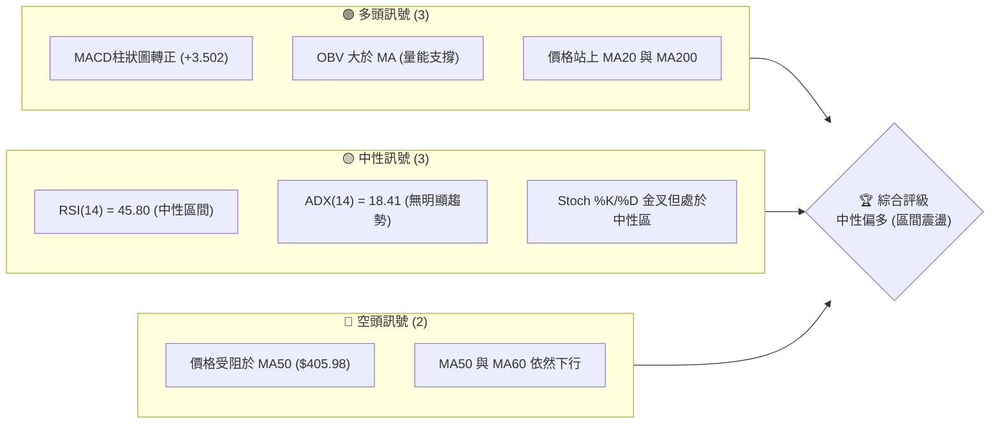
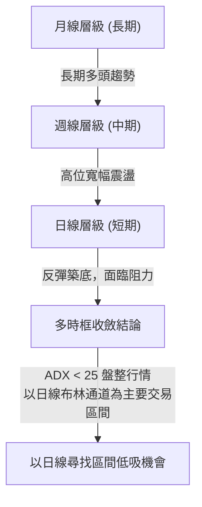
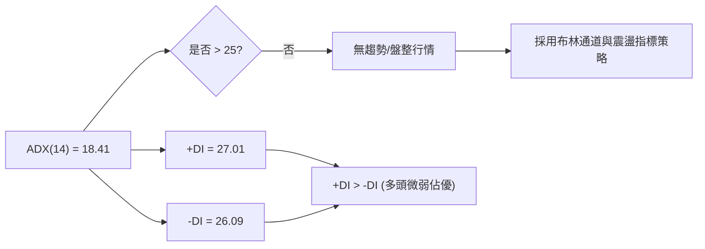
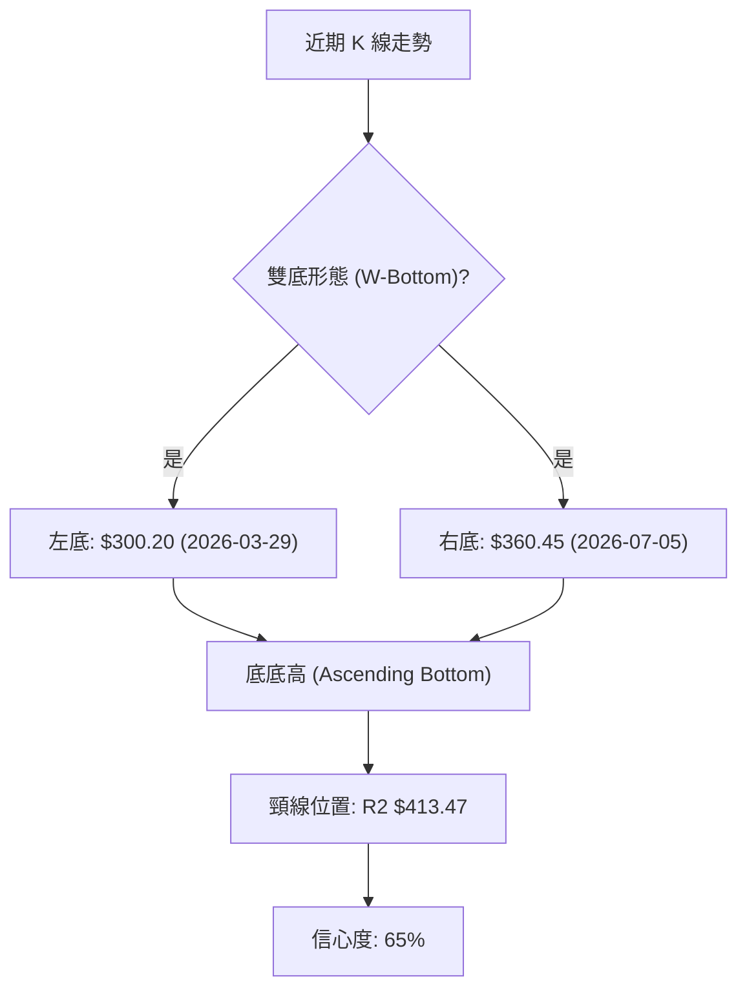
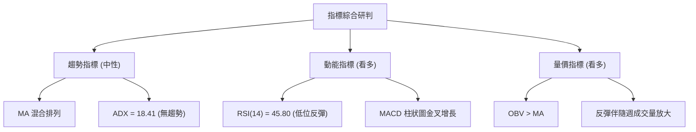
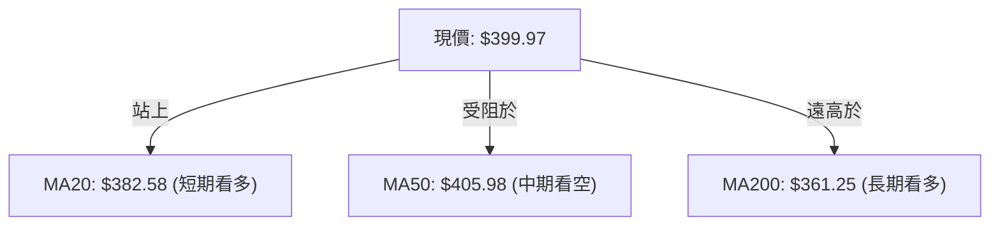
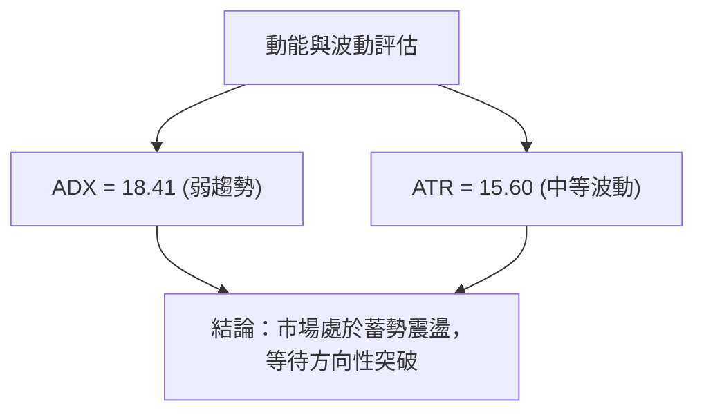
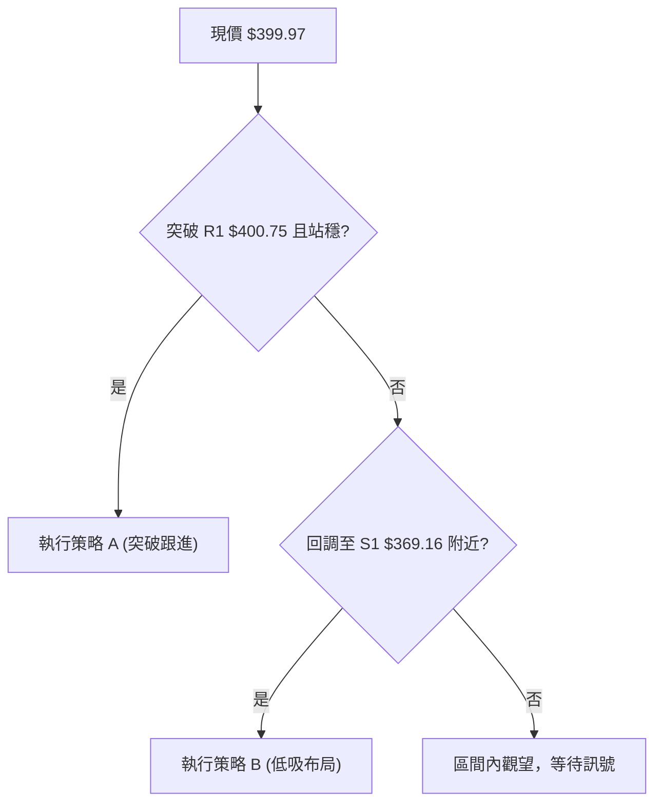
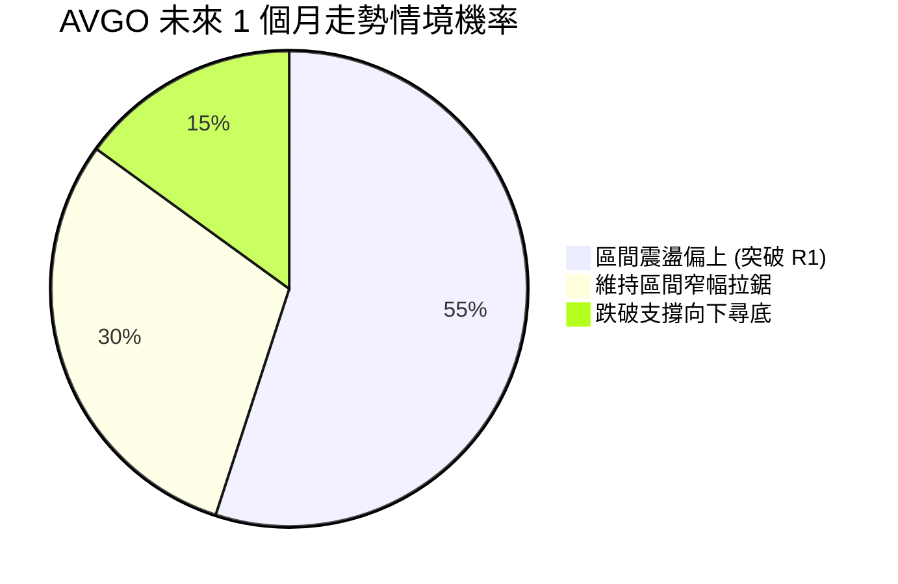
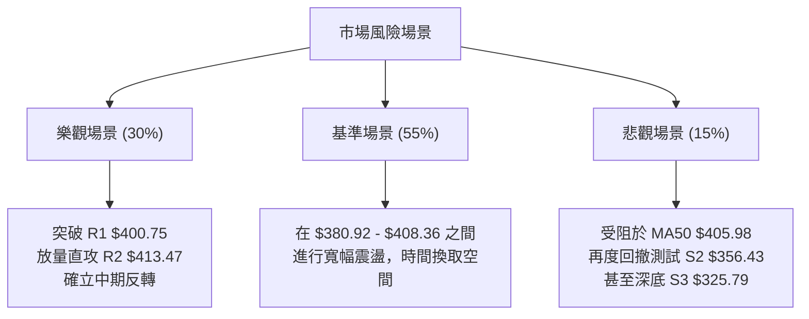

<details>
<summary>📊 靜態圖表 (點擊展開)</summary>

</details>

<html>
<head><meta charset="utf-8" /></head>
<body>
    <div style="height:500px; width:100%;">                        <script>window.PlotlyConfig = {MathJaxConfig: 'local'};</script>
        <script charset="utf-8" src="https://cdn.plot.ly/plotly-3.7.0.min.js" integrity="sha256-jvTGqxNp8AGWEcvNLVuKr+8j5dGe9Yw51LQkmDH+IYA=" crossorigin="anonymous"></script>                <div id="candlestick-chart" class="plotly-graph-div" style="height:100%; width:100%;"></div>            <script>                window.PLOTLYENV=window.PLOTLYENV || {};                                if (document.getElementById("candlestick-chart")) {                    Plotly.newPlot(                        "candlestick-chart",                        [{"close":{"dtype":"f8","bdata":"AAAAgNEQdUAAAACAtBZ1QAAAAKCh43RAAAAAwKbKdEAAAACgKWF0QAAAAKAkgXRAAAAAYIO4dEAAAADAuQR1QAAAAKC\u002fB3VAAAAAAO3ZdEAAAABAkOh0QAAAAGAxeXVAAAAAQI5xdUAAAABgIi10QAAAAOBkK3ZAAAAAIGVjdUAAAADg89V1QAAAAEDSAnZAAAAAoCG2dUAAAAAAs7R1QAAAAKABTHVAAAAA4HQmdUAAAADg8GV1QAAAAOCAAnZAAAAAYISAdkAAAACAQy53QAAAAIBD\u002fXdAAAAAoPNld0AAAAAgH\u002fl2QAAAAAB5iHZAAAAAoKjfdUAAAADAq092QAAAAMC7GXZAAAAAALm3dUAAAADASEZ2QAAAACD633VAAAAAwNgTdkAAAACAXSF1QAAAAADTSHVAAAAAwNhLdUAAAACAoyl1QAAAAAAeB3ZAAAAAADKOdUAAAACg3SR1QAAAAICofXdAAAAA4CXud0AAAACAq7V4QAAAAOBtC3lAAAAAwNr+d0AAAADgGLd3QAAAAIDSp3dAAAAAQIGud0AAAAAgC0F4QAAAAODV7XhAAAAAoGlAeUAAAACAsqp5QAAAAGCvQXlAAAAAQMledkAAAAAAqR51QAAAAABeNnVAAAAA4D9DdEAAAABgqoB0QAAAACBpJ3VAAAAAQCZDdUAAAABgm8B1QAAAAED0znVAAAAA4GbtdUAAAAAgucF1QAAAAEAOyXVAAAAAoEaNdUAAAACggaV1QAAAAMCNYnVAAAAAACJodUAAAAAg1GN1QAAAAOAntHRAAAAAQEN7dUAAAABgre51QAAAAKDvFHZAAAAAAEgqdUAAAABALVx1QAAAAOC05nVAAAAAoBG2dEAAAADgfXl0QAAAAOC5RHRAAAAAYAHuc0AAAAAghjp0QAAAAAAZuXRAAAAAYEXAdEAAAABAQph0QAAAAGBYoXRAAAAA4FCedEAAAAAgePJzQAAAAMC1LnNAAAAAIO1Vc0AAAACgK7t0QAAAAMDXanVAAAAAYAwzdUAAAABACFh1QAAAAOBFn3RAAAAAIKA\u002fdEAAAADAHLV0QAAAAECTxHRAAAAAIDrMdEAAAACg3bZ0QAAAAKAKknRAAAAA4LlEdEAAAAAgcrF0QAAAACBPCHRAAAAAAAnmc0AAAADgZdpzQAAAAMACi3NAAAAAgNXFc0AAAABAx7h0QAAAAABGlHRAAAAAQLKHdUAAAACAKVV1QAAAAOAPRXVAAAAAgMrrdEAAAABgpA90QAAAAOCjO3RAAAAAgBcCdEAAAADAU6xzQAAAAICo6nNAAAAAIO1Vc0AAAACgASB0QAAAAMCX3HNAAAAAQObkc0AAAACg5U5zQAAAACBHw3JAAAAAQCRPckAAAADAVVBzQAAAAADqj3NAAAAA4Nigc0AAAAAg7p5zQAAAAIAT13RAAAAAIDfhdUAAAABAliV2QAAAAOBnL3dAAAAAIGayd0AAAABA2sJ3QAAAAGB9wXhAAAAAIHLdeEAAAACgXF55QAAAAOD573hAAAAAYI0YeUAAAADAtl96QAAAAEBsNHpAAAAAwHhhekAAAACAoBh6QAAAAMAr83hAAAAAAPNMeUAAAACAUwx6QAAAACDUSXpAAAAAQHj9eUAAAACA9Kp6QAAAAKBIjHpAAAAAgIe+eUAAAADgINV6QAAAAEAMvHpAAAAA4DIqekAAAABAGgJ6QAAAAGCFcXtAAAAAQEqIekAAAAAguUB6QAAAACC6pnlAAAAAIJkRekAAAACAo955QAAAAADF13lAAAAAoH1VekAAAAAAGFN6QAAAAKB+nnpAAAAAQAbhe0AAAAAA5LN8QAAAAODxDH5AAAAAYJDnfUAAAAAA+CN6QAAAAIDtEXhAAAAAoJK\u002feEAAAAAgpXh4QAAAAEAxOHdAAAAAIF8PeEAAAADgddd3QAAAAIAUlXhAAAAA4NWBd0AAAABgd4R4QAAAAEAzq3lAAAAAgBSCeEAAAABgZsJ3QAAAAMAe4XdAAAAAYI+ud0AAAADgUdB2QAAAAEAzR3dAAAAAAACcd0AAAACgcBV3QAAAAEAzh3ZAAAAAYGZed0AAAADgeix3QAAAAEAKS3hAAAAAgMIReUAAAAAghf94QA=="},"high":{"dtype":"f8","bdata":"d1+aBr10dUDxl4LM9CJ1QLMGmwLRAnVAqAbZowsTdUCRkoPVYzJ1QIDBWvpHk3RA62BHCREBdUDO1cy+w5p1QF+h3dqwZ3VAIlbCR2VjdUDSFe+RnAN1QHfAkYK9iXVAnSAZ2v2VdUBW+viyVsp1QIb+7PIIVnZAC0B3tnPLdUC5RY1pWlZ2QO+iDWFzk3ZATuppsDnQdUBwBzrZpCl2QGdtADhL0nVASgu9ISGhdUCQ44a0N4p1QDnIH\u002fDZRHZA9EtmpaeLdkCs9X4+mz93QErPMBY4BXhAofIzNfIDeECeUFmZV4t3QDdMyRstTHdARoDBV03udkAMZeOsYq12QG29OpGWl3ZANI0JBWQIdkDJAvZ\u002f5l92QGuNLtX4fXZAgdgYz+tNdkAS6vhdRvl1QIJLs9QZbXVAI0jGoMvjdUCMRf0bfqB1QAQZl5P3WnZAN5R9975fd0DwH55BhKp1QNH1iSfwvXdAjB+fvHgfeECLLae\u002fQ9p4QDxfNNYQDHlAwrukTHaTeEC3FVnO6XR4QOleUiy2wndAREkslwLcd0BG2WzmY3V4QEM5CtRSUHlAXZgrZJhKeUDyeKZwysR5QEifHr5NcHlAg8QlN\u002fC9d0AHa5G5uH92QALYZrkDmXVA\u002fwjvftqKdUDpAG1dhOJ0QPoz01aTWHVA8FkV\u002foGPdUBkgsg\u002fM811QILIH\u002fAJ+XVAR2m2iUH\u002fdUAOCJIetdB1QGhJx1Qr9nVA68amrIjJdUB3zjV3YXV2QOwVpbehG3ZAoWFGgE28dUBtlWQrqsZ1QIS\u002fx6CyZnVAamfPPtehdUDgOCQ4ngl2QFQ\u002fecO6YnZA5alZZXLWdUAsfEuBWMZ1QMe4SahXE3ZA39Cs8x2CdUD0mrqkFOl0QGFqiv4M\u002fHRAKyTnde4MdEAJ3WcslHd0QKrlfIKA2HRAt2LU5t8rdUDepg3neOt0QMMt7CVXD3VA2A\u002fztTntdECAd5m2fxp1QElz5bdl5XNAuREyLE5VdEC2m1b7U9x0QPh+v9i\u002f8HVA8n\u002f9UrmrdUCDvsDAz551QDPFPBNOkHVAKT3y8nzRdEB3fmOeSOh0QAdT\u002fA09CnVA4vlYeioTdUDZFnuayS11QAlYqFQfFHVAf+lFO65xdEC5Doqh1ep0QP14oyMaVnRAAOoqfDXtc0C8BNao2O1zQAXjRPWHq3NAagaXTksXdEBzIG+DLu50QMoYif78Y3VAS2IbD2CzdUBPaVWfgP11QPIKcyKniHVA3BwV+VIpdUDV9nfRQBF1QM0suWjef3RAYbQC2c9jdEAMXkPI7UN0QE7Y7i9WIXRAWXRFw0cFdEAcNBcObV90QD+RCLQyPnRA2bFLt5k8dECjyp4UtcZzQGZQrLs5MHNArnesOJ0Ec0C\u002f1nxSHV1zQIHwFP2ntHNA6soBeBWjc0BJ6dJ\u002fZr5zQCk+wpXz2XRAFNxAaEkZdkDbfzCYIWJ2QBuWI4NHf3dA11rXcCHEd0COh4iK0Np3QFH7hYs9x3hA3gMra8bweED64i6lZWF5QFkvJM1xXHlArMWZXmUveUCLT6IQgGh6QConpRobynpAuUeDQEGFekBthf3MT2F6QAuEdCuzUnlAPTQtBfxPeUA88OeZgBt6QOHJTWQFaHpAAb22bpByekAXesx4SAt7QAgtFmfQT3tApdjxlg6dekBlTVmDACV7QGMttZZvD3tA4tFgxJXKekAUGUH3fh96QAxatl2TmntA+roqbgQCe0CYJPWVfVV6QDmGNxiiFHpAfnQuA\u002f93ekCoM9EKU1l6QCG65qI4NXpAruQiS\u002fQpe0ArZsdw2wF7QPCCfC8E0HpAuRLI9gwDfED7Tc9FBBV9QKbzX\u002fPCgH5ArStRLnzjfkB1p+TA5Zx6QOUNUw2fnXlAZUyPPEEjeUB78DqRm3N5QGTPfaM0E3hAT1cZ8CZOeEAlBmJq8gV4QA8bS98uuXhAQgcSBbxyeEDJzck2RQB5QJ\u002fxKiPEwHlAAAAAgD3qeUAAAADgUXB4QAAAAADXS3hAAAAAwMxMeEAAAABAClt3QAAAACBcg3dAAAAAgOu5d0AAAAAAAFx3QAAAAAAAYHdAAAAAYI\u002fyd0AAAAAgXE93QAAAAKBwsXhAAAAA4FF4eUAAAABACid5QA=="},"hovertemplate":"\u003cb\u003e%{x|%Y-%m-%d}\u003c\u002fb\u003e\u003cbr\u003e\u958b: $%{open:.2f}\u003cbr\u003e\u9ad8: $%{high:.2f}\u003cbr\u003e\u4f4e: $%{low:.2f}\u003cbr\u003e\u6536: $%{close:.2f}\u003cextra\u003e\u003c\u002fextra\u003e","low":{"dtype":"f8","bdata":"fb+q80TydEDQAqwLMr90QGoYvJ+dV3RAIdEnqs2LdEBuHUb9l1t0QAqZWLvQLHRAOlWIzRArdECVD7xhG9Z0QChfzCjn3XRAADZy+iDLdEBRqP7iKEx0QK4kDeJCrHRA1F9rNQwodUDTBVzd5yN0QPxNG1ywWXVA7hGgQx0cdUA+EiytA5l1QNIRhz+tuHVAGPmwChgudUD\u002fpQ6VbJ51QBNL5dCGNnVAI4+zdj7adEA0FdArDCh1QHbd0w\u002fLznVAf0z9WZ4RdkBrWDaPJ4h2QEfK7pPDMXdAkHdtkfb\u002fdkCNRXqnC7F2QAxctWJnf3ZALVoH1bPQdUDhRksuOcJ1QIPjjP3o63VARmvhMT\u002f2dECExc8IJAp2QNmGp6WKu3VAZdgyroXbdUDwmAOaw8R0QML9m3+ec3RA69wXWjn6dEBoDLdnPtp0QDHh\u002fsKt\u002fnRAkcaj7xl0dUBNh4\u002feNp90QAoqA2ePm3VAsqXII9oad0CBHcNm\u002fNF3QGxEBoUlr3hAd36cHkPvd0AJg4ihxpp3QI+JFrpZCXdA3J1C+Odmd0D5GAewDvB3QDajbRX3snhA6btP0uSUeEA6sTE6VdV4QDXCuyfkf3hAyIqFfLsSdkCWMU7AEPp0QHEXN3AV03RAQ9S4YA\u002f6c0A6PvoKOR10QKX08Nefq3RAiY3rtrf\u002fdEDrfqOOwhR1QI9DNe3anXVAWR9lOJSndUApLLyHzHZ1QPu+v6RJwHVAz7v0mG+CdUA6X\u002fPXqoR1QAsvRWc99HRAV4Rr3SYMdUD3GGEtW+p0QBOWFoSXlHRA6GgzjWrEdECcDELFLTt1QPCxPx\u002f02XVAXqy9GhXTdEDz\u002flALqEZ1QCA0F6eYbHVAh\u002f3XxlCpdED5CNuGKTB0QBuq\u002fWQpO3RANKYXbFCPc0DdKGsd88ZzQABjz70dXXRAjTzo8ANYdECbXWoYrPFzQOlGw+X\u002fcXRAZYbT895IdEBgvqZ1RjhzQJeRm2x1Y3JA5ymCpjAZc0ChT9bYObJzQJWdZqr7lnRAHkwcxXspdUCNW1bZPch0QHe2FnSbhXRAFyJJN\u002fk3dEDXvf2cYrJzQO60s8h2YHRA0h7QKoWHdECRKdEG7YV0QIOCKTcEQnRArI0TF7yUc0BaNNDMJIF0QB61TCHMLHNAsJJJ0MtNc0BMAHMPKSFzQJvklU9ZJHNAGhVMqohpc0C8Zoysgh10QL63VI0sY3RAe68slsEmdEAKd2RiyTh1QKkidZyoD3VA5XaSTLGvdED0IWQ5AQR0QN+Ubk8q7nNAF92tyF7Bc0DGo3f2RKZzQIpbmDILNnNAyT2PXoVMc0DHkVvv6qZzQG84g9R6pXNAJ08LJ4PDc0A\u002f+T4+50pzQNyXDRddpnJA1GeeVAcYckAzLZqd8n1yQCAMQpvUX3NAG42M+F7UckDQtUucolxzQK2qQ+WpFHRAKDPt7NFfdUAvdyryHO91QL+BR1P\u002fg3ZARTaRuFYOd0CWVRv+mnt3QE7Q8ipfD3hAypQ0PK57eEDF4wQP2vJ4QIG7huRjtHhAULmv8CSfeEBRWJQFhkN5QNuV1pk8EnpAFpA+N2yDeUC3QEDbmN95QJGI9QZsoHhA7Tu6vXLCeECqdU\u002fPdTl5QKQBwecHynlAVqnQPCCOeUDym8t3\u002fyp6QKMLKNTqEXpA8p9pBIdaeUCJO+JuiNV5QPOhgaANhnpAuXP5+zt8eUDJ\u002fKC6kEJ5QBOH4MHu7nlA\u002fcPmoi8yekCv8vGIcdt5QOkBt5h\u002fU3lAkI7SiFGseUAZ47MXn515QFDx1g\u002f9mHlA1sogDXUFekBaXOdBT\u002f15QEykp1ux1XlAz1WlhpzsekB8Q7ziVph7QCy9Vih3W31ARYsgZ0p+fUAmpnWJ+CV5QNxc\u002f+ewD3hAPtgPm7RreEDSjWKr6ht3QNIA7wRWKXdAQF3NV24fd0D4CY3wd4Z3QCdbEXDGP3hATDQ9ftd9d0BIvom3ueB3QJ4BusPUS3lAAAAAYI9+eEAAAABgj4p3QAAAACBcj3dAAAAAQDNLd0AAAACgR712QAAAACBch3ZAAAAAgD0qd0AAAADgegB3QAAAAEDhRnZAAAAAQOEyd0AAAAAAKaB2QAAAAIA9jndAAAAAQOE+eEAAAABAM7t4QA=="},"name":"\u50f9\u683c","open":{"dtype":"f8","bdata":"nZV5k4AldUCas1F63R11QJaWq\u002f0lsnRAgAOy7cr4dECr8U5bCuJ0QLg74\u002fR7hHRAZCF+3CNldEDO1cy+w5p1QMXfYa2MOXVAo84kj8TgdEBIKPqYbfJ0QEUdnr1av3RAfPMatit9dUDA0dJ\u002fcXd1QLnI4DXd7HVAOH0WKtzCdUAhi8uy6Qd2QHTRTiL8LHZARbnMG5a6dUBSqAapQP11QPNR\u002f7PKwHVAkRzSFtWVdUA0FdArDCh1QA7Fqlq66HVARhAfJGd4dkCyP08hlol2QEfK7pPDMXdAofIzNfIDeEBF3W5Hl4J3QCS1CorUHndADjD6DFpIdkAOrkDL8851QFCPEHOmYXZAbe2HWHUDdkCXqnbPfD52QMyIfhyDT3ZAvCkpIbdAdkBhF\u002fI17tl1QJJzntz2mXRA5kKHudEedUDflxgemVR1QDPqtbX6LHVAkVM1b12\u002fdkBiV7CHyHN1QNe16Y2snHVAycxmiI7sd0AXrOjga\u002fZ3QJHZccf90XhArmuJj2SKeEA7+HIGViJ4QN7PgOwdnndAxeNMne+od0DioGpnSQB4QBspyt\u002fKA3lAd9wC3XHIeEAShRp3Vv94QOI3SacuKXlAIGkx6Hqdd0Afd0i8+H12QDSJYKZb4nRA\u002fwjvftqKdUC4nLosCuJ0QPoDrX63t3RAPsU4BimMdUCuD6BO8jh1QLL5N09y1nVA8\u002fjoNVjcdUDqY4LSCrd1QGSxMvL3ynVAUWbnjSTHdUD8uZltw\u002fd1QGTWuTMCF3ZAEf8qTmxldUCDYDZvIkd1QIv9achZWHVAnd0ze+AKdUCcDELFLTt1QFjKxKFb+XVAz2eZIAe7dUCPLGssa711QO6jimf8j3VAknWivmRtdUBzK7NAdeR0QKho+kXo4XRA8sVfpgzic0CdCNoqBepzQEB75KzLiHRA0yQGqrMZdUDnaWBdbrV0QA6Fw7yEs3RA4IZtCpxOdEAKvTnPEPh0QElz5bdl5XNA9LKQLPuSc0AmaMWYze5zQC32mVzlmHRA85IzkR2jdUB41jxEb5h1QFlYi84WaXVAz7JnBTuKdEB2lptzG+hzQKnjrBv4hHRAgQ9o25q8dEDcfRYcPrJ0QA6zc0l9sHRAMRLuGLMVdECtKRr6aph0QMSZdrfTVHRA3h5aivRYc0CxwM\u002fWl0NzQElToMCefXNAqpGSr1eoc0AfLaePfY90QBo6qtIzcXRAdjOGXchgdECMKWaLM7d1QLOxlWpSVXVADThOxAEIdUBXCYTwDAd1QAca0tYsTXRAD+le2gdJdEDgwocZEPRzQLsz3sordXNAzyylKB\u002fvc0C2xqbQ9ddzQNJOn87o93NAWq+vqEghdECoCupZYZhzQG7OulQyKXNArsnnFlDGckAHnvq\u002fq65yQLAi0kb\u002fjXNALhmbPCQAc0D3dB6M\u002fqhzQGa4ZVxrY3RAVMRGYBvzdUDCqqKE5Pt1QGJkcwzqhXZAYV5VzjYRd0CTpxpk2JR3QPrZggU5VHhAq9FvdQOmeEDzav6gQwR5QDToKVbxUHlAI2AlPXbseEB3m8DsY2V5QIEWhaSPW3pAbA6ige+EekDK0TOeDD16QJEHpsTW+nhAc6oPX8wteUAOCbl80O15QDnGpPDx5nlARV8TPvIYekDpxldE5k96QMPeyZ\u002fyLXtAk1fKkHRSekCyZrWkLzJ6QD6QIL4br3pA48XbpCxsekBkVs93cvJ5QD8L8uAkAXpA+roqbgQCe0DyiiDY50t6QAYYLjfCknlAy1u96YXCeUCi6RgaWM55QOm4RNFIDXpAMefDV2sdekBanxl5X4Z6QDdNsLWXR3pAMgZoEkEEe0DwdJpyDxZ8QDiIFEVIgH5Au67XevjffkDtt\u002fHUf4V5QCFr8EF0b3lAzQkYib0feUAjBMsVmw95QOwO3MhazndAjI9vprFDd0BWYRuS0fF3QKl+lhYprnhA9\u002fcWf35ZeEA5A4s+iEF4QFE1wbTsjnlAAAAAYI\u002faeUAAAACA6513QAAAAIDrKXhAAAAAoEcpeEAAAABAMyd3QAAAAIDrWXdAAAAA4KNsd0AAAACA6z13QAAAACCu23ZAAAAAgMJZd0AAAADA9eh2QAAAAOBRmHdAAAAAQAojeUAAAAAAAOh4QA=="},"x":["2025-09-23T00:00:00-04:00","2025-09-24T00:00:00-04:00","2025-09-25T00:00:00-04:00","2025-09-26T00:00:00-04:00","2025-09-29T00:00:00-04:00","2025-09-30T00:00:00-04:00","2025-10-01T00:00:00-04:00","2025-10-02T00:00:00-04:00","2025-10-03T00:00:00-04:00","2025-10-06T00:00:00-04:00","2025-10-07T00:00:00-04:00","2025-10-08T00:00:00-04:00","2025-10-09T00:00:00-04:00","2025-10-10T00:00:00-04:00","2025-10-13T00:00:00-04:00","2025-10-14T00:00:00-04:00","2025-10-15T00:00:00-04:00","2025-10-16T00:00:00-04:00","2025-10-17T00:00:00-04:00","2025-10-20T00:00:00-04:00","2025-10-21T00:00:00-04:00","2025-10-22T00:00:00-04:00","2025-10-23T00:00:00-04:00","2025-10-24T00:00:00-04:00","2025-10-27T00:00:00-04:00","2025-10-28T00:00:00-04:00","2025-10-29T00:00:00-04:00","2025-10-30T00:00:00-04:00","2025-10-31T00:00:00-04:00","2025-11-03T00:00:00-05:00","2025-11-04T00:00:00-05:00","2025-11-05T00:00:00-05:00","2025-11-06T00:00:00-05:00","2025-11-07T00:00:00-05:00","2025-11-10T00:00:00-05:00","2025-11-11T00:00:00-05:00","2025-11-12T00:00:00-05:00","2025-11-13T00:00:00-05:00","2025-11-14T00:00:00-05:00","2025-11-17T00:00:00-05:00","2025-11-18T00:00:00-05:00","2025-11-19T00:00:00-05:00","2025-11-20T00:00:00-05:00","2025-11-21T00:00:00-05:00","2025-11-24T00:00:00-05:00","2025-11-25T00:00:00-05:00","2025-11-26T00:00:00-05:00","2025-11-28T00:00:00-05:00","2025-12-01T00:00:00-05:00","2025-12-02T00:00:00-05:00","2025-12-03T00:00:00-05:00","2025-12-04T00:00:00-05:00","2025-12-05T00:00:00-05:00","2025-12-08T00:00:00-05:00","2025-12-09T00:00:00-05:00","2025-12-10T00:00:00-05:00","2025-12-11T00:00:00-05:00","2025-12-12T00:00:00-05:00","2025-12-15T00:00:00-05:00","2025-12-16T00:00:00-05:00","2025-12-17T00:00:00-05:00","2025-12-18T00:00:00-05:00","2025-12-19T00:00:00-05:00","2025-12-22T00:00:00-05:00","2025-12-23T00:00:00-05:00","2025-12-24T00:00:00-05:00","2025-12-26T00:00:00-05:00","2025-12-29T00:00:00-05:00","2025-12-30T00:00:00-05:00","2025-12-31T00:00:00-05:00","2026-01-02T00:00:00-05:00","2026-01-05T00:00:00-05:00","2026-01-06T00:00:00-05:00","2026-01-07T00:00:00-05:00","2026-01-08T00:00:00-05:00","2026-01-09T00:00:00-05:00","2026-01-12T00:00:00-05:00","2026-01-13T00:00:00-05:00","2026-01-14T00:00:00-05:00","2026-01-15T00:00:00-05:00","2026-01-16T00:00:00-05:00","2026-01-20T00:00:00-05:00","2026-01-21T00:00:00-05:00","2026-01-22T00:00:00-05:00","2026-01-23T00:00:00-05:00","2026-01-26T00:00:00-05:00","2026-01-27T00:00:00-05:00","2026-01-28T00:00:00-05:00","2026-01-29T00:00:00-05:00","2026-01-30T00:00:00-05:00","2026-02-02T00:00:00-05:00","2026-02-03T00:00:00-05:00","2026-02-04T00:00:00-05:00","2026-02-05T00:00:00-05:00","2026-02-06T00:00:00-05:00","2026-02-09T00:00:00-05:00","2026-02-10T00:00:00-05:00","2026-02-11T00:00:00-05:00","2026-02-12T00:00:00-05:00","2026-02-13T00:00:00-05:00","2026-02-17T00:00:00-05:00","2026-02-18T00:00:00-05:00","2026-02-19T00:00:00-05:00","2026-02-20T00:00:00-05:00","2026-02-23T00:00:00-05:00","2026-02-24T00:00:00-05:00","2026-02-25T00:00:00-05:00","2026-02-26T00:00:00-05:00","2026-02-27T00:00:00-05:00","2026-03-02T00:00:00-05:00","2026-03-03T00:00:00-05:00","2026-03-04T00:00:00-05:00","2026-03-05T00:00:00-05:00","2026-03-06T00:00:00-05:00","2026-03-09T00:00:00-04:00","2026-03-10T00:00:00-04:00","2026-03-11T00:00:00-04:00","2026-03-12T00:00:00-04:00","2026-03-13T00:00:00-04:00","2026-03-16T00:00:00-04:00","2026-03-17T00:00:00-04:00","2026-03-18T00:00:00-04:00","2026-03-19T00:00:00-04:00","2026-03-20T00:00:00-04:00","2026-03-23T00:00:00-04:00","2026-03-24T00:00:00-04:00","2026-03-25T00:00:00-04:00","2026-03-26T00:00:00-04:00","2026-03-27T00:00:00-04:00","2026-03-30T00:00:00-04:00","2026-03-31T00:00:00-04:00","2026-04-01T00:00:00-04:00","2026-04-02T00:00:00-04:00","2026-04-06T00:00:00-04:00","2026-04-07T00:00:00-04:00","2026-04-08T00:00:00-04:00","2026-04-09T00:00:00-04:00","2026-04-10T00:00:00-04:00","2026-04-13T00:00:00-04:00","2026-04-14T00:00:00-04:00","2026-04-15T00:00:00-04:00","2026-04-16T00:00:00-04:00","2026-04-17T00:00:00-04:00","2026-04-20T00:00:00-04:00","2026-04-21T00:00:00-04:00","2026-04-22T00:00:00-04:00","2026-04-23T00:00:00-04:00","2026-04-24T00:00:00-04:00","2026-04-27T00:00:00-04:00","2026-04-28T00:00:00-04:00","2026-04-29T00:00:00-04:00","2026-04-30T00:00:00-04:00","2026-05-01T00:00:00-04:00","2026-05-04T00:00:00-04:00","2026-05-05T00:00:00-04:00","2026-05-06T00:00:00-04:00","2026-05-07T00:00:00-04:00","2026-05-08T00:00:00-04:00","2026-05-11T00:00:00-04:00","2026-05-12T00:00:00-04:00","2026-05-13T00:00:00-04:00","2026-05-14T00:00:00-04:00","2026-05-15T00:00:00-04:00","2026-05-18T00:00:00-04:00","2026-05-19T00:00:00-04:00","2026-05-20T00:00:00-04:00","2026-05-21T00:00:00-04:00","2026-05-22T00:00:00-04:00","2026-05-26T00:00:00-04:00","2026-05-27T00:00:00-04:00","2026-05-28T00:00:00-04:00","2026-05-29T00:00:00-04:00","2026-06-01T00:00:00-04:00","2026-06-02T00:00:00-04:00","2026-06-03T00:00:00-04:00","2026-06-04T00:00:00-04:00","2026-06-05T00:00:00-04:00","2026-06-08T00:00:00-04:00","2026-06-09T00:00:00-04:00","2026-06-10T00:00:00-04:00","2026-06-11T00:00:00-04:00","2026-06-12T00:00:00-04:00","2026-06-15T00:00:00-04:00","2026-06-16T00:00:00-04:00","2026-06-17T00:00:00-04:00","2026-06-18T00:00:00-04:00","2026-06-22T00:00:00-04:00","2026-06-23T00:00:00-04:00","2026-06-24T00:00:00-04:00","2026-06-25T00:00:00-04:00","2026-06-26T00:00:00-04:00","2026-06-29T00:00:00-04:00","2026-06-30T00:00:00-04:00","2026-07-01T00:00:00-04:00","2026-07-02T00:00:00-04:00","2026-07-06T00:00:00-04:00","2026-07-07T00:00:00-04:00","2026-07-08T00:00:00-04:00","2026-07-09T00:00:00-04:00","2026-07-10T00:00:00-04:00"],"type":"candlestick"},{"hovertemplate":"MA30: $%{y:.2f}\u003cextra\u003e\u003c\u002fextra\u003e","line":{"color":"#2196F3","dash":"dash","width":2},"mode":"lines","name":"MA30","x":["2025-09-23T00:00:00-04:00","2025-09-24T00:00:00-04:00","2025-09-25T00:00:00-04:00","2025-09-26T00:00:00-04:00","2025-09-29T00:00:00-04:00","2025-09-30T00:00:00-04:00","2025-10-01T00:00:00-04:00","2025-10-02T00:00:00-04:00","2025-10-03T00:00:00-04:00","2025-10-06T00:00:00-04:00","2025-10-07T00:00:00-04:00","2025-10-08T00:00:00-04:00","2025-10-09T00:00:00-04:00","2025-10-10T00:00:00-04:00","2025-10-13T00:00:00-04:00","2025-10-14T00:00:00-04:00","2025-10-15T00:00:00-04:00","2025-10-16T00:00:00-04:00","2025-10-17T00:00:00-04:00","2025-10-20T00:00:00-04:00","2025-10-21T00:00:00-04:00","2025-10-22T00:00:00-04:00","2025-10-23T00:00:00-04:00","2025-10-24T00:00:00-04:00","2025-10-27T00:00:00-04:00","2025-10-28T00:00:00-04:00","2025-10-29T00:00:00-04:00","2025-10-30T00:00:00-04:00","2025-10-31T00:00:00-04:00","2025-11-03T00:00:00-05:00","2025-11-04T00:00:00-05:00","2025-11-05T00:00:00-05:00","2025-11-06T00:00:00-05:00","2025-11-07T00:00:00-05:00","2025-11-10T00:00:00-05:00","2025-11-11T00:00:00-05:00","2025-11-12T00:00:00-05:00","2025-11-13T00:00:00-05:00","2025-11-14T00:00:00-05:00","2025-11-17T00:00:00-05:00","2025-11-18T00:00:00-05:00","2025-11-19T00:00:00-05:00","2025-11-20T00:00:00-05:00","2025-11-21T00:00:00-05:00","2025-11-24T00:00:00-05:00","2025-11-25T00:00:00-05:00","2025-11-26T00:00:00-05:00","2025-11-28T00:00:00-05:00","2025-12-01T00:00:00-05:00","2025-12-02T00:00:00-05:00","2025-12-03T00:00:00-05:00","2025-12-04T00:00:00-05:00","2025-12-05T00:00:00-05:00","2025-12-08T00:00:00-05:00","2025-12-09T00:00:00-05:00","2025-12-10T00:00:00-05:00","2025-12-11T00:00:00-05:00","2025-12-12T00:00:00-05:00","2025-12-15T00:00:00-05:00","2025-12-16T00:00:00-05:00","2025-12-17T00:00:00-05:00","2025-12-18T00:00:00-05:00","2025-12-19T00:00:00-05:00","2025-12-22T00:00:00-05:00","2025-12-23T00:00:00-05:00","2025-12-24T00:00:00-05:00","2025-12-26T00:00:00-05:00","2025-12-29T00:00:00-05:00","2025-12-30T00:00:00-05:00","2025-12-31T00:00:00-05:00","2026-01-02T00:00:00-05:00","2026-01-05T00:00:00-05:00","2026-01-06T00:00:00-05:00","2026-01-07T00:00:00-05:00","2026-01-08T00:00:00-05:00","2026-01-09T00:00:00-05:00","2026-01-12T00:00:00-05:00","2026-01-13T00:00:00-05:00","2026-01-14T00:00:00-05:00","2026-01-15T00:00:00-05:00","2026-01-16T00:00:00-05:00","2026-01-20T00:00:00-05:00","2026-01-21T00:00:00-05:00","2026-01-22T00:00:00-05:00","2026-01-23T00:00:00-05:00","2026-01-26T00:00:00-05:00","2026-01-27T00:00:00-05:00","2026-01-28T00:00:00-05:00","2026-01-29T00:00:00-05:00","2026-01-30T00:00:00-05:00","2026-02-02T00:00:00-05:00","2026-02-03T00:00:00-05:00","2026-02-04T00:00:00-05:00","2026-02-05T00:00:00-05:00","2026-02-06T00:00:00-05:00","2026-02-09T00:00:00-05:00","2026-02-10T00:00:00-05:00","2026-02-11T00:00:00-05:00","2026-02-12T00:00:00-05:00","2026-02-13T00:00:00-05:00","2026-02-17T00:00:00-05:00","2026-02-18T00:00:00-05:00","2026-02-19T00:00:00-05:00","2026-02-20T00:00:00-05:00","2026-02-23T00:00:00-05:00","2026-02-24T00:00:00-05:00","2026-02-25T00:00:00-05:00","2026-02-26T00:00:00-05:00","2026-02-27T00:00:00-05:00","2026-03-02T00:00:00-05:00","2026-03-03T00:00:00-05:00","2026-03-04T00:00:00-05:00","2026-03-05T00:00:00-05:00","2026-03-06T00:00:00-05:00","2026-03-09T00:00:00-04:00","2026-03-10T00:00:00-04:00","2026-03-11T00:00:00-04:00","2026-03-12T00:00:00-04:00","2026-03-13T00:00:00-04:00","2026-03-16T00:00:00-04:00","2026-03-17T00:00:00-04:00","2026-03-18T00:00:00-04:00","2026-03-19T00:00:00-04:00","2026-03-20T00:00:00-04:00","2026-03-23T00:00:00-04:00","2026-03-24T00:00:00-04:00","2026-03-25T00:00:00-04:00","2026-03-26T00:00:00-04:00","2026-03-27T00:00:00-04:00","2026-03-30T00:00:00-04:00","2026-03-31T00:00:00-04:00","2026-04-01T00:00:00-04:00","2026-04-02T00:00:00-04:00","2026-04-06T00:00:00-04:00","2026-04-07T00:00:00-04:00","2026-04-08T00:00:00-04:00","2026-04-09T00:00:00-04:00","2026-04-10T00:00:00-04:00","2026-04-13T00:00:00-04:00","2026-04-14T00:00:00-04:00","2026-04-15T00:00:00-04:00","2026-04-16T00:00:00-04:00","2026-04-17T00:00:00-04:00","2026-04-20T00:00:00-04:00","2026-04-21T00:00:00-04:00","2026-04-22T00:00:00-04:00","2026-04-23T00:00:00-04:00","2026-04-24T00:00:00-04:00","2026-04-27T00:00:00-04:00","2026-04-28T00:00:00-04:00","2026-04-29T00:00:00-04:00","2026-04-30T00:00:00-04:00","2026-05-01T00:00:00-04:00","2026-05-04T00:00:00-04:00","2026-05-05T00:00:00-04:00","2026-05-06T00:00:00-04:00","2026-05-07T00:00:00-04:00","2026-05-08T00:00:00-04:00","2026-05-11T00:00:00-04:00","2026-05-12T00:00:00-04:00","2026-05-13T00:00:00-04:00","2026-05-14T00:00:00-04:00","2026-05-15T00:00:00-04:00","2026-05-18T00:00:00-04:00","2026-05-19T00:00:00-04:00","2026-05-20T00:00:00-04:00","2026-05-21T00:00:00-04:00","2026-05-22T00:00:00-04:00","2026-05-26T00:00:00-04:00","2026-05-27T00:00:00-04:00","2026-05-28T00:00:00-04:00","2026-05-29T00:00:00-04:00","2026-06-01T00:00:00-04:00","2026-06-02T00:00:00-04:00","2026-06-03T00:00:00-04:00","2026-06-04T00:00:00-04:00","2026-06-05T00:00:00-04:00","2026-06-08T00:00:00-04:00","2026-06-09T00:00:00-04:00","2026-06-10T00:00:00-04:00","2026-06-11T00:00:00-04:00","2026-06-12T00:00:00-04:00","2026-06-15T00:00:00-04:00","2026-06-16T00:00:00-04:00","2026-06-17T00:00:00-04:00","2026-06-18T00:00:00-04:00","2026-06-22T00:00:00-04:00","2026-06-23T00:00:00-04:00","2026-06-24T00:00:00-04:00","2026-06-25T00:00:00-04:00","2026-06-26T00:00:00-04:00","2026-06-29T00:00:00-04:00","2026-06-30T00:00:00-04:00","2026-07-01T00:00:00-04:00","2026-07-02T00:00:00-04:00","2026-07-06T00:00:00-04:00","2026-07-07T00:00:00-04:00","2026-07-08T00:00:00-04:00","2026-07-09T00:00:00-04:00","2026-07-10T00:00:00-04:00"],"y":{"dtype":"f8","bdata":"AAAAAAAA+H8AAAAAAAD4fwAAAAAAAPh\u002fAAAAAAAA+H8AAAAAAAD4fwAAAAAAAPh\u002fAAAAAAAA+H8AAAAAAAD4fwAAAAAAAPh\u002fAAAAAAAA+H8AAAAAAAD4fwAAAAAAAPh\u002fAAAAAAAA+H8AAAAAAAD4fwAAAAAAAPh\u002fAAAAAAAA+H8AAAAAAAD4fwAAAAAAAPh\u002fAAAAAAAA+H8AAAAAAAD4fwAAAAAAAPh\u002fAAAAAAAA+H8AAAAAAAD4fwAAAAAAAPh\u002fAAAAAAAA+H8AAAAAAAD4fwAAAAAAAPh\u002fAAAAAAAA+H8AAAAAAAD4f5qZmTkllnVAMzMzQwqddUB3d3fneKd1QLy7uxvPsXVA3t3dHba5dUAiIiLS4cl1QKuqqpqT1XVAREREhCfhdUCJiIjoG+J1QImIiDhH5HVAiYiIWBPodUB3d3enPup1QN7d3b357nVAIiIiIu7vdUC8u7sbMPh1QBEREaF2A3ZAiYiIuCcZdkB3d3fXrTF2QFVVVeWQS3ZAiYiIiA5fdkAAAAAQNHB2QAAAAKBUhHZAMzMzo+6ZdkARERFhTbJ2QM3MzJw2y3ZAAAAAMK3idkBmZmYW5Pd2QLy7u3u0AndA3t3dze75dkARERERHup2QGZmZubY3nZAzczMrBnRdkAiIiKyqsF2QAAAAOCWuXZA3t3dHbS1dkB3d3dnP7F2QERERCSusHZAREREFGavdkB3d3d3vrR2QFVVVbUEuXZAmpmZCTO7dkCrqqoKVL92QERERMTXuXZAd3d395K4dkAAAABArLp2QCIiIrLjonZAZmZmRv6NdkAzMzMjS3Z2QJqZmakCXXZAMzMzo9tEdkB3d3e3wjB2QDMzM0PKIXZAVVVVNXEIdkBERETEMOh1QBEREZFrwHVAERERsQGTdUAAAADQmWR1QCIiIiLqPXVAAAAA8BgwdUC8u7sLnit1QERERGSmJnVA3t3dfa8pdUBVVVUV8iR1QN7d3U0fFHVAd3d3d64DdUCrqqqK9\u002fp0QCIiIkKh93RAq6qqCmvxdEBVVVUl5e10QBERERH443RAq6qq6tjYdEDe3d2N1dB0QImIiHiRy3RAMzMzE1\u002fGdEAAAAAgm8B0QERERAR4v3RAq6qqGh61dEAAAAAQi6p0QO\u002fu7j4OmXRAiYiIWD+OdEDe3d1dY4F0QERERNRDbXRAMzMz00FldEDv7u7eXWd0QM3MzKwEanRAREREtKx3dEDNzMyMGIF0QJqZmenChXRAiYiISDaHdEDNzMx8qIJ0QKuqqppEf3RA3t3dfQ96dEAiIiLyuHd0QFVVVcX8fXRAVVVVxfx9dEBERES00Hh0QN7d3U2Ka3RAZmZm5mZgdEARERHhB090QN7d3Q0qP3RAREREZJ0udEBERETkuCJ0QLy7u\u002ftuGHRAZmZmRnQOdEDe3d19HwV0QGZmZpZsB3RA7+7ufiwVdECamZkZlCF0QDMzM1N7PHRARERE1ORcdECrqqoKPn50QImIiJi5qnRAAAAAwC3WdEDNzMzc1P10QGZmZoYFI3VAq6qqOnNBdUAAAADwd2x1QN7d3Z2UlnVA3t3dfSvFdUDNzMxcq\u002fh1QAAAAKDrIHZAMzMzExVOdkB3d3d3e4R2QJqZmcnaunZAERERsaPzdkBmZmaWeCt3QERERASHZHdAq6qqynKWd0B3d3f3p9Z3QJqZmYmuGnhA7+7ujrddeEBVVVW115Z4QO\u002fu7p4Y2nhAzczMzAIVeUAiIiKimk15QImIiLiodnlAiYiIuGeaeUDe3d1tLLp5QDMzMzPa0HlAvLu7+1rneUCJiIjoOv15QJqZmVkhDXpAzczMfNkmekDv7u7uTEN6QM3MzMzubnpA7+7ubveXekC8u7ub+ZV6QO\u002fu7i7Cg3pAzczMHNR1ekBmZmZm9md6QBEREVEyWXpAIiIiUpxOekAiIiIiyDt6QGZmZjY5LXpAIiIiIgkYekARERGhrwV6QKuqquou\u002fnlAzczMjKLzeUAiIiIiadl5QCIiIuILwXlARERExNureUCrqqpamZB5QFVVVRUObXlAzczMrBxUeUCamZm5ETl5QImIiBhrHnlA7+7u3mAHeUBERESEX\u002fB4QHd3dxcm43hAZmZmllvYeEBERETkCc14QA=="},"type":"scatter"},{"hovertemplate":"MA60: $%{y:.2f}\u003cextra\u003e\u003c\u002fextra\u003e","line":{"color":"#9C27B0","dash":"dash","width":2},"mode":"lines","name":"MA60","x":["2025-09-23T00:00:00-04:00","2025-09-24T00:00:00-04:00","2025-09-25T00:00:00-04:00","2025-09-26T00:00:00-04:00","2025-09-29T00:00:00-04:00","2025-09-30T00:00:00-04:00","2025-10-01T00:00:00-04:00","2025-10-02T00:00:00-04:00","2025-10-03T00:00:00-04:00","2025-10-06T00:00:00-04:00","2025-10-07T00:00:00-04:00","2025-10-08T00:00:00-04:00","2025-10-09T00:00:00-04:00","2025-10-10T00:00:00-04:00","2025-10-13T00:00:00-04:00","2025-10-14T00:00:00-04:00","2025-10-15T00:00:00-04:00","2025-10-16T00:00:00-04:00","2025-10-17T00:00:00-04:00","2025-10-20T00:00:00-04:00","2025-10-21T00:00:00-04:00","2025-10-22T00:00:00-04:00","2025-10-23T00:00:00-04:00","2025-10-24T00:00:00-04:00","2025-10-27T00:00:00-04:00","2025-10-28T00:00:00-04:00","2025-10-29T00:00:00-04:00","2025-10-30T00:00:00-04:00","2025-10-31T00:00:00-04:00","2025-11-03T00:00:00-05:00","2025-11-04T00:00:00-05:00","2025-11-05T00:00:00-05:00","2025-11-06T00:00:00-05:00","2025-11-07T00:00:00-05:00","2025-11-10T00:00:00-05:00","2025-11-11T00:00:00-05:00","2025-11-12T00:00:00-05:00","2025-11-13T00:00:00-05:00","2025-11-14T00:00:00-05:00","2025-11-17T00:00:00-05:00","2025-11-18T00:00:00-05:00","2025-11-19T00:00:00-05:00","2025-11-20T00:00:00-05:00","2025-11-21T00:00:00-05:00","2025-11-24T00:00:00-05:00","2025-11-25T00:00:00-05:00","2025-11-26T00:00:00-05:00","2025-11-28T00:00:00-05:00","2025-12-01T00:00:00-05:00","2025-12-02T00:00:00-05:00","2025-12-03T00:00:00-05:00","2025-12-04T00:00:00-05:00","2025-12-05T00:00:00-05:00","2025-12-08T00:00:00-05:00","2025-12-09T00:00:00-05:00","2025-12-10T00:00:00-05:00","2025-12-11T00:00:00-05:00","2025-12-12T00:00:00-05:00","2025-12-15T00:00:00-05:00","2025-12-16T00:00:00-05:00","2025-12-17T00:00:00-05:00","2025-12-18T00:00:00-05:00","2025-12-19T00:00:00-05:00","2025-12-22T00:00:00-05:00","2025-12-23T00:00:00-05:00","2025-12-24T00:00:00-05:00","2025-12-26T00:00:00-05:00","2025-12-29T00:00:00-05:00","2025-12-30T00:00:00-05:00","2025-12-31T00:00:00-05:00","2026-01-02T00:00:00-05:00","2026-01-05T00:00:00-05:00","2026-01-06T00:00:00-05:00","2026-01-07T00:00:00-05:00","2026-01-08T00:00:00-05:00","2026-01-09T00:00:00-05:00","2026-01-12T00:00:00-05:00","2026-01-13T00:00:00-05:00","2026-01-14T00:00:00-05:00","2026-01-15T00:00:00-05:00","2026-01-16T00:00:00-05:00","2026-01-20T00:00:00-05:00","2026-01-21T00:00:00-05:00","2026-01-22T00:00:00-05:00","2026-01-23T00:00:00-05:00","2026-01-26T00:00:00-05:00","2026-01-27T00:00:00-05:00","2026-01-28T00:00:00-05:00","2026-01-29T00:00:00-05:00","2026-01-30T00:00:00-05:00","2026-02-02T00:00:00-05:00","2026-02-03T00:00:00-05:00","2026-02-04T00:00:00-05:00","2026-02-05T00:00:00-05:00","2026-02-06T00:00:00-05:00","2026-02-09T00:00:00-05:00","2026-02-10T00:00:00-05:00","2026-02-11T00:00:00-05:00","2026-02-12T00:00:00-05:00","2026-02-13T00:00:00-05:00","2026-02-17T00:00:00-05:00","2026-02-18T00:00:00-05:00","2026-02-19T00:00:00-05:00","2026-02-20T00:00:00-05:00","2026-02-23T00:00:00-05:00","2026-02-24T00:00:00-05:00","2026-02-25T00:00:00-05:00","2026-02-26T00:00:00-05:00","2026-02-27T00:00:00-05:00","2026-03-02T00:00:00-05:00","2026-03-03T00:00:00-05:00","2026-03-04T00:00:00-05:00","2026-03-05T00:00:00-05:00","2026-03-06T00:00:00-05:00","2026-03-09T00:00:00-04:00","2026-03-10T00:00:00-04:00","2026-03-11T00:00:00-04:00","2026-03-12T00:00:00-04:00","2026-03-13T00:00:00-04:00","2026-03-16T00:00:00-04:00","2026-03-17T00:00:00-04:00","2026-03-18T00:00:00-04:00","2026-03-19T00:00:00-04:00","2026-03-20T00:00:00-04:00","2026-03-23T00:00:00-04:00","2026-03-24T00:00:00-04:00","2026-03-25T00:00:00-04:00","2026-03-26T00:00:00-04:00","2026-03-27T00:00:00-04:00","2026-03-30T00:00:00-04:00","2026-03-31T00:00:00-04:00","2026-04-01T00:00:00-04:00","2026-04-02T00:00:00-04:00","2026-04-06T00:00:00-04:00","2026-04-07T00:00:00-04:00","2026-04-08T00:00:00-04:00","2026-04-09T00:00:00-04:00","2026-04-10T00:00:00-04:00","2026-04-13T00:00:00-04:00","2026-04-14T00:00:00-04:00","2026-04-15T00:00:00-04:00","2026-04-16T00:00:00-04:00","2026-04-17T00:00:00-04:00","2026-04-20T00:00:00-04:00","2026-04-21T00:00:00-04:00","2026-04-22T00:00:00-04:00","2026-04-23T00:00:00-04:00","2026-04-24T00:00:00-04:00","2026-04-27T00:00:00-04:00","2026-04-28T00:00:00-04:00","2026-04-29T00:00:00-04:00","2026-04-30T00:00:00-04:00","2026-05-01T00:00:00-04:00","2026-05-04T00:00:00-04:00","2026-05-05T00:00:00-04:00","2026-05-06T00:00:00-04:00","2026-05-07T00:00:00-04:00","2026-05-08T00:00:00-04:00","2026-05-11T00:00:00-04:00","2026-05-12T00:00:00-04:00","2026-05-13T00:00:00-04:00","2026-05-14T00:00:00-04:00","2026-05-15T00:00:00-04:00","2026-05-18T00:00:00-04:00","2026-05-19T00:00:00-04:00","2026-05-20T00:00:00-04:00","2026-05-21T00:00:00-04:00","2026-05-22T00:00:00-04:00","2026-05-26T00:00:00-04:00","2026-05-27T00:00:00-04:00","2026-05-28T00:00:00-04:00","2026-05-29T00:00:00-04:00","2026-06-01T00:00:00-04:00","2026-06-02T00:00:00-04:00","2026-06-03T00:00:00-04:00","2026-06-04T00:00:00-04:00","2026-06-05T00:00:00-04:00","2026-06-08T00:00:00-04:00","2026-06-09T00:00:00-04:00","2026-06-10T00:00:00-04:00","2026-06-11T00:00:00-04:00","2026-06-12T00:00:00-04:00","2026-06-15T00:00:00-04:00","2026-06-16T00:00:00-04:00","2026-06-17T00:00:00-04:00","2026-06-18T00:00:00-04:00","2026-06-22T00:00:00-04:00","2026-06-23T00:00:00-04:00","2026-06-24T00:00:00-04:00","2026-06-25T00:00:00-04:00","2026-06-26T00:00:00-04:00","2026-06-29T00:00:00-04:00","2026-06-30T00:00:00-04:00","2026-07-01T00:00:00-04:00","2026-07-02T00:00:00-04:00","2026-07-06T00:00:00-04:00","2026-07-07T00:00:00-04:00","2026-07-08T00:00:00-04:00","2026-07-09T00:00:00-04:00","2026-07-10T00:00:00-04:00"],"y":{"dtype":"f8","bdata":"AAAAAAAA+H8AAAAAAAD4fwAAAAAAAPh\u002fAAAAAAAA+H8AAAAAAAD4fwAAAAAAAPh\u002fAAAAAAAA+H8AAAAAAAD4fwAAAAAAAPh\u002fAAAAAAAA+H8AAAAAAAD4fwAAAAAAAPh\u002fAAAAAAAA+H8AAAAAAAD4fwAAAAAAAPh\u002fAAAAAAAA+H8AAAAAAAD4fwAAAAAAAPh\u002fAAAAAAAA+H8AAAAAAAD4fwAAAAAAAPh\u002fAAAAAAAA+H8AAAAAAAD4fwAAAAAAAPh\u002fAAAAAAAA+H8AAAAAAAD4fwAAAAAAAPh\u002fAAAAAAAA+H8AAAAAAAD4fwAAAAAAAPh\u002fAAAAAAAA+H8AAAAAAAD4fwAAAAAAAPh\u002fAAAAAAAA+H8AAAAAAAD4fwAAAAAAAPh\u002fAAAAAAAA+H8AAAAAAAD4fwAAAAAAAPh\u002fAAAAAAAA+H8AAAAAAAD4fwAAAAAAAPh\u002fAAAAAAAA+H8AAAAAAAD4fwAAAAAAAPh\u002fAAAAAAAA+H8AAAAAAAD4fwAAAAAAAPh\u002fAAAAAAAA+H8AAAAAAAD4fwAAAAAAAPh\u002fAAAAAAAA+H8AAAAAAAD4fwAAAAAAAPh\u002fAAAAAAAA+H8AAAAAAAD4fwAAAAAAAPh\u002fAAAAAAAA+H8AAAAAAAD4fwAAABB\u002fOnZAAAAA+BE3dkDNzMzMkTR2QN7d3f2yNXZA3t3dHbU3dkDNzMyckD12QHd3d98gQ3ZAREREzEZIdkAAAAAwbUt2QO\u002fu7valTnZAERERMaNRdkARERFZyVR2QBEREcFoVHZAzczMjEBUdkDe3d0tbll2QJqZmSktU3ZAd3d3\u002f5JTdkBVVVV9\u002fFN2QHd3d8dJVHZA3t3dFfVRdkC8u7tje1B2QJqZmXEPU3ZARERE7C9RdkCrqqoSP012QO\u002fu7hbRRXZAiYiIcNc6dkAzMzPzPi52QO\u002fu7k5PIHZA7+7u3gMVdkBmZmYO3gp2QFVVVaW\u002fAnZAVVVVlWT9dUC8u7tjTvN1QO\u002fu7hbb5nVAq6qqSrHcdUARERF5G9Z1QDMzM7Mn1HVAd3d3j2jQdUBmZmbOUdF1QDMzM2N+znVAIiIi+gXKdUBERETMFMh1QGZmZp60wnVAVVVVBXm\u002fdUAAAACwo711QDMzM9stsXVAiYiIMI6hdUCamZkZa5B1QERERHQIe3VA3t3dfY1pdUCrqqoKE1l1QLy7uwuHR3VAREREhNk2dUCamZlRxyd1QO\u002fu7h44FXVAq6qqMlcFdUBmZmYu2fJ0QN7d3YXW4XRAREREnKfbdEBEREREI9d0QHd3d3\u002f10nRA3t3dfd\u002fRdEC8u7uDVc50QJqZmQkOyXRAZmZmntXAdEB3d3cf5Ll0QAAAAMiVsXRAiYiI+OiodEAzMzODdp50QHd3dw+RkXRAd3d3J7uDdEARERE5x3l0QCIiIjoAcnRAzczMrGlqdEDv7u5O3WJ0QFVVVU1yY3RAzczMTCVldEDNzMyUD2Z0QBEREcnEanRAZmZmFpJ1dEBERES00H90QGZmZrb+i3RAmpmZybeddEDe3d1dmbJ0QJqZmRmFxnRAd3d394\u002fcdEBmZmY+yPZ0QLy7u8MrDnVAMzMz4zAmdUDNzMzsqT11QFVVVR0YUHVAiYiISBJkdUDNzMw0Gn51QHd3d8drnHVAMzMzO9C4dUBVVVWlJNJ1QBEREakI6HVAiYiI2Gz7dUBERETs1xJ2QLy7u0vsLHZAmpmZeSpGdkDNzMxMyFx2QFVVVc1DeXZAmpmZibuRdkAAAAAQXal2QHd3d6cKv3ZAvLu7G8rXdkC8u7tD4O12QDMzM8OqBndAAAAA6B8id0CamZl5vD13QBEREXntW3dAZmZmnoN+d0De3d3lkKB3QJqZmSn6yHdAzczMVLXsd0De3d3FOAF4QGZmZmYrDXhAVVVVzX8deECamZnhUDB4QImIiPgOPXhAq6qqslhOeEDNzMzMIWB4QAAAAAAKdHhAmpmZadaFeEC8u7sblJh4QHd3d\u002fdasXhAvLu7qwrFeEDNzMyMCNh4QN7d3TXd7XhAmpmZqckEeUAAAACIuBN5QCIiIlqTI3lAzczMvI80eUDe3d0tVkN5QImIiOiJSnlAvLu7S+RQeUARERH5RVV5QFVVVSUAWnlAERERSdtfeUBmZmZmImV5QA=="},"type":"scatter"},{"hovertemplate":"MA200: $%{y:.2f}\u003cextra\u003e\u003c\u002fextra\u003e","line":{"color":"#FF6F00","dash":"solid","width":2},"mode":"lines","name":"MA200","x":["2025-09-23T00:00:00-04:00","2025-09-24T00:00:00-04:00","2025-09-25T00:00:00-04:00","2025-09-26T00:00:00-04:00","2025-09-29T00:00:00-04:00","2025-09-30T00:00:00-04:00","2025-10-01T00:00:00-04:00","2025-10-02T00:00:00-04:00","2025-10-03T00:00:00-04:00","2025-10-06T00:00:00-04:00","2025-10-07T00:00:00-04:00","2025-10-08T00:00:00-04:00","2025-10-09T00:00:00-04:00","2025-10-10T00:00:00-04:00","2025-10-13T00:00:00-04:00","2025-10-14T00:00:00-04:00","2025-10-15T00:00:00-04:00","2025-10-16T00:00:00-04:00","2025-10-17T00:00:00-04:00","2025-10-20T00:00:00-04:00","2025-10-21T00:00:00-04:00","2025-10-22T00:00:00-04:00","2025-10-23T00:00:00-04:00","2025-10-24T00:00:00-04:00","2025-10-27T00:00:00-04:00","2025-10-28T00:00:00-04:00","2025-10-29T00:00:00-04:00","2025-10-30T00:00:00-04:00","2025-10-31T00:00:00-04:00","2025-11-03T00:00:00-05:00","2025-11-04T00:00:00-05:00","2025-11-05T00:00:00-05:00","2025-11-06T00:00:00-05:00","2025-11-07T00:00:00-05:00","2025-11-10T00:00:00-05:00","2025-11-11T00:00:00-05:00","2025-11-12T00:00:00-05:00","2025-11-13T00:00:00-05:00","2025-11-14T00:00:00-05:00","2025-11-17T00:00:00-05:00","2025-11-18T00:00:00-05:00","2025-11-19T00:00:00-05:00","2025-11-20T00:00:00-05:00","2025-11-21T00:00:00-05:00","2025-11-24T00:00:00-05:00","2025-11-25T00:00:00-05:00","2025-11-26T00:00:00-05:00","2025-11-28T00:00:00-05:00","2025-12-01T00:00:00-05:00","2025-12-02T00:00:00-05:00","2025-12-03T00:00:00-05:00","2025-12-04T00:00:00-05:00","2025-12-05T00:00:00-05:00","2025-12-08T00:00:00-05:00","2025-12-09T00:00:00-05:00","2025-12-10T00:00:00-05:00","2025-12-11T00:00:00-05:00","2025-12-12T00:00:00-05:00","2025-12-15T00:00:00-05:00","2025-12-16T00:00:00-05:00","2025-12-17T00:00:00-05:00","2025-12-18T00:00:00-05:00","2025-12-19T00:00:00-05:00","2025-12-22T00:00:00-05:00","2025-12-23T00:00:00-05:00","2025-12-24T00:00:00-05:00","2025-12-26T00:00:00-05:00","2025-12-29T00:00:00-05:00","2025-12-30T00:00:00-05:00","2025-12-31T00:00:00-05:00","2026-01-02T00:00:00-05:00","2026-01-05T00:00:00-05:00","2026-01-06T00:00:00-05:00","2026-01-07T00:00:00-05:00","2026-01-08T00:00:00-05:00","2026-01-09T00:00:00-05:00","2026-01-12T00:00:00-05:00","2026-01-13T00:00:00-05:00","2026-01-14T00:00:00-05:00","2026-01-15T00:00:00-05:00","2026-01-16T00:00:00-05:00","2026-01-20T00:00:00-05:00","2026-01-21T00:00:00-05:00","2026-01-22T00:00:00-05:00","2026-01-23T00:00:00-05:00","2026-01-26T00:00:00-05:00","2026-01-27T00:00:00-05:00","2026-01-28T00:00:00-05:00","2026-01-29T00:00:00-05:00","2026-01-30T00:00:00-05:00","2026-02-02T00:00:00-05:00","2026-02-03T00:00:00-05:00","2026-02-04T00:00:00-05:00","2026-02-05T00:00:00-05:00","2026-02-06T00:00:00-05:00","2026-02-09T00:00:00-05:00","2026-02-10T00:00:00-05:00","2026-02-11T00:00:00-05:00","2026-02-12T00:00:00-05:00","2026-02-13T00:00:00-05:00","2026-02-17T00:00:00-05:00","2026-02-18T00:00:00-05:00","2026-02-19T00:00:00-05:00","2026-02-20T00:00:00-05:00","2026-02-23T00:00:00-05:00","2026-02-24T00:00:00-05:00","2026-02-25T00:00:00-05:00","2026-02-26T00:00:00-05:00","2026-02-27T00:00:00-05:00","2026-03-02T00:00:00-05:00","2026-03-03T00:00:00-05:00","2026-03-04T00:00:00-05:00","2026-03-05T00:00:00-05:00","2026-03-06T00:00:00-05:00","2026-03-09T00:00:00-04:00","2026-03-10T00:00:00-04:00","2026-03-11T00:00:00-04:00","2026-03-12T00:00:00-04:00","2026-03-13T00:00:00-04:00","2026-03-16T00:00:00-04:00","2026-03-17T00:00:00-04:00","2026-03-18T00:00:00-04:00","2026-03-19T00:00:00-04:00","2026-03-20T00:00:00-04:00","2026-03-23T00:00:00-04:00","2026-03-24T00:00:00-04:00","2026-03-25T00:00:00-04:00","2026-03-26T00:00:00-04:00","2026-03-27T00:00:00-04:00","2026-03-30T00:00:00-04:00","2026-03-31T00:00:00-04:00","2026-04-01T00:00:00-04:00","2026-04-02T00:00:00-04:00","2026-04-06T00:00:00-04:00","2026-04-07T00:00:00-04:00","2026-04-08T00:00:00-04:00","2026-04-09T00:00:00-04:00","2026-04-10T00:00:00-04:00","2026-04-13T00:00:00-04:00","2026-04-14T00:00:00-04:00","2026-04-15T00:00:00-04:00","2026-04-16T00:00:00-04:00","2026-04-17T00:00:00-04:00","2026-04-20T00:00:00-04:00","2026-04-21T00:00:00-04:00","2026-04-22T00:00:00-04:00","2026-04-23T00:00:00-04:00","2026-04-24T00:00:00-04:00","2026-04-27T00:00:00-04:00","2026-04-28T00:00:00-04:00","2026-04-29T00:00:00-04:00","2026-04-30T00:00:00-04:00","2026-05-01T00:00:00-04:00","2026-05-04T00:00:00-04:00","2026-05-05T00:00:00-04:00","2026-05-06T00:00:00-04:00","2026-05-07T00:00:00-04:00","2026-05-08T00:00:00-04:00","2026-05-11T00:00:00-04:00","2026-05-12T00:00:00-04:00","2026-05-13T00:00:00-04:00","2026-05-14T00:00:00-04:00","2026-05-15T00:00:00-04:00","2026-05-18T00:00:00-04:00","2026-05-19T00:00:00-04:00","2026-05-20T00:00:00-04:00","2026-05-21T00:00:00-04:00","2026-05-22T00:00:00-04:00","2026-05-26T00:00:00-04:00","2026-05-27T00:00:00-04:00","2026-05-28T00:00:00-04:00","2026-05-29T00:00:00-04:00","2026-06-01T00:00:00-04:00","2026-06-02T00:00:00-04:00","2026-06-03T00:00:00-04:00","2026-06-04T00:00:00-04:00","2026-06-05T00:00:00-04:00","2026-06-08T00:00:00-04:00","2026-06-09T00:00:00-04:00","2026-06-10T00:00:00-04:00","2026-06-11T00:00:00-04:00","2026-06-12T00:00:00-04:00","2026-06-15T00:00:00-04:00","2026-06-16T00:00:00-04:00","2026-06-17T00:00:00-04:00","2026-06-18T00:00:00-04:00","2026-06-22T00:00:00-04:00","2026-06-23T00:00:00-04:00","2026-06-24T00:00:00-04:00","2026-06-25T00:00:00-04:00","2026-06-26T00:00:00-04:00","2026-06-29T00:00:00-04:00","2026-06-30T00:00:00-04:00","2026-07-01T00:00:00-04:00","2026-07-02T00:00:00-04:00","2026-07-06T00:00:00-04:00","2026-07-07T00:00:00-04:00","2026-07-08T00:00:00-04:00","2026-07-09T00:00:00-04:00","2026-07-10T00:00:00-04:00"],"y":{"dtype":"f8","bdata":"AAAAAAAA+H8AAAAAAAD4fwAAAAAAAPh\u002fAAAAAAAA+H8AAAAAAAD4fwAAAAAAAPh\u002fAAAAAAAA+H8AAAAAAAD4fwAAAAAAAPh\u002fAAAAAAAA+H8AAAAAAAD4fwAAAAAAAPh\u002fAAAAAAAA+H8AAAAAAAD4fwAAAAAAAPh\u002fAAAAAAAA+H8AAAAAAAD4fwAAAAAAAPh\u002fAAAAAAAA+H8AAAAAAAD4fwAAAAAAAPh\u002fAAAAAAAA+H8AAAAAAAD4fwAAAAAAAPh\u002fAAAAAAAA+H8AAAAAAAD4fwAAAAAAAPh\u002fAAAAAAAA+H8AAAAAAAD4fwAAAAAAAPh\u002fAAAAAAAA+H8AAAAAAAD4fwAAAAAAAPh\u002fAAAAAAAA+H8AAAAAAAD4fwAAAAAAAPh\u002fAAAAAAAA+H8AAAAAAAD4fwAAAAAAAPh\u002fAAAAAAAA+H8AAAAAAAD4fwAAAAAAAPh\u002fAAAAAAAA+H8AAAAAAAD4fwAAAAAAAPh\u002fAAAAAAAA+H8AAAAAAAD4fwAAAAAAAPh\u002fAAAAAAAA+H8AAAAAAAD4fwAAAAAAAPh\u002fAAAAAAAA+H8AAAAAAAD4fwAAAAAAAPh\u002fAAAAAAAA+H8AAAAAAAD4fwAAAAAAAPh\u002fAAAAAAAA+H8AAAAAAAD4fwAAAAAAAPh\u002fAAAAAAAA+H8AAAAAAAD4fwAAAAAAAPh\u002fAAAAAAAA+H8AAAAAAAD4fwAAAAAAAPh\u002fAAAAAAAA+H8AAAAAAAD4fwAAAAAAAPh\u002fAAAAAAAA+H8AAAAAAAD4fwAAAAAAAPh\u002fAAAAAAAA+H8AAAAAAAD4fwAAAAAAAPh\u002fAAAAAAAA+H8AAAAAAAD4fwAAAAAAAPh\u002fAAAAAAAA+H8AAAAAAAD4fwAAAAAAAPh\u002fAAAAAAAA+H8AAAAAAAD4fwAAAAAAAPh\u002fAAAAAAAA+H8AAAAAAAD4fwAAAAAAAPh\u002fAAAAAAAA+H8AAAAAAAD4fwAAAAAAAPh\u002fAAAAAAAA+H8AAAAAAAD4fwAAAAAAAPh\u002fAAAAAAAA+H8AAAAAAAD4fwAAAAAAAPh\u002fAAAAAAAA+H8AAAAAAAD4fwAAAAAAAPh\u002fAAAAAAAA+H8AAAAAAAD4fwAAAAAAAPh\u002fAAAAAAAA+H8AAAAAAAD4fwAAAAAAAPh\u002fAAAAAAAA+H8AAAAAAAD4fwAAAAAAAPh\u002fAAAAAAAA+H8AAAAAAAD4fwAAAAAAAPh\u002fAAAAAAAA+H8AAAAAAAD4fwAAAAAAAPh\u002fAAAAAAAA+H8AAAAAAAD4fwAAAAAAAPh\u002fAAAAAAAA+H8AAAAAAAD4fwAAAAAAAPh\u002fAAAAAAAA+H8AAAAAAAD4fwAAAAAAAPh\u002fAAAAAAAA+H8AAAAAAAD4fwAAAAAAAPh\u002fAAAAAAAA+H8AAAAAAAD4fwAAAAAAAPh\u002fAAAAAAAA+H8AAAAAAAD4fwAAAAAAAPh\u002fAAAAAAAA+H8AAAAAAAD4fwAAAAAAAPh\u002fAAAAAAAA+H8AAAAAAAD4fwAAAAAAAPh\u002fAAAAAAAA+H8AAAAAAAD4fwAAAAAAAPh\u002fAAAAAAAA+H8AAAAAAAD4fwAAAAAAAPh\u002fAAAAAAAA+H8AAAAAAAD4fwAAAAAAAPh\u002fAAAAAAAA+H8AAAAAAAD4fwAAAAAAAPh\u002fAAAAAAAA+H8AAAAAAAD4fwAAAAAAAPh\u002fAAAAAAAA+H8AAAAAAAD4fwAAAAAAAPh\u002fAAAAAAAA+H8AAAAAAAD4fwAAAAAAAPh\u002fAAAAAAAA+H8AAAAAAAD4fwAAAAAAAPh\u002fAAAAAAAA+H8AAAAAAAD4fwAAAAAAAPh\u002fAAAAAAAA+H8AAAAAAAD4fwAAAAAAAPh\u002fAAAAAAAA+H8AAAAAAAD4fwAAAAAAAPh\u002fAAAAAAAA+H8AAAAAAAD4fwAAAAAAAPh\u002fAAAAAAAA+H8AAAAAAAD4fwAAAAAAAPh\u002fAAAAAAAA+H8AAAAAAAD4fwAAAAAAAPh\u002fAAAAAAAA+H8AAAAAAAD4fwAAAAAAAPh\u002fAAAAAAAA+H8AAAAAAAD4fwAAAAAAAPh\u002fAAAAAAAA+H8AAAAAAAD4fwAAAAAAAPh\u002fAAAAAAAA+H8AAAAAAAD4fwAAAAAAAPh\u002fAAAAAAAA+H8AAAAAAAD4fwAAAAAAAPh\u002fAAAAAAAA+H8AAAAAAAD4fwAAAAAAAPh\u002fAAAAAAAA+H\u002fNzMwsFJR2QA=="},"type":"scatter"}],                        {"template":{"data":{"barpolar":[{"marker":{"line":{"color":"rgb(17,17,17)","width":0.5},"pattern":{"fillmode":"overlay","size":10,"solidity":0.2}},"type":"barpolar"}],"bar":[{"error_x":{"color":"#f2f5fa"},"error_y":{"color":"#f2f5fa"},"marker":{"line":{"color":"rgb(17,17,17)","width":0.5},"pattern":{"fillmode":"overlay","size":10,"solidity":0.2}},"type":"bar"}],"carpet":[{"aaxis":{"endlinecolor":"#A2B1C6","gridcolor":"#506784","linecolor":"#506784","minorgridcolor":"#506784","startlinecolor":"#A2B1C6"},"baxis":{"endlinecolor":"#A2B1C6","gridcolor":"#506784","linecolor":"#506784","minorgridcolor":"#506784","startlinecolor":"#A2B1C6"},"type":"carpet"}],"choropleth":[{"colorbar":{"outlinewidth":0,"ticks":""},"type":"choropleth"}],"contourcarpet":[{"colorbar":{"outlinewidth":0,"ticks":""},"type":"contourcarpet"}],"contour":[{"colorbar":{"outlinewidth":0,"ticks":""},"colorscale":[[0.0,"#0d0887"],[0.1111111111111111,"#46039f"],[0.2222222222222222,"#7201a8"],[0.3333333333333333,"#9c179e"],[0.4444444444444444,"#bd3786"],[0.5555555555555556,"#d8576b"],[0.6666666666666666,"#ed7953"],[0.7777777777777778,"#fb9f3a"],[0.8888888888888888,"#fdca26"],[1.0,"#f0f921"]],"type":"contour"}],"heatmap":[{"colorbar":{"outlinewidth":0,"ticks":""},"colorscale":[[0.0,"#0d0887"],[0.1111111111111111,"#46039f"],[0.2222222222222222,"#7201a8"],[0.3333333333333333,"#9c179e"],[0.4444444444444444,"#bd3786"],[0.5555555555555556,"#d8576b"],[0.6666666666666666,"#ed7953"],[0.7777777777777778,"#fb9f3a"],[0.8888888888888888,"#fdca26"],[1.0,"#f0f921"]],"type":"heatmap"}],"histogram2dcontour":[{"colorbar":{"outlinewidth":0,"ticks":""},"colorscale":[[0.0,"#0d0887"],[0.1111111111111111,"#46039f"],[0.2222222222222222,"#7201a8"],[0.3333333333333333,"#9c179e"],[0.4444444444444444,"#bd3786"],[0.5555555555555556,"#d8576b"],[0.6666666666666666,"#ed7953"],[0.7777777777777778,"#fb9f3a"],[0.8888888888888888,"#fdca26"],[1.0,"#f0f921"]],"type":"histogram2dcontour"}],"histogram2d":[{"colorbar":{"outlinewidth":0,"ticks":""},"colorscale":[[0.0,"#0d0887"],[0.1111111111111111,"#46039f"],[0.2222222222222222,"#7201a8"],[0.3333333333333333,"#9c179e"],[0.4444444444444444,"#bd3786"],[0.5555555555555556,"#d8576b"],[0.6666666666666666,"#ed7953"],[0.7777777777777778,"#fb9f3a"],[0.8888888888888888,"#fdca26"],[1.0,"#f0f921"]],"type":"histogram2d"}],"histogram":[{"marker":{"pattern":{"fillmode":"overlay","size":10,"solidity":0.2}},"type":"histogram"}],"mesh3d":[{"colorbar":{"outlinewidth":0,"ticks":""},"type":"mesh3d"}],"parcoords":[{"line":{"colorbar":{"outlinewidth":0,"ticks":""}},"type":"parcoords"}],"pie":[{"automargin":true,"type":"pie"}],"scatter3d":[{"line":{"colorbar":{"outlinewidth":0,"ticks":""}},"marker":{"colorbar":{"outlinewidth":0,"ticks":""}},"type":"scatter3d"}],"scattercarpet":[{"marker":{"colorbar":{"outlinewidth":0,"ticks":""}},"type":"scattercarpet"}],"scattergeo":[{"marker":{"colorbar":{"outlinewidth":0,"ticks":""}},"type":"scattergeo"}],"scattergl":[{"marker":{"line":{"color":"#283442"}},"type":"scattergl"}],"scattermapbox":[{"marker":{"colorbar":{"outlinewidth":0,"ticks":""}},"type":"scattermapbox"}],"scattermap":[{"marker":{"colorbar":{"outlinewidth":0,"ticks":""}},"type":"scattermap"}],"scatterpolargl":[{"marker":{"colorbar":{"outlinewidth":0,"ticks":""}},"type":"scatterpolargl"}],"scatterpolar":[{"marker":{"colorbar":{"outlinewidth":0,"ticks":""}},"type":"scatterpolar"}],"scatter":[{"marker":{"line":{"color":"#283442"}},"type":"scatter"}],"scatterternary":[{"marker":{"colorbar":{"outlinewidth":0,"ticks":""}},"type":"scatterternary"}],"surface":[{"colorbar":{"outlinewidth":0,"ticks":""},"colorscale":[[0.0,"#0d0887"],[0.1111111111111111,"#46039f"],[0.2222222222222222,"#7201a8"],[0.3333333333333333,"#9c179e"],[0.4444444444444444,"#bd3786"],[0.5555555555555556,"#d8576b"],[0.6666666666666666,"#ed7953"],[0.7777777777777778,"#fb9f3a"],[0.8888888888888888,"#fdca26"],[1.0,"#f0f921"]],"type":"surface"}],"table":[{"cells":{"fill":{"color":"#506784"},"line":{"color":"rgb(17,17,17)"}},"header":{"fill":{"color":"#2a3f5f"},"line":{"color":"rgb(17,17,17)"}},"type":"table"}]},"layout":{"annotationdefaults":{"arrowcolor":"#f2f5fa","arrowhead":0,"arrowwidth":1},"autotypenumbers":"strict","coloraxis":{"colorbar":{"outlinewidth":0,"ticks":""}},"colorscale":{"diverging":[[0,"#8e0152"],[0.1,"#c51b7d"],[0.2,"#de77ae"],[0.3,"#f1b6da"],[0.4,"#fde0ef"],[0.5,"#f7f7f7"],[0.6,"#e6f5d0"],[0.7,"#b8e186"],[0.8,"#7fbc41"],[0.9,"#4d9221"],[1,"#276419"]],"sequential":[[0.0,"#0d0887"],[0.1111111111111111,"#46039f"],[0.2222222222222222,"#7201a8"],[0.3333333333333333,"#9c179e"],[0.4444444444444444,"#bd3786"],[0.5555555555555556,"#d8576b"],[0.6666666666666666,"#ed7953"],[0.7777777777777778,"#fb9f3a"],[0.8888888888888888,"#fdca26"],[1.0,"#f0f921"]],"sequentialminus":[[0.0,"#0d0887"],[0.1111111111111111,"#46039f"],[0.2222222222222222,"#7201a8"],[0.3333333333333333,"#9c179e"],[0.4444444444444444,"#bd3786"],[0.5555555555555556,"#d8576b"],[0.6666666666666666,"#ed7953"],[0.7777777777777778,"#fb9f3a"],[0.8888888888888888,"#fdca26"],[1.0,"#f0f921"]]},"colorway":["#636efa","#EF553B","#00cc96","#ab63fa","#FFA15A","#19d3f3","#FF6692","#B6E880","#FF97FF","#FECB52"],"font":{"color":"#f2f5fa"},"geo":{"bgcolor":"rgb(17,17,17)","lakecolor":"rgb(17,17,17)","landcolor":"rgb(17,17,17)","showlakes":true,"showland":true,"subunitcolor":"#506784"},"hoverlabel":{"align":"left"},"hovermode":"closest","mapbox":{"style":"dark"},"paper_bgcolor":"rgb(17,17,17)","plot_bgcolor":"rgb(17,17,17)","polar":{"angularaxis":{"gridcolor":"#506784","linecolor":"#506784","ticks":""},"bgcolor":"rgb(17,17,17)","radialaxis":{"gridcolor":"#506784","linecolor":"#506784","ticks":""}},"scene":{"xaxis":{"backgroundcolor":"rgb(17,17,17)","gridcolor":"#506784","gridwidth":2,"linecolor":"#506784","showbackground":true,"ticks":"","zerolinecolor":"#C8D4E3"},"yaxis":{"backgroundcolor":"rgb(17,17,17)","gridcolor":"#506784","gridwidth":2,"linecolor":"#506784","showbackground":true,"ticks":"","zerolinecolor":"#C8D4E3"},"zaxis":{"backgroundcolor":"rgb(17,17,17)","gridcolor":"#506784","gridwidth":2,"linecolor":"#506784","showbackground":true,"ticks":"","zerolinecolor":"#C8D4E3"}},"shapedefaults":{"line":{"color":"#f2f5fa"}},"sliderdefaults":{"bgcolor":"#C8D4E3","bordercolor":"rgb(17,17,17)","borderwidth":1,"tickwidth":0},"ternary":{"aaxis":{"gridcolor":"#506784","linecolor":"#506784","ticks":""},"baxis":{"gridcolor":"#506784","linecolor":"#506784","ticks":""},"bgcolor":"rgb(17,17,17)","caxis":{"gridcolor":"#506784","linecolor":"#506784","ticks":""}},"title":{"x":0.05},"updatemenudefaults":{"bgcolor":"#506784","borderwidth":0},"xaxis":{"automargin":true,"gridcolor":"#283442","linecolor":"#506784","ticks":"","title":{"standoff":15},"zerolinecolor":"#283442","zerolinewidth":2},"yaxis":{"automargin":true,"gridcolor":"#283442","linecolor":"#506784","ticks":"","title":{"standoff":15},"zerolinecolor":"#283442","zerolinewidth":2}}},"xaxis":{"rangeslider":{"visible":false},"title":{"text":"\u65e5\u671f"}},"font":{"size":11},"title":{"text":"AVGO  |  MA(30\u002f60\u002f200)  |  \u6700\u8fd1200\u4ea4\u6613\u65e5"},"yaxis":{"title":{"text":"\u80a1\u50f9 (USD)"}},"hovermode":"x unified","height":500},                        {"responsive": true}                    )                };            </script>        </div>
</body>
</html>

# AVGO 技術分析報告

> **報告日期**：2026-07-13 ｜ **語言**：繁體中文 ｜ **數據來源**：Yahoo Finance ｜ **當前價格**：$399.97

---

## 目錄

| 章節 | 內容 |
|------|------|
| [1. 技術面概覽](#1-技術面概覽) | 訊號儀表板、核心指標、評分卡 |
| [2. 趨勢分析](#2-趨勢分析) | 多時框趨勢、長中短期走勢 |
| [3. 圖表形態分析](#3-圖表形態分析) | 形態識別、K線組合、目標價 |
| [4. 支撐與阻力](#4-支撐與阻力) | 關鍵價位、斐波那契回調 |
| [5. 技術指標深度解讀](#5-技術指標深度解讀) | MA/RSI/MACD/布林/成交量 |
| [6. 動能與波動率](#6-動能與波動率) | 動能評估、ATR、Beta |
| [7. 多時框架總結](#7-多時框架總結) | 時框架評分矩陣 |
| [8. 交易策略建議](#8-交易策略建議) | 多空策略、風險報酬比 |
| [9. 風險提示與監控](#9-風險提示與監控) | 監控指標、風險場景 |

---

## 1. 技術面概覽

### 🎯 技術訊號儀表板



### 📊 核心指標速覽表

| 指標類別 | 指標名稱 | 當前數值 | 訊號 | 解讀 |
|----------|----------|----------|------|------|
| **價格** | 當前價格 | $399.97 | 🟡 中性 | 位於52周區間的 58.4%，處於中期整理結構中段 |
| **均線** | MA20 | $382.58 | 🟢 看多 | 價格已成功站上短期均線，MA20 開始轉為支撐 |
| **均線** | MA50 | $405.98 | 🔴 看空 | 價格仍受制於中期均線下方，且 MA50 呈現下行趨勢 |
| **均線** | MA200 | $361.25 | 🟢 看多 | 長期上升趨勢未破，MA200 提供了極強的底部支撐 |
| **動能** | RSI(14) | 45.80 | 🟡 中性 | 脫離超賣區，但尚未進入強勢多頭區（50以上） |
| **動能** | MACD | -4.633 | 🟢 看多 | 雙線在零軸下金叉，柱狀圖 +3.502 持續放大，動能修復 |
| **波動** | ATR(14) | $15.60 | 🟡 中性 | 佔股價 3.90%，波動度適中，適合區間與突破操作 |

### 🏆 技術評分卡

```
技術評分卡 — AVGO (2026-07-13)
════════════════════════════════════════════════════
趨勢強度      ████████░░░░░░░░░░░░  40/100  🟡 中性
動能指標      ████████████░░░░░░░░  60/100  🟢 看多
支撐穩定度    ████████████████░░░░  80/100  🟢 看多
成交量配合    ██████████░░░░░░░░░░  50/100  🟡 中性
形態完整度    ████████████░░░░░░░░  60/100  🟡 中性
均線排列      ██████████░░░░░░░░░░  50/100  🟡 中性
════════════════════════════════════════════════════
綜合評分      ████████████░░░░░░░░  60/100  中性偏多
════════════════════════════════════════════════════
```

---

## 2. 趨勢分析

### 🌐 多時框趨勢分析



### 📈 長期趨勢 — 12個月走勢圖（Unicode）

```
AVGO 月線走勢圖（過去12個月）
價格軸 ($)
$450 ┤                                                ● (2026-05: $446.06)
$420 ┤                                        ●       
$390 ┤                                            ●   ● (現在: $399.97)
$360 ┤                        ●               
$330 ┤                ●   ●       ●   ●           
$300 ┤            ●                                   
$270 ┤        ●                                       
$240 ┤    ●                                           
     └──────────────────────────────────────────────────────────
         08  09  10  11  12  01  02  03  04  05  06  07 (月份)
         25  25  25  25  25  26  26  26  26  26  26  26 (年份)
```

#### 走勢特徵分析

| 階段 | 價格區間 | 走勢特徵 | 量價關係 |
|-----|---------|---------|---------|
| **2025-08 至 2025-11** | $295.23 → $400.71 | 主升浪階段，股價連續突破歷史新高。 | 價漲量增，多頭動能極強。 |
| **2025-12 至 2026-03** | $344.83 → $309.02 | 獲利回吐與中期回撤，下探 120 日均線尋求支撐。 | 縮量回調，屬於良性整理。 |
| **2026-04 至 2026-05** | $416.77 → $446.06 | 突破前期高點，創下 $446.06 的波段高點。 | 放量突破，多頭再度主導。 |
| **2026-06 至 2026-07** | $377.75 → $399.97 | 快速回撤後，在 $360.45 附近止跌反彈，目前重回 $399.97。 | 6月放量下跌，7月縮量反彈，顯示震盪格局。 |

### 📊 中期趨勢（週線分析）

週線圖顯示，AVGO 處於一個寬幅的箱體震盪區間內。近期在 2026-07-05 當週下探至 $360.45，此價位與 61.8% 斐波那契回調位（$354.18）以及週線 MA20 形成共振支撐。最新一週（2026-07-12）收盤大漲至 $399.97，形成一根強勁的「看漲吞沒」K線，表明中期調整可能已經結束，多頭正在奪回控制權。

```
中期壓力與支撐示意圖
┌────────────────────────────────────────────────────────┐
│ 壓力區 (R2 - R3): $413.47 - $428.63                    │
├────────────────────────────────────────────────────────┤
│ 現價 (Pivot): $399.97                                  │
├────────────────────────────────────────────────────────┤
│ 支撐區 (S1 - S2): $369.16 - $356.43                    │
└────────────────────────────────────────────────────────┘
```

### ⚡ 趨勢強度評估（ADX 解讀）



#### ADX 趨勢強度對照表

| ADX 數值區間 | 趨勢強度 | 適用交易策略 | 當前 AVGO 狀態 |
|-------------|---------|-------------|---------------|
| **0 - 25** | 🔴 弱趨勢 / 盤整 | 網格交易、布林通道高拋低吸、RSI 超買超賣 | **✓ 18.41 (目前狀態)** |
| **25 - 50** | 🟡 中等趨勢 | 均線突破、趨勢跟蹤、MACD 交叉 | |
| **50 - 100** | 🟢 極強趨勢 | 動能追漲、突破跟進、移動止損 | |

---

## 3. 圖表形態分析

### 🔍 形態識別系統



#### 形態信心度評估表

| 形態 | 信心度 | 判斷依據（引用數據） | 完成度 | 目標價（附計算式） |
|------|--------|----------------------|--------|--------------------|
| **雙底形態 (底底高)** | ████████████░░░░░░░░ 65% | 左底 $300.20 (2026-03-29) 與右底 $360.45 (2026-07-05) 形成支撐，右底高於左底，顯示買盤介入點上升。 | 75% | **$526.74** <br> 計算式：頸線 $413.47 + 形態高度 ($413.47 - $300.20) = $526.74 |
| **布林通道窄幅整理** | ████████████████░░░░ 80% | 布林帶寬度收窄，帶寬比率下降，現價 $399.97 逼近上軌 $408.36。 | 90% | **$428.63** <br> 計算式：突破上軌後直達阻力位 R3 |

### 🕯️ 重要 K 線形態分析

| 日期/月份 | 收盤價 | K線形態 | 解讀 | 訊號 |
|----------|--------|---------|------|------|
| **2026-05** | $446.06 | 射擊之星 (Shooting Star) | 在高位出現長上影線，代表買方上攻受阻，面臨強烈拋壓。 | 🔴 看空反轉 |
| **2026-06** | $377.75 | 大陰線 (Marubozu) | 實體極長，吞沒前期多根陽線，確立中期回調趨勢。 | 🔴 看空持續 |
| **2026-07-05** | $360.45 | 錘頭線 (Hammer) | 在下軌 $356.80 附近收出長下影線，表明下方買盤強勁。 | 🟢 看多反轉 |
| **2026-07-12** | $399.97 | 看漲吞沒 (Bullish Engulfing) | 週線收盤價完全吞沒前一週陰線實體，動能強勁。 | 🟢 看多確認 |

### 📉 ASCII 雙底形態示意圖

```
                    [頸線阻力位 R2: $413.47]
                      / \             / \
                     /   \           /   \
                    /     \         /     \
                   /       \       /       \
                  /         \     /         \
                 /           \   /           \
                /             \ /             \
 [左底: $300.20]                V               [右底: $360.45] (底底高)
```

### 🎯 形態目標價計算

根據雙底形態的量能與價格結構計算：
*   **形態起點（左底）**：$300.20 (2026-03-29)
*   **形態中樞（頸線）**：$413.47 (R2 阻力位)
*   **形態高度**：$413.47 - $300.20 = $113.27
*   **突破確認點**：$413.47 (收盤價站穩該點上方)
*   **第一目標價 (T1)**：$413.47 + $113.27 = **$526.74** (此目標價與分析師平均目標價 $523.73 高度重合，增加其技術可信度)
*   **第二目標價 (T2)**：若考慮 1.618 擴展位，目標價為 $413.47 + ($113.27 × 1.618) = **$596.74**

---

## 4. 支撐與阻力

### 🗺️ 關鍵價位分布圖（Unicode）

```
AVGO 價位結構分布圖
═══════════════════════════════════════════════════
$494.22 ║████████████████████████║ 52W 歷史高點 (0.0% Fib)
$440.74 ║████████████████████    ║ 23.6% Fib 回調位
$428.63 ║████████████████████████║ 強阻力 R3
$413.47 ║████████████████████    ║ 阻力 R2 (雙底頸線)
$407.66 ║████████████████████████║ 38.2% Fib 回調位
$400.75 ║████████████████████████║ 關鍵阻力 R1
$399.97 ╠════════════════════════╣ ◄ 當前價格
$380.92 ║▓▓▓▓▓▓▓▓▓▓▓▓▓▓▓▓        ║ 50.0% Fib 回調位 / MA20 支撐
$369.16 ║▓▓▓▓▓▓▓▓▓▓▓▓▓▓▓▓        ║ 近期支撐 S1
$356.43 ║████████████████████████║ 強支撐 S2 / 布林下軌
$354.18 ║████████████████████████║ 61.8% Fib 黃金分割支撐
$325.79 ║████████████████████████║ 深底支撐 S3
═══════════════════════════════════════════════════
```

### 🚧 阻力位分析表

| 阻力級別 | 價位 | 形成原因 | 突破難度 | 重要性 |
|----------|------|----------|----------|--------|
| **R1** | **$400.75** | 近一年波段高點聚類，整數位心理關口，與 MA50 ($405.98) 形成密集阻力帶。 | 🟡 中等 | 短線多空分水嶺，站穩此處將打開上行空間。 |
| **R2** | **$413.47** | 中期下降通道上軌，雙底形態頸線位置。 | 🔴 極高 | 中期趨勢反轉的關鍵點，需放量突破。 |
| **R3** | **$428.63** | 前期波段高點聚類，密集成交區頂部。 | 🔴 極高 | 邁向歷史高點 $494.22 的最後一道防線。 |

### 🛡️ 支撐位分析表

| 支撐級別 | 價位 | 形成原因 | 守住機率 | 重要性 |
|----------|------|----------|----------|--------|
| **S1** | **$369.16** | 近一年波段低點聚類，MA120 ($367.15) 支撐處。 | 🟢 高 | 短線回調的關鍵支撐，不容失守。 |
| **S2** | **$356.43** | 布林通道下軌 ($356.80) 與 61.8% 斐波那契回調位 ($354.18) 的共振區。 | 🟢 極高 | 中期多頭的生命線，失守意味著中期趨勢轉空。 |
| **S3** | **$325.79** | 歷史密集成交區，週線級別強支撐。 | 🟢 極高 | 極端市場情況下的最終防禦位。 |

### 📐 📐 斐波那契回調位分析

當前價格 **$399.97** 正好處於 **38.2% ($407.66)** 與 **50.0% ($380.92)** 回調位之間。
*   **50.0% 回調位 ($380.92)** 已被多次測試並成功守住，與 MA20 ($382.58) 形成重合支撐，確立了該區域的強支撐特徵。
*   **38.2% 回調位 ($407.66)** 是目前多頭上攻的首要目標。若能以日線收盤價站穩 $407.66 上方，則代表回調結束，重回上升趨勢。

---

## 5. 技術指標深度解讀

### 🎛️ 指標訊號總覽



### 📈 移動平均線排列分析



目前均線呈現**混合排列**。短期均線（MA5、MA10、MA20）已完成金叉並向上發散，現價高於 MA20 ($382.58)，顯示短線多頭動能強勁。然而，中期均線 MA50 ($405.98) 與 MA60 ($406.32) 依然向下傾斜，並對股價構成壓制。長期均線 MA200 ($361.25) 穩步上行，提供了堅實的長期牛市背景。

### 📉 RSI(14) 分析

*   **當前數值**：**45.80**
```
RSI(14) 強度
░░░░░░░░░░░░░░░░░░░░████████████████████░░░░░░░░░░░░░░░░░░░ 45.80%
[0]                 [30] 超賣              [70] 超買          [100]
```
*   **背離分析**：在 2026-03-29 週線收盤 $300.20 時，RSI 達到極度超賣的 **23.6**；而在 2026-07-05 股價再次探底至 $360.45 時，RSI 卻維持在 **41.6**。這形成了顯著的**週線級別底背離**（股價創新低/次低，但 RSI 未創新低），是極其強烈的趨勢反轉訊號。

### 📊 MACD(12/26/9) 訊號解讀

*   **MACD 線**：-4.633
*   **訊號線 (Signal)**：-8.134
*   **柱狀圖 (Histogram)**：**+3.502** (🟢 看多)
*   **解讀**：MACD 在零軸下方完成了低位金叉。柱狀圖持續翻綠（在軟體中通常顯示為看多增長），且數值連續數日放大，顯示空頭動能衰竭，多頭反攻動能正在快速累積。

### 📦 布林通道分析

```
布林通道波動範圍與現價位置
$408.36 ─────────────────────────────────────── BB 上軌
          ● (現價: $399.97，%B = 0.84)
$382.58 ─────────────────────────────────────── BB 中軌 (MA20)
$356.80 ─────────────────────────────────────── BB 下軌
```
*   **解讀**：現價 $399.97 處於布林通道上軌區域（%B = 0.84），顯示價格極其強勢，正在沿著上軌向上開口。布林帶寬度在經歷了前期的收窄後開始有擴張跡象，若能突破上軌 $408.36，將引發新一輪的波動率突破行情。

### 💹 成交量分析（量價配合度）

*   **最新成交量**：14,582,400
*   **20日均量**：29,285,075 (量比: 0.50x)
*   **OBV 趨勢**：OBV > MA，量能支撐上漲。
*   **解讀**：雖然日線級別在今日反彈中出現縮量（量比 0.50x），但從週線級別來看，2026-07-12 當週反彈伴隨著 122,941,200 的成交量，高於前一週。OBV 指標依然維持在均線上方，顯示主力資金並未在中期回調中流出，量能結構依然健康。

---

## 6. 動能與波動率

### ⚡ 動能評估四象限

| 象限 | 動能 | 波動 | 當前狀態 | 評估 |
|------|------|------|----------|------|
| **Q1 (強動能 + 低波動)** | 🟢 強 | 🔴 低 | - | 最佳趨勢建立機會 |
| **Q2 (弱動能 + 低波動)** | 🔴 弱 | 🔴 低 | **✓ (當前狀態)** | **ADX = 18.41，處於蓄勢整理階段** |
| **Q3 (強動能 + 高波動)** | 🟢 強 | 🟢 高 | - | 突破後的爆發期 |
| **Q4 (弱動能 + 高波動)** | 🔴 弱 | 🟢 高 | - | 避險、觀望階段 |



### 📊 ATR 波動率分析

*   **當前 ATR(14)**：**$15.60** (佔股價 3.90%)
*   **交易應用**：
    *   **短線止損距離 (1.5 × ATR)**：$15.60 × 1.5 = **$23.40**
    *   **波段止損距離 (2.0 × ATR)**：$15.60 × 2.0 = **$31.20**
    *   這意味著在當前價格 $399.97 進場，合理的短線止損應設在 $376.57 以下，波段止損應設在 $368.77 以下（與 S1 支撐位 $369.16 完美重合）。

### 📐 Beta 與市場相關性

*   **Beta 係數**：**1.462**
*   **解讀**：AVGO 的波動率高於大盤（S&P 500）約 46%。在市場反彈時，其彈性極佳，能提供顯著的超額收益（Alpha）；但在市場下跌時，其面臨的回撤風險也相應放大。

---

## 7. 多時框架總結

### 📋 時框架評分表

| 時框架 | 趨勢方向 | 動能 | 均線排列 | 形態 | 綜合評分 | 建議 |
|--------|----------|------|----------|------|----------|------|
| **日線 (短期)** | 🟢 看多 | 🟢 看多 | 🟡 中性 | 🟢 看多 | **75/100** | 回調低吸，突破跟進 |
| **週線 (中期)** | 🟡 中性 | 🟡 中性 | 🟡 中性 | 🟢 看多 | **60/100** | 區間震盪，底背離確立 |
| **月線 (長期)** | 🟢 看多 | 🟢 看多 | 🟢 看多 | 🟡 中性 | **85/100** | 長線持有，牛市格局不變 |

### 🔲 綜合訊號矩陣

```
               ▲ 多頭強勁 (月線: 趨勢向上)
               │
               │               ★ 當前位置 (日線: 動能修復)
               │
  ◄ 弱 ────────┼──────── 强 ► (動能維度)
               │
               │       ★ 中期整理 (週線: 寬幅震盪)
               │
               ▼ 空頭主導
```

### ⚖️ 多時框收斂結論

*   **行情性質判定**：**盤整行情（ADX = 18.41 < 25）**。
*   **主導時框**：以**日線布林通道 ($356.80 - $408.36)** 為主要交易區間。
*   **收斂結論**：**中性偏多，蓄勢突破**。
    *   雖然中期週線處於寬幅震盪，但日線級別的 MACD 低位金叉與週線級別的 RSI 底背離形成了共振。當前股價 $399.97 正試圖挑戰 R1 ($400.75) 與布林上軌 ($408.36)。
    *   **唯一方向性結論**：在未突破 R2 ($413.47) 前，維持區間內「低吸高拋」的偏多操作；一旦放量突破 $413.47，則確立中期反轉，全面轉為多頭趨勢交易。

---

## 8. 交易策略建議

### 🗺️ 策略決策流程圖



### 🧭 策略路由

*   **當前主策略方向**：**區間低吸與突破雙軌策略（依評分 60/100 判定為中性偏多，等待突破確認）**。

### 🎯 價格情境階梯（Price Scenarios）

| 觸發條件 | 下一目標 | 後續延伸 | 情境含義 |
|----------|----------|----------|----------|
| **突破 R1 ($400.75)** | R2 ($413.47) | R3 ($428.63) | 短線轉強，空頭回補，挑戰箱體上軌。 |
| **站穩現價區間** | — | — | 區間震盪，在 $380.92 - $407.66 之間拉鋸。 |
| **跌破 S1 ($369.16)** | S2 ($356.43) | S3 ($325.79) | 中期轉弱，多頭止損觸發，尋求黃金分割支撐。 |

### 📊 情境機率分佈



*   **主要依據**：MACD 零軸下金叉提供了上升動能（55% 偏多），但 ADX 偏低且 MA50 壓制限制了直接暴漲的可能（30% 震盪）。

---

### 🟢 主策略詳情

| 策略要素 | 策略 A（突破阻力追擊） | 策略 B（回調支撐低吸） |
|----------|-----------------------|-----------------------|
| **進場條件** | 日線收盤價突破 R1 **$400.75**，且成交量高於 20日均量。 | 股價回調至 S1 **$369.16** 附近企穩，並出現 15分鐘級別 K 線反轉訊號。 |
| **進場價格** | **$401.50** (突破確認進場) | **$370.00** (支撐位上方進場) |
| **目標價 T1** | **$413.47** (R2 阻力位) | **$399.97** (目前價格阻力) |
| **目標價 T2** | **$428.63** (R3 強阻力) | **$413.47** (雙底頸線) |
| **止損價格** | **$380.92** (50% Fib 回調位，跌破止損) | **$354.18** (61.8% Fib 黃金分割，跌破止損) |
| **風險報酬比** | **1.32 : 1** (若看至 T2 則為 **1.32**) | **2.76 : 1** (若看至 T2 則為 **2.76**) |
| **成功機率** | **65%** | **70%** |
| **建議倉位** | **15%** (中等倉位) | **20%** (底倉布局) |

### 🔴 反向風險觸發點（對沖提示）

*   若股價日線收盤跌破 **$380.92** (50% Fib 回調位)，應立即暫停所有做多計畫，並減持 50% 現有倉位。
*   若股價放量跌破 **$356.43** (S2 強支撐)，中期雙底形態宣告失敗，應全額止損離場，並可考慮輕倉建立空頭對沖部位，目標指向 S3 **$325.79**。

### ⭐ 整體訊號強度評星

```
做多訊號強度：★★★★☆  (4/5 星) - 短期動能修復，週線底背離確立
做空訊號強度：★★☆☆☆  (2/5 星) - 長期趨勢仍為牛市，做空空間受限
整體可信度：  ★★★★☆  (4/5 星) - 技術指標與量價結構高度吻合
```

---

## 9. 風險提示與監控

### ✅ 關鍵監控指標 Checklist

```
╔══════════════════════════════════════════════════════════════╗
║             AVGO 交易風控與指標監控清單                      ║
╠══════════════════════════════════════════════════════════════╣
║ [ ] 監控日線收盤價是否站穩 R1 $400.75 (多頭轉強關鍵)         ║
║ [ ] 監控 RSI(14) 是否突破 50 臨界值 (進入強勢多頭區)         ║
║ [ ] 觀察成交量是否能放大至 25,000,000 以上 (確認突破有效性)  ║
║ [ ] 追蹤 MA20 $382.58 是否持續向上拐頭並提供支撐             ║
║ [ ] 嚴密防守 S2 $356.43，此處為中期多空最後防線              ║
╚══════════════════════════════════════════════════════════════╝
```

### ⚠️ 風險場景分析



### 🛡️ 風險管理重要提醒

1.  **Beta 波動防護**：由於 AVGO 的 Beta 高達 1.462，極易受到半導體板塊（SOX 指數）和大盤波動的影響。操作時必須嚴格執行分批建倉，切忌一次性滿倉。
2.  **均線壓制風險**：當前 MA50 ($405.98) 依然呈現下行斜率，這代表上方有較強的套牢盤。在股價未放量突破並站穩 MA50 之前，不宜過度追高。
3.  **資金管理紀律**：單一標的持倉建議不超過總投資組合的 20%，單次交易最大允許虧損（根據止損位計算）應控制在總資金的 1% - 2% 以內。

---

## 📋 報告總結

```
AVGO 技術分析報告總結
════════════════════════════════════════════════════════
報告日期：2026-07-13
當前價格：$399.97
分析評級：⚖️ 中性偏多 (區間震盪蓄勢突破)

關鍵結論：
├─ 長期趨勢：🟢 看多 (MA200 $361.25 支撐強勁，長期牛市未變)
├─ 中期趨勢：🟡 中性 (週線高位寬幅震盪，構築底底高雙底中)
├─ 短期趨勢：🟢 看多 (MACD 金叉，股價站上 MA20 $382.58)
├─ 關鍵支撐：$369.16 (S1) / $356.43 (S2)
├─ 關鍵阻力：$400.75 (R1) / $413.47 (R2)
└─ 分析師目標：$523.73 (平均預期)

最優策略組合：
1. 🥇 最佳機會：等待放量突破 R1 $400.75 後順勢做多，目標直指 $413.47 與 $428.63。
2. 🥈 次選機會：若股價回調至 S1 $369.16 附近企穩，分批布局中期多單，止損置於 $354.18。
3. 🥉 保守選擇：在 ADX < 25 期間，採用布林通道上下軌進行高拋低吸，直至方向突破。
════════════════════════════════════════════════════════
```

---

> ⚠️ **免責聲明**：本報告為 AI 自動生成之技術分析，所有數據及估算均基於提供的歷史價格資訊。本報告**僅供研究與學術參考**，**不構成任何投資建議**。投資有風險，入市需謹慎。

---

*報告生成時間：2026-07-13 ｜ 數據來源：Yahoo Finance ｜ 分析框架：多時框技術分析*