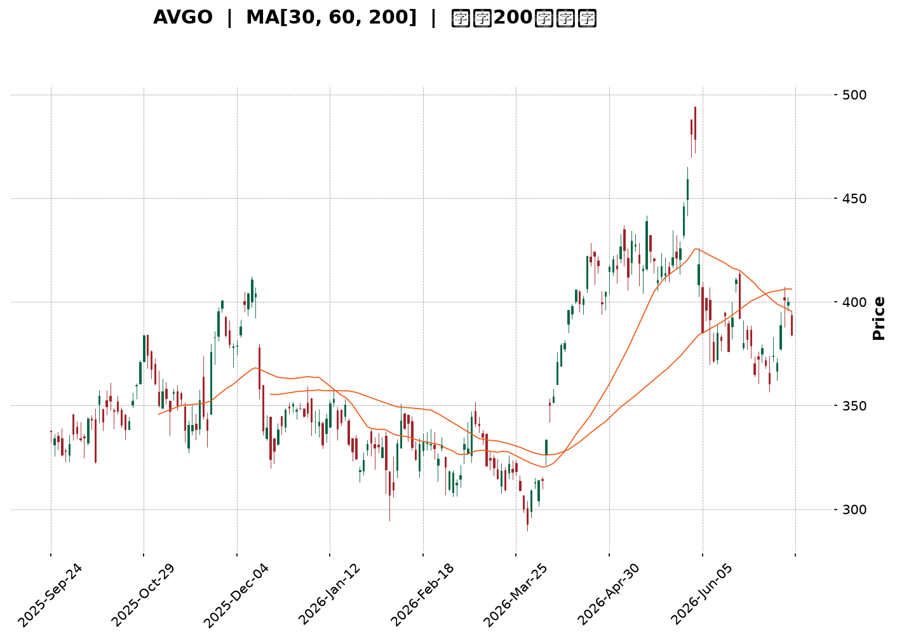
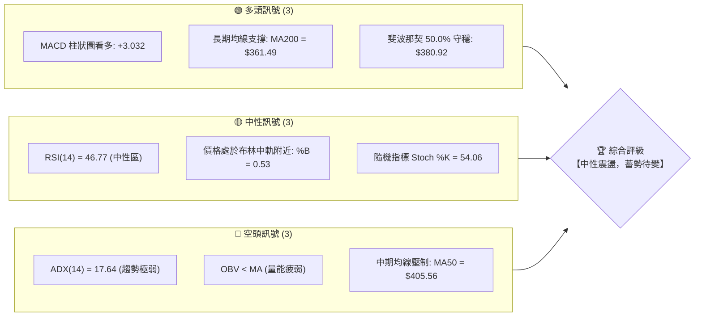
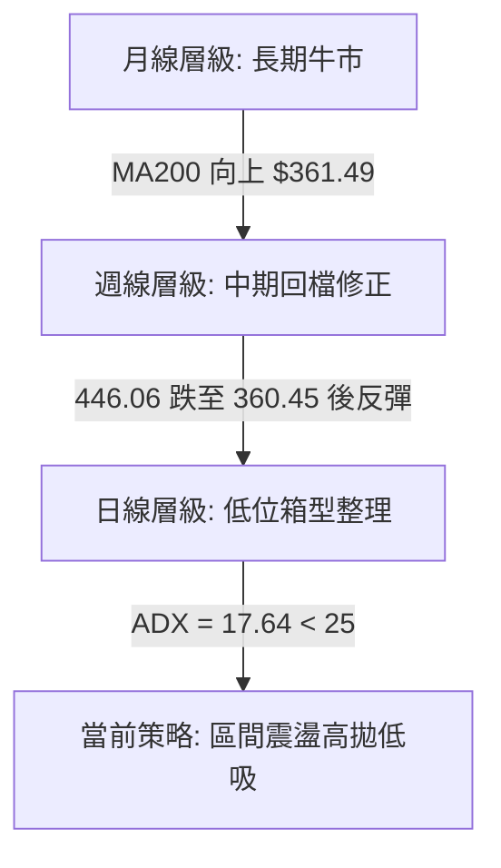
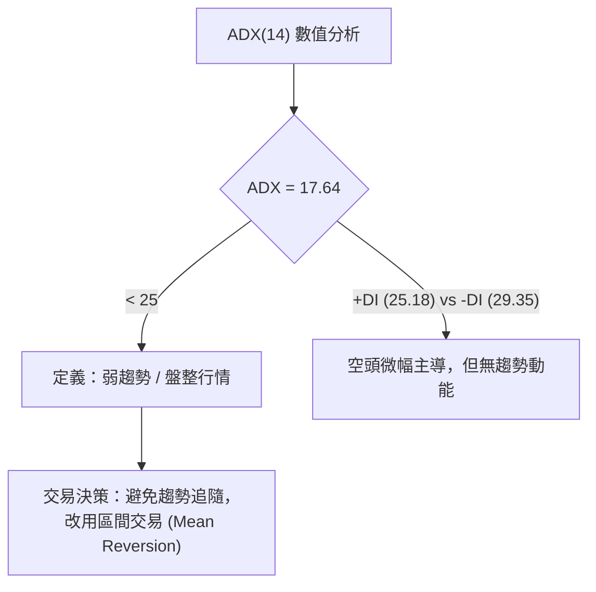
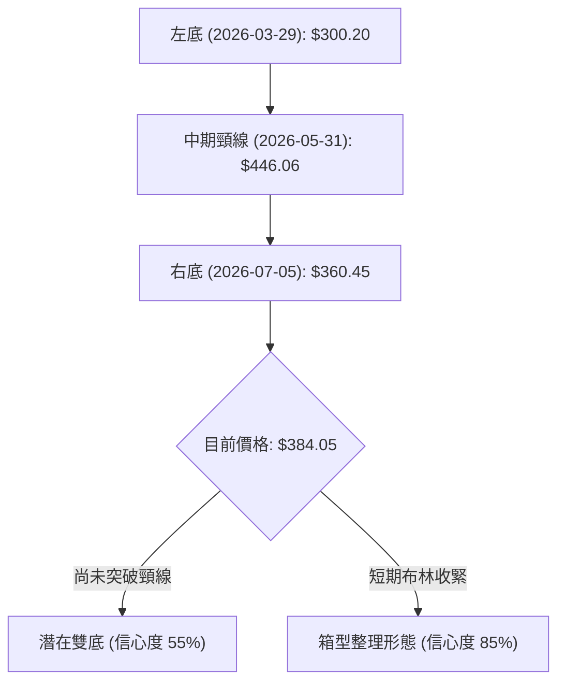
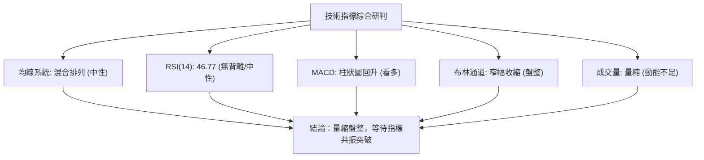
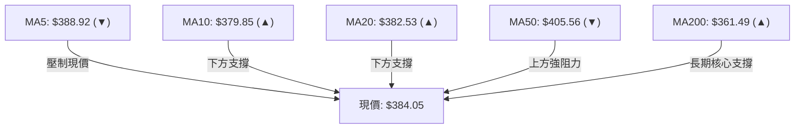
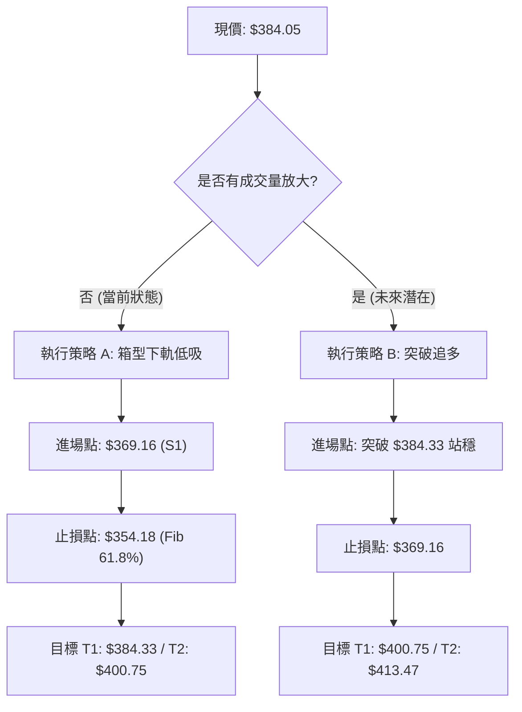
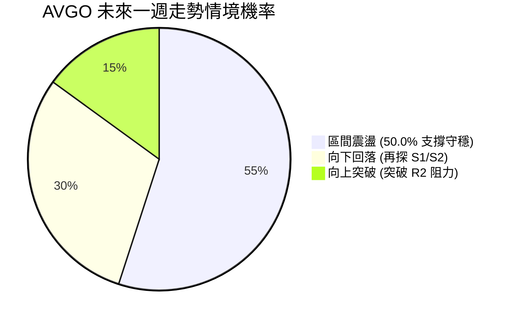
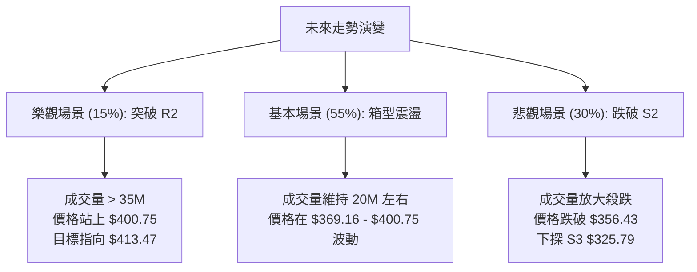

<details>
<summary>📊 靜態圖表 (點擊展開)</summary>

</details>

<html>
<head><meta charset="utf-8" /></head>
<body>
    <div style="height:500px; width:100%;">                        <script>window.PlotlyConfig = {MathJaxConfig: 'local'};</script>
        <script charset="utf-8" src="https://cdn.plot.ly/plotly-3.7.0.min.js" integrity="sha256-jvTGqxNp8AGWEcvNLVuKr+8j5dGe9Yw51LQkmDH+IYA=" crossorigin="anonymous"></script>                <div id="candlestick-chart" class="plotly-graph-div" style="height:100%; width:100%;"></div>            <script>                window.PLOTLYENV=window.PLOTLYENV || {};                                if (document.getElementById("candlestick-chart")) {                    Plotly.newPlot(                        "candlestick-chart",                        [{"close":{"dtype":"f8","bdata":"AAAAgLQWdUAAAACgoeN0QAAAAMCmynRAAAAAgClhdEAAAACgJIF0QAAAAECDuHRAAAAAoLkEdUAAAACgvwd1QAAAAODs2XRAAAAAQJDodEAAAABgMXl1QAAAAECOcXVAAAAAQCItdEAAAADgZCt2QAAAACBlY3VAAAAA4PPVdUAAAABg0gJ2QAAAAKAhtnVAAAAAALO0dUAAAACgAUx1QAAAAOB0JnVAAAAA4PBldUAAAADggAJ2QAAAAGCEgHZAAAAAYEMud0AAAACAQ\u002f13QAAAAKDzZXdAAAAAAB\u002f5dkAAAADgeIh2QAAAAKCo33VAAAAA4KtPdkAAAACguxl2QAAAAOC4t3VAAAAAwEhGdkAAAAAg+t91QAAAAMDYE3ZAAAAAgF0hdUAAAADg0kh1QAAAAODYS3VAAAAAgKMpdUAAAAAgHgd2QAAAACAyjnVAAAAAoN0kdUAAAACgqH13QAAAAAAm7ndAAAAAgKu1eEAAAADgbQt5QAAAAMDa\u002fndAAAAA4Bi3d0AAAABg0qd3QAAAAECBrndAAAAAIAtBeEAAAADg1e14QAAAAKBpQHlAAAAAYLKqeUAAAACAr0F5QAAAAEDJXnZAAAAAAKkedUAAAAAAXjZ1QAAAAOA\u002fQ3RAAAAAgKqAdEAAAABAaSd1QAAAAEAmQ3VAAAAAYJvAdUAAAABA9M51QAAAAOBm7XVAAAAAILnBdUAAAABADsl1QAAAAMBGjXVAAAAAoIGldUAAAADAjWJ1QAAAAAAiaHVAAAAAINRjdUAAAADgJ7R0QAAAACBDe3VAAAAAYK3udUAAAACg7xR2QAAAAABIKnVAAAAAQC1cdUAAAADgtOZ1QAAAAKARtnRAAAAA4H15dEAAAADguUR0QAAAAIAB7nNAAAAAIIY6dEAAAAAAGbl0QAAAAGBFwHRAAAAAQEKYdEAAAABAWKF0QAAAAOBQnnRAAAAAAHjyc0AAAADgtS5zQAAAACDtVXNAAAAAoCu7dEAAAADA12p1QAAAAGAMM3VAAAAAQAhYdUAAAADgRZ90QAAAAACgP3RAAAAAwBy1dEAAAABAk8R0QAAAAAA6zHRAAAAAoN22dEAAAACgCpJ0QAAAAOC5RHRAAAAAIHKxdEAAAAAATwh0QAAAAAAJ5nNAAAAA4GXac0AAAADAAotzQAAAAGDVxXNAAAAAQMe4dEAAAAAARpR0QAAAAGCyh3VAAAAAoClVdUAAAADgD0V1QAAAAIDK63RAAAAAYKQPdEAAAADgozt0QAAAAIAXAnRAAAAA4FOsc0AAAACAqOpzQAAAACDtVXNAAAAAoAEgdEAAAADAl9xzQAAAAEDm5HNAAAAAoOVOc0AAAAAgR8NyQAAAAEAkT3JAAAAAwFVQc0AAAAAA6o9zQAAAAODYoHNAAAAAIO6ec0AAAACAE9d0QAAAACA34XVAAAAAQJYldkAAAADgZy93QAAAACBmsndAAAAAQNrCd0AAAABgfcF4QAAAACBy3XhAAAAAoFxeeUAAAADg+e94QAAAAGCNGHlAAAAAwLZfekAAAABAbDR6QAAAAMB4YXpAAAAAgKAYekAAAADAK\u002fN4QAAAAADzTHlAAAAAgFMMekAAAAAg1El6QAAAAEB4\u002fXlAAAAAgPSqekAAAACgSIx6QAAAAICHvnlAAAAA4CDVekAAAABADLx6QAAAAOAyKnpAAAAAQBoCekAAAABghXF7QAAAAEBKiHpAAAAAILlAekAAAAAguqZ5QAAAACCZEXpAAAAAgKPeeUAAAAAAxdd5QAAAAKB9VXpAAAAAABhTekAAAACgfp56QAAAAEAG4XtAAAAAAOSzfEAAAADg8Qx+QAAAAGCQ531AAAAAAPgjekAAAACA7RF4QAAAAKCSv3hAAAAAIKV4eEAAAABAMTh3QAAAACBfD3hAAAAA4HXXd0AAAACAFJV4QAAAAODVgXdAAAAAYHeEeEAAAABAM6t5QAAAAIAUgnhAAAAAYGbCd0AAAADAHuF3QAAAAGCPrndAAAAA4FHQdkAAAABAM0d3QAAAAAAAnHdAAAAAoHAVd0AAAABAM4d2QAAAAGBmXndAAAAA4Hosd0AAAABACkt4QAAAAIDCEXlAAAAAIIX\u002feEAAAADAzAB4QA=="},"high":{"dtype":"f8","bdata":"8ZeCzPQidUCzBpsC0QJ1QKgG2aMLE3VAEgs7tGMydUCAwVr6R5N0QMZU1+gQAXVAsWfoncOadUBfod3asGd1QE1d7yZlY3VA0hXvkZwDdUB3wJGCvYl1QJ0gGdr9lXVAwaBpkFbKdUCG\u002fuzyCFZ2QAtAd7Zzy3VAuUWNaVpWdkC05t+Bc5N2QE7qabA50HVAcAc62aQpdkBnbQA4S9J1QEoLvSEhoXVAkOOGtDeKdUA5yB\u002fw2UR2QPRLZqWni3ZAywRnHps\u002fd0BKzzAWOAV4QKHyMzXyA3hAvqONeFeLd0BiX7P6LEx3QEaAwVdN7nZAL85pzWKtdkDYgoRwlpd2QNywkuRjCHZAyQL2f+ZfdkBrjS7V+H12QIHYGM\u002frTXZAEur4XUb5dUBHwXy0GW11QPuZqsHL43VAjEX9G36gdUBE6BC091p2QIa1MBq\u002fX3dA8B+eQYSqdUA+huFH8L13QGwU4dx4H3hAiy2nv0PaeEA8XzTWEAx5QMK7pEx2k3hAtxVZzul0eEAJ\u002fy0MtsJ3QERJLJcC3HdARtls5mN1eEBDOQrUUlB5QF2YK2SYSnlAwPCFUMrEeUAUsFneTXB5QIPEJTfwvXdAB2uRubh\u002fdkAC2Ga5A5l1QP8I737ainVAYLoFfoTidEBlkx13k1h1QPBZFf6Bj3VAZILIPzPNdUCCyB\u002fwCfl1QEdptolB\u002f3VADgiSHrXQdUBoScdUK\u002fZ1QGA\u002fAM2IyXVAd841d2F1dkDsFaW3oRt2QKFhRoBNvHVAbZVkK6rGdUCEv8egsmZ1QJjvlR7XoXVA4DgkOJ4JdkBUP3nDumJ2QOWpWWVy1nVALHxLgVjGdUDHuEmoVxN2QN\u002fQrPMdgnVA9Jq6pBTpdEBhaor+DPx0QC\u002fMGJbuDHRACd1nLJR3dECq5XyCgNh0QLdi1ObfK3VA3qYN53jrdEAgkEEFVw91QNgP87U57XRAeJC+lH8adUArNRbZZeVzQLkRMixOVXRAtptW+1PcdED4fr\u002fYv\u002fB1QPJ\u002f\u002fVK5q3VAg77AwM+edUAzxTwTTpB1QCy5C9J80XRAd35jnkjodEAHU\u002fwNPQp1QN7T61kqE3VA2RZ7msktdUAJWKhUHxR1QH\u002fpRTuucXRAuQ6KodXqdECYNCcDGlZ0QADqKnw17XNAvATWqNjtc0AF40T1h6tzQOkwEy5LF3RAcyBvgy7udEDKGIn+\u002fGN1QL5NXC9gs3VABe5RwID9dUDyCnMip4h1QNwcFflSKXVA1fZ30UARdUDNLLlo3n90QGG0AtnPY3RAwfU56e1DdEBO2O4vViF0QFl0RcNHBXRAHDQXDm1fdEA\u002fkQi0Mj50QNmxS7eZPHRAo8qeFLXGc0BmUKy7OTBzQK53rDidBHNAv9Z8Uh1dc0CB8BT9p7RzQOrKAXgVo3NASenSf2a+c0ApPsKV89l0QBTcQGhJGXZA238wmCFidkAbliODR393QNda13AhxHdAjoeIitDad0BR+4WLPcd4QN4DK2vG8HhA+uIupWVheUBZLyTNcVx5QKzFmV5lL3lAi0+iEIBoekAqJ6UaG8p6QLlHg0BBhXpAbYX9zE9hekALhHQrs1J5QD00LQX8T3lAPPDnmYAbekDhyU1kBWh6QAG9tm6QcnpAF3rMeEgLe0AILRZn0E97QKXY8ZYOnXpAZU1ZgwAle0BjLbWWbw97QOLRYMSVynpAFBlB934fekAMWrZdk5p7QPq6Km4EAntAmCT1lX1VekA5hjcYohR6QH50LgP\u002fd3pAqDPRClNZekAhuuaiODV6QK7kIkv0KXtAK2bHcNsBe0DwgnwvBNB6QLkSyPYMA3xA+03PRQQVfUCm81\u002fzwoB+QK0rUS58435AdafkwOWcekDlDVMNn515QGVMjzxBI3lAe\u002fA6kZtzeUBkz32jNBN4QE9XGfAmTnhAJQZiavIFeEAPG0vfLrl4QEIHEgW8cnhAyc3JNkUAeUCf8SojxMB5QAAAAIA96nlAAAAA4FFweEAAAAAA10t4QAAAAMDMTHhAAAAAQApbd0AAAAAgXIN3QAAAAIDruXdAAAAAAABcd0AAAAAAAGB3QAAAAGCP8ndAAAAAIFxPd0AAAACgcLF4QAAAAOBReHlAAAAAQAoneUAAAAAAALx4QA=="},"hovertemplate":"\u003cb\u003e%{x|%Y-%m-%d}\u003c\u002fb\u003e\u003cbr\u003e\u958b: $%{open:.2f}\u003cbr\u003e\u9ad8: $%{high:.2f}\u003cbr\u003e\u4f4e: $%{low:.2f}\u003cbr\u003e\u6536: $%{close:.2f}\u003cextra\u003e\u003c\u002fextra\u003e","low":{"dtype":"f8","bdata":"0AKsCzK\u002fdEBqGLyfnVd0QCHRJ6rNi3RA99tO3ZdbdEAKmVi70Cx0QNrGYq4QK3RAUAkDQhvWdEAoX8wo5910QGXriNogy3RAUaj+4ihMdECuJA3iQqx0QNRfazUMKHVAz6hqvecjdED8TRtcsFl1QO4RoEMdHHVAPhIsrQOZdUDpRhtfrbh1QBj5sAoYLnVA\u002f6UOlWyedUATS+XQhjZ1QCOPs3Y+2nRANBXQKwwodUB23dMPy851QH9M\u002fVmeEXZA66YbcCeIdkBHyu6TwzF3QJB3bZH2\u002f3ZAMKvehwuxdkAMPcJCZ392QC1aB9Wz0HVApGeATTnCdUDTPM\u002fd6Ot1QDN\u002f\u002fhI\u002f9nRAhMXPCCQKdkDZhqelirt1QGXYMq6F23VA8JgDmsPEdEB3iNxgnnN0QEc3nXk5+nRAaAy3Zz7adEA3un7hrf50QLkJfQ8adHVATYeP3jafdEBFb3KEj5t1QDYZrkLaGndAgR3DZvzRd0BsRAaFJa94QHd+nB5D73dACYOIocaad0Dg6OyaWQl3QNydQvjnZndA+RgHsA7wd0A2o20V97J4QOm7T9LklHhAKLQ7G1XVeED3OMZG5H94QMiKhXy7EnZAljFOwBD6dEBxFzdwFdN0QEPUuGAP+nNA\u002fghfKjkddECiszX3n6t0QImN67a3\u002f3RA636jjsIUdUCPQzXt2p11QFkfZTiUp3VAKSy8h8x2dUD7vr+kScB1QHqj5LhvgnVAOl\u002fz16qEdUALL0VnPfR0QFeEa90mDHVA9xhhLVvqdEATlhaEl5R0QK\u002fJQ25qxHRAnAxCxS07dUDwsT8f9Nl1QF6svRoV03RA8\u002f5QC6hGdUAgNBenmGx1QIf918ZQqXRA+QjbhikwdEAbqv1kKTt0QOObf4tQj3NA3ShrHfPGc0AAY8+9HV10QI086PADWHRAm11qGKzxc0A6twzG\u002f3F0QGWG0\u002fPeSHRAhnHRVkY4c0DBgUiLdWNyQOcpgqYwGXNAoU\u002fW2Dmyc0CVnWaq+5Z0QB5MHMV7KXVAjVtW2T3IdEB3thZ0m4V0QN85VRf5N3RA1739nGKyc0DutLPIdmB0QKrVOQuFh3RAkSnRBu2FdECDgik3BEJ0QKyNExe8lHNAWjTQzCSBdEBuW6sCzCxzQLCSSdDLTXNATABzDykhc0Cb5JVPWSRzQKx14YqIaXNAvGaMrIIddEC+t1SNLGN0QOAcILTBJnRAhuY5gsk4dUCpInWcqA91QOV2kkyxr3RA9CFkOQEEdEDflG5PKu5zQBfdrchewXNASsltFkWmc0CKW5gyCzZzQMk9j16FTHNAx5Fb7+qmc0BvOIPUeqVzQCdPCyeDw3NAP\u002fk+PudKc0Dclw0XXaZyQNRnnlQHGHJAMy2anfJ9ckAgDEKb1F9zQBuNjPhe1HJA0LVLnKJcc0CtqkPlqRR0QCgz7ezRX3VAL3cq8hzvdUC\u002fgUdT\u002f4N2QEU2kbhWDndAllUb\u002fpp7d0BO0PIqXw94QMqUNDyue3hAxeMED9ryeECBu4bkY7R4QFC5r\u002fAkn3hAUViUBYZDeUDbldaZPBJ6QBaQPjdsg3lAt0BA25jfeUCRiPUGbKB4QO07ur1ywnhAqnVPz3U5eUCkAcHnB8p5QFap0DwgjnlA8pvLd\u002f8qekCjCyjU6hF6QPKfaQSHWnlAiTvibojVeUDzoYGgDYZ6QLlz+fs7fHlAyfygupBCeUATh+DB7u55QP3D5qIvMnpAr\u002fLxiHHbeUDpAbeYf1N5QJCO0ohRrHlAGeOzF5+deUBQ8dYP\u002fZh5QNbKIA11BXpAWlznQU\u002f9eUBMpKdbsdV5QM9VpYac7HpAfEO84laYe0AsvVYod1t9QEWLIGdKfn1AJqZ1ifgleUDcXP\u002fnsA94QD7YD5u0a3hA0o1iq+obd0DSAO8EVil3QEBdzVduH3dA+AmN8HeGd0AnWxFwxj94QEw0PX7XfXdASL6Jt7ngd0CeAbrD1Et5QAAAAGCPfnhAAAAAYI+Kd0AAAAAgXI93QAAAAEAzS3dAAAAAoEe9dkAAAAAgXId2QAAAAIA9KndAAAAA4HoAd0AAAABA4UZ2QAAAAEDhMndAAAAAACmgdkAAAACAPY53QAAAAEDhPnhAAAAAQDO7eEAAAABguPZ3QA=="},"name":"\u50f9\u683c","open":{"dtype":"f8","bdata":"mrNRet0ddUCWlqv9JbJ0QIADsu3K+HRAaZSEOgridEC4O+P0e4R0QCXj\u002frwjZXRAsWfoncOadUDF32GtjDl1QI9OGm\u002fE4HRASCj6mG3ydEBFHZ69Wr90QHzzGrYrfXVAZPHGXXF3dUC5yOA13ex1QDh9FircwnVAIYvLsukHdkDJHYxC\u002fCx2QEW5zBuWunVAUqgGqUD9dUDzUf+zysB1QJEc0hbVlXVANBXQKwwodUAOxapauuh1QEYQHyRneHZAKZQyApaJdkBHyu6TwzF3QKHyMzXyA3hAAWGvJpeCd0AGLjVp1B53QA4w+gxaSHZAgRCI6vPOdUDrbahSpmF2QJNVGDh1A3ZAl6p2z3w+dkDMiH4cg092QLwpKSG3QHZAYRfyNe7ZdUDuV6W99pl0QEWaQ9nRHnVA35cYHplUdUAcBnnU+ix1QDBd+pBdv3ZAYlewh8hzdUCEf1qrrJx1QBSsZKiO7HdAF6zo4Gv2d0CR2XHH\u002fdF4QK5riY9kinhAO\u002fhyBlYieEDf8I3MHZ53QMXjTJ3vqHdA4qBqZ0kAeEAbKcrfygN5QHfcAt1xyHhAbinwV1b\u002feEBeLCrHLil5QCBpMeh6nXdAH3dIvPh9dkA0iWCmW+J0QP8I737ainVAeJdSTQridEDSDQSet7d0QD7FOAYpjHVArg+gTvI4dUCy+TdPctZ1QPP46DVY3HVA6mOC0gq3dUBksTLy98p1QOdRPa4kx3VA\u002fLmZbcP3dUBk1rkzAhd2QBH\u002fKk5sZXVAg2A2byJHdUCL\u002fWnIWVh1QBxI21vgCnVAnAxCxS07dUBYysShW\u002fl1QM9nmSAHu3VAjyxrLGu9dUDuo4pn\u002fI91QJJ1or5kbXVAcyuzQHXkdECoaPpF6OF0QIOTTMYM4nNAnQjaKgXqc0BAe+Ssy4h0QNMkBqqzGXVA52lgXW61dECvVKechLN0QOCGbQqcTnRAOhOWrRD4dEArNRbZZeVzQPSykCz7knNAJmjFmM3uc0At9plc5Zh0QPOSM5Edo3VAeNY8RG+YdUBZWIvOFml1QKjL8eQ6inRAdpabcxvoc0Cp46wb+IR0QOMYgLuavHRA3H0WHD6ydEAOs3NJfbB0QDES7hizFXRArSka+mqYdEDNXvyW01R0QN4eWor0WHNAscDP1pdDc0BJU6DAnn1zQC1Mwo9XqHNAHy2nj32PdEAaOqrSM3F0QGzfz3vIYHRAyzn5qzO3dUCzsZVqUlV1QA04TsQBCHVAVwmE8AwHdUAHGtLWLE10QA\u002fpXtoHSXRAAHL8ORD0c0C7M97KK3VzQM8spSgf73NAtsam0PXXc0DSTp\u002fO6PdzQFqvr6hIIXRAqArqWWGYc0BuzrpUMilzQK7J5xZQxnJAB576v6uuckCwItJG\u002f41zQC4ZmzwkAHNA93QejP6oc0BmuGVca2N0QFTERmAb83VAwqqihOT7dUBiZHMM6oV2QGFeVc42EXdAk6caZNiUd0D62YIFOVR4QKvRb3UDpnhA82r+oEMEeUA06ClW8VB5QCNgJT127HhAd5vA7GNleUCBFoWkj1t6QGwOooHvhHpAytEzngw9ekCRB6bE1vp4QHOqD1\u002fMLXlADgm5fNDteUA5xqTw8eZ5QEVfEz7yGHpA6cZXROZPekDD3smf8i17QJNXypB0UnpAsma1pC8yekA+kCC+G696QOPF26QsbHpAZFbPd3LyeUA\u002fC\u002fLgJAF6QPq6Km4EAntA8oog2OdLekAGGC43wpJ5QMtbvemFwnlAoukYGljOeUDpuETRSA16QDHnw1drHXpAWp8ZeV+GekA3TbC1l0d6QDIGaBJBBHtA8HSacg8WfEA4iBRFSIB+QLuu13r4335A7bfx1H+FeUAha\u002fBBdG95QM0JGIm9H3lAIwTLFZsPeUDsDtzIWs53QIyPb6axQ3dAVmEbktHxd0CpfpYWKa54QPf3Fn9+WXhAOQOLPohBeEBRNcG07I55QAAAAGCP2nlAAAAAgOudd0AAAACA6yl4QAAAAKBHKXhAAAAAQDMnd0AAAACA61l3QAAAAOCjbHdAAAAAgOs9d0AAAAAgrtt2QAAAAIDCWXdAAAAAwPXodkAAAADgUZh3QAAAAEAKI3lAAAAAAADoeEAAAAAgrpd4QA=="},"x":["2025-09-24T00:00:00-04:00","2025-09-25T00:00:00-04:00","2025-09-26T00:00:00-04:00","2025-09-29T00:00:00-04:00","2025-09-30T00:00:00-04:00","2025-10-01T00:00:00-04:00","2025-10-02T00:00:00-04:00","2025-10-03T00:00:00-04:00","2025-10-06T00:00:00-04:00","2025-10-07T00:00:00-04:00","2025-10-08T00:00:00-04:00","2025-10-09T00:00:00-04:00","2025-10-10T00:00:00-04:00","2025-10-13T00:00:00-04:00","2025-10-14T00:00:00-04:00","2025-10-15T00:00:00-04:00","2025-10-16T00:00:00-04:00","2025-10-17T00:00:00-04:00","2025-10-20T00:00:00-04:00","2025-10-21T00:00:00-04:00","2025-10-22T00:00:00-04:00","2025-10-23T00:00:00-04:00","2025-10-24T00:00:00-04:00","2025-10-27T00:00:00-04:00","2025-10-28T00:00:00-04:00","2025-10-29T00:00:00-04:00","2025-10-30T00:00:00-04:00","2025-10-31T00:00:00-04:00","2025-11-03T00:00:00-05:00","2025-11-04T00:00:00-05:00","2025-11-05T00:00:00-05:00","2025-11-06T00:00:00-05:00","2025-11-07T00:00:00-05:00","2025-11-10T00:00:00-05:00","2025-11-11T00:00:00-05:00","2025-11-12T00:00:00-05:00","2025-11-13T00:00:00-05:00","2025-11-14T00:00:00-05:00","2025-11-17T00:00:00-05:00","2025-11-18T00:00:00-05:00","2025-11-19T00:00:00-05:00","2025-11-20T00:00:00-05:00","2025-11-21T00:00:00-05:00","2025-11-24T00:00:00-05:00","2025-11-25T00:00:00-05:00","2025-11-26T00:00:00-05:00","2025-11-28T00:00:00-05:00","2025-12-01T00:00:00-05:00","2025-12-02T00:00:00-05:00","2025-12-03T00:00:00-05:00","2025-12-04T00:00:00-05:00","2025-12-05T00:00:00-05:00","2025-12-08T00:00:00-05:00","2025-12-09T00:00:00-05:00","2025-12-10T00:00:00-05:00","2025-12-11T00:00:00-05:00","2025-12-12T00:00:00-05:00","2025-12-15T00:00:00-05:00","2025-12-16T00:00:00-05:00","2025-12-17T00:00:00-05:00","2025-12-18T00:00:00-05:00","2025-12-19T00:00:00-05:00","2025-12-22T00:00:00-05:00","2025-12-23T00:00:00-05:00","2025-12-24T00:00:00-05:00","2025-12-26T00:00:00-05:00","2025-12-29T00:00:00-05:00","2025-12-30T00:00:00-05:00","2025-12-31T00:00:00-05:00","2026-01-02T00:00:00-05:00","2026-01-05T00:00:00-05:00","2026-01-06T00:00:00-05:00","2026-01-07T00:00:00-05:00","2026-01-08T00:00:00-05:00","2026-01-09T00:00:00-05:00","2026-01-12T00:00:00-05:00","2026-01-13T00:00:00-05:00","2026-01-14T00:00:00-05:00","2026-01-15T00:00:00-05:00","2026-01-16T00:00:00-05:00","2026-01-20T00:00:00-05:00","2026-01-21T00:00:00-05:00","2026-01-22T00:00:00-05:00","2026-01-23T00:00:00-05:00","2026-01-26T00:00:00-05:00","2026-01-27T00:00:00-05:00","2026-01-28T00:00:00-05:00","2026-01-29T00:00:00-05:00","2026-01-30T00:00:00-05:00","2026-02-02T00:00:00-05:00","2026-02-03T00:00:00-05:00","2026-02-04T00:00:00-05:00","2026-02-05T00:00:00-05:00","2026-02-06T00:00:00-05:00","2026-02-09T00:00:00-05:00","2026-02-10T00:00:00-05:00","2026-02-11T00:00:00-05:00","2026-02-12T00:00:00-05:00","2026-02-13T00:00:00-05:00","2026-02-17T00:00:00-05:00","2026-02-18T00:00:00-05:00","2026-02-19T00:00:00-05:00","2026-02-20T00:00:00-05:00","2026-02-23T00:00:00-05:00","2026-02-24T00:00:00-05:00","2026-02-25T00:00:00-05:00","2026-02-26T00:00:00-05:00","2026-02-27T00:00:00-05:00","2026-03-02T00:00:00-05:00","2026-03-03T00:00:00-05:00","2026-03-04T00:00:00-05:00","2026-03-05T00:00:00-05:00","2026-03-06T00:00:00-05:00","2026-03-09T00:00:00-04:00","2026-03-10T00:00:00-04:00","2026-03-11T00:00:00-04:00","2026-03-12T00:00:00-04:00","2026-03-13T00:00:00-04:00","2026-03-16T00:00:00-04:00","2026-03-17T00:00:00-04:00","2026-03-18T00:00:00-04:00","2026-03-19T00:00:00-04:00","2026-03-20T00:00:00-04:00","2026-03-23T00:00:00-04:00","2026-03-24T00:00:00-04:00","2026-03-25T00:00:00-04:00","2026-03-26T00:00:00-04:00","2026-03-27T00:00:00-04:00","2026-03-30T00:00:00-04:00","2026-03-31T00:00:00-04:00","2026-04-01T00:00:00-04:00","2026-04-02T00:00:00-04:00","2026-04-06T00:00:00-04:00","2026-04-07T00:00:00-04:00","2026-04-08T00:00:00-04:00","2026-04-09T00:00:00-04:00","2026-04-10T00:00:00-04:00","2026-04-13T00:00:00-04:00","2026-04-14T00:00:00-04:00","2026-04-15T00:00:00-04:00","2026-04-16T00:00:00-04:00","2026-04-17T00:00:00-04:00","2026-04-20T00:00:00-04:00","2026-04-21T00:00:00-04:00","2026-04-22T00:00:00-04:00","2026-04-23T00:00:00-04:00","2026-04-24T00:00:00-04:00","2026-04-27T00:00:00-04:00","2026-04-28T00:00:00-04:00","2026-04-29T00:00:00-04:00","2026-04-30T00:00:00-04:00","2026-05-01T00:00:00-04:00","2026-05-04T00:00:00-04:00","2026-05-05T00:00:00-04:00","2026-05-06T00:00:00-04:00","2026-05-07T00:00:00-04:00","2026-05-08T00:00:00-04:00","2026-05-11T00:00:00-04:00","2026-05-12T00:00:00-04:00","2026-05-13T00:00:00-04:00","2026-05-14T00:00:00-04:00","2026-05-15T00:00:00-04:00","2026-05-18T00:00:00-04:00","2026-05-19T00:00:00-04:00","2026-05-20T00:00:00-04:00","2026-05-21T00:00:00-04:00","2026-05-22T00:00:00-04:00","2026-05-26T00:00:00-04:00","2026-05-27T00:00:00-04:00","2026-05-28T00:00:00-04:00","2026-05-29T00:00:00-04:00","2026-06-01T00:00:00-04:00","2026-06-02T00:00:00-04:00","2026-06-03T00:00:00-04:00","2026-06-04T00:00:00-04:00","2026-06-05T00:00:00-04:00","2026-06-08T00:00:00-04:00","2026-06-09T00:00:00-04:00","2026-06-10T00:00:00-04:00","2026-06-11T00:00:00-04:00","2026-06-12T00:00:00-04:00","2026-06-15T00:00:00-04:00","2026-06-16T00:00:00-04:00","2026-06-17T00:00:00-04:00","2026-06-18T00:00:00-04:00","2026-06-22T00:00:00-04:00","2026-06-23T00:00:00-04:00","2026-06-24T00:00:00-04:00","2026-06-25T00:00:00-04:00","2026-06-26T00:00:00-04:00","2026-06-29T00:00:00-04:00","2026-06-30T00:00:00-04:00","2026-07-01T00:00:00-04:00","2026-07-02T00:00:00-04:00","2026-07-06T00:00:00-04:00","2026-07-07T00:00:00-04:00","2026-07-08T00:00:00-04:00","2026-07-09T00:00:00-04:00","2026-07-10T00:00:00-04:00","2026-07-13T00:00:00-04:00"],"type":"candlestick"},{"hovertemplate":"MA30: $%{y:.2f}\u003cextra\u003e\u003c\u002fextra\u003e","line":{"color":"#2196F3","dash":"dash","width":2},"mode":"lines","name":"MA30","x":["2025-09-24T00:00:00-04:00","2025-09-25T00:00:00-04:00","2025-09-26T00:00:00-04:00","2025-09-29T00:00:00-04:00","2025-09-30T00:00:00-04:00","2025-10-01T00:00:00-04:00","2025-10-02T00:00:00-04:00","2025-10-03T00:00:00-04:00","2025-10-06T00:00:00-04:00","2025-10-07T00:00:00-04:00","2025-10-08T00:00:00-04:00","2025-10-09T00:00:00-04:00","2025-10-10T00:00:00-04:00","2025-10-13T00:00:00-04:00","2025-10-14T00:00:00-04:00","2025-10-15T00:00:00-04:00","2025-10-16T00:00:00-04:00","2025-10-17T00:00:00-04:00","2025-10-20T00:00:00-04:00","2025-10-21T00:00:00-04:00","2025-10-22T00:00:00-04:00","2025-10-23T00:00:00-04:00","2025-10-24T00:00:00-04:00","2025-10-27T00:00:00-04:00","2025-10-28T00:00:00-04:00","2025-10-29T00:00:00-04:00","2025-10-30T00:00:00-04:00","2025-10-31T00:00:00-04:00","2025-11-03T00:00:00-05:00","2025-11-04T00:00:00-05:00","2025-11-05T00:00:00-05:00","2025-11-06T00:00:00-05:00","2025-11-07T00:00:00-05:00","2025-11-10T00:00:00-05:00","2025-11-11T00:00:00-05:00","2025-11-12T00:00:00-05:00","2025-11-13T00:00:00-05:00","2025-11-14T00:00:00-05:00","2025-11-17T00:00:00-05:00","2025-11-18T00:00:00-05:00","2025-11-19T00:00:00-05:00","2025-11-20T00:00:00-05:00","2025-11-21T00:00:00-05:00","2025-11-24T00:00:00-05:00","2025-11-25T00:00:00-05:00","2025-11-26T00:00:00-05:00","2025-11-28T00:00:00-05:00","2025-12-01T00:00:00-05:00","2025-12-02T00:00:00-05:00","2025-12-03T00:00:00-05:00","2025-12-04T00:00:00-05:00","2025-12-05T00:00:00-05:00","2025-12-08T00:00:00-05:00","2025-12-09T00:00:00-05:00","2025-12-10T00:00:00-05:00","2025-12-11T00:00:00-05:00","2025-12-12T00:00:00-05:00","2025-12-15T00:00:00-05:00","2025-12-16T00:00:00-05:00","2025-12-17T00:00:00-05:00","2025-12-18T00:00:00-05:00","2025-12-19T00:00:00-05:00","2025-12-22T00:00:00-05:00","2025-12-23T00:00:00-05:00","2025-12-24T00:00:00-05:00","2025-12-26T00:00:00-05:00","2025-12-29T00:00:00-05:00","2025-12-30T00:00:00-05:00","2025-12-31T00:00:00-05:00","2026-01-02T00:00:00-05:00","2026-01-05T00:00:00-05:00","2026-01-06T00:00:00-05:00","2026-01-07T00:00:00-05:00","2026-01-08T00:00:00-05:00","2026-01-09T00:00:00-05:00","2026-01-12T00:00:00-05:00","2026-01-13T00:00:00-05:00","2026-01-14T00:00:00-05:00","2026-01-15T00:00:00-05:00","2026-01-16T00:00:00-05:00","2026-01-20T00:00:00-05:00","2026-01-21T00:00:00-05:00","2026-01-22T00:00:00-05:00","2026-01-23T00:00:00-05:00","2026-01-26T00:00:00-05:00","2026-01-27T00:00:00-05:00","2026-01-28T00:00:00-05:00","2026-01-29T00:00:00-05:00","2026-01-30T00:00:00-05:00","2026-02-02T00:00:00-05:00","2026-02-03T00:00:00-05:00","2026-02-04T00:00:00-05:00","2026-02-05T00:00:00-05:00","2026-02-06T00:00:00-05:00","2026-02-09T00:00:00-05:00","2026-02-10T00:00:00-05:00","2026-02-11T00:00:00-05:00","2026-02-12T00:00:00-05:00","2026-02-13T00:00:00-05:00","2026-02-17T00:00:00-05:00","2026-02-18T00:00:00-05:00","2026-02-19T00:00:00-05:00","2026-02-20T00:00:00-05:00","2026-02-23T00:00:00-05:00","2026-02-24T00:00:00-05:00","2026-02-25T00:00:00-05:00","2026-02-26T00:00:00-05:00","2026-02-27T00:00:00-05:00","2026-03-02T00:00:00-05:00","2026-03-03T00:00:00-05:00","2026-03-04T00:00:00-05:00","2026-03-05T00:00:00-05:00","2026-03-06T00:00:00-05:00","2026-03-09T00:00:00-04:00","2026-03-10T00:00:00-04:00","2026-03-11T00:00:00-04:00","2026-03-12T00:00:00-04:00","2026-03-13T00:00:00-04:00","2026-03-16T00:00:00-04:00","2026-03-17T00:00:00-04:00","2026-03-18T00:00:00-04:00","2026-03-19T00:00:00-04:00","2026-03-20T00:00:00-04:00","2026-03-23T00:00:00-04:00","2026-03-24T00:00:00-04:00","2026-03-25T00:00:00-04:00","2026-03-26T00:00:00-04:00","2026-03-27T00:00:00-04:00","2026-03-30T00:00:00-04:00","2026-03-31T00:00:00-04:00","2026-04-01T00:00:00-04:00","2026-04-02T00:00:00-04:00","2026-04-06T00:00:00-04:00","2026-04-07T00:00:00-04:00","2026-04-08T00:00:00-04:00","2026-04-09T00:00:00-04:00","2026-04-10T00:00:00-04:00","2026-04-13T00:00:00-04:00","2026-04-14T00:00:00-04:00","2026-04-15T00:00:00-04:00","2026-04-16T00:00:00-04:00","2026-04-17T00:00:00-04:00","2026-04-20T00:00:00-04:00","2026-04-21T00:00:00-04:00","2026-04-22T00:00:00-04:00","2026-04-23T00:00:00-04:00","2026-04-24T00:00:00-04:00","2026-04-27T00:00:00-04:00","2026-04-28T00:00:00-04:00","2026-04-29T00:00:00-04:00","2026-04-30T00:00:00-04:00","2026-05-01T00:00:00-04:00","2026-05-04T00:00:00-04:00","2026-05-05T00:00:00-04:00","2026-05-06T00:00:00-04:00","2026-05-07T00:00:00-04:00","2026-05-08T00:00:00-04:00","2026-05-11T00:00:00-04:00","2026-05-12T00:00:00-04:00","2026-05-13T00:00:00-04:00","2026-05-14T00:00:00-04:00","2026-05-15T00:00:00-04:00","2026-05-18T00:00:00-04:00","2026-05-19T00:00:00-04:00","2026-05-20T00:00:00-04:00","2026-05-21T00:00:00-04:00","2026-05-22T00:00:00-04:00","2026-05-26T00:00:00-04:00","2026-05-27T00:00:00-04:00","2026-05-28T00:00:00-04:00","2026-05-29T00:00:00-04:00","2026-06-01T00:00:00-04:00","2026-06-02T00:00:00-04:00","2026-06-03T00:00:00-04:00","2026-06-04T00:00:00-04:00","2026-06-05T00:00:00-04:00","2026-06-08T00:00:00-04:00","2026-06-09T00:00:00-04:00","2026-06-10T00:00:00-04:00","2026-06-11T00:00:00-04:00","2026-06-12T00:00:00-04:00","2026-06-15T00:00:00-04:00","2026-06-16T00:00:00-04:00","2026-06-17T00:00:00-04:00","2026-06-18T00:00:00-04:00","2026-06-22T00:00:00-04:00","2026-06-23T00:00:00-04:00","2026-06-24T00:00:00-04:00","2026-06-25T00:00:00-04:00","2026-06-26T00:00:00-04:00","2026-06-29T00:00:00-04:00","2026-06-30T00:00:00-04:00","2026-07-01T00:00:00-04:00","2026-07-02T00:00:00-04:00","2026-07-06T00:00:00-04:00","2026-07-07T00:00:00-04:00","2026-07-08T00:00:00-04:00","2026-07-09T00:00:00-04:00","2026-07-10T00:00:00-04:00","2026-07-13T00:00:00-04:00"],"y":{"dtype":"f8","bdata":"AAAAAAAA+H8AAAAAAAD4fwAAAAAAAPh\u002fAAAAAAAA+H8AAAAAAAD4fwAAAAAAAPh\u002fAAAAAAAA+H8AAAAAAAD4fwAAAAAAAPh\u002fAAAAAAAA+H8AAAAAAAD4fwAAAAAAAPh\u002fAAAAAAAA+H8AAAAAAAD4fwAAAAAAAPh\u002fAAAAAAAA+H8AAAAAAAD4fwAAAAAAAPh\u002fAAAAAAAA+H8AAAAAAAD4fwAAAAAAAPh\u002fAAAAAAAA+H8AAAAAAAD4fwAAAAAAAPh\u002fAAAAAAAA+H8AAAAAAAD4fwAAAAAAAPh\u002fAAAAAAAA+H8AAAAAAAD4f7y7uzsKnXVAERER4XindUBEREQUz7F1QFVVVRW2uXVAq6qqyuHJdUAzMzOTk9V1QN7d3X0n4XVAMzMz4xvidUAiIiIyR+R1QERERFQT6HVAMzMzoz7qdUCrqqq6+e51QAAAACDu73VAq6qqGjD4dUARERGhdgN2QJqZmbknGXZAiYiI2K0xdkBVVVXlkEt2QImIiIgOX3ZAAAAAEDRwdkDv7u6eVIR2QCIiIqLumXZAAAAAYE2ydkC8u7ubNst2QO\u002fu7i6t4nZAVVVVFeT3dkC8u7t7tAJ3QN7d3c3u+XZAIiIiEh7qdkCJiIjo2N52QO\u002fu7q4Z0XZAREREtKrBdkBERETklrl2QDMzMyO0tXZAzczMbD+xdkCamZkprrB2QJqZmRlmr3ZAzczMfL60dkC8u7u7BLl2QAAAABAzu3ZAEREREVS\u002fdkCamZnJ17l2QLy7u\u002fuSuHZARERERKy6dkBVVVW146J2QHd3d0f+jXZAREREJEt2dkCrqqqqAl12QERERKTbRHZAiYiIuMIwdkBVVVVFyiF2QHd3dzdxCHZAZmZmxjDodUAzMzOTa8B1QERERLQBk3VARERE1JlkdUBVVVUl6j11QDMzM\u002fMYMHVA7+7uDp4rdUBmZmZmpiZ1QAAAAICvKXVAVVVVFfIkdUDe3d1NHxR1QHd3d3euA3VAq6qqivf6dEAiIiJCofd0QKuqqgpr8XRAVVVVJeXtdEARERER+ON0QImIiOjY2HRAvLu7i9XQdEBmZmZ2kct0QAAAABBfxnRAzczMHJvAdEAREREBeL90QImIiBgetXRA3t3dDYuqdEC8u7s7Dpl0QFVVVVU\u002fjnRAq6qqWmOBdEARERHRQ210QO\u002fu7s5BZXRAq6qq2l1ndECJiIioBGp0QAAAALCsd3RAmpmZiRiBdEBmZmbmwoV0QFVVVUU2h3RAmpmZeaiCdECJiIiYRH90QLy7u3sPenRAIiIi8rh3dEBERETE\u002fH10QERERMT8fXRAMzMzs9B4dEDNzMxMimt0QFVVVeVmYHRAAAAA4AdPdEDNzMwMKj90QERERGSdLnRARERE5LgidEC8u7v7bhh0QHd3d0d0DnRA7+7ufh8FdEB3d3eXbAd0QAAAAIAsFXRAq6qqGpQhdEBVVVVVezx0QGZmZtbkXHRAzczMDD5+dECrqqqauap0QDMzM8Mt1nRAAAAA4NT9dECamZmJBSN1QM3MzDxzQXVAERER8XdsdUDv7u6elJZ1QO\u002fu7n4rxXVA3t3dXav4dUARERGh6yB2QERERBQVTnZAd3d3d3uEdkCamZnJ2rp2QBEREbGj83ZAZmZmlngrd0BEREQEh2R3QKuqqspylndAd3d396fWd0CamZmJrhp4QO\u002fu7o63XXhAVVVVtdeWeEDv7u6eGNp4QM3MzMwCFXlAIiIioppNeUCJiIi4qHZ5QImIiLhnmnlA3t3dbSy6eUAzMzMz2tB5QLy7u\u002fta53lAiYiI6Dr9eUCamZlZIQ16QM3MzHzZJnpA7+7u7kxDekDNzMzM7m56QO\u002fu7m73l3pAvLu7m\u002fmVekDv7u4uwoN6QM3MzBzUdXpAZmZmZvZnekARERFRMll6QCIiIlKcTnpAIiIiIsg7ekBmZmY2OS16QCIiIiIJGHpAERERoa8FekCrqqrqLv55QM3MzIyi83lAIiIiImnZeUAiIiLiC8F5QERERMTbq3lAq6qqWpmQeUBVVVUVDm15QM3MzKwcVHlAmpmZuRE5eUCJiIgYax55QO\u002fu7t5gB3lAREREhF\u002fweEB3d3cXJuN4QGZmZpZb2HhARERE5AnNeECamZkpt7Z4QA=="},"type":"scatter"},{"hovertemplate":"MA60: $%{y:.2f}\u003cextra\u003e\u003c\u002fextra\u003e","line":{"color":"#9C27B0","dash":"dash","width":2},"mode":"lines","name":"MA60","x":["2025-09-24T00:00:00-04:00","2025-09-25T00:00:00-04:00","2025-09-26T00:00:00-04:00","2025-09-29T00:00:00-04:00","2025-09-30T00:00:00-04:00","2025-10-01T00:00:00-04:00","2025-10-02T00:00:00-04:00","2025-10-03T00:00:00-04:00","2025-10-06T00:00:00-04:00","2025-10-07T00:00:00-04:00","2025-10-08T00:00:00-04:00","2025-10-09T00:00:00-04:00","2025-10-10T00:00:00-04:00","2025-10-13T00:00:00-04:00","2025-10-14T00:00:00-04:00","2025-10-15T00:00:00-04:00","2025-10-16T00:00:00-04:00","2025-10-17T00:00:00-04:00","2025-10-20T00:00:00-04:00","2025-10-21T00:00:00-04:00","2025-10-22T00:00:00-04:00","2025-10-23T00:00:00-04:00","2025-10-24T00:00:00-04:00","2025-10-27T00:00:00-04:00","2025-10-28T00:00:00-04:00","2025-10-29T00:00:00-04:00","2025-10-30T00:00:00-04:00","2025-10-31T00:00:00-04:00","2025-11-03T00:00:00-05:00","2025-11-04T00:00:00-05:00","2025-11-05T00:00:00-05:00","2025-11-06T00:00:00-05:00","2025-11-07T00:00:00-05:00","2025-11-10T00:00:00-05:00","2025-11-11T00:00:00-05:00","2025-11-12T00:00:00-05:00","2025-11-13T00:00:00-05:00","2025-11-14T00:00:00-05:00","2025-11-17T00:00:00-05:00","2025-11-18T00:00:00-05:00","2025-11-19T00:00:00-05:00","2025-11-20T00:00:00-05:00","2025-11-21T00:00:00-05:00","2025-11-24T00:00:00-05:00","2025-11-25T00:00:00-05:00","2025-11-26T00:00:00-05:00","2025-11-28T00:00:00-05:00","2025-12-01T00:00:00-05:00","2025-12-02T00:00:00-05:00","2025-12-03T00:00:00-05:00","2025-12-04T00:00:00-05:00","2025-12-05T00:00:00-05:00","2025-12-08T00:00:00-05:00","2025-12-09T00:00:00-05:00","2025-12-10T00:00:00-05:00","2025-12-11T00:00:00-05:00","2025-12-12T00:00:00-05:00","2025-12-15T00:00:00-05:00","2025-12-16T00:00:00-05:00","2025-12-17T00:00:00-05:00","2025-12-18T00:00:00-05:00","2025-12-19T00:00:00-05:00","2025-12-22T00:00:00-05:00","2025-12-23T00:00:00-05:00","2025-12-24T00:00:00-05:00","2025-12-26T00:00:00-05:00","2025-12-29T00:00:00-05:00","2025-12-30T00:00:00-05:00","2025-12-31T00:00:00-05:00","2026-01-02T00:00:00-05:00","2026-01-05T00:00:00-05:00","2026-01-06T00:00:00-05:00","2026-01-07T00:00:00-05:00","2026-01-08T00:00:00-05:00","2026-01-09T00:00:00-05:00","2026-01-12T00:00:00-05:00","2026-01-13T00:00:00-05:00","2026-01-14T00:00:00-05:00","2026-01-15T00:00:00-05:00","2026-01-16T00:00:00-05:00","2026-01-20T00:00:00-05:00","2026-01-21T00:00:00-05:00","2026-01-22T00:00:00-05:00","2026-01-23T00:00:00-05:00","2026-01-26T00:00:00-05:00","2026-01-27T00:00:00-05:00","2026-01-28T00:00:00-05:00","2026-01-29T00:00:00-05:00","2026-01-30T00:00:00-05:00","2026-02-02T00:00:00-05:00","2026-02-03T00:00:00-05:00","2026-02-04T00:00:00-05:00","2026-02-05T00:00:00-05:00","2026-02-06T00:00:00-05:00","2026-02-09T00:00:00-05:00","2026-02-10T00:00:00-05:00","2026-02-11T00:00:00-05:00","2026-02-12T00:00:00-05:00","2026-02-13T00:00:00-05:00","2026-02-17T00:00:00-05:00","2026-02-18T00:00:00-05:00","2026-02-19T00:00:00-05:00","2026-02-20T00:00:00-05:00","2026-02-23T00:00:00-05:00","2026-02-24T00:00:00-05:00","2026-02-25T00:00:00-05:00","2026-02-26T00:00:00-05:00","2026-02-27T00:00:00-05:00","2026-03-02T00:00:00-05:00","2026-03-03T00:00:00-05:00","2026-03-04T00:00:00-05:00","2026-03-05T00:00:00-05:00","2026-03-06T00:00:00-05:00","2026-03-09T00:00:00-04:00","2026-03-10T00:00:00-04:00","2026-03-11T00:00:00-04:00","2026-03-12T00:00:00-04:00","2026-03-13T00:00:00-04:00","2026-03-16T00:00:00-04:00","2026-03-17T00:00:00-04:00","2026-03-18T00:00:00-04:00","2026-03-19T00:00:00-04:00","2026-03-20T00:00:00-04:00","2026-03-23T00:00:00-04:00","2026-03-24T00:00:00-04:00","2026-03-25T00:00:00-04:00","2026-03-26T00:00:00-04:00","2026-03-27T00:00:00-04:00","2026-03-30T00:00:00-04:00","2026-03-31T00:00:00-04:00","2026-04-01T00:00:00-04:00","2026-04-02T00:00:00-04:00","2026-04-06T00:00:00-04:00","2026-04-07T00:00:00-04:00","2026-04-08T00:00:00-04:00","2026-04-09T00:00:00-04:00","2026-04-10T00:00:00-04:00","2026-04-13T00:00:00-04:00","2026-04-14T00:00:00-04:00","2026-04-15T00:00:00-04:00","2026-04-16T00:00:00-04:00","2026-04-17T00:00:00-04:00","2026-04-20T00:00:00-04:00","2026-04-21T00:00:00-04:00","2026-04-22T00:00:00-04:00","2026-04-23T00:00:00-04:00","2026-04-24T00:00:00-04:00","2026-04-27T00:00:00-04:00","2026-04-28T00:00:00-04:00","2026-04-29T00:00:00-04:00","2026-04-30T00:00:00-04:00","2026-05-01T00:00:00-04:00","2026-05-04T00:00:00-04:00","2026-05-05T00:00:00-04:00","2026-05-06T00:00:00-04:00","2026-05-07T00:00:00-04:00","2026-05-08T00:00:00-04:00","2026-05-11T00:00:00-04:00","2026-05-12T00:00:00-04:00","2026-05-13T00:00:00-04:00","2026-05-14T00:00:00-04:00","2026-05-15T00:00:00-04:00","2026-05-18T00:00:00-04:00","2026-05-19T00:00:00-04:00","2026-05-20T00:00:00-04:00","2026-05-21T00:00:00-04:00","2026-05-22T00:00:00-04:00","2026-05-26T00:00:00-04:00","2026-05-27T00:00:00-04:00","2026-05-28T00:00:00-04:00","2026-05-29T00:00:00-04:00","2026-06-01T00:00:00-04:00","2026-06-02T00:00:00-04:00","2026-06-03T00:00:00-04:00","2026-06-04T00:00:00-04:00","2026-06-05T00:00:00-04:00","2026-06-08T00:00:00-04:00","2026-06-09T00:00:00-04:00","2026-06-10T00:00:00-04:00","2026-06-11T00:00:00-04:00","2026-06-12T00:00:00-04:00","2026-06-15T00:00:00-04:00","2026-06-16T00:00:00-04:00","2026-06-17T00:00:00-04:00","2026-06-18T00:00:00-04:00","2026-06-22T00:00:00-04:00","2026-06-23T00:00:00-04:00","2026-06-24T00:00:00-04:00","2026-06-25T00:00:00-04:00","2026-06-26T00:00:00-04:00","2026-06-29T00:00:00-04:00","2026-06-30T00:00:00-04:00","2026-07-01T00:00:00-04:00","2026-07-02T00:00:00-04:00","2026-07-06T00:00:00-04:00","2026-07-07T00:00:00-04:00","2026-07-08T00:00:00-04:00","2026-07-09T00:00:00-04:00","2026-07-10T00:00:00-04:00","2026-07-13T00:00:00-04:00"],"y":{"dtype":"f8","bdata":"AAAAAAAA+H8AAAAAAAD4fwAAAAAAAPh\u002fAAAAAAAA+H8AAAAAAAD4fwAAAAAAAPh\u002fAAAAAAAA+H8AAAAAAAD4fwAAAAAAAPh\u002fAAAAAAAA+H8AAAAAAAD4fwAAAAAAAPh\u002fAAAAAAAA+H8AAAAAAAD4fwAAAAAAAPh\u002fAAAAAAAA+H8AAAAAAAD4fwAAAAAAAPh\u002fAAAAAAAA+H8AAAAAAAD4fwAAAAAAAPh\u002fAAAAAAAA+H8AAAAAAAD4fwAAAAAAAPh\u002fAAAAAAAA+H8AAAAAAAD4fwAAAAAAAPh\u002fAAAAAAAA+H8AAAAAAAD4fwAAAAAAAPh\u002fAAAAAAAA+H8AAAAAAAD4fwAAAAAAAPh\u002fAAAAAAAA+H8AAAAAAAD4fwAAAAAAAPh\u002fAAAAAAAA+H8AAAAAAAD4fwAAAAAAAPh\u002fAAAAAAAA+H8AAAAAAAD4fwAAAAAAAPh\u002fAAAAAAAA+H8AAAAAAAD4fwAAAAAAAPh\u002fAAAAAAAA+H8AAAAAAAD4fwAAAAAAAPh\u002fAAAAAAAA+H8AAAAAAAD4fwAAAAAAAPh\u002fAAAAAAAA+H8AAAAAAAD4fwAAAAAAAPh\u002fAAAAAAAA+H8AAAAAAAD4fwAAAAAAAPh\u002fAAAAAAAA+H8AAAAAAAD4f1VVVfURN3ZAq6qqypE0dkBERET8sjV2QERERBy1N3ZAvLu7m5A9dkBmZmbeIEN2QLy7u8tGSHZAAAAAMG1LdkDv7u72pU52QCIiIjKjUXZAIiIiWslUdkAiIiLCaFR2QN7d3Y1AVHZAd3d3L25ZdkAzMzMrLVN2QImIiACTU3ZAZmZmfvxTdkAAAADISVR2QGZmZhb1UXZAREREZHtQdkAiIiJyD1N2QM3MzOwvUXZAMzMzEz9NdkB3d3cX0UV2QJqZmXHXOnZAzczM9D4udkCJiIhQTyB2QImIiOADFXZAiYiIEN4KdkB3d3envwJ2QHd3d5dk\u002fXVAzczMZE7zdUAREREZ2+Z1QFVVVU2x3HVAvLu7exvWdUDe3d21J9R1QCIiIpJo0HVAERER0VHRdUBmZmZmfs51QERERPwFynVAZmZmzhTIdUAAAACgtMJ1QN7d3QV5v3VAiYiIsKO9dUAzMzPbLbF1QAAAADCOoXVAERERGWuQdUAzMzNzCHt1QM3MzHyNaXVAmpmZCRNZdUAzMzMLh0d1QDMzM4PZNnVAiYiIUMcndUDe3d0dOBV1QCIiIjJXBXVA7+7uLtnydEDe3d2F1uF0QERERJyn23RARERERCPXdEB3d3d\u002f9dJ0QN7d3X3f0XRAvLu7g1XOdEAREREJDsl0QN7d3Z3VwHRA7+7uHuS5dEB3d3fHlbF0QAAAAPjoqHRAq6qqgnaedEDv7u4OkZF0QGZmZia7g3RAAAAAOMd5dEARERE5AHJ0QLy7u6tpanRA3t3dTd1idEBERERMcmN0QEREREwlZXRARERElA9mdECJiIjIxGp0QN7d3RWSdXRAvLu7s9B\u002fdEDe3d21\u002fot0QBEREcm3nXRAVVVVXZmydEAREREZhcZ0QGZmZvaP3HRAVVVVPcj2dECrqqrCKw51QCIiIuIwJnVAvLu766k9dUDNzMwcGFB1QAAAAEgSZHVAzczMNBp+dUDv7u7Ga5x1QKuqqjrQuHVAzczMpCTSdUCJiIioCOh1QAAAANhs+3VAvLu769cSdkAzMzNL7Cx2QJqZmXkqRnZAzczMTMhcdkBVVVXNQ3l2QCIiIoq7kXZAiYiIEF2pdkAAAACoCr92QERERBzK13ZARERERODtdkBERETEqgZ3QBEREekfIndAq6qqerw9d0AiIiJ67Vt3QAAAAKCDfndAd3d355Cgd0AzMzMr+sh3QN7d3VW17HdAZmZmxjgBeEDv7u5mKw14QN7d3c1\u002fHXhAIiIi4lAweEARERH5Dj14QDMzM7NYTnhAzczMzCFgeEAAAAAACnR4QJqZmWnWhXhAvLu7G5SYeEB3d3f3WrF4QLy7u6sKxXhAzczMjAjYeEDe3d013e14QJqZmanJBHlAAAAAiLgTeUAiIiJakyN5QM3MzLyPNHlA3t3dLVZDeUCJiIjoiUp5QLy7u0vkUHlAERER+UVVeUBVVVUlAFp5QBEREUnbX3lAZmZmZiJleUCamZlB7GF5QA=="},"type":"scatter"},{"hovertemplate":"MA200: $%{y:.2f}\u003cextra\u003e\u003c\u002fextra\u003e","line":{"color":"#FF6F00","dash":"solid","width":2},"mode":"lines","name":"MA200","x":["2025-09-24T00:00:00-04:00","2025-09-25T00:00:00-04:00","2025-09-26T00:00:00-04:00","2025-09-29T00:00:00-04:00","2025-09-30T00:00:00-04:00","2025-10-01T00:00:00-04:00","2025-10-02T00:00:00-04:00","2025-10-03T00:00:00-04:00","2025-10-06T00:00:00-04:00","2025-10-07T00:00:00-04:00","2025-10-08T00:00:00-04:00","2025-10-09T00:00:00-04:00","2025-10-10T00:00:00-04:00","2025-10-13T00:00:00-04:00","2025-10-14T00:00:00-04:00","2025-10-15T00:00:00-04:00","2025-10-16T00:00:00-04:00","2025-10-17T00:00:00-04:00","2025-10-20T00:00:00-04:00","2025-10-21T00:00:00-04:00","2025-10-22T00:00:00-04:00","2025-10-23T00:00:00-04:00","2025-10-24T00:00:00-04:00","2025-10-27T00:00:00-04:00","2025-10-28T00:00:00-04:00","2025-10-29T00:00:00-04:00","2025-10-30T00:00:00-04:00","2025-10-31T00:00:00-04:00","2025-11-03T00:00:00-05:00","2025-11-04T00:00:00-05:00","2025-11-05T00:00:00-05:00","2025-11-06T00:00:00-05:00","2025-11-07T00:00:00-05:00","2025-11-10T00:00:00-05:00","2025-11-11T00:00:00-05:00","2025-11-12T00:00:00-05:00","2025-11-13T00:00:00-05:00","2025-11-14T00:00:00-05:00","2025-11-17T00:00:00-05:00","2025-11-18T00:00:00-05:00","2025-11-19T00:00:00-05:00","2025-11-20T00:00:00-05:00","2025-11-21T00:00:00-05:00","2025-11-24T00:00:00-05:00","2025-11-25T00:00:00-05:00","2025-11-26T00:00:00-05:00","2025-11-28T00:00:00-05:00","2025-12-01T00:00:00-05:00","2025-12-02T00:00:00-05:00","2025-12-03T00:00:00-05:00","2025-12-04T00:00:00-05:00","2025-12-05T00:00:00-05:00","2025-12-08T00:00:00-05:00","2025-12-09T00:00:00-05:00","2025-12-10T00:00:00-05:00","2025-12-11T00:00:00-05:00","2025-12-12T00:00:00-05:00","2025-12-15T00:00:00-05:00","2025-12-16T00:00:00-05:00","2025-12-17T00:00:00-05:00","2025-12-18T00:00:00-05:00","2025-12-19T00:00:00-05:00","2025-12-22T00:00:00-05:00","2025-12-23T00:00:00-05:00","2025-12-24T00:00:00-05:00","2025-12-26T00:00:00-05:00","2025-12-29T00:00:00-05:00","2025-12-30T00:00:00-05:00","2025-12-31T00:00:00-05:00","2026-01-02T00:00:00-05:00","2026-01-05T00:00:00-05:00","2026-01-06T00:00:00-05:00","2026-01-07T00:00:00-05:00","2026-01-08T00:00:00-05:00","2026-01-09T00:00:00-05:00","2026-01-12T00:00:00-05:00","2026-01-13T00:00:00-05:00","2026-01-14T00:00:00-05:00","2026-01-15T00:00:00-05:00","2026-01-16T00:00:00-05:00","2026-01-20T00:00:00-05:00","2026-01-21T00:00:00-05:00","2026-01-22T00:00:00-05:00","2026-01-23T00:00:00-05:00","2026-01-26T00:00:00-05:00","2026-01-27T00:00:00-05:00","2026-01-28T00:00:00-05:00","2026-01-29T00:00:00-05:00","2026-01-30T00:00:00-05:00","2026-02-02T00:00:00-05:00","2026-02-03T00:00:00-05:00","2026-02-04T00:00:00-05:00","2026-02-05T00:00:00-05:00","2026-02-06T00:00:00-05:00","2026-02-09T00:00:00-05:00","2026-02-10T00:00:00-05:00","2026-02-11T00:00:00-05:00","2026-02-12T00:00:00-05:00","2026-02-13T00:00:00-05:00","2026-02-17T00:00:00-05:00","2026-02-18T00:00:00-05:00","2026-02-19T00:00:00-05:00","2026-02-20T00:00:00-05:00","2026-02-23T00:00:00-05:00","2026-02-24T00:00:00-05:00","2026-02-25T00:00:00-05:00","2026-02-26T00:00:00-05:00","2026-02-27T00:00:00-05:00","2026-03-02T00:00:00-05:00","2026-03-03T00:00:00-05:00","2026-03-04T00:00:00-05:00","2026-03-05T00:00:00-05:00","2026-03-06T00:00:00-05:00","2026-03-09T00:00:00-04:00","2026-03-10T00:00:00-04:00","2026-03-11T00:00:00-04:00","2026-03-12T00:00:00-04:00","2026-03-13T00:00:00-04:00","2026-03-16T00:00:00-04:00","2026-03-17T00:00:00-04:00","2026-03-18T00:00:00-04:00","2026-03-19T00:00:00-04:00","2026-03-20T00:00:00-04:00","2026-03-23T00:00:00-04:00","2026-03-24T00:00:00-04:00","2026-03-25T00:00:00-04:00","2026-03-26T00:00:00-04:00","2026-03-27T00:00:00-04:00","2026-03-30T00:00:00-04:00","2026-03-31T00:00:00-04:00","2026-04-01T00:00:00-04:00","2026-04-02T00:00:00-04:00","2026-04-06T00:00:00-04:00","2026-04-07T00:00:00-04:00","2026-04-08T00:00:00-04:00","2026-04-09T00:00:00-04:00","2026-04-10T00:00:00-04:00","2026-04-13T00:00:00-04:00","2026-04-14T00:00:00-04:00","2026-04-15T00:00:00-04:00","2026-04-16T00:00:00-04:00","2026-04-17T00:00:00-04:00","2026-04-20T00:00:00-04:00","2026-04-21T00:00:00-04:00","2026-04-22T00:00:00-04:00","2026-04-23T00:00:00-04:00","2026-04-24T00:00:00-04:00","2026-04-27T00:00:00-04:00","2026-04-28T00:00:00-04:00","2026-04-29T00:00:00-04:00","2026-04-30T00:00:00-04:00","2026-05-01T00:00:00-04:00","2026-05-04T00:00:00-04:00","2026-05-05T00:00:00-04:00","2026-05-06T00:00:00-04:00","2026-05-07T00:00:00-04:00","2026-05-08T00:00:00-04:00","2026-05-11T00:00:00-04:00","2026-05-12T00:00:00-04:00","2026-05-13T00:00:00-04:00","2026-05-14T00:00:00-04:00","2026-05-15T00:00:00-04:00","2026-05-18T00:00:00-04:00","2026-05-19T00:00:00-04:00","2026-05-20T00:00:00-04:00","2026-05-21T00:00:00-04:00","2026-05-22T00:00:00-04:00","2026-05-26T00:00:00-04:00","2026-05-27T00:00:00-04:00","2026-05-28T00:00:00-04:00","2026-05-29T00:00:00-04:00","2026-06-01T00:00:00-04:00","2026-06-02T00:00:00-04:00","2026-06-03T00:00:00-04:00","2026-06-04T00:00:00-04:00","2026-06-05T00:00:00-04:00","2026-06-08T00:00:00-04:00","2026-06-09T00:00:00-04:00","2026-06-10T00:00:00-04:00","2026-06-11T00:00:00-04:00","2026-06-12T00:00:00-04:00","2026-06-15T00:00:00-04:00","2026-06-16T00:00:00-04:00","2026-06-17T00:00:00-04:00","2026-06-18T00:00:00-04:00","2026-06-22T00:00:00-04:00","2026-06-23T00:00:00-04:00","2026-06-24T00:00:00-04:00","2026-06-25T00:00:00-04:00","2026-06-26T00:00:00-04:00","2026-06-29T00:00:00-04:00","2026-06-30T00:00:00-04:00","2026-07-01T00:00:00-04:00","2026-07-02T00:00:00-04:00","2026-07-06T00:00:00-04:00","2026-07-07T00:00:00-04:00","2026-07-08T00:00:00-04:00","2026-07-09T00:00:00-04:00","2026-07-10T00:00:00-04:00","2026-07-13T00:00:00-04:00"],"y":{"dtype":"f8","bdata":"AAAAAAAA+H8AAAAAAAD4fwAAAAAAAPh\u002fAAAAAAAA+H8AAAAAAAD4fwAAAAAAAPh\u002fAAAAAAAA+H8AAAAAAAD4fwAAAAAAAPh\u002fAAAAAAAA+H8AAAAAAAD4fwAAAAAAAPh\u002fAAAAAAAA+H8AAAAAAAD4fwAAAAAAAPh\u002fAAAAAAAA+H8AAAAAAAD4fwAAAAAAAPh\u002fAAAAAAAA+H8AAAAAAAD4fwAAAAAAAPh\u002fAAAAAAAA+H8AAAAAAAD4fwAAAAAAAPh\u002fAAAAAAAA+H8AAAAAAAD4fwAAAAAAAPh\u002fAAAAAAAA+H8AAAAAAAD4fwAAAAAAAPh\u002fAAAAAAAA+H8AAAAAAAD4fwAAAAAAAPh\u002fAAAAAAAA+H8AAAAAAAD4fwAAAAAAAPh\u002fAAAAAAAA+H8AAAAAAAD4fwAAAAAAAPh\u002fAAAAAAAA+H8AAAAAAAD4fwAAAAAAAPh\u002fAAAAAAAA+H8AAAAAAAD4fwAAAAAAAPh\u002fAAAAAAAA+H8AAAAAAAD4fwAAAAAAAPh\u002fAAAAAAAA+H8AAAAAAAD4fwAAAAAAAPh\u002fAAAAAAAA+H8AAAAAAAD4fwAAAAAAAPh\u002fAAAAAAAA+H8AAAAAAAD4fwAAAAAAAPh\u002fAAAAAAAA+H8AAAAAAAD4fwAAAAAAAPh\u002fAAAAAAAA+H8AAAAAAAD4fwAAAAAAAPh\u002fAAAAAAAA+H8AAAAAAAD4fwAAAAAAAPh\u002fAAAAAAAA+H8AAAAAAAD4fwAAAAAAAPh\u002fAAAAAAAA+H8AAAAAAAD4fwAAAAAAAPh\u002fAAAAAAAA+H8AAAAAAAD4fwAAAAAAAPh\u002fAAAAAAAA+H8AAAAAAAD4fwAAAAAAAPh\u002fAAAAAAAA+H8AAAAAAAD4fwAAAAAAAPh\u002fAAAAAAAA+H8AAAAAAAD4fwAAAAAAAPh\u002fAAAAAAAA+H8AAAAAAAD4fwAAAAAAAPh\u002fAAAAAAAA+H8AAAAAAAD4fwAAAAAAAPh\u002fAAAAAAAA+H8AAAAAAAD4fwAAAAAAAPh\u002fAAAAAAAA+H8AAAAAAAD4fwAAAAAAAPh\u002fAAAAAAAA+H8AAAAAAAD4fwAAAAAAAPh\u002fAAAAAAAA+H8AAAAAAAD4fwAAAAAAAPh\u002fAAAAAAAA+H8AAAAAAAD4fwAAAAAAAPh\u002fAAAAAAAA+H8AAAAAAAD4fwAAAAAAAPh\u002fAAAAAAAA+H8AAAAAAAD4fwAAAAAAAPh\u002fAAAAAAAA+H8AAAAAAAD4fwAAAAAAAPh\u002fAAAAAAAA+H8AAAAAAAD4fwAAAAAAAPh\u002fAAAAAAAA+H8AAAAAAAD4fwAAAAAAAPh\u002fAAAAAAAA+H8AAAAAAAD4fwAAAAAAAPh\u002fAAAAAAAA+H8AAAAAAAD4fwAAAAAAAPh\u002fAAAAAAAA+H8AAAAAAAD4fwAAAAAAAPh\u002fAAAAAAAA+H8AAAAAAAD4fwAAAAAAAPh\u002fAAAAAAAA+H8AAAAAAAD4fwAAAAAAAPh\u002fAAAAAAAA+H8AAAAAAAD4fwAAAAAAAPh\u002fAAAAAAAA+H8AAAAAAAD4fwAAAAAAAPh\u002fAAAAAAAA+H8AAAAAAAD4fwAAAAAAAPh\u002fAAAAAAAA+H8AAAAAAAD4fwAAAAAAAPh\u002fAAAAAAAA+H8AAAAAAAD4fwAAAAAAAPh\u002fAAAAAAAA+H8AAAAAAAD4fwAAAAAAAPh\u002fAAAAAAAA+H8AAAAAAAD4fwAAAAAAAPh\u002fAAAAAAAA+H8AAAAAAAD4fwAAAAAAAPh\u002fAAAAAAAA+H8AAAAAAAD4fwAAAAAAAPh\u002fAAAAAAAA+H8AAAAAAAD4fwAAAAAAAPh\u002fAAAAAAAA+H8AAAAAAAD4fwAAAAAAAPh\u002fAAAAAAAA+H8AAAAAAAD4fwAAAAAAAPh\u002fAAAAAAAA+H8AAAAAAAD4fwAAAAAAAPh\u002fAAAAAAAA+H8AAAAAAAD4fwAAAAAAAPh\u002fAAAAAAAA+H8AAAAAAAD4fwAAAAAAAPh\u002fAAAAAAAA+H8AAAAAAAD4fwAAAAAAAPh\u002fAAAAAAAA+H8AAAAAAAD4fwAAAAAAAPh\u002fAAAAAAAA+H8AAAAAAAD4fwAAAAAAAPh\u002fAAAAAAAA+H8AAAAAAAD4fwAAAAAAAPh\u002fAAAAAAAA+H8AAAAAAAD4fwAAAAAAAPh\u002fAAAAAAAA+H8AAAAAAAD4fwAAAAAAAPh\u002fAAAAAAAA+H\u002fXo3C11pd2QA=="},"type":"scatter"}],                        {"template":{"data":{"barpolar":[{"marker":{"line":{"color":"rgb(17,17,17)","width":0.5},"pattern":{"fillmode":"overlay","size":10,"solidity":0.2}},"type":"barpolar"}],"bar":[{"error_x":{"color":"#f2f5fa"},"error_y":{"color":"#f2f5fa"},"marker":{"line":{"color":"rgb(17,17,17)","width":0.5},"pattern":{"fillmode":"overlay","size":10,"solidity":0.2}},"type":"bar"}],"carpet":[{"aaxis":{"endlinecolor":"#A2B1C6","gridcolor":"#506784","linecolor":"#506784","minorgridcolor":"#506784","startlinecolor":"#A2B1C6"},"baxis":{"endlinecolor":"#A2B1C6","gridcolor":"#506784","linecolor":"#506784","minorgridcolor":"#506784","startlinecolor":"#A2B1C6"},"type":"carpet"}],"choropleth":[{"colorbar":{"outlinewidth":0,"ticks":""},"type":"choropleth"}],"contourcarpet":[{"colorbar":{"outlinewidth":0,"ticks":""},"type":"contourcarpet"}],"contour":[{"colorbar":{"outlinewidth":0,"ticks":""},"colorscale":[[0.0,"#0d0887"],[0.1111111111111111,"#46039f"],[0.2222222222222222,"#7201a8"],[0.3333333333333333,"#9c179e"],[0.4444444444444444,"#bd3786"],[0.5555555555555556,"#d8576b"],[0.6666666666666666,"#ed7953"],[0.7777777777777778,"#fb9f3a"],[0.8888888888888888,"#fdca26"],[1.0,"#f0f921"]],"type":"contour"}],"heatmap":[{"colorbar":{"outlinewidth":0,"ticks":""},"colorscale":[[0.0,"#0d0887"],[0.1111111111111111,"#46039f"],[0.2222222222222222,"#7201a8"],[0.3333333333333333,"#9c179e"],[0.4444444444444444,"#bd3786"],[0.5555555555555556,"#d8576b"],[0.6666666666666666,"#ed7953"],[0.7777777777777778,"#fb9f3a"],[0.8888888888888888,"#fdca26"],[1.0,"#f0f921"]],"type":"heatmap"}],"histogram2dcontour":[{"colorbar":{"outlinewidth":0,"ticks":""},"colorscale":[[0.0,"#0d0887"],[0.1111111111111111,"#46039f"],[0.2222222222222222,"#7201a8"],[0.3333333333333333,"#9c179e"],[0.4444444444444444,"#bd3786"],[0.5555555555555556,"#d8576b"],[0.6666666666666666,"#ed7953"],[0.7777777777777778,"#fb9f3a"],[0.8888888888888888,"#fdca26"],[1.0,"#f0f921"]],"type":"histogram2dcontour"}],"histogram2d":[{"colorbar":{"outlinewidth":0,"ticks":""},"colorscale":[[0.0,"#0d0887"],[0.1111111111111111,"#46039f"],[0.2222222222222222,"#7201a8"],[0.3333333333333333,"#9c179e"],[0.4444444444444444,"#bd3786"],[0.5555555555555556,"#d8576b"],[0.6666666666666666,"#ed7953"],[0.7777777777777778,"#fb9f3a"],[0.8888888888888888,"#fdca26"],[1.0,"#f0f921"]],"type":"histogram2d"}],"histogram":[{"marker":{"pattern":{"fillmode":"overlay","size":10,"solidity":0.2}},"type":"histogram"}],"mesh3d":[{"colorbar":{"outlinewidth":0,"ticks":""},"type":"mesh3d"}],"parcoords":[{"line":{"colorbar":{"outlinewidth":0,"ticks":""}},"type":"parcoords"}],"pie":[{"automargin":true,"type":"pie"}],"scatter3d":[{"line":{"colorbar":{"outlinewidth":0,"ticks":""}},"marker":{"colorbar":{"outlinewidth":0,"ticks":""}},"type":"scatter3d"}],"scattercarpet":[{"marker":{"colorbar":{"outlinewidth":0,"ticks":""}},"type":"scattercarpet"}],"scattergeo":[{"marker":{"colorbar":{"outlinewidth":0,"ticks":""}},"type":"scattergeo"}],"scattergl":[{"marker":{"line":{"color":"#283442"}},"type":"scattergl"}],"scattermapbox":[{"marker":{"colorbar":{"outlinewidth":0,"ticks":""}},"type":"scattermapbox"}],"scattermap":[{"marker":{"colorbar":{"outlinewidth":0,"ticks":""}},"type":"scattermap"}],"scatterpolargl":[{"marker":{"colorbar":{"outlinewidth":0,"ticks":""}},"type":"scatterpolargl"}],"scatterpolar":[{"marker":{"colorbar":{"outlinewidth":0,"ticks":""}},"type":"scatterpolar"}],"scatter":[{"marker":{"line":{"color":"#283442"}},"type":"scatter"}],"scatterternary":[{"marker":{"colorbar":{"outlinewidth":0,"ticks":""}},"type":"scatterternary"}],"surface":[{"colorbar":{"outlinewidth":0,"ticks":""},"colorscale":[[0.0,"#0d0887"],[0.1111111111111111,"#46039f"],[0.2222222222222222,"#7201a8"],[0.3333333333333333,"#9c179e"],[0.4444444444444444,"#bd3786"],[0.5555555555555556,"#d8576b"],[0.6666666666666666,"#ed7953"],[0.7777777777777778,"#fb9f3a"],[0.8888888888888888,"#fdca26"],[1.0,"#f0f921"]],"type":"surface"}],"table":[{"cells":{"fill":{"color":"#506784"},"line":{"color":"rgb(17,17,17)"}},"header":{"fill":{"color":"#2a3f5f"},"line":{"color":"rgb(17,17,17)"}},"type":"table"}]},"layout":{"annotationdefaults":{"arrowcolor":"#f2f5fa","arrowhead":0,"arrowwidth":1},"autotypenumbers":"strict","coloraxis":{"colorbar":{"outlinewidth":0,"ticks":""}},"colorscale":{"diverging":[[0,"#8e0152"],[0.1,"#c51b7d"],[0.2,"#de77ae"],[0.3,"#f1b6da"],[0.4,"#fde0ef"],[0.5,"#f7f7f7"],[0.6,"#e6f5d0"],[0.7,"#b8e186"],[0.8,"#7fbc41"],[0.9,"#4d9221"],[1,"#276419"]],"sequential":[[0.0,"#0d0887"],[0.1111111111111111,"#46039f"],[0.2222222222222222,"#7201a8"],[0.3333333333333333,"#9c179e"],[0.4444444444444444,"#bd3786"],[0.5555555555555556,"#d8576b"],[0.6666666666666666,"#ed7953"],[0.7777777777777778,"#fb9f3a"],[0.8888888888888888,"#fdca26"],[1.0,"#f0f921"]],"sequentialminus":[[0.0,"#0d0887"],[0.1111111111111111,"#46039f"],[0.2222222222222222,"#7201a8"],[0.3333333333333333,"#9c179e"],[0.4444444444444444,"#bd3786"],[0.5555555555555556,"#d8576b"],[0.6666666666666666,"#ed7953"],[0.7777777777777778,"#fb9f3a"],[0.8888888888888888,"#fdca26"],[1.0,"#f0f921"]]},"colorway":["#636efa","#EF553B","#00cc96","#ab63fa","#FFA15A","#19d3f3","#FF6692","#B6E880","#FF97FF","#FECB52"],"font":{"color":"#f2f5fa"},"geo":{"bgcolor":"rgb(17,17,17)","lakecolor":"rgb(17,17,17)","landcolor":"rgb(17,17,17)","showlakes":true,"showland":true,"subunitcolor":"#506784"},"hoverlabel":{"align":"left"},"hovermode":"closest","mapbox":{"style":"dark"},"paper_bgcolor":"rgb(17,17,17)","plot_bgcolor":"rgb(17,17,17)","polar":{"angularaxis":{"gridcolor":"#506784","linecolor":"#506784","ticks":""},"bgcolor":"rgb(17,17,17)","radialaxis":{"gridcolor":"#506784","linecolor":"#506784","ticks":""}},"scene":{"xaxis":{"backgroundcolor":"rgb(17,17,17)","gridcolor":"#506784","gridwidth":2,"linecolor":"#506784","showbackground":true,"ticks":"","zerolinecolor":"#C8D4E3"},"yaxis":{"backgroundcolor":"rgb(17,17,17)","gridcolor":"#506784","gridwidth":2,"linecolor":"#506784","showbackground":true,"ticks":"","zerolinecolor":"#C8D4E3"},"zaxis":{"backgroundcolor":"rgb(17,17,17)","gridcolor":"#506784","gridwidth":2,"linecolor":"#506784","showbackground":true,"ticks":"","zerolinecolor":"#C8D4E3"}},"shapedefaults":{"line":{"color":"#f2f5fa"}},"sliderdefaults":{"bgcolor":"#C8D4E3","bordercolor":"rgb(17,17,17)","borderwidth":1,"tickwidth":0},"ternary":{"aaxis":{"gridcolor":"#506784","linecolor":"#506784","ticks":""},"baxis":{"gridcolor":"#506784","linecolor":"#506784","ticks":""},"bgcolor":"rgb(17,17,17)","caxis":{"gridcolor":"#506784","linecolor":"#506784","ticks":""}},"title":{"x":0.05},"updatemenudefaults":{"bgcolor":"#506784","borderwidth":0},"xaxis":{"automargin":true,"gridcolor":"#283442","linecolor":"#506784","ticks":"","title":{"standoff":15},"zerolinecolor":"#283442","zerolinewidth":2},"yaxis":{"automargin":true,"gridcolor":"#283442","linecolor":"#506784","ticks":"","title":{"standoff":15},"zerolinecolor":"#283442","zerolinewidth":2}}},"xaxis":{"rangeslider":{"visible":false},"title":{"text":"\u65e5\u671f"}},"font":{"size":11},"title":{"text":"AVGO  |  MA(30\u002f60\u002f200)  |  \u6700\u8fd1200\u4ea4\u6613\u65e5"},"yaxis":{"title":{"text":"\u80a1\u50f9 (USD)"}},"hovermode":"x unified","height":500},                        {"responsive": true}                    )                };            </script>        </div>
</body>
</html>

# AVGO 技術分析報告

> **報告日期**：2026-07-14 ｜ **語言**：繁體中文 ｜ **數據來源**：Yahoo Finance ｜ **當前價格**：$384.05

---

## 目錄

| 章節 | 內容 |
|------|------|
| [1. 技術面概覽](#1-技術面概覽) | 訊號儀表板、核心指標、評分卡 |
| [2. 趨勢分析](#2-趨勢分析) | 多時框趨勢、長中短期走勢 |
| [3. 圖表形態分析](#3-圖表形態分析) | 形態識別、K線組合、目標價 |
| [4. 支撐與阻力](#4-支撐與阻力) | 關鍵價位、斐波那契回調 |
| [5. 技術指標深度解讀](#5-技術指標深度解讀) | MA/RSI/MACD/布林/成交量 |
| [6. 動能與波動率](#6-動能與波動率) | 動能評估、ATR、Beta |
| [7. 多時框架總結](#7-多時框架總結) | 時框架評分矩陣 |
| [8. 交易策略建議](#8-交易策略建議) | 多空策略、風險報酬比 |
| [9. 風險提示與監控](#9-風險提示與監控) | 監控指標、風險場景 |

---

## 1. 技術面概覽

### 🎯 技術訊號儀表板



### 📊 核心指標速覽表

| 指標類別 | 指標名稱 | 當前數值 | 訊號 | 解讀 |
|----------|----------|----------|------|------|
| **價格** | 當前價格 | $384.05 | 🟡 中性 | 位於52W高低區間之 51.4% 位置，多空拉鋸 |
| **均線** | MA20 | $382.53 | 🟢 看多 | 價格微幅站上20日均線（布林中軌），短線止跌 |
| **均線** | MA50 | $405.56 | 🔴 看空 | 均線下行且位於價格上方，中期下行壓力沉重 |
| **均線** | MA200 | $361.49 | 🟢 看多 | 長期上升趨勢未破，下方具備強大支撐 |
| **動能** | RSI(14) | 46.77 | 🟡 中性 | 無超買或超賣，動能處於平衡狀態 |
| **動能** | MACD | -4.345 | 🟢 看多 | 雙線在零軸下方，但柱狀圖 (+3.032) 持續收斂 |
| **波動** | ATR(14) | $15.16 | 🟡 中性 | 每日波動率約 3.95%，波動幅度適中 |

### 🏆 技術評分卡

```
技術評分卡 — AVGO (2026-07-14)
════════════════════════════════════════════════════
趨勢強度      █████░░░░░░░░░░░░░░░  25/100  🔴 空頭主導 (ADX=17.64)
動能指標      ██████████░░░░░░░░░░  50/100  🟡 中性偏多 (MACD收斂)
支撐穩定度    ██████████████░░░░░░  70/100  🟢 強勁支撐 (S1/S2凝聚)
成交量配合    ██████░░░░░░░░░░░░░░  30/100  🔴 量能退潮 (量比 0.74x)
形態完整度    ██████████░░░░░░░░░░  50/100  🟡 處於區間底部整理
均線排列      ██████████░░░░░░░░░░  50/100  🟡 混合排列 (長多中空)
════════════════════════════════════════════════════
綜合評分      ██████████░░░░░░░░░░  48/100  ⚖️ 中性觀望
════════════════════════════════════════════════════
```

---

## 2. 趨勢分析

### 🌐 多時框趨勢分析



### 📈 長期趨勢 — 12個月走勢圖（Unicode）

```
AVGO 月線走勢圖（過去12個月）
價格軸 ($)
$450 ┤                                           ● (2026-05: $446.06)
$410 ┤                                       ●   │
$370 ┤                           ●           │   │   ● (現在: $384.05)
$330 ┤               ●   ●   ●   │   ●       │   ●   │
$290 ┤   ●   ●   ●   │   │   │   │   │       │       │
$250 ┤   │   │   │   │   │   │   │   │       │       │
     └─┬───┬───┬───┬───┬───┬───┬───┬───┬───┬───┬───┬───► 時間
      08  09  10  11  12  01  02  03  04  05  06  07  (月份)
```

**走勢特徵分析表格**：

| 階段 | 期間 | 價格區間 | 走勢特徵 | 成交量配合度 |
|------|------|----------|----------|--------------|
| **第一階段：高位震盪** | 2025-08 ~ 2025-11 | $295.23 → $400.71 | 穩步推升，多頭主導，突破 $400 大關 | 🟢 量增價揚 |
| **第二階段：中期回檔** | 2025-12 ~ 2026-03 | $344.83 → $309.02 | 獲利回吐，跌破短期均線，於 $309 構築第一隻腳 | 🟡 縮量下跌 |
| **第三階段：主升衝刺** | 2026-04 ~ 2026-05 | $416.77 → $446.06 | 強勁拉升，創歷史新高 $446.06 | 🟢 爆量突破 |
| **第四階段：急速修正** | 2026-06 ~ 2026-07 | $377.75 → $384.05 | 遭遇強阻力回落，下探 $360.45 後企穩反彈 | 🔴 殺跌放量，反彈縮量 |

### 📊 中期趨勢（週線分析）

從近20週的收盤走勢來看，AVGO 經歷了兩波寬幅震盪。第一波在 2026-03-29 探底至 $300.20（RSI 跌至極端超賣區 23.6），隨後展開暴烈反彈，於 2026-05-31 創下週線收盤高點 $446.06。第二波修正在 2026-06 展開，於 2026-07-05 探底至 $360.45，隨後一週（2026-07-12）強勢反彈至 $399.97，本週則小幅回檔至 $384.05。

週線級別的 MACD 柱狀圖在 2026-07-19 錄得 `+3.032`，顯示週線級別的下跌動能已暫時衰竭，中期底部正在 $360.00 - $370.00 區間進行二次確認。

### ⚡ 趨勢強度評估（ADX 解讀）



| ADX 區間 | 趨勢強度 | 適用交易策略 | AVGO 當前狀態 |
|----------|----------|--------------|---------------|
| **< 20** | **極弱 / 無趨勢** | **布林通道網格、箱型高拋低吸** | **★ 當前狀態 (17.64)** |
| 20 - 25 | 溫和趨勢 | 觀望或尋找突破 | - |
| > 25 | 強勁趨勢 | 均線跟隨、突破追單 | - |

---

## 3. 圖表形態分析

### 🔍 形態識別系統

根據近半年的日線與週線走勢，AVGO 呈現出一個**「中期雙重底（Double Bottom）」**的雛形，但由於頸線尚未突破，目前只能視為潛在形態。



**形態信心度評估表**：

| 識別形態 | 信心度 | 判斷依據（引用數據） | 完成度 | 目標價（附計算式） |
|----------|--------|----------------------|--------|--------------------|
| **中期雙重底** | **55%** | 左底 $300.20，右底 $360.45（底部抬高），但頸線 $446.06 距離尚遠 | 45% | $591.92 <br>*(計算式：頸線 $446.06 + 形態高度 ($446.06 - $300.20))* |
| **短期箱型整理** | **85%** | 價格受制於 R2 ($400.75) 阻力與 S2 ($356.43) 支撐，ADX 為 17.64 | 90% | 區間上限：$408.30 (BB上軌) <br>區間下限：$356.77 (BB下軌) |

### 🕯️ 重要K線形態分析

| 日期/月份 | 收盤價 | K線形態 | 解讀 | 訊號 |
|-----------|--------|---------|------|------|
| **2026-05** | $446.06 | **避雷針（流星線）** | 創歷史新高後遭遇強烈獲利回吐，留長上影線，宣告中期見頂 | 🔴 強烈看空 |
| **2026-06** | $377.75 | **大陰吞噬** | 跌破多條短期均線，空頭動能完全釋放 | 🔴 持續看空 |
| **2026-07-05**| $360.45 | **錘頭線（Hammer）** | 週線級別在 $360 附近留長下影線，顯示下方買盤強勁 | 🟢 底部訊號 |
| **2026-07-12**| $399.97 | **大陽包容線** | 吞噬前週跌幅，確認 $360.45 為階段性底部 | 🟢 看多確認 |
| **2026-07-19**| $384.05 | **縮量孕線（Harami）** | 價格波動收窄，成交量大幅萎縮，多空雙方進入觀望期 | 🟡 中性整理 |

### 📉 ASCII 走勢形態示意圖

```
AVGO 中期雙底與短期箱型結構
$446.06 ───────────────────────────● (頸線 / 歷史高點)
                                  / \
                                 /   \
                                /     \
$400.75 ─────── 阻力位 R2 ──────/───────●─────── (短期箱型上限)
                               /         \
$384.05 ──────────────────────/───────────● (目前現價)
                             /             \
$356.43 ─────── 支撐位 S2 ──/───────────────●─── (短期箱型下限)
                           /
$300.20 ──● (左底) ━━━━━━━┛
```

---

## 4. 支撐與阻力

### 🗺️ 關鍵價位分布圖

```
AVGO 價位結構分布圖 (2026-07-14)
═══════════════════════════════════════════════════
$413.47 ║████████████████████████║ 強阻力 R3 (近一年波段高點聚類)
$407.66 ║▓▓▓▓▓▓▓▓▓▓▓▓▓▓▓▓▓▓▓▓    ║ 斐波那契 38.2% 回調位
$400.75 ║████████████████████    ║ 阻力 R2 (箱型上軌防線)
$384.33 ║████████████████████████║ 關鍵阻力 R1 (當前極近阻力)
$384.05 ╠════════════════════════╣ ◄ 當前現價
$380.92 ║▓▓▓▓▓▓▓▓▓▓▓▓▓▓▓▓        ║ 斐波那契 50.0% 核心支撐
$369.16 ║████████████████████████║ 近期支撐 S1 (密集交易區)
$356.43 ║████████████████████████║ 強支撐 S2 (日線布林下軌附近)
$325.79 ║████████████████████████║ 終極支撐 S3 (中期防線)
═══════════════════════════════════════════════════
```

### 🚧 阻力位分析表

| 阻力級別 | 價位 | 形成原因 | 突破難度 | 重要性 |
|----------|------|----------|----------|--------|
| **R1** | **$384.33** | 近一年波段高點聚類，與現價極近 | 🟡 輕微 | 短線多空分水嶺，站穩方能挑戰 $400 |
| **R2** | **$400.75** | 箱型整理上軌、整數心理關卡 | 🔴 中等 | 決定中期能否由弱轉強的關鍵阻力 |
| **R3** | **$413.47** | 波段高點聚類，接近 MA50 ($405.56) 壓制區 | 💀 極高 | 需要成交量放大至 20日均量 1.5倍 以上方能突破 |

### 🛡️ 支撐位分析表

| 支撐級別 | 價位 | 形成原因 | 守住機率 | 重要性 |
|----------|------|----------|----------|--------|
| **S1** | **$369.16** | 近期波段低點聚類，密集買盤承接區 | 🟢 70% | 短線多頭退守的底線 |
| **S2** | **$356.43** | 布林通道下軌 ($356.77) 與歷史低點共振 | 🟢 85% | 中期關鍵防線，跌破則宣告雙底失敗 |
| **S3** | **$325.79** | 接近 52W 低點 ($267.62) 的大型籌碼沉澱區 | 🟢 95% | 終極防禦支撐，長線投資人極佳建倉點 |

### 📐 斐波那契回調位分析（52週區間 $267.62 → $494.22）

當前價格 **$384.05** 剛好處於 **50.0% 回調位 ($380.92)** 與 **38.2% 回調位 ($407.66)** 之間。
*   **50.0% 回調位 ($380.92)**：此位置在技術分析中具有極強的心理與實質支撐意義。現價在其上方 $3.13 處，顯示多頭正竭力守護此關鍵防線。
*   **38.2% 回調位 ($407.66)**：上方第一道強大黃金分割阻力，與 MA50 ($405.56) 高度重合，構成中期強大壓制帶。

---

## 5. 技術指標深度解讀

### 🎛️ 指標訊號總覽



### 📈 移動平均線排列分析



*   **短期均線**：MA5 ($388.92) 呈下行趨勢，對現價構成短線壓制；但 MA10 ($379.85) 與 MA20 ($382.53) 已拐頭向上，在現價下方提供即時支撐。
*   **中期均線**：MA50 ($405.56) 與 MA60 ($406.12) 持續下行，顯示中期空頭趨勢尚未扭轉，上方壓制力道強勁。
*   **長期均線**：MA200 ($361.49) 與 MA240 ($353.58) 保持穩定上行斜率，確認長期多頭架構完好。

### 📉 RSI(14) 分析

*   **當前數值**：**46.77** 
    ```
    [0] ░░░░░░░░░░░ [30] ▓▓▓▓▓▓░░░░░░░ [70] ░░░░░░░░░░ [100]
                         ▲ (46.77 中性區)
    ```
*   **背離分析**：日線級別 RSI 無明顯頂背離或底背離。週線級別 RSI 從 2026-03-29 的極端值 23.6 穩步回升至目前的 46.8，與價格底部抬高（$300.20 → $360.45）相符，屬於健康的**量價與動能同步**，排除虛假反彈可能。

### 📊 MACD 訊號解讀

*   **當前數值**：DIF: `-4.345` ｜ DEA: `-7.377` ｜ MACD柱: `+3.032`
*   **解讀**：
    1.  DIF 與 DEA 均在零軸下方，顯示大趨勢仍屬空頭調整格局。
    2.  然而，**MACD 柱狀圖呈現顯著的「看多收斂」(+3.032)**，且雙線即將在低位形成黃金交叉。這表明空頭殺跌動能已基本耗盡，多頭正蓄勢發起反撲。

### 📦 布林通道分析

```
布林通道波動範圍與現價位置
$408.30 ────────────────────────────── Upper Band (BB上軌)
                                       
$384.05 ───────────────●               Current Price (現價, %B = 0.53)
$382.53 ────────────────────────────── Middle Band (MA20中軌)
                                       
$356.77 ────────────────────────────── Lower Band (BB下軌)
```

*   **通道狀態**：布林通道帶寬正在收窄，顯示波動率下降。
*   **現價位置**：%B 為 **0.53**，代表現價幾乎貼緊中軌（$382.53）。在 ADX < 25 的盤整行情中，中軌不具備突破意義，價格預期將在 **$356.77 (下軌)** 至 **$408.30 (上軌)** 之間持續進行箱型震盪。

### 💹 成交量分析（量價配合度）

*   **最新成交量**：21,243,800 ｜ **20日均量**：28,588,560 ｜ **量比**：**0.74x**
*   **OBV 趨勢**：OBV < MA，量能呈現疲弱態勢。
*   **量價關係研判**：
    *   近期價格雖然從 $360.45 反彈，但成交量未能同步放大（量比僅 0.74），屬於典型的**「無量反彈」**。
    *   這意味著市場觀望氣氛濃厚，主力資金並未在此處大舉建倉，價格短期內缺乏突破阻力位 R2 ($400.75) 的動能。

---

## 6. 動能與波動率

### ⚡ 動能評估四象限

根據 AVGO 的技術指標特徵，其目前處於**「第二象限：弱動能、低波動」**。

| 象限 | 動能強度 | 波動率 | 當前狀態 | 交易策略指引 |
|------|----------|--------|----------|--------------|
| **Q1** | 強動能 | 低波動 | - | 趨勢突破，主動追買 |
| **Q2** | **弱動能** | **低波動** | **★ 當前狀態** | **區間震盪，低吸高拋，靜待變盤** |
| **Q3** | 強動能 | 高波動 | - | 順勢突破，嚴格止損 |
| **Q4** | 弱動能 | 高波動 | - | 觀望為主，避免被兩頭巴掌 |

### 📊 ATR 波動率分析

*   **ATR(14)**：**$15.16**（佔當前股價的 **3.95%**）。
*   **止損與波動幅度參考**：
    *   **短線波動區間**：1.0 倍 ATR = $15.16
    *   **標準風控止損距離**：1.5 倍 ATR = **$22.74**
    *   **波段防守止損距離**：2.0 倍 ATR = **$30.32**

### 📐 Beta 與市場相關性

*   **Beta 係數**：**1.462**。
*   **解讀**：AVGO 具備高波動的高貝塔屬性。當大盤（S&P 500）波動 1% 時，AVGO 理論上將同向波動 1.46%。在盤整期結束後，一旦大盤啟動方向，AVGO 將展現極強的彈性。

---

## 7. 多時框架總結

### 📋 時框架評分表

| 時框架 | 趨勢方向 | 動能 (RSI) | 均線排列 | 形態 | 綜合評分 | 建議交易方針 |
|--------|----------|------------|----------|------|----------|--------------|
| **日線 (D)** | 🟡 中性 | 🟡 中性 (46.77) | 🟡 混合排列 | 🟡 箱型整理 | **48/100** | 區間內高拋低吸 |
| **週線 (W)** | 🟡 中性偏多 | 🟡 中性 (46.80) | 🟢 多頭排列 | 🟢 潛在雙底 | **60/100** | 逢低分批布局 |
| **月線 (M)** | 🟢 多頭 | 🟢 偏多 (57.80) | 🟢 完美多頭 | 🟢 上升通道 | **80/100** | 長線堅定持有 |

### 🔲 綜合訊號矩陣

```
 ┌────────────────────────────────────────────────────────┐
 │                   AVGO 多時框訊號矩陣                   │
 ├──────────────┬──────────────┬──────────────┬───────────┤
 │    時框架    │   趨勢指標   │   動能指標   │ 量價配合  │
 ├──────────────┼──────────────┼──────────────┼───────────┤
 │     短期     │    🟡 中性   │    🟢 看多   │  🔴 偏弱  │
 │     中期     │    🟡 中性   │    🟡 中性   │  🟡 中性  │
 │     長期     │    🟢 看多   │    🟢 看多   │  🟢 看多  │
 └──────────────┴──────────────┴──────────────┴───────────┘
```

### ⚖️ 多時框收斂結論

*   **行情屬性判定**：當前 ADX 為 17.64（< 25），確認當前為**「盤整行情」**。
*   **收斂規則應用**：依據盤整行情交易規則，忽略中長期的趨勢追隨訊號，以**日線布林通道上下軌（$356.77 - $408.30）**為主要交易區間。
*   **最終方向性結論**：**中性觀望偏多**。下方 $380.00 附近的斐波那契 50.0% 支撐極為強勁，短期內無暴跌風險，但因缺乏成交量配合，上行空間亦受制於 $400.75 阻力。

---

## 8. 交易策略建議

### 🗺️ 策略決策流程圖



### 🧭 策略路由

*   **當前主策略方向**：**區間震盪雙向操作（偏向低吸建倉）** ｜ 綜合評分：**48/100**。
*   由於評分處於 40-60 的中性區間，且 ADX 顯示無趨勢，**嚴禁在高位盲目追多**。最優解為在箱型下半部（靠近 S1 支撐）分批布局多單，或等待突破關鍵阻力 R1 後進行短線順勢交易。

### 🎯 價格情境階梯（Price Scenarios）

| 觸發條件 | 下一目標 | 後續延伸 | 情境含義 |
|----------|----------|----------|----------|
| **突破 R1 $384.33** | R2 $400.75 | R3 $413.47 | 短線轉強，箱型震盪區間上移 |
| **站穩現價 $384.05** | — | — | 繼續在 $380 - $390 窄幅震盪 |
| **跌破 S1 $369.16** | S2 $356.43 | S3 $325.79 | 中期走弱，二次探底測試長期均線 |

### 📊 情境機率分佈



*   **主要依據**：ADX(17.64) 壓制了爆發性突破的可能（僅 15%），而 MACD 柱狀圖回升與 50% 斐波那契守穩，使得價格大概率維持在箱型中上軌震盪（55%）。

### 🟢 主策略詳情

#### 策略 A：箱型下軌低吸策略（主推）

*   **進場條件**：價格回檔至近期支撐位 S1 附近，且日線 RSI 未跌破 40。
*   **進場價格**：**$369.16**
*   **目標價 T1**：**$384.33** (R1 阻力)
*   **目標價 T2**：**$400.75** (R2 強阻力)
*   **止損價格**：**$354.18** (跌破 61.8% 斐波那契回調位，宣告破位)
*   **風險報酬比**：
    *   至 T1 ＝ **1 : 1.01** *(風險 $14.98，利潤 $15.17)*
    *   至 T2 ＝ **1 : 2.11** *(風險 $14.98，利潤 $31.59)*
*   **成功機率**：**65%**
*   **建議倉位**：**15%** (中等倉位)

#### 策略 B：突破追多策略（備選）

*   **進場條件**：日線收盤價強勢突破 R1 $384.33，且當日成交量大於 20日均量。
*   **進場價格**：**$385.00** (突破確認)
*   **目標價 T1**：**$400.75**
*   **目標價 T2**：**$413.47**
*   **止損價格**：**$369.16** (退守 S1 支撐下方)
*   **風險報酬比**：
    *   至 T1 ＝ **1 : 1.00** *(風險 $15.84，利潤 $15.75)*
    *   至 T2 ＝ **1 : 1.80** *(風險 $15.84，利潤 $28.47)*
*   **成功機率**：**50%**
*   **建議倉位**：**10%** (輕倉嘗試)

### 🔴 反向風險觸發點（對沖提示）

若日線收盤價跌破 **$369.16 (S1)**，多頭應立即減倉；若進一步跌破 **$356.43 (S2)**，必須無條件執行對沖或止損，因下方空間將直接打開至 **$325.79 (S3)**。

### ⭐ 整體訊號強度評星

```
做多訊號強度：★★★☆☆  (3/5星 - 支撐強勁，但缺乏量能)
做空訊號強度：★★☆☆☆  (2/5星 - 空頭動能衰退，不宜追空)
整體可信度：  ★★★★☆  (4/5星 - 指標收斂，多時框無矛盾)
```

---

## 9. 風險提示與監控

### ✅ 關鍵監控指標 Checklist

```
╔══════════════════════════════════════════════════════════════╗
║                    每日交易監控清單 (Checklist)              ║
╠══════════════════════════════════════════════════════════════╣
║ [ ] 價格是否跌破 50.0% 斐波那契位 $380.92？                   ║
║ [ ] 成交量是否突破 28,588,560 (20日均量)？                   ║
║ [ ] RSI(14) 是否跌破 40 (轉弱) 或突破 55 (轉強)？              ║
║ [ ] MACD 雙線是否在零軸下方完成黃金交叉？                    ║
║ [ ] ADX(14) 是否開始向上突破 20 (趨勢啟動訊號)？             ║
╚══════════════════════════════════════════════════════════════╝
```

### ⚠️ 風險場景分析



### 🛡️ 風險管理重要提醒

1.  **嚴格執行 ATR 止損**：AVGO 的 ATR 高達 $15.16，這意味著日內波動劇烈。交易者必須預留足夠的波動空間，避免因日內雜訊被洗出場。建議短線止損不小於 $15.00，波段止損設在 $22.74 (1.5倍 ATR) 以上。
2.  **資金管理紀律**：在 ADX < 25 的無趨勢市場中，**嚴禁單次滿倉操作**。整體持倉比例應控制在 30% 以內，並採用「分批進場、分批獲利」的網格化交易思路。
3.  **大盤共振風險**：AVGO 的 Beta 為 1.462，對半導體板塊（SOXX）及納斯達克 100 指數（QQQ）高度敏感。若整體科技股板塊出現系統性回檔，必須暫停執行策略 A 的低吸，靜待大盤企穩。

---

## 📋 報告總結

```
AVGO 技術分析報告總結
════════════════════════════════════════════════════════
報告日期：2026-07-14
當前價格：$384.05
分析評級：⚖️ 中性觀望偏多 (箱型低吸)

關鍵結論：
├─ 長期趨勢：🟢 看多 (MA200 支撐強勁，長期牛市未變)
├─ 中期趨勢：🟡 中性 (創高回落後進行二次探底)
├─ 短期趨勢：🟡 中性 (ADX=17.64，進入窄幅箱型整理)
├─ 關鍵支撐：$369.16 (S1) / $356.43 (S2)
├─ 關鍵阻力：$384.33 (R1) / $400.75 (R2)
└─ 分析師目標均價：$523.73 (隱含強大長線上行空間)

最優策略組合：
1. 🥇 最佳機會：於 $369.16 附近分批低吸，止損設於 $354.18，目標看向 $400.75。
2. 🥈 次選機會：若放量突破 $384.33，輕倉追多，目標指向 $400.75 及 $413.47。
3. 🥉 保守選擇：在 ADX 升至 22 以上前，保持觀望，或僅進行布林通道內網格交易。
════════════════════════════════════════════════════════
```

---

> ⚠️ **免責聲明**：本報告為 AI 自動生成之技術分析，所有數據及估算均基於提供的歷史價格資訊。本報告**僅供研究與學術參考**，**不構成任何投資建議**。投資有風險，入市需謹慎。

---

*報告生成時間：2026-07-14 ｜ 數據來源：Yahoo Finance ｜ 分析框架：多時框技術分析*