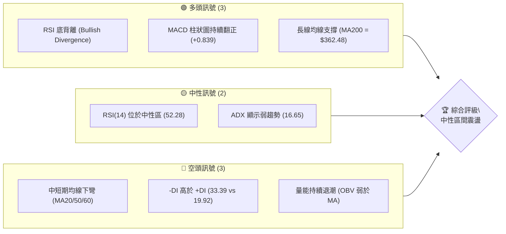
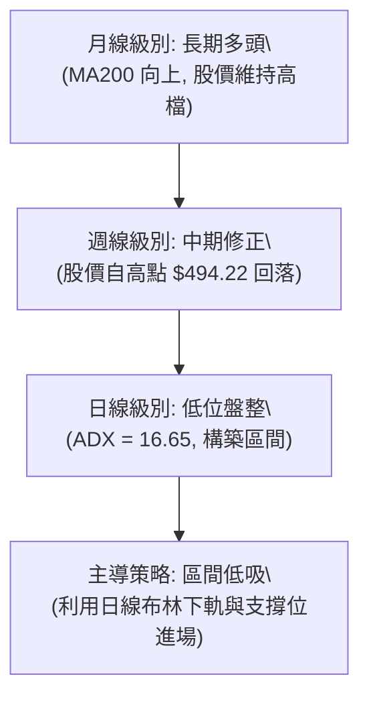
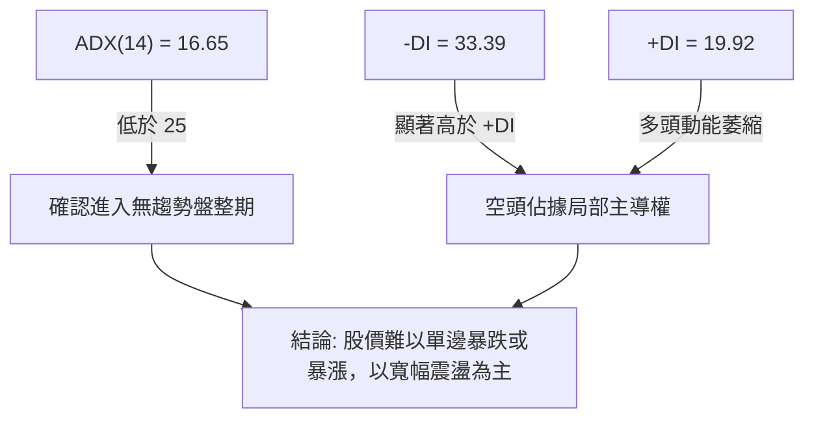
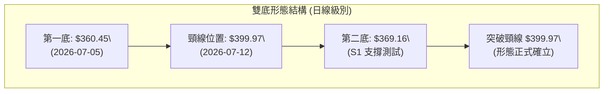
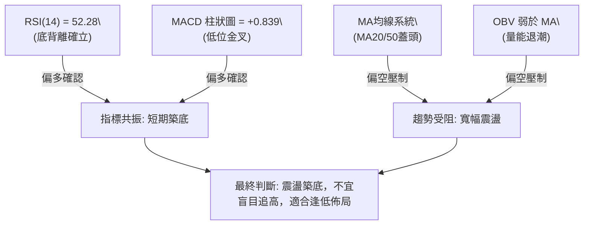
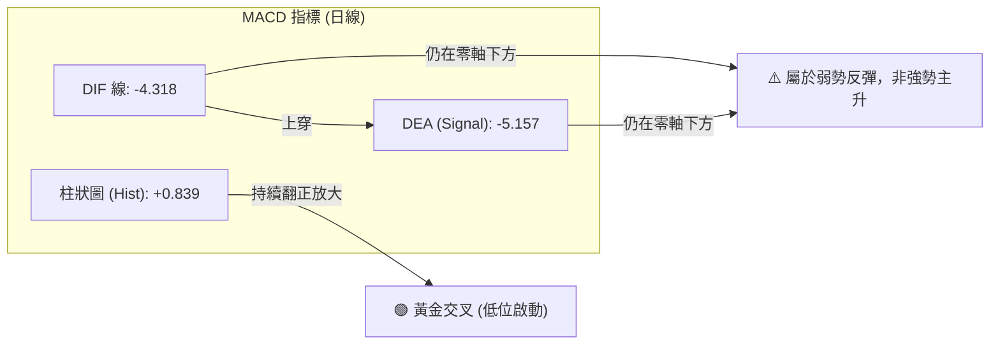
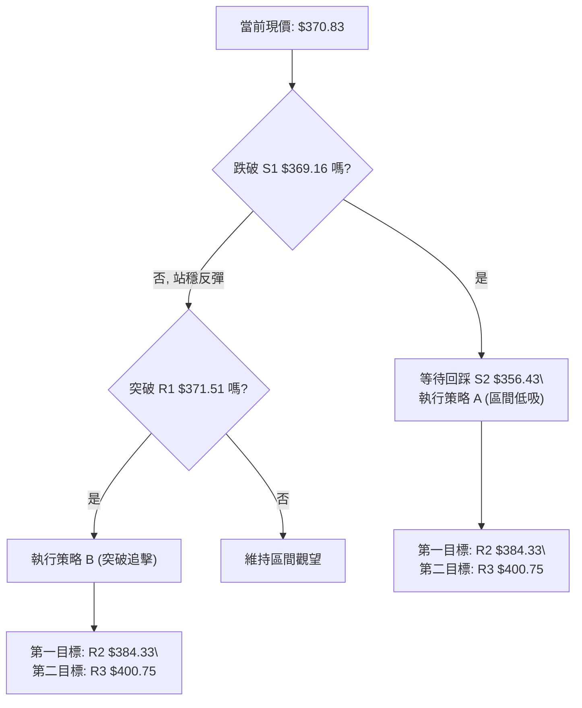
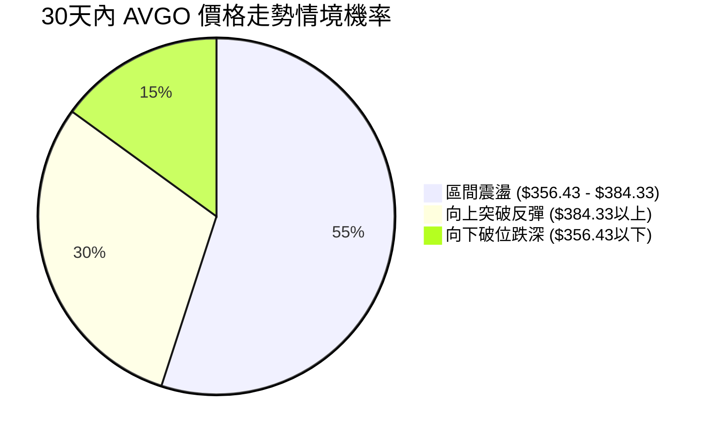
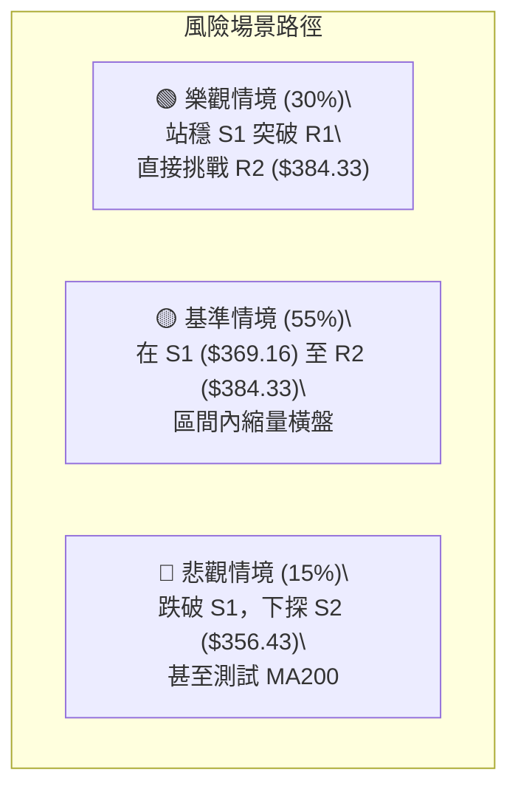

<details>
<summary>📊 靜態圖表 (點擊展開)</summary>

</details>

<html>
<head><meta charset="utf-8" /></head>
<body>
    <div style="height:500px; width:100%;">                        <script>window.PlotlyConfig = {MathJaxConfig: 'local'};</script>
        <script charset="utf-8" src="https://cdn.plot.ly/plotly-3.7.0.min.js" integrity="sha256-jvTGqxNp8AGWEcvNLVuKr+8j5dGe9Yw51LQkmDH+IYA=" crossorigin="anonymous"></script>                <div id="candlestick-chart" class="plotly-graph-div" style="height:100%; width:100%;"></div>            <script>                window.PLOTLYENV=window.PLOTLYENV || {};                                if (document.getElementById("candlestick-chart")) {                    Plotly.newPlot(                        "candlestick-chart",                        [{"close":{"dtype":"f8","bdata":"AAAAoCSBdEAAAABAg7h0QAAAAMC5BHVAAAAAoL8HdUAAAAAA7dl0QAAAAECQ6HRAAAAAQDF5dUAAAAAgjnF1QAAAAEAiLXRAAAAAAGUrdkAAAAAgZWN1QAAAAODz1XVAAAAAQNICdkAAAACgIbZ1QAAAAACztHVAAAAAoAFMdUAAAADgdCZ1QAAAAODwZXVAAAAA4IACdkAAAABghIB2QAAAAIBDLndAAAAAgEP9d0AAAACg82V3QAAAAAAf+XZAAAAA4HiIdkAAAACgqN91QAAAAOCrT3ZAAAAAwLsZdkAAAADguLd1QAAAAKBIRnZAAAAAIPrfdUAAAACg2BN2QAAAAKBdIXVAAAAA4NJIdUAAAADg2Et1QAAAAICjKXVAAAAAIB4HdkAAAAAAMo51QAAAAKDdJHVAAAAAoKh9d0AAAADgJe53QAAAAICrtXhAAAAAAG4LeUAAAADA2v53QAAAAMAYt3dAAAAAgNKnd0AAAABAga53QAAAACALQXhAAAAA4NXteEAAAACgaUB5QAAAAICyqnlAAAAAgK9BeUAAAABAyV52QAAAAOCoHnVAAAAAAF42dUAAAADgP0N0QAAAAICqgHRAAAAAQGkndUAAAABAJkN1QAAAAGCbwHVAAAAAQPTOdUAAAADgZu11QAAAACC5wXVAAAAAQA7JdUAAAACgRo11QAAAAKCBpXVAAAAAwI1idUAAAAAAImh1QAAAACDUY3VAAAAA4Ce0dEAAAABAQ3t1QAAAAGCt7nVAAAAAoO8UdkAAAAAASCp1QAAAAEAtXHVAAAAA4LTmdUAAAACgEbZ0QAAAAOB9eXRAAAAA4LlEdEAAAABgAe5zQAAAACCGOnRAAAAAABm5dEAAAABgRcB0QAAAAEBCmHRAAAAAYFihdEAAAADgUJ50QAAAACB48nNAAAAAwLUuc0AAAAAg7VVzQAAAAKAru3RAAAAAwNdqdUAAAABgDDN1QAAAAEAIWHVAAAAA4EWfdEAAAAAgoD90QAAAAMActXRAAAAAQJPEdEAAAAAgOsx0QAAAAKDdtnRAAAAAoAqSdEAAAADguUR0QAAAACBysXRAAAAAIE8IdEAAAAAACeZzQAAAAOBl2nNAAAAAwAKLc0AAAACA1cVzQAAAAEDHuHRAAAAAAEaUdEAAAABAsod1QAAAAIApVXVAAAAA4A9FdUAAAACAyut0QAAAAGCkD3RAAAAA4KM7dEAAAACAFwJ0QAAAAMBTrHNAAAAAgKjqc0AAAAAg7VVzQAAAAKABIHRAAAAAwJfcc0AAAABA5uRzQAAAAKDlTnNAAAAAIEfDckAAAABAJE9yQAAAAMBVUHNAAAAAAOqPc0AAAADg2KBzQAAAACDunnNAAAAAgBPXdEAAAAAgN+F1QAAAAECWJXZAAAAA4Gcvd0AAAAAgZrJ3QAAAAEDawndAAAAAYH3BeEAAAAAgct14QAAAAKBcXnlAAAAA4PnveEAAAABgjRh5QAAAAMC2X3pAAAAAQGw0ekAAAADAeGF6QAAAAICgGHpAAAAAwCvzeEAAAAAA80x5QAAAAIBTDHpAAAAAINRJekAAAABAeP15QAAAAID0qnpAAAAAoEiMekAAAACAh755QAAAAOAg1XpAAAAAQAy8ekAAAADgMip6QAAAAEAaAnpAAAAAYIVxe0AAAABASoh6QAAAACC5QHpAAAAAILqmeUAAAAAgmRF6QAAAAICj3nlAAAAAAMXXeUAAAACgfVV6QAAAAAAYU3pAAAAAoH6eekAAAABABuF7QAAAAADks3xAAAAA4PEMfkAAAABgkOd9QAAAAAD4I3pAAAAAgO0ReEAAAACgkr94QAAAACCleHhAAAAAQDE4d0AAAAAgXw94QAAAAOB113dAAAAAgBSVeEAAAADg1YF3QAAAAGB3hHhAAAAAQDOreUAAAACAFIJ4QAAAAGBmwndAAAAAwB7hd0AAAABgj653QAAAAOBR0HZAAAAAQDNHd0AAAAAAAJx3QAAAAKBwFXdAAAAAQDOHdkAAAABgZl53QAAAAOB6LHdAAAAAQApLeEAAAACAwhF5QAAAACCF\u002f3hAAAAAwMwAeEAAAACAwlF4QAAAAOB6pHhAAAAAQDNnd0AAAACgRy13QA=="},"high":{"dtype":"f8","bdata":"gMFa+keTdEDGVNfoEAF1QM7VzL7DmnVAX6Hd2rBndUAiVsJHZWN1QNIV75GcA3VAthd5Yr2JdUAkweK5\u002fZV1QMGgaZBWynVAC4sqEwlWdkALQHe2c8t1QLlFjWlaVnZA76INYXOTdkBO6mmwOdB1QHAHOtmkKXZAZ20AOEvSdUBKC70hIaF1QJDjhrQ3inVAOcgf8NlEdkD0S2alp4t2QKz1fj6bP3dASs8wFjgFeECh8jM18gN4QL6jjXhXi3dAYl+z+ixMd0BGgMFXTe52QC\u002fOac1irXZAbb06kZaXdkDcsJLkYwh2QM810V\u002fmX3ZAa40u1fh9dkCgq8Su6012QOPjP39G+XVAR8F8tBltdUD7marBy+N1QIxF\u002fRt+oHVAROgQtPdadkA3lH33vl93QPAfnkGEqnVAPobhR\u002fC9d0CMH5+8eB94QIstp79D2nhAdS819hAMeUDCu6RMdpN4QB\u002f1WK3pdHhA6V5SLLbCd0BESSyXAtx3QEbZbOZjdXhAQzkK1FJQeUBdmCtkmEp5QPJ4pnDKxHlAFLBZ3k1weUCDxCU38L13QHl4epe4f3ZAAthmuQOZdUD\u002fCO9+2op1QGC6BX6E4nRAZZMdd5NYdUDwWRX+gY91QGSCyD8zzXVAgsgf8An5dUBHabaJQf91QA4Ikh610HVAaEnHVCv2dUDrxqasiMl1QHfONXdhdXZA7BWlt6EbdkChYUaATbx1QG2VZCuqxnVAhL\u002fHoLJmdUBqZ88+16F1QOA4JDieCXZAVD95w7pidkDlqVllctZ1QCx8S4FYxnVAx7hJqFcTdkDf0KzzHYJ1QPSauqQU6XRAYWqK\u002fgz8dEArJOd17gx0QAndZyyUd3RAquV8goDYdEC3YtTm3yt1QN6mDed463RAwy3sJVcPdUDYD\u002fO1Oe10QIB3mbZ\u002fGnVASXPlt2Xlc0C5ETIsTlV0QLabVvtT3HRA+H6\u002f2L\u002fwdUDyf\u002f1Suat1QIO+wMDPnnVAM8U8E06QdUApPfLyfNF0QHd+Y55I6HRAB1P8DT0KdUDi+Vh6KhN1QNkWe5rJLXVACVioVB8UdUB\u002f6UU7rnF0QLkOiqHV6nRA\u002fXijIxpWdEAA6ip8Ne1zQLwE1qjY7XNABeNE9Yerc0BqBpdOSxd0QHMgb4Mu7nRAyhiJ\u002fvxjdUBLYhsPYLN1QE9pVZ+A\u002fXVA8gpzIqeIdUDcHBX5Uil1QNX2d9FAEXVAzSy5aN5\u002fdEBhtALZz2N0QAxeQ8jtQ3RATtjuL1YhdEBZdEXDRwV0QBw0Fw5tX3RAP5EItDI+dEDZsUu3mTx0QKPKnhS1xnNAZlCsuzkwc0Cud6w4nQRzQL\u002fWfFIdXXNAgfAU\u002fae0c0DqygF4FaNzQEnp0n9mvnNAKT7ClfPZdEAU3EBoSRl2QNt\u002fMJghYnZAG5Yjg0d\u002fd0DXWtdwIcR3QI6HiIrQ2ndAUfuFiz3HeEDeAytrxvB4QPriLqVlYXlAWS8kzXFceUCsxZleZS95QItPohCAaHpAKielGhvKekC5R4NAQYV6QG2F\u002fcxPYXpAC4R0K7NSeUA9NC0F\u002fE95QDzw55mAG3pA4clNZAVoekABvbZukHJ6QBd6zHhIC3tACC0WZ9BPe0Cl2PGWDp16QGVNWYMAJXtAYy21lm8Pe0Di0WDElcp6QBQZQfd+H3pADFq2XZOae0D6uipuBAJ7QJgk9ZV9VXpAOYY3GKIUekB+dC4D\u002f3d6QKgz0QpTWXpAIbrmojg1ekCu5CJL9Cl7QCtmx3DbAXtA8IJ8LwTQekC5Esj2DAN8QPtNz0UEFX1ApvNf88KAfkCtK1EufON+QHWn5MDlnHpA5Q1TDZ+deUBlTI88QSN5QHvwOpGbc3lAZM99ozQTeEBPVxnwJk54QCUGYmryBXhADxtL3y65eEBCBxIFvHJ4QMnNyTZFAHlAn\u002fEqI8TAeUAAAACAPep5QAAAAOBRcHhAAAAAANdLeEAAAADAzEx4QAAAAEAKW3dAAAAAIFyDd0AAAACA67l3QAAAAAAAXHdAAAAAAABgd0AAAABgj\u002fJ3QAAAACBcT3dAAAAAoHCxeEAAAADgUXh5QAAAAEAKJ3lAAAAAAAC8eEAAAACgR9V4QAAAAAAA8HhAAAAAANcreEAAAACgmZV3QA=="},"hovertemplate":"\u003cb\u003e%{x|%Y-%m-%d}\u003c\u002fb\u003e\u003cbr\u003e\u958b: $%{open:.2f}\u003cbr\u003e\u9ad8: $%{high:.2f}\u003cbr\u003e\u4f4e: $%{low:.2f}\u003cbr\u003e\u6536: $%{close:.2f}\u003cextra\u003e\u003c\u002fextra\u003e","low":{"dtype":"f8","bdata":"CplYu9AsdEDaxmKuECt0QJUPvGEb1nRAKF\u002fMKOfddEAANnL6IMt0QFGo\u002fuIoTHRAFIk+w0KsdEDGEdkVDCh1QM+oar3nI3RAeJzserBZdUDuEaBDHRx1QD4SLK0DmXVA0hGHP624dUAY+bAKGC51QP+lDpVsnnVAE0vl0IY2dUAjj7N2Ptp0QDQV0CsMKHVAdt3TD8vOdUB\u002fTP1ZnhF2QGtYNo8niHZAR8ruk8Mxd0CQd22R9v92QDCr3ocLsXZADD3CQmd\u002fdkAtWgfVs9B1QKRngE05wnVAg+OM\u002fejrdUAzf\u002f4SP\u002fZ0QLUsJukjCnZA2YanpYq7dUDwe4SOhdt1QHlcd7nDxHRAd4jcYJ5zdEBHN515Ofp0QGgMt2c+2nRAN7p+4a3+dECRxqPvGXR1QE2Hj942n3RARW9yhI+bdUCypcgj2hp3QIEdw2b80XdAJ1uQpCWveEB3fpweQ+93QBy6roHGmndAj4kWulkJd0DcnUL452Z3QPkYB7AO8HdANqNtFfeyeEDpu0\u002fS5JR4QDqxMTpV1XhA9zjGRuR\u002feEDIioV8uxJ2QA+khaAQ+nRAcRc3cBXTdEBD1LhgD\u002fpzQP4IXyo5HXRAorM195+rdECJjeu2t\u002f90QOt+o47CFHVAj0M17dqddUBZH2U4lKd1QCksvIfMdnVA+76\u002fpEnAdUDPu\u002fSYb4J1QDpf89eqhHVACy9FZz30dEBXhGvdJgx1QPcYYS1b6nRAE5YWhJeUdEDoaDONasR0QJwMQsUtO3VA8LE\u002fH\u002fTZdUBerL0aFdN0QPP+UAuoRnVAIDQXp5hsdUCH\u002fdfGUKl0QPkI24YpMHRAG6r9ZCk7dEA0phdsUI9zQN0oax3zxnNAAGPPvR1ddECNPOjwA1h0QJtdahis8XNA6UbD5f9xdEBlhtPz3kh0QGC+pnVGOHNAl5GbbHVjckDnKYKmMBlzQKFP1tg5snNAlZ1mqvuWdEAeTBzFeyl1QI1bVtk9yHRAd7YWdJuFdEAXIkk3+Td0QNe9\u002fZxisnNA7rSzyHZgdEDSHtAqhYd0QJEp0QbthXRAg4IpNwRCdECsjRMXvJRzQFo00MwkgXRAHrVMIcwsc0CwkknQy01zQEwAcw8pIXNAm+SVT1kkc0AaFUyqiGlzQLxmjKyCHXRAvrdUjSxjdEB7ryyWwSZ0QAp3ZGLJOHVAqSJ1nKgPdUDldpJMsa90QPQhZDkBBHRA35RuTyruc0AX3a3IXsFzQMajd\u002fZEpnNAiluYMgs2c0DJPY9ehUxzQMeRW+\u002fqpnNAbziD1Hqlc0AnTwsng8NzQD\u002f5Pj7nSnNA3JcNF12mckDUZ55UBxhyQDMtmp3yfXJAIAxCm9Rfc0AbjYz4XtRyQNC1S5yiXHNArapD5akUdEAoM+3s0V91QC93KvIc73VAv4FHU\u002f+DdkBFNpG4Vg53QJZVG\u002f6ae3dATtDyKl8PeEDKlDQ8rnt4QMXjBA\u002fa8nhAgbuG5GO0eEBQua\u002fwJJ94QFFYlAWGQ3lA25XWmTwSekAWkD43bIN5QLdAQNuY33lAkYj1BmygeEDtO7q9csJ4QKp1T891OXlApAHB5wfKeUBWqdA8II55QPKby3f\u002fKnpAowso1OoRekDyn2kEh1p5QIk74m6I1XlA86GBoA2GekC5c\u002fn7O3x5QMn8oLqQQnlAE4fgwe7ueUD9w+aiLzJ6QK\u002fy8Yhx23lA6QG3mH9TeUCQjtKIUax5QBnjsxefnXlAUPHWD\u002f2YeUDWyiANdQV6QFpc50FP\u002fXlATKSnW7HVeUDPVaWGnOx6QHxDvOJWmHtALL1WKHdbfUBFiyBnSn59QCamdYn4JXlA3Fz\u002f57APeEA+2A+btGt4QNKNYqvqG3dA0gDvBFYpd0BAXc1Xbh93QPgJjfB3hndAJ1sRcMY\u002feEBMND1+1313QEi+ibe54HdAngG6w9RLeUAAAABgj354QAAAAGCPindAAAAAIFyPd0AAAABAM0t3QAAAAKBHvXZAAAAAIFyHdkAAAACAPSp3QAAAAOB6AHdAAAAAQOFGdkAAAABA4TJ3QAAAAAApoHZAAAAAgD2Od0AAAABA4T54QAAAAEAzu3hAAAAAYLj2d0AAAACAPQp4QAAAAADXK3hAAAAAYGY+d0AAAADAzFx2QA=="},"name":"\u50f9\u683c","open":{"dtype":"f8","bdata":"uDvj9HuEdEAl4\u002f68I2V0QM7VzL7DmnVAxd9hrYw5dUCjziSPxOB0QEgo+pht8nRAtQ2znlq\u002fdEA5ngmWK311QGTxxl1xd3VA4IaGVd3sdUA4fRYq3MJ1QCGLy7LpB3ZAdNFOIvwsdkBFucwblrp1QFKoBqlA\u002fXVA81H\u002fs8rAdUCRHNIW1ZV1QDQV0CsMKHVADsWqWrrodUBGEB8kZ3h2QLI\u002fTyGWiXZAR8ruk8Mxd0Ch8jM18gN4QAFhryaXgndABi41adQed0AOMPoMWkh2QIEQiOrzznVAUI8Qc6ZhdkCTVRg4dQN2QP7dga98PnZAzIh+HINPdkDxIOgAt0B2QFSZCVfu2XVA7lelvfaZdEBFmkPZ0R51QN+XGB6ZVHVAHAZ51PosdUCRUzVvXb92QGJXsIfIc3VAhH9aq6ycdUDJzGaIjux3QBes6OBr9ndA4HUo5\u002f3ReECua4mPZIp4QHtE4uVVInhA3s+A7B2ed0DF40yd76h3QOKgamdJAHhAGynK38oDeUB33ALdcch4QBKFGndW\u002f3hAXiwqxy4peUAgaTHoep13QFgrNJr4fXZANIlgplvidED\u002fCO9+2op1QHiXUk0K4nRA0g0Enre3dEA+xTgGKYx1QK4PoE7yOHVAsvk3T3LWdUDz+Og1WNx1QOpjgtIKt3VAZLEy8vfKdUBRZueNJMd1QPy5mW3D93VAZNa5MwIXdkAR\u002fypObGV1QINgNm8iR3VAi\u002f1pyFlYdUCd3TN74Ap1QJwMQsUtO3VAWMrEoVv5dUDPZ5kgB7t1QI8sayxrvXVA7qOKZ\u002fyPdUCSdaK+ZG11QHMrs0B15HRAqGj6RejhdEDyxV+mDOJzQJ0I2ioF6nNAQHvkrMuIdEDTJAaqsxl1QOdpYF1utXRADoXDvISzdEDghm0KnE50QAq9Oc8Q+HRASXPlt2Xlc0D0spAs+5JzQCZoxZjN7nNALfaZXOWYdEDzkjORHaN1QHjWPERvmHVAWViLzhZpdUDPsmcFO4p0QHaWm3Mb6HNAqeOsG\u002fiEdECBD2jbmrx0QNx9Fhw+snRADrNzSX2wdEAxEu4YsxV0QK0pGvpqmHRAxJl2t9NUdEDeHlqK9FhzQLHAz9aXQ3NASVOgwJ59c0CqkZKvV6hzQB8tp499j3RAGjqq0jNxdEB2M4ZdyGB0QIwpZoszt3VAs7GValJVdUANOE7EAQh1QFcJhPAMB3VABxrS1ixNdEAP6V7aB0l0QODChxkQ9HNAuzPeyit1c0DPLKUoH+9zQLbGptD113NA0k6fzuj3c0Bar6+oSCF0QKgK6llhmHNAbs66VDIpc0CuyecWUMZyQAee+r+rrnJAsCLSRv+Nc0AuGZs8JABzQPd0Hoz+qHNAZrhlXGtjdEBUxEZgG\u002fN1QMKqooTk+3VAYmRzDOqFdkBhXlXONhF3QJOnGmTYlHdA+tmCBTlUeECr0W91A6Z4QPNq\u002fqBDBHlANOgpVvFQeUAjYCU9dux4QHebwOxjZXlAgRaFpI9bekBsDqKB74R6QMrRM54MPXpAkQemxNb6eEBzqg9fzC15QA4JuXzQ7XlAOcak8PHmeUBFXxM+8hh6QOnGV0TmT3pAw97Jn\u002fIte0CTV8qQdFJ6QLJmtaQvMnpAPpAgvhuvekDjxdukLGx6QGRWz3dy8nlAPwvy4CQBekD6uipuBAJ7QPKKINjnS3pABhguN8KSeUDLW73phcJ5QKLpGBpYznlA6bhE0UgNekAx58NXax16QFqfGXlfhnpAN02wtZdHekAyBmgSQQR7QPB0mnIPFnxAOIgURUiAfkC7rtd6+N9+QO238dR\u002fhXlAIWvwQXRveUDNCRiJvR95QCMEyxWbD3lA7A7cyFrOd0CMj2+msUN3QFZhG5LR8XdAqX6WFimueED39xZ\u002ffll4QDkDiz6IQXhAUTXBtOyOeUAAAABgj9p5QAAAAIDrnXdAAAAAgOspeEAAAACgRyl4QAAAAEAzJ3dAAAAAgOtZd0AAAADgo2x3QAAAAIDrPXdAAAAAIK7bdkAAAACAwll3QAAAAMD16HZAAAAA4FGYd0AAAABACiN5QAAAAAAA6HhAAAAAIK6XeEAAAAAghbt4QAAAAKBwwXhAAAAA4KMIeEAAAADAzOB2QA=="},"x":["2025-09-30T00:00:00-04:00","2025-10-01T00:00:00-04:00","2025-10-02T00:00:00-04:00","2025-10-03T00:00:00-04:00","2025-10-06T00:00:00-04:00","2025-10-07T00:00:00-04:00","2025-10-08T00:00:00-04:00","2025-10-09T00:00:00-04:00","2025-10-10T00:00:00-04:00","2025-10-13T00:00:00-04:00","2025-10-14T00:00:00-04:00","2025-10-15T00:00:00-04:00","2025-10-16T00:00:00-04:00","2025-10-17T00:00:00-04:00","2025-10-20T00:00:00-04:00","2025-10-21T00:00:00-04:00","2025-10-22T00:00:00-04:00","2025-10-23T00:00:00-04:00","2025-10-24T00:00:00-04:00","2025-10-27T00:00:00-04:00","2025-10-28T00:00:00-04:00","2025-10-29T00:00:00-04:00","2025-10-30T00:00:00-04:00","2025-10-31T00:00:00-04:00","2025-11-03T00:00:00-05:00","2025-11-04T00:00:00-05:00","2025-11-05T00:00:00-05:00","2025-11-06T00:00:00-05:00","2025-11-07T00:00:00-05:00","2025-11-10T00:00:00-05:00","2025-11-11T00:00:00-05:00","2025-11-12T00:00:00-05:00","2025-11-13T00:00:00-05:00","2025-11-14T00:00:00-05:00","2025-11-17T00:00:00-05:00","2025-11-18T00:00:00-05:00","2025-11-19T00:00:00-05:00","2025-11-20T00:00:00-05:00","2025-11-21T00:00:00-05:00","2025-11-24T00:00:00-05:00","2025-11-25T00:00:00-05:00","2025-11-26T00:00:00-05:00","2025-11-28T00:00:00-05:00","2025-12-01T00:00:00-05:00","2025-12-02T00:00:00-05:00","2025-12-03T00:00:00-05:00","2025-12-04T00:00:00-05:00","2025-12-05T00:00:00-05:00","2025-12-08T00:00:00-05:00","2025-12-09T00:00:00-05:00","2025-12-10T00:00:00-05:00","2025-12-11T00:00:00-05:00","2025-12-12T00:00:00-05:00","2025-12-15T00:00:00-05:00","2025-12-16T00:00:00-05:00","2025-12-17T00:00:00-05:00","2025-12-18T00:00:00-05:00","2025-12-19T00:00:00-05:00","2025-12-22T00:00:00-05:00","2025-12-23T00:00:00-05:00","2025-12-24T00:00:00-05:00","2025-12-26T00:00:00-05:00","2025-12-29T00:00:00-05:00","2025-12-30T00:00:00-05:00","2025-12-31T00:00:00-05:00","2026-01-02T00:00:00-05:00","2026-01-05T00:00:00-05:00","2026-01-06T00:00:00-05:00","2026-01-07T00:00:00-05:00","2026-01-08T00:00:00-05:00","2026-01-09T00:00:00-05:00","2026-01-12T00:00:00-05:00","2026-01-13T00:00:00-05:00","2026-01-14T00:00:00-05:00","2026-01-15T00:00:00-05:00","2026-01-16T00:00:00-05:00","2026-01-20T00:00:00-05:00","2026-01-21T00:00:00-05:00","2026-01-22T00:00:00-05:00","2026-01-23T00:00:00-05:00","2026-01-26T00:00:00-05:00","2026-01-27T00:00:00-05:00","2026-01-28T00:00:00-05:00","2026-01-29T00:00:00-05:00","2026-01-30T00:00:00-05:00","2026-02-02T00:00:00-05:00","2026-02-03T00:00:00-05:00","2026-02-04T00:00:00-05:00","2026-02-05T00:00:00-05:00","2026-02-06T00:00:00-05:00","2026-02-09T00:00:00-05:00","2026-02-10T00:00:00-05:00","2026-02-11T00:00:00-05:00","2026-02-12T00:00:00-05:00","2026-02-13T00:00:00-05:00","2026-02-17T00:00:00-05:00","2026-02-18T00:00:00-05:00","2026-02-19T00:00:00-05:00","2026-02-20T00:00:00-05:00","2026-02-23T00:00:00-05:00","2026-02-24T00:00:00-05:00","2026-02-25T00:00:00-05:00","2026-02-26T00:00:00-05:00","2026-02-27T00:00:00-05:00","2026-03-02T00:00:00-05:00","2026-03-03T00:00:00-05:00","2026-03-04T00:00:00-05:00","2026-03-05T00:00:00-05:00","2026-03-06T00:00:00-05:00","2026-03-09T00:00:00-04:00","2026-03-10T00:00:00-04:00","2026-03-11T00:00:00-04:00","2026-03-12T00:00:00-04:00","2026-03-13T00:00:00-04:00","2026-03-16T00:00:00-04:00","2026-03-17T00:00:00-04:00","2026-03-18T00:00:00-04:00","2026-03-19T00:00:00-04:00","2026-03-20T00:00:00-04:00","2026-03-23T00:00:00-04:00","2026-03-24T00:00:00-04:00","2026-03-25T00:00:00-04:00","2026-03-26T00:00:00-04:00","2026-03-27T00:00:00-04:00","2026-03-30T00:00:00-04:00","2026-03-31T00:00:00-04:00","2026-04-01T00:00:00-04:00","2026-04-02T00:00:00-04:00","2026-04-06T00:00:00-04:00","2026-04-07T00:00:00-04:00","2026-04-08T00:00:00-04:00","2026-04-09T00:00:00-04:00","2026-04-10T00:00:00-04:00","2026-04-13T00:00:00-04:00","2026-04-14T00:00:00-04:00","2026-04-15T00:00:00-04:00","2026-04-16T00:00:00-04:00","2026-04-17T00:00:00-04:00","2026-04-20T00:00:00-04:00","2026-04-21T00:00:00-04:00","2026-04-22T00:00:00-04:00","2026-04-23T00:00:00-04:00","2026-04-24T00:00:00-04:00","2026-04-27T00:00:00-04:00","2026-04-28T00:00:00-04:00","2026-04-29T00:00:00-04:00","2026-04-30T00:00:00-04:00","2026-05-01T00:00:00-04:00","2026-05-04T00:00:00-04:00","2026-05-05T00:00:00-04:00","2026-05-06T00:00:00-04:00","2026-05-07T00:00:00-04:00","2026-05-08T00:00:00-04:00","2026-05-11T00:00:00-04:00","2026-05-12T00:00:00-04:00","2026-05-13T00:00:00-04:00","2026-05-14T00:00:00-04:00","2026-05-15T00:00:00-04:00","2026-05-18T00:00:00-04:00","2026-05-19T00:00:00-04:00","2026-05-20T00:00:00-04:00","2026-05-21T00:00:00-04:00","2026-05-22T00:00:00-04:00","2026-05-26T00:00:00-04:00","2026-05-27T00:00:00-04:00","2026-05-28T00:00:00-04:00","2026-05-29T00:00:00-04:00","2026-06-01T00:00:00-04:00","2026-06-02T00:00:00-04:00","2026-06-03T00:00:00-04:00","2026-06-04T00:00:00-04:00","2026-06-05T00:00:00-04:00","2026-06-08T00:00:00-04:00","2026-06-09T00:00:00-04:00","2026-06-10T00:00:00-04:00","2026-06-11T00:00:00-04:00","2026-06-12T00:00:00-04:00","2026-06-15T00:00:00-04:00","2026-06-16T00:00:00-04:00","2026-06-17T00:00:00-04:00","2026-06-18T00:00:00-04:00","2026-06-22T00:00:00-04:00","2026-06-23T00:00:00-04:00","2026-06-24T00:00:00-04:00","2026-06-25T00:00:00-04:00","2026-06-26T00:00:00-04:00","2026-06-29T00:00:00-04:00","2026-06-30T00:00:00-04:00","2026-07-01T00:00:00-04:00","2026-07-02T00:00:00-04:00","2026-07-06T00:00:00-04:00","2026-07-07T00:00:00-04:00","2026-07-08T00:00:00-04:00","2026-07-09T00:00:00-04:00","2026-07-10T00:00:00-04:00","2026-07-13T00:00:00-04:00","2026-07-14T00:00:00-04:00","2026-07-15T00:00:00-04:00","2026-07-16T00:00:00-04:00","2026-07-17T00:00:00-04:00"],"type":"candlestick"},{"hovertemplate":"MA30: $%{y:.2f}\u003cextra\u003e\u003c\u002fextra\u003e","line":{"color":"#2196F3","dash":"dash","width":2},"mode":"lines","name":"MA30","x":["2025-09-30T00:00:00-04:00","2025-10-01T00:00:00-04:00","2025-10-02T00:00:00-04:00","2025-10-03T00:00:00-04:00","2025-10-06T00:00:00-04:00","2025-10-07T00:00:00-04:00","2025-10-08T00:00:00-04:00","2025-10-09T00:00:00-04:00","2025-10-10T00:00:00-04:00","2025-10-13T00:00:00-04:00","2025-10-14T00:00:00-04:00","2025-10-15T00:00:00-04:00","2025-10-16T00:00:00-04:00","2025-10-17T00:00:00-04:00","2025-10-20T00:00:00-04:00","2025-10-21T00:00:00-04:00","2025-10-22T00:00:00-04:00","2025-10-23T00:00:00-04:00","2025-10-24T00:00:00-04:00","2025-10-27T00:00:00-04:00","2025-10-28T00:00:00-04:00","2025-10-29T00:00:00-04:00","2025-10-30T00:00:00-04:00","2025-10-31T00:00:00-04:00","2025-11-03T00:00:00-05:00","2025-11-04T00:00:00-05:00","2025-11-05T00:00:00-05:00","2025-11-06T00:00:00-05:00","2025-11-07T00:00:00-05:00","2025-11-10T00:00:00-05:00","2025-11-11T00:00:00-05:00","2025-11-12T00:00:00-05:00","2025-11-13T00:00:00-05:00","2025-11-14T00:00:00-05:00","2025-11-17T00:00:00-05:00","2025-11-18T00:00:00-05:00","2025-11-19T00:00:00-05:00","2025-11-20T00:00:00-05:00","2025-11-21T00:00:00-05:00","2025-11-24T00:00:00-05:00","2025-11-25T00:00:00-05:00","2025-11-26T00:00:00-05:00","2025-11-28T00:00:00-05:00","2025-12-01T00:00:00-05:00","2025-12-02T00:00:00-05:00","2025-12-03T00:00:00-05:00","2025-12-04T00:00:00-05:00","2025-12-05T00:00:00-05:00","2025-12-08T00:00:00-05:00","2025-12-09T00:00:00-05:00","2025-12-10T00:00:00-05:00","2025-12-11T00:00:00-05:00","2025-12-12T00:00:00-05:00","2025-12-15T00:00:00-05:00","2025-12-16T00:00:00-05:00","2025-12-17T00:00:00-05:00","2025-12-18T00:00:00-05:00","2025-12-19T00:00:00-05:00","2025-12-22T00:00:00-05:00","2025-12-23T00:00:00-05:00","2025-12-24T00:00:00-05:00","2025-12-26T00:00:00-05:00","2025-12-29T00:00:00-05:00","2025-12-30T00:00:00-05:00","2025-12-31T00:00:00-05:00","2026-01-02T00:00:00-05:00","2026-01-05T00:00:00-05:00","2026-01-06T00:00:00-05:00","2026-01-07T00:00:00-05:00","2026-01-08T00:00:00-05:00","2026-01-09T00:00:00-05:00","2026-01-12T00:00:00-05:00","2026-01-13T00:00:00-05:00","2026-01-14T00:00:00-05:00","2026-01-15T00:00:00-05:00","2026-01-16T00:00:00-05:00","2026-01-20T00:00:00-05:00","2026-01-21T00:00:00-05:00","2026-01-22T00:00:00-05:00","2026-01-23T00:00:00-05:00","2026-01-26T00:00:00-05:00","2026-01-27T00:00:00-05:00","2026-01-28T00:00:00-05:00","2026-01-29T00:00:00-05:00","2026-01-30T00:00:00-05:00","2026-02-02T00:00:00-05:00","2026-02-03T00:00:00-05:00","2026-02-04T00:00:00-05:00","2026-02-05T00:00:00-05:00","2026-02-06T00:00:00-05:00","2026-02-09T00:00:00-05:00","2026-02-10T00:00:00-05:00","2026-02-11T00:00:00-05:00","2026-02-12T00:00:00-05:00","2026-02-13T00:00:00-05:00","2026-02-17T00:00:00-05:00","2026-02-18T00:00:00-05:00","2026-02-19T00:00:00-05:00","2026-02-20T00:00:00-05:00","2026-02-23T00:00:00-05:00","2026-02-24T00:00:00-05:00","2026-02-25T00:00:00-05:00","2026-02-26T00:00:00-05:00","2026-02-27T00:00:00-05:00","2026-03-02T00:00:00-05:00","2026-03-03T00:00:00-05:00","2026-03-04T00:00:00-05:00","2026-03-05T00:00:00-05:00","2026-03-06T00:00:00-05:00","2026-03-09T00:00:00-04:00","2026-03-10T00:00:00-04:00","2026-03-11T00:00:00-04:00","2026-03-12T00:00:00-04:00","2026-03-13T00:00:00-04:00","2026-03-16T00:00:00-04:00","2026-03-17T00:00:00-04:00","2026-03-18T00:00:00-04:00","2026-03-19T00:00:00-04:00","2026-03-20T00:00:00-04:00","2026-03-23T00:00:00-04:00","2026-03-24T00:00:00-04:00","2026-03-25T00:00:00-04:00","2026-03-26T00:00:00-04:00","2026-03-27T00:00:00-04:00","2026-03-30T00:00:00-04:00","2026-03-31T00:00:00-04:00","2026-04-01T00:00:00-04:00","2026-04-02T00:00:00-04:00","2026-04-06T00:00:00-04:00","2026-04-07T00:00:00-04:00","2026-04-08T00:00:00-04:00","2026-04-09T00:00:00-04:00","2026-04-10T00:00:00-04:00","2026-04-13T00:00:00-04:00","2026-04-14T00:00:00-04:00","2026-04-15T00:00:00-04:00","2026-04-16T00:00:00-04:00","2026-04-17T00:00:00-04:00","2026-04-20T00:00:00-04:00","2026-04-21T00:00:00-04:00","2026-04-22T00:00:00-04:00","2026-04-23T00:00:00-04:00","2026-04-24T00:00:00-04:00","2026-04-27T00:00:00-04:00","2026-04-28T00:00:00-04:00","2026-04-29T00:00:00-04:00","2026-04-30T00:00:00-04:00","2026-05-01T00:00:00-04:00","2026-05-04T00:00:00-04:00","2026-05-05T00:00:00-04:00","2026-05-06T00:00:00-04:00","2026-05-07T00:00:00-04:00","2026-05-08T00:00:00-04:00","2026-05-11T00:00:00-04:00","2026-05-12T00:00:00-04:00","2026-05-13T00:00:00-04:00","2026-05-14T00:00:00-04:00","2026-05-15T00:00:00-04:00","2026-05-18T00:00:00-04:00","2026-05-19T00:00:00-04:00","2026-05-20T00:00:00-04:00","2026-05-21T00:00:00-04:00","2026-05-22T00:00:00-04:00","2026-05-26T00:00:00-04:00","2026-05-27T00:00:00-04:00","2026-05-28T00:00:00-04:00","2026-05-29T00:00:00-04:00","2026-06-01T00:00:00-04:00","2026-06-02T00:00:00-04:00","2026-06-03T00:00:00-04:00","2026-06-04T00:00:00-04:00","2026-06-05T00:00:00-04:00","2026-06-08T00:00:00-04:00","2026-06-09T00:00:00-04:00","2026-06-10T00:00:00-04:00","2026-06-11T00:00:00-04:00","2026-06-12T00:00:00-04:00","2026-06-15T00:00:00-04:00","2026-06-16T00:00:00-04:00","2026-06-17T00:00:00-04:00","2026-06-18T00:00:00-04:00","2026-06-22T00:00:00-04:00","2026-06-23T00:00:00-04:00","2026-06-24T00:00:00-04:00","2026-06-25T00:00:00-04:00","2026-06-26T00:00:00-04:00","2026-06-29T00:00:00-04:00","2026-06-30T00:00:00-04:00","2026-07-01T00:00:00-04:00","2026-07-02T00:00:00-04:00","2026-07-06T00:00:00-04:00","2026-07-07T00:00:00-04:00","2026-07-08T00:00:00-04:00","2026-07-09T00:00:00-04:00","2026-07-10T00:00:00-04:00","2026-07-13T00:00:00-04:00","2026-07-14T00:00:00-04:00","2026-07-15T00:00:00-04:00","2026-07-16T00:00:00-04:00","2026-07-17T00:00:00-04:00"],"y":{"dtype":"f8","bdata":"AAAAAAAA+H8AAAAAAAD4fwAAAAAAAPh\u002fAAAAAAAA+H8AAAAAAAD4fwAAAAAAAPh\u002fAAAAAAAA+H8AAAAAAAD4fwAAAAAAAPh\u002fAAAAAAAA+H8AAAAAAAD4fwAAAAAAAPh\u002fAAAAAAAA+H8AAAAAAAD4fwAAAAAAAPh\u002fAAAAAAAA+H8AAAAAAAD4fwAAAAAAAPh\u002fAAAAAAAA+H8AAAAAAAD4fwAAAAAAAPh\u002fAAAAAAAA+H8AAAAAAAD4fwAAAAAAAPh\u002fAAAAAAAA+H8AAAAAAAD4fwAAAAAAAPh\u002fAAAAAAAA+H8AAAAAAAD4f7y7u8vhyXVARERElJPVdUDe3d19J+F1QDMzM+Mb4nVAIiIiMkfkdUAzMzNTE+h1QCIiIqI+6nVAq6qquvnudUAAAAAg7u91QKuqqhow+HVAAAAAoHYDdkB3d3e3Jxl2QGZmZtatMXZAVVVV5ZBLdkCJiIiIDl92QO\u002fu7g40cHZA7+7unlSEdkAiIiKi7pl2QAAAAGBNsnZAvLu7mzbLdkDv7u4ureJ2QFVVVRXk93ZAvLu7e7QCd0De3d3N7vl2QBEREREe6nZAd3d359jedkDe3d2tGdF2QDMzM7OqwXZAIiIi4pa5dkAREREhtLV2QLy7u2s\u002fsXZAiYiIKK6wdkCamZkZZq92QLy7u3u+tHZAq6qqugS5dkDe3d0NM7t2QO\u002fu7g5Uv3ZAd3d3x9e5dkCrqqr6krh2QDMzM0OsunZAREREtOOidkCJiIhI\u002fo12QFVVVSVLdnZAq6qqqgJddkBERESk20R2QJqZmbnCMHZAVVVVRcohdkB3d3c3cQh2QGZmZsYw6HVAMzMzk2vAdUAzMzOzAZN1QCIiItKZZHVAMzMzI+o9dUARERHxGDB1QN7d3Q2eK3VAZmZmZqYmdUAAAACAryl1QGZmZhbyJHVA3t3dTR8UdUB3d3d3rgN1QKuqqor3+nRAIiIiQqH3dECrqqoKa\u002fF0QFVVVSXl7XRAEREREfjjdECrqqrq2Nh0QN7d3Y3V0HRAiYiIeJHLdEAzMzMTX8Z0QAAAACCbwHRAREREBHi\u002fdECrqqoaHrV0QAAAABCLqnRA7+7uPg6ZdECJiIhYP450QN7d3V1jgXRARERE1ENtdEAzMzPTQWV0QO\u002fu7t5dZ3RAzczMrARqdEBERES0rHd0QM3MzIwYgXRAmpmZ6cKFdECJiIhINod0QM3MzHyognRAq6qqmkR\u002fdEDe3d19D3p0QCIiIvK4d3RAVVVVxfx9dEBVVVXF\u002fH10QERERLTQeHRA3t3dTYprdEBmZmbmZmB0QBEREeEHT3RA3t3dDSo\u002fdEBERERknS50QEREROS4InRAvLu7+24YdEBmZmZGdA50QN7d3X0fBXRAZmZmlmwHdEDv7u5+LBV0QJqZmRmUIXRAMzMzU3s8dEBERETU5Fx0QKuqqgo+fnRAiYiImLmqdEAAAADALdZ0QM3MzNzU\u002fXRAZmZmhgUjdUCrqqo6c0F1QAAAAPB3bHVA3t3dnZSWdUDe3d19K8V1QM3MzFyr+HVAAAAAoOsgdkAzMzMTFU52QHd3d3d7hHZAmpmZydq6dkARERGxo\u002fN2QGZmZpZ4K3dAREREBIdkd0CrqqrKcpZ3QHd3d\u002fen1ndAmpmZia4aeEDv7u6Ot114QFVVVbXXlnhA7+7unhjaeEDNzMzMAhV5QCIiIqKaTXlAiYiIuKh2eUCJiIi4Z5p5QN7d3W0sunlAMzMzM9rQeUC8u7v7Wud5QImIiOg6\u002fXlAmpmZWSENekDNzMx82SZ6QO\u002fu7u5MQ3pAzczMzO5uekDv7u5u95d6QLy7u5v5lXpA7+7uLsKDekDNzMwc1HV6QGZmZmb2Z3pAERERUTJZekAiIiJSnE56QCIiIiLIO3pAZmZmNjktekAiIiIiCRh6QBEREaGvBXpAq6qq6i7+eUDNzMyMovN5QCIiIiJp2XlAIiIi4gvBeUBERETE26t5QKuqqlqZkHlAVVVVFQ5teUDNzMysHFR5QJqZmbkROXlAiYiIGGseeUDv7u7eYAd5QERERIRf8HhAd3d3FybjeEBmZmaWW9h4QEREROQJzXhAmpmZKbe2eECamZkJV5h4QGZmZmaxdXhAiYiI2Pc8eEBVVVUFjwN4QA=="},"type":"scatter"},{"hovertemplate":"MA60: $%{y:.2f}\u003cextra\u003e\u003c\u002fextra\u003e","line":{"color":"#9C27B0","dash":"dash","width":2},"mode":"lines","name":"MA60","x":["2025-09-30T00:00:00-04:00","2025-10-01T00:00:00-04:00","2025-10-02T00:00:00-04:00","2025-10-03T00:00:00-04:00","2025-10-06T00:00:00-04:00","2025-10-07T00:00:00-04:00","2025-10-08T00:00:00-04:00","2025-10-09T00:00:00-04:00","2025-10-10T00:00:00-04:00","2025-10-13T00:00:00-04:00","2025-10-14T00:00:00-04:00","2025-10-15T00:00:00-04:00","2025-10-16T00:00:00-04:00","2025-10-17T00:00:00-04:00","2025-10-20T00:00:00-04:00","2025-10-21T00:00:00-04:00","2025-10-22T00:00:00-04:00","2025-10-23T00:00:00-04:00","2025-10-24T00:00:00-04:00","2025-10-27T00:00:00-04:00","2025-10-28T00:00:00-04:00","2025-10-29T00:00:00-04:00","2025-10-30T00:00:00-04:00","2025-10-31T00:00:00-04:00","2025-11-03T00:00:00-05:00","2025-11-04T00:00:00-05:00","2025-11-05T00:00:00-05:00","2025-11-06T00:00:00-05:00","2025-11-07T00:00:00-05:00","2025-11-10T00:00:00-05:00","2025-11-11T00:00:00-05:00","2025-11-12T00:00:00-05:00","2025-11-13T00:00:00-05:00","2025-11-14T00:00:00-05:00","2025-11-17T00:00:00-05:00","2025-11-18T00:00:00-05:00","2025-11-19T00:00:00-05:00","2025-11-20T00:00:00-05:00","2025-11-21T00:00:00-05:00","2025-11-24T00:00:00-05:00","2025-11-25T00:00:00-05:00","2025-11-26T00:00:00-05:00","2025-11-28T00:00:00-05:00","2025-12-01T00:00:00-05:00","2025-12-02T00:00:00-05:00","2025-12-03T00:00:00-05:00","2025-12-04T00:00:00-05:00","2025-12-05T00:00:00-05:00","2025-12-08T00:00:00-05:00","2025-12-09T00:00:00-05:00","2025-12-10T00:00:00-05:00","2025-12-11T00:00:00-05:00","2025-12-12T00:00:00-05:00","2025-12-15T00:00:00-05:00","2025-12-16T00:00:00-05:00","2025-12-17T00:00:00-05:00","2025-12-18T00:00:00-05:00","2025-12-19T00:00:00-05:00","2025-12-22T00:00:00-05:00","2025-12-23T00:00:00-05:00","2025-12-24T00:00:00-05:00","2025-12-26T00:00:00-05:00","2025-12-29T00:00:00-05:00","2025-12-30T00:00:00-05:00","2025-12-31T00:00:00-05:00","2026-01-02T00:00:00-05:00","2026-01-05T00:00:00-05:00","2026-01-06T00:00:00-05:00","2026-01-07T00:00:00-05:00","2026-01-08T00:00:00-05:00","2026-01-09T00:00:00-05:00","2026-01-12T00:00:00-05:00","2026-01-13T00:00:00-05:00","2026-01-14T00:00:00-05:00","2026-01-15T00:00:00-05:00","2026-01-16T00:00:00-05:00","2026-01-20T00:00:00-05:00","2026-01-21T00:00:00-05:00","2026-01-22T00:00:00-05:00","2026-01-23T00:00:00-05:00","2026-01-26T00:00:00-05:00","2026-01-27T00:00:00-05:00","2026-01-28T00:00:00-05:00","2026-01-29T00:00:00-05:00","2026-01-30T00:00:00-05:00","2026-02-02T00:00:00-05:00","2026-02-03T00:00:00-05:00","2026-02-04T00:00:00-05:00","2026-02-05T00:00:00-05:00","2026-02-06T00:00:00-05:00","2026-02-09T00:00:00-05:00","2026-02-10T00:00:00-05:00","2026-02-11T00:00:00-05:00","2026-02-12T00:00:00-05:00","2026-02-13T00:00:00-05:00","2026-02-17T00:00:00-05:00","2026-02-18T00:00:00-05:00","2026-02-19T00:00:00-05:00","2026-02-20T00:00:00-05:00","2026-02-23T00:00:00-05:00","2026-02-24T00:00:00-05:00","2026-02-25T00:00:00-05:00","2026-02-26T00:00:00-05:00","2026-02-27T00:00:00-05:00","2026-03-02T00:00:00-05:00","2026-03-03T00:00:00-05:00","2026-03-04T00:00:00-05:00","2026-03-05T00:00:00-05:00","2026-03-06T00:00:00-05:00","2026-03-09T00:00:00-04:00","2026-03-10T00:00:00-04:00","2026-03-11T00:00:00-04:00","2026-03-12T00:00:00-04:00","2026-03-13T00:00:00-04:00","2026-03-16T00:00:00-04:00","2026-03-17T00:00:00-04:00","2026-03-18T00:00:00-04:00","2026-03-19T00:00:00-04:00","2026-03-20T00:00:00-04:00","2026-03-23T00:00:00-04:00","2026-03-24T00:00:00-04:00","2026-03-25T00:00:00-04:00","2026-03-26T00:00:00-04:00","2026-03-27T00:00:00-04:00","2026-03-30T00:00:00-04:00","2026-03-31T00:00:00-04:00","2026-04-01T00:00:00-04:00","2026-04-02T00:00:00-04:00","2026-04-06T00:00:00-04:00","2026-04-07T00:00:00-04:00","2026-04-08T00:00:00-04:00","2026-04-09T00:00:00-04:00","2026-04-10T00:00:00-04:00","2026-04-13T00:00:00-04:00","2026-04-14T00:00:00-04:00","2026-04-15T00:00:00-04:00","2026-04-16T00:00:00-04:00","2026-04-17T00:00:00-04:00","2026-04-20T00:00:00-04:00","2026-04-21T00:00:00-04:00","2026-04-22T00:00:00-04:00","2026-04-23T00:00:00-04:00","2026-04-24T00:00:00-04:00","2026-04-27T00:00:00-04:00","2026-04-28T00:00:00-04:00","2026-04-29T00:00:00-04:00","2026-04-30T00:00:00-04:00","2026-05-01T00:00:00-04:00","2026-05-04T00:00:00-04:00","2026-05-05T00:00:00-04:00","2026-05-06T00:00:00-04:00","2026-05-07T00:00:00-04:00","2026-05-08T00:00:00-04:00","2026-05-11T00:00:00-04:00","2026-05-12T00:00:00-04:00","2026-05-13T00:00:00-04:00","2026-05-14T00:00:00-04:00","2026-05-15T00:00:00-04:00","2026-05-18T00:00:00-04:00","2026-05-19T00:00:00-04:00","2026-05-20T00:00:00-04:00","2026-05-21T00:00:00-04:00","2026-05-22T00:00:00-04:00","2026-05-26T00:00:00-04:00","2026-05-27T00:00:00-04:00","2026-05-28T00:00:00-04:00","2026-05-29T00:00:00-04:00","2026-06-01T00:00:00-04:00","2026-06-02T00:00:00-04:00","2026-06-03T00:00:00-04:00","2026-06-04T00:00:00-04:00","2026-06-05T00:00:00-04:00","2026-06-08T00:00:00-04:00","2026-06-09T00:00:00-04:00","2026-06-10T00:00:00-04:00","2026-06-11T00:00:00-04:00","2026-06-12T00:00:00-04:00","2026-06-15T00:00:00-04:00","2026-06-16T00:00:00-04:00","2026-06-17T00:00:00-04:00","2026-06-18T00:00:00-04:00","2026-06-22T00:00:00-04:00","2026-06-23T00:00:00-04:00","2026-06-24T00:00:00-04:00","2026-06-25T00:00:00-04:00","2026-06-26T00:00:00-04:00","2026-06-29T00:00:00-04:00","2026-06-30T00:00:00-04:00","2026-07-01T00:00:00-04:00","2026-07-02T00:00:00-04:00","2026-07-06T00:00:00-04:00","2026-07-07T00:00:00-04:00","2026-07-08T00:00:00-04:00","2026-07-09T00:00:00-04:00","2026-07-10T00:00:00-04:00","2026-07-13T00:00:00-04:00","2026-07-14T00:00:00-04:00","2026-07-15T00:00:00-04:00","2026-07-16T00:00:00-04:00","2026-07-17T00:00:00-04:00"],"y":{"dtype":"f8","bdata":"AAAAAAAA+H8AAAAAAAD4fwAAAAAAAPh\u002fAAAAAAAA+H8AAAAAAAD4fwAAAAAAAPh\u002fAAAAAAAA+H8AAAAAAAD4fwAAAAAAAPh\u002fAAAAAAAA+H8AAAAAAAD4fwAAAAAAAPh\u002fAAAAAAAA+H8AAAAAAAD4fwAAAAAAAPh\u002fAAAAAAAA+H8AAAAAAAD4fwAAAAAAAPh\u002fAAAAAAAA+H8AAAAAAAD4fwAAAAAAAPh\u002fAAAAAAAA+H8AAAAAAAD4fwAAAAAAAPh\u002fAAAAAAAA+H8AAAAAAAD4fwAAAAAAAPh\u002fAAAAAAAA+H8AAAAAAAD4fwAAAAAAAPh\u002fAAAAAAAA+H8AAAAAAAD4fwAAAAAAAPh\u002fAAAAAAAA+H8AAAAAAAD4fwAAAAAAAPh\u002fAAAAAAAA+H8AAAAAAAD4fwAAAAAAAPh\u002fAAAAAAAA+H8AAAAAAAD4fwAAAAAAAPh\u002fAAAAAAAA+H8AAAAAAAD4fwAAAAAAAPh\u002fAAAAAAAA+H8AAAAAAAD4fwAAAAAAAPh\u002fAAAAAAAA+H8AAAAAAAD4fwAAAAAAAPh\u002fAAAAAAAA+H8AAAAAAAD4fwAAAAAAAPh\u002fAAAAAAAA+H8AAAAAAAD4fwAAAAAAAPh\u002fAAAAAAAA+H8AAAAAAAD4f7y7u5uQPXZAZmZm3iBDdkC8u7vLRkh2QHd3dy9tS3ZAZmZm9qVOdkCJiIgwo1F2QImIiFjJVHZAERERwWhUdkBVVVWNQFR2QO\u002fu7i5uWXZAIiIiKi1TdkAAAAAAk1N2QN7d3X38U3ZAAAAAyElUdkBmZmYW9VF2QERERGR7UHZAIiIicg9TdkDNzMzsL1F2QDMzMxM\u002fTXZAd3d3F9FFdkARERFx1zp2QLy7u\u002fM+LnZAd3d3T08gdkB3d3ffAxV2QHd3dw\u002feCnZA7+7upr8CdkDv7u6WZP11QM3MzGRO83VAAAAAGNvmdUBERERMsdx1QDMzM3sb1nVAVVVVtSfUdUAiIiKSaNB1QImIiNBR0XVA3t3dZX7OdUBERET8Bcp1QGZmZs4UyHVAAAAAoLTCdUDv7u4Geb91QJqZmbGjvXVARERE3C2xdUCamZkxjqF1QKuqqhprkHVAzczMdAh7dUBmZmZ+jWl1QLy7uwsTWXVAzczMDIdHdUBVVVWF2TZ1QKuqqlLHJ3VAAAAAIDgVdUC8u7szVwV1QHd3dy\u002fZ8nRAZmZmhtbhdEDNzMycp9t0QFVVVUUj13RAiYiIgPXSdEDv7u5+39F0QERERIRVznRAmpmZCQ7JdEBmZmae1cB0QHd3dx\u002fkuXRAAAAAyJWxdECJiIj46Kh0QDMzM4N2nnRAd3d3D5GRdEB3d3cnu4N0QBERETnHeXRAIiIiOgBydEDNzMysaWp0QO\u002fu7k7dYnRAVVVVTXJjdEDNzMxMJWV0QM3MzJQPZnRAERERycRqdEBmZmYWknV0QERERLTQf3RAZmZmtv6LdECamZnJt510QN7d3V2ZsnRAmpmZGYXGdEB3d3f3j9x0QGZmZj7I9nRAvLu7wysOdUAzMzPjMCZ1QM3MzOypPXVAVVVVHRhQdUCJiIhIEmR1QM3MzDQafnVAd3d3x2ucdUAzMzM70Lh1QFVVVaUk0nVAERERqQjodUCJiIjYbPt1QEREROzXEnZAvLu7S+wsdkCamZl5KkZ2QM3MzEzIXHZAVVVVzUN5dkCamZmJu5F2QAAAABBdqXZAd3d3pwq\u002fdkC8u7sbytd2QLy7u0Pg7XZAMzMzw6oGd0AAAADoHyJ3QJqZmXm8PXdAERERee1bd0BmZmaeg353QN7d3eWQoHdAmpmZKfrId0DNzMxUtex3QN7d3cU4AXhAZmZmZisNeEBVVVXNfx14QJqZmeFQMHhAiYiI+A49eECrqqqyWE54QM3MzMwhYHhAAAAAAAp0eECamZlp1oV4QLy7uxuUmHhAd3d391qxeEC8u7urCsV4QM3MzIwI2HhA3t3dNd3teECamZmpyQR5QAAAAIi4E3lAIiIiWpMjeUDNzMy8jzR5QN7d3S1WQ3lAiYiI6IlKeUC8u7tL5FB5QBEREflFVXlAVVVVJQBaeUARERFJ2195QGZmZmYiZXlAmpmZQexheUAzMzNDmF95QKuqqip\u002fXHlAq6qqUvNVeUAiIiI6w015QA=="},"type":"scatter"},{"hovertemplate":"MA200: $%{y:.2f}\u003cextra\u003e\u003c\u002fextra\u003e","line":{"color":"#FF6F00","dash":"solid","width":2},"mode":"lines","name":"MA200","x":["2025-09-30T00:00:00-04:00","2025-10-01T00:00:00-04:00","2025-10-02T00:00:00-04:00","2025-10-03T00:00:00-04:00","2025-10-06T00:00:00-04:00","2025-10-07T00:00:00-04:00","2025-10-08T00:00:00-04:00","2025-10-09T00:00:00-04:00","2025-10-10T00:00:00-04:00","2025-10-13T00:00:00-04:00","2025-10-14T00:00:00-04:00","2025-10-15T00:00:00-04:00","2025-10-16T00:00:00-04:00","2025-10-17T00:00:00-04:00","2025-10-20T00:00:00-04:00","2025-10-21T00:00:00-04:00","2025-10-22T00:00:00-04:00","2025-10-23T00:00:00-04:00","2025-10-24T00:00:00-04:00","2025-10-27T00:00:00-04:00","2025-10-28T00:00:00-04:00","2025-10-29T00:00:00-04:00","2025-10-30T00:00:00-04:00","2025-10-31T00:00:00-04:00","2025-11-03T00:00:00-05:00","2025-11-04T00:00:00-05:00","2025-11-05T00:00:00-05:00","2025-11-06T00:00:00-05:00","2025-11-07T00:00:00-05:00","2025-11-10T00:00:00-05:00","2025-11-11T00:00:00-05:00","2025-11-12T00:00:00-05:00","2025-11-13T00:00:00-05:00","2025-11-14T00:00:00-05:00","2025-11-17T00:00:00-05:00","2025-11-18T00:00:00-05:00","2025-11-19T00:00:00-05:00","2025-11-20T00:00:00-05:00","2025-11-21T00:00:00-05:00","2025-11-24T00:00:00-05:00","2025-11-25T00:00:00-05:00","2025-11-26T00:00:00-05:00","2025-11-28T00:00:00-05:00","2025-12-01T00:00:00-05:00","2025-12-02T00:00:00-05:00","2025-12-03T00:00:00-05:00","2025-12-04T00:00:00-05:00","2025-12-05T00:00:00-05:00","2025-12-08T00:00:00-05:00","2025-12-09T00:00:00-05:00","2025-12-10T00:00:00-05:00","2025-12-11T00:00:00-05:00","2025-12-12T00:00:00-05:00","2025-12-15T00:00:00-05:00","2025-12-16T00:00:00-05:00","2025-12-17T00:00:00-05:00","2025-12-18T00:00:00-05:00","2025-12-19T00:00:00-05:00","2025-12-22T00:00:00-05:00","2025-12-23T00:00:00-05:00","2025-12-24T00:00:00-05:00","2025-12-26T00:00:00-05:00","2025-12-29T00:00:00-05:00","2025-12-30T00:00:00-05:00","2025-12-31T00:00:00-05:00","2026-01-02T00:00:00-05:00","2026-01-05T00:00:00-05:00","2026-01-06T00:00:00-05:00","2026-01-07T00:00:00-05:00","2026-01-08T00:00:00-05:00","2026-01-09T00:00:00-05:00","2026-01-12T00:00:00-05:00","2026-01-13T00:00:00-05:00","2026-01-14T00:00:00-05:00","2026-01-15T00:00:00-05:00","2026-01-16T00:00:00-05:00","2026-01-20T00:00:00-05:00","2026-01-21T00:00:00-05:00","2026-01-22T00:00:00-05:00","2026-01-23T00:00:00-05:00","2026-01-26T00:00:00-05:00","2026-01-27T00:00:00-05:00","2026-01-28T00:00:00-05:00","2026-01-29T00:00:00-05:00","2026-01-30T00:00:00-05:00","2026-02-02T00:00:00-05:00","2026-02-03T00:00:00-05:00","2026-02-04T00:00:00-05:00","2026-02-05T00:00:00-05:00","2026-02-06T00:00:00-05:00","2026-02-09T00:00:00-05:00","2026-02-10T00:00:00-05:00","2026-02-11T00:00:00-05:00","2026-02-12T00:00:00-05:00","2026-02-13T00:00:00-05:00","2026-02-17T00:00:00-05:00","2026-02-18T00:00:00-05:00","2026-02-19T00:00:00-05:00","2026-02-20T00:00:00-05:00","2026-02-23T00:00:00-05:00","2026-02-24T00:00:00-05:00","2026-02-25T00:00:00-05:00","2026-02-26T00:00:00-05:00","2026-02-27T00:00:00-05:00","2026-03-02T00:00:00-05:00","2026-03-03T00:00:00-05:00","2026-03-04T00:00:00-05:00","2026-03-05T00:00:00-05:00","2026-03-06T00:00:00-05:00","2026-03-09T00:00:00-04:00","2026-03-10T00:00:00-04:00","2026-03-11T00:00:00-04:00","2026-03-12T00:00:00-04:00","2026-03-13T00:00:00-04:00","2026-03-16T00:00:00-04:00","2026-03-17T00:00:00-04:00","2026-03-18T00:00:00-04:00","2026-03-19T00:00:00-04:00","2026-03-20T00:00:00-04:00","2026-03-23T00:00:00-04:00","2026-03-24T00:00:00-04:00","2026-03-25T00:00:00-04:00","2026-03-26T00:00:00-04:00","2026-03-27T00:00:00-04:00","2026-03-30T00:00:00-04:00","2026-03-31T00:00:00-04:00","2026-04-01T00:00:00-04:00","2026-04-02T00:00:00-04:00","2026-04-06T00:00:00-04:00","2026-04-07T00:00:00-04:00","2026-04-08T00:00:00-04:00","2026-04-09T00:00:00-04:00","2026-04-10T00:00:00-04:00","2026-04-13T00:00:00-04:00","2026-04-14T00:00:00-04:00","2026-04-15T00:00:00-04:00","2026-04-16T00:00:00-04:00","2026-04-17T00:00:00-04:00","2026-04-20T00:00:00-04:00","2026-04-21T00:00:00-04:00","2026-04-22T00:00:00-04:00","2026-04-23T00:00:00-04:00","2026-04-24T00:00:00-04:00","2026-04-27T00:00:00-04:00","2026-04-28T00:00:00-04:00","2026-04-29T00:00:00-04:00","2026-04-30T00:00:00-04:00","2026-05-01T00:00:00-04:00","2026-05-04T00:00:00-04:00","2026-05-05T00:00:00-04:00","2026-05-06T00:00:00-04:00","2026-05-07T00:00:00-04:00","2026-05-08T00:00:00-04:00","2026-05-11T00:00:00-04:00","2026-05-12T00:00:00-04:00","2026-05-13T00:00:00-04:00","2026-05-14T00:00:00-04:00","2026-05-15T00:00:00-04:00","2026-05-18T00:00:00-04:00","2026-05-19T00:00:00-04:00","2026-05-20T00:00:00-04:00","2026-05-21T00:00:00-04:00","2026-05-22T00:00:00-04:00","2026-05-26T00:00:00-04:00","2026-05-27T00:00:00-04:00","2026-05-28T00:00:00-04:00","2026-05-29T00:00:00-04:00","2026-06-01T00:00:00-04:00","2026-06-02T00:00:00-04:00","2026-06-03T00:00:00-04:00","2026-06-04T00:00:00-04:00","2026-06-05T00:00:00-04:00","2026-06-08T00:00:00-04:00","2026-06-09T00:00:00-04:00","2026-06-10T00:00:00-04:00","2026-06-11T00:00:00-04:00","2026-06-12T00:00:00-04:00","2026-06-15T00:00:00-04:00","2026-06-16T00:00:00-04:00","2026-06-17T00:00:00-04:00","2026-06-18T00:00:00-04:00","2026-06-22T00:00:00-04:00","2026-06-23T00:00:00-04:00","2026-06-24T00:00:00-04:00","2026-06-25T00:00:00-04:00","2026-06-26T00:00:00-04:00","2026-06-29T00:00:00-04:00","2026-06-30T00:00:00-04:00","2026-07-01T00:00:00-04:00","2026-07-02T00:00:00-04:00","2026-07-06T00:00:00-04:00","2026-07-07T00:00:00-04:00","2026-07-08T00:00:00-04:00","2026-07-09T00:00:00-04:00","2026-07-10T00:00:00-04:00","2026-07-13T00:00:00-04:00","2026-07-14T00:00:00-04:00","2026-07-15T00:00:00-04:00","2026-07-16T00:00:00-04:00","2026-07-17T00:00:00-04:00"],"y":{"dtype":"f8","bdata":"AAAAAAAA+H8AAAAAAAD4fwAAAAAAAPh\u002fAAAAAAAA+H8AAAAAAAD4fwAAAAAAAPh\u002fAAAAAAAA+H8AAAAAAAD4fwAAAAAAAPh\u002fAAAAAAAA+H8AAAAAAAD4fwAAAAAAAPh\u002fAAAAAAAA+H8AAAAAAAD4fwAAAAAAAPh\u002fAAAAAAAA+H8AAAAAAAD4fwAAAAAAAPh\u002fAAAAAAAA+H8AAAAAAAD4fwAAAAAAAPh\u002fAAAAAAAA+H8AAAAAAAD4fwAAAAAAAPh\u002fAAAAAAAA+H8AAAAAAAD4fwAAAAAAAPh\u002fAAAAAAAA+H8AAAAAAAD4fwAAAAAAAPh\u002fAAAAAAAA+H8AAAAAAAD4fwAAAAAAAPh\u002fAAAAAAAA+H8AAAAAAAD4fwAAAAAAAPh\u002fAAAAAAAA+H8AAAAAAAD4fwAAAAAAAPh\u002fAAAAAAAA+H8AAAAAAAD4fwAAAAAAAPh\u002fAAAAAAAA+H8AAAAAAAD4fwAAAAAAAPh\u002fAAAAAAAA+H8AAAAAAAD4fwAAAAAAAPh\u002fAAAAAAAA+H8AAAAAAAD4fwAAAAAAAPh\u002fAAAAAAAA+H8AAAAAAAD4fwAAAAAAAPh\u002fAAAAAAAA+H8AAAAAAAD4fwAAAAAAAPh\u002fAAAAAAAA+H8AAAAAAAD4fwAAAAAAAPh\u002fAAAAAAAA+H8AAAAAAAD4fwAAAAAAAPh\u002fAAAAAAAA+H8AAAAAAAD4fwAAAAAAAPh\u002fAAAAAAAA+H8AAAAAAAD4fwAAAAAAAPh\u002fAAAAAAAA+H8AAAAAAAD4fwAAAAAAAPh\u002fAAAAAAAA+H8AAAAAAAD4fwAAAAAAAPh\u002fAAAAAAAA+H8AAAAAAAD4fwAAAAAAAPh\u002fAAAAAAAA+H8AAAAAAAD4fwAAAAAAAPh\u002fAAAAAAAA+H8AAAAAAAD4fwAAAAAAAPh\u002fAAAAAAAA+H8AAAAAAAD4fwAAAAAAAPh\u002fAAAAAAAA+H8AAAAAAAD4fwAAAAAAAPh\u002fAAAAAAAA+H8AAAAAAAD4fwAAAAAAAPh\u002fAAAAAAAA+H8AAAAAAAD4fwAAAAAAAPh\u002fAAAAAAAA+H8AAAAAAAD4fwAAAAAAAPh\u002fAAAAAAAA+H8AAAAAAAD4fwAAAAAAAPh\u002fAAAAAAAA+H8AAAAAAAD4fwAAAAAAAPh\u002fAAAAAAAA+H8AAAAAAAD4fwAAAAAAAPh\u002fAAAAAAAA+H8AAAAAAAD4fwAAAAAAAPh\u002fAAAAAAAA+H8AAAAAAAD4fwAAAAAAAPh\u002fAAAAAAAA+H8AAAAAAAD4fwAAAAAAAPh\u002fAAAAAAAA+H8AAAAAAAD4fwAAAAAAAPh\u002fAAAAAAAA+H8AAAAAAAD4fwAAAAAAAPh\u002fAAAAAAAA+H8AAAAAAAD4fwAAAAAAAPh\u002fAAAAAAAA+H8AAAAAAAD4fwAAAAAAAPh\u002fAAAAAAAA+H8AAAAAAAD4fwAAAAAAAPh\u002fAAAAAAAA+H8AAAAAAAD4fwAAAAAAAPh\u002fAAAAAAAA+H8AAAAAAAD4fwAAAAAAAPh\u002fAAAAAAAA+H8AAAAAAAD4fwAAAAAAAPh\u002fAAAAAAAA+H8AAAAAAAD4fwAAAAAAAPh\u002fAAAAAAAA+H8AAAAAAAD4fwAAAAAAAPh\u002fAAAAAAAA+H8AAAAAAAD4fwAAAAAAAPh\u002fAAAAAAAA+H8AAAAAAAD4fwAAAAAAAPh\u002fAAAAAAAA+H8AAAAAAAD4fwAAAAAAAPh\u002fAAAAAAAA+H8AAAAAAAD4fwAAAAAAAPh\u002fAAAAAAAA+H8AAAAAAAD4fwAAAAAAAPh\u002fAAAAAAAA+H8AAAAAAAD4fwAAAAAAAPh\u002fAAAAAAAA+H8AAAAAAAD4fwAAAAAAAPh\u002fAAAAAAAA+H8AAAAAAAD4fwAAAAAAAPh\u002fAAAAAAAA+H8AAAAAAAD4fwAAAAAAAPh\u002fAAAAAAAA+H8AAAAAAAD4fwAAAAAAAPh\u002fAAAAAAAA+H8AAAAAAAD4fwAAAAAAAPh\u002fAAAAAAAA+H8AAAAAAAD4fwAAAAAAAPh\u002fAAAAAAAA+H8AAAAAAAD4fwAAAAAAAPh\u002fAAAAAAAA+H8AAAAAAAD4fwAAAAAAAPh\u002fAAAAAAAA+H8AAAAAAAD4fwAAAAAAAPh\u002fAAAAAAAA+H8AAAAAAAD4fwAAAAAAAPh\u002fAAAAAAAA+H8AAAAAAAD4fwAAAAAAAPh\u002fAAAAAAAA+H8UrkeZs6d2QA=="},"type":"scatter"}],                        {"template":{"data":{"barpolar":[{"marker":{"line":{"color":"rgb(17,17,17)","width":0.5},"pattern":{"fillmode":"overlay","size":10,"solidity":0.2}},"type":"barpolar"}],"bar":[{"error_x":{"color":"#f2f5fa"},"error_y":{"color":"#f2f5fa"},"marker":{"line":{"color":"rgb(17,17,17)","width":0.5},"pattern":{"fillmode":"overlay","size":10,"solidity":0.2}},"type":"bar"}],"carpet":[{"aaxis":{"endlinecolor":"#A2B1C6","gridcolor":"#506784","linecolor":"#506784","minorgridcolor":"#506784","startlinecolor":"#A2B1C6"},"baxis":{"endlinecolor":"#A2B1C6","gridcolor":"#506784","linecolor":"#506784","minorgridcolor":"#506784","startlinecolor":"#A2B1C6"},"type":"carpet"}],"choropleth":[{"colorbar":{"outlinewidth":0,"ticks":""},"type":"choropleth"}],"contourcarpet":[{"colorbar":{"outlinewidth":0,"ticks":""},"type":"contourcarpet"}],"contour":[{"colorbar":{"outlinewidth":0,"ticks":""},"colorscale":[[0.0,"#0d0887"],[0.1111111111111111,"#46039f"],[0.2222222222222222,"#7201a8"],[0.3333333333333333,"#9c179e"],[0.4444444444444444,"#bd3786"],[0.5555555555555556,"#d8576b"],[0.6666666666666666,"#ed7953"],[0.7777777777777778,"#fb9f3a"],[0.8888888888888888,"#fdca26"],[1.0,"#f0f921"]],"type":"contour"}],"heatmap":[{"colorbar":{"outlinewidth":0,"ticks":""},"colorscale":[[0.0,"#0d0887"],[0.1111111111111111,"#46039f"],[0.2222222222222222,"#7201a8"],[0.3333333333333333,"#9c179e"],[0.4444444444444444,"#bd3786"],[0.5555555555555556,"#d8576b"],[0.6666666666666666,"#ed7953"],[0.7777777777777778,"#fb9f3a"],[0.8888888888888888,"#fdca26"],[1.0,"#f0f921"]],"type":"heatmap"}],"histogram2dcontour":[{"colorbar":{"outlinewidth":0,"ticks":""},"colorscale":[[0.0,"#0d0887"],[0.1111111111111111,"#46039f"],[0.2222222222222222,"#7201a8"],[0.3333333333333333,"#9c179e"],[0.4444444444444444,"#bd3786"],[0.5555555555555556,"#d8576b"],[0.6666666666666666,"#ed7953"],[0.7777777777777778,"#fb9f3a"],[0.8888888888888888,"#fdca26"],[1.0,"#f0f921"]],"type":"histogram2dcontour"}],"histogram2d":[{"colorbar":{"outlinewidth":0,"ticks":""},"colorscale":[[0.0,"#0d0887"],[0.1111111111111111,"#46039f"],[0.2222222222222222,"#7201a8"],[0.3333333333333333,"#9c179e"],[0.4444444444444444,"#bd3786"],[0.5555555555555556,"#d8576b"],[0.6666666666666666,"#ed7953"],[0.7777777777777778,"#fb9f3a"],[0.8888888888888888,"#fdca26"],[1.0,"#f0f921"]],"type":"histogram2d"}],"histogram":[{"marker":{"pattern":{"fillmode":"overlay","size":10,"solidity":0.2}},"type":"histogram"}],"mesh3d":[{"colorbar":{"outlinewidth":0,"ticks":""},"type":"mesh3d"}],"parcoords":[{"line":{"colorbar":{"outlinewidth":0,"ticks":""}},"type":"parcoords"}],"pie":[{"automargin":true,"type":"pie"}],"scatter3d":[{"line":{"colorbar":{"outlinewidth":0,"ticks":""}},"marker":{"colorbar":{"outlinewidth":0,"ticks":""}},"type":"scatter3d"}],"scattercarpet":[{"marker":{"colorbar":{"outlinewidth":0,"ticks":""}},"type":"scattercarpet"}],"scattergeo":[{"marker":{"colorbar":{"outlinewidth":0,"ticks":""}},"type":"scattergeo"}],"scattergl":[{"marker":{"line":{"color":"#283442"}},"type":"scattergl"}],"scattermapbox":[{"marker":{"colorbar":{"outlinewidth":0,"ticks":""}},"type":"scattermapbox"}],"scattermap":[{"marker":{"colorbar":{"outlinewidth":0,"ticks":""}},"type":"scattermap"}],"scatterpolargl":[{"marker":{"colorbar":{"outlinewidth":0,"ticks":""}},"type":"scatterpolargl"}],"scatterpolar":[{"marker":{"colorbar":{"outlinewidth":0,"ticks":""}},"type":"scatterpolar"}],"scatter":[{"marker":{"line":{"color":"#283442"}},"type":"scatter"}],"scatterternary":[{"marker":{"colorbar":{"outlinewidth":0,"ticks":""}},"type":"scatterternary"}],"surface":[{"colorbar":{"outlinewidth":0,"ticks":""},"colorscale":[[0.0,"#0d0887"],[0.1111111111111111,"#46039f"],[0.2222222222222222,"#7201a8"],[0.3333333333333333,"#9c179e"],[0.4444444444444444,"#bd3786"],[0.5555555555555556,"#d8576b"],[0.6666666666666666,"#ed7953"],[0.7777777777777778,"#fb9f3a"],[0.8888888888888888,"#fdca26"],[1.0,"#f0f921"]],"type":"surface"}],"table":[{"cells":{"fill":{"color":"#506784"},"line":{"color":"rgb(17,17,17)"}},"header":{"fill":{"color":"#2a3f5f"},"line":{"color":"rgb(17,17,17)"}},"type":"table"}]},"layout":{"annotationdefaults":{"arrowcolor":"#f2f5fa","arrowhead":0,"arrowwidth":1},"autotypenumbers":"strict","coloraxis":{"colorbar":{"outlinewidth":0,"ticks":""}},"colorscale":{"diverging":[[0,"#8e0152"],[0.1,"#c51b7d"],[0.2,"#de77ae"],[0.3,"#f1b6da"],[0.4,"#fde0ef"],[0.5,"#f7f7f7"],[0.6,"#e6f5d0"],[0.7,"#b8e186"],[0.8,"#7fbc41"],[0.9,"#4d9221"],[1,"#276419"]],"sequential":[[0.0,"#0d0887"],[0.1111111111111111,"#46039f"],[0.2222222222222222,"#7201a8"],[0.3333333333333333,"#9c179e"],[0.4444444444444444,"#bd3786"],[0.5555555555555556,"#d8576b"],[0.6666666666666666,"#ed7953"],[0.7777777777777778,"#fb9f3a"],[0.8888888888888888,"#fdca26"],[1.0,"#f0f921"]],"sequentialminus":[[0.0,"#0d0887"],[0.1111111111111111,"#46039f"],[0.2222222222222222,"#7201a8"],[0.3333333333333333,"#9c179e"],[0.4444444444444444,"#bd3786"],[0.5555555555555556,"#d8576b"],[0.6666666666666666,"#ed7953"],[0.7777777777777778,"#fb9f3a"],[0.8888888888888888,"#fdca26"],[1.0,"#f0f921"]]},"colorway":["#636efa","#EF553B","#00cc96","#ab63fa","#FFA15A","#19d3f3","#FF6692","#B6E880","#FF97FF","#FECB52"],"font":{"color":"#f2f5fa"},"geo":{"bgcolor":"rgb(17,17,17)","lakecolor":"rgb(17,17,17)","landcolor":"rgb(17,17,17)","showlakes":true,"showland":true,"subunitcolor":"#506784"},"hoverlabel":{"align":"left"},"hovermode":"closest","mapbox":{"style":"dark"},"paper_bgcolor":"rgb(17,17,17)","plot_bgcolor":"rgb(17,17,17)","polar":{"angularaxis":{"gridcolor":"#506784","linecolor":"#506784","ticks":""},"bgcolor":"rgb(17,17,17)","radialaxis":{"gridcolor":"#506784","linecolor":"#506784","ticks":""}},"scene":{"xaxis":{"backgroundcolor":"rgb(17,17,17)","gridcolor":"#506784","gridwidth":2,"linecolor":"#506784","showbackground":true,"ticks":"","zerolinecolor":"#C8D4E3"},"yaxis":{"backgroundcolor":"rgb(17,17,17)","gridcolor":"#506784","gridwidth":2,"linecolor":"#506784","showbackground":true,"ticks":"","zerolinecolor":"#C8D4E3"},"zaxis":{"backgroundcolor":"rgb(17,17,17)","gridcolor":"#506784","gridwidth":2,"linecolor":"#506784","showbackground":true,"ticks":"","zerolinecolor":"#C8D4E3"}},"shapedefaults":{"line":{"color":"#f2f5fa"}},"sliderdefaults":{"bgcolor":"#C8D4E3","bordercolor":"rgb(17,17,17)","borderwidth":1,"tickwidth":0},"ternary":{"aaxis":{"gridcolor":"#506784","linecolor":"#506784","ticks":""},"baxis":{"gridcolor":"#506784","linecolor":"#506784","ticks":""},"bgcolor":"rgb(17,17,17)","caxis":{"gridcolor":"#506784","linecolor":"#506784","ticks":""}},"title":{"x":0.05},"updatemenudefaults":{"bgcolor":"#506784","borderwidth":0},"xaxis":{"automargin":true,"gridcolor":"#283442","linecolor":"#506784","ticks":"","title":{"standoff":15},"zerolinecolor":"#283442","zerolinewidth":2},"yaxis":{"automargin":true,"gridcolor":"#283442","linecolor":"#506784","ticks":"","title":{"standoff":15},"zerolinecolor":"#283442","zerolinewidth":2}}},"xaxis":{"rangeslider":{"visible":false},"title":{"text":"\u65e5\u671f"}},"font":{"size":11},"title":{"text":"AVGO  |  MA(30\u002f60\u002f200)  |  \u6700\u8fd1200\u4ea4\u6613\u65e5"},"yaxis":{"title":{"text":"\u80a1\u50f9 (USD)"}},"hovermode":"x unified","height":500},                        {"responsive": true}                    )                };            </script>        </div>
</body>
</html>

# AVGO 技術分析報告

> **報告日期**：2026-07-18 ｜ **語言**：繁體中文 ｜ **數據來源**：Yahoo Finance ｜ **當前價格**：$370.83

---

## 目錄

| 章節 | 內容 |
|------|------|
| [1. 技術面概覽](#1-技術面概覽) | 訊號儀表板、核心指標、評分卡 |
| [2. 趨勢分析](#2-趨勢分析) | 多時框趨勢、長中短期走勢 |
| [3. 圖表形態分析](#3-圖表形態分析) | 形態識別、K線組合、目標價 |
| [4. 支撐與阻力](#4-支撐與阻力) | 關鍵價位、斐波那契回調 |
| [5. 技術指標深度解讀](#5-技術指標深度解讀) | MA/RSI/MACD/布林/成交量 |
| [6. 動能與波動率](#6-動能與波動率) | 動能評估、ATR、Beta |
| [7. 多時框架總結](#7-多時框架總結) | 時框架評分矩陣 |
| [8. 交易策略建議](#8-交易策略建議) | 多空策略、風險報酬比 |
| [9. 風險提示與監控](#9-風險提示與監控) | 監控指標、風險場景 |

---

## 1. 技術面概覽

### 🎯 技術訊號儀表板

本儀表板綜合評估當前 AVGO 的技術面訊號。目前市場處於低趨勢強度的盤整格局，多空訊號在不同維度呈現拉鋸。



### 📊 核心指標速覽表

| 指標類別 | 指標名稱 | 當前數值 | 訊號 | 解讀 |
|----------|----------|----------|------|------|
| **價格** | 當前價格 | $370.83 | 🟡 中性 | 位於52週區間的 44.7% 處，處於中期修正後的沉澱期。 |
| **均線** | MA20 | $381.81 | 🔴 空頭 | 股價位於 MA20 下方，且 MA20 扣值走平下彎，短期存在蓋頭壓力。 |
| **均線** | MA50 | $402.54 | 🔴 空頭 | 中期生命線失守，均線呈現下行趨勢，壓制中期反彈空間。 |
| **均線** | MA200 | $362.48 | 🟢 多頭 | 長期牛熊分界線依然向上，股價在其上方獲得實質支撐。 |
| **動能** | RSI(14) | 52.28 | 🟡 中性 | 數值回到中軸附近，但日線與週線級別皆出現顯著的底背離跡象。 |
| **動能** | MACD | -4.318 | 🟢 多頭 | 雙線雖在零軸下方，但柱狀圖收斂並翻正（+0.839），發出黃金交叉訊號。 |
| **波動** | ATR(14) | $15.81 | 🟡 中性 | 佔股價 4.26%，波動率相較於前期大跌時有所收斂，進入築底期。 |

### 🏆 技術評分卡

根據多因子量化技術模型，AVGO 當前的綜合技術評分為 **53/100**。這反映出長期牛市趨勢雖未破壞，但中短期仍受制於均線反壓與量能不足，市場以區間震盪消化賣壓為主。

```
技術評分卡 — AVGO (2026-07-18)
════════════════════════════════════════════════════
趨勢強度      ██████░░░░░░░░░░░░░░  30/100  🔴 空頭主導 (ADX=16.65)
動能指標      ████████████░░░░░░░░  60/100  🟢 底背離+MACD金叉
支撐穩定度    ██████████████░░░░░░  70/100  🟢 鄰近 S1/S2 與 MA200
成交量配合    ████████░░░░░░░░░░░░  40/100  🔴 量能萎縮，OBV走弱
形態完整度    ██████████░░░░░░░░░░  50/100  🟡 局部雙底築底中
均線排列      ██████████░░░░░░░░░░  50/100  🟡 混合排列 (長多短空)
════════════════════════════════════════════════════
綜合評分      ███████████░░░░░░░░░  53/100  ⚖️ 中性偏多 (區間操作)
════════════════════════════════════════════════════
```

---

## 2. 趨勢分析

### 🌐 多時框趨勢分析

在技術分析中，多時框的一致性是確認趨勢強度的核心。下圖展示了 AVGO 從月線至日線的趨勢傳導路徑：



### 📈 長期趨勢 — 12個月走勢圖（Unicode）

以下為 AVGO 過去 12 個月（2025-08 至 2026-07）的收盤價歷史走勢圖。可以清晰看出股價在 2026-05 創下 $446.06 的歷史高點（接近 52W 高點 $494.22）後，隨後出現快速修正，並在近期於 $370.83 附近進行橫盤築底。

```
AVGO 月線走勢圖（過去12個月）
價格軸 ($)
$450 ┤                                     ● (05月: $446.06)
$410 ┤                                 ●                 
$370 ┤                 ●                             ● (07月: $370.83)
$330 ┤             ●       ●                     ●       
$290 ┤ ●   ●   ●               ●   ●   ●   ●             
     └─┬───┬───┬───┬───┬───┬───┬───┬───┬───┬───┬───→ 月份
      08  09  10  11  12  01  02  03  04  05  06  07 (2025-08 至 2026-07)
```

**走勢特徵分析表**：

| 階段 | 時間區間 | 價格區間 | 走勢特徵描述 | 量能配合度 |
|------|----------|----------|--------------|------------|
| 1 | 2025-08 至 2025-11 | $295.23 → $400.71 | 強勢主升段，伴隨半導體板塊集體走強，突破整數關卡。 | 🟢 溫和放大 |
| 2 | 2025-12 至 2026-03 | $344.83 → $309.02 | 獲利回吐與估值修正，股價回踩 200 日均線附近。 | 🟡 量能退潮 |
| 3 | 2026-04 至 2026-05 | $416.77 → $446.06 | 突破箱體創高，資金再度瘋狂湧入，RSI 進入極度超買區。 | 🟢 爆量滯漲 |
| 4 | 2026-06 至 2026-07 | $377.75 → $370.83 | 快速去泡沫化修正，回踩 61.8% 斐波那契回調位（$356.28）後止跌。 | 🔴 縮量築底 |

### 📊 中期趨勢（週線分析）

從週線級別來看，AVGO 在經歷了 2026-06-07 當週的放量大陰線（週成交量達 251,144,600 股）打壓後，市場恐慌情緒已得到充分釋放。近期 2026-07-12 當週收盤價回升至 $399.97，隨後 2026-07-19 當週收在 $370.83。

週線指標顯示，雖然中期均線下穿，但週線收盤並未跌破重要長期支撐帶。下圖展示了中期週線的壓力與支撐結構：

```
中期週線壓力與支撐結構
───────────────────────────────────────────────────
R3: $400.75 ═════════════════════════════ (中期反彈極限/整數關卡)
R2: $384.33 ───────────────────────────── (週線 MA20 壓制線)
現價: $370.83 
S1: $369.16 ───────────────────────────── (日線與週線重合支撐)
S2: $356.43 ═════════════════════════════ (中期黃金分割 61.8% 防守線)
───────────────────────────────────────────────────
```

### ⚡ 趨勢強度評估（ADX 解讀）

當前 ADX(14) 數值為 **16.65**，這在技術分析中屬於典型的**無趨勢/弱趨勢盤整行情**（ADX < 25）。



| ADX 數值區間 | 趨勢強度評級 | 適用交易策略 | AVGO 當前狀態 |
|--------------|--------------|--------------|---------------|
| **> 40** | 極強單邊趨勢 | 趨勢追蹤 / 突破跟進 | ❌ 否 |
| **25 - 40** | 中等趨勢行情 | 均線交叉 / 波段操作 | ❌ 否 |
| **< 25** | **無趨勢 / 盤整** | **網格交易 / 布林通道高拋低吸** | **🟢 是 (當前 16.65)** |

---

## 3. 圖表形態分析

### 🔍 形態識別系統

在日線與週線圖表上，AVGO 目前正在構築一個「局部雙底（Double Bottom）」形態，該形態是基於對 S2 支撐位（$356.43）與斐波那契 61.8%（$356.28）的兩次成功測試。



**形態信心度評估表**：

| 識別形態 | 信心度 | 判斷依據（引用數據） | 當前完成度 | 預期目標價（附計算式） |
|----------|--------|----------------------|------------|------------------------|
| **局部雙底** | **65%** | 1. 第一底 $360.45 與第二底預期在 S1 ($369.16) 附近企穩。<br>2. MACD 出現底背離。<br>3. 成交量在第二底顯著萎縮，符合築底特徵。 | 75% (等待突破頸線) | **$439.49**<br>計算式：頸線 $399.97 + (頸線 $399.97 - 第一底低點 $360.45) = $439.49 |
| **箱體震盪** | **85%** | 1. ADX = 16.65 極低。<br>2. 股價在布林下軌 $355.56 與上軌 $408.05 之間反覆運行。 | 100% (進行中) | **$408.05** (箱體上軌)<br>計算式：直接引用布林上軌。 |

*註：若股價收盤跌破 S2（$356.43），則上述雙底形態宣告失敗，市場將轉為指標型解讀。*

### 🕯️ 重要K線形態分析

觀察近期日線與週線的 K 線組合，可以發現多空勢力在關鍵支撐位的轉換：

| 日期/月份 | 收盤價 | K線形態 | 技術解讀 | 訊號強度 |
|-----------|--------|---------|----------|----------|
| **2026-06-07** | $385.12 | **放量長陰線 (Bearish Engulfing)** | 週線級別的實體大陰線，跌破短期均線，確認中期頭部，轉入修正。 | 🔴 極強空頭 |
| **2026-07-05** | $360.45 | **下影錘子線 (Hammer)** | 股價盤中下探至 $356.43 (S2) 附近後獲得強力買盤支撐，收盤留長下影線，暗示底部買盤強勁。 | 🟢 強烈止跌 |
| **2026-07-12** | $399.97 | **大陽線 (Marubozu)** | 幾乎以最高點收盤，一舉吞噬前兩週陰線實體，多頭展開強力反擊。 | 🟢 強勢多頭 |
| **2026-07-19** | $370.83 | **縮量孕線 (Inside Bar)** | 股價在前一週大陽線實體內震盪，且成交量顯著萎縮（104,381,000 股），顯示多空雙方進入觀望期。 | 🟡 中性蓄勢 |

### 📉 ASCII 走勢形態示意圖

以下為日線級別雙底構築與箱體運行的 ASCII 示意圖：

```
AVGO 日線雙底與箱體運行示意圖
價格 ($)
$408.05 ┼───────────────────────────────── 🚧 箱體上軌 (BB上軌)
        │             / \                 
$399.97 ┼────────────/───\────────/─────── 🔔 頸線位置 (週收盤高點)
        │           /     \      /        
$381.81 ┼──────────/───────\────/───────── 🌀 箱體中軌 (MA20)
        │         /         \  /          
$370.83 ┼────────/───────────\/─────────── ◄ 當前現價 ($370.83)
        │       /   (底1)                 
$356.43 ┼──────●────────────────────────── 🛡️ 箱體下軌 (S2 支撐)
        │     /                           
        └─────────────────────────────────→ 時間
```

---

## 4. 支撐與阻力

### 🗺️ 關鍵價位分布圖（Unicode）

透過對過去一年成交量密集區與波段高低點的聚類分析，我們得到了以下清晰的價位結構圖。當前價格 $370.83 正處於一個極其關鍵的「支撐過渡帶」。

```
AVGO 價位結構分布圖
═══════════════════════════════════════════════════
$494.22 ║████████████████████████████████████████║ 歷史高點 (52W High)
$441.54 ║██████████████████████                  ║ 斐波那契 23.6% 壓力帶
$408.95 ║████████████████████████████████        ║ 斐波那契 38.2% / BB上軌
$400.75 ║████████████████████████████            ║ 強阻力 R3 (整數關卡)
$384.33 ║██████████████████                      ║ 阻力 R2 / MA20 壓制
$371.51 ║██████████████████████                  ║ 關鍵阻力 R1 (多空分水嶺)
$370.83 ╠════════════════════════════════════════╣ ◄ 當前現價
$369.16 ║▓▓▓▓▓▓▓▓▓▓▓▓▓▓▓▓▓▓▓▓▓▓▓▓▓▓▓▓▓▓▓▓▓▓▓▓    ║ 近期支撐 S1 (密集交易區)
$356.43 ║████████████████████████████████████    ║ 強支撐 S2 / 斐波那契 61.8%
$325.79 ║████████████████                        ║ 深底支撐 S3 / 長期護城河
$271.01 ║████████                                ║ 52W 最低點 (100% 回調位)
═══════════════════════════════════════════════════
```

### 🚧 阻力位分析表

| 阻力級別 | 價位 | 形成原因 | 突破難度 | 重要性 |
|----------|------|----------|----------|--------|
| **R1 (弱阻力)** | **$371.51** | 近一年波段低點聚類與短期均線交匯處，距離現價僅 +0.18%。 | 🟡 偏低 | 日線級別多頭收復失地的首要目標，站穩此處方能打開反彈空間。 |
| **R2 (中阻力)** | **$384.33** | 日線 MA20 ($381.81) 與密集套牢區下沿。 | 🔴 中等 | 此處為中期多空分界線，若能放量突破，代表中期修正結束。 |
| **R3 (強阻力)** | **$400.75** | $400 整數心理關卡、週線大陰線開盤價與 2026-07-12 週收盤高點。 | 💀 極高 | 雙底形態的頸線位置，必須有極大的利多配合與成交量放大才能突破。 |

### 🛡️ 支撐位分析表

| 支撐級別 | 價位 | 形成原因 | 守住機率 | 重要性 |
|----------|------|----------|----------|--------|
| **S1 (弱支撐)** | **$369.16** | 近期日線級別多次探底回升的密集交易區，距離現價僅 -0.45%。 | 🟡 中等 | 短線多頭的防守前哨站，一旦失守將直接考驗下方強支撐。 |
| **S2 (強支撐)** | **$356.43** | 2025-05 月平台整理區高點、布林下軌（$355.56）與 61.8% 斐波那契回調位（$356.28）高度重合。 | 🟢 極高 | 中期趨勢的「馬奇諾防線」，此處具備極強的技術面買盤支撐。 |
| **S3 (深底支撐)** | **$325.79** | 2026-03 月波段低點聚類，接近 78.6% 斐波那契回調位（$318.78）。 | 🟢 接近 100% | 長期戰略級買點，跌破此處代表長期牛市格局徹底終結（極難發生）。 |

### 📐 斐波那契回調位分析

基於 52 週黃金區間（$271.01 至 $494.22）進行繪製：

*   **當前價格位置**：$370.83 正好處於 **50.0% ($382.62)** 與 **61.8% ($356.28)** 之間。
*   **技術解讀**：
    在經典波段理論中，**61.8% ($356.28)** 被視為強勢調整的極限位置。AVGO 在 2026-07-05 當週最低下探至 $356.43（與 61.8% 僅差 $0.15），隨後迅速拉起，說明市場在此黃金分割位存在極強的共識性買盤。只要週線收盤不實體跌破 $356.28，整體的長期牛市結構依然健康。

---

## 5. 技術指標深度解讀

### 🎛️ 指標訊號總覽

多個技術指標在當前位置呈現「底部背離確認」與「趨勢走弱」的矛盾。這正是盤整行情（ADX < 25）的典型特徵。



### 📈 移動平均線排列分析

當前 AVGO 的均線系統呈現「**長多短空**」的混合排列狀態：

*   **短期壓制**：MA5 ($382.54)、MA10 ($384.72) 與 MA20 ($381.81) 呈現死亡交叉後向下發散，對股價構成直接的蓋頭壓力。
*   **長期支撐**：MA120 ($369.32)、MA200 ($362.48) 與 MA240 ($355.06) 依然維持向上的多頭斜率，且股價目前守在 MA120 與 MA200 上方。
*   **結論**：這並非系統性崩盤，而是高檔獲利回吐後的「均線回歸」過程。股價在 MA200 附近構築防線的機率極高。

### 📉 RSI(14) 分析

*   **當前數值**：**52.28** ── 🔴█▓▒░░░░░░░░░░░░░░░ 52.28% (中性區間)
*   **背離分析（極重要）**：
    ⚠️ **底背離 (Bullish Divergence) 成立**。
    *   **價格走勢**：AVGO 日線價格在 2026-06-28 創下收盤低點 $365.02，隨後在 2026-07-05 創下週收盤低點 $360.45（價格創新低）。
    *   **RSI 走勢**：與此同時，RSI(14) 卻從 2026-06-28 的 **43.9** 上升至 2026-07-05 的 **41.6**（週線級別），且日線級別在 $360.45 附近時，RSI並未跌破前低，反而呈現一底比一底高的態勢。
    *   **結論**：這表明下跌動能已在衰竭，多頭資金正在暗中吸籌，隨時可能爆發報復性反彈。

### 📊 MACD(12/26/9) 訊號解讀



當前 MACD 柱狀圖為 **+0.839**，且連續數日呈現綠柱增長。雖然雙線仍在零軸下方運行，限制了反彈的爆發力，但這是一個明確的**右側止跌訊號**，支持股價在此處進行震盪築底。

### 📦 布林通道分析

*   **通道寬度**：BB 上軌 $408.05，下軌 $355.56，寬度達 $52.49（約 14.1% 寬度），顯示市場仍有足夠的震盪空間。
*   **當前位置 (%B)**：**0.29**（靠近下軌）。
*   **技術解讀**：
    股價在跌破布林中軌（$381.81）後，迅速向外測試下軌 $355.56。由於當前 ADX 僅 16.65，布林下軌將提供極強的彈性支撐。股價在此處不易連續大跌，反而容易在下軌附近獲得支撐並向中軌拉回。

### 💹 成交量分析（量價配合度）

*   **最新成交量**：23,236,500 股
*   **20日均量**：26,166,705 股（量比：**0.89x**）
*   **量價關係評估**：
    當前呈現「**價跌量縮**」與「**反彈無量**」的特徵。2026-07-12 當週反彈至 $399.97 時，週成交量僅 122,954,700 股，顯著低於 2026-06-07 大跌當週的 251,144,600 股。
*   **OBV 指標**：OBV < MA，顯示主流資金並未出現大舉回補，量能疲弱。這意味著當前的反彈僅為技術性抽頭，缺乏基本面買盤的強力推升，股價需要更長時間的橫盤來消耗浮額。

---

## 6. 動能與波動率

### ⚡ 動能評估四象限

透過將「動能強度（RSI/MACD）」與「波動率（ATR/布林帶寬）」進行二維交叉分析，AVGO 目前落於 **Q2 象限（弱動能、低波動）**，這是一個典型的蓄勢與築底階段。

| 象限 | 動能狀態 | 波動率狀態 | 當前評估與特徵 | 交易策略建議 |
|------|----------|------------|----------------|--------------|
| **Q1** | 強動能 (RSI > 60) | 低波動 (ATR 縮小) | 蓄勢突破前夕，即將爆發單邊行情。 | 突破跟進 / 追買 |
| **Q2 🟢** | **弱動能 (RSI 40-55)** | **低波動 (ATR 收斂)** | **AVGO 當前狀態。市場觀望情緒濃厚，波動收窄，進行區間築底。** | **區間低吸 / 網格交易** |
| **Q3** | 強動能 (RSI > 70) | 高波動 (ATR 放大) | 處於強勢主升段或主跌段，情緒極端。 | 趨勢追蹤 / 嚴格止損 |
| **Q4** | 弱動能 (RSI < 30) | 高波動 (ATR 放大) | 恐慌盤殺跌，市場尋底中。 | 左側分批摸底 |

### 📊 ATR 波動率分析

*   **當前 ATR(14)**：**$15.81**（佔股價比率為 **4.26%**）。
*   **止損與倉位管理應用**：
    根據 ATR 理論，為了避免隨機噪聲波動導致的無效止損，技術止損距離應設在 **1.0x 至 1.5x ATR** 之外。
    *   **標準止損距離**：1.0x ATR = $15.81
    *   **寬鬆防守距離**：1.5x ATR = $23.72
    *   在當前價格 $370.83 處，若建立多單，技術防守位置應設在：$370.83 - 1.0x ATR ($15.81) = **$355.02**（此位置恰好與強支撐 S2 $356.43 及 MA240 $355.06 完美重合，極具技術參考價值）。

### 📐 Beta 與市場相關性

*   **當前 Beta 值**：**1.462**。
*   **技術含義**：
    AVGO 的波動性高於標普500指數（SPY）約 46.2%。當大盤反彈時，AVGO 具備更強的彈性；但當大盤走弱時，其修正幅度也會更大。在當前弱勢盤整市場中，高 Beta 意味著投資人必須嚴格控制倉位，不可過度槓桿。

---

## 7. 多時框架總結

### 📋 時框架評分表

| 時框架 | 趨勢方向 | 動能指標 | 均線排列 | 形態特徵 | 綜合評分 | 交易建議 |
|--------|----------|----------|----------|----------|----------|----------|
| **日線 (Daily)** | 🟡 橫盤震盪 | 🟢 偏多 (RSI底背離/MACD金叉) | 🔴 空頭 (MA20/50下行) | 局部雙底構築中 | **55/100** | 區間操作，低吸高拋 |
| **週線 (Weekly)** | 🟡 中期修正 | 🟡 中性 (RSI 52.3) | 🟡 混合排列 | 孕線收斂，等待方向 | **50/100** | 觀望，不宜追高 |
| **月線 (Monthly)** | 🟢 長期多頭 | 🟢 多頭 (長線動能仍在) | 🟢 多頭排列 (MA200向上) | 長期上升通道運行 | **75/100** | 長線價值投資者逢低分批佈局 |

### 🔲 綜合訊號矩陣

```
           短期 (日線)          中期 (週線)          長期 (月線)
趨勢方向     [ 🟡 橫盤 ]  ─────►  [ 🟡 修正 ]  ─────►  [ 🟢 多頭 ]
動能強度     [ 🟢 轉強 ]  ─────►  [ 🟡 中性 ]  ─────►  [ 🟢 偏多 ]
支撐力道     [ 🟢 強勁 ]  ─────►  [ 🟢 強勁 ]  ─────►  [ 🟢 極強 ]
```

### ⚖️ 多時框收斂結論

根據**多時框收斂規則 14**：
由於當前 **ADX(14) = 16.65 < 25**，市場明確定義為**盤整行情**。在此狀態下，我們必須**以日線布林通道上下軌（$355.56 至 $408.05）作為主要交易區間**。

*   **收斂結論**：
    中長期趨勢（MA200 = $362.48）依然向上，為股價提供了堅實的底部護城河。然而，中短期（MA50 = $402.54）的下彎壓制了股價的向上彈性。因此，當前市場既不具備連續暴跌的空間，也不具備直接 V 型反轉創高的動能。
    
    **唯一方向性結論：中性觀望偏多，採取「區間內低吸」策略。** 該結論與第 8 章的主策略完全一致。

---

## 8. 交易策略建議

### 🗺️ 策略決策流程圖



### 🧭 策略路由（依評分卡分流）

*   **當前綜合技術評分**：**53/100**（處於 40–60 中性區間）。
*   **主策略路由**：**區間震盪操作策略**。
    由於評分處於中性，且 ADX 顯示無趨勢，我們**不進行任何方向性的重倉下注**。策略設計以「布林通道上下軌」及「關鍵支撐阻力位」為核心，採取「低吸高拋、等待突破確認」的紀律化操作。

### 🎯 價格情境階梯（Price Scenarios）

以現價 $370.83 為基準，建立以下情境防線：

| 觸發條件 | 下一目標 | 後續延伸 | 情境含義 |
|----------|----------|----------|----------|
| **向上突破 R1 ($371.51)** | **R2 ($384.33)** | **R3 ($400.75)** | 短線轉強，雙底形態右側啟動。 |
| **維持現價區間 ($369.16 - $371.51)** | ── | ── | 縮量橫盤，時間換取空間。 |
| **向下跌破 S1 ($369.16)** | **S2 ($356.43)** | **S3 ($325.79)** | 中期弱勢尋底，測試黃金分割極限。 |

### 📊 情境機率分佈



*   **區間震盪 (55%)**：ADX 低迷，量能不足以支持突破，大概率在布林通道內反覆。
*   **向上反彈 (30%)**：RSI 底背離與 MACD 金叉提供技術性買盤推力。
*   **向下破位 (15%)**：長線均線向上，且 S2 具備多重指標共振，跌破機率極低。

### 🟢 主策略詳情

#### 🥇 策略 A：左側逢低佈局（主推 - 適合當前震盪格局）

本策略基於股價回踩強支撐帶時的低風險低吸機會。

*   **進場條件**：股價回踩 S2 ($356.43) 至 61.8% 斐波那契回調位 ($356.28) 區間，且日線收盤未跌破該區間。
*   **進場價格**：**$356.43**
*   **目標價 T1**：**$384.33** (R2 阻力 / MA20 壓制線) ── 預期獲利：+7.83%
*   **目標價 T2**：**$400.75** (R3 阻力 / 雙底頸線) ── 預期獲利：+12.43%
*   **止損價格**：**$340.62** (計算式：S2 $356.43 - 1.0x ATR $15.81，此處亦跌破了 MA240 $355.06，確認趨勢破位)
*   **風險報酬比**：
    *   針對 T1 ── **1.76 : 1** (風險 $15.81 vs 利潤 $27.90)
    *   針對 T2 ── **2.80 : 1** (風險 $15.81 vs 利潤 $44.32)
*   **成功機率**：**65%**
*   **建議倉位**：**15%** (分批建倉)

#### 🥈 策略 B：右側突破追擊（備選 - 適合確認轉強後）

本策略適合不願左側接刀、等待市場確認轉強的交易者。

*   **進場條件**：日線收盤價放量突破 R1 ($371.51) 且站穩三個小時以上。
*   **進場價格**：**$371.51**
*   **目標價 T1**：**$384.33** ── 預期獲利：+3.45%
*   **目標價 T2**：**$400.75** ── 預期獲利：+7.87%
*   **止損價格**：**$356.43** (直接以強支撐 S2 作為防守點)
*   **風險報酬比**：
    *   針對 T1 ── **0.85 : 1** (不建議在此處平倉，性價比低)
    *   針對 T2 ── **1.94 : 1** (風險 $15.08 vs 利潤 $29.24)
*   **成功機率**：**55%**
*   **建議倉位**：**10%**

### 🔴 反向風險觸發點（對沖提示）

若發生以下技術事件，將徹底推翻上述看多/築底策略，多單必須無條件離場並考慮對沖：
1.  **日線收盤價實體跌破 $355.56 (布林下軌)**，且成交量大於 20 日均量。
2.  **MACD 柱狀圖重新翻負**，且 DIF 與 DEA 在零軸下方加速下行。

### ⭐ 整體訊號強度評星

```
做多訊號強度：★★★☆☆  (3.5/5星 - RSI底背離與長線支撐提供底氣)
做空訊號強度：★★☆☆☆  (2.0/5星 - 空頭動能衰竭，不宜盲目追空)
整體可信度：  ★★★★☆  (4.0/5星 - 盤整特徵極為明確，策略勝率高)
```

---

## 9. 風險提示與監控

### ✅ 關鍵監控指標 Checklist

為了防範市場突發性變盤，交易者必須每日盤後監控以下技術指標的變化：

```
╔══════════════════════════════════════════════════════════════╗
║              AVGO 每日技術風控監控清單 (Checklist)           ║
╠══════════════════════════════════════════════════════════════╣
║ [ ] 股價是否跌破 S1 ($369.16)？ (若跌破，警惕向 S2 尋底)      ║
║ [ ] RSI(14) 是否跌破 40？ (若跌破，代表底背離失敗，動能轉弱)  ║
║ [ ] MACD 雙線是否在零軸下死叉？ (若死叉，多單必須減倉)       ║
║ [ ] 日成交量是否突破 30,000,000 股？ (放量代表有大單進出)     ║
║ [ ] 布林帶寬 (Bandwidth) 是否急遽縮窄？ (暗示即將變盤)        ║
╚══════════════════════════════════════════════════════════════╝
```

### ⚠️ 風險場景分析

透過對大盤與個股技術面的共振分析，我們對未來兩週規劃了三種可能路徑：



*   **樂觀情境緩解措施**：若直接突破 R1，可將策略 B 的進場位上調，分批追入，但一旦受阻於 R2 必須立即鎖定利潤。
*   **悲觀情境緩解措施**：若股價無量陰跌破 S1，切勿盲目加補多單。必須靜待股價在 S2 ($356.43) 附近出現明確的「下影線」或「孕線」止跌訊號後，方可執行策略 A。

### 🛡️ 風險管理重要提醒

1.  **資金管理 (Position Sizing)**：
    鑑於 AVGO 的 Beta 值高達 **1.462**，且當前處於無趨勢盤整（ADX=16.65），**單一標的總持倉部位不建議超過個人總投資組合的 15%**。
2.  **止損執行紀律**：
    技術止損點（如策略 A 的 **$340.62**）是基於 ATR 波動與長期均線結構設定的科學防線。一旦日線收盤價跌破該價位，代表長期趨勢可能轉弱，必須堅決執行止損，切勿將波段交易被動轉為長期套牢持股。

---

## 📋 報告總結

```
AVGO 技術分析報告總結
════════════════════════════════════════════════════════
報告日期：2026-07-18
當前價格：$370.83
分析評級：⚖️ 中性區間震盪 (Neutral / Range-bound)

關鍵結論：
├─ 長期趨勢：🟢 多頭格局未變 (股價維持在 MA200 $362.48 之上)
├─ 中期趨勢：🟡 震盪修正 (股價受制於下彎的 MA50 $402.54)
├─ 短期趨勢：🟢 止跌企穩 (RSI 底背離與 MACD 金叉確認短期底部)
├─ 關鍵支撐：$356.43 (S2 / 斐波那契 61.8% / 布林下軌)
├─ 關鍵阻力：$384.33 (R2 / MA20 壓制線)
└─ 分析師平均目標價：$524.51

最優策略組合：
1. 🥇 最佳機會 (策略 A)：
   於 $356.43 (S2) 附近逢低佈局，止損設於 $340.62，
   目標挑戰 $384.33 (R2) 與 $400.75 (R3)。
2. 🥈 次選機會 (策略 B)：
   等待放量突破 R1 $371.51 後輕倉順勢追擊。
3. 🥉 保守選擇：
   由於 ADX < 25 趨勢不明，保守者可暫時觀望，
   靜待布林通道收口後的方向性突破。
════════════════════════════════════════════════════════
```

---

> ⚠️ **免責聲明**：本報告為基於量化技術指標與圖表形態之客觀分析，所有數據與價位均來自提供的歷史交易資訊。本報告**僅供研究與學術參考**，**不構成任何投資建議**。金融市場瞬息萬變，投資人入市前應自行評估風險，並依個人風險承受度獨立決策。

---

*報告生成時間：2026-07-18 ｜ 數據來源：Yahoo Finance ｜ 分析框架：多時框技術分析模型*