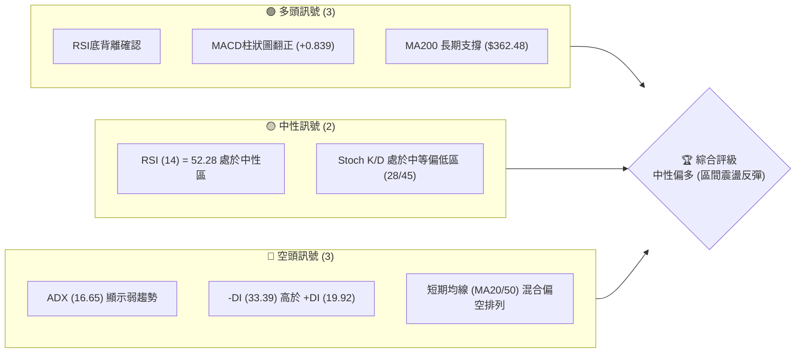
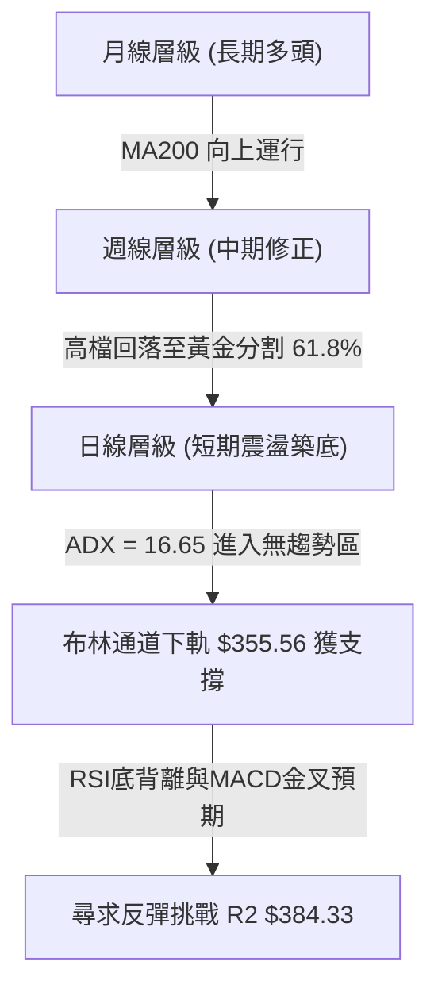
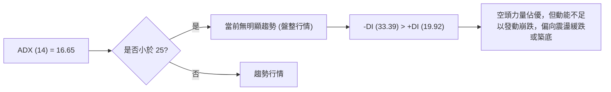
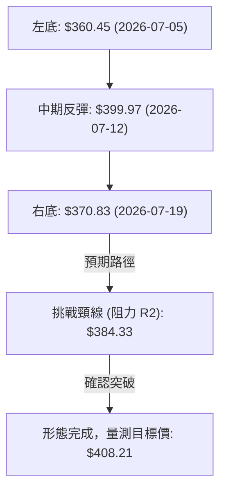
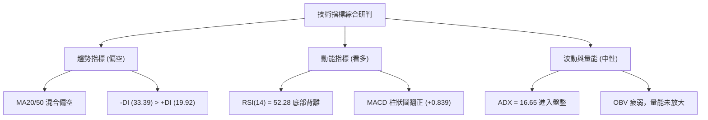
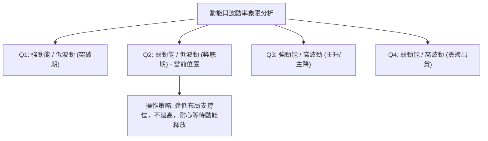
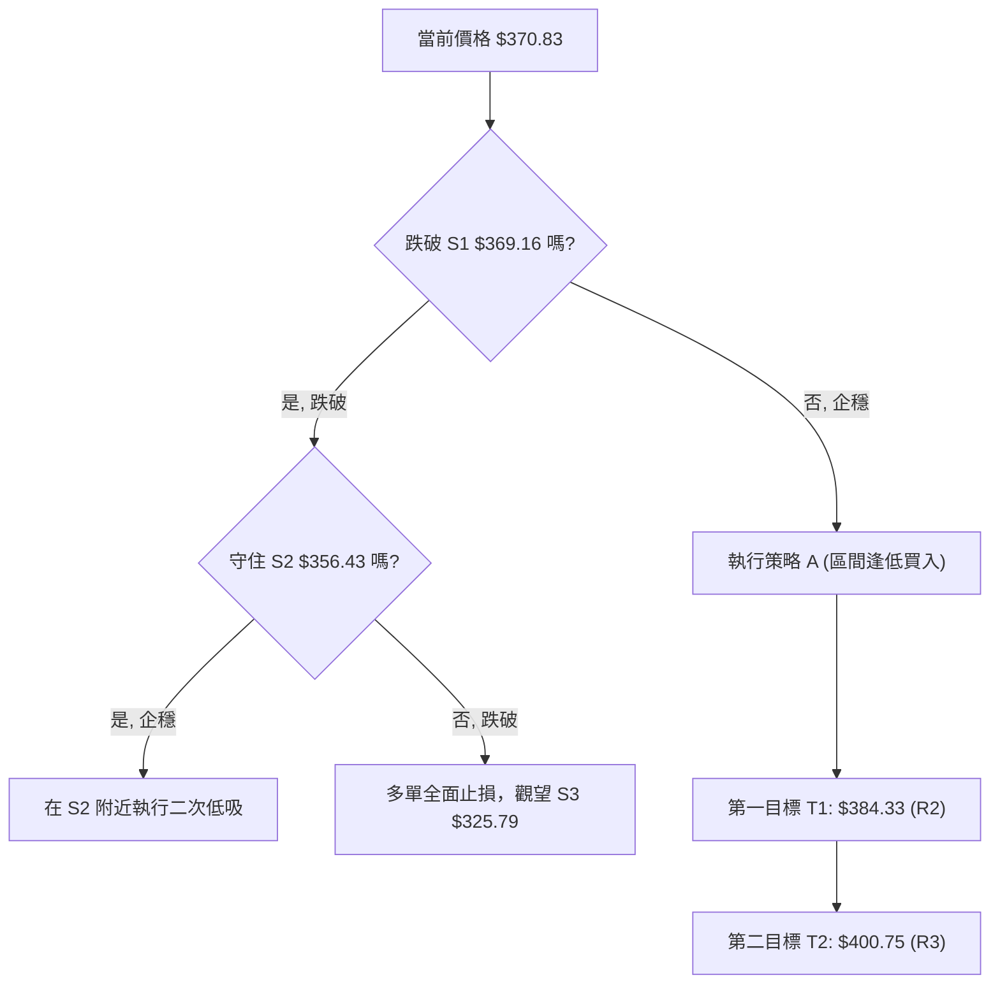
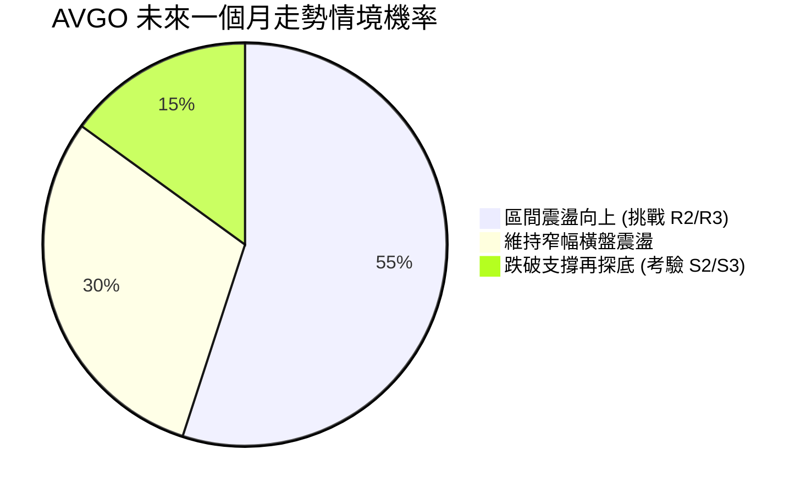
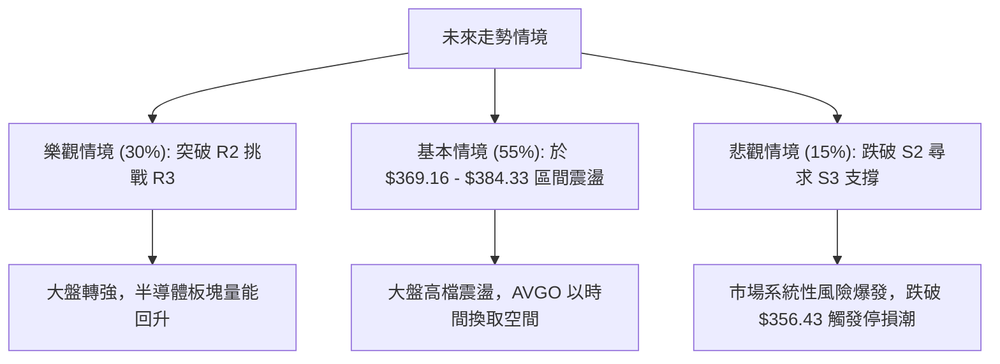

<details>
<summary>📊 靜態圖表 (點擊展開)</summary>

</details>

<html>
<head><meta charset="utf-8" /></head>
<body>
    <div style="height:500px; width:100%;">                        <script>window.PlotlyConfig = {MathJaxConfig: 'local'};</script>
        <script charset="utf-8" src="https://cdn.plot.ly/plotly-3.7.0.min.js" integrity="sha256-jvTGqxNp8AGWEcvNLVuKr+8j5dGe9Yw51LQkmDH+IYA=" crossorigin="anonymous"></script>                <div id="candlestick-chart" class="plotly-graph-div" style="height:100%; width:100%;"></div>            <script>                window.PLOTLYENV=window.PLOTLYENV || {};                                if (document.getElementById("candlestick-chart")) {                    Plotly.newPlot(                        "candlestick-chart",                        [{"close":{"dtype":"f8","bdata":"AAAAoCSBdEAAAABgg7h0QAAAAMC5BHVAAAAAoL8HdUAAAAAA7dl0QAAAAECQ6HRAAAAAYDF5dUAAAABAjnF1QAAAAGAiLXRAAAAA4GQrdkAAAAAgZWN1QAAAAODz1XVAAAAAQNICdkAAAACgIbZ1QAAAAACztHVAAAAAoAFMdUAAAADgdCZ1QAAAAODwZXVAAAAA4IACdkAAAABghIB2QAAAAIBDLndAAAAAgEP9d0AAAACg82V3QAAAACAf+XZAAAAAAHmIdkAAAACgqN91QAAAAMCrT3ZAAAAAwLsZdkAAAAAAubd1QAAAAMBIRnZAAAAAIPrfdUAAAADA2BN2QAAAAIBdIXVAAAAAANNIdUAAAADA2Et1QAAAAICjKXVAAAAAAB4HdkAAAAAAMo51QAAAAKDdJHVAAAAAgKh9d0AAAADgJe53QAAAAICrtXhAAAAA4G0LeUAAAADA2v53QAAAAOAYt3dAAAAAgNKnd0AAAABAga53QAAAACALQXhAAAAA4NXteEAAAACgaUB5QAAAAICyqnlAAAAAYK9BeUAAAABAyV52QAAAAACpHnVAAAAAAF42dUAAAADgP0N0QAAAAGCqgHRAAAAAIGkndUAAAABAJkN1QAAAAGCbwHVAAAAAQPTOdUAAAADgZu11QAAAACC5wXVAAAAAQA7JdUAAAACgRo11QAAAAKCBpXVAAAAAwI1idUAAAAAAImh1QAAAACDUY3VAAAAA4Ce0dEAAAABAQ3t1QAAAAGCt7nVAAAAAoO8UdkAAAAAASCp1QAAAAEAtXHVAAAAA4LTmdUAAAACgEbZ0QAAAAOB9eXRAAAAA4LlEdEAAAABgAe5zQAAAACCGOnRAAAAAABm5dEAAAABgRcB0QAAAAEBCmHRAAAAAYFihdEAAAADgUJ50QAAAACB48nNAAAAAwLUuc0AAAAAg7VVzQAAAAKAru3RAAAAAwNdqdUAAAABgDDN1QAAAAEAIWHVAAAAA4EWfdEAAAAAgoD90QAAAAMActXRAAAAAQJPEdEAAAAAgOsx0QAAAAKDdtnRAAAAAoAqSdEAAAADguUR0QAAAACBysXRAAAAAIE8IdEAAAAAACeZzQAAAAOBl2nNAAAAAwAKLc0AAAACA1cVzQAAAAEDHuHRAAAAAAEaUdEAAAABAsod1QAAAAIApVXVAAAAA4A9FdUAAAACAyut0QAAAAGCkD3RAAAAA4KM7dEAAAACAFwJ0QAAAAMBTrHNAAAAAgKjqc0AAAAAg7VVzQAAAAKABIHRAAAAAwJfcc0AAAABA5uRzQAAAAKDlTnNAAAAAIEfDckAAAABAJE9yQAAAAMBVUHNAAAAAAOqPc0AAAADg2KBzQAAAACDunnNAAAAAgBPXdEAAAAAgN+F1QAAAAECWJXZAAAAA4Gcvd0AAAAAgZrJ3QAAAAEDawndAAAAAYH3BeEAAAAAgct14QAAAAKBcXnlAAAAA4PnveEAAAABgjRh5QAAAAMC2X3pAAAAAQGw0ekAAAADAeGF6QAAAAICgGHpAAAAAwCvzeEAAAAAA80x5QAAAAIBTDHpAAAAAINRJekAAAABAeP15QAAAAID0qnpAAAAAoEiMekAAAACAh755QAAAAOAg1XpAAAAAQAy8ekAAAADgMip6QAAAAEAaAnpAAAAAYIVxe0AAAABASoh6QAAAACC5QHpAAAAAILqmeUAAAAAgmRF6QAAAAICj3nlAAAAAAMXXeUAAAACgfVV6QAAAAAAYU3pAAAAAoH6eekAAAABABuF7QAAAAADks3xAAAAA4PEMfkAAAABgkOd9QAAAAAD4I3pAAAAAgO0ReEAAAACgkr94QAAAACCleHhAAAAAQDE4d0AAAAAgXw94QAAAAOB113dAAAAAgBSVeEAAAADg1YF3QAAAAGB3hHhAAAAAQDOreUAAAACAFIJ4QAAAAGBmwndAAAAAwB7hd0AAAABgj653QAAAAOBR0HZAAAAAQDNHd0AAAAAAAJx3QAAAAKBwFXdAAAAAQDOHdkAAAABgZl53QAAAAOB6LHdAAAAAQApLeEAAAACAwhF5QAAAACCF\u002f3hAAAAAwMwAeEAAAACAwlF4QAAAAOB6pHhAAAAAQDNnd0AAAACgRy13QA=="},"high":{"dtype":"f8","bdata":"gMFa+keTdEDrYEcJEQF1QM7VzL7DmnVAX6Hd2rBndUAiVsJHZWN1QNIV75GcA3VAd8CRgr2JdUCdIBna\u002fZV1QFb6+LJWynVAhv7s8ghWdkALQHe2c8t1QLlFjWlaVnZA76INYXOTdkBO6mmwOdB1QHAHOtmkKXZAZ20AOEvSdUBKC70hIaF1QJDjhrQ3inVAOcgf8NlEdkD0S2alp4t2QKz1fj6bP3dASs8wFjgFeECh8jM18gN4QJ5QWZlXi3dAN0zJGy1Md0BGgMFXTe52QAxl46xirXZAbb06kZaXdkA0jQkFZAh2QMkC9n\u002fmX3ZAa40u1fh9dkCB2BjP6012QBLq+F1G+XVAgkuz1BltdUAjSMagy+N1QIxF\u002fRt+oHVABBmXk\u002fdadkA3lH33vl93QPAfnkGEqnVA0fWJJ\u002fC9d0CMH5+8eB94QIstp79D2nhAPF801hAMeUDCu6RMdpN4QLcVWc7pdHhA6V5SLLbCd0BESSyXAtx3QEbZbOZjdXhAQzkK1FJQeUBdmCtkmEp5QPJ4pnDKxHlASJ8evk1weUCDxCU38L13QAdrkbm4f3ZAAthmuQOZdUD\u002fCO9+2op1QOkAbV2E4nRA+jPTVpNYdUDwWRX+gY91QGSCyD8zzXVAgsgf8An5dUBHabaJQf91QA4Ikh610HVAaEnHVCv2dUDrxqasiMl1QHfONXdhdXZA7BWlt6EbdkChYUaATbx1QG2VZCuqxnVAhL\u002fHoLJmdUBqZ88+16F1QOA4JDieCXZAVD95w7pidkDlqVllctZ1QCx8S4FYxnVAx7hJqFcTdkDf0KzzHYJ1QPSauqQU6XRAYWqK\u002fgz8dEArJOd17gx0QAndZyyUd3RAquV8goDYdEC3YtTm3yt1QN6mDed463RAwy3sJVcPdUDYD\u002fO1Oe10QIB3mbZ\u002fGnVASXPlt2Xlc0C5ETIsTlV0QLabVvtT3HRA+H6\u002f2L\u002fwdUDyf\u002f1Suat1QIO+wMDPnnVAM8U8E06QdUApPfLyfNF0QHd+Y55I6HRAB1P8DT0KdUDi+Vh6KhN1QNkWe5rJLXVACVioVB8UdUB\u002f6UU7rnF0QLkOiqHV6nRA\u002fXijIxpWdEAA6ip8Ne1zQLwE1qjY7XNABeNE9Yerc0BqBpdOSxd0QHMgb4Mu7nRAyhiJ\u002fvxjdUBLYhsPYLN1QE9pVZ+A\u002fXVA8gpzIqeIdUDcHBX5Uil1QNX2d9FAEXVAzSy5aN5\u002fdEBhtALZz2N0QAxeQ8jtQ3RATtjuL1YhdEBZdEXDRwV0QBw0Fw5tX3RAP5EItDI+dEDZsUu3mTx0QKPKnhS1xnNAZlCsuzkwc0Cud6w4nQRzQL\u002fWfFIdXXNAgfAU\u002fae0c0DqygF4FaNzQEnp0n9mvnNAKT7ClfPZdEAU3EBoSRl2QNt\u002fMJghYnZAG5Yjg0d\u002fd0DXWtdwIcR3QI6HiIrQ2ndAUfuFiz3HeEDeAytrxvB4QPriLqVlYXlAWS8kzXFceUCsxZleZS95QItPohCAaHpAKielGhvKekC5R4NAQYV6QG2F\u002fcxPYXpAC4R0K7NSeUA9NC0F\u002fE95QDzw55mAG3pA4clNZAVoekABvbZukHJ6QBd6zHhIC3tACC0WZ9BPe0Cl2PGWDp16QGVNWYMAJXtAYy21lm8Pe0Di0WDElcp6QBQZQfd+H3pADFq2XZOae0D6uipuBAJ7QJgk9ZV9VXpAOYY3GKIUekB+dC4D\u002f3d6QKgz0QpTWXpAIbrmojg1ekCu5CJL9Cl7QCtmx3DbAXtA8IJ8LwTQekC5Esj2DAN8QPtNz0UEFX1ApvNf88KAfkCtK1EufON+QHWn5MDlnHpA5Q1TDZ+deUBlTI88QSN5QHvwOpGbc3lAZM99ozQTeEBPVxnwJk54QCUGYmryBXhADxtL3y65eEBCBxIFvHJ4QMnNyTZFAHlAn\u002fEqI8TAeUAAAACAPep5QAAAAOBRcHhAAAAAANdLeEAAAADAzEx4QAAAAEAKW3dAAAAAIFyDd0AAAACA67l3QAAAAAAAXHdAAAAAAABgd0AAAABgj\u002fJ3QAAAACBcT3dAAAAAoHCxeEAAAADgUXh5QAAAAEAKJ3lAAAAAAAC8eEAAAACgR9V4QAAAAAAA8HhAAAAAANcreEAAAACgmZV3QA=="},"hovertemplate":"\u003cb\u003e%{x|%Y-%m-%d}\u003c\u002fb\u003e\u003cbr\u003e\u958b: $%{open:.2f}\u003cbr\u003e\u9ad8: $%{high:.2f}\u003cbr\u003e\u4f4e: $%{low:.2f}\u003cbr\u003e\u6536: $%{close:.2f}\u003cextra\u003e\u003c\u002fextra\u003e","low":{"dtype":"f8","bdata":"CplYu9AsdEA6VYjNECt0QJUPvGEb1nRAKF\u002fMKOfddEAANnL6IMt0QFGo\u002fuIoTHRAriQN4kKsdEDUX2s1DCh1QNMFXN3nI3RA\u002fE0bXLBZdUDuEaBDHRx1QD4SLK0DmXVA0hGHP624dUAY+bAKGC51QP+lDpVsnnVAE0vl0IY2dUAjj7N2Ptp0QDQV0CsMKHVAdt3TD8vOdUB\u002fTP1ZnhF2QGtYNo8niHZAR8ruk8Mxd0CQd22R9v92QI1FeqcLsXZADFy1Ymd\u002fdkAtWgfVs9B1QOFGSy45wnVAg+OM\u002fejrdUBGa+ExP\u002fZ0QITFzwgkCnZA2YanpYq7dUBl2DKuhdt1QPCYA5rDxHRAwv2bf55zdEDr3BdaOfp0QGgMt2c+2nRAMeH+wq3+dECRxqPvGXR1QE2Hj942n3RACioDZ4+bdUCypcgj2hp3QIEdw2b80XdAbEQGhSWveEB3fpweQ+93QAmDiKHGmndAj4kWulkJd0DcnUL452Z3QPkYB7AO8HdANqNtFfeyeEDpu0\u002fS5JR4QDqxMTpV1XhANcK7J+R\u002feEDIioV8uxJ2QJYxTsAQ+nRAcRc3cBXTdEBD1LhgD\u002fpzQDo++go5HXRApfTw15+rdECJjeu2t\u002f90QOt+o47CFHVAj0M17dqddUBZH2U4lKd1QCksvIfMdnVA+76\u002fpEnAdUDPu\u002fSYb4J1QDpf89eqhHVACy9FZz30dEBXhGvdJgx1QPcYYS1b6nRAE5YWhJeUdEDoaDONasR0QJwMQsUtO3VA8LE\u002fH\u002fTZdUBerL0aFdN0QPP+UAuoRnVAIDQXp5hsdUCH\u002fdfGUKl0QPkI24YpMHRAG6r9ZCk7dEA0phdsUI9zQN0oax3zxnNAAGPPvR1ddECNPOjwA1h0QJtdahis8XNA6UbD5f9xdEBlhtPz3kh0QGC+pnVGOHNAl5GbbHVjckDnKYKmMBlzQKFP1tg5snNAlZ1mqvuWdEAeTBzFeyl1QI1bVtk9yHRAd7YWdJuFdEAXIkk3+Td0QNe9\u002fZxisnNA7rSzyHZgdEDSHtAqhYd0QJEp0QbthXRAg4IpNwRCdECsjRMXvJRzQFo00MwkgXRAHrVMIcwsc0CwkknQy01zQEwAcw8pIXNAm+SVT1kkc0AaFUyqiGlzQLxmjKyCHXRAvrdUjSxjdEB7ryyWwSZ0QAp3ZGLJOHVAqSJ1nKgPdUDldpJMsa90QPQhZDkBBHRA35RuTyruc0AX3a3IXsFzQMajd\u002fZEpnNAiluYMgs2c0DJPY9ehUxzQMeRW+\u002fqpnNAbziD1Hqlc0AnTwsng8NzQD\u002f5Pj7nSnNA3JcNF12mckDUZ55UBxhyQDMtmp3yfXJAIAxCm9Rfc0AbjYz4XtRyQNC1S5yiXHNArapD5akUdEAoM+3s0V91QC93KvIc73VAv4FHU\u002f+DdkBFNpG4Vg53QJZVG\u002f6ae3dATtDyKl8PeEDKlDQ8rnt4QMXjBA\u002fa8nhAgbuG5GO0eEBQua\u002fwJJ94QFFYlAWGQ3lA25XWmTwSekAWkD43bIN5QLdAQNuY33lAkYj1BmygeEDtO7q9csJ4QKp1T891OXlApAHB5wfKeUBWqdA8II55QPKby3f\u002fKnpAowso1OoRekDyn2kEh1p5QIk74m6I1XlA86GBoA2GekC5c\u002fn7O3x5QMn8oLqQQnlAE4fgwe7ueUD9w+aiLzJ6QK\u002fy8Yhx23lA6QG3mH9TeUCQjtKIUax5QBnjsxefnXlAUPHWD\u002f2YeUDWyiANdQV6QFpc50FP\u002fXlATKSnW7HVeUDPVaWGnOx6QHxDvOJWmHtALL1WKHdbfUBFiyBnSn59QCamdYn4JXlA3Fz\u002f57APeEA+2A+btGt4QNKNYqvqG3dA0gDvBFYpd0BAXc1Xbh93QPgJjfB3hndAJ1sRcMY\u002feEBMND1+1313QEi+ibe54HdAngG6w9RLeUAAAABgj354QAAAAGCPindAAAAAIFyPd0AAAABAM0t3QAAAAKBHvXZAAAAAIFyHdkAAAACAPSp3QAAAAOB6AHdAAAAAQOFGdkAAAABA4TJ3QAAAAAApoHZAAAAAgD2Od0AAAABA4T54QAAAAEAzu3hAAAAAYLj2d0AAAACAPQp4QAAAAADXK3hAAAAAYGY+d0AAAADAzFx2QA=="},"name":"\u50f9\u683c","open":{"dtype":"f8","bdata":"uDvj9HuEdEBkIX7cI2V0QM7VzL7DmnVAxd9hrYw5dUCjziSPxOB0QEgo+pht8nRARR2evVq\u002fdEB88xq2K311QMDR0n9xd3VAucjgNd3sdUA4fRYq3MJ1QCGLy7LpB3ZAdNFOIvwsdkBFucwblrp1QFKoBqlA\u002fXVA81H\u002fs8rAdUCRHNIW1ZV1QDQV0CsMKHVADsWqWrrodUBGEB8kZ3h2QLI\u002fTyGWiXZAR8ruk8Mxd0Ch8jM18gN4QEXdbkeXgndAJLUKitQed0AOMPoMWkh2QA6uQMvzznVAUI8Qc6ZhdkBt7YdYdQN2QJeqds98PnZAzIh+HINPdkC8KSkht0B2QGEX8jXu2XVAknOe3PaZdEDmQoe50R51QN+XGB6ZVHVAM+q1tfosdUCRUzVvXb92QGJXsIfIc3VA17XpjaycdUDJzGaIjux3QBes6OBr9ndAkdlxx\u002f3ReECua4mPZIp4QDv4cgZWInhA3s+A7B2ed0DF40yd76h3QOKgamdJAHhAGynK38oDeUB33ALdcch4QBKFGndW\u002f3hA4jdJpy4peUAgaTHoep13QB93SLz4fXZANIlgplvidED\u002fCO9+2op1QLicuiwK4nRA+gOtfre3dEA+xTgGKYx1QK4PoE7yOHVAsvk3T3LWdUDz+Og1WNx1QOpjgtIKt3VAZLEy8vfKdUBRZueNJMd1QPy5mW3D93VAZNa5MwIXdkAR\u002fypObGV1QINgNm8iR3VAi\u002f1pyFlYdUCd3TN74Ap1QJwMQsUtO3VAWMrEoVv5dUDPZ5kgB7t1QI8sayxrvXVA7qOKZ\u002fyPdUCSdaK+ZG11QHMrs0B15HRAqGj6RejhdEDyxV+mDOJzQJ0I2ioF6nNAQHvkrMuIdEDTJAaqsxl1QOdpYF1utXRADoXDvISzdEDghm0KnE50QAq9Oc8Q+HRASXPlt2Xlc0D0spAs+5JzQCZoxZjN7nNALfaZXOWYdEDzkjORHaN1QHjWPERvmHVAWViLzhZpdUDPsmcFO4p0QHaWm3Mb6HNAqeOsG\u002fiEdECBD2jbmrx0QNx9Fhw+snRADrNzSX2wdEAxEu4YsxV0QK0pGvpqmHRAxJl2t9NUdEDeHlqK9FhzQLHAz9aXQ3NASVOgwJ59c0CqkZKvV6hzQB8tp499j3RAGjqq0jNxdEB2M4ZdyGB0QIwpZoszt3VAs7GValJVdUANOE7EAQh1QFcJhPAMB3VABxrS1ixNdEAP6V7aB0l0QODChxkQ9HNAuzPeyit1c0DPLKUoH+9zQLbGptD113NA0k6fzuj3c0Bar6+oSCF0QKgK6llhmHNAbs66VDIpc0CuyecWUMZyQAee+r+rrnJAsCLSRv+Nc0AuGZs8JABzQPd0Hoz+qHNAZrhlXGtjdEBUxEZgG\u002fN1QMKqooTk+3VAYmRzDOqFdkBhXlXONhF3QJOnGmTYlHdA+tmCBTlUeECr0W91A6Z4QPNq\u002fqBDBHlANOgpVvFQeUAjYCU9dux4QHebwOxjZXlAgRaFpI9bekBsDqKB74R6QMrRM54MPXpAkQemxNb6eEBzqg9fzC15QA4JuXzQ7XlAOcak8PHmeUBFXxM+8hh6QOnGV0TmT3pAw97Jn\u002fIte0CTV8qQdFJ6QLJmtaQvMnpAPpAgvhuvekDjxdukLGx6QGRWz3dy8nlAPwvy4CQBekD6uipuBAJ7QPKKINjnS3pABhguN8KSeUDLW73phcJ5QKLpGBpYznlA6bhE0UgNekAx58NXax16QFqfGXlfhnpAN02wtZdHekAyBmgSQQR7QPB0mnIPFnxAOIgURUiAfkC7rtd6+N9+QO238dR\u002fhXlAIWvwQXRveUDNCRiJvR95QCMEyxWbD3lA7A7cyFrOd0CMj2+msUN3QFZhG5LR8XdAqX6WFimueED39xZ\u002ffll4QDkDiz6IQXhAUTXBtOyOeUAAAABgj9p5QAAAAIDrnXdAAAAAgOspeEAAAACgRyl4QAAAAEAzJ3dAAAAAgOtZd0AAAADgo2x3QAAAAIDrPXdAAAAAIK7bdkAAAACAwll3QAAAAMD16HZAAAAA4FGYd0AAAABACiN5QAAAAAAA6HhAAAAAIK6XeEAAAAAghbt4QAAAAKBwwXhAAAAA4KMIeEAAAADAzOB2QA=="},"x":["2025-09-30T00:00:00-04:00","2025-10-01T00:00:00-04:00","2025-10-02T00:00:00-04:00","2025-10-03T00:00:00-04:00","2025-10-06T00:00:00-04:00","2025-10-07T00:00:00-04:00","2025-10-08T00:00:00-04:00","2025-10-09T00:00:00-04:00","2025-10-10T00:00:00-04:00","2025-10-13T00:00:00-04:00","2025-10-14T00:00:00-04:00","2025-10-15T00:00:00-04:00","2025-10-16T00:00:00-04:00","2025-10-17T00:00:00-04:00","2025-10-20T00:00:00-04:00","2025-10-21T00:00:00-04:00","2025-10-22T00:00:00-04:00","2025-10-23T00:00:00-04:00","2025-10-24T00:00:00-04:00","2025-10-27T00:00:00-04:00","2025-10-28T00:00:00-04:00","2025-10-29T00:00:00-04:00","2025-10-30T00:00:00-04:00","2025-10-31T00:00:00-04:00","2025-11-03T00:00:00-05:00","2025-11-04T00:00:00-05:00","2025-11-05T00:00:00-05:00","2025-11-06T00:00:00-05:00","2025-11-07T00:00:00-05:00","2025-11-10T00:00:00-05:00","2025-11-11T00:00:00-05:00","2025-11-12T00:00:00-05:00","2025-11-13T00:00:00-05:00","2025-11-14T00:00:00-05:00","2025-11-17T00:00:00-05:00","2025-11-18T00:00:00-05:00","2025-11-19T00:00:00-05:00","2025-11-20T00:00:00-05:00","2025-11-21T00:00:00-05:00","2025-11-24T00:00:00-05:00","2025-11-25T00:00:00-05:00","2025-11-26T00:00:00-05:00","2025-11-28T00:00:00-05:00","2025-12-01T00:00:00-05:00","2025-12-02T00:00:00-05:00","2025-12-03T00:00:00-05:00","2025-12-04T00:00:00-05:00","2025-12-05T00:00:00-05:00","2025-12-08T00:00:00-05:00","2025-12-09T00:00:00-05:00","2025-12-10T00:00:00-05:00","2025-12-11T00:00:00-05:00","2025-12-12T00:00:00-05:00","2025-12-15T00:00:00-05:00","2025-12-16T00:00:00-05:00","2025-12-17T00:00:00-05:00","2025-12-18T00:00:00-05:00","2025-12-19T00:00:00-05:00","2025-12-22T00:00:00-05:00","2025-12-23T00:00:00-05:00","2025-12-24T00:00:00-05:00","2025-12-26T00:00:00-05:00","2025-12-29T00:00:00-05:00","2025-12-30T00:00:00-05:00","2025-12-31T00:00:00-05:00","2026-01-02T00:00:00-05:00","2026-01-05T00:00:00-05:00","2026-01-06T00:00:00-05:00","2026-01-07T00:00:00-05:00","2026-01-08T00:00:00-05:00","2026-01-09T00:00:00-05:00","2026-01-12T00:00:00-05:00","2026-01-13T00:00:00-05:00","2026-01-14T00:00:00-05:00","2026-01-15T00:00:00-05:00","2026-01-16T00:00:00-05:00","2026-01-20T00:00:00-05:00","2026-01-21T00:00:00-05:00","2026-01-22T00:00:00-05:00","2026-01-23T00:00:00-05:00","2026-01-26T00:00:00-05:00","2026-01-27T00:00:00-05:00","2026-01-28T00:00:00-05:00","2026-01-29T00:00:00-05:00","2026-01-30T00:00:00-05:00","2026-02-02T00:00:00-05:00","2026-02-03T00:00:00-05:00","2026-02-04T00:00:00-05:00","2026-02-05T00:00:00-05:00","2026-02-06T00:00:00-05:00","2026-02-09T00:00:00-05:00","2026-02-10T00:00:00-05:00","2026-02-11T00:00:00-05:00","2026-02-12T00:00:00-05:00","2026-02-13T00:00:00-05:00","2026-02-17T00:00:00-05:00","2026-02-18T00:00:00-05:00","2026-02-19T00:00:00-05:00","2026-02-20T00:00:00-05:00","2026-02-23T00:00:00-05:00","2026-02-24T00:00:00-05:00","2026-02-25T00:00:00-05:00","2026-02-26T00:00:00-05:00","2026-02-27T00:00:00-05:00","2026-03-02T00:00:00-05:00","2026-03-03T00:00:00-05:00","2026-03-04T00:00:00-05:00","2026-03-05T00:00:00-05:00","2026-03-06T00:00:00-05:00","2026-03-09T00:00:00-04:00","2026-03-10T00:00:00-04:00","2026-03-11T00:00:00-04:00","2026-03-12T00:00:00-04:00","2026-03-13T00:00:00-04:00","2026-03-16T00:00:00-04:00","2026-03-17T00:00:00-04:00","2026-03-18T00:00:00-04:00","2026-03-19T00:00:00-04:00","2026-03-20T00:00:00-04:00","2026-03-23T00:00:00-04:00","2026-03-24T00:00:00-04:00","2026-03-25T00:00:00-04:00","2026-03-26T00:00:00-04:00","2026-03-27T00:00:00-04:00","2026-03-30T00:00:00-04:00","2026-03-31T00:00:00-04:00","2026-04-01T00:00:00-04:00","2026-04-02T00:00:00-04:00","2026-04-06T00:00:00-04:00","2026-04-07T00:00:00-04:00","2026-04-08T00:00:00-04:00","2026-04-09T00:00:00-04:00","2026-04-10T00:00:00-04:00","2026-04-13T00:00:00-04:00","2026-04-14T00:00:00-04:00","2026-04-15T00:00:00-04:00","2026-04-16T00:00:00-04:00","2026-04-17T00:00:00-04:00","2026-04-20T00:00:00-04:00","2026-04-21T00:00:00-04:00","2026-04-22T00:00:00-04:00","2026-04-23T00:00:00-04:00","2026-04-24T00:00:00-04:00","2026-04-27T00:00:00-04:00","2026-04-28T00:00:00-04:00","2026-04-29T00:00:00-04:00","2026-04-30T00:00:00-04:00","2026-05-01T00:00:00-04:00","2026-05-04T00:00:00-04:00","2026-05-05T00:00:00-04:00","2026-05-06T00:00:00-04:00","2026-05-07T00:00:00-04:00","2026-05-08T00:00:00-04:00","2026-05-11T00:00:00-04:00","2026-05-12T00:00:00-04:00","2026-05-13T00:00:00-04:00","2026-05-14T00:00:00-04:00","2026-05-15T00:00:00-04:00","2026-05-18T00:00:00-04:00","2026-05-19T00:00:00-04:00","2026-05-20T00:00:00-04:00","2026-05-21T00:00:00-04:00","2026-05-22T00:00:00-04:00","2026-05-26T00:00:00-04:00","2026-05-27T00:00:00-04:00","2026-05-28T00:00:00-04:00","2026-05-29T00:00:00-04:00","2026-06-01T00:00:00-04:00","2026-06-02T00:00:00-04:00","2026-06-03T00:00:00-04:00","2026-06-04T00:00:00-04:00","2026-06-05T00:00:00-04:00","2026-06-08T00:00:00-04:00","2026-06-09T00:00:00-04:00","2026-06-10T00:00:00-04:00","2026-06-11T00:00:00-04:00","2026-06-12T00:00:00-04:00","2026-06-15T00:00:00-04:00","2026-06-16T00:00:00-04:00","2026-06-17T00:00:00-04:00","2026-06-18T00:00:00-04:00","2026-06-22T00:00:00-04:00","2026-06-23T00:00:00-04:00","2026-06-24T00:00:00-04:00","2026-06-25T00:00:00-04:00","2026-06-26T00:00:00-04:00","2026-06-29T00:00:00-04:00","2026-06-30T00:00:00-04:00","2026-07-01T00:00:00-04:00","2026-07-02T00:00:00-04:00","2026-07-06T00:00:00-04:00","2026-07-07T00:00:00-04:00","2026-07-08T00:00:00-04:00","2026-07-09T00:00:00-04:00","2026-07-10T00:00:00-04:00","2026-07-13T00:00:00-04:00","2026-07-14T00:00:00-04:00","2026-07-15T00:00:00-04:00","2026-07-16T00:00:00-04:00","2026-07-17T00:00:00-04:00"],"type":"candlestick"},{"hovertemplate":"MA30: $%{y:.2f}\u003cextra\u003e\u003c\u002fextra\u003e","line":{"color":"#2196F3","dash":"dash","width":2},"mode":"lines","name":"MA30","x":["2025-09-30T00:00:00-04:00","2025-10-01T00:00:00-04:00","2025-10-02T00:00:00-04:00","2025-10-03T00:00:00-04:00","2025-10-06T00:00:00-04:00","2025-10-07T00:00:00-04:00","2025-10-08T00:00:00-04:00","2025-10-09T00:00:00-04:00","2025-10-10T00:00:00-04:00","2025-10-13T00:00:00-04:00","2025-10-14T00:00:00-04:00","2025-10-15T00:00:00-04:00","2025-10-16T00:00:00-04:00","2025-10-17T00:00:00-04:00","2025-10-20T00:00:00-04:00","2025-10-21T00:00:00-04:00","2025-10-22T00:00:00-04:00","2025-10-23T00:00:00-04:00","2025-10-24T00:00:00-04:00","2025-10-27T00:00:00-04:00","2025-10-28T00:00:00-04:00","2025-10-29T00:00:00-04:00","2025-10-30T00:00:00-04:00","2025-10-31T00:00:00-04:00","2025-11-03T00:00:00-05:00","2025-11-04T00:00:00-05:00","2025-11-05T00:00:00-05:00","2025-11-06T00:00:00-05:00","2025-11-07T00:00:00-05:00","2025-11-10T00:00:00-05:00","2025-11-11T00:00:00-05:00","2025-11-12T00:00:00-05:00","2025-11-13T00:00:00-05:00","2025-11-14T00:00:00-05:00","2025-11-17T00:00:00-05:00","2025-11-18T00:00:00-05:00","2025-11-19T00:00:00-05:00","2025-11-20T00:00:00-05:00","2025-11-21T00:00:00-05:00","2025-11-24T00:00:00-05:00","2025-11-25T00:00:00-05:00","2025-11-26T00:00:00-05:00","2025-11-28T00:00:00-05:00","2025-12-01T00:00:00-05:00","2025-12-02T00:00:00-05:00","2025-12-03T00:00:00-05:00","2025-12-04T00:00:00-05:00","2025-12-05T00:00:00-05:00","2025-12-08T00:00:00-05:00","2025-12-09T00:00:00-05:00","2025-12-10T00:00:00-05:00","2025-12-11T00:00:00-05:00","2025-12-12T00:00:00-05:00","2025-12-15T00:00:00-05:00","2025-12-16T00:00:00-05:00","2025-12-17T00:00:00-05:00","2025-12-18T00:00:00-05:00","2025-12-19T00:00:00-05:00","2025-12-22T00:00:00-05:00","2025-12-23T00:00:00-05:00","2025-12-24T00:00:00-05:00","2025-12-26T00:00:00-05:00","2025-12-29T00:00:00-05:00","2025-12-30T00:00:00-05:00","2025-12-31T00:00:00-05:00","2026-01-02T00:00:00-05:00","2026-01-05T00:00:00-05:00","2026-01-06T00:00:00-05:00","2026-01-07T00:00:00-05:00","2026-01-08T00:00:00-05:00","2026-01-09T00:00:00-05:00","2026-01-12T00:00:00-05:00","2026-01-13T00:00:00-05:00","2026-01-14T00:00:00-05:00","2026-01-15T00:00:00-05:00","2026-01-16T00:00:00-05:00","2026-01-20T00:00:00-05:00","2026-01-21T00:00:00-05:00","2026-01-22T00:00:00-05:00","2026-01-23T00:00:00-05:00","2026-01-26T00:00:00-05:00","2026-01-27T00:00:00-05:00","2026-01-28T00:00:00-05:00","2026-01-29T00:00:00-05:00","2026-01-30T00:00:00-05:00","2026-02-02T00:00:00-05:00","2026-02-03T00:00:00-05:00","2026-02-04T00:00:00-05:00","2026-02-05T00:00:00-05:00","2026-02-06T00:00:00-05:00","2026-02-09T00:00:00-05:00","2026-02-10T00:00:00-05:00","2026-02-11T00:00:00-05:00","2026-02-12T00:00:00-05:00","2026-02-13T00:00:00-05:00","2026-02-17T00:00:00-05:00","2026-02-18T00:00:00-05:00","2026-02-19T00:00:00-05:00","2026-02-20T00:00:00-05:00","2026-02-23T00:00:00-05:00","2026-02-24T00:00:00-05:00","2026-02-25T00:00:00-05:00","2026-02-26T00:00:00-05:00","2026-02-27T00:00:00-05:00","2026-03-02T00:00:00-05:00","2026-03-03T00:00:00-05:00","2026-03-04T00:00:00-05:00","2026-03-05T00:00:00-05:00","2026-03-06T00:00:00-05:00","2026-03-09T00:00:00-04:00","2026-03-10T00:00:00-04:00","2026-03-11T00:00:00-04:00","2026-03-12T00:00:00-04:00","2026-03-13T00:00:00-04:00","2026-03-16T00:00:00-04:00","2026-03-17T00:00:00-04:00","2026-03-18T00:00:00-04:00","2026-03-19T00:00:00-04:00","2026-03-20T00:00:00-04:00","2026-03-23T00:00:00-04:00","2026-03-24T00:00:00-04:00","2026-03-25T00:00:00-04:00","2026-03-26T00:00:00-04:00","2026-03-27T00:00:00-04:00","2026-03-30T00:00:00-04:00","2026-03-31T00:00:00-04:00","2026-04-01T00:00:00-04:00","2026-04-02T00:00:00-04:00","2026-04-06T00:00:00-04:00","2026-04-07T00:00:00-04:00","2026-04-08T00:00:00-04:00","2026-04-09T00:00:00-04:00","2026-04-10T00:00:00-04:00","2026-04-13T00:00:00-04:00","2026-04-14T00:00:00-04:00","2026-04-15T00:00:00-04:00","2026-04-16T00:00:00-04:00","2026-04-17T00:00:00-04:00","2026-04-20T00:00:00-04:00","2026-04-21T00:00:00-04:00","2026-04-22T00:00:00-04:00","2026-04-23T00:00:00-04:00","2026-04-24T00:00:00-04:00","2026-04-27T00:00:00-04:00","2026-04-28T00:00:00-04:00","2026-04-29T00:00:00-04:00","2026-04-30T00:00:00-04:00","2026-05-01T00:00:00-04:00","2026-05-04T00:00:00-04:00","2026-05-05T00:00:00-04:00","2026-05-06T00:00:00-04:00","2026-05-07T00:00:00-04:00","2026-05-08T00:00:00-04:00","2026-05-11T00:00:00-04:00","2026-05-12T00:00:00-04:00","2026-05-13T00:00:00-04:00","2026-05-14T00:00:00-04:00","2026-05-15T00:00:00-04:00","2026-05-18T00:00:00-04:00","2026-05-19T00:00:00-04:00","2026-05-20T00:00:00-04:00","2026-05-21T00:00:00-04:00","2026-05-22T00:00:00-04:00","2026-05-26T00:00:00-04:00","2026-05-27T00:00:00-04:00","2026-05-28T00:00:00-04:00","2026-05-29T00:00:00-04:00","2026-06-01T00:00:00-04:00","2026-06-02T00:00:00-04:00","2026-06-03T00:00:00-04:00","2026-06-04T00:00:00-04:00","2026-06-05T00:00:00-04:00","2026-06-08T00:00:00-04:00","2026-06-09T00:00:00-04:00","2026-06-10T00:00:00-04:00","2026-06-11T00:00:00-04:00","2026-06-12T00:00:00-04:00","2026-06-15T00:00:00-04:00","2026-06-16T00:00:00-04:00","2026-06-17T00:00:00-04:00","2026-06-18T00:00:00-04:00","2026-06-22T00:00:00-04:00","2026-06-23T00:00:00-04:00","2026-06-24T00:00:00-04:00","2026-06-25T00:00:00-04:00","2026-06-26T00:00:00-04:00","2026-06-29T00:00:00-04:00","2026-06-30T00:00:00-04:00","2026-07-01T00:00:00-04:00","2026-07-02T00:00:00-04:00","2026-07-06T00:00:00-04:00","2026-07-07T00:00:00-04:00","2026-07-08T00:00:00-04:00","2026-07-09T00:00:00-04:00","2026-07-10T00:00:00-04:00","2026-07-13T00:00:00-04:00","2026-07-14T00:00:00-04:00","2026-07-15T00:00:00-04:00","2026-07-16T00:00:00-04:00","2026-07-17T00:00:00-04:00"],"y":{"dtype":"f8","bdata":"AAAAAAAA+H8AAAAAAAD4fwAAAAAAAPh\u002fAAAAAAAA+H8AAAAAAAD4fwAAAAAAAPh\u002fAAAAAAAA+H8AAAAAAAD4fwAAAAAAAPh\u002fAAAAAAAA+H8AAAAAAAD4fwAAAAAAAPh\u002fAAAAAAAA+H8AAAAAAAD4fwAAAAAAAPh\u002fAAAAAAAA+H8AAAAAAAD4fwAAAAAAAPh\u002fAAAAAAAA+H8AAAAAAAD4fwAAAAAAAPh\u002fAAAAAAAA+H8AAAAAAAD4fwAAAAAAAPh\u002fAAAAAAAA+H8AAAAAAAD4fwAAAAAAAPh\u002fAAAAAAAA+H8AAAAAAAD4fyIiItLhyXVAq6qqmpPVdUBERESEJ+F1QImIiOgb4nVAiYiIOEfkdUCJiIhYE+h1QHd3d6c+6nVA3t3dvfnudUAiIiIi7u91QLy7uxsw+HVAERERoXYDdkCJiIi4Jxl2QHd3d9etMXZAVVVV5ZBLdkCJiIiIDl92QAAAABA0cHZAAAAAoFSEdkAzMzOj7pl2QBEREWFNsnZAzczMnDbLdkAAAAAwreJ2QGZmZhbk93ZAvLu7e7QCd0De3d3N7vl2QBEREREe6nZAZmZm5tjedkDNzMysGdF2QCIiIrKqwXZAAAAA4Ja5dkDe3d0dtLV2QHd3d2c\u002fsXZAREREJK6wdkBEREQUZq92QHd3d3e+tHZAVVVVtQS5dkCamZkJM7t2QKuqqgpUv3ZARERExNe5dkB3d3f3krh2QAAAAECsunZAIiIisuOidkBmZmZG\u002fo12QDMzMyNLdnZAmpmZqQJddkAzMzOj20R2QHd3d7fCMHZAMzMzQ8ohdkBVVVU1cQh2QERERMQw6HVAERERkWvAdUARERGxAZN1QAAAANCZZHVAIiIiIuo9dUAAAADwGDB1QLy7uwueK3VAREREZKYmdUDe3d19ryl1QFVVVRXyJHVA3t3dTR8UdUB3d3d3rgN1QKuqqor3+nRAIiIiQqH3dECrqqoKa\u002fF0QFVVVSXl7XRAEREREfjjdECrqqrq2Nh0QN7d3Y3V0HRAiYiIeJHLdEAzMzMTX8Z0QAAAACCbwHRAREREBHi\u002fdECrqqoaHrV0QAAAABCLqnRA7+7uPg6ZdECJiIhYP450QN7d3V1jgXRARERE1ENtdEAzMzPTQWV0QO\u002fu7t5dZ3RAzczMrARqdEBERES0rHd0QM3MzIwYgXRAmpmZ6cKFdECJiIhINod0QM3MzHyognRAq6qqmkR\u002fdEDe3d19D3p0QCIiIvK4d3RAVVVVxfx9dEBVVVXF\u002fH10QERERLTQeHRA3t3dTYprdEBmZmbmZmB0QBEREeEHT3RA3t3dDSo\u002fdEBERERknS50QEREROS4InRAvLu7+24YdEBmZmZGdA50QN7d3X0fBXRAZmZmlmwHdEDv7u5+LBV0QJqZmRmUIXRAMzMzU3s8dEBERETU5Fx0QKuqqgo+fnRAiYiImLmqdEAAAADALdZ0QM3MzNzU\u002fXRAZmZmhgUjdUCrqqo6c0F1QAAAAPB3bHVA3t3dnZSWdUDe3d19K8V1QM3MzFyr+HVAAAAAoOsgdkAzMzMTFU52QHd3d3d7hHZAmpmZydq6dkARERGxo\u002fN2QGZmZpZ4K3dAREREBIdkd0CrqqrKcpZ3QHd3d\u002fen1ndAmpmZia4aeEDv7u6Ot114QFVVVbXXlnhA7+7unhjaeEDNzMzMAhV5QCIiIqKaTXlAiYiIuKh2eUCJiIi4Z5p5QN7d3W0sunlAMzMzM9rQeUC8u7v7Wud5QImIiOg6\u002fXlAmpmZWSENekDNzMx82SZ6QO\u002fu7u5MQ3pAzczMzO5uekDv7u5u95d6QLy7u5v5lXpA7+7uLsKDekDNzMwc1HV6QGZmZmb2Z3pAERERUTJZekAiIiJSnE56QCIiIiLIO3pAZmZmNjktekAiIiIiCRh6QBEREaGvBXpAq6qq6i7+eUDNzMyMovN5QCIiIiJp2XlAIiIi4gvBeUBERETE26t5QKuqqlqZkHlAVVVVFQ5teUDNzMysHFR5QJqZmbkROXlAiYiIGGseeUDv7u7eYAd5QERERIRf8HhAd3d3FybjeEBmZmaWW9h4QEREROQJzXhAmpmZKbe2eECamZkJV5h4QGZmZmaxdXhAiYiI2Pc8eEBVVVUFjwN4QA=="},"type":"scatter"},{"hovertemplate":"MA60: $%{y:.2f}\u003cextra\u003e\u003c\u002fextra\u003e","line":{"color":"#9C27B0","dash":"dash","width":2},"mode":"lines","name":"MA60","x":["2025-09-30T00:00:00-04:00","2025-10-01T00:00:00-04:00","2025-10-02T00:00:00-04:00","2025-10-03T00:00:00-04:00","2025-10-06T00:00:00-04:00","2025-10-07T00:00:00-04:00","2025-10-08T00:00:00-04:00","2025-10-09T00:00:00-04:00","2025-10-10T00:00:00-04:00","2025-10-13T00:00:00-04:00","2025-10-14T00:00:00-04:00","2025-10-15T00:00:00-04:00","2025-10-16T00:00:00-04:00","2025-10-17T00:00:00-04:00","2025-10-20T00:00:00-04:00","2025-10-21T00:00:00-04:00","2025-10-22T00:00:00-04:00","2025-10-23T00:00:00-04:00","2025-10-24T00:00:00-04:00","2025-10-27T00:00:00-04:00","2025-10-28T00:00:00-04:00","2025-10-29T00:00:00-04:00","2025-10-30T00:00:00-04:00","2025-10-31T00:00:00-04:00","2025-11-03T00:00:00-05:00","2025-11-04T00:00:00-05:00","2025-11-05T00:00:00-05:00","2025-11-06T00:00:00-05:00","2025-11-07T00:00:00-05:00","2025-11-10T00:00:00-05:00","2025-11-11T00:00:00-05:00","2025-11-12T00:00:00-05:00","2025-11-13T00:00:00-05:00","2025-11-14T00:00:00-05:00","2025-11-17T00:00:00-05:00","2025-11-18T00:00:00-05:00","2025-11-19T00:00:00-05:00","2025-11-20T00:00:00-05:00","2025-11-21T00:00:00-05:00","2025-11-24T00:00:00-05:00","2025-11-25T00:00:00-05:00","2025-11-26T00:00:00-05:00","2025-11-28T00:00:00-05:00","2025-12-01T00:00:00-05:00","2025-12-02T00:00:00-05:00","2025-12-03T00:00:00-05:00","2025-12-04T00:00:00-05:00","2025-12-05T00:00:00-05:00","2025-12-08T00:00:00-05:00","2025-12-09T00:00:00-05:00","2025-12-10T00:00:00-05:00","2025-12-11T00:00:00-05:00","2025-12-12T00:00:00-05:00","2025-12-15T00:00:00-05:00","2025-12-16T00:00:00-05:00","2025-12-17T00:00:00-05:00","2025-12-18T00:00:00-05:00","2025-12-19T00:00:00-05:00","2025-12-22T00:00:00-05:00","2025-12-23T00:00:00-05:00","2025-12-24T00:00:00-05:00","2025-12-26T00:00:00-05:00","2025-12-29T00:00:00-05:00","2025-12-30T00:00:00-05:00","2025-12-31T00:00:00-05:00","2026-01-02T00:00:00-05:00","2026-01-05T00:00:00-05:00","2026-01-06T00:00:00-05:00","2026-01-07T00:00:00-05:00","2026-01-08T00:00:00-05:00","2026-01-09T00:00:00-05:00","2026-01-12T00:00:00-05:00","2026-01-13T00:00:00-05:00","2026-01-14T00:00:00-05:00","2026-01-15T00:00:00-05:00","2026-01-16T00:00:00-05:00","2026-01-20T00:00:00-05:00","2026-01-21T00:00:00-05:00","2026-01-22T00:00:00-05:00","2026-01-23T00:00:00-05:00","2026-01-26T00:00:00-05:00","2026-01-27T00:00:00-05:00","2026-01-28T00:00:00-05:00","2026-01-29T00:00:00-05:00","2026-01-30T00:00:00-05:00","2026-02-02T00:00:00-05:00","2026-02-03T00:00:00-05:00","2026-02-04T00:00:00-05:00","2026-02-05T00:00:00-05:00","2026-02-06T00:00:00-05:00","2026-02-09T00:00:00-05:00","2026-02-10T00:00:00-05:00","2026-02-11T00:00:00-05:00","2026-02-12T00:00:00-05:00","2026-02-13T00:00:00-05:00","2026-02-17T00:00:00-05:00","2026-02-18T00:00:00-05:00","2026-02-19T00:00:00-05:00","2026-02-20T00:00:00-05:00","2026-02-23T00:00:00-05:00","2026-02-24T00:00:00-05:00","2026-02-25T00:00:00-05:00","2026-02-26T00:00:00-05:00","2026-02-27T00:00:00-05:00","2026-03-02T00:00:00-05:00","2026-03-03T00:00:00-05:00","2026-03-04T00:00:00-05:00","2026-03-05T00:00:00-05:00","2026-03-06T00:00:00-05:00","2026-03-09T00:00:00-04:00","2026-03-10T00:00:00-04:00","2026-03-11T00:00:00-04:00","2026-03-12T00:00:00-04:00","2026-03-13T00:00:00-04:00","2026-03-16T00:00:00-04:00","2026-03-17T00:00:00-04:00","2026-03-18T00:00:00-04:00","2026-03-19T00:00:00-04:00","2026-03-20T00:00:00-04:00","2026-03-23T00:00:00-04:00","2026-03-24T00:00:00-04:00","2026-03-25T00:00:00-04:00","2026-03-26T00:00:00-04:00","2026-03-27T00:00:00-04:00","2026-03-30T00:00:00-04:00","2026-03-31T00:00:00-04:00","2026-04-01T00:00:00-04:00","2026-04-02T00:00:00-04:00","2026-04-06T00:00:00-04:00","2026-04-07T00:00:00-04:00","2026-04-08T00:00:00-04:00","2026-04-09T00:00:00-04:00","2026-04-10T00:00:00-04:00","2026-04-13T00:00:00-04:00","2026-04-14T00:00:00-04:00","2026-04-15T00:00:00-04:00","2026-04-16T00:00:00-04:00","2026-04-17T00:00:00-04:00","2026-04-20T00:00:00-04:00","2026-04-21T00:00:00-04:00","2026-04-22T00:00:00-04:00","2026-04-23T00:00:00-04:00","2026-04-24T00:00:00-04:00","2026-04-27T00:00:00-04:00","2026-04-28T00:00:00-04:00","2026-04-29T00:00:00-04:00","2026-04-30T00:00:00-04:00","2026-05-01T00:00:00-04:00","2026-05-04T00:00:00-04:00","2026-05-05T00:00:00-04:00","2026-05-06T00:00:00-04:00","2026-05-07T00:00:00-04:00","2026-05-08T00:00:00-04:00","2026-05-11T00:00:00-04:00","2026-05-12T00:00:00-04:00","2026-05-13T00:00:00-04:00","2026-05-14T00:00:00-04:00","2026-05-15T00:00:00-04:00","2026-05-18T00:00:00-04:00","2026-05-19T00:00:00-04:00","2026-05-20T00:00:00-04:00","2026-05-21T00:00:00-04:00","2026-05-22T00:00:00-04:00","2026-05-26T00:00:00-04:00","2026-05-27T00:00:00-04:00","2026-05-28T00:00:00-04:00","2026-05-29T00:00:00-04:00","2026-06-01T00:00:00-04:00","2026-06-02T00:00:00-04:00","2026-06-03T00:00:00-04:00","2026-06-04T00:00:00-04:00","2026-06-05T00:00:00-04:00","2026-06-08T00:00:00-04:00","2026-06-09T00:00:00-04:00","2026-06-10T00:00:00-04:00","2026-06-11T00:00:00-04:00","2026-06-12T00:00:00-04:00","2026-06-15T00:00:00-04:00","2026-06-16T00:00:00-04:00","2026-06-17T00:00:00-04:00","2026-06-18T00:00:00-04:00","2026-06-22T00:00:00-04:00","2026-06-23T00:00:00-04:00","2026-06-24T00:00:00-04:00","2026-06-25T00:00:00-04:00","2026-06-26T00:00:00-04:00","2026-06-29T00:00:00-04:00","2026-06-30T00:00:00-04:00","2026-07-01T00:00:00-04:00","2026-07-02T00:00:00-04:00","2026-07-06T00:00:00-04:00","2026-07-07T00:00:00-04:00","2026-07-08T00:00:00-04:00","2026-07-09T00:00:00-04:00","2026-07-10T00:00:00-04:00","2026-07-13T00:00:00-04:00","2026-07-14T00:00:00-04:00","2026-07-15T00:00:00-04:00","2026-07-16T00:00:00-04:00","2026-07-17T00:00:00-04:00"],"y":{"dtype":"f8","bdata":"AAAAAAAA+H8AAAAAAAD4fwAAAAAAAPh\u002fAAAAAAAA+H8AAAAAAAD4fwAAAAAAAPh\u002fAAAAAAAA+H8AAAAAAAD4fwAAAAAAAPh\u002fAAAAAAAA+H8AAAAAAAD4fwAAAAAAAPh\u002fAAAAAAAA+H8AAAAAAAD4fwAAAAAAAPh\u002fAAAAAAAA+H8AAAAAAAD4fwAAAAAAAPh\u002fAAAAAAAA+H8AAAAAAAD4fwAAAAAAAPh\u002fAAAAAAAA+H8AAAAAAAD4fwAAAAAAAPh\u002fAAAAAAAA+H8AAAAAAAD4fwAAAAAAAPh\u002fAAAAAAAA+H8AAAAAAAD4fwAAAAAAAPh\u002fAAAAAAAA+H8AAAAAAAD4fwAAAAAAAPh\u002fAAAAAAAA+H8AAAAAAAD4fwAAAAAAAPh\u002fAAAAAAAA+H8AAAAAAAD4fwAAAAAAAPh\u002fAAAAAAAA+H8AAAAAAAD4fwAAAAAAAPh\u002fAAAAAAAA+H8AAAAAAAD4fwAAAAAAAPh\u002fAAAAAAAA+H8AAAAAAAD4fwAAAAAAAPh\u002fAAAAAAAA+H8AAAAAAAD4fwAAAAAAAPh\u002fAAAAAAAA+H8AAAAAAAD4fwAAAAAAAPh\u002fAAAAAAAA+H8AAAAAAAD4fwAAAAAAAPh\u002fAAAAAAAA+H8AAAAAAAD4f83MzJyQPXZAd3d33yBDdkBERETMRkh2QAAAADBtS3ZA7+7u9qVOdkARERExo1F2QBEREVnJVHZAERERwWhUdkDNzMyMQFR2QN7d3S1uWXZAmpmZKS1TdkB3d3f\u002fklN2QFVVVX38U3ZAd3d3x0lUdkDe3d0V9VF2QLy7u2N7UHZAmpmZcQ9TdkBERETsL1F2QKuqqhI\u002fTXZA7+7uFtFFdkCJiIhw1zp2QDMzM\u002fM+LnZA7+7uTk8gdkDv7u7eAxV2QGZmZg7eCnZAVVVVpb8CdkBVVVWVZP11QLy7u2NO83VA7+7uFtvmdUCrqqpKsdx1QBEREXkb1nVAMzMzsyfUdUB3d3ePaNB1QGZmZs5R0XVAMzMzY37OdUAiIiL6Bcp1QERERMwUyHVAZmZmnrTCdUBVVVUFeb91QAAAALCjvXVAMzMz2y2xdUCJiIgwjqF1QJqZmRlrkHVAREREdAh7dUDe3d19jWl1QKuqqgoTWXVAvLu7C4dHdUBERESE2TZ1QJqZmVHHJ3VA7+7uHjgVdUCrqqoyVwV1QGZmZi7Z8nRA3t3dhdbhdEBEREScp9t0QEREREQj13RAd3d3f\u002fXSdEDe3d1939F0QLy7u4NVznRAmpmZCQ7JdEBmZmae1cB0QHd3dx\u002fkuXRAAAAAyJWxdECJiIj46Kh0QDMzM4N2nnRAd3d3D5GRdEB3d3cnu4N0QBERETnHeXRAIiIiOgBydEDNzMysaWp0QO\u002fu7k7dYnRAVVVVTXJjdEDNzMxMJWV0QM3MzJQPZnRAERERycRqdEBmZmYWknV0QERERLTQf3RAZmZmtv6LdECamZnJt510QN7d3V2ZsnRAmpmZGYXGdEB3d3f3j9x0QGZmZj7I9nRAvLu7wysOdUAzMzPjMCZ1QM3MzOypPXVAVVVVHRhQdUCJiIhIEmR1QM3MzDQafnVAd3d3x2ucdUAzMzM70Lh1QFVVVaUk0nVAERERqQjodUCJiIjYbPt1QEREROzXEnZAvLu7S+wsdkCamZl5KkZ2QM3MzEzIXHZAVVVVzUN5dkCamZmJu5F2QAAAABBdqXZAd3d3pwq\u002fdkC8u7sbytd2QLy7u0Pg7XZAMzMzw6oGd0AAAADoHyJ3QJqZmXm8PXdAERERee1bd0BmZmaeg353QN7d3eWQoHdAmpmZKfrId0DNzMxUtex3QN7d3cU4AXhAZmZmZisNeEBVVVXNfx14QJqZmeFQMHhAiYiI+A49eECrqqqyWE54QM3MzMwhYHhAAAAAAAp0eECamZlp1oV4QLy7uxuUmHhAd3d391qxeEC8u7urCsV4QM3MzIwI2HhA3t3dNd3teECamZmpyQR5QAAAAIi4E3lAIiIiWpMjeUDNzMy8jzR5QN7d3S1WQ3lAiYiI6IlKeUC8u7tL5FB5QBEREflFVXlAVVVVJQBaeUARERFJ2195QGZmZmYiZXlAmpmZQexheUAzMzNDmF95QKuqqip\u002fXHlAq6qqUvNVeUAiIiI6w015QA=="},"type":"scatter"},{"hovertemplate":"MA200: $%{y:.2f}\u003cextra\u003e\u003c\u002fextra\u003e","line":{"color":"#FF6F00","dash":"solid","width":2},"mode":"lines","name":"MA200","x":["2025-09-30T00:00:00-04:00","2025-10-01T00:00:00-04:00","2025-10-02T00:00:00-04:00","2025-10-03T00:00:00-04:00","2025-10-06T00:00:00-04:00","2025-10-07T00:00:00-04:00","2025-10-08T00:00:00-04:00","2025-10-09T00:00:00-04:00","2025-10-10T00:00:00-04:00","2025-10-13T00:00:00-04:00","2025-10-14T00:00:00-04:00","2025-10-15T00:00:00-04:00","2025-10-16T00:00:00-04:00","2025-10-17T00:00:00-04:00","2025-10-20T00:00:00-04:00","2025-10-21T00:00:00-04:00","2025-10-22T00:00:00-04:00","2025-10-23T00:00:00-04:00","2025-10-24T00:00:00-04:00","2025-10-27T00:00:00-04:00","2025-10-28T00:00:00-04:00","2025-10-29T00:00:00-04:00","2025-10-30T00:00:00-04:00","2025-10-31T00:00:00-04:00","2025-11-03T00:00:00-05:00","2025-11-04T00:00:00-05:00","2025-11-05T00:00:00-05:00","2025-11-06T00:00:00-05:00","2025-11-07T00:00:00-05:00","2025-11-10T00:00:00-05:00","2025-11-11T00:00:00-05:00","2025-11-12T00:00:00-05:00","2025-11-13T00:00:00-05:00","2025-11-14T00:00:00-05:00","2025-11-17T00:00:00-05:00","2025-11-18T00:00:00-05:00","2025-11-19T00:00:00-05:00","2025-11-20T00:00:00-05:00","2025-11-21T00:00:00-05:00","2025-11-24T00:00:00-05:00","2025-11-25T00:00:00-05:00","2025-11-26T00:00:00-05:00","2025-11-28T00:00:00-05:00","2025-12-01T00:00:00-05:00","2025-12-02T00:00:00-05:00","2025-12-03T00:00:00-05:00","2025-12-04T00:00:00-05:00","2025-12-05T00:00:00-05:00","2025-12-08T00:00:00-05:00","2025-12-09T00:00:00-05:00","2025-12-10T00:00:00-05:00","2025-12-11T00:00:00-05:00","2025-12-12T00:00:00-05:00","2025-12-15T00:00:00-05:00","2025-12-16T00:00:00-05:00","2025-12-17T00:00:00-05:00","2025-12-18T00:00:00-05:00","2025-12-19T00:00:00-05:00","2025-12-22T00:00:00-05:00","2025-12-23T00:00:00-05:00","2025-12-24T00:00:00-05:00","2025-12-26T00:00:00-05:00","2025-12-29T00:00:00-05:00","2025-12-30T00:00:00-05:00","2025-12-31T00:00:00-05:00","2026-01-02T00:00:00-05:00","2026-01-05T00:00:00-05:00","2026-01-06T00:00:00-05:00","2026-01-07T00:00:00-05:00","2026-01-08T00:00:00-05:00","2026-01-09T00:00:00-05:00","2026-01-12T00:00:00-05:00","2026-01-13T00:00:00-05:00","2026-01-14T00:00:00-05:00","2026-01-15T00:00:00-05:00","2026-01-16T00:00:00-05:00","2026-01-20T00:00:00-05:00","2026-01-21T00:00:00-05:00","2026-01-22T00:00:00-05:00","2026-01-23T00:00:00-05:00","2026-01-26T00:00:00-05:00","2026-01-27T00:00:00-05:00","2026-01-28T00:00:00-05:00","2026-01-29T00:00:00-05:00","2026-01-30T00:00:00-05:00","2026-02-02T00:00:00-05:00","2026-02-03T00:00:00-05:00","2026-02-04T00:00:00-05:00","2026-02-05T00:00:00-05:00","2026-02-06T00:00:00-05:00","2026-02-09T00:00:00-05:00","2026-02-10T00:00:00-05:00","2026-02-11T00:00:00-05:00","2026-02-12T00:00:00-05:00","2026-02-13T00:00:00-05:00","2026-02-17T00:00:00-05:00","2026-02-18T00:00:00-05:00","2026-02-19T00:00:00-05:00","2026-02-20T00:00:00-05:00","2026-02-23T00:00:00-05:00","2026-02-24T00:00:00-05:00","2026-02-25T00:00:00-05:00","2026-02-26T00:00:00-05:00","2026-02-27T00:00:00-05:00","2026-03-02T00:00:00-05:00","2026-03-03T00:00:00-05:00","2026-03-04T00:00:00-05:00","2026-03-05T00:00:00-05:00","2026-03-06T00:00:00-05:00","2026-03-09T00:00:00-04:00","2026-03-10T00:00:00-04:00","2026-03-11T00:00:00-04:00","2026-03-12T00:00:00-04:00","2026-03-13T00:00:00-04:00","2026-03-16T00:00:00-04:00","2026-03-17T00:00:00-04:00","2026-03-18T00:00:00-04:00","2026-03-19T00:00:00-04:00","2026-03-20T00:00:00-04:00","2026-03-23T00:00:00-04:00","2026-03-24T00:00:00-04:00","2026-03-25T00:00:00-04:00","2026-03-26T00:00:00-04:00","2026-03-27T00:00:00-04:00","2026-03-30T00:00:00-04:00","2026-03-31T00:00:00-04:00","2026-04-01T00:00:00-04:00","2026-04-02T00:00:00-04:00","2026-04-06T00:00:00-04:00","2026-04-07T00:00:00-04:00","2026-04-08T00:00:00-04:00","2026-04-09T00:00:00-04:00","2026-04-10T00:00:00-04:00","2026-04-13T00:00:00-04:00","2026-04-14T00:00:00-04:00","2026-04-15T00:00:00-04:00","2026-04-16T00:00:00-04:00","2026-04-17T00:00:00-04:00","2026-04-20T00:00:00-04:00","2026-04-21T00:00:00-04:00","2026-04-22T00:00:00-04:00","2026-04-23T00:00:00-04:00","2026-04-24T00:00:00-04:00","2026-04-27T00:00:00-04:00","2026-04-28T00:00:00-04:00","2026-04-29T00:00:00-04:00","2026-04-30T00:00:00-04:00","2026-05-01T00:00:00-04:00","2026-05-04T00:00:00-04:00","2026-05-05T00:00:00-04:00","2026-05-06T00:00:00-04:00","2026-05-07T00:00:00-04:00","2026-05-08T00:00:00-04:00","2026-05-11T00:00:00-04:00","2026-05-12T00:00:00-04:00","2026-05-13T00:00:00-04:00","2026-05-14T00:00:00-04:00","2026-05-15T00:00:00-04:00","2026-05-18T00:00:00-04:00","2026-05-19T00:00:00-04:00","2026-05-20T00:00:00-04:00","2026-05-21T00:00:00-04:00","2026-05-22T00:00:00-04:00","2026-05-26T00:00:00-04:00","2026-05-27T00:00:00-04:00","2026-05-28T00:00:00-04:00","2026-05-29T00:00:00-04:00","2026-06-01T00:00:00-04:00","2026-06-02T00:00:00-04:00","2026-06-03T00:00:00-04:00","2026-06-04T00:00:00-04:00","2026-06-05T00:00:00-04:00","2026-06-08T00:00:00-04:00","2026-06-09T00:00:00-04:00","2026-06-10T00:00:00-04:00","2026-06-11T00:00:00-04:00","2026-06-12T00:00:00-04:00","2026-06-15T00:00:00-04:00","2026-06-16T00:00:00-04:00","2026-06-17T00:00:00-04:00","2026-06-18T00:00:00-04:00","2026-06-22T00:00:00-04:00","2026-06-23T00:00:00-04:00","2026-06-24T00:00:00-04:00","2026-06-25T00:00:00-04:00","2026-06-26T00:00:00-04:00","2026-06-29T00:00:00-04:00","2026-06-30T00:00:00-04:00","2026-07-01T00:00:00-04:00","2026-07-02T00:00:00-04:00","2026-07-06T00:00:00-04:00","2026-07-07T00:00:00-04:00","2026-07-08T00:00:00-04:00","2026-07-09T00:00:00-04:00","2026-07-10T00:00:00-04:00","2026-07-13T00:00:00-04:00","2026-07-14T00:00:00-04:00","2026-07-15T00:00:00-04:00","2026-07-16T00:00:00-04:00","2026-07-17T00:00:00-04:00"],"y":{"dtype":"f8","bdata":"AAAAAAAA+H8AAAAAAAD4fwAAAAAAAPh\u002fAAAAAAAA+H8AAAAAAAD4fwAAAAAAAPh\u002fAAAAAAAA+H8AAAAAAAD4fwAAAAAAAPh\u002fAAAAAAAA+H8AAAAAAAD4fwAAAAAAAPh\u002fAAAAAAAA+H8AAAAAAAD4fwAAAAAAAPh\u002fAAAAAAAA+H8AAAAAAAD4fwAAAAAAAPh\u002fAAAAAAAA+H8AAAAAAAD4fwAAAAAAAPh\u002fAAAAAAAA+H8AAAAAAAD4fwAAAAAAAPh\u002fAAAAAAAA+H8AAAAAAAD4fwAAAAAAAPh\u002fAAAAAAAA+H8AAAAAAAD4fwAAAAAAAPh\u002fAAAAAAAA+H8AAAAAAAD4fwAAAAAAAPh\u002fAAAAAAAA+H8AAAAAAAD4fwAAAAAAAPh\u002fAAAAAAAA+H8AAAAAAAD4fwAAAAAAAPh\u002fAAAAAAAA+H8AAAAAAAD4fwAAAAAAAPh\u002fAAAAAAAA+H8AAAAAAAD4fwAAAAAAAPh\u002fAAAAAAAA+H8AAAAAAAD4fwAAAAAAAPh\u002fAAAAAAAA+H8AAAAAAAD4fwAAAAAAAPh\u002fAAAAAAAA+H8AAAAAAAD4fwAAAAAAAPh\u002fAAAAAAAA+H8AAAAAAAD4fwAAAAAAAPh\u002fAAAAAAAA+H8AAAAAAAD4fwAAAAAAAPh\u002fAAAAAAAA+H8AAAAAAAD4fwAAAAAAAPh\u002fAAAAAAAA+H8AAAAAAAD4fwAAAAAAAPh\u002fAAAAAAAA+H8AAAAAAAD4fwAAAAAAAPh\u002fAAAAAAAA+H8AAAAAAAD4fwAAAAAAAPh\u002fAAAAAAAA+H8AAAAAAAD4fwAAAAAAAPh\u002fAAAAAAAA+H8AAAAAAAD4fwAAAAAAAPh\u002fAAAAAAAA+H8AAAAAAAD4fwAAAAAAAPh\u002fAAAAAAAA+H8AAAAAAAD4fwAAAAAAAPh\u002fAAAAAAAA+H8AAAAAAAD4fwAAAAAAAPh\u002fAAAAAAAA+H8AAAAAAAD4fwAAAAAAAPh\u002fAAAAAAAA+H8AAAAAAAD4fwAAAAAAAPh\u002fAAAAAAAA+H8AAAAAAAD4fwAAAAAAAPh\u002fAAAAAAAA+H8AAAAAAAD4fwAAAAAAAPh\u002fAAAAAAAA+H8AAAAAAAD4fwAAAAAAAPh\u002fAAAAAAAA+H8AAAAAAAD4fwAAAAAAAPh\u002fAAAAAAAA+H8AAAAAAAD4fwAAAAAAAPh\u002fAAAAAAAA+H8AAAAAAAD4fwAAAAAAAPh\u002fAAAAAAAA+H8AAAAAAAD4fwAAAAAAAPh\u002fAAAAAAAA+H8AAAAAAAD4fwAAAAAAAPh\u002fAAAAAAAA+H8AAAAAAAD4fwAAAAAAAPh\u002fAAAAAAAA+H8AAAAAAAD4fwAAAAAAAPh\u002fAAAAAAAA+H8AAAAAAAD4fwAAAAAAAPh\u002fAAAAAAAA+H8AAAAAAAD4fwAAAAAAAPh\u002fAAAAAAAA+H8AAAAAAAD4fwAAAAAAAPh\u002fAAAAAAAA+H8AAAAAAAD4fwAAAAAAAPh\u002fAAAAAAAA+H8AAAAAAAD4fwAAAAAAAPh\u002fAAAAAAAA+H8AAAAAAAD4fwAAAAAAAPh\u002fAAAAAAAA+H8AAAAAAAD4fwAAAAAAAPh\u002fAAAAAAAA+H8AAAAAAAD4fwAAAAAAAPh\u002fAAAAAAAA+H8AAAAAAAD4fwAAAAAAAPh\u002fAAAAAAAA+H8AAAAAAAD4fwAAAAAAAPh\u002fAAAAAAAA+H8AAAAAAAD4fwAAAAAAAPh\u002fAAAAAAAA+H8AAAAAAAD4fwAAAAAAAPh\u002fAAAAAAAA+H8AAAAAAAD4fwAAAAAAAPh\u002fAAAAAAAA+H8AAAAAAAD4fwAAAAAAAPh\u002fAAAAAAAA+H8AAAAAAAD4fwAAAAAAAPh\u002fAAAAAAAA+H8AAAAAAAD4fwAAAAAAAPh\u002fAAAAAAAA+H8AAAAAAAD4fwAAAAAAAPh\u002fAAAAAAAA+H8AAAAAAAD4fwAAAAAAAPh\u002fAAAAAAAA+H8AAAAAAAD4fwAAAAAAAPh\u002fAAAAAAAA+H8AAAAAAAD4fwAAAAAAAPh\u002fAAAAAAAA+H8AAAAAAAD4fwAAAAAAAPh\u002fAAAAAAAA+H8AAAAAAAD4fwAAAAAAAPh\u002fAAAAAAAA+H8AAAAAAAD4fwAAAAAAAPh\u002fAAAAAAAA+H8AAAAAAAD4fwAAAAAAAPh\u002fAAAAAAAA+H8AAAAAAAD4fwAAAAAAAPh\u002fAAAAAAAA+H+amZmZs6d2QA=="},"type":"scatter"}],                        {"template":{"data":{"barpolar":[{"marker":{"line":{"color":"rgb(17,17,17)","width":0.5},"pattern":{"fillmode":"overlay","size":10,"solidity":0.2}},"type":"barpolar"}],"bar":[{"error_x":{"color":"#f2f5fa"},"error_y":{"color":"#f2f5fa"},"marker":{"line":{"color":"rgb(17,17,17)","width":0.5},"pattern":{"fillmode":"overlay","size":10,"solidity":0.2}},"type":"bar"}],"carpet":[{"aaxis":{"endlinecolor":"#A2B1C6","gridcolor":"#506784","linecolor":"#506784","minorgridcolor":"#506784","startlinecolor":"#A2B1C6"},"baxis":{"endlinecolor":"#A2B1C6","gridcolor":"#506784","linecolor":"#506784","minorgridcolor":"#506784","startlinecolor":"#A2B1C6"},"type":"carpet"}],"choropleth":[{"colorbar":{"outlinewidth":0,"ticks":""},"type":"choropleth"}],"contourcarpet":[{"colorbar":{"outlinewidth":0,"ticks":""},"type":"contourcarpet"}],"contour":[{"colorbar":{"outlinewidth":0,"ticks":""},"colorscale":[[0.0,"#0d0887"],[0.1111111111111111,"#46039f"],[0.2222222222222222,"#7201a8"],[0.3333333333333333,"#9c179e"],[0.4444444444444444,"#bd3786"],[0.5555555555555556,"#d8576b"],[0.6666666666666666,"#ed7953"],[0.7777777777777778,"#fb9f3a"],[0.8888888888888888,"#fdca26"],[1.0,"#f0f921"]],"type":"contour"}],"heatmap":[{"colorbar":{"outlinewidth":0,"ticks":""},"colorscale":[[0.0,"#0d0887"],[0.1111111111111111,"#46039f"],[0.2222222222222222,"#7201a8"],[0.3333333333333333,"#9c179e"],[0.4444444444444444,"#bd3786"],[0.5555555555555556,"#d8576b"],[0.6666666666666666,"#ed7953"],[0.7777777777777778,"#fb9f3a"],[0.8888888888888888,"#fdca26"],[1.0,"#f0f921"]],"type":"heatmap"}],"histogram2dcontour":[{"colorbar":{"outlinewidth":0,"ticks":""},"colorscale":[[0.0,"#0d0887"],[0.1111111111111111,"#46039f"],[0.2222222222222222,"#7201a8"],[0.3333333333333333,"#9c179e"],[0.4444444444444444,"#bd3786"],[0.5555555555555556,"#d8576b"],[0.6666666666666666,"#ed7953"],[0.7777777777777778,"#fb9f3a"],[0.8888888888888888,"#fdca26"],[1.0,"#f0f921"]],"type":"histogram2dcontour"}],"histogram2d":[{"colorbar":{"outlinewidth":0,"ticks":""},"colorscale":[[0.0,"#0d0887"],[0.1111111111111111,"#46039f"],[0.2222222222222222,"#7201a8"],[0.3333333333333333,"#9c179e"],[0.4444444444444444,"#bd3786"],[0.5555555555555556,"#d8576b"],[0.6666666666666666,"#ed7953"],[0.7777777777777778,"#fb9f3a"],[0.8888888888888888,"#fdca26"],[1.0,"#f0f921"]],"type":"histogram2d"}],"histogram":[{"marker":{"pattern":{"fillmode":"overlay","size":10,"solidity":0.2}},"type":"histogram"}],"mesh3d":[{"colorbar":{"outlinewidth":0,"ticks":""},"type":"mesh3d"}],"parcoords":[{"line":{"colorbar":{"outlinewidth":0,"ticks":""}},"type":"parcoords"}],"pie":[{"automargin":true,"type":"pie"}],"scatter3d":[{"line":{"colorbar":{"outlinewidth":0,"ticks":""}},"marker":{"colorbar":{"outlinewidth":0,"ticks":""}},"type":"scatter3d"}],"scattercarpet":[{"marker":{"colorbar":{"outlinewidth":0,"ticks":""}},"type":"scattercarpet"}],"scattergeo":[{"marker":{"colorbar":{"outlinewidth":0,"ticks":""}},"type":"scattergeo"}],"scattergl":[{"marker":{"line":{"color":"#283442"}},"type":"scattergl"}],"scattermapbox":[{"marker":{"colorbar":{"outlinewidth":0,"ticks":""}},"type":"scattermapbox"}],"scattermap":[{"marker":{"colorbar":{"outlinewidth":0,"ticks":""}},"type":"scattermap"}],"scatterpolargl":[{"marker":{"colorbar":{"outlinewidth":0,"ticks":""}},"type":"scatterpolargl"}],"scatterpolar":[{"marker":{"colorbar":{"outlinewidth":0,"ticks":""}},"type":"scatterpolar"}],"scatter":[{"marker":{"line":{"color":"#283442"}},"type":"scatter"}],"scatterternary":[{"marker":{"colorbar":{"outlinewidth":0,"ticks":""}},"type":"scatterternary"}],"surface":[{"colorbar":{"outlinewidth":0,"ticks":""},"colorscale":[[0.0,"#0d0887"],[0.1111111111111111,"#46039f"],[0.2222222222222222,"#7201a8"],[0.3333333333333333,"#9c179e"],[0.4444444444444444,"#bd3786"],[0.5555555555555556,"#d8576b"],[0.6666666666666666,"#ed7953"],[0.7777777777777778,"#fb9f3a"],[0.8888888888888888,"#fdca26"],[1.0,"#f0f921"]],"type":"surface"}],"table":[{"cells":{"fill":{"color":"#506784"},"line":{"color":"rgb(17,17,17)"}},"header":{"fill":{"color":"#2a3f5f"},"line":{"color":"rgb(17,17,17)"}},"type":"table"}]},"layout":{"annotationdefaults":{"arrowcolor":"#f2f5fa","arrowhead":0,"arrowwidth":1},"autotypenumbers":"strict","coloraxis":{"colorbar":{"outlinewidth":0,"ticks":""}},"colorscale":{"diverging":[[0,"#8e0152"],[0.1,"#c51b7d"],[0.2,"#de77ae"],[0.3,"#f1b6da"],[0.4,"#fde0ef"],[0.5,"#f7f7f7"],[0.6,"#e6f5d0"],[0.7,"#b8e186"],[0.8,"#7fbc41"],[0.9,"#4d9221"],[1,"#276419"]],"sequential":[[0.0,"#0d0887"],[0.1111111111111111,"#46039f"],[0.2222222222222222,"#7201a8"],[0.3333333333333333,"#9c179e"],[0.4444444444444444,"#bd3786"],[0.5555555555555556,"#d8576b"],[0.6666666666666666,"#ed7953"],[0.7777777777777778,"#fb9f3a"],[0.8888888888888888,"#fdca26"],[1.0,"#f0f921"]],"sequentialminus":[[0.0,"#0d0887"],[0.1111111111111111,"#46039f"],[0.2222222222222222,"#7201a8"],[0.3333333333333333,"#9c179e"],[0.4444444444444444,"#bd3786"],[0.5555555555555556,"#d8576b"],[0.6666666666666666,"#ed7953"],[0.7777777777777778,"#fb9f3a"],[0.8888888888888888,"#fdca26"],[1.0,"#f0f921"]]},"colorway":["#636efa","#EF553B","#00cc96","#ab63fa","#FFA15A","#19d3f3","#FF6692","#B6E880","#FF97FF","#FECB52"],"font":{"color":"#f2f5fa"},"geo":{"bgcolor":"rgb(17,17,17)","lakecolor":"rgb(17,17,17)","landcolor":"rgb(17,17,17)","showlakes":true,"showland":true,"subunitcolor":"#506784"},"hoverlabel":{"align":"left"},"hovermode":"closest","mapbox":{"style":"dark"},"paper_bgcolor":"rgb(17,17,17)","plot_bgcolor":"rgb(17,17,17)","polar":{"angularaxis":{"gridcolor":"#506784","linecolor":"#506784","ticks":""},"bgcolor":"rgb(17,17,17)","radialaxis":{"gridcolor":"#506784","linecolor":"#506784","ticks":""}},"scene":{"xaxis":{"backgroundcolor":"rgb(17,17,17)","gridcolor":"#506784","gridwidth":2,"linecolor":"#506784","showbackground":true,"ticks":"","zerolinecolor":"#C8D4E3"},"yaxis":{"backgroundcolor":"rgb(17,17,17)","gridcolor":"#506784","gridwidth":2,"linecolor":"#506784","showbackground":true,"ticks":"","zerolinecolor":"#C8D4E3"},"zaxis":{"backgroundcolor":"rgb(17,17,17)","gridcolor":"#506784","gridwidth":2,"linecolor":"#506784","showbackground":true,"ticks":"","zerolinecolor":"#C8D4E3"}},"shapedefaults":{"line":{"color":"#f2f5fa"}},"sliderdefaults":{"bgcolor":"#C8D4E3","bordercolor":"rgb(17,17,17)","borderwidth":1,"tickwidth":0},"ternary":{"aaxis":{"gridcolor":"#506784","linecolor":"#506784","ticks":""},"baxis":{"gridcolor":"#506784","linecolor":"#506784","ticks":""},"bgcolor":"rgb(17,17,17)","caxis":{"gridcolor":"#506784","linecolor":"#506784","ticks":""}},"title":{"x":0.05},"updatemenudefaults":{"bgcolor":"#506784","borderwidth":0},"xaxis":{"automargin":true,"gridcolor":"#283442","linecolor":"#506784","ticks":"","title":{"standoff":15},"zerolinecolor":"#283442","zerolinewidth":2},"yaxis":{"automargin":true,"gridcolor":"#283442","linecolor":"#506784","ticks":"","title":{"standoff":15},"zerolinecolor":"#283442","zerolinewidth":2}}},"xaxis":{"rangeslider":{"visible":false},"title":{"text":"\u65e5\u671f"}},"font":{"size":11},"title":{"text":"AVGO  |  MA(30\u002f60\u002f200)  |  \u6700\u8fd1200\u4ea4\u6613\u65e5"},"yaxis":{"title":{"text":"\u80a1\u50f9 (USD)"}},"hovermode":"x unified","height":500},                        {"responsive": true}                    )                };            </script>        </div>
</body>
</html>

# AVGO 技術分析報告

> **報告日期**：2026-07-19 ｜ **語言**：繁體中文 ｜ **數據來源**：Yahoo Finance ｜ **當前價格**：$370.83

---

## 目錄

| 章節 | 內容 |
|------|------|
| [1. 技術面概覽](#1-技術面概覽) | 訊號儀表板、核心指標、評分卡 |
| [2. 趨勢分析](#2-趨勢分析) | 多時框趨勢、長中短期走勢 |
| [3. 圖表形態分析](#3-圖表形態分析) | 形態識別、K線組合、目標價 |
| [4. 支撐與阻力](#4-支撐與阻力) | 關鍵價位、斐波那契回調 |
| [5. 技術指標深度解讀](#5-技術指標深度解讀) | MA/RSI/MACD/布林/成交量 |
| [6. 動能與波動率](#6-動能與波動率) | 動能評估、ATR、Beta |
| [7. 多時框架總結](#7-多時框架總結) | 時框架評分矩陣 |
| [8. 交易策略建議](#8-交易策略建議) | 多空策略、風險報酬比 |
| [9. 風險提示與監控](#9-風險提示與監控) | 監控指標、風險場景 |

---

## 1. 技術面概覽

### 🎯 技術訊號儀表板



### 📊 核心指標速覽表

| 指標類別 | 指標名稱 | 當前數值 | 訊號 | 解讀 |
|----------|----------|----------|------|------|
| **價格** | 當前價格 | $370.83 | 🟡 中性 | 處於52週區間的 44.7% 位置，暫時企穩 |
| **均線** | MA20 | $381.81 | 🔴 空頭 | 價格位於MA20下方，短期仍受壓制 |
| **均線** | MA50 | $402.54 | 🔴 空頭 | 價格位於MA50下方，中期趨勢偏空 |
| **均線** | MA200 | $362.48 | 🟢 多頭 | 價格守在MA200上方，長期多頭結構未破 |
| **動能** | RSI(14) | 52.28 | 🟡 中性 | 指標回升至50上方，且日線出現顯著底背離 |
| **動能** | MACD | -4.318 | 🟢 多頭 | 雙線雖在零軸下方，但柱狀圖 (+0.839) 翻正 |
| **波動** | ATR(14) | $15.81 | 🟡 中性 | 佔股價 4.26%，波動率中等，適合區間操作 |

### 🏆 技術評分卡

```
技術評分卡 — AVGO (2026-07-19)
════════════════════════════════════════════════════
趨勢強度      ██████░░░░░░░░░░░░░░  30/100  🔴 空頭主導
動能指標      ████████████░░░░░░░░  60/100  🟢 底背離反彈
支撐穩定度    ████████████████░░░░  80/100  🟢 長期均線支撐
成交量配合    ████████░░░░░░░░░░░░  40/100  🟡 量能稍顯不足
形態完整度    ██████████░░░░░░░░░░  50/100  🟡 區間築底中
均線排列      ████████░░░░░░░░░░░░  40/100  🔴 混合偏空
════════════════════════════════════════════════════
綜合評分      ██████████░░░░░░░░░░  52/100  ⚖️ 中性偏多
════════════════════════════════════════════════════
```

---

## 2. 趨勢分析

### 🌐 多時框趨勢分析



### 📈 長期趨勢 — 12個月走勢圖

```
AVGO 月線走勢圖（過去12個月）
價格軸 ($)
$450 ┤                                      ● (05月高點 446.06)
$410 ┤                                  ●               
$370 ┤                      ●                               ● (現在 370.83)
$330 ┤              ●   ●       ●   ●                       
$290 ┤  ●   ●   ●                                           
$250 ┤                                                      
     └──────────────────────────────────────────────────────────
       08M  09M  10M  11M  12M  01M  02M  03M  04M  05M  06M  07M  (2025-08 至 2026-07)
```

**走勢特徵分析**：

| 期間 | 起迄價格 | 漲跌幅 | 主要走勢特徵 |
|------|----------|--------|--------------|
| **2025-08 至 2025-11** | $295.23 → $400.71 | +35.73% | 強勢主升段，伴隨半導體板塊集體爆發，拉出長陽線 |
| **2025-12 至 2026-03** | $344.83 → $309.02 | -10.38% | 獲利回吐與中期健康回檔，在 $300 附近尋求支撐 |
| **2026-04 至 2026-05** | $416.77 → $446.06 | +7.03%  | 再次發動攻勢，創下歷史高點 $446.06，多頭氣勢強勁 |
| **2026-06 至 2026-07** | $377.75 → $370.83 | -1.83%  | 高檔遭遇強烈賣壓，快速拉回至 MA200 附近進行震盪整理 |

### 📊 中期趨勢（週線分析）

在週線級別上，AVGO 經歷了從 52 週高點 $494.22 回落的修正行情。目前股價在近幾週於 $360.00 - $370.00 區間展現出明顯的企穩跡象。

```
週線支撐與阻力結構示意圖：
[阻力 R3: $400.75]  ─────────────────────────────────────────── (近一月高點)
[阻力 R2: $384.33]  ─────────────────────────────────────────── (週線MA20位置)
[現價: $370.83]    ━━━━━━━━━━━━━━━━━━━━━━━━━━━━━━━━━━━━━━━━━━━ 
[支撐 S1: $369.16]  ------------------------------------------- (波段低點聚類)
[支撐 S2: $356.43]  ─────────────────────────────────────────── (黃金分割 61.8% 關鍵支撐)
```

### ⚡ 趨勢強度評估（ADX 解讀）



#### ADX 趨勢強度對照表

| ADX 數值區間 | 趨勢強度分類 | AVGO 當前狀態 | 適用交易策略 |
|--------------|--------------|---------------|--------------|
| 0 - 25 | 🔴 弱趨勢 / 盤整 | **16.65 (當前值)** | **網格交易 / 區間低吸高拋** |
| 25 - 50 | 🟡 中等趨勢 | 否 | 順勢突破交易 |
| 50 - 75 | 🟢 強勁趨勢 | 否 | 趨勢追蹤 / 守住均線 |
| 75 - 100 | 🛑 極端趨勢 | 否 | 留意反轉風險 |

---

## 3. 圖表形態分析

### 🔍 形態識別系統

在日線與 4 小時圖表中，AVGO 正在構築一個潛在的「雙底（Double Bottom）」形態。由於該形態尚未突破頸線，我們必須謹慎評估其完整度。



#### 形態信心度評估表

| 識別形態 | 信心度 | 判斷依據（引用數據） | 完成度 | 目標價（附計算式） |
|----------|--------|----------------------|--------|--------------------|
| **雙底 (Double Bottom)** | 60% | 1. 左底 $360.45，右底 $370.83，呈現低點墊高。<br>2. 右底獲得 S1 $369.16 強力支撐。<br>3. RSI 出現底背離。 | 75% | **$408.21**<br>計算式：頸線 ($384.33) + 形態高度 ($384.33 - $360.45) = $408.21 |
| **下降通道 (Descending Channel)** | 40% | 自 52W 高點 $494.22 跌落以來，高低點持續下移，但目前正試圖在通道下軌 $356.43 (S2) 附近止跌。 | 90% | **$382.62** (通道上軌/斐波那契50%處) |

### 🕯️ 重要K線形態分析

近期週線與日線 K 線呈現空頭力竭與多頭反撲的交織訊號：

| 日期 | 收盤價 | K線形態 | 解讀 | 訊號 |
|------|--------|---------|------|------|
| **2026-06-28** | $365.02 | 倒錘頭線 (Inverted Hammer) | 股價在低檔收出長上影線，顯示下方有買盤積極承接，開始出現止跌訊號。 | 🟢 看多 |
| **2026-07-05** | $360.45 | 錘頭線 (Hammer) | 探底至 $360.45 後強力拉回，留下長下影線，確立了 $360 關口的強大支撐力道。 | 🟢 看多 |
| **2026-07-12** | $399.97 | 大陽線 (Marubozu) | 幾乎以最高點收盤，多頭動能強勁反彈，唯量能未能顯著放大。 | 🟢 看多 |
| **2026-07-19** | $370.83 | 陰線錘頭 (Bearish Hammer) | 受制於 R2 $384.33 阻力回落，但收盤仍守住 S1 $369.16，顯示多空雙方在此進行拉鋸。 | 🟡 中性 |

### 📉 ASCII 雙底形態示意圖

```
                    [頸線 $384.33]
                       ┌───▲───┐
                       │       │
                       │       │
                       │       └────────► [右底回踩現價 $370.83]
                       │                  (獲得 S1 $369.16 支撐)
  [左底 $360.45] ──────┘
```

---

## 4. 支撐與阻力

### 🗺️ 關鍵價位分布圖

```
AVGO 價位結構分布圖
═══════════════════════════════════════════════════
$441.54 ║████████████████████████║ 斐波那契 23.6% 壓力帶
$408.95 ║████████████████████    ║ 斐波那契 38.2% / 阻力 R3 ($400.75)
$384.33 ║████████████████████████║ 關鍵阻力 R2 / 斐波那契 50% ($382.62)
$371.51 ║████████████████████████║ 近期阻力 R1
$370.83 ╠════════════════════════╣ ◄ 當前價格
$369.16 ║▓▓▓▓▓▓▓▓▓▓▓▓▓▓▓▓        ║ 近期支撐 S1
$356.43 ║████████████████████████║ 關鍵支撐 S2 / 斐波那契 61.8% ($356.28)
$325.79 ║████████████████        ║ 強支撐 S3 / 斐波那契 78.6% ($318.78)
═══════════════════════════════════════════════════
```

### 🚧 阻力位分析表

| 阻力級別 | 價位 | 形成原因 | 突破難度 | 重要性 |
|----------|------|----------|----------|--------|
| **R1** | **$371.51** | 近期密集交易區上軌，日線級別的即時反彈壓力。 | ⭐ | 突破此位將確認短線止跌，開啟反彈空間。 |
| **R2** | **$384.33** | 週線級別波段高點聚類，同時也是日線布林中軌（$381.81）與斐波那契 50%（$382.62）重合區。 | ⭐⭐⭐ | 中期多空分水嶺，站穩此位方能扭轉中期跌勢。 |
| **R3** | **$400.75** | 近一年波段高點聚類，接近心理整數關口 $400，並與斐波那契 38.2%（$408.95）形成阻力帶。 | ⭐⭐⭐⭐ | 強阻力區，需要成交量放大至 20 日均量 1.5 倍以上方可突破。 |

### 🛡️ 支撐位分析表

| 支撐級別 | 價位 | 形成原因 | 守住機率 | 重要性 |
|----------|------|----------|----------|--------|
| **S1** | **$369.16** | 近一年波段低點聚類，與當前股價極為接近。 | 🟢 70% | 盤整行情下的第一道防禦線，不容有失。 |
| **S2** | **$356.43** | 密集買盤成交區，與斐波那契 61.8%（$356.28）及布林下軌（$355.56）高度重合。 | 🟢 85% | 極強支撐，若失守意味著中期多頭趨勢徹底破敗，將引發技術性賣盤。 |
| **S3** | **$325.79** | 歷史大底聚類，接近週線級別的長期支撐平台。 | 🟢 95% | 終極防禦支撐，通常為機構資金的長線建倉區。 |

### 📐 斐波那契回調位分析

基於 52 週區間（$271.01 → $494.22）進行量測：

*   **23.6% ($441.54)**：高檔強阻力區，目前難以企及。
*   **38.2% ($408.95)**：中期反彈的關鍵目標，與 R3 ($400.75) 形成重合阻力。
*   **50.0% ($382.62)**：多空均衡點，與 R2 ($384.33) 高度重合，是目前多頭反彈的首要考驗。
*   **61.8% ($356.28)**：**黃金分割率關鍵支撐**，與 S2 ($356.43) 及布林下軌 ($355.56) 完美重合。股價在此處展現出強大的買盤支撐，未曾實質跌破。
*   **78.6% ($318.78)**：深幅回檔支撐，若股價跌破 $350 才會考驗此處。

---

## 5. 技術指標深度解讀

### 🎛️ 指標訊號總覽



### 📈 移動平均線排列分析

目前 AVGO 的均線系統呈現**混合排列**，長期均線依然向上運行，但短期均線呈現下行趨勢，顯示股價正處於「長期多頭結構下的中期修正盤整期」。

*   **MA5 ($382.54) & MA10 ($384.72) & MA20 ($381.81)**：短期均線呈現糾纏下行態勢，且股價（$370.83）位於其下方，顯示短期內上方存在均線反壓。
*   **MA200 ($362.48)**：長期牛熊分水嶺，目前依然保持向上斜率，且股價堅守其上，說明長期多頭趨勢並未遭到實質性破壞。

### 📉 RSI(14) 分析

```
RSI(14) 強度指示器
░░░░░░░░░░░░░░░░░░░░░▓▓▓▓▓▓▓▓▓▓░░░░░░░░░░░░░░░░░░░░ 52.28 (中性區)
0                  30                  70                100
```

*   **底背離確認**：在 2026-06-28 至 2026-07-05 期間，股價收盤從 $365.02 跌至 $360.45（創下新低），但同期的 RSI 卻從 43.9 提升至 45.8，隨後在 2026-07-19 股價為 $370.83 時，RSI 已回升至 52.28。**這是一個標準的日線級別底背離（Bullish Divergence）**，預示著下行波段動能衰竭，短期反彈機率極高。

### 📊 MACD(12/26/9) 訊號解讀

*   **當前數值**：MACD 線為 **-4.318**，信號線 (Signal Line) 為 **-5.157**。
*   **柱狀圖 (Histogram)**：為 **+0.839**，呈現綠色看多狀態。
*   **解讀**：雙線雖在零軸下方運行（代表中期趨勢仍屬弱勢），但 MACD 線已向上突破信號線，形成**低檔黃金交叉**。伴隨柱狀圖持續放大，顯示多頭動能正在悄然匯聚，支持股價進行技術性反彈。

### 📦 布林通道分析

```
布林通道寬度與現價位置示意圖：
[上軌: $408.05]  ───────────────────────────────────────────────────
                 
[中軌: $381.81]  ─────────────────────── [現價 $370.83 處於中下軌之間, %B = 0.29]
                 
[下軌: $355.56]  ───────────────────────────────────────────────────
```

*   **通道狀態**：布林通道呈現收窄跡象，配合 ADX = 16.65，證實市場已由早前的單邊下跌轉入**區間窄幅震盪**。
*   **%B 值 = 0.29**：顯示股價目前偏向通道下軌，但並未跌破下軌，提供了良好的風險報酬比買點。

### 💹 成交量分析（量價配合度）

*   **量能萎縮**：最新成交量為 23,236,500，低於 20 日均量（26,166,705）與 50 日均量（27,934,392），量比僅為 0.89x。
*   **OBV 趨勢**：OBV 指標目前低於其移動平均線，顯示資金流入意願仍不夠強烈。
*   **結論**：當前的反彈屬於**無量反彈**，這限制了股價直接突破 R3 ($400.75) 的可能性。後續若要展開波段行情，日成交量必須放大至 30,000,000 以上。

---

## 6. 動能與波動率

### ⚡ 動能評估四象限

根據當前動能與波動率指標，AVGO 目前處於 **Q2（弱動能、低/中波動）** 象限，正處於蓄勢築底階段。



### 📊 ATR 波動率分析

*   **ATR(14) = $15.81**（佔股價 4.26%）。
*   **止損距離建議**：在設定止損時，為了避免日間隨機波動（Noise）造成的無謂止損，建議使用 **1.5倍 ATR** 作為安全緩衝。
    $$\text{安全止損距離} = 1.5 \times \$15.81 = \$23.72$$
    以現價 $370.83 計算，合理的多單止損位置應不低於：
    $$\$370.83 - \$23.72 = \$347.11 \quad (\text{此價位已在關鍵支撐 } S2 \; \$356.43 \; \text{下方})$$

### 📐 Beta 與市場相關性

*   **Beta = 1.462**：AVGO 的波動性明顯高於標普500指數（SPY）。當大盤反彈時，AVGO 具有 1.46 倍的彈性；同理，當大盤回檔時，其跌幅亦會放大。在當前大盤企穩背景下，高 Beta 屬性有利於多頭反彈。

---

## 7. 多時框架總結

### 📋 時框架評分表

| 時框架 | 趨勢方向 | 動能 | 均線排列 | 形態 | 綜合評分 | 建議 |
|--------|----------|------|----------|------|----------|------|
| **日線** | 🟡 中性 | 🟢 多頭 (底背離) | 🔴 空頭 (均線下方) | 🟡 雙底構築中 | **55/100** | 區間低吸，博取反彈 |
| **週線** | 🟡 中性 | 🟡 中性 | 🟡 混合排列 | 🟡 區間震盪 | **50/100** | 觀望，確認支撐有效性 |
| **月線** | 🟢 多頭 | 🟡 中性 | 🟢 多頭排列 | 🟢 長期上升通道 | **75/100** | 長線投資者逢低分批建倉 |

### 🔲 綜合訊號矩陣

```
 🕒 時框架收斂矩陣 (Multi-Timeframe Matrix)
 ══════════════════════════════════════════════════════════
  指標 \ 週期      日線 (Daily)      週線 (Weekly)     月線 (Monthly)
 ══════════════════════════════════════════════════════════
  阻力位          $371.51 (R1)      $384.33 (R2)      $400.75 (R3)
  支撐位          $369.16 (S1)      $356.43 (S2)      $325.79 (S3)
  均線系統        🔴 偏空           🟡 中性           🟢 極度看多
  RSI / MACD      🟢 看多 (金叉)     🟡 中性           🟡 中性
  波動率 (ATR)    🟡 中性           🟡 中性           🔴 高波動
 ══════════════════════════════════════════════════════════
```

### ⚖️ 多時框收斂結論

根據**多時框收斂規則**：
1.  **當前行情判定**：ADX = 16.65 (< 25)，確立為**盤整行情**。
2.  **主導交易區間**：應以日線布林通道上下軌（**$355.56 - $408.05**）及關鍵支撐阻力為主要交易界限。
3.  **方向性結論**：由於日線 RSI 出現強烈底背離，且 MACD 柱狀圖翻正，週線級別股價在黃金分割 61.8%（$356.28）及 S2（$356.43）獲得強大支撐。因此，**中長期多頭趨勢並未破壞，短期盤整偏向「向上反彈」**。
4.  我們的交易決策應以「**逢低買入、區間操作**」為主導，日線訊號（底背離）提供了極佳的左側進場時機。

---

## 8. 交易策略建議

### 🗺️ 策略決策流程圖



### 🧭 策略路由

> **當前主策略方向：區間逢低做多（技術評分 52/100，中性偏多）**
> *依據：ADX 顯示盤整，但日線 RSI 底背離與 MACD 金叉確認，長期均線 MA200 支撐強勁，適合採取「高勝率區間低吸」策略。*

### 🎯 價格情境階梯

| 觸發條件 | 下一目標 | 後續延伸 | 情境含義 |
|----------|----------|----------|----------|
| **突破 R1 $371.51** | R2 $384.33 | R3 $400.75 | 短線轉強，雙底形態確立，開啟波段反彈。 |
| **守住現價區間 ($369.16-$370.83)** | — | — | 區間震盪，時間換取空間，繼續磨底。 |
| **跌破 S1 $369.16** | S2 $356.43 | S3 $325.79 | 中期轉弱，考驗黃金分割 61.8% 終極防線。 |

### 📊 情境機率分佈



---

### 🟢 主策略詳情

#### 🥇 策略 A：區間逢低做多（主策略）

*   **進場條件**：股價在 S1 $369.16 附近企穩，或確認突破 R1 $371.51 時輕倉介入。
*   **進場價格**：**$369.16 至 $371.51** 區間。
*   **目標價 T1**：**$384.33**（阻力 R2，斐波那契 50% 處，預期獲利約 3.6%）。
*   **目標價 T2**：**$400.75**（阻力 R3，週線波段高點，預期獲利約 8.0%）。
*   **止損價格**：**$356.43**（嚴格守住 S2 支撐位與斐波那契 61.8% 重合處）。
*   **風險報酬比**：
    $$\text{最大風險} = \$370.83 - \$356.43 = \$14.40$$
    $$\text{最大報酬 (T2)} = \$400.75 - \$370.83 = \$29.92$$
    $$\text{風報比} = 1 : 2.08 \quad (\text{符合專業風控標準})$$
*   **成功機率**：**65%**（受底背離與長期均線支撐保障）。
*   **建議倉位**：**15%**（因整體量能未放大，不宜重倉）。

#### 🥈 策略 B：突破追多策略（右側交易）

*   **進場條件**：日線收盤價強勢突破 R1 $371.51 且成交量大於 26,000,000（20日均量）。
*   **進場價格**：**$372.00**（突破確認）。
*   **目標價 T1**：**$384.33**（阻力 R2）。
*   **目標價 T2**：**$400.75**（阻力 R3）。
*   **止損價格**：**$369.16**（原支撐 S1 轉化為支撐線）。
*   **風險報酬比**：
    $$\text{最大風險} = \$372.00 - \$369.16 = \$2.84$$
    $$\text{最大報酬 (T2)} = \$400.75 - \$372.00 = \$28.75$$
    $$\text{風報比} = 1 : 10.1 \quad (\text{極高風報比，但需承擔突破失敗的假突破風險})$$
*   **成功機率**：**55%**。
*   **建議倉位**：**10%**。

---

### 🔴 反向風險觸發點（對沖與避險提示）

若發生以下情況，必須無條件終止上述做多策略，並轉為空頭防禦：
1.  **收盤價跌破 S2 $356.43**：此處為斐波那契 61.8% 與布林下軌的共生支撐，一旦跌破，意味著中期修正轉為系統性下跌，下方空間將直接打開至 S3 $325.79。
2.  **RSI 跌破 40 且 MACD 柱狀圖重新轉紅**：底背離宣告失敗，多頭動能潰散。

### ⭐ 整體訊號強度評星

```
做多訊號強度：★★★★☆  (4/5星 - 底背離與長期均線提供強大保護)
做空訊號強度：★★☆☆☆  (2/5星 - 缺乏單邊下跌動能，且有底背離壓制)
整體可信度：  ★★★☆☆  (3.5/5星 - 唯成交量尚未顯著放大，需控制倉位)
```

---

## 9. 風險提示與監控

### ✅ 關鍵監控指標 Checklist

```
╔══════════════════════════════════════════════════════════════╗
║             AVGO 每日交易監控 Checklist                      ║
╠══════════════════════════════════════════════════════════════╣
║ [ ] 收盤價是否守住 S1 $369.16？                              ║
║ [ ] RSI(14) 是否成功站穩 50 以上？                           ║
║ [ ] MACD 柱狀圖是否持續放大（高於 +0.839）？                  ║
║ [ ] 單日成交量是否突破 20 日均量（26,166,705）？              ║
║ [ ] 布林帶寬是否開始向外擴張？                               ║
╚══════════════════════════════════════════════════════════════╝
```

### ⚠️ 風險場景分析



### 🛡️ 風險管理重要提醒

1.  **資金管理**：鑑於當前 ADX 指標處於 16.65 的弱趨勢狀態，市場極易出現無規律的日內上下洗盤。**嚴禁在未突破前滿倉操作**。首筆建倉資金控制在 10% - 15% 即可。
2.  **止損紀律**：S2 **$356.43** 是多頭的「紅色警戒線」。一旦日線收盤價實質性跌破此位置，多單必須果斷離場，切勿抗單。
3.  **板塊聯動風險**：作為半導體板塊的龍頭之一，AVGO 的走勢與費城半導體指數（SOX）及 NVIDIA (NVDA) 高度相關。在操作 AVGO 時，需密切監控整體半導體板塊是否出現集體破位或集體反彈的訊號。

---

## 📋 報告總結

```
AVGO 技術分析報告總結
════════════════════════════════════════════════════════
報告日期：2026-07-19
當前價格：$370.83
分析評級：⚖️ 中性偏多（底背離確立，區間逢低做多）

關鍵結論：
├─ 長期趨勢：🟢 多頭（股價穩守 MA200 $362.48 之上）
├─ 中期趨勢：🟡 中性（高檔回落至黃金分割 61.8% 處企穩）
├─ 短期趨勢：🟢 看多（RSI 日線底背離，MACD 低檔黃金交叉）
├─ 關鍵支撐：$369.16 (S1) ｜ $356.43 (S2)
├─ 關鍵阻力：$371.51 (R1) ｜ $384.33 (R2)
└─ 分析師目標均價：$524.51 (隱含極大上行空間)

最優策略組合：
1. 🥇 最佳機會：在 $369.16 - $370.83 區間逢低輕倉做多，
               止損設於 $356.43，首波目標看 $384.33。
2. 🥈 次選機會：等待收盤強勢突破 R1 $371.51 後，
               順勢追多，博取快速反彈至 $384.33 的利潤。
════════════════════════════════════════════════════════
```

---

> ⚠️ **免責聲明**：本報告為 AI 自動生成之技術分析，所有數據及估算均基於提供的歷史價格資訊。本報告**僅供研究與學術參考**，**不構成任何投資建議**。投資有風險，入市需謹慎。

---

*報告生成時間：2026-07-19 ｜ 數據來源：Yahoo Finance ｜ 分析框架：多時框技術分析*