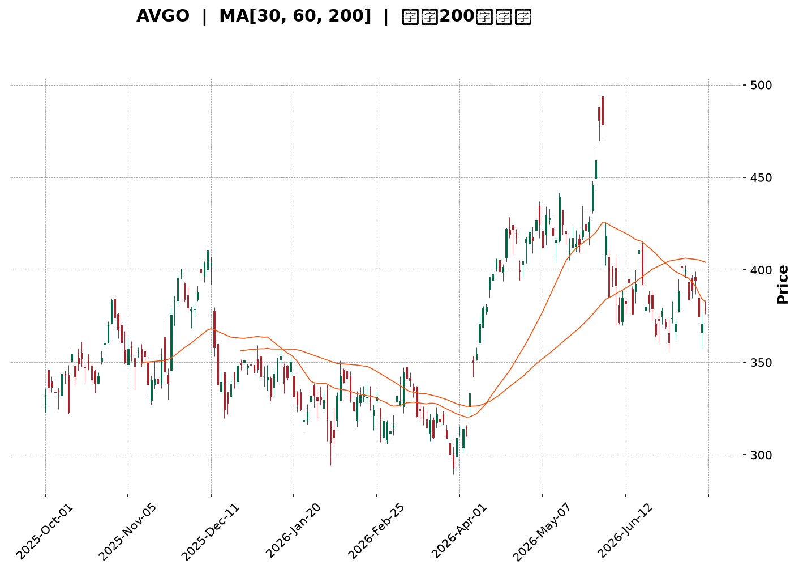
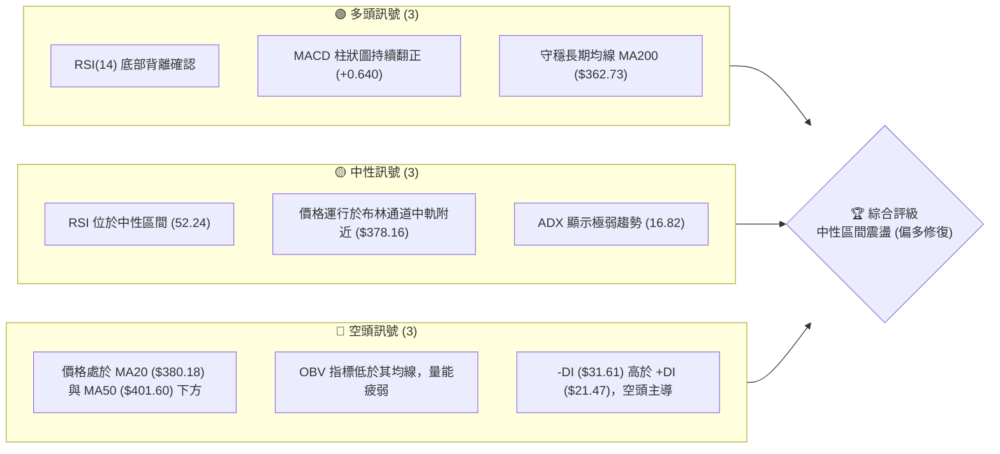
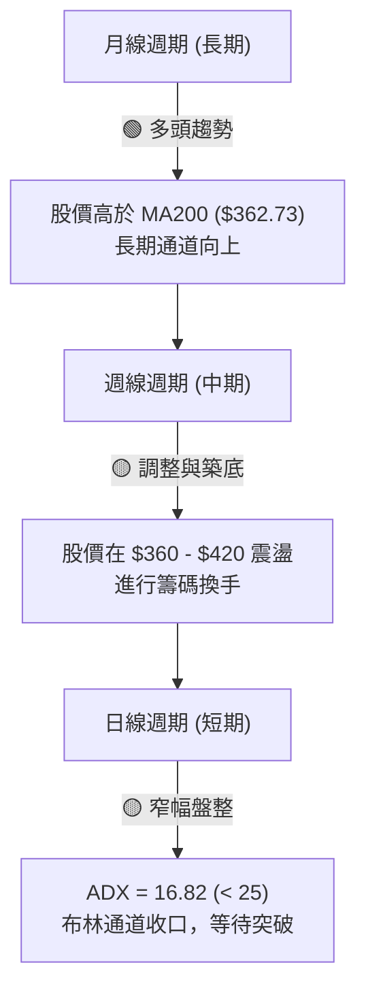
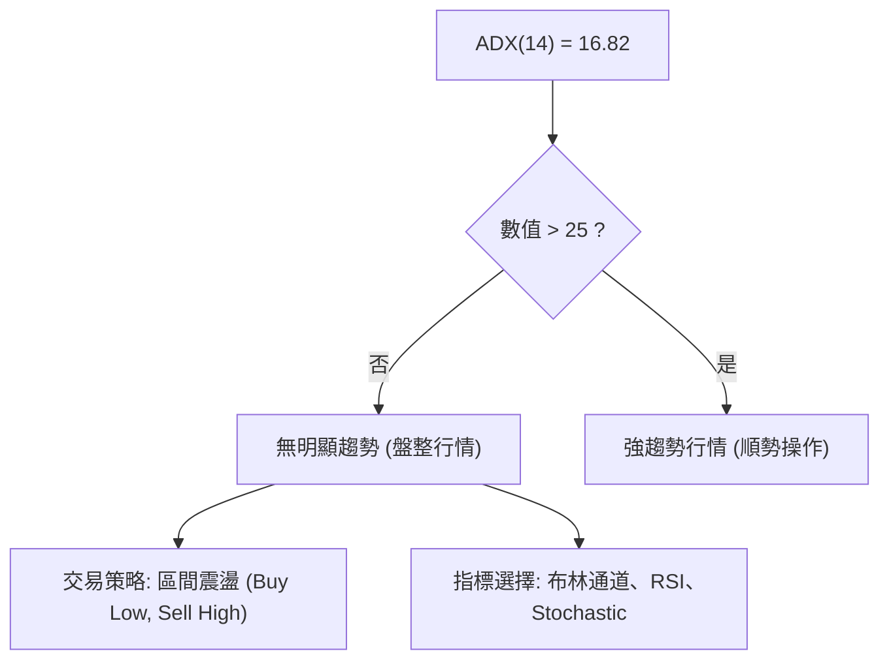
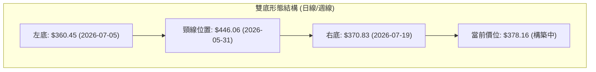
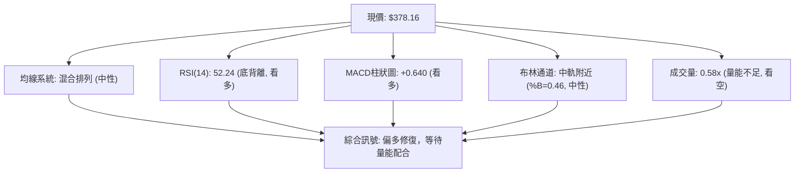
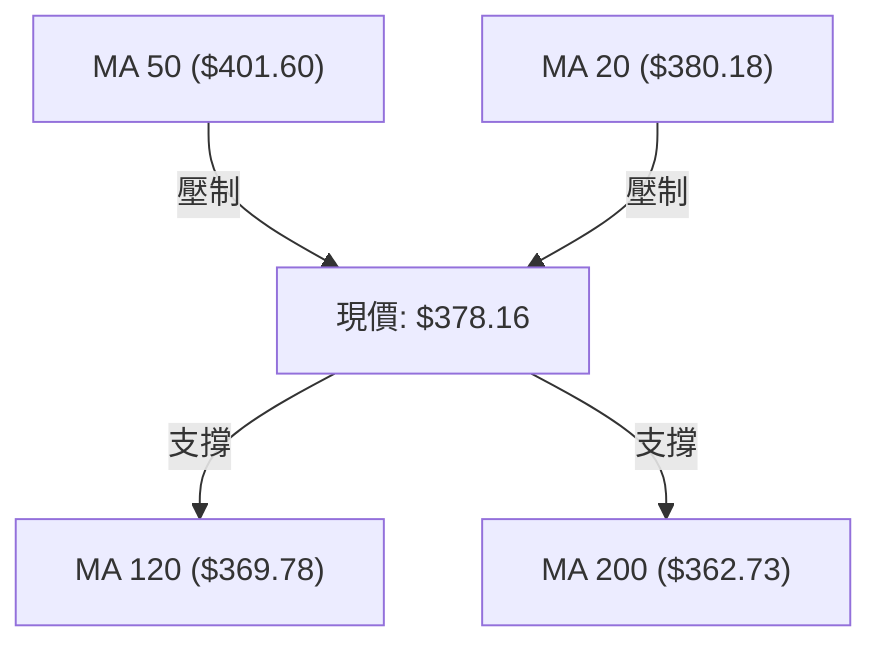
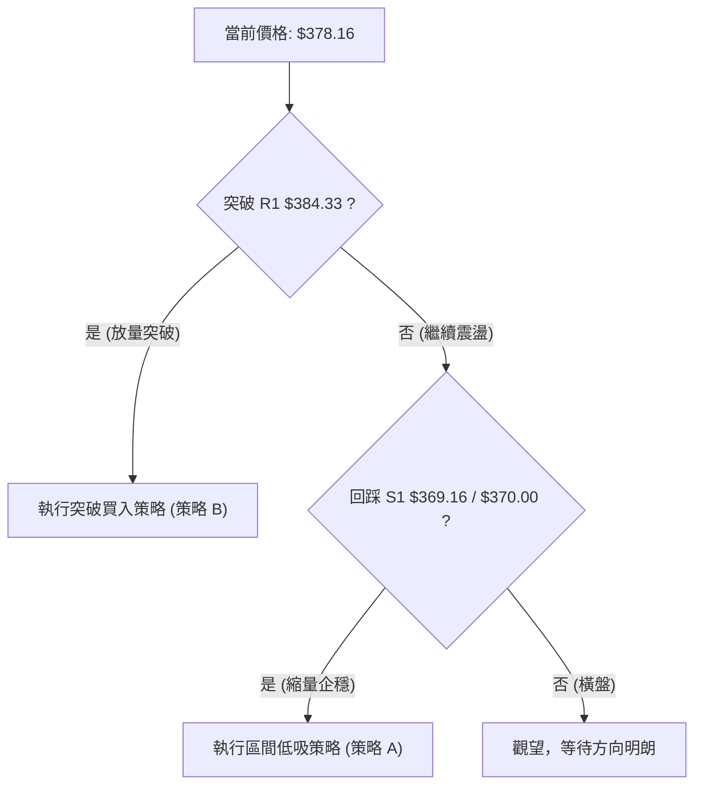
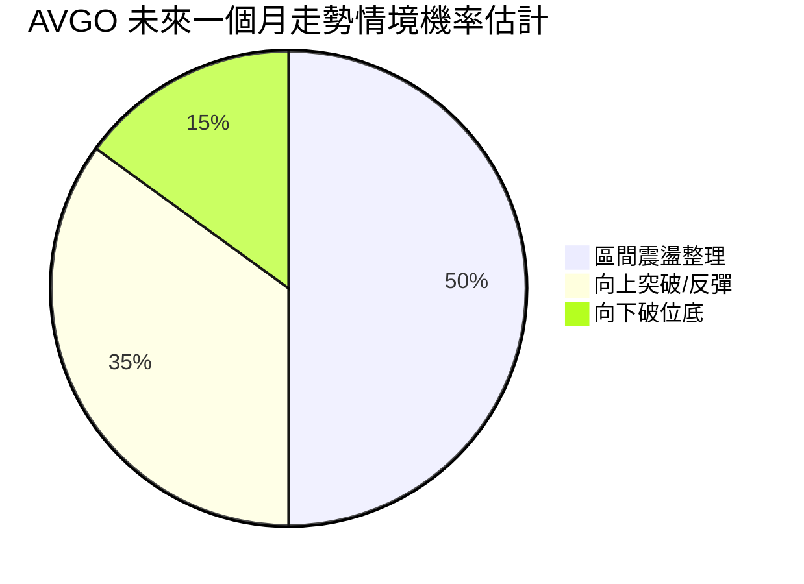
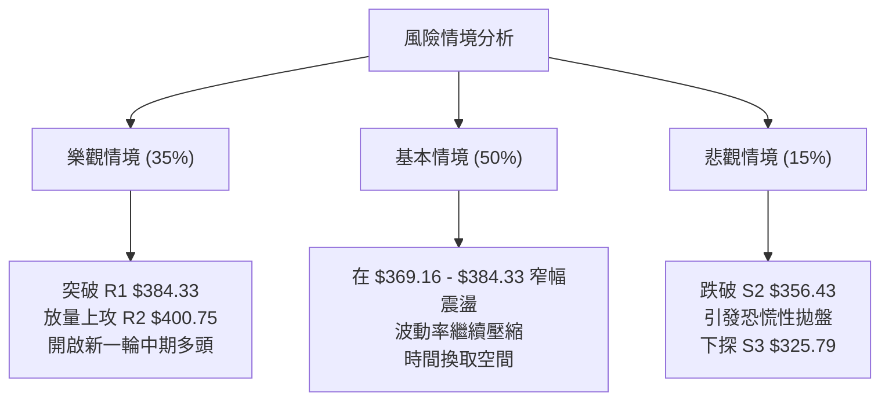

<details>
<summary>📊 靜態圖表 (點擊展開)</summary>

</details>

<html>
<head><meta charset="utf-8" /></head>
<body>
    <div style="height:500px; width:100%;">                        <script>window.PlotlyConfig = {MathJaxConfig: 'local'};</script>
        <script charset="utf-8" src="https://cdn.plot.ly/plotly-3.7.0.min.js" integrity="sha256-jvTGqxNp8AGWEcvNLVuKr+8j5dGe9Yw51LQkmDH+IYA=" crossorigin="anonymous"></script>                <div id="candlestick-chart" class="plotly-graph-div" style="height:100%; width:100%;"></div>            <script>                window.PLOTLYENV=window.PLOTLYENV || {};                                if (document.getElementById("candlestick-chart")) {                    Plotly.newPlot(                        "candlestick-chart",                        [{"close":{"dtype":"f8","bdata":"AAAAQIO4dEAAAACguQR1QAAAAKC\u002fB3VAAAAA4OzZdEAAAABAkOh0QAAAAGAxeXVAAAAAQI5xdUAAAABAIi10QAAAAOBkK3ZAAAAAIGVjdUAAAADg89V1QAAAAGDSAnZAAAAAoCG2dUAAAAAAs7R1QAAAAKABTHVAAAAA4HQmdUAAAADg8GV1QAAAAOCAAnZAAAAAYISAdkAAAABgQy53QAAAAIBD\u002fXdAAAAAoPNld0AAAAAAH\u002fl2QAAAAOB4iHZAAAAAoKjfdUAAAADgq092QAAAAKC7GXZAAAAA4Li3dUAAAADASEZ2QAAAACD633VAAAAAwNgTdkAAAACAXSF1QAAAAODSSHVAAAAA4NhLdUAAAACAoyl1QAAAACAeB3ZAAAAAIDKOdUAAAACg3SR1QAAAAKCofXdAAAAAACbud0AAAACAq7V4QAAAAOBtC3lAAAAAwNr+d0AAAADgGLd3QAAAAGDSp3dAAAAAQIGud0AAAAAgC0F4QAAAAODV7XhAAAAAoGlAeUAAAABgsqp5QAAAAICvQXlAAAAAQMledkAAAAAAqR51QAAAAABeNnVAAAAA4D9DdEAAAACAqoB0QAAAAEBpJ3VAAAAAQCZDdUAAAABgm8B1QAAAAED0znVAAAAA4GbtdUAAAAAgucF1QAAAAEAOyXVAAAAAwEaNdUAAAACggaV1QAAAAMCNYnVAAAAAACJodUAAAAAg1GN1QAAAAOAntHRAAAAAIEN7dUAAAABgre51QAAAAKDvFHZAAAAAAEgqdUAAAABALVx1QAAAAOC05nVAAAAAoBG2dEAAAADgfXl0QAAAAOC5RHRAAAAAgAHuc0AAAAAghjp0QAAAAAAZuXRAAAAAYEXAdEAAAABAQph0QAAAAEBYoXRAAAAA4FCedEAAAAAAePJzQAAAAOC1LnNAAAAAIO1Vc0AAAACgK7t0QAAAAMDXanVAAAAAYAwzdUAAAABACFh1QAAAAOBFn3RAAAAAAKA\u002fdEAAAADAHLV0QAAAAECTxHRAAAAAADrMdEAAAACg3bZ0QAAAAKAKknRAAAAA4LlEdEAAAAAgcrF0QAAAAABPCHRAAAAAAAnmc0AAAADgZdpzQAAAAMACi3NAAAAAYNXFc0AAAABAx7h0QAAAAABGlHRAAAAAYLKHdUAAAACgKVV1QAAAAOAPRXVAAAAAgMrrdEAAAABgpA90QAAAAOCjO3RAAAAAgBcCdEAAAADgU6xzQAAAAICo6nNAAAAAIO1Vc0AAAACgASB0QAAAAMCX3HNAAAAAQObkc0AAAACg5U5zQAAAACBHw3JAAAAAQCRPckAAAADAVVBzQAAAAADqj3NAAAAA4Nigc0AAAAAg7p5zQAAAAIAT13RAAAAAIDfhdUAAAABAliV2QAAAAOBnL3dAAAAAIGayd0AAAABA2sJ3QAAAAGB9wXhAAAAAIHLdeEAAAACgXF55QAAAAOD573hAAAAAYI0YeUAAAADAtl96QAAAAEBsNHpAAAAAwHhhekAAAACAoBh6QAAAAMAr83hAAAAAAPNMeUAAAACAUwx6QAAAACDUSXpAAAAAQHj9eUAAAACA9Kp6QAAAAKBIjHpAAAAAgIe+eUAAAADgINV6QAAAAEAMvHpAAAAA4DIqekAAAABAGgJ6QAAAAGCFcXtAAAAAQEqIekAAAAAguUB6QAAAACC6pnlAAAAAIJkRekAAAACAo955QAAAAADF13lAAAAAoH1VekAAAAAAGFN6QAAAAKB+nnpAAAAAQAbhe0AAAAAA5LN8QAAAAODxDH5AAAAAYJDnfUAAAAAA+CN6QAAAAIDtEXhAAAAAoJK\u002feEAAAAAgpXh4QAAAAEAxOHdAAAAAIF8PeEAAAADgddd3QAAAAIAUlXhAAAAA4NWBd0AAAABgd4R4QAAAAEAzq3lAAAAAgBSCeEAAAABgZsJ3QAAAAMAe4XdAAAAAYI+ud0AAAADgUdB2QAAAAEAzR3dAAAAAAACcd0AAAACgcBV3QAAAAEAzh3ZAAAAAYGZed0AAAADgeix3QAAAAEAKS3hAAAAAgMIReUAAAAAghf94QAAAAMDMAHhAAAAAgMJReEAAAADgeqR4QAAAAEAzZ3dAAAAAoEctd0AAAABgj6J3QA=="},"high":{"dtype":"f8","bdata":"xlTX6BABdUCxZ+idw5p1QF+h3dqwZ3VATV3vJmVjdUDSFe+RnAN1QHfAkYK9iXVAnSAZ2v2VdUDBoGmQVsp1QIb+7PIIVnZAC0B3tnPLdUC5RY1pWlZ2QLTm34Fzk3ZATuppsDnQdUBwBzrZpCl2QGdtADhL0nVASgu9ISGhdUCQ44a0N4p1QDnIH\u002fDZRHZA9EtmpaeLdkDLBGcemz93QErPMBY4BXhAofIzNfIDeEC+o414V4t3QGJfs\u002fosTHdARoDBV03udkAvzmnNYq12QNiChHCWl3ZA3LCS5GMIdkDJAvZ\u002f5l92QGuNLtX4fXZAgdgYz+tNdkAS6vhdRvl1QEfBfLQZbXVA+5mqwcvjdUCMRf0bfqB1QEToELT3WnZAhrUwGr9fd0DwH55BhKp1QD6G4UfwvXdAbBTh3HgfeECLLae\u002fQ9p4QDxfNNYQDHlAwrukTHaTeEC3FVnO6XR4QAn\u002fLQy2wndAREkslwLcd0BG2WzmY3V4QEM5CtRSUHlAXZgrZJhKeUDA8IVQysR5QBSwWd5NcHlAg8QlN\u002fC9d0AHa5G5uH92QALYZrkDmXVA\u002fwjvftqKdUBgugV+hOJ0QGWTHXeTWHVA8FkV\u002foGPdUBkgsg\u002fM811QILIH\u002fAJ+XVAR2m2iUH\u002fdUAOCJIetdB1QGhJx1Qr9nVAYD8AzYjJdUB3zjV3YXV2QOwVpbehG3ZAoWFGgE28dUBtlWQrqsZ1QIS\u002fx6CyZnVAmO+VHtehdUDgOCQ4ngl2QFQ\u002fecO6YnZA5alZZXLWdUAsfEuBWMZ1QMe4SahXE3ZA39Cs8x2CdUD0mrqkFOl0QGFqiv4M\u002fHRAL8wYlu4MdEAJ3WcslHd0QKrlfIKA2HRAt2LU5t8rdUDepg3neOt0QCCQQQVXD3VA2A\u002fztTntdEB4kL6Ufxp1QCs1Ftll5XNAuREyLE5VdEC2m1b7U9x0QPh+v9i\u002f8HVA8n\u002f9UrmrdUCDvsDAz551QDPFPBNOkHVALLkL0nzRdEB3fmOeSOh0QAdT\u002fA09CnVA3tPrWSoTdUDZFnuayS11QAlYqFQfFHVAf+lFO65xdEC5Doqh1ep0QJg0JwMaVnRAAOoqfDXtc0C8BNao2O1zQAXjRPWHq3NA6TATLksXdEBzIG+DLu50QMoYif78Y3VAvk1cL2CzdUAF7lHAgP11QPIKcyKniHVA3BwV+VIpdUDV9nfRQBF1QM0suWjef3RAYbQC2c9jdEDB9Tnp7UN0QE7Y7i9WIXRAWXRFw0cFdEAcNBcObV90QD+RCLQyPnRA2bFLt5k8dECjyp4UtcZzQGZQrLs5MHNArnesOJ0Ec0C\u002f1nxSHV1zQIHwFP2ntHNA6soBeBWjc0BJ6dJ\u002fZr5zQCk+wpXz2XRAFNxAaEkZdkDbfzCYIWJ2QBuWI4NHf3dA11rXcCHEd0COh4iK0Np3QFH7hYs9x3hA3gMra8bweED64i6lZWF5QFkvJM1xXHlArMWZXmUveUCLT6IQgGh6QConpRobynpAuUeDQEGFekBthf3MT2F6QAuEdCuzUnlAPTQtBfxPeUA88OeZgBt6QOHJTWQFaHpAAb22bpByekAXesx4SAt7QAgtFmfQT3tApdjxlg6dekBlTVmDACV7QGMttZZvD3tA4tFgxJXKekAUGUH3fh96QAxatl2TmntA+roqbgQCe0CYJPWVfVV6QDmGNxiiFHpAfnQuA\u002f93ekCoM9EKU1l6QCG65qI4NXpAruQiS\u002fQpe0ArZsdw2wF7QPCCfC8E0HpAuRLI9gwDfED7Tc9FBBV9QKbzX\u002fPCgH5ArStRLnzjfkB1p+TA5Zx6QOUNUw2fnXlAZUyPPEEjeUB78DqRm3N5QGTPfaM0E3hAT1cZ8CZOeEAlBmJq8gV4QA8bS98uuXhAQgcSBbxyeEDJzck2RQB5QJ\u002fxKiPEwHlAAAAAgD3qeUAAAADgUXB4QAAAAADXS3hAAAAAwMxMeEAAAABAClt3QAAAACBcg3dAAAAAgOu5d0AAAAAAAFx3QAAAAAAAYHdAAAAAYI\u002fyd0AAAAAgXE93QAAAAKBwsXhAAAAA4FF4eUAAAABACid5QAAAAAAAvHhAAAAAoEfVeEAAAAAAAPB4QAAAAADXK3hAAAAAoJmVd0AAAACgcPl3QA=="},"hovertemplate":"\u003cb\u003e%{x|%Y-%m-%d}\u003c\u002fb\u003e\u003cbr\u003e\u958b: $%{open:.2f}\u003cbr\u003e\u9ad8: $%{high:.2f}\u003cbr\u003e\u4f4e: $%{low:.2f}\u003cbr\u003e\u6536: $%{close:.2f}\u003cextra\u003e\u003c\u002fextra\u003e","low":{"dtype":"f8","bdata":"2sZirhArdEBQCQNCG9Z0QChfzCjn3XRAZeuI2iDLdEBRqP7iKEx0QK4kDeJCrHRA1F9rNQwodUDPqGq95yN0QPxNG1ywWXVA7hGgQx0cdUA+EiytA5l1QOlGG1+tuHVAGPmwChgudUD\u002fpQ6VbJ51QBNL5dCGNnVAI4+zdj7adEA0FdArDCh1QHbd0w\u002fLznVAf0z9WZ4RdkDrphtwJ4h2QEfK7pPDMXdAkHdtkfb\u002fdkAwq96HC7F2QAw9wkJnf3ZALVoH1bPQdUCkZ4BNOcJ1QNM8z93o63VAM3\u002f+Ej\u002f2dECExc8IJAp2QNmGp6WKu3VAZdgyroXbdUDwmAOaw8R0QHeI3GCec3RARzedeTn6dEBoDLdnPtp0QDe6fuGt\u002fnRAuQl9Dxp0dUBNh4\u002feNp90QEVvcoSPm3VANhmuQtoad0CBHcNm\u002fNF3QGxEBoUlr3hAd36cHkPvd0AJg4ihxpp3QODo7JpZCXdA3J1C+Odmd0D5GAewDvB3QDajbRX3snhA6btP0uSUeEAotDsbVdV4QPc4xkbkf3hAyIqFfLsSdkCWMU7AEPp0QHEXN3AV03RAQ9S4YA\u002f6c0D+CF8qOR10QKKzNfefq3RAiY3rtrf\u002fdEDrfqOOwhR1QI9DNe3anXVAWR9lOJSndUApLLyHzHZ1QPu+v6RJwHVAeqPkuG+CdUA6X\u002fPXqoR1QAsvRWc99HRAV4Rr3SYMdUD3GGEtW+p0QBOWFoSXlHRAr8lDbmrEdECcDELFLTt1QPCxPx\u002f02XVAXqy9GhXTdEDz\u002flALqEZ1QCA0F6eYbHVAh\u002f3XxlCpdED5CNuGKTB0QBuq\u002fWQpO3RA45t\u002fi1CPc0DdKGsd88ZzQABjz70dXXRAjTzo8ANYdECbXWoYrPFzQDq3DMb\u002fcXRAZYbT895IdECGcdFWRjhzQMGBSIt1Y3JA5ymCpjAZc0ChT9bYObJzQJWdZqr7lnRAHkwcxXspdUCNW1bZPch0QHe2FnSbhXRA3zlVF\u002fk3dEDXvf2cYrJzQO60s8h2YHRAqtU5C4WHdECRKdEG7YV0QIOCKTcEQnRArI0TF7yUc0BaNNDMJIF0QG5bqwLMLHNAsJJJ0MtNc0BMAHMPKSFzQJvklU9ZJHNArHXhiohpc0C8Zoysgh10QL63VI0sY3RA4BwgtMEmdECG5jmCyTh1QKkidZyoD3VA5XaSTLGvdED0IWQ5AQR0QN+Ubk8q7nNAF92tyF7Bc0BKyW0WRaZzQIpbmDILNnNAyT2PXoVMc0DHkVvv6qZzQG84g9R6pXNAJ08LJ4PDc0A\u002f+T4+50pzQNyXDRddpnJA1GeeVAcYckAzLZqd8n1yQCAMQpvUX3NAG42M+F7UckDQtUucolxzQK2qQ+WpFHRAKDPt7NFfdUAvdyryHO91QL+BR1P\u002fg3ZARTaRuFYOd0CWVRv+mnt3QE7Q8ipfD3hAypQ0PK57eEDF4wQP2vJ4QIG7huRjtHhAULmv8CSfeEBRWJQFhkN5QNuV1pk8EnpAFpA+N2yDeUC3QEDbmN95QJGI9QZsoHhA7Tu6vXLCeECqdU\u002fPdTl5QKQBwecHynlAVqnQPCCOeUDym8t3\u002fyp6QKMLKNTqEXpA8p9pBIdaeUCJO+JuiNV5QPOhgaANhnpAuXP5+zt8eUDJ\u002fKC6kEJ5QBOH4MHu7nlA\u002fcPmoi8yekCv8vGIcdt5QOkBt5h\u002fU3lAkI7SiFGseUAZ47MXn515QFDx1g\u002f9mHlA1sogDXUFekBaXOdBT\u002f15QEykp1ux1XlAz1WlhpzsekB8Q7ziVph7QCy9Vih3W31ARYsgZ0p+fUAmpnWJ+CV5QNxc\u002f+ewD3hAPtgPm7RreEDSjWKr6ht3QNIA7wRWKXdAQF3NV24fd0D4CY3wd4Z3QCdbEXDGP3hATDQ9ftd9d0BIvom3ueB3QJ4BusPUS3lAAAAAYI9+eEAAAABgj4p3QAAAACBcj3dAAAAAQDNLd0AAAACgR712QAAAACBch3ZAAAAAgD0qd0AAAADgegB3QAAAAEDhRnZAAAAAQOEyd0AAAAAAKaB2QAAAAIA9jndAAAAAQOE+eEAAAABAM7t4QAAAAGC49ndAAAAAgD0KeEAAAAAA1yt4QAAAAGBmPndAAAAAwMxcdkAAAAAgXH93QA=="},"name":"\u50f9\u683c","open":{"dtype":"f8","bdata":"JeP+vCNldECxZ+idw5p1QMXfYa2MOXVAj04ab8TgdEBIKPqYbfJ0QEUdnr1av3RAfPMatit9dUBk8cZdcXd1QLnI4DXd7HVAOH0WKtzCdUAhi8uy6Qd2QMkdjEL8LHZARbnMG5a6dUBSqAapQP11QPNR\u002f7PKwHVAkRzSFtWVdUA0FdArDCh1QA7Fqlq66HVARhAfJGd4dkAplDIClol2QEfK7pPDMXdAofIzNfIDeEABYa8ml4J3QAYuNWnUHndADjD6DFpIdkCBEIjq8851QOttqFKmYXZAk1UYOHUDdkCXqnbPfD52QMyIfhyDT3ZAvCkpIbdAdkBhF\u002fI17tl1QO5Xpb32mXRARZpD2dEedUDflxgemVR1QBwGedT6LHVAMF36kF2\u002fdkBiV7CHyHN1QIR\u002fWqusnHVAFKxkqI7sd0AXrOjga\u002fZ3QJHZccf90XhArmuJj2SKeEA7+HIGViJ4QN\u002fwjcwdnndAxeNMne+od0DioGpnSQB4QBspyt\u002fKA3lAd9wC3XHIeEBuKfBXVv94QF4sKscuKXlAIGkx6Hqdd0Afd0i8+H12QDSJYKZb4nRA\u002fwjvftqKdUB4l1JNCuJ0QNINBJ63t3RAPsU4BimMdUCuD6BO8jh1QLL5N09y1nVA8\u002fjoNVjcdUDqY4LSCrd1QGSxMvL3ynVA51E9riTHdUD8uZltw\u002fd1QGTWuTMCF3ZAEf8qTmxldUCDYDZvIkd1QIv9achZWHVAHEjbW+AKdUCcDELFLTt1QFjKxKFb+XVAz2eZIAe7dUCPLGssa711QO6jimf8j3VAknWivmRtdUBzK7NAdeR0QKho+kXo4XRAg5NMxgzic0CdCNoqBepzQEB75KzLiHRA0yQGqrMZdUDnaWBdbrV0QK9Up5yEs3RA4IZtCpxOdEA6E5atEPh0QCs1Ftll5XNA9LKQLPuSc0AmaMWYze5zQC32mVzlmHRA85IzkR2jdUB41jxEb5h1QFlYi84WaXVAqMvx5DqKdEB2lptzG+hzQKnjrBv4hHRA4xiAu5q8dEDcfRYcPrJ0QA6zc0l9sHRAMRLuGLMVdECtKRr6aph0QM1e\u002fJbTVHRA3h5aivRYc0CxwM\u002fWl0NzQElToMCefXNALUzCj1eoc0AfLaePfY90QBo6qtIzcXRAbN\u002fPe8hgdEDLOfmrM7d1QLOxlWpSVXVADThOxAEIdUBXCYTwDAd1QAca0tYsTXRAD+le2gdJdEAAcvw5EPRzQLsz3sordXNAzyylKB\u002fvc0C2xqbQ9ddzQNJOn87o93NAWq+vqEghdECoCupZYZhzQG7OulQyKXNArsnnFlDGckAHnvq\u002fq65yQLAi0kb\u002fjXNALhmbPCQAc0D3dB6M\u002fqhzQGa4ZVxrY3RAVMRGYBvzdUDCqqKE5Pt1QGJkcwzqhXZAYV5VzjYRd0CTpxpk2JR3QPrZggU5VHhAq9FvdQOmeEDzav6gQwR5QDToKVbxUHlAI2AlPXbseEB3m8DsY2V5QIEWhaSPW3pAbA6ige+EekDK0TOeDD16QJEHpsTW+nhAc6oPX8wteUAOCbl80O15QDnGpPDx5nlARV8TPvIYekDpxldE5k96QMPeyZ\u002fyLXtAk1fKkHRSekCyZrWkLzJ6QD6QIL4br3pA48XbpCxsekBkVs93cvJ5QD8L8uAkAXpA+roqbgQCe0DyiiDY50t6QAYYLjfCknlAy1u96YXCeUCi6RgaWM55QOm4RNFIDXpAMefDV2sdekBanxl5X4Z6QDdNsLWXR3pAMgZoEkEEe0DwdJpyDxZ8QDiIFEVIgH5Au67XevjffkDtt\u002fHUf4V5QCFr8EF0b3lAzQkYib0feUAjBMsVmw95QOwO3MhazndAjI9vprFDd0BWYRuS0fF3QKl+lhYprnhA9\u002fcWf35ZeEA5A4s+iEF4QFE1wbTsjnlAAAAAYI\u002faeUAAAACA6513QAAAAIDrKXhAAAAAoEcpeEAAAABAMyd3QAAAAIDrWXdAAAAA4KNsd0AAAACA6z13QAAAACCu23ZAAAAAgMJZd0AAAADA9eh2QAAAAOBRmHdAAAAAQAojeUAAAAAAAOh4QAAAACCul3hAAAAAIIW7eEAAAACgcMF4QAAAAOCjCHhAAAAAwMzgdkAAAAAAKax3QA=="},"x":["2025-10-01T00:00:00-04:00","2025-10-02T00:00:00-04:00","2025-10-03T00:00:00-04:00","2025-10-06T00:00:00-04:00","2025-10-07T00:00:00-04:00","2025-10-08T00:00:00-04:00","2025-10-09T00:00:00-04:00","2025-10-10T00:00:00-04:00","2025-10-13T00:00:00-04:00","2025-10-14T00:00:00-04:00","2025-10-15T00:00:00-04:00","2025-10-16T00:00:00-04:00","2025-10-17T00:00:00-04:00","2025-10-20T00:00:00-04:00","2025-10-21T00:00:00-04:00","2025-10-22T00:00:00-04:00","2025-10-23T00:00:00-04:00","2025-10-24T00:00:00-04:00","2025-10-27T00:00:00-04:00","2025-10-28T00:00:00-04:00","2025-10-29T00:00:00-04:00","2025-10-30T00:00:00-04:00","2025-10-31T00:00:00-04:00","2025-11-03T00:00:00-05:00","2025-11-04T00:00:00-05:00","2025-11-05T00:00:00-05:00","2025-11-06T00:00:00-05:00","2025-11-07T00:00:00-05:00","2025-11-10T00:00:00-05:00","2025-11-11T00:00:00-05:00","2025-11-12T00:00:00-05:00","2025-11-13T00:00:00-05:00","2025-11-14T00:00:00-05:00","2025-11-17T00:00:00-05:00","2025-11-18T00:00:00-05:00","2025-11-19T00:00:00-05:00","2025-11-20T00:00:00-05:00","2025-11-21T00:00:00-05:00","2025-11-24T00:00:00-05:00","2025-11-25T00:00:00-05:00","2025-11-26T00:00:00-05:00","2025-11-28T00:00:00-05:00","2025-12-01T00:00:00-05:00","2025-12-02T00:00:00-05:00","2025-12-03T00:00:00-05:00","2025-12-04T00:00:00-05:00","2025-12-05T00:00:00-05:00","2025-12-08T00:00:00-05:00","2025-12-09T00:00:00-05:00","2025-12-10T00:00:00-05:00","2025-12-11T00:00:00-05:00","2025-12-12T00:00:00-05:00","2025-12-15T00:00:00-05:00","2025-12-16T00:00:00-05:00","2025-12-17T00:00:00-05:00","2025-12-18T00:00:00-05:00","2025-12-19T00:00:00-05:00","2025-12-22T00:00:00-05:00","2025-12-23T00:00:00-05:00","2025-12-24T00:00:00-05:00","2025-12-26T00:00:00-05:00","2025-12-29T00:00:00-05:00","2025-12-30T00:00:00-05:00","2025-12-31T00:00:00-05:00","2026-01-02T00:00:00-05:00","2026-01-05T00:00:00-05:00","2026-01-06T00:00:00-05:00","2026-01-07T00:00:00-05:00","2026-01-08T00:00:00-05:00","2026-01-09T00:00:00-05:00","2026-01-12T00:00:00-05:00","2026-01-13T00:00:00-05:00","2026-01-14T00:00:00-05:00","2026-01-15T00:00:00-05:00","2026-01-16T00:00:00-05:00","2026-01-20T00:00:00-05:00","2026-01-21T00:00:00-05:00","2026-01-22T00:00:00-05:00","2026-01-23T00:00:00-05:00","2026-01-26T00:00:00-05:00","2026-01-27T00:00:00-05:00","2026-01-28T00:00:00-05:00","2026-01-29T00:00:00-05:00","2026-01-30T00:00:00-05:00","2026-02-02T00:00:00-05:00","2026-02-03T00:00:00-05:00","2026-02-04T00:00:00-05:00","2026-02-05T00:00:00-05:00","2026-02-06T00:00:00-05:00","2026-02-09T00:00:00-05:00","2026-02-10T00:00:00-05:00","2026-02-11T00:00:00-05:00","2026-02-12T00:00:00-05:00","2026-02-13T00:00:00-05:00","2026-02-17T00:00:00-05:00","2026-02-18T00:00:00-05:00","2026-02-19T00:00:00-05:00","2026-02-20T00:00:00-05:00","2026-02-23T00:00:00-05:00","2026-02-24T00:00:00-05:00","2026-02-25T00:00:00-05:00","2026-02-26T00:00:00-05:00","2026-02-27T00:00:00-05:00","2026-03-02T00:00:00-05:00","2026-03-03T00:00:00-05:00","2026-03-04T00:00:00-05:00","2026-03-05T00:00:00-05:00","2026-03-06T00:00:00-05:00","2026-03-09T00:00:00-04:00","2026-03-10T00:00:00-04:00","2026-03-11T00:00:00-04:00","2026-03-12T00:00:00-04:00","2026-03-13T00:00:00-04:00","2026-03-16T00:00:00-04:00","2026-03-17T00:00:00-04:00","2026-03-18T00:00:00-04:00","2026-03-19T00:00:00-04:00","2026-03-20T00:00:00-04:00","2026-03-23T00:00:00-04:00","2026-03-24T00:00:00-04:00","2026-03-25T00:00:00-04:00","2026-03-26T00:00:00-04:00","2026-03-27T00:00:00-04:00","2026-03-30T00:00:00-04:00","2026-03-31T00:00:00-04:00","2026-04-01T00:00:00-04:00","2026-04-02T00:00:00-04:00","2026-04-06T00:00:00-04:00","2026-04-07T00:00:00-04:00","2026-04-08T00:00:00-04:00","2026-04-09T00:00:00-04:00","2026-04-10T00:00:00-04:00","2026-04-13T00:00:00-04:00","2026-04-14T00:00:00-04:00","2026-04-15T00:00:00-04:00","2026-04-16T00:00:00-04:00","2026-04-17T00:00:00-04:00","2026-04-20T00:00:00-04:00","2026-04-21T00:00:00-04:00","2026-04-22T00:00:00-04:00","2026-04-23T00:00:00-04:00","2026-04-24T00:00:00-04:00","2026-04-27T00:00:00-04:00","2026-04-28T00:00:00-04:00","2026-04-29T00:00:00-04:00","2026-04-30T00:00:00-04:00","2026-05-01T00:00:00-04:00","2026-05-04T00:00:00-04:00","2026-05-05T00:00:00-04:00","2026-05-06T00:00:00-04:00","2026-05-07T00:00:00-04:00","2026-05-08T00:00:00-04:00","2026-05-11T00:00:00-04:00","2026-05-12T00:00:00-04:00","2026-05-13T00:00:00-04:00","2026-05-14T00:00:00-04:00","2026-05-15T00:00:00-04:00","2026-05-18T00:00:00-04:00","2026-05-19T00:00:00-04:00","2026-05-20T00:00:00-04:00","2026-05-21T00:00:00-04:00","2026-05-22T00:00:00-04:00","2026-05-26T00:00:00-04:00","2026-05-27T00:00:00-04:00","2026-05-28T00:00:00-04:00","2026-05-29T00:00:00-04:00","2026-06-01T00:00:00-04:00","2026-06-02T00:00:00-04:00","2026-06-03T00:00:00-04:00","2026-06-04T00:00:00-04:00","2026-06-05T00:00:00-04:00","2026-06-08T00:00:00-04:00","2026-06-09T00:00:00-04:00","2026-06-10T00:00:00-04:00","2026-06-11T00:00:00-04:00","2026-06-12T00:00:00-04:00","2026-06-15T00:00:00-04:00","2026-06-16T00:00:00-04:00","2026-06-17T00:00:00-04:00","2026-06-18T00:00:00-04:00","2026-06-22T00:00:00-04:00","2026-06-23T00:00:00-04:00","2026-06-24T00:00:00-04:00","2026-06-25T00:00:00-04:00","2026-06-26T00:00:00-04:00","2026-06-29T00:00:00-04:00","2026-06-30T00:00:00-04:00","2026-07-01T00:00:00-04:00","2026-07-02T00:00:00-04:00","2026-07-06T00:00:00-04:00","2026-07-07T00:00:00-04:00","2026-07-08T00:00:00-04:00","2026-07-09T00:00:00-04:00","2026-07-10T00:00:00-04:00","2026-07-13T00:00:00-04:00","2026-07-14T00:00:00-04:00","2026-07-15T00:00:00-04:00","2026-07-16T00:00:00-04:00","2026-07-17T00:00:00-04:00","2026-07-20T00:00:00-04:00"],"type":"candlestick"},{"hovertemplate":"MA30: $%{y:.2f}\u003cextra\u003e\u003c\u002fextra\u003e","line":{"color":"#2196F3","dash":"dash","width":2},"mode":"lines","name":"MA30","x":["2025-10-01T00:00:00-04:00","2025-10-02T00:00:00-04:00","2025-10-03T00:00:00-04:00","2025-10-06T00:00:00-04:00","2025-10-07T00:00:00-04:00","2025-10-08T00:00:00-04:00","2025-10-09T00:00:00-04:00","2025-10-10T00:00:00-04:00","2025-10-13T00:00:00-04:00","2025-10-14T00:00:00-04:00","2025-10-15T00:00:00-04:00","2025-10-16T00:00:00-04:00","2025-10-17T00:00:00-04:00","2025-10-20T00:00:00-04:00","2025-10-21T00:00:00-04:00","2025-10-22T00:00:00-04:00","2025-10-23T00:00:00-04:00","2025-10-24T00:00:00-04:00","2025-10-27T00:00:00-04:00","2025-10-28T00:00:00-04:00","2025-10-29T00:00:00-04:00","2025-10-30T00:00:00-04:00","2025-10-31T00:00:00-04:00","2025-11-03T00:00:00-05:00","2025-11-04T00:00:00-05:00","2025-11-05T00:00:00-05:00","2025-11-06T00:00:00-05:00","2025-11-07T00:00:00-05:00","2025-11-10T00:00:00-05:00","2025-11-11T00:00:00-05:00","2025-11-12T00:00:00-05:00","2025-11-13T00:00:00-05:00","2025-11-14T00:00:00-05:00","2025-11-17T00:00:00-05:00","2025-11-18T00:00:00-05:00","2025-11-19T00:00:00-05:00","2025-11-20T00:00:00-05:00","2025-11-21T00:00:00-05:00","2025-11-24T00:00:00-05:00","2025-11-25T00:00:00-05:00","2025-11-26T00:00:00-05:00","2025-11-28T00:00:00-05:00","2025-12-01T00:00:00-05:00","2025-12-02T00:00:00-05:00","2025-12-03T00:00:00-05:00","2025-12-04T00:00:00-05:00","2025-12-05T00:00:00-05:00","2025-12-08T00:00:00-05:00","2025-12-09T00:00:00-05:00","2025-12-10T00:00:00-05:00","2025-12-11T00:00:00-05:00","2025-12-12T00:00:00-05:00","2025-12-15T00:00:00-05:00","2025-12-16T00:00:00-05:00","2025-12-17T00:00:00-05:00","2025-12-18T00:00:00-05:00","2025-12-19T00:00:00-05:00","2025-12-22T00:00:00-05:00","2025-12-23T00:00:00-05:00","2025-12-24T00:00:00-05:00","2025-12-26T00:00:00-05:00","2025-12-29T00:00:00-05:00","2025-12-30T00:00:00-05:00","2025-12-31T00:00:00-05:00","2026-01-02T00:00:00-05:00","2026-01-05T00:00:00-05:00","2026-01-06T00:00:00-05:00","2026-01-07T00:00:00-05:00","2026-01-08T00:00:00-05:00","2026-01-09T00:00:00-05:00","2026-01-12T00:00:00-05:00","2026-01-13T00:00:00-05:00","2026-01-14T00:00:00-05:00","2026-01-15T00:00:00-05:00","2026-01-16T00:00:00-05:00","2026-01-20T00:00:00-05:00","2026-01-21T00:00:00-05:00","2026-01-22T00:00:00-05:00","2026-01-23T00:00:00-05:00","2026-01-26T00:00:00-05:00","2026-01-27T00:00:00-05:00","2026-01-28T00:00:00-05:00","2026-01-29T00:00:00-05:00","2026-01-30T00:00:00-05:00","2026-02-02T00:00:00-05:00","2026-02-03T00:00:00-05:00","2026-02-04T00:00:00-05:00","2026-02-05T00:00:00-05:00","2026-02-06T00:00:00-05:00","2026-02-09T00:00:00-05:00","2026-02-10T00:00:00-05:00","2026-02-11T00:00:00-05:00","2026-02-12T00:00:00-05:00","2026-02-13T00:00:00-05:00","2026-02-17T00:00:00-05:00","2026-02-18T00:00:00-05:00","2026-02-19T00:00:00-05:00","2026-02-20T00:00:00-05:00","2026-02-23T00:00:00-05:00","2026-02-24T00:00:00-05:00","2026-02-25T00:00:00-05:00","2026-02-26T00:00:00-05:00","2026-02-27T00:00:00-05:00","2026-03-02T00:00:00-05:00","2026-03-03T00:00:00-05:00","2026-03-04T00:00:00-05:00","2026-03-05T00:00:00-05:00","2026-03-06T00:00:00-05:00","2026-03-09T00:00:00-04:00","2026-03-10T00:00:00-04:00","2026-03-11T00:00:00-04:00","2026-03-12T00:00:00-04:00","2026-03-13T00:00:00-04:00","2026-03-16T00:00:00-04:00","2026-03-17T00:00:00-04:00","2026-03-18T00:00:00-04:00","2026-03-19T00:00:00-04:00","2026-03-20T00:00:00-04:00","2026-03-23T00:00:00-04:00","2026-03-24T00:00:00-04:00","2026-03-25T00:00:00-04:00","2026-03-26T00:00:00-04:00","2026-03-27T00:00:00-04:00","2026-03-30T00:00:00-04:00","2026-03-31T00:00:00-04:00","2026-04-01T00:00:00-04:00","2026-04-02T00:00:00-04:00","2026-04-06T00:00:00-04:00","2026-04-07T00:00:00-04:00","2026-04-08T00:00:00-04:00","2026-04-09T00:00:00-04:00","2026-04-10T00:00:00-04:00","2026-04-13T00:00:00-04:00","2026-04-14T00:00:00-04:00","2026-04-15T00:00:00-04:00","2026-04-16T00:00:00-04:00","2026-04-17T00:00:00-04:00","2026-04-20T00:00:00-04:00","2026-04-21T00:00:00-04:00","2026-04-22T00:00:00-04:00","2026-04-23T00:00:00-04:00","2026-04-24T00:00:00-04:00","2026-04-27T00:00:00-04:00","2026-04-28T00:00:00-04:00","2026-04-29T00:00:00-04:00","2026-04-30T00:00:00-04:00","2026-05-01T00:00:00-04:00","2026-05-04T00:00:00-04:00","2026-05-05T00:00:00-04:00","2026-05-06T00:00:00-04:00","2026-05-07T00:00:00-04:00","2026-05-08T00:00:00-04:00","2026-05-11T00:00:00-04:00","2026-05-12T00:00:00-04:00","2026-05-13T00:00:00-04:00","2026-05-14T00:00:00-04:00","2026-05-15T00:00:00-04:00","2026-05-18T00:00:00-04:00","2026-05-19T00:00:00-04:00","2026-05-20T00:00:00-04:00","2026-05-21T00:00:00-04:00","2026-05-22T00:00:00-04:00","2026-05-26T00:00:00-04:00","2026-05-27T00:00:00-04:00","2026-05-28T00:00:00-04:00","2026-05-29T00:00:00-04:00","2026-06-01T00:00:00-04:00","2026-06-02T00:00:00-04:00","2026-06-03T00:00:00-04:00","2026-06-04T00:00:00-04:00","2026-06-05T00:00:00-04:00","2026-06-08T00:00:00-04:00","2026-06-09T00:00:00-04:00","2026-06-10T00:00:00-04:00","2026-06-11T00:00:00-04:00","2026-06-12T00:00:00-04:00","2026-06-15T00:00:00-04:00","2026-06-16T00:00:00-04:00","2026-06-17T00:00:00-04:00","2026-06-18T00:00:00-04:00","2026-06-22T00:00:00-04:00","2026-06-23T00:00:00-04:00","2026-06-24T00:00:00-04:00","2026-06-25T00:00:00-04:00","2026-06-26T00:00:00-04:00","2026-06-29T00:00:00-04:00","2026-06-30T00:00:00-04:00","2026-07-01T00:00:00-04:00","2026-07-02T00:00:00-04:00","2026-07-06T00:00:00-04:00","2026-07-07T00:00:00-04:00","2026-07-08T00:00:00-04:00","2026-07-09T00:00:00-04:00","2026-07-10T00:00:00-04:00","2026-07-13T00:00:00-04:00","2026-07-14T00:00:00-04:00","2026-07-15T00:00:00-04:00","2026-07-16T00:00:00-04:00","2026-07-17T00:00:00-04:00","2026-07-20T00:00:00-04:00"],"y":{"dtype":"f8","bdata":"AAAAAAAA+H8AAAAAAAD4fwAAAAAAAPh\u002fAAAAAAAA+H8AAAAAAAD4fwAAAAAAAPh\u002fAAAAAAAA+H8AAAAAAAD4fwAAAAAAAPh\u002fAAAAAAAA+H8AAAAAAAD4fwAAAAAAAPh\u002fAAAAAAAA+H8AAAAAAAD4fwAAAAAAAPh\u002fAAAAAAAA+H8AAAAAAAD4fwAAAAAAAPh\u002fAAAAAAAA+H8AAAAAAAD4fwAAAAAAAPh\u002fAAAAAAAA+H8AAAAAAAD4fwAAAAAAAPh\u002fAAAAAAAA+H8AAAAAAAD4fwAAAAAAAPh\u002fAAAAAAAA+H8AAAAAAAD4fzMzM5OT1XVA3t3dfSfhdUAzMzPjG+J1QCIiIjJH5HVAREREVBPodUAzMzOjPup1QKuqqrr57nVAAAAAIO7vdUCrqqoaMPh1QBEREaF2A3ZAmpmZuScZdkCJiIjYrTF2QFVVVeWQS3ZAiYiIiA5fdkAAAAAQNHB2QO\u002fu7p5UhHZAIiIiou6ZdkAAAABgTbJ2QLy7u5s2y3ZA7+7uLq3idkBVVVUV5Pd2QLy7u3u0AndA3t3dze75dkAiIiISHup2QImIiOjY3nZA7+7urhnRdkBERES0qsF2QEREROSWuXZAMzMzI7S1dkDNzMxsP7F2QJqZmSmusHZAmpmZGWavdkDNzMx8vrR2QLy7u7sEuXZAAAAAEDO7dkARERERVL92QJqZmcnXuXZAvLu7+5K4dkBERERErLp2QFVVVbXjonZAd3d3R\u002f6NdkBEREQkS3Z2QKuqqqoCXXZAREREpNtEdkCJiIi4wjB2QFVVVUXKIXZAd3d3N3EIdkBmZmbGMOh1QDMzM5NrwHVAREREtAGTdUBERETUmWR1QFVVVSXqPXVAMzMz8xgwdUDv7u4Onit1QGZmZmamJnVAAAAAgK8pdUBVVVUV8iR1QN7d3U0fFHVAd3d3d64DdUCrqqqK9\u002fp0QCIiIkKh93RAq6qqCmvxdEBVVVUl5e10QBERERH443RAiYiI6NjYdEC8u7uL1dB0QGZmZnaRy3RAAAAAEF\u002fGdEDNzMwcm8B0QBEREQF4v3RAiYiIGB61dEDe3d0Ni6p0QLy7uzsOmXRAVVVVVT+OdECrqqpaY4F0QBEREdFDbXRA7+7uzkFldECrqqraXWd0QImIiKgEanRAAAAAsKx3dECamZmJGIF0QGZmZubChXRAVVVVRTaHdECamZl5qIJ0QImIiJhEf3RAvLu7ew96dEAiIiLyuHd0QERERMT8fXRARERExPx9dEAzMzOz0Hh0QM3MzEyKa3RAVVVV5WZgdEAAAADgB090QM3MzAwqP3RAREREZJ0udEBERETkuCJ0QLy7u\u002ftuGHRAd3d3R3QOdEDv7u5+HwV0QHd3d5dsB3RAAAAAgCwVdECrqqoalCF0QFVVVVV7PHRAZmZm1uRcdEDNzMwMPn50QKuqqpq5qnRAMzMzwy3WdEAAAADg1P10QJqZmYkFI3VAzczMPHNBdUARERHxd2x1QO\u002fu7p6UlnVA7+7ufivFdUDe3d1dq\u002fh1QBEREaHrIHZAREREFBVOdkB3d3d3e4R2QJqZmcnaunZAERERsaPzdkBmZmaWeCt3QERERASHZHdAq6qqynKWd0B3d3f3p9Z3QJqZmYmuGnhA7+7ujrddeEBVVVW115Z4QO\u002fu7p4Y2nhAzczMzAIVeUAiIiKimk15QImIiLiodnlAiYiIuGeaeUDe3d1tLLp5QDMzMzPa0HlAvLu7+1rneUCJiIjoOv15QJqZmVkhDXpAzczMfNkmekDv7u7uTEN6QM3MzMzubnpA7+7ubveXekC8u7ub+ZV6QO\u002fu7i7Cg3pAzczMHNR1ekBmZmZm9md6QBEREVEyWXpAIiIiUpxOekAiIiIiyDt6QGZmZjY5LXpAIiIiIgkYekARERGhrwV6QKuqquou\u002fnlAzczMjKLzeUAiIiIiadl5QCIiIuILwXlARERExNureUCrqqpamZB5QFVVVRUObXlAzczMrBxUeUCamZm5ETl5QImIiBhrHnlA7+7u3mAHeUBERESEX\u002fB4QHd3dxcm43hAZmZmllvYeEBERETkCc14QJqZmSm3tnhAmpmZCVeYeEBmZmZmsXV4QImIiNj3PHhAVVVVBY8DeECrqqqqLe53QA=="},"type":"scatter"},{"hovertemplate":"MA60: $%{y:.2f}\u003cextra\u003e\u003c\u002fextra\u003e","line":{"color":"#9C27B0","dash":"dash","width":2},"mode":"lines","name":"MA60","x":["2025-10-01T00:00:00-04:00","2025-10-02T00:00:00-04:00","2025-10-03T00:00:00-04:00","2025-10-06T00:00:00-04:00","2025-10-07T00:00:00-04:00","2025-10-08T00:00:00-04:00","2025-10-09T00:00:00-04:00","2025-10-10T00:00:00-04:00","2025-10-13T00:00:00-04:00","2025-10-14T00:00:00-04:00","2025-10-15T00:00:00-04:00","2025-10-16T00:00:00-04:00","2025-10-17T00:00:00-04:00","2025-10-20T00:00:00-04:00","2025-10-21T00:00:00-04:00","2025-10-22T00:00:00-04:00","2025-10-23T00:00:00-04:00","2025-10-24T00:00:00-04:00","2025-10-27T00:00:00-04:00","2025-10-28T00:00:00-04:00","2025-10-29T00:00:00-04:00","2025-10-30T00:00:00-04:00","2025-10-31T00:00:00-04:00","2025-11-03T00:00:00-05:00","2025-11-04T00:00:00-05:00","2025-11-05T00:00:00-05:00","2025-11-06T00:00:00-05:00","2025-11-07T00:00:00-05:00","2025-11-10T00:00:00-05:00","2025-11-11T00:00:00-05:00","2025-11-12T00:00:00-05:00","2025-11-13T00:00:00-05:00","2025-11-14T00:00:00-05:00","2025-11-17T00:00:00-05:00","2025-11-18T00:00:00-05:00","2025-11-19T00:00:00-05:00","2025-11-20T00:00:00-05:00","2025-11-21T00:00:00-05:00","2025-11-24T00:00:00-05:00","2025-11-25T00:00:00-05:00","2025-11-26T00:00:00-05:00","2025-11-28T00:00:00-05:00","2025-12-01T00:00:00-05:00","2025-12-02T00:00:00-05:00","2025-12-03T00:00:00-05:00","2025-12-04T00:00:00-05:00","2025-12-05T00:00:00-05:00","2025-12-08T00:00:00-05:00","2025-12-09T00:00:00-05:00","2025-12-10T00:00:00-05:00","2025-12-11T00:00:00-05:00","2025-12-12T00:00:00-05:00","2025-12-15T00:00:00-05:00","2025-12-16T00:00:00-05:00","2025-12-17T00:00:00-05:00","2025-12-18T00:00:00-05:00","2025-12-19T00:00:00-05:00","2025-12-22T00:00:00-05:00","2025-12-23T00:00:00-05:00","2025-12-24T00:00:00-05:00","2025-12-26T00:00:00-05:00","2025-12-29T00:00:00-05:00","2025-12-30T00:00:00-05:00","2025-12-31T00:00:00-05:00","2026-01-02T00:00:00-05:00","2026-01-05T00:00:00-05:00","2026-01-06T00:00:00-05:00","2026-01-07T00:00:00-05:00","2026-01-08T00:00:00-05:00","2026-01-09T00:00:00-05:00","2026-01-12T00:00:00-05:00","2026-01-13T00:00:00-05:00","2026-01-14T00:00:00-05:00","2026-01-15T00:00:00-05:00","2026-01-16T00:00:00-05:00","2026-01-20T00:00:00-05:00","2026-01-21T00:00:00-05:00","2026-01-22T00:00:00-05:00","2026-01-23T00:00:00-05:00","2026-01-26T00:00:00-05:00","2026-01-27T00:00:00-05:00","2026-01-28T00:00:00-05:00","2026-01-29T00:00:00-05:00","2026-01-30T00:00:00-05:00","2026-02-02T00:00:00-05:00","2026-02-03T00:00:00-05:00","2026-02-04T00:00:00-05:00","2026-02-05T00:00:00-05:00","2026-02-06T00:00:00-05:00","2026-02-09T00:00:00-05:00","2026-02-10T00:00:00-05:00","2026-02-11T00:00:00-05:00","2026-02-12T00:00:00-05:00","2026-02-13T00:00:00-05:00","2026-02-17T00:00:00-05:00","2026-02-18T00:00:00-05:00","2026-02-19T00:00:00-05:00","2026-02-20T00:00:00-05:00","2026-02-23T00:00:00-05:00","2026-02-24T00:00:00-05:00","2026-02-25T00:00:00-05:00","2026-02-26T00:00:00-05:00","2026-02-27T00:00:00-05:00","2026-03-02T00:00:00-05:00","2026-03-03T00:00:00-05:00","2026-03-04T00:00:00-05:00","2026-03-05T00:00:00-05:00","2026-03-06T00:00:00-05:00","2026-03-09T00:00:00-04:00","2026-03-10T00:00:00-04:00","2026-03-11T00:00:00-04:00","2026-03-12T00:00:00-04:00","2026-03-13T00:00:00-04:00","2026-03-16T00:00:00-04:00","2026-03-17T00:00:00-04:00","2026-03-18T00:00:00-04:00","2026-03-19T00:00:00-04:00","2026-03-20T00:00:00-04:00","2026-03-23T00:00:00-04:00","2026-03-24T00:00:00-04:00","2026-03-25T00:00:00-04:00","2026-03-26T00:00:00-04:00","2026-03-27T00:00:00-04:00","2026-03-30T00:00:00-04:00","2026-03-31T00:00:00-04:00","2026-04-01T00:00:00-04:00","2026-04-02T00:00:00-04:00","2026-04-06T00:00:00-04:00","2026-04-07T00:00:00-04:00","2026-04-08T00:00:00-04:00","2026-04-09T00:00:00-04:00","2026-04-10T00:00:00-04:00","2026-04-13T00:00:00-04:00","2026-04-14T00:00:00-04:00","2026-04-15T00:00:00-04:00","2026-04-16T00:00:00-04:00","2026-04-17T00:00:00-04:00","2026-04-20T00:00:00-04:00","2026-04-21T00:00:00-04:00","2026-04-22T00:00:00-04:00","2026-04-23T00:00:00-04:00","2026-04-24T00:00:00-04:00","2026-04-27T00:00:00-04:00","2026-04-28T00:00:00-04:00","2026-04-29T00:00:00-04:00","2026-04-30T00:00:00-04:00","2026-05-01T00:00:00-04:00","2026-05-04T00:00:00-04:00","2026-05-05T00:00:00-04:00","2026-05-06T00:00:00-04:00","2026-05-07T00:00:00-04:00","2026-05-08T00:00:00-04:00","2026-05-11T00:00:00-04:00","2026-05-12T00:00:00-04:00","2026-05-13T00:00:00-04:00","2026-05-14T00:00:00-04:00","2026-05-15T00:00:00-04:00","2026-05-18T00:00:00-04:00","2026-05-19T00:00:00-04:00","2026-05-20T00:00:00-04:00","2026-05-21T00:00:00-04:00","2026-05-22T00:00:00-04:00","2026-05-26T00:00:00-04:00","2026-05-27T00:00:00-04:00","2026-05-28T00:00:00-04:00","2026-05-29T00:00:00-04:00","2026-06-01T00:00:00-04:00","2026-06-02T00:00:00-04:00","2026-06-03T00:00:00-04:00","2026-06-04T00:00:00-04:00","2026-06-05T00:00:00-04:00","2026-06-08T00:00:00-04:00","2026-06-09T00:00:00-04:00","2026-06-10T00:00:00-04:00","2026-06-11T00:00:00-04:00","2026-06-12T00:00:00-04:00","2026-06-15T00:00:00-04:00","2026-06-16T00:00:00-04:00","2026-06-17T00:00:00-04:00","2026-06-18T00:00:00-04:00","2026-06-22T00:00:00-04:00","2026-06-23T00:00:00-04:00","2026-06-24T00:00:00-04:00","2026-06-25T00:00:00-04:00","2026-06-26T00:00:00-04:00","2026-06-29T00:00:00-04:00","2026-06-30T00:00:00-04:00","2026-07-01T00:00:00-04:00","2026-07-02T00:00:00-04:00","2026-07-06T00:00:00-04:00","2026-07-07T00:00:00-04:00","2026-07-08T00:00:00-04:00","2026-07-09T00:00:00-04:00","2026-07-10T00:00:00-04:00","2026-07-13T00:00:00-04:00","2026-07-14T00:00:00-04:00","2026-07-15T00:00:00-04:00","2026-07-16T00:00:00-04:00","2026-07-17T00:00:00-04:00","2026-07-20T00:00:00-04:00"],"y":{"dtype":"f8","bdata":"AAAAAAAA+H8AAAAAAAD4fwAAAAAAAPh\u002fAAAAAAAA+H8AAAAAAAD4fwAAAAAAAPh\u002fAAAAAAAA+H8AAAAAAAD4fwAAAAAAAPh\u002fAAAAAAAA+H8AAAAAAAD4fwAAAAAAAPh\u002fAAAAAAAA+H8AAAAAAAD4fwAAAAAAAPh\u002fAAAAAAAA+H8AAAAAAAD4fwAAAAAAAPh\u002fAAAAAAAA+H8AAAAAAAD4fwAAAAAAAPh\u002fAAAAAAAA+H8AAAAAAAD4fwAAAAAAAPh\u002fAAAAAAAA+H8AAAAAAAD4fwAAAAAAAPh\u002fAAAAAAAA+H8AAAAAAAD4fwAAAAAAAPh\u002fAAAAAAAA+H8AAAAAAAD4fwAAAAAAAPh\u002fAAAAAAAA+H8AAAAAAAD4fwAAAAAAAPh\u002fAAAAAAAA+H8AAAAAAAD4fwAAAAAAAPh\u002fAAAAAAAA+H8AAAAAAAD4fwAAAAAAAPh\u002fAAAAAAAA+H8AAAAAAAD4fwAAAAAAAPh\u002fAAAAAAAA+H8AAAAAAAD4fwAAAAAAAPh\u002fAAAAAAAA+H8AAAAAAAD4fwAAAAAAAPh\u002fAAAAAAAA+H8AAAAAAAD4fwAAAAAAAPh\u002fAAAAAAAA+H8AAAAAAAD4fwAAAAAAAPh\u002fAAAAAAAA+H8AAAAAAAD4f2ZmZt4gQ3ZAvLu7y0ZIdkAAAAAwbUt2QO\u002fu7valTnZAIiIiMqNRdkAiIiJayVR2QCIiIsJoVHZA3t3djUBUdkB3d3cvbll2QDMzMystU3ZAiYiIAJNTdkBmZmZ+\u002fFN2QAAAAMhJVHZAZmZmFvVRdkBERERke1B2QCIiInIPU3ZAzczM7C9RdkAzMzMTP012QHd3dxfRRXZAmpmZcdc6dkDNzMz0Pi52QImIiFBPIHZAiYiI4AMVdkCJiIgQ3gp2QHd3d6e\u002fAnZAd3d3l2T9dUDNzMxkTvN1QBERERnb5nVAVVVVTbHcdUC8u7t7G9Z1QN7d3bUn1HVAIiIikmjQdUARERHRUdF1QGZmZmZ+znVARERE\u002fAXKdUBmZmbOFMh1QAAAAKC0wnVA3t3dBXm\u002fdUCJiIiwo711QDMzM9stsXVAAAAAMI6hdUAREREZa5B1QDMzM3MIe3VAzczMfI1pdUCamZkJE1l1QDMzMwuHR3VAMzMzg9k2dUCJiIhQxyd1QN7d3R04FXVAIiIiMlcFdUDv7u4u2fJ0QN7d3YXW4XRAREREnKfbdEBEREREI9d0QHd3d3\u002f10nRA3t3dfd\u002fRdEC8u7uDVc50QBEREQkOyXRA3t3dndXAdEDv7u4e5Ll0QHd3d8eVsXRAAAAA+OiodECrqqqCdp50QO\u002fu7g6RkXRAZmZmJruDdEAAAAA4x3l0QBERETkAcnRAvLu7q2lqdEDe3d1N3WJ0QERERExyY3RARERETCVldEBERESUD2Z0QImIiMjEanRA3t3dFZJ1dEC8u7uz0H90QN7d3bX+i3RAERERybeddEBVVVVdmbJ0QBERERmFxnRAZmZm9o\u002fcdEBVVVU9yPZ0QKuqqsIrDnVAIiIi4jAmdUC8u7vrqT11QM3MzBwYUHVAAAAASBJkdUDNzMw0Gn51QO\u002fu7sZrnHVAq6qqOtC4dUDNzMykJNJ1QImIiKgI6HVAAAAA2Gz7dUC8u7vr1xJ2QDMzM0vsLHZAmpmZeSpGdkDNzMxMyFx2QFVVVc1DeXZAIiIiiruRdkCJiIgQXal2QAAAAKgKv3ZAREREHMrXdkBERERE4O12QERERMSqBndAERER6R8id0Crqqp6vD13QCIiInrtW3dAAAAAoIN+d0B3d3fnkKB3QDMzMyv6yHdA3t3dVbXsd0BmZmbGOAF4QO\u002fu7mYrDXhA3t3dzX8deEAiIiLiUDB4QBEREfkOPXhAMzMzs1hOeEDNzMzMIWB4QAAAAAAKdHhAmpmZadaFeEC8u7sblJh4QHd3d\u002fdasXhAvLu7qwrFeEDNzMyMCNh4QN7d3TXd7XhAmpmZqckEeUAAAACIuBN5QCIiIlqTI3lAzczMvI80eUDe3d0tVkN5QImIiOiJSnlAvLu7S+RQeUARERH5RVV5QFVVVSUAWnlAERERSdtfeUBmZmZmImV5QJqZmUHsYXlAMzMzQ5hfeUCrqqoqf1x5QKuqqlLzVXlAIiIiOsNNeUAzMzOjE0J5QA=="},"type":"scatter"},{"hovertemplate":"MA200: $%{y:.2f}\u003cextra\u003e\u003c\u002fextra\u003e","line":{"color":"#FF6F00","dash":"solid","width":2},"mode":"lines","name":"MA200","x":["2025-10-01T00:00:00-04:00","2025-10-02T00:00:00-04:00","2025-10-03T00:00:00-04:00","2025-10-06T00:00:00-04:00","2025-10-07T00:00:00-04:00","2025-10-08T00:00:00-04:00","2025-10-09T00:00:00-04:00","2025-10-10T00:00:00-04:00","2025-10-13T00:00:00-04:00","2025-10-14T00:00:00-04:00","2025-10-15T00:00:00-04:00","2025-10-16T00:00:00-04:00","2025-10-17T00:00:00-04:00","2025-10-20T00:00:00-04:00","2025-10-21T00:00:00-04:00","2025-10-22T00:00:00-04:00","2025-10-23T00:00:00-04:00","2025-10-24T00:00:00-04:00","2025-10-27T00:00:00-04:00","2025-10-28T00:00:00-04:00","2025-10-29T00:00:00-04:00","2025-10-30T00:00:00-04:00","2025-10-31T00:00:00-04:00","2025-11-03T00:00:00-05:00","2025-11-04T00:00:00-05:00","2025-11-05T00:00:00-05:00","2025-11-06T00:00:00-05:00","2025-11-07T00:00:00-05:00","2025-11-10T00:00:00-05:00","2025-11-11T00:00:00-05:00","2025-11-12T00:00:00-05:00","2025-11-13T00:00:00-05:00","2025-11-14T00:00:00-05:00","2025-11-17T00:00:00-05:00","2025-11-18T00:00:00-05:00","2025-11-19T00:00:00-05:00","2025-11-20T00:00:00-05:00","2025-11-21T00:00:00-05:00","2025-11-24T00:00:00-05:00","2025-11-25T00:00:00-05:00","2025-11-26T00:00:00-05:00","2025-11-28T00:00:00-05:00","2025-12-01T00:00:00-05:00","2025-12-02T00:00:00-05:00","2025-12-03T00:00:00-05:00","2025-12-04T00:00:00-05:00","2025-12-05T00:00:00-05:00","2025-12-08T00:00:00-05:00","2025-12-09T00:00:00-05:00","2025-12-10T00:00:00-05:00","2025-12-11T00:00:00-05:00","2025-12-12T00:00:00-05:00","2025-12-15T00:00:00-05:00","2025-12-16T00:00:00-05:00","2025-12-17T00:00:00-05:00","2025-12-18T00:00:00-05:00","2025-12-19T00:00:00-05:00","2025-12-22T00:00:00-05:00","2025-12-23T00:00:00-05:00","2025-12-24T00:00:00-05:00","2025-12-26T00:00:00-05:00","2025-12-29T00:00:00-05:00","2025-12-30T00:00:00-05:00","2025-12-31T00:00:00-05:00","2026-01-02T00:00:00-05:00","2026-01-05T00:00:00-05:00","2026-01-06T00:00:00-05:00","2026-01-07T00:00:00-05:00","2026-01-08T00:00:00-05:00","2026-01-09T00:00:00-05:00","2026-01-12T00:00:00-05:00","2026-01-13T00:00:00-05:00","2026-01-14T00:00:00-05:00","2026-01-15T00:00:00-05:00","2026-01-16T00:00:00-05:00","2026-01-20T00:00:00-05:00","2026-01-21T00:00:00-05:00","2026-01-22T00:00:00-05:00","2026-01-23T00:00:00-05:00","2026-01-26T00:00:00-05:00","2026-01-27T00:00:00-05:00","2026-01-28T00:00:00-05:00","2026-01-29T00:00:00-05:00","2026-01-30T00:00:00-05:00","2026-02-02T00:00:00-05:00","2026-02-03T00:00:00-05:00","2026-02-04T00:00:00-05:00","2026-02-05T00:00:00-05:00","2026-02-06T00:00:00-05:00","2026-02-09T00:00:00-05:00","2026-02-10T00:00:00-05:00","2026-02-11T00:00:00-05:00","2026-02-12T00:00:00-05:00","2026-02-13T00:00:00-05:00","2026-02-17T00:00:00-05:00","2026-02-18T00:00:00-05:00","2026-02-19T00:00:00-05:00","2026-02-20T00:00:00-05:00","2026-02-23T00:00:00-05:00","2026-02-24T00:00:00-05:00","2026-02-25T00:00:00-05:00","2026-02-26T00:00:00-05:00","2026-02-27T00:00:00-05:00","2026-03-02T00:00:00-05:00","2026-03-03T00:00:00-05:00","2026-03-04T00:00:00-05:00","2026-03-05T00:00:00-05:00","2026-03-06T00:00:00-05:00","2026-03-09T00:00:00-04:00","2026-03-10T00:00:00-04:00","2026-03-11T00:00:00-04:00","2026-03-12T00:00:00-04:00","2026-03-13T00:00:00-04:00","2026-03-16T00:00:00-04:00","2026-03-17T00:00:00-04:00","2026-03-18T00:00:00-04:00","2026-03-19T00:00:00-04:00","2026-03-20T00:00:00-04:00","2026-03-23T00:00:00-04:00","2026-03-24T00:00:00-04:00","2026-03-25T00:00:00-04:00","2026-03-26T00:00:00-04:00","2026-03-27T00:00:00-04:00","2026-03-30T00:00:00-04:00","2026-03-31T00:00:00-04:00","2026-04-01T00:00:00-04:00","2026-04-02T00:00:00-04:00","2026-04-06T00:00:00-04:00","2026-04-07T00:00:00-04:00","2026-04-08T00:00:00-04:00","2026-04-09T00:00:00-04:00","2026-04-10T00:00:00-04:00","2026-04-13T00:00:00-04:00","2026-04-14T00:00:00-04:00","2026-04-15T00:00:00-04:00","2026-04-16T00:00:00-04:00","2026-04-17T00:00:00-04:00","2026-04-20T00:00:00-04:00","2026-04-21T00:00:00-04:00","2026-04-22T00:00:00-04:00","2026-04-23T00:00:00-04:00","2026-04-24T00:00:00-04:00","2026-04-27T00:00:00-04:00","2026-04-28T00:00:00-04:00","2026-04-29T00:00:00-04:00","2026-04-30T00:00:00-04:00","2026-05-01T00:00:00-04:00","2026-05-04T00:00:00-04:00","2026-05-05T00:00:00-04:00","2026-05-06T00:00:00-04:00","2026-05-07T00:00:00-04:00","2026-05-08T00:00:00-04:00","2026-05-11T00:00:00-04:00","2026-05-12T00:00:00-04:00","2026-05-13T00:00:00-04:00","2026-05-14T00:00:00-04:00","2026-05-15T00:00:00-04:00","2026-05-18T00:00:00-04:00","2026-05-19T00:00:00-04:00","2026-05-20T00:00:00-04:00","2026-05-21T00:00:00-04:00","2026-05-22T00:00:00-04:00","2026-05-26T00:00:00-04:00","2026-05-27T00:00:00-04:00","2026-05-28T00:00:00-04:00","2026-05-29T00:00:00-04:00","2026-06-01T00:00:00-04:00","2026-06-02T00:00:00-04:00","2026-06-03T00:00:00-04:00","2026-06-04T00:00:00-04:00","2026-06-05T00:00:00-04:00","2026-06-08T00:00:00-04:00","2026-06-09T00:00:00-04:00","2026-06-10T00:00:00-04:00","2026-06-11T00:00:00-04:00","2026-06-12T00:00:00-04:00","2026-06-15T00:00:00-04:00","2026-06-16T00:00:00-04:00","2026-06-17T00:00:00-04:00","2026-06-18T00:00:00-04:00","2026-06-22T00:00:00-04:00","2026-06-23T00:00:00-04:00","2026-06-24T00:00:00-04:00","2026-06-25T00:00:00-04:00","2026-06-26T00:00:00-04:00","2026-06-29T00:00:00-04:00","2026-06-30T00:00:00-04:00","2026-07-01T00:00:00-04:00","2026-07-02T00:00:00-04:00","2026-07-06T00:00:00-04:00","2026-07-07T00:00:00-04:00","2026-07-08T00:00:00-04:00","2026-07-09T00:00:00-04:00","2026-07-10T00:00:00-04:00","2026-07-13T00:00:00-04:00","2026-07-14T00:00:00-04:00","2026-07-15T00:00:00-04:00","2026-07-16T00:00:00-04:00","2026-07-17T00:00:00-04:00","2026-07-20T00:00:00-04:00"],"y":{"dtype":"f8","bdata":"AAAAAAAA+H8AAAAAAAD4fwAAAAAAAPh\u002fAAAAAAAA+H8AAAAAAAD4fwAAAAAAAPh\u002fAAAAAAAA+H8AAAAAAAD4fwAAAAAAAPh\u002fAAAAAAAA+H8AAAAAAAD4fwAAAAAAAPh\u002fAAAAAAAA+H8AAAAAAAD4fwAAAAAAAPh\u002fAAAAAAAA+H8AAAAAAAD4fwAAAAAAAPh\u002fAAAAAAAA+H8AAAAAAAD4fwAAAAAAAPh\u002fAAAAAAAA+H8AAAAAAAD4fwAAAAAAAPh\u002fAAAAAAAA+H8AAAAAAAD4fwAAAAAAAPh\u002fAAAAAAAA+H8AAAAAAAD4fwAAAAAAAPh\u002fAAAAAAAA+H8AAAAAAAD4fwAAAAAAAPh\u002fAAAAAAAA+H8AAAAAAAD4fwAAAAAAAPh\u002fAAAAAAAA+H8AAAAAAAD4fwAAAAAAAPh\u002fAAAAAAAA+H8AAAAAAAD4fwAAAAAAAPh\u002fAAAAAAAA+H8AAAAAAAD4fwAAAAAAAPh\u002fAAAAAAAA+H8AAAAAAAD4fwAAAAAAAPh\u002fAAAAAAAA+H8AAAAAAAD4fwAAAAAAAPh\u002fAAAAAAAA+H8AAAAAAAD4fwAAAAAAAPh\u002fAAAAAAAA+H8AAAAAAAD4fwAAAAAAAPh\u002fAAAAAAAA+H8AAAAAAAD4fwAAAAAAAPh\u002fAAAAAAAA+H8AAAAAAAD4fwAAAAAAAPh\u002fAAAAAAAA+H8AAAAAAAD4fwAAAAAAAPh\u002fAAAAAAAA+H8AAAAAAAD4fwAAAAAAAPh\u002fAAAAAAAA+H8AAAAAAAD4fwAAAAAAAPh\u002fAAAAAAAA+H8AAAAAAAD4fwAAAAAAAPh\u002fAAAAAAAA+H8AAAAAAAD4fwAAAAAAAPh\u002fAAAAAAAA+H8AAAAAAAD4fwAAAAAAAPh\u002fAAAAAAAA+H8AAAAAAAD4fwAAAAAAAPh\u002fAAAAAAAA+H8AAAAAAAD4fwAAAAAAAPh\u002fAAAAAAAA+H8AAAAAAAD4fwAAAAAAAPh\u002fAAAAAAAA+H8AAAAAAAD4fwAAAAAAAPh\u002fAAAAAAAA+H8AAAAAAAD4fwAAAAAAAPh\u002fAAAAAAAA+H8AAAAAAAD4fwAAAAAAAPh\u002fAAAAAAAA+H8AAAAAAAD4fwAAAAAAAPh\u002fAAAAAAAA+H8AAAAAAAD4fwAAAAAAAPh\u002fAAAAAAAA+H8AAAAAAAD4fwAAAAAAAPh\u002fAAAAAAAA+H8AAAAAAAD4fwAAAAAAAPh\u002fAAAAAAAA+H8AAAAAAAD4fwAAAAAAAPh\u002fAAAAAAAA+H8AAAAAAAD4fwAAAAAAAPh\u002fAAAAAAAA+H8AAAAAAAD4fwAAAAAAAPh\u002fAAAAAAAA+H8AAAAAAAD4fwAAAAAAAPh\u002fAAAAAAAA+H8AAAAAAAD4fwAAAAAAAPh\u002fAAAAAAAA+H8AAAAAAAD4fwAAAAAAAPh\u002fAAAAAAAA+H8AAAAAAAD4fwAAAAAAAPh\u002fAAAAAAAA+H8AAAAAAAD4fwAAAAAAAPh\u002fAAAAAAAA+H8AAAAAAAD4fwAAAAAAAPh\u002fAAAAAAAA+H8AAAAAAAD4fwAAAAAAAPh\u002fAAAAAAAA+H8AAAAAAAD4fwAAAAAAAPh\u002fAAAAAAAA+H8AAAAAAAD4fwAAAAAAAPh\u002fAAAAAAAA+H8AAAAAAAD4fwAAAAAAAPh\u002fAAAAAAAA+H8AAAAAAAD4fwAAAAAAAPh\u002fAAAAAAAA+H8AAAAAAAD4fwAAAAAAAPh\u002fAAAAAAAA+H8AAAAAAAD4fwAAAAAAAPh\u002fAAAAAAAA+H8AAAAAAAD4fwAAAAAAAPh\u002fAAAAAAAA+H8AAAAAAAD4fwAAAAAAAPh\u002fAAAAAAAA+H8AAAAAAAD4fwAAAAAAAPh\u002fAAAAAAAA+H8AAAAAAAD4fwAAAAAAAPh\u002fAAAAAAAA+H8AAAAAAAD4fwAAAAAAAPh\u002fAAAAAAAA+H8AAAAAAAD4fwAAAAAAAPh\u002fAAAAAAAA+H8AAAAAAAD4fwAAAAAAAPh\u002fAAAAAAAA+H8AAAAAAAD4fwAAAAAAAPh\u002fAAAAAAAA+H8AAAAAAAD4fwAAAAAAAPh\u002fAAAAAAAA+H8AAAAAAAD4fwAAAAAAAPh\u002fAAAAAAAA+H8AAAAAAAD4fwAAAAAAAPh\u002fAAAAAAAA+H8AAAAAAAD4fwAAAAAAAPh\u002fAAAAAAAA+H8AAAAAAAD4fwAAAAAAAPh\u002fAAAAAAAA+H\u002fXo3Bptat2QA=="},"type":"scatter"}],                        {"template":{"data":{"barpolar":[{"marker":{"line":{"color":"rgb(17,17,17)","width":0.5},"pattern":{"fillmode":"overlay","size":10,"solidity":0.2}},"type":"barpolar"}],"bar":[{"error_x":{"color":"#f2f5fa"},"error_y":{"color":"#f2f5fa"},"marker":{"line":{"color":"rgb(17,17,17)","width":0.5},"pattern":{"fillmode":"overlay","size":10,"solidity":0.2}},"type":"bar"}],"carpet":[{"aaxis":{"endlinecolor":"#A2B1C6","gridcolor":"#506784","linecolor":"#506784","minorgridcolor":"#506784","startlinecolor":"#A2B1C6"},"baxis":{"endlinecolor":"#A2B1C6","gridcolor":"#506784","linecolor":"#506784","minorgridcolor":"#506784","startlinecolor":"#A2B1C6"},"type":"carpet"}],"choropleth":[{"colorbar":{"outlinewidth":0,"ticks":""},"type":"choropleth"}],"contourcarpet":[{"colorbar":{"outlinewidth":0,"ticks":""},"type":"contourcarpet"}],"contour":[{"colorbar":{"outlinewidth":0,"ticks":""},"colorscale":[[0.0,"#0d0887"],[0.1111111111111111,"#46039f"],[0.2222222222222222,"#7201a8"],[0.3333333333333333,"#9c179e"],[0.4444444444444444,"#bd3786"],[0.5555555555555556,"#d8576b"],[0.6666666666666666,"#ed7953"],[0.7777777777777778,"#fb9f3a"],[0.8888888888888888,"#fdca26"],[1.0,"#f0f921"]],"type":"contour"}],"heatmap":[{"colorbar":{"outlinewidth":0,"ticks":""},"colorscale":[[0.0,"#0d0887"],[0.1111111111111111,"#46039f"],[0.2222222222222222,"#7201a8"],[0.3333333333333333,"#9c179e"],[0.4444444444444444,"#bd3786"],[0.5555555555555556,"#d8576b"],[0.6666666666666666,"#ed7953"],[0.7777777777777778,"#fb9f3a"],[0.8888888888888888,"#fdca26"],[1.0,"#f0f921"]],"type":"heatmap"}],"histogram2dcontour":[{"colorbar":{"outlinewidth":0,"ticks":""},"colorscale":[[0.0,"#0d0887"],[0.1111111111111111,"#46039f"],[0.2222222222222222,"#7201a8"],[0.3333333333333333,"#9c179e"],[0.4444444444444444,"#bd3786"],[0.5555555555555556,"#d8576b"],[0.6666666666666666,"#ed7953"],[0.7777777777777778,"#fb9f3a"],[0.8888888888888888,"#fdca26"],[1.0,"#f0f921"]],"type":"histogram2dcontour"}],"histogram2d":[{"colorbar":{"outlinewidth":0,"ticks":""},"colorscale":[[0.0,"#0d0887"],[0.1111111111111111,"#46039f"],[0.2222222222222222,"#7201a8"],[0.3333333333333333,"#9c179e"],[0.4444444444444444,"#bd3786"],[0.5555555555555556,"#d8576b"],[0.6666666666666666,"#ed7953"],[0.7777777777777778,"#fb9f3a"],[0.8888888888888888,"#fdca26"],[1.0,"#f0f921"]],"type":"histogram2d"}],"histogram":[{"marker":{"pattern":{"fillmode":"overlay","size":10,"solidity":0.2}},"type":"histogram"}],"mesh3d":[{"colorbar":{"outlinewidth":0,"ticks":""},"type":"mesh3d"}],"parcoords":[{"line":{"colorbar":{"outlinewidth":0,"ticks":""}},"type":"parcoords"}],"pie":[{"automargin":true,"type":"pie"}],"scatter3d":[{"line":{"colorbar":{"outlinewidth":0,"ticks":""}},"marker":{"colorbar":{"outlinewidth":0,"ticks":""}},"type":"scatter3d"}],"scattercarpet":[{"marker":{"colorbar":{"outlinewidth":0,"ticks":""}},"type":"scattercarpet"}],"scattergeo":[{"marker":{"colorbar":{"outlinewidth":0,"ticks":""}},"type":"scattergeo"}],"scattergl":[{"marker":{"line":{"color":"#283442"}},"type":"scattergl"}],"scattermapbox":[{"marker":{"colorbar":{"outlinewidth":0,"ticks":""}},"type":"scattermapbox"}],"scattermap":[{"marker":{"colorbar":{"outlinewidth":0,"ticks":""}},"type":"scattermap"}],"scatterpolargl":[{"marker":{"colorbar":{"outlinewidth":0,"ticks":""}},"type":"scatterpolargl"}],"scatterpolar":[{"marker":{"colorbar":{"outlinewidth":0,"ticks":""}},"type":"scatterpolar"}],"scatter":[{"marker":{"line":{"color":"#283442"}},"type":"scatter"}],"scatterternary":[{"marker":{"colorbar":{"outlinewidth":0,"ticks":""}},"type":"scatterternary"}],"surface":[{"colorbar":{"outlinewidth":0,"ticks":""},"colorscale":[[0.0,"#0d0887"],[0.1111111111111111,"#46039f"],[0.2222222222222222,"#7201a8"],[0.3333333333333333,"#9c179e"],[0.4444444444444444,"#bd3786"],[0.5555555555555556,"#d8576b"],[0.6666666666666666,"#ed7953"],[0.7777777777777778,"#fb9f3a"],[0.8888888888888888,"#fdca26"],[1.0,"#f0f921"]],"type":"surface"}],"table":[{"cells":{"fill":{"color":"#506784"},"line":{"color":"rgb(17,17,17)"}},"header":{"fill":{"color":"#2a3f5f"},"line":{"color":"rgb(17,17,17)"}},"type":"table"}]},"layout":{"annotationdefaults":{"arrowcolor":"#f2f5fa","arrowhead":0,"arrowwidth":1},"autotypenumbers":"strict","coloraxis":{"colorbar":{"outlinewidth":0,"ticks":""}},"colorscale":{"diverging":[[0,"#8e0152"],[0.1,"#c51b7d"],[0.2,"#de77ae"],[0.3,"#f1b6da"],[0.4,"#fde0ef"],[0.5,"#f7f7f7"],[0.6,"#e6f5d0"],[0.7,"#b8e186"],[0.8,"#7fbc41"],[0.9,"#4d9221"],[1,"#276419"]],"sequential":[[0.0,"#0d0887"],[0.1111111111111111,"#46039f"],[0.2222222222222222,"#7201a8"],[0.3333333333333333,"#9c179e"],[0.4444444444444444,"#bd3786"],[0.5555555555555556,"#d8576b"],[0.6666666666666666,"#ed7953"],[0.7777777777777778,"#fb9f3a"],[0.8888888888888888,"#fdca26"],[1.0,"#f0f921"]],"sequentialminus":[[0.0,"#0d0887"],[0.1111111111111111,"#46039f"],[0.2222222222222222,"#7201a8"],[0.3333333333333333,"#9c179e"],[0.4444444444444444,"#bd3786"],[0.5555555555555556,"#d8576b"],[0.6666666666666666,"#ed7953"],[0.7777777777777778,"#fb9f3a"],[0.8888888888888888,"#fdca26"],[1.0,"#f0f921"]]},"colorway":["#636efa","#EF553B","#00cc96","#ab63fa","#FFA15A","#19d3f3","#FF6692","#B6E880","#FF97FF","#FECB52"],"font":{"color":"#f2f5fa"},"geo":{"bgcolor":"rgb(17,17,17)","lakecolor":"rgb(17,17,17)","landcolor":"rgb(17,17,17)","showlakes":true,"showland":true,"subunitcolor":"#506784"},"hoverlabel":{"align":"left"},"hovermode":"closest","mapbox":{"style":"dark"},"paper_bgcolor":"rgb(17,17,17)","plot_bgcolor":"rgb(17,17,17)","polar":{"angularaxis":{"gridcolor":"#506784","linecolor":"#506784","ticks":""},"bgcolor":"rgb(17,17,17)","radialaxis":{"gridcolor":"#506784","linecolor":"#506784","ticks":""}},"scene":{"xaxis":{"backgroundcolor":"rgb(17,17,17)","gridcolor":"#506784","gridwidth":2,"linecolor":"#506784","showbackground":true,"ticks":"","zerolinecolor":"#C8D4E3"},"yaxis":{"backgroundcolor":"rgb(17,17,17)","gridcolor":"#506784","gridwidth":2,"linecolor":"#506784","showbackground":true,"ticks":"","zerolinecolor":"#C8D4E3"},"zaxis":{"backgroundcolor":"rgb(17,17,17)","gridcolor":"#506784","gridwidth":2,"linecolor":"#506784","showbackground":true,"ticks":"","zerolinecolor":"#C8D4E3"}},"shapedefaults":{"line":{"color":"#f2f5fa"}},"sliderdefaults":{"bgcolor":"#C8D4E3","bordercolor":"rgb(17,17,17)","borderwidth":1,"tickwidth":0},"ternary":{"aaxis":{"gridcolor":"#506784","linecolor":"#506784","ticks":""},"baxis":{"gridcolor":"#506784","linecolor":"#506784","ticks":""},"bgcolor":"rgb(17,17,17)","caxis":{"gridcolor":"#506784","linecolor":"#506784","ticks":""}},"title":{"x":0.05},"updatemenudefaults":{"bgcolor":"#506784","borderwidth":0},"xaxis":{"automargin":true,"gridcolor":"#283442","linecolor":"#506784","ticks":"","title":{"standoff":15},"zerolinecolor":"#283442","zerolinewidth":2},"yaxis":{"automargin":true,"gridcolor":"#283442","linecolor":"#506784","ticks":"","title":{"standoff":15},"zerolinecolor":"#283442","zerolinewidth":2}}},"xaxis":{"rangeslider":{"visible":false},"title":{"text":"\u65e5\u671f"}},"font":{"size":11},"title":{"text":"AVGO  |  MA(30\u002f60\u002f200)  |  \u6700\u8fd1200\u4ea4\u6613\u65e5"},"yaxis":{"title":{"text":"\u80a1\u50f9 (USD)"}},"hovermode":"x unified","height":500},                        {"responsive": true}                    )                };            </script>        </div>
</body>
</html>

# AVGO 技術分析報告

> **報告日期**：2026-07-21 ｜ **語言**：繁體中文 ｜ **數據來源**：Yahoo Finance ｜ **當前價格**：$378.16

---

## 目錄

| 章節 | 內容 |
|------|------|
| [1. 技術面概覽](#1-技術面概覽) | 訊號儀表板、核心指標、評分卡 |
| [2. 趨勢分析](#2-趨勢分析) | 多時框趨勢、長中短期走勢 |
| [3. 圖表形態分析](#3-圖表形態分析) | 形態識別、K線組合、目標價 |
| [4. 支撐與阻力](#4-支撐與阻力) | 關鍵價位、斐波那契回調 |
| [5. 技術指標深度解讀](#5-技術指標深度解讀) | MA/RSI/MACD/布林/成交量 |
| [6. 動能與波動率](#6-動能與波動率) | 動能評估、ATR、Beta |
| [7. 多時框架總結](#7-多時框架總結) | 時框架評分矩陣 |
| [8. 交易策略建議](#8-交易策略建議) | 多空策略、風險報酬比 |
| [9. 風險提示與監控](#9-風險提示與監控) | 監控指標、風險場景 |

---

## 1. 技術面概覽

### 🎯 技術訊號儀表板

本儀表板綜合展示了當前 AVGO 的多空力量對比。目前市場呈現「中性偏多、區間震盪」的格局。短期動能指標出現修復跡象，但中長期均線仍存在壓制，量能尚未全面放大。



### 📊 核心指標速覽表

| 指標類別 | 指標名稱 | 當前數值 | 訊號 | 解讀 |
|----------|----------|----------|------|------|
| **價格** | 當前價格 | $378.16 | 🟡 中性 | 處於52週高低點區間之 48.0% 位置，結構性中樞 |
| **均線** | MA20 | $380.18 | 🔴 空頭 | 股價略低於20日均線，短期面臨小幅壓制 |
| **均線** | MA50 | $401.60 | 🔴 空頭 | 中期均線下行，構成上方重要阻力帶 |
| **均線** | MA200 | $362.73 | 🟢 多頭 | 長期牛熊分界線依然向上，提供強大結構性支撐 |
| **動能** | RSI(14) | 52.24 | 🟢 多頭 | 數值中性偏強，且日線與週線層面出現顯著底背離 |
| **動能** | MACD | -4.357 | 🟢 多頭 | 雙線雖在零軸下方，但柱狀圖 (+0.640) 連續增長 |
| **波動** | ATR(14) | $15.59 | 🟡 中性 | 佔股價 4.12%，每日波動適中，有利於區間操作 |
| **趨勢** | ADX(14) | 16.82 | 🟡 中性 | 數值 < 25，趨勢動能極弱，市場處於典型無趨勢盤整 |

### 🏆 技術評分卡

根據多因子技術模型評估，AVGO 當前的綜合技術評分為 **46/100**。雖然長期多頭結構未破，但中短期指標仍處於整理階段，量能配合度較低，暗示當前不宜盲目追高，而應採取低吸或突破確認策略。

```
技術評分卡 — AVGO (2026-07-21)
════════════════════════════════════════════════════
趨勢強度      ███░░░░░░░░░░░░░░░░░  17/100  🔴 弱趨勢
動能指標      ███████████░░░░░░░░░  55/100  🟡 中性偏多
支撐穩定度    ██████████████░░░░░░  70/100  🟢 強支撐
成交量配合    ████████░░░░░░░░░░░░  40/100  🔴 量能不足
形態完整度    ██████████░░░░░░░░░░  50/100  🟡 構築底部
均線排列      █████████░░░░░░░░░░░  45/100  🟡 混合排列
════════════════════════════════════════════════════
綜合評分      █████████░░░░░░░░░░░  46/100  🟡 中性觀望
════════════════════════════════════════════════════
```

---

## 2. 趨勢分析

### 🌐 多時框趨勢分析

技術分析的核心在於「大週期看方向，小週期找進場點」。以下展示 AVGO 從月線、週線到日線的趨勢收斂關係：



### 📈 長期趨勢 — 12個月走勢圖（Unicode）

以下為 AVGO 過去 12 個月的收盤價歷史走勢圖。可以清晰看出，股價在 2026 年 5 月達到 $446.06 的高點後，經歷了一波快速的健康回撤，目前在 $378.16 附近（約為 52 週高低點的中軸）進行橫盤築底。

```
AVGO 月線走勢圖（過去12個月）
價格軸 ($)
$450 ┤                                                 ● (2026-05: $446.06)
$410 ┤                                           ●     █
$370 ┤                           ● (2025-10:     █     █     ● (現在: $378.16)
$330 ┤                     ●     █    $367.57)   █     █     █
$290 ┤         ●     ●     █     █     █         █     █     █
$250 ┤   ●     █     █     █     █     █         █     █     █
$210 ┤   █     █     █     █     █     █         █     █     █
$170 ┤   █     █     █     █     █     █         █     █     █
     └─┬─────┬─────┬─────┬─────┬─────┬─────┬─────┬─────┬─────┬─────┬─────┬─────
      07/25 08/25 09/25 10/25 11/25 12/25 01/26 02/26 03/26 04/26 05/26 06/26
```

**走勢特徵分析表**：

| 階段 | 時間區間 | 收盤價變動 | 走勢特徵 | 技術性解讀 |
|------|----------|------------|----------|------------|
| 1 | 2025-07 至 2025-11 | $291.56 → $400.71 | 主升浪階段 | 強勁的資金流入，均線多頭發散 |
| 2 | 2025-12 至 2026-03 | $344.83 → $309.02 | 階段性回檔 | 獲利回吐，於 $300 關口獲得支撐 |
| 3 | 2026-04 至 2026-05 | $416.77 → $446.06 | 二次衝高 | 形成雙頂結構或高位震盪帶 |
| 4 | 2026-06 至 2026-07 | $377.75 → $378.16 | 縮量築底 | 波動率收斂，價格在中軌附近尋求平衡 |

### 📊 中期趨勢（週線分析）

從週線級別來看，AVGO 當前呈現明顯的「箱體震盪」特徵。近期高點與低點逐步收斂，下方的核心支撐帶位於 $356.43 (S2) 至 $369.16 (S1)，而上方的阻力帶則分佈在 $384.33 (R1) 到 $400.75 (R2)。

```
週線級別壓力與支撐結構示意圖：
┌────────────────────────────────────────────────────────┐
│ [阻力帶] R2: $400.75 ───────────────────────────────── │ ← 中期強阻力
│ [阻力帶] R1: $384.33 ───────────────────────────────── │ ← 短期突破關鍵點
│                                                        │
│ [現  價]     $378.16 ◄──────────────────────────────── │ 
│                                                        │
│ [支撐帶] S1: $369.16 ━━━━━━━━━━━━━━━━━━━━━━━━━━━━━━━━━ │ ← 密集籌碼支撐區
│ [支撐帶] S2: $356.43 ━━━━━━━━━━━━━━━━━━━━━━━━━━━━━━━━━ │ ← 中期防守底線
└────────────────────────────────────────────────────────┘
```

### ⚡ 趨勢強度評估（ADX 解讀）

當前 ADX(14) 數值為 **16.82**。在技術分析中，ADX 數值低於 25 意味著市場處於「無趨勢」或「盤整」狀態。



**ADX 強度對照與當前定位**：

| ADX 數值區間 | 趨勢強度 | 適用交易模式 | AVGO 當前狀態 |
|--------------|----------|--------------|---------------|
| 0 - 25 | 🟢 弱趨勢 / 盤整 | 區間震盪、高拋低吸 | **16.82 (當前定位：極端盤整)** |
| 25 - 50 | 🟡 中等趨勢 | 順勢突破、均線回踩 | - |
| 50 - 75 | 🔴 強勁趨勢 | 趨勢追蹤、持股待漲 | - |
| 75 - 100 | 💀 極端趨勢 | 注意超買超賣反轉 | - |

此外，DMI 指標中，**-DI ($31.61) 高於 +DI ($21.47)**，顯示在盤整格局中，空頭力量稍微佔優，但由於 ADX 處於低位，空頭無法發動連續性的單邊下跌。

---

## 3. 圖表形態分析

### 🔍 形態識別系統

在日線與週線圖表上，AVGO 正在構築一個潛在的**雙底（W-Bottom）**或**大型箱體整理**形態。



**形態信心度與判斷依據**：

| 識別形態 | 信心度 | 判斷依據（引用數據） | 完成度 | 目標價（附計算式） |
|----------|--------|----------------------|--------|--------------------|
| **雙底形態 (W-Bottom)** | **65%** | 兩次中期低點分別在 $360.45 (7/5) 與 $370.83 (7/19) 企穩，未跌破波段強支撐 S2 ($356.43)。 | 55% | **$531.67**<br>計算式：頸線 $446.06 + 形態高度 ($446.06 - $360.45) = $531.67 |
| **箱體震盪 (Rectangle)** | **85%** | 價格在 $356.43 (S2) 與 $400.75 (R2) 之間反覆拉鋸，且 ADX 處於 16.82 的極低水平。 | 90% | **$445.07**<br>計算式：箱頂 $400.75 + 箱體高度 ($400.75 - $356.43) = $445.07 |

*註：若信心度低於 50%，本報告將不予採信。上述兩個形態均具備中高信心度，其中以「箱體震盪」最符合當前量價特徵。*

### 🕯️ 重要K線形態分析

觀察近期（過去 5 週）的週線 K 線表現，可以發現明顯的「多空換手與探底回升」跡象：

| 週別結束日 | 收盤價 | K線形態 | 技術解讀 | 訊號強度 |
|------------|--------|---------|----------|----------|
| 2026-06-28 | $365.02 | 大陰線 | 跌破短期均線，恐慌盤湧出，向長期均線尋求支撐 | 🔴 強空頭 |
| 2026-07-05 | $360.45 | 錘頭線 (Hammer) | 下影線探至 $360 關口後強勢拉回，顯示下方買盤強勁 | 🟢 強多頭 |
| 2026-07-12 | $399.97 | 長陽線 | 強勁反彈，一度逼近 $400 關口，確認下方雙底支撐有效 | 🟢 極強多頭 |
| 2026-07-19 | $370.83 | 陰線回踩 | 反彈後的健康縮量回踩，確認 $370 支撐的有效性 | 🟡 中性 |
| 2026-07-26 | $378.16 | 小陽線 (當前) | 企穩反彈，多空在布林中軌附近達成短期平衡 | 🟢 溫和多頭 |

### 📉 ASCII 走勢形態示意圖

```
                 [頸線 / 箱頂: $446.06]
                    ┌───▲───┐
                    │       │
                    │       │
  $400 ───────┐     │       │     ┌───► [突破目標價: $445.07 / $531.67]
              │     │       │     │
  $378 ───────┼─────┼───────┼─────┼─── [當前價格: $378.16]
              ▼     │       ▼     │
  $360 ━━━━━━━●━━━━━┘       ●━━━━━┘
         [左底: $360.45]  [右底: $370.83]
```

### 🎯 形態目標價計算

1. **短期箱體突破目標**：
   - 箱頂 (R2)：`$400.75`
   - 箱底 (S2)：`$356.43`
   - 形態高度：`$400.75 - $356.43 = $44.32`
   - 向上突破目標價：`$400.75 + $44.32 = $445.07` (與歷史高點 $446.06 高度重合)
2. **中期雙底突破目標**：
   - 頸線：`$446.06`
   - 最低點 (左底)：`$360.45`
   - 形態高度：`$446.06 - $360.45 = $85.61`
   - 向上突破目標價：`$446.06 + $85.61 = $531.67` (接近分析師平均目標價 $524.51)

---

## 4. 支撐與阻力

### 🗺️ 關鍵價位分布圖（Unicode）

本圖表展示了基於真實歷史 OHLCV 數據計算出的密集籌碼區與關鍵技術價位。現價 $378.16 正好夾在 R1 ($384.33) 與 S1 ($369.16) 的狹窄區間內。

```
AVGO 價位結構分布圖
═══════════════════════════════════════════════════
$411.49 ║████████████████████████║ 強阻力 R3 (密集套牢區)
$400.75 ║████████████████████    ║ 阻力 R2 (箱體上軌 / MA50 壓制)
$384.33 ║████████████████████████║ 關鍵阻力 R1 (短期多空分水嶺)
$378.16 ╠════════════════════════╣ ◄ 當前現價
$369.16 ║▓▓▓▓▓▓▓▓▓▓▓▓▓▓▓▓        ║ 近期支撐 S1 (日線級別防守位)
$356.43 ║████████████████████████║ 強支撐 S2 (箱體下軌 / 斐波那契 61.8%)
$325.79 ║████████████████████████║ 極強支撐 S3 (波段歷史低點)
═══════════════════════════════════════════════════
```

### 🚧 阻力位分析表

| 阻力級別 | 價位 | 形成原因 | 突破難度 | 重要性 |
|----------|------|----------|----------|--------|
| **R1 (弱阻力)** | **$384.33** | 近期波段高點聚類，且與 10日均線 ($385.14) 相近。 | 🟡 較易突破 | 短期多頭進攻的哨站，站穩此處將挑戰 $400。 |
| **R2 (強阻力)** | **$400.75** | 箱體上軌、整數心理關卡，且 MA50 ($401.60) 與布林上軌 ($402.65) 在此共振。 | 🔴 難度極高 | 中期趨勢轉強的關鍵分水嶺，需要成交量放大配合。 |
| **R3 (極強阻力)**| **$411.49** | 斐波那契 38.2% 回調位 ($408.95) 上方的密集套牢區。 | 💀 極難突破 | 解套盤壓力沉重，短期內難以一次性逾越。 |

### 🛡️ 支撐位分析表

| 支撐級別 | 價位 | 形成原因 | 守住機率 | 重要性 |
|----------|------|----------|----------|--------|
| **S1 (弱支撐)** | **$369.16** | 近期日線波段低點聚類，且接近 120日均線 ($369.78)。 | 🟢 機率較高 | 短期多頭防守的第一道防線，跌破則回測箱底。 |
| **S2 (強支撐)** | **$356.43** | 箱體下軌、斐波那契 61.8% 黃金分割線 ($356.28)、MA240 ($355.40)。 | 🟢 守住機率極高 | 中期多頭的生命線，此處為極佳的左側建倉點。 |
| **S3 (極強支撐)**| **$325.79** | 歷史波段低點聚類，長期超跌買盤區。 | 🟢 幾乎不可跌破 | 長期投資者的終極防禦區，跌至此處將引發強烈反彈。 |

### 📐 斐波那契回調位分析

基於 52 週高低點（最高點 `$494.22` 至 最低點 `$271.01`）進行斐波那契回調分析：

*   **0.0% (52W High)**: `$494.22`
*   **23.6%**: `$441.54`
*   **38.2%**: `$408.95`
*   **50.0%**: `$382.62`
*   **61.8% (黃金分割位)**: `$356.28`
*   **78.6%**: `$318.78`
*   **100.0% (52W Low)**: `$271.01`

**🔍 當前價位定位與解讀**：
當前價格 `$378.16` 正運行於 **50.0% ($382.62)** 與 **61.8% ($356.28)** 區間內。
- **50.0% 回調位 ($382.62)** 目前構成上方的即時阻力，與 MA20 ($380.18) 形成重疊壓制。
- **61.8% 回調位 ($356.28)** 是經典的黃金分割支撐，與強支撐 S2 ($356.43) 完美契合。這表明即使股價短期走弱，只要守穩 $356.28，整體的牛市修正結構就依然健康，並未破壞長期上升趨勢。

---

## 5. 技術指標深度解讀

### 🎛️ 指標訊號總覽

當前各技術指標呈現「多空互現」但「多頭動能正在悄然凝聚」的特徵。



### 📈 移動平均線排列分析

AVGO 的均線系統目前呈現**混合排列（Consolidation）**狀態。



- **短期均線**：MA5 ($381.37) 與 MA10 ($385.14) 呈現下行趨勢，對股價構成即時壓制。
- **中期均線**：MA20 ($380.18) 與 MA50 ($401.60) 均在股價上方。MA20 扣值正處於高位，短期內均線下行壓力仍在，但斜率已開始放緩。
- **長期均線**：MA120 ($369.78)、MA200 ($362.73) 與 MA240 ($355.40) 均呈向上的多頭排列。股價在 7 月初精確回踩 MA200 附近後獲得支撐反彈，顯示**長期牛市格局並未改變**。

### 📉 RSI(14) 分析

當前 RSI(14) 數值為 **52.24**，處於 30-70 的中性區間。

```
RSI(14) 強度與背離評估
░░░░░░░░░░░░░░░░░░░░░████████████████████░░░░░░░░░░░░░░░░░░░░
0                  30                    52.24   70                 100
                   [超賣區]              [當前中性] [超買區]
```

**⚠️ 關鍵技術發現：底背離 (Bullish Divergence)**
在日線與週線圖表上，我們觀察到顯著的**RSI底背離**現象：
- **價格走勢**：AVGO 價格在 6 月底至 7 月初創出波段新低（收盤價自 $385.12 跌至 $360.45）。
- **RSI 走勢**：與此同時，RSI(14) 指標卻在 6 月初創下 39.5 的低點後，於 7 月初探底時保持在 41.6 附近，形成「**價格創新低，指標不創新低**」的典型牛市底背離。
- **結論**：這表明下行殺跌動能已耗盡，市場底部的買盤力量（Accumulation）正在增強，隨時可能引發向上的波段反彈。

### 📊 MACD(12/26/9) 訊號解讀

- **MACD 主線**：`-4.357`
- **Signal 訊號線**：`-4.997`
- **MACD 柱狀圖 (Histogram)**：`+0.640`

雖然 MACD 雙線依然位於零軸下方，屬於空頭市場區域，但**MACD 柱狀圖已連續多日翻正且持續放大 (+0.640)**。這是一個強烈的**短期買入訊號（Bullish Crossover 預備）**，顯示多頭正在奪回短期主導權，雙線有望在近期完成低位金叉。

### 📦 布林通道分析

當前布林通道參數與現價關係如下：
- **BB 上軌**：`$402.65`
- **BB 中軌 (MA20)**：`$380.18`
- **BB 下軌**：`$357.71`
- **BB %B**：`0.46`（0 代表下軌，0.5 代表中軌，1 代表上軌）

```
布林通道現價定位示意圖：
[上軌: $402.65] ───────────────────────────────────────────────────
                
[中軌: $380.18] ───────────── [現價: $378.16 (%B = 0.46)] ──────────
                
[下軌: $357.71] ───────────────────────────────────────────────────
```

**解讀**：
%B 數值為 0.46，表明價格正處於中軌下方極近位置，通道呈現「收口」壓迫狀態。這意味著波動率正在被極大地壓縮。根據布林通道理論，「**波動率壓縮之後必有突破**」，結合 RSI 底背離，向上突破中軌並挑戰上軌 $402.65 的機率較高。

### 💹 成交量分析（量價配合度）

- **最新單日成交量**：`14,399,000`
- **20日平均成交量**：`24,634,635`（量比僅為 **0.58x**）
- **50日平均成交量**：`27,808,946`
- **OBV (能量潮指標)**：`OBV < MA`（量能疲弱）

**量價背離警示**：
雖然價格在進行築底與反彈，但**成交量卻出現了顯著的萎縮**。當前 14.39M 的成交量遠低於 20日均量。這表明當前的反彈屬於「縮量反彈」，市場觀望情緒濃厚。
- **多頭解讀**：籌碼鎖定良好，賣壓已經枯竭（No Selling Pressure）。
- **空頭解讀**：買盤跟進意願不足（Lack of Buying Interest），反彈空間可能受限。
- **結論**：未來若要有效突破 R1 ($384.33) 及 R2 ($400.75)，成交量必須放大至至少 25,000,000 以上，否則容易形成假突破。

---

## 6. 動能與波動率

### ⚡ 動能評估四象限

根據「趨勢強度（ADX）」與「短期動能（RSI/MACD）」雙維度評估，AVGO 當前處於 **Q2：弱趨勢、中性偏多（蓄勢築底）** 象限。

| 象限 | 趨勢強度 (ADX) | 短期動能 (RSI) | 當前狀態 | 交易策略指引 |
|------|----------------|----------------|----------|--------------|
| **Q1 (強多頭)** | 強 (ADX > 25) | 強 (RSI > 60) | - | 順勢逢回買進、持股待漲 |
| **Q2 (蓄勢區)** | 弱 (ADX < 25) | 中 (RSI 45-55) | **✓ (當前定位)** | **區間低吸、等待突破追買** |
| **Q3 (強空頭)** | 強 (ADX > 25) | 弱 (RSI < 40) | - | 順勢做空、逢高避險 |
| **Q4 (衰退區)** | 弱 (ADX < 25) | 弱 (RSI < 45) | - | 觀望、不盲目抄底 |

### 📊 ATR 波動率分析

- **ATR(14)**：`$15.59`
- **波幅佔比**：`4.12%`

**交易應用（防守與止損設定）**：
ATR 為我們提供了客觀的市場噪音範圍。
- **日內波動噪音**：$15.59。日內交易的止損應大於 1.0x ATR。
- **波段交易防守距離 (1.5x ATR)**：`1.5 * $15.59 = $23.39`。
- **波段交易防守距離 (2.0x ATR)**：`2.0 * $15.59 = $31.18`。
- **應用實例**：若在現價 $378.16 買入，合理的技術止損應置於 `現價 - 1.5x ATR = $354.77`，這與我們的強支撐位 S2 ($356.43) 及 61.8% 斐波那契回調位 ($356.28) 完美重合，證明了該防守區間的極高科學性。

### 📐 Beta 與市場相關性

- **Beta 係數**：`1.462`

AVGO 的 Beta值為 1.462，屬於高彈性科技股。這意味著：
1. 當標普500指數（SPY）上漲 1% 時，AVGO 預期上漲 1.46%；反之亦然。
2. 在當前大盤可能面臨高位震盪的環境下，AVGO 的波動會被放大。因此，在資產配置中，應嚴格控制倉位，避免滿倉操作。

---

## 7. 多時框架總結

### 📋 時框架評分表

| 時框架 | 趨勢方向 | 動能指標 | 均線排列 | 形態特徵 | 綜合評分 | 交易建議 |
|--------|----------|----------|----------|----------|----------|----------|
| **日線 (短期)**| 🟡 橫盤震盪 | 🟢 偏多 (底背離) | 🔴 空頭排列 | 雙底右側築底 | **55/100** | 區間內低吸，不追高 |
| **週線 (中期)**| 🟡 箱體整理 | 🟡 中性 | 🟡 混合排列 | 箱體下軌企穩 | **50/100** | 守穩支撐，逢低布局 |
| **月線 (長期)**| 🟢 震盪上行 | 🟢 多頭 | 🟢 多頭排列 | 歷史高位健康回撤| **75/100** | 長期投資者堅定持有 |

### 🔲 綜合訊號矩陣

本矩陣展示了不同維度技術訊號的收斂狀態：

```
                    ┌──────────────────────────────┐
                    │      長期趨勢: 🟢 多頭       │
                    └──────────────┬───────────────┘
                                   │
            ┌──────────────────────┴──────────────────────┐
            ▼                                             ▼
  ┌──────────────────────────┐                  ┌──────────────────────────┐
  │   中期趨勢: 🟡 箱體震盪   │                  │   短期動能: 🟢 偏多修復   │
  └──────────────┬───────────┘                  └──────────────┬───────────┘
                 │                                             │
                 └──────────────────────┬──────────────────────┘
                                        ▼
                            ┌──────────────────────┐
                            │   多時框收斂結論:    │
                            │ 🟡 縮量築底，等待突破 │
                            └──────────────────────┘
```

### ⚖️ 多時框收斂結論

**根據「多時框收斂規則 14」**：
1. **行情定性**：當前 ADX(14) 為 16.82 (< 25)，明確定義為**盤整行情**。
2. **主導規則**：在盤整行情中，應**以日線布林通道上下軌 ($357.71 - $402.65) 為主要交易區間**，中長期趨勢指標（如週線 MA50）暫時退居為阻力參考。
3. **唯一方向性結論**：**中性偏多觀望**。股價已在長期均線 MA200 ($362.73) 附近獲得強大支撐，且日線 RSI 出現底背離，MACD 柱狀圖翻正，暗示短期向下空間極其有限，向上反彈挑戰布林中軌 ($380.18) 與 R1 ($384.33) 的動能正在聚集。

---

## 8. 交易策略建議

### 🗺️ 策略決策流程圖



### 🧭 策略路由

> **當前主策略方向 = 🟡 區間震盪高拋低吸（基於技術評分 46/100，市場處於無趨勢盤整）**

由於綜合技術評分為 46/100，且 ADX 顯示極弱趨勢，我們**不建議進行單邊趨勢追逐**，而應採取「**區間震盪操作**」與「**突破確認交易**」雙軌制。

### 🎯 價格情境階梯（Price Scenarios）

| 觸發條件 | 下一目標 | 後續延伸 | 情境含義 | 交易對策 |
|----------|----------|----------|----------|----------|
| **向上突破 R1 ($384.33)** | R2 ($400.75) | R3 ($411.49) | 短期多頭奪回主導權，W底確立。 | 追隨做多，加碼買進。 |
| **維持在 $369.16 - $384.33** | — | — | 區間內縮量震盪，籌碼換手。 | 嚴格執行高拋低吸，不追漲殺跌。 |
| **向下跌破 S1 ($369.16)** | S2 ($356.43) | S3 ($325.79) | 短期多頭防線失守，回測箱體下軌。 | 暫停做多，等待 S2 強支撐區左側低吸。 |

### 📊 情境機率分佈



- **區間震盪整理 (50%)**：ADX 處於極低水平 (16.82)，且成交量嚴重萎縮，暗示市場缺乏推動單邊行情的催化劑。
- **向上突破/反彈 (35%)**：基於 RSI 強烈底背離、MACD 柱狀圖翻正以及長期 MA200 的強大支撐。
- **回落/再探底 (15%)**：DMI 中空頭暫佔優勢，若大盤系統性回檔，可能拖累股價回測 S2 ($356.43)。

### 🟢 主策略詳情

#### 🥇 策略 A：區間低吸策略（最優左側交易）
- **適用場景**：股價回踩箱體下軌與強支撐重疊區。
- **進場價格**：`$370.00`（介於 S1 $369.16 與近期週線低點 $370.83 之間，縮量企穩時進場）。
- **目標價 T1**：`$384.33`（R1 短期阻力位，獲利比 50%）。
- **目標價 T2**：`$400.75`（R2 箱體上軌，獲利比 100%）。
- **止損價格**：`$356.00`（略低於 S2 $356.43 及 61.8% 斐波那契回調位 $356.28，留出噪音空間）。
- **風險報酬比 (R:R)**：
  - 至 T1 = `1:1.02` (風險 $14.00，利潤 $14.33)
  - 至 T2 = `1:2.20` (風險 $14.00，利潤 $30.75)
- **成功機率**：`65%`
- **建議倉位**：`15%`（底倉）

#### 🥈 策略 B：突破追隨策略（最優右側交易）
- **適用場景**：日線收盤價強勢突破短期阻力 R1。
- **進場價格**：`$385.50`（確認突破 R1 $384.33，且成交量放大至 25M 以上）。
- **目標價 T1**：`$400.75`（R2 阻力位）。
- **目標價 T2**：`$411.49`（R3 強阻力位）。
- **止損價格**：`$378.16`（當前價格，突破後轉為支撐位）。
- **風險報酬比 (R:R)**：
  - 至 T1 = `1:2.08` (風險 $7.34，利潤 $15.25)
  - 至 T2 = `1:3.54` (風險 $7.34，利潤 $25.99)
- **成功機率**：`60%`
- **建議倉位**：`10%`（突破加倉或右側建倉）

### 🔴 反向風險觸發點（對沖提示）

若發生以下情況，必須無條件終止多頭策略並進行對沖或止損：
1. **日線收盤價跌破 $356.28**（61.8% 斐波那契回調位與 S2 支撐）：這意味著中期 W底形態宣告失敗，股價將向 S3 ($325.79) 尋求支撐。
2. **MACD 柱狀圖重新翻負，且成交量急劇放大**：顯示空頭二次殺跌動能啟動。

### ⭐ 整體訊號強度評星

```
做多訊號強度：★★★☆☆  (3/5 星 - RSI底背離與長期均線支撐提供做多底氣)
做空訊號強度：★★☆☆☆  (2/5 星 - 缺乏趨勢動能，空頭難以發動單邊攻勢)
整體可信度：  ★★★★☆  (4/5 星 - 多時框收斂與斐波那契價位高度共振)
```

---

## 9. 風險提示與監控

### ✅ 關鍵監控指標 Checklist

投資人應每日密切監控以下指標的變化，以動態調整交易決策：

```
╔══════════════════════════════════════════════════════════════╗
║              AVGO 每日交易風險監控清單                       ║
╠══════════════════════════════════════════════════════════════╣
║  [ ] 1. 收盤價是否站穩 MA20 ($380.18)？                     ║
║  [ ] 2. 成交量是否突破 20日均量 (24,634,635)？              ║
║  [ ] 3. RSI(14) 是否突破 55 進入強勢區？                    ║
║  [ ] 4. MACD 雙線是否在零軸下方完成金叉？                   ║
║  [ ] 5. 價格是否跌破黃金分割守護線 ($356.28)？               ║
╚══════════════════════════════════════════════════════════════╝
```

### ⚠️ 風險場景分析



### 🛡️ 風險管理重要提醒

1. **波動率陷阱**：目前 ADX 極低，橫盤整理可能會消耗投資者的耐心。此時切忌頻繁交易，否則會因手續費和震盪兩頭挨打而遭受損失。
2. **倉位管理**：由於 Beta 達 1.462，AVGO 屬於高波動品種。單一標的持倉建議控制在總投資組合的 **15%** 以內。
3. **止損紀律**：一旦日線級別有效跌破 $356.00，必須嚴格執行止損，不可抱有「套牢變長期投資」的幻想。

---

## 📋 報告總結

```
AVGO 技術分析報告總結
════════════════════════════════════════════════════════
報告日期：2026-07-21
當前價格：$378.16
分析評級：⚖️ 中性偏多（蓄勢築底，靜待放量突破）

關鍵結論：
├─ 長期趨勢：🟢 多頭（股價遠高於 MA200 $362.73，牛市結構完好）
├─ 中期趨勢：🟡 箱體震盪（運行於 $356.43 - $400.75 箱體中樞）
├─ 短期趨勢：🟢 偏多修復（RSI底背離，MACD柱狀圖翻正）
├─ 關鍵支撐：$369.16 (S1) ｜ $356.43 (S2)
├─ 關鍵阻力：$384.33 (R1) ｜ $400.75 (R2)
└─ 分析師目標：$524.51 (Mean) ｜ 當前價格折價率 27.9%

最優策略組合：
1. 🥇 最佳機會：在 $370.00 附近（S1上方）分批逢低吸納，止損設於 $356.00。
2. 🥈 次選機會：若放量突破 $384.33 (R1)，右側順勢追買，目標直指 $400.75。
3. 🥉 保守選擇：維持觀望，等待日線布林通道徹底收口並確認突破方向後進場。
════════════════════════════════════════════════════════
```

---

> ⚠️ **免責聲明**：本報告為資深技術分析師基於客觀市場數據進行之專業研判，所有數據及估算均基於提供的歷史價格資訊。本報告**僅供研究與學術參考**，**不構成任何投資建議**。投資有風險，入市需謹慎。

---

*報告生成時間：2026-07-21 ｜ 數據來源：Yahoo Finance ｜ 分析框架：多時框技術分析*