<details>
<summary>📊 靜態圖表 (點擊展開)</summary>
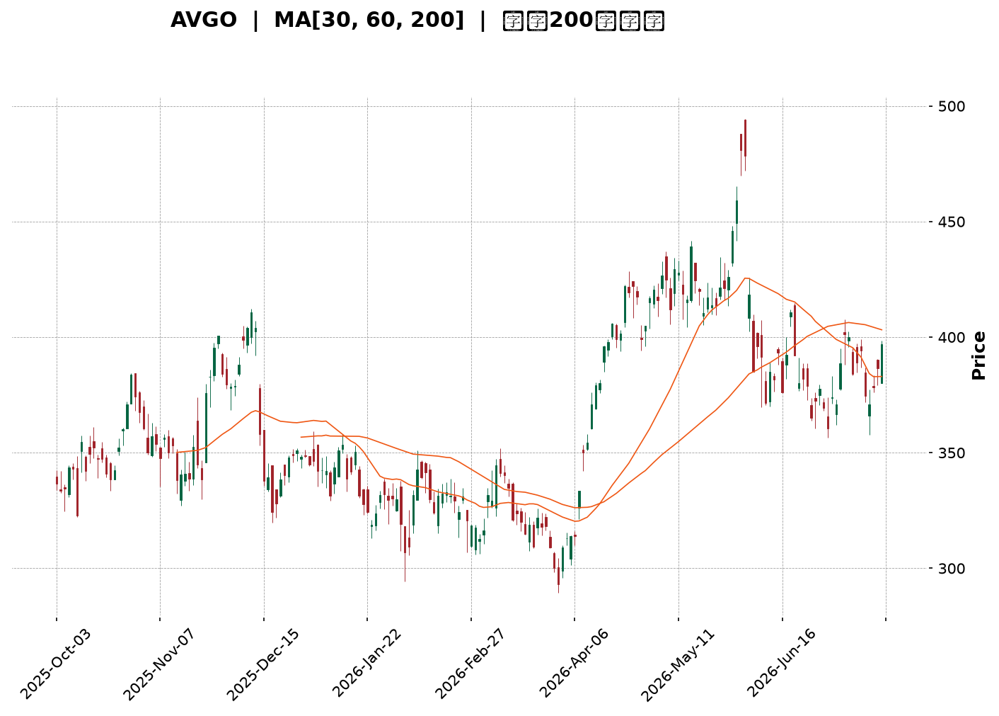
</details>

<html>
<head><meta charset="utf-8" /></head>
<body>
    <div style="height:500px; width:100%;">                        <script>window.PlotlyConfig = {MathJaxConfig: 'local'};</script>
        <script charset="utf-8" src="https://cdn.plot.ly/plotly-3.7.0.min.js" integrity="sha256-jvTGqxNp8AGWEcvNLVuKr+8j5dGe9Yw51LQkmDH+IYA=" crossorigin="anonymous"></script>                <div id="candlestick-chart" class="plotly-graph-div" style="height:100%; width:100%;"></div>            <script>                window.PLOTLYENV=window.PLOTLYENV || {};                                if (document.getElementById("candlestick-chart")) {                    Plotly.newPlot(                        "candlestick-chart",                        [{"close":{"dtype":"f8","bdata":"AAAAoL8HdUAAAADg7Nl0QAAAAECQ6HRAAAAAYDF5dUAAAABAjnF1QAAAAEAiLXRAAAAA4GQrdkAAAAAgZWN1QAAAAODz1XVAAAAAYNICdkAAAACgIbZ1QAAAAACztHVAAAAAoAFMdUAAAADgdCZ1QAAAAODwZXVAAAAA4IACdkAAAABghIB2QAAAAGBDLndAAAAAgEP9d0AAAACg82V3QAAAAAAf+XZAAAAA4HiIdkAAAACgqN91QAAAAOCrT3ZAAAAAoLsZdkAAAADguLd1QAAAAMBIRnZAAAAAIPrfdUAAAADA2BN2QAAAAIBdIXVAAAAA4NJIdUAAAADg2Et1QAAAAICjKXVAAAAAIB4HdkAAAAAgMo51QAAAAKDdJHVAAAAAoKh9d0AAAAAAJu53QAAAAICrtXhAAAAA4G0LeUAAAADA2v53QAAAAOAYt3dAAAAAYNKnd0AAAABAga53QAAAACALQXhAAAAA4NXteEAAAACgaUB5QAAAAGCyqnlAAAAAgK9BeUAAAABAyV52QAAAAACpHnVAAAAAAF42dUAAAADgP0N0QAAAAICqgHRAAAAAQGkndUAAAABAJkN1QAAAAGCbwHVAAAAAQPTOdUAAAADgZu11QAAAACC5wXVAAAAAQA7JdUAAAADARo11QAAAAKCBpXVAAAAAwI1idUAAAAAAImh1QAAAACDUY3VAAAAA4Ce0dEAAAAAgQ3t1QAAAAGCt7nVAAAAAoO8UdkAAAAAASCp1QAAAAEAtXHVAAAAA4LTmdUAAAACgEbZ0QAAAAOB9eXRAAAAA4LlEdEAAAACAAe5zQAAAACCGOnRAAAAAABm5dEAAAABgRcB0QAAAAEBCmHRAAAAAQFihdEAAAADgUJ50QAAAAAB48nNAAAAA4LUuc0AAAAAg7VVzQAAAAKAru3RAAAAAwNdqdUAAAABgDDN1QAAAAEAIWHVAAAAA4EWfdEAAAAAAoD90QAAAAMActXRAAAAAQJPEdEAAAAAAOsx0QAAAAKDdtnRAAAAAoAqSdEAAAADguUR0QAAAACBysXRAAAAAAE8IdEAAAAAACeZzQAAAAOBl2nNAAAAAwAKLc0AAAABg1cVzQAAAAEDHuHRAAAAAAEaUdEAAAABgsod1QAAAAKApVXVAAAAA4A9FdUAAAACAyut0QAAAAGCkD3RAAAAA4KM7dEAAAACAFwJ0QAAAAOBTrHNAAAAAgKjqc0AAAAAg7VVzQAAAAKABIHRAAAAAwJfcc0AAAABA5uRzQAAAAKDlTnNAAAAAIEfDckAAAABAJE9yQAAAAMBVUHNAAAAAAOqPc0AAAADg2KBzQAAAACDunnNAAAAAgBPXdEAAAAAgN+F1QAAAAECWJXZAAAAA4Gcvd0AAAAAgZrJ3QAAAAEDawndAAAAAYH3BeEAAAAAgct14QAAAAKBcXnlAAAAA4PnveEAAAABgjRh5QAAAAMC2X3pAAAAAQGw0ekAAAADAeGF6QAAAAICgGHpAAAAAwCvzeEAAAAAA80x5QAAAAIBTDHpAAAAAINRJekAAAABAeP15QAAAAID0qnpAAAAAoEiMekAAAACAh755QAAAAOAg1XpAAAAAQAy8ekAAAADgMip6QAAAAEAaAnpAAAAAYIVxe0AAAABASoh6QAAAACC5QHpAAAAAILqmeUAAAAAgmRF6QAAAAICj3nlAAAAAAMXXeUAAAACgfVV6QAAAAAAYU3pAAAAAoH6eekAAAABABuF7QAAAAADks3xAAAAA4PEMfkAAAABgkOd9QAAAAAD4I3pAAAAAgO0ReEAAAACgkr94QAAAACCleHhAAAAAQDE4d0AAAAAgXw94QAAAAOB113dAAAAAgBSVeEAAAADg1YF3QAAAAGB3hHhAAAAAQDOreUAAAACAFIJ4QAAAAGBmwndAAAAAwB7hd0AAAABgj653QAAAAOBR0HZAAAAAQDNHd0AAAAAAAJx3QAAAAKBwFXdAAAAAQDOHdkAAAABgZl53QAAAAOB6LHdAAAAAQApLeEAAAACAwhF5QAAAACCF\u002f3hAAAAAwMwAeEAAAACAwlF4QAAAAOB6pHhAAAAAQDNnd0AAAACgRy13QAAAAGCPondAAAAAAAAoeEAAAADA9cx4QA=="},"high":{"dtype":"f8","bdata":"X6Hd2rBndUBNXe8mZWN1QNIV75GcA3VAd8CRgr2JdUCdIBna\u002fZV1QMGgaZBWynVAhv7s8ghWdkALQHe2c8t1QLlFjWlaVnZAtObfgXOTdkBO6mmwOdB1QHAHOtmkKXZAZ20AOEvSdUBKC70hIaF1QJDjhrQ3inVAOcgf8NlEdkD0S2alp4t2QMsEZx6bP3dASs8wFjgFeECh8jM18gN4QL6jjXhXi3dAYl+z+ixMd0BGgMFXTe52QC\u002fOac1irXZA2IKEcJaXdkDcsJLkYwh2QMkC9n\u002fmX3ZAa40u1fh9dkCB2BjP6012QBLq+F1G+XVAR8F8tBltdUD7marBy+N1QIxF\u002fRt+oHVAROgQtPdadkCGtTAav193QPAfnkGEqnVAPobhR\u002fC9d0BsFOHceB94QIstp79D2nhAPF801hAMeUDCu6RMdpN4QLcVWc7pdHhACf8tDLbCd0BESSyXAtx3QEbZbOZjdXhAQzkK1FJQeUBdmCtkmEp5QMDwhVDKxHlAFLBZ3k1weUCDxCU38L13QAdrkbm4f3ZAAthmuQOZdUD\u002fCO9+2op1QGC6BX6E4nRAZZMdd5NYdUDwWRX+gY91QGSCyD8zzXVAgsgf8An5dUBHabaJQf91QA4Ikh610HVAaEnHVCv2dUBgPwDNiMl1QHfONXdhdXZA7BWlt6EbdkChYUaATbx1QG2VZCuqxnVAhL\u002fHoLJmdUCY75Ue16F1QOA4JDieCXZAVD95w7pidkDlqVllctZ1QCx8S4FYxnVAx7hJqFcTdkDf0KzzHYJ1QPSauqQU6XRAYWqK\u002fgz8dEAvzBiW7gx0QAndZyyUd3RAquV8goDYdEC3YtTm3yt1QN6mDed463RAIJBBBVcPdUDYD\u002fO1Oe10QHiQvpR\u002fGnVAKzUW2WXlc0C5ETIsTlV0QLabVvtT3HRA+H6\u002f2L\u002fwdUDyf\u002f1Suat1QIO+wMDPnnVAM8U8E06QdUAsuQvSfNF0QHd+Y55I6HRAB1P8DT0KdUDe0+tZKhN1QNkWe5rJLXVACVioVB8UdUB\u002f6UU7rnF0QLkOiqHV6nRAmDQnAxpWdEAA6ip8Ne1zQLwE1qjY7XNABeNE9Yerc0DpMBMuSxd0QHMgb4Mu7nRAyhiJ\u002fvxjdUC+TVwvYLN1QAXuUcCA\u002fXVA8gpzIqeIdUDcHBX5Uil1QNX2d9FAEXVAzSy5aN5\u002fdEBhtALZz2N0QMH1OentQ3RATtjuL1YhdEBZdEXDRwV0QBw0Fw5tX3RAP5EItDI+dEDZsUu3mTx0QKPKnhS1xnNAZlCsuzkwc0Cud6w4nQRzQL\u002fWfFIdXXNAgfAU\u002fae0c0DqygF4FaNzQEnp0n9mvnNAKT7ClfPZdEAU3EBoSRl2QNt\u002fMJghYnZAG5Yjg0d\u002fd0DXWtdwIcR3QI6HiIrQ2ndAUfuFiz3HeEDeAytrxvB4QPriLqVlYXlAWS8kzXFceUCsxZleZS95QItPohCAaHpAKielGhvKekC5R4NAQYV6QG2F\u002fcxPYXpAC4R0K7NSeUA9NC0F\u002fE95QDzw55mAG3pA4clNZAVoekABvbZukHJ6QBd6zHhIC3tACC0WZ9BPe0Cl2PGWDp16QGVNWYMAJXtAYy21lm8Pe0Di0WDElcp6QBQZQfd+H3pADFq2XZOae0D6uipuBAJ7QJgk9ZV9VXpAOYY3GKIUekB+dC4D\u002f3d6QKgz0QpTWXpAIbrmojg1ekCu5CJL9Cl7QCtmx3DbAXtA8IJ8LwTQekC5Esj2DAN8QPtNz0UEFX1ApvNf88KAfkCtK1EufON+QHWn5MDlnHpA5Q1TDZ+deUBlTI88QSN5QHvwOpGbc3lAZM99ozQTeEBPVxnwJk54QCUGYmryBXhADxtL3y65eEBCBxIFvHJ4QMnNyTZFAHlAn\u002fEqI8TAeUAAAACAPep5QAAAAOBRcHhAAAAAANdLeEAAAADAzEx4QAAAAEAKW3dAAAAAIFyDd0AAAACA67l3QAAAAAAAXHdAAAAAAABgd0AAAABgj\u002fJ3QAAAACBcT3dAAAAAoHCxeEAAAADgUXh5QAAAAEAKJ3lAAAAAAAC8eEAAAACgR9V4QAAAAAAA8HhAAAAAANcreEAAAACgmZV3QAAAAKBw+XdAAAAAoEdpeEAAAACgcOl4QA=="},"hovertemplate":"\u003cb\u003e%{x|%Y-%m-%d}\u003c\u002fb\u003e\u003cbr\u003e\u958b: $%{open:.2f}\u003cbr\u003e\u9ad8: $%{high:.2f}\u003cbr\u003e\u4f4e: $%{low:.2f}\u003cbr\u003e\u6536: $%{close:.2f}\u003cextra\u003e\u003c\u002fextra\u003e","low":{"dtype":"f8","bdata":"KF\u002fMKOfddEBl64jaIMt0QFGo\u002fuIoTHRAriQN4kKsdEDUX2s1DCh1QM+oar3nI3RA\u002fE0bXLBZdUDuEaBDHRx1QD4SLK0DmXVA6UYbX624dUAY+bAKGC51QP+lDpVsnnVAE0vl0IY2dUAjj7N2Ptp0QDQV0CsMKHVAdt3TD8vOdUB\u002fTP1ZnhF2QOumG3AniHZAR8ruk8Mxd0CQd22R9v92QDCr3ocLsXZADD3CQmd\u002fdkAtWgfVs9B1QKRngE05wnVA0zzP3ejrdUAzf\u002f4SP\u002fZ0QITFzwgkCnZA2YanpYq7dUBl2DKuhdt1QPCYA5rDxHRAd4jcYJ5zdEBHN515Ofp0QGgMt2c+2nRAN7p+4a3+dEC5CX0PGnR1QE2Hj942n3RARW9yhI+bdUA2Ga5C2hp3QIEdw2b80XdAbEQGhSWveEB3fpweQ+93QAmDiKHGmndA4OjsmlkJd0DcnUL452Z3QPkYB7AO8HdANqNtFfeyeEDpu0\u002fS5JR4QCi0OxtV1XhA9zjGRuR\u002feEDIioV8uxJ2QJYxTsAQ+nRAcRc3cBXTdEBD1LhgD\u002fpzQP4IXyo5HXRAorM195+rdECJjeu2t\u002f90QOt+o47CFHVAj0M17dqddUBZH2U4lKd1QCksvIfMdnVA+76\u002fpEnAdUB6o+S4b4J1QDpf89eqhHVACy9FZz30dEBXhGvdJgx1QPcYYS1b6nRAE5YWhJeUdECvyUNuasR0QJwMQsUtO3VA8LE\u002fH\u002fTZdUBerL0aFdN0QPP+UAuoRnVAIDQXp5hsdUCH\u002fdfGUKl0QPkI24YpMHRAG6r9ZCk7dEDjm3+LUI9zQN0oax3zxnNAAGPPvR1ddECNPOjwA1h0QJtdahis8XNAOrcMxv9xdEBlhtPz3kh0QIZx0VZGOHNAwYFIi3VjckDnKYKmMBlzQKFP1tg5snNAlZ1mqvuWdEAeTBzFeyl1QI1bVtk9yHRAd7YWdJuFdEDfOVUX+Td0QNe9\u002fZxisnNA7rSzyHZgdECq1TkLhYd0QJEp0QbthXRAg4IpNwRCdECsjRMXvJRzQFo00MwkgXRAblurAswsc0CwkknQy01zQEwAcw8pIXNAm+SVT1kkc0CsdeGKiGlzQLxmjKyCHXRAvrdUjSxjdEDgHCC0wSZ0QIbmOYLJOHVAqSJ1nKgPdUDldpJMsa90QPQhZDkBBHRA35RuTyruc0AX3a3IXsFzQErJbRZFpnNAiluYMgs2c0DJPY9ehUxzQMeRW+\u002fqpnNAbziD1Hqlc0AnTwsng8NzQD\u002f5Pj7nSnNA3JcNF12mckDUZ55UBxhyQDMtmp3yfXJAIAxCm9Rfc0AbjYz4XtRyQNC1S5yiXHNArapD5akUdEAoM+3s0V91QC93KvIc73VAv4FHU\u002f+DdkBFNpG4Vg53QJZVG\u002f6ae3dATtDyKl8PeEDKlDQ8rnt4QMXjBA\u002fa8nhAgbuG5GO0eEBQua\u002fwJJ94QFFYlAWGQ3lA25XWmTwSekAWkD43bIN5QLdAQNuY33lAkYj1BmygeEDtO7q9csJ4QKp1T891OXlApAHB5wfKeUBWqdA8II55QPKby3f\u002fKnpAowso1OoRekDyn2kEh1p5QIk74m6I1XlA86GBoA2GekC5c\u002fn7O3x5QMn8oLqQQnlAE4fgwe7ueUD9w+aiLzJ6QK\u002fy8Yhx23lA6QG3mH9TeUCQjtKIUax5QBnjsxefnXlAUPHWD\u002f2YeUDWyiANdQV6QFpc50FP\u002fXlATKSnW7HVeUDPVaWGnOx6QHxDvOJWmHtALL1WKHdbfUBFiyBnSn59QCamdYn4JXlA3Fz\u002f57APeEA+2A+btGt4QNKNYqvqG3dA0gDvBFYpd0BAXc1Xbh93QPgJjfB3hndAJ1sRcMY\u002feEBMND1+1313QEi+ibe54HdAngG6w9RLeUAAAABgj354QAAAAGCPindAAAAAIFyPd0AAAABAM0t3QAAAAKBHvXZAAAAAIFyHdkAAAACAPSp3QAAAAOB6AHdAAAAAQOFGdkAAAABA4TJ3QAAAAAApoHZAAAAAgD2Od0AAAABA4T54QAAAAEAzu3hAAAAAYLj2d0AAAACAPQp4QAAAAADXK3hAAAAAYGY+d0AAAADAzFx2QAAAACBcf3dAAAAAIIWzd0AAAAAAAMB3QA=="},"name":"\u50f9\u683c","open":{"dtype":"f8","bdata":"xd9hrYw5dUCPThpvxOB0QEgo+pht8nRARR2evVq\u002fdEB88xq2K311QGTxxl1xd3VAucjgNd3sdUA4fRYq3MJ1QCGLy7LpB3ZAyR2MQvwsdkBFucwblrp1QFKoBqlA\u002fXVA81H\u002fs8rAdUCRHNIW1ZV1QDQV0CsMKHVADsWqWrrodUBGEB8kZ3h2QCmUMgKWiXZAR8ruk8Mxd0Ch8jM18gN4QAFhryaXgndABi41adQed0AOMPoMWkh2QIEQiOrzznVA622oUqZhdkCTVRg4dQN2QJeqds98PnZAzIh+HINPdkC8KSkht0B2QGEX8jXu2XVA7lelvfaZdEBFmkPZ0R51QN+XGB6ZVHVAHAZ51PosdUAwXfqQXb92QGJXsIfIc3VAhH9aq6ycdUAUrGSojux3QBes6OBr9ndAkdlxx\u002f3ReECua4mPZIp4QDv4cgZWInhA3\u002fCNzB2ed0DF40yd76h3QOKgamdJAHhAGynK38oDeUB33ALdcch4QG4p8FdW\u002f3hAXiwqxy4peUAgaTHoep13QB93SLz4fXZANIlgplvidED\u002fCO9+2op1QHiXUk0K4nRA0g0Enre3dEA+xTgGKYx1QK4PoE7yOHVAsvk3T3LWdUDz+Og1WNx1QOpjgtIKt3VAZLEy8vfKdUDnUT2uJMd1QPy5mW3D93VAZNa5MwIXdkAR\u002fypObGV1QINgNm8iR3VAi\u002f1pyFlYdUAcSNtb4Ap1QJwMQsUtO3VAWMrEoVv5dUDPZ5kgB7t1QI8sayxrvXVA7qOKZ\u002fyPdUCSdaK+ZG11QHMrs0B15HRAqGj6RejhdECDk0zGDOJzQJ0I2ioF6nNAQHvkrMuIdEDTJAaqsxl1QOdpYF1utXRAr1SnnISzdEDghm0KnE50QDoTlq0Q+HRAKzUW2WXlc0D0spAs+5JzQCZoxZjN7nNALfaZXOWYdEDzkjORHaN1QHjWPERvmHVAWViLzhZpdUCoy\u002fHkOop0QHaWm3Mb6HNAqeOsG\u002fiEdEDjGIC7mrx0QNx9Fhw+snRADrNzSX2wdEAxEu4YsxV0QK0pGvpqmHRAzV78ltNUdEDeHlqK9FhzQLHAz9aXQ3NASVOgwJ59c0AtTMKPV6hzQB8tp499j3RAGjqq0jNxdEBs3897yGB0QMs5+aszt3VAs7GValJVdUANOE7EAQh1QFcJhPAMB3VABxrS1ixNdEAP6V7aB0l0QABy\u002fDkQ9HNAuzPeyit1c0DPLKUoH+9zQLbGptD113NA0k6fzuj3c0Bar6+oSCF0QKgK6llhmHNAbs66VDIpc0CuyecWUMZyQAee+r+rrnJAsCLSRv+Nc0AuGZs8JABzQPd0Hoz+qHNAZrhlXGtjdEBUxEZgG\u002fN1QMKqooTk+3VAYmRzDOqFdkBhXlXONhF3QJOnGmTYlHdA+tmCBTlUeECr0W91A6Z4QPNq\u002fqBDBHlANOgpVvFQeUAjYCU9dux4QHebwOxjZXlAgRaFpI9bekBsDqKB74R6QMrRM54MPXpAkQemxNb6eEBzqg9fzC15QA4JuXzQ7XlAOcak8PHmeUBFXxM+8hh6QOnGV0TmT3pAw97Jn\u002fIte0CTV8qQdFJ6QLJmtaQvMnpAPpAgvhuvekDjxdukLGx6QGRWz3dy8nlAPwvy4CQBekD6uipuBAJ7QPKKINjnS3pABhguN8KSeUDLW73phcJ5QKLpGBpYznlA6bhE0UgNekAx58NXax16QFqfGXlfhnpAN02wtZdHekAyBmgSQQR7QPB0mnIPFnxAOIgURUiAfkC7rtd6+N9+QO238dR\u002fhXlAIWvwQXRveUDNCRiJvR95QCMEyxWbD3lA7A7cyFrOd0CMj2+msUN3QFZhG5LR8XdAqX6WFimueED39xZ\u002ffll4QDkDiz6IQXhAUTXBtOyOeUAAAABgj9p5QAAAAIDrnXdAAAAAgOspeEAAAACgRyl4QAAAAEAzJ3dAAAAAgOtZd0AAAADgo2x3QAAAAIDrPXdAAAAAIK7bdkAAAACAwll3QAAAAMD16HZAAAAA4FGYd0AAAABACiN5QAAAAAAA6HhAAAAAIK6XeEAAAAAghbt4QAAAAKBwwXhAAAAA4KMIeEAAAADAzOB2QAAAAAAprHdAAAAAIFxjeEAAAABAM8N3QA=="},"x":["2025-10-03T00:00:00-04:00","2025-10-06T00:00:00-04:00","2025-10-07T00:00:00-04:00","2025-10-08T00:00:00-04:00","2025-10-09T00:00:00-04:00","2025-10-10T00:00:00-04:00","2025-10-13T00:00:00-04:00","2025-10-14T00:00:00-04:00","2025-10-15T00:00:00-04:00","2025-10-16T00:00:00-04:00","2025-10-17T00:00:00-04:00","2025-10-20T00:00:00-04:00","2025-10-21T00:00:00-04:00","2025-10-22T00:00:00-04:00","2025-10-23T00:00:00-04:00","2025-10-24T00:00:00-04:00","2025-10-27T00:00:00-04:00","2025-10-28T00:00:00-04:00","2025-10-29T00:00:00-04:00","2025-10-30T00:00:00-04:00","2025-10-31T00:00:00-04:00","2025-11-03T00:00:00-05:00","2025-11-04T00:00:00-05:00","2025-11-05T00:00:00-05:00","2025-11-06T00:00:00-05:00","2025-11-07T00:00:00-05:00","2025-11-10T00:00:00-05:00","2025-11-11T00:00:00-05:00","2025-11-12T00:00:00-05:00","2025-11-13T00:00:00-05:00","2025-11-14T00:00:00-05:00","2025-11-17T00:00:00-05:00","2025-11-18T00:00:00-05:00","2025-11-19T00:00:00-05:00","2025-11-20T00:00:00-05:00","2025-11-21T00:00:00-05:00","2025-11-24T00:00:00-05:00","2025-11-25T00:00:00-05:00","2025-11-26T00:00:00-05:00","2025-11-28T00:00:00-05:00","2025-12-01T00:00:00-05:00","2025-12-02T00:00:00-05:00","2025-12-03T00:00:00-05:00","2025-12-04T00:00:00-05:00","2025-12-05T00:00:00-05:00","2025-12-08T00:00:00-05:00","2025-12-09T00:00:00-05:00","2025-12-10T00:00:00-05:00","2025-12-11T00:00:00-05:00","2025-12-12T00:00:00-05:00","2025-12-15T00:00:00-05:00","2025-12-16T00:00:00-05:00","2025-12-17T00:00:00-05:00","2025-12-18T00:00:00-05:00","2025-12-19T00:00:00-05:00","2025-12-22T00:00:00-05:00","2025-12-23T00:00:00-05:00","2025-12-24T00:00:00-05:00","2025-12-26T00:00:00-05:00","2025-12-29T00:00:00-05:00","2025-12-30T00:00:00-05:00","2025-12-31T00:00:00-05:00","2026-01-02T00:00:00-05:00","2026-01-05T00:00:00-05:00","2026-01-06T00:00:00-05:00","2026-01-07T00:00:00-05:00","2026-01-08T00:00:00-05:00","2026-01-09T00:00:00-05:00","2026-01-12T00:00:00-05:00","2026-01-13T00:00:00-05:00","2026-01-14T00:00:00-05:00","2026-01-15T00:00:00-05:00","2026-01-16T00:00:00-05:00","2026-01-20T00:00:00-05:00","2026-01-21T00:00:00-05:00","2026-01-22T00:00:00-05:00","2026-01-23T00:00:00-05:00","2026-01-26T00:00:00-05:00","2026-01-27T00:00:00-05:00","2026-01-28T00:00:00-05:00","2026-01-29T00:00:00-05:00","2026-01-30T00:00:00-05:00","2026-02-02T00:00:00-05:00","2026-02-03T00:00:00-05:00","2026-02-04T00:00:00-05:00","2026-02-05T00:00:00-05:00","2026-02-06T00:00:00-05:00","2026-02-09T00:00:00-05:00","2026-02-10T00:00:00-05:00","2026-02-11T00:00:00-05:00","2026-02-12T00:00:00-05:00","2026-02-13T00:00:00-05:00","2026-02-17T00:00:00-05:00","2026-02-18T00:00:00-05:00","2026-02-19T00:00:00-05:00","2026-02-20T00:00:00-05:00","2026-02-23T00:00:00-05:00","2026-02-24T00:00:00-05:00","2026-02-25T00:00:00-05:00","2026-02-26T00:00:00-05:00","2026-02-27T00:00:00-05:00","2026-03-02T00:00:00-05:00","2026-03-03T00:00:00-05:00","2026-03-04T00:00:00-05:00","2026-03-05T00:00:00-05:00","2026-03-06T00:00:00-05:00","2026-03-09T00:00:00-04:00","2026-03-10T00:00:00-04:00","2026-03-11T00:00:00-04:00","2026-03-12T00:00:00-04:00","2026-03-13T00:00:00-04:00","2026-03-16T00:00:00-04:00","2026-03-17T00:00:00-04:00","2026-03-18T00:00:00-04:00","2026-03-19T00:00:00-04:00","2026-03-20T00:00:00-04:00","2026-03-23T00:00:00-04:00","2026-03-24T00:00:00-04:00","2026-03-25T00:00:00-04:00","2026-03-26T00:00:00-04:00","2026-03-27T00:00:00-04:00","2026-03-30T00:00:00-04:00","2026-03-31T00:00:00-04:00","2026-04-01T00:00:00-04:00","2026-04-02T00:00:00-04:00","2026-04-06T00:00:00-04:00","2026-04-07T00:00:00-04:00","2026-04-08T00:00:00-04:00","2026-04-09T00:00:00-04:00","2026-04-10T00:00:00-04:00","2026-04-13T00:00:00-04:00","2026-04-14T00:00:00-04:00","2026-04-15T00:00:00-04:00","2026-04-16T00:00:00-04:00","2026-04-17T00:00:00-04:00","2026-04-20T00:00:00-04:00","2026-04-21T00:00:00-04:00","2026-04-22T00:00:00-04:00","2026-04-23T00:00:00-04:00","2026-04-24T00:00:00-04:00","2026-04-27T00:00:00-04:00","2026-04-28T00:00:00-04:00","2026-04-29T00:00:00-04:00","2026-04-30T00:00:00-04:00","2026-05-01T00:00:00-04:00","2026-05-04T00:00:00-04:00","2026-05-05T00:00:00-04:00","2026-05-06T00:00:00-04:00","2026-05-07T00:00:00-04:00","2026-05-08T00:00:00-04:00","2026-05-11T00:00:00-04:00","2026-05-12T00:00:00-04:00","2026-05-13T00:00:00-04:00","2026-05-14T00:00:00-04:00","2026-05-15T00:00:00-04:00","2026-05-18T00:00:00-04:00","2026-05-19T00:00:00-04:00","2026-05-20T00:00:00-04:00","2026-05-21T00:00:00-04:00","2026-05-22T00:00:00-04:00","2026-05-26T00:00:00-04:00","2026-05-27T00:00:00-04:00","2026-05-28T00:00:00-04:00","2026-05-29T00:00:00-04:00","2026-06-01T00:00:00-04:00","2026-06-02T00:00:00-04:00","2026-06-03T00:00:00-04:00","2026-06-04T00:00:00-04:00","2026-06-05T00:00:00-04:00","2026-06-08T00:00:00-04:00","2026-06-09T00:00:00-04:00","2026-06-10T00:00:00-04:00","2026-06-11T00:00:00-04:00","2026-06-12T00:00:00-04:00","2026-06-15T00:00:00-04:00","2026-06-16T00:00:00-04:00","2026-06-17T00:00:00-04:00","2026-06-18T00:00:00-04:00","2026-06-22T00:00:00-04:00","2026-06-23T00:00:00-04:00","2026-06-24T00:00:00-04:00","2026-06-25T00:00:00-04:00","2026-06-26T00:00:00-04:00","2026-06-29T00:00:00-04:00","2026-06-30T00:00:00-04:00","2026-07-01T00:00:00-04:00","2026-07-02T00:00:00-04:00","2026-07-06T00:00:00-04:00","2026-07-07T00:00:00-04:00","2026-07-08T00:00:00-04:00","2026-07-09T00:00:00-04:00","2026-07-10T00:00:00-04:00","2026-07-13T00:00:00-04:00","2026-07-14T00:00:00-04:00","2026-07-15T00:00:00-04:00","2026-07-16T00:00:00-04:00","2026-07-17T00:00:00-04:00","2026-07-20T00:00:00-04:00","2026-07-21T00:00:00-04:00","2026-07-22T00:00:00-04:00"],"type":"candlestick"},{"hovertemplate":"MA30: $%{y:.2f}\u003cextra\u003e\u003c\u002fextra\u003e","line":{"color":"#2196F3","dash":"dash","width":2},"mode":"lines","name":"MA30","x":["2025-10-03T00:00:00-04:00","2025-10-06T00:00:00-04:00","2025-10-07T00:00:00-04:00","2025-10-08T00:00:00-04:00","2025-10-09T00:00:00-04:00","2025-10-10T00:00:00-04:00","2025-10-13T00:00:00-04:00","2025-10-14T00:00:00-04:00","2025-10-15T00:00:00-04:00","2025-10-16T00:00:00-04:00","2025-10-17T00:00:00-04:00","2025-10-20T00:00:00-04:00","2025-10-21T00:00:00-04:00","2025-10-22T00:00:00-04:00","2025-10-23T00:00:00-04:00","2025-10-24T00:00:00-04:00","2025-10-27T00:00:00-04:00","2025-10-28T00:00:00-04:00","2025-10-29T00:00:00-04:00","2025-10-30T00:00:00-04:00","2025-10-31T00:00:00-04:00","2025-11-03T00:00:00-05:00","2025-11-04T00:00:00-05:00","2025-11-05T00:00:00-05:00","2025-11-06T00:00:00-05:00","2025-11-07T00:00:00-05:00","2025-11-10T00:00:00-05:00","2025-11-11T00:00:00-05:00","2025-11-12T00:00:00-05:00","2025-11-13T00:00:00-05:00","2025-11-14T00:00:00-05:00","2025-11-17T00:00:00-05:00","2025-11-18T00:00:00-05:00","2025-11-19T00:00:00-05:00","2025-11-20T00:00:00-05:00","2025-11-21T00:00:00-05:00","2025-11-24T00:00:00-05:00","2025-11-25T00:00:00-05:00","2025-11-26T00:00:00-05:00","2025-11-28T00:00:00-05:00","2025-12-01T00:00:00-05:00","2025-12-02T00:00:00-05:00","2025-12-03T00:00:00-05:00","2025-12-04T00:00:00-05:00","2025-12-05T00:00:00-05:00","2025-12-08T00:00:00-05:00","2025-12-09T00:00:00-05:00","2025-12-10T00:00:00-05:00","2025-12-11T00:00:00-05:00","2025-12-12T00:00:00-05:00","2025-12-15T00:00:00-05:00","2025-12-16T00:00:00-05:00","2025-12-17T00:00:00-05:00","2025-12-18T00:00:00-05:00","2025-12-19T00:00:00-05:00","2025-12-22T00:00:00-05:00","2025-12-23T00:00:00-05:00","2025-12-24T00:00:00-05:00","2025-12-26T00:00:00-05:00","2025-12-29T00:00:00-05:00","2025-12-30T00:00:00-05:00","2025-12-31T00:00:00-05:00","2026-01-02T00:00:00-05:00","2026-01-05T00:00:00-05:00","2026-01-06T00:00:00-05:00","2026-01-07T00:00:00-05:00","2026-01-08T00:00:00-05:00","2026-01-09T00:00:00-05:00","2026-01-12T00:00:00-05:00","2026-01-13T00:00:00-05:00","2026-01-14T00:00:00-05:00","2026-01-15T00:00:00-05:00","2026-01-16T00:00:00-05:00","2026-01-20T00:00:00-05:00","2026-01-21T00:00:00-05:00","2026-01-22T00:00:00-05:00","2026-01-23T00:00:00-05:00","2026-01-26T00:00:00-05:00","2026-01-27T00:00:00-05:00","2026-01-28T00:00:00-05:00","2026-01-29T00:00:00-05:00","2026-01-30T00:00:00-05:00","2026-02-02T00:00:00-05:00","2026-02-03T00:00:00-05:00","2026-02-04T00:00:00-05:00","2026-02-05T00:00:00-05:00","2026-02-06T00:00:00-05:00","2026-02-09T00:00:00-05:00","2026-02-10T00:00:00-05:00","2026-02-11T00:00:00-05:00","2026-02-12T00:00:00-05:00","2026-02-13T00:00:00-05:00","2026-02-17T00:00:00-05:00","2026-02-18T00:00:00-05:00","2026-02-19T00:00:00-05:00","2026-02-20T00:00:00-05:00","2026-02-23T00:00:00-05:00","2026-02-24T00:00:00-05:00","2026-02-25T00:00:00-05:00","2026-02-26T00:00:00-05:00","2026-02-27T00:00:00-05:00","2026-03-02T00:00:00-05:00","2026-03-03T00:00:00-05:00","2026-03-04T00:00:00-05:00","2026-03-05T00:00:00-05:00","2026-03-06T00:00:00-05:00","2026-03-09T00:00:00-04:00","2026-03-10T00:00:00-04:00","2026-03-11T00:00:00-04:00","2026-03-12T00:00:00-04:00","2026-03-13T00:00:00-04:00","2026-03-16T00:00:00-04:00","2026-03-17T00:00:00-04:00","2026-03-18T00:00:00-04:00","2026-03-19T00:00:00-04:00","2026-03-20T00:00:00-04:00","2026-03-23T00:00:00-04:00","2026-03-24T00:00:00-04:00","2026-03-25T00:00:00-04:00","2026-03-26T00:00:00-04:00","2026-03-27T00:00:00-04:00","2026-03-30T00:00:00-04:00","2026-03-31T00:00:00-04:00","2026-04-01T00:00:00-04:00","2026-04-02T00:00:00-04:00","2026-04-06T00:00:00-04:00","2026-04-07T00:00:00-04:00","2026-04-08T00:00:00-04:00","2026-04-09T00:00:00-04:00","2026-04-10T00:00:00-04:00","2026-04-13T00:00:00-04:00","2026-04-14T00:00:00-04:00","2026-04-15T00:00:00-04:00","2026-04-16T00:00:00-04:00","2026-04-17T00:00:00-04:00","2026-04-20T00:00:00-04:00","2026-04-21T00:00:00-04:00","2026-04-22T00:00:00-04:00","2026-04-23T00:00:00-04:00","2026-04-24T00:00:00-04:00","2026-04-27T00:00:00-04:00","2026-04-28T00:00:00-04:00","2026-04-29T00:00:00-04:00","2026-04-30T00:00:00-04:00","2026-05-01T00:00:00-04:00","2026-05-04T00:00:00-04:00","2026-05-05T00:00:00-04:00","2026-05-06T00:00:00-04:00","2026-05-07T00:00:00-04:00","2026-05-08T00:00:00-04:00","2026-05-11T00:00:00-04:00","2026-05-12T00:00:00-04:00","2026-05-13T00:00:00-04:00","2026-05-14T00:00:00-04:00","2026-05-15T00:00:00-04:00","2026-05-18T00:00:00-04:00","2026-05-19T00:00:00-04:00","2026-05-20T00:00:00-04:00","2026-05-21T00:00:00-04:00","2026-05-22T00:00:00-04:00","2026-05-26T00:00:00-04:00","2026-05-27T00:00:00-04:00","2026-05-28T00:00:00-04:00","2026-05-29T00:00:00-04:00","2026-06-01T00:00:00-04:00","2026-06-02T00:00:00-04:00","2026-06-03T00:00:00-04:00","2026-06-04T00:00:00-04:00","2026-06-05T00:00:00-04:00","2026-06-08T00:00:00-04:00","2026-06-09T00:00:00-04:00","2026-06-10T00:00:00-04:00","2026-06-11T00:00:00-04:00","2026-06-12T00:00:00-04:00","2026-06-15T00:00:00-04:00","2026-06-16T00:00:00-04:00","2026-06-17T00:00:00-04:00","2026-06-18T00:00:00-04:00","2026-06-22T00:00:00-04:00","2026-06-23T00:00:00-04:00","2026-06-24T00:00:00-04:00","2026-06-25T00:00:00-04:00","2026-06-26T00:00:00-04:00","2026-06-29T00:00:00-04:00","2026-06-30T00:00:00-04:00","2026-07-01T00:00:00-04:00","2026-07-02T00:00:00-04:00","2026-07-06T00:00:00-04:00","2026-07-07T00:00:00-04:00","2026-07-08T00:00:00-04:00","2026-07-09T00:00:00-04:00","2026-07-10T00:00:00-04:00","2026-07-13T00:00:00-04:00","2026-07-14T00:00:00-04:00","2026-07-15T00:00:00-04:00","2026-07-16T00:00:00-04:00","2026-07-17T00:00:00-04:00","2026-07-20T00:00:00-04:00","2026-07-21T00:00:00-04:00","2026-07-22T00:00:00-04:00"],"y":{"dtype":"f8","bdata":"AAAAAAAA+H8AAAAAAAD4fwAAAAAAAPh\u002fAAAAAAAA+H8AAAAAAAD4fwAAAAAAAPh\u002fAAAAAAAA+H8AAAAAAAD4fwAAAAAAAPh\u002fAAAAAAAA+H8AAAAAAAD4fwAAAAAAAPh\u002fAAAAAAAA+H8AAAAAAAD4fwAAAAAAAPh\u002fAAAAAAAA+H8AAAAAAAD4fwAAAAAAAPh\u002fAAAAAAAA+H8AAAAAAAD4fwAAAAAAAPh\u002fAAAAAAAA+H8AAAAAAAD4fwAAAAAAAPh\u002fAAAAAAAA+H8AAAAAAAD4fwAAAAAAAPh\u002fAAAAAAAA+H8AAAAAAAD4fzMzM+Mb4nVAIiIiMkfkdUBERERUE+h1QDMzM6M+6nVAq6qquvnudUAAAAAg7u91QKuqqhow+HVAERERoXYDdkCamZm5Jxl2QImIiNitMXZAVVVV5ZBLdkCJiIiIDl92QAAAABA0cHZA7+7unlSEdkAiIiKi7pl2QAAAAGBNsnZAvLu7mzbLdkDv7u4ureJ2QFVVVRXk93ZAvLu7e7QCd0De3d3N7vl2QCIiIhIe6nZAiYiI6NjedkDv7u6uGdF2QERERLSqwXZARERE5Ja5dkAzMzMjtLV2QM3MzGw\u002fsXZAmpmZKa6wdkCamZkZZq92QM3MzHy+tHZAvLu7uwS5dkAAAAAQM7t2QBERERFUv3ZAmpmZyde5dkC8u7v7krh2QERERESsunZAVVVVteOidkB3d3dH\u002fo12QERERCRLdnZAq6qqqgJddkBERESk20R2QImIiLjCMHZAVVVVRcohdkB3d3c3cQh2QGZmZsYw6HVAMzMzk2vAdUBERES0AZN1QERERNSZZHVAVVVVJeo9dUAzMzPzGDB1QO\u002fu7g6eK3VAZmZmZqYmdUAAAACAryl1QFVVVRXyJHVA3t3dTR8UdUB3d3d3rgN1QKuqqor3+nRAIiIiQqH3dECrqqoKa\u002fF0QFVVVSXl7XRAEREREfjjdECJiIjo2Nh0QLy7u4vV0HRAZmZmdpHLdEAAAAAQX8Z0QM3MzBybwHRAERERAXi\u002fdECJiIgYHrV0QN7d3Q2LqnRAvLu7Ow6ZdEBVVVVVP450QKuqqlpjgXRAERER0UNtdEDv7u7OQWV0QKuqqtpdZ3RAiYiIqARqdEAAAACwrHd0QJqZmYkYgXRAZmZm5sKFdEBVVVVFNod0QJqZmXmognRAiYiImER\u002fdEC8u7t7D3p0QCIiIvK4d3RARERExPx9dEBERETE\u002fH10QDMzM7PQeHRAzczMTIprdEBVVVXlZmB0QAAAAOAHT3RAzczMDCo\u002fdEBERERknS50QEREROS4InRAvLu7+24YdEB3d3dHdA50QO\u002fu7n4fBXRAd3d3l2wHdEAAAACALBV0QKuqqhqUIXRAVVVVVXs8dEBmZmbW5Fx0QM3MzAw+fnRAq6qqmrmqdEAzMzPDLdZ0QAAAAODU\u002fXRAmpmZiQUjdUDNzMw8c0F1QBEREfF3bHVA7+7unpSWdUDv7u5+K8V1QN7d3V2r+HVAERERoesgdkBEREQUFU52QHd3d3d7hHZAmpmZydq6dkARERGxo\u002fN2QGZmZpZ4K3dAREREBIdkd0CrqqrKcpZ3QHd3d\u002fen1ndAmpmZia4aeEDv7u6Ot114QFVVVbXXlnhA7+7unhjaeEDNzMzMAhV5QCIiIqKaTXlAiYiIuKh2eUCJiIi4Z5p5QN7d3W0sunlAMzMzM9rQeUC8u7v7Wud5QImIiOg6\u002fXlAmpmZWSENekDNzMx82SZ6QO\u002fu7u5MQ3pAzczMzO5uekDv7u5u95d6QLy7u5v5lXpA7+7uLsKDekDNzMwc1HV6QGZmZmb2Z3pAERERUTJZekAiIiJSnE56QCIiIiLIO3pAZmZmNjktekAiIiIiCRh6QBEREaGvBXpAq6qq6i7+eUDNzMyMovN5QCIiIiJp2XlAIiIi4gvBeUBERETE26t5QKuqqlqZkHlAVVVVFQ5teUDNzMysHFR5QJqZmbkROXlAiYiIGGseeUDv7u7eYAd5QERERIRf8HhAd3d3FybjeEBmZmaWW9h4QEREROQJzXhAmpmZKbe2eECamZkJV5h4QGZmZmaxdXhAiYiI2Pc8eEBVVVUFjwN4QKuqqqot7ndAREREBOrud0ARERFBXO93QA=="},"type":"scatter"},{"hovertemplate":"MA60: $%{y:.2f}\u003cextra\u003e\u003c\u002fextra\u003e","line":{"color":"#9C27B0","dash":"dash","width":2},"mode":"lines","name":"MA60","x":["2025-10-03T00:00:00-04:00","2025-10-06T00:00:00-04:00","2025-10-07T00:00:00-04:00","2025-10-08T00:00:00-04:00","2025-10-09T00:00:00-04:00","2025-10-10T00:00:00-04:00","2025-10-13T00:00:00-04:00","2025-10-14T00:00:00-04:00","2025-10-15T00:00:00-04:00","2025-10-16T00:00:00-04:00","2025-10-17T00:00:00-04:00","2025-10-20T00:00:00-04:00","2025-10-21T00:00:00-04:00","2025-10-22T00:00:00-04:00","2025-10-23T00:00:00-04:00","2025-10-24T00:00:00-04:00","2025-10-27T00:00:00-04:00","2025-10-28T00:00:00-04:00","2025-10-29T00:00:00-04:00","2025-10-30T00:00:00-04:00","2025-10-31T00:00:00-04:00","2025-11-03T00:00:00-05:00","2025-11-04T00:00:00-05:00","2025-11-05T00:00:00-05:00","2025-11-06T00:00:00-05:00","2025-11-07T00:00:00-05:00","2025-11-10T00:00:00-05:00","2025-11-11T00:00:00-05:00","2025-11-12T00:00:00-05:00","2025-11-13T00:00:00-05:00","2025-11-14T00:00:00-05:00","2025-11-17T00:00:00-05:00","2025-11-18T00:00:00-05:00","2025-11-19T00:00:00-05:00","2025-11-20T00:00:00-05:00","2025-11-21T00:00:00-05:00","2025-11-24T00:00:00-05:00","2025-11-25T00:00:00-05:00","2025-11-26T00:00:00-05:00","2025-11-28T00:00:00-05:00","2025-12-01T00:00:00-05:00","2025-12-02T00:00:00-05:00","2025-12-03T00:00:00-05:00","2025-12-04T00:00:00-05:00","2025-12-05T00:00:00-05:00","2025-12-08T00:00:00-05:00","2025-12-09T00:00:00-05:00","2025-12-10T00:00:00-05:00","2025-12-11T00:00:00-05:00","2025-12-12T00:00:00-05:00","2025-12-15T00:00:00-05:00","2025-12-16T00:00:00-05:00","2025-12-17T00:00:00-05:00","2025-12-18T00:00:00-05:00","2025-12-19T00:00:00-05:00","2025-12-22T00:00:00-05:00","2025-12-23T00:00:00-05:00","2025-12-24T00:00:00-05:00","2025-12-26T00:00:00-05:00","2025-12-29T00:00:00-05:00","2025-12-30T00:00:00-05:00","2025-12-31T00:00:00-05:00","2026-01-02T00:00:00-05:00","2026-01-05T00:00:00-05:00","2026-01-06T00:00:00-05:00","2026-01-07T00:00:00-05:00","2026-01-08T00:00:00-05:00","2026-01-09T00:00:00-05:00","2026-01-12T00:00:00-05:00","2026-01-13T00:00:00-05:00","2026-01-14T00:00:00-05:00","2026-01-15T00:00:00-05:00","2026-01-16T00:00:00-05:00","2026-01-20T00:00:00-05:00","2026-01-21T00:00:00-05:00","2026-01-22T00:00:00-05:00","2026-01-23T00:00:00-05:00","2026-01-26T00:00:00-05:00","2026-01-27T00:00:00-05:00","2026-01-28T00:00:00-05:00","2026-01-29T00:00:00-05:00","2026-01-30T00:00:00-05:00","2026-02-02T00:00:00-05:00","2026-02-03T00:00:00-05:00","2026-02-04T00:00:00-05:00","2026-02-05T00:00:00-05:00","2026-02-06T00:00:00-05:00","2026-02-09T00:00:00-05:00","2026-02-10T00:00:00-05:00","2026-02-11T00:00:00-05:00","2026-02-12T00:00:00-05:00","2026-02-13T00:00:00-05:00","2026-02-17T00:00:00-05:00","2026-02-18T00:00:00-05:00","2026-02-19T00:00:00-05:00","2026-02-20T00:00:00-05:00","2026-02-23T00:00:00-05:00","2026-02-24T00:00:00-05:00","2026-02-25T00:00:00-05:00","2026-02-26T00:00:00-05:00","2026-02-27T00:00:00-05:00","2026-03-02T00:00:00-05:00","2026-03-03T00:00:00-05:00","2026-03-04T00:00:00-05:00","2026-03-05T00:00:00-05:00","2026-03-06T00:00:00-05:00","2026-03-09T00:00:00-04:00","2026-03-10T00:00:00-04:00","2026-03-11T00:00:00-04:00","2026-03-12T00:00:00-04:00","2026-03-13T00:00:00-04:00","2026-03-16T00:00:00-04:00","2026-03-17T00:00:00-04:00","2026-03-18T00:00:00-04:00","2026-03-19T00:00:00-04:00","2026-03-20T00:00:00-04:00","2026-03-23T00:00:00-04:00","2026-03-24T00:00:00-04:00","2026-03-25T00:00:00-04:00","2026-03-26T00:00:00-04:00","2026-03-27T00:00:00-04:00","2026-03-30T00:00:00-04:00","2026-03-31T00:00:00-04:00","2026-04-01T00:00:00-04:00","2026-04-02T00:00:00-04:00","2026-04-06T00:00:00-04:00","2026-04-07T00:00:00-04:00","2026-04-08T00:00:00-04:00","2026-04-09T00:00:00-04:00","2026-04-10T00:00:00-04:00","2026-04-13T00:00:00-04:00","2026-04-14T00:00:00-04:00","2026-04-15T00:00:00-04:00","2026-04-16T00:00:00-04:00","2026-04-17T00:00:00-04:00","2026-04-20T00:00:00-04:00","2026-04-21T00:00:00-04:00","2026-04-22T00:00:00-04:00","2026-04-23T00:00:00-04:00","2026-04-24T00:00:00-04:00","2026-04-27T00:00:00-04:00","2026-04-28T00:00:00-04:00","2026-04-29T00:00:00-04:00","2026-04-30T00:00:00-04:00","2026-05-01T00:00:00-04:00","2026-05-04T00:00:00-04:00","2026-05-05T00:00:00-04:00","2026-05-06T00:00:00-04:00","2026-05-07T00:00:00-04:00","2026-05-08T00:00:00-04:00","2026-05-11T00:00:00-04:00","2026-05-12T00:00:00-04:00","2026-05-13T00:00:00-04:00","2026-05-14T00:00:00-04:00","2026-05-15T00:00:00-04:00","2026-05-18T00:00:00-04:00","2026-05-19T00:00:00-04:00","2026-05-20T00:00:00-04:00","2026-05-21T00:00:00-04:00","2026-05-22T00:00:00-04:00","2026-05-26T00:00:00-04:00","2026-05-27T00:00:00-04:00","2026-05-28T00:00:00-04:00","2026-05-29T00:00:00-04:00","2026-06-01T00:00:00-04:00","2026-06-02T00:00:00-04:00","2026-06-03T00:00:00-04:00","2026-06-04T00:00:00-04:00","2026-06-05T00:00:00-04:00","2026-06-08T00:00:00-04:00","2026-06-09T00:00:00-04:00","2026-06-10T00:00:00-04:00","2026-06-11T00:00:00-04:00","2026-06-12T00:00:00-04:00","2026-06-15T00:00:00-04:00","2026-06-16T00:00:00-04:00","2026-06-17T00:00:00-04:00","2026-06-18T00:00:00-04:00","2026-06-22T00:00:00-04:00","2026-06-23T00:00:00-04:00","2026-06-24T00:00:00-04:00","2026-06-25T00:00:00-04:00","2026-06-26T00:00:00-04:00","2026-06-29T00:00:00-04:00","2026-06-30T00:00:00-04:00","2026-07-01T00:00:00-04:00","2026-07-02T00:00:00-04:00","2026-07-06T00:00:00-04:00","2026-07-07T00:00:00-04:00","2026-07-08T00:00:00-04:00","2026-07-09T00:00:00-04:00","2026-07-10T00:00:00-04:00","2026-07-13T00:00:00-04:00","2026-07-14T00:00:00-04:00","2026-07-15T00:00:00-04:00","2026-07-16T00:00:00-04:00","2026-07-17T00:00:00-04:00","2026-07-20T00:00:00-04:00","2026-07-21T00:00:00-04:00","2026-07-22T00:00:00-04:00"],"y":{"dtype":"f8","bdata":"AAAAAAAA+H8AAAAAAAD4fwAAAAAAAPh\u002fAAAAAAAA+H8AAAAAAAD4fwAAAAAAAPh\u002fAAAAAAAA+H8AAAAAAAD4fwAAAAAAAPh\u002fAAAAAAAA+H8AAAAAAAD4fwAAAAAAAPh\u002fAAAAAAAA+H8AAAAAAAD4fwAAAAAAAPh\u002fAAAAAAAA+H8AAAAAAAD4fwAAAAAAAPh\u002fAAAAAAAA+H8AAAAAAAD4fwAAAAAAAPh\u002fAAAAAAAA+H8AAAAAAAD4fwAAAAAAAPh\u002fAAAAAAAA+H8AAAAAAAD4fwAAAAAAAPh\u002fAAAAAAAA+H8AAAAAAAD4fwAAAAAAAPh\u002fAAAAAAAA+H8AAAAAAAD4fwAAAAAAAPh\u002fAAAAAAAA+H8AAAAAAAD4fwAAAAAAAPh\u002fAAAAAAAA+H8AAAAAAAD4fwAAAAAAAPh\u002fAAAAAAAA+H8AAAAAAAD4fwAAAAAAAPh\u002fAAAAAAAA+H8AAAAAAAD4fwAAAAAAAPh\u002fAAAAAAAA+H8AAAAAAAD4fwAAAAAAAPh\u002fAAAAAAAA+H8AAAAAAAD4fwAAAAAAAPh\u002fAAAAAAAA+H8AAAAAAAD4fwAAAAAAAPh\u002fAAAAAAAA+H8AAAAAAAD4fwAAAAAAAPh\u002fAAAAAAAA+H8AAAAAAAD4fwAAADBtS3ZA7+7u9qVOdkAiIiIyo1F2QCIiIlrJVHZAIiIiwmhUdkDe3d2NQFR2QHd3dy9uWXZAMzMzKy1TdkCJiIgAk1N2QGZmZn78U3ZAAAAAyElUdkBmZmYW9VF2QERERGR7UHZAIiIicg9TdkDNzMzsL1F2QDMzMxM\u002fTXZAd3d3F9FFdkCamZlx1zp2QM3MzPQ+LnZAiYiIUE8gdkCJiIjgAxV2QImIiBDeCnZAd3d3p78CdkB3d3eXZP11QM3MzGRO83VAERERGdvmdUBVVVVNsdx1QLy7u3sb1nVA3t3dtSfUdUAiIiKSaNB1QBEREdFR0XVAZmZmZn7OdUBERET8Bcp1QGZmZs4UyHVAAAAAoLTCdUDe3d0Feb91QImIiLCjvXVAMzMz2y2xdUAAAAAwjqF1QBERERlrkHVAMzMzcwh7dUDNzMx8jWl1QJqZmQkTWXVAMzMzC4dHdUAzMzOD2TZ1QImIiFDHJ3VA3t3dHTgVdUAiIiIyVwV1QO\u002fu7i7Z8nRA3t3dhdbhdEBEREScp9t0QEREREQj13RAd3d3f\u002fXSdEDe3d1939F0QLy7u4NVznRAERERCQ7JdEDe3d2d1cB0QO\u002fu7h7kuXRAd3d3x5WxdEAAAAD46Kh0QKuqqoJ2nnRA7+7uDpGRdEBmZmYmu4N0QAAAADjHeXRAEREROQBydEC8u7uraWp0QN7d3U3dYnRARERETHJjdEBERERMJWV0QERERJQPZnRAiYiIyMRqdEDe3d0VknV0QLy7u7PQf3RA3t3dtf6LdEARERHJt510QFVVVV2ZsnRAERERGYXGdEBmZmb2j9x0QFVVVT3I9nRAq6qqwisOdUAiIiLiMCZ1QLy7u+upPXVAzczMHBhQdUAAAABIEmR1QM3MzDQafnVA7+7uxmucdUCrqqo60Lh1QM3MzKQk0nVAiYiIqAjodUAAAADYbPt1QLy7u+vXEnZAMzMzS+wsdkCamZl5KkZ2QM3MzEzIXHZAVVVVzUN5dkAiIiKKu5F2QImIiBBdqXZAAAAAqAq\u002fdkBEREQcytd2QERERETg7XZARERExKoGd0ARERHpHyJ3QKuqqnq8PXdAIiIieu1bd0AAAACgg353QHd3d+eQoHdAMzMzK\u002frId0De3d1Vtex3QGZmZsY4AXhA7+7uZisNeEDe3d3Nfx14QCIiIuJQMHhAERER+Q49eEAzMzOzWE54QM3MzMwhYHhAAAAAAAp0eECamZlp1oV4QLy7uxuUmHhAd3d391qxeEC8u7urCsV4QM3MzIwI2HhA3t3dNd3teECamZmpyQR5QAAAAIi4E3lAIiIiWpMjeUDNzMy8jzR5QN7d3S1WQ3lAiYiI6IlKeUC8u7tL5FB5QBEREflFVXlAVVVVJQBaeUARERFJ2195QGZmZmYiZXlAmpmZQexheUAzMzNDmF95QKuqqip\u002fXHlAq6qqUvNVeUAiIiI6w015QDMzM6MTQnlAmpmZGVY5eUDv7u4umDJ5QA=="},"type":"scatter"},{"hovertemplate":"MA200: $%{y:.2f}\u003cextra\u003e\u003c\u002fextra\u003e","line":{"color":"#FF6F00","dash":"solid","width":2},"mode":"lines","name":"MA200","x":["2025-10-03T00:00:00-04:00","2025-10-06T00:00:00-04:00","2025-10-07T00:00:00-04:00","2025-10-08T00:00:00-04:00","2025-10-09T00:00:00-04:00","2025-10-10T00:00:00-04:00","2025-10-13T00:00:00-04:00","2025-10-14T00:00:00-04:00","2025-10-15T00:00:00-04:00","2025-10-16T00:00:00-04:00","2025-10-17T00:00:00-04:00","2025-10-20T00:00:00-04:00","2025-10-21T00:00:00-04:00","2025-10-22T00:00:00-04:00","2025-10-23T00:00:00-04:00","2025-10-24T00:00:00-04:00","2025-10-27T00:00:00-04:00","2025-10-28T00:00:00-04:00","2025-10-29T00:00:00-04:00","2025-10-30T00:00:00-04:00","2025-10-31T00:00:00-04:00","2025-11-03T00:00:00-05:00","2025-11-04T00:00:00-05:00","2025-11-05T00:00:00-05:00","2025-11-06T00:00:00-05:00","2025-11-07T00:00:00-05:00","2025-11-10T00:00:00-05:00","2025-11-11T00:00:00-05:00","2025-11-12T00:00:00-05:00","2025-11-13T00:00:00-05:00","2025-11-14T00:00:00-05:00","2025-11-17T00:00:00-05:00","2025-11-18T00:00:00-05:00","2025-11-19T00:00:00-05:00","2025-11-20T00:00:00-05:00","2025-11-21T00:00:00-05:00","2025-11-24T00:00:00-05:00","2025-11-25T00:00:00-05:00","2025-11-26T00:00:00-05:00","2025-11-28T00:00:00-05:00","2025-12-01T00:00:00-05:00","2025-12-02T00:00:00-05:00","2025-12-03T00:00:00-05:00","2025-12-04T00:00:00-05:00","2025-12-05T00:00:00-05:00","2025-12-08T00:00:00-05:00","2025-12-09T00:00:00-05:00","2025-12-10T00:00:00-05:00","2025-12-11T00:00:00-05:00","2025-12-12T00:00:00-05:00","2025-12-15T00:00:00-05:00","2025-12-16T00:00:00-05:00","2025-12-17T00:00:00-05:00","2025-12-18T00:00:00-05:00","2025-12-19T00:00:00-05:00","2025-12-22T00:00:00-05:00","2025-12-23T00:00:00-05:00","2025-12-24T00:00:00-05:00","2025-12-26T00:00:00-05:00","2025-12-29T00:00:00-05:00","2025-12-30T00:00:00-05:00","2025-12-31T00:00:00-05:00","2026-01-02T00:00:00-05:00","2026-01-05T00:00:00-05:00","2026-01-06T00:00:00-05:00","2026-01-07T00:00:00-05:00","2026-01-08T00:00:00-05:00","2026-01-09T00:00:00-05:00","2026-01-12T00:00:00-05:00","2026-01-13T00:00:00-05:00","2026-01-14T00:00:00-05:00","2026-01-15T00:00:00-05:00","2026-01-16T00:00:00-05:00","2026-01-20T00:00:00-05:00","2026-01-21T00:00:00-05:00","2026-01-22T00:00:00-05:00","2026-01-23T00:00:00-05:00","2026-01-26T00:00:00-05:00","2026-01-27T00:00:00-05:00","2026-01-28T00:00:00-05:00","2026-01-29T00:00:00-05:00","2026-01-30T00:00:00-05:00","2026-02-02T00:00:00-05:00","2026-02-03T00:00:00-05:00","2026-02-04T00:00:00-05:00","2026-02-05T00:00:00-05:00","2026-02-06T00:00:00-05:00","2026-02-09T00:00:00-05:00","2026-02-10T00:00:00-05:00","2026-02-11T00:00:00-05:00","2026-02-12T00:00:00-05:00","2026-02-13T00:00:00-05:00","2026-02-17T00:00:00-05:00","2026-02-18T00:00:00-05:00","2026-02-19T00:00:00-05:00","2026-02-20T00:00:00-05:00","2026-02-23T00:00:00-05:00","2026-02-24T00:00:00-05:00","2026-02-25T00:00:00-05:00","2026-02-26T00:00:00-05:00","2026-02-27T00:00:00-05:00","2026-03-02T00:00:00-05:00","2026-03-03T00:00:00-05:00","2026-03-04T00:00:00-05:00","2026-03-05T00:00:00-05:00","2026-03-06T00:00:00-05:00","2026-03-09T00:00:00-04:00","2026-03-10T00:00:00-04:00","2026-03-11T00:00:00-04:00","2026-03-12T00:00:00-04:00","2026-03-13T00:00:00-04:00","2026-03-16T00:00:00-04:00","2026-03-17T00:00:00-04:00","2026-03-18T00:00:00-04:00","2026-03-19T00:00:00-04:00","2026-03-20T00:00:00-04:00","2026-03-23T00:00:00-04:00","2026-03-24T00:00:00-04:00","2026-03-25T00:00:00-04:00","2026-03-26T00:00:00-04:00","2026-03-27T00:00:00-04:00","2026-03-30T00:00:00-04:00","2026-03-31T00:00:00-04:00","2026-04-01T00:00:00-04:00","2026-04-02T00:00:00-04:00","2026-04-06T00:00:00-04:00","2026-04-07T00:00:00-04:00","2026-04-08T00:00:00-04:00","2026-04-09T00:00:00-04:00","2026-04-10T00:00:00-04:00","2026-04-13T00:00:00-04:00","2026-04-14T00:00:00-04:00","2026-04-15T00:00:00-04:00","2026-04-16T00:00:00-04:00","2026-04-17T00:00:00-04:00","2026-04-20T00:00:00-04:00","2026-04-21T00:00:00-04:00","2026-04-22T00:00:00-04:00","2026-04-23T00:00:00-04:00","2026-04-24T00:00:00-04:00","2026-04-27T00:00:00-04:00","2026-04-28T00:00:00-04:00","2026-04-29T00:00:00-04:00","2026-04-30T00:00:00-04:00","2026-05-01T00:00:00-04:00","2026-05-04T00:00:00-04:00","2026-05-05T00:00:00-04:00","2026-05-06T00:00:00-04:00","2026-05-07T00:00:00-04:00","2026-05-08T00:00:00-04:00","2026-05-11T00:00:00-04:00","2026-05-12T00:00:00-04:00","2026-05-13T00:00:00-04:00","2026-05-14T00:00:00-04:00","2026-05-15T00:00:00-04:00","2026-05-18T00:00:00-04:00","2026-05-19T00:00:00-04:00","2026-05-20T00:00:00-04:00","2026-05-21T00:00:00-04:00","2026-05-22T00:00:00-04:00","2026-05-26T00:00:00-04:00","2026-05-27T00:00:00-04:00","2026-05-28T00:00:00-04:00","2026-05-29T00:00:00-04:00","2026-06-01T00:00:00-04:00","2026-06-02T00:00:00-04:00","2026-06-03T00:00:00-04:00","2026-06-04T00:00:00-04:00","2026-06-05T00:00:00-04:00","2026-06-08T00:00:00-04:00","2026-06-09T00:00:00-04:00","2026-06-10T00:00:00-04:00","2026-06-11T00:00:00-04:00","2026-06-12T00:00:00-04:00","2026-06-15T00:00:00-04:00","2026-06-16T00:00:00-04:00","2026-06-17T00:00:00-04:00","2026-06-18T00:00:00-04:00","2026-06-22T00:00:00-04:00","2026-06-23T00:00:00-04:00","2026-06-24T00:00:00-04:00","2026-06-25T00:00:00-04:00","2026-06-26T00:00:00-04:00","2026-06-29T00:00:00-04:00","2026-06-30T00:00:00-04:00","2026-07-01T00:00:00-04:00","2026-07-02T00:00:00-04:00","2026-07-06T00:00:00-04:00","2026-07-07T00:00:00-04:00","2026-07-08T00:00:00-04:00","2026-07-09T00:00:00-04:00","2026-07-10T00:00:00-04:00","2026-07-13T00:00:00-04:00","2026-07-14T00:00:00-04:00","2026-07-15T00:00:00-04:00","2026-07-16T00:00:00-04:00","2026-07-17T00:00:00-04:00","2026-07-20T00:00:00-04:00","2026-07-21T00:00:00-04:00","2026-07-22T00:00:00-04:00"],"y":{"dtype":"f8","bdata":"AAAAAAAA+H8AAAAAAAD4fwAAAAAAAPh\u002fAAAAAAAA+H8AAAAAAAD4fwAAAAAAAPh\u002fAAAAAAAA+H8AAAAAAAD4fwAAAAAAAPh\u002fAAAAAAAA+H8AAAAAAAD4fwAAAAAAAPh\u002fAAAAAAAA+H8AAAAAAAD4fwAAAAAAAPh\u002fAAAAAAAA+H8AAAAAAAD4fwAAAAAAAPh\u002fAAAAAAAA+H8AAAAAAAD4fwAAAAAAAPh\u002fAAAAAAAA+H8AAAAAAAD4fwAAAAAAAPh\u002fAAAAAAAA+H8AAAAAAAD4fwAAAAAAAPh\u002fAAAAAAAA+H8AAAAAAAD4fwAAAAAAAPh\u002fAAAAAAAA+H8AAAAAAAD4fwAAAAAAAPh\u002fAAAAAAAA+H8AAAAAAAD4fwAAAAAAAPh\u002fAAAAAAAA+H8AAAAAAAD4fwAAAAAAAPh\u002fAAAAAAAA+H8AAAAAAAD4fwAAAAAAAPh\u002fAAAAAAAA+H8AAAAAAAD4fwAAAAAAAPh\u002fAAAAAAAA+H8AAAAAAAD4fwAAAAAAAPh\u002fAAAAAAAA+H8AAAAAAAD4fwAAAAAAAPh\u002fAAAAAAAA+H8AAAAAAAD4fwAAAAAAAPh\u002fAAAAAAAA+H8AAAAAAAD4fwAAAAAAAPh\u002fAAAAAAAA+H8AAAAAAAD4fwAAAAAAAPh\u002fAAAAAAAA+H8AAAAAAAD4fwAAAAAAAPh\u002fAAAAAAAA+H8AAAAAAAD4fwAAAAAAAPh\u002fAAAAAAAA+H8AAAAAAAD4fwAAAAAAAPh\u002fAAAAAAAA+H8AAAAAAAD4fwAAAAAAAPh\u002fAAAAAAAA+H8AAAAAAAD4fwAAAAAAAPh\u002fAAAAAAAA+H8AAAAAAAD4fwAAAAAAAPh\u002fAAAAAAAA+H8AAAAAAAD4fwAAAAAAAPh\u002fAAAAAAAA+H8AAAAAAAD4fwAAAAAAAPh\u002fAAAAAAAA+H8AAAAAAAD4fwAAAAAAAPh\u002fAAAAAAAA+H8AAAAAAAD4fwAAAAAAAPh\u002fAAAAAAAA+H8AAAAAAAD4fwAAAAAAAPh\u002fAAAAAAAA+H8AAAAAAAD4fwAAAAAAAPh\u002fAAAAAAAA+H8AAAAAAAD4fwAAAAAAAPh\u002fAAAAAAAA+H8AAAAAAAD4fwAAAAAAAPh\u002fAAAAAAAA+H8AAAAAAAD4fwAAAAAAAPh\u002fAAAAAAAA+H8AAAAAAAD4fwAAAAAAAPh\u002fAAAAAAAA+H8AAAAAAAD4fwAAAAAAAPh\u002fAAAAAAAA+H8AAAAAAAD4fwAAAAAAAPh\u002fAAAAAAAA+H8AAAAAAAD4fwAAAAAAAPh\u002fAAAAAAAA+H8AAAAAAAD4fwAAAAAAAPh\u002fAAAAAAAA+H8AAAAAAAD4fwAAAAAAAPh\u002fAAAAAAAA+H8AAAAAAAD4fwAAAAAAAPh\u002fAAAAAAAA+H8AAAAAAAD4fwAAAAAAAPh\u002fAAAAAAAA+H8AAAAAAAD4fwAAAAAAAPh\u002fAAAAAAAA+H8AAAAAAAD4fwAAAAAAAPh\u002fAAAAAAAA+H8AAAAAAAD4fwAAAAAAAPh\u002fAAAAAAAA+H8AAAAAAAD4fwAAAAAAAPh\u002fAAAAAAAA+H8AAAAAAAD4fwAAAAAAAPh\u002fAAAAAAAA+H8AAAAAAAD4fwAAAAAAAPh\u002fAAAAAAAA+H8AAAAAAAD4fwAAAAAAAPh\u002fAAAAAAAA+H8AAAAAAAD4fwAAAAAAAPh\u002fAAAAAAAA+H8AAAAAAAD4fwAAAAAAAPh\u002fAAAAAAAA+H8AAAAAAAD4fwAAAAAAAPh\u002fAAAAAAAA+H8AAAAAAAD4fwAAAAAAAPh\u002fAAAAAAAA+H8AAAAAAAD4fwAAAAAAAPh\u002fAAAAAAAA+H8AAAAAAAD4fwAAAAAAAPh\u002fAAAAAAAA+H8AAAAAAAD4fwAAAAAAAPh\u002fAAAAAAAA+H8AAAAAAAD4fwAAAAAAAPh\u002fAAAAAAAA+H8AAAAAAAD4fwAAAAAAAPh\u002fAAAAAAAA+H8AAAAAAAD4fwAAAAAAAPh\u002fAAAAAAAA+H8AAAAAAAD4fwAAAAAAAPh\u002fAAAAAAAA+H8AAAAAAAD4fwAAAAAAAPh\u002fAAAAAAAA+H8AAAAAAAD4fwAAAAAAAPh\u002fAAAAAAAA+H8AAAAAAAD4fwAAAAAAAPh\u002fAAAAAAAA+H8AAAAAAAD4fwAAAAAAAPh\u002fAAAAAAAA+H8AAAAAAAD4fwAAAAAAAPh\u002fAAAAAAAA+H9xPQp\u002f8rR2QA=="},"type":"scatter"}],                        {"template":{"data":{"barpolar":[{"marker":{"line":{"color":"rgb(17,17,17)","width":0.5},"pattern":{"fillmode":"overlay","size":10,"solidity":0.2}},"type":"barpolar"}],"bar":[{"error_x":{"color":"#f2f5fa"},"error_y":{"color":"#f2f5fa"},"marker":{"line":{"color":"rgb(17,17,17)","width":0.5},"pattern":{"fillmode":"overlay","size":10,"solidity":0.2}},"type":"bar"}],"carpet":[{"aaxis":{"endlinecolor":"#A2B1C6","gridcolor":"#506784","linecolor":"#506784","minorgridcolor":"#506784","startlinecolor":"#A2B1C6"},"baxis":{"endlinecolor":"#A2B1C6","gridcolor":"#506784","linecolor":"#506784","minorgridcolor":"#506784","startlinecolor":"#A2B1C6"},"type":"carpet"}],"choropleth":[{"colorbar":{"outlinewidth":0,"ticks":""},"type":"choropleth"}],"contourcarpet":[{"colorbar":{"outlinewidth":0,"ticks":""},"type":"contourcarpet"}],"contour":[{"colorbar":{"outlinewidth":0,"ticks":""},"colorscale":[[0.0,"#0d0887"],[0.1111111111111111,"#46039f"],[0.2222222222222222,"#7201a8"],[0.3333333333333333,"#9c179e"],[0.4444444444444444,"#bd3786"],[0.5555555555555556,"#d8576b"],[0.6666666666666666,"#ed7953"],[0.7777777777777778,"#fb9f3a"],[0.8888888888888888,"#fdca26"],[1.0,"#f0f921"]],"type":"contour"}],"heatmap":[{"colorbar":{"outlinewidth":0,"ticks":""},"colorscale":[[0.0,"#0d0887"],[0.1111111111111111,"#46039f"],[0.2222222222222222,"#7201a8"],[0.3333333333333333,"#9c179e"],[0.4444444444444444,"#bd3786"],[0.5555555555555556,"#d8576b"],[0.6666666666666666,"#ed7953"],[0.7777777777777778,"#fb9f3a"],[0.8888888888888888,"#fdca26"],[1.0,"#f0f921"]],"type":"heatmap"}],"histogram2dcontour":[{"colorbar":{"outlinewidth":0,"ticks":""},"colorscale":[[0.0,"#0d0887"],[0.1111111111111111,"#46039f"],[0.2222222222222222,"#7201a8"],[0.3333333333333333,"#9c179e"],[0.4444444444444444,"#bd3786"],[0.5555555555555556,"#d8576b"],[0.6666666666666666,"#ed7953"],[0.7777777777777778,"#fb9f3a"],[0.8888888888888888,"#fdca26"],[1.0,"#f0f921"]],"type":"histogram2dcontour"}],"histogram2d":[{"colorbar":{"outlinewidth":0,"ticks":""},"colorscale":[[0.0,"#0d0887"],[0.1111111111111111,"#46039f"],[0.2222222222222222,"#7201a8"],[0.3333333333333333,"#9c179e"],[0.4444444444444444,"#bd3786"],[0.5555555555555556,"#d8576b"],[0.6666666666666666,"#ed7953"],[0.7777777777777778,"#fb9f3a"],[0.8888888888888888,"#fdca26"],[1.0,"#f0f921"]],"type":"histogram2d"}],"histogram":[{"marker":{"pattern":{"fillmode":"overlay","size":10,"solidity":0.2}},"type":"histogram"}],"mesh3d":[{"colorbar":{"outlinewidth":0,"ticks":""},"type":"mesh3d"}],"parcoords":[{"line":{"colorbar":{"outlinewidth":0,"ticks":""}},"type":"parcoords"}],"pie":[{"automargin":true,"type":"pie"}],"scatter3d":[{"line":{"colorbar":{"outlinewidth":0,"ticks":""}},"marker":{"colorbar":{"outlinewidth":0,"ticks":""}},"type":"scatter3d"}],"scattercarpet":[{"marker":{"colorbar":{"outlinewidth":0,"ticks":""}},"type":"scattercarpet"}],"scattergeo":[{"marker":{"colorbar":{"outlinewidth":0,"ticks":""}},"type":"scattergeo"}],"scattergl":[{"marker":{"line":{"color":"#283442"}},"type":"scattergl"}],"scattermapbox":[{"marker":{"colorbar":{"outlinewidth":0,"ticks":""}},"type":"scattermapbox"}],"scattermap":[{"marker":{"colorbar":{"outlinewidth":0,"ticks":""}},"type":"scattermap"}],"scatterpolargl":[{"marker":{"colorbar":{"outlinewidth":0,"ticks":""}},"type":"scatterpolargl"}],"scatterpolar":[{"marker":{"colorbar":{"outlinewidth":0,"ticks":""}},"type":"scatterpolar"}],"scatter":[{"marker":{"line":{"color":"#283442"}},"type":"scatter"}],"scatterternary":[{"marker":{"colorbar":{"outlinewidth":0,"ticks":""}},"type":"scatterternary"}],"surface":[{"colorbar":{"outlinewidth":0,"ticks":""},"colorscale":[[0.0,"#0d0887"],[0.1111111111111111,"#46039f"],[0.2222222222222222,"#7201a8"],[0.3333333333333333,"#9c179e"],[0.4444444444444444,"#bd3786"],[0.5555555555555556,"#d8576b"],[0.6666666666666666,"#ed7953"],[0.7777777777777778,"#fb9f3a"],[0.8888888888888888,"#fdca26"],[1.0,"#f0f921"]],"type":"surface"}],"table":[{"cells":{"fill":{"color":"#506784"},"line":{"color":"rgb(17,17,17)"}},"header":{"fill":{"color":"#2a3f5f"},"line":{"color":"rgb(17,17,17)"}},"type":"table"}]},"layout":{"annotationdefaults":{"arrowcolor":"#f2f5fa","arrowhead":0,"arrowwidth":1},"autotypenumbers":"strict","coloraxis":{"colorbar":{"outlinewidth":0,"ticks":""}},"colorscale":{"diverging":[[0,"#8e0152"],[0.1,"#c51b7d"],[0.2,"#de77ae"],[0.3,"#f1b6da"],[0.4,"#fde0ef"],[0.5,"#f7f7f7"],[0.6,"#e6f5d0"],[0.7,"#b8e186"],[0.8,"#7fbc41"],[0.9,"#4d9221"],[1,"#276419"]],"sequential":[[0.0,"#0d0887"],[0.1111111111111111,"#46039f"],[0.2222222222222222,"#7201a8"],[0.3333333333333333,"#9c179e"],[0.4444444444444444,"#bd3786"],[0.5555555555555556,"#d8576b"],[0.6666666666666666,"#ed7953"],[0.7777777777777778,"#fb9f3a"],[0.8888888888888888,"#fdca26"],[1.0,"#f0f921"]],"sequentialminus":[[0.0,"#0d0887"],[0.1111111111111111,"#46039f"],[0.2222222222222222,"#7201a8"],[0.3333333333333333,"#9c179e"],[0.4444444444444444,"#bd3786"],[0.5555555555555556,"#d8576b"],[0.6666666666666666,"#ed7953"],[0.7777777777777778,"#fb9f3a"],[0.8888888888888888,"#fdca26"],[1.0,"#f0f921"]]},"colorway":["#636efa","#EF553B","#00cc96","#ab63fa","#FFA15A","#19d3f3","#FF6692","#B6E880","#FF97FF","#FECB52"],"font":{"color":"#f2f5fa"},"geo":{"bgcolor":"rgb(17,17,17)","lakecolor":"rgb(17,17,17)","landcolor":"rgb(17,17,17)","showlakes":true,"showland":true,"subunitcolor":"#506784"},"hoverlabel":{"align":"left"},"hovermode":"closest","mapbox":{"style":"dark"},"paper_bgcolor":"rgb(17,17,17)","plot_bgcolor":"rgb(17,17,17)","polar":{"angularaxis":{"gridcolor":"#506784","linecolor":"#506784","ticks":""},"bgcolor":"rgb(17,17,17)","radialaxis":{"gridcolor":"#506784","linecolor":"#506784","ticks":""}},"scene":{"xaxis":{"backgroundcolor":"rgb(17,17,17)","gridcolor":"#506784","gridwidth":2,"linecolor":"#506784","showbackground":true,"ticks":"","zerolinecolor":"#C8D4E3"},"yaxis":{"backgroundcolor":"rgb(17,17,17)","gridcolor":"#506784","gridwidth":2,"linecolor":"#506784","showbackground":true,"ticks":"","zerolinecolor":"#C8D4E3"},"zaxis":{"backgroundcolor":"rgb(17,17,17)","gridcolor":"#506784","gridwidth":2,"linecolor":"#506784","showbackground":true,"ticks":"","zerolinecolor":"#C8D4E3"}},"shapedefaults":{"line":{"color":"#f2f5fa"}},"sliderdefaults":{"bgcolor":"#C8D4E3","bordercolor":"rgb(17,17,17)","borderwidth":1,"tickwidth":0},"ternary":{"aaxis":{"gridcolor":"#506784","linecolor":"#506784","ticks":""},"baxis":{"gridcolor":"#506784","linecolor":"#506784","ticks":""},"bgcolor":"rgb(17,17,17)","caxis":{"gridcolor":"#506784","linecolor":"#506784","ticks":""}},"title":{"x":0.05},"updatemenudefaults":{"bgcolor":"#506784","borderwidth":0},"xaxis":{"automargin":true,"gridcolor":"#283442","linecolor":"#506784","ticks":"","title":{"standoff":15},"zerolinecolor":"#283442","zerolinewidth":2},"yaxis":{"automargin":true,"gridcolor":"#283442","linecolor":"#506784","ticks":"","title":{"standoff":15},"zerolinecolor":"#283442","zerolinewidth":2}}},"xaxis":{"rangeslider":{"visible":false},"title":{"text":"\u65e5\u671f"}},"font":{"size":11},"title":{"text":"AVGO  |  MA(30\u002f60\u002f200)  |  \u6700\u8fd1200\u4ea4\u6613\u65e5"},"yaxis":{"title":{"text":"\u80a1\u50f9 (USD)"}},"hovermode":"x unified","height":500},                        {"responsive": true}                    )                };            </script>        </div>
</body>
</html>

# AVGO 技術分析報告

> **報告日期**：2026-07-23 ｜ **語言**：繁體中文 ｜ **數據來源**：Yahoo Finance ｜ **當前價格**：$396.81

---

## 目錄

| 章節 | 內容 |
|------|------|
| [1. 技術面概覽](#1-技術面概覽) | 訊號儀表板、核心指標、評分卡 |
| [2. 趨勢分析](#2-趨勢分析) | 多時框趨勢、長中短期走勢 |
| [3. 圖表形態分析](#3-圖表形態分析) | 形態識別、K線組合、目標價 |
| [4. 支撐與阻力](#4-支撐與阻力) | 關鍵價位、斐波那契回調 |
| [5. 技術指標深度解讀](#5-技術指標深度解讀) | MA/RSI/MACD/布林/成交量 |
| [6. 動能與波動率](#6-動能與波動率) | 動能評估、ATR、Beta |
| [7. 多時框架總結](#7-多時框架總結) | 時框架評分矩陣 |
| [8. 交易策略建議](#8-交易策略建議) | 多空策略、風險報酬比 |
| [9. 風險提示與監控](#9-風險提示與監控) | 監控指標、風險場景 |

---

## 1. 技術面概覽

### 🎯 技術訊號儀表板

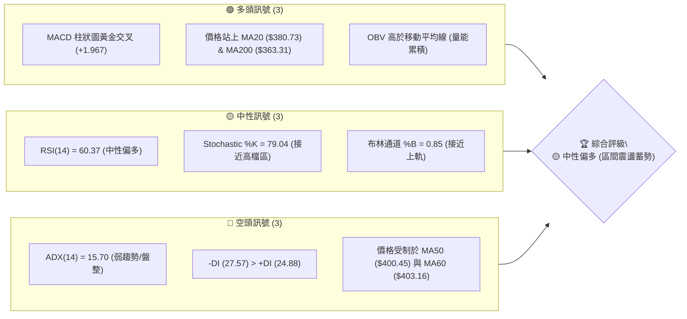

### 📊 核心指標速覽表

| 指標類別 | 指標名稱 | 當前數值 | 訊號 | 解讀 |
|----------|----------|----------|------|------|
| **價格** | 當前價格 | $396.81 | 🟡 | 位於52週區間 56.4% 位置，處於區間震盪中軸之上 |
| **均線** | MA20 | $380.73 | 🟢 | 價格位於 MA20 上方 (+4.22%)，短線呈支撐狀態 |
| **均線** | MA50 | $400.45 | 🔴 | 價格位於 MA50 下方 (-0.91%)，上方承壓 |
| **均線** | MA200 | $363.31 | 🟢 | 價格位於 MA200 上方 (+9.22%)，長期多頭基底完好 |
| **動能** | RSI(14) | 60.37 | 🟢 | 處於 30-70 中性偏多區間，無超買/超賣現象 |
| **動能** | MACD | -2.273 | 🟢 | MACD柱狀圖為 +1.967，形成低位黃金交叉反彈 |
| **動能** | ADX(14) | 15.70 | 🔴 | ADX < 25 表示強趨勢尚未形成，當前屬盤整行情 |
| **波動** | ATR(14) | $16.47 | 🟡 | 佔股價 4.15%，日均波動適中，提供良好的風險對沖空間 |

### 🏆 技術評分卡

```
╔══════════════════════════════════════════════════════════════════╗
║                 技術評分卡 — AVGO (2026-07-23)                   ║
╠══════════════════════════════════════════════════════════════════╣
║ 趨勢強度 (ADX)     ███████░░░░░░░░░░░░░  35/100  🟡 弱趨勢/盤整 ║
║ 動能指標 (RSI/MACD) █████████████░░░░░░  65/100  🟢 動能回升   ║
║ 支撐穩定度 (S1-S3)  ██████████████░░░░░  70/100  🟢 底部支撐強 ║
║ 成交量配合度 (OBV)  ██████████░░░░░░░░░  50/100  🟡 量能略顯不足 ║
║ 形態完整度         ███████████░░░░░░░░  55/100  🟡 雙底構築中 ║
║ 均線排列 (MA System)██████████░░░░░░░░░  50/100  🟡 糾纏混合排列 ║
╠══════════════════════════════════════════════════════════════════╣
║ 綜合評分           ███████████░░░░░░░░  54/100  🟡 中性偏多   ║
╚══════════════════════════════════════════════════════════════════╝
```

---

## 2. 趨勢分析

### 🌐 多時框趨勢分析

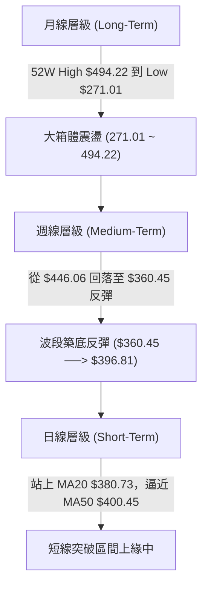

### 📈 長期趨勢 — 12個月走勢圖（Unicode）

```
AVGO 月線走勢圖（2025-08 至 2026-07）
價格軸 ($)
$450 ┤                                           ● 446.06
$400 ┤                               ● 400.71            ● 396.81
$350 ┤                  ● 367.57  ● 344.83                   
$300 ┤● 295.23  ● 328.07                                  
$250 ┤                                                    
     └────────────────────────────────────────────────────────
      08/25  09/25  10/25  11/25  12/25 ... 04/26  05/26  06/26  07/26
```

**走勢特徵分析表格**：

| 時間段 | 起始與結束價位 | 漲跌幅 | 主要特徵與技術驅動 |
|--------|----------------|--------|----------------────|
| **2025/08 - 2025/11** | $295.23 ➔ $400.71 | +35.73% | 主升段推進，AI 晶片需求帶動量價齊揚，創當時歷史新高。 |
| **2025/12 - 2026/03** | $344.83 ➔ $309.02 | -10.38% | 高檔獲利了結，中期回檔測試 52 週低點聚類（最底降至 $271.01）。 |
| **2026/04 - 2026/05** | $416.77 ➔ $446.06 | +7.03%  | 強勢V型反彈，創出 52 週次高點 $446.06，多頭氣勢強勁。 |
| **2026/06 - 2026/07** | $377.75 ➔ $396.81 | +5.05%  | 深度回檔至 $360.45 後止跌，現階段於 $380 - $400 進行整理。 |

### 📊 中期趨勢（週線分析）

從近 20 週數據觀察，週線在 2026-05-31 觸及高點 $446.06 後震盪下行，並於 2026-07-05 探底至 $360.45。隨後兩週（07-12 與 07-26）收盤價回升至 $399.97 與 $396.81，MACD 柱狀圖由負轉正（+1.967），顯示中期向下修正壓力已緩解，轉為雙底築底階段。

```
週線壓力阻力示意圖
阻力3: $428.63 ────────────────────────────────────────────── (波段高點聚類)
阻力1: $400.75 ────────────────────────────────────────────── (MA50/前高重疊)
當前價: $396.81 ══════════════════════════════════════════════ ◄ 現價位置
支撐1: $369.16 ────────────────────────────────────────────── (短線支撐)
支撐2: $356.43 ────────────────────────────────────────────── (Fib 61.8% 重疊)
```

### ⚡ 趨勢強度評估（ADX 解讀）

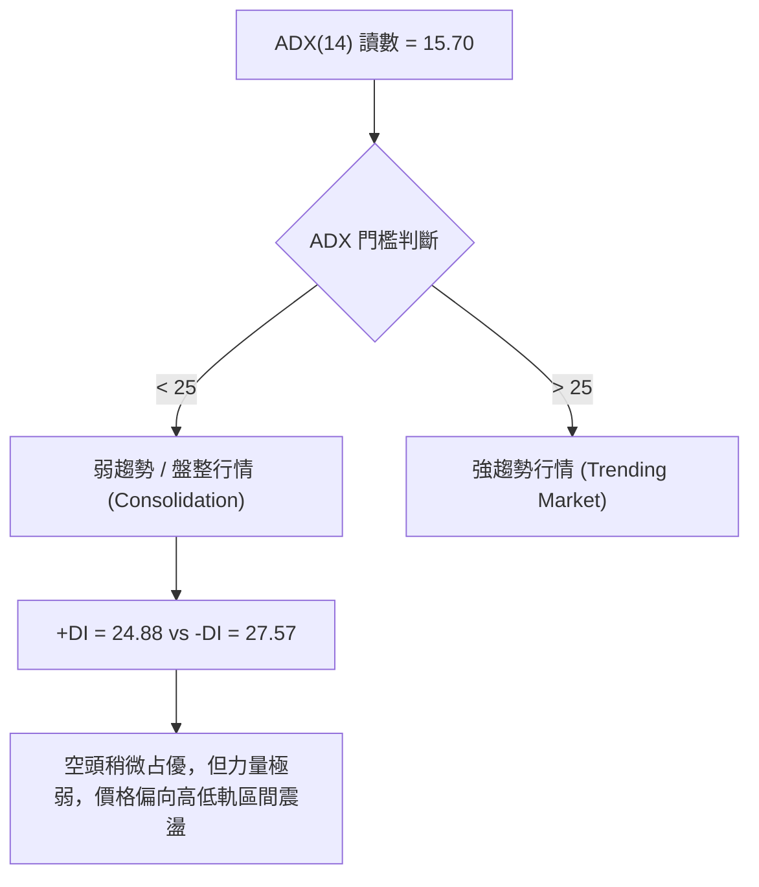

**ADX 趨勢對照表**：

| 指標名稱 | 數值 | 門檻標準 | 當前市場狀態 | 交易策略導向 |
|----------|------|----------|--------------|--------------|
| **ADX(14)** | 15.70 | < 25 (無趨勢) | 盤整震盪/方向未明 | 適合高拋低吸，避免追漲殺跌 |
| **+DI** | 24.88 | - | 多頭力道 | 多頭力道正試圖自低檔回升 |
| **-DI** | 27.57 | - | 空頭力道 | 空頭主導力道正逐漸衰退 |

---

## 3. 圖表形態分析

### 🔍 形態識別系統

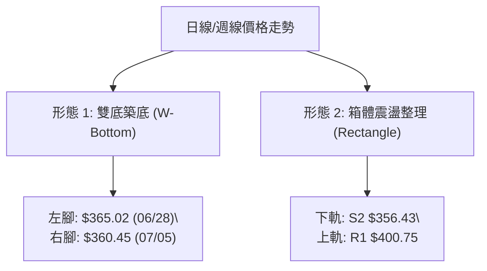

**形態信心度與目標價評估表**：

| 形態類別 | 信心度 | 判斷依據（引用數據） | 完成度 | 目標價（附計算式） |
|----------|--------|----------------------|--------|--------------------|
| **W底 (雙底反彈)** | 58% 🟡 | 兩次下探 $365.02 與 $360.45 未破 S2($356.43)，且 MACD 柱轉正。 | 75% | 頸線 $399.97 + (頸線 $399.97 - 低點 $360.45) = **$439.49**（近似接近 Fib 23.6% $441.54） |
| **箱體震盪** | 82% 🟢 | ADX=15.70 指示無趨勢，價格介於 S1($369.16) 至 R1($400.75) 運行。 | 90% | 箱體上軌：**$400.75**；突破後測 R2 **$411.49** |

### 🕯️ 重要K線形態分析

| 日期/月份 | 收盤價 | K線形態 | 解讀 | 訊號 |
|-----------|--------|---------|------|------|
| **2026-06-28** | $365.02 | 大陰線長下影 | 探底至 S2 $356.43 附近引發買盤支撐，多頭展現防守意願。 | 🟡 中性 |
| **2026-07-05** | $360.45 | 縮量止跌十字星 | 賣壓耗盡，價格於 $360.45 築底成功，為二次測試低點。 | 🟢 看多 |
| **2026-07-12** | $399.97 | 強勢中陽線 | 週漲幅大幅回升，一舉收復 MA20，突破短線下降趨勢線。 | 🟢 看多 |
| **2026-07-26** | $399.81 | 高檔十字震盪 | 逼近 $400 大關與 R1($400.75) 遭遇阻力，進行消化整固。 | 🟡 中性 |

### 📉 ASCII 走勢形態示意圖

```
AVGO W底反彈形態與箱體結構示意圖
$411.49 ┤─────────────────────────────────────────── R2 阻力
        │            頸線 $399.97 
$400.75 ┤..............┌──────┐...................... R1 阻力 / 現價 $396.81
        │              │      │
$380.73 ┤──────────────┼──────┼────────────────────── MA20 / 箱體中軸
        │     左腳     │      │     右腳
$360.45 ┤......●───────┘      └──────●............... 波段雙底支持區
$356.43 ┤─────────────────────────────────────────── S2 支撐
```

### 🎯 形態目標價計算

1. **W底形態高度計算**：
   $$\text{形態高度} = \text{頸線價位} - \text{最低點} = \$399.97 - \$360.45 = \$39.52$$
2. **第一階段測幅目標**：
   $$\text{目標價 1} = \text{頸線價位} + \text{形態高度} = \$399.97 + \$39.52 = \$439.49$$
   *(該目標價位接近斐波那契 23.6% 回調位 **$441.54**)*

---

## 4. 支撐與阻力

### 🗺️ 關鍵價位分布圖（Unicode）

```
AVGO 價位結構分布圖 (現價: $396.81)
═══════════════════════════════════════════════════════════════════
$494.22 ║████████████████████████████████████████║ 52W High (0.0%)
$441.54 ║████████████████████████████            ║ Fib 23.6% 關鍵阻力
$428.63 ║██████████████████████                  ║ 阻力 R3 (強阻力)
$411.49 ║██████████████████                      ║ 阻力 R2 (中期阻力)
$408.95 ║█████████████████                       ║ Fib 38.2% 回調位
$400.75 ║████████████████                        ║ 阻力 R1 (短線突破點)
$396.81 ╠════════════════════════════════════════╣ ◄ 當前價格
$382.62 ║▓▓▓▓▓▓▓▓▓▓▓▓▓▓▓                         ║ Fib 50.0% / MA20重疊區
$369.16 ║▓▓▓▓▓▓▓▓▓▓▓▓▓                           ║ 支撐 S1 (短線強支撐)
$356.43 ║████████████                            ║ 支撐 S2 / Fib 61.8%
$325.79 ║████████                                ║ 支撐 S3 (波段底線)
$271.01 ║██                                      ║ 52W Low (100.0%)
═══════════════════════════════════════════════════════════════════
```

### 🚧 阻力位分析表

| 阻力級別 | 精確價位 | 形成原因 | 突破難度 | 重要性 |
|----------|----------|----------|----------|--------|
| **R1** | **$400.75** | 近一年波段高點聚類、心理關卡 $400、MA50($400.45) 密集區 | 🟡 中等 | 🟢 短線多空分水嶺，突破將開啟新一輪反彈 |
| **R2** | **$411.49** | 波段高點解套壓力區、前週反彈密集阻力 | 🟡 中等 | 🟡 中線多頭強弱指標 |
| **R3** | **$428.63** | 近一年高檔籌碼密集套牢區 | 🔴 極高 | 🔴 中長期強阻力牆 |

### 🛡️ 支撐位分析表

| 支撐級別 | 精確價位 | 形成原因 | 守住機率 | 重要性 |
|----------|----------|----------|----------|--------|
| **S1** | **$369.16** | 近一年波段低點聚類、近兩週下影線防守點 | 🟢 高 (75%) | 🟢 短線多頭防禦第道防線 |
| **S2** | **$356.43** | 波段低點聚類、MA240($356.21)與 Fib 61.8% 三重重疊 | 🟢 極高 (85%) | 🔴 絕對強支撐，跌破則結構轉空 |
| **S3** | **$325.79** | 2026-03 波段底部起漲點聚類 | 🟢 極高 (90%) | 🔴 長期牛熊分界支撐 |

### 📐 斐波那契回調位分析

依據 52 週高低點區間（高點 **$494.22** ➔ 低點 **$271.01**）計算之精確斐波那契價位：

| 斐波那契比例 | 精確價位 | 與當前價位關係 | 技術意義與解讀 |
|--------------|----------|----------------|----------------|
| **0.0%** (52W High) | **$494.22** | +24.55% | 歷史高點阻力 |
| **23.6%** | **$441.54** | +11.27% | 強勢反彈目標位 |
| **38.2%** | **$408.95** | +3.06%  | **當前主要阻力**，與 R1/R2 形成阻力帶 |
| **50.0%** | **$382.62** | -3.58%  | **當前主要支撐**，與 MA20($380.73) 高度重疊 |
| **61.8%** | **$356.28** | -10.21% | 黃金切割支撐位，與 S2($356.43) 重疊 |
| **78.6%** | **$318.78** | -19.66% | 深幅回調支撐位 |
| **100.0%** (52W Low) | **$271.01** | -31.70% | 52 週最低點 |

*當前價格 $396.81 處於 **50.0% ($382.62)** 與 **38.2% ($408.95)** 之間的黃金震盪區間。*

---

## 5. 技術指標深度解讀

### 🎛️ 指標訊號總覽

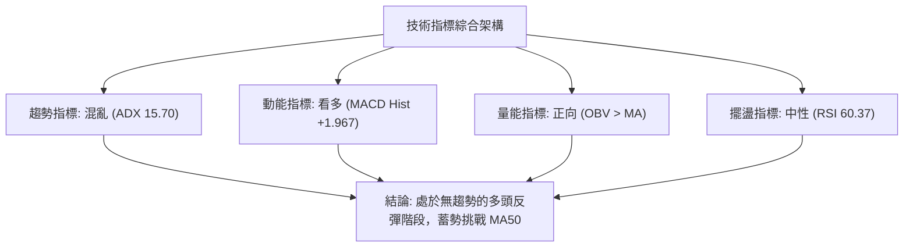

### 📈 移動平均線排列分析

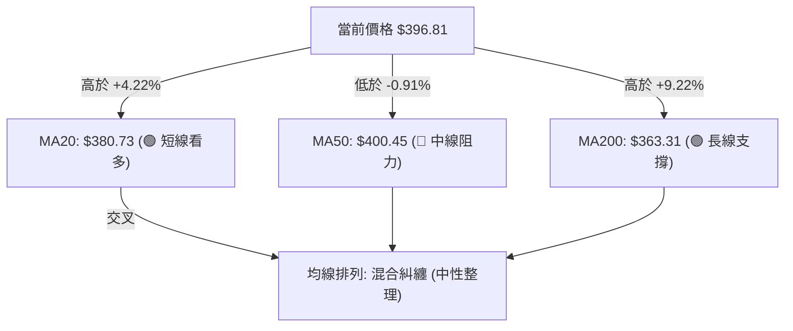

**均線系統詳細參數表**：

| 均線名稱 | 當前價位 | 偏離率 (%) | 走勢方向 | 技術面意義 |
|----------|----------|------------|----------|------------|
| **MA5** | $381.35 | +4.05% ▲ | 上升 | 極短線支撐，推升價格向上 |
| **MA10** | $387.53 | +2.40% ▲ | 上升 | 短線動能依據，已完成黃金交叉 |
| **MA20** | $380.73 | +4.22% ▲ | 上升 | 布林中軌，短線多空樞紐 |
| **MA50** | $400.45 | -0.91% ▼ | 下降 | 中期生命線，當前核心阻力點 |
| **MA60** | $403.16 | -1.58% ▼ | 下降 | 季線阻力，與布林上軌重疊 |
| **MA120** | $370.77 | +7.02% ▲ | 上升 | 半年線，中期強支撐 |
| **MA200** | $363.31 | +9.22% ▲ | 上升 | 年線，長線牛熊分界，結構極穩 |

### 📉 RSI(14) 分析

$$\text{RSI(14)} = 60.37 \quad \text{[█████████████░░░░░░░] 60.37\%}$$

- **區域評估**：RSI 處於 **60.37**，位於 30–70 的中性偏多區域，遠未達到 70 以上的超買區，顯示股價仍具備向上推進的動能空間。
- **背離判斷**：比對近 20 週價格走勢，價格於 07-05 創波段低點 $360.45 時，RSI 未創新低（41.6 ➔ 45.8 ➔ 60.4），呈**隱性底背離**跡象，確認短線底部成立。

### 📊 MACD(12/26/9) 訊號解讀

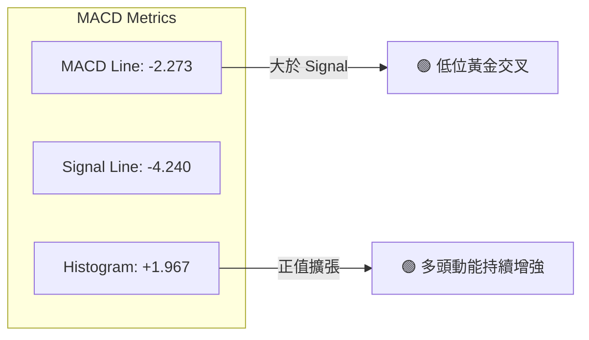

* **數據分析**：MACD 快線 (-2.273) 向上突破慢線 (-4.240)，柱狀圖由負轉正擴張至 **+1.967**。雖然雙線仍位於零軸下方，但低位金叉往往是強烈的中期反彈訊號。

### 📦 布林通道分析

```
布林通道結構示意圖 (Bandwidth: 寬度收窄中)
上軌: $403.97 ────────────────────────────────────────── (強阻力區)
                      ● 現價 $396.81 (%B = 0.85)
中軌: $380.73 ────────────────────────────────────────── (MA20 支撐)

下軌: $357.49 ────────────────────────────────────────── (強支撐區)
```

- **%B 指標**：當前 **%B = 0.85**，顯示價格已逼近上軌 ($403.97)。
- **擠壓效應**：通道呈現收縮狀態，預計在 $357.49 - $403.97 區間突破後將引發新一波方向性行情。

### 💹 成交量分析（量價配合度）

- **最新成交量**：16,910,400 股，相較於 20 日均量 (23,369,490 股) 量比為 **0.72x**，屬於**縮量上攻**。
- **OBV 趨勢**：OBV 高於其移動平均線（OBV > MA），說明雖然日成交量未放量，但總體籌碼處於淨流入與鎖倉狀態，量能結構支持價格反彈。

---

## 6. 動能與波動率

### ⚡ 動能評估

**當前動能與波動率四象限定位**：

| 象限 | 動能強度 | 波動率水準 | 當前狀態 | 評估與策略 |
|------|----------|------------|----------|------------|
| **Q1** | 強 (>50) | 高 (>5%) | — | 高風險高收益突破行情 |
| **Q2** | **弱 (<25)** | **中/低 (4.15%)** | **✓ 當前位置** | **區間震盪整理，蓄勢累積爆發力** |
| **Q3** | 強 (>50) | 低 (<3%) | — | 最佳主升段趨勢行情 |
| **Q4** | 弱 (<25) | 高 (>5%) | — | 無序恐慌下跌行情 |

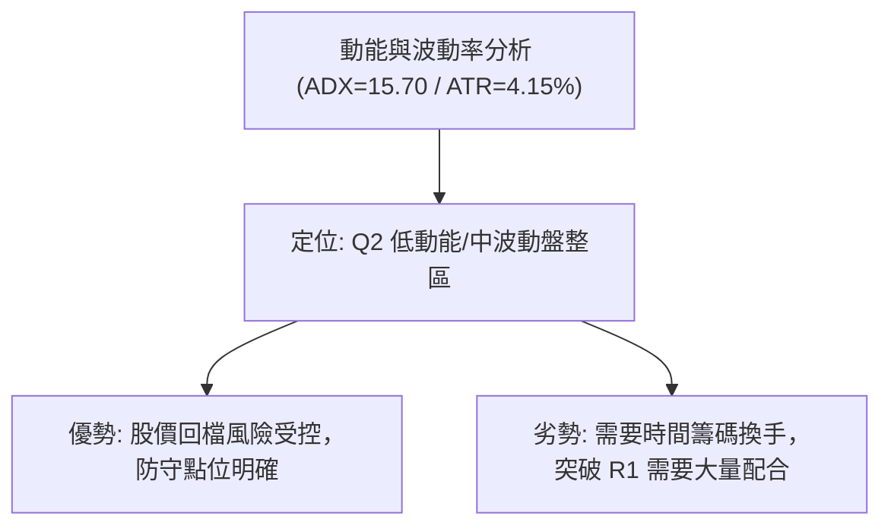

### 📊 ATR 波動率分析

- **ATR(14)**：**$16.47**（佔股價 **4.15%**）。
- **交易風控應用**：
  - **日內波動區間**：$396.81 ± $16.47 ➔ 預計單日波幅介於 **$380.34** 至 **$413.28**。
  - **止損距離建議**：採用 1.5 倍 ATR 止損，距離應設定為 $16.47 \times 1.5 = \mathbf{\$24.71}$。

### 📐 Beta 與市場相關性

- **Beta 係數**：**1.462**。
- **解讀**：AVGO 具備高 Beta 屬性，大盤（S&P 500 / 費城半導體指數）每波動 1%，AVGO 平均波動 1.462%。在大盤反彈格局中將展現強於大盤的彈升力道。

---

## 7. 多時框架總結

### 📋 時框架評分表

| 時框架 | 趨勢方向 | 動能狀態 | 均線排列 | 形態結構 | 綜合評分 | 交易建議 |
|--------|----------|----------|----------|----------|----------|----------|
| **日線 (Short-Term)** | 🟢 向上反彈 | 🟢 MACD金叉 | 🟡 混合整理 | 🟡 箱體整理上緣 | **62/100** | 逢低偏多操作 |
| **週線 (Medium-Term)** | 🟡 震盪築底 | 🟢 柱狀圖轉正 | 🟢 MA200之上 | 🟢 W底反彈中 | **58/100** | 區間高拋低吸 |
| **月線 (Long-Term)** | 🟢 長期牛市 | 🟡 震盪拉回 | 🟢 多頭排列 | 🟢 大箱體高檔 | **70/100** | 長線拉回找買點 |

### 🔲 綜合訊號矩陣

```
時框架訊號收斂圖
日  線 ───► [突破 MA20 $380.73] ───► 短線看多 🟢
週  線 ───► [W底築底，站穩 S1 $369.16] ──► 中線中性偏多 🟢
月  線 ───► [處於 52W 高低點 56.4%] ──► 長線多頭趨勢完好 🟢
```

### ⚖️ 多時框收斂結論

> **依據「多時框收斂規則」**：當前 ADX(14) 為 **15.70 (<25)**，技術面嚴格判定為**盤整/弱趨勢行情**。
> 因此，不宜過度追高，應以**布林通道上下軌 ($357.49 - $403.97) 及關鍵支撐阻力 (S1 $369.16 - R1 $400.75) 為主要交易區間**。中長期多頭趨勢（均線 MA200 $363.31）提供堅實底部屏障。

---

## 8. 交易策略建議

### 🗺️ 策略決策流程圖

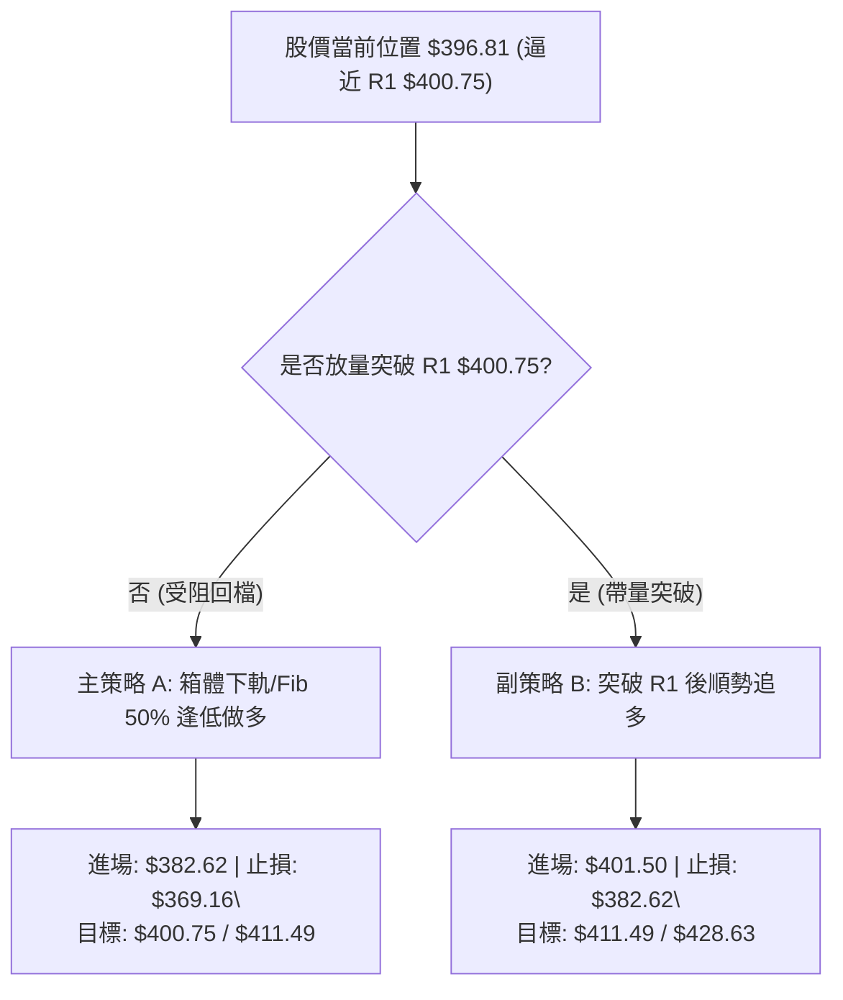

### 🧭 策略路由

* **當前主策略方向**：**區間低吸 / 逢低做多策略（綜合評分：54/100 🟡 中性偏多）**
* **理由**：ADX < 25 且價格緊貼阻力帶 R1 ($400.75) 與布林上軌 ($403.97)，直接追高風險報酬比較差，等待回調至 Fib 50% ($382.62) 附近佈局為最佳策略。

### 🎯 價格情境階梯 (Price Scenarios)

| 觸發條件 | 下一目標價 | 後續延伸目標 | 情境含義與技術解讀 |
|----------|------------|--------------|--------------------|
| **帶量突破 R1 $400.75** | **R2 $411.49** | **R3 $428.63** | 突破箱體整理，V/W型反彈確認，開開啟新一輪中期漲勢。 |
| **受阻於 R1 進行震盪** | **Fib 50% $382.62** | **S1 $369.16** | 區間震盪消化賣壓，進行籌碼二次換手。 |
| **跌破 S1 $369.16** | **S2 $356.43** | **S3 $325.79** | 築底失敗，向下二次探底測試 MA200 與 Fib 61.8%。 |

### 📊 情境機率分佈

| 情境劇本 | 估計機率 | 主要技術依據 |
|----------|----------|--------------|
| **區間震盪後向上突破** | **55%** 🟢 | MACD 低位金叉、OBV 累積支撐、站穩 MA20。 |
| **持續在 $370-$400 箱體震盪** | **35%** 🟡 | ADX=15.70 顯示趨勢強度不足，日量能低於 20日均量。 |
| **向下破位探底** | **10%** 🔴 | 需要大盤大幅回檔或基本面利空干擾方可能發生。 |

### 🟢 主策略詳情

#### 策略 A：箱體下軌/Fib 50% 逢低佈局（主推）

* **進場條件**：股價拉回測試 Fib 50% ($382.62) 與 MA20 ($380.73) 獲得支撐時分批進場。
* **精確參數表**：

| 策略要素 | 策略 A (低吸做多) | 策略 B (突破追多) |
|----------|-------------------|-------------------|
| **進場價格** | **$382.62** (Fib 50% 支撐) | **$401.50** (確認突破 R1 $400.75) |
| **目標價 T1** | **$400.75** (R1 阻力位) | **$411.49** (R2 阻力位) |
| **目標價 T2** | **$411.49** (R2 阻力位) | **$428.63** (R3 阻力位) |
| **止損價格** | **$369.16** (跌破 S1 止損) | **$382.62** (跌破 Fib 50% 假突破止損) |
| **潛在收益 (T1/T2)**| +4.74% / +7.55% | +2.49% / +6.76% |
| **最大風險** | -3.52% | -4.70% |
| **風險報酬比 (T1/T2)**| **1.35 : 1 / 2.14 : 1** | **0.53 : 1 / 1.44 : 1** |
| **建議倉位** | **15% - 20%** | **10% - 15%** |

### 🔴 反向風險觸發點（對沖與避險提示）

* **警報價位**：若股價收盤跌破 **S1 ($369.16)**，代表短線反彈趨勢終結。
* **對沖機制**：若意外下破 **S2 ($356.43)**，應全數清倉多頭頭寸，並可考慮短線建立反向對沖部位，下看 S3 ($325.79)。

### ⭐ 整體訊號強度評星

```
做多訊號強度：★★★☆☆  (3/5星 - 箱體築底完成，等待放量)
做空訊號強度：★☆☆☆☆  (1/5星 - 長期多頭結構完整，做空勝率低)
整體可信度：  ★★██☆  (4/5星 - 技術指標與 key levels 高度吻合)
```

---

## 9. 風險提示與監控

### ✅ 關鍵監控指標 Checklist

```
╔══════════════════════════════════════════════════════════════════╗
║                   每日交易前技術面 Checklist                     ║
╠══════════════════════════════════════════════════════════════════╣
║ [ ] 價格是否突破並站穩 R1 ($400.75)？                             ║
║ [ ] 成交量是否放大至 20日均量 (23,369,490 股) 以上？             ║
║ [ ] MACD 柱狀圖是否持續保持在正值 (+1.967) 上升軌道？            ║
║ [ ] RSI(14) 是否突破 65 並朝超買區推進？                         ║
║ [ ] 關鍵支撐 S1 ($369.16) 是否收盤未曾跌破？                       ║
╚══════════════════════════════════════════════════════════════════╝
```

### ⚠️ 風險場景分析

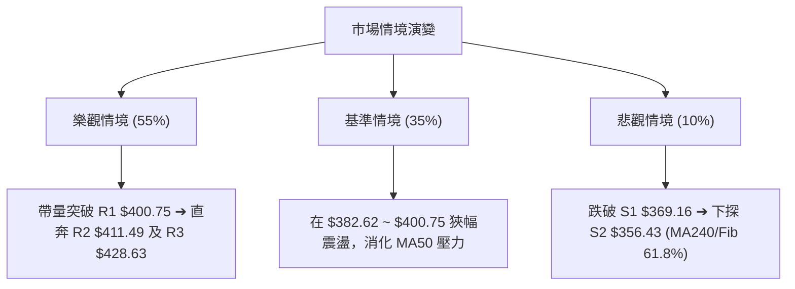

### 🛡️ 風險管理重要提醒

1. **倉位管理**：鑑於 ADX(14) = 15.70 處於盤整階段，單一股票總持倉不宜超過總資金的 **20%**。
2. **止損紀律**：嚴格執行以精確數據導出的止損點，策略 A 止損設於 **$369.16**，絕不開盲目攤平窗口。
3. **波動率對應**：ATR 達 **$16.47**，避免使用過高槓桿（如短期價內期權），優先考慮現貨或遠期深度價內期權。

---

## 📋 報告總結

```
╔══════════════════════════════════════════════════════════════════╗
║                     AVGO 技術分析報告總結                        ║
════════════════════════════════════════════════════════════════════
報告日期：2026-07-23
當前價格：$396.81
分析評級：🟡 中性偏多 (箱體震盪突破前夕)

關鍵價位與趨勢總覽：
├─ 長期趨勢：🟢 多頭 (價格高於 MA200 $363.31)
├─ 中期趨勢：🟢 築底反彈 (週線 MACD 金叉，W底形成)
├─ 短期趨勢：🟡 挑戰關卡 (逼近 MA50 $400.45 與 R1 $400.75)
├─ 核心關鍵支撐：S1 $369.16 / S2 $356.43
├─ 核心關鍵阻力：R1 $400.75 / R2 $411.49
└─ 華爾街 consensus 目標價：$525.44 (潛在空間 +32.42%)

最優策略執行矩陣：
1. 🥇 首選策略 (策略 A)：等待拉回至 Fib 50% ($382.62) 附近分批低吸，
   止損設於 $369.16，第一目標看 R1 $400.75，第二目標看 R2 $411.49。
2. 🥈 次選策略 (策略 B)：若強勢放量突破 R1 ($400.75)，於 $401.50 順勢追多，
   止損設於 $382.62，目標直指 R3 $428.63。
╚══════════════════════════════════════════════════════════════════╝
```

---

> ⚠️ **免責聲明**：本報告為 AI 根據市場即時歷史數據生成之專業技術分析報告，所有價位均來自歷史 OHLCV 數據計算。本報告**僅供學術研究與投資參考**，**不構成任何買賣操作之推薦或要約**。股市投資存在風險，投資人應獨立評估風險並自負盈虧。

---

*報告生成時間：2026-07-23 ｜ 數據來源：Yahoo Finance ｜ 分析框架：多時框技術分析 (Multi-Timeframe Technical Framework)*