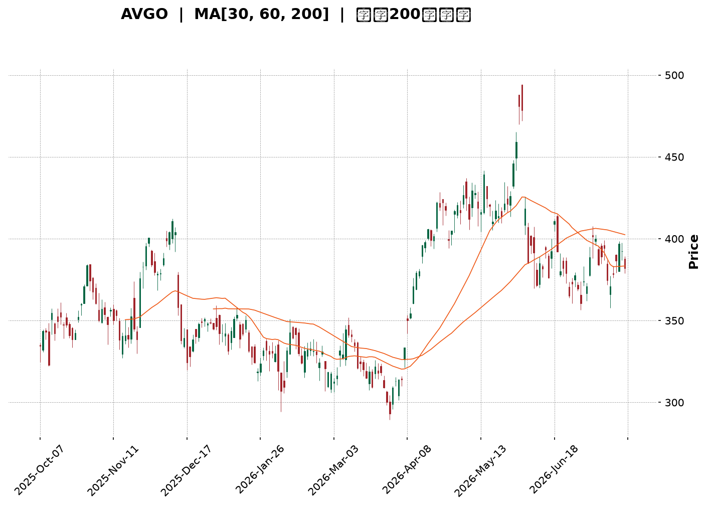
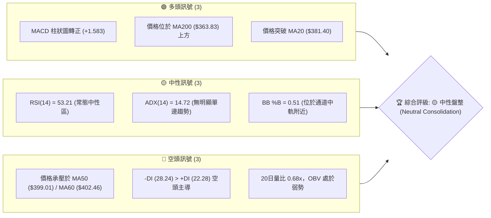
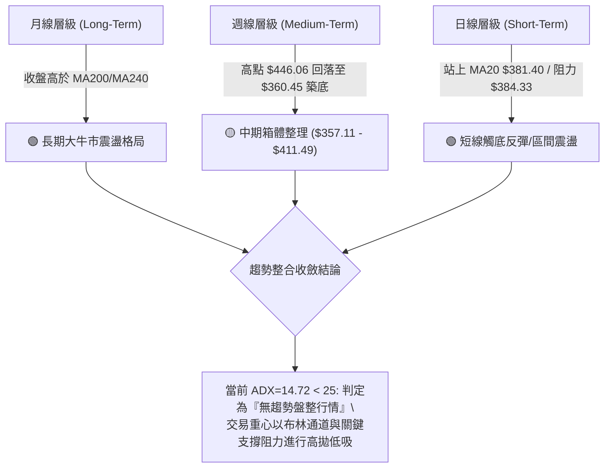
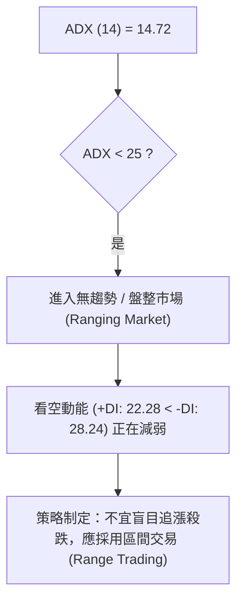
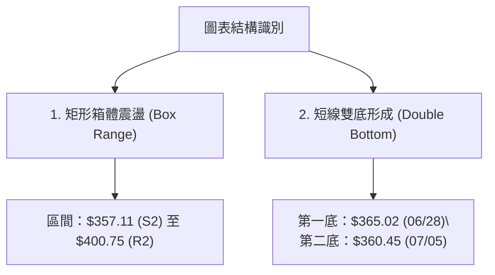
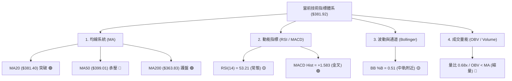
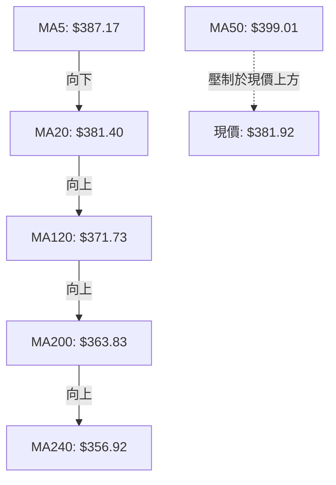
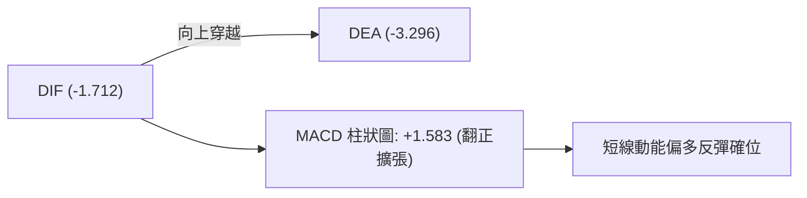
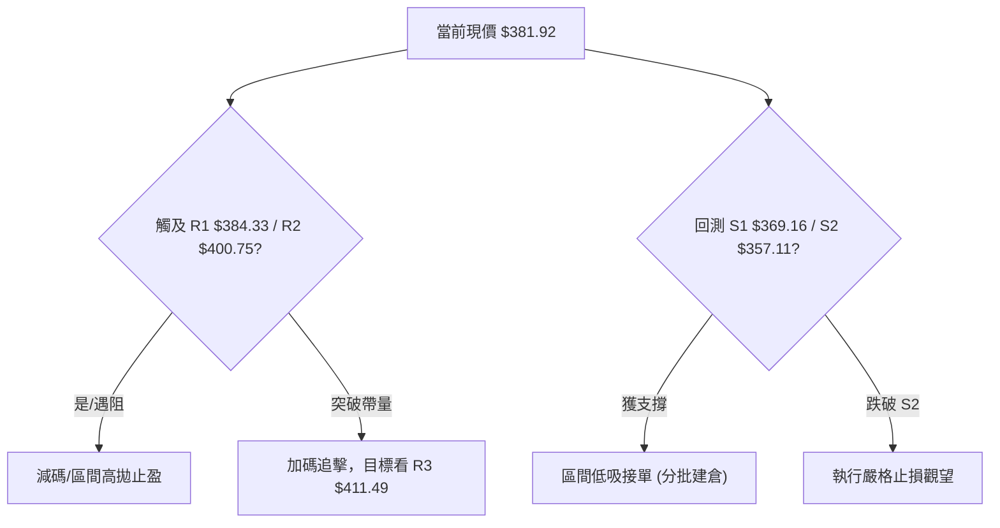
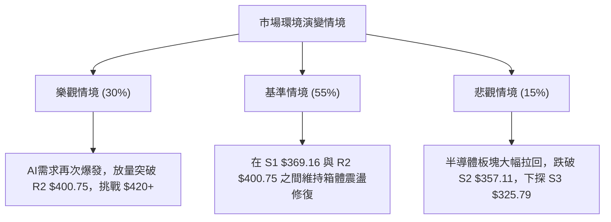

<details>
<summary>📊 靜態圖表 (點擊展開)</summary>

</details>

<html>
<head><meta charset="utf-8" /></head>
<body>
    <div style="height:500px; width:100%;">                        <script>window.PlotlyConfig = {MathJaxConfig: 'local'};</script>
        <script charset="utf-8" src="https://cdn.plot.ly/plotly-3.7.0.min.js" integrity="sha256-jvTGqxNp8AGWEcvNLVuKr+8j5dGe9Yw51LQkmDH+IYA=" crossorigin="anonymous"></script>                <div id="candlestick-chart" class="plotly-graph-div" style="height:100%; width:100%;"></div>            <script>                window.PLOTLYENV=window.PLOTLYENV || {};                                if (document.getElementById("candlestick-chart")) {                    Plotly.newPlot(                        "candlestick-chart",                        [{"close":{"dtype":"f8","bdata":"AAAAQJDodEAAAABgMXl1QAAAAECOcXVAAAAAQCItdEAAAADgZCt2QAAAACBlY3VAAAAA4PPVdUAAAABg0gJ2QAAAAKAhtnVAAAAAALO0dUAAAACgAUx1QAAAAOB0JnVAAAAA4PBldUAAAADggAJ2QAAAAGCEgHZAAAAAYEMud0AAAACAQ\u002f13QAAAAKDzZXdAAAAAAB\u002f5dkAAAADgeIh2QAAAAKCo33VAAAAA4KtPdkAAAACguxl2QAAAAOC4t3VAAAAAwEhGdkAAAAAg+t91QAAAAMDYE3ZAAAAAgF0hdUAAAADg0kh1QAAAAODYS3VAAAAAgKMpdUAAAAAgHgd2QAAAACAyjnVAAAAAoN0kdUAAAACgqH13QAAAAAAm7ndAAAAAgKu1eEAAAADgbQt5QAAAAMDa\u002fndAAAAA4Bi3d0AAAABg0qd3QAAAAECBrndAAAAAIAtBeEAAAADg1e14QAAAAKBpQHlAAAAAYLKqeUAAAACAr0F5QAAAAEDJXnZAAAAAAKkedUAAAAAAXjZ1QAAAAOA\u002fQ3RAAAAAgKqAdEAAAABAaSd1QAAAAEAmQ3VAAAAAYJvAdUAAAABA9M51QAAAAOBm7XVAAAAAILnBdUAAAABADsl1QAAAAMBGjXVAAAAAoIGldUAAAADAjWJ1QAAAAAAiaHVAAAAAINRjdUAAAADgJ7R0QAAAACBDe3VAAAAAYK3udUAAAACg7xR2QAAAAABIKnVAAAAAQC1cdUAAAADgtOZ1QAAAAKARtnRAAAAA4H15dEAAAADguUR0QAAAAIAB7nNAAAAAIIY6dEAAAAAAGbl0QAAAAGBFwHRAAAAAQEKYdEAAAABAWKF0QAAAAOBQnnRAAAAAAHjyc0AAAADgtS5zQAAAACDtVXNAAAAAoCu7dEAAAADA12p1QAAAAGAMM3VAAAAAQAhYdUAAAADgRZ90QAAAAACgP3RAAAAAwBy1dEAAAABAk8R0QAAAAAA6zHRAAAAAoN22dEAAAACgCpJ0QAAAAOC5RHRAAAAAIHKxdEAAAAAATwh0QAAAAAAJ5nNAAAAA4GXac0AAAADAAotzQAAAAGDVxXNAAAAAQMe4dEAAAAAARpR0QAAAAGCyh3VAAAAAoClVdUAAAADgD0V1QAAAAIDK63RAAAAAYKQPdEAAAADgozt0QAAAAIAXAnRAAAAA4FOsc0AAAACAqOpzQAAAACDtVXNAAAAAoAEgdEAAAADAl9xzQAAAAEDm5HNAAAAAoOVOc0AAAAAgR8NyQAAAAEAkT3JAAAAAwFVQc0AAAAAA6o9zQAAAAODYoHNAAAAAIO6ec0AAAACAE9d0QAAAACA34XVAAAAAQJYldkAAAADgZy93QAAAACBmsndAAAAAQNrCd0AAAABgfcF4QAAAACBy3XhAAAAAoFxeeUAAAADg+e94QAAAAGCNGHlAAAAAwLZfekAAAABAbDR6QAAAAMB4YXpAAAAAgKAYekAAAADAK\u002fN4QAAAAADzTHlAAAAAgFMMekAAAAAg1El6QAAAAEB4\u002fXlAAAAAgPSqekAAAACgSIx6QAAAAICHvnlAAAAA4CDVekAAAABADLx6QAAAAOAyKnpAAAAAQBoCekAAAABghXF7QAAAAEBKiHpAAAAAILlAekAAAAAguqZ5QAAAACCZEXpAAAAAgKPeeUAAAAAAxdd5QAAAAKB9VXpAAAAAABhTekAAAACgfp56QAAAAEAG4XtAAAAAAOSzfEAAAADg8Qx+QAAAAGCQ531AAAAAAPgjekAAAACA7RF4QAAAAKCSv3hAAAAAIKV4eEAAAABAMTh3QAAAACBfD3hAAAAA4HXXd0AAAACAFJV4QAAAAODVgXdAAAAAYHeEeEAAAABAM6t5QAAAAIAUgnhAAAAAYGbCd0AAAADAHuF3QAAAAGCPrndAAAAA4FHQdkAAAABAM0d3QAAAAAAAnHdAAAAAoHAVd0AAAABAM4d2QAAAAGBmXndAAAAA4Hosd0AAAABACkt4QAAAAIDCEXlAAAAAIIX\u002feEAAAADAzAB4QAAAAIDCUXhAAAAA4HqkeEAAAABAM2d3QAAAAKBHLXdAAAAAYI+id0AAAAAAACh4QAAAAMD1zHhAAAAAIIWHeEAAAABguN53QA=="},"high":{"dtype":"f8","bdata":"0hXvkZwDdUB3wJGCvYl1QJ0gGdr9lXVAwaBpkFbKdUCG\u002fuzyCFZ2QAtAd7Zzy3VAuUWNaVpWdkC05t+Bc5N2QE7qabA50HVAcAc62aQpdkBnbQA4S9J1QEoLvSEhoXVAkOOGtDeKdUA5yB\u002fw2UR2QPRLZqWni3ZAywRnHps\u002fd0BKzzAWOAV4QKHyMzXyA3hAvqONeFeLd0BiX7P6LEx3QEaAwVdN7nZAL85pzWKtdkDYgoRwlpd2QNywkuRjCHZAyQL2f+ZfdkBrjS7V+H12QIHYGM\u002frTXZAEur4XUb5dUBHwXy0GW11QPuZqsHL43VAjEX9G36gdUBE6BC091p2QIa1MBq\u002fX3dA8B+eQYSqdUA+huFH8L13QGwU4dx4H3hAiy2nv0PaeEA8XzTWEAx5QMK7pEx2k3hAtxVZzul0eEAJ\u002fy0MtsJ3QERJLJcC3HdARtls5mN1eEBDOQrUUlB5QF2YK2SYSnlAwPCFUMrEeUAUsFneTXB5QIPEJTfwvXdAB2uRubh\u002fdkAC2Ga5A5l1QP8I737ainVAYLoFfoTidEBlkx13k1h1QPBZFf6Bj3VAZILIPzPNdUCCyB\u002fwCfl1QEdptolB\u002f3VADgiSHrXQdUBoScdUK\u002fZ1QGA\u002fAM2IyXVAd841d2F1dkDsFaW3oRt2QKFhRoBNvHVAbZVkK6rGdUCEv8egsmZ1QJjvlR7XoXVA4DgkOJ4JdkBUP3nDumJ2QOWpWWVy1nVALHxLgVjGdUDHuEmoVxN2QN\u002fQrPMdgnVA9Jq6pBTpdEBhaor+DPx0QC\u002fMGJbuDHRACd1nLJR3dECq5XyCgNh0QLdi1ObfK3VA3qYN53jrdEAgkEEFVw91QNgP87U57XRAeJC+lH8adUArNRbZZeVzQLkRMixOVXRAtptW+1PcdED4fr\u002fYv\u002fB1QPJ\u002f\u002fVK5q3VAg77AwM+edUAzxTwTTpB1QCy5C9J80XRAd35jnkjodEAHU\u002fwNPQp1QN7T61kqE3VA2RZ7msktdUAJWKhUHxR1QH\u002fpRTuucXRAuQ6KodXqdECYNCcDGlZ0QADqKnw17XNAvATWqNjtc0AF40T1h6tzQOkwEy5LF3RAcyBvgy7udEDKGIn+\u002fGN1QL5NXC9gs3VABe5RwID9dUDyCnMip4h1QNwcFflSKXVA1fZ30UARdUDNLLlo3n90QGG0AtnPY3RAwfU56e1DdEBO2O4vViF0QFl0RcNHBXRAHDQXDm1fdEA\u002fkQi0Mj50QNmxS7eZPHRAo8qeFLXGc0BmUKy7OTBzQK53rDidBHNAv9Z8Uh1dc0CB8BT9p7RzQOrKAXgVo3NASenSf2a+c0ApPsKV89l0QBTcQGhJGXZA238wmCFidkAbliODR393QNda13AhxHdAjoeIitDad0BR+4WLPcd4QN4DK2vG8HhA+uIupWVheUBZLyTNcVx5QKzFmV5lL3lAi0+iEIBoekAqJ6UaG8p6QLlHg0BBhXpAbYX9zE9hekALhHQrs1J5QD00LQX8T3lAPPDnmYAbekDhyU1kBWh6QAG9tm6QcnpAF3rMeEgLe0AILRZn0E97QKXY8ZYOnXpAZU1ZgwAle0BjLbWWbw97QOLRYMSVynpAFBlB934fekAMWrZdk5p7QPq6Km4EAntAmCT1lX1VekA5hjcYohR6QH50LgP\u002fd3pAqDPRClNZekAhuuaiODV6QK7kIkv0KXtAK2bHcNsBe0DwgnwvBNB6QLkSyPYMA3xA+03PRQQVfUCm81\u002fzwoB+QK0rUS58435AdafkwOWcekDlDVMNn515QGVMjzxBI3lAe\u002fA6kZtzeUBkz32jNBN4QE9XGfAmTnhAJQZiavIFeEAPG0vfLrl4QEIHEgW8cnhAyc3JNkUAeUCf8SojxMB5QAAAAIA96nlAAAAA4FFweEAAAAAA10t4QAAAAMDMTHhAAAAAQApbd0AAAAAgXIN3QAAAAIDruXdAAAAAAABcd0AAAAAAAGB3QAAAAGCP8ndAAAAAIFxPd0AAAACgcLF4QAAAAOBReHlAAAAAQAoneUAAAAAAALx4QAAAAKBH1XhAAAAAAADweEAAAAAA1yt4QAAAAKCZlXdAAAAAoHD5d0AAAACgR2l4QAAAAKBw6XhAAAAAgMLZeEAAAADgUVR4QA=="},"hovertemplate":"\u003cb\u003e%{x|%Y-%m-%d}\u003c\u002fb\u003e\u003cbr\u003e\u958b: $%{open:.2f}\u003cbr\u003e\u9ad8: $%{high:.2f}\u003cbr\u003e\u4f4e: $%{low:.2f}\u003cbr\u003e\u6536: $%{close:.2f}\u003cextra\u003e\u003c\u002fextra\u003e","low":{"dtype":"f8","bdata":"Uaj+4ihMdECuJA3iQqx0QNRfazUMKHVAz6hqvecjdED8TRtcsFl1QO4RoEMdHHVAPhIsrQOZdUDpRhtfrbh1QBj5sAoYLnVA\u002f6UOlWyedUATS+XQhjZ1QCOPs3Y+2nRANBXQKwwodUB23dMPy851QH9M\u002fVmeEXZA66YbcCeIdkBHyu6TwzF3QJB3bZH2\u002f3ZAMKvehwuxdkAMPcJCZ392QC1aB9Wz0HVApGeATTnCdUDTPM\u002fd6Ot1QDN\u002f\u002fhI\u002f9nRAhMXPCCQKdkDZhqelirt1QGXYMq6F23VA8JgDmsPEdEB3iNxgnnN0QEc3nXk5+nRAaAy3Zz7adEA3un7hrf50QLkJfQ8adHVATYeP3jafdEBFb3KEj5t1QDYZrkLaGndAgR3DZvzRd0BsRAaFJa94QHd+nB5D73dACYOIocaad0Dg6OyaWQl3QNydQvjnZndA+RgHsA7wd0A2o20V97J4QOm7T9LklHhAKLQ7G1XVeED3OMZG5H94QMiKhXy7EnZAljFOwBD6dEBxFzdwFdN0QEPUuGAP+nNA\u002fghfKjkddECiszX3n6t0QImN67a3\u002f3RA636jjsIUdUCPQzXt2p11QFkfZTiUp3VAKSy8h8x2dUD7vr+kScB1QHqj5LhvgnVAOl\u002fz16qEdUALL0VnPfR0QFeEa90mDHVA9xhhLVvqdEATlhaEl5R0QK\u002fJQ25qxHRAnAxCxS07dUDwsT8f9Nl1QF6svRoV03RA8\u002f5QC6hGdUAgNBenmGx1QIf918ZQqXRA+QjbhikwdEAbqv1kKTt0QOObf4tQj3NA3ShrHfPGc0AAY8+9HV10QI086PADWHRAm11qGKzxc0A6twzG\u002f3F0QGWG0\u002fPeSHRAhnHRVkY4c0DBgUiLdWNyQOcpgqYwGXNAoU\u002fW2Dmyc0CVnWaq+5Z0QB5MHMV7KXVAjVtW2T3IdEB3thZ0m4V0QN85VRf5N3RA1739nGKyc0DutLPIdmB0QKrVOQuFh3RAkSnRBu2FdECDgik3BEJ0QKyNExe8lHNAWjTQzCSBdEBuW6sCzCxzQLCSSdDLTXNATABzDykhc0Cb5JVPWSRzQKx14YqIaXNAvGaMrIIddEC+t1SNLGN0QOAcILTBJnRAhuY5gsk4dUCpInWcqA91QOV2kkyxr3RA9CFkOQEEdEDflG5PKu5zQBfdrchewXNASsltFkWmc0CKW5gyCzZzQMk9j16FTHNAx5Fb7+qmc0BvOIPUeqVzQCdPCyeDw3NAP\u002fk+PudKc0Dclw0XXaZyQNRnnlQHGHJAMy2anfJ9ckAgDEKb1F9zQBuNjPhe1HJA0LVLnKJcc0CtqkPlqRR0QCgz7ezRX3VAL3cq8hzvdUC\u002fgUdT\u002f4N2QEU2kbhWDndAllUb\u002fpp7d0BO0PIqXw94QMqUNDyue3hAxeMED9ryeECBu4bkY7R4QFC5r\u002fAkn3hAUViUBYZDeUDbldaZPBJ6QBaQPjdsg3lAt0BA25jfeUCRiPUGbKB4QO07ur1ywnhAqnVPz3U5eUCkAcHnB8p5QFap0DwgjnlA8pvLd\u002f8qekCjCyjU6hF6QPKfaQSHWnlAiTvibojVeUDzoYGgDYZ6QLlz+fs7fHlAyfygupBCeUATh+DB7u55QP3D5qIvMnpAr\u002fLxiHHbeUDpAbeYf1N5QJCO0ohRrHlAGeOzF5+deUBQ8dYP\u002fZh5QNbKIA11BXpAWlznQU\u002f9eUBMpKdbsdV5QM9VpYac7HpAfEO84laYe0AsvVYod1t9QEWLIGdKfn1AJqZ1ifgleUDcXP\u002fnsA94QD7YD5u0a3hA0o1iq+obd0DSAO8EVil3QEBdzVduH3dA+AmN8HeGd0AnWxFwxj94QEw0PX7XfXdASL6Jt7ngd0CeAbrD1Et5QAAAAGCPfnhAAAAAYI+Kd0AAAAAgXI93QAAAAEAzS3dAAAAAoEe9dkAAAAAgXId2QAAAAIA9KndAAAAA4HoAd0AAAABA4UZ2QAAAAEDhMndAAAAAACmgdkAAAACAPY53QAAAAEDhPnhAAAAAQDO7eEAAAABguPZ3QAAAAIA9CnhAAAAAANcreEAAAABgZj53QAAAAMDMXHZAAAAAIFx\u002fd0AAAAAghbN3QAAAAAAAwHdAAAAAwB4teEAAAAAAAKx3QA=="},"name":"\u50f9\u683c","open":{"dtype":"f8","bdata":"SCj6mG3ydEBFHZ69Wr90QHzzGrYrfXVAZPHGXXF3dUC5yOA13ex1QDh9FircwnVAIYvLsukHdkDJHYxC\u002fCx2QEW5zBuWunVAUqgGqUD9dUDzUf+zysB1QJEc0hbVlXVANBXQKwwodUAOxapauuh1QEYQHyRneHZAKZQyApaJdkBHyu6TwzF3QKHyMzXyA3hAAWGvJpeCd0AGLjVp1B53QA4w+gxaSHZAgRCI6vPOdUDrbahSpmF2QJNVGDh1A3ZAl6p2z3w+dkDMiH4cg092QLwpKSG3QHZAYRfyNe7ZdUDuV6W99pl0QEWaQ9nRHnVA35cYHplUdUAcBnnU+ix1QDBd+pBdv3ZAYlewh8hzdUCEf1qrrJx1QBSsZKiO7HdAF6zo4Gv2d0CR2XHH\u002fdF4QK5riY9kinhAO\u002fhyBlYieEDf8I3MHZ53QMXjTJ3vqHdA4qBqZ0kAeEAbKcrfygN5QHfcAt1xyHhAbinwV1b\u002feEBeLCrHLil5QCBpMeh6nXdAH3dIvPh9dkA0iWCmW+J0QP8I737ainVAeJdSTQridEDSDQSet7d0QD7FOAYpjHVArg+gTvI4dUCy+TdPctZ1QPP46DVY3HVA6mOC0gq3dUBksTLy98p1QOdRPa4kx3VA\u002fLmZbcP3dUBk1rkzAhd2QBH\u002fKk5sZXVAg2A2byJHdUCL\u002fWnIWVh1QBxI21vgCnVAnAxCxS07dUBYysShW\u002fl1QM9nmSAHu3VAjyxrLGu9dUDuo4pn\u002fI91QJJ1or5kbXVAcyuzQHXkdECoaPpF6OF0QIOTTMYM4nNAnQjaKgXqc0BAe+Ssy4h0QNMkBqqzGXVA52lgXW61dECvVKechLN0QOCGbQqcTnRAOhOWrRD4dEArNRbZZeVzQPSykCz7knNAJmjFmM3uc0At9plc5Zh0QPOSM5Edo3VAeNY8RG+YdUBZWIvOFml1QKjL8eQ6inRAdpabcxvoc0Cp46wb+IR0QOMYgLuavHRA3H0WHD6ydEAOs3NJfbB0QDES7hizFXRArSka+mqYdEDNXvyW01R0QN4eWor0WHNAscDP1pdDc0BJU6DAnn1zQC1Mwo9XqHNAHy2nj32PdEAaOqrSM3F0QGzfz3vIYHRAyzn5qzO3dUCzsZVqUlV1QA04TsQBCHVAVwmE8AwHdUAHGtLWLE10QA\u002fpXtoHSXRAAHL8ORD0c0C7M97KK3VzQM8spSgf73NAtsam0PXXc0DSTp\u002fO6PdzQFqvr6hIIXRAqArqWWGYc0BuzrpUMilzQK7J5xZQxnJAB576v6uuckCwItJG\u002f41zQC4ZmzwkAHNA93QejP6oc0BmuGVca2N0QFTERmAb83VAwqqihOT7dUBiZHMM6oV2QGFeVc42EXdAk6caZNiUd0D62YIFOVR4QKvRb3UDpnhA82r+oEMEeUA06ClW8VB5QCNgJT127HhAd5vA7GNleUCBFoWkj1t6QGwOooHvhHpAytEzngw9ekCRB6bE1vp4QHOqD1\u002fMLXlADgm5fNDteUA5xqTw8eZ5QEVfEz7yGHpA6cZXROZPekDD3smf8i17QJNXypB0UnpAsma1pC8yekA+kCC+G696QOPF26QsbHpAZFbPd3LyeUA\u002fC\u002fLgJAF6QPq6Km4EAntA8oog2OdLekAGGC43wpJ5QMtbvemFwnlAoukYGljOeUDpuETRSA16QDHnw1drHXpAWp8ZeV+GekA3TbC1l0d6QDIGaBJBBHtA8HSacg8WfEA4iBRFSIB+QLuu13r4335A7bfx1H+FeUAha\u002fBBdG95QM0JGIm9H3lAIwTLFZsPeUDsDtzIWs53QIyPb6axQ3dAVmEbktHxd0CpfpYWKa54QPf3Fn9+WXhAOQOLPohBeEBRNcG07I55QAAAAGCP2nlAAAAAgOudd0AAAACA6yl4QAAAAKBHKXhAAAAAQDMnd0AAAACA61l3QAAAAOCjbHdAAAAAgOs9d0AAAAAgrtt2QAAAAIDCWXdAAAAAwPXodkAAAADgUZh3QAAAAEAKI3lAAAAAAADoeEAAAAAgrpd4QAAAACCFu3hAAAAAoHDBeEAAAADgowh4QAAAAMDM4HZAAAAAACmsd0AAAAAgXGN4QAAAAEAzw3dAAAAAQAqDeEAAAABA4Tp4QA=="},"x":["2025-10-07T00:00:00-04:00","2025-10-08T00:00:00-04:00","2025-10-09T00:00:00-04:00","2025-10-10T00:00:00-04:00","2025-10-13T00:00:00-04:00","2025-10-14T00:00:00-04:00","2025-10-15T00:00:00-04:00","2025-10-16T00:00:00-04:00","2025-10-17T00:00:00-04:00","2025-10-20T00:00:00-04:00","2025-10-21T00:00:00-04:00","2025-10-22T00:00:00-04:00","2025-10-23T00:00:00-04:00","2025-10-24T00:00:00-04:00","2025-10-27T00:00:00-04:00","2025-10-28T00:00:00-04:00","2025-10-29T00:00:00-04:00","2025-10-30T00:00:00-04:00","2025-10-31T00:00:00-04:00","2025-11-03T00:00:00-05:00","2025-11-04T00:00:00-05:00","2025-11-05T00:00:00-05:00","2025-11-06T00:00:00-05:00","2025-11-07T00:00:00-05:00","2025-11-10T00:00:00-05:00","2025-11-11T00:00:00-05:00","2025-11-12T00:00:00-05:00","2025-11-13T00:00:00-05:00","2025-11-14T00:00:00-05:00","2025-11-17T00:00:00-05:00","2025-11-18T00:00:00-05:00","2025-11-19T00:00:00-05:00","2025-11-20T00:00:00-05:00","2025-11-21T00:00:00-05:00","2025-11-24T00:00:00-05:00","2025-11-25T00:00:00-05:00","2025-11-26T00:00:00-05:00","2025-11-28T00:00:00-05:00","2025-12-01T00:00:00-05:00","2025-12-02T00:00:00-05:00","2025-12-03T00:00:00-05:00","2025-12-04T00:00:00-05:00","2025-12-05T00:00:00-05:00","2025-12-08T00:00:00-05:00","2025-12-09T00:00:00-05:00","2025-12-10T00:00:00-05:00","2025-12-11T00:00:00-05:00","2025-12-12T00:00:00-05:00","2025-12-15T00:00:00-05:00","2025-12-16T00:00:00-05:00","2025-12-17T00:00:00-05:00","2025-12-18T00:00:00-05:00","2025-12-19T00:00:00-05:00","2025-12-22T00:00:00-05:00","2025-12-23T00:00:00-05:00","2025-12-24T00:00:00-05:00","2025-12-26T00:00:00-05:00","2025-12-29T00:00:00-05:00","2025-12-30T00:00:00-05:00","2025-12-31T00:00:00-05:00","2026-01-02T00:00:00-05:00","2026-01-05T00:00:00-05:00","2026-01-06T00:00:00-05:00","2026-01-07T00:00:00-05:00","2026-01-08T00:00:00-05:00","2026-01-09T00:00:00-05:00","2026-01-12T00:00:00-05:00","2026-01-13T00:00:00-05:00","2026-01-14T00:00:00-05:00","2026-01-15T00:00:00-05:00","2026-01-16T00:00:00-05:00","2026-01-20T00:00:00-05:00","2026-01-21T00:00:00-05:00","2026-01-22T00:00:00-05:00","2026-01-23T00:00:00-05:00","2026-01-26T00:00:00-05:00","2026-01-27T00:00:00-05:00","2026-01-28T00:00:00-05:00","2026-01-29T00:00:00-05:00","2026-01-30T00:00:00-05:00","2026-02-02T00:00:00-05:00","2026-02-03T00:00:00-05:00","2026-02-04T00:00:00-05:00","2026-02-05T00:00:00-05:00","2026-02-06T00:00:00-05:00","2026-02-09T00:00:00-05:00","2026-02-10T00:00:00-05:00","2026-02-11T00:00:00-05:00","2026-02-12T00:00:00-05:00","2026-02-13T00:00:00-05:00","2026-02-17T00:00:00-05:00","2026-02-18T00:00:00-05:00","2026-02-19T00:00:00-05:00","2026-02-20T00:00:00-05:00","2026-02-23T00:00:00-05:00","2026-02-24T00:00:00-05:00","2026-02-25T00:00:00-05:00","2026-02-26T00:00:00-05:00","2026-02-27T00:00:00-05:00","2026-03-02T00:00:00-05:00","2026-03-03T00:00:00-05:00","2026-03-04T00:00:00-05:00","2026-03-05T00:00:00-05:00","2026-03-06T00:00:00-05:00","2026-03-09T00:00:00-04:00","2026-03-10T00:00:00-04:00","2026-03-11T00:00:00-04:00","2026-03-12T00:00:00-04:00","2026-03-13T00:00:00-04:00","2026-03-16T00:00:00-04:00","2026-03-17T00:00:00-04:00","2026-03-18T00:00:00-04:00","2026-03-19T00:00:00-04:00","2026-03-20T00:00:00-04:00","2026-03-23T00:00:00-04:00","2026-03-24T00:00:00-04:00","2026-03-25T00:00:00-04:00","2026-03-26T00:00:00-04:00","2026-03-27T00:00:00-04:00","2026-03-30T00:00:00-04:00","2026-03-31T00:00:00-04:00","2026-04-01T00:00:00-04:00","2026-04-02T00:00:00-04:00","2026-04-06T00:00:00-04:00","2026-04-07T00:00:00-04:00","2026-04-08T00:00:00-04:00","2026-04-09T00:00:00-04:00","2026-04-10T00:00:00-04:00","2026-04-13T00:00:00-04:00","2026-04-14T00:00:00-04:00","2026-04-15T00:00:00-04:00","2026-04-16T00:00:00-04:00","2026-04-17T00:00:00-04:00","2026-04-20T00:00:00-04:00","2026-04-21T00:00:00-04:00","2026-04-22T00:00:00-04:00","2026-04-23T00:00:00-04:00","2026-04-24T00:00:00-04:00","2026-04-27T00:00:00-04:00","2026-04-28T00:00:00-04:00","2026-04-29T00:00:00-04:00","2026-04-30T00:00:00-04:00","2026-05-01T00:00:00-04:00","2026-05-04T00:00:00-04:00","2026-05-05T00:00:00-04:00","2026-05-06T00:00:00-04:00","2026-05-07T00:00:00-04:00","2026-05-08T00:00:00-04:00","2026-05-11T00:00:00-04:00","2026-05-12T00:00:00-04:00","2026-05-13T00:00:00-04:00","2026-05-14T00:00:00-04:00","2026-05-15T00:00:00-04:00","2026-05-18T00:00:00-04:00","2026-05-19T00:00:00-04:00","2026-05-20T00:00:00-04:00","2026-05-21T00:00:00-04:00","2026-05-22T00:00:00-04:00","2026-05-26T00:00:00-04:00","2026-05-27T00:00:00-04:00","2026-05-28T00:00:00-04:00","2026-05-29T00:00:00-04:00","2026-06-01T00:00:00-04:00","2026-06-02T00:00:00-04:00","2026-06-03T00:00:00-04:00","2026-06-04T00:00:00-04:00","2026-06-05T00:00:00-04:00","2026-06-08T00:00:00-04:00","2026-06-09T00:00:00-04:00","2026-06-10T00:00:00-04:00","2026-06-11T00:00:00-04:00","2026-06-12T00:00:00-04:00","2026-06-15T00:00:00-04:00","2026-06-16T00:00:00-04:00","2026-06-17T00:00:00-04:00","2026-06-18T00:00:00-04:00","2026-06-22T00:00:00-04:00","2026-06-23T00:00:00-04:00","2026-06-24T00:00:00-04:00","2026-06-25T00:00:00-04:00","2026-06-26T00:00:00-04:00","2026-06-29T00:00:00-04:00","2026-06-30T00:00:00-04:00","2026-07-01T00:00:00-04:00","2026-07-02T00:00:00-04:00","2026-07-06T00:00:00-04:00","2026-07-07T00:00:00-04:00","2026-07-08T00:00:00-04:00","2026-07-09T00:00:00-04:00","2026-07-10T00:00:00-04:00","2026-07-13T00:00:00-04:00","2026-07-14T00:00:00-04:00","2026-07-15T00:00:00-04:00","2026-07-16T00:00:00-04:00","2026-07-17T00:00:00-04:00","2026-07-20T00:00:00-04:00","2026-07-21T00:00:00-04:00","2026-07-22T00:00:00-04:00","2026-07-23T00:00:00-04:00","2026-07-24T00:00:00-04:00"],"type":"candlestick"},{"hovertemplate":"MA30: $%{y:.2f}\u003cextra\u003e\u003c\u002fextra\u003e","line":{"color":"#2196F3","dash":"dash","width":2},"mode":"lines","name":"MA30","x":["2025-10-07T00:00:00-04:00","2025-10-08T00:00:00-04:00","2025-10-09T00:00:00-04:00","2025-10-10T00:00:00-04:00","2025-10-13T00:00:00-04:00","2025-10-14T00:00:00-04:00","2025-10-15T00:00:00-04:00","2025-10-16T00:00:00-04:00","2025-10-17T00:00:00-04:00","2025-10-20T00:00:00-04:00","2025-10-21T00:00:00-04:00","2025-10-22T00:00:00-04:00","2025-10-23T00:00:00-04:00","2025-10-24T00:00:00-04:00","2025-10-27T00:00:00-04:00","2025-10-28T00:00:00-04:00","2025-10-29T00:00:00-04:00","2025-10-30T00:00:00-04:00","2025-10-31T00:00:00-04:00","2025-11-03T00:00:00-05:00","2025-11-04T00:00:00-05:00","2025-11-05T00:00:00-05:00","2025-11-06T00:00:00-05:00","2025-11-07T00:00:00-05:00","2025-11-10T00:00:00-05:00","2025-11-11T00:00:00-05:00","2025-11-12T00:00:00-05:00","2025-11-13T00:00:00-05:00","2025-11-14T00:00:00-05:00","2025-11-17T00:00:00-05:00","2025-11-18T00:00:00-05:00","2025-11-19T00:00:00-05:00","2025-11-20T00:00:00-05:00","2025-11-21T00:00:00-05:00","2025-11-24T00:00:00-05:00","2025-11-25T00:00:00-05:00","2025-11-26T00:00:00-05:00","2025-11-28T00:00:00-05:00","2025-12-01T00:00:00-05:00","2025-12-02T00:00:00-05:00","2025-12-03T00:00:00-05:00","2025-12-04T00:00:00-05:00","2025-12-05T00:00:00-05:00","2025-12-08T00:00:00-05:00","2025-12-09T00:00:00-05:00","2025-12-10T00:00:00-05:00","2025-12-11T00:00:00-05:00","2025-12-12T00:00:00-05:00","2025-12-15T00:00:00-05:00","2025-12-16T00:00:00-05:00","2025-12-17T00:00:00-05:00","2025-12-18T00:00:00-05:00","2025-12-19T00:00:00-05:00","2025-12-22T00:00:00-05:00","2025-12-23T00:00:00-05:00","2025-12-24T00:00:00-05:00","2025-12-26T00:00:00-05:00","2025-12-29T00:00:00-05:00","2025-12-30T00:00:00-05:00","2025-12-31T00:00:00-05:00","2026-01-02T00:00:00-05:00","2026-01-05T00:00:00-05:00","2026-01-06T00:00:00-05:00","2026-01-07T00:00:00-05:00","2026-01-08T00:00:00-05:00","2026-01-09T00:00:00-05:00","2026-01-12T00:00:00-05:00","2026-01-13T00:00:00-05:00","2026-01-14T00:00:00-05:00","2026-01-15T00:00:00-05:00","2026-01-16T00:00:00-05:00","2026-01-20T00:00:00-05:00","2026-01-21T00:00:00-05:00","2026-01-22T00:00:00-05:00","2026-01-23T00:00:00-05:00","2026-01-26T00:00:00-05:00","2026-01-27T00:00:00-05:00","2026-01-28T00:00:00-05:00","2026-01-29T00:00:00-05:00","2026-01-30T00:00:00-05:00","2026-02-02T00:00:00-05:00","2026-02-03T00:00:00-05:00","2026-02-04T00:00:00-05:00","2026-02-05T00:00:00-05:00","2026-02-06T00:00:00-05:00","2026-02-09T00:00:00-05:00","2026-02-10T00:00:00-05:00","2026-02-11T00:00:00-05:00","2026-02-12T00:00:00-05:00","2026-02-13T00:00:00-05:00","2026-02-17T00:00:00-05:00","2026-02-18T00:00:00-05:00","2026-02-19T00:00:00-05:00","2026-02-20T00:00:00-05:00","2026-02-23T00:00:00-05:00","2026-02-24T00:00:00-05:00","2026-02-25T00:00:00-05:00","2026-02-26T00:00:00-05:00","2026-02-27T00:00:00-05:00","2026-03-02T00:00:00-05:00","2026-03-03T00:00:00-05:00","2026-03-04T00:00:00-05:00","2026-03-05T00:00:00-05:00","2026-03-06T00:00:00-05:00","2026-03-09T00:00:00-04:00","2026-03-10T00:00:00-04:00","2026-03-11T00:00:00-04:00","2026-03-12T00:00:00-04:00","2026-03-13T00:00:00-04:00","2026-03-16T00:00:00-04:00","2026-03-17T00:00:00-04:00","2026-03-18T00:00:00-04:00","2026-03-19T00:00:00-04:00","2026-03-20T00:00:00-04:00","2026-03-23T00:00:00-04:00","2026-03-24T00:00:00-04:00","2026-03-25T00:00:00-04:00","2026-03-26T00:00:00-04:00","2026-03-27T00:00:00-04:00","2026-03-30T00:00:00-04:00","2026-03-31T00:00:00-04:00","2026-04-01T00:00:00-04:00","2026-04-02T00:00:00-04:00","2026-04-06T00:00:00-04:00","2026-04-07T00:00:00-04:00","2026-04-08T00:00:00-04:00","2026-04-09T00:00:00-04:00","2026-04-10T00:00:00-04:00","2026-04-13T00:00:00-04:00","2026-04-14T00:00:00-04:00","2026-04-15T00:00:00-04:00","2026-04-16T00:00:00-04:00","2026-04-17T00:00:00-04:00","2026-04-20T00:00:00-04:00","2026-04-21T00:00:00-04:00","2026-04-22T00:00:00-04:00","2026-04-23T00:00:00-04:00","2026-04-24T00:00:00-04:00","2026-04-27T00:00:00-04:00","2026-04-28T00:00:00-04:00","2026-04-29T00:00:00-04:00","2026-04-30T00:00:00-04:00","2026-05-01T00:00:00-04:00","2026-05-04T00:00:00-04:00","2026-05-05T00:00:00-04:00","2026-05-06T00:00:00-04:00","2026-05-07T00:00:00-04:00","2026-05-08T00:00:00-04:00","2026-05-11T00:00:00-04:00","2026-05-12T00:00:00-04:00","2026-05-13T00:00:00-04:00","2026-05-14T00:00:00-04:00","2026-05-15T00:00:00-04:00","2026-05-18T00:00:00-04:00","2026-05-19T00:00:00-04:00","2026-05-20T00:00:00-04:00","2026-05-21T00:00:00-04:00","2026-05-22T00:00:00-04:00","2026-05-26T00:00:00-04:00","2026-05-27T00:00:00-04:00","2026-05-28T00:00:00-04:00","2026-05-29T00:00:00-04:00","2026-06-01T00:00:00-04:00","2026-06-02T00:00:00-04:00","2026-06-03T00:00:00-04:00","2026-06-04T00:00:00-04:00","2026-06-05T00:00:00-04:00","2026-06-08T00:00:00-04:00","2026-06-09T00:00:00-04:00","2026-06-10T00:00:00-04:00","2026-06-11T00:00:00-04:00","2026-06-12T00:00:00-04:00","2026-06-15T00:00:00-04:00","2026-06-16T00:00:00-04:00","2026-06-17T00:00:00-04:00","2026-06-18T00:00:00-04:00","2026-06-22T00:00:00-04:00","2026-06-23T00:00:00-04:00","2026-06-24T00:00:00-04:00","2026-06-25T00:00:00-04:00","2026-06-26T00:00:00-04:00","2026-06-29T00:00:00-04:00","2026-06-30T00:00:00-04:00","2026-07-01T00:00:00-04:00","2026-07-02T00:00:00-04:00","2026-07-06T00:00:00-04:00","2026-07-07T00:00:00-04:00","2026-07-08T00:00:00-04:00","2026-07-09T00:00:00-04:00","2026-07-10T00:00:00-04:00","2026-07-13T00:00:00-04:00","2026-07-14T00:00:00-04:00","2026-07-15T00:00:00-04:00","2026-07-16T00:00:00-04:00","2026-07-17T00:00:00-04:00","2026-07-20T00:00:00-04:00","2026-07-21T00:00:00-04:00","2026-07-22T00:00:00-04:00","2026-07-23T00:00:00-04:00","2026-07-24T00:00:00-04:00"],"y":{"dtype":"f8","bdata":"AAAAAAAA+H8AAAAAAAD4fwAAAAAAAPh\u002fAAAAAAAA+H8AAAAAAAD4fwAAAAAAAPh\u002fAAAAAAAA+H8AAAAAAAD4fwAAAAAAAPh\u002fAAAAAAAA+H8AAAAAAAD4fwAAAAAAAPh\u002fAAAAAAAA+H8AAAAAAAD4fwAAAAAAAPh\u002fAAAAAAAA+H8AAAAAAAD4fwAAAAAAAPh\u002fAAAAAAAA+H8AAAAAAAD4fwAAAAAAAPh\u002fAAAAAAAA+H8AAAAAAAD4fwAAAAAAAPh\u002fAAAAAAAA+H8AAAAAAAD4fwAAAAAAAPh\u002fAAAAAAAA+H8AAAAAAAD4f0RERFQT6HVAMzMzoz7qdUCrqqq6+e51QAAAACDu73VAq6qqGjD4dUARERGhdgN2QJqZmbknGXZAiYiI2K0xdkBVVVXlkEt2QImIiIgOX3ZAAAAAEDRwdkDv7u6eVIR2QCIiIqLumXZAAAAAYE2ydkC8u7ubNst2QO\u002fu7i6t4nZAVVVVFeT3dkC8u7t7tAJ3QN7d3c3u+XZAIiIiEh7qdkCJiIjo2N52QO\u002fu7q4Z0XZAREREtKrBdkBERETklrl2QDMzMyO0tXZAzczMbD+xdkCamZkprrB2QJqZmRlmr3ZAzczMfL60dkC8u7u7BLl2QAAAABAzu3ZAEREREVS\u002fdkCamZnJ17l2QLy7u\u002fuSuHZARERERKy6dkBVVVW146J2QHd3d0f+jXZAREREJEt2dkCrqqqqAl12QERERKTbRHZAiYiIuMIwdkBVVVVFyiF2QHd3dzdxCHZAZmZmxjDodUAzMzOTa8B1QERERLQBk3VARERE1JlkdUBVVVUl6j11QDMzM\u002fMYMHVA7+7uDp4rdUBmZmZmpiZ1QAAAAICvKXVAVVVVFfIkdUDe3d1NHxR1QHd3d3euA3VAq6qqivf6dEAiIiJCofd0QKuqqgpr8XRAVVVVJeXtdEARERER+ON0QImIiOjY2HRAvLu7i9XQdEBmZmZ2kct0QAAAABBfxnRAzczMHJvAdEAREREBeL90QImIiBgetXRA3t3dDYuqdEC8u7s7Dpl0QFVVVVU\u002fjnRAq6qqWmOBdEARERHRQ210QO\u002fu7s5BZXRAq6qq2l1ndECJiIioBGp0QAAAALCsd3RAmpmZiRiBdEBmZmbmwoV0QFVVVUU2h3RAmpmZeaiCdECJiIiYRH90QLy7u3sPenRAIiIi8rh3dEBERETE\u002fH10QERERMT8fXRAMzMzs9B4dEDNzMxMimt0QFVVVeVmYHRAAAAA4AdPdEDNzMwMKj90QERERGSdLnRARERE5LgidEC8u7v7bhh0QHd3d0d0DnRA7+7ufh8FdEB3d3eXbAd0QAAAAIAsFXRAq6qqGpQhdEBVVVVVezx0QGZmZtbkXHRAzczMDD5+dECrqqqauap0QDMzM8Mt1nRAAAAA4NT9dECamZmJBSN1QM3MzDxzQXVAERER8XdsdUDv7u6elJZ1QO\u002fu7n4rxXVA3t3dXav4dUARERGh6yB2QERERBQVTnZAd3d3d3uEdkCamZnJ2rp2QBEREbGj83ZAZmZmlngrd0BEREQEh2R3QKuqqspylndAd3d396fWd0CamZmJrhp4QO\u002fu7o63XXhAVVVVtdeWeEDv7u6eGNp4QM3MzMwCFXlAIiIioppNeUCJiIi4qHZ5QImIiLhnmnlA3t3dbSy6eUAzMzMz2tB5QLy7u\u002fta53lAiYiI6Dr9eUCamZlZIQ16QM3MzHzZJnpA7+7u7kxDekDNzMzM7m56QO\u002fu7m73l3pAvLu7m\u002fmVekDv7u4uwoN6QM3MzBzUdXpAZmZmZvZnekARERFRMll6QCIiIlKcTnpAIiIiIsg7ekBmZmY2OS16QCIiIiIJGHpAERERoa8FekCrqqrqLv55QM3MzIyi83lAIiIiImnZeUAiIiLiC8F5QERERMTbq3lAq6qqWpmQeUBVVVUVDm15QM3MzKwcVHlAmpmZuRE5eUCJiIgYax55QO\u002fu7t5gB3lAREREhF\u002fweEB3d3cXJuN4QGZmZpZb2HhARERE5AnNeECamZkpt7Z4QJqZmQlXmHhAZmZmZrF1eECJiIjY9zx4QFVVVQWPA3hAq6qqqi3ud0BEREQE6u53QBEREUFc73dAAAAAMNvvd0CamZk5aPV3QA=="},"type":"scatter"},{"hovertemplate":"MA60: $%{y:.2f}\u003cextra\u003e\u003c\u002fextra\u003e","line":{"color":"#9C27B0","dash":"dash","width":2},"mode":"lines","name":"MA60","x":["2025-10-07T00:00:00-04:00","2025-10-08T00:00:00-04:00","2025-10-09T00:00:00-04:00","2025-10-10T00:00:00-04:00","2025-10-13T00:00:00-04:00","2025-10-14T00:00:00-04:00","2025-10-15T00:00:00-04:00","2025-10-16T00:00:00-04:00","2025-10-17T00:00:00-04:00","2025-10-20T00:00:00-04:00","2025-10-21T00:00:00-04:00","2025-10-22T00:00:00-04:00","2025-10-23T00:00:00-04:00","2025-10-24T00:00:00-04:00","2025-10-27T00:00:00-04:00","2025-10-28T00:00:00-04:00","2025-10-29T00:00:00-04:00","2025-10-30T00:00:00-04:00","2025-10-31T00:00:00-04:00","2025-11-03T00:00:00-05:00","2025-11-04T00:00:00-05:00","2025-11-05T00:00:00-05:00","2025-11-06T00:00:00-05:00","2025-11-07T00:00:00-05:00","2025-11-10T00:00:00-05:00","2025-11-11T00:00:00-05:00","2025-11-12T00:00:00-05:00","2025-11-13T00:00:00-05:00","2025-11-14T00:00:00-05:00","2025-11-17T00:00:00-05:00","2025-11-18T00:00:00-05:00","2025-11-19T00:00:00-05:00","2025-11-20T00:00:00-05:00","2025-11-21T00:00:00-05:00","2025-11-24T00:00:00-05:00","2025-11-25T00:00:00-05:00","2025-11-26T00:00:00-05:00","2025-11-28T00:00:00-05:00","2025-12-01T00:00:00-05:00","2025-12-02T00:00:00-05:00","2025-12-03T00:00:00-05:00","2025-12-04T00:00:00-05:00","2025-12-05T00:00:00-05:00","2025-12-08T00:00:00-05:00","2025-12-09T00:00:00-05:00","2025-12-10T00:00:00-05:00","2025-12-11T00:00:00-05:00","2025-12-12T00:00:00-05:00","2025-12-15T00:00:00-05:00","2025-12-16T00:00:00-05:00","2025-12-17T00:00:00-05:00","2025-12-18T00:00:00-05:00","2025-12-19T00:00:00-05:00","2025-12-22T00:00:00-05:00","2025-12-23T00:00:00-05:00","2025-12-24T00:00:00-05:00","2025-12-26T00:00:00-05:00","2025-12-29T00:00:00-05:00","2025-12-30T00:00:00-05:00","2025-12-31T00:00:00-05:00","2026-01-02T00:00:00-05:00","2026-01-05T00:00:00-05:00","2026-01-06T00:00:00-05:00","2026-01-07T00:00:00-05:00","2026-01-08T00:00:00-05:00","2026-01-09T00:00:00-05:00","2026-01-12T00:00:00-05:00","2026-01-13T00:00:00-05:00","2026-01-14T00:00:00-05:00","2026-01-15T00:00:00-05:00","2026-01-16T00:00:00-05:00","2026-01-20T00:00:00-05:00","2026-01-21T00:00:00-05:00","2026-01-22T00:00:00-05:00","2026-01-23T00:00:00-05:00","2026-01-26T00:00:00-05:00","2026-01-27T00:00:00-05:00","2026-01-28T00:00:00-05:00","2026-01-29T00:00:00-05:00","2026-01-30T00:00:00-05:00","2026-02-02T00:00:00-05:00","2026-02-03T00:00:00-05:00","2026-02-04T00:00:00-05:00","2026-02-05T00:00:00-05:00","2026-02-06T00:00:00-05:00","2026-02-09T00:00:00-05:00","2026-02-10T00:00:00-05:00","2026-02-11T00:00:00-05:00","2026-02-12T00:00:00-05:00","2026-02-13T00:00:00-05:00","2026-02-17T00:00:00-05:00","2026-02-18T00:00:00-05:00","2026-02-19T00:00:00-05:00","2026-02-20T00:00:00-05:00","2026-02-23T00:00:00-05:00","2026-02-24T00:00:00-05:00","2026-02-25T00:00:00-05:00","2026-02-26T00:00:00-05:00","2026-02-27T00:00:00-05:00","2026-03-02T00:00:00-05:00","2026-03-03T00:00:00-05:00","2026-03-04T00:00:00-05:00","2026-03-05T00:00:00-05:00","2026-03-06T00:00:00-05:00","2026-03-09T00:00:00-04:00","2026-03-10T00:00:00-04:00","2026-03-11T00:00:00-04:00","2026-03-12T00:00:00-04:00","2026-03-13T00:00:00-04:00","2026-03-16T00:00:00-04:00","2026-03-17T00:00:00-04:00","2026-03-18T00:00:00-04:00","2026-03-19T00:00:00-04:00","2026-03-20T00:00:00-04:00","2026-03-23T00:00:00-04:00","2026-03-24T00:00:00-04:00","2026-03-25T00:00:00-04:00","2026-03-26T00:00:00-04:00","2026-03-27T00:00:00-04:00","2026-03-30T00:00:00-04:00","2026-03-31T00:00:00-04:00","2026-04-01T00:00:00-04:00","2026-04-02T00:00:00-04:00","2026-04-06T00:00:00-04:00","2026-04-07T00:00:00-04:00","2026-04-08T00:00:00-04:00","2026-04-09T00:00:00-04:00","2026-04-10T00:00:00-04:00","2026-04-13T00:00:00-04:00","2026-04-14T00:00:00-04:00","2026-04-15T00:00:00-04:00","2026-04-16T00:00:00-04:00","2026-04-17T00:00:00-04:00","2026-04-20T00:00:00-04:00","2026-04-21T00:00:00-04:00","2026-04-22T00:00:00-04:00","2026-04-23T00:00:00-04:00","2026-04-24T00:00:00-04:00","2026-04-27T00:00:00-04:00","2026-04-28T00:00:00-04:00","2026-04-29T00:00:00-04:00","2026-04-30T00:00:00-04:00","2026-05-01T00:00:00-04:00","2026-05-04T00:00:00-04:00","2026-05-05T00:00:00-04:00","2026-05-06T00:00:00-04:00","2026-05-07T00:00:00-04:00","2026-05-08T00:00:00-04:00","2026-05-11T00:00:00-04:00","2026-05-12T00:00:00-04:00","2026-05-13T00:00:00-04:00","2026-05-14T00:00:00-04:00","2026-05-15T00:00:00-04:00","2026-05-18T00:00:00-04:00","2026-05-19T00:00:00-04:00","2026-05-20T00:00:00-04:00","2026-05-21T00:00:00-04:00","2026-05-22T00:00:00-04:00","2026-05-26T00:00:00-04:00","2026-05-27T00:00:00-04:00","2026-05-28T00:00:00-04:00","2026-05-29T00:00:00-04:00","2026-06-01T00:00:00-04:00","2026-06-02T00:00:00-04:00","2026-06-03T00:00:00-04:00","2026-06-04T00:00:00-04:00","2026-06-05T00:00:00-04:00","2026-06-08T00:00:00-04:00","2026-06-09T00:00:00-04:00","2026-06-10T00:00:00-04:00","2026-06-11T00:00:00-04:00","2026-06-12T00:00:00-04:00","2026-06-15T00:00:00-04:00","2026-06-16T00:00:00-04:00","2026-06-17T00:00:00-04:00","2026-06-18T00:00:00-04:00","2026-06-22T00:00:00-04:00","2026-06-23T00:00:00-04:00","2026-06-24T00:00:00-04:00","2026-06-25T00:00:00-04:00","2026-06-26T00:00:00-04:00","2026-06-29T00:00:00-04:00","2026-06-30T00:00:00-04:00","2026-07-01T00:00:00-04:00","2026-07-02T00:00:00-04:00","2026-07-06T00:00:00-04:00","2026-07-07T00:00:00-04:00","2026-07-08T00:00:00-04:00","2026-07-09T00:00:00-04:00","2026-07-10T00:00:00-04:00","2026-07-13T00:00:00-04:00","2026-07-14T00:00:00-04:00","2026-07-15T00:00:00-04:00","2026-07-16T00:00:00-04:00","2026-07-17T00:00:00-04:00","2026-07-20T00:00:00-04:00","2026-07-21T00:00:00-04:00","2026-07-22T00:00:00-04:00","2026-07-23T00:00:00-04:00","2026-07-24T00:00:00-04:00"],"y":{"dtype":"f8","bdata":"AAAAAAAA+H8AAAAAAAD4fwAAAAAAAPh\u002fAAAAAAAA+H8AAAAAAAD4fwAAAAAAAPh\u002fAAAAAAAA+H8AAAAAAAD4fwAAAAAAAPh\u002fAAAAAAAA+H8AAAAAAAD4fwAAAAAAAPh\u002fAAAAAAAA+H8AAAAAAAD4fwAAAAAAAPh\u002fAAAAAAAA+H8AAAAAAAD4fwAAAAAAAPh\u002fAAAAAAAA+H8AAAAAAAD4fwAAAAAAAPh\u002fAAAAAAAA+H8AAAAAAAD4fwAAAAAAAPh\u002fAAAAAAAA+H8AAAAAAAD4fwAAAAAAAPh\u002fAAAAAAAA+H8AAAAAAAD4fwAAAAAAAPh\u002fAAAAAAAA+H8AAAAAAAD4fwAAAAAAAPh\u002fAAAAAAAA+H8AAAAAAAD4fwAAAAAAAPh\u002fAAAAAAAA+H8AAAAAAAD4fwAAAAAAAPh\u002fAAAAAAAA+H8AAAAAAAD4fwAAAAAAAPh\u002fAAAAAAAA+H8AAAAAAAD4fwAAAAAAAPh\u002fAAAAAAAA+H8AAAAAAAD4fwAAAAAAAPh\u002fAAAAAAAA+H8AAAAAAAD4fwAAAAAAAPh\u002fAAAAAAAA+H8AAAAAAAD4fwAAAAAAAPh\u002fAAAAAAAA+H8AAAAAAAD4fwAAAAAAAPh\u002fAAAAAAAA+H8AAAAAAAD4fyIiIjKjUXZAIiIiWslUdkAiIiLCaFR2QN7d3Y1AVHZAd3d3L25ZdkAzMzMrLVN2QImIiACTU3ZAZmZmfvxTdkAAAADISVR2QGZmZhb1UXZAREREZHtQdkAiIiJyD1N2QM3MzOwvUXZAMzMzEz9NdkB3d3cX0UV2QJqZmXHXOnZAzczM9D4udkCJiIhQTyB2QImIiOADFXZAiYiIEN4KdkB3d3envwJ2QHd3d5dk\u002fXVAzczMZE7zdUAREREZ2+Z1QFVVVU2x3HVAvLu7exvWdUDe3d21J9R1QCIiIpJo0HVAERER0VHRdUBmZmZmfs51QERERPwFynVAZmZmzhTIdUAAAACgtMJ1QN7d3QV5v3VAiYiIsKO9dUAzMzPbLbF1QAAAADCOoXVAERERGWuQdUAzMzNzCHt1QM3MzHyNaXVAmpmZCRNZdUAzMzMLh0d1QDMzM4PZNnVAiYiIUMcndUDe3d0dOBV1QCIiIjJXBXVA7+7uLtnydEDe3d2F1uF0QERERJyn23RARERERCPXdEB3d3d\u002f9dJ0QN7d3X3f0XRAvLu7g1XOdEAREREJDsl0QN7d3Z3VwHRA7+7uHuS5dEB3d3fHlbF0QAAAAPjoqHRAq6qqgnaedEDv7u4OkZF0QGZmZia7g3RAAAAAOMd5dEARERE5AHJ0QLy7u6tpanRA3t3dTd1idEBERERMcmN0QEREREwlZXRARERElA9mdECJiIjIxGp0QN7d3RWSdXRAvLu7s9B\u002fdEDe3d21\u002fot0QBEREcm3nXRAVVVVXZmydEAREREZhcZ0QGZmZvaP3HRAVVVVPcj2dECrqqrCKw51QCIiIuIwJnVAvLu766k9dUDNzMwcGFB1QAAAAEgSZHVAzczMNBp+dUDv7u7Ga5x1QKuqqjrQuHVAzczMpCTSdUCJiIioCOh1QAAAANhs+3VAvLu769cSdkAzMzNL7Cx2QJqZmXkqRnZAzczMTMhcdkBVVVXNQ3l2QCIiIoq7kXZAiYiIEF2pdkAAAACoCr92QERERBzK13ZARERERODtdkBERETEqgZ3QBEREekfIndAq6qqerw9d0AiIiJ67Vt3QAAAAKCDfndAd3d355Cgd0AzMzMr+sh3QN7d3VW17HdAZmZmxjgBeEDv7u5mKw14QN7d3c1\u002fHXhAIiIi4lAweEARERH5Dj14QDMzM7NYTnhAzczMzCFgeEAAAAAACnR4QJqZmWnWhXhAvLu7G5SYeEB3d3f3WrF4QLy7u6sKxXhAzczMjAjYeEDe3d013e14QJqZmanJBHlAAAAAiLgTeUAiIiJakyN5QM3MzLyPNHlA3t3dLVZDeUCJiIjoiUp5QLy7u0vkUHlAERER+UVVeUBVVVUlAFp5QBEREUnbX3lAZmZmZiJleUCamZlB7GF5QDMzM0OYX3lAq6qqKn9ceUCrqqpS81V5QCIiIjrDTXlAMzMzoxNCeUCamZkZVjl5QO\u002fu7i6YMnlAMzMzy+greUBVVVVFTSd5QA=="},"type":"scatter"},{"hovertemplate":"MA200: $%{y:.2f}\u003cextra\u003e\u003c\u002fextra\u003e","line":{"color":"#FF6F00","dash":"solid","width":2},"mode":"lines","name":"MA200","x":["2025-10-07T00:00:00-04:00","2025-10-08T00:00:00-04:00","2025-10-09T00:00:00-04:00","2025-10-10T00:00:00-04:00","2025-10-13T00:00:00-04:00","2025-10-14T00:00:00-04:00","2025-10-15T00:00:00-04:00","2025-10-16T00:00:00-04:00","2025-10-17T00:00:00-04:00","2025-10-20T00:00:00-04:00","2025-10-21T00:00:00-04:00","2025-10-22T00:00:00-04:00","2025-10-23T00:00:00-04:00","2025-10-24T00:00:00-04:00","2025-10-27T00:00:00-04:00","2025-10-28T00:00:00-04:00","2025-10-29T00:00:00-04:00","2025-10-30T00:00:00-04:00","2025-10-31T00:00:00-04:00","2025-11-03T00:00:00-05:00","2025-11-04T00:00:00-05:00","2025-11-05T00:00:00-05:00","2025-11-06T00:00:00-05:00","2025-11-07T00:00:00-05:00","2025-11-10T00:00:00-05:00","2025-11-11T00:00:00-05:00","2025-11-12T00:00:00-05:00","2025-11-13T00:00:00-05:00","2025-11-14T00:00:00-05:00","2025-11-17T00:00:00-05:00","2025-11-18T00:00:00-05:00","2025-11-19T00:00:00-05:00","2025-11-20T00:00:00-05:00","2025-11-21T00:00:00-05:00","2025-11-24T00:00:00-05:00","2025-11-25T00:00:00-05:00","2025-11-26T00:00:00-05:00","2025-11-28T00:00:00-05:00","2025-12-01T00:00:00-05:00","2025-12-02T00:00:00-05:00","2025-12-03T00:00:00-05:00","2025-12-04T00:00:00-05:00","2025-12-05T00:00:00-05:00","2025-12-08T00:00:00-05:00","2025-12-09T00:00:00-05:00","2025-12-10T00:00:00-05:00","2025-12-11T00:00:00-05:00","2025-12-12T00:00:00-05:00","2025-12-15T00:00:00-05:00","2025-12-16T00:00:00-05:00","2025-12-17T00:00:00-05:00","2025-12-18T00:00:00-05:00","2025-12-19T00:00:00-05:00","2025-12-22T00:00:00-05:00","2025-12-23T00:00:00-05:00","2025-12-24T00:00:00-05:00","2025-12-26T00:00:00-05:00","2025-12-29T00:00:00-05:00","2025-12-30T00:00:00-05:00","2025-12-31T00:00:00-05:00","2026-01-02T00:00:00-05:00","2026-01-05T00:00:00-05:00","2026-01-06T00:00:00-05:00","2026-01-07T00:00:00-05:00","2026-01-08T00:00:00-05:00","2026-01-09T00:00:00-05:00","2026-01-12T00:00:00-05:00","2026-01-13T00:00:00-05:00","2026-01-14T00:00:00-05:00","2026-01-15T00:00:00-05:00","2026-01-16T00:00:00-05:00","2026-01-20T00:00:00-05:00","2026-01-21T00:00:00-05:00","2026-01-22T00:00:00-05:00","2026-01-23T00:00:00-05:00","2026-01-26T00:00:00-05:00","2026-01-27T00:00:00-05:00","2026-01-28T00:00:00-05:00","2026-01-29T00:00:00-05:00","2026-01-30T00:00:00-05:00","2026-02-02T00:00:00-05:00","2026-02-03T00:00:00-05:00","2026-02-04T00:00:00-05:00","2026-02-05T00:00:00-05:00","2026-02-06T00:00:00-05:00","2026-02-09T00:00:00-05:00","2026-02-10T00:00:00-05:00","2026-02-11T00:00:00-05:00","2026-02-12T00:00:00-05:00","2026-02-13T00:00:00-05:00","2026-02-17T00:00:00-05:00","2026-02-18T00:00:00-05:00","2026-02-19T00:00:00-05:00","2026-02-20T00:00:00-05:00","2026-02-23T00:00:00-05:00","2026-02-24T00:00:00-05:00","2026-02-25T00:00:00-05:00","2026-02-26T00:00:00-05:00","2026-02-27T00:00:00-05:00","2026-03-02T00:00:00-05:00","2026-03-03T00:00:00-05:00","2026-03-04T00:00:00-05:00","2026-03-05T00:00:00-05:00","2026-03-06T00:00:00-05:00","2026-03-09T00:00:00-04:00","2026-03-10T00:00:00-04:00","2026-03-11T00:00:00-04:00","2026-03-12T00:00:00-04:00","2026-03-13T00:00:00-04:00","2026-03-16T00:00:00-04:00","2026-03-17T00:00:00-04:00","2026-03-18T00:00:00-04:00","2026-03-19T00:00:00-04:00","2026-03-20T00:00:00-04:00","2026-03-23T00:00:00-04:00","2026-03-24T00:00:00-04:00","2026-03-25T00:00:00-04:00","2026-03-26T00:00:00-04:00","2026-03-27T00:00:00-04:00","2026-03-30T00:00:00-04:00","2026-03-31T00:00:00-04:00","2026-04-01T00:00:00-04:00","2026-04-02T00:00:00-04:00","2026-04-06T00:00:00-04:00","2026-04-07T00:00:00-04:00","2026-04-08T00:00:00-04:00","2026-04-09T00:00:00-04:00","2026-04-10T00:00:00-04:00","2026-04-13T00:00:00-04:00","2026-04-14T00:00:00-04:00","2026-04-15T00:00:00-04:00","2026-04-16T00:00:00-04:00","2026-04-17T00:00:00-04:00","2026-04-20T00:00:00-04:00","2026-04-21T00:00:00-04:00","2026-04-22T00:00:00-04:00","2026-04-23T00:00:00-04:00","2026-04-24T00:00:00-04:00","2026-04-27T00:00:00-04:00","2026-04-28T00:00:00-04:00","2026-04-29T00:00:00-04:00","2026-04-30T00:00:00-04:00","2026-05-01T00:00:00-04:00","2026-05-04T00:00:00-04:00","2026-05-05T00:00:00-04:00","2026-05-06T00:00:00-04:00","2026-05-07T00:00:00-04:00","2026-05-08T00:00:00-04:00","2026-05-11T00:00:00-04:00","2026-05-12T00:00:00-04:00","2026-05-13T00:00:00-04:00","2026-05-14T00:00:00-04:00","2026-05-15T00:00:00-04:00","2026-05-18T00:00:00-04:00","2026-05-19T00:00:00-04:00","2026-05-20T00:00:00-04:00","2026-05-21T00:00:00-04:00","2026-05-22T00:00:00-04:00","2026-05-26T00:00:00-04:00","2026-05-27T00:00:00-04:00","2026-05-28T00:00:00-04:00","2026-05-29T00:00:00-04:00","2026-06-01T00:00:00-04:00","2026-06-02T00:00:00-04:00","2026-06-03T00:00:00-04:00","2026-06-04T00:00:00-04:00","2026-06-05T00:00:00-04:00","2026-06-08T00:00:00-04:00","2026-06-09T00:00:00-04:00","2026-06-10T00:00:00-04:00","2026-06-11T00:00:00-04:00","2026-06-12T00:00:00-04:00","2026-06-15T00:00:00-04:00","2026-06-16T00:00:00-04:00","2026-06-17T00:00:00-04:00","2026-06-18T00:00:00-04:00","2026-06-22T00:00:00-04:00","2026-06-23T00:00:00-04:00","2026-06-24T00:00:00-04:00","2026-06-25T00:00:00-04:00","2026-06-26T00:00:00-04:00","2026-06-29T00:00:00-04:00","2026-06-30T00:00:00-04:00","2026-07-01T00:00:00-04:00","2026-07-02T00:00:00-04:00","2026-07-06T00:00:00-04:00","2026-07-07T00:00:00-04:00","2026-07-08T00:00:00-04:00","2026-07-09T00:00:00-04:00","2026-07-10T00:00:00-04:00","2026-07-13T00:00:00-04:00","2026-07-14T00:00:00-04:00","2026-07-15T00:00:00-04:00","2026-07-16T00:00:00-04:00","2026-07-17T00:00:00-04:00","2026-07-20T00:00:00-04:00","2026-07-21T00:00:00-04:00","2026-07-22T00:00:00-04:00","2026-07-23T00:00:00-04:00","2026-07-24T00:00:00-04:00"],"y":{"dtype":"f8","bdata":"AAAAAAAA+H8AAAAAAAD4fwAAAAAAAPh\u002fAAAAAAAA+H8AAAAAAAD4fwAAAAAAAPh\u002fAAAAAAAA+H8AAAAAAAD4fwAAAAAAAPh\u002fAAAAAAAA+H8AAAAAAAD4fwAAAAAAAPh\u002fAAAAAAAA+H8AAAAAAAD4fwAAAAAAAPh\u002fAAAAAAAA+H8AAAAAAAD4fwAAAAAAAPh\u002fAAAAAAAA+H8AAAAAAAD4fwAAAAAAAPh\u002fAAAAAAAA+H8AAAAAAAD4fwAAAAAAAPh\u002fAAAAAAAA+H8AAAAAAAD4fwAAAAAAAPh\u002fAAAAAAAA+H8AAAAAAAD4fwAAAAAAAPh\u002fAAAAAAAA+H8AAAAAAAD4fwAAAAAAAPh\u002fAAAAAAAA+H8AAAAAAAD4fwAAAAAAAPh\u002fAAAAAAAA+H8AAAAAAAD4fwAAAAAAAPh\u002fAAAAAAAA+H8AAAAAAAD4fwAAAAAAAPh\u002fAAAAAAAA+H8AAAAAAAD4fwAAAAAAAPh\u002fAAAAAAAA+H8AAAAAAAD4fwAAAAAAAPh\u002fAAAAAAAA+H8AAAAAAAD4fwAAAAAAAPh\u002fAAAAAAAA+H8AAAAAAAD4fwAAAAAAAPh\u002fAAAAAAAA+H8AAAAAAAD4fwAAAAAAAPh\u002fAAAAAAAA+H8AAAAAAAD4fwAAAAAAAPh\u002fAAAAAAAA+H8AAAAAAAD4fwAAAAAAAPh\u002fAAAAAAAA+H8AAAAAAAD4fwAAAAAAAPh\u002fAAAAAAAA+H8AAAAAAAD4fwAAAAAAAPh\u002fAAAAAAAA+H8AAAAAAAD4fwAAAAAAAPh\u002fAAAAAAAA+H8AAAAAAAD4fwAAAAAAAPh\u002fAAAAAAAA+H8AAAAAAAD4fwAAAAAAAPh\u002fAAAAAAAA+H8AAAAAAAD4fwAAAAAAAPh\u002fAAAAAAAA+H8AAAAAAAD4fwAAAAAAAPh\u002fAAAAAAAA+H8AAAAAAAD4fwAAAAAAAPh\u002fAAAAAAAA+H8AAAAAAAD4fwAAAAAAAPh\u002fAAAAAAAA+H8AAAAAAAD4fwAAAAAAAPh\u002fAAAAAAAA+H8AAAAAAAD4fwAAAAAAAPh\u002fAAAAAAAA+H8AAAAAAAD4fwAAAAAAAPh\u002fAAAAAAAA+H8AAAAAAAD4fwAAAAAAAPh\u002fAAAAAAAA+H8AAAAAAAD4fwAAAAAAAPh\u002fAAAAAAAA+H8AAAAAAAD4fwAAAAAAAPh\u002fAAAAAAAA+H8AAAAAAAD4fwAAAAAAAPh\u002fAAAAAAAA+H8AAAAAAAD4fwAAAAAAAPh\u002fAAAAAAAA+H8AAAAAAAD4fwAAAAAAAPh\u002fAAAAAAAA+H8AAAAAAAD4fwAAAAAAAPh\u002fAAAAAAAA+H8AAAAAAAD4fwAAAAAAAPh\u002fAAAAAAAA+H8AAAAAAAD4fwAAAAAAAPh\u002fAAAAAAAA+H8AAAAAAAD4fwAAAAAAAPh\u002fAAAAAAAA+H8AAAAAAAD4fwAAAAAAAPh\u002fAAAAAAAA+H8AAAAAAAD4fwAAAAAAAPh\u002fAAAAAAAA+H8AAAAAAAD4fwAAAAAAAPh\u002fAAAAAAAA+H8AAAAAAAD4fwAAAAAAAPh\u002fAAAAAAAA+H8AAAAAAAD4fwAAAAAAAPh\u002fAAAAAAAA+H8AAAAAAAD4fwAAAAAAAPh\u002fAAAAAAAA+H8AAAAAAAD4fwAAAAAAAPh\u002fAAAAAAAA+H8AAAAAAAD4fwAAAAAAAPh\u002fAAAAAAAA+H8AAAAAAAD4fwAAAAAAAPh\u002fAAAAAAAA+H8AAAAAAAD4fwAAAAAAAPh\u002fAAAAAAAA+H8AAAAAAAD4fwAAAAAAAPh\u002fAAAAAAAA+H8AAAAAAAD4fwAAAAAAAPh\u002fAAAAAAAA+H8AAAAAAAD4fwAAAAAAAPh\u002fAAAAAAAA+H8AAAAAAAD4fwAAAAAAAPh\u002fAAAAAAAA+H8AAAAAAAD4fwAAAAAAAPh\u002fAAAAAAAA+H8AAAAAAAD4fwAAAAAAAPh\u002fAAAAAAAA+H8AAAAAAAD4fwAAAAAAAPh\u002fAAAAAAAA+H8AAAAAAAD4fwAAAAAAAPh\u002fAAAAAAAA+H8AAAAAAAD4fwAAAAAAAPh\u002fAAAAAAAA+H8AAAAAAAD4fwAAAAAAAPh\u002fAAAAAAAA+H8AAAAAAAD4fwAAAAAAAPh\u002fAAAAAAAA+H8AAAAAAAD4fwAAAAAAAPh\u002fAAAAAAAA+H8AAAAAAAD4fwAAAAAAAPh\u002fAAAAAAAA+H+uR+FCSr12QA=="},"type":"scatter"}],                        {"template":{"data":{"barpolar":[{"marker":{"line":{"color":"rgb(17,17,17)","width":0.5},"pattern":{"fillmode":"overlay","size":10,"solidity":0.2}},"type":"barpolar"}],"bar":[{"error_x":{"color":"#f2f5fa"},"error_y":{"color":"#f2f5fa"},"marker":{"line":{"color":"rgb(17,17,17)","width":0.5},"pattern":{"fillmode":"overlay","size":10,"solidity":0.2}},"type":"bar"}],"carpet":[{"aaxis":{"endlinecolor":"#A2B1C6","gridcolor":"#506784","linecolor":"#506784","minorgridcolor":"#506784","startlinecolor":"#A2B1C6"},"baxis":{"endlinecolor":"#A2B1C6","gridcolor":"#506784","linecolor":"#506784","minorgridcolor":"#506784","startlinecolor":"#A2B1C6"},"type":"carpet"}],"choropleth":[{"colorbar":{"outlinewidth":0,"ticks":""},"type":"choropleth"}],"contourcarpet":[{"colorbar":{"outlinewidth":0,"ticks":""},"type":"contourcarpet"}],"contour":[{"colorbar":{"outlinewidth":0,"ticks":""},"colorscale":[[0.0,"#0d0887"],[0.1111111111111111,"#46039f"],[0.2222222222222222,"#7201a8"],[0.3333333333333333,"#9c179e"],[0.4444444444444444,"#bd3786"],[0.5555555555555556,"#d8576b"],[0.6666666666666666,"#ed7953"],[0.7777777777777778,"#fb9f3a"],[0.8888888888888888,"#fdca26"],[1.0,"#f0f921"]],"type":"contour"}],"heatmap":[{"colorbar":{"outlinewidth":0,"ticks":""},"colorscale":[[0.0,"#0d0887"],[0.1111111111111111,"#46039f"],[0.2222222222222222,"#7201a8"],[0.3333333333333333,"#9c179e"],[0.4444444444444444,"#bd3786"],[0.5555555555555556,"#d8576b"],[0.6666666666666666,"#ed7953"],[0.7777777777777778,"#fb9f3a"],[0.8888888888888888,"#fdca26"],[1.0,"#f0f921"]],"type":"heatmap"}],"histogram2dcontour":[{"colorbar":{"outlinewidth":0,"ticks":""},"colorscale":[[0.0,"#0d0887"],[0.1111111111111111,"#46039f"],[0.2222222222222222,"#7201a8"],[0.3333333333333333,"#9c179e"],[0.4444444444444444,"#bd3786"],[0.5555555555555556,"#d8576b"],[0.6666666666666666,"#ed7953"],[0.7777777777777778,"#fb9f3a"],[0.8888888888888888,"#fdca26"],[1.0,"#f0f921"]],"type":"histogram2dcontour"}],"histogram2d":[{"colorbar":{"outlinewidth":0,"ticks":""},"colorscale":[[0.0,"#0d0887"],[0.1111111111111111,"#46039f"],[0.2222222222222222,"#7201a8"],[0.3333333333333333,"#9c179e"],[0.4444444444444444,"#bd3786"],[0.5555555555555556,"#d8576b"],[0.6666666666666666,"#ed7953"],[0.7777777777777778,"#fb9f3a"],[0.8888888888888888,"#fdca26"],[1.0,"#f0f921"]],"type":"histogram2d"}],"histogram":[{"marker":{"pattern":{"fillmode":"overlay","size":10,"solidity":0.2}},"type":"histogram"}],"mesh3d":[{"colorbar":{"outlinewidth":0,"ticks":""},"type":"mesh3d"}],"parcoords":[{"line":{"colorbar":{"outlinewidth":0,"ticks":""}},"type":"parcoords"}],"pie":[{"automargin":true,"type":"pie"}],"scatter3d":[{"line":{"colorbar":{"outlinewidth":0,"ticks":""}},"marker":{"colorbar":{"outlinewidth":0,"ticks":""}},"type":"scatter3d"}],"scattercarpet":[{"marker":{"colorbar":{"outlinewidth":0,"ticks":""}},"type":"scattercarpet"}],"scattergeo":[{"marker":{"colorbar":{"outlinewidth":0,"ticks":""}},"type":"scattergeo"}],"scattergl":[{"marker":{"line":{"color":"#283442"}},"type":"scattergl"}],"scattermapbox":[{"marker":{"colorbar":{"outlinewidth":0,"ticks":""}},"type":"scattermapbox"}],"scattermap":[{"marker":{"colorbar":{"outlinewidth":0,"ticks":""}},"type":"scattermap"}],"scatterpolargl":[{"marker":{"colorbar":{"outlinewidth":0,"ticks":""}},"type":"scatterpolargl"}],"scatterpolar":[{"marker":{"colorbar":{"outlinewidth":0,"ticks":""}},"type":"scatterpolar"}],"scatter":[{"marker":{"line":{"color":"#283442"}},"type":"scatter"}],"scatterternary":[{"marker":{"colorbar":{"outlinewidth":0,"ticks":""}},"type":"scatterternary"}],"surface":[{"colorbar":{"outlinewidth":0,"ticks":""},"colorscale":[[0.0,"#0d0887"],[0.1111111111111111,"#46039f"],[0.2222222222222222,"#7201a8"],[0.3333333333333333,"#9c179e"],[0.4444444444444444,"#bd3786"],[0.5555555555555556,"#d8576b"],[0.6666666666666666,"#ed7953"],[0.7777777777777778,"#fb9f3a"],[0.8888888888888888,"#fdca26"],[1.0,"#f0f921"]],"type":"surface"}],"table":[{"cells":{"fill":{"color":"#506784"},"line":{"color":"rgb(17,17,17)"}},"header":{"fill":{"color":"#2a3f5f"},"line":{"color":"rgb(17,17,17)"}},"type":"table"}]},"layout":{"annotationdefaults":{"arrowcolor":"#f2f5fa","arrowhead":0,"arrowwidth":1},"autotypenumbers":"strict","coloraxis":{"colorbar":{"outlinewidth":0,"ticks":""}},"colorscale":{"diverging":[[0,"#8e0152"],[0.1,"#c51b7d"],[0.2,"#de77ae"],[0.3,"#f1b6da"],[0.4,"#fde0ef"],[0.5,"#f7f7f7"],[0.6,"#e6f5d0"],[0.7,"#b8e186"],[0.8,"#7fbc41"],[0.9,"#4d9221"],[1,"#276419"]],"sequential":[[0.0,"#0d0887"],[0.1111111111111111,"#46039f"],[0.2222222222222222,"#7201a8"],[0.3333333333333333,"#9c179e"],[0.4444444444444444,"#bd3786"],[0.5555555555555556,"#d8576b"],[0.6666666666666666,"#ed7953"],[0.7777777777777778,"#fb9f3a"],[0.8888888888888888,"#fdca26"],[1.0,"#f0f921"]],"sequentialminus":[[0.0,"#0d0887"],[0.1111111111111111,"#46039f"],[0.2222222222222222,"#7201a8"],[0.3333333333333333,"#9c179e"],[0.4444444444444444,"#bd3786"],[0.5555555555555556,"#d8576b"],[0.6666666666666666,"#ed7953"],[0.7777777777777778,"#fb9f3a"],[0.8888888888888888,"#fdca26"],[1.0,"#f0f921"]]},"colorway":["#636efa","#EF553B","#00cc96","#ab63fa","#FFA15A","#19d3f3","#FF6692","#B6E880","#FF97FF","#FECB52"],"font":{"color":"#f2f5fa"},"geo":{"bgcolor":"rgb(17,17,17)","lakecolor":"rgb(17,17,17)","landcolor":"rgb(17,17,17)","showlakes":true,"showland":true,"subunitcolor":"#506784"},"hoverlabel":{"align":"left"},"hovermode":"closest","mapbox":{"style":"dark"},"paper_bgcolor":"rgb(17,17,17)","plot_bgcolor":"rgb(17,17,17)","polar":{"angularaxis":{"gridcolor":"#506784","linecolor":"#506784","ticks":""},"bgcolor":"rgb(17,17,17)","radialaxis":{"gridcolor":"#506784","linecolor":"#506784","ticks":""}},"scene":{"xaxis":{"backgroundcolor":"rgb(17,17,17)","gridcolor":"#506784","gridwidth":2,"linecolor":"#506784","showbackground":true,"ticks":"","zerolinecolor":"#C8D4E3"},"yaxis":{"backgroundcolor":"rgb(17,17,17)","gridcolor":"#506784","gridwidth":2,"linecolor":"#506784","showbackground":true,"ticks":"","zerolinecolor":"#C8D4E3"},"zaxis":{"backgroundcolor":"rgb(17,17,17)","gridcolor":"#506784","gridwidth":2,"linecolor":"#506784","showbackground":true,"ticks":"","zerolinecolor":"#C8D4E3"}},"shapedefaults":{"line":{"color":"#f2f5fa"}},"sliderdefaults":{"bgcolor":"#C8D4E3","bordercolor":"rgb(17,17,17)","borderwidth":1,"tickwidth":0},"ternary":{"aaxis":{"gridcolor":"#506784","linecolor":"#506784","ticks":""},"baxis":{"gridcolor":"#506784","linecolor":"#506784","ticks":""},"bgcolor":"rgb(17,17,17)","caxis":{"gridcolor":"#506784","linecolor":"#506784","ticks":""}},"title":{"x":0.05},"updatemenudefaults":{"bgcolor":"#506784","borderwidth":0},"xaxis":{"automargin":true,"gridcolor":"#283442","linecolor":"#506784","ticks":"","title":{"standoff":15},"zerolinecolor":"#283442","zerolinewidth":2},"yaxis":{"automargin":true,"gridcolor":"#283442","linecolor":"#506784","ticks":"","title":{"standoff":15},"zerolinecolor":"#283442","zerolinewidth":2}}},"xaxis":{"rangeslider":{"visible":false},"title":{"text":"\u65e5\u671f"}},"font":{"size":11},"title":{"text":"AVGO  |  MA(30\u002f60\u002f200)  |  \u6700\u8fd1200\u4ea4\u6613\u65e5"},"yaxis":{"title":{"text":"\u80a1\u50f9 (USD)"}},"hovermode":"x unified","height":500},                        {"responsive": true}                    )                };            </script>        </div>
</body>
</html>

# AVGO 技術分析報告

> **報告日期**：2026-07-27 ｜ **語言**：繁體中文 ｜ **數據來源**：Yahoo Finance ｜ **當前價格**：$381.92

---

## 目錄

| 章節 | 內容 |
|------|------|
| [1. 技術面概覽](#1-技術面概覽) | 訊號儀表板、核心指標、評分卡 |
| [2. 趨勢分析](#2-趨勢分析) | 多時框趨勢、長中短期走勢 |
| [3. 圖表形態分析](#3-圖表形態分析) | 形態識別、K線組合、目標價 |
| [4. 支撐與阻力](#4-支撐與阻力) | 關鍵價位、斐波那契回調 |
| [5. 技術指標深度解讀](#5-技術指標深度解讀) | MA/RSI/MACD/布林/成交量 |
| [6. 動能與波動率](#6-動能與波動率) | 動能評估、ATR、Beta |
| [7. 多時框架總結](#7-多時框架總結) | 時框架評分矩陣 |
| [8. 交易策略建議](#8-交易策略建議) | 多空策略、風險報酬比 |
| [9. 風險提示與監控](#9-風險提示與監控) | 監控指標、風險場景 |

---

## 1. 技術面概覽

### 🎯 技術訊號儀表板



### 📊 核心指標速覽表

| 指標類別 | 指標名稱 | 當前數值 | 訊號 | 解讀 |
|----------|----------|----------|------|------|
| **價格** | 當前價格 | $381.92 | 🟡 中性 | 處於 52 週區間 ($279.56–$494.22) 之 47.7% 分位 |
| **均線** | MA20 | $381.40 | 🟢 看多 | 現價略高於 20 日均線，獲得微幅支撐 |
| **均線** | MA50 | $399.01 | 🔴 看空 | 現價位於 50 日均線下方，中軌上方存有反彈阻力 |
| **均線** | MA200 | $363.83 | 🟢 看多 | 現價穩於 200 日牛熊分界線上，長期多頭基底未破 |
| **動能** | RSI(14) | 53.21 | 🟡 中性 | 無超買或超賣，動能處於均衡修復階段 |
| **動能** | MACD | -1.712 (Signal: -3.296) | 🟢 看多 | 快線向上穿越慢線，MACD 柱 (+1.583) 展示短線底步回升 |
| **波動** | ATR(14) | $15.34 (4.02%) | 🟡 中性 | 日均波動區間約 $15.34，屬於半導體股典型波幅 |

### 🏆 技術評分卡

```
╔══════════════════════════════════════════════════════════════╗
║                技術評分卡 — AVGO (2026-07-27)                ║
╠══════════════════════════════════════════════════════════════╣
║ 趨勢強度      ▓▓▓▓▓▓░░░░░░░░░░░░░░  30/100  🟡 中性 (ADX=14.72) ║
║ 動能指標      ▓▓▓▓▓▓▓▓▓▓▓▓░░░░░░░░  60/100  🟢 看多 (MACD金叉)  ║
║ 支撐穩定度    ▓▓▓▓▓▓▓▓▓▓▓▓▓▓░░░░░░  70/100  🟢 看多 (MA200強撐) ║
║ 成交量配合    ▓▓▓▓▓▓▓▓░░░░░░░░░░░░  40/100  🔴 看空 (縮量反彈)  ║
║ 形態完整度    ▓▓▓▓▓▓▓▓▓▓░░░░░░░░░░  50/100  🟡 中性 (箱體收斂)  ║
║ 均線排列      ▓▓▓▓▓▓▓▓▓▓░░░░░░░░░░  50/100  🟡 中性 (長多中空)  ║
╠══════════════════════════════════════════════════════════════╣
║ 綜合評分      ▓▓▓▓▓▓▓▓▓▓░░░░░░░░░░  50/100  🟡 中性區間盤整     ║
╚══════════════════════════════════════════════════════════════╝
```

---

## 2. 趨勢分析

### 🌐 多時框趨勢分析



### 📈 長期趨勢 — 12個月走勢圖（Unicode）

```
AVGO 月線走勢圖（過去 12 個月：2025-08 至 2026-07）

價格軸 ($)
$450 ┤                                                    ● 2026-05 ($446.06)
$420 ┤                                              ●                     
$390 ┤                                                    ●        ● 2026-07 ($381.92)
$360 ┤                                ● 2025-10 ($367.57)  
$330 ┤                  ● 2025-09 ($328.07)               
$300 ┤  ● 2025-08 ($295.23)                              
     └──────────────────────────────────────────────────────────────────────────
       2025-08  2025-09  2025-10  2025-11  2025-12  2026-01 ... 2026-06  2026-07
```

**走勢特徵分析表格**：

| 時間區段 | 歷史價格變化 | 漲跌幅 | 走勢特徵分析 |
|----------|--------------|--------|--------------|
| **2025-08 ~ 2025-11** | $295.23 → $400.71 | +35.7% | 強勢主升段，伴隨 AI 半導體強勁需求激增 |
| **2025-12 ~ 2026-03** | $344.83 → $309.02 | -10.4% | 高位拉回獲利結算，回測試 52 週低點聚類區 |
| **2026-04 ~ 2026-05** | $416.77 → $446.06 | +44.3% | 二度強勢爆發衝高，觸及波段歷史高點區域 |
| **2026-06 ~ 2026-07** | $377.75 → $381.92 | +1.1%  | 大幅修正後進行底部箱體消化（底補收斂 $360.45–$381.92） |

### 📊 中期趨勢（週線分析）

從最近 20 週的收盤價走勢可觀察出明確的波段築底軌跡：
- **波段低點**：2026-03-29 低點 $300.20、2026-07-05 低點 $360.45（低點逐漸墊高，顯示下檔 $357.11/S2 強支撐生效）。
- **波段高點**：2026-05-31 高點 $446.06、2026-06-21 高點 $410.70（高點降低，顯示上檔 $400.75/R2 壓力顯著）。

```
AVGO 中期週線支撐阻力結構示意圖
┌─────────────────────────────────────────────────────────┐
│ [強阻力 R2/R3]  $400.75 - $411.49 ─── 50日均線與前期密集成交區  │
│      ▲                                                  │
│      │  (當前上尋空間：+4.93% ~ +7.74%)                   │
│      │                                                  │
│ [現價位置]      $381.92 ───────────── 位於 MA20 ($381.40) 附近 │
│      │                                                  │
│      │  (下檔回測空間：-3.34% ~ -6.49%)                   │
│      ▼                                                  │
│ [強支撐 S1/S2]  $369.16 - $357.11 ─── 200日均線與布林下軌護盤   │
└─────────────────────────────────────────────────────────┘
```

### ⚡ 趨勢強度評估（ADX 解讀）



| 指標名稱 | 數值 | 市場含義 |
|----------|------|----------|
| **ADX(14)** | **14.72** | 極低趨勢強度（趨勢停滯，處於休整無方向狀態） |
| **+DI** | **22.28** | 多頭力道弱勢 |
| **-DI** | **28.24** | 空頭力道稍佔優勢，但缺乏 ADX 配合無法形成趨勢潰敗 |

---

## 3. 圖表形態分析

### 🔍 形態識別系統



**形態信心度與判斷依據表**（依據規則 15）：

| 形態 | 信心度 | 判斷依據（引用數據） | 完成度 | 目標價（附計算式） |
|------|--------|----------------------|--------|--------------------|
| **短線雙底 (Double Bottom)** | **65%** | 兩次下探支撐區 $365.02 與 $360.45 均獲支撐（高於 S2 $357.11），且 MACD 柱狀圖轉正 (+1.583) | 75% | 頸線 R1 $384.33 + (頸線 $384.33 - 低點 $360.45 = $23.88) = **$408.21** (接近 R3 $411.49) |
| **中期箱體震盪 (Box Consolidation)** | **85%** | ADX = 14.72 (<25)，價格長期介於布林下軌 $357.60 與上軌 $405.20 之間 | 90% | 箱體上軌目標 **$400.75 (R2)** / 下軌目標 **$357.11 (S2)** |
| **頭肩頂/底等幾何結構** | **<30%** | 數據不足以支撐複雜幾何形態 | 0% | 訊號不足，僅做指標型區間解讀 |

### 🕯️ 重要 K 線形態分析

| 週/日週期 | 收盤價 | K 線形態 | 解讀 | 訊號 |
|-----------|--------|----------|------|------|
| **2026-07-05 週** | $360.45 | 長下影捶子線 (Hammer) | 下探 S2 $357.11 誘空成功，多頭強勢收復 $360 | 🟢 底部看多反轉 |
| **2026-07-12 週** | $399.97 | 大陽線實體 (Bullish Marubozu) | 單週大幅反彈近 $40，多頭迅速重新控制局勢 | 🟢 多頭反攻 |
| **2026-07-19 週** | $370.83 | 陰線回測 (Pullback) | 受到 R2 $400.75 解套盤壓制，進行縮量回測 | 🟡 健康拉回 |
| **2026-07-26 週** | $381.92 | 中陽線收高 (Bullish Rebound) | 價格回升至 MA20 ($381.40) 上方，短線轉強 | 🟢  short-term Bullish |

### 📉 ASCII 走勢形態示意圖

```
AVGO 日線「短線雙底 / 箱體震盪」形態示意圖
===================================================================
$400.75 ┤-------------------------------------- (頸線/箱體頂部 R2)
        │                 /\
        │                /  \        /\
$384.33 ┤.............../....\....../...(當前突破點 R1 / 現價 $381.92)
        │              /      \    /
        │             /        \  /
$360.45 ┤────────────●──────────●────── (雙底打腳 S1/S2: $365.02 & $360.45)
===================================================================
```

### 🎯 形態目標價計算

1. **雙底形態測量目標價（由形態高度推算）**：
   $$\text{頸線價位} (R1) = \$384.33$$
   $$\text{最低打腳點} = \$360.45$$
   $$\text{形態垂直高度} = \$384.33 - \$360.45 = \$23.88$$
   $$\text{向上推算目標價} = \$384.33 + \$23.88 = \$408.21$$
   *此目標價精確位於 Resistance R2 ($400.75) 與 R3 ($411.49) 的密集區間內。*

---

## 4. 支撐與阻力

### 🗺️ 關鍵價位分布圖（Unicode）

```
AVGO 價位結構分布圖 (現價: $381.92)
═══════════════════════════════════════════════════════════════════
$494.22 ║██████████████████████████████████║ 52週高點 (52W High)
$443.56 ║████████████████████████          ║ 斐波那契 23.6% 回調位
$411.49 ║████████████████████              ║ 關鍵阻力 R3 (強阻力)
$400.75 ║████████████████                  ║ 關鍵阻力 R2 / MA50 ($399.01)
$384.33 ║██████████                        ║ 關鍵阻力 R1 / 斐波那契 50.0% ($386.89)
$381.92 ╠══════════════════════════════════╣ ◄ 當前收盤價 (現價)
$369.16 ║▓▓▓▓▓▓▓▓▓▓                        ║ 關鍵支撐 S1 (近期支撐)
$361.56 ║▓▓▓▓▓▓▓▓▓▓▓▓▓▓                    ║ 斐波那契 61.8% 黃金割位
$357.11 ║▓▓▓▓▓▓▓▓▓▓▓▓▓▓▓▓                  ║ 關鍵支撐 S2 / 布林下軌 ($357.60)
$325.79 ║▓▓▓▓▓▓▓▓▓▓▓▓▓▓▓▓▓▓▓▓▓▓▓           ║ 關鍵支撐 S3 / 斐波那契 78.6% ($325.50)
$279.56 ║▓▓▓▓▓▓▓▓▓▓▓▓▓▓▓▓▓▓▓▓▓▓▓▓▓▓▓▓▓▓▓▓▓▓║ 52週低點 (52W Low)
═══════════════════════════════════════════════════════════════════
```

### 🚧 阻力位分析表

*(阻力數據嚴格引用自關鍵價位數據源)*

| 阻力級別 | 精確價位 | 形成原因與技術共振 | 突破難度 | 重要性 |
|----------|----------|--------------------|----------|--------|
| **R1** | **$384.33** | 近一年波段高點聚類、接近 50.0% 斐波那契回調 ($386.89) | 🟡 中等 | 短線多空分水嶺，突破後打開上升通道 |
| **R2** | **$400.75** | 波段高點解套賣壓、與 MA50 ($399.01) 及 MA60 ($402.46) 重合 | 🔴 極高 | 中期強阻力，兼具整數關卡與均線密集交會點 |
| **R3** | **$411.49** | 近年密集套牢高點、與 38.2% 斐波那契回調 ($412.22) 高度重合 | 🔴 極高 | 長期多頭回升的主要結構性屏障 |

### 🛡️ 支撐位分析表

*(支撐數據嚴格引用自關鍵價位數據源)*

| 支撐級別 | 精確價位 | 形成原因與技術共振 | 守住機率 | 重要性 |
|----------|----------|--------------------|----------|--------|
| **S1** | **$369.16** | 近期波段低點聚類、MA120 ($371.73) 強護盤 | 🟢 高 | 短線回測防線，跌破預示短線試探箱體下軌 |
| **S2** | **$357.11** | 近一年波段強低點、布林下軌 ($357.60) 與 MA200 ($363.83) 共振 | 🟢 極高 | 核心多空鐵板支撐，不容有失 |
| **S3** | **$325.79** | 斐波那契 78.6% 回調位 ($325.50) 與 2026-03 底步區域 | 🟢 極高 | 長期戰略底步，極其堅固 |

### 📐 斐波那契回調位分析

（基於 52 週區間 **$279.56 → $494.22**）

- **0.0% (52W High)**: $494.22
- **23.6%**: $443.56
- **38.2%**: $412.22 （與 R3 $411.49 強重合）
- **50.0%**: $386.89 （與 R1 $384.33 強重合）
- **61.8%**: $361.56 （黃金分割位，與 S2 $357.11 重合）
- **78.6%**: $325.50 （與 S3 $325.79 強重合）
- **100.0% (52W Low)**: $279.56

**現價位置評估**：
當前價格 **$381.92** 精確落於 **61.8% ($361.56)** 與 **50.0% ($386.89)** 斐波那契黃金分割區間內。這意味著價格從 52 週高點 $494.22 回調後，在黃金分割 61.8% 上方順利止跌，目前正試探 50% 中軸位置 ($386.89)，屬於標準的「強勢回調後之底步箱體築底」。

---

## 5. 技術指標深度解讀

### 🎛️ 指標訊號總覽



### 📈 移動平均線排列分析



- **短期 MA5 ($387.17) / MA10 ($384.86)**：短線微微交錯，顯示現價正攻堅 R1 ($384.33)。
- **中期 MA50 ($399.01) / MA60 ($402.46)**：雙雙彎頭向下，形成上方最大壓力牆。
- **長期 MA200 ($363.83) / MA240 ($356.92)**：維持上行趨勢，下檔多頭防禦極強。

### 📉 RSI(14) 分析

- **當前數值**：**53.21**
  ```
  [0]───────────[30]───────■───[70]───────────[100]
                          53.21 (常態中性區)
  ```
- **背離判斷**：從近期 20 週數據來看，2026-03-29 RSI 為 23.6（價格 $300.20），之後價格於 2026-07-05 降至 $360.45 時 RSI 為 41.6，呈現**底背離跡象**（價格未破前低，RSI 低點大幅墊高），為長線底部提供了堅實的支撐訊號。

### 📊 MACD(12/26/9) 訊號解讀

- **DIF (MACD線)**：-1.712
- **DEA (Signal線)**：-3.296
- **MACD Histogram (柱狀圖)**：**+1.583** 🟢


MACD 快線已於零軸下方完成黃金交叉，且柱狀圖連續數日呈現綠色正擴張，代表空頭能量衰竭，短線反彈動能正在釋放。

### 📦 布林通道分析

```
AVGO 布林通道軌道圖 ($381.92)
===================================================================
$405.20 ┤-------------------------------------- 布林上軌 (BB Upper)
        │
$381.40 ┤═════════════════●════════════════════ 布林中軌 (MA20) / 現價 $381.92
        │
$357.60 ┤-------------------------------------- 布林下軌 (BB Lower)
===================================================================
```
- **通道指標**：%B = **0.51**（精確位於通道正中央中軌位置）。
- **寬度狀態**：通道呈現水平收窄整理，印證 ADX=14.72 之無趨勢特徵，預示價格將在 $357.60 至 $405.20 之間進行區間來回震盪。

### 💹 成交量分析（量價配合度）

- **最新成交量**：15,130,500 股
- **20 日均量**：22,281,620 股（**量比 0.68x**）
- **50 日均量**：27,500,448 股
- **OBV (能量潮)**：OBV < MA，量能指標仍相對疲弱。
- **量價解讀**：目前價格上揚伴隨成交量縮減（量比 0.68x），顯示當前反彈多由賣壓減輕所致，缺乏主攻大資金強勢追價，突破 R2 ($400.75) 必須補量至 2500 萬股以上。

---

## 6. 動能與波動率

### ⚡ 動能評估四象限

| 象限區塊 | 動能強度 (RSI/MACD) | 波動率 (ATR) | 當前狀態 | 策略建議 |
|----------|--------------------|--------------|----------|----------|
| **Q1: 強動能 / 低波動** | 高 | 低 | — | 最佳趨勢爆發買點 |
| **Q2: 弱動能 / 低波動** | 中/弱 | 低/中 | **✓ AVGO (當前位置)** | **高拋低吸，箱體操作** |
| **Q3: 強動能 / 高波動** | 高 | 高 | — | 突破追買，注意風控 |
| **Q4: 弱動能 / 高波動** | 低 | 高 | — | 恐慌尋底，觀望為主 |

### 📊 ATR 波動率分析

- **ATR(14)**：**$15.34**（占價格 **4.02%**）
- **波動率解讀**：AVGO 日均波幅約 $15.34，在半導體板塊中屬於中等波動。
- **止損安全距離建議**：
  - **短線交易 (1.5x ATR)**：$15.34 \times 1.5 = \$23.01$
  - **波段交易 (2.0x ATR)**：$15.34 \times 2.0 = \$30.68$

### 📐 Beta 與市場相關性

- **Beta**：**1.462**（相對 S&P500 具有高彈性，大盤上漲時預期超越大盤 46% 的漲幅，拉回時亦然）。
- **法人持股占比**：**80.6%**（機構法人籌碼鎖定度高，下檔防禦較具剛性）。

---

## 7. 多時框架總結

### 📋 時框架評分表

| 時框架 | 趨勢方向 | 動能狀態 | 均線排列 | 形態結構 | 綜合評分 | 建議 |
|--------|----------|----------|----------|----------|----------|------|
| **月線 (Long)** | 🟢 多頭 | 🟡 中性 (RSI 53) | 🟢 均線多頭 | 🟢 長期牛市 | **75/100** | 逢低波段佈局 |
| **週線 (Medium)**| 🟡 盤整 | 🟢 MACD柱轉正 | 🟡 混合排列 | 🟡 箱體收斂 | **50/100** | 區間低吸高拋 |
| **日線 (Short)** | 🟢 反彈 | 🟢 短線金叉 | 🟡 站上 MA20 | 🟢 雙底打腳 | **55/100** | 短線區間操盤 |

### 🔲 綜合訊號矩陣

```
╔══════════════════════════════════════════════════════════════╗
║                   AVGO 多時框架訊號矩陣                     ║
╠═════════════════════╦══════════════╦══════════════╦══════════╣
║ 時框架               ║ 短線 (日線)  ║ 中線 (週線)  ║ 長線(月線)║
╠═════════════════════╬══════════════╬══════════════╬══════════╣
║ 均線系統 (MA)        ║  🟢 看多     ║  🔴 看空     ║  🟢 看多 ║
║ 動能指標 (RSI/MACD)  ║  🟢 看多     ║  🟡 中性     ║  🟢 看多 ║
║ 趨勢強度 (ADX)       ║  🟡 盤整     ║  🟡 盤整     ║  🟢 偏多 ║
║ 成交量能 (OBV)       ║  🔴 看空     ║  🔴 看空     ║  🟢 看多 ║
╚═════════════════════╩══════════════╩══════════════╩══════════╝
```

### ⚖️ 多時框收斂結論

依據多時框收斂規則（ADX = 14.72 < 25），判定當前為**「無趨勢箱體盤整行情」**。中長期牛市基底（MA200 $363.83）未破，但中期受到 MA50 ($399.01) 壓制。
**唯一方向性結論**：**🟡 中性觀望 / 區間高拋低吸**。交易策略應以日線布林通道下軌 ($357.60/S2) 至布林上軌 ($405.20/R2) 為主要操作邊界。

---

## 8. 交易策略建議

### 🗺️ 策略決策流程圖



### 🧭 策略路由

**當前主策略方向 = 區間震盪低吸高拋 (按綜合評分 50/100 分流)**

由於 ADX < 25 且評分為 50 分中性，主推策略為**「布林通道區間操作策略」**，以支撐位 S1/S2 建倉，阻力位 R1/R2 分批停利。

### 🎯 價格情境階梯 (Price Scenarios)

*(價位嚴格引用第 4 章及關鍵數據表)*

| 觸發條件 | 第一目標 | 第二目標 | 情境技術含義 |
|----------|----------|----------|--------------|
| **帶量突破 R1 $384.33** | **R2 $400.75** | **R3 $411.49** | 短線多頭轉強，挑戰 MA50 壓力牆 |
| **現價 $381.92 區間震盪** | **R1 $384.33** | **S1 $369.16** | 進行布林中軌附近的箱體整理 |
| **跌破 S1 $369.16** | **S2 $357.11** | **S3 $325.79** | 中期回測 200 日均線與布林下軌 |

### 📊 情境機率分佈

| 情境劇本 | 估計機率 | 主要依據 |
|----------|----------|----------|
| **1. 區間震盪低吸高拋** | **55%** | ADX = 14.72 低趨勢，布林通道水平收窄 |
| **2. 反彈突破試探 R2** | **30%** | MACD 柱狀圖 (+1.583) 翻正，日線雙底成立 |
| **3. 跌破 S2 探底 S3** | **15%** | 20日量比僅 0.68x 縮量，若大盤拉回易受拖累 |

### 🟢 主策略詳情

| 策略要素 | 策略 A：區間低吸策略 (主策略) | 策略 B：突破追擊策略 (次策略) |
|----------|───────────────────────────────|───────────────────────────────|
| **進場條件** | 回測 S1 $369.16 獲支撐企穩時 | 日線收盤價帶量突破 R1 $384.33 |
| **進場價格** | **$369.16 - $371.73** | **$384.50** |
| **目標價 T1** | **$384.33 (R1)** | **$400.75 (R2)** |
| **目標價 T2** | **$400.75 (R2)** | **$411.49 (R3)** |
| **止損價格** | **$357.11 (跌破 S2 止損)** | **$369.16 (跌破 S1 止損)** |
| **風險報酬比**| **1 : 2.62** (風險 $12.05 / 報酬 $31.59) | **1 : 2.06** (風險 $15.34 / 報酬 $31.60) |
| **成功機率** | **65%** | **50%** |
| **建議倉位** | **15% - 20%** | **10% - 15%** |

### 🔴 反向風險觸發點（對沖提示）

- **多頭失效觸發**：若收盤價無條件跌破 **S2 $357.11**（或布林下軌 $357.60），代表箱體失守，多頭應立即清倉觀望。
- **空頭平倉觸發**：若價格放量突破 **R2 $400.75**，代表 MA50 阻力被有效攻克，空頭部位需全面回補。

### ⭐ 整體訊號強度評星

```
做多訊號強度：★★★☆☆  (3/5星 — MACD金叉加持但受限於成交量)
做空訊號強度：★★☆☆☆  (2/5星 — 下檔 MA200/S2 強支撐護盤)
整體可信度：  ★★██☆  (3.5/5星 — 指標與關鍵價位高度一致)
```

---

## 9. 風險提示與監控

### ✅ 關鍵監控指標 Checklist

```
╔══════════════════════════════════════════════════════════════╗
║               AVGO 技術面日常監控 Checklist                  ║
╠══════════════════════════════════════════════════════════════╣
║ [ ] 價格是否順利站穩 MA20 ($381.40) 以上？                   ║
║ [ ] 日成交量能否回升至 20 日均量 (2,228萬股) 以上？           ║
║ [ ] MACD 柱狀圖 (+1.583) 是否持續維持綠色擴張？              ║
║ [ ] ADX (14.72) 是否升破 25 (代表單邊趨勢開始啟動)？         ║
║ [ ] 價格向上挑戰 R1 ($384.33) / R2 ($400.75) 時的拋壓反應？   ║
║ [ ] 下檔 S1 ($369.16) 與 S2 ($357.11) 支撐力道測試？          ║
╚══════════════════════════════════════════════════════════════╝
```

### ⚠️ 風險場景分析



### 🛡️ 風險管理重要提醒

1. **嚴格控管倉位**：在 ADX < 25 無明確趨勢期間，總持倉量不宜超過總資金之 30%，避免資金被長期鎖定在無方向的盤整中。
2. **動態調整止損**：以 **1.5x ATR ($23.01)** 為基準設定移動止損，若價格成功突破 R1，應迅速將止損位移至進場成本價（保本止損）。
3. **留意美股大盤連動**：AVGO 之 Beta 達 1.462，若納斯達克 100 指數出現劇烈波動，應優先保護資金安全，不硬抗系統性風險。

---

## 📋 報告總結

```
╔══════════════════════════════════════════════════════════════╗
║                AVGO 技術分析報告總結                        ║
╠══════════════════════════════════════════════════════════════╣
║ 報告日期：2026-07-27                                         ║
║ 當前價格：$381.92                                            ║
║ 分析評級：🟡 中性盤整 (Range-Bound Consolidation)            ║
╠══════════════════════════════════════════════════════════════╣
║ 關鍵結論：                                                   ║
║ ├─ 長期趨勢：🟢 強勢多頭 (現價遠高於 MA200 $363.83)           ║
║ ├─ 中期趨勢：🟡 箱體整理 ($357.11 - $400.75)                 ║
║ ├─ 短期趨勢：🟢 觸底反彈 (MACD 金叉 / 雙底打腳)               ║
║ ├─ 關鍵支撐：S1 $369.16  /  S2 $357.11                       ║
║ ├─ 關鍵阻力：R1 $384.33  /  R2 $400.75                       ║
║ └─ 分析師共識目標價：$525.44 (Mean)                          ║
╠══════════════════════════════════════════════════════════════╣
║ 最優策略組合：                                               ║
║ 1. 🥇 最佳機會：逢回測 S1 ($369.16) 佈局低吸，目標看 R2 $400.75 ║
║ 2. 🥈 次選機會：待突破 R1 ($384.33) 順勢輕倉追擊              ║
║ 3. 🥉 風險控制：跌破 S2 ($357.11) 必須無條件停損觀望         ║
╚══════════════════════════════════════════════════════════════╝
```

---

> ⚠️ **免責聲明**：本報告為 AI 自動生成之技術分析報告，所有數據及價位嚴格基於歷史市場交易數據。本報告**僅供研究與學術參考**，**不構成任何投資建議與買賣決策依據**。投資有風險，入市需謹慎。

---

*報告生成時間：2026-07-27 ｜ 數據來源：Yahoo Finance ｜ 分析框架：多時框技術分析 (MTFA)*