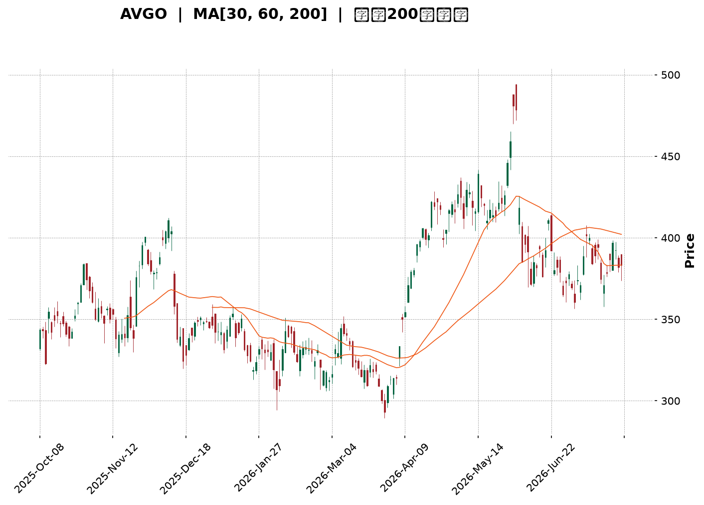
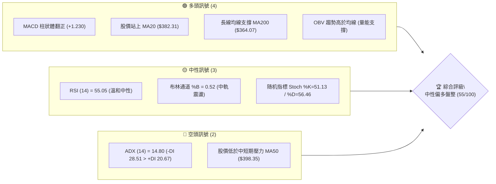
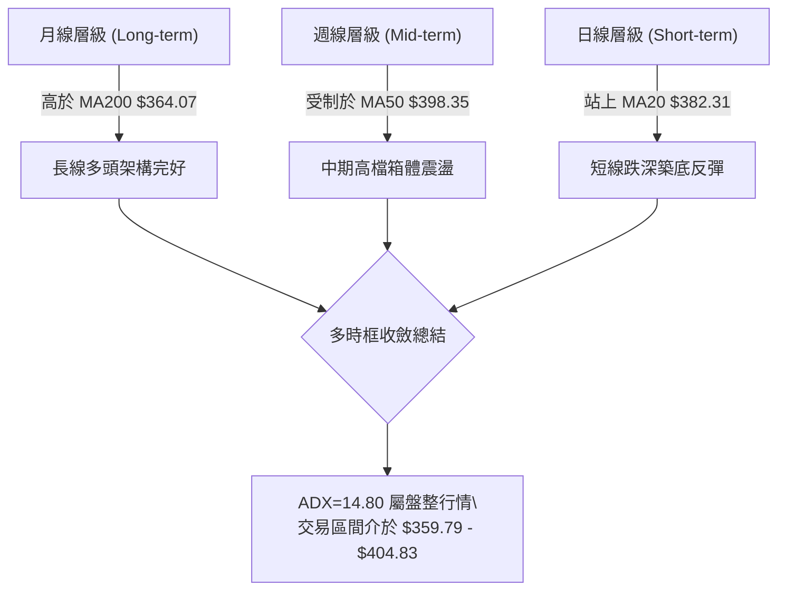
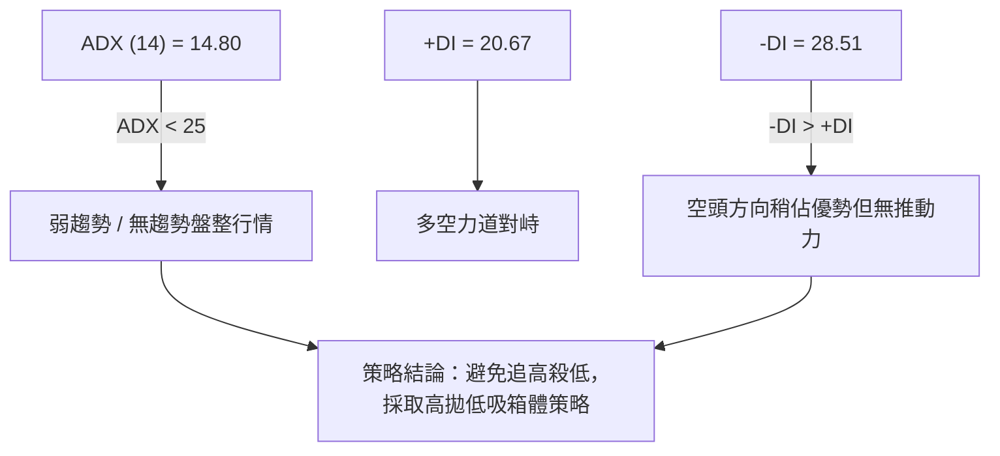
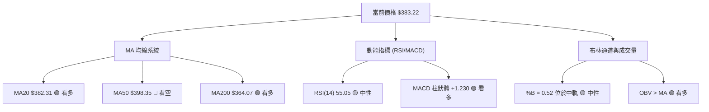
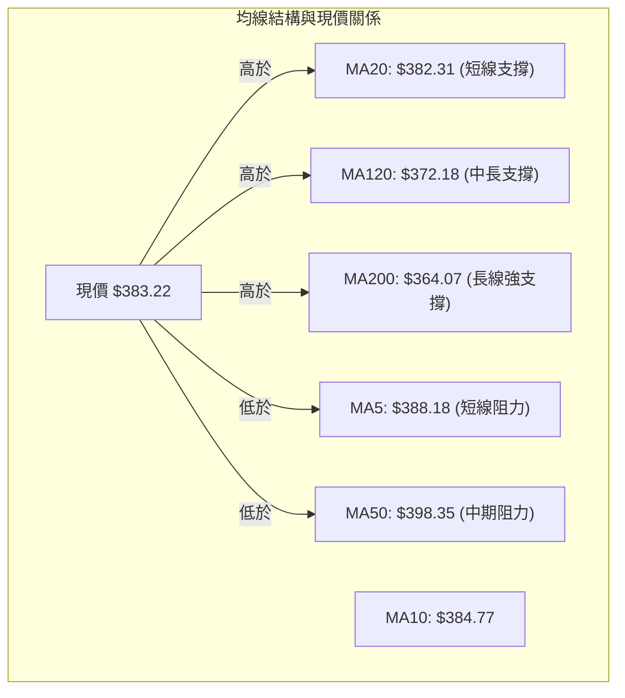
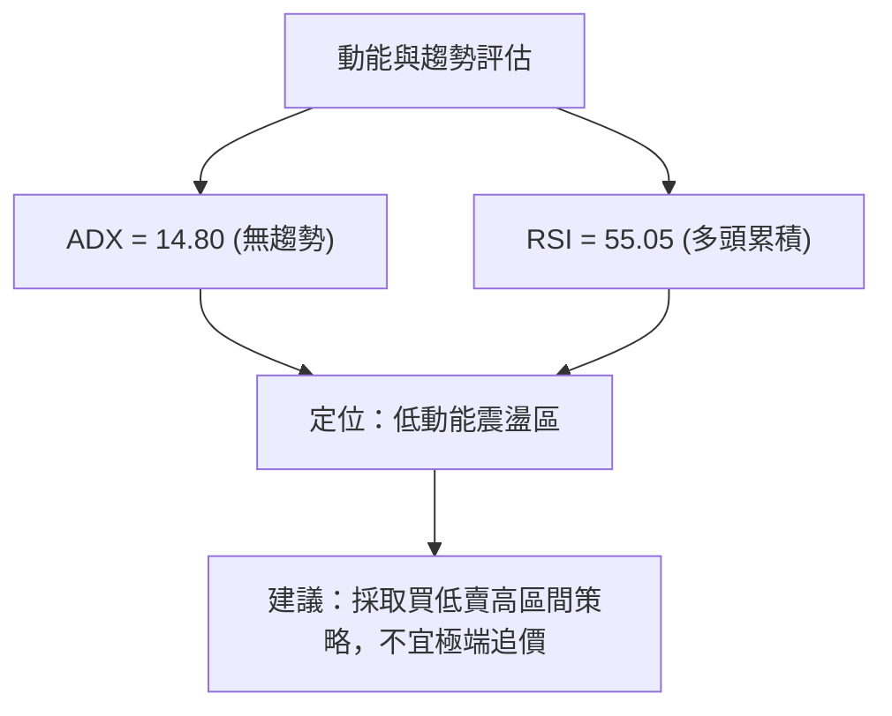
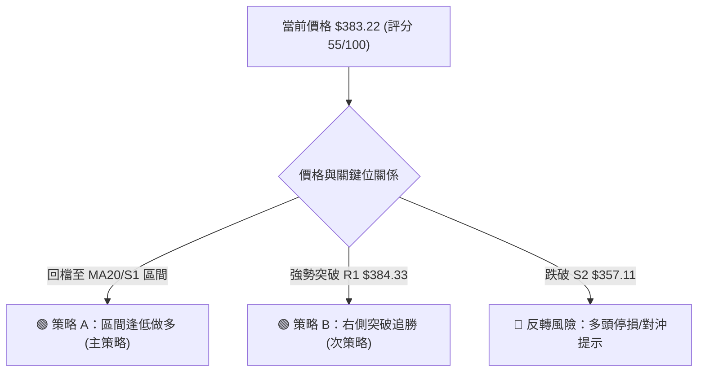
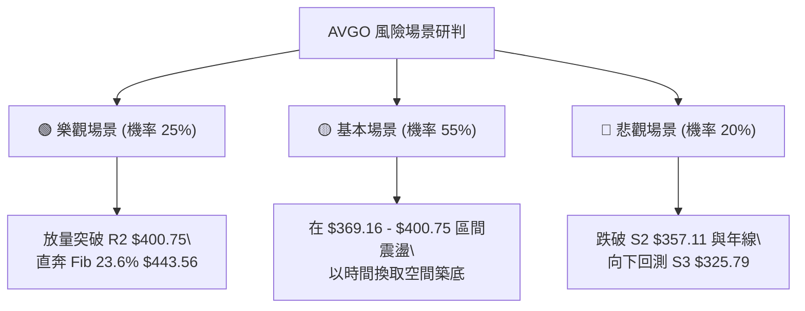

<details>
<summary>📊 靜態圖表 (點擊展開)</summary>

</details>

<html>
<head><meta charset="utf-8" /></head>
<body>
    <div style="height:500px; width:100%;">                        <script>window.PlotlyConfig = {MathJaxConfig: 'local'};</script>
        <script charset="utf-8" src="https://cdn.plot.ly/plotly-3.7.0.min.js" integrity="sha256-jvTGqxNp8AGWEcvNLVuKr+8j5dGe9Yw51LQkmDH+IYA=" crossorigin="anonymous"></script>                <div id="candlestick-chart" class="plotly-graph-div" style="height:100%; width:100%;"></div>            <script>                window.PLOTLYENV=window.PLOTLYENV || {};                                if (document.getElementById("candlestick-chart")) {                    Plotly.newPlot(                        "candlestick-chart",                        [{"close":{"dtype":"f8","bdata":"AAAAYDF5dUAAAABAjnF1QAAAAEAiLXRAAAAA4GQrdkAAAAAgZWN1QAAAAODz1XVAAAAAYNICdkAAAACgIbZ1QAAAAACztHVAAAAAoAFMdUAAAADgdCZ1QAAAAODwZXVAAAAA4IACdkAAAABghIB2QAAAAGBDLndAAAAAgEP9d0AAAACg82V3QAAAAAAf+XZAAAAA4HiIdkAAAACgqN91QAAAAOCrT3ZAAAAAoLsZdkAAAADguLd1QAAAAMBIRnZAAAAAIPrfdUAAAADA2BN2QAAAAIBdIXVAAAAA4NJIdUAAAADg2Et1QAAAAICjKXVAAAAAIB4HdkAAAAAgMo51QAAAAKDdJHVAAAAAoKh9d0AAAAAAJu53QAAAAICrtXhAAAAA4G0LeUAAAADA2v53QAAAAOAYt3dAAAAAYNKnd0AAAABAga53QAAAACALQXhAAAAA4NXteEAAAACgaUB5QAAAAGCyqnlAAAAAgK9BeUAAAABAyV52QAAAAACpHnVAAAAAAF42dUAAAADgP0N0QAAAAICqgHRAAAAAQGkndUAAAABAJkN1QAAAAGCbwHVAAAAAQPTOdUAAAADgZu11QAAAACC5wXVAAAAAQA7JdUAAAADARo11QAAAAKCBpXVAAAAAwI1idUAAAAAAImh1QAAAACDUY3VAAAAA4Ce0dEAAAAAgQ3t1QAAAAGCt7nVAAAAAoO8UdkAAAAAASCp1QAAAAEAtXHVAAAAA4LTmdUAAAACgEbZ0QAAAAOB9eXRAAAAA4LlEdEAAAACAAe5zQAAAACCGOnRAAAAAABm5dEAAAABgRcB0QAAAAEBCmHRAAAAAQFihdEAAAADgUJ50QAAAAAB48nNAAAAA4LUuc0AAAAAg7VVzQAAAAKAru3RAAAAAwNdqdUAAAABgDDN1QAAAAEAIWHVAAAAA4EWfdEAAAAAAoD90QAAAAMActXRAAAAAQJPEdEAAAAAAOsx0QAAAAKDdtnRAAAAAoAqSdEAAAADguUR0QAAAACBysXRAAAAAAE8IdEAAAAAACeZzQAAAAOBl2nNAAAAAwAKLc0AAAABg1cVzQAAAAEDHuHRAAAAAAEaUdEAAAABgsod1QAAAAKApVXVAAAAA4A9FdUAAAACAyut0QAAAAGCkD3RAAAAA4KM7dEAAAACAFwJ0QAAAAOBTrHNAAAAAgKjqc0AAAAAg7VVzQAAAAKABIHRAAAAAwJfcc0AAAABA5uRzQAAAAKDlTnNAAAAAIEfDckAAAABAJE9yQAAAAMBVUHNAAAAAAOqPc0AAAADg2KBzQAAAACDunnNAAAAAgBPXdEAAAAAgN+F1QAAAAECWJXZAAAAA4Gcvd0AAAAAgZrJ3QAAAAEDawndAAAAAYH3BeEAAAAAgct14QAAAAKBcXnlAAAAA4PnveEAAAABgjRh5QAAAAMC2X3pAAAAAQGw0ekAAAADAeGF6QAAAAICgGHpAAAAAwCvzeEAAAAAA80x5QAAAAIBTDHpAAAAAINRJekAAAABAeP15QAAAAID0qnpAAAAAoEiMekAAAACAh755QAAAAOAg1XpAAAAAQAy8ekAAAADgMip6QAAAAEAaAnpAAAAAYIVxe0AAAABASoh6QAAAACC5QHpAAAAAILqmeUAAAAAgmRF6QAAAAICj3nlAAAAAAMXXeUAAAACgfVV6QAAAAAAYU3pAAAAAoH6eekAAAABABuF7QAAAAADks3xAAAAA4PEMfkAAAABgkOd9QAAAAAD4I3pAAAAAgO0ReEAAAACgkr94QAAAACCleHhAAAAAQDE4d0AAAAAgXw94QAAAAOB113dAAAAAgBSVeEAAAADg1YF3QAAAAGB3hHhAAAAAQDOreUAAAACAFIJ4QAAAAGBmwndAAAAAwB7hd0AAAABgj653QAAAAOBR0HZAAAAAQDNHd0AAAAAAAJx3QAAAAKBwFXdAAAAAQDOHdkAAAABgZl53QAAAAOB6LHdAAAAAQApLeEAAAACAwhF5QAAAACCF\u002f3hAAAAAwMwAeEAAAACAwlF4QAAAAOB6pHhAAAAAQDNnd0AAAACgRy13QAAAAGCPondAAAAAAAAoeEAAAADA9cx4QAAAACCFh3hAAAAAYLjed0AAAAAghfN3QA=="},"high":{"dtype":"f8","bdata":"d8CRgr2JdUCdIBna\u002fZV1QMGgaZBWynVAhv7s8ghWdkALQHe2c8t1QLlFjWlaVnZAtObfgXOTdkBO6mmwOdB1QHAHOtmkKXZAZ20AOEvSdUBKC70hIaF1QJDjhrQ3inVAOcgf8NlEdkD0S2alp4t2QMsEZx6bP3dASs8wFjgFeECh8jM18gN4QL6jjXhXi3dAYl+z+ixMd0BGgMFXTe52QC\u002fOac1irXZA2IKEcJaXdkDcsJLkYwh2QMkC9n\u002fmX3ZAa40u1fh9dkCB2BjP6012QBLq+F1G+XVAR8F8tBltdUD7marBy+N1QIxF\u002fRt+oHVAROgQtPdadkCGtTAav193QPAfnkGEqnVAPobhR\u002fC9d0BsFOHceB94QIstp79D2nhAPF801hAMeUDCu6RMdpN4QLcVWc7pdHhACf8tDLbCd0BESSyXAtx3QEbZbOZjdXhAQzkK1FJQeUBdmCtkmEp5QMDwhVDKxHlAFLBZ3k1weUCDxCU38L13QAdrkbm4f3ZAAthmuQOZdUD\u002fCO9+2op1QGC6BX6E4nRAZZMdd5NYdUDwWRX+gY91QGSCyD8zzXVAgsgf8An5dUBHabaJQf91QA4Ikh610HVAaEnHVCv2dUBgPwDNiMl1QHfONXdhdXZA7BWlt6EbdkChYUaATbx1QG2VZCuqxnVAhL\u002fHoLJmdUCY75Ue16F1QOA4JDieCXZAVD95w7pidkDlqVllctZ1QCx8S4FYxnVAx7hJqFcTdkDf0KzzHYJ1QPSauqQU6XRAYWqK\u002fgz8dEAvzBiW7gx0QAndZyyUd3RAquV8goDYdEC3YtTm3yt1QN6mDed463RAIJBBBVcPdUDYD\u002fO1Oe10QHiQvpR\u002fGnVAKzUW2WXlc0C5ETIsTlV0QLabVvtT3HRA+H6\u002f2L\u002fwdUDyf\u002f1Suat1QIO+wMDPnnVAM8U8E06QdUAsuQvSfNF0QHd+Y55I6HRAB1P8DT0KdUDe0+tZKhN1QNkWe5rJLXVACVioVB8UdUB\u002f6UU7rnF0QLkOiqHV6nRAmDQnAxpWdEAA6ip8Ne1zQLwE1qjY7XNABeNE9Yerc0DpMBMuSxd0QHMgb4Mu7nRAyhiJ\u002fvxjdUC+TVwvYLN1QAXuUcCA\u002fXVA8gpzIqeIdUDcHBX5Uil1QNX2d9FAEXVAzSy5aN5\u002fdEBhtALZz2N0QMH1OentQ3RATtjuL1YhdEBZdEXDRwV0QBw0Fw5tX3RAP5EItDI+dEDZsUu3mTx0QKPKnhS1xnNAZlCsuzkwc0Cud6w4nQRzQL\u002fWfFIdXXNAgfAU\u002fae0c0DqygF4FaNzQEnp0n9mvnNAKT7ClfPZdEAU3EBoSRl2QNt\u002fMJghYnZAG5Yjg0d\u002fd0DXWtdwIcR3QI6HiIrQ2ndAUfuFiz3HeEDeAytrxvB4QPriLqVlYXlAWS8kzXFceUCsxZleZS95QItPohCAaHpAKielGhvKekC5R4NAQYV6QG2F\u002fcxPYXpAC4R0K7NSeUA9NC0F\u002fE95QDzw55mAG3pA4clNZAVoekABvbZukHJ6QBd6zHhIC3tACC0WZ9BPe0Cl2PGWDp16QGVNWYMAJXtAYy21lm8Pe0Di0WDElcp6QBQZQfd+H3pADFq2XZOae0D6uipuBAJ7QJgk9ZV9VXpAOYY3GKIUekB+dC4D\u002f3d6QKgz0QpTWXpAIbrmojg1ekCu5CJL9Cl7QCtmx3DbAXtA8IJ8LwTQekC5Esj2DAN8QPtNz0UEFX1ApvNf88KAfkCtK1EufON+QHWn5MDlnHpA5Q1TDZ+deUBlTI88QSN5QHvwOpGbc3lAZM99ozQTeEBPVxnwJk54QCUGYmryBXhADxtL3y65eEBCBxIFvHJ4QMnNyTZFAHlAn\u002fEqI8TAeUAAAACAPep5QAAAAOBRcHhAAAAAANdLeEAAAADAzEx4QAAAAEAKW3dAAAAAIFyDd0AAAACA67l3QAAAAAAAXHdAAAAAAABgd0AAAABgj\u002fJ3QAAAACBcT3dAAAAAoHCxeEAAAADgUXh5QAAAAEAKJ3lAAAAAAAC8eEAAAACgR9V4QAAAAAAA8HhAAAAAANcreEAAAACgmZV3QAAAAKBw+XdAAAAAoEdpeEAAAACgcOl4QAAAAIDC2XhAAAAA4FFUeEAAAABgZl54QA=="},"hovertemplate":"\u003cb\u003e%{x|%Y-%m-%d}\u003c\u002fb\u003e\u003cbr\u003e\u958b: $%{open:.2f}\u003cbr\u003e\u9ad8: $%{high:.2f}\u003cbr\u003e\u4f4e: $%{low:.2f}\u003cbr\u003e\u6536: $%{close:.2f}\u003cextra\u003e\u003c\u002fextra\u003e","low":{"dtype":"f8","bdata":"riQN4kKsdEDUX2s1DCh1QM+oar3nI3RA\u002fE0bXLBZdUDuEaBDHRx1QD4SLK0DmXVA6UYbX624dUAY+bAKGC51QP+lDpVsnnVAE0vl0IY2dUAjj7N2Ptp0QDQV0CsMKHVAdt3TD8vOdUB\u002fTP1ZnhF2QOumG3AniHZAR8ruk8Mxd0CQd22R9v92QDCr3ocLsXZADD3CQmd\u002fdkAtWgfVs9B1QKRngE05wnVA0zzP3ejrdUAzf\u002f4SP\u002fZ0QITFzwgkCnZA2YanpYq7dUBl2DKuhdt1QPCYA5rDxHRAd4jcYJ5zdEBHN515Ofp0QGgMt2c+2nRAN7p+4a3+dEC5CX0PGnR1QE2Hj942n3RARW9yhI+bdUA2Ga5C2hp3QIEdw2b80XdAbEQGhSWveEB3fpweQ+93QAmDiKHGmndA4OjsmlkJd0DcnUL452Z3QPkYB7AO8HdANqNtFfeyeEDpu0\u002fS5JR4QCi0OxtV1XhA9zjGRuR\u002feEDIioV8uxJ2QJYxTsAQ+nRAcRc3cBXTdEBD1LhgD\u002fpzQP4IXyo5HXRAorM195+rdECJjeu2t\u002f90QOt+o47CFHVAj0M17dqddUBZH2U4lKd1QCksvIfMdnVA+76\u002fpEnAdUB6o+S4b4J1QDpf89eqhHVACy9FZz30dEBXhGvdJgx1QPcYYS1b6nRAE5YWhJeUdECvyUNuasR0QJwMQsUtO3VA8LE\u002fH\u002fTZdUBerL0aFdN0QPP+UAuoRnVAIDQXp5hsdUCH\u002fdfGUKl0QPkI24YpMHRAG6r9ZCk7dEDjm3+LUI9zQN0oax3zxnNAAGPPvR1ddECNPOjwA1h0QJtdahis8XNAOrcMxv9xdEBlhtPz3kh0QIZx0VZGOHNAwYFIi3VjckDnKYKmMBlzQKFP1tg5snNAlZ1mqvuWdEAeTBzFeyl1QI1bVtk9yHRAd7YWdJuFdEDfOVUX+Td0QNe9\u002fZxisnNA7rSzyHZgdECq1TkLhYd0QJEp0QbthXRAg4IpNwRCdECsjRMXvJRzQFo00MwkgXRAblurAswsc0CwkknQy01zQEwAcw8pIXNAm+SVT1kkc0CsdeGKiGlzQLxmjKyCHXRAvrdUjSxjdEDgHCC0wSZ0QIbmOYLJOHVAqSJ1nKgPdUDldpJMsa90QPQhZDkBBHRA35RuTyruc0AX3a3IXsFzQErJbRZFpnNAiluYMgs2c0DJPY9ehUxzQMeRW+\u002fqpnNAbziD1Hqlc0AnTwsng8NzQD\u002f5Pj7nSnNA3JcNF12mckDUZ55UBxhyQDMtmp3yfXJAIAxCm9Rfc0AbjYz4XtRyQNC1S5yiXHNArapD5akUdEAoM+3s0V91QC93KvIc73VAv4FHU\u002f+DdkBFNpG4Vg53QJZVG\u002f6ae3dATtDyKl8PeEDKlDQ8rnt4QMXjBA\u002fa8nhAgbuG5GO0eEBQua\u002fwJJ94QFFYlAWGQ3lA25XWmTwSekAWkD43bIN5QLdAQNuY33lAkYj1BmygeEDtO7q9csJ4QKp1T891OXlApAHB5wfKeUBWqdA8II55QPKby3f\u002fKnpAowso1OoRekDyn2kEh1p5QIk74m6I1XlA86GBoA2GekC5c\u002fn7O3x5QMn8oLqQQnlAE4fgwe7ueUD9w+aiLzJ6QK\u002fy8Yhx23lA6QG3mH9TeUCQjtKIUax5QBnjsxefnXlAUPHWD\u002f2YeUDWyiANdQV6QFpc50FP\u002fXlATKSnW7HVeUDPVaWGnOx6QHxDvOJWmHtALL1WKHdbfUBFiyBnSn59QCamdYn4JXlA3Fz\u002f57APeEA+2A+btGt4QNKNYqvqG3dA0gDvBFYpd0BAXc1Xbh93QPgJjfB3hndAJ1sRcMY\u002feEBMND1+1313QEi+ibe54HdAngG6w9RLeUAAAABgj354QAAAAGCPindAAAAAIFyPd0AAAABAM0t3QAAAAKBHvXZAAAAAIFyHdkAAAACAPSp3QAAAAOB6AHdAAAAAQOFGdkAAAABA4TJ3QAAAAAApoHZAAAAAgD2Od0AAAABA4T54QAAAAEAzu3hAAAAAYLj2d0AAAACAPQp4QAAAAADXK3hAAAAAYGY+d0AAAADAzFx2QAAAACBcf3dAAAAAIIWzd0AAAAAAAMB3QAAAAMAeLXhAAAAAAACsd0AAAAAAAFh3QA=="},"name":"\u50f9\u683c","open":{"dtype":"f8","bdata":"RR2evVq\u002fdEB88xq2K311QGTxxl1xd3VAucjgNd3sdUA4fRYq3MJ1QCGLy7LpB3ZAyR2MQvwsdkBFucwblrp1QFKoBqlA\u002fXVA81H\u002fs8rAdUCRHNIW1ZV1QDQV0CsMKHVADsWqWrrodUBGEB8kZ3h2QCmUMgKWiXZAR8ruk8Mxd0Ch8jM18gN4QAFhryaXgndABi41adQed0AOMPoMWkh2QIEQiOrzznVA622oUqZhdkCTVRg4dQN2QJeqds98PnZAzIh+HINPdkC8KSkht0B2QGEX8jXu2XVA7lelvfaZdEBFmkPZ0R51QN+XGB6ZVHVAHAZ51PosdUAwXfqQXb92QGJXsIfIc3VAhH9aq6ycdUAUrGSojux3QBes6OBr9ndAkdlxx\u002f3ReECua4mPZIp4QDv4cgZWInhA3\u002fCNzB2ed0DF40yd76h3QOKgamdJAHhAGynK38oDeUB33ALdcch4QG4p8FdW\u002f3hAXiwqxy4peUAgaTHoep13QB93SLz4fXZANIlgplvidED\u002fCO9+2op1QHiXUk0K4nRA0g0Enre3dEA+xTgGKYx1QK4PoE7yOHVAsvk3T3LWdUDz+Og1WNx1QOpjgtIKt3VAZLEy8vfKdUDnUT2uJMd1QPy5mW3D93VAZNa5MwIXdkAR\u002fypObGV1QINgNm8iR3VAi\u002f1pyFlYdUAcSNtb4Ap1QJwMQsUtO3VAWMrEoVv5dUDPZ5kgB7t1QI8sayxrvXVA7qOKZ\u002fyPdUCSdaK+ZG11QHMrs0B15HRAqGj6RejhdECDk0zGDOJzQJ0I2ioF6nNAQHvkrMuIdEDTJAaqsxl1QOdpYF1utXRAr1SnnISzdEDghm0KnE50QDoTlq0Q+HRAKzUW2WXlc0D0spAs+5JzQCZoxZjN7nNALfaZXOWYdEDzkjORHaN1QHjWPERvmHVAWViLzhZpdUCoy\u002fHkOop0QHaWm3Mb6HNAqeOsG\u002fiEdEDjGIC7mrx0QNx9Fhw+snRADrNzSX2wdEAxEu4YsxV0QK0pGvpqmHRAzV78ltNUdEDeHlqK9FhzQLHAz9aXQ3NASVOgwJ59c0AtTMKPV6hzQB8tp499j3RAGjqq0jNxdEBs3897yGB0QMs5+aszt3VAs7GValJVdUANOE7EAQh1QFcJhPAMB3VABxrS1ixNdEAP6V7aB0l0QABy\u002fDkQ9HNAuzPeyit1c0DPLKUoH+9zQLbGptD113NA0k6fzuj3c0Bar6+oSCF0QKgK6llhmHNAbs66VDIpc0CuyecWUMZyQAee+r+rrnJAsCLSRv+Nc0AuGZs8JABzQPd0Hoz+qHNAZrhlXGtjdEBUxEZgG\u002fN1QMKqooTk+3VAYmRzDOqFdkBhXlXONhF3QJOnGmTYlHdA+tmCBTlUeECr0W91A6Z4QPNq\u002fqBDBHlANOgpVvFQeUAjYCU9dux4QHebwOxjZXlAgRaFpI9bekBsDqKB74R6QMrRM54MPXpAkQemxNb6eEBzqg9fzC15QA4JuXzQ7XlAOcak8PHmeUBFXxM+8hh6QOnGV0TmT3pAw97Jn\u002fIte0CTV8qQdFJ6QLJmtaQvMnpAPpAgvhuvekDjxdukLGx6QGRWz3dy8nlAPwvy4CQBekD6uipuBAJ7QPKKINjnS3pABhguN8KSeUDLW73phcJ5QKLpGBpYznlA6bhE0UgNekAx58NXax16QFqfGXlfhnpAN02wtZdHekAyBmgSQQR7QPB0mnIPFnxAOIgURUiAfkC7rtd6+N9+QO238dR\u002fhXlAIWvwQXRveUDNCRiJvR95QCMEyxWbD3lA7A7cyFrOd0CMj2+msUN3QFZhG5LR8XdAqX6WFimueED39xZ\u002ffll4QDkDiz6IQXhAUTXBtOyOeUAAAABgj9p5QAAAAIDrnXdAAAAAgOspeEAAAACgRyl4QAAAAEAzJ3dAAAAAgOtZd0AAAADgo2x3QAAAAIDrPXdAAAAAIK7bdkAAAACAwll3QAAAAMD16HZAAAAA4FGYd0AAAABACiN5QAAAAAAA6HhAAAAAIK6XeEAAAAAghbt4QAAAAKBwwXhAAAAA4KMIeEAAAADAzOB2QAAAAAAprHdAAAAAIFxjeEAAAABAM8N3QAAAAEAKg3hAAAAAQOE6eEAAAADAHl14QA=="},"x":["2025-10-08T00:00:00-04:00","2025-10-09T00:00:00-04:00","2025-10-10T00:00:00-04:00","2025-10-13T00:00:00-04:00","2025-10-14T00:00:00-04:00","2025-10-15T00:00:00-04:00","2025-10-16T00:00:00-04:00","2025-10-17T00:00:00-04:00","2025-10-20T00:00:00-04:00","2025-10-21T00:00:00-04:00","2025-10-22T00:00:00-04:00","2025-10-23T00:00:00-04:00","2025-10-24T00:00:00-04:00","2025-10-27T00:00:00-04:00","2025-10-28T00:00:00-04:00","2025-10-29T00:00:00-04:00","2025-10-30T00:00:00-04:00","2025-10-31T00:00:00-04:00","2025-11-03T00:00:00-05:00","2025-11-04T00:00:00-05:00","2025-11-05T00:00:00-05:00","2025-11-06T00:00:00-05:00","2025-11-07T00:00:00-05:00","2025-11-10T00:00:00-05:00","2025-11-11T00:00:00-05:00","2025-11-12T00:00:00-05:00","2025-11-13T00:00:00-05:00","2025-11-14T00:00:00-05:00","2025-11-17T00:00:00-05:00","2025-11-18T00:00:00-05:00","2025-11-19T00:00:00-05:00","2025-11-20T00:00:00-05:00","2025-11-21T00:00:00-05:00","2025-11-24T00:00:00-05:00","2025-11-25T00:00:00-05:00","2025-11-26T00:00:00-05:00","2025-11-28T00:00:00-05:00","2025-12-01T00:00:00-05:00","2025-12-02T00:00:00-05:00","2025-12-03T00:00:00-05:00","2025-12-04T00:00:00-05:00","2025-12-05T00:00:00-05:00","2025-12-08T00:00:00-05:00","2025-12-09T00:00:00-05:00","2025-12-10T00:00:00-05:00","2025-12-11T00:00:00-05:00","2025-12-12T00:00:00-05:00","2025-12-15T00:00:00-05:00","2025-12-16T00:00:00-05:00","2025-12-17T00:00:00-05:00","2025-12-18T00:00:00-05:00","2025-12-19T00:00:00-05:00","2025-12-22T00:00:00-05:00","2025-12-23T00:00:00-05:00","2025-12-24T00:00:00-05:00","2025-12-26T00:00:00-05:00","2025-12-29T00:00:00-05:00","2025-12-30T00:00:00-05:00","2025-12-31T00:00:00-05:00","2026-01-02T00:00:00-05:00","2026-01-05T00:00:00-05:00","2026-01-06T00:00:00-05:00","2026-01-07T00:00:00-05:00","2026-01-08T00:00:00-05:00","2026-01-09T00:00:00-05:00","2026-01-12T00:00:00-05:00","2026-01-13T00:00:00-05:00","2026-01-14T00:00:00-05:00","2026-01-15T00:00:00-05:00","2026-01-16T00:00:00-05:00","2026-01-20T00:00:00-05:00","2026-01-21T00:00:00-05:00","2026-01-22T00:00:00-05:00","2026-01-23T00:00:00-05:00","2026-01-26T00:00:00-05:00","2026-01-27T00:00:00-05:00","2026-01-28T00:00:00-05:00","2026-01-29T00:00:00-05:00","2026-01-30T00:00:00-05:00","2026-02-02T00:00:00-05:00","2026-02-03T00:00:00-05:00","2026-02-04T00:00:00-05:00","2026-02-05T00:00:00-05:00","2026-02-06T00:00:00-05:00","2026-02-09T00:00:00-05:00","2026-02-10T00:00:00-05:00","2026-02-11T00:00:00-05:00","2026-02-12T00:00:00-05:00","2026-02-13T00:00:00-05:00","2026-02-17T00:00:00-05:00","2026-02-18T00:00:00-05:00","2026-02-19T00:00:00-05:00","2026-02-20T00:00:00-05:00","2026-02-23T00:00:00-05:00","2026-02-24T00:00:00-05:00","2026-02-25T00:00:00-05:00","2026-02-26T00:00:00-05:00","2026-02-27T00:00:00-05:00","2026-03-02T00:00:00-05:00","2026-03-03T00:00:00-05:00","2026-03-04T00:00:00-05:00","2026-03-05T00:00:00-05:00","2026-03-06T00:00:00-05:00","2026-03-09T00:00:00-04:00","2026-03-10T00:00:00-04:00","2026-03-11T00:00:00-04:00","2026-03-12T00:00:00-04:00","2026-03-13T00:00:00-04:00","2026-03-16T00:00:00-04:00","2026-03-17T00:00:00-04:00","2026-03-18T00:00:00-04:00","2026-03-19T00:00:00-04:00","2026-03-20T00:00:00-04:00","2026-03-23T00:00:00-04:00","2026-03-24T00:00:00-04:00","2026-03-25T00:00:00-04:00","2026-03-26T00:00:00-04:00","2026-03-27T00:00:00-04:00","2026-03-30T00:00:00-04:00","2026-03-31T00:00:00-04:00","2026-04-01T00:00:00-04:00","2026-04-02T00:00:00-04:00","2026-04-06T00:00:00-04:00","2026-04-07T00:00:00-04:00","2026-04-08T00:00:00-04:00","2026-04-09T00:00:00-04:00","2026-04-10T00:00:00-04:00","2026-04-13T00:00:00-04:00","2026-04-14T00:00:00-04:00","2026-04-15T00:00:00-04:00","2026-04-16T00:00:00-04:00","2026-04-17T00:00:00-04:00","2026-04-20T00:00:00-04:00","2026-04-21T00:00:00-04:00","2026-04-22T00:00:00-04:00","2026-04-23T00:00:00-04:00","2026-04-24T00:00:00-04:00","2026-04-27T00:00:00-04:00","2026-04-28T00:00:00-04:00","2026-04-29T00:00:00-04:00","2026-04-30T00:00:00-04:00","2026-05-01T00:00:00-04:00","2026-05-04T00:00:00-04:00","2026-05-05T00:00:00-04:00","2026-05-06T00:00:00-04:00","2026-05-07T00:00:00-04:00","2026-05-08T00:00:00-04:00","2026-05-11T00:00:00-04:00","2026-05-12T00:00:00-04:00","2026-05-13T00:00:00-04:00","2026-05-14T00:00:00-04:00","2026-05-15T00:00:00-04:00","2026-05-18T00:00:00-04:00","2026-05-19T00:00:00-04:00","2026-05-20T00:00:00-04:00","2026-05-21T00:00:00-04:00","2026-05-22T00:00:00-04:00","2026-05-26T00:00:00-04:00","2026-05-27T00:00:00-04:00","2026-05-28T00:00:00-04:00","2026-05-29T00:00:00-04:00","2026-06-01T00:00:00-04:00","2026-06-02T00:00:00-04:00","2026-06-03T00:00:00-04:00","2026-06-04T00:00:00-04:00","2026-06-05T00:00:00-04:00","2026-06-08T00:00:00-04:00","2026-06-09T00:00:00-04:00","2026-06-10T00:00:00-04:00","2026-06-11T00:00:00-04:00","2026-06-12T00:00:00-04:00","2026-06-15T00:00:00-04:00","2026-06-16T00:00:00-04:00","2026-06-17T00:00:00-04:00","2026-06-18T00:00:00-04:00","2026-06-22T00:00:00-04:00","2026-06-23T00:00:00-04:00","2026-06-24T00:00:00-04:00","2026-06-25T00:00:00-04:00","2026-06-26T00:00:00-04:00","2026-06-29T00:00:00-04:00","2026-06-30T00:00:00-04:00","2026-07-01T00:00:00-04:00","2026-07-02T00:00:00-04:00","2026-07-06T00:00:00-04:00","2026-07-07T00:00:00-04:00","2026-07-08T00:00:00-04:00","2026-07-09T00:00:00-04:00","2026-07-10T00:00:00-04:00","2026-07-13T00:00:00-04:00","2026-07-14T00:00:00-04:00","2026-07-15T00:00:00-04:00","2026-07-16T00:00:00-04:00","2026-07-17T00:00:00-04:00","2026-07-20T00:00:00-04:00","2026-07-21T00:00:00-04:00","2026-07-22T00:00:00-04:00","2026-07-23T00:00:00-04:00","2026-07-24T00:00:00-04:00","2026-07-27T00:00:00-04:00"],"type":"candlestick"},{"hovertemplate":"MA30: $%{y:.2f}\u003cextra\u003e\u003c\u002fextra\u003e","line":{"color":"#2196F3","dash":"dash","width":2},"mode":"lines","name":"MA30","x":["2025-10-08T00:00:00-04:00","2025-10-09T00:00:00-04:00","2025-10-10T00:00:00-04:00","2025-10-13T00:00:00-04:00","2025-10-14T00:00:00-04:00","2025-10-15T00:00:00-04:00","2025-10-16T00:00:00-04:00","2025-10-17T00:00:00-04:00","2025-10-20T00:00:00-04:00","2025-10-21T00:00:00-04:00","2025-10-22T00:00:00-04:00","2025-10-23T00:00:00-04:00","2025-10-24T00:00:00-04:00","2025-10-27T00:00:00-04:00","2025-10-28T00:00:00-04:00","2025-10-29T00:00:00-04:00","2025-10-30T00:00:00-04:00","2025-10-31T00:00:00-04:00","2025-11-03T00:00:00-05:00","2025-11-04T00:00:00-05:00","2025-11-05T00:00:00-05:00","2025-11-06T00:00:00-05:00","2025-11-07T00:00:00-05:00","2025-11-10T00:00:00-05:00","2025-11-11T00:00:00-05:00","2025-11-12T00:00:00-05:00","2025-11-13T00:00:00-05:00","2025-11-14T00:00:00-05:00","2025-11-17T00:00:00-05:00","2025-11-18T00:00:00-05:00","2025-11-19T00:00:00-05:00","2025-11-20T00:00:00-05:00","2025-11-21T00:00:00-05:00","2025-11-24T00:00:00-05:00","2025-11-25T00:00:00-05:00","2025-11-26T00:00:00-05:00","2025-11-28T00:00:00-05:00","2025-12-01T00:00:00-05:00","2025-12-02T00:00:00-05:00","2025-12-03T00:00:00-05:00","2025-12-04T00:00:00-05:00","2025-12-05T00:00:00-05:00","2025-12-08T00:00:00-05:00","2025-12-09T00:00:00-05:00","2025-12-10T00:00:00-05:00","2025-12-11T00:00:00-05:00","2025-12-12T00:00:00-05:00","2025-12-15T00:00:00-05:00","2025-12-16T00:00:00-05:00","2025-12-17T00:00:00-05:00","2025-12-18T00:00:00-05:00","2025-12-19T00:00:00-05:00","2025-12-22T00:00:00-05:00","2025-12-23T00:00:00-05:00","2025-12-24T00:00:00-05:00","2025-12-26T00:00:00-05:00","2025-12-29T00:00:00-05:00","2025-12-30T00:00:00-05:00","2025-12-31T00:00:00-05:00","2026-01-02T00:00:00-05:00","2026-01-05T00:00:00-05:00","2026-01-06T00:00:00-05:00","2026-01-07T00:00:00-05:00","2026-01-08T00:00:00-05:00","2026-01-09T00:00:00-05:00","2026-01-12T00:00:00-05:00","2026-01-13T00:00:00-05:00","2026-01-14T00:00:00-05:00","2026-01-15T00:00:00-05:00","2026-01-16T00:00:00-05:00","2026-01-20T00:00:00-05:00","2026-01-21T00:00:00-05:00","2026-01-22T00:00:00-05:00","2026-01-23T00:00:00-05:00","2026-01-26T00:00:00-05:00","2026-01-27T00:00:00-05:00","2026-01-28T00:00:00-05:00","2026-01-29T00:00:00-05:00","2026-01-30T00:00:00-05:00","2026-02-02T00:00:00-05:00","2026-02-03T00:00:00-05:00","2026-02-04T00:00:00-05:00","2026-02-05T00:00:00-05:00","2026-02-06T00:00:00-05:00","2026-02-09T00:00:00-05:00","2026-02-10T00:00:00-05:00","2026-02-11T00:00:00-05:00","2026-02-12T00:00:00-05:00","2026-02-13T00:00:00-05:00","2026-02-17T00:00:00-05:00","2026-02-18T00:00:00-05:00","2026-02-19T00:00:00-05:00","2026-02-20T00:00:00-05:00","2026-02-23T00:00:00-05:00","2026-02-24T00:00:00-05:00","2026-02-25T00:00:00-05:00","2026-02-26T00:00:00-05:00","2026-02-27T00:00:00-05:00","2026-03-02T00:00:00-05:00","2026-03-03T00:00:00-05:00","2026-03-04T00:00:00-05:00","2026-03-05T00:00:00-05:00","2026-03-06T00:00:00-05:00","2026-03-09T00:00:00-04:00","2026-03-10T00:00:00-04:00","2026-03-11T00:00:00-04:00","2026-03-12T00:00:00-04:00","2026-03-13T00:00:00-04:00","2026-03-16T00:00:00-04:00","2026-03-17T00:00:00-04:00","2026-03-18T00:00:00-04:00","2026-03-19T00:00:00-04:00","2026-03-20T00:00:00-04:00","2026-03-23T00:00:00-04:00","2026-03-24T00:00:00-04:00","2026-03-25T00:00:00-04:00","2026-03-26T00:00:00-04:00","2026-03-27T00:00:00-04:00","2026-03-30T00:00:00-04:00","2026-03-31T00:00:00-04:00","2026-04-01T00:00:00-04:00","2026-04-02T00:00:00-04:00","2026-04-06T00:00:00-04:00","2026-04-07T00:00:00-04:00","2026-04-08T00:00:00-04:00","2026-04-09T00:00:00-04:00","2026-04-10T00:00:00-04:00","2026-04-13T00:00:00-04:00","2026-04-14T00:00:00-04:00","2026-04-15T00:00:00-04:00","2026-04-16T00:00:00-04:00","2026-04-17T00:00:00-04:00","2026-04-20T00:00:00-04:00","2026-04-21T00:00:00-04:00","2026-04-22T00:00:00-04:00","2026-04-23T00:00:00-04:00","2026-04-24T00:00:00-04:00","2026-04-27T00:00:00-04:00","2026-04-28T00:00:00-04:00","2026-04-29T00:00:00-04:00","2026-04-30T00:00:00-04:00","2026-05-01T00:00:00-04:00","2026-05-04T00:00:00-04:00","2026-05-05T00:00:00-04:00","2026-05-06T00:00:00-04:00","2026-05-07T00:00:00-04:00","2026-05-08T00:00:00-04:00","2026-05-11T00:00:00-04:00","2026-05-12T00:00:00-04:00","2026-05-13T00:00:00-04:00","2026-05-14T00:00:00-04:00","2026-05-15T00:00:00-04:00","2026-05-18T00:00:00-04:00","2026-05-19T00:00:00-04:00","2026-05-20T00:00:00-04:00","2026-05-21T00:00:00-04:00","2026-05-22T00:00:00-04:00","2026-05-26T00:00:00-04:00","2026-05-27T00:00:00-04:00","2026-05-28T00:00:00-04:00","2026-05-29T00:00:00-04:00","2026-06-01T00:00:00-04:00","2026-06-02T00:00:00-04:00","2026-06-03T00:00:00-04:00","2026-06-04T00:00:00-04:00","2026-06-05T00:00:00-04:00","2026-06-08T00:00:00-04:00","2026-06-09T00:00:00-04:00","2026-06-10T00:00:00-04:00","2026-06-11T00:00:00-04:00","2026-06-12T00:00:00-04:00","2026-06-15T00:00:00-04:00","2026-06-16T00:00:00-04:00","2026-06-17T00:00:00-04:00","2026-06-18T00:00:00-04:00","2026-06-22T00:00:00-04:00","2026-06-23T00:00:00-04:00","2026-06-24T00:00:00-04:00","2026-06-25T00:00:00-04:00","2026-06-26T00:00:00-04:00","2026-06-29T00:00:00-04:00","2026-06-30T00:00:00-04:00","2026-07-01T00:00:00-04:00","2026-07-02T00:00:00-04:00","2026-07-06T00:00:00-04:00","2026-07-07T00:00:00-04:00","2026-07-08T00:00:00-04:00","2026-07-09T00:00:00-04:00","2026-07-10T00:00:00-04:00","2026-07-13T00:00:00-04:00","2026-07-14T00:00:00-04:00","2026-07-15T00:00:00-04:00","2026-07-16T00:00:00-04:00","2026-07-17T00:00:00-04:00","2026-07-20T00:00:00-04:00","2026-07-21T00:00:00-04:00","2026-07-22T00:00:00-04:00","2026-07-23T00:00:00-04:00","2026-07-24T00:00:00-04:00","2026-07-27T00:00:00-04:00"],"y":{"dtype":"f8","bdata":"AAAAAAAA+H8AAAAAAAD4fwAAAAAAAPh\u002fAAAAAAAA+H8AAAAAAAD4fwAAAAAAAPh\u002fAAAAAAAA+H8AAAAAAAD4fwAAAAAAAPh\u002fAAAAAAAA+H8AAAAAAAD4fwAAAAAAAPh\u002fAAAAAAAA+H8AAAAAAAD4fwAAAAAAAPh\u002fAAAAAAAA+H8AAAAAAAD4fwAAAAAAAPh\u002fAAAAAAAA+H8AAAAAAAD4fwAAAAAAAPh\u002fAAAAAAAA+H8AAAAAAAD4fwAAAAAAAPh\u002fAAAAAAAA+H8AAAAAAAD4fwAAAAAAAPh\u002fAAAAAAAA+H8AAAAAAAD4fzMzM6M+6nVAq6qquvnudUAAAAAg7u91QKuqqhow+HVAERERoXYDdkCamZm5Jxl2QImIiNitMXZAVVVV5ZBLdkCJiIiIDl92QAAAABA0cHZA7+7unlSEdkAiIiKi7pl2QAAAAGBNsnZAvLu7mzbLdkDv7u4ureJ2QFVVVRXk93ZAvLu7e7QCd0De3d3N7vl2QCIiIhIe6nZAiYiI6NjedkDv7u6uGdF2QERERLSqwXZARERE5Ja5dkAzMzMjtLV2QM3MzGw\u002fsXZAmpmZKa6wdkCamZkZZq92QM3MzHy+tHZAvLu7uwS5dkAAAAAQM7t2QBERERFUv3ZAmpmZyde5dkC8u7v7krh2QERERESsunZAVVVVteOidkB3d3dH\u002fo12QERERCRLdnZAq6qqqgJddkBERESk20R2QImIiLjCMHZAVVVVRcohdkB3d3c3cQh2QGZmZsYw6HVAMzMzk2vAdUBERES0AZN1QERERNSZZHVAVVVVJeo9dUAzMzPzGDB1QO\u002fu7g6eK3VAZmZmZqYmdUAAAACAryl1QFVVVRXyJHVA3t3dTR8UdUB3d3d3rgN1QKuqqor3+nRAIiIiQqH3dECrqqoKa\u002fF0QFVVVSXl7XRAEREREfjjdECJiIjo2Nh0QLy7u4vV0HRAZmZmdpHLdEAAAAAQX8Z0QM3MzBybwHRAERERAXi\u002fdECJiIgYHrV0QN7d3Q2LqnRAvLu7Ow6ZdEBVVVVVP450QKuqqlpjgXRAERER0UNtdEDv7u7OQWV0QKuqqtpdZ3RAiYiIqARqdEAAAACwrHd0QJqZmYkYgXRAZmZm5sKFdEBVVVVFNod0QJqZmXmognRAiYiImER\u002fdEC8u7t7D3p0QCIiIvK4d3RARERExPx9dEBERETE\u002fH10QDMzM7PQeHRAzczMTIprdEBVVVXlZmB0QAAAAOAHT3RAzczMDCo\u002fdEBERERknS50QEREROS4InRAvLu7+24YdEB3d3dHdA50QO\u002fu7n4fBXRAd3d3l2wHdEAAAACALBV0QKuqqhqUIXRAVVVVVXs8dEBmZmbW5Fx0QM3MzAw+fnRAq6qqmrmqdEAzMzPDLdZ0QAAAAODU\u002fXRAmpmZiQUjdUDNzMw8c0F1QBEREfF3bHVA7+7unpSWdUDv7u5+K8V1QN7d3V2r+HVAERERoesgdkBEREQUFU52QHd3d3d7hHZAmpmZydq6dkARERGxo\u002fN2QGZmZpZ4K3dAREREBIdkd0CrqqrKcpZ3QHd3d\u002fen1ndAmpmZia4aeEDv7u6Ot114QFVVVbXXlnhA7+7unhjaeEDNzMzMAhV5QCIiIqKaTXlAiYiIuKh2eUCJiIi4Z5p5QN7d3W0sunlAMzMzM9rQeUC8u7v7Wud5QImIiOg6\u002fXlAmpmZWSENekDNzMx82SZ6QO\u002fu7u5MQ3pAzczMzO5uekDv7u5u95d6QLy7u5v5lXpA7+7uLsKDekDNzMwc1HV6QGZmZmb2Z3pAERERUTJZekAiIiJSnE56QCIiIiLIO3pAZmZmNjktekAiIiIiCRh6QBEREaGvBXpAq6qq6i7+eUDNzMyMovN5QCIiIiJp2XlAIiIi4gvBeUBERETE26t5QKuqqlqZkHlAVVVVFQ5teUDNzMysHFR5QJqZmbkROXlAiYiIGGseeUDv7u7eYAd5QERERIRf8HhAd3d3FybjeEBmZmaWW9h4QEREROQJzXhAmpmZKbe2eECamZkJV5h4QGZmZmaxdXhAiYiI2Pc8eEBVVVUFjwN4QKuqqqot7ndAREREBOrud0ARERFBXO93QAAAADDb73dAmpmZOWj1d0Dv7u6OevR3QA=="},"type":"scatter"},{"hovertemplate":"MA60: $%{y:.2f}\u003cextra\u003e\u003c\u002fextra\u003e","line":{"color":"#9C27B0","dash":"dash","width":2},"mode":"lines","name":"MA60","x":["2025-10-08T00:00:00-04:00","2025-10-09T00:00:00-04:00","2025-10-10T00:00:00-04:00","2025-10-13T00:00:00-04:00","2025-10-14T00:00:00-04:00","2025-10-15T00:00:00-04:00","2025-10-16T00:00:00-04:00","2025-10-17T00:00:00-04:00","2025-10-20T00:00:00-04:00","2025-10-21T00:00:00-04:00","2025-10-22T00:00:00-04:00","2025-10-23T00:00:00-04:00","2025-10-24T00:00:00-04:00","2025-10-27T00:00:00-04:00","2025-10-28T00:00:00-04:00","2025-10-29T00:00:00-04:00","2025-10-30T00:00:00-04:00","2025-10-31T00:00:00-04:00","2025-11-03T00:00:00-05:00","2025-11-04T00:00:00-05:00","2025-11-05T00:00:00-05:00","2025-11-06T00:00:00-05:00","2025-11-07T00:00:00-05:00","2025-11-10T00:00:00-05:00","2025-11-11T00:00:00-05:00","2025-11-12T00:00:00-05:00","2025-11-13T00:00:00-05:00","2025-11-14T00:00:00-05:00","2025-11-17T00:00:00-05:00","2025-11-18T00:00:00-05:00","2025-11-19T00:00:00-05:00","2025-11-20T00:00:00-05:00","2025-11-21T00:00:00-05:00","2025-11-24T00:00:00-05:00","2025-11-25T00:00:00-05:00","2025-11-26T00:00:00-05:00","2025-11-28T00:00:00-05:00","2025-12-01T00:00:00-05:00","2025-12-02T00:00:00-05:00","2025-12-03T00:00:00-05:00","2025-12-04T00:00:00-05:00","2025-12-05T00:00:00-05:00","2025-12-08T00:00:00-05:00","2025-12-09T00:00:00-05:00","2025-12-10T00:00:00-05:00","2025-12-11T00:00:00-05:00","2025-12-12T00:00:00-05:00","2025-12-15T00:00:00-05:00","2025-12-16T00:00:00-05:00","2025-12-17T00:00:00-05:00","2025-12-18T00:00:00-05:00","2025-12-19T00:00:00-05:00","2025-12-22T00:00:00-05:00","2025-12-23T00:00:00-05:00","2025-12-24T00:00:00-05:00","2025-12-26T00:00:00-05:00","2025-12-29T00:00:00-05:00","2025-12-30T00:00:00-05:00","2025-12-31T00:00:00-05:00","2026-01-02T00:00:00-05:00","2026-01-05T00:00:00-05:00","2026-01-06T00:00:00-05:00","2026-01-07T00:00:00-05:00","2026-01-08T00:00:00-05:00","2026-01-09T00:00:00-05:00","2026-01-12T00:00:00-05:00","2026-01-13T00:00:00-05:00","2026-01-14T00:00:00-05:00","2026-01-15T00:00:00-05:00","2026-01-16T00:00:00-05:00","2026-01-20T00:00:00-05:00","2026-01-21T00:00:00-05:00","2026-01-22T00:00:00-05:00","2026-01-23T00:00:00-05:00","2026-01-26T00:00:00-05:00","2026-01-27T00:00:00-05:00","2026-01-28T00:00:00-05:00","2026-01-29T00:00:00-05:00","2026-01-30T00:00:00-05:00","2026-02-02T00:00:00-05:00","2026-02-03T00:00:00-05:00","2026-02-04T00:00:00-05:00","2026-02-05T00:00:00-05:00","2026-02-06T00:00:00-05:00","2026-02-09T00:00:00-05:00","2026-02-10T00:00:00-05:00","2026-02-11T00:00:00-05:00","2026-02-12T00:00:00-05:00","2026-02-13T00:00:00-05:00","2026-02-17T00:00:00-05:00","2026-02-18T00:00:00-05:00","2026-02-19T00:00:00-05:00","2026-02-20T00:00:00-05:00","2026-02-23T00:00:00-05:00","2026-02-24T00:00:00-05:00","2026-02-25T00:00:00-05:00","2026-02-26T00:00:00-05:00","2026-02-27T00:00:00-05:00","2026-03-02T00:00:00-05:00","2026-03-03T00:00:00-05:00","2026-03-04T00:00:00-05:00","2026-03-05T00:00:00-05:00","2026-03-06T00:00:00-05:00","2026-03-09T00:00:00-04:00","2026-03-10T00:00:00-04:00","2026-03-11T00:00:00-04:00","2026-03-12T00:00:00-04:00","2026-03-13T00:00:00-04:00","2026-03-16T00:00:00-04:00","2026-03-17T00:00:00-04:00","2026-03-18T00:00:00-04:00","2026-03-19T00:00:00-04:00","2026-03-20T00:00:00-04:00","2026-03-23T00:00:00-04:00","2026-03-24T00:00:00-04:00","2026-03-25T00:00:00-04:00","2026-03-26T00:00:00-04:00","2026-03-27T00:00:00-04:00","2026-03-30T00:00:00-04:00","2026-03-31T00:00:00-04:00","2026-04-01T00:00:00-04:00","2026-04-02T00:00:00-04:00","2026-04-06T00:00:00-04:00","2026-04-07T00:00:00-04:00","2026-04-08T00:00:00-04:00","2026-04-09T00:00:00-04:00","2026-04-10T00:00:00-04:00","2026-04-13T00:00:00-04:00","2026-04-14T00:00:00-04:00","2026-04-15T00:00:00-04:00","2026-04-16T00:00:00-04:00","2026-04-17T00:00:00-04:00","2026-04-20T00:00:00-04:00","2026-04-21T00:00:00-04:00","2026-04-22T00:00:00-04:00","2026-04-23T00:00:00-04:00","2026-04-24T00:00:00-04:00","2026-04-27T00:00:00-04:00","2026-04-28T00:00:00-04:00","2026-04-29T00:00:00-04:00","2026-04-30T00:00:00-04:00","2026-05-01T00:00:00-04:00","2026-05-04T00:00:00-04:00","2026-05-05T00:00:00-04:00","2026-05-06T00:00:00-04:00","2026-05-07T00:00:00-04:00","2026-05-08T00:00:00-04:00","2026-05-11T00:00:00-04:00","2026-05-12T00:00:00-04:00","2026-05-13T00:00:00-04:00","2026-05-14T00:00:00-04:00","2026-05-15T00:00:00-04:00","2026-05-18T00:00:00-04:00","2026-05-19T00:00:00-04:00","2026-05-20T00:00:00-04:00","2026-05-21T00:00:00-04:00","2026-05-22T00:00:00-04:00","2026-05-26T00:00:00-04:00","2026-05-27T00:00:00-04:00","2026-05-28T00:00:00-04:00","2026-05-29T00:00:00-04:00","2026-06-01T00:00:00-04:00","2026-06-02T00:00:00-04:00","2026-06-03T00:00:00-04:00","2026-06-04T00:00:00-04:00","2026-06-05T00:00:00-04:00","2026-06-08T00:00:00-04:00","2026-06-09T00:00:00-04:00","2026-06-10T00:00:00-04:00","2026-06-11T00:00:00-04:00","2026-06-12T00:00:00-04:00","2026-06-15T00:00:00-04:00","2026-06-16T00:00:00-04:00","2026-06-17T00:00:00-04:00","2026-06-18T00:00:00-04:00","2026-06-22T00:00:00-04:00","2026-06-23T00:00:00-04:00","2026-06-24T00:00:00-04:00","2026-06-25T00:00:00-04:00","2026-06-26T00:00:00-04:00","2026-06-29T00:00:00-04:00","2026-06-30T00:00:00-04:00","2026-07-01T00:00:00-04:00","2026-07-02T00:00:00-04:00","2026-07-06T00:00:00-04:00","2026-07-07T00:00:00-04:00","2026-07-08T00:00:00-04:00","2026-07-09T00:00:00-04:00","2026-07-10T00:00:00-04:00","2026-07-13T00:00:00-04:00","2026-07-14T00:00:00-04:00","2026-07-15T00:00:00-04:00","2026-07-16T00:00:00-04:00","2026-07-17T00:00:00-04:00","2026-07-20T00:00:00-04:00","2026-07-21T00:00:00-04:00","2026-07-22T00:00:00-04:00","2026-07-23T00:00:00-04:00","2026-07-24T00:00:00-04:00","2026-07-27T00:00:00-04:00"],"y":{"dtype":"f8","bdata":"AAAAAAAA+H8AAAAAAAD4fwAAAAAAAPh\u002fAAAAAAAA+H8AAAAAAAD4fwAAAAAAAPh\u002fAAAAAAAA+H8AAAAAAAD4fwAAAAAAAPh\u002fAAAAAAAA+H8AAAAAAAD4fwAAAAAAAPh\u002fAAAAAAAA+H8AAAAAAAD4fwAAAAAAAPh\u002fAAAAAAAA+H8AAAAAAAD4fwAAAAAAAPh\u002fAAAAAAAA+H8AAAAAAAD4fwAAAAAAAPh\u002fAAAAAAAA+H8AAAAAAAD4fwAAAAAAAPh\u002fAAAAAAAA+H8AAAAAAAD4fwAAAAAAAPh\u002fAAAAAAAA+H8AAAAAAAD4fwAAAAAAAPh\u002fAAAAAAAA+H8AAAAAAAD4fwAAAAAAAPh\u002fAAAAAAAA+H8AAAAAAAD4fwAAAAAAAPh\u002fAAAAAAAA+H8AAAAAAAD4fwAAAAAAAPh\u002fAAAAAAAA+H8AAAAAAAD4fwAAAAAAAPh\u002fAAAAAAAA+H8AAAAAAAD4fwAAAAAAAPh\u002fAAAAAAAA+H8AAAAAAAD4fwAAAAAAAPh\u002fAAAAAAAA+H8AAAAAAAD4fwAAAAAAAPh\u002fAAAAAAAA+H8AAAAAAAD4fwAAAAAAAPh\u002fAAAAAAAA+H8AAAAAAAD4fwAAAAAAAPh\u002fAAAAAAAA+H8AAAAAAAD4fyIiIlrJVHZAIiIiwmhUdkDe3d2NQFR2QHd3dy9uWXZAMzMzKy1TdkCJiIgAk1N2QGZmZn78U3ZAAAAAyElUdkBmZmYW9VF2QERERGR7UHZAIiIicg9TdkDNzMzsL1F2QDMzMxM\u002fTXZAd3d3F9FFdkCamZlx1zp2QM3MzPQ+LnZAiYiIUE8gdkCJiIjgAxV2QImIiBDeCnZAd3d3p78CdkB3d3eXZP11QM3MzGRO83VAERERGdvmdUBVVVVNsdx1QLy7u3sb1nVA3t3dtSfUdUAiIiKSaNB1QBEREdFR0XVAZmZmZn7OdUBERET8Bcp1QGZmZs4UyHVAAAAAoLTCdUDe3d0Feb91QImIiLCjvXVAMzMz2y2xdUAAAAAwjqF1QBERERlrkHVAMzMzcwh7dUDNzMx8jWl1QJqZmQkTWXVAMzMzC4dHdUAzMzOD2TZ1QImIiFDHJ3VA3t3dHTgVdUAiIiIyVwV1QO\u002fu7i7Z8nRA3t3dhdbhdEBEREScp9t0QEREREQj13RAd3d3f\u002fXSdEDe3d1939F0QLy7u4NVznRAERERCQ7JdEDe3d2d1cB0QO\u002fu7h7kuXRAd3d3x5WxdEAAAAD46Kh0QKuqqoJ2nnRA7+7uDpGRdEBmZmYmu4N0QAAAADjHeXRAEREROQBydEC8u7uraWp0QN7d3U3dYnRARERETHJjdEBERERMJWV0QERERJQPZnRAiYiIyMRqdEDe3d0VknV0QLy7u7PQf3RA3t3dtf6LdEARERHJt510QFVVVV2ZsnRAERERGYXGdEBmZmb2j9x0QFVVVT3I9nRAq6qqwisOdUAiIiLiMCZ1QLy7u+upPXVAzczMHBhQdUAAAABIEmR1QM3MzDQafnVA7+7uxmucdUCrqqo60Lh1QM3MzKQk0nVAiYiIqAjodUAAAADYbPt1QLy7u+vXEnZAMzMzS+wsdkCamZl5KkZ2QM3MzEzIXHZAVVVVzUN5dkAiIiKKu5F2QImIiBBdqXZAAAAAqAq\u002fdkBEREQcytd2QERERETg7XZARERExKoGd0ARERHpHyJ3QKuqqnq8PXdAIiIieu1bd0AAAACgg353QHd3d+eQoHdAMzMzK\u002frId0De3d1Vtex3QGZmZsY4AXhA7+7uZisNeEDe3d3Nfx14QCIiIuJQMHhAERER+Q49eEAzMzOzWE54QM3MzMwhYHhAAAAAAAp0eECamZlp1oV4QLy7uxuUmHhAd3d391qxeEC8u7urCsV4QM3MzIwI2HhA3t3dNd3teECamZmpyQR5QAAAAIi4E3lAIiIiWpMjeUDNzMy8jzR5QN7d3S1WQ3lAiYiI6IlKeUC8u7tL5FB5QBEREflFVXlAVVVVJQBaeUARERFJ2195QGZmZmYiZXlAmpmZQexheUAzMzNDmF95QKuqqip\u002fXHlAq6qqUvNVeUAiIiI6w015QDMzM6MTQnlAmpmZGVY5eUDv7u4umDJ5QDMzM8voK3lAVVVVRU0neUCJiIhwiyF5QA=="},"type":"scatter"},{"hovertemplate":"MA200: $%{y:.2f}\u003cextra\u003e\u003c\u002fextra\u003e","line":{"color":"#FF6F00","dash":"solid","width":2},"mode":"lines","name":"MA200","x":["2025-10-08T00:00:00-04:00","2025-10-09T00:00:00-04:00","2025-10-10T00:00:00-04:00","2025-10-13T00:00:00-04:00","2025-10-14T00:00:00-04:00","2025-10-15T00:00:00-04:00","2025-10-16T00:00:00-04:00","2025-10-17T00:00:00-04:00","2025-10-20T00:00:00-04:00","2025-10-21T00:00:00-04:00","2025-10-22T00:00:00-04:00","2025-10-23T00:00:00-04:00","2025-10-24T00:00:00-04:00","2025-10-27T00:00:00-04:00","2025-10-28T00:00:00-04:00","2025-10-29T00:00:00-04:00","2025-10-30T00:00:00-04:00","2025-10-31T00:00:00-04:00","2025-11-03T00:00:00-05:00","2025-11-04T00:00:00-05:00","2025-11-05T00:00:00-05:00","2025-11-06T00:00:00-05:00","2025-11-07T00:00:00-05:00","2025-11-10T00:00:00-05:00","2025-11-11T00:00:00-05:00","2025-11-12T00:00:00-05:00","2025-11-13T00:00:00-05:00","2025-11-14T00:00:00-05:00","2025-11-17T00:00:00-05:00","2025-11-18T00:00:00-05:00","2025-11-19T00:00:00-05:00","2025-11-20T00:00:00-05:00","2025-11-21T00:00:00-05:00","2025-11-24T00:00:00-05:00","2025-11-25T00:00:00-05:00","2025-11-26T00:00:00-05:00","2025-11-28T00:00:00-05:00","2025-12-01T00:00:00-05:00","2025-12-02T00:00:00-05:00","2025-12-03T00:00:00-05:00","2025-12-04T00:00:00-05:00","2025-12-05T00:00:00-05:00","2025-12-08T00:00:00-05:00","2025-12-09T00:00:00-05:00","2025-12-10T00:00:00-05:00","2025-12-11T00:00:00-05:00","2025-12-12T00:00:00-05:00","2025-12-15T00:00:00-05:00","2025-12-16T00:00:00-05:00","2025-12-17T00:00:00-05:00","2025-12-18T00:00:00-05:00","2025-12-19T00:00:00-05:00","2025-12-22T00:00:00-05:00","2025-12-23T00:00:00-05:00","2025-12-24T00:00:00-05:00","2025-12-26T00:00:00-05:00","2025-12-29T00:00:00-05:00","2025-12-30T00:00:00-05:00","2025-12-31T00:00:00-05:00","2026-01-02T00:00:00-05:00","2026-01-05T00:00:00-05:00","2026-01-06T00:00:00-05:00","2026-01-07T00:00:00-05:00","2026-01-08T00:00:00-05:00","2026-01-09T00:00:00-05:00","2026-01-12T00:00:00-05:00","2026-01-13T00:00:00-05:00","2026-01-14T00:00:00-05:00","2026-01-15T00:00:00-05:00","2026-01-16T00:00:00-05:00","2026-01-20T00:00:00-05:00","2026-01-21T00:00:00-05:00","2026-01-22T00:00:00-05:00","2026-01-23T00:00:00-05:00","2026-01-26T00:00:00-05:00","2026-01-27T00:00:00-05:00","2026-01-28T00:00:00-05:00","2026-01-29T00:00:00-05:00","2026-01-30T00:00:00-05:00","2026-02-02T00:00:00-05:00","2026-02-03T00:00:00-05:00","2026-02-04T00:00:00-05:00","2026-02-05T00:00:00-05:00","2026-02-06T00:00:00-05:00","2026-02-09T00:00:00-05:00","2026-02-10T00:00:00-05:00","2026-02-11T00:00:00-05:00","2026-02-12T00:00:00-05:00","2026-02-13T00:00:00-05:00","2026-02-17T00:00:00-05:00","2026-02-18T00:00:00-05:00","2026-02-19T00:00:00-05:00","2026-02-20T00:00:00-05:00","2026-02-23T00:00:00-05:00","2026-02-24T00:00:00-05:00","2026-02-25T00:00:00-05:00","2026-02-26T00:00:00-05:00","2026-02-27T00:00:00-05:00","2026-03-02T00:00:00-05:00","2026-03-03T00:00:00-05:00","2026-03-04T00:00:00-05:00","2026-03-05T00:00:00-05:00","2026-03-06T00:00:00-05:00","2026-03-09T00:00:00-04:00","2026-03-10T00:00:00-04:00","2026-03-11T00:00:00-04:00","2026-03-12T00:00:00-04:00","2026-03-13T00:00:00-04:00","2026-03-16T00:00:00-04:00","2026-03-17T00:00:00-04:00","2026-03-18T00:00:00-04:00","2026-03-19T00:00:00-04:00","2026-03-20T00:00:00-04:00","2026-03-23T00:00:00-04:00","2026-03-24T00:00:00-04:00","2026-03-25T00:00:00-04:00","2026-03-26T00:00:00-04:00","2026-03-27T00:00:00-04:00","2026-03-30T00:00:00-04:00","2026-03-31T00:00:00-04:00","2026-04-01T00:00:00-04:00","2026-04-02T00:00:00-04:00","2026-04-06T00:00:00-04:00","2026-04-07T00:00:00-04:00","2026-04-08T00:00:00-04:00","2026-04-09T00:00:00-04:00","2026-04-10T00:00:00-04:00","2026-04-13T00:00:00-04:00","2026-04-14T00:00:00-04:00","2026-04-15T00:00:00-04:00","2026-04-16T00:00:00-04:00","2026-04-17T00:00:00-04:00","2026-04-20T00:00:00-04:00","2026-04-21T00:00:00-04:00","2026-04-22T00:00:00-04:00","2026-04-23T00:00:00-04:00","2026-04-24T00:00:00-04:00","2026-04-27T00:00:00-04:00","2026-04-28T00:00:00-04:00","2026-04-29T00:00:00-04:00","2026-04-30T00:00:00-04:00","2026-05-01T00:00:00-04:00","2026-05-04T00:00:00-04:00","2026-05-05T00:00:00-04:00","2026-05-06T00:00:00-04:00","2026-05-07T00:00:00-04:00","2026-05-08T00:00:00-04:00","2026-05-11T00:00:00-04:00","2026-05-12T00:00:00-04:00","2026-05-13T00:00:00-04:00","2026-05-14T00:00:00-04:00","2026-05-15T00:00:00-04:00","2026-05-18T00:00:00-04:00","2026-05-19T00:00:00-04:00","2026-05-20T00:00:00-04:00","2026-05-21T00:00:00-04:00","2026-05-22T00:00:00-04:00","2026-05-26T00:00:00-04:00","2026-05-27T00:00:00-04:00","2026-05-28T00:00:00-04:00","2026-05-29T00:00:00-04:00","2026-06-01T00:00:00-04:00","2026-06-02T00:00:00-04:00","2026-06-03T00:00:00-04:00","2026-06-04T00:00:00-04:00","2026-06-05T00:00:00-04:00","2026-06-08T00:00:00-04:00","2026-06-09T00:00:00-04:00","2026-06-10T00:00:00-04:00","2026-06-11T00:00:00-04:00","2026-06-12T00:00:00-04:00","2026-06-15T00:00:00-04:00","2026-06-16T00:00:00-04:00","2026-06-17T00:00:00-04:00","2026-06-18T00:00:00-04:00","2026-06-22T00:00:00-04:00","2026-06-23T00:00:00-04:00","2026-06-24T00:00:00-04:00","2026-06-25T00:00:00-04:00","2026-06-26T00:00:00-04:00","2026-06-29T00:00:00-04:00","2026-06-30T00:00:00-04:00","2026-07-01T00:00:00-04:00","2026-07-02T00:00:00-04:00","2026-07-06T00:00:00-04:00","2026-07-07T00:00:00-04:00","2026-07-08T00:00:00-04:00","2026-07-09T00:00:00-04:00","2026-07-10T00:00:00-04:00","2026-07-13T00:00:00-04:00","2026-07-14T00:00:00-04:00","2026-07-15T00:00:00-04:00","2026-07-16T00:00:00-04:00","2026-07-17T00:00:00-04:00","2026-07-20T00:00:00-04:00","2026-07-21T00:00:00-04:00","2026-07-22T00:00:00-04:00","2026-07-23T00:00:00-04:00","2026-07-24T00:00:00-04:00","2026-07-27T00:00:00-04:00"],"y":{"dtype":"f8","bdata":"AAAAAAAA+H8AAAAAAAD4fwAAAAAAAPh\u002fAAAAAAAA+H8AAAAAAAD4fwAAAAAAAPh\u002fAAAAAAAA+H8AAAAAAAD4fwAAAAAAAPh\u002fAAAAAAAA+H8AAAAAAAD4fwAAAAAAAPh\u002fAAAAAAAA+H8AAAAAAAD4fwAAAAAAAPh\u002fAAAAAAAA+H8AAAAAAAD4fwAAAAAAAPh\u002fAAAAAAAA+H8AAAAAAAD4fwAAAAAAAPh\u002fAAAAAAAA+H8AAAAAAAD4fwAAAAAAAPh\u002fAAAAAAAA+H8AAAAAAAD4fwAAAAAAAPh\u002fAAAAAAAA+H8AAAAAAAD4fwAAAAAAAPh\u002fAAAAAAAA+H8AAAAAAAD4fwAAAAAAAPh\u002fAAAAAAAA+H8AAAAAAAD4fwAAAAAAAPh\u002fAAAAAAAA+H8AAAAAAAD4fwAAAAAAAPh\u002fAAAAAAAA+H8AAAAAAAD4fwAAAAAAAPh\u002fAAAAAAAA+H8AAAAAAAD4fwAAAAAAAPh\u002fAAAAAAAA+H8AAAAAAAD4fwAAAAAAAPh\u002fAAAAAAAA+H8AAAAAAAD4fwAAAAAAAPh\u002fAAAAAAAA+H8AAAAAAAD4fwAAAAAAAPh\u002fAAAAAAAA+H8AAAAAAAD4fwAAAAAAAPh\u002fAAAAAAAA+H8AAAAAAAD4fwAAAAAAAPh\u002fAAAAAAAA+H8AAAAAAAD4fwAAAAAAAPh\u002fAAAAAAAA+H8AAAAAAAD4fwAAAAAAAPh\u002fAAAAAAAA+H8AAAAAAAD4fwAAAAAAAPh\u002fAAAAAAAA+H8AAAAAAAD4fwAAAAAAAPh\u002fAAAAAAAA+H8AAAAAAAD4fwAAAAAAAPh\u002fAAAAAAAA+H8AAAAAAAD4fwAAAAAAAPh\u002fAAAAAAAA+H8AAAAAAAD4fwAAAAAAAPh\u002fAAAAAAAA+H8AAAAAAAD4fwAAAAAAAPh\u002fAAAAAAAA+H8AAAAAAAD4fwAAAAAAAPh\u002fAAAAAAAA+H8AAAAAAAD4fwAAAAAAAPh\u002fAAAAAAAA+H8AAAAAAAD4fwAAAAAAAPh\u002fAAAAAAAA+H8AAAAAAAD4fwAAAAAAAPh\u002fAAAAAAAA+H8AAAAAAAD4fwAAAAAAAPh\u002fAAAAAAAA+H8AAAAAAAD4fwAAAAAAAPh\u002fAAAAAAAA+H8AAAAAAAD4fwAAAAAAAPh\u002fAAAAAAAA+H8AAAAAAAD4fwAAAAAAAPh\u002fAAAAAAAA+H8AAAAAAAD4fwAAAAAAAPh\u002fAAAAAAAA+H8AAAAAAAD4fwAAAAAAAPh\u002fAAAAAAAA+H8AAAAAAAD4fwAAAAAAAPh\u002fAAAAAAAA+H8AAAAAAAD4fwAAAAAAAPh\u002fAAAAAAAA+H8AAAAAAAD4fwAAAAAAAPh\u002fAAAAAAAA+H8AAAAAAAD4fwAAAAAAAPh\u002fAAAAAAAA+H8AAAAAAAD4fwAAAAAAAPh\u002fAAAAAAAA+H8AAAAAAAD4fwAAAAAAAPh\u002fAAAAAAAA+H8AAAAAAAD4fwAAAAAAAPh\u002fAAAAAAAA+H8AAAAAAAD4fwAAAAAAAPh\u002fAAAAAAAA+H8AAAAAAAD4fwAAAAAAAPh\u002fAAAAAAAA+H8AAAAAAAD4fwAAAAAAAPh\u002fAAAAAAAA+H8AAAAAAAD4fwAAAAAAAPh\u002fAAAAAAAA+H8AAAAAAAD4fwAAAAAAAPh\u002fAAAAAAAA+H8AAAAAAAD4fwAAAAAAAPh\u002fAAAAAAAA+H8AAAAAAAD4fwAAAAAAAPh\u002fAAAAAAAA+H8AAAAAAAD4fwAAAAAAAPh\u002fAAAAAAAA+H8AAAAAAAD4fwAAAAAAAPh\u002fAAAAAAAA+H8AAAAAAAD4fwAAAAAAAPh\u002fAAAAAAAA+H8AAAAAAAD4fwAAAAAAAPh\u002fAAAAAAAA+H8AAAAAAAD4fwAAAAAAAPh\u002fAAAAAAAA+H8AAAAAAAD4fwAAAAAAAPh\u002fAAAAAAAA+H8AAAAAAAD4fwAAAAAAAPh\u002fAAAAAAAA+H8AAAAAAAD4fwAAAAAAAPh\u002fAAAAAAAA+H8AAAAAAAD4fwAAAAAAAPh\u002fAAAAAAAA+H8AAAAAAAD4fwAAAAAAAPh\u002fAAAAAAAA+H8AAAAAAAD4fwAAAAAAAPh\u002fAAAAAAAA+H8AAAAAAAD4fwAAAAAAAPh\u002fAAAAAAAA+H8AAAAAAAD4fwAAAAAAAPh\u002fAAAAAAAA+H8AAAAAAAD4fwAAAAAAAPh\u002fAAAAAAAA+H\u002f2KFxTL8F2QA=="},"type":"scatter"}],                        {"template":{"data":{"barpolar":[{"marker":{"line":{"color":"rgb(17,17,17)","width":0.5},"pattern":{"fillmode":"overlay","size":10,"solidity":0.2}},"type":"barpolar"}],"bar":[{"error_x":{"color":"#f2f5fa"},"error_y":{"color":"#f2f5fa"},"marker":{"line":{"color":"rgb(17,17,17)","width":0.5},"pattern":{"fillmode":"overlay","size":10,"solidity":0.2}},"type":"bar"}],"carpet":[{"aaxis":{"endlinecolor":"#A2B1C6","gridcolor":"#506784","linecolor":"#506784","minorgridcolor":"#506784","startlinecolor":"#A2B1C6"},"baxis":{"endlinecolor":"#A2B1C6","gridcolor":"#506784","linecolor":"#506784","minorgridcolor":"#506784","startlinecolor":"#A2B1C6"},"type":"carpet"}],"choropleth":[{"colorbar":{"outlinewidth":0,"ticks":""},"type":"choropleth"}],"contourcarpet":[{"colorbar":{"outlinewidth":0,"ticks":""},"type":"contourcarpet"}],"contour":[{"colorbar":{"outlinewidth":0,"ticks":""},"colorscale":[[0.0,"#0d0887"],[0.1111111111111111,"#46039f"],[0.2222222222222222,"#7201a8"],[0.3333333333333333,"#9c179e"],[0.4444444444444444,"#bd3786"],[0.5555555555555556,"#d8576b"],[0.6666666666666666,"#ed7953"],[0.7777777777777778,"#fb9f3a"],[0.8888888888888888,"#fdca26"],[1.0,"#f0f921"]],"type":"contour"}],"heatmap":[{"colorbar":{"outlinewidth":0,"ticks":""},"colorscale":[[0.0,"#0d0887"],[0.1111111111111111,"#46039f"],[0.2222222222222222,"#7201a8"],[0.3333333333333333,"#9c179e"],[0.4444444444444444,"#bd3786"],[0.5555555555555556,"#d8576b"],[0.6666666666666666,"#ed7953"],[0.7777777777777778,"#fb9f3a"],[0.8888888888888888,"#fdca26"],[1.0,"#f0f921"]],"type":"heatmap"}],"histogram2dcontour":[{"colorbar":{"outlinewidth":0,"ticks":""},"colorscale":[[0.0,"#0d0887"],[0.1111111111111111,"#46039f"],[0.2222222222222222,"#7201a8"],[0.3333333333333333,"#9c179e"],[0.4444444444444444,"#bd3786"],[0.5555555555555556,"#d8576b"],[0.6666666666666666,"#ed7953"],[0.7777777777777778,"#fb9f3a"],[0.8888888888888888,"#fdca26"],[1.0,"#f0f921"]],"type":"histogram2dcontour"}],"histogram2d":[{"colorbar":{"outlinewidth":0,"ticks":""},"colorscale":[[0.0,"#0d0887"],[0.1111111111111111,"#46039f"],[0.2222222222222222,"#7201a8"],[0.3333333333333333,"#9c179e"],[0.4444444444444444,"#bd3786"],[0.5555555555555556,"#d8576b"],[0.6666666666666666,"#ed7953"],[0.7777777777777778,"#fb9f3a"],[0.8888888888888888,"#fdca26"],[1.0,"#f0f921"]],"type":"histogram2d"}],"histogram":[{"marker":{"pattern":{"fillmode":"overlay","size":10,"solidity":0.2}},"type":"histogram"}],"mesh3d":[{"colorbar":{"outlinewidth":0,"ticks":""},"type":"mesh3d"}],"parcoords":[{"line":{"colorbar":{"outlinewidth":0,"ticks":""}},"type":"parcoords"}],"pie":[{"automargin":true,"type":"pie"}],"scatter3d":[{"line":{"colorbar":{"outlinewidth":0,"ticks":""}},"marker":{"colorbar":{"outlinewidth":0,"ticks":""}},"type":"scatter3d"}],"scattercarpet":[{"marker":{"colorbar":{"outlinewidth":0,"ticks":""}},"type":"scattercarpet"}],"scattergeo":[{"marker":{"colorbar":{"outlinewidth":0,"ticks":""}},"type":"scattergeo"}],"scattergl":[{"marker":{"line":{"color":"#283442"}},"type":"scattergl"}],"scattermapbox":[{"marker":{"colorbar":{"outlinewidth":0,"ticks":""}},"type":"scattermapbox"}],"scattermap":[{"marker":{"colorbar":{"outlinewidth":0,"ticks":""}},"type":"scattermap"}],"scatterpolargl":[{"marker":{"colorbar":{"outlinewidth":0,"ticks":""}},"type":"scatterpolargl"}],"scatterpolar":[{"marker":{"colorbar":{"outlinewidth":0,"ticks":""}},"type":"scatterpolar"}],"scatter":[{"marker":{"line":{"color":"#283442"}},"type":"scatter"}],"scatterternary":[{"marker":{"colorbar":{"outlinewidth":0,"ticks":""}},"type":"scatterternary"}],"surface":[{"colorbar":{"outlinewidth":0,"ticks":""},"colorscale":[[0.0,"#0d0887"],[0.1111111111111111,"#46039f"],[0.2222222222222222,"#7201a8"],[0.3333333333333333,"#9c179e"],[0.4444444444444444,"#bd3786"],[0.5555555555555556,"#d8576b"],[0.6666666666666666,"#ed7953"],[0.7777777777777778,"#fb9f3a"],[0.8888888888888888,"#fdca26"],[1.0,"#f0f921"]],"type":"surface"}],"table":[{"cells":{"fill":{"color":"#506784"},"line":{"color":"rgb(17,17,17)"}},"header":{"fill":{"color":"#2a3f5f"},"line":{"color":"rgb(17,17,17)"}},"type":"table"}]},"layout":{"annotationdefaults":{"arrowcolor":"#f2f5fa","arrowhead":0,"arrowwidth":1},"autotypenumbers":"strict","coloraxis":{"colorbar":{"outlinewidth":0,"ticks":""}},"colorscale":{"diverging":[[0,"#8e0152"],[0.1,"#c51b7d"],[0.2,"#de77ae"],[0.3,"#f1b6da"],[0.4,"#fde0ef"],[0.5,"#f7f7f7"],[0.6,"#e6f5d0"],[0.7,"#b8e186"],[0.8,"#7fbc41"],[0.9,"#4d9221"],[1,"#276419"]],"sequential":[[0.0,"#0d0887"],[0.1111111111111111,"#46039f"],[0.2222222222222222,"#7201a8"],[0.3333333333333333,"#9c179e"],[0.4444444444444444,"#bd3786"],[0.5555555555555556,"#d8576b"],[0.6666666666666666,"#ed7953"],[0.7777777777777778,"#fb9f3a"],[0.8888888888888888,"#fdca26"],[1.0,"#f0f921"]],"sequentialminus":[[0.0,"#0d0887"],[0.1111111111111111,"#46039f"],[0.2222222222222222,"#7201a8"],[0.3333333333333333,"#9c179e"],[0.4444444444444444,"#bd3786"],[0.5555555555555556,"#d8576b"],[0.6666666666666666,"#ed7953"],[0.7777777777777778,"#fb9f3a"],[0.8888888888888888,"#fdca26"],[1.0,"#f0f921"]]},"colorway":["#636efa","#EF553B","#00cc96","#ab63fa","#FFA15A","#19d3f3","#FF6692","#B6E880","#FF97FF","#FECB52"],"font":{"color":"#f2f5fa"},"geo":{"bgcolor":"rgb(17,17,17)","lakecolor":"rgb(17,17,17)","landcolor":"rgb(17,17,17)","showlakes":true,"showland":true,"subunitcolor":"#506784"},"hoverlabel":{"align":"left"},"hovermode":"closest","mapbox":{"style":"dark"},"paper_bgcolor":"rgb(17,17,17)","plot_bgcolor":"rgb(17,17,17)","polar":{"angularaxis":{"gridcolor":"#506784","linecolor":"#506784","ticks":""},"bgcolor":"rgb(17,17,17)","radialaxis":{"gridcolor":"#506784","linecolor":"#506784","ticks":""}},"scene":{"xaxis":{"backgroundcolor":"rgb(17,17,17)","gridcolor":"#506784","gridwidth":2,"linecolor":"#506784","showbackground":true,"ticks":"","zerolinecolor":"#C8D4E3"},"yaxis":{"backgroundcolor":"rgb(17,17,17)","gridcolor":"#506784","gridwidth":2,"linecolor":"#506784","showbackground":true,"ticks":"","zerolinecolor":"#C8D4E3"},"zaxis":{"backgroundcolor":"rgb(17,17,17)","gridcolor":"#506784","gridwidth":2,"linecolor":"#506784","showbackground":true,"ticks":"","zerolinecolor":"#C8D4E3"}},"shapedefaults":{"line":{"color":"#f2f5fa"}},"sliderdefaults":{"bgcolor":"#C8D4E3","bordercolor":"rgb(17,17,17)","borderwidth":1,"tickwidth":0},"ternary":{"aaxis":{"gridcolor":"#506784","linecolor":"#506784","ticks":""},"baxis":{"gridcolor":"#506784","linecolor":"#506784","ticks":""},"bgcolor":"rgb(17,17,17)","caxis":{"gridcolor":"#506784","linecolor":"#506784","ticks":""}},"title":{"x":0.05},"updatemenudefaults":{"bgcolor":"#506784","borderwidth":0},"xaxis":{"automargin":true,"gridcolor":"#283442","linecolor":"#506784","ticks":"","title":{"standoff":15},"zerolinecolor":"#283442","zerolinewidth":2},"yaxis":{"automargin":true,"gridcolor":"#283442","linecolor":"#506784","ticks":"","title":{"standoff":15},"zerolinecolor":"#283442","zerolinewidth":2}}},"xaxis":{"rangeslider":{"visible":false},"title":{"text":"\u65e5\u671f"}},"font":{"size":11},"title":{"text":"AVGO  |  MA(30\u002f60\u002f200)  |  \u6700\u8fd1200\u4ea4\u6613\u65e5"},"yaxis":{"title":{"text":"\u80a1\u50f9 (USD)"}},"hovermode":"x unified","height":500},                        {"responsive": true}                    )                };            </script>        </div>
</body>
</html>

# AVGO 技術分析報告

> **報告日期**：2026-07-28 ｜ **語言**：繁體中文 ｜ **數據來源**：Yahoo Finance ｜ **當前價格**：$383.22

---

## 目錄

| 章節 | 內容 |
|------|------|
| [1. 技術面概覽](#1-技術面概覽) | 訊號儀表板、核心指標、評分卡 |
| [2. 趨勢分析](#2-趨勢分析) | 多時框趨勢、長中短期走勢 |
| [3. 圖表形態分析](#3-圖表形態分析) | 形態識別、K線組合、目標價 |
| [4. 支撐與阻力](#4-支撐與阻力) | 關鍵價位、斐波那契回調 |
| [5. 技術指標深度解讀](#5-技術指標深度解讀) | MA/RSI/MACD/布林/成交量 |
| [6. 動能與波動率](#6-動能與波動率) | 動能評估、ATR、Beta |
| [7. 多時框架總結](#7-多時框架總結) | 時框架評分矩陣 |
| [8. 交易策略建議](#8-交易策略建議) | 多空策略、風險報酬比 |
| [9. 風險提示與監控](#9-風險提示與監控) | 監控指標、風險場景 |

---

## 1. 技術面概覽

### 🎯 技術訊號儀表板



### 📊 核心指標速覽表

| 指標類別 | 指標名稱 | 當前數值 | 訊號 | 解讀 |
|----------|----------|----------|------|------|
| **價格** | 當前收盤價 | $383.22 | 🟢 多頭 | 位於 52 週區間 48.3% 位置，短線自底部反彈 |
| **均線** | MA20 (月線) | $382.31 | 🟢 多頭 | 價格重新站上 MA20，短線止跌回穩 |
| **均線** | MA50 (季線) | $398.35 | 🔴 空頭 | 價格位於 MA50 下方，中期承壓 |
| **均線** | MA200 (年線) | $364.07 | 🟢 多頭 | 長期多頭趨勢防線未破，下檔具強支撐 |
| **動能** | RSI(14) | 55.05 | 🟡 中性 | 處於 30-70 中性區間，動能溫和上升 |
| **動能** | MACD (12,26,9) | -1.758 / +1.230 | 🟢 多頭 | DIF 位於零軸下但柱狀體擴張，呈現黃金交叉反彈 |
| **波動** | ATR(14) | $15.67 (4.09%) | 🟡 中性 | 每日波幅適中，提供合理的止損設置空間 |

### 🏆 技術評分卡

```
╔══════════════════════════════════════════════════════════════════╗
║                   技術評分卡 — AVGO (2026-07-28)                ║
╠══════════════════════════════════════════════════════════════════╣
║ 趨勢強度      ▓▓▓▓▓▓▓▓░░░░░░░░░░░░  40/100  🟡 中性 (ADX=14.80)  ║
║ 動能指標      ▓▓▓▓▓▓▓▓▓▓▓▓░░░░░░░░  60/100  🟢 看多 (MACD柱翻正) ║
║ 支撐穩定度    ▓▓▓▓▓▓▓▓▓▓▓▓▓▓░░░░░░  70/100  🟢 看多 (MA200/S1支撐)║
║ 成交量配合    ▓▓▓▓▓▓▓▓▓▓░░░░░░░░░░  50/100  🟡 中性 (量比0.86x)  ║
║ 形態完整度    ▓▓▓▓▓▓▓▓▓▓▓▓░░░░░░░░  60/100  🟢 看多 (區間築底)   ║
║ 均線排列      ▓▓▓▓▓▓▓▓▓▓░░░░░░░░░░  50/100  🟡 中性 (混合排列)   ║
╠══════════════════════════════════════════════════════════════════╣
║ 綜合評分      ▓▓▓▓▓▓▓▓▓▓▓░░░░░░░░░  55/100  🟡 中性偏多盤整      ║
╚══════════════════════════════════════════════════════════════════╝
```

---

## 2. 趨勢分析

### 🌐 多時框趨勢分析



### 📈 長期趨勢 — 24個月歷史走勢圖

下圖展示 AVGO 近 12 個月收盤價走勢，標註關鍵高低點：

```
AVGO 月線走勢圖（過去12個月）
價格軸 ($)
$450 ┤                                  ● $446.06 (2026-05)
$400 ┤                   ● $400.71            ● $377.75  ● $383.22 (現在)
$350 ┤  ● $328.07  ● $367.57      ● $344.83  ● $330.08  ● $309.02
$300 ┤● $295.23
$250 ┴─────────────────────────────────────────────────────────────
      08/25  09/25  10/25  11/25  12/25  01/26  02/26  03/26  04/26  05/26  06/26  07/26
```

#### 走勢特徵分析表格

| 階段 | 時間區間 | 收盤價變動區間 | 變動幅度 | 走勢特徵與驅動因素 |
|------|----------|----------------|----------|----------------────|
| **第1階段** | 2025-08 ~ 2025-11 | $295.23 → $400.71 | +35.7% | **主升段爆發**：AI 晶片與網路晶片需求強勁，創下波段高點。 |
| **第2階段** | 2025-12 ~ 2026-03 | $344.83 → $309.02 | -22.9% | **中場獲利回吐**：大盤修正與籌碼整理，回探 $300 關卡。 |
| **第3階段** | 2026-04 ~ 2026-05 | $416.77 → $446.06 | +44.3% | **二次拉升**：營收高成長激勵，股價再衝 $446 高檔。 |
| **第4階段** | 2026-06 ~ 2026-07 | $377.75 → $383.22 | +1.45% | **震盪築底**：回測 $360 附近（S1/S2）後止跌，進入狹幅震盪。 |

### 📊 中期趨勢（週線分析）

從近 20 週收盤走勢觀察，AVGO 在 2026 年 5 月底觸及 $446.06 高點後，於 6 月下旬遭遇拋售，股價快速修正至 7 月初低點 $360.45（貼近斐波那契 61.8% 回調位 $361.56）。

目前週線 MACD 柱狀體收斂至 +1.230，RSI(14) 回升至 55.05，顯示賣壓已顯著減弱，中期進入 **$360.00 – $404.00 區間箱體整理**。

### ⚡ 趨勢強度評估（ADX 解讀）



#### ADX 趨勢強度指標對照表

| 指標名稱 | 當前數值 | 參考臨界值 | 狀態判定 | 技術含義 |
|----------|----------|------------|----------|----------|
| **ADX(14)** | **14.80** | 25.00 | 🟡 無趨勢 (無方向) | 市場缺乏單邊趨勢，價格屬於區間震盪模式。 |
| **+DI** | **20.67** | - | 🟡 買盤力道偏弱 | 多頭推升力道不足以發動強攻。 |
| **-DI** | **28.51** | - | 🔴 賣盤力道略勝 | 賣壓雖主導方向但因 ADX 過低無法形成強殺盤。 |

---

## 3. 圖表形態分析

### 🔍 形態識別系統

在日線與週線層級中，數據明確顯示 AVGO 正在形成 **矩形箱體盤整 (Box Range Consolidation)** 與 **潛在雙重底 (Potential Double Bottom)** 雛形。

| 形態名稱 | 信心度 (%) | 判斷依據（引用數據） | 完成度 (%) | 目標價（附計算式） |
|----------|------------|----------------------|------------|--------------------|
| **矩形箱體盤整** | **80%** 🟢 | 股價受限於下軌 $359.79 (BB下軌) 與上軌 $404.83 (BB上軌) 之間 | 85% | 突破箱頂 $400.75 + 箱高 ($400.75 - $369.16 = $31.59) = **$432.34** |
| **雙重底雛形** | **55%** 🟡 | 兩次下探低點：7/5 低點 $360.45 與 7/19 低點 $370.83（接近 S1 $369.16） | 60% | 突破頸線 $384.33 + 底高 ($384.33 - $360.45 = $23.88) = **$408.21** |

### 🕯️ 重要 K 線形態分析

| 日期 | 收盤價 | K 線形態 | 技術解讀 | 多空訊號 |
|------|--------|----------|----------|----------|
| **2026-07-05** | $360.45 | 錘子線 (Hammer) | 股價下殺至 $360 關卡探底成功，長下影線顯示下方買盤承接強勁。 | 🟢 看多反轉 |
| **2026-07-12** | $399.97 | 大陽線 (Bullish Long Day) | 週線強勢反彈 +39.52 美元，突破 MA20，多頭重新掌控短線主導權。 | 🟢 看多續強 |
| **2026-07-19** | $370.83 | 陰包陽修正 (Pullback) | 遇阻於 MA50 $398.35 附近回檔，尋求 S1 $369.16 支撐。 | 🔴 短線修正 |
| **2026-07-28** | $383.22 | 溫和陽線 (Steady Rebound) | 收復 MA20 $382.31，站上布林中軌，呈小步上攻姿態。 | 🟢 中性偏多 |

### 📉 ASCII 走勢形態示意圖

```
AVGO 箱體震盪與雙底反彈示意圖
═════════════════════════════════════════════════════════════
$404.83 ┤───────────────────────────● (BB 上軌 / 壓力 R2 $400.75)
        │                          / \
$384.33 ┤─────────● (頸線 R1)─────/───●現價 $383.22
        │        / \             /
$369.16 ┤───────/───● (第二底 $370.83) (S1 支撐)
        │      /
$360.45 ┤─────● (第一底 $360.45) (S2 $357.11 / BB 下軌 $359.79)
═════════════════════════════════════════════════════════════
```

### 🎯 形態目標價計算

1. **雙底形態目標價推算**：
   - 頸線位置：R1 = **$384.33**
   - 形態底部：以 2026-07-05 低點 **$360.45** 計算
   - 形態高度 = $384.33 - $360.45 = **$23.88**
   - **雙底目標價** = $384.33 + $23.88 = **$408.21** （接近阻力位 R3 $411.49）

2. **箱體突破目標價推算**：
   - 箱體頂部：R2 = **$400.75**
   - 箱體底部：S1 = **$369.16**
   - 箱體高度 = $400.75 - $369.16 = **$31.59**
   - **箱體突破目標價** = $400.75 + $31.59 = **$432.34** （接近斐波那契 23.6% 回調位 $443.56）

---

## 4. 支撐與阻力

### 🗺️ 關鍵價位分布圖

```
AVGO 價位結構分布圖 (由 OHLCV 計算)
═════════════════════════════════════════════════════════════
$494.22 ║████████████████████████████████████████║ 52W 最高點 (Fib 0.0%)
$443.56 ║██████████████████████                  ║ Fib 23.6% 回調位
$411.49 ║████████████████                        ║ 關鍵阻力 R3 / Fib 38.2% ($412.22)
$400.75 ║██████████████                          ║ 關鍵阻力 R2 / BB上軌 ($404.83)
$384.33 ║██████████                              ║ 近期阻力 R1 / Fib 50.0% ($386.89)
$383.22 ╠════════════════════════════════════════╣ ◄ 當前價格 ($383.22)
$369.16 ║▓▓▓▓▓▓▓▓▓▓                              ║ 近期支撐 S1 / MA120 ($372.18)
$357.11 ║██████████████                          ║ 強支撐 S2 / MA200 ($364.07)
$325.79 ║██████████████████████                  ║ 極限支撐 S3 / Fib 78.6% ($325.50)
$279.56 ║████████████████████████████████████████║ 52W 最低點 (Fib 100.0%)
═════════════════════════════════════════════════════════════
```

### 🚧 阻力位分析表

| 阻力級別 | 精確價位 | 形成原因（數據依據） | 突破難度 | 技術重要性 |
|----------|----------|----------------------|----------|------------|
| **R1** | **$384.33** | 近一年波段高點聚類 / 貼近 Fib 50% ($386.89) | 🟡 中等 | 短線多空分水嶺，站穩方能挑戰季線 |
| **R2** | **$400.75** | 波段高點聚類 / 貼近 MA50 ($398.35) 與 BB上軌 ($404.83) | 🔴 偏難 | 中期強阻力，集中大量套牢解套賣壓 |
| **R3** | **$411.49** | 波段高點聚類 / 貼近 Fib 38.2% ($412.22) | 🔴 極高 | 多頭波段攻勢的大型目標，解鎖上行空間 |

### 🛡️ 支撐位分析表

| 支撐級別 | 精確價位 | 形成原因（數據依據） | 守住機率 | 技術重要性 |
|----------|----------|----------------------|----------|------------|
| **S1** | **$369.16** | 波段低點聚類 / 貼近 MA120 ($372.18) | 🟢 很高 | 短線多頭護盤關鍵，防守成功則打底成立 |
| **S2** | **$357.11** | 波段低點聚類 / 貼近 MA200 ($364.07) 與 Fib 61.8% ($361.56) | 🟢 極高 | 長期牛熊防線，結合年線與斐波黃金切割位 |
| **S3** | **$325.79** | 近一年低點聚類 / 貼近 Fib 78.6% ($325.50) | 🟢 極高 | 深縱深防禦點，若跌破意味長線走勢轉壞 |

### 📐 斐波那契回調位分析

依據 52 週高低點區間（高點 **$494.22** → 低點 **$279.56**，波幅 $214.66）：

- **0.0% (52W High)**: $494.22
- **23.6%**: $443.56
- **38.2%**: $412.22
- **50.0%**: $386.89  ◄ **當前價格 $383.22 極度接近此黃金中軸線**
- **61.8%**: $361.56  ◄ 7月低點 $360.45 在此獲得精確支撐
- **78.6%**: $325.50
- **100.0% (52W Low)**: $279.56

**解讀**：現價 $383.22 處於 50.0% 回調位 ($386.89) 與 61.8% 回調位 ($361.56) 之間的強支撐密集區。50.0% 中軸線為典型的多空平衡點，突破 $386.89 即可向上打開至 38.2% ($412.22) 的反彈通道。

---

## 5. 技術指標深度解讀

### 🎛️ 指標訊號總覽



### 📈 移動平均線排列分析



#### 均線狀態與解讀

- **短期均線 (MA5/10/20)**：MA20 向上微升至 $382.31，現價略高於 MA20，短線呈回穩反彈走勢。
- **中期均線 (MA50/60)**：MA50 位於 $398.35，MA60 位於 $402.10，雙雙彎頭向下，形成上方密集壓制。
- **長期均線 (MA120/200/240)**：MA200 穩健上揚至 $364.07，MA240 位於 $357.26，長線多頭基底非常牢固。
- **均線排列判定**：**混合排列 (Hybrid Alignment)**。短線震盪、中期看空、長線看多。

### 📉 RSI(14) 分析

```
RSI(14) 強度進度條
0         30              55.05      70        100
├─────────┼───────────────█──────────┼─────────┤
[   超賣   ][   溫和多頭區間  ▲  ][   超買   ]
```

- **當前數值**：**55.05**
- **超買超賣判定**：處於 30–70 之健康中性偏多區域，遠離 30 超賣與 70 超買界線。
- **背離判斷**：無明顯頂背離或底背離。RSI 自 3 月低點 23.6 強力回升並穩定在 50 水平線上方，顯示買盤動能逐漸積累。

### 📊 MACD (12, 26, 9) 訊號解讀

- **DIF 快線**：-1.758
- **DEA 慢線**：-2.988
- **MACD 柱狀體**：**+1.230** 🟢
- **訊號解讀**：DIF 快線向上突破 DEA 慢線形成**零軸下黃金交叉**，柱狀體已連續多日呈擴張正值（+1.230），代表短線下跌動能竭盡，反彈買盤正持續注入。

### 📦 布林通道分析

```
AVGO 布林通道結構圖
───────────────────────────────────────── $404.83  BB 上軌 (壓力)
                  . ~ ~ ~ .
               .             .
──────────────●────────────────────────── $382.31  BB 中軌/MA20 (現價 $383.22)
               .             .
                  . ~ ~ ~ .
───────────────────────────────────────── $359.79  BB 下軌 (支撐)
```

- **BB 上軌**：**$404.83**
- **BB 中軌 (MA20)**：**$382.31**
- **BB 下軌**：**$359.79**
- **布林位置 %B**：**0.52**（精確位於中軌上方，顯示多空平衡，正嘗試向上軌尋求突破）。

### 💹 成交量分析（量價配合度）

- **最新成交量**：18,473,200 股
- **20日均量**：21,464,260 股（量比 **0.86x**，縮量上攻）
- **50日均量**：27,530,666 股
- **OBV 趨勢**：**OBV > MA** 🟢（能量潮指標高於其移動平均線，顯示資金仍在默默建倉累積，量能支撐價格中長期上行）。

---

## 6. 動能與波動率

### ⚡ 動能評估

根據 ADX (14.80 < 25) 與 RSI (55.05) 之組合，AVGO 當前處於「低動能 / 區間盤整」象限：

| 象限分類 | 動能狀態 | 波動特徵 | AVGO 當前位置 | 交易含義 |
|----------|----------|----------|---------------|----------|
| **象限 I** | 強動能 (ADX>25) | 低波動 | ❌ | 最佳單邊趨勢追蹤 |
| **象限 II** | 弱動能 (ADX<25) | 低波動 | **✓ 當前狀態** | **區間高拋低吸，等待突破** |
| **象限 III**| 強動能 (ADX>25) | 高波動 | ❌ | 高風險突破跟進 |
| **象限 IV** | 弱動能 (ADX<25) | 高波動 | ❌ | 無方向洗盤，觀望為主 |



### 📊 ATR 波動率分析

- **ATR(14)**：**$15.67**（佔股價比例 **4.09%**）
- **每日波幅參考**：當前每日平均波動區間約 $15.67。
- **止損距離建議**：
  - **短線緊密止損 (1.0x ATR)**：$15.67（距進場點約 4.1%）
  - **標準技術止損 (1.5x ATR)**：$23.51（距進場點約 6.1%）
  - **寬鬆結構止損 (2.0x ATR)**：$31.34（距進場點約 8.2%）

### 📐 Beta 與市場相關性

- **Beta 係數**：**1.462**（高於大盤 1.0，具高波動高彈性特徵，大盤每波動 1%，AVGO 預計波動 1.46%）。
- **融券餘額比率 (Short % Float)**：**1.5%**（Short Ratio: 2.48，空頭部位極低，無回補引爆式軋空風險，但賣壓亦輕）。

---

## 7. 多時框架總結

### 📋 時框架評分表

| 時框架 | 趨勢方向 | 動能狀態 | 均線排列 | 形態結構 | 綜合評分 | 交易建議 |
|--------|----------|----------|----------|----------|----------|----------|
| **日線 (Daily)** | 🟢 震盪反彈 | 🟢 MACD柱翻正 | 🟡 混合排列 | 🟢 雙底反彈中 | **58 / 100** | 低吸做多 |
| **週線 (Weekly)**| 🟡 箱體盤整 | 🟡 RSI 55 中性 | 🟡 跌破 MA50 | 🟡 箱體區間 | **52 / 100** | 區間操作 |
| **月線 (Monthly)**| 🟢 長多未變 | 🟢 處於牛市區 | 🟢 多頭排列 | 🟢 多頭旗形 | **75 / 100** | 逢低定投 |

### 🔲 綜合訊號矩陣

| 維度 | 短期 (1-5日) | 中期 (1-4週) | 長期 (1-6個月) | 訊號一致性 |
|------|--------------|--------------|----------------|------------|
| **方向判斷** | 偏多 (Rebound) | 震盪 (Consolidation) | 偏多 (Bullish) | 🟢 中高度收斂 |
| **主要防守** | $382.31 (MA20) | $369.16 (S1) | $364.07 (MA200) | 🟢 階梯式層層支撐 |
| **主要目標** | $384.33 (R1) | $400.75 (R2) | $443.56 (Fib 23.6%)| 🟢 目標明確 |

### ⚖️ 多時框收斂結論

依據多時框收斂規則：當前 ADX 為 **14.80 (< 25)**，技術面確立為**盤整行情**。

中長期（月線/MA200 $364.07）保持明確多頭底座，中期（週線）受阻於 MA50 $398.35，日線則於 MA20 $382.31 完成築底。**最終收斂結論為：中性偏多區間震盪（以布林通道下軌至上軌為交易主軸），主策略取向為「逢低做多」。**

---

## 8. 交易策略建議

### 🗺️ 策略決策流程圖



### 🧭 策略路由

> **當前主策略方向 = 偏多區間低吸與突破佈局（依綜合評分 55/100）**

因 ADX < 25 且股價位於 MA20 ($382.31) 上方、MACD 柱狀體翻正，交易路由嚴格鎖定**多頭策略**。

### 🎯 價格情境階梯 (Price Scenarios)

| 觸發條件 | 第一目標 | 第二目標 | 情境含義與技術解讀 |
|----------|----------|----------|────────────────────|
| **突破 R1 $384.33** | **R2 $400.75** | **R3 $411.49** | 短線轉強，向布林上軌與季線展開攻勢 |
| **站穩現價區間 ($382-$386)**| **R1 $384.33** | **R2 $400.75** | 箱體內部震盪積累動能 |
| **跌破 S1 $369.16** | **S2 $357.11** | **S3 $325.79** | 測試年線防線，中期重新尋底 |

### 📊 情境機率分佈

| 情境劇本 | 機率估算 (%) | 主要技術依據 |
|----------|--------------|--------------|
| **1. 區間反彈測試 R2 ($400.75)** | **55%** 🟢 | MACD 黃金交叉擴張、OBV 支撐、股價站在 MA20 上 |
| **2. 箱體狹幅震盪 ($369 - $386)**| **30%** 🟡 | ADX(14) = 14.80 顯示趨勢動能不足，縮量盤整 |
| **3. 回落再探底 S2 ($357.11)** | **15%** 🔴 | 遇阻於 R1 與 Fib 50%，受制於 MA50 下彎壓力 |

### 🟢 主策略詳情

#### 策略 A：區間逢低買入（左側/中性偏多策略）

- **進場條件**：股價回檔至 MA20 ($382.31) 至 S1 ($369.16) 之間獲得支撐訊號。
- **買入區間**：**$372.00 – $382.00**
- **止損點位**：**$356.50**（跌破 S2 $357.11 及布林下軌 $359.79 離場）
- **目標價 T1**：**$400.75**（阻力位 R2 / 季線 MA50 附近）
- **目標價 T2**：**$411.49**（阻力位 R3 / Fib 38.2% $412.22）
- **風險報酬比**：
  - 至 T1：潛在獲利 $23.75 / 潛在風險 $20.50 = **1 : 1.16**
  - 至 T2：潛在獲利 $34.49 / 潛在風險 $20.50 = **1 : 1.68**
- **勝率估計**：**60%**
- **建議倉位**：**15% - 20%**

#### 策略 B：右側突破加碼（順勢突破策略）

- **進場條件**：日線收盤價強勢突破阻力位 R1 ($384.33) 及 Fib 50% ($386.89)。
- **進場價格**：**$387.50**（突破確認後跟進）
- **止損點位**：**$368.50**（跌破 S1 $369.16 止損）
- **目標價 T1**：**$400.75**（R2 箱頂）
- **目標價 T2**：**$443.56**（Fib 23.6% 回調位）
- **風險報酬比**：
  - 至 T1：潛在獲利 $13.25 / 潛在風險 $19.00 = **1 : 0.70**
  - 至 T2：潛在獲利 $56.06 / 潛在風險 $19.00 = **1 : 2.95**
- **勝率估計**：**50%**
- **建議倉位**：**10% - 15%**

### 🔴 反向風險觸發點（對沖提示）

若股價放量跌破強支撐 **S2 $357.11**（且破 MA200 $364.07），多頭結構失效，應全面出清多頭部位並考慮對沖，下行風險目標看向 **S3 $325.79**。

### ⭐ 整體訊號強度評星

```
做多訊號強度：★★★☆☆  (3.5/5 星) — 均線站上 MA20，MACD 擴張
做空訊號強度：★★☆☆☆  (2.0/5 星) — 空頭動能衰退，長線支撐極強
整體可信度：  ★★★★☆  (4.0/5 星) — 多指標收斂於低動能區間
```

---

## 9. 風險提示與監控

### ✅ 關鍵監控指標 Checklist

```
╔══════════════════════════════════════════════════════════════════╗
║                    每日技術面監控清單 (Checklist)               ║
╠══════════════════════════════════════════════════════════════════╣
║ [ ] 價格是否站穩 MA20 ($382.31)？                               ║
║ [ ] RSI(14) 能否進一步突破 60 多頭強勢區？                      ║
║ [ ] MACD 柱狀體是否持續大於 0 並擴張 (當前 +1.230)？             ║
║ [ ] 日成交量能否回升至 20日均量 (21.46M) 以上？                 ║
║ [ ] 阻力位 R1 ($384.33) 與 R2 ($400.75) 之突破進展？            ║
║ [ ] 支撐位 S1 ($369.16) 與 S2 ($357.11) 防守有效性？            ║
╚══════════════════════════════════════════════════════════════════╝
```

### ⚠️ 風險場景分析



### 🛡️ 風險管理重要提醒

1. **單筆風險控制**：建議將單筆交易最大虧損額控制在總投資組合資產的 **1.0% – 1.5%** 以內。
2. **波動率調整 (ATR 應用)**：考慮到 AVGO 目前 ATR 為 **$15.67**，價格波幅較大，避免過度槓桿，建議將止損距離定在 **$356.50**（約 1.7x ATR）。
3. **大盤連動風險**：AVGO 之 Beta 係數為 **1.462**，高度受美股科技股大盤（QQQ/SOXX）影響，若半導體板塊出現系統性拉回，應優先執行減倉防禦。

---

## 10. 報告總結

```
╔══════════════════════════════════════════════════════════════════╗
║                   AVGO 技術分析報告總結                          ║
╠══════════════════════════════════════════════════════════════════╣
║ 報告日期：2026-07-28                                            ║
║ 當前價格：$383.22                                                ║
║ 技術評級：🟡 中性偏多盤整 (技術得分 55/100)                     ║
║                                                                  ║
║ 趨勢總覽：                                                       ║
║ ├─ 長期趨勢：🟢 看多 (高於年線 MA200 $364.07)                    ║
║ ├─ 中期趨勢：🟡 箱體盤整 (受制於季線 MA50 $398.35)               ║
║ ├─ 短期趨勢：🟢 跌深反彈 (站上月線 MA20 $382.31，MACD柱狀體翻正) ║
║ ├─ 關鍵支撐：S1 $369.16 ｜ S2 $357.11                           ║
║ ├─ 關鍵阻力：R1 $384.33 ｜ R2 $400.75                           ║
║ └─ 分析師共識目標價：$525.44 (45位分析師，強烈買入 Strong Buy)  ║
║                                                                  ║
║ 最優策略組合：                                                   ║
║ 1. 🥇 主推策略：$372.00 - $382.00 逢低做多，目標 $400.75        ║
║ 2. 🥈 次選策略：突破 $384.33 右側追勝，目標 $443.56              ║
║ 3. 🥉 風控守則：跌破 $357.11 嚴格止損離場                        ║
╚══════════════════════════════════════════════════════════════════╝
```

---

> ⚠️ **免責聲明**：本報告為 AI 自動生成之技術分析，所有數據及估算均基於提供的歷史價格資訊。本報告**僅供研究與學術參考**，**不構成任何投資建議**。投資有風險，入市需謹慎。

---

*報告生成時間：2026-07-28 ｜ 數據來源：Yahoo Finance ｜ 分析框架：多時框技術分析*