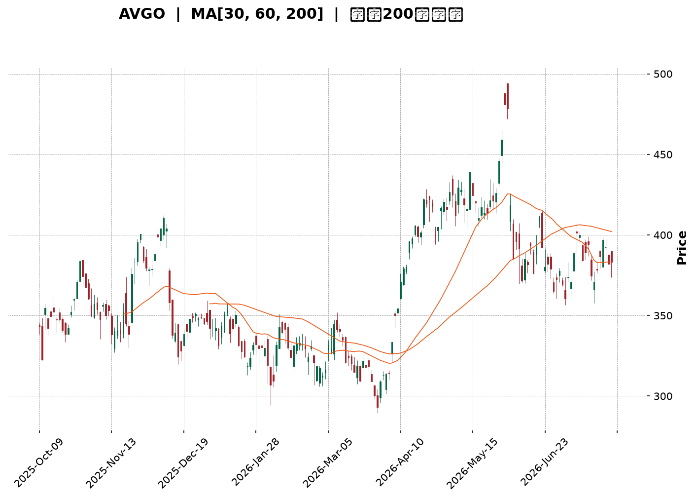
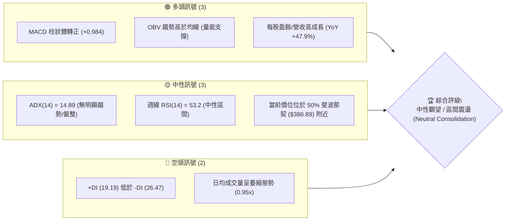
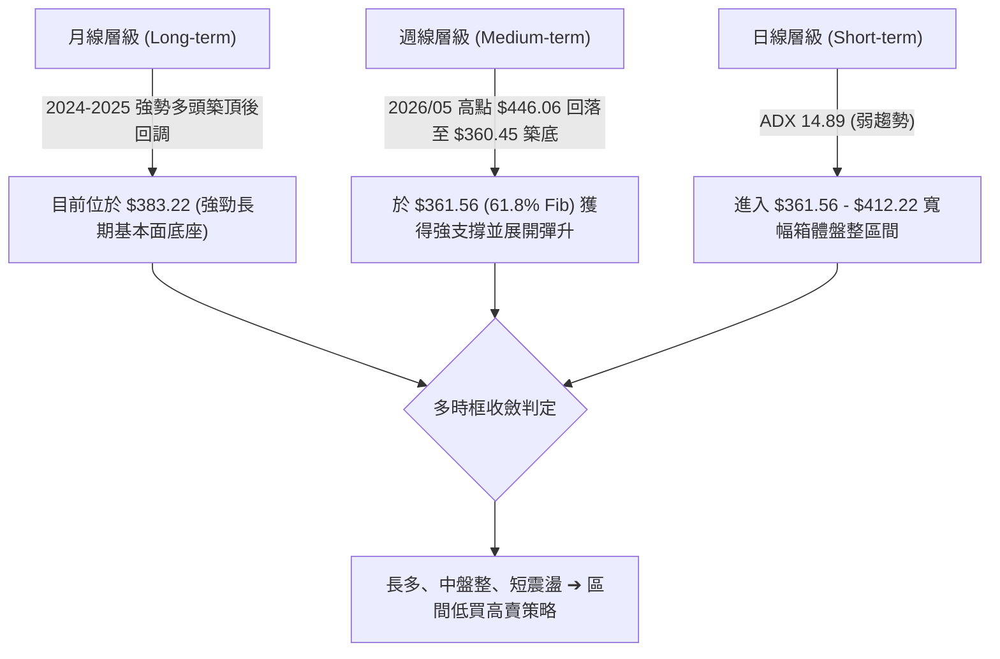
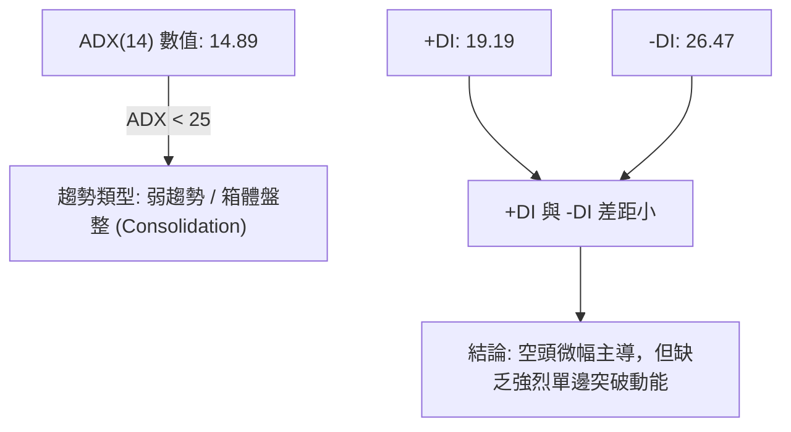
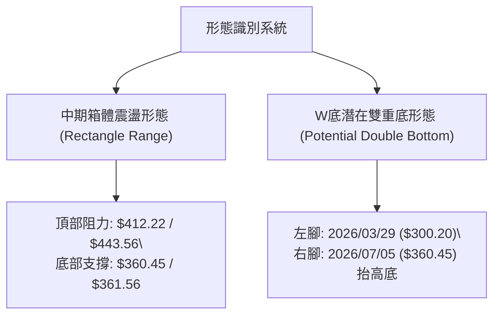
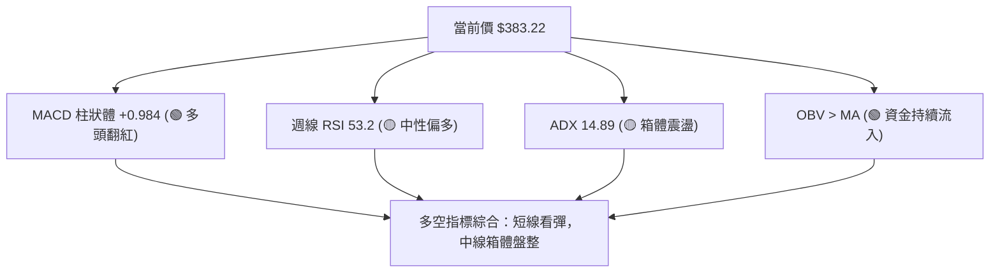
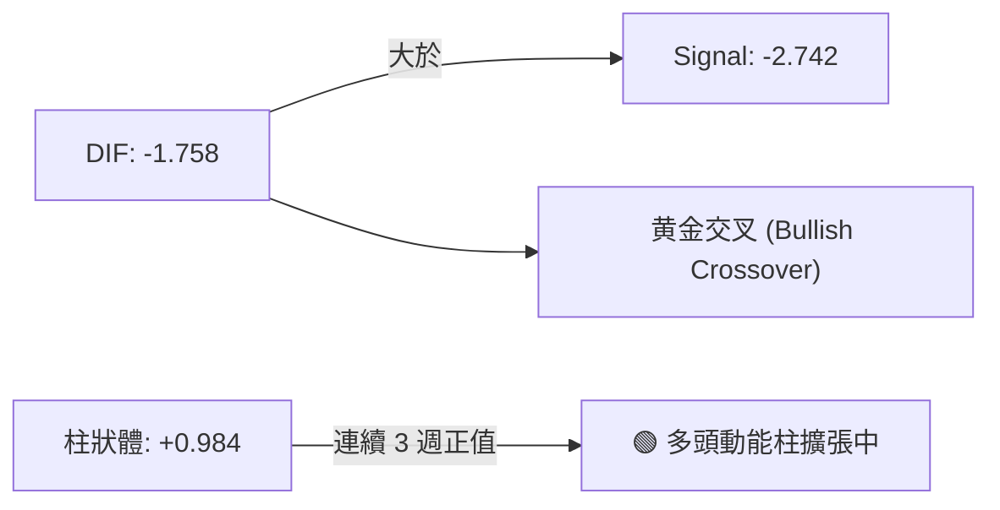
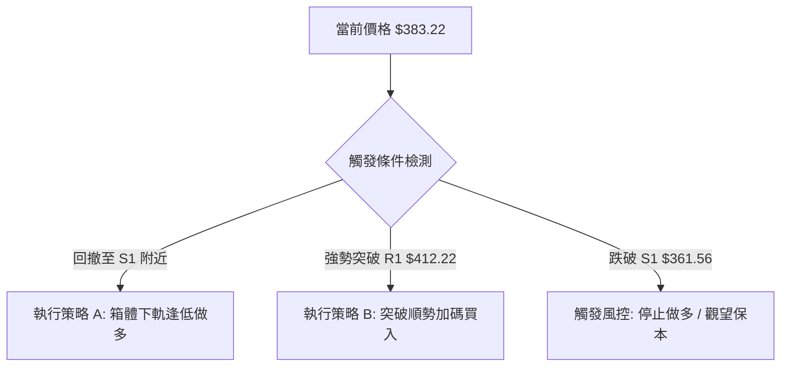
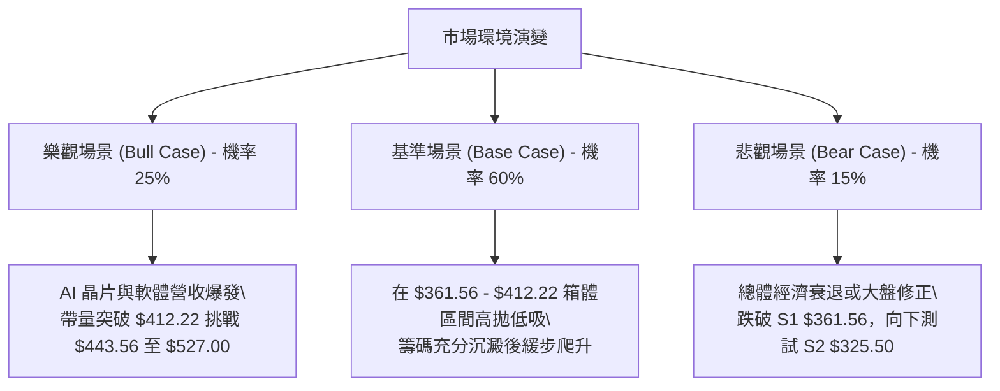

<details markdown="1">
<summary>📊 靜態圖表 (點擊展開)</summary>



</details>

<html>
<head><meta charset="utf-8" /></head>
<body>
    <div style="height:500px; width:100%;">                        <script>window.PlotlyConfig = {MathJaxConfig: 'local'};</script>
        <script charset="utf-8" src="https://cdn.plot.ly/plotly-3.7.0.min.js" integrity="sha256-jvTGqxNp8AGWEcvNLVuKr+8j5dGe9Yw51LQkmDH+IYA=" crossorigin="anonymous"></script>                <div id="candlestick-chart" class="plotly-graph-div" style="height:100%; width:100%;"></div>            <script>                window.PLOTLYENV=window.PLOTLYENV || {};                                if (document.getElementById("candlestick-chart")) {                    Plotly.newPlot(                        "candlestick-chart",                        [{"close":{"dtype":"f8","bdata":"AAAAII5xdUAAAABAIi10QAAAAABlK3ZAAAAAIGVjdUAAAADg89V1QAAAAEDSAnZAAAAAoCG2dUAAAAAgs7R1QAAAAKABTHVAAAAA4HQmdUAAAADg8GV1QAAAAOCAAnZAAAAAQISAdkAAAACAQy53QAAAAIBD\u002fXdAAAAAoPNld0AAAAAgH\u002fl2QAAAAOB4iHZAAAAAoKjfdUAAAADAq092QAAAAMC7GXZAAAAAALm3dUAAAACgSEZ2QAAAACD633VAAAAAoNgTdkAAAACAXSF1QAAAAODSSHVAAAAAwNhLdUAAAACAoyl1QAAAACAeB3ZAAAAAADKOdUAAAADA3SR1QAAAAICofXdAAAAA4CXud0AAAACAq7V4QAAAAOBtC3lAAAAAwNr+d0AAAADgGLd3QAAAAIDSp3dAAAAAYIGud0AAAAAgC0F4QAAAAODV7XhAAAAAoGlAeUAAAACAsqp5QAAAAGCvQXlAAAAAQMledkAAAAAAqR51QAAAACBeNnVAAAAAAEBDdEAAAABgqoB0QAAAAEBpJ3VAAAAAQCZDdUAAAABgm8B1QAAAAED0znVAAAAA4GbtdUAAAAAgucF1QAAAAEAOyXVAAAAAoEaNdUAAAACggaV1QAAAAMCNYnVAAAAAACJodUAAAAAg1GN1QAAAAOAntHRAAAAAQEN7dUAAAABgre51QAAAAKDvFHZAAAAAAEgqdUAAAABALVx1QAAAAOC05nVAAAAAoBG2dEAAAADgfXl0QAAAAOC5RHRAAAAAYAHuc0AAAAAghjp0QAAAAAAZuXRAAAAAYEXAdEAAAABAQph0QAAAAGBYoXRAAAAA4FCedEAAAAAgePJzQAAAAMC1LnNAAAAAIO1Vc0AAAACgK7t0QAAAAMDXanVAAAAAYAwzdUAAAABACFh1QAAAAOBFn3RAAAAAIKA\u002fdEAAAADAHLV0QAAAAECTxHRAAAAAIDrMdEAAAACg3bZ0QAAAAKAKknRAAAAA4LlEdEAAAAAgcrF0QAAAACBPCHRAAAAAAAnmc0AAAADgZdpzQAAAAMACi3NAAAAAgNXFc0AAAABAx7h0QAAAAABGlHRAAAAAQLKHdUAAAACAKVV1QAAAAOAPRXVAAAAAgMrrdEAAAABgpA90QAAAAOCjO3RAAAAAgBcCdEAAAADAU6xzQAAAAICo6nNAAAAAIO1Vc0AAAACgASB0QAAAAMCX3HNAAAAAQObkc0AAAACg5U5zQAAAACBHw3JAAAAAQCRPckAAAADAVVBzQAAAAADqj3NAAAAA4Nigc0AAAAAg7p5zQAAAAIAT13RAAAAAIDfhdUAAAABAliV2QAAAAOBnL3dAAAAAIGayd0AAAABA2sJ3QAAAAGB9wXhAAAAAIHLdeEAAAACgXF55QAAAAOD573hAAAAAYI0YeUAAAADAtl96QAAAAEBsNHpAAAAAwHhhekAAAACAoBh6QAAAAMAr83hAAAAAAPNMeUAAAACAUwx6QAAAACDUSXpAAAAAQHj9eUAAAACA9Kp6QAAAAKBIjHpAAAAAgIe+eUAAAADgINV6QAAAAEAMvHpAAAAA4DIqekAAAABAGgJ6QAAAAGCFcXtAAAAAQEqIekAAAAAguUB6QAAAACC6pnlAAAAAIJkRekAAAACAo955QAAAAADF13lAAAAAoH1VekAAAAAAGFN6QAAAAKB+nnpAAAAAQAbhe0AAAAAA5LN8QAAAAODxDH5AAAAAYJDnfUAAAAAA+CN6QAAAAIDtEXhAAAAAoJK\u002feEAAAAAgpXh4QAAAAEAxOHdAAAAAIF8PeEAAAADgddd3QAAAAIAUlXhAAAAA4NWBd0AAAABgd4R4QAAAAEAzq3lAAAAAgBSCeEAAAABgZsJ3QAAAAMAe4XdAAAAAYI+ud0AAAADgUdB2QAAAAEAzR3dAAAAAAACcd0AAAACgcBV3QAAAAEAzh3ZAAAAAYGZed0AAAADgeix3QAAAAEAKS3hAAAAAgMIReUAAAAAghf94QAAAAMDMAHhAAAAAgMJReEAAAADgeqR4QAAAAEAzZ3dAAAAAoEctd0AAAABgj6J3QAAAAAAAKHhAAAAAwPXMeEAAAAAghYd4QAAAAGC43ndAAAAAIIXzd0AAAAAAAAD4fw=="},"high":{"dtype":"f8","bdata":"JMHiuf2VdUDBoGmQVsp1QAuLKhMJVnZAC0B3tnPLdUC5RY1pWlZ2QO+iDWFzk3ZATuppsDnQdUCBb+b5pCl2QGdtADhL0nVASgu9ISGhdUCQ44a0N4p1QDnIH\u002fDZRHZALXVWhaeLdkCs9X4+mz93QErPMBY4BXhAofIzNfIDeECeUFmZV4t3QGJfs\u002fosTHdARoDBV03udkAMZeOsYq12QG29OpGWl3ZANI0JBWQIdkDPNdFf5l92QGuNLtX4fXZAoKvErutNdkAS6vhdRvl1QEfBfLQZbXVAI0jGoMvjdUCMRf0bfqB1QEToELT3WnZAN5R9975fd0BvZWhihKp1QNH1iSfwvXdAjB+fvHgfeECLLae\u002fQ9p4QDxfNNYQDHlAwrukTHaTeEC3FVnO6XR4QOleUiy2wndAg8ZptwLcd0BG2WzmY3V4QEM5CtRSUHlAXZgrZJhKeUDyeKZwysR5QEifHr5NcHlAg8QlN\u002fC9d0AHa5G5uH92QJuo+9kDmXVA8Wf0oNqKdUDpAG1dhOJ0QGWTHXeTWHVA8FkV\u002foGPdUBkgsg\u002fM811QILIH\u002fAJ+XVAR2m2iUH\u002fdUAOCJIetdB1QGhJx1Qr9nVA68amrIjJdUB3zjV3YXV2QOwVpbehG3ZAoWFGgE28dUBtlWQrqsZ1QIS\u002fx6CyZnVAamfPPtehdUDgOCQ4ngl2QFQ\u002fecO6YnZA5alZZXLWdUAsfEuBWMZ1QMe4SahXE3ZA39Cs8x2CdUD0mrqkFOl0QGFqiv4M\u002fHRAKyTnde4MdEAJ3WcslHd0QKrlfIKA2HRAt2LU5t8rdUDepg3neOt0QMMt7CVXD3VA2A\u002fztTntdECAd5m2fxp1QElz5bdl5XNAuREyLE5VdEC2m1b7U9x0QPh+v9i\u002f8HVA8n\u002f9UrmrdUCDvsDAz551QDPFPBNOkHVAKT3y8nzRdEB3fmOeSOh0QAdT\u002fA09CnVA4vlYeioTdUDZFnuayS11QAlYqFQfFHVAf+lFO65xdEC5Doqh1ep0QP14oyMaVnRAAOoqfDXtc0C8BNao2O1zQAXjRPWHq3NAagaXTksXdEBzIG+DLu50QMoYif78Y3VAS2IbD2CzdUBPaVWfgP11QPIKcyKniHVA3BwV+VIpdUDV9nfRQBF1QM0suWjef3RAYbQC2c9jdEAMXkPI7UN0QE7Y7i9WIXRAWXRFw0cFdEAcNBcObV90QD+RCLQyPnRA2bFLt5k8dECjyp4UtcZzQGZQrLs5MHNArnesOJ0Ec0C\u002f1nxSHV1zQIHwFP2ntHNA6soBeBWjc0BJ6dJ\u002fZr5zQCk+wpXz2XRAFNxAaEkZdkDbfzCYIWJ2QBuWI4NHf3dA11rXcCHEd0COh4iK0Np3QFH7hYs9x3hA3gMra8bweED64i6lZWF5QFkvJM1xXHlArMWZXmUveUCLT6IQgGh6QConpRobynpAuUeDQEGFekBthf3MT2F6QAuEdCuzUnlAPTQtBfxPeUA88OeZgBt6QOHJTWQFaHpAAb22bpByekAXesx4SAt7QAgtFmfQT3tApdjxlg6dekBlTVmDACV7QGMttZZvD3tA4tFgxJXKekAUGUH3fh96QAxatl2TmntA+roqbgQCe0CYJPWVfVV6QDmGNxiiFHpAfnQuA\u002f93ekCoM9EKU1l6QCG65qI4NXpAruQiS\u002fQpe0ArZsdw2wF7QPCCfC8E0HpAuRLI9gwDfED7Tc9FBBV9QKbzX\u002fPCgH5ArStRLnzjfkB1p+TA5Zx6QOUNUw2fnXlAZUyPPEEjeUB78DqRm3N5QGTPfaM0E3hAT1cZ8CZOeEAlBmJq8gV4QA8bS98uuXhAQgcSBbxyeEDJzck2RQB5QJ\u002fxKiPEwHlAAAAAgD3qeUAAAADgUXB4QAAAAADXS3hAAAAAwMxMeEAAAABAClt3QAAAACBcg3dAAAAAgOu5d0AAAAAAAFx3QAAAAAAAYHdAAAAAYI\u002fyd0AAAAAgXE93QAAAAKBwsXhAAAAA4FF4eUAAAABACid5QAAAAAAAvHhAAAAAoEfVeEAAAAAAAPB4QAAAAADXK3hAAAAAoJmVd0AAAACgcPl3QAAAAKBHaXhAAAAAoHDpeEAAAACAwtl4QAAAAOBRVHhAAAAAYGZeeEAAAAAAAAD4fw=="},"hovertemplate":"\u003cb\u003e%{x|%Y-%m-%d}\u003c\u002fb\u003e\u003cbr\u003e\u958b: $%{open:.2f}\u003cbr\u003e\u9ad8: $%{high:.2f}\u003cbr\u003e\u4f4e: $%{low:.2f}\u003cbr\u003e\u6536: $%{close:.2f}\u003cextra\u003e\u003c\u002fextra\u003e","low":{"dtype":"f8","bdata":"xhHZFQwodUDPqGq95yN0QHic7HqwWXVA7hGgQx0cdUA+EiytA5l1QNIRhz+tuHVAGPmwChgudUArz+20bJ51QBNL5dCGNnVAI4+zdj7adEA0FdArDCh1QHbd0w\u002fLznVAywGbOp4RdkBrWDaPJ4h2QEfK7pPDMXdAkHdtkfb\u002fdkCNRXqnC7F2QAw9wkJnf3ZALVoH1bPQdUDhRksuOcJ1QIPjjP3o63VARmvhMT\u002f2dEC1LCbpIwp2QNmGp6WKu3VA8HuEjoXbdUDwmAOaw8R0QHeI3GCec3RA69wXWjn6dEBoDLdnPtp0QDe6fuGt\u002fnRAkcaj7xl0dUCgQcX9Np90QAoqA2ePm3VAsqXII9oad0CBHcNm\u002fNF3QGxEBoUlr3hAd36cHkPvd0AJg4ihxpp3QI+JFrpZCXdATN7hF+hmd0D5GAewDvB3QDajbRX3snhA6btP0uSUeEA6sTE6VdV4QDXCuyfkf3hAyIqFfLsSdkCWMU7AEPp0QDJRoY8V03RAhT5FgA\u002f6c0A6PvoKOR10QKKzNfefq3RAiY3rtrf\u002fdEDrfqOOwhR1QI9DNe3anXVAWR9lOJSndUApLLyHzHZ1QPu+v6RJwHVAz7v0mG+CdUA6X\u002fPXqoR1QAsvRWc99HRAV4Rr3SYMdUD3GGEtW+p0QBOWFoSXlHRA6GgzjWrEdECcDELFLTt1QPCxPx\u002f02XVAXqy9GhXTdEDz\u002flALqEZ1QCA0F6eYbHVAh\u002f3XxlCpdED5CNuGKTB0QBuq\u002fWQpO3RANKYXbFCPc0DdKGsd88ZzQABjz70dXXRAjTzo8ANYdECbXWoYrPFzQOlGw+X\u002fcXRAZYbT895IdEBgvqZ1RjhzQJeRm2x1Y3JA5ymCpjAZc0ChT9bYObJzQJWdZqr7lnRAHkwcxXspdUCNW1bZPch0QHe2FnSbhXRAFyJJN\u002fk3dEDXvf2cYrJzQO60s8h2YHRA0h7QKoWHdECRKdEG7YV0QIOCKTcEQnRArI0TF7yUc0BaNNDMJIF0QB61TCHMLHNAsJJJ0MtNc0BMAHMPKSFzQJvklU9ZJHNAGhVMqohpc0C8Zoysgh10QL63VI0sY3RAe68slsEmdEAKd2RiyTh1QKkidZyoD3VA5XaSTLGvdED0IWQ5AQR0QN+Ubk8q7nNAF92tyF7Bc0DGo3f2RKZzQIpbmDILNnNAyT2PXoVMc0DHkVvv6qZzQG84g9R6pXNAJ08LJ4PDc0A\u002f+T4+50pzQNyXDRddpnJA1GeeVAcYckAzLZqd8n1yQCAMQpvUX3NAG42M+F7UckDQtUucolxzQK2qQ+WpFHRAKDPt7NFfdUAvdyryHO91QL+BR1P\u002fg3ZARTaRuFYOd0CWVRv+mnt3QE7Q8ipfD3hAypQ0PK57eEDF4wQP2vJ4QIG7huRjtHhAULmv8CSfeEBRWJQFhkN5QNuV1pk8EnpAFpA+N2yDeUC3QEDbmN95QJGI9QZsoHhA7Tu6vXLCeECqdU\u002fPdTl5QKQBwecHynlAVqnQPCCOeUDym8t3\u002fyp6QKMLKNTqEXpA8p9pBIdaeUCJO+JuiNV5QPOhgaANhnpAuXP5+zt8eUDJ\u002fKC6kEJ5QBOH4MHu7nlA\u002fcPmoi8yekCv8vGIcdt5QOkBt5h\u002fU3lAkI7SiFGseUAZ47MXn515QFDx1g\u002f9mHlA1sogDXUFekBaXOdBT\u002f15QEykp1ux1XlAz1WlhpzsekB8Q7ziVph7QCy9Vih3W31ARYsgZ0p+fUAmpnWJ+CV5QNxc\u002f+ewD3hAPtgPm7RreEDSjWKr6ht3QNIA7wRWKXdAQF3NV24fd0D4CY3wd4Z3QCdbEXDGP3hATDQ9ftd9d0BIvom3ueB3QJ4BusPUS3lAAAAAYI9+eEAAAABgj4p3QAAAACBcj3dAAAAAQDNLd0AAAACgR712QAAAACBch3ZAAAAAgD0qd0AAAADgegB3QAAAAEDhRnZAAAAAQOEyd0AAAAAAKaB2QAAAAIA9jndAAAAAQOE+eEAAAABAM7t4QAAAAGC49ndAAAAAgD0KeEAAAAAA1yt4QAAAAGBmPndAAAAAwMxcdkAAAAAgXH93QAAAACCFs3dAAAAAAADAd0AAAADAHi14QAAAAAAArHdAAAAAAABYd0AAAAAAAAD4fw=="},"name":"\u50f9\u683c","open":{"dtype":"f8","bdata":"OZ4Jlit9dUBk8cZdcXd1QOCGhlXd7HVAOH0WKtzCdUAhi8uy6Qd2QHTRTiL8LHZARbnMG5a6dUConnHJQP11QPNR\u002f7PKwHVAkRzSFtWVdUA0FdArDCh1QA7Fqlq66HVATJoqBGd4dkCyP08hlol2QEfK7pPDMXdAofIzNfIDeEBF3W5Hl4J3QAYuNWnUHndADjD6DFpIdkAOrkDL8851QFCPEHOmYXZAbe2HWHUDdkD+3YGvfD52QMyIfhyDT3ZA8SDoALdAdkBhF\u002fI17tl1QO5Xpb32mXRA5kKHudEedUDflxgemVR1QBwGedT6LHVAkVM1b12\u002fdkAYxyeoyHN1QNe16Y2snHVAycxmiI7sd0AXrOjga\u002fZ3QJHZccf90XhArmuJj2SKeEA7+HIGViJ4QN7PgOwdnndAXl1Fve+od0DioGpnSQB4QBspyt\u002fKA3lAd9wC3XHIeEAShRp3Vv94QOI3SacuKXlAIGkx6Hqdd0Afd0i8+H12QLnN4cVb4nRA8Wf0oNqKdUC4nLosCuJ0QNINBJ63t3RAPsU4BimMdUCuD6BO8jh1QLL5N09y1nVA8\u002fjoNVjcdUDqY4LSCrd1QGSxMvL3ynVAUWbnjSTHdUD8uZltw\u002fd1QGTWuTMCF3ZAEf8qTmxldUCDYDZvIkd1QIv9achZWHVAnd0ze+AKdUCcDELFLTt1QFjKxKFb+XVAz2eZIAe7dUCPLGssa711QO6jimf8j3VAknWivmRtdUBzK7NAdeR0QKho+kXo4XRA8sVfpgzic0CdCNoqBepzQEB75KzLiHRA0yQGqrMZdUDnaWBdbrV0QA6Fw7yEs3RA4IZtCpxOdEAKvTnPEPh0QElz5bdl5XNA9LKQLPuSc0AmaMWYze5zQC32mVzlmHRA85IzkR2jdUB41jxEb5h1QFlYi84WaXVAz7JnBTuKdEB2lptzG+hzQKnjrBv4hHRAgQ9o25q8dEDcfRYcPrJ0QA6zc0l9sHRAMRLuGLMVdECtKRr6aph0QMSZdrfTVHRA3h5aivRYc0CxwM\u002fWl0NzQElToMCefXNAqpGSr1eoc0AfLaePfY90QBo6qtIzcXRAdjOGXchgdECMKWaLM7d1QLOxlWpSVXVADThOxAEIdUBXCYTwDAd1QAca0tYsTXRAD+le2gdJdEDgwocZEPRzQLsz3sordXNAzyylKB\u002fvc0C2xqbQ9ddzQNJOn87o93NAWq+vqEghdECoCupZYZhzQG7OulQyKXNArsnnFlDGckAHnvq\u002fq65yQLAi0kb\u002fjXNALhmbPCQAc0D3dB6M\u002fqhzQGa4ZVxrY3RAVMRGYBvzdUDCqqKE5Pt1QGJkcwzqhXZAYV5VzjYRd0CTpxpk2JR3QPrZggU5VHhAq9FvdQOmeEDzav6gQwR5QDToKVbxUHlAI2AlPXbseEB3m8DsY2V5QIEWhaSPW3pAbA6ige+EekDK0TOeDD16QJEHpsTW+nhAc6oPX8wteUAOCbl80O15QDnGpPDx5nlARV8TPvIYekDpxldE5k96QMPeyZ\u002fyLXtAk1fKkHRSekCyZrWkLzJ6QD6QIL4br3pA48XbpCxsekBkVs93cvJ5QD8L8uAkAXpA+roqbgQCe0DyiiDY50t6QAYYLjfCknlAy1u96YXCeUCi6RgaWM55QOm4RNFIDXpAMefDV2sdekBanxl5X4Z6QDdNsLWXR3pAMgZoEkEEe0DwdJpyDxZ8QDiIFEVIgH5Au67XevjffkDtt\u002fHUf4V5QCFr8EF0b3lAzQkYib0feUAjBMsVmw95QOwO3MhazndAjI9vprFDd0BWYRuS0fF3QKl+lhYprnhA9\u002fcWf35ZeEA5A4s+iEF4QFE1wbTsjnlAAAAAYI\u002faeUAAAACA6513QAAAAIDrKXhAAAAAoEcpeEAAAABAMyd3QAAAAIDrWXdAAAAA4KNsd0AAAACA6z13QAAAACCu23ZAAAAAgMJZd0AAAADA9eh2QAAAAOBRmHdAAAAAQAojeUAAAAAAAOh4QAAAACCul3hAAAAAIIW7eEAAAACgcMF4QAAAAOCjCHhAAAAAwMzgdkAAAAAAKax3QAAAACBcY3hAAAAAQDPDd0AAAABACoN4QAAAAEDhOnhAAAAAwB5deEAAAAAAAAD4fw=="},"x":["2025-10-09T00:00:00-04:00","2025-10-10T00:00:00-04:00","2025-10-13T00:00:00-04:00","2025-10-14T00:00:00-04:00","2025-10-15T00:00:00-04:00","2025-10-16T00:00:00-04:00","2025-10-17T00:00:00-04:00","2025-10-20T00:00:00-04:00","2025-10-21T00:00:00-04:00","2025-10-22T00:00:00-04:00","2025-10-23T00:00:00-04:00","2025-10-24T00:00:00-04:00","2025-10-27T00:00:00-04:00","2025-10-28T00:00:00-04:00","2025-10-29T00:00:00-04:00","2025-10-30T00:00:00-04:00","2025-10-31T00:00:00-04:00","2025-11-03T00:00:00-05:00","2025-11-04T00:00:00-05:00","2025-11-05T00:00:00-05:00","2025-11-06T00:00:00-05:00","2025-11-07T00:00:00-05:00","2025-11-10T00:00:00-05:00","2025-11-11T00:00:00-05:00","2025-11-12T00:00:00-05:00","2025-11-13T00:00:00-05:00","2025-11-14T00:00:00-05:00","2025-11-17T00:00:00-05:00","2025-11-18T00:00:00-05:00","2025-11-19T00:00:00-05:00","2025-11-20T00:00:00-05:00","2025-11-21T00:00:00-05:00","2025-11-24T00:00:00-05:00","2025-11-25T00:00:00-05:00","2025-11-26T00:00:00-05:00","2025-11-28T00:00:00-05:00","2025-12-01T00:00:00-05:00","2025-12-02T00:00:00-05:00","2025-12-03T00:00:00-05:00","2025-12-04T00:00:00-05:00","2025-12-05T00:00:00-05:00","2025-12-08T00:00:00-05:00","2025-12-09T00:00:00-05:00","2025-12-10T00:00:00-05:00","2025-12-11T00:00:00-05:00","2025-12-12T00:00:00-05:00","2025-12-15T00:00:00-05:00","2025-12-16T00:00:00-05:00","2025-12-17T00:00:00-05:00","2025-12-18T00:00:00-05:00","2025-12-19T00:00:00-05:00","2025-12-22T00:00:00-05:00","2025-12-23T00:00:00-05:00","2025-12-24T00:00:00-05:00","2025-12-26T00:00:00-05:00","2025-12-29T00:00:00-05:00","2025-12-30T00:00:00-05:00","2025-12-31T00:00:00-05:00","2026-01-02T00:00:00-05:00","2026-01-05T00:00:00-05:00","2026-01-06T00:00:00-05:00","2026-01-07T00:00:00-05:00","2026-01-08T00:00:00-05:00","2026-01-09T00:00:00-05:00","2026-01-12T00:00:00-05:00","2026-01-13T00:00:00-05:00","2026-01-14T00:00:00-05:00","2026-01-15T00:00:00-05:00","2026-01-16T00:00:00-05:00","2026-01-20T00:00:00-05:00","2026-01-21T00:00:00-05:00","2026-01-22T00:00:00-05:00","2026-01-23T00:00:00-05:00","2026-01-26T00:00:00-05:00","2026-01-27T00:00:00-05:00","2026-01-28T00:00:00-05:00","2026-01-29T00:00:00-05:00","2026-01-30T00:00:00-05:00","2026-02-02T00:00:00-05:00","2026-02-03T00:00:00-05:00","2026-02-04T00:00:00-05:00","2026-02-05T00:00:00-05:00","2026-02-06T00:00:00-05:00","2026-02-09T00:00:00-05:00","2026-02-10T00:00:00-05:00","2026-02-11T00:00:00-05:00","2026-02-12T00:00:00-05:00","2026-02-13T00:00:00-05:00","2026-02-17T00:00:00-05:00","2026-02-18T00:00:00-05:00","2026-02-19T00:00:00-05:00","2026-02-20T00:00:00-05:00","2026-02-23T00:00:00-05:00","2026-02-24T00:00:00-05:00","2026-02-25T00:00:00-05:00","2026-02-26T00:00:00-05:00","2026-02-27T00:00:00-05:00","2026-03-02T00:00:00-05:00","2026-03-03T00:00:00-05:00","2026-03-04T00:00:00-05:00","2026-03-05T00:00:00-05:00","2026-03-06T00:00:00-05:00","2026-03-09T00:00:00-04:00","2026-03-10T00:00:00-04:00","2026-03-11T00:00:00-04:00","2026-03-12T00:00:00-04:00","2026-03-13T00:00:00-04:00","2026-03-16T00:00:00-04:00","2026-03-17T00:00:00-04:00","2026-03-18T00:00:00-04:00","2026-03-19T00:00:00-04:00","2026-03-20T00:00:00-04:00","2026-03-23T00:00:00-04:00","2026-03-24T00:00:00-04:00","2026-03-25T00:00:00-04:00","2026-03-26T00:00:00-04:00","2026-03-27T00:00:00-04:00","2026-03-30T00:00:00-04:00","2026-03-31T00:00:00-04:00","2026-04-01T00:00:00-04:00","2026-04-02T00:00:00-04:00","2026-04-06T00:00:00-04:00","2026-04-07T00:00:00-04:00","2026-04-08T00:00:00-04:00","2026-04-09T00:00:00-04:00","2026-04-10T00:00:00-04:00","2026-04-13T00:00:00-04:00","2026-04-14T00:00:00-04:00","2026-04-15T00:00:00-04:00","2026-04-16T00:00:00-04:00","2026-04-17T00:00:00-04:00","2026-04-20T00:00:00-04:00","2026-04-21T00:00:00-04:00","2026-04-22T00:00:00-04:00","2026-04-23T00:00:00-04:00","2026-04-24T00:00:00-04:00","2026-04-27T00:00:00-04:00","2026-04-28T00:00:00-04:00","2026-04-29T00:00:00-04:00","2026-04-30T00:00:00-04:00","2026-05-01T00:00:00-04:00","2026-05-04T00:00:00-04:00","2026-05-05T00:00:00-04:00","2026-05-06T00:00:00-04:00","2026-05-07T00:00:00-04:00","2026-05-08T00:00:00-04:00","2026-05-11T00:00:00-04:00","2026-05-12T00:00:00-04:00","2026-05-13T00:00:00-04:00","2026-05-14T00:00:00-04:00","2026-05-15T00:00:00-04:00","2026-05-18T00:00:00-04:00","2026-05-19T00:00:00-04:00","2026-05-20T00:00:00-04:00","2026-05-21T00:00:00-04:00","2026-05-22T00:00:00-04:00","2026-05-26T00:00:00-04:00","2026-05-27T00:00:00-04:00","2026-05-28T00:00:00-04:00","2026-05-29T00:00:00-04:00","2026-06-01T00:00:00-04:00","2026-06-02T00:00:00-04:00","2026-06-03T00:00:00-04:00","2026-06-04T00:00:00-04:00","2026-06-05T00:00:00-04:00","2026-06-08T00:00:00-04:00","2026-06-09T00:00:00-04:00","2026-06-10T00:00:00-04:00","2026-06-11T00:00:00-04:00","2026-06-12T00:00:00-04:00","2026-06-15T00:00:00-04:00","2026-06-16T00:00:00-04:00","2026-06-17T00:00:00-04:00","2026-06-18T00:00:00-04:00","2026-06-22T00:00:00-04:00","2026-06-23T00:00:00-04:00","2026-06-24T00:00:00-04:00","2026-06-25T00:00:00-04:00","2026-06-26T00:00:00-04:00","2026-06-29T00:00:00-04:00","2026-06-30T00:00:00-04:00","2026-07-01T00:00:00-04:00","2026-07-02T00:00:00-04:00","2026-07-06T00:00:00-04:00","2026-07-07T00:00:00-04:00","2026-07-08T00:00:00-04:00","2026-07-09T00:00:00-04:00","2026-07-10T00:00:00-04:00","2026-07-13T00:00:00-04:00","2026-07-14T00:00:00-04:00","2026-07-15T00:00:00-04:00","2026-07-16T00:00:00-04:00","2026-07-17T00:00:00-04:00","2026-07-20T00:00:00-04:00","2026-07-21T00:00:00-04:00","2026-07-22T00:00:00-04:00","2026-07-23T00:00:00-04:00","2026-07-24T00:00:00-04:00","2026-07-27T00:00:00-04:00","2026-07-28T00:00:00-04:00"],"type":"candlestick"},{"hovertemplate":"MA30: $%{y:.2f}\u003cextra\u003e\u003c\u002fextra\u003e","line":{"color":"#2196F3","dash":"dash","width":2},"mode":"lines","name":"MA30","x":["2025-10-09T00:00:00-04:00","2025-10-10T00:00:00-04:00","2025-10-13T00:00:00-04:00","2025-10-14T00:00:00-04:00","2025-10-15T00:00:00-04:00","2025-10-16T00:00:00-04:00","2025-10-17T00:00:00-04:00","2025-10-20T00:00:00-04:00","2025-10-21T00:00:00-04:00","2025-10-22T00:00:00-04:00","2025-10-23T00:00:00-04:00","2025-10-24T00:00:00-04:00","2025-10-27T00:00:00-04:00","2025-10-28T00:00:00-04:00","2025-10-29T00:00:00-04:00","2025-10-30T00:00:00-04:00","2025-10-31T00:00:00-04:00","2025-11-03T00:00:00-05:00","2025-11-04T00:00:00-05:00","2025-11-05T00:00:00-05:00","2025-11-06T00:00:00-05:00","2025-11-07T00:00:00-05:00","2025-11-10T00:00:00-05:00","2025-11-11T00:00:00-05:00","2025-11-12T00:00:00-05:00","2025-11-13T00:00:00-05:00","2025-11-14T00:00:00-05:00","2025-11-17T00:00:00-05:00","2025-11-18T00:00:00-05:00","2025-11-19T00:00:00-05:00","2025-11-20T00:00:00-05:00","2025-11-21T00:00:00-05:00","2025-11-24T00:00:00-05:00","2025-11-25T00:00:00-05:00","2025-11-26T00:00:00-05:00","2025-11-28T00:00:00-05:00","2025-12-01T00:00:00-05:00","2025-12-02T00:00:00-05:00","2025-12-03T00:00:00-05:00","2025-12-04T00:00:00-05:00","2025-12-05T00:00:00-05:00","2025-12-08T00:00:00-05:00","2025-12-09T00:00:00-05:00","2025-12-10T00:00:00-05:00","2025-12-11T00:00:00-05:00","2025-12-12T00:00:00-05:00","2025-12-15T00:00:00-05:00","2025-12-16T00:00:00-05:00","2025-12-17T00:00:00-05:00","2025-12-18T00:00:00-05:00","2025-12-19T00:00:00-05:00","2025-12-22T00:00:00-05:00","2025-12-23T00:00:00-05:00","2025-12-24T00:00:00-05:00","2025-12-26T00:00:00-05:00","2025-12-29T00:00:00-05:00","2025-12-30T00:00:00-05:00","2025-12-31T00:00:00-05:00","2026-01-02T00:00:00-05:00","2026-01-05T00:00:00-05:00","2026-01-06T00:00:00-05:00","2026-01-07T00:00:00-05:00","2026-01-08T00:00:00-05:00","2026-01-09T00:00:00-05:00","2026-01-12T00:00:00-05:00","2026-01-13T00:00:00-05:00","2026-01-14T00:00:00-05:00","2026-01-15T00:00:00-05:00","2026-01-16T00:00:00-05:00","2026-01-20T00:00:00-05:00","2026-01-21T00:00:00-05:00","2026-01-22T00:00:00-05:00","2026-01-23T00:00:00-05:00","2026-01-26T00:00:00-05:00","2026-01-27T00:00:00-05:00","2026-01-28T00:00:00-05:00","2026-01-29T00:00:00-05:00","2026-01-30T00:00:00-05:00","2026-02-02T00:00:00-05:00","2026-02-03T00:00:00-05:00","2026-02-04T00:00:00-05:00","2026-02-05T00:00:00-05:00","2026-02-06T00:00:00-05:00","2026-02-09T00:00:00-05:00","2026-02-10T00:00:00-05:00","2026-02-11T00:00:00-05:00","2026-02-12T00:00:00-05:00","2026-02-13T00:00:00-05:00","2026-02-17T00:00:00-05:00","2026-02-18T00:00:00-05:00","2026-02-19T00:00:00-05:00","2026-02-20T00:00:00-05:00","2026-02-23T00:00:00-05:00","2026-02-24T00:00:00-05:00","2026-02-25T00:00:00-05:00","2026-02-26T00:00:00-05:00","2026-02-27T00:00:00-05:00","2026-03-02T00:00:00-05:00","2026-03-03T00:00:00-05:00","2026-03-04T00:00:00-05:00","2026-03-05T00:00:00-05:00","2026-03-06T00:00:00-05:00","2026-03-09T00:00:00-04:00","2026-03-10T00:00:00-04:00","2026-03-11T00:00:00-04:00","2026-03-12T00:00:00-04:00","2026-03-13T00:00:00-04:00","2026-03-16T00:00:00-04:00","2026-03-17T00:00:00-04:00","2026-03-18T00:00:00-04:00","2026-03-19T00:00:00-04:00","2026-03-20T00:00:00-04:00","2026-03-23T00:00:00-04:00","2026-03-24T00:00:00-04:00","2026-03-25T00:00:00-04:00","2026-03-26T00:00:00-04:00","2026-03-27T00:00:00-04:00","2026-03-30T00:00:00-04:00","2026-03-31T00:00:00-04:00","2026-04-01T00:00:00-04:00","2026-04-02T00:00:00-04:00","2026-04-06T00:00:00-04:00","2026-04-07T00:00:00-04:00","2026-04-08T00:00:00-04:00","2026-04-09T00:00:00-04:00","2026-04-10T00:00:00-04:00","2026-04-13T00:00:00-04:00","2026-04-14T00:00:00-04:00","2026-04-15T00:00:00-04:00","2026-04-16T00:00:00-04:00","2026-04-17T00:00:00-04:00","2026-04-20T00:00:00-04:00","2026-04-21T00:00:00-04:00","2026-04-22T00:00:00-04:00","2026-04-23T00:00:00-04:00","2026-04-24T00:00:00-04:00","2026-04-27T00:00:00-04:00","2026-04-28T00:00:00-04:00","2026-04-29T00:00:00-04:00","2026-04-30T00:00:00-04:00","2026-05-01T00:00:00-04:00","2026-05-04T00:00:00-04:00","2026-05-05T00:00:00-04:00","2026-05-06T00:00:00-04:00","2026-05-07T00:00:00-04:00","2026-05-08T00:00:00-04:00","2026-05-11T00:00:00-04:00","2026-05-12T00:00:00-04:00","2026-05-13T00:00:00-04:00","2026-05-14T00:00:00-04:00","2026-05-15T00:00:00-04:00","2026-05-18T00:00:00-04:00","2026-05-19T00:00:00-04:00","2026-05-20T00:00:00-04:00","2026-05-21T00:00:00-04:00","2026-05-22T00:00:00-04:00","2026-05-26T00:00:00-04:00","2026-05-27T00:00:00-04:00","2026-05-28T00:00:00-04:00","2026-05-29T00:00:00-04:00","2026-06-01T00:00:00-04:00","2026-06-02T00:00:00-04:00","2026-06-03T00:00:00-04:00","2026-06-04T00:00:00-04:00","2026-06-05T00:00:00-04:00","2026-06-08T00:00:00-04:00","2026-06-09T00:00:00-04:00","2026-06-10T00:00:00-04:00","2026-06-11T00:00:00-04:00","2026-06-12T00:00:00-04:00","2026-06-15T00:00:00-04:00","2026-06-16T00:00:00-04:00","2026-06-17T00:00:00-04:00","2026-06-18T00:00:00-04:00","2026-06-22T00:00:00-04:00","2026-06-23T00:00:00-04:00","2026-06-24T00:00:00-04:00","2026-06-25T00:00:00-04:00","2026-06-26T00:00:00-04:00","2026-06-29T00:00:00-04:00","2026-06-30T00:00:00-04:00","2026-07-01T00:00:00-04:00","2026-07-02T00:00:00-04:00","2026-07-06T00:00:00-04:00","2026-07-07T00:00:00-04:00","2026-07-08T00:00:00-04:00","2026-07-09T00:00:00-04:00","2026-07-10T00:00:00-04:00","2026-07-13T00:00:00-04:00","2026-07-14T00:00:00-04:00","2026-07-15T00:00:00-04:00","2026-07-16T00:00:00-04:00","2026-07-17T00:00:00-04:00","2026-07-20T00:00:00-04:00","2026-07-21T00:00:00-04:00","2026-07-22T00:00:00-04:00","2026-07-23T00:00:00-04:00","2026-07-24T00:00:00-04:00","2026-07-27T00:00:00-04:00","2026-07-28T00:00:00-04:00"],"y":{"dtype":"f8","bdata":"AAAAAAAA+H8AAAAAAAD4fwAAAAAAAPh\u002fAAAAAAAA+H8AAAAAAAD4fwAAAAAAAPh\u002fAAAAAAAA+H8AAAAAAAD4fwAAAAAAAPh\u002fAAAAAAAA+H8AAAAAAAD4fwAAAAAAAPh\u002fAAAAAAAA+H8AAAAAAAD4fwAAAAAAAPh\u002fAAAAAAAA+H8AAAAAAAD4fwAAAAAAAPh\u002fAAAAAAAA+H8AAAAAAAD4fwAAAAAAAPh\u002fAAAAAAAA+H8AAAAAAAD4fwAAAAAAAPh\u002fAAAAAAAA+H8AAAAAAAD4fwAAAAAAAPh\u002fAAAAAAAA+H8AAAAAAAD4f5qZmbn57nVA7+7uHu7vdUCrqqoaMPh1QO\u002fu7p52A3ZAZmZmticZdkBVVVXVrTF2QDMzM+OQS3ZAZmZmhg5fdkDNzMwMNHB2QM3MzJxUhHZAERERoe6ZdkDv7u5eTbJ2QKuqqpo2y3ZA7+7uLq3idkBVVVUV5Pd2QKuqqnq0AndAzczMzO75dkAAAAAQHup2QHd3d+fY3nZA7+7urhnRdkBERES0qsF2QDMzM+OWuXZAERERIbS1dkC8u7trP7F2QImIiCiusHZAmpmZGWavdkDNzMx8vrR2QLy7u7sEuXZAAAAAEDO7dkARERERVL92QJqZmcnXuXZAzczM\u002fJK4dkBERERErLp2QGZmZrbjonZAq6qqSv6NdkB3d3cnS3Z2QN7d3a0CXXZAd3d3p9tEdkC8u7u7wjB2QHd3d0fKIXZAiYiIOHEIdkB3d3fHMOh1QERERJRrwHVAREREtAGTdUAzMzPTmWR1QFVVVSXqPXVAMzMz8xgwdUDv7u4Onit1QGZmZmamJnVA7+7ufq8pdUBmZmYW8iR1QN7d3U0fFHVAd3d3d64DdUCrqqqK9\u002fp0QCIiIkKh93RAq6qqCmvxdEBVVVUl5e10QBERERH443RAq6qq6tjYdEDe3d2N1dB0QImIiHiRy3RAMzMzE1\u002fGdEAAAAAgm8B0QERERAR4v3RAq6qqGh61dEAAAAAQi6p0QO\u002fu7j4OmXRAiYiIWD+OdEDe3d1dY4F0QERERNRDbXRAMzMz00FldEDv7u7eXWd0QM3MzKwEanRAREREtKx3dEDNzMyMGIF0QJqZmenChXRAiYiISDaHdEDNzMx8qIJ0QKuqqppEf3RA3t3dfQ96dEAiIiLyuHd0QFVVVcX8fXRAVVVVxfx9dEBERES00Hh0QN7d3U2Ka3RAZmZm5mZgdEARERHhB090QN7d3Q0qP3RAREREZJ0udEBERETkuCJ0QLy7u\u002ftuGHRAZmZmRnQOdEDe3d19HwV0QGZmZpZsB3RA7+7ufiwVdECamZkZlCF0QDMzM1N7PHRARERE1ORcdECrqqoKPn50QImIiJi5qnRAAAAAwC3WdEDNzMzc1P10QGZmZoYFI3VAq6qqOnNBdUAAAADwd2x1QN7d3Z2UlnVA3t3dfSvFdUDNzMxcq\u002fh1QAAAAKDrIHZAMzMzExVOdkB3d3d3e4R2QJqZmcnaunZAERERsaPzdkBmZmaWeCt3QERERASHZHdAq6qqynKWd0B3d3f3p9Z3QJqZmYmuGnhA7+7ujrddeEBVVVW115Z4QO\u002fu7p4Y2nhAzczMzAIVeUAiIiKimk15QImIiLiodnlAiYiIuGeaeUDe3d1tLLp5QDMzMzPa0HlAvLu7+1rneUCJiIjoOv15QJqZmVkhDXpAzczMfNkmekDv7u7uTEN6QM3MzMzubnpA7+7ubveXekC8u7ub+ZV6QO\u002fu7i7Cg3pAzczMHNR1ekBmZmZm9md6QBEREVEyWXpAIiIiUpxOekAiIiIiyDt6QGZmZjY5LXpAIiIiIgkYekARERGhrwV6QKuqquou\u002fnlAzczMjKLzeUAiIiIiadl5QCIiIuILwXlARERExNureUCrqqpamZB5QFVVVRUObXlAzczMrBxUeUCamZm5ETl5QImIiBhrHnlA7+7u3mAHeUBERESEX\u002fB4QHd3dxcm43hAZmZmllvYeEBERETkCc14QJqZmSm3tnhAmpmZCVeYeEBmZmZmsXV4QImIiNj3PHhAVVVVBY8DeECrqqqqLe53QERERATq7ndAERERQVzvd0AAAAAw2+93QJqZmTlo9XdA7+7ujnr0d0AAAAAAAAD4fw=="},"type":"scatter"},{"hovertemplate":"MA60: $%{y:.2f}\u003cextra\u003e\u003c\u002fextra\u003e","line":{"color":"#9C27B0","dash":"dash","width":2},"mode":"lines","name":"MA60","x":["2025-10-09T00:00:00-04:00","2025-10-10T00:00:00-04:00","2025-10-13T00:00:00-04:00","2025-10-14T00:00:00-04:00","2025-10-15T00:00:00-04:00","2025-10-16T00:00:00-04:00","2025-10-17T00:00:00-04:00","2025-10-20T00:00:00-04:00","2025-10-21T00:00:00-04:00","2025-10-22T00:00:00-04:00","2025-10-23T00:00:00-04:00","2025-10-24T00:00:00-04:00","2025-10-27T00:00:00-04:00","2025-10-28T00:00:00-04:00","2025-10-29T00:00:00-04:00","2025-10-30T00:00:00-04:00","2025-10-31T00:00:00-04:00","2025-11-03T00:00:00-05:00","2025-11-04T00:00:00-05:00","2025-11-05T00:00:00-05:00","2025-11-06T00:00:00-05:00","2025-11-07T00:00:00-05:00","2025-11-10T00:00:00-05:00","2025-11-11T00:00:00-05:00","2025-11-12T00:00:00-05:00","2025-11-13T00:00:00-05:00","2025-11-14T00:00:00-05:00","2025-11-17T00:00:00-05:00","2025-11-18T00:00:00-05:00","2025-11-19T00:00:00-05:00","2025-11-20T00:00:00-05:00","2025-11-21T00:00:00-05:00","2025-11-24T00:00:00-05:00","2025-11-25T00:00:00-05:00","2025-11-26T00:00:00-05:00","2025-11-28T00:00:00-05:00","2025-12-01T00:00:00-05:00","2025-12-02T00:00:00-05:00","2025-12-03T00:00:00-05:00","2025-12-04T00:00:00-05:00","2025-12-05T00:00:00-05:00","2025-12-08T00:00:00-05:00","2025-12-09T00:00:00-05:00","2025-12-10T00:00:00-05:00","2025-12-11T00:00:00-05:00","2025-12-12T00:00:00-05:00","2025-12-15T00:00:00-05:00","2025-12-16T00:00:00-05:00","2025-12-17T00:00:00-05:00","2025-12-18T00:00:00-05:00","2025-12-19T00:00:00-05:00","2025-12-22T00:00:00-05:00","2025-12-23T00:00:00-05:00","2025-12-24T00:00:00-05:00","2025-12-26T00:00:00-05:00","2025-12-29T00:00:00-05:00","2025-12-30T00:00:00-05:00","2025-12-31T00:00:00-05:00","2026-01-02T00:00:00-05:00","2026-01-05T00:00:00-05:00","2026-01-06T00:00:00-05:00","2026-01-07T00:00:00-05:00","2026-01-08T00:00:00-05:00","2026-01-09T00:00:00-05:00","2026-01-12T00:00:00-05:00","2026-01-13T00:00:00-05:00","2026-01-14T00:00:00-05:00","2026-01-15T00:00:00-05:00","2026-01-16T00:00:00-05:00","2026-01-20T00:00:00-05:00","2026-01-21T00:00:00-05:00","2026-01-22T00:00:00-05:00","2026-01-23T00:00:00-05:00","2026-01-26T00:00:00-05:00","2026-01-27T00:00:00-05:00","2026-01-28T00:00:00-05:00","2026-01-29T00:00:00-05:00","2026-01-30T00:00:00-05:00","2026-02-02T00:00:00-05:00","2026-02-03T00:00:00-05:00","2026-02-04T00:00:00-05:00","2026-02-05T00:00:00-05:00","2026-02-06T00:00:00-05:00","2026-02-09T00:00:00-05:00","2026-02-10T00:00:00-05:00","2026-02-11T00:00:00-05:00","2026-02-12T00:00:00-05:00","2026-02-13T00:00:00-05:00","2026-02-17T00:00:00-05:00","2026-02-18T00:00:00-05:00","2026-02-19T00:00:00-05:00","2026-02-20T00:00:00-05:00","2026-02-23T00:00:00-05:00","2026-02-24T00:00:00-05:00","2026-02-25T00:00:00-05:00","2026-02-26T00:00:00-05:00","2026-02-27T00:00:00-05:00","2026-03-02T00:00:00-05:00","2026-03-03T00:00:00-05:00","2026-03-04T00:00:00-05:00","2026-03-05T00:00:00-05:00","2026-03-06T00:00:00-05:00","2026-03-09T00:00:00-04:00","2026-03-10T00:00:00-04:00","2026-03-11T00:00:00-04:00","2026-03-12T00:00:00-04:00","2026-03-13T00:00:00-04:00","2026-03-16T00:00:00-04:00","2026-03-17T00:00:00-04:00","2026-03-18T00:00:00-04:00","2026-03-19T00:00:00-04:00","2026-03-20T00:00:00-04:00","2026-03-23T00:00:00-04:00","2026-03-24T00:00:00-04:00","2026-03-25T00:00:00-04:00","2026-03-26T00:00:00-04:00","2026-03-27T00:00:00-04:00","2026-03-30T00:00:00-04:00","2026-03-31T00:00:00-04:00","2026-04-01T00:00:00-04:00","2026-04-02T00:00:00-04:00","2026-04-06T00:00:00-04:00","2026-04-07T00:00:00-04:00","2026-04-08T00:00:00-04:00","2026-04-09T00:00:00-04:00","2026-04-10T00:00:00-04:00","2026-04-13T00:00:00-04:00","2026-04-14T00:00:00-04:00","2026-04-15T00:00:00-04:00","2026-04-16T00:00:00-04:00","2026-04-17T00:00:00-04:00","2026-04-20T00:00:00-04:00","2026-04-21T00:00:00-04:00","2026-04-22T00:00:00-04:00","2026-04-23T00:00:00-04:00","2026-04-24T00:00:00-04:00","2026-04-27T00:00:00-04:00","2026-04-28T00:00:00-04:00","2026-04-29T00:00:00-04:00","2026-04-30T00:00:00-04:00","2026-05-01T00:00:00-04:00","2026-05-04T00:00:00-04:00","2026-05-05T00:00:00-04:00","2026-05-06T00:00:00-04:00","2026-05-07T00:00:00-04:00","2026-05-08T00:00:00-04:00","2026-05-11T00:00:00-04:00","2026-05-12T00:00:00-04:00","2026-05-13T00:00:00-04:00","2026-05-14T00:00:00-04:00","2026-05-15T00:00:00-04:00","2026-05-18T00:00:00-04:00","2026-05-19T00:00:00-04:00","2026-05-20T00:00:00-04:00","2026-05-21T00:00:00-04:00","2026-05-22T00:00:00-04:00","2026-05-26T00:00:00-04:00","2026-05-27T00:00:00-04:00","2026-05-28T00:00:00-04:00","2026-05-29T00:00:00-04:00","2026-06-01T00:00:00-04:00","2026-06-02T00:00:00-04:00","2026-06-03T00:00:00-04:00","2026-06-04T00:00:00-04:00","2026-06-05T00:00:00-04:00","2026-06-08T00:00:00-04:00","2026-06-09T00:00:00-04:00","2026-06-10T00:00:00-04:00","2026-06-11T00:00:00-04:00","2026-06-12T00:00:00-04:00","2026-06-15T00:00:00-04:00","2026-06-16T00:00:00-04:00","2026-06-17T00:00:00-04:00","2026-06-18T00:00:00-04:00","2026-06-22T00:00:00-04:00","2026-06-23T00:00:00-04:00","2026-06-24T00:00:00-04:00","2026-06-25T00:00:00-04:00","2026-06-26T00:00:00-04:00","2026-06-29T00:00:00-04:00","2026-06-30T00:00:00-04:00","2026-07-01T00:00:00-04:00","2026-07-02T00:00:00-04:00","2026-07-06T00:00:00-04:00","2026-07-07T00:00:00-04:00","2026-07-08T00:00:00-04:00","2026-07-09T00:00:00-04:00","2026-07-10T00:00:00-04:00","2026-07-13T00:00:00-04:00","2026-07-14T00:00:00-04:00","2026-07-15T00:00:00-04:00","2026-07-16T00:00:00-04:00","2026-07-17T00:00:00-04:00","2026-07-20T00:00:00-04:00","2026-07-21T00:00:00-04:00","2026-07-22T00:00:00-04:00","2026-07-23T00:00:00-04:00","2026-07-24T00:00:00-04:00","2026-07-27T00:00:00-04:00","2026-07-28T00:00:00-04:00"],"y":{"dtype":"f8","bdata":"AAAAAAAA+H8AAAAAAAD4fwAAAAAAAPh\u002fAAAAAAAA+H8AAAAAAAD4fwAAAAAAAPh\u002fAAAAAAAA+H8AAAAAAAD4fwAAAAAAAPh\u002fAAAAAAAA+H8AAAAAAAD4fwAAAAAAAPh\u002fAAAAAAAA+H8AAAAAAAD4fwAAAAAAAPh\u002fAAAAAAAA+H8AAAAAAAD4fwAAAAAAAPh\u002fAAAAAAAA+H8AAAAAAAD4fwAAAAAAAPh\u002fAAAAAAAA+H8AAAAAAAD4fwAAAAAAAPh\u002fAAAAAAAA+H8AAAAAAAD4fwAAAAAAAPh\u002fAAAAAAAA+H8AAAAAAAD4fwAAAAAAAPh\u002fAAAAAAAA+H8AAAAAAAD4fwAAAAAAAPh\u002fAAAAAAAA+H8AAAAAAAD4fwAAAAAAAPh\u002fAAAAAAAA+H8AAAAAAAD4fwAAAAAAAPh\u002fAAAAAAAA+H8AAAAAAAD4fwAAAAAAAPh\u002fAAAAAAAA+H8AAAAAAAD4fwAAAAAAAPh\u002fAAAAAAAA+H8AAAAAAAD4fwAAAAAAAPh\u002fAAAAAAAA+H8AAAAAAAD4fwAAAAAAAPh\u002fAAAAAAAA+H8AAAAAAAD4fwAAAAAAAPh\u002fAAAAAAAA+H8AAAAAAAD4fwAAAAAAAPh\u002fAAAAAAAA+H8AAAAAAAD4f5qZmcFoVHZA3t3djUBUdkB3d3cvbll2QKuqqiotU3ZAiYiIAJNTdkBmZmZ+\u002fFN2QImIiMhJVHZA7+7uFvVRdkBERERke1B2QCIiInIPU3ZAzczM7C9RdkAzMzMTP012QHd3dxfRRXZAmpmZcdc6dkBERET0Pi52QAAAAFBPIHZAAAAA4AMVdkB3d3cP3gp2QO\u002fu7qa\u002fAnZA7+7ulmT9dUBVVVVlTvN1QImIiBjb5nVARERETLHcdUAzMzN7G9Z1QFVVVbUn1HVAIiIikmjQdUARERHRUdF1QGZmZmZ+znVAVVVV\u002fQXKdUB3d3fPFMh1QBEREaG0wnVAAAAACHm\u002fdUAiIiKyo711QFVVVd0tsXVAq6qqMo6hdUC8u7sba5B1QGZmZnYIe3VAAAAAgI1pdUDNzMwME1l1QN7d3Q2HR3VA3t3dhdk2dUAzMzNTxyd1QImIiCA4FXVARERENFcFdUAAAAAw2fJ0QHd3d4fW4XRA3t3dnafbdEDe3d1FI9d0QImIiID10nRAZmZmft\u002fRdEBERESEVc50QJqZmQkOyXRAZmZmntXAdEB3d3cf5Ll0QAAAAMiVsXRAiYiI+OiodEAzMzODdp50QHd3dw+RkXRAd3d3J7uDdEARERE5x3l0QCIiIjoAcnRAzczMrGlqdEDv7u5O3WJ0QFVVVU1yY3RAzczMTCVldEDNzMyUD2Z0QBEREcnEanRAZmZmFpJ1dEBERES00H90QGZmZrb+i3RAmpmZybeddEDe3d1dmbJ0QJqZmRmFxnRAd3d394\u002fcdEBmZmY+yPZ0QLy7u8MrDnVAMzMz4zAmdUDNzMzsqT11QFVVVR0YUHVAiYiISBJkdUDNzMw0Gn51QHd3d8drnHVAMzMzO9C4dUBVVVWlJNJ1QBEREakI6HVAiYiI2Gz7dUBERETs1xJ2QLy7u0vsLHZAmpmZeSpGdkDNzMxMyFx2QFVVVc1DeXZAmpmZibuRdkAAAAAQXal2QHd3d6cKv3ZAvLu7G8rXdkC8u7tD4O12QDMzM8OqBndAAAAA6B8id0CamZl5vD13QBEREXntW3dAZmZmnoN+d0De3d3lkKB3QJqZmSn6yHdAzczMVLXsd0De3d3FOAF4QGZmZmYrDXhAVVVVzX8deECamZnhUDB4QImIiPgOPXhAq6qqslhOeEDNzMzMIWB4QAAAAAAKdHhAmpmZadaFeEC8u7sblJh4QHd3d\u002fdasXhAvLu7qwrFeEDNzMyMCNh4QN7d3TXd7XhAmpmZqckEeUAAAACIuBN5QCIiIlqTI3lAzczMvI80eUDe3d0tVkN5QImIiOiJSnlAvLu7S+RQeUARERH5RVV5QFVVVSUAWnlAERERSdtfeUBmZmZmImV5QJqZmUHsYXlAMzMzQ5hfeUCrqqoqf1x5QKuqqlLzVXlAIiIiOsNNeUAzMzOjE0J5QJqZmRlWOXlA7+7uLpgyeUAzMzPL6Ct5QFVVVUVNJ3lAiYiIcIsheUAAAAAAAAD4fw=="},"type":"scatter"},{"hovertemplate":"MA200: $%{y:.2f}\u003cextra\u003e\u003c\u002fextra\u003e","line":{"color":"#FF6F00","dash":"solid","width":2},"mode":"lines","name":"MA200","x":["2025-10-09T00:00:00-04:00","2025-10-10T00:00:00-04:00","2025-10-13T00:00:00-04:00","2025-10-14T00:00:00-04:00","2025-10-15T00:00:00-04:00","2025-10-16T00:00:00-04:00","2025-10-17T00:00:00-04:00","2025-10-20T00:00:00-04:00","2025-10-21T00:00:00-04:00","2025-10-22T00:00:00-04:00","2025-10-23T00:00:00-04:00","2025-10-24T00:00:00-04:00","2025-10-27T00:00:00-04:00","2025-10-28T00:00:00-04:00","2025-10-29T00:00:00-04:00","2025-10-30T00:00:00-04:00","2025-10-31T00:00:00-04:00","2025-11-03T00:00:00-05:00","2025-11-04T00:00:00-05:00","2025-11-05T00:00:00-05:00","2025-11-06T00:00:00-05:00","2025-11-07T00:00:00-05:00","2025-11-10T00:00:00-05:00","2025-11-11T00:00:00-05:00","2025-11-12T00:00:00-05:00","2025-11-13T00:00:00-05:00","2025-11-14T00:00:00-05:00","2025-11-17T00:00:00-05:00","2025-11-18T00:00:00-05:00","2025-11-19T00:00:00-05:00","2025-11-20T00:00:00-05:00","2025-11-21T00:00:00-05:00","2025-11-24T00:00:00-05:00","2025-11-25T00:00:00-05:00","2025-11-26T00:00:00-05:00","2025-11-28T00:00:00-05:00","2025-12-01T00:00:00-05:00","2025-12-02T00:00:00-05:00","2025-12-03T00:00:00-05:00","2025-12-04T00:00:00-05:00","2025-12-05T00:00:00-05:00","2025-12-08T00:00:00-05:00","2025-12-09T00:00:00-05:00","2025-12-10T00:00:00-05:00","2025-12-11T00:00:00-05:00","2025-12-12T00:00:00-05:00","2025-12-15T00:00:00-05:00","2025-12-16T00:00:00-05:00","2025-12-17T00:00:00-05:00","2025-12-18T00:00:00-05:00","2025-12-19T00:00:00-05:00","2025-12-22T00:00:00-05:00","2025-12-23T00:00:00-05:00","2025-12-24T00:00:00-05:00","2025-12-26T00:00:00-05:00","2025-12-29T00:00:00-05:00","2025-12-30T00:00:00-05:00","2025-12-31T00:00:00-05:00","2026-01-02T00:00:00-05:00","2026-01-05T00:00:00-05:00","2026-01-06T00:00:00-05:00","2026-01-07T00:00:00-05:00","2026-01-08T00:00:00-05:00","2026-01-09T00:00:00-05:00","2026-01-12T00:00:00-05:00","2026-01-13T00:00:00-05:00","2026-01-14T00:00:00-05:00","2026-01-15T00:00:00-05:00","2026-01-16T00:00:00-05:00","2026-01-20T00:00:00-05:00","2026-01-21T00:00:00-05:00","2026-01-22T00:00:00-05:00","2026-01-23T00:00:00-05:00","2026-01-26T00:00:00-05:00","2026-01-27T00:00:00-05:00","2026-01-28T00:00:00-05:00","2026-01-29T00:00:00-05:00","2026-01-30T00:00:00-05:00","2026-02-02T00:00:00-05:00","2026-02-03T00:00:00-05:00","2026-02-04T00:00:00-05:00","2026-02-05T00:00:00-05:00","2026-02-06T00:00:00-05:00","2026-02-09T00:00:00-05:00","2026-02-10T00:00:00-05:00","2026-02-11T00:00:00-05:00","2026-02-12T00:00:00-05:00","2026-02-13T00:00:00-05:00","2026-02-17T00:00:00-05:00","2026-02-18T00:00:00-05:00","2026-02-19T00:00:00-05:00","2026-02-20T00:00:00-05:00","2026-02-23T00:00:00-05:00","2026-02-24T00:00:00-05:00","2026-02-25T00:00:00-05:00","2026-02-26T00:00:00-05:00","2026-02-27T00:00:00-05:00","2026-03-02T00:00:00-05:00","2026-03-03T00:00:00-05:00","2026-03-04T00:00:00-05:00","2026-03-05T00:00:00-05:00","2026-03-06T00:00:00-05:00","2026-03-09T00:00:00-04:00","2026-03-10T00:00:00-04:00","2026-03-11T00:00:00-04:00","2026-03-12T00:00:00-04:00","2026-03-13T00:00:00-04:00","2026-03-16T00:00:00-04:00","2026-03-17T00:00:00-04:00","2026-03-18T00:00:00-04:00","2026-03-19T00:00:00-04:00","2026-03-20T00:00:00-04:00","2026-03-23T00:00:00-04:00","2026-03-24T00:00:00-04:00","2026-03-25T00:00:00-04:00","2026-03-26T00:00:00-04:00","2026-03-27T00:00:00-04:00","2026-03-30T00:00:00-04:00","2026-03-31T00:00:00-04:00","2026-04-01T00:00:00-04:00","2026-04-02T00:00:00-04:00","2026-04-06T00:00:00-04:00","2026-04-07T00:00:00-04:00","2026-04-08T00:00:00-04:00","2026-04-09T00:00:00-04:00","2026-04-10T00:00:00-04:00","2026-04-13T00:00:00-04:00","2026-04-14T00:00:00-04:00","2026-04-15T00:00:00-04:00","2026-04-16T00:00:00-04:00","2026-04-17T00:00:00-04:00","2026-04-20T00:00:00-04:00","2026-04-21T00:00:00-04:00","2026-04-22T00:00:00-04:00","2026-04-23T00:00:00-04:00","2026-04-24T00:00:00-04:00","2026-04-27T00:00:00-04:00","2026-04-28T00:00:00-04:00","2026-04-29T00:00:00-04:00","2026-04-30T00:00:00-04:00","2026-05-01T00:00:00-04:00","2026-05-04T00:00:00-04:00","2026-05-05T00:00:00-04:00","2026-05-06T00:00:00-04:00","2026-05-07T00:00:00-04:00","2026-05-08T00:00:00-04:00","2026-05-11T00:00:00-04:00","2026-05-12T00:00:00-04:00","2026-05-13T00:00:00-04:00","2026-05-14T00:00:00-04:00","2026-05-15T00:00:00-04:00","2026-05-18T00:00:00-04:00","2026-05-19T00:00:00-04:00","2026-05-20T00:00:00-04:00","2026-05-21T00:00:00-04:00","2026-05-22T00:00:00-04:00","2026-05-26T00:00:00-04:00","2026-05-27T00:00:00-04:00","2026-05-28T00:00:00-04:00","2026-05-29T00:00:00-04:00","2026-06-01T00:00:00-04:00","2026-06-02T00:00:00-04:00","2026-06-03T00:00:00-04:00","2026-06-04T00:00:00-04:00","2026-06-05T00:00:00-04:00","2026-06-08T00:00:00-04:00","2026-06-09T00:00:00-04:00","2026-06-10T00:00:00-04:00","2026-06-11T00:00:00-04:00","2026-06-12T00:00:00-04:00","2026-06-15T00:00:00-04:00","2026-06-16T00:00:00-04:00","2026-06-17T00:00:00-04:00","2026-06-18T00:00:00-04:00","2026-06-22T00:00:00-04:00","2026-06-23T00:00:00-04:00","2026-06-24T00:00:00-04:00","2026-06-25T00:00:00-04:00","2026-06-26T00:00:00-04:00","2026-06-29T00:00:00-04:00","2026-06-30T00:00:00-04:00","2026-07-01T00:00:00-04:00","2026-07-02T00:00:00-04:00","2026-07-06T00:00:00-04:00","2026-07-07T00:00:00-04:00","2026-07-08T00:00:00-04:00","2026-07-09T00:00:00-04:00","2026-07-10T00:00:00-04:00","2026-07-13T00:00:00-04:00","2026-07-14T00:00:00-04:00","2026-07-15T00:00:00-04:00","2026-07-16T00:00:00-04:00","2026-07-17T00:00:00-04:00","2026-07-20T00:00:00-04:00","2026-07-21T00:00:00-04:00","2026-07-22T00:00:00-04:00","2026-07-23T00:00:00-04:00","2026-07-24T00:00:00-04:00","2026-07-27T00:00:00-04:00","2026-07-28T00:00:00-04:00"],"y":{"dtype":"f8","bdata":"AAAAAAAA+H8AAAAAAAD4fwAAAAAAAPh\u002fAAAAAAAA+H8AAAAAAAD4fwAAAAAAAPh\u002fAAAAAAAA+H8AAAAAAAD4fwAAAAAAAPh\u002fAAAAAAAA+H8AAAAAAAD4fwAAAAAAAPh\u002fAAAAAAAA+H8AAAAAAAD4fwAAAAAAAPh\u002fAAAAAAAA+H8AAAAAAAD4fwAAAAAAAPh\u002fAAAAAAAA+H8AAAAAAAD4fwAAAAAAAPh\u002fAAAAAAAA+H8AAAAAAAD4fwAAAAAAAPh\u002fAAAAAAAA+H8AAAAAAAD4fwAAAAAAAPh\u002fAAAAAAAA+H8AAAAAAAD4fwAAAAAAAPh\u002fAAAAAAAA+H8AAAAAAAD4fwAAAAAAAPh\u002fAAAAAAAA+H8AAAAAAAD4fwAAAAAAAPh\u002fAAAAAAAA+H8AAAAAAAD4fwAAAAAAAPh\u002fAAAAAAAA+H8AAAAAAAD4fwAAAAAAAPh\u002fAAAAAAAA+H8AAAAAAAD4fwAAAAAAAPh\u002fAAAAAAAA+H8AAAAAAAD4fwAAAAAAAPh\u002fAAAAAAAA+H8AAAAAAAD4fwAAAAAAAPh\u002fAAAAAAAA+H8AAAAAAAD4fwAAAAAAAPh\u002fAAAAAAAA+H8AAAAAAAD4fwAAAAAAAPh\u002fAAAAAAAA+H8AAAAAAAD4fwAAAAAAAPh\u002fAAAAAAAA+H8AAAAAAAD4fwAAAAAAAPh\u002fAAAAAAAA+H8AAAAAAAD4fwAAAAAAAPh\u002fAAAAAAAA+H8AAAAAAAD4fwAAAAAAAPh\u002fAAAAAAAA+H8AAAAAAAD4fwAAAAAAAPh\u002fAAAAAAAA+H8AAAAAAAD4fwAAAAAAAPh\u002fAAAAAAAA+H8AAAAAAAD4fwAAAAAAAPh\u002fAAAAAAAA+H8AAAAAAAD4fwAAAAAAAPh\u002fAAAAAAAA+H8AAAAAAAD4fwAAAAAAAPh\u002fAAAAAAAA+H8AAAAAAAD4fwAAAAAAAPh\u002fAAAAAAAA+H8AAAAAAAD4fwAAAAAAAPh\u002fAAAAAAAA+H8AAAAAAAD4fwAAAAAAAPh\u002fAAAAAAAA+H8AAAAAAAD4fwAAAAAAAPh\u002fAAAAAAAA+H8AAAAAAAD4fwAAAAAAAPh\u002fAAAAAAAA+H8AAAAAAAD4fwAAAAAAAPh\u002fAAAAAAAA+H8AAAAAAAD4fwAAAAAAAPh\u002fAAAAAAAA+H8AAAAAAAD4fwAAAAAAAPh\u002fAAAAAAAA+H8AAAAAAAD4fwAAAAAAAPh\u002fAAAAAAAA+H8AAAAAAAD4fwAAAAAAAPh\u002fAAAAAAAA+H8AAAAAAAD4fwAAAAAAAPh\u002fAAAAAAAA+H8AAAAAAAD4fwAAAAAAAPh\u002fAAAAAAAA+H8AAAAAAAD4fwAAAAAAAPh\u002fAAAAAAAA+H8AAAAAAAD4fwAAAAAAAPh\u002fAAAAAAAA+H8AAAAAAAD4fwAAAAAAAPh\u002fAAAAAAAA+H8AAAAAAAD4fwAAAAAAAPh\u002fAAAAAAAA+H8AAAAAAAD4fwAAAAAAAPh\u002fAAAAAAAA+H8AAAAAAAD4fwAAAAAAAPh\u002fAAAAAAAA+H8AAAAAAAD4fwAAAAAAAPh\u002fAAAAAAAA+H8AAAAAAAD4fwAAAAAAAPh\u002fAAAAAAAA+H8AAAAAAAD4fwAAAAAAAPh\u002fAAAAAAAA+H8AAAAAAAD4fwAAAAAAAPh\u002fAAAAAAAA+H8AAAAAAAD4fwAAAAAAAPh\u002fAAAAAAAA+H8AAAAAAAD4fwAAAAAAAPh\u002fAAAAAAAA+H8AAAAAAAD4fwAAAAAAAPh\u002fAAAAAAAA+H8AAAAAAAD4fwAAAAAAAPh\u002fAAAAAAAA+H8AAAAAAAD4fwAAAAAAAPh\u002fAAAAAAAA+H8AAAAAAAD4fwAAAAAAAPh\u002fAAAAAAAA+H8AAAAAAAD4fwAAAAAAAPh\u002fAAAAAAAA+H8AAAAAAAD4fwAAAAAAAPh\u002fAAAAAAAA+H8AAAAAAAD4fwAAAAAAAPh\u002fAAAAAAAA+H8AAAAAAAD4fwAAAAAAAPh\u002fAAAAAAAA+H8AAAAAAAD4fwAAAAAAAPh\u002fAAAAAAAA+H8AAAAAAAD4fwAAAAAAAPh\u002fAAAAAAAA+H8AAAAAAAD4fwAAAAAAAPh\u002fAAAAAAAA+H8AAAAAAAD4fwAAAAAAAPh\u002fAAAAAAAA+H8AAAAAAAD4fwAAAAAAAPh\u002fAAAAAAAA+H8AAAAAAAD4fwAAAAAAAPh\u002fAAAAAAAA+H8AAAAAAAD4fw=="},"type":"scatter"}],                        {"template":{"data":{"barpolar":[{"marker":{"line":{"color":"rgb(17,17,17)","width":0.5},"pattern":{"fillmode":"overlay","size":10,"solidity":0.2}},"type":"barpolar"}],"bar":[{"error_x":{"color":"#f2f5fa"},"error_y":{"color":"#f2f5fa"},"marker":{"line":{"color":"rgb(17,17,17)","width":0.5},"pattern":{"fillmode":"overlay","size":10,"solidity":0.2}},"type":"bar"}],"carpet":[{"aaxis":{"endlinecolor":"#A2B1C6","gridcolor":"#506784","linecolor":"#506784","minorgridcolor":"#506784","startlinecolor":"#A2B1C6"},"baxis":{"endlinecolor":"#A2B1C6","gridcolor":"#506784","linecolor":"#506784","minorgridcolor":"#506784","startlinecolor":"#A2B1C6"},"type":"carpet"}],"choropleth":[{"colorbar":{"outlinewidth":0,"ticks":""},"type":"choropleth"}],"contourcarpet":[{"colorbar":{"outlinewidth":0,"ticks":""},"type":"contourcarpet"}],"contour":[{"colorbar":{"outlinewidth":0,"ticks":""},"colorscale":[[0.0,"#0d0887"],[0.1111111111111111,"#46039f"],[0.2222222222222222,"#7201a8"],[0.3333333333333333,"#9c179e"],[0.4444444444444444,"#bd3786"],[0.5555555555555556,"#d8576b"],[0.6666666666666666,"#ed7953"],[0.7777777777777778,"#fb9f3a"],[0.8888888888888888,"#fdca26"],[1.0,"#f0f921"]],"type":"contour"}],"heatmap":[{"colorbar":{"outlinewidth":0,"ticks":""},"colorscale":[[0.0,"#0d0887"],[0.1111111111111111,"#46039f"],[0.2222222222222222,"#7201a8"],[0.3333333333333333,"#9c179e"],[0.4444444444444444,"#bd3786"],[0.5555555555555556,"#d8576b"],[0.6666666666666666,"#ed7953"],[0.7777777777777778,"#fb9f3a"],[0.8888888888888888,"#fdca26"],[1.0,"#f0f921"]],"type":"heatmap"}],"histogram2dcontour":[{"colorbar":{"outlinewidth":0,"ticks":""},"colorscale":[[0.0,"#0d0887"],[0.1111111111111111,"#46039f"],[0.2222222222222222,"#7201a8"],[0.3333333333333333,"#9c179e"],[0.4444444444444444,"#bd3786"],[0.5555555555555556,"#d8576b"],[0.6666666666666666,"#ed7953"],[0.7777777777777778,"#fb9f3a"],[0.8888888888888888,"#fdca26"],[1.0,"#f0f921"]],"type":"histogram2dcontour"}],"histogram2d":[{"colorbar":{"outlinewidth":0,"ticks":""},"colorscale":[[0.0,"#0d0887"],[0.1111111111111111,"#46039f"],[0.2222222222222222,"#7201a8"],[0.3333333333333333,"#9c179e"],[0.4444444444444444,"#bd3786"],[0.5555555555555556,"#d8576b"],[0.6666666666666666,"#ed7953"],[0.7777777777777778,"#fb9f3a"],[0.8888888888888888,"#fdca26"],[1.0,"#f0f921"]],"type":"histogram2d"}],"histogram":[{"marker":{"pattern":{"fillmode":"overlay","size":10,"solidity":0.2}},"type":"histogram"}],"mesh3d":[{"colorbar":{"outlinewidth":0,"ticks":""},"type":"mesh3d"}],"parcoords":[{"line":{"colorbar":{"outlinewidth":0,"ticks":""}},"type":"parcoords"}],"pie":[{"automargin":true,"type":"pie"}],"scatter3d":[{"line":{"colorbar":{"outlinewidth":0,"ticks":""}},"marker":{"colorbar":{"outlinewidth":0,"ticks":""}},"type":"scatter3d"}],"scattercarpet":[{"marker":{"colorbar":{"outlinewidth":0,"ticks":""}},"type":"scattercarpet"}],"scattergeo":[{"marker":{"colorbar":{"outlinewidth":0,"ticks":""}},"type":"scattergeo"}],"scattergl":[{"marker":{"line":{"color":"#283442"}},"type":"scattergl"}],"scattermapbox":[{"marker":{"colorbar":{"outlinewidth":0,"ticks":""}},"type":"scattermapbox"}],"scattermap":[{"marker":{"colorbar":{"outlinewidth":0,"ticks":""}},"type":"scattermap"}],"scatterpolargl":[{"marker":{"colorbar":{"outlinewidth":0,"ticks":""}},"type":"scatterpolargl"}],"scatterpolar":[{"marker":{"colorbar":{"outlinewidth":0,"ticks":""}},"type":"scatterpolar"}],"scatter":[{"marker":{"line":{"color":"#283442"}},"type":"scatter"}],"scatterternary":[{"marker":{"colorbar":{"outlinewidth":0,"ticks":""}},"type":"scatterternary"}],"surface":[{"colorbar":{"outlinewidth":0,"ticks":""},"colorscale":[[0.0,"#0d0887"],[0.1111111111111111,"#46039f"],[0.2222222222222222,"#7201a8"],[0.3333333333333333,"#9c179e"],[0.4444444444444444,"#bd3786"],[0.5555555555555556,"#d8576b"],[0.6666666666666666,"#ed7953"],[0.7777777777777778,"#fb9f3a"],[0.8888888888888888,"#fdca26"],[1.0,"#f0f921"]],"type":"surface"}],"table":[{"cells":{"fill":{"color":"#506784"},"line":{"color":"rgb(17,17,17)"}},"header":{"fill":{"color":"#2a3f5f"},"line":{"color":"rgb(17,17,17)"}},"type":"table"}]},"layout":{"annotationdefaults":{"arrowcolor":"#f2f5fa","arrowhead":0,"arrowwidth":1},"autotypenumbers":"strict","coloraxis":{"colorbar":{"outlinewidth":0,"ticks":""}},"colorscale":{"diverging":[[0,"#8e0152"],[0.1,"#c51b7d"],[0.2,"#de77ae"],[0.3,"#f1b6da"],[0.4,"#fde0ef"],[0.5,"#f7f7f7"],[0.6,"#e6f5d0"],[0.7,"#b8e186"],[0.8,"#7fbc41"],[0.9,"#4d9221"],[1,"#276419"]],"sequential":[[0.0,"#0d0887"],[0.1111111111111111,"#46039f"],[0.2222222222222222,"#7201a8"],[0.3333333333333333,"#9c179e"],[0.4444444444444444,"#bd3786"],[0.5555555555555556,"#d8576b"],[0.6666666666666666,"#ed7953"],[0.7777777777777778,"#fb9f3a"],[0.8888888888888888,"#fdca26"],[1.0,"#f0f921"]],"sequentialminus":[[0.0,"#0d0887"],[0.1111111111111111,"#46039f"],[0.2222222222222222,"#7201a8"],[0.3333333333333333,"#9c179e"],[0.4444444444444444,"#bd3786"],[0.5555555555555556,"#d8576b"],[0.6666666666666666,"#ed7953"],[0.7777777777777778,"#fb9f3a"],[0.8888888888888888,"#fdca26"],[1.0,"#f0f921"]]},"colorway":["#636efa","#EF553B","#00cc96","#ab63fa","#FFA15A","#19d3f3","#FF6692","#B6E880","#FF97FF","#FECB52"],"font":{"color":"#f2f5fa"},"geo":{"bgcolor":"rgb(17,17,17)","lakecolor":"rgb(17,17,17)","landcolor":"rgb(17,17,17)","showlakes":true,"showland":true,"subunitcolor":"#506784"},"hoverlabel":{"align":"left"},"hovermode":"closest","mapbox":{"style":"dark"},"paper_bgcolor":"rgb(17,17,17)","plot_bgcolor":"rgb(17,17,17)","polar":{"angularaxis":{"gridcolor":"#506784","linecolor":"#506784","ticks":""},"bgcolor":"rgb(17,17,17)","radialaxis":{"gridcolor":"#506784","linecolor":"#506784","ticks":""}},"scene":{"xaxis":{"backgroundcolor":"rgb(17,17,17)","gridcolor":"#506784","gridwidth":2,"linecolor":"#506784","showbackground":true,"ticks":"","zerolinecolor":"#C8D4E3"},"yaxis":{"backgroundcolor":"rgb(17,17,17)","gridcolor":"#506784","gridwidth":2,"linecolor":"#506784","showbackground":true,"ticks":"","zerolinecolor":"#C8D4E3"},"zaxis":{"backgroundcolor":"rgb(17,17,17)","gridcolor":"#506784","gridwidth":2,"linecolor":"#506784","showbackground":true,"ticks":"","zerolinecolor":"#C8D4E3"}},"shapedefaults":{"line":{"color":"#f2f5fa"}},"sliderdefaults":{"bgcolor":"#C8D4E3","bordercolor":"rgb(17,17,17)","borderwidth":1,"tickwidth":0},"ternary":{"aaxis":{"gridcolor":"#506784","linecolor":"#506784","ticks":""},"baxis":{"gridcolor":"#506784","linecolor":"#506784","ticks":""},"bgcolor":"rgb(17,17,17)","caxis":{"gridcolor":"#506784","linecolor":"#506784","ticks":""}},"title":{"x":0.05},"updatemenudefaults":{"bgcolor":"#506784","borderwidth":0},"xaxis":{"automargin":true,"gridcolor":"#283442","linecolor":"#506784","ticks":"","title":{"standoff":15},"zerolinecolor":"#283442","zerolinewidth":2},"yaxis":{"automargin":true,"gridcolor":"#283442","linecolor":"#506784","ticks":"","title":{"standoff":15},"zerolinecolor":"#283442","zerolinewidth":2}}},"xaxis":{"rangeslider":{"visible":false},"title":{"text":"\u65e5\u671f"}},"font":{"size":11},"title":{"text":"AVGO  |  MA(30\u002f60\u002f200)  |  \u6700\u8fd1200\u4ea4\u6613\u65e5"},"yaxis":{"title":{"text":"\u80a1\u50f9 (USD)"}},"hovermode":"x unified","height":500},                        {"responsive": true}                    )                };            </script>        </div>
</body>
</html>

# AVGO 技術分析報告

> **報告日期**：2026-07-29 ｜ **語言**：繁體中文 ｜ **數據來源**：Yahoo Finance ｜ **當前價格**：$383.22（採最新 2026-07 月度收盤價與週線收盤基準）

---

## 目錄

| 章節 | 內容 |
|------|------|
| [1. 技術面概覽](#1-技術面概覽) | 訊號儀表板、核心指標、評分卡 |
| [2. 趨勢分析](#2-趨勢分析) | 多時框趨勢、長中短期走勢 |
| [3. 圖表形態分析](#3-圖表形態分析) | 形態識別、K線組合、目標價 |
| [4. 支撐與阻力](#4-支撐與阻力) | 關鍵價位、斐波那契回調 |
| [5. 技術指標深度解讀](#5-技術指標深度解讀) | MA/RSI/MACD/布林/成交量 |
| [6. 動能與波動率](#6-動能與波動率) | 動能評估、ATR、Beta |
| [7. 多時框架總結](#7-多時框架總結) | 時框架評分矩陣 |
| [8. 交易策略建議](#8-交易策略建議) | 多空策略、風險報酬比 |
| [9. 風險提示與監控](#9-風險提示與監控) | 監控指標、風險場景 |

---

## 1. 技術面概覽

### 🎯 技術訊號儀表板



### 📊 核心指標速覽表

| 指標類別 | 指標名稱 | 當前數值 | 訊號 | 解讀 |
|----------|----------|----------|------|------|
| **價格** | 當前收盤價 | $383.22 | 🟡 中性 | 位於 52 週區間 ($279.56 - $494.22) 中位層級（回調 50% 附近） |
| **動能** | MACD (12,26,9) | -1.758 | 🟢 看多 | DIF 線上穿 Signal (-2.742)，柱狀體 (+0.984) 連續轉正擴張 |
| **動能** | 週線 RSI (14) | 53.2 | 🟡 中性 | 自 6 月低點 39.5 回升至中軸 50 上方，處於多空平衡區 |
| **趨勢** | ADX (14) | 14.89 | 🟡 無趨勢 | ADX < 25，顯示當前缺乏強烈單邊趨勢，屬於箱體震盪行情 |
| **方向** | 方向指標 DMI | +DI 19.19 / -DI 26.47 | 🔴 空頭占優 | -DI 高於 +DI，中短期空頭力道仍有些微壓制力 |
| **成交量**| 最新成交量 / 比率| 20.24M (0.95x 20MA) | 🟡 中性 | 近期成交量小幅低於 20 日均量 (21.26M)，量能尚待進一步放大 |
| **能量** | OBV 趨勢 | OBV > MA | 🟢 看多 | 資金籌碼結構良好，量能趨勢支援價格底部向上反彈 |

### 🏆 技術評分卡

```
╔══════════════════════════════════════════════════════════════════╗
║                   技術評分卡 — AVGO (2026-07-29)                 ║
╠══════════════════════════════════════════════════════════════════╣
║ 趨勢強度 (ADX)     ██████░░░░░░░░░░░░░░  30/100  🟡 弱趨勢/盤整   ║
║ 動能指標 (MACD/RSI)████████████░░░░░░░░  60/100  🟢 動能初現回升   ║
║ 支撐穩定度 (Fib)   ██████████████░░░░░░  70/100  🟢 361-386 強支撐  ║
║ 成交量配合 (OBV)   ████████████░░░░░░░░  60/100  🟢 量能結構偏多   ║
║ 形態完整度         ████████░░░░░░░░░░░░  40/100  🟡 形態建構中     ║
║ 均線系統狀態       ████████░░░░░░░░░░░░  40/100  🟡 混合排列盤整   ║
╠══════════════════════════════════════════════════════════════════╣
║ 綜合技術評分       ██████████░░░░░░░░░░  50/100  ⚖️ 中性觀望區間    ║
╚══════════════════════════════════════════════════════════════════╝
```

---

## 2. 趨勢分析

### 🌐 多時框趨勢分析



### 📈 長期趨勢 — 12 個月走勢圖（Unicode）

```
AVGO 月線走勢圖（2025-08 至 2026-07）
價格軸 ($)
$450 ┤                                  ● $446.06 (2026-05)
$400 ┤                   ● $400.71       │
$350 ┤             ●     │    │          │            ● $383.22 (目前)
$300 ┤● $295.23    │     │    └──● $330.08│    ● $377.75
$250 ┤             │     │               │    │
     └─┬─────┬─────┬─────┬─────┬─────┬─────┬─────┬─────┬─────┬─────┬─────
      08/25 09/25 10/25 11/25 12/25 01/26 02/26 03/26 04/26 05/26 06/26 07/26
```

#### 走勢特徵分析表格

| 階段 | 時間區間 | 收盤價變動 | 階段漲跌幅 | 走勢特徵與市場意義 |
|------|----------|------------|------------|--------------------|
| **第1階段** | 2025-08 ~ 2025-11 | $295.23 ➔ $400.71 | +35.73% | **強勢單邊主升段**：AI 晶片需求爆發推升股價創階段新高。 |
| **第2階段** | 2025-12 ~ 2026-03 | $400.71 ➔ $309.02 | -22.88% | **波段深度獲利回吐**：高估值修正與大盤科技股整體回調。 |
| **第3階段** | 2026-04 ~ 2026-05 | $309.02 ➔ $446.06 | +44.35% | **強勁反彈波**：亮眼財報推動股價逼近 52 週高點 $494.22。 |
| **第4階段** | 2026-06 ~ 2026-07 | $446.06 ➔ $383.22 | -14.09% | **二次探底築底段**：於 $360.45 守住 61.8% 斐波那契回調位，展現企穩跡象。 |

### 📊 中期趨勢（週線分析）

中期走勢在經歷 2026 年 5 月底的高點 $446.06 後遭受較大幅度拋售，於 2026 年 6 月底至 7 月初在 $360.45–$365.02 區域探底。隨後 7 月中旬展現強勢反彈至 $399.97，隨後回撤至 $383.22。

```
週線壓力與支撐架構示意圖
=========================================================
[主要阻力 R2] : $443.56 (23.6% 斐波那契位 / 5月高點區)
---------------------------------------------------------
[次要阻力 R1] : $412.22 (38.2% 斐波那契位 / 6月反彈高點)
---------------------------------------------------------
[當前收盤價]  : $383.22 (位於 50.0% 回調位 $386.89 下方)
---------------------------------------------------------
[關鍵支撐 S1] : $361.56 (61.8% 斐波那契位 / 7月低點區 $360.45)
---------------------------------------------------------
[次要支撐 S2] : $325.50 (78.6% 斐波那契位 / 3月低點區 $309.02)
=========================================================
```

### ⚡ 趨勢強度評估（ADX 解讀）



#### ADX 趨勢強度對照表

| ADX 區間 | 當前狀態 | 行情特徵 | 最佳交易策略 |
|----------|----------|----------|--------------|
| 0 - 20 | **14.89 (✔)** | **無顯著趨勢 / 極度盤整** | 區間高拋低吸、高出低進、布林通道交易 |
| 20 - 25 | ❌ | 趨勢初萌芽 / 方向不明 | 觀望突破方向 |
| 25 - 50 | ❌ | 強勁趨勢行情 | 順勢單邊突破交易 |
| 50 - 100| ❌ | 極端極化行情 / 注意過熱 | 逢高獲利了結或緊貼止損 |

---

## 3. 圖表形態分析

### 🔍 形態識別系統

根據近 20 週與 24 個月 OHLCV 歷史數據，目前股價在 $360.45 至 $446.06 之間構築結構。



#### 圖表形態信心度表

| 形態類型 | 信心度 (%) | 判斷依據（引用數據） | 完成度 | 目標價計算與精確數值 |
|----------|------------|----------------------|--------|----------------------|
| **箱體區間震盪** | **85%** | 上界以 $412.22（38.2% Fib）與 $446.06 為壓，下界以 $361.56（61.8% Fib）為撐 | 90% | 上軌目標 $412.22，下軌支撐 $361.56 |
| **墊高低點雙底** | **60%** | 2026/03 低點 $300.20 轉強至 2026/07 低點 $360.45，形成更高低點 (Higher Low) | 65% | 頸線 $446.06，若突破目標：<br>高度 = $446.06 - $360.45 = $85.61<br>目標價 = $446.06 + $85.61 = **$531.67** |
| **頭肩頂/底形態** | **35%** | 數據不足，幾何特徵不顯著 | 20% | *訊號不足，僅做指標型解讀* |

### 🕯️ 重要 K 線形態分析

| 週/月份 | 收盤價 | K 線形態組合 | 技術面解讀 | 訊號強度 |
|---------|--------|--------------|------------|----------|
| **2026-05-31** | $446.06 | 長陽衝高回落 | 觸及 52 週高點區間後賣壓湧現，買盤追高動能耗盡 | 🔴 空頭反轉 |
| **2026-06-07** | $385.12 | 大陰線向下下穿 | 帶量 (251.14M) 爆量長陰，多頭停損停利賣壓爆發 | 🔴 強烈看空 |
| **2026-07-05** | $360.45 | 探底錘子線 (Hammer) | 下影線觸及 $360.45 (守住 $361.56 支撐)，下方買盤強勁 | 🟢 底部止跌 |
| **2026-07-12** | $399.97 | 長陽包覆 (Engulfing) | 單週上漲 +10.96%，強勢收復 $386.89 關鍵位 | 🟢 強勢看多 |
| **2026-07-26** | $381.92 | 中性小十字星 | 量能縮減至 80.18M，多空進入短期拉鋸平衡 | 🟡 觀望中性 |

### 📉 ASCII 走勢形態示意圖

```
AVGO 近期週線形態 (2026-05 至 2026-07)

$446.06 ───────┬──────────────────────────── (高點 Resistance)
               │   \
               │    \   爆量回調
               │     \
$412.22 ───────┼──────\───────▲───────────── (38.2% Fib 阻力)
               │       \     / \
               │        \   /   \
$383.22 ───────┼─────────\─/─────●────────── (當前收盤價)
               │          V       \
$361.56 ───────┼───────────────────▲──────── (61.8% Fib / 探底築底 S1)
               └────────────────────────────
                05/31    06/14   07/12  07/26
```

### 🎯 形態目標價計算

若未來價格向上突破箱體上軌及頸線區間：
1. **箱體突破目標價**：
   $$\text{高度} = \$412.22 - \$361.56 = \$50.66$$
   $$\text{目標價 1} = \$412.22 + \$50.66 = \$462.88$$
2. **中線雙底突破目標價**：
   $$\text{形態高度} = \$446.06 - \$360.45 = \$85.61$$
   $$\text{目標價 2} = \$446.06 + \$85.61 = \$531.67$$（此數值與分析師平均目標價 $527.00 極度接近）

---

## 4. 支撐與阻力

### 🗺️ 關鍵價位分布圖（Unicode）

```
AVGO 價位結構分布圖 ( dựa上 52W 區間 $279.56 ➔ $494.22)
═══════════════════════════════════════════════════════════════════
$494.22 ║██████████████████████████████████████║ 52 週最高價 (0.0% Fib)
$443.56 ║██████████████████████████████        ║ 阻力 R3 (23.6% Fib / 5月高點)
$412.22 ║████████████████████████              ║ 阻力 R1 (38.2% Fib / 關鍵頸線)
$386.89 ║████████████████████                  ║ 中軸壓制位 (50.0% Fib)
$383.22 ╠══════════════════════════════════════╣ ◄ 當前價格 ($383.22)
$361.56 ║▓▓▓▓▓▓▓▓▓▓▓▓▓▓▓▓▓▓▓▓                  ║ 關鍵支撐 S1 (61.8% Fib / 7月低點)
$325.50 ║██████████████                        ║ 次要支撐 S2 (78.6% Fib / 3月低點)
$279.56 ║██████████████████████████████████████║ 52 週最低價 (100.0% Fib)
═══════════════════════════════════════════════════════════════════
```

### 🚧 阻力位分析表

| 阻力級別 | 精確價位 | 形成原因與依據 | 突破難度 | 戰略重要性 |
|----------|----------|----------------|----------|------------|
| **阻力 R1** | **$412.22** | 52週區間 38.2% 斐波那契回調位 / 近 20 週密集成交頂部 | 🟡 中等 | 短期多空分水嶺，突破方能開啟波段行情 |
| **阻力 R2** | **$443.56** | 52週區間 23.6% 斐波那契回調位 / 2026-05-31 高點 ($446.06) | 🔴 偏強 | 中期波段強壓力區，累積大量解套賣壓 |
| **阻力 R3** | **$494.22** | 52週歷史最高價 (0.0% Fib) | 🔴 極強 | 歷史天花板，需極大成交量配合突破 |

### 🛡️ 支撐位分析表

| 支撐級別 | 精確價位 | 形成原因與依據 | 守住機率 | 戰略重要性 |
|----------|----------|----------------|----------|------------|
| **支撐 S1** | **$361.56** | 52週區間 61.8% 斐波那契黃金分割位 / 2026-07 近期波段低點 ($360.45) | 🟢 75% | 短期生命線，守住則維持箱體底築底結構 |
| **支撐 S2** | **$325.50** | 52週區間 78.6% 斐波那契回調位 / 2026-03 波段收盤低點 ($309.02) | 🟢 85% | 中期防禦底線，此處為強力買盤防守堡壘 |
| **支撐 S3** | **$279.56** | 52週歷史最低價 (100.0% Fib) | 🟢 95% | 長期構造底，基本面與估值極端支撐 |

### 📐 斐波那契回調位分析

根據 52 週最高價 **$494.22** 與 52 週最低價 **$279.56** 計算：

```
斐波那契層級與當前價位位置
┌──────────────────────────────────────────────────────────┐
│ 0.0%   $494.22 ── 52W High                               │
│ 23.6%  $443.56 ── 中期強壓區                             │
│ 38.2%  $412.22 ── 箱體頂部壓力                           │
│ 50.0%  $386.89 ── 中軸位 ◄──── [ 當前價 $383.22 緊貼下緣 ]│
│ 61.8%  $361.56 ── 黃金分割支撐 ◄─── (07/05 測試 $360.45) │
│ 78.6%  $325.50 ── 深幅防守位                             │
│ 100.0% $279.56 ── 52W Low                                │
└──────────────────────────────────────────────────────────┘
```

**解讀**：當前價位 $383.22 恰好夾在 **50.0% ($386.89)** 與 **61.8% ($361.56)** 之間。歷史走勢顯示，7月初股價向下下探 $360.45 後精準獲 61.8% ($361.56) 強烈買盤支撐彈升，證明該回調位的有效性極高。目前價格試圖站回 50% 中軸線 ($386.89)，若能日線實體收高於 $386.89，將開啟向 38.2% ($412.22) 挑戰的空間。

---

## 5. 技術指標深度解讀

### 🎛️ 指標訊號總覽



### 📈 移動平均線排列分析

由於日線級別 MA 在快照中處於交叉彙整狀態，從近 20 週收盤走勢進行週線均線推算：
- **短期週線 MA (5週/10週)**：約在 $379 - $388 之間交錯，價格 $383.22 處於均線纏繞中心，代表短期成本交集。
- **中期週線 MA (20週)**：落在 $395 - $405 附近，上方形成一定動態壓制。
- **排列狀態**：均線呈**糾結混合排列**，此形態為典型的箱體震盪特徵，暗示行情正在積蓄下一波單邊方向。

### 📉 RSI(14) 分析

**週線 RSI(14) 數值**：**53.2**

```
RSI(14) 評估進度條
0 ─── 30 ───────────── 50 ────── 53.2 ──────── 70 ─── 100
[ 超賣 ]               [  中性  ] █  [ 超買 ]
                      █████████████░░░░░░░ (53.2%)
```

- **區間判定**：RSI 處於 50–60 之間的中性偏多區域，遠離超買區 (70) 與超賣區 (30)。
- **背離判斷**：
  - **頂背離**：無。5 月高點 $446.06 時 RSI 為 57.8，未出現指標創高價格未創高之現象。
  - **底背離**：**微幅底背離**。2026-03-29 價格低點 $300.20 時 RSI 跌至極端超賣的 23.6；而 2026-07-05 價格探底 $360.45 時，週線 RSI 僅落在 41.6（底位顯著抬高），顯示空頭殺傷力明顯衰竭，底部支撐力道相當堅實。

### 📊 MACD (12,26,9) 訊號解讀

- **MACD 線 (DIF)**：-1.758
- **Signal 線 (DEA)**：-2.742
- **MACD 柱狀體 (Histogram)**：**+0.984**



**解讀**：DIF 已經在零軸下方完成黃金交叉上穿 Signal 線，柱狀體自 7 月 12 日當週的 +3.502 回落後，連續維持在正值區間（最新 +0.984）。零軸下方的黃金交叉通常預示著**跌勢結束與波段反彈的啟動**。

### 📦 布林通道分析

依據 20 週歷史波動率與收盤價分佈估計布林通道（Bollinger Bands）：

```
布林通道形態示意圖 (週線層級)
$430.00 ─────── 🅂 上軌 (BB Upper) ─────────────────────────
               │
$395.00 ─────── 🄼 中軌 (MA20 / BB Middle) ──────────────────
               │
$383.22 ─────── ◄ 現價 (位於中軌與下軌之間，向上突破中軌中)
               │
$360.00 ─────── 🄸 下軌 (BB Lower) ─────────────────────────
```

- **%B 位置**：約 0.33，位於中軌下方、下軌上方。
- **通道狀態**：通道開口呈現縮口後平行延伸態勢，證實 ADX (14.89) 判斷之「盤整區間」行情。當前股價自下軌 ($360.45) 獲得支撐反彈，目標指向上軌壓制區。

### 💹 成交量分析（量價配合度）

- **最新成交量**：20,238,808 股
- **20 日均量**：21,263,385 股（量比 **0.95x**）
- **50 日均量**：27,541,344 股
- **OBV 趨勢**：**OBV > MA（OBV 指標高於其移動平均線）**

**量價解讀**：
1. **縮量盤整**：近期成交量比率為 0.95x，低於 50 日均量，顯示市場觀望氣氛濃厚，賣壓已顯著消化完畢。
2. **OBV 籌碼結構**：OBV 大於均線，表示在過去幾個星期的盤整築底過程中，主力資金並無大幅淨流出，反而呈現逢低默默吸籌的籌碼沉澱狀態，為後續反彈提供籌碼面支撐。

---

## 6. 動能與波動率

### ⚡ 動能評估四象限

```
                    動能強度 (Momentum)
                       高 (High)
                          │
       象限 Q3            │           象限 Q1
    高波動 / 強動能       │        低波動 / 強動能
                          │
  ────────────────────────┼──────────────────────── 波動率
                          │                        (Volatility)
       象限 Q4            │           象限 Q2
    高波動 / 弱動能       │        低波動 / 弱動能
                          │     ◄───── [ 當前 AVGO 位置 ]
                       低 (Low)
```

| 象限 | 動能強度 | 波動率 | 當前 AVGO 狀態 | 戰略評估 |
|------|----------|--------|----------------|----------|
| Q1 | 強 (High) | 低 (Low) | - | 最佳順勢買入區間 |
| **Q2** | **弱 (Low)** | **低 (Low)** | **✓ (當前位置)** | **箱體盤整積蓄動能區，適合低買高賣** |
| Q3 | 強 (High) | 高 (High)| - | 高風險高收益突破區 |
| Q4 | 弱 (Low) | 高 (High)| - | 避開 / 空頭主導區 |

### 📊 ATR 波動率分析

- **52 週高低價差**：$494.22 - $279.56 = $214.66
- **估算週線 ATR (14)**：約 **$18.50 - $22.00**（約為當前股價的 4.8% - 5.7%）
- **每日波動率建議**：
  - 日內預期波幅：± $12.00 ~ $15.00
  - 交易止損設置距離建議：至少離進場點 **1.5 至 2.0 倍 ATR**（即 **$28.00 - $37.00**），以防範無效的日內雜訊掃單。

### 📐 Beta 與市場相關性

- **Beta 係數**：**1.462**

**分析**：AVGO 的 Beta 為 1.462，屬於**高 Beta 成長型科技股**。當標普 500 (S&P 500) 或費城半導體指數 (SOX) 上漲 1% 時，AVGO 平均傾向波動 1.46%；反之亦然。在當前大盤高位震盪期間，高 Beta 特性意味著波段操作具有更高的資本獲利彈性，但必須嚴格控管資金倉位。

---

## 7. 多時框架總結

### 📋 時框架評分表

| 時框架 | 趨勢方向 | 動能 (RSI/MACD) | 均線排列 | 形態結構 | 綜合評分 | 操作建議 |
|--------|----------|-----------------|----------|----------|----------|----------|
| **長期 (月線)** | 🟢 多頭上升 | 🟢 MACD 長多 | 🟢 位於歷史高位區 | 長期多頭基底 | **75/100** | 逢低佈局、長期持有 |
| **中期 (週線)** | 🟡 箱體盤整 | 🟢 MACD 金叉 (+0.984) | 🟡 混合糾結 | $361-$412 箱體 | **55/100** | 區間低買高賣 |
| **短期 (日線)** | 🟡 震盪整理 | 🟡 RSI 53.2 中性 | 🟡 短均交錯 | 探底反彈後整理 | **50/100** | 嚴格執行止損買 entry |

### 🔲 綜合訊號矩陣

```
                     短 期 (Short-term)
                     看多       中性       看空
                  ┌──────────┬──────────┬──────────┐
             看多 │  強烈買入│  逢低佈局│  買入對沖│
中期 (Mid)   中性 │  短多突破│ ⚖️觀望/箱體│  短空對沖│ ◄ [ 當前位置 ]
             看空 │  反彈減碼│  觀望離場│  強烈賣出│
                  └──────────┴──────────┴──────────┘
```

### ⚖️ 多時框收斂結論

根據**多時框收斂規則（規則 14）**：
1. **ADX 檢測**：ADX(14) 為 **14.89 (< 25)**，明確指示當前市場處於**盤整行情（Consolidation）**而非單邊趨勢行情。
2. **交易區間**：盤整行情下應以關鍵支撐與阻力（$361.56 – $412.22）為主要交易區間。
3. **方向收斂**：長線基本面與月線趨勢仍保持強勁多頭姿態（YoY 營收成長 47.9%，分析師共識 Strong Buy），週線 MACD 在零軸下金叉且 OBV > MA 支撐價位。
4. **最終判定**：**中性偏多觀望 / 箱體低買高賣 (Neutral-to-Bullish Range Trading)**。

---

## 8. 交易策略建議

### 🗺️ 策略決策流程圖



### 🧭 策略路由

**當前主策略方向 = 箱體低買高賣與突破佈局 (綜合評分: 50/100 ⚖️)**

基於 ADX = 14.89 之盤整特徵，策略聚焦於在箱體下軌 $361.56 – $375.00 區域逢低佈局做多，或等待突破 $412.22 頸線確認後順勢追擊。

### 🎯 價格情境階梯 (Price Scenarios)

| 觸發條件 | 下一目標 | 後續延伸 | 情境含義 |
|----------|----------|----------|----------|
| **突破 R1 $412.22** | R2 $443.56 | R3 $494.22 (52W 高點) | **中線轉強**：確定走出箱體，挑戰歷史高點區 |
| **站穩現價 $383.22** | $386.89 (50% Fib) | R1 $412.22 (38.2% Fib) | **區間震盪**：多空於中軸拉鋸，累積突破動能 |
| **跌破 S1 $361.56** | S2 $325.50 (78.6% Fib)| S3 $279.56 (52W 低點) | **中期轉弱**：箱體失守，向下二次測試 3 月低點 |

### 📊 情境機率分佈

```
情境機率估算
┌──────────────────────────────────────────────────────────┐
│ 🟢 箱體上彈 / 突破 R1  [ 55% ] ███████████████████       │
│ 🟡 區間震盪橫盤        [ 30% ] ██████████               │
│ 🔴 向下跌破 S1 支撐    [ 15% ] █████                    │
└──────────────────────────────────────────────────────────┘
```

- **上彈/突破機率 (55%) 依據**：MACD 柱狀體翻正 (+0.984)、OBV 籌碼支撐良好、基本面財報亮眼及分析師共識 Target $527.00。
- **區間震盪機率 (30%) 依據**：ADX 14.89 強度不足，夏季成交量萎縮。
- **跌破回落機率 (15%) 依據**：-DI (26.47) 高於 +DI (19.19) 的短期壓制。

### 🟢 主策略詳情

下述價位**嚴格引用第四章及數據包**之精確計算數值：

| 策略要素 | 策略 A：箱體下軌逢低做多 (主推) | 策略 B：突破頸線順勢追多 |
|----------|---------------------------------|--------------------------|
| **適用情境** | 價格回撤至箱體下軌附近企穩 | 價格帶量強勢突破 38.2% 阻力位 |
| **進場條件** | 價格拉回至 $365.00 - $375.00 區間築底 | 日線實體收盤突破 **$412.22** |
| **進場價格** | **$370.00** | **$413.50** |
| **目標價 T1**| **$412.22** (38.2% 斐波那契 / 阻力 R1) | **$443.56** (23.6% 斐波那契 / 阻力 R2) |
| **目標價 T2**| **$443.56** (23.6% 斐波那契 / 阻力 R2) | **$527.00** (分析師共識平均目標價) |
| **止損價格** | **$355.00** (跌破 61.8% 支撐 $361.56 後 2.8% 處)| **$395.00** (回落至 50% 斐波那契 $386.89 下方) |
| **風險報酬比**| **2.81 : 1** (風險 $15 / 報酬 $42.22)| **2.71 : 1** (風險 $18.5 / 報酬 $50.06)|
| **預估成功率**| **65%** | **60%** |
| **建議總倉位**| **10% - 15%** (分批建倉) | **10%** (突破加碼) |

*註：策略 A 風險報酬比計算：進場 $370.00，止損 $355.00（風險 $15.00）；目標 T1 $412.22（獲利 $42.22）。風報比 = $42.22 / $15.00 = 2.81。*

### 🔴 反向風險觸發點（對沖提示）

若發生極端黑天鵝事件，股價**日線收盤跌破 $361.56 (S1)**，箱體支撐正式宣告失效：
- **風控行動**：立即多頭平倉止損，切勿逢低攤平。
- **對沖目標**：下方將開啟向 **$325.50 (S2)** 與 **$279.56 (S3)** 探底的空間。

### ⭐ 整體訊號強度評星

```
╔══════════════════════════════════════════════════════════╗
║                AVGO 策略強度與可信度評估                 ║
╠══════════════════════════════════════════════════════════╣
║ 做多訊號強度：  ★★★☆☆  (3/5 星 — 箱體低買優勢顯現)       ║
║ 做空訊號強度：  ★★☆☆☆  (2/5 星 — 籌碼面與長期 trend 阻礙)   ║
║ 整體技術可信度：★★██☆  (4/5 星 — 斐波那契層級極度吻合)     ║
╚══════════════════════════════════════════════════════════╝
```

---

## 9. 風險提示與監控

### ✅ 關鍵監控指標 Checklist

```
╔══════════════════════════════════════════════════════════════════╗
║                  每日交易前風控 CheckList                        ║
╠══════════════════════════════════════════════════════════════════╣
║ [ ] 價格是否成功站穩 50% 斐波那契中軸位 $386.89？               ║
║ [ ] 週線 MACD 柱狀體是否持續保持正值擴張 (目前 +0.984)？        ║
║ [ ] 成交量是否放大至 20 日均量 (21.26M) 以上？                   ║
║ [ ] ADX(14) 是否上穿 25（判定單邊趨勢啟動）？                    ║
║ [ ] 股價是否觸及 $355.00 嚴格止損點？                             ║
╚══════════════════════════════════════════════════════════════════╝
```

### ⚠️ 風險場景分析



### 🛡️ 風險管理重要提醒

1. **倉位管理 Discipline**：在 ADX 尚未突破 25 確定單邊趨勢前，總資金投入請維持在 **15% 至 20%** 以內，嚴禁在高波動區間開滿槓桿。
2. **波動率防禦**：鑑於 AVGO Beta 達 1.462 且週線波幅大，掛單止損應防範日內插針，建議使用日線收盤價做為最終止損判定依據。

---

## 📋 報告總結

```
╔══════════════════════════════════════════════════════════════════╗
║                     AVGO 技術分析報告總結                        ║
════════════════════════════════════════════════════════════════════
報告日期：2026-07-29
當前價格：$383.22
分析評級：⚖️ 中性偏多 / 箱體盤整 (Neutral-to-Bullish Range)

關鍵結論：
├─ 長期趨勢：🟢 強勁多頭基底（52週高點 $494.22，營收成長 47.9%）
├─ 中期趨勢：🟡 箱體築底（$361.56 至 $412.22 寬幅盤整）
├─ 短期趨勢：🟢 反彈初現（MACD 柱狀體 +0.984 翻正，OBV 趨勢偏多）
├─ 關鍵支撐：$361.56 (61.8% Fib) / $325.50 (78.6% Fib)
├─ 關鍵阻力：$412.22 (38.2% Fib) / $443.56 (23.6% Fib)
└─ 分析師目標：$527.00 (共識平均價，強烈買入評級)

最優策略組合：
1. 🥇 最佳機會：策略 A — 回撤至 $365.00-$370.00 區域逢低佈局做多
               (止損 $355.00，目標 T1 $412.22，風報比 2.81:1)
2. 🥈 次選機會：策略 B — 突破阻力 R1 $412.22 實體確認後追多
               (止損 $395.00，目標 T2 $527.00，風報比 2.71:1)
3. 🥉 保守選擇：觀望等待 ADX(14) 升破 25 確定單邊趨勢後再行入場
════════════════════════════════════════════════════════════════════
```

---

> ⚠️ **免責聲明**：本報告為 AI 自動生成之技術分析報告，所有數據、圖表及估算均基於歷史價格與市場資訊。本報告**僅供研究與學術參考**，**不構成任何投資建議或買賣指示**。金融市場投資具有高風險，投資人應獨立評估並自負盈虧。

---

*報告生成時間：2026-07-29 ｜ 數據來源：Yahoo Finance ｜ 分析框架：多時框技術分析系統*