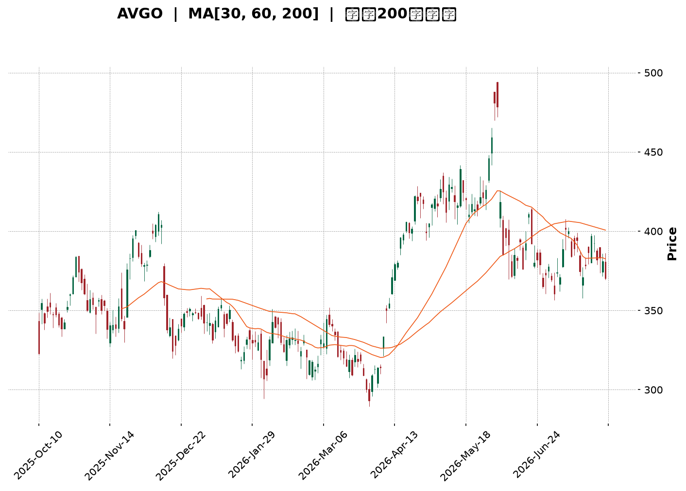
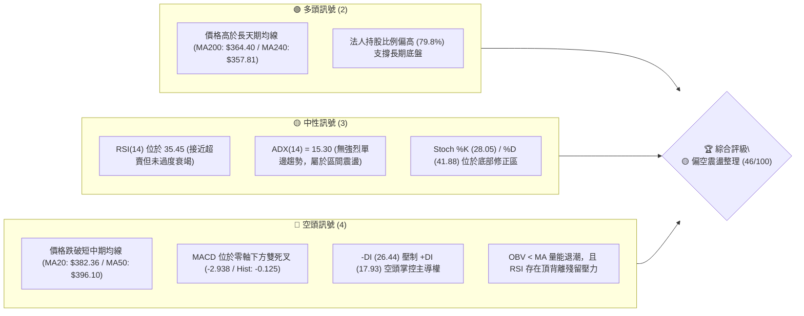
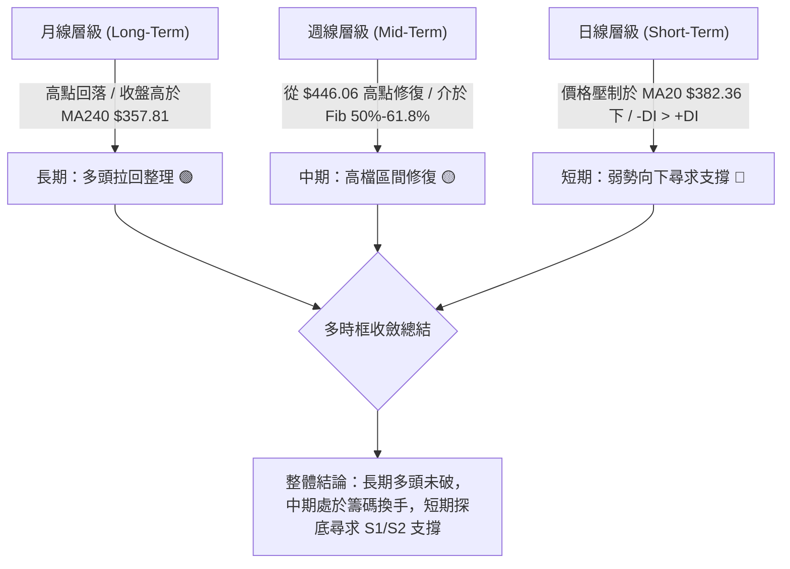
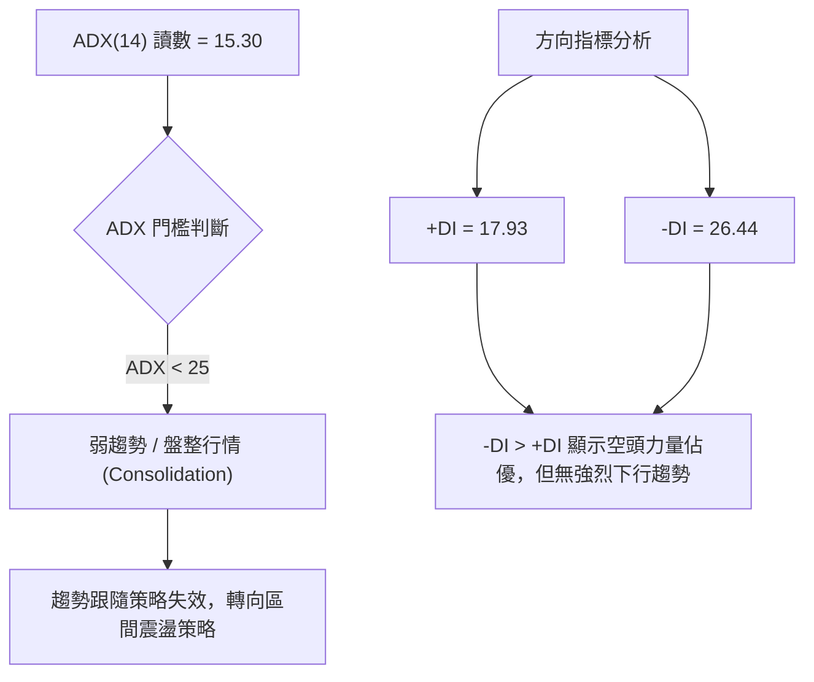
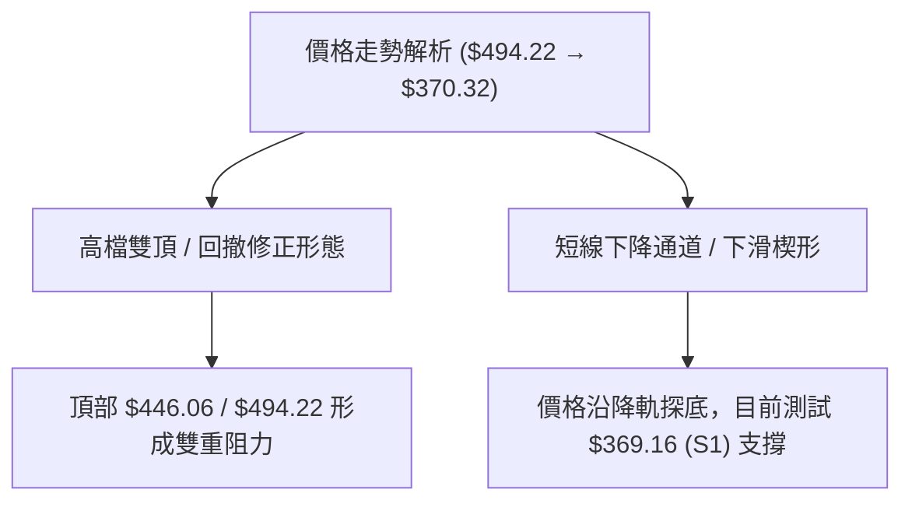
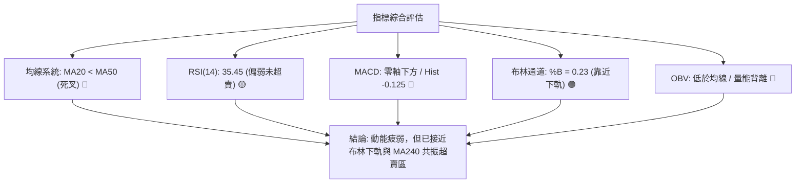
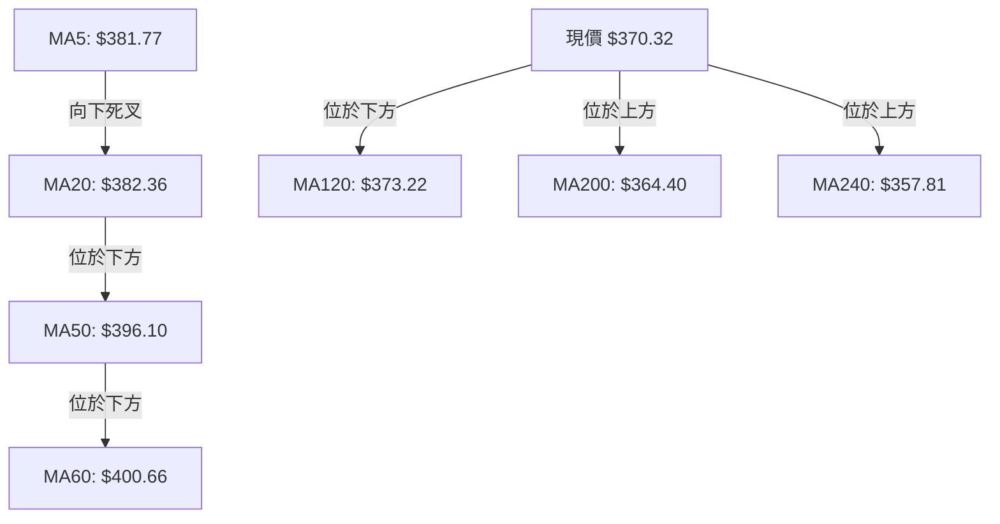
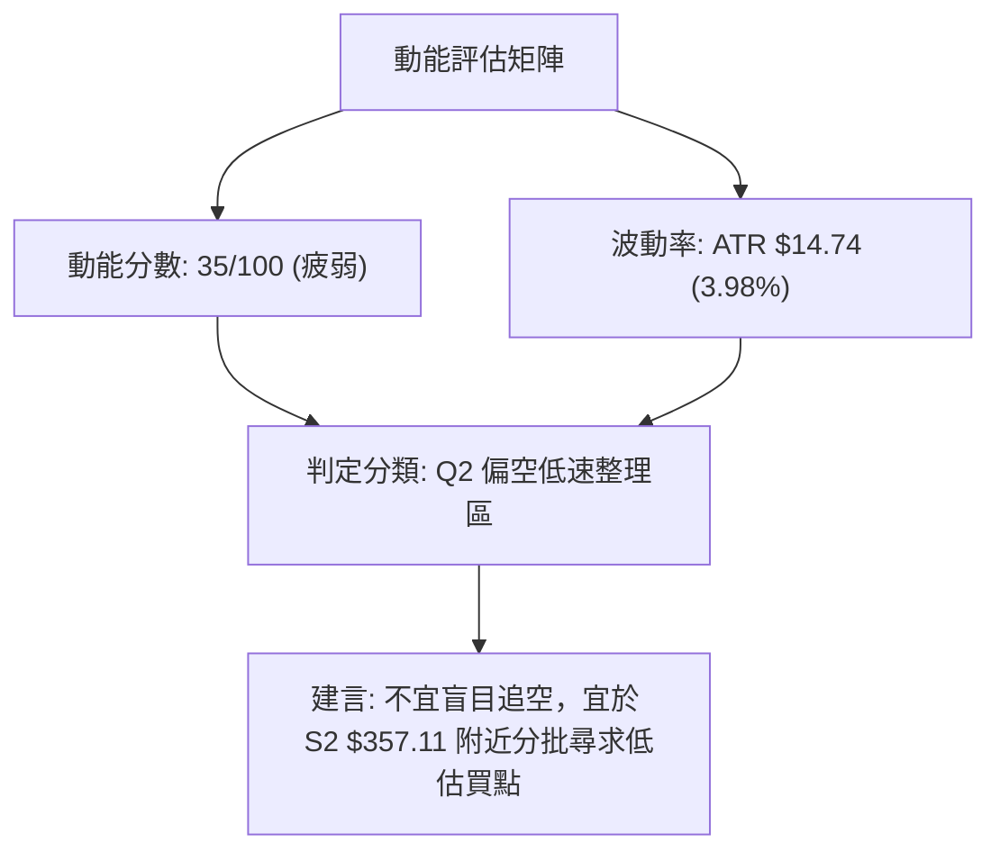
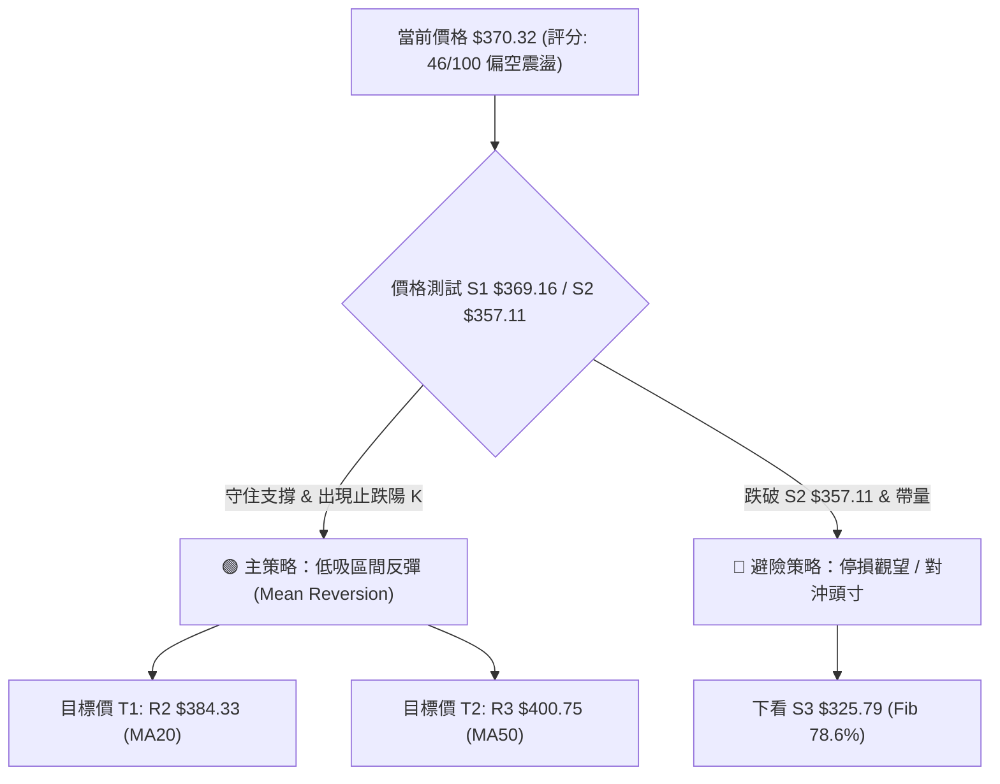
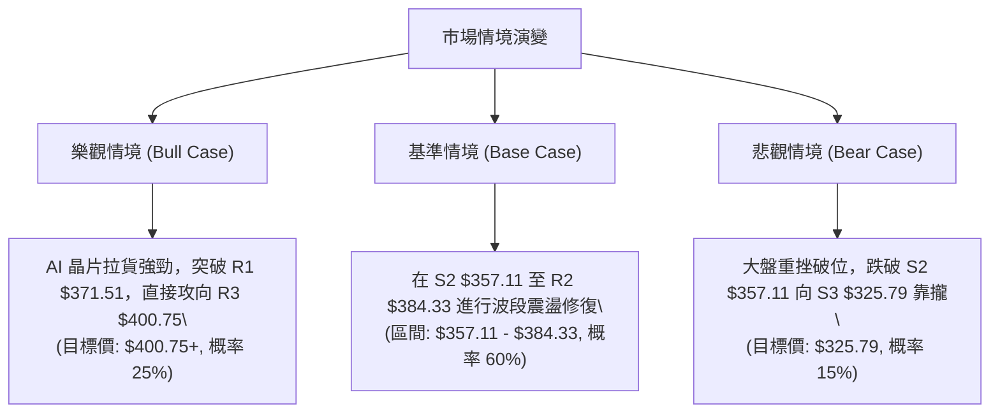

<details markdown="1">
<summary>📊 靜態圖表 (點擊展開)</summary>



</details>

<html>
<head><meta charset="utf-8" /></head>
<body>
    <div style="height:500px; width:100%;">                        <script>window.PlotlyConfig = {MathJaxConfig: 'local'};</script>
        <script charset="utf-8" src="https://cdn.plot.ly/plotly-3.7.0.min.js" integrity="sha256-jvTGqxNp8AGWEcvNLVuKr+8j5dGe9Yw51LQkmDH+IYA=" crossorigin="anonymous"></script>                <div id="candlestick-chart" class="plotly-graph-div" style="height:100%; width:100%;"></div>            <script>                window.PLOTLYENV=window.PLOTLYENV || {};                                if (document.getElementById("candlestick-chart")) {                    Plotly.newPlot(                        "candlestick-chart",                        [{"close":{"dtype":"f8","bdata":"AAAAQCItdEAAAAAAZSt2QAAAACBlY3VAAAAA4PPVdUAAAABA0gJ2QAAAAKAhtnVAAAAAILO0dUAAAACgAUx1QAAAAOB0JnVAAAAA4PBldUAAAADggAJ2QAAAAECEgHZAAAAAgEMud0AAAACAQ\u002f13QAAAAKDzZXdAAAAAIB\u002f5dkAAAADgeIh2QAAAAKCo33VAAAAAwKtPdkAAAADAuxl2QAAAAAC5t3VAAAAAoEhGdkAAAAAg+t91QAAAAKDYE3ZAAAAAgF0hdUAAAADg0kh1QAAAAMDYS3VAAAAAgKMpdUAAAAAgHgd2QAAAAAAyjnVAAAAAwN0kdUAAAACAqH13QAAAAOAl7ndAAAAAgKu1eEAAAADgbQt5QAAAAMDa\u002fndAAAAA4Bi3d0AAAACA0qd3QAAAAGCBrndAAAAAIAtBeEAAAADg1e14QAAAAKBpQHlAAAAAgLKqeUAAAABgr0F5QAAAAEDJXnZAAAAAAKkedUAAAAAgXjZ1QAAAAABAQ3RAAAAAYKqAdEAAAABAaSd1QAAAAEAmQ3VAAAAAYJvAdUAAAABA9M51QAAAAOBm7XVAAAAAILnBdUAAAABADsl1QAAAAKBGjXVAAAAAoIGldUAAAADAjWJ1QAAAAAAiaHVAAAAAINRjdUAAAADgJ7R0QAAAAEBDe3VAAAAAYK3udUAAAACg7xR2QAAAAABIKnVAAAAAQC1cdUAAAADgtOZ1QAAAAKARtnRAAAAA4H15dEAAAADguUR0QAAAAGAB7nNAAAAAIIY6dEAAAAAAGbl0QAAAAGBFwHRAAAAAQEKYdEAAAABgWKF0QAAAAOBQnnRAAAAAIHjyc0AAAADAtS5zQAAAACDtVXNAAAAAoCu7dEAAAADA12p1QAAAAGAMM3VAAAAAQAhYdUAAAADgRZ90QAAAACCgP3RAAAAAwBy1dEAAAABAk8R0QAAAACA6zHRAAAAAoN22dEAAAACgCpJ0QAAAAOC5RHRAAAAAIHKxdEAAAAAgTwh0QAAAAAAJ5nNAAAAA4GXac0AAAADAAotzQAAAAIDVxXNAAAAAQMe4dEAAAAAARpR0QAAAAECyh3VAAAAAgClVdUAAAADgD0V1QAAAAIDK63RAAAAAYKQPdEAAAADgozt0QAAAAIAXAnRAAAAAwFOsc0AAAACAqOpzQAAAACDtVXNAAAAAoAEgdEAAAADAl9xzQAAAAEDm5HNAAAAAoOVOc0AAAAAgR8NyQAAAAEAkT3JAAAAAwFVQc0AAAAAA6o9zQAAAAODYoHNAAAAAIO6ec0AAAACAE9d0QAAAACA34XVAAAAAQJYldkAAAADgZy93QAAAACBmsndAAAAAQNrCd0AAAABgfcF4QAAAACBy3XhAAAAAoFxeeUAAAADg+e94QAAAAGCNGHlAAAAAwLZfekAAAABAbDR6QAAAAMB4YXpAAAAAgKAYekAAAADAK\u002fN4QAAAAADzTHlAAAAAgFMMekAAAAAg1El6QAAAAEB4\u002fXlAAAAAgPSqekAAAACgSIx6QAAAAICHvnlAAAAA4CDVekAAAABADLx6QAAAAOAyKnpAAAAAQBoCekAAAABghXF7QAAAAEBKiHpAAAAAILlAekAAAAAguqZ5QAAAACCZEXpAAAAAgKPeeUAAAAAAxdd5QAAAAKB9VXpAAAAAABhTekAAAACgfp56QAAAAEAG4XtAAAAAAOSzfEAAAADg8Qx+QAAAAGCQ531AAAAAAPgjekAAAACA7RF4QAAAAKCSv3hAAAAAIKV4eEAAAABAMTh3QAAAACBfD3hAAAAA4HXXd0AAAACAFJV4QAAAAODVgXdAAAAAYHeEeEAAAABAM6t5QAAAAIAUgnhAAAAAYGbCd0AAAADAHuF3QAAAAGCPrndAAAAA4FHQdkAAAABAM0d3QAAAAAAAnHdAAAAAoHAVd0AAAABAM4d2QAAAAGBmXndAAAAA4Hosd0AAAABACkt4QAAAAIDCEXlAAAAAIIX\u002feEAAAADAzAB4QAAAAIDCUXhAAAAA4HqkeEAAAABAM2d3QAAAAKBHLXdAAAAAYI+id0AAAAAAACh4QAAAAMD1zHhAAAAAIIWHeEAAAABguN53QAAAACCF83dAAAAAYI\u002fOd0AAAADAHiV3QA=="},"high":{"dtype":"f8","bdata":"waBpkFbKdUALiyoTCVZ2QAtAd7Zzy3VAuUWNaVpWdkDvog1hc5N2QE7qabA50HVAgW\u002fm+aQpdkBnbQA4S9J1QEoLvSEhoXVAkOOGtDeKdUA5yB\u002fw2UR2QC11VoWni3ZArPV+Pps\u002fd0BKzzAWOAV4QKHyMzXyA3hAnlBZmVeLd0BiX7P6LEx3QEaAwVdN7nZADGXjrGKtdkBtvTqRlpd2QDSNCQVkCHZAzzXRX+ZfdkBrjS7V+H12QKCrxK7rTXZAEur4XUb5dUBHwXy0GW11QCNIxqDL43VAjEX9G36gdUBE6BC091p2QDeUffe+X3dAb2VoYoSqdUDR9Ykn8L13QIwfn7x4H3hAiy2nv0PaeEA8XzTWEAx5QMK7pEx2k3hAtxVZzul0eEDpXlIstsJ3QIPGabcC3HdARtls5mN1eEBDOQrUUlB5QF2YK2SYSnlA8nimcMrEeUBInx6+TXB5QIPEJTfwvXdAB2uRubh\u002fdkCbqPvZA5l1QPFn9KDainVA6QBtXYTidEBlkx13k1h1QPBZFf6Bj3VAZILIPzPNdUCCyB\u002fwCfl1QEdptolB\u002f3VADgiSHrXQdUBoScdUK\u002fZ1QOvGpqyIyXVAd841d2F1dkDsFaW3oRt2QKFhRoBNvHVAbZVkK6rGdUCEv8egsmZ1QGpnzz7XoXVA4DgkOJ4JdkBUP3nDumJ2QOWpWWVy1nVALHxLgVjGdUDHuEmoVxN2QN\u002fQrPMdgnVA9Jq6pBTpdEBhaor+DPx0QCsk53XuDHRACd1nLJR3dECq5XyCgNh0QLdi1ObfK3VA3qYN53jrdEDDLewlVw91QNgP87U57XRAgHeZtn8adUBJc+W3ZeVzQLkRMixOVXRAtptW+1PcdED4fr\u002fYv\u002fB1QPJ\u002f\u002fVK5q3VAg77AwM+edUAzxTwTTpB1QCk98vJ80XRAd35jnkjodEAHU\u002fwNPQp1QOL5WHoqE3VA2RZ7msktdUAJWKhUHxR1QH\u002fpRTuucXRAuQ6KodXqdED9eKMjGlZ0QADqKnw17XNAvATWqNjtc0AF40T1h6tzQGoGl05LF3RAcyBvgy7udEDKGIn+\u002fGN1QEtiGw9gs3VAT2lVn4D9dUDyCnMip4h1QNwcFflSKXVA1fZ30UARdUDNLLlo3n90QGG0AtnPY3RADF5DyO1DdEBO2O4vViF0QFl0RcNHBXRAHDQXDm1fdEA\u002fkQi0Mj50QNmxS7eZPHRAo8qeFLXGc0BmUKy7OTBzQK53rDidBHNAv9Z8Uh1dc0CB8BT9p7RzQOrKAXgVo3NASenSf2a+c0ApPsKV89l0QBTcQGhJGXZA238wmCFidkAbliODR393QNda13AhxHdAjoeIitDad0BR+4WLPcd4QN4DK2vG8HhA+uIupWVheUBZLyTNcVx5QKzFmV5lL3lAi0+iEIBoekAqJ6UaG8p6QLlHg0BBhXpAbYX9zE9hekALhHQrs1J5QD00LQX8T3lAPPDnmYAbekDhyU1kBWh6QAG9tm6QcnpAF3rMeEgLe0AILRZn0E97QKXY8ZYOnXpAZU1ZgwAle0BjLbWWbw97QOLRYMSVynpAFBlB934fekAMWrZdk5p7QPq6Km4EAntAmCT1lX1VekA5hjcYohR6QH50LgP\u002fd3pAqDPRClNZekAhuuaiODV6QK7kIkv0KXtAK2bHcNsBe0DwgnwvBNB6QLkSyPYMA3xA+03PRQQVfUCm81\u002fzwoB+QK0rUS58435AdafkwOWcekDlDVMNn515QGVMjzxBI3lAe\u002fA6kZtzeUBkz32jNBN4QE9XGfAmTnhAJQZiavIFeEAPG0vfLrl4QEIHEgW8cnhAyc3JNkUAeUCf8SojxMB5QAAAAIA96nlAAAAA4FFweEAAAAAA10t4QAAAAMDMTHhAAAAAQApbd0AAAAAgXIN3QAAAAIDruXdAAAAAAABcd0AAAAAAAGB3QAAAAGCP8ndAAAAAIFxPd0AAAACgcLF4QAAAAOBReHlAAAAAQAoneUAAAAAAALx4QAAAAKBH1XhAAAAAAADweEAAAAAA1yt4QAAAAKCZlXdAAAAAoHD5d0AAAACgR2l4QAAAAKBw6XhAAAAAgMLZeEAAAADgUVR4QAAAAGBmXnhAAAAAwMwceEAAAACA6yF4QA=="},"hovertemplate":"\u003cb\u003e%{x|%Y-%m-%d}\u003c\u002fb\u003e\u003cbr\u003e\u958b: $%{open:.2f}\u003cbr\u003e\u9ad8: $%{high:.2f}\u003cbr\u003e\u4f4e: $%{low:.2f}\u003cbr\u003e\u6536: $%{close:.2f}\u003cextra\u003e\u003c\u002fextra\u003e","low":{"dtype":"f8","bdata":"z6hqvecjdEB4nOx6sFl1QO4RoEMdHHVAPhIsrQOZdUDSEYc\u002frbh1QBj5sAoYLnVAK8\u002fttGyedUATS+XQhjZ1QCOPs3Y+2nRANBXQKwwodUB23dMPy851QMsBmzqeEXZAa1g2jyeIdkBHyu6TwzF3QJB3bZH2\u002f3ZAjUV6pwuxdkAMPcJCZ392QC1aB9Wz0HVA4UZLLjnCdUCD44z96Ot1QEZr4TE\u002f9nRAtSwm6SMKdkDZhqelirt1QPB7hI6F23VA8JgDmsPEdEB3iNxgnnN0QOvcF1o5+nRAaAy3Zz7adEA3un7hrf50QJHGo+8ZdHVAoEHF\u002fTafdEAKKgNnj5t1QLKlyCPaGndAgR3DZvzRd0BsRAaFJa94QHd+nB5D73dACYOIocaad0CPiRa6WQl3QEze4RfoZndA+RgHsA7wd0A2o20V97J4QOm7T9LklHhAOrExOlXVeEA1wrsn5H94QMiKhXy7EnZAljFOwBD6dEAyUaGPFdN0QIU+RYAP+nNAOj76CjkddECiszX3n6t0QImN67a3\u002f3RA636jjsIUdUCPQzXt2p11QFkfZTiUp3VAKSy8h8x2dUD7vr+kScB1QM+79JhvgnVAOl\u002fz16qEdUALL0VnPfR0QFeEa90mDHVA9xhhLVvqdEATlhaEl5R0QOhoM41qxHRAnAxCxS07dUDwsT8f9Nl1QF6svRoV03RA8\u002f5QC6hGdUAgNBenmGx1QIf918ZQqXRA+QjbhikwdEAbqv1kKTt0QDSmF2xQj3NA3ShrHfPGc0AAY8+9HV10QI086PADWHRAm11qGKzxc0DpRsPl\u002f3F0QGWG0\u002fPeSHRAYL6mdUY4c0CXkZtsdWNyQOcpgqYwGXNAoU\u002fW2Dmyc0CVnWaq+5Z0QB5MHMV7KXVAjVtW2T3IdEB3thZ0m4V0QBciSTf5N3RA1739nGKyc0DutLPIdmB0QNIe0CqFh3RAkSnRBu2FdECDgik3BEJ0QKyNExe8lHNAWjTQzCSBdEAetUwhzCxzQLCSSdDLTXNATABzDykhc0Cb5JVPWSRzQBoVTKqIaXNAvGaMrIIddEC+t1SNLGN0QHuvLJbBJnRACndkYsk4dUCpInWcqA91QOV2kkyxr3RA9CFkOQEEdEDflG5PKu5zQBfdrchewXNAxqN39kSmc0CKW5gyCzZzQMk9j16FTHNAx5Fb7+qmc0BvOIPUeqVzQCdPCyeDw3NAP\u002fk+PudKc0Dclw0XXaZyQNRnnlQHGHJAMy2anfJ9ckAgDEKb1F9zQBuNjPhe1HJA0LVLnKJcc0CtqkPlqRR0QCgz7ezRX3VAL3cq8hzvdUC\u002fgUdT\u002f4N2QEU2kbhWDndAllUb\u002fpp7d0BO0PIqXw94QMqUNDyue3hAxeMED9ryeECBu4bkY7R4QFC5r\u002fAkn3hAUViUBYZDeUDbldaZPBJ6QBaQPjdsg3lAt0BA25jfeUCRiPUGbKB4QO07ur1ywnhAqnVPz3U5eUCkAcHnB8p5QFap0DwgjnlA8pvLd\u002f8qekCjCyjU6hF6QPKfaQSHWnlAiTvibojVeUDzoYGgDYZ6QLlz+fs7fHlAyfygupBCeUATh+DB7u55QP3D5qIvMnpAr\u002fLxiHHbeUDpAbeYf1N5QJCO0ohRrHlAGeOzF5+deUBQ8dYP\u002fZh5QNbKIA11BXpAWlznQU\u002f9eUBMpKdbsdV5QM9VpYac7HpAfEO84laYe0AsvVYod1t9QEWLIGdKfn1AJqZ1ifgleUDcXP\u002fnsA94QD7YD5u0a3hA0o1iq+obd0DSAO8EVil3QEBdzVduH3dA+AmN8HeGd0AnWxFwxj94QEw0PX7XfXdASL6Jt7ngd0CeAbrD1Et5QAAAAGCPfnhAAAAAYI+Kd0AAAAAgXI93QAAAAEAzS3dAAAAAoEe9dkAAAAAgXId2QAAAAIA9KndAAAAA4HoAd0AAAABA4UZ2QAAAAEDhMndAAAAAACmgdkAAAACAPY53QAAAAEDhPnhAAAAAQDO7eEAAAABguPZ3QAAAAIA9CnhAAAAAANcreEAAAABgZj53QAAAAMDMXHZAAAAAIFx\u002fd0AAAAAghbN3QAAAAAAAwHdAAAAAwB4teEAAAAAAAKx3QAAAAAAAWHdAAAAA4FE4d0AAAAAAKRh3QA=="},"name":"\u50f9\u683c","open":{"dtype":"f8","bdata":"ZPHGXXF3dUDghoZV3ex1QDh9FircwnVAIYvLsukHdkB00U4i\u002fCx2QEW5zBuWunVAqJ5xyUD9dUDzUf+zysB1QJEc0hbVlXVANBXQKwwodUAOxapauuh1QEyaKgRneHZAsj9PIZaJdkBHyu6TwzF3QKHyMzXyA3hARd1uR5eCd0AGLjVp1B53QA4w+gxaSHZADq5Ay\u002fPOdUBQjxBzpmF2QG3th1h1A3ZA\u002ft2Br3w+dkDMiH4cg092QPEg6AC3QHZAYRfyNe7ZdUDuV6W99pl0QOZCh7nRHnVA35cYHplUdUAcBnnU+ix1QJFTNW9dv3ZAGMcnqMhzdUDXtemNrJx1QMnMZoiO7HdAF6zo4Gv2d0CR2XHH\u002fdF4QK5riY9kinhAO\u002fhyBlYieEDez4DsHZ53QF5dRb3vqHdA4qBqZ0kAeEAbKcrfygN5QHfcAt1xyHhAEoUad1b\u002feEDiN0mnLil5QCBpMeh6nXdAH3dIvPh9dkC5zeHFW+J0QPFn9KDainVAuJy6LAridEDSDQSet7d0QD7FOAYpjHVArg+gTvI4dUCy+TdPctZ1QPP46DVY3HVA6mOC0gq3dUBksTLy98p1QFFm540kx3VA\u002fLmZbcP3dUBk1rkzAhd2QBH\u002fKk5sZXVAg2A2byJHdUCL\u002fWnIWVh1QJ3dM3vgCnVAnAxCxS07dUBYysShW\u002fl1QM9nmSAHu3VAjyxrLGu9dUDuo4pn\u002fI91QJJ1or5kbXVAcyuzQHXkdECoaPpF6OF0QPLFX6YM4nNAnQjaKgXqc0BAe+Ssy4h0QNMkBqqzGXVA52lgXW61dEAOhcO8hLN0QOCGbQqcTnRACr05zxD4dEBJc+W3ZeVzQPSykCz7knNAJmjFmM3uc0At9plc5Zh0QPOSM5Edo3VAeNY8RG+YdUBZWIvOFml1QM+yZwU7inRAdpabcxvoc0Cp46wb+IR0QIEPaNuavHRA3H0WHD6ydEAOs3NJfbB0QDES7hizFXRArSka+mqYdEDEmXa301R0QN4eWor0WHNAscDP1pdDc0BJU6DAnn1zQKqRkq9XqHNAHy2nj32PdEAaOqrSM3F0QHYzhl3IYHRAjClmizO3dUCzsZVqUlV1QA04TsQBCHVAVwmE8AwHdUAHGtLWLE10QA\u002fpXtoHSXRA4MKHGRD0c0C7M97KK3VzQM8spSgf73NAtsam0PXXc0DSTp\u002fO6PdzQFqvr6hIIXRAqArqWWGYc0BuzrpUMilzQK7J5xZQxnJAB576v6uuckCwItJG\u002f41zQC4ZmzwkAHNA93QejP6oc0BmuGVca2N0QFTERmAb83VAwqqihOT7dUBiZHMM6oV2QGFeVc42EXdAk6caZNiUd0D62YIFOVR4QKvRb3UDpnhA82r+oEMEeUA06ClW8VB5QCNgJT127HhAd5vA7GNleUCBFoWkj1t6QGwOooHvhHpAytEzngw9ekCRB6bE1vp4QHOqD1\u002fMLXlADgm5fNDteUA5xqTw8eZ5QEVfEz7yGHpA6cZXROZPekDD3smf8i17QJNXypB0UnpAsma1pC8yekA+kCC+G696QOPF26QsbHpAZFbPd3LyeUA\u002fC\u002fLgJAF6QPq6Km4EAntA8oog2OdLekAGGC43wpJ5QMtbvemFwnlAoukYGljOeUDpuETRSA16QDHnw1drHXpAWp8ZeV+GekA3TbC1l0d6QDIGaBJBBHtA8HSacg8WfEA4iBRFSIB+QLuu13r4335A7bfx1H+FeUAha\u002fBBdG95QM0JGIm9H3lAIwTLFZsPeUDsDtzIWs53QIyPb6axQ3dAVmEbktHxd0CpfpYWKa54QPf3Fn9+WXhAOQOLPohBeEBRNcG07I55QAAAAGCP2nlAAAAAgOudd0AAAACA6yl4QAAAAKBHKXhAAAAAQDMnd0AAAACA61l3QAAAAOCjbHdAAAAAgOs9d0AAAAAgrtt2QAAAAIDCWXdAAAAAwPXodkAAAADgUZh3QAAAAEAKI3lAAAAAAADoeEAAAAAgrpd4QAAAACCFu3hAAAAAoHDBeEAAAADgowh4QAAAAMDM4HZAAAAAACmsd0AAAAAgXGN4QAAAAEAzw3dAAAAAQAqDeEAAAABA4Tp4QAAAAMAeXXhAAAAAgMJld0AAAACAPcp3QA=="},"x":["2025-10-10T00:00:00-04:00","2025-10-13T00:00:00-04:00","2025-10-14T00:00:00-04:00","2025-10-15T00:00:00-04:00","2025-10-16T00:00:00-04:00","2025-10-17T00:00:00-04:00","2025-10-20T00:00:00-04:00","2025-10-21T00:00:00-04:00","2025-10-22T00:00:00-04:00","2025-10-23T00:00:00-04:00","2025-10-24T00:00:00-04:00","2025-10-27T00:00:00-04:00","2025-10-28T00:00:00-04:00","2025-10-29T00:00:00-04:00","2025-10-30T00:00:00-04:00","2025-10-31T00:00:00-04:00","2025-11-03T00:00:00-05:00","2025-11-04T00:00:00-05:00","2025-11-05T00:00:00-05:00","2025-11-06T00:00:00-05:00","2025-11-07T00:00:00-05:00","2025-11-10T00:00:00-05:00","2025-11-11T00:00:00-05:00","2025-11-12T00:00:00-05:00","2025-11-13T00:00:00-05:00","2025-11-14T00:00:00-05:00","2025-11-17T00:00:00-05:00","2025-11-18T00:00:00-05:00","2025-11-19T00:00:00-05:00","2025-11-20T00:00:00-05:00","2025-11-21T00:00:00-05:00","2025-11-24T00:00:00-05:00","2025-11-25T00:00:00-05:00","2025-11-26T00:00:00-05:00","2025-11-28T00:00:00-05:00","2025-12-01T00:00:00-05:00","2025-12-02T00:00:00-05:00","2025-12-03T00:00:00-05:00","2025-12-04T00:00:00-05:00","2025-12-05T00:00:00-05:00","2025-12-08T00:00:00-05:00","2025-12-09T00:00:00-05:00","2025-12-10T00:00:00-05:00","2025-12-11T00:00:00-05:00","2025-12-12T00:00:00-05:00","2025-12-15T00:00:00-05:00","2025-12-16T00:00:00-05:00","2025-12-17T00:00:00-05:00","2025-12-18T00:00:00-05:00","2025-12-19T00:00:00-05:00","2025-12-22T00:00:00-05:00","2025-12-23T00:00:00-05:00","2025-12-24T00:00:00-05:00","2025-12-26T00:00:00-05:00","2025-12-29T00:00:00-05:00","2025-12-30T00:00:00-05:00","2025-12-31T00:00:00-05:00","2026-01-02T00:00:00-05:00","2026-01-05T00:00:00-05:00","2026-01-06T00:00:00-05:00","2026-01-07T00:00:00-05:00","2026-01-08T00:00:00-05:00","2026-01-09T00:00:00-05:00","2026-01-12T00:00:00-05:00","2026-01-13T00:00:00-05:00","2026-01-14T00:00:00-05:00","2026-01-15T00:00:00-05:00","2026-01-16T00:00:00-05:00","2026-01-20T00:00:00-05:00","2026-01-21T00:00:00-05:00","2026-01-22T00:00:00-05:00","2026-01-23T00:00:00-05:00","2026-01-26T00:00:00-05:00","2026-01-27T00:00:00-05:00","2026-01-28T00:00:00-05:00","2026-01-29T00:00:00-05:00","2026-01-30T00:00:00-05:00","2026-02-02T00:00:00-05:00","2026-02-03T00:00:00-05:00","2026-02-04T00:00:00-05:00","2026-02-05T00:00:00-05:00","2026-02-06T00:00:00-05:00","2026-02-09T00:00:00-05:00","2026-02-10T00:00:00-05:00","2026-02-11T00:00:00-05:00","2026-02-12T00:00:00-05:00","2026-02-13T00:00:00-05:00","2026-02-17T00:00:00-05:00","2026-02-18T00:00:00-05:00","2026-02-19T00:00:00-05:00","2026-02-20T00:00:00-05:00","2026-02-23T00:00:00-05:00","2026-02-24T00:00:00-05:00","2026-02-25T00:00:00-05:00","2026-02-26T00:00:00-05:00","2026-02-27T00:00:00-05:00","2026-03-02T00:00:00-05:00","2026-03-03T00:00:00-05:00","2026-03-04T00:00:00-05:00","2026-03-05T00:00:00-05:00","2026-03-06T00:00:00-05:00","2026-03-09T00:00:00-04:00","2026-03-10T00:00:00-04:00","2026-03-11T00:00:00-04:00","2026-03-12T00:00:00-04:00","2026-03-13T00:00:00-04:00","2026-03-16T00:00:00-04:00","2026-03-17T00:00:00-04:00","2026-03-18T00:00:00-04:00","2026-03-19T00:00:00-04:00","2026-03-20T00:00:00-04:00","2026-03-23T00:00:00-04:00","2026-03-24T00:00:00-04:00","2026-03-25T00:00:00-04:00","2026-03-26T00:00:00-04:00","2026-03-27T00:00:00-04:00","2026-03-30T00:00:00-04:00","2026-03-31T00:00:00-04:00","2026-04-01T00:00:00-04:00","2026-04-02T00:00:00-04:00","2026-04-06T00:00:00-04:00","2026-04-07T00:00:00-04:00","2026-04-08T00:00:00-04:00","2026-04-09T00:00:00-04:00","2026-04-10T00:00:00-04:00","2026-04-13T00:00:00-04:00","2026-04-14T00:00:00-04:00","2026-04-15T00:00:00-04:00","2026-04-16T00:00:00-04:00","2026-04-17T00:00:00-04:00","2026-04-20T00:00:00-04:00","2026-04-21T00:00:00-04:00","2026-04-22T00:00:00-04:00","2026-04-23T00:00:00-04:00","2026-04-24T00:00:00-04:00","2026-04-27T00:00:00-04:00","2026-04-28T00:00:00-04:00","2026-04-29T00:00:00-04:00","2026-04-30T00:00:00-04:00","2026-05-01T00:00:00-04:00","2026-05-04T00:00:00-04:00","2026-05-05T00:00:00-04:00","2026-05-06T00:00:00-04:00","2026-05-07T00:00:00-04:00","2026-05-08T00:00:00-04:00","2026-05-11T00:00:00-04:00","2026-05-12T00:00:00-04:00","2026-05-13T00:00:00-04:00","2026-05-14T00:00:00-04:00","2026-05-15T00:00:00-04:00","2026-05-18T00:00:00-04:00","2026-05-19T00:00:00-04:00","2026-05-20T00:00:00-04:00","2026-05-21T00:00:00-04:00","2026-05-22T00:00:00-04:00","2026-05-26T00:00:00-04:00","2026-05-27T00:00:00-04:00","2026-05-28T00:00:00-04:00","2026-05-29T00:00:00-04:00","2026-06-01T00:00:00-04:00","2026-06-02T00:00:00-04:00","2026-06-03T00:00:00-04:00","2026-06-04T00:00:00-04:00","2026-06-05T00:00:00-04:00","2026-06-08T00:00:00-04:00","2026-06-09T00:00:00-04:00","2026-06-10T00:00:00-04:00","2026-06-11T00:00:00-04:00","2026-06-12T00:00:00-04:00","2026-06-15T00:00:00-04:00","2026-06-16T00:00:00-04:00","2026-06-17T00:00:00-04:00","2026-06-18T00:00:00-04:00","2026-06-22T00:00:00-04:00","2026-06-23T00:00:00-04:00","2026-06-24T00:00:00-04:00","2026-06-25T00:00:00-04:00","2026-06-26T00:00:00-04:00","2026-06-29T00:00:00-04:00","2026-06-30T00:00:00-04:00","2026-07-01T00:00:00-04:00","2026-07-02T00:00:00-04:00","2026-07-06T00:00:00-04:00","2026-07-07T00:00:00-04:00","2026-07-08T00:00:00-04:00","2026-07-09T00:00:00-04:00","2026-07-10T00:00:00-04:00","2026-07-13T00:00:00-04:00","2026-07-14T00:00:00-04:00","2026-07-15T00:00:00-04:00","2026-07-16T00:00:00-04:00","2026-07-17T00:00:00-04:00","2026-07-20T00:00:00-04:00","2026-07-21T00:00:00-04:00","2026-07-22T00:00:00-04:00","2026-07-23T00:00:00-04:00","2026-07-24T00:00:00-04:00","2026-07-27T00:00:00-04:00","2026-07-28T00:00:00-04:00","2026-07-29T00:00:00-04:00"],"type":"candlestick"},{"hovertemplate":"MA30: $%{y:.2f}\u003cextra\u003e\u003c\u002fextra\u003e","line":{"color":"#2196F3","dash":"dash","width":2},"mode":"lines","name":"MA30","x":["2025-10-10T00:00:00-04:00","2025-10-13T00:00:00-04:00","2025-10-14T00:00:00-04:00","2025-10-15T00:00:00-04:00","2025-10-16T00:00:00-04:00","2025-10-17T00:00:00-04:00","2025-10-20T00:00:00-04:00","2025-10-21T00:00:00-04:00","2025-10-22T00:00:00-04:00","2025-10-23T00:00:00-04:00","2025-10-24T00:00:00-04:00","2025-10-27T00:00:00-04:00","2025-10-28T00:00:00-04:00","2025-10-29T00:00:00-04:00","2025-10-30T00:00:00-04:00","2025-10-31T00:00:00-04:00","2025-11-03T00:00:00-05:00","2025-11-04T00:00:00-05:00","2025-11-05T00:00:00-05:00","2025-11-06T00:00:00-05:00","2025-11-07T00:00:00-05:00","2025-11-10T00:00:00-05:00","2025-11-11T00:00:00-05:00","2025-11-12T00:00:00-05:00","2025-11-13T00:00:00-05:00","2025-11-14T00:00:00-05:00","2025-11-17T00:00:00-05:00","2025-11-18T00:00:00-05:00","2025-11-19T00:00:00-05:00","2025-11-20T00:00:00-05:00","2025-11-21T00:00:00-05:00","2025-11-24T00:00:00-05:00","2025-11-25T00:00:00-05:00","2025-11-26T00:00:00-05:00","2025-11-28T00:00:00-05:00","2025-12-01T00:00:00-05:00","2025-12-02T00:00:00-05:00","2025-12-03T00:00:00-05:00","2025-12-04T00:00:00-05:00","2025-12-05T00:00:00-05:00","2025-12-08T00:00:00-05:00","2025-12-09T00:00:00-05:00","2025-12-10T00:00:00-05:00","2025-12-11T00:00:00-05:00","2025-12-12T00:00:00-05:00","2025-12-15T00:00:00-05:00","2025-12-16T00:00:00-05:00","2025-12-17T00:00:00-05:00","2025-12-18T00:00:00-05:00","2025-12-19T00:00:00-05:00","2025-12-22T00:00:00-05:00","2025-12-23T00:00:00-05:00","2025-12-24T00:00:00-05:00","2025-12-26T00:00:00-05:00","2025-12-29T00:00:00-05:00","2025-12-30T00:00:00-05:00","2025-12-31T00:00:00-05:00","2026-01-02T00:00:00-05:00","2026-01-05T00:00:00-05:00","2026-01-06T00:00:00-05:00","2026-01-07T00:00:00-05:00","2026-01-08T00:00:00-05:00","2026-01-09T00:00:00-05:00","2026-01-12T00:00:00-05:00","2026-01-13T00:00:00-05:00","2026-01-14T00:00:00-05:00","2026-01-15T00:00:00-05:00","2026-01-16T00:00:00-05:00","2026-01-20T00:00:00-05:00","2026-01-21T00:00:00-05:00","2026-01-22T00:00:00-05:00","2026-01-23T00:00:00-05:00","2026-01-26T00:00:00-05:00","2026-01-27T00:00:00-05:00","2026-01-28T00:00:00-05:00","2026-01-29T00:00:00-05:00","2026-01-30T00:00:00-05:00","2026-02-02T00:00:00-05:00","2026-02-03T00:00:00-05:00","2026-02-04T00:00:00-05:00","2026-02-05T00:00:00-05:00","2026-02-06T00:00:00-05:00","2026-02-09T00:00:00-05:00","2026-02-10T00:00:00-05:00","2026-02-11T00:00:00-05:00","2026-02-12T00:00:00-05:00","2026-02-13T00:00:00-05:00","2026-02-17T00:00:00-05:00","2026-02-18T00:00:00-05:00","2026-02-19T00:00:00-05:00","2026-02-20T00:00:00-05:00","2026-02-23T00:00:00-05:00","2026-02-24T00:00:00-05:00","2026-02-25T00:00:00-05:00","2026-02-26T00:00:00-05:00","2026-02-27T00:00:00-05:00","2026-03-02T00:00:00-05:00","2026-03-03T00:00:00-05:00","2026-03-04T00:00:00-05:00","2026-03-05T00:00:00-05:00","2026-03-06T00:00:00-05:00","2026-03-09T00:00:00-04:00","2026-03-10T00:00:00-04:00","2026-03-11T00:00:00-04:00","2026-03-12T00:00:00-04:00","2026-03-13T00:00:00-04:00","2026-03-16T00:00:00-04:00","2026-03-17T00:00:00-04:00","2026-03-18T00:00:00-04:00","2026-03-19T00:00:00-04:00","2026-03-20T00:00:00-04:00","2026-03-23T00:00:00-04:00","2026-03-24T00:00:00-04:00","2026-03-25T00:00:00-04:00","2026-03-26T00:00:00-04:00","2026-03-27T00:00:00-04:00","2026-03-30T00:00:00-04:00","2026-03-31T00:00:00-04:00","2026-04-01T00:00:00-04:00","2026-04-02T00:00:00-04:00","2026-04-06T00:00:00-04:00","2026-04-07T00:00:00-04:00","2026-04-08T00:00:00-04:00","2026-04-09T00:00:00-04:00","2026-04-10T00:00:00-04:00","2026-04-13T00:00:00-04:00","2026-04-14T00:00:00-04:00","2026-04-15T00:00:00-04:00","2026-04-16T00:00:00-04:00","2026-04-17T00:00:00-04:00","2026-04-20T00:00:00-04:00","2026-04-21T00:00:00-04:00","2026-04-22T00:00:00-04:00","2026-04-23T00:00:00-04:00","2026-04-24T00:00:00-04:00","2026-04-27T00:00:00-04:00","2026-04-28T00:00:00-04:00","2026-04-29T00:00:00-04:00","2026-04-30T00:00:00-04:00","2026-05-01T00:00:00-04:00","2026-05-04T00:00:00-04:00","2026-05-05T00:00:00-04:00","2026-05-06T00:00:00-04:00","2026-05-07T00:00:00-04:00","2026-05-08T00:00:00-04:00","2026-05-11T00:00:00-04:00","2026-05-12T00:00:00-04:00","2026-05-13T00:00:00-04:00","2026-05-14T00:00:00-04:00","2026-05-15T00:00:00-04:00","2026-05-18T00:00:00-04:00","2026-05-19T00:00:00-04:00","2026-05-20T00:00:00-04:00","2026-05-21T00:00:00-04:00","2026-05-22T00:00:00-04:00","2026-05-26T00:00:00-04:00","2026-05-27T00:00:00-04:00","2026-05-28T00:00:00-04:00","2026-05-29T00:00:00-04:00","2026-06-01T00:00:00-04:00","2026-06-02T00:00:00-04:00","2026-06-03T00:00:00-04:00","2026-06-04T00:00:00-04:00","2026-06-05T00:00:00-04:00","2026-06-08T00:00:00-04:00","2026-06-09T00:00:00-04:00","2026-06-10T00:00:00-04:00","2026-06-11T00:00:00-04:00","2026-06-12T00:00:00-04:00","2026-06-15T00:00:00-04:00","2026-06-16T00:00:00-04:00","2026-06-17T00:00:00-04:00","2026-06-18T00:00:00-04:00","2026-06-22T00:00:00-04:00","2026-06-23T00:00:00-04:00","2026-06-24T00:00:00-04:00","2026-06-25T00:00:00-04:00","2026-06-26T00:00:00-04:00","2026-06-29T00:00:00-04:00","2026-06-30T00:00:00-04:00","2026-07-01T00:00:00-04:00","2026-07-02T00:00:00-04:00","2026-07-06T00:00:00-04:00","2026-07-07T00:00:00-04:00","2026-07-08T00:00:00-04:00","2026-07-09T00:00:00-04:00","2026-07-10T00:00:00-04:00","2026-07-13T00:00:00-04:00","2026-07-14T00:00:00-04:00","2026-07-15T00:00:00-04:00","2026-07-16T00:00:00-04:00","2026-07-17T00:00:00-04:00","2026-07-20T00:00:00-04:00","2026-07-21T00:00:00-04:00","2026-07-22T00:00:00-04:00","2026-07-23T00:00:00-04:00","2026-07-24T00:00:00-04:00","2026-07-27T00:00:00-04:00","2026-07-28T00:00:00-04:00","2026-07-29T00:00:00-04:00"],"y":{"dtype":"f8","bdata":"AAAAAAAA+H8AAAAAAAD4fwAAAAAAAPh\u002fAAAAAAAA+H8AAAAAAAD4fwAAAAAAAPh\u002fAAAAAAAA+H8AAAAAAAD4fwAAAAAAAPh\u002fAAAAAAAA+H8AAAAAAAD4fwAAAAAAAPh\u002fAAAAAAAA+H8AAAAAAAD4fwAAAAAAAPh\u002fAAAAAAAA+H8AAAAAAAD4fwAAAAAAAPh\u002fAAAAAAAA+H8AAAAAAAD4fwAAAAAAAPh\u002fAAAAAAAA+H8AAAAAAAD4fwAAAAAAAPh\u002fAAAAAAAA+H8AAAAAAAD4fwAAAAAAAPh\u002fAAAAAAAA+H8AAAAAAAD4f+\u002fu7h7u73VAq6qqGjD4dUDv7u6edgN2QGZmZrYnGXZAVVVV1a0xdkAzMzPjkEt2QGZmZoYOX3ZAzczMDDRwdkDNzMycVIR2QBEREaHumXZA7+7uXk2ydkCrqqqaNst2QO\u002fu7i6t4nZAVVVVFeT3dkCrqqp6tAJ3QM3MzMzu+XZAAAAAEB7qdkB3d3fn2N52QO\u002fu7q4Z0XZAREREtKrBdkAzMzPjlrl2QBERESG0tXZAvLu7az+xdkCJiIgorrB2QJqZmRlmr3ZAzczMfL60dkC8u7u7BLl2QAAAABAzu3ZAEREREVS\u002fdkCamZnJ17l2QM3MzPySuHZARERERKy6dkBmZma246J2QKuqqkr+jXZAd3d3J0t2dkDe3d2tAl12QHd3d6fbRHZAvLu7u8IwdkB3d3dHyiF2QImIiDhxCHZAd3d3xzDodUBERESUa8B1QERERLQBk3VAMzMz05lkdUBVVVUl6j11QDMzM\u002fMYMHVA7+7uDp4rdUBmZmZmpiZ1QO\u002fu7n6vKXVAZmZmFvIkdUDe3d1NHxR1QHd3d3euA3VAq6qqivf6dEAiIiJCofd0QKuqqgpr8XRAVVVVJeXtdEARERER+ON0QKuqqurY2HRA3t3djdXQdECJiIh4kct0QDMzMxNfxnRAAAAAIJvAdEBEREQEeL90QKuqqhoetXRAAAAAEIuqdEDv7u4+Dpl0QImIiFg\u002fjnRA3t3dXWOBdEBERETUQ210QDMzM9NBZXRA7+7u3l1ndEDNzMysBGp0QERERLSsd3RAzczMjBiBdECamZnpwoV0QImIiEg2h3RAzczMfKiCdECrqqqaRH90QN7d3X0PenRAIiIi8rh3dEBVVVXF\u002fH10QFVVVcX8fXRAREREtNB4dEDe3d1Nimt0QGZmZuZmYHRAERER4QdPdEDe3d0NKj90QERERGSdLnRARERE5LgidEC8u7v7bhh0QGZmZkZ0DnRA3t3dfR8FdEBmZmaWbAd0QO\u002fu7n4sFXRAmpmZGZQhdEAzMzNTezx0QERERNTkXHRAq6qqCj5+dECJiIiYuap0QAAAAMAt1nRAzczM3NT9dEBmZmaGBSN1QKuqqjpzQXVAAAAA8HdsdUDe3d2dlJZ1QN7d3X0rxXVAzczMXKv4dUAAAACg6yB2QDMzMxMVTnZAd3d3d3uEdkCamZnJ2rp2QBEREbGj83ZAZmZmlngrd0BEREQEh2R3QKuqqspylndAd3d396fWd0CamZmJrhp4QO\u002fu7o63XXhAVVVVtdeWeEDv7u6eGNp4QM3MzMwCFXlAIiIioppNeUCJiIi4qHZ5QImIiLhnmnlA3t3dbSy6eUAzMzMz2tB5QLy7u\u002fta53lAiYiI6Dr9eUCamZlZIQ16QM3MzHzZJnpA7+7u7kxDekDNzMzM7m56QO\u002fu7m73l3pAvLu7m\u002fmVekDv7u4uwoN6QM3MzBzUdXpAZmZmZvZnekARERFRMll6QCIiIlKcTnpAIiIiIsg7ekBmZmY2OS16QCIiIiIJGHpAERERoa8FekCrqqrqLv55QM3MzIyi83lAIiIiImnZeUAiIiLiC8F5QERERMTbq3lAq6qqWpmQeUBVVVUVDm15QM3MzKwcVHlAmpmZuRE5eUCJiIgYax55QO\u002fu7t5gB3lAREREhF\u002fweEB3d3cXJuN4QGZmZpZb2HhARERE5AnNeECamZkpt7Z4QJqZmQlXmHhAZmZmZrF1eECJiIjY9zx4QFVVVQWPA3hAq6qqqi3ud0BEREQE6u53QBEREUFc73dAAAAAMNvvd0CamZk5aPV3QO\u002fu7o569HdAvLu7my70d0Dv7u6u6ud3QA=="},"type":"scatter"},{"hovertemplate":"MA60: $%{y:.2f}\u003cextra\u003e\u003c\u002fextra\u003e","line":{"color":"#9C27B0","dash":"dash","width":2},"mode":"lines","name":"MA60","x":["2025-10-10T00:00:00-04:00","2025-10-13T00:00:00-04:00","2025-10-14T00:00:00-04:00","2025-10-15T00:00:00-04:00","2025-10-16T00:00:00-04:00","2025-10-17T00:00:00-04:00","2025-10-20T00:00:00-04:00","2025-10-21T00:00:00-04:00","2025-10-22T00:00:00-04:00","2025-10-23T00:00:00-04:00","2025-10-24T00:00:00-04:00","2025-10-27T00:00:00-04:00","2025-10-28T00:00:00-04:00","2025-10-29T00:00:00-04:00","2025-10-30T00:00:00-04:00","2025-10-31T00:00:00-04:00","2025-11-03T00:00:00-05:00","2025-11-04T00:00:00-05:00","2025-11-05T00:00:00-05:00","2025-11-06T00:00:00-05:00","2025-11-07T00:00:00-05:00","2025-11-10T00:00:00-05:00","2025-11-11T00:00:00-05:00","2025-11-12T00:00:00-05:00","2025-11-13T00:00:00-05:00","2025-11-14T00:00:00-05:00","2025-11-17T00:00:00-05:00","2025-11-18T00:00:00-05:00","2025-11-19T00:00:00-05:00","2025-11-20T00:00:00-05:00","2025-11-21T00:00:00-05:00","2025-11-24T00:00:00-05:00","2025-11-25T00:00:00-05:00","2025-11-26T00:00:00-05:00","2025-11-28T00:00:00-05:00","2025-12-01T00:00:00-05:00","2025-12-02T00:00:00-05:00","2025-12-03T00:00:00-05:00","2025-12-04T00:00:00-05:00","2025-12-05T00:00:00-05:00","2025-12-08T00:00:00-05:00","2025-12-09T00:00:00-05:00","2025-12-10T00:00:00-05:00","2025-12-11T00:00:00-05:00","2025-12-12T00:00:00-05:00","2025-12-15T00:00:00-05:00","2025-12-16T00:00:00-05:00","2025-12-17T00:00:00-05:00","2025-12-18T00:00:00-05:00","2025-12-19T00:00:00-05:00","2025-12-22T00:00:00-05:00","2025-12-23T00:00:00-05:00","2025-12-24T00:00:00-05:00","2025-12-26T00:00:00-05:00","2025-12-29T00:00:00-05:00","2025-12-30T00:00:00-05:00","2025-12-31T00:00:00-05:00","2026-01-02T00:00:00-05:00","2026-01-05T00:00:00-05:00","2026-01-06T00:00:00-05:00","2026-01-07T00:00:00-05:00","2026-01-08T00:00:00-05:00","2026-01-09T00:00:00-05:00","2026-01-12T00:00:00-05:00","2026-01-13T00:00:00-05:00","2026-01-14T00:00:00-05:00","2026-01-15T00:00:00-05:00","2026-01-16T00:00:00-05:00","2026-01-20T00:00:00-05:00","2026-01-21T00:00:00-05:00","2026-01-22T00:00:00-05:00","2026-01-23T00:00:00-05:00","2026-01-26T00:00:00-05:00","2026-01-27T00:00:00-05:00","2026-01-28T00:00:00-05:00","2026-01-29T00:00:00-05:00","2026-01-30T00:00:00-05:00","2026-02-02T00:00:00-05:00","2026-02-03T00:00:00-05:00","2026-02-04T00:00:00-05:00","2026-02-05T00:00:00-05:00","2026-02-06T00:00:00-05:00","2026-02-09T00:00:00-05:00","2026-02-10T00:00:00-05:00","2026-02-11T00:00:00-05:00","2026-02-12T00:00:00-05:00","2026-02-13T00:00:00-05:00","2026-02-17T00:00:00-05:00","2026-02-18T00:00:00-05:00","2026-02-19T00:00:00-05:00","2026-02-20T00:00:00-05:00","2026-02-23T00:00:00-05:00","2026-02-24T00:00:00-05:00","2026-02-25T00:00:00-05:00","2026-02-26T00:00:00-05:00","2026-02-27T00:00:00-05:00","2026-03-02T00:00:00-05:00","2026-03-03T00:00:00-05:00","2026-03-04T00:00:00-05:00","2026-03-05T00:00:00-05:00","2026-03-06T00:00:00-05:00","2026-03-09T00:00:00-04:00","2026-03-10T00:00:00-04:00","2026-03-11T00:00:00-04:00","2026-03-12T00:00:00-04:00","2026-03-13T00:00:00-04:00","2026-03-16T00:00:00-04:00","2026-03-17T00:00:00-04:00","2026-03-18T00:00:00-04:00","2026-03-19T00:00:00-04:00","2026-03-20T00:00:00-04:00","2026-03-23T00:00:00-04:00","2026-03-24T00:00:00-04:00","2026-03-25T00:00:00-04:00","2026-03-26T00:00:00-04:00","2026-03-27T00:00:00-04:00","2026-03-30T00:00:00-04:00","2026-03-31T00:00:00-04:00","2026-04-01T00:00:00-04:00","2026-04-02T00:00:00-04:00","2026-04-06T00:00:00-04:00","2026-04-07T00:00:00-04:00","2026-04-08T00:00:00-04:00","2026-04-09T00:00:00-04:00","2026-04-10T00:00:00-04:00","2026-04-13T00:00:00-04:00","2026-04-14T00:00:00-04:00","2026-04-15T00:00:00-04:00","2026-04-16T00:00:00-04:00","2026-04-17T00:00:00-04:00","2026-04-20T00:00:00-04:00","2026-04-21T00:00:00-04:00","2026-04-22T00:00:00-04:00","2026-04-23T00:00:00-04:00","2026-04-24T00:00:00-04:00","2026-04-27T00:00:00-04:00","2026-04-28T00:00:00-04:00","2026-04-29T00:00:00-04:00","2026-04-30T00:00:00-04:00","2026-05-01T00:00:00-04:00","2026-05-04T00:00:00-04:00","2026-05-05T00:00:00-04:00","2026-05-06T00:00:00-04:00","2026-05-07T00:00:00-04:00","2026-05-08T00:00:00-04:00","2026-05-11T00:00:00-04:00","2026-05-12T00:00:00-04:00","2026-05-13T00:00:00-04:00","2026-05-14T00:00:00-04:00","2026-05-15T00:00:00-04:00","2026-05-18T00:00:00-04:00","2026-05-19T00:00:00-04:00","2026-05-20T00:00:00-04:00","2026-05-21T00:00:00-04:00","2026-05-22T00:00:00-04:00","2026-05-26T00:00:00-04:00","2026-05-27T00:00:00-04:00","2026-05-28T00:00:00-04:00","2026-05-29T00:00:00-04:00","2026-06-01T00:00:00-04:00","2026-06-02T00:00:00-04:00","2026-06-03T00:00:00-04:00","2026-06-04T00:00:00-04:00","2026-06-05T00:00:00-04:00","2026-06-08T00:00:00-04:00","2026-06-09T00:00:00-04:00","2026-06-10T00:00:00-04:00","2026-06-11T00:00:00-04:00","2026-06-12T00:00:00-04:00","2026-06-15T00:00:00-04:00","2026-06-16T00:00:00-04:00","2026-06-17T00:00:00-04:00","2026-06-18T00:00:00-04:00","2026-06-22T00:00:00-04:00","2026-06-23T00:00:00-04:00","2026-06-24T00:00:00-04:00","2026-06-25T00:00:00-04:00","2026-06-26T00:00:00-04:00","2026-06-29T00:00:00-04:00","2026-06-30T00:00:00-04:00","2026-07-01T00:00:00-04:00","2026-07-02T00:00:00-04:00","2026-07-06T00:00:00-04:00","2026-07-07T00:00:00-04:00","2026-07-08T00:00:00-04:00","2026-07-09T00:00:00-04:00","2026-07-10T00:00:00-04:00","2026-07-13T00:00:00-04:00","2026-07-14T00:00:00-04:00","2026-07-15T00:00:00-04:00","2026-07-16T00:00:00-04:00","2026-07-17T00:00:00-04:00","2026-07-20T00:00:00-04:00","2026-07-21T00:00:00-04:00","2026-07-22T00:00:00-04:00","2026-07-23T00:00:00-04:00","2026-07-24T00:00:00-04:00","2026-07-27T00:00:00-04:00","2026-07-28T00:00:00-04:00","2026-07-29T00:00:00-04:00"],"y":{"dtype":"f8","bdata":"AAAAAAAA+H8AAAAAAAD4fwAAAAAAAPh\u002fAAAAAAAA+H8AAAAAAAD4fwAAAAAAAPh\u002fAAAAAAAA+H8AAAAAAAD4fwAAAAAAAPh\u002fAAAAAAAA+H8AAAAAAAD4fwAAAAAAAPh\u002fAAAAAAAA+H8AAAAAAAD4fwAAAAAAAPh\u002fAAAAAAAA+H8AAAAAAAD4fwAAAAAAAPh\u002fAAAAAAAA+H8AAAAAAAD4fwAAAAAAAPh\u002fAAAAAAAA+H8AAAAAAAD4fwAAAAAAAPh\u002fAAAAAAAA+H8AAAAAAAD4fwAAAAAAAPh\u002fAAAAAAAA+H8AAAAAAAD4fwAAAAAAAPh\u002fAAAAAAAA+H8AAAAAAAD4fwAAAAAAAPh\u002fAAAAAAAA+H8AAAAAAAD4fwAAAAAAAPh\u002fAAAAAAAA+H8AAAAAAAD4fwAAAAAAAPh\u002fAAAAAAAA+H8AAAAAAAD4fwAAAAAAAPh\u002fAAAAAAAA+H8AAAAAAAD4fwAAAAAAAPh\u002fAAAAAAAA+H8AAAAAAAD4fwAAAAAAAPh\u002fAAAAAAAA+H8AAAAAAAD4fwAAAAAAAPh\u002fAAAAAAAA+H8AAAAAAAD4fwAAAAAAAPh\u002fAAAAAAAA+H8AAAAAAAD4fwAAAAAAAPh\u002fAAAAAAAA+H8AAAAAAAD4f97d3Y1AVHZAd3d3L25ZdkCrqqoqLVN2QImIiACTU3ZAZmZmfvxTdkCJiIjISVR2QO\u002fu7hb1UXZAREREZHtQdkAiIiJyD1N2QM3MzOwvUXZAMzMzEz9NdkB3d3cX0UV2QJqZmXHXOnZARERE9D4udkAAAABQTyB2QAAAAOADFXZAd3d3D94KdkDv7u6mvwJ2QO\u002fu7pZk\u002fXVAVVVVZU7zdUCJiIgY2+Z1QEREREyx3HVAMzMzexvWdUBVVVW1J9R1QCIiIpJo0HVAERER0VHRdUBmZmZmfs51QFVVVf0FynVAd3d3zxTIdUARERGhtMJ1QAAAAAh5v3VAIiIisqO9dUBVVVXdLbF1QKuqqjKOoXVAvLu7G2uQdUBmZmZ2CHt1QAAAAICNaXVAzczMDBNZdUDe3d0Nh0d1QN7d3YXZNnVAMzMzU8cndUCJiIggOBV1QERERDRXBXVAAAAAMNnydEB3d3eH1uF0QN7d3Z2n23RA3t3dRSPXdECJiIiA9dJ0QGZmZn7f0XRAREREhFXOdECamZkJDsl0QGZmZp7VwHRAd3d3H+S5dEAAAADIlbF0QImIiPjoqHRAMzMzg3aedEB3d3cPkZF0QHd3dye7g3RAEREROcd5dEAiIiI6AHJ0QM3MzKxpanRA7+7uTt1idEBVVVVNcmN0QM3MzEwlZXRAzczMlA9mdEARERHJxGp0QGZmZhaSdXRAREREtNB\u002fdEBmZma2\u002fot0QJqZmcm3nXRA3t3dXZmydECamZkZhcZ0QHd3d\u002feP3HRAZmZmPsj2dEC8u7vDKw51QDMzM+MwJnVAzczM7Kk9dUBVVVUdGFB1QImIiEgSZHVAzczMNBp+dUB3d3fHa5x1QDMzMzvQuHVAVVVVpSTSdUARERGpCOh1QImIiNhs+3VARERE7NcSdkC8u7tL7Cx2QJqZmXkqRnZAzczMTMhcdkBVVVXNQ3l2QJqZmYm7kXZAAAAAEF2pdkB3d3enCr92QLy7uxvK13ZAvLu7Q+DtdkAzMzPDqgZ3QAAAAOgfIndAmpmZebw9d0ARERF57Vt3QGZmZp6DfndA3t3d5ZCgd0CamZkp+sh3QM3MzFS17HdA3t3dxTgBeEBmZmZmKw14QFVVVc1\u002fHXhAmpmZ4VAweECJiIj4Dj14QKuqqrJYTnhAzczMzCFgeEAAAAAACnR4QJqZmWnWhXhAvLu7G5SYeEB3d3f3WrF4QLy7u6sKxXhAzczMjAjYeEDe3d013e14QJqZmanJBHlAAAAAiLgTeUAiIiJakyN5QM3MzLyPNHlA3t3dLVZDeUCJiIjoiUp5QLy7u0vkUHlAERER+UVVeUBVVVUlAFp5QBEREUnbX3lAZmZmZiJleUCamZlB7GF5QDMzM0OYX3lAq6qqKn9ceUCrqqpS81V5QCIiIjrDTXlAMzMzoxNCeUCamZkZVjl5QO\u002fu7i6YMnlAMzMzy+greUBVVVVFTSd5QImIiHCLIXlA7+7uXvsXeUCrqqrykQp5QA=="},"type":"scatter"},{"hovertemplate":"MA200: $%{y:.2f}\u003cextra\u003e\u003c\u002fextra\u003e","line":{"color":"#FF6F00","dash":"solid","width":2},"mode":"lines","name":"MA200","x":["2025-10-10T00:00:00-04:00","2025-10-13T00:00:00-04:00","2025-10-14T00:00:00-04:00","2025-10-15T00:00:00-04:00","2025-10-16T00:00:00-04:00","2025-10-17T00:00:00-04:00","2025-10-20T00:00:00-04:00","2025-10-21T00:00:00-04:00","2025-10-22T00:00:00-04:00","2025-10-23T00:00:00-04:00","2025-10-24T00:00:00-04:00","2025-10-27T00:00:00-04:00","2025-10-28T00:00:00-04:00","2025-10-29T00:00:00-04:00","2025-10-30T00:00:00-04:00","2025-10-31T00:00:00-04:00","2025-11-03T00:00:00-05:00","2025-11-04T00:00:00-05:00","2025-11-05T00:00:00-05:00","2025-11-06T00:00:00-05:00","2025-11-07T00:00:00-05:00","2025-11-10T00:00:00-05:00","2025-11-11T00:00:00-05:00","2025-11-12T00:00:00-05:00","2025-11-13T00:00:00-05:00","2025-11-14T00:00:00-05:00","2025-11-17T00:00:00-05:00","2025-11-18T00:00:00-05:00","2025-11-19T00:00:00-05:00","2025-11-20T00:00:00-05:00","2025-11-21T00:00:00-05:00","2025-11-24T00:00:00-05:00","2025-11-25T00:00:00-05:00","2025-11-26T00:00:00-05:00","2025-11-28T00:00:00-05:00","2025-12-01T00:00:00-05:00","2025-12-02T00:00:00-05:00","2025-12-03T00:00:00-05:00","2025-12-04T00:00:00-05:00","2025-12-05T00:00:00-05:00","2025-12-08T00:00:00-05:00","2025-12-09T00:00:00-05:00","2025-12-10T00:00:00-05:00","2025-12-11T00:00:00-05:00","2025-12-12T00:00:00-05:00","2025-12-15T00:00:00-05:00","2025-12-16T00:00:00-05:00","2025-12-17T00:00:00-05:00","2025-12-18T00:00:00-05:00","2025-12-19T00:00:00-05:00","2025-12-22T00:00:00-05:00","2025-12-23T00:00:00-05:00","2025-12-24T00:00:00-05:00","2025-12-26T00:00:00-05:00","2025-12-29T00:00:00-05:00","2025-12-30T00:00:00-05:00","2025-12-31T00:00:00-05:00","2026-01-02T00:00:00-05:00","2026-01-05T00:00:00-05:00","2026-01-06T00:00:00-05:00","2026-01-07T00:00:00-05:00","2026-01-08T00:00:00-05:00","2026-01-09T00:00:00-05:00","2026-01-12T00:00:00-05:00","2026-01-13T00:00:00-05:00","2026-01-14T00:00:00-05:00","2026-01-15T00:00:00-05:00","2026-01-16T00:00:00-05:00","2026-01-20T00:00:00-05:00","2026-01-21T00:00:00-05:00","2026-01-22T00:00:00-05:00","2026-01-23T00:00:00-05:00","2026-01-26T00:00:00-05:00","2026-01-27T00:00:00-05:00","2026-01-28T00:00:00-05:00","2026-01-29T00:00:00-05:00","2026-01-30T00:00:00-05:00","2026-02-02T00:00:00-05:00","2026-02-03T00:00:00-05:00","2026-02-04T00:00:00-05:00","2026-02-05T00:00:00-05:00","2026-02-06T00:00:00-05:00","2026-02-09T00:00:00-05:00","2026-02-10T00:00:00-05:00","2026-02-11T00:00:00-05:00","2026-02-12T00:00:00-05:00","2026-02-13T00:00:00-05:00","2026-02-17T00:00:00-05:00","2026-02-18T00:00:00-05:00","2026-02-19T00:00:00-05:00","2026-02-20T00:00:00-05:00","2026-02-23T00:00:00-05:00","2026-02-24T00:00:00-05:00","2026-02-25T00:00:00-05:00","2026-02-26T00:00:00-05:00","2026-02-27T00:00:00-05:00","2026-03-02T00:00:00-05:00","2026-03-03T00:00:00-05:00","2026-03-04T00:00:00-05:00","2026-03-05T00:00:00-05:00","2026-03-06T00:00:00-05:00","2026-03-09T00:00:00-04:00","2026-03-10T00:00:00-04:00","2026-03-11T00:00:00-04:00","2026-03-12T00:00:00-04:00","2026-03-13T00:00:00-04:00","2026-03-16T00:00:00-04:00","2026-03-17T00:00:00-04:00","2026-03-18T00:00:00-04:00","2026-03-19T00:00:00-04:00","2026-03-20T00:00:00-04:00","2026-03-23T00:00:00-04:00","2026-03-24T00:00:00-04:00","2026-03-25T00:00:00-04:00","2026-03-26T00:00:00-04:00","2026-03-27T00:00:00-04:00","2026-03-30T00:00:00-04:00","2026-03-31T00:00:00-04:00","2026-04-01T00:00:00-04:00","2026-04-02T00:00:00-04:00","2026-04-06T00:00:00-04:00","2026-04-07T00:00:00-04:00","2026-04-08T00:00:00-04:00","2026-04-09T00:00:00-04:00","2026-04-10T00:00:00-04:00","2026-04-13T00:00:00-04:00","2026-04-14T00:00:00-04:00","2026-04-15T00:00:00-04:00","2026-04-16T00:00:00-04:00","2026-04-17T00:00:00-04:00","2026-04-20T00:00:00-04:00","2026-04-21T00:00:00-04:00","2026-04-22T00:00:00-04:00","2026-04-23T00:00:00-04:00","2026-04-24T00:00:00-04:00","2026-04-27T00:00:00-04:00","2026-04-28T00:00:00-04:00","2026-04-29T00:00:00-04:00","2026-04-30T00:00:00-04:00","2026-05-01T00:00:00-04:00","2026-05-04T00:00:00-04:00","2026-05-05T00:00:00-04:00","2026-05-06T00:00:00-04:00","2026-05-07T00:00:00-04:00","2026-05-08T00:00:00-04:00","2026-05-11T00:00:00-04:00","2026-05-12T00:00:00-04:00","2026-05-13T00:00:00-04:00","2026-05-14T00:00:00-04:00","2026-05-15T00:00:00-04:00","2026-05-18T00:00:00-04:00","2026-05-19T00:00:00-04:00","2026-05-20T00:00:00-04:00","2026-05-21T00:00:00-04:00","2026-05-22T00:00:00-04:00","2026-05-26T00:00:00-04:00","2026-05-27T00:00:00-04:00","2026-05-28T00:00:00-04:00","2026-05-29T00:00:00-04:00","2026-06-01T00:00:00-04:00","2026-06-02T00:00:00-04:00","2026-06-03T00:00:00-04:00","2026-06-04T00:00:00-04:00","2026-06-05T00:00:00-04:00","2026-06-08T00:00:00-04:00","2026-06-09T00:00:00-04:00","2026-06-10T00:00:00-04:00","2026-06-11T00:00:00-04:00","2026-06-12T00:00:00-04:00","2026-06-15T00:00:00-04:00","2026-06-16T00:00:00-04:00","2026-06-17T00:00:00-04:00","2026-06-18T00:00:00-04:00","2026-06-22T00:00:00-04:00","2026-06-23T00:00:00-04:00","2026-06-24T00:00:00-04:00","2026-06-25T00:00:00-04:00","2026-06-26T00:00:00-04:00","2026-06-29T00:00:00-04:00","2026-06-30T00:00:00-04:00","2026-07-01T00:00:00-04:00","2026-07-02T00:00:00-04:00","2026-07-06T00:00:00-04:00","2026-07-07T00:00:00-04:00","2026-07-08T00:00:00-04:00","2026-07-09T00:00:00-04:00","2026-07-10T00:00:00-04:00","2026-07-13T00:00:00-04:00","2026-07-14T00:00:00-04:00","2026-07-15T00:00:00-04:00","2026-07-16T00:00:00-04:00","2026-07-17T00:00:00-04:00","2026-07-20T00:00:00-04:00","2026-07-21T00:00:00-04:00","2026-07-22T00:00:00-04:00","2026-07-23T00:00:00-04:00","2026-07-24T00:00:00-04:00","2026-07-27T00:00:00-04:00","2026-07-28T00:00:00-04:00","2026-07-29T00:00:00-04:00"],"y":{"dtype":"f8","bdata":"AAAAAAAA+H8AAAAAAAD4fwAAAAAAAPh\u002fAAAAAAAA+H8AAAAAAAD4fwAAAAAAAPh\u002fAAAAAAAA+H8AAAAAAAD4fwAAAAAAAPh\u002fAAAAAAAA+H8AAAAAAAD4fwAAAAAAAPh\u002fAAAAAAAA+H8AAAAAAAD4fwAAAAAAAPh\u002fAAAAAAAA+H8AAAAAAAD4fwAAAAAAAPh\u002fAAAAAAAA+H8AAAAAAAD4fwAAAAAAAPh\u002fAAAAAAAA+H8AAAAAAAD4fwAAAAAAAPh\u002fAAAAAAAA+H8AAAAAAAD4fwAAAAAAAPh\u002fAAAAAAAA+H8AAAAAAAD4fwAAAAAAAPh\u002fAAAAAAAA+H8AAAAAAAD4fwAAAAAAAPh\u002fAAAAAAAA+H8AAAAAAAD4fwAAAAAAAPh\u002fAAAAAAAA+H8AAAAAAAD4fwAAAAAAAPh\u002fAAAAAAAA+H8AAAAAAAD4fwAAAAAAAPh\u002fAAAAAAAA+H8AAAAAAAD4fwAAAAAAAPh\u002fAAAAAAAA+H8AAAAAAAD4fwAAAAAAAPh\u002fAAAAAAAA+H8AAAAAAAD4fwAAAAAAAPh\u002fAAAAAAAA+H8AAAAAAAD4fwAAAAAAAPh\u002fAAAAAAAA+H8AAAAAAAD4fwAAAAAAAPh\u002fAAAAAAAA+H8AAAAAAAD4fwAAAAAAAPh\u002fAAAAAAAA+H8AAAAAAAD4fwAAAAAAAPh\u002fAAAAAAAA+H8AAAAAAAD4fwAAAAAAAPh\u002fAAAAAAAA+H8AAAAAAAD4fwAAAAAAAPh\u002fAAAAAAAA+H8AAAAAAAD4fwAAAAAAAPh\u002fAAAAAAAA+H8AAAAAAAD4fwAAAAAAAPh\u002fAAAAAAAA+H8AAAAAAAD4fwAAAAAAAPh\u002fAAAAAAAA+H8AAAAAAAD4fwAAAAAAAPh\u002fAAAAAAAA+H8AAAAAAAD4fwAAAAAAAPh\u002fAAAAAAAA+H8AAAAAAAD4fwAAAAAAAPh\u002fAAAAAAAA+H8AAAAAAAD4fwAAAAAAAPh\u002fAAAAAAAA+H8AAAAAAAD4fwAAAAAAAPh\u002fAAAAAAAA+H8AAAAAAAD4fwAAAAAAAPh\u002fAAAAAAAA+H8AAAAAAAD4fwAAAAAAAPh\u002fAAAAAAAA+H8AAAAAAAD4fwAAAAAAAPh\u002fAAAAAAAA+H8AAAAAAAD4fwAAAAAAAPh\u002fAAAAAAAA+H8AAAAAAAD4fwAAAAAAAPh\u002fAAAAAAAA+H8AAAAAAAD4fwAAAAAAAPh\u002fAAAAAAAA+H8AAAAAAAD4fwAAAAAAAPh\u002fAAAAAAAA+H8AAAAAAAD4fwAAAAAAAPh\u002fAAAAAAAA+H8AAAAAAAD4fwAAAAAAAPh\u002fAAAAAAAA+H8AAAAAAAD4fwAAAAAAAPh\u002fAAAAAAAA+H8AAAAAAAD4fwAAAAAAAPh\u002fAAAAAAAA+H8AAAAAAAD4fwAAAAAAAPh\u002fAAAAAAAA+H8AAAAAAAD4fwAAAAAAAPh\u002fAAAAAAAA+H8AAAAAAAD4fwAAAAAAAPh\u002fAAAAAAAA+H8AAAAAAAD4fwAAAAAAAPh\u002fAAAAAAAA+H8AAAAAAAD4fwAAAAAAAPh\u002fAAAAAAAA+H8AAAAAAAD4fwAAAAAAAPh\u002fAAAAAAAA+H8AAAAAAAD4fwAAAAAAAPh\u002fAAAAAAAA+H8AAAAAAAD4fwAAAAAAAPh\u002fAAAAAAAA+H8AAAAAAAD4fwAAAAAAAPh\u002fAAAAAAAA+H8AAAAAAAD4fwAAAAAAAPh\u002fAAAAAAAA+H8AAAAAAAD4fwAAAAAAAPh\u002fAAAAAAAA+H8AAAAAAAD4fwAAAAAAAPh\u002fAAAAAAAA+H8AAAAAAAD4fwAAAAAAAPh\u002fAAAAAAAA+H8AAAAAAAD4fwAAAAAAAPh\u002fAAAAAAAA+H8AAAAAAAD4fwAAAAAAAPh\u002fAAAAAAAA+H8AAAAAAAD4fwAAAAAAAPh\u002fAAAAAAAA+H8AAAAAAAD4fwAAAAAAAPh\u002fAAAAAAAA+H8AAAAAAAD4fwAAAAAAAPh\u002fAAAAAAAA+H8AAAAAAAD4fwAAAAAAAPh\u002fAAAAAAAA+H8AAAAAAAD4fwAAAAAAAPh\u002fAAAAAAAA+H8AAAAAAAD4fwAAAAAAAPh\u002fAAAAAAAA+H8AAAAAAAD4fwAAAAAAAPh\u002fAAAAAAAA+H8AAAAAAAD4fwAAAAAAAPh\u002fAAAAAAAA+H8AAAAAAAD4fwAAAAAAAPh\u002fAAAAAAAA+H\u002fsUbh6WcZ2QA=="},"type":"scatter"}],                        {"template":{"data":{"barpolar":[{"marker":{"line":{"color":"rgb(17,17,17)","width":0.5},"pattern":{"fillmode":"overlay","size":10,"solidity":0.2}},"type":"barpolar"}],"bar":[{"error_x":{"color":"#f2f5fa"},"error_y":{"color":"#f2f5fa"},"marker":{"line":{"color":"rgb(17,17,17)","width":0.5},"pattern":{"fillmode":"overlay","size":10,"solidity":0.2}},"type":"bar"}],"carpet":[{"aaxis":{"endlinecolor":"#A2B1C6","gridcolor":"#506784","linecolor":"#506784","minorgridcolor":"#506784","startlinecolor":"#A2B1C6"},"baxis":{"endlinecolor":"#A2B1C6","gridcolor":"#506784","linecolor":"#506784","minorgridcolor":"#506784","startlinecolor":"#A2B1C6"},"type":"carpet"}],"choropleth":[{"colorbar":{"outlinewidth":0,"ticks":""},"type":"choropleth"}],"contourcarpet":[{"colorbar":{"outlinewidth":0,"ticks":""},"type":"contourcarpet"}],"contour":[{"colorbar":{"outlinewidth":0,"ticks":""},"colorscale":[[0.0,"#0d0887"],[0.1111111111111111,"#46039f"],[0.2222222222222222,"#7201a8"],[0.3333333333333333,"#9c179e"],[0.4444444444444444,"#bd3786"],[0.5555555555555556,"#d8576b"],[0.6666666666666666,"#ed7953"],[0.7777777777777778,"#fb9f3a"],[0.8888888888888888,"#fdca26"],[1.0,"#f0f921"]],"type":"contour"}],"heatmap":[{"colorbar":{"outlinewidth":0,"ticks":""},"colorscale":[[0.0,"#0d0887"],[0.1111111111111111,"#46039f"],[0.2222222222222222,"#7201a8"],[0.3333333333333333,"#9c179e"],[0.4444444444444444,"#bd3786"],[0.5555555555555556,"#d8576b"],[0.6666666666666666,"#ed7953"],[0.7777777777777778,"#fb9f3a"],[0.8888888888888888,"#fdca26"],[1.0,"#f0f921"]],"type":"heatmap"}],"histogram2dcontour":[{"colorbar":{"outlinewidth":0,"ticks":""},"colorscale":[[0.0,"#0d0887"],[0.1111111111111111,"#46039f"],[0.2222222222222222,"#7201a8"],[0.3333333333333333,"#9c179e"],[0.4444444444444444,"#bd3786"],[0.5555555555555556,"#d8576b"],[0.6666666666666666,"#ed7953"],[0.7777777777777778,"#fb9f3a"],[0.8888888888888888,"#fdca26"],[1.0,"#f0f921"]],"type":"histogram2dcontour"}],"histogram2d":[{"colorbar":{"outlinewidth":0,"ticks":""},"colorscale":[[0.0,"#0d0887"],[0.1111111111111111,"#46039f"],[0.2222222222222222,"#7201a8"],[0.3333333333333333,"#9c179e"],[0.4444444444444444,"#bd3786"],[0.5555555555555556,"#d8576b"],[0.6666666666666666,"#ed7953"],[0.7777777777777778,"#fb9f3a"],[0.8888888888888888,"#fdca26"],[1.0,"#f0f921"]],"type":"histogram2d"}],"histogram":[{"marker":{"pattern":{"fillmode":"overlay","size":10,"solidity":0.2}},"type":"histogram"}],"mesh3d":[{"colorbar":{"outlinewidth":0,"ticks":""},"type":"mesh3d"}],"parcoords":[{"line":{"colorbar":{"outlinewidth":0,"ticks":""}},"type":"parcoords"}],"pie":[{"automargin":true,"type":"pie"}],"scatter3d":[{"line":{"colorbar":{"outlinewidth":0,"ticks":""}},"marker":{"colorbar":{"outlinewidth":0,"ticks":""}},"type":"scatter3d"}],"scattercarpet":[{"marker":{"colorbar":{"outlinewidth":0,"ticks":""}},"type":"scattercarpet"}],"scattergeo":[{"marker":{"colorbar":{"outlinewidth":0,"ticks":""}},"type":"scattergeo"}],"scattergl":[{"marker":{"line":{"color":"#283442"}},"type":"scattergl"}],"scattermapbox":[{"marker":{"colorbar":{"outlinewidth":0,"ticks":""}},"type":"scattermapbox"}],"scattermap":[{"marker":{"colorbar":{"outlinewidth":0,"ticks":""}},"type":"scattermap"}],"scatterpolargl":[{"marker":{"colorbar":{"outlinewidth":0,"ticks":""}},"type":"scatterpolargl"}],"scatterpolar":[{"marker":{"colorbar":{"outlinewidth":0,"ticks":""}},"type":"scatterpolar"}],"scatter":[{"marker":{"line":{"color":"#283442"}},"type":"scatter"}],"scatterternary":[{"marker":{"colorbar":{"outlinewidth":0,"ticks":""}},"type":"scatterternary"}],"surface":[{"colorbar":{"outlinewidth":0,"ticks":""},"colorscale":[[0.0,"#0d0887"],[0.1111111111111111,"#46039f"],[0.2222222222222222,"#7201a8"],[0.3333333333333333,"#9c179e"],[0.4444444444444444,"#bd3786"],[0.5555555555555556,"#d8576b"],[0.6666666666666666,"#ed7953"],[0.7777777777777778,"#fb9f3a"],[0.8888888888888888,"#fdca26"],[1.0,"#f0f921"]],"type":"surface"}],"table":[{"cells":{"fill":{"color":"#506784"},"line":{"color":"rgb(17,17,17)"}},"header":{"fill":{"color":"#2a3f5f"},"line":{"color":"rgb(17,17,17)"}},"type":"table"}]},"layout":{"annotationdefaults":{"arrowcolor":"#f2f5fa","arrowhead":0,"arrowwidth":1},"autotypenumbers":"strict","coloraxis":{"colorbar":{"outlinewidth":0,"ticks":""}},"colorscale":{"diverging":[[0,"#8e0152"],[0.1,"#c51b7d"],[0.2,"#de77ae"],[0.3,"#f1b6da"],[0.4,"#fde0ef"],[0.5,"#f7f7f7"],[0.6,"#e6f5d0"],[0.7,"#b8e186"],[0.8,"#7fbc41"],[0.9,"#4d9221"],[1,"#276419"]],"sequential":[[0.0,"#0d0887"],[0.1111111111111111,"#46039f"],[0.2222222222222222,"#7201a8"],[0.3333333333333333,"#9c179e"],[0.4444444444444444,"#bd3786"],[0.5555555555555556,"#d8576b"],[0.6666666666666666,"#ed7953"],[0.7777777777777778,"#fb9f3a"],[0.8888888888888888,"#fdca26"],[1.0,"#f0f921"]],"sequentialminus":[[0.0,"#0d0887"],[0.1111111111111111,"#46039f"],[0.2222222222222222,"#7201a8"],[0.3333333333333333,"#9c179e"],[0.4444444444444444,"#bd3786"],[0.5555555555555556,"#d8576b"],[0.6666666666666666,"#ed7953"],[0.7777777777777778,"#fb9f3a"],[0.8888888888888888,"#fdca26"],[1.0,"#f0f921"]]},"colorway":["#636efa","#EF553B","#00cc96","#ab63fa","#FFA15A","#19d3f3","#FF6692","#B6E880","#FF97FF","#FECB52"],"font":{"color":"#f2f5fa"},"geo":{"bgcolor":"rgb(17,17,17)","lakecolor":"rgb(17,17,17)","landcolor":"rgb(17,17,17)","showlakes":true,"showland":true,"subunitcolor":"#506784"},"hoverlabel":{"align":"left"},"hovermode":"closest","mapbox":{"style":"dark"},"paper_bgcolor":"rgb(17,17,17)","plot_bgcolor":"rgb(17,17,17)","polar":{"angularaxis":{"gridcolor":"#506784","linecolor":"#506784","ticks":""},"bgcolor":"rgb(17,17,17)","radialaxis":{"gridcolor":"#506784","linecolor":"#506784","ticks":""}},"scene":{"xaxis":{"backgroundcolor":"rgb(17,17,17)","gridcolor":"#506784","gridwidth":2,"linecolor":"#506784","showbackground":true,"ticks":"","zerolinecolor":"#C8D4E3"},"yaxis":{"backgroundcolor":"rgb(17,17,17)","gridcolor":"#506784","gridwidth":2,"linecolor":"#506784","showbackground":true,"ticks":"","zerolinecolor":"#C8D4E3"},"zaxis":{"backgroundcolor":"rgb(17,17,17)","gridcolor":"#506784","gridwidth":2,"linecolor":"#506784","showbackground":true,"ticks":"","zerolinecolor":"#C8D4E3"}},"shapedefaults":{"line":{"color":"#f2f5fa"}},"sliderdefaults":{"bgcolor":"#C8D4E3","bordercolor":"rgb(17,17,17)","borderwidth":1,"tickwidth":0},"ternary":{"aaxis":{"gridcolor":"#506784","linecolor":"#506784","ticks":""},"baxis":{"gridcolor":"#506784","linecolor":"#506784","ticks":""},"bgcolor":"rgb(17,17,17)","caxis":{"gridcolor":"#506784","linecolor":"#506784","ticks":""}},"title":{"x":0.05},"updatemenudefaults":{"bgcolor":"#506784","borderwidth":0},"xaxis":{"automargin":true,"gridcolor":"#283442","linecolor":"#506784","ticks":"","title":{"standoff":15},"zerolinecolor":"#283442","zerolinewidth":2},"yaxis":{"automargin":true,"gridcolor":"#283442","linecolor":"#506784","ticks":"","title":{"standoff":15},"zerolinecolor":"#283442","zerolinewidth":2}}},"xaxis":{"rangeslider":{"visible":false},"title":{"text":"\u65e5\u671f"}},"font":{"size":11},"title":{"text":"AVGO  |  MA(30\u002f60\u002f200)  |  \u6700\u8fd1200\u4ea4\u6613\u65e5"},"yaxis":{"title":{"text":"\u80a1\u50f9 (USD)"}},"hovermode":"x unified","height":500},                        {"responsive": true}                    )                };            </script>        </div>
</body>
</html>

# AVGO 技術分析報告

> **報告日期**：2026-07-30 ｜ **語言**：繁體中文 ｜ **數據來源**：Yahoo Finance ｜ **當前價格**：$370.32

---

## 目錄

| 章節 | 內容 |
|------|------|
| [1. 技術面概覽](#1-技術面概覽) | 訊號儀表板、核心指標、評分卡 |
| [2. 趨勢分析](#2-趨勢分析) | 多時框趨勢、長中短期走勢、ADX強度 |
| [3. 圖表形態分析](#3-圖表形態分析) | 形態識別、K線組合、目標價計算 |
| [4. 支撐與阻力](#4-支撐與阻力) | 關鍵價位、斐波那契回調結構 |
| [5. 技術指標深度解讀](#5-技術指標深度解讀) | MA/RSI/MACD/布林通道/量能 |
| [6. 動能與波動率](#6-動能與波動率) | 動能四象限、ATR、Beta強度 |
| [7. 多時框架總結](#7-多時框架總結) | 時框架評分矩陣、多時框收斂 |
| [8. 交易策略建議](#8-交易策略建議) | 策略路由、價格情境、多空操作 |
| [9. 風險提示與監控](#9-風險提示與監控) | 監控Checklist、三情境演練 |

---

## 1. 技術面概覽

### 🎯 技術訊號儀表板



### 📊 核心指標速覽表

| 指標類別 | 指標名稱 | 當前數值 | 訊號 | 解讀 |
|----------|----------|----------|------|------|
| **價格** | 當前收盤價 | $370.32 | 🟡 中性 | 位於 52 週高低點區間之 42.3% 位置 |
| **均線** | MA20 (月線) | $382.36 | 🔴 看空 | 價格位於 MA20 下方 (-3.15%)，短線承壓 |
| **均線** | MA50 (季線) | $396.10 | 🔴 看空 | 價格位於 MA50 下方 (-6.51%)，中期偏弱 |
| **均線** | MA200 (年線) | $364.40 | 🟢 看多 | 價格高於 MA200 (+1.62%)，長期多頭結構尚存 |
| **動能** | RSI(14) | 35.45 | 🟡 中性 | 偏弱震盪，未達 30 以下極端超賣 |
| **動能** | MACD(12,26,9) | -2.938 | 🔴 看空 | MACD 與 Signal 均在零軸下，柱狀圖 -0.125 呈負值 |
| **趨勢** | ADX(14) | 15.30 | 🟡 中性 | ADX < 25 表示處於低趨勢強度的區間盤整市場 |
| **波動** | ATR(14) | $14.74 | 🟡 中性 | 占股價 3.98%，每日波幅適中 |
| **通道** | 布林通道 %B | 0.23 | 🟡 中性 | 靠近下軌 ($359.71)，具備短線反彈潛力 |
| **量能** | OBV 趨勢 | OBV < MA | 🔴 看空 | 資金持續微幅流出，量能未給予價格強性支撐 |

### 🏆 技術評分卡

```
╔══════════════════════════════════════════════════════════════════╗
║                 AVGO 技術綜合評分卡 (2026-07-30)                ║
╠══════════════════════════════════════════════════════════════════╣
║ 趨勢強度 (Trend)     ▓▓▓▓▓▓▓▓░░░░░░░░░░░░  42/100  🟡 弱勢盤整    ║
║ 動能指標 (Momentum)  ▓▓▓▓▓▓▓░░░░░░░░░░░░░  35/100  🔴 動能疲弱    ║
║ 支撐穩定度 (Support) ▓▓▓▓▓▓▓▓▓▓▓▓▓░░░░░░░  65/100  🟢 強支撐近在  ║
║ 成交量配合 (Volume)   ▓▓▓▓▓▓▓▓░░░░░░░░░░░░  40/100  🔴 量能萎縮    ║
║ 形態完整度 (Pattern) ▓▓▓▓▓▓▓▓▓▓░░░░░░░░░░  50/100  🟡 區間修復    ║
║ 均線排列 (MA System) ▓▓▓▓▓▓▓▓░░░░░░░░░░░░  42/100  🔴 糾結偏空    ║
╠══════════════════════════════════════════════════════════════════╣
║ 綜合技術總分          ▓▓▓▓▓▓▓▓▓░░░░░░░░░░░  46/100  🟡 偏空震盪    ║
╚══════════════════════════════════════════════════════════════════╝
```

---

## 2. 趨勢分析

### 🌐 多時框趨勢分析



### 📈 長期趨勢 — 12個月走勢圖（Unicode）

以下為近 12 個月（2025-08 至 2026-07）收盤價走勢軌跡，展現了 AVGO 自高點 $446.06 回落後進入區間築底的完整歷程：

```
AVGO 12個月歷史價格走勢圖 ($)
$450 ┤                                      ● (2026-05 $446.06)
$420 ┤                                 ●
$390 ┤                        ●             ●
$360 ┤               ●                               ●       ● (現在 $370.32)
$330 ┤           ●       ●
$300 ┤   ●   ●
$270 ┼─────────────────────────────────────────────────────────────
       08/25 09 10  11  12  01/26 02  03  04  05    06    07/26
```

#### 過去 12 個月走勢特徵分析表

| 月份 | 收盤價 ($) | 月度漲跌 (%) | 走勢特徵與技術含義 |
|------|------------|--------------|----------------────|
| 2025-08 | 295.23 | +1.26% | 守住 $290 關卡，打底築基階段 |
| 2025-09 | 328.07 | +11.12% | 帶量突破 $300 心理關卡，開啟主升段 |
| 2025-10 | 367.57 | +12.04% | 延 5 日線陡峭上攻，AI 需求推動籌碼集中 |
| 2025-11 | 400.71 | +9.02% | 突破 $400 大關，創下當時歷史新高 |
| 2025-12 | 344.83 | -13.94% | 高點獲利了結賣壓湧現，急跌回測支撐 |
| 2026-01 | 330.08 | -4.28% | 延續修正，於 $325.00 尋求強支撐 |
| 2026-02 | 318.38 | -3.54% | 探底尋尋覓覓，市場成交量縮減 |
| 2026-03 | 309.02 | -2.94% | 築出中期波段低點 $300-$309 區間 |
| 2026-04 | 416.77 | +34.87% | 強烈 V 型反彈，財報與 AI 晶片拉貨大漲 |
| 2026-05 | 446.06 | +7.03% | 創 52 週最高收盤 $446.06（盤中衝高 $494.22） |
| 2026-06 | 377.75 | -15.31% | 高檔獲利調節，快速拉回至 MA120 ($373.22) 附近 |
| 2026-07 | 370.32 | -1.97% | 縮量橫盤盤整，下尋 MA200 ($364.40) 強支撐 |

### 📊 中期趨勢（週線分析）

近 20 週數據顯示，AVGO 經歷了從 2026 年 4-5 月的暴力拉升（RSI 最高達 93.9）至 6-7 月的急速回歸基本面修正。

```
週線支撐阻力結構示意圖
阻力位 R3: $400.75 ════════════════════════════════ (近 20 週強阻力區)
阻力位 R2: $384.33 ──────────────────────────────── (MA20 壓制位)
阻力位 R1: $371.51 ──────────────────────────────── (短線微幅阻力)
當前價格: $370.32 ▲
支撐位 S1: $369.16 ──────────────────────────────── (波段低點支撐)
支撐位 S2: $357.11 ════════════════════════════════ (MA240 & 61.8% Fib 強支撐)
支撐位 S3: $325.79 ──────────────────────────────── (78.6% Fib 最終防線)
```

### ⚡ 趨勢強度評估（ADX 解讀）



| ADX 區間 | 強度解讀 | AVGO 當前狀態 | 對應交易策略 |
|----------|----------|---------------|--------------|
| 0 - 20 | 無趨勢 / 極弱震盪 | **15.30 (落入此區)** | **網格交易 / 高拋低吸 / 布林通道高低軌操作** |
| 20 - 25 | 趨勢萌芽 / 弱趨勢 | - | 密切監控突破訊號 |
| 25 - 50 | 強烈單邊趨勢 | - | 順勢操作，突破追價 / 破位停損 |
| > 50 | 極端單邊趨勢 | - | 留意反轉過熱訊號 |

---

## 3. 圖表形態分析

### 🔍 形態識別系統



#### 形態信心度與目標價評估表

| 形態名稱 | 信心度 | 判斷依據（引用數據） | 完成度 | 目標價（附計算式） |
|----------|--------|----------------------|--------|--------------------|
| **高檔雙頂回撤** | 75% | 2026-05 盤中衝高 $494.22 後收盤受阻於 $446.06，隨後跌破頸線 $400.75 (R3) | 85% | 頸線 $400.75 - (頂點 $446.06 - 頸線 $400.75) = **$355.44**（接近 S2 $357.11） |
| **下降通道整理** | 60% | 6 月至 7 月高點逐步降低 ($429.32 → $410.70 → $399.97)，低點趨近 $360.45 | 70% | 通道下軌支撐預估落在 S2 **$357.11** 附近 |
| **頭肩底形態** | 20% | 數據不足以支撐頭肩幾何形態 | 10% | 訊號不足，僅做指標型解讀（布林下軌支撐） |

### 🕯️ 重要 K 線形態分析

| 日期/週期 | 收盤價 | K 線形態 | 技術解讀 | 多空訊號 |
|-----------|--------|----------|----------|----------|
| 2026-05-31 | $446.06 | 長上影紅 K | 向上衝刺 $494.22 遭高檔強烈拋壓，留長上影線 | 🔴 頂部力竭 |
| 2026-06-07 | $385.12 | 大陰線 (Bearish Marubozu) | 帶量 (2.51億股) 長陰破位，殺傷力極強 | 🔴 趨勢轉弱 |
| 2026-07-12 | $399.97 | 中陽 K 線 | 嘗試反彈測試 $400 關卡受阻，突破無力 | 🟡 反彈受阻 |
| 2026-08-02 (當週) | $370.32 | 縮量小陰 K | 量縮跌至 $370 區間，空頭力道減緩，尋求支撐 | 🟡 整理觀望 |

### 📉 ASCII 走勢形態示意圖

```
高檔雙頂與下降通道示意圖 ($)
$494.22 ┤        ▲ (天花板高點)
$446.06 ┤       ●  ● (雙頂結構)
        │      / \/ \
$400.75 ┼─────/──────\──────────── (頸線阻力位 R3)
        │    /        \   ●
$384.33 ┼───/──────────\─/─\────── (MA20 / R2)
$370.32 ┤  /            ●   ●← 現價
$357.11 ┼─/─────────────────────── (強支撐位 S2 / 形態測幅目標 $355.44)
```

---

## 4. 支撐與阻力

### 🗺️ 關鍵價位分布圖（Unicode）

```
AVGO 價位結構分布圖
═══════════════════════════════════════════════════════════════════
$494.22 ║████████████████████████████████████████║ 52週歷史高點
$443.56 ║████████████████████████                ║ Fib 23.6% 回調位
$412.22 ║████████████████                        ║ Fib 38.2% 回調位
$400.75 ║████████████████████████                ║ 強阻力 R3 (週線頸線)
$386.89 ║████████████                            ║ Fib 50.0% 中軸線
$384.33 ║████████████                            ║ 阻力 R2 (MA20 壓力位)
$371.51 ║████████                                ║ 微幅阻力 R1
$370.32 ╠════════════════════════════════════════╣ ◄ 當前收盤價 ($370.32)
$369.16 ║▓▓▓▓▓▓▓▓                                ║ 近期波段支撐 S1
$361.56 ║████████████████                        ║ Fib 61.8% 黃金分割位
$357.11 ║████████████████████████                ║ 強支撐 S2 (MA240 $357.81 重疊)
$325.79 ║████████████████████████████████        ║ 關鍵底線 S3 (Fib 78.6% $325.50)
$279.56 ║████████████████████████████████████████║ 52週歷史低點
═══════════════════════════════════════════════════════════════════
```

### 🚧 阻力位分析表

| 阻力級別 | 精確價位 | 形成原因 | 突破難度 | 重要性 |
|----------|----------|----------|----------|--------|
| **R1** | **$371.51** | 近一年波段高點聚類、短線微幅壓力 | 🟢 低 | 短線極弱轉強門檻 (+0.32%) |
| **R2** | **$384.33** | MA20 ($382.36) 與 MA10 ($381.56) 均線密集壓制區 | 🟡 中 | 解除短期下行威脅關卡 (+3.78%) |
| **R3** | **$400.75** | MA50 ($396.10)、MA60 ($400.66) 與前波週線頸線重疊 | 🔴 高 | 中期多空分水嶺 (+8.22%) |

### 🛡️ 支撐位分析表

| 支撐級別 | 精確價位 | 形成原因 | 守住機率 | 重要性 |
|----------|----------|----------|----------|--------|
| **S1** | **$369.16** | 近一年波段低點聚類，接近布林下軌 ($359.71) | 🟢 高 (70%) | 短線防守第一線 (-0.31%) |
| **S2** | **$357.11** | MA240 ($357.81) 與 Fib 61.8% ($361.56) 雙重共振支撐 | 🟢 極高 (85%) | 長期多頭生死防線 (-3.57%) |
| **S3** | **$325.79** | Fib 78.6% ($325.50) 與 2026 年 3 月低點築底區 | 🔴 中 (95%) | 極端悲觀情境最終支撐 (-12.03%) |

### 📐 斐波那契回調位分析

依據 52 週高低點區間（$279.56 → $494.22）計算之黃金分割結構如下：

```
斐波那契回調層級解讀
0.0%  ($494.22) ─────────────────────────────────── 52W High
23.6% ($443.56) ─────────────────────────────────── 前波高檔拉回位置
38.2% ($412.22) ─────────────────────────────────── 多頭第一道強修復線
50.0% ($386.89) ─────────────────────────────────── 密集籌碼多空中軸
61.8% ($361.56) ───[ 現價 $370.32 落在 50%-61.8% 區間 ]─── 黃金支撐位
78.6% ($325.50) ─────────────────────────────────── 深勢回撤防線
100.0%($279.56) ─────────────────────────────────── 52W Low
```

*   **當前位置解讀**：現價 **$370.32** 處於 50.0% 回調位 ($386.89) 與 61.8% 回調位 ($361.56) 之間的黃金回撤支撐帶。根據技術面統計，強勢股回撤至 61.8% 附近通常能獲得強烈的長線法人買盤買盤進駐。

---

## 5. 技術指標深度解讀

### 🎛️ 指標訊號總覽



### 📈 移動平均線排列分析



#### 均線數據詳情表

| 均線名稱 | 當前價位 ($) | 離現價距離 (%) | 走勢扣抵與趨勢解讀 |
|----------|--------------|----------------|--------------------|
| **MA 5** | $381.77 | -3.00% | 短線急速下壓，形成立即陡峭壓力 |
| **MA 10** | $381.56 | -2.95% | 短期扣抵高價，短期阻力位 |
| **MA 20** | $382.36 | -3.15% | 月線下行，布林中軌所在，短線強阻力 |
| **MA 50** | $396.10 | -6.51% | 季線下行，中期空頭防線 |
| **MA 120**| $373.22 | -0.78% | 半年線位置，價格在其下方微幅盤整 |
| **MA 200**| $364.40 | +1.62% | 年線上升中，極具戰略價值的牛熊分水嶺 |
| **MA 240**| $357.81 | +3.50% | 兩年線支撐，與 S2 $357.11 形成強力鐵板支撐 |

### 📉 RSI(14) 分析

*   **當前 RSI 讀數**：`35.45`
    `[ 超賣 0 █▓▓▓▓▓▓▓▓▓░░░░░░░░░░ 100 超買 ]` (35.45%)
*   **背離分析**：⚠️ **存在頂背離殘留效應 (Bearish Divergence)**。先前 2026 年 4-5 月股價創高衝破 $446.06 時，週線 RSI 達 93.9 超買極限；隨後股價高位橫盤但 RSI 急速下滑，引發了 6-7 月的修正行情。目前日線 RSI 在 35.45 逐漸平緩，尚未形成底背離，但已呈現超賣築底前的低位鈍化特徵。

### 📊 MACD(12/26/9) 訊號解讀

*   **MACD 線**：`-2.938`
*   **Signal 線**：`-2.813`
*   **MACD 柱狀圖 (Histogram)**：`-0.125` 🔴
*   **解讀**：MACD 線與訊號線雙雙落入零軸下方，且柱狀圖維持負值 (-0.125)，顯示短線多頭反彈動能衰退，賣壓仍在釋放，但柱狀圖負值縮小（較週線 -8.516 大幅收斂），暗示殺跌動能已初具減緩跡象。

### 📦 布林通道分析

```
布林通道形態示意圖 ($)
上軌 (Upper Band):  $405.01 ────────────────────────────────────
                                      
中軌 (MA20):        $382.36 ────────────────────────────────────
                                 ●現價 $370.32 (%B = 0.23)
下軌 (Lower Band):  $359.71 ────────────────────────────────────
```

*   **布林頻寬 (Bandwidth)**：($405.01 - $359.71) / $382.36 = **11.85%**，顯示通道處於中度收斂狀態。
*   **%B 指標**：`0.23`（靠近下軌 0.0），歷史經驗表明，當 %B 接近 0.20 以下且 ADX < 25 時，股價極易在下軌 $359.71 與 S2 $357.11 附近觸底並向中軌 $382.36 進行均值回歸。

### 💹 成交量分析（量價配合度）

*   **最新成交量**：21,292,600 股
*   **20 日均量**：20,906,625 股（量比：**1.02x**）
*   **50 日均量**：27,589,846 股
*   **OBV 能量潮**：`OBV < MA` 🔴
*   **解讀**：成交量較 50 日均量萎縮近 22.8%，呈現「價跌量縮」格局。OBV 指標持續位於其均線下方，顯示機構大資金在此價位未見進場追價，以觀望沉澱為主，需要一根「帶量長陽」才能確認籌碼清洗完畢。

---

## 6. 動能與波動率

### ⚡ 動能評估四象限

| 象限區塊 | 動能強度 | 波動率 (Volatility) | AVGO 當前定位 | 交易戰略意涵 |
|----------|----------|---------------------|---------------|--------------|
| **Q1 (最佳攻擊)** | 強 (RSI > 50) | 低 (ATR < 3%) | - | 順勢加碼，強勢主升段 |
| **Q2 (偏空盤整)** | **弱 (RSI < 50)** | **高/中 (ATR 3.98%)** | **✓ (AVGO 當前定位)** | **嚴格控制倉位，尋求低吸買點** |
| **Q3 (爆發築底)** | 強 (MACD 轉正) | 高 (ATR > 5%) | - | 突破追價，設好緊密停損 |
| **Q4 (極端沉悶)** | 弱 (RSI < 30) | 低 (ATR < 2%) | - | 沉澱觀察，等待方向確立 |



### 📊 ATR 波動率分析

*   **ATR(14) 數值**：**$14.74**（占當前股價 3.98%）
*   **波動率解讀**：每日平均波動約 14.74 美元，屬於半導體大型股的正常合理波動範疇。
*   **止損距離建議**：
    *   **短線交易止損**：1.0 × ATR = **$14.74**
    *   **波段交易止損**：1.5 × ATR = **$22.11**
    *   **長線防守止損**：2.0 × ATR = **$29.48**

### 📐 Beta 與市場相關性

*   **Beta 係數**：`1.462`
*   **解讀**：AVGO 波動度約為標普 500 指數的 1.46 倍，屬於高彈性（High-Beta）科技巨頭。在美股大盤回檔時其修正幅度更大，但在市場反彈時亦具備更高的超額收益（Alpha）潛力。

---

## 7. 多時框架總結

### 📋 時框架評分表

| 時框架 | 趨勢方向 | 動能指標 | 均線排列 | 形態結構 | 綜合評分 | 操作建議 |
|--------|----------|----------|----------|----------|----------|----------|
| **日線 (Short-Term)** | 🔴 看空 | 🔴 疲弱 | 🔴 空頭死叉 | 🟡 區間下尋 | **38/100** | 觀望或短線高拋低吸 |
| **週線 (Mid-Term)** | 🟡 中性 | 🟡 沉澱 | 🟡 糾結中軸 | 🟡 高位回撤 | **52/100** | 分批布局強支撐位 |
| **月線 (Long-Term)** | 🟢 看多 | 🟢 偏強 | 🟢 多頭排列 | 🟢 主升格局 | **70/100** | 逢拉回堅定長線持有 |

### 🔲 綜合訊號矩陣

```
╔══════════════════════════════════════════════════════════════════╗
║                     AVGO 多時框架綜合訊號矩陣                    ║
╠══════════════════╦══════════════╦══════════════╦═════════════════╣
║ 維度             ║ 短期 (日線)  ║ 中期 (週線)  ║ 長期 (月線)     ║
╠══════════════════╬══════════════╬══════════════╬═════════════════╣
║ 趨勢方向 (Trend) ║ 🔴 偏空      ║ 🟡 中性      ║ 🟢 看多         ║
║ 動能指標 (RSI)   ║ 🟡 35.45     ║ 🟡 53.20     ║ 🟢 65.00        ║
║ 支撐防禦 (Support)║ 🟢 S1 $369.16║ 🟢 S2 $357.11║ 🟢 S3 $325.79   ║
║ 布林位置 (%B)    ║ 🟢 0.23      ║ 🟡 0.48      ║ 🟢 0.72         ║
╚══════════════════╩══════════════╩══════════════╩═════════════════╝
```

### ⚖️ 多時框收斂結論

*   **收斂規則判定**：當前 ADX = 15.30 (< 25)，定義為**盤整行情 (Consolidation)**。依據多時框收斂規則，盤整行情中交易應以**日線布林通道上下軌 ($359.71 - $405.01) 與關鍵支撐阻力為主要區間**。
*   **最終方向性結論**：**🟡 偏空區間震盪築底**。短期內受制於 MA20 ($382.36) 壓制，股價傾向向下測試 S2 $357.11 / 布林下軌 $359.71 尋求雙重支撐；長線多頭基底（MA200 $364.40 / MA240 $357.81）保持完好，無潰敗風險。

---

## 8. 交易策略建議

### 🗺️ 策略決策流程圖



### 🧭 策略路由

**當前主策略方向 = 🟡 區間低吸 / 逢低布局（評分 46/100，低趨勢 ADX 15.30 盤整路徑）**

由於 ADX < 25 且股價接近布林通道下軌與 MA240 強支撐，策略應採用**高拋低吸**之區間操作，而非追空。

### 🎯 價格情境階梯 (Price Scenarios)

| 觸發條件 | 下一目標價位 | 後續延伸目標 | 情境技術含義 |
|----------|--------------|--------------|--------------|
| **突破 R1 $371.51** | R2 **$384.33** | R3 **$400.75** | 短線止跌回升，測試 MA20 壓力區 |
| **站穩現價區間 ($365-$375)** | - | - | 區間縮量橫盤打底，等待均線靠攏 |
| **跌破 S1 $369.16** | S2 **$357.11** | S3 **$325.79** | 下尋 MA240 兩年線與黃金分割 61.8% 強支撐 |

### 📊 情境機率分佈

```
情境機率分佈估算 (%)
區間震盪 / 逢低反彈 [55%] ███████████████████████████░░░░░░░░░░░░░
再探 S2 強支撐      [35%] ███████████████░░░░░░░░░░░░░░░░░░░░░░░░
破位向下大跌        [10%] █████░░░░░░░░░░░░░░░░░░░░░░░░░░░░░░░░░░░
```

| 情境劇本 | 機率 | 主要技術依據 |
|----------|------|--------------|
| **A. 區間震盪 / 低吸反彈** | **55%** | ADX 15.30 無強烈下行趨勢，布林 %B 0.23 接近超賣，靠近 S1/S2 強支撐帶 |
| **B. 探底 S2 築底** | **35%** | MACD 柱狀圖仍為負值，-DI > +DI 空頭主導，需向下尋找 MA240 ($357.81) 支撐 |
| **C. 破位向下暴跌** | **10%** | 長線 MA200/MA240 結構極佳，法人持股 79.8%，極端破位機率低 |

### 🟢 主策略詳情（區間低吸多頭策略）

| 策略要素 | 策略 A：左側低吸（分批建倉） | 策略 B：右側突破（確認進場） |
|----------|------------------------------|------------------------------|
| **進場條件** | 價格觸及 S2 **$357.11** - **$361.56** 區間 | 帶量突破 R1 **$371.51** 並站穩 |
| **進場價格** | **$360.00** | **$372.00** |
| **目標價 T1** | **$384.33** (R2 / MA20) | **$384.33** (R2 / MA20) |
| **目標價 T2** | **$400.75** (R3 / MA50) | **$400.75** (R3 / MA50) |
| **止損價格** | **$349.50** (跌破 S2 超過 2%) | **$364.00** (跌破 MA200) |
| **風險報酬比 (R/R)** | **2.32 : 1** | **1.54 : 1** |
| **預估勝率** | **60%** | **55%** |
| **建議倉位** | **15% - 20%** | **10% - 15%** |

### 🔴 反向風險觸發點（對沖與停損提示）

*   **關鍵空頭觸發價位**：收盤價有效**跌破 S2 $357.11**（且伴隨日成交量超過 3,500萬股）。
*   **風控處置建議**：若跌破 S2，多頭頭寸應立即執行停損，並可適度進行投資組合對沖，下看 S3 **$325.79**（Fib 78.6%）。

### ⭐ 整體訊號強度評星

```
做多訊號強度：★★★☆☆  (3/5星 — 靠近強支撐，但短線動能偏弱)
做空訊號強度：★★☆☆☆  (2/5星 — 空間受限於 MA200/MA240，勝率不高)
整體可信度：  ★★██☆  (4/5星 — 關鍵價位密集，多時框收斂清晰)
```

---

## 9. 風險提示與監控

### ✅ 關鍵監控指標 Checklist

```
╔══════════════════════════════════════════════════════════════════╗
║                   AVGO 每日交易前風控 CHECKLIST                  ║
╠══════════════════════════════════════════════════════════════════╣
║ [ ] 價格是否守住 S1 $369.16 / S2 $357.11 關鍵防線？             ║
║ [ ] RSI(14) 是否在 30 附近形成底部勾頭或底背離？                ║
║ [ ] MACD 柱狀圖 (-0.125) 是否開始向零軸收斂轉正？               ║
║ [ ] 成交量是否放大至 2,750 萬股 (50日均量) 以上？               ║
║ [ ] ADX(14) 是否突破 25 (代表單邊趨勢即將展開)？                ║
╚══════════════════════════════════════════════════════════════════╝
```

### ⚠️ 風險場景分析



### 🛡️ 風險管理重要提醒

1.  **波動率防禦**：當前 ATR 為 **$14.74**，建倉時請勿將止損設定過緊（至少距離進場點 1.0 至 1.5 倍 ATR，即 $15 - $22 區間），避免被正常波動洗出場。
2.  **法人動向關注**：機構持股高達 **79.8%**，需特別留意分析師目標價（平均 $527.00）與調升/調降評級（近期 Erste Group 降至 Hold，Macquarie 降至 Neutral），高檔評價修正調降可能壓制短線反彈高度。

---

## 📋 報告總結

```
╔══════════════════════════════════════════════════════════════════╗
║                 AVGO 技術分析綜合結論報告                       ║
╠══════════════════════════════════════════════════════════════════╣
║ 報告日期：2026-07-30                                             ║
║ 當前價格：$370.32                                                 ║
║ 分析評級：🟡 偏空區間震盪 (技術總分 46/100)                      ║
╠══════════════════════════════════════════════════════════════════╣
║ 關鍵結論：                                                       ║
║ ├─ 長期趨勢：🟢 多頭格局未破 (守在 MA200 $364.40 / MA240 上方)    ║
║ ├─ 中期趨勢：🟡 高檔拉回整理 (介於 Fib 50% $386.89 - 61.8% $361.56)║
║ ├─ 短期趨勢：🔴 弱勢尋求支撐 (MA20 $382.36 壓制，ADX 15.30 盤整) ║
║ ├─ 關鍵支撐：S1 $369.16 ｜ S2 $357.11 (強防線)                    ║
║ ├─ 關鍵阻力：R1 $371.51 ｜ R2 $384.33 ｜ R3 $400.75               ║
║ └─ 分析師共識目標價：$527.00 (潛在空間 +42.31%)                  ║
╠══════════════════════════════════════════════════════════════════╣
║ 最優策略組合：                                                   ║
║ 1. 🥇 最佳機會：於 S2 $357.11 - $360.00 區間分批買進，停損 $349.50  ║
║ 2. 🥈 次選機會：突破 R1 $371.51 後順勢追多，目標看 R2 $384.33     ║
║ 3. 🥉 保守選擇：等待 ADX > 25 且 MACD 零軸上金叉後再行入場        ║
╚══════════════════════════════════════════════════════════════════╝
```

---

> ⚠️ **免責聲明**：本報告為 AI 自動生成之技術分析，所有數據及估算均基於提供的歷史價格資訊。本報告**僅供研究與學術參考**，**不構成任何投資建議**。投資有風險，入市需謹慎。

*報告生成時間：2026-07-30 ｜ 數據來源：Yahoo Finance ｜ 分析框架：多時框技術分析*