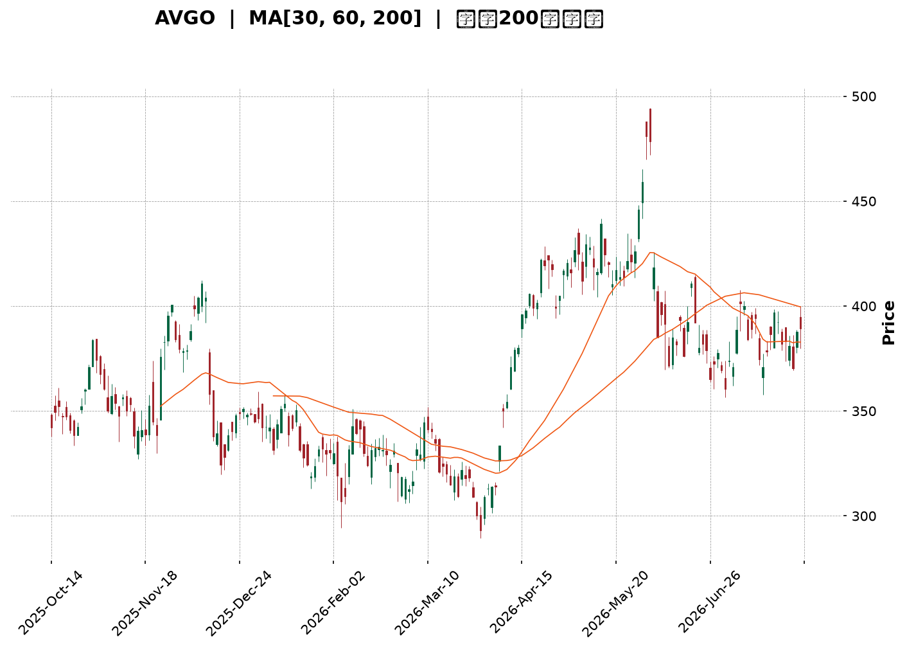
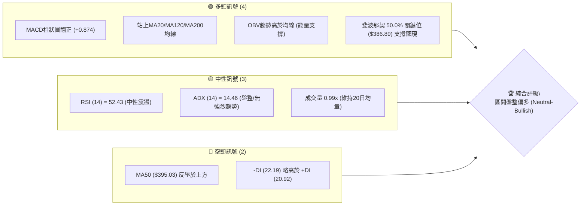
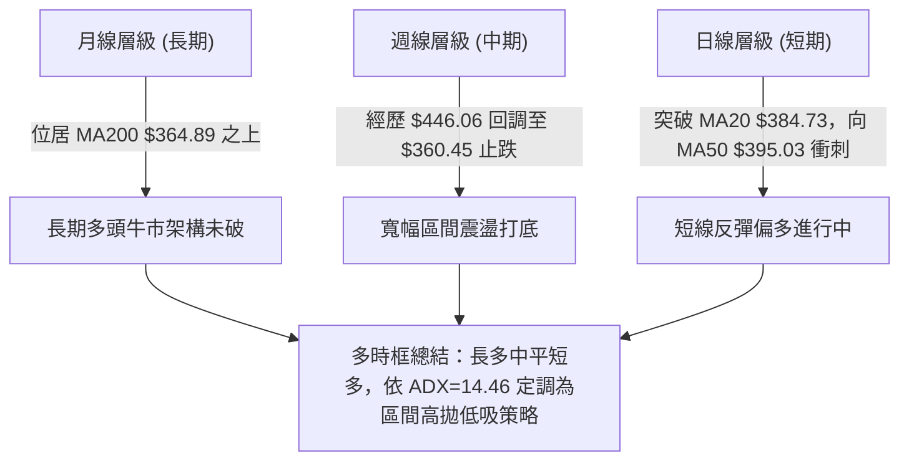
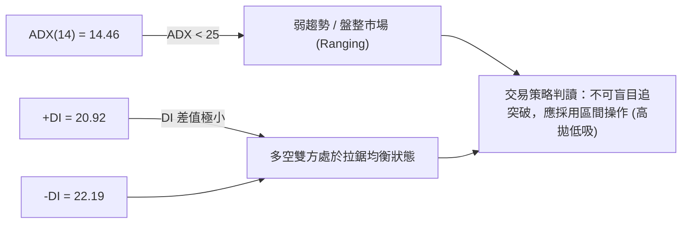
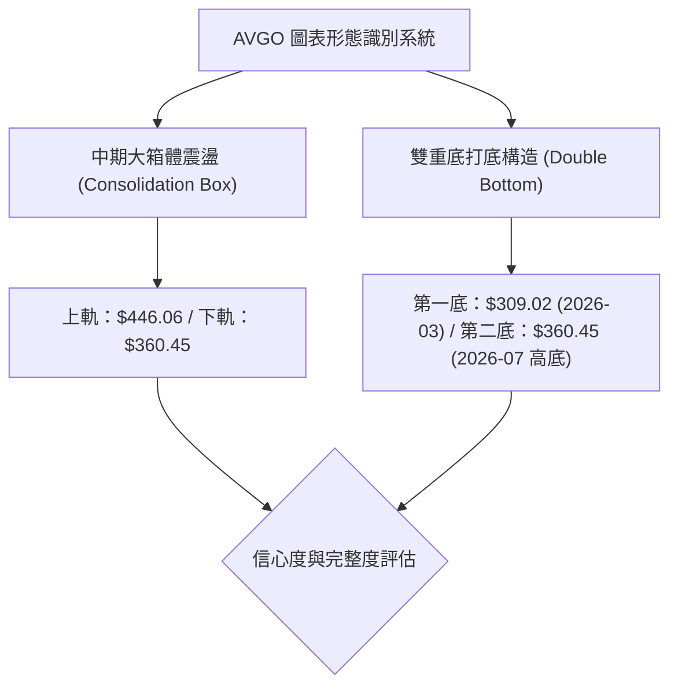
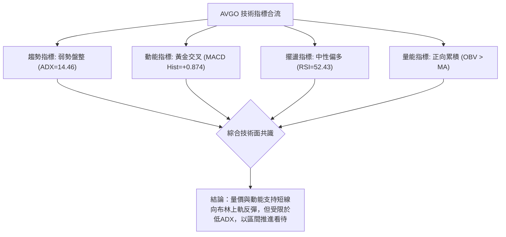
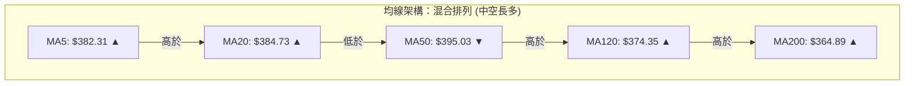
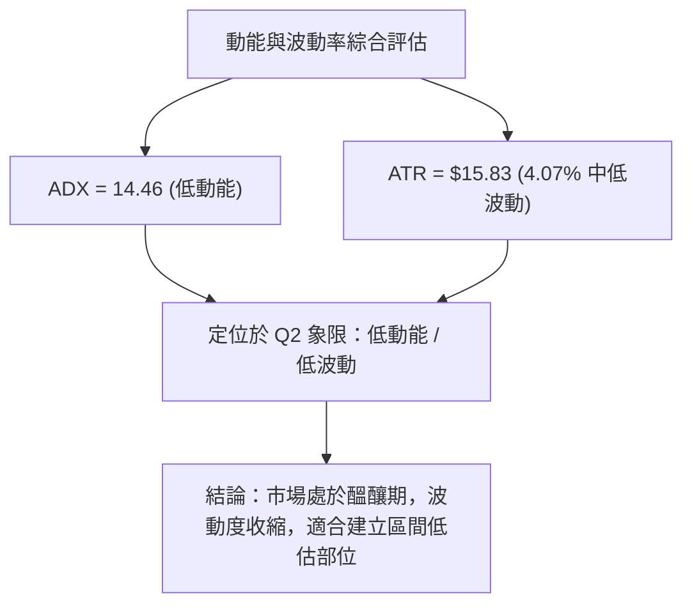
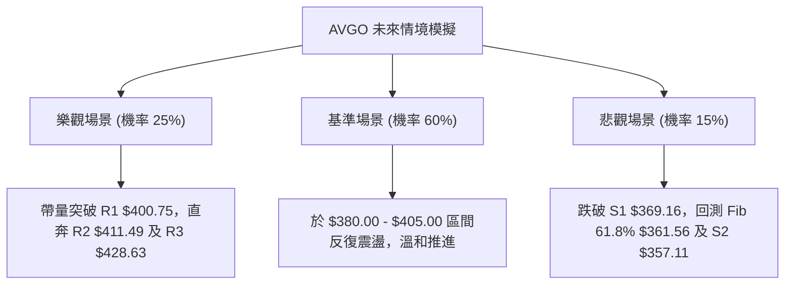

<details markdown="1">
<summary>📊 靜態圖表 (點擊展開)</summary>



</details>

<html>
<head><meta charset="utf-8" /></head>
<body>
    <div style="height:500px; width:100%;">                        <script>window.PlotlyConfig = {MathJaxConfig: 'local'};</script>
        <script charset="utf-8" src="https://cdn.plot.ly/plotly-3.7.0.min.js" integrity="sha256-jvTGqxNp8AGWEcvNLVuKr+8j5dGe9Yw51LQkmDH+IYA=" crossorigin="anonymous"></script>                <div id="candlestick-chart" class="plotly-graph-div" style="height:100%; width:100%;"></div>            <script>                window.PLOTLYENV=window.PLOTLYENV || {};                                if (document.getElementById("candlestick-chart")) {                    Plotly.newPlot(                        "candlestick-chart",                        [{"close":{"dtype":"f8","bdata":"AAAAIGVjdUAAAADg89V1QAAAAEDSAnZAAAAAoCG2dUAAAAAAs7R1QAAAAKABTHVAAAAA4HQmdUAAAADg8GV1QAAAAOCAAnZAAAAAYISAdkAAAACAQy53QAAAAIBD\u002fXdAAAAAoPNld0AAAAAgH\u002fl2QAAAAAB5iHZAAAAAoKjfdUAAAADAq092QAAAAMC7GXZAAAAAALm3dUAAAADASEZ2QAAAACD633VAAAAAwNgTdkAAAACAXSF1QAAAAADTSHVAAAAAwNhLdUAAAACAoyl1QAAAAAAeB3ZAAAAAADKOdUAAAACg3SR1QAAAAICofXdAAAAA4CXud0AAAACAq7V4QAAAAOBtC3lAAAAAwNr+d0AAAADgGLd3QAAAAIDSp3dAAAAAQIGud0AAAAAgC0F4QAAAAODV7XhAAAAAoGlAeUAAAACAsqp5QAAAAGCvQXlAAAAAQMledkAAAAAAqR51QAAAAABeNnVAAAAA4D9DdEAAAABgqoB0QAAAACBpJ3VAAAAAQCZDdUAAAABgm8B1QAAAAED0znVAAAAA4GbtdUAAAAAgucF1QAAAAEAOyXVAAAAAoEaNdUAAAACggaV1QAAAAMCNYnVAAAAAACJodUAAAAAg1GN1QAAAAOAntHRAAAAAQEN7dUAAAABgre51QAAAAKDvFHZAAAAAAEgqdUAAAABALVx1QAAAAOC05nVAAAAAoBG2dEAAAADgfXl0QAAAAOC5RHRAAAAAYAHuc0AAAAAghjp0QAAAAAAZuXRAAAAAYEXAdEAAAABAQph0QAAAAGBYoXRAAAAA4FCedEAAAAAgePJzQAAAAMC1LnNAAAAAIO1Vc0AAAACgK7t0QAAAAMDXanVAAAAAYAwzdUAAAABACFh1QAAAAOBFn3RAAAAAIKA\u002fdEAAAADAHLV0QAAAAECTxHRAAAAAIDrMdEAAAACg3bZ0QAAAAKAKknRAAAAA4LlEdEAAAAAgcrF0QAAAACBPCHRAAAAAAAnmc0AAAADgZdpzQAAAAMACi3NAAAAAgNXFc0AAAABAx7h0QAAAAABGlHRAAAAAQLKHdUAAAACAKVV1QAAAAOAPRXVAAAAAgMrrdEAAAABgpA90QAAAAOCjO3RAAAAAgBcCdEAAAADAU6xzQAAAAICo6nNAAAAAIO1Vc0AAAACgASB0QAAAAMCX3HNAAAAAQObkc0AAAACg5U5zQAAAACBHw3JAAAAAQCRPckAAAADAVVBzQAAAAADqj3NAAAAA4Nigc0AAAAAg7p5zQAAAAIAT13RAAAAAIDfhdUAAAABAliV2QAAAAOBnL3dAAAAAIGayd0AAAABA2sJ3QAAAAGB9wXhAAAAAIHLdeEAAAACgXF55QAAAAOD573hAAAAAYI0YeUAAAADAtl96QAAAAEBsNHpAAAAAwHhhekAAAACAoBh6QAAAAMAr83hAAAAAAPNMeUAAAACAUwx6QAAAACDUSXpAAAAAQHj9eUAAAACA9Kp6QAAAAKBIjHpAAAAAgIe+eUAAAADgINV6QAAAAEAMvHpAAAAA4DIqekAAAABAGgJ6QAAAAGCFcXtAAAAAQEqIekAAAAAguUB6QAAAACC6pnlAAAAAIJkRekAAAACAo955QAAAAADF13lAAAAAoH1VekAAAAAAGFN6QAAAAKB+nnpAAAAAQAbhe0AAAAAA5LN8QAAAAODxDH5AAAAAYJDnfUAAAAAA+CN6QAAAAIDtEXhAAAAAoJK\u002feEAAAAAgpXh4QAAAAEAxOHdAAAAAIF8PeEAAAADgddd3QAAAAIAUlXhAAAAA4NWBd0AAAABgd4R4QAAAAEAzq3lAAAAAgBSCeEAAAABgZsJ3QAAAAMAe4XdAAAAAYI+ud0AAAADgUdB2QAAAAEAzR3dAAAAAAACcd0AAAACgcBV3QAAAAEAzh3ZAAAAAYGZed0AAAADgeix3QAAAAEAKS3hAAAAAgMIReUAAAAAghf94QAAAAMDMAHhAAAAAgMJReEAAAADgeqR4QAAAAEAzZ3dAAAAAoEctd0AAAABgj6J3QAAAAAAAKHhAAAAAwPXMeEAAAAAghYd4QAAAAGC43ndAAAAAIIXzd0AAAABgj853QAAAAMAeJXdAAAAAoHA9eEAAAADgelR4QA=="},"high":{"dtype":"f8","bdata":"C0B3tnPLdUC5RY1pWlZ2QO+iDWFzk3ZATuppsDnQdUBwBzrZpCl2QGdtADhL0nVASgu9ISGhdUCQ44a0N4p1QDnIH\u002fDZRHZA9EtmpaeLdkCs9X4+mz93QErPMBY4BXhAofIzNfIDeECeUFmZV4t3QDdMyRstTHdARoDBV03udkAMZeOsYq12QG29OpGWl3ZANI0JBWQIdkDJAvZ\u002f5l92QGuNLtX4fXZAgdgYz+tNdkAS6vhdRvl1QIJLs9QZbXVAI0jGoMvjdUCMRf0bfqB1QAQZl5P3WnZAN5R9975fd0DwH55BhKp1QNH1iSfwvXdAjB+fvHgfeECLLae\u002fQ9p4QDxfNNYQDHlAwrukTHaTeEC3FVnO6XR4QOleUiy2wndAREkslwLcd0BG2WzmY3V4QEM5CtRSUHlAXZgrZJhKeUDyeKZwysR5QEifHr5NcHlAg8QlN\u002fC9d0AHa5G5uH92QALYZrkDmXVA\u002fwjvftqKdUDpAG1dhOJ0QPoz01aTWHVA8FkV\u002foGPdUBkgsg\u002fM811QILIH\u002fAJ+XVAR2m2iUH\u002fdUAOCJIetdB1QGhJx1Qr9nVA68amrIjJdUB3zjV3YXV2QOwVpbehG3ZAoWFGgE28dUBtlWQrqsZ1QIS\u002fx6CyZnVAamfPPtehdUDgOCQ4ngl2QFQ\u002fecO6YnZA5alZZXLWdUAsfEuBWMZ1QMe4SahXE3ZA39Cs8x2CdUD0mrqkFOl0QGFqiv4M\u002fHRAKyTnde4MdEAJ3WcslHd0QKrlfIKA2HRAt2LU5t8rdUDepg3neOt0QMMt7CVXD3VA2A\u002fztTntdECAd5m2fxp1QElz5bdl5XNAuREyLE5VdEC2m1b7U9x0QPh+v9i\u002f8HVA8n\u002f9UrmrdUCDvsDAz551QDPFPBNOkHVAKT3y8nzRdEB3fmOeSOh0QAdT\u002fA09CnVA4vlYeioTdUDZFnuayS11QAlYqFQfFHVAf+lFO65xdEC5Doqh1ep0QP14oyMaVnRAAOoqfDXtc0C8BNao2O1zQAXjRPWHq3NAagaXTksXdEBzIG+DLu50QMoYif78Y3VAS2IbD2CzdUBPaVWfgP11QPIKcyKniHVA3BwV+VIpdUDV9nfRQBF1QM0suWjef3RAYbQC2c9jdEAMXkPI7UN0QE7Y7i9WIXRAWXRFw0cFdEAcNBcObV90QD+RCLQyPnRA2bFLt5k8dECjyp4UtcZzQGZQrLs5MHNArnesOJ0Ec0C\u002f1nxSHV1zQIHwFP2ntHNA6soBeBWjc0BJ6dJ\u002fZr5zQCk+wpXz2XRAFNxAaEkZdkDbfzCYIWJ2QBuWI4NHf3dA11rXcCHEd0COh4iK0Np3QFH7hYs9x3hA3gMra8bweED64i6lZWF5QFkvJM1xXHlArMWZXmUveUCLT6IQgGh6QConpRobynpAuUeDQEGFekBthf3MT2F6QAuEdCuzUnlAPTQtBfxPeUA88OeZgBt6QOHJTWQFaHpAAb22bpByekAXesx4SAt7QAgtFmfQT3tApdjxlg6dekBlTVmDACV7QGMttZZvD3tA4tFgxJXKekAUGUH3fh96QAxatl2TmntA+roqbgQCe0CYJPWVfVV6QDmGNxiiFHpAfnQuA\u002f93ekCoM9EKU1l6QCG65qI4NXpAruQiS\u002fQpe0ArZsdw2wF7QPCCfC8E0HpAuRLI9gwDfED7Tc9FBBV9QKbzX\u002fPCgH5ArStRLnzjfkB1p+TA5Zx6QOUNUw2fnXlAZUyPPEEjeUB78DqRm3N5QGTPfaM0E3hAT1cZ8CZOeEAlBmJq8gV4QA8bS98uuXhAQgcSBbxyeEDJzck2RQB5QJ\u002fxKiPEwHlAAAAAgD3qeUAAAADgUXB4QAAAAADXS3hAAAAAwMxMeEAAAABAClt3QAAAACBcg3dAAAAAgOu5d0AAAAAAAFx3QAAAAAAAYHdAAAAAYI\u002fyd0AAAAAgXE93QAAAAKBwsXhAAAAA4FF4eUAAAABACid5QAAAAAAAvHhAAAAAoEfVeEAAAAAAAPB4QAAAAADXK3hAAAAAoJmVd0AAAACgcPl3QAAAAKBHaXhAAAAAoHDpeEAAAACAwtl4QAAAAOBRVHhAAAAAYGZeeEAAAADAzBx4QAAAAIDrIXhAAAAAQOFKeEAAAABguP54QA=="},"hovertemplate":"\u003cb\u003e%{x|%Y-%m-%d}\u003c\u002fb\u003e\u003cbr\u003e\u958b: $%{open:.2f}\u003cbr\u003e\u9ad8: $%{high:.2f}\u003cbr\u003e\u4f4e: $%{low:.2f}\u003cbr\u003e\u6536: $%{close:.2f}\u003cextra\u003e\u003c\u002fextra\u003e","low":{"dtype":"f8","bdata":"7hGgQx0cdUA+EiytA5l1QNIRhz+tuHVAGPmwChgudUD\u002fpQ6VbJ51QBNL5dCGNnVAI4+zdj7adEA0FdArDCh1QHbd0w\u002fLznVAf0z9WZ4RdkBrWDaPJ4h2QEfK7pPDMXdAkHdtkfb\u002fdkCNRXqnC7F2QAxctWJnf3ZALVoH1bPQdUDhRksuOcJ1QIPjjP3o63VARmvhMT\u002f2dECExc8IJAp2QNmGp6WKu3VAZdgyroXbdUDwmAOaw8R0QML9m3+ec3RA69wXWjn6dEBoDLdnPtp0QDHh\u002fsKt\u002fnRAkcaj7xl0dUBNh4\u002feNp90QAoqA2ePm3VAsqXII9oad0CBHcNm\u002fNF3QGxEBoUlr3hAd36cHkPvd0AJg4ihxpp3QI+JFrpZCXdA3J1C+Odmd0D5GAewDvB3QDajbRX3snhA6btP0uSUeEA6sTE6VdV4QDXCuyfkf3hAyIqFfLsSdkCWMU7AEPp0QHEXN3AV03RAQ9S4YA\u002f6c0A6PvoKOR10QKX08Nefq3RAiY3rtrf\u002fdEDrfqOOwhR1QI9DNe3anXVAWR9lOJSndUApLLyHzHZ1QPu+v6RJwHVAz7v0mG+CdUA6X\u002fPXqoR1QAsvRWc99HRAV4Rr3SYMdUD3GGEtW+p0QBOWFoSXlHRA6GgzjWrEdECcDELFLTt1QPCxPx\u002f02XVAXqy9GhXTdEDz\u002flALqEZ1QCA0F6eYbHVAh\u002f3XxlCpdED5CNuGKTB0QBuq\u002fWQpO3RANKYXbFCPc0DdKGsd88ZzQABjz70dXXRAjTzo8ANYdECbXWoYrPFzQOlGw+X\u002fcXRAZYbT895IdEBgvqZ1RjhzQJeRm2x1Y3JA5ymCpjAZc0ChT9bYObJzQJWdZqr7lnRAHkwcxXspdUCNW1bZPch0QHe2FnSbhXRAFyJJN\u002fk3dEDXvf2cYrJzQO60s8h2YHRA0h7QKoWHdECRKdEG7YV0QIOCKTcEQnRArI0TF7yUc0BaNNDMJIF0QB61TCHMLHNAsJJJ0MtNc0BMAHMPKSFzQJvklU9ZJHNAGhVMqohpc0C8Zoysgh10QL63VI0sY3RAe68slsEmdEAKd2RiyTh1QKkidZyoD3VA5XaSTLGvdED0IWQ5AQR0QN+Ubk8q7nNAF92tyF7Bc0DGo3f2RKZzQIpbmDILNnNAyT2PXoVMc0DHkVvv6qZzQG84g9R6pXNAJ08LJ4PDc0A\u002f+T4+50pzQNyXDRddpnJA1GeeVAcYckAzLZqd8n1yQCAMQpvUX3NAG42M+F7UckDQtUucolxzQK2qQ+WpFHRAKDPt7NFfdUAvdyryHO91QL+BR1P\u002fg3ZARTaRuFYOd0CWVRv+mnt3QE7Q8ipfD3hAypQ0PK57eEDF4wQP2vJ4QIG7huRjtHhAULmv8CSfeEBRWJQFhkN5QNuV1pk8EnpAFpA+N2yDeUC3QEDbmN95QJGI9QZsoHhA7Tu6vXLCeECqdU\u002fPdTl5QKQBwecHynlAVqnQPCCOeUDym8t3\u002fyp6QKMLKNTqEXpA8p9pBIdaeUCJO+JuiNV5QPOhgaANhnpAuXP5+zt8eUDJ\u002fKC6kEJ5QBOH4MHu7nlA\u002fcPmoi8yekCv8vGIcdt5QOkBt5h\u002fU3lAkI7SiFGseUAZ47MXn515QFDx1g\u002f9mHlA1sogDXUFekBaXOdBT\u002f15QEykp1ux1XlAz1WlhpzsekB8Q7ziVph7QCy9Vih3W31ARYsgZ0p+fUAmpnWJ+CV5QNxc\u002f+ewD3hAPtgPm7RreEDSjWKr6ht3QNIA7wRWKXdAQF3NV24fd0D4CY3wd4Z3QCdbEXDGP3hATDQ9ftd9d0BIvom3ueB3QJ4BusPUS3lAAAAAYI9+eEAAAABgj4p3QAAAACBcj3dAAAAAQDNLd0AAAACgR712QAAAACBch3ZAAAAAgD0qd0AAAADgegB3QAAAAEDhRnZAAAAAQOEyd0AAAAAAKaB2QAAAAIA9jndAAAAAQOE+eEAAAABAM7t4QAAAAGC49ndAAAAAgD0KeEAAAAAA1yt4QAAAAGBmPndAAAAAwMxcdkAAAAAgXH93QAAAACCFs3dAAAAAAADAd0AAAADAHi14QAAAAAAArHdAAAAAAABYd0AAAADgUTh3QAAAAAApGHdAAAAA4KOYd0AAAAAgXLt3QA=="},"name":"\u50f9\u683c","open":{"dtype":"f8","bdata":"OH0WKtzCdUAhi8uy6Qd2QHTRTiL8LHZARbnMG5a6dUBSqAapQP11QPNR\u002f7PKwHVAkRzSFtWVdUA0FdArDCh1QA7Fqlq66HVARhAfJGd4dkCyP08hlol2QEfK7pPDMXdAofIzNfIDeEBF3W5Hl4J3QCS1CorUHndADjD6DFpIdkAOrkDL8851QFCPEHOmYXZAbe2HWHUDdkCXqnbPfD52QMyIfhyDT3ZAvCkpIbdAdkBhF\u002fI17tl1QJJzntz2mXRA5kKHudEedUDflxgemVR1QDPqtbX6LHVAkVM1b12\u002fdkBiV7CHyHN1QNe16Y2snHVAycxmiI7sd0AXrOjga\u002fZ3QJHZccf90XhArmuJj2SKeEA7+HIGViJ4QN7PgOwdnndAxeNMne+od0DioGpnSQB4QBspyt\u002fKA3lAd9wC3XHIeEAShRp3Vv94QOI3SacuKXlAIGkx6Hqdd0Afd0i8+H12QDSJYKZb4nRA\u002fwjvftqKdUC4nLosCuJ0QPoDrX63t3RAPsU4BimMdUCuD6BO8jh1QLL5N09y1nVA8\u002fjoNVjcdUDqY4LSCrd1QGSxMvL3ynVAUWbnjSTHdUD8uZltw\u002fd1QGTWuTMCF3ZAEf8qTmxldUCDYDZvIkd1QIv9achZWHVAnd0ze+AKdUCcDELFLTt1QFjKxKFb+XVAz2eZIAe7dUCPLGssa711QO6jimf8j3VAknWivmRtdUBzK7NAdeR0QKho+kXo4XRA8sVfpgzic0CdCNoqBepzQEB75KzLiHRA0yQGqrMZdUDnaWBdbrV0QA6Fw7yEs3RA4IZtCpxOdEAKvTnPEPh0QElz5bdl5XNA9LKQLPuSc0AmaMWYze5zQC32mVzlmHRA85IzkR2jdUB41jxEb5h1QFlYi84WaXVAz7JnBTuKdEB2lptzG+hzQKnjrBv4hHRAgQ9o25q8dEDcfRYcPrJ0QA6zc0l9sHRAMRLuGLMVdECtKRr6aph0QMSZdrfTVHRA3h5aivRYc0CxwM\u002fWl0NzQElToMCefXNAqpGSr1eoc0AfLaePfY90QBo6qtIzcXRAdjOGXchgdECMKWaLM7d1QLOxlWpSVXVADThOxAEIdUBXCYTwDAd1QAca0tYsTXRAD+le2gdJdEDgwocZEPRzQLsz3sordXNAzyylKB\u002fvc0C2xqbQ9ddzQNJOn87o93NAWq+vqEghdECoCupZYZhzQG7OulQyKXNArsnnFlDGckAHnvq\u002fq65yQLAi0kb\u002fjXNALhmbPCQAc0D3dB6M\u002fqhzQGa4ZVxrY3RAVMRGYBvzdUDCqqKE5Pt1QGJkcwzqhXZAYV5VzjYRd0CTpxpk2JR3QPrZggU5VHhAq9FvdQOmeEDzav6gQwR5QDToKVbxUHlAI2AlPXbseEB3m8DsY2V5QIEWhaSPW3pAbA6ige+EekDK0TOeDD16QJEHpsTW+nhAc6oPX8wteUAOCbl80O15QDnGpPDx5nlARV8TPvIYekDpxldE5k96QMPeyZ\u002fyLXtAk1fKkHRSekCyZrWkLzJ6QD6QIL4br3pA48XbpCxsekBkVs93cvJ5QD8L8uAkAXpA+roqbgQCe0DyiiDY50t6QAYYLjfCknlAy1u96YXCeUCi6RgaWM55QOm4RNFIDXpAMefDV2sdekBanxl5X4Z6QDdNsLWXR3pAMgZoEkEEe0DwdJpyDxZ8QDiIFEVIgH5Au67XevjffkDtt\u002fHUf4V5QCFr8EF0b3lAzQkYib0feUAjBMsVmw95QOwO3MhazndAjI9vprFDd0BWYRuS0fF3QKl+lhYprnhA9\u002fcWf35ZeEA5A4s+iEF4QFE1wbTsjnlAAAAAYI\u002faeUAAAACA6513QAAAAIDrKXhAAAAAoEcpeEAAAABAMyd3QAAAAIDrWXdAAAAA4KNsd0AAAACA6z13QAAAACCu23ZAAAAAgMJZd0AAAADA9eh2QAAAAOBRmHdAAAAAQAojeUAAAAAAAOh4QAAAACCul3hAAAAAIIW7eEAAAACgcMF4QAAAAOCjCHhAAAAAwMzgdkAAAAAAKax3QAAAACBcY3hAAAAAQDPDd0AAAABACoN4QAAAAEDhOnhAAAAAwB5deEAAAACAwmV3QAAAAIA9yndAAAAAoJnFd0AAAACgR614QA=="},"x":["2025-10-14T00:00:00-04:00","2025-10-15T00:00:00-04:00","2025-10-16T00:00:00-04:00","2025-10-17T00:00:00-04:00","2025-10-20T00:00:00-04:00","2025-10-21T00:00:00-04:00","2025-10-22T00:00:00-04:00","2025-10-23T00:00:00-04:00","2025-10-24T00:00:00-04:00","2025-10-27T00:00:00-04:00","2025-10-28T00:00:00-04:00","2025-10-29T00:00:00-04:00","2025-10-30T00:00:00-04:00","2025-10-31T00:00:00-04:00","2025-11-03T00:00:00-05:00","2025-11-04T00:00:00-05:00","2025-11-05T00:00:00-05:00","2025-11-06T00:00:00-05:00","2025-11-07T00:00:00-05:00","2025-11-10T00:00:00-05:00","2025-11-11T00:00:00-05:00","2025-11-12T00:00:00-05:00","2025-11-13T00:00:00-05:00","2025-11-14T00:00:00-05:00","2025-11-17T00:00:00-05:00","2025-11-18T00:00:00-05:00","2025-11-19T00:00:00-05:00","2025-11-20T00:00:00-05:00","2025-11-21T00:00:00-05:00","2025-11-24T00:00:00-05:00","2025-11-25T00:00:00-05:00","2025-11-26T00:00:00-05:00","2025-11-28T00:00:00-05:00","2025-12-01T00:00:00-05:00","2025-12-02T00:00:00-05:00","2025-12-03T00:00:00-05:00","2025-12-04T00:00:00-05:00","2025-12-05T00:00:00-05:00","2025-12-08T00:00:00-05:00","2025-12-09T00:00:00-05:00","2025-12-10T00:00:00-05:00","2025-12-11T00:00:00-05:00","2025-12-12T00:00:00-05:00","2025-12-15T00:00:00-05:00","2025-12-16T00:00:00-05:00","2025-12-17T00:00:00-05:00","2025-12-18T00:00:00-05:00","2025-12-19T00:00:00-05:00","2025-12-22T00:00:00-05:00","2025-12-23T00:00:00-05:00","2025-12-24T00:00:00-05:00","2025-12-26T00:00:00-05:00","2025-12-29T00:00:00-05:00","2025-12-30T00:00:00-05:00","2025-12-31T00:00:00-05:00","2026-01-02T00:00:00-05:00","2026-01-05T00:00:00-05:00","2026-01-06T00:00:00-05:00","2026-01-07T00:00:00-05:00","2026-01-08T00:00:00-05:00","2026-01-09T00:00:00-05:00","2026-01-12T00:00:00-05:00","2026-01-13T00:00:00-05:00","2026-01-14T00:00:00-05:00","2026-01-15T00:00:00-05:00","2026-01-16T00:00:00-05:00","2026-01-20T00:00:00-05:00","2026-01-21T00:00:00-05:00","2026-01-22T00:00:00-05:00","2026-01-23T00:00:00-05:00","2026-01-26T00:00:00-05:00","2026-01-27T00:00:00-05:00","2026-01-28T00:00:00-05:00","2026-01-29T00:00:00-05:00","2026-01-30T00:00:00-05:00","2026-02-02T00:00:00-05:00","2026-02-03T00:00:00-05:00","2026-02-04T00:00:00-05:00","2026-02-05T00:00:00-05:00","2026-02-06T00:00:00-05:00","2026-02-09T00:00:00-05:00","2026-02-10T00:00:00-05:00","2026-02-11T00:00:00-05:00","2026-02-12T00:00:00-05:00","2026-02-13T00:00:00-05:00","2026-02-17T00:00:00-05:00","2026-02-18T00:00:00-05:00","2026-02-19T00:00:00-05:00","2026-02-20T00:00:00-05:00","2026-02-23T00:00:00-05:00","2026-02-24T00:00:00-05:00","2026-02-25T00:00:00-05:00","2026-02-26T00:00:00-05:00","2026-02-27T00:00:00-05:00","2026-03-02T00:00:00-05:00","2026-03-03T00:00:00-05:00","2026-03-04T00:00:00-05:00","2026-03-05T00:00:00-05:00","2026-03-06T00:00:00-05:00","2026-03-09T00:00:00-04:00","2026-03-10T00:00:00-04:00","2026-03-11T00:00:00-04:00","2026-03-12T00:00:00-04:00","2026-03-13T00:00:00-04:00","2026-03-16T00:00:00-04:00","2026-03-17T00:00:00-04:00","2026-03-18T00:00:00-04:00","2026-03-19T00:00:00-04:00","2026-03-20T00:00:00-04:00","2026-03-23T00:00:00-04:00","2026-03-24T00:00:00-04:00","2026-03-25T00:00:00-04:00","2026-03-26T00:00:00-04:00","2026-03-27T00:00:00-04:00","2026-03-30T00:00:00-04:00","2026-03-31T00:00:00-04:00","2026-04-01T00:00:00-04:00","2026-04-02T00:00:00-04:00","2026-04-06T00:00:00-04:00","2026-04-07T00:00:00-04:00","2026-04-08T00:00:00-04:00","2026-04-09T00:00:00-04:00","2026-04-10T00:00:00-04:00","2026-04-13T00:00:00-04:00","2026-04-14T00:00:00-04:00","2026-04-15T00:00:00-04:00","2026-04-16T00:00:00-04:00","2026-04-17T00:00:00-04:00","2026-04-20T00:00:00-04:00","2026-04-21T00:00:00-04:00","2026-04-22T00:00:00-04:00","2026-04-23T00:00:00-04:00","2026-04-24T00:00:00-04:00","2026-04-27T00:00:00-04:00","2026-04-28T00:00:00-04:00","2026-04-29T00:00:00-04:00","2026-04-30T00:00:00-04:00","2026-05-01T00:00:00-04:00","2026-05-04T00:00:00-04:00","2026-05-05T00:00:00-04:00","2026-05-06T00:00:00-04:00","2026-05-07T00:00:00-04:00","2026-05-08T00:00:00-04:00","2026-05-11T00:00:00-04:00","2026-05-12T00:00:00-04:00","2026-05-13T00:00:00-04:00","2026-05-14T00:00:00-04:00","2026-05-15T00:00:00-04:00","2026-05-18T00:00:00-04:00","2026-05-19T00:00:00-04:00","2026-05-20T00:00:00-04:00","2026-05-21T00:00:00-04:00","2026-05-22T00:00:00-04:00","2026-05-26T00:00:00-04:00","2026-05-27T00:00:00-04:00","2026-05-28T00:00:00-04:00","2026-05-29T00:00:00-04:00","2026-06-01T00:00:00-04:00","2026-06-02T00:00:00-04:00","2026-06-03T00:00:00-04:00","2026-06-04T00:00:00-04:00","2026-06-05T00:00:00-04:00","2026-06-08T00:00:00-04:00","2026-06-09T00:00:00-04:00","2026-06-10T00:00:00-04:00","2026-06-11T00:00:00-04:00","2026-06-12T00:00:00-04:00","2026-06-15T00:00:00-04:00","2026-06-16T00:00:00-04:00","2026-06-17T00:00:00-04:00","2026-06-18T00:00:00-04:00","2026-06-22T00:00:00-04:00","2026-06-23T00:00:00-04:00","2026-06-24T00:00:00-04:00","2026-06-25T00:00:00-04:00","2026-06-26T00:00:00-04:00","2026-06-29T00:00:00-04:00","2026-06-30T00:00:00-04:00","2026-07-01T00:00:00-04:00","2026-07-02T00:00:00-04:00","2026-07-06T00:00:00-04:00","2026-07-07T00:00:00-04:00","2026-07-08T00:00:00-04:00","2026-07-09T00:00:00-04:00","2026-07-10T00:00:00-04:00","2026-07-13T00:00:00-04:00","2026-07-14T00:00:00-04:00","2026-07-15T00:00:00-04:00","2026-07-16T00:00:00-04:00","2026-07-17T00:00:00-04:00","2026-07-20T00:00:00-04:00","2026-07-21T00:00:00-04:00","2026-07-22T00:00:00-04:00","2026-07-23T00:00:00-04:00","2026-07-24T00:00:00-04:00","2026-07-27T00:00:00-04:00","2026-07-28T00:00:00-04:00","2026-07-29T00:00:00-04:00","2026-07-30T00:00:00-04:00","2026-07-31T00:00:00-04:00"],"type":"candlestick"},{"hovertemplate":"MA30: $%{y:.2f}\u003cextra\u003e\u003c\u002fextra\u003e","line":{"color":"#2196F3","dash":"dash","width":2},"mode":"lines","name":"MA30","x":["2025-10-14T00:00:00-04:00","2025-10-15T00:00:00-04:00","2025-10-16T00:00:00-04:00","2025-10-17T00:00:00-04:00","2025-10-20T00:00:00-04:00","2025-10-21T00:00:00-04:00","2025-10-22T00:00:00-04:00","2025-10-23T00:00:00-04:00","2025-10-24T00:00:00-04:00","2025-10-27T00:00:00-04:00","2025-10-28T00:00:00-04:00","2025-10-29T00:00:00-04:00","2025-10-30T00:00:00-04:00","2025-10-31T00:00:00-04:00","2025-11-03T00:00:00-05:00","2025-11-04T00:00:00-05:00","2025-11-05T00:00:00-05:00","2025-11-06T00:00:00-05:00","2025-11-07T00:00:00-05:00","2025-11-10T00:00:00-05:00","2025-11-11T00:00:00-05:00","2025-11-12T00:00:00-05:00","2025-11-13T00:00:00-05:00","2025-11-14T00:00:00-05:00","2025-11-17T00:00:00-05:00","2025-11-18T00:00:00-05:00","2025-11-19T00:00:00-05:00","2025-11-20T00:00:00-05:00","2025-11-21T00:00:00-05:00","2025-11-24T00:00:00-05:00","2025-11-25T00:00:00-05:00","2025-11-26T00:00:00-05:00","2025-11-28T00:00:00-05:00","2025-12-01T00:00:00-05:00","2025-12-02T00:00:00-05:00","2025-12-03T00:00:00-05:00","2025-12-04T00:00:00-05:00","2025-12-05T00:00:00-05:00","2025-12-08T00:00:00-05:00","2025-12-09T00:00:00-05:00","2025-12-10T00:00:00-05:00","2025-12-11T00:00:00-05:00","2025-12-12T00:00:00-05:00","2025-12-15T00:00:00-05:00","2025-12-16T00:00:00-05:00","2025-12-17T00:00:00-05:00","2025-12-18T00:00:00-05:00","2025-12-19T00:00:00-05:00","2025-12-22T00:00:00-05:00","2025-12-23T00:00:00-05:00","2025-12-24T00:00:00-05:00","2025-12-26T00:00:00-05:00","2025-12-29T00:00:00-05:00","2025-12-30T00:00:00-05:00","2025-12-31T00:00:00-05:00","2026-01-02T00:00:00-05:00","2026-01-05T00:00:00-05:00","2026-01-06T00:00:00-05:00","2026-01-07T00:00:00-05:00","2026-01-08T00:00:00-05:00","2026-01-09T00:00:00-05:00","2026-01-12T00:00:00-05:00","2026-01-13T00:00:00-05:00","2026-01-14T00:00:00-05:00","2026-01-15T00:00:00-05:00","2026-01-16T00:00:00-05:00","2026-01-20T00:00:00-05:00","2026-01-21T00:00:00-05:00","2026-01-22T00:00:00-05:00","2026-01-23T00:00:00-05:00","2026-01-26T00:00:00-05:00","2026-01-27T00:00:00-05:00","2026-01-28T00:00:00-05:00","2026-01-29T00:00:00-05:00","2026-01-30T00:00:00-05:00","2026-02-02T00:00:00-05:00","2026-02-03T00:00:00-05:00","2026-02-04T00:00:00-05:00","2026-02-05T00:00:00-05:00","2026-02-06T00:00:00-05:00","2026-02-09T00:00:00-05:00","2026-02-10T00:00:00-05:00","2026-02-11T00:00:00-05:00","2026-02-12T00:00:00-05:00","2026-02-13T00:00:00-05:00","2026-02-17T00:00:00-05:00","2026-02-18T00:00:00-05:00","2026-02-19T00:00:00-05:00","2026-02-20T00:00:00-05:00","2026-02-23T00:00:00-05:00","2026-02-24T00:00:00-05:00","2026-02-25T00:00:00-05:00","2026-02-26T00:00:00-05:00","2026-02-27T00:00:00-05:00","2026-03-02T00:00:00-05:00","2026-03-03T00:00:00-05:00","2026-03-04T00:00:00-05:00","2026-03-05T00:00:00-05:00","2026-03-06T00:00:00-05:00","2026-03-09T00:00:00-04:00","2026-03-10T00:00:00-04:00","2026-03-11T00:00:00-04:00","2026-03-12T00:00:00-04:00","2026-03-13T00:00:00-04:00","2026-03-16T00:00:00-04:00","2026-03-17T00:00:00-04:00","2026-03-18T00:00:00-04:00","2026-03-19T00:00:00-04:00","2026-03-20T00:00:00-04:00","2026-03-23T00:00:00-04:00","2026-03-24T00:00:00-04:00","2026-03-25T00:00:00-04:00","2026-03-26T00:00:00-04:00","2026-03-27T00:00:00-04:00","2026-03-30T00:00:00-04:00","2026-03-31T00:00:00-04:00","2026-04-01T00:00:00-04:00","2026-04-02T00:00:00-04:00","2026-04-06T00:00:00-04:00","2026-04-07T00:00:00-04:00","2026-04-08T00:00:00-04:00","2026-04-09T00:00:00-04:00","2026-04-10T00:00:00-04:00","2026-04-13T00:00:00-04:00","2026-04-14T00:00:00-04:00","2026-04-15T00:00:00-04:00","2026-04-16T00:00:00-04:00","2026-04-17T00:00:00-04:00","2026-04-20T00:00:00-04:00","2026-04-21T00:00:00-04:00","2026-04-22T00:00:00-04:00","2026-04-23T00:00:00-04:00","2026-04-24T00:00:00-04:00","2026-04-27T00:00:00-04:00","2026-04-28T00:00:00-04:00","2026-04-29T00:00:00-04:00","2026-04-30T00:00:00-04:00","2026-05-01T00:00:00-04:00","2026-05-04T00:00:00-04:00","2026-05-05T00:00:00-04:00","2026-05-06T00:00:00-04:00","2026-05-07T00:00:00-04:00","2026-05-08T00:00:00-04:00","2026-05-11T00:00:00-04:00","2026-05-12T00:00:00-04:00","2026-05-13T00:00:00-04:00","2026-05-14T00:00:00-04:00","2026-05-15T00:00:00-04:00","2026-05-18T00:00:00-04:00","2026-05-19T00:00:00-04:00","2026-05-20T00:00:00-04:00","2026-05-21T00:00:00-04:00","2026-05-22T00:00:00-04:00","2026-05-26T00:00:00-04:00","2026-05-27T00:00:00-04:00","2026-05-28T00:00:00-04:00","2026-05-29T00:00:00-04:00","2026-06-01T00:00:00-04:00","2026-06-02T00:00:00-04:00","2026-06-03T00:00:00-04:00","2026-06-04T00:00:00-04:00","2026-06-05T00:00:00-04:00","2026-06-08T00:00:00-04:00","2026-06-09T00:00:00-04:00","2026-06-10T00:00:00-04:00","2026-06-11T00:00:00-04:00","2026-06-12T00:00:00-04:00","2026-06-15T00:00:00-04:00","2026-06-16T00:00:00-04:00","2026-06-17T00:00:00-04:00","2026-06-18T00:00:00-04:00","2026-06-22T00:00:00-04:00","2026-06-23T00:00:00-04:00","2026-06-24T00:00:00-04:00","2026-06-25T00:00:00-04:00","2026-06-26T00:00:00-04:00","2026-06-29T00:00:00-04:00","2026-06-30T00:00:00-04:00","2026-07-01T00:00:00-04:00","2026-07-02T00:00:00-04:00","2026-07-06T00:00:00-04:00","2026-07-07T00:00:00-04:00","2026-07-08T00:00:00-04:00","2026-07-09T00:00:00-04:00","2026-07-10T00:00:00-04:00","2026-07-13T00:00:00-04:00","2026-07-14T00:00:00-04:00","2026-07-15T00:00:00-04:00","2026-07-16T00:00:00-04:00","2026-07-17T00:00:00-04:00","2026-07-20T00:00:00-04:00","2026-07-21T00:00:00-04:00","2026-07-22T00:00:00-04:00","2026-07-23T00:00:00-04:00","2026-07-24T00:00:00-04:00","2026-07-27T00:00:00-04:00","2026-07-28T00:00:00-04:00","2026-07-29T00:00:00-04:00","2026-07-30T00:00:00-04:00","2026-07-31T00:00:00-04:00"],"y":{"dtype":"f8","bdata":"AAAAAAAA+H8AAAAAAAD4fwAAAAAAAPh\u002fAAAAAAAA+H8AAAAAAAD4fwAAAAAAAPh\u002fAAAAAAAA+H8AAAAAAAD4fwAAAAAAAPh\u002fAAAAAAAA+H8AAAAAAAD4fwAAAAAAAPh\u002fAAAAAAAA+H8AAAAAAAD4fwAAAAAAAPh\u002fAAAAAAAA+H8AAAAAAAD4fwAAAAAAAPh\u002fAAAAAAAA+H8AAAAAAAD4fwAAAAAAAPh\u002fAAAAAAAA+H8AAAAAAAD4fwAAAAAAAPh\u002fAAAAAAAA+H8AAAAAAAD4fwAAAAAAAPh\u002fAAAAAAAA+H8AAAAAAAD4fxEREaF2A3ZAiYiIuCcZdkB3d3fXrTF2QFVVVeWQS3ZAiYiIiA5fdkAAAAAQNHB2QAAAAKBUhHZAMzMzo+6ZdkARERFhTbJ2QM3MzJw2y3ZAAAAAMK3idkBmZmYW5Pd2QLy7u3u0AndA3t3dze75dkARERERHup2QGZmZubY3nZAzczMrBnRdkAiIiKyqsF2QAAAAOCWuXZA3t3dHbS1dkB3d3dnP7F2QERERCSusHZAREREFGavdkB3d3d3vrR2QFVVVbUEuXZAmpmZCTO7dkCrqqoKVL92QERERMTXuXZAd3d395K4dkAAAABArLp2QCIiIrLjonZAZmZmRv6NdkAzMzMjS3Z2QJqZmakCXXZAMzMzo9tEdkB3d3e3wjB2QDMzM0PKIXZAVVVVNXEIdkBERETEMOh1QBEREZFrwHVAERERsQGTdUAAAADQmWR1QCIiIiLqPXVAAAAA8BgwdUC8u7sLnit1QERERGSmJnVA3t3dfa8pdUBVVVUV8iR1QN7d3U0fFHVAd3d3d64DdUCrqqqK9\u002fp0QCIiIkKh93RAq6qqCmvxdEBVVVUl5e10QBERERH443RAq6qq6tjYdEDe3d2N1dB0QImIiHiRy3RAMzMzE1\u002fGdEAAAAAgm8B0QERERAR4v3RAq6qqGh61dEAAAAAQi6p0QO\u002fu7j4OmXRAiYiIWD+OdEDe3d1dY4F0QERERNRDbXRAMzMz00FldEDv7u7eXWd0QM3MzKwEanRAREREtKx3dEDNzMyMGIF0QJqZmenChXRAiYiISDaHdEDNzMx8qIJ0QKuqqppEf3RA3t3dfQ96dEAiIiLyuHd0QFVVVcX8fXRAVVVVxfx9dEBERES00Hh0QN7d3U2Ka3RAZmZm5mZgdEARERHhB090QN7d3Q0qP3RAREREZJ0udEBERETkuCJ0QLy7u\u002ftuGHRAZmZmRnQOdEDe3d19HwV0QGZmZpZsB3RA7+7ufiwVdECamZkZlCF0QDMzM1N7PHRARERE1ORcdECrqqoKPn50QImIiJi5qnRAAAAAwC3WdEDNzMzc1P10QGZmZoYFI3VAq6qqOnNBdUAAAADwd2x1QN7d3Z2UlnVA3t3dfSvFdUDNzMxcq\u002fh1QAAAAKDrIHZAMzMzExVOdkB3d3d3e4R2QJqZmcnaunZAERERsaPzdkBmZmaWeCt3QERERASHZHdAq6qqynKWd0B3d3f3p9Z3QJqZmYmuGnhA7+7ujrddeEBVVVW115Z4QO\u002fu7p4Y2nhAzczMzAIVeUAiIiKimk15QImIiLiodnlAiYiIuGeaeUDe3d1tLLp5QDMzMzPa0HlAvLu7+1rneUCJiIjoOv15QJqZmVkhDXpAzczMfNkmekDv7u7uTEN6QM3MzMzubnpA7+7ubveXekC8u7ub+ZV6QO\u002fu7i7Cg3pAzczMHNR1ekBmZmZm9md6QBEREVEyWXpAIiIiUpxOekAiIiIiyDt6QGZmZjY5LXpAIiIiIgkYekARERGhrwV6QKuqquou\u002fnlAzczMjKLzeUAiIiIiadl5QCIiIuILwXlARERExNureUCrqqpamZB5QFVVVRUObXlAzczMrBxUeUCamZm5ETl5QImIiBhrHnlA7+7u3mAHeUBERESEX\u002fB4QHd3dxcm43hAZmZmllvYeEBERETkCc14QJqZmSm3tnhAmpmZCVeYeEBmZmZmsXV4QImIiNj3PHhAVVVVBY8DeECrqqqqLe53QERERATq7ndAERERQVzvd0AAAAAw2+93QJqZmTlo9XdA7+7ujnr0d0C8u7ubLvR3QO\u002fu7q7q53dAMzMzkyvud0B3d3cXkux3QA=="},"type":"scatter"},{"hovertemplate":"MA60: $%{y:.2f}\u003cextra\u003e\u003c\u002fextra\u003e","line":{"color":"#9C27B0","dash":"dash","width":2},"mode":"lines","name":"MA60","x":["2025-10-14T00:00:00-04:00","2025-10-15T00:00:00-04:00","2025-10-16T00:00:00-04:00","2025-10-17T00:00:00-04:00","2025-10-20T00:00:00-04:00","2025-10-21T00:00:00-04:00","2025-10-22T00:00:00-04:00","2025-10-23T00:00:00-04:00","2025-10-24T00:00:00-04:00","2025-10-27T00:00:00-04:00","2025-10-28T00:00:00-04:00","2025-10-29T00:00:00-04:00","2025-10-30T00:00:00-04:00","2025-10-31T00:00:00-04:00","2025-11-03T00:00:00-05:00","2025-11-04T00:00:00-05:00","2025-11-05T00:00:00-05:00","2025-11-06T00:00:00-05:00","2025-11-07T00:00:00-05:00","2025-11-10T00:00:00-05:00","2025-11-11T00:00:00-05:00","2025-11-12T00:00:00-05:00","2025-11-13T00:00:00-05:00","2025-11-14T00:00:00-05:00","2025-11-17T00:00:00-05:00","2025-11-18T00:00:00-05:00","2025-11-19T00:00:00-05:00","2025-11-20T00:00:00-05:00","2025-11-21T00:00:00-05:00","2025-11-24T00:00:00-05:00","2025-11-25T00:00:00-05:00","2025-11-26T00:00:00-05:00","2025-11-28T00:00:00-05:00","2025-12-01T00:00:00-05:00","2025-12-02T00:00:00-05:00","2025-12-03T00:00:00-05:00","2025-12-04T00:00:00-05:00","2025-12-05T00:00:00-05:00","2025-12-08T00:00:00-05:00","2025-12-09T00:00:00-05:00","2025-12-10T00:00:00-05:00","2025-12-11T00:00:00-05:00","2025-12-12T00:00:00-05:00","2025-12-15T00:00:00-05:00","2025-12-16T00:00:00-05:00","2025-12-17T00:00:00-05:00","2025-12-18T00:00:00-05:00","2025-12-19T00:00:00-05:00","2025-12-22T00:00:00-05:00","2025-12-23T00:00:00-05:00","2025-12-24T00:00:00-05:00","2025-12-26T00:00:00-05:00","2025-12-29T00:00:00-05:00","2025-12-30T00:00:00-05:00","2025-12-31T00:00:00-05:00","2026-01-02T00:00:00-05:00","2026-01-05T00:00:00-05:00","2026-01-06T00:00:00-05:00","2026-01-07T00:00:00-05:00","2026-01-08T00:00:00-05:00","2026-01-09T00:00:00-05:00","2026-01-12T00:00:00-05:00","2026-01-13T00:00:00-05:00","2026-01-14T00:00:00-05:00","2026-01-15T00:00:00-05:00","2026-01-16T00:00:00-05:00","2026-01-20T00:00:00-05:00","2026-01-21T00:00:00-05:00","2026-01-22T00:00:00-05:00","2026-01-23T00:00:00-05:00","2026-01-26T00:00:00-05:00","2026-01-27T00:00:00-05:00","2026-01-28T00:00:00-05:00","2026-01-29T00:00:00-05:00","2026-01-30T00:00:00-05:00","2026-02-02T00:00:00-05:00","2026-02-03T00:00:00-05:00","2026-02-04T00:00:00-05:00","2026-02-05T00:00:00-05:00","2026-02-06T00:00:00-05:00","2026-02-09T00:00:00-05:00","2026-02-10T00:00:00-05:00","2026-02-11T00:00:00-05:00","2026-02-12T00:00:00-05:00","2026-02-13T00:00:00-05:00","2026-02-17T00:00:00-05:00","2026-02-18T00:00:00-05:00","2026-02-19T00:00:00-05:00","2026-02-20T00:00:00-05:00","2026-02-23T00:00:00-05:00","2026-02-24T00:00:00-05:00","2026-02-25T00:00:00-05:00","2026-02-26T00:00:00-05:00","2026-02-27T00:00:00-05:00","2026-03-02T00:00:00-05:00","2026-03-03T00:00:00-05:00","2026-03-04T00:00:00-05:00","2026-03-05T00:00:00-05:00","2026-03-06T00:00:00-05:00","2026-03-09T00:00:00-04:00","2026-03-10T00:00:00-04:00","2026-03-11T00:00:00-04:00","2026-03-12T00:00:00-04:00","2026-03-13T00:00:00-04:00","2026-03-16T00:00:00-04:00","2026-03-17T00:00:00-04:00","2026-03-18T00:00:00-04:00","2026-03-19T00:00:00-04:00","2026-03-20T00:00:00-04:00","2026-03-23T00:00:00-04:00","2026-03-24T00:00:00-04:00","2026-03-25T00:00:00-04:00","2026-03-26T00:00:00-04:00","2026-03-27T00:00:00-04:00","2026-03-30T00:00:00-04:00","2026-03-31T00:00:00-04:00","2026-04-01T00:00:00-04:00","2026-04-02T00:00:00-04:00","2026-04-06T00:00:00-04:00","2026-04-07T00:00:00-04:00","2026-04-08T00:00:00-04:00","2026-04-09T00:00:00-04:00","2026-04-10T00:00:00-04:00","2026-04-13T00:00:00-04:00","2026-04-14T00:00:00-04:00","2026-04-15T00:00:00-04:00","2026-04-16T00:00:00-04:00","2026-04-17T00:00:00-04:00","2026-04-20T00:00:00-04:00","2026-04-21T00:00:00-04:00","2026-04-22T00:00:00-04:00","2026-04-23T00:00:00-04:00","2026-04-24T00:00:00-04:00","2026-04-27T00:00:00-04:00","2026-04-28T00:00:00-04:00","2026-04-29T00:00:00-04:00","2026-04-30T00:00:00-04:00","2026-05-01T00:00:00-04:00","2026-05-04T00:00:00-04:00","2026-05-05T00:00:00-04:00","2026-05-06T00:00:00-04:00","2026-05-07T00:00:00-04:00","2026-05-08T00:00:00-04:00","2026-05-11T00:00:00-04:00","2026-05-12T00:00:00-04:00","2026-05-13T00:00:00-04:00","2026-05-14T00:00:00-04:00","2026-05-15T00:00:00-04:00","2026-05-18T00:00:00-04:00","2026-05-19T00:00:00-04:00","2026-05-20T00:00:00-04:00","2026-05-21T00:00:00-04:00","2026-05-22T00:00:00-04:00","2026-05-26T00:00:00-04:00","2026-05-27T00:00:00-04:00","2026-05-28T00:00:00-04:00","2026-05-29T00:00:00-04:00","2026-06-01T00:00:00-04:00","2026-06-02T00:00:00-04:00","2026-06-03T00:00:00-04:00","2026-06-04T00:00:00-04:00","2026-06-05T00:00:00-04:00","2026-06-08T00:00:00-04:00","2026-06-09T00:00:00-04:00","2026-06-10T00:00:00-04:00","2026-06-11T00:00:00-04:00","2026-06-12T00:00:00-04:00","2026-06-15T00:00:00-04:00","2026-06-16T00:00:00-04:00","2026-06-17T00:00:00-04:00","2026-06-18T00:00:00-04:00","2026-06-22T00:00:00-04:00","2026-06-23T00:00:00-04:00","2026-06-24T00:00:00-04:00","2026-06-25T00:00:00-04:00","2026-06-26T00:00:00-04:00","2026-06-29T00:00:00-04:00","2026-06-30T00:00:00-04:00","2026-07-01T00:00:00-04:00","2026-07-02T00:00:00-04:00","2026-07-06T00:00:00-04:00","2026-07-07T00:00:00-04:00","2026-07-08T00:00:00-04:00","2026-07-09T00:00:00-04:00","2026-07-10T00:00:00-04:00","2026-07-13T00:00:00-04:00","2026-07-14T00:00:00-04:00","2026-07-15T00:00:00-04:00","2026-07-16T00:00:00-04:00","2026-07-17T00:00:00-04:00","2026-07-20T00:00:00-04:00","2026-07-21T00:00:00-04:00","2026-07-22T00:00:00-04:00","2026-07-23T00:00:00-04:00","2026-07-24T00:00:00-04:00","2026-07-27T00:00:00-04:00","2026-07-28T00:00:00-04:00","2026-07-29T00:00:00-04:00","2026-07-30T00:00:00-04:00","2026-07-31T00:00:00-04:00"],"y":{"dtype":"f8","bdata":"AAAAAAAA+H8AAAAAAAD4fwAAAAAAAPh\u002fAAAAAAAA+H8AAAAAAAD4fwAAAAAAAPh\u002fAAAAAAAA+H8AAAAAAAD4fwAAAAAAAPh\u002fAAAAAAAA+H8AAAAAAAD4fwAAAAAAAPh\u002fAAAAAAAA+H8AAAAAAAD4fwAAAAAAAPh\u002fAAAAAAAA+H8AAAAAAAD4fwAAAAAAAPh\u002fAAAAAAAA+H8AAAAAAAD4fwAAAAAAAPh\u002fAAAAAAAA+H8AAAAAAAD4fwAAAAAAAPh\u002fAAAAAAAA+H8AAAAAAAD4fwAAAAAAAPh\u002fAAAAAAAA+H8AAAAAAAD4fwAAAAAAAPh\u002fAAAAAAAA+H8AAAAAAAD4fwAAAAAAAPh\u002fAAAAAAAA+H8AAAAAAAD4fwAAAAAAAPh\u002fAAAAAAAA+H8AAAAAAAD4fwAAAAAAAPh\u002fAAAAAAAA+H8AAAAAAAD4fwAAAAAAAPh\u002fAAAAAAAA+H8AAAAAAAD4fwAAAAAAAPh\u002fAAAAAAAA+H8AAAAAAAD4fwAAAAAAAPh\u002fAAAAAAAA+H8AAAAAAAD4fwAAAAAAAPh\u002fAAAAAAAA+H8AAAAAAAD4fwAAAAAAAPh\u002fAAAAAAAA+H8AAAAAAAD4fwAAAAAAAPh\u002fAAAAAAAA+H8AAAAAAAD4f5qZmSktU3ZAd3d3\u002f5JTdkBVVVV9\u002fFN2QHd3d8dJVHZA3t3dFfVRdkC8u7tje1B2QJqZmXEPU3ZARERE7C9RdkCrqqoSP012QO\u002fu7hbRRXZAiYiIcNc6dkAzMzPzPi52QO\u002fu7k5PIHZA7+7u3gMVdkBmZmYO3gp2QFVVVaW\u002fAnZAVVVVlWT9dUC8u7tjTvN1QO\u002fu7hbb5nVAq6qqSrHcdUARERF5G9Z1QDMzM7Mn1HVAd3d3j2jQdUBmZmbOUdF1QDMzM2N+znVAIiIi+gXKdUBERETMFMh1QGZmZp60wnVAVVVVBXm\u002fdUAAAACwo711QDMzM9stsXVAiYiIMI6hdUCamZkZa5B1QERERHQIe3VA3t3dfY1pdUCrqqoKE1l1QLy7uwuHR3VAREREhNk2dUCamZlRxyd1QO\u002fu7h44FXVAq6qqMlcFdUBmZmYu2fJ0QN7d3YXW4XRAREREnKfbdEBEREREI9d0QHd3d3\u002f10nRA3t3dfd\u002fRdEC8u7uDVc50QJqZmQkOyXRAZmZmntXAdEB3d3cf5Ll0QAAAAMiVsXRAiYiI+OiodEAzMzODdp50QHd3dw+RkXRAd3d3J7uDdEARERE5x3l0QCIiIjoAcnRAzczMrGlqdEDv7u5O3WJ0QFVVVU1yY3RAzczMTCVldEDNzMyUD2Z0QBEREcnEanRAZmZmFpJ1dEBERES00H90QGZmZrb+i3RAmpmZybeddEDe3d1dmbJ0QJqZmRmFxnRAd3d394\u002fcdEBmZmY+yPZ0QLy7u8MrDnVAMzMz4zAmdUDNzMzsqT11QFVVVR0YUHVAiYiISBJkdUDNzMw0Gn51QHd3d8drnHVAMzMzO9C4dUBVVVWlJNJ1QBEREakI6HVAiYiI2Gz7dUBERETs1xJ2QLy7u0vsLHZAmpmZeSpGdkDNzMxMyFx2QFVVVc1DeXZAmpmZibuRdkAAAAAQXal2QHd3d6cKv3ZAvLu7G8rXdkC8u7tD4O12QDMzM8OqBndAAAAA6B8id0CamZl5vD13QBEREXntW3dAZmZmnoN+d0De3d3lkKB3QJqZmSn6yHdAzczMVLXsd0De3d3FOAF4QGZmZmYrDXhAVVVVzX8deECamZnhUDB4QImIiPgOPXhAq6qqslhOeEDNzMzMIWB4QAAAAAAKdHhAmpmZadaFeEC8u7sblJh4QHd3d\u002fdasXhAvLu7qwrFeEDNzMyMCNh4QN7d3TXd7XhAmpmZqckEeUAAAACIuBN5QCIiIlqTI3lAzczMvI80eUDe3d0tVkN5QImIiOiJSnlAvLu7S+RQeUARERH5RVV5QFVVVSUAWnlAERERSdtfeUBmZmZmImV5QJqZmUHsYXlAMzMzQ5hfeUCrqqoqf1x5QKuqqlLzVXlAIiIiOsNNeUAzMzOjE0J5QJqZmRlWOXlA7+7uLpgyeUAzMzPL6Ct5QFVVVUVNJ3lAiYiIcIsheUDv7u5e+xd5QKuqqvKRCnlAq6qqWhoDeUBERETcIPl4QA=="},"type":"scatter"},{"hovertemplate":"MA200: $%{y:.2f}\u003cextra\u003e\u003c\u002fextra\u003e","line":{"color":"#FF6F00","dash":"solid","width":2},"mode":"lines","name":"MA200","x":["2025-10-14T00:00:00-04:00","2025-10-15T00:00:00-04:00","2025-10-16T00:00:00-04:00","2025-10-17T00:00:00-04:00","2025-10-20T00:00:00-04:00","2025-10-21T00:00:00-04:00","2025-10-22T00:00:00-04:00","2025-10-23T00:00:00-04:00","2025-10-24T00:00:00-04:00","2025-10-27T00:00:00-04:00","2025-10-28T00:00:00-04:00","2025-10-29T00:00:00-04:00","2025-10-30T00:00:00-04:00","2025-10-31T00:00:00-04:00","2025-11-03T00:00:00-05:00","2025-11-04T00:00:00-05:00","2025-11-05T00:00:00-05:00","2025-11-06T00:00:00-05:00","2025-11-07T00:00:00-05:00","2025-11-10T00:00:00-05:00","2025-11-11T00:00:00-05:00","2025-11-12T00:00:00-05:00","2025-11-13T00:00:00-05:00","2025-11-14T00:00:00-05:00","2025-11-17T00:00:00-05:00","2025-11-18T00:00:00-05:00","2025-11-19T00:00:00-05:00","2025-11-20T00:00:00-05:00","2025-11-21T00:00:00-05:00","2025-11-24T00:00:00-05:00","2025-11-25T00:00:00-05:00","2025-11-26T00:00:00-05:00","2025-11-28T00:00:00-05:00","2025-12-01T00:00:00-05:00","2025-12-02T00:00:00-05:00","2025-12-03T00:00:00-05:00","2025-12-04T00:00:00-05:00","2025-12-05T00:00:00-05:00","2025-12-08T00:00:00-05:00","2025-12-09T00:00:00-05:00","2025-12-10T00:00:00-05:00","2025-12-11T00:00:00-05:00","2025-12-12T00:00:00-05:00","2025-12-15T00:00:00-05:00","2025-12-16T00:00:00-05:00","2025-12-17T00:00:00-05:00","2025-12-18T00:00:00-05:00","2025-12-19T00:00:00-05:00","2025-12-22T00:00:00-05:00","2025-12-23T00:00:00-05:00","2025-12-24T00:00:00-05:00","2025-12-26T00:00:00-05:00","2025-12-29T00:00:00-05:00","2025-12-30T00:00:00-05:00","2025-12-31T00:00:00-05:00","2026-01-02T00:00:00-05:00","2026-01-05T00:00:00-05:00","2026-01-06T00:00:00-05:00","2026-01-07T00:00:00-05:00","2026-01-08T00:00:00-05:00","2026-01-09T00:00:00-05:00","2026-01-12T00:00:00-05:00","2026-01-13T00:00:00-05:00","2026-01-14T00:00:00-05:00","2026-01-15T00:00:00-05:00","2026-01-16T00:00:00-05:00","2026-01-20T00:00:00-05:00","2026-01-21T00:00:00-05:00","2026-01-22T00:00:00-05:00","2026-01-23T00:00:00-05:00","2026-01-26T00:00:00-05:00","2026-01-27T00:00:00-05:00","2026-01-28T00:00:00-05:00","2026-01-29T00:00:00-05:00","2026-01-30T00:00:00-05:00","2026-02-02T00:00:00-05:00","2026-02-03T00:00:00-05:00","2026-02-04T00:00:00-05:00","2026-02-05T00:00:00-05:00","2026-02-06T00:00:00-05:00","2026-02-09T00:00:00-05:00","2026-02-10T00:00:00-05:00","2026-02-11T00:00:00-05:00","2026-02-12T00:00:00-05:00","2026-02-13T00:00:00-05:00","2026-02-17T00:00:00-05:00","2026-02-18T00:00:00-05:00","2026-02-19T00:00:00-05:00","2026-02-20T00:00:00-05:00","2026-02-23T00:00:00-05:00","2026-02-24T00:00:00-05:00","2026-02-25T00:00:00-05:00","2026-02-26T00:00:00-05:00","2026-02-27T00:00:00-05:00","2026-03-02T00:00:00-05:00","2026-03-03T00:00:00-05:00","2026-03-04T00:00:00-05:00","2026-03-05T00:00:00-05:00","2026-03-06T00:00:00-05:00","2026-03-09T00:00:00-04:00","2026-03-10T00:00:00-04:00","2026-03-11T00:00:00-04:00","2026-03-12T00:00:00-04:00","2026-03-13T00:00:00-04:00","2026-03-16T00:00:00-04:00","2026-03-17T00:00:00-04:00","2026-03-18T00:00:00-04:00","2026-03-19T00:00:00-04:00","2026-03-20T00:00:00-04:00","2026-03-23T00:00:00-04:00","2026-03-24T00:00:00-04:00","2026-03-25T00:00:00-04:00","2026-03-26T00:00:00-04:00","2026-03-27T00:00:00-04:00","2026-03-30T00:00:00-04:00","2026-03-31T00:00:00-04:00","2026-04-01T00:00:00-04:00","2026-04-02T00:00:00-04:00","2026-04-06T00:00:00-04:00","2026-04-07T00:00:00-04:00","2026-04-08T00:00:00-04:00","2026-04-09T00:00:00-04:00","2026-04-10T00:00:00-04:00","2026-04-13T00:00:00-04:00","2026-04-14T00:00:00-04:00","2026-04-15T00:00:00-04:00","2026-04-16T00:00:00-04:00","2026-04-17T00:00:00-04:00","2026-04-20T00:00:00-04:00","2026-04-21T00:00:00-04:00","2026-04-22T00:00:00-04:00","2026-04-23T00:00:00-04:00","2026-04-24T00:00:00-04:00","2026-04-27T00:00:00-04:00","2026-04-28T00:00:00-04:00","2026-04-29T00:00:00-04:00","2026-04-30T00:00:00-04:00","2026-05-01T00:00:00-04:00","2026-05-04T00:00:00-04:00","2026-05-05T00:00:00-04:00","2026-05-06T00:00:00-04:00","2026-05-07T00:00:00-04:00","2026-05-08T00:00:00-04:00","2026-05-11T00:00:00-04:00","2026-05-12T00:00:00-04:00","2026-05-13T00:00:00-04:00","2026-05-14T00:00:00-04:00","2026-05-15T00:00:00-04:00","2026-05-18T00:00:00-04:00","2026-05-19T00:00:00-04:00","2026-05-20T00:00:00-04:00","2026-05-21T00:00:00-04:00","2026-05-22T00:00:00-04:00","2026-05-26T00:00:00-04:00","2026-05-27T00:00:00-04:00","2026-05-28T00:00:00-04:00","2026-05-29T00:00:00-04:00","2026-06-01T00:00:00-04:00","2026-06-02T00:00:00-04:00","2026-06-03T00:00:00-04:00","2026-06-04T00:00:00-04:00","2026-06-05T00:00:00-04:00","2026-06-08T00:00:00-04:00","2026-06-09T00:00:00-04:00","2026-06-10T00:00:00-04:00","2026-06-11T00:00:00-04:00","2026-06-12T00:00:00-04:00","2026-06-15T00:00:00-04:00","2026-06-16T00:00:00-04:00","2026-06-17T00:00:00-04:00","2026-06-18T00:00:00-04:00","2026-06-22T00:00:00-04:00","2026-06-23T00:00:00-04:00","2026-06-24T00:00:00-04:00","2026-06-25T00:00:00-04:00","2026-06-26T00:00:00-04:00","2026-06-29T00:00:00-04:00","2026-06-30T00:00:00-04:00","2026-07-01T00:00:00-04:00","2026-07-02T00:00:00-04:00","2026-07-06T00:00:00-04:00","2026-07-07T00:00:00-04:00","2026-07-08T00:00:00-04:00","2026-07-09T00:00:00-04:00","2026-07-10T00:00:00-04:00","2026-07-13T00:00:00-04:00","2026-07-14T00:00:00-04:00","2026-07-15T00:00:00-04:00","2026-07-16T00:00:00-04:00","2026-07-17T00:00:00-04:00","2026-07-20T00:00:00-04:00","2026-07-21T00:00:00-04:00","2026-07-22T00:00:00-04:00","2026-07-23T00:00:00-04:00","2026-07-24T00:00:00-04:00","2026-07-27T00:00:00-04:00","2026-07-28T00:00:00-04:00","2026-07-29T00:00:00-04:00","2026-07-30T00:00:00-04:00","2026-07-31T00:00:00-04:00"],"y":{"dtype":"f8","bdata":"AAAAAAAA+H8AAAAAAAD4fwAAAAAAAPh\u002fAAAAAAAA+H8AAAAAAAD4fwAAAAAAAPh\u002fAAAAAAAA+H8AAAAAAAD4fwAAAAAAAPh\u002fAAAAAAAA+H8AAAAAAAD4fwAAAAAAAPh\u002fAAAAAAAA+H8AAAAAAAD4fwAAAAAAAPh\u002fAAAAAAAA+H8AAAAAAAD4fwAAAAAAAPh\u002fAAAAAAAA+H8AAAAAAAD4fwAAAAAAAPh\u002fAAAAAAAA+H8AAAAAAAD4fwAAAAAAAPh\u002fAAAAAAAA+H8AAAAAAAD4fwAAAAAAAPh\u002fAAAAAAAA+H8AAAAAAAD4fwAAAAAAAPh\u002fAAAAAAAA+H8AAAAAAAD4fwAAAAAAAPh\u002fAAAAAAAA+H8AAAAAAAD4fwAAAAAAAPh\u002fAAAAAAAA+H8AAAAAAAD4fwAAAAAAAPh\u002fAAAAAAAA+H8AAAAAAAD4fwAAAAAAAPh\u002fAAAAAAAA+H8AAAAAAAD4fwAAAAAAAPh\u002fAAAAAAAA+H8AAAAAAAD4fwAAAAAAAPh\u002fAAAAAAAA+H8AAAAAAAD4fwAAAAAAAPh\u002fAAAAAAAA+H8AAAAAAAD4fwAAAAAAAPh\u002fAAAAAAAA+H8AAAAAAAD4fwAAAAAAAPh\u002fAAAAAAAA+H8AAAAAAAD4fwAAAAAAAPh\u002fAAAAAAAA+H8AAAAAAAD4fwAAAAAAAPh\u002fAAAAAAAA+H8AAAAAAAD4fwAAAAAAAPh\u002fAAAAAAAA+H8AAAAAAAD4fwAAAAAAAPh\u002fAAAAAAAA+H8AAAAAAAD4fwAAAAAAAPh\u002fAAAAAAAA+H8AAAAAAAD4fwAAAAAAAPh\u002fAAAAAAAA+H8AAAAAAAD4fwAAAAAAAPh\u002fAAAAAAAA+H8AAAAAAAD4fwAAAAAAAPh\u002fAAAAAAAA+H8AAAAAAAD4fwAAAAAAAPh\u002fAAAAAAAA+H8AAAAAAAD4fwAAAAAAAPh\u002fAAAAAAAA+H8AAAAAAAD4fwAAAAAAAPh\u002fAAAAAAAA+H8AAAAAAAD4fwAAAAAAAPh\u002fAAAAAAAA+H8AAAAAAAD4fwAAAAAAAPh\u002fAAAAAAAA+H8AAAAAAAD4fwAAAAAAAPh\u002fAAAAAAAA+H8AAAAAAAD4fwAAAAAAAPh\u002fAAAAAAAA+H8AAAAAAAD4fwAAAAAAAPh\u002fAAAAAAAA+H8AAAAAAAD4fwAAAAAAAPh\u002fAAAAAAAA+H8AAAAAAAD4fwAAAAAAAPh\u002fAAAAAAAA+H8AAAAAAAD4fwAAAAAAAPh\u002fAAAAAAAA+H8AAAAAAAD4fwAAAAAAAPh\u002fAAAAAAAA+H8AAAAAAAD4fwAAAAAAAPh\u002fAAAAAAAA+H8AAAAAAAD4fwAAAAAAAPh\u002fAAAAAAAA+H8AAAAAAAD4fwAAAAAAAPh\u002fAAAAAAAA+H8AAAAAAAD4fwAAAAAAAPh\u002fAAAAAAAA+H8AAAAAAAD4fwAAAAAAAPh\u002fAAAAAAAA+H8AAAAAAAD4fwAAAAAAAPh\u002fAAAAAAAA+H8AAAAAAAD4fwAAAAAAAPh\u002fAAAAAAAA+H8AAAAAAAD4fwAAAAAAAPh\u002fAAAAAAAA+H8AAAAAAAD4fwAAAAAAAPh\u002fAAAAAAAA+H8AAAAAAAD4fwAAAAAAAPh\u002fAAAAAAAA+H8AAAAAAAD4fwAAAAAAAPh\u002fAAAAAAAA+H8AAAAAAAD4fwAAAAAAAPh\u002fAAAAAAAA+H8AAAAAAAD4fwAAAAAAAPh\u002fAAAAAAAA+H8AAAAAAAD4fwAAAAAAAPh\u002fAAAAAAAA+H8AAAAAAAD4fwAAAAAAAPh\u002fAAAAAAAA+H8AAAAAAAD4fwAAAAAAAPh\u002fAAAAAAAA+H8AAAAAAAD4fwAAAAAAAPh\u002fAAAAAAAA+H8AAAAAAAD4fwAAAAAAAPh\u002fAAAAAAAA+H8AAAAAAAD4fwAAAAAAAPh\u002fAAAAAAAA+H8AAAAAAAD4fwAAAAAAAPh\u002fAAAAAAAA+H8AAAAAAAD4fwAAAAAAAPh\u002fAAAAAAAA+H8AAAAAAAD4fwAAAAAAAPh\u002fAAAAAAAA+H8AAAAAAAD4fwAAAAAAAPh\u002fAAAAAAAA+H8AAAAAAAD4fwAAAAAAAPh\u002fAAAAAAAA+H8AAAAAAAD4fwAAAAAAAPh\u002fAAAAAAAA+H8AAAAAAAD4fwAAAAAAAPh\u002fAAAAAAAA+H8AAAAAAAD4fwAAAAAAAPh\u002fAAAAAAAA+H+PwvUEUc52QA=="},"type":"scatter"}],                        {"template":{"data":{"barpolar":[{"marker":{"line":{"color":"rgb(17,17,17)","width":0.5},"pattern":{"fillmode":"overlay","size":10,"solidity":0.2}},"type":"barpolar"}],"bar":[{"error_x":{"color":"#f2f5fa"},"error_y":{"color":"#f2f5fa"},"marker":{"line":{"color":"rgb(17,17,17)","width":0.5},"pattern":{"fillmode":"overlay","size":10,"solidity":0.2}},"type":"bar"}],"carpet":[{"aaxis":{"endlinecolor":"#A2B1C6","gridcolor":"#506784","linecolor":"#506784","minorgridcolor":"#506784","startlinecolor":"#A2B1C6"},"baxis":{"endlinecolor":"#A2B1C6","gridcolor":"#506784","linecolor":"#506784","minorgridcolor":"#506784","startlinecolor":"#A2B1C6"},"type":"carpet"}],"choropleth":[{"colorbar":{"outlinewidth":0,"ticks":""},"type":"choropleth"}],"contourcarpet":[{"colorbar":{"outlinewidth":0,"ticks":""},"type":"contourcarpet"}],"contour":[{"colorbar":{"outlinewidth":0,"ticks":""},"colorscale":[[0.0,"#0d0887"],[0.1111111111111111,"#46039f"],[0.2222222222222222,"#7201a8"],[0.3333333333333333,"#9c179e"],[0.4444444444444444,"#bd3786"],[0.5555555555555556,"#d8576b"],[0.6666666666666666,"#ed7953"],[0.7777777777777778,"#fb9f3a"],[0.8888888888888888,"#fdca26"],[1.0,"#f0f921"]],"type":"contour"}],"heatmap":[{"colorbar":{"outlinewidth":0,"ticks":""},"colorscale":[[0.0,"#0d0887"],[0.1111111111111111,"#46039f"],[0.2222222222222222,"#7201a8"],[0.3333333333333333,"#9c179e"],[0.4444444444444444,"#bd3786"],[0.5555555555555556,"#d8576b"],[0.6666666666666666,"#ed7953"],[0.7777777777777778,"#fb9f3a"],[0.8888888888888888,"#fdca26"],[1.0,"#f0f921"]],"type":"heatmap"}],"histogram2dcontour":[{"colorbar":{"outlinewidth":0,"ticks":""},"colorscale":[[0.0,"#0d0887"],[0.1111111111111111,"#46039f"],[0.2222222222222222,"#7201a8"],[0.3333333333333333,"#9c179e"],[0.4444444444444444,"#bd3786"],[0.5555555555555556,"#d8576b"],[0.6666666666666666,"#ed7953"],[0.7777777777777778,"#fb9f3a"],[0.8888888888888888,"#fdca26"],[1.0,"#f0f921"]],"type":"histogram2dcontour"}],"histogram2d":[{"colorbar":{"outlinewidth":0,"ticks":""},"colorscale":[[0.0,"#0d0887"],[0.1111111111111111,"#46039f"],[0.2222222222222222,"#7201a8"],[0.3333333333333333,"#9c179e"],[0.4444444444444444,"#bd3786"],[0.5555555555555556,"#d8576b"],[0.6666666666666666,"#ed7953"],[0.7777777777777778,"#fb9f3a"],[0.8888888888888888,"#fdca26"],[1.0,"#f0f921"]],"type":"histogram2d"}],"histogram":[{"marker":{"pattern":{"fillmode":"overlay","size":10,"solidity":0.2}},"type":"histogram"}],"mesh3d":[{"colorbar":{"outlinewidth":0,"ticks":""},"type":"mesh3d"}],"parcoords":[{"line":{"colorbar":{"outlinewidth":0,"ticks":""}},"type":"parcoords"}],"pie":[{"automargin":true,"type":"pie"}],"scatter3d":[{"line":{"colorbar":{"outlinewidth":0,"ticks":""}},"marker":{"colorbar":{"outlinewidth":0,"ticks":""}},"type":"scatter3d"}],"scattercarpet":[{"marker":{"colorbar":{"outlinewidth":0,"ticks":""}},"type":"scattercarpet"}],"scattergeo":[{"marker":{"colorbar":{"outlinewidth":0,"ticks":""}},"type":"scattergeo"}],"scattergl":[{"marker":{"line":{"color":"#283442"}},"type":"scattergl"}],"scattermapbox":[{"marker":{"colorbar":{"outlinewidth":0,"ticks":""}},"type":"scattermapbox"}],"scattermap":[{"marker":{"colorbar":{"outlinewidth":0,"ticks":""}},"type":"scattermap"}],"scatterpolargl":[{"marker":{"colorbar":{"outlinewidth":0,"ticks":""}},"type":"scatterpolargl"}],"scatterpolar":[{"marker":{"colorbar":{"outlinewidth":0,"ticks":""}},"type":"scatterpolar"}],"scatter":[{"marker":{"line":{"color":"#283442"}},"type":"scatter"}],"scatterternary":[{"marker":{"colorbar":{"outlinewidth":0,"ticks":""}},"type":"scatterternary"}],"surface":[{"colorbar":{"outlinewidth":0,"ticks":""},"colorscale":[[0.0,"#0d0887"],[0.1111111111111111,"#46039f"],[0.2222222222222222,"#7201a8"],[0.3333333333333333,"#9c179e"],[0.4444444444444444,"#bd3786"],[0.5555555555555556,"#d8576b"],[0.6666666666666666,"#ed7953"],[0.7777777777777778,"#fb9f3a"],[0.8888888888888888,"#fdca26"],[1.0,"#f0f921"]],"type":"surface"}],"table":[{"cells":{"fill":{"color":"#506784"},"line":{"color":"rgb(17,17,17)"}},"header":{"fill":{"color":"#2a3f5f"},"line":{"color":"rgb(17,17,17)"}},"type":"table"}]},"layout":{"annotationdefaults":{"arrowcolor":"#f2f5fa","arrowhead":0,"arrowwidth":1},"autotypenumbers":"strict","coloraxis":{"colorbar":{"outlinewidth":0,"ticks":""}},"colorscale":{"diverging":[[0,"#8e0152"],[0.1,"#c51b7d"],[0.2,"#de77ae"],[0.3,"#f1b6da"],[0.4,"#fde0ef"],[0.5,"#f7f7f7"],[0.6,"#e6f5d0"],[0.7,"#b8e186"],[0.8,"#7fbc41"],[0.9,"#4d9221"],[1,"#276419"]],"sequential":[[0.0,"#0d0887"],[0.1111111111111111,"#46039f"],[0.2222222222222222,"#7201a8"],[0.3333333333333333,"#9c179e"],[0.4444444444444444,"#bd3786"],[0.5555555555555556,"#d8576b"],[0.6666666666666666,"#ed7953"],[0.7777777777777778,"#fb9f3a"],[0.8888888888888888,"#fdca26"],[1.0,"#f0f921"]],"sequentialminus":[[0.0,"#0d0887"],[0.1111111111111111,"#46039f"],[0.2222222222222222,"#7201a8"],[0.3333333333333333,"#9c179e"],[0.4444444444444444,"#bd3786"],[0.5555555555555556,"#d8576b"],[0.6666666666666666,"#ed7953"],[0.7777777777777778,"#fb9f3a"],[0.8888888888888888,"#fdca26"],[1.0,"#f0f921"]]},"colorway":["#636efa","#EF553B","#00cc96","#ab63fa","#FFA15A","#19d3f3","#FF6692","#B6E880","#FF97FF","#FECB52"],"font":{"color":"#f2f5fa"},"geo":{"bgcolor":"rgb(17,17,17)","lakecolor":"rgb(17,17,17)","landcolor":"rgb(17,17,17)","showlakes":true,"showland":true,"subunitcolor":"#506784"},"hoverlabel":{"align":"left"},"hovermode":"closest","mapbox":{"style":"dark"},"paper_bgcolor":"rgb(17,17,17)","plot_bgcolor":"rgb(17,17,17)","polar":{"angularaxis":{"gridcolor":"#506784","linecolor":"#506784","ticks":""},"bgcolor":"rgb(17,17,17)","radialaxis":{"gridcolor":"#506784","linecolor":"#506784","ticks":""}},"scene":{"xaxis":{"backgroundcolor":"rgb(17,17,17)","gridcolor":"#506784","gridwidth":2,"linecolor":"#506784","showbackground":true,"ticks":"","zerolinecolor":"#C8D4E3"},"yaxis":{"backgroundcolor":"rgb(17,17,17)","gridcolor":"#506784","gridwidth":2,"linecolor":"#506784","showbackground":true,"ticks":"","zerolinecolor":"#C8D4E3"},"zaxis":{"backgroundcolor":"rgb(17,17,17)","gridcolor":"#506784","gridwidth":2,"linecolor":"#506784","showbackground":true,"ticks":"","zerolinecolor":"#C8D4E3"}},"shapedefaults":{"line":{"color":"#f2f5fa"}},"sliderdefaults":{"bgcolor":"#C8D4E3","bordercolor":"rgb(17,17,17)","borderwidth":1,"tickwidth":0},"ternary":{"aaxis":{"gridcolor":"#506784","linecolor":"#506784","ticks":""},"baxis":{"gridcolor":"#506784","linecolor":"#506784","ticks":""},"bgcolor":"rgb(17,17,17)","caxis":{"gridcolor":"#506784","linecolor":"#506784","ticks":""}},"title":{"x":0.05},"updatemenudefaults":{"bgcolor":"#506784","borderwidth":0},"xaxis":{"automargin":true,"gridcolor":"#283442","linecolor":"#506784","ticks":"","title":{"standoff":15},"zerolinecolor":"#283442","zerolinewidth":2},"yaxis":{"automargin":true,"gridcolor":"#283442","linecolor":"#506784","ticks":"","title":{"standoff":15},"zerolinecolor":"#283442","zerolinewidth":2}}},"xaxis":{"rangeslider":{"visible":false},"title":{"text":"\u65e5\u671f"}},"font":{"size":11},"title":{"text":"AVGO  |  MA(30\u002f60\u002f200)  |  \u6700\u8fd1200\u4ea4\u6613\u65e5"},"yaxis":{"title":{"text":"\u80a1\u50f9 (USD)"}},"hovermode":"x unified","height":500},                        {"responsive": true}                    )                };            </script>        </div>
</body>
</html>

# AVGO 技術分析報告

> **報告日期**：2026-08-01 ｜ **語言**：繁體中文 ｜ **數據來源**：Yahoo Finance ｜ **當前價格**：$389.28

---

## 目錄

| 章節 | 內容 |
|------|------|
| [1. 技術面概覽](#1-技術面概覽) | 訊號儀表板、核心指標、評分卡 |
| [2. 趨勢分析](#2-趨勢分析) | 多時框趨勢、長中短期走勢 |
| [3. 圖表形態分析](#3-圖表形態分析) | 形態識別、K線組合、目標價 |
| [4. 支撐與阻力](#4-支撐與阻力) | 關鍵價位、斐波那契回調 |
| [5. 技術指標深度解讀](#5-技術指標深度解讀) | MA/RSI/MACD/布林/成交量 |
| [6. 動能與波動率](#6-動能與波動率) | 動能評估、ATR、Beta |
| [7. 多時框架總結](#7-多時框架總結) | 時框架評分矩陣 |
| [8. 交易策略建議](#8-交易策略建議) | 多空策略、風險報酬比 |
| [9. 風險提示與監控](#9-風險提示與監控) | 監控指標、風險場景 |

---

## 1. 技術面概覽

### 🎯 技術訊號儀表板



### 📊 核心指標速覽表

| 指標類別 | 指標名稱 | 當前數值 | 訊號 | 解讀 |
|----------|----------|----------|------|------|
| **價格** | 當前價格 | $389.28 | 🟡 中性 | 位於52週區間 51.1% 位置，處於中軸平衡區 |
| **均線** | MA20 | $384.73 | 🟢 看多 | 股價位於MA20上方 (+1.18%)，短線扭轉頹勢 |
| **均線** | MA50 | $395.03 | 🔴 看空 | 股價位於MA50下方 (-1.46%)，面臨中軌反壓 |
| **均線** | MA200 | $364.89 | 🟢 看多 | 股價位於MA200上方 (+6.68%)，長期牛市基底完好 |
| **動能** | RSI(14) | 52.43 | 🟡 中性 | 位於50中性線上方，多空力量平衡，無超買超賣 |
| **動能** | MACD | -1.613 / Hist +0.874 | 🟢 看多 | 柱狀圖連續翻正，雙線黃金交叉向上 |
| **動能** | ADX(14) | 14.46 | 🟡 中性 | 低於 25，顯示當前為典型區間盤整行情 |
| **波動** | ATR(14) | $15.83 | 🟡 中性 | 每日波動率約 4.07%，屬半導體類股正常波動 |
| **通道** | 布林 %B | 0.62 | 🟢 看多 | 突破布林中軌 ($384.73)，朝上軌 ($403.94) 推進 |
| **量能** | OBV | 高於MA | 🟢 看多 | 量能配合價格止跌回升，資金籌碼未見鬆動 |

### 🏆 技術評分卡

```
╔══════════════════════════════════════════════════════════════════╗
║                   技術評分卡 — AVGO (2026-08-01)                 ║
╠══════════════════════════════════════════════════════════════════╣
║ 趨勢強度 (ADX)     █████████░░░░░░░░░░░  45/100  🟡 弱趨勢盤整   ║
║ 動能指標 (MACD/RSI)█████████████░░░░░░░  65/100  🟢 動能回升     ║
║ 支撐穩定度 (Fib/S1)███████████████░░░░░  75/100  🟢 關鍵位有守   ║
║ 成交量配合 (OBV)   ████████████░░░░░░░░  60/100  🟢 溫和量增     ║
║ 形態完整度 (箱體)  ███████████░░░░░░░░░  55/100  🟡 區間打底     ║
║ 均線排列 (混合)    ████████████░░░░░░░░  58/100  🟡 短多中空長多 ║
╠══════════════════════════════════════════════════════════════════╣
║ 綜合評分           ████████████░░░░░░░░  59.8/100 區間盤整偏多   ║
╚══════════════════════════════════════════════════════════════════╝
```

---

## 2. 趨勢分析

### 🌐 多時框趨勢分析



### 📈 長期趨勢 — 12個月走勢圖（Unicode）

以下為近 12 個月（2025-08 至 2026-07）收盤價走勢圖，標注歷史高低點與當前位置：

```
AVGO 月線走勢圖（2025-08 至 2026-07）
價格軸 ($)
$450 ┤                               ● $446.06 (2026-05)
$425 ┤                         ●
$400 ┤                   ●           ●             ● $389.28 (現在)
$375 ┤             ●                       ●
$350 ┤       ●
$325 ┤ ● $328.07
$300 ┤● $295.23 (2025-08)
     └─────────────────────────────────────────────────────
      08  09  10  11  12  01  02  03  04  05  06  07  (月份)
```

**走勢特徵分析表格**：

| 階段 | 時間區間 | 起始價 → 終點價 | 漲跌幅 | 走勢特徵分析 |
|------|----------|------------------|--------|--------------|
| 第一階段：主升段 | 2025/08 - 2025/11 | $295.23 → $400.71 | +35.7% | 強勢噴發，沿短天期均線持續上揚，攻克 $400 大關 |
| 第二階段：深幅回調 | 2025/12 - 2026/03 | $344.83 → $309.02 | -22.9% | 高檔獲利結案湧現，跌破 $350，於 $309.02 觸底 |
| 第三階段：二度攻高 | 2026/04 - 2026/05 | $416.77 → $446.06 | +44.3% | V型強勁反轉，創下 $446.06 近期波段新高 |
| 第四階段：拉回箱體 | 2026/06 - 2026/07 | $377.75 → $389.28 | -12.7% | 於 $360.45 獲關鍵支撐後，回升至 50% 斐波位 $386.89 附近 |

### 📊 中期趨勢（週線分析）

從近 20 週數據觀察，AVGO 在 2026 年 5 月底觸及 $446.06 高點後，受大盤及半導體板塊調整影響急速下探，於 2026-07-05 探至低點 $360.45（緊貼斐波那契 61.8% 的 $361.56 支撐）。此後連續四周展現強烈下影線支撐，並於 2026-08-02 週收盤回升至 $389.28，週 MACD 柱狀圖保持為正 (+0.874)，顯示中期洗盤已近尾聲，打底結構相當堅實。

```
中期阻力/支撐示意圖：
$443.56 ──────────────────────────────── Fib 23.6% (強阻力)
$412.22 ──────────────────────────────── Fib 38.2% / R2 $411.49 (中期目標)
$400.75 ──────────────────────────────── R1 阻力關卡
$389.28 ════════════════════════════════ 現價（位於 Fib 50.0% $386.89 之上）
$369.16 ──────────────────────────────── S1 近期波段支撐
$361.56 ──────────────────────────────── Fib 61.8% (黃金防線)
```

### ⚡ 趨勢強度評估（ADX 解讀）



**ADX 趨勢強度對照表與當前位置**：

| ADX 區間 | 市場狀態 | 適用交易策略 | AVGO 當前狀態 |
|----------|----------|--------------|---------------|
| 0 - 20 | 無趨勢 / 極度盤整 | 布林通道高拋低吸 / 網格交易 | █ **14.46 (當前位置)** |
| 20 - 25 | 趨勢萌芽 / 區間震盪 | 觀望或尋求邊界進場 | ░ |
| 25 - 50 | 強烈趨勢行情 | 順勢突破 / 回調加碼 | ░ |
| 50 - 100 | 極端單邊行情 | 嚴格移動止損 | ░ |

---

## 3. 圖表形態分析

### 🔍 形態識別系統



**形態信心度與判斷依據（依規則 15）**：

| 形態名稱 | 信心度 | 判斷依據（引用數據） | 完成度 | 目標價（附計算式） |
|----------|--------|----------------------|--------|--------------------|
| **大型箱體震盪** | **85%** | 價格受阻於 2026-05 高點 $446.06，並於 2026-07 低點 $360.45 獲得強烈支撐 | 90% | 上軌目標 = $446.06 |
| **W底/高底抬升** | **65%** | 2026-07 低點 $360.45 顯著高於 2026-03 低點 $309.02，低點墊高 | 70% | 頸線 $428.63 突破後，估算高度 ($428.63 - $360.45 = $68.18)，目標價 $428.63 + $68.18 = $496.81（近52W高點 $494.22） |

### 🕯️ 重要 K 線形態分析

| 月份/週別 | 收盤價 | K 線形態 | 技術解讀 | 訊號強度 |
|-----------|--------|----------|----------|----------|
| 2026-05 | $446.06 | 高檔長上影避雷針 | 衝高受到強烈拋壓，短線見頂 | 🔴 空頭 |
| 2026-06 | $377.75 | 大陰線向下灌壓 | 獲利回吐賣壓湧現，測試下方均線支撐 | 🔴 空頭 |
| 2026-07-05 | $360.45 | 下影鎚子線 (Hammer) | 探低至 Fib 61.8% ($361.56) 獲得強烈買盤拉回 | 🟢 多頭 |
| 2026-07-26 | $381.92 | 晨星組合第二腳 (Morning Star) | 實體陽線收復 MA20，確立短底 | 🟢 多頭 |
| 2026-08-02 | $389.28 | 小陽線小幅向上推進 | 站穩 $386.89 (Fib 50.0%)，維持震盪偏多 | 🟢 多頭 |

### 📉 ASCII 走勢形態示意圖

**箱體打底與高底抬升形態示意圖**：

```
$446.06 ┤........................● (箱體上軌 / 前高)
        │                       / \
$428.63 ┤....................../...● (R3 阻力 / W底頸線)
        │                     /
$400.75 ┤..................../..... (R1 阻力)
$389.28 ┤................---● (現價 $389.28)
        │             /   /
$360.45 ┤............/...● (第二底 / 高底抬升 S1/Fib 61.8%)
        │           /
$309.02 ┤..........● (第一底 / 歷史波段低點)
        └───────────────────────────────────────────
```

### 🎯 形態目標價計算

1. **箱體反彈目標價**：
   - 目前價格由箱體底部 $360.45 反彈，第一目標指向箱體中軸及阻力區 R1（**$400.75**）與 R2（**$411.49**）。
2. **W底突破測幅目標價**：
   - 形態頸線：R3（**$428.63**）
   - 形態底部：S1 區域（**$360.45**）
   - 形態高度 = $428.63 - $360.45 = $68.18
   - 若未來向上突破頸線 $428.63，理論最小測幅目標價 = $428.63 + $68.18 = **$496.81**（與52週高點 $494.22 強烈重合）。

---

## 4. 支撐與阻力

### 🗺️ 關鍵價位分布圖（Unicode）

```
AVGO 價位結構分布圖 (由 OHLCV 歷史數據聚類計算)
════════════════════════════════════════════════════════════════
$494.22 ║████████████████████████████████████║ 52週歷史高點
$443.56 ║████████████████████████            ║ Fib 23.6% 強反壓
$428.63 ║██████████████████████              ║ 阻力 R3 (頸線位)
$411.49 ║████████████████                    ║ 阻力 R2 / Fib 38.2% ($412.22)
$400.75 ║████████████                        ║ 阻力 R1 (整數心理關卡)
$389.28 ╠════════════════════════════════════╣ ◄ 當前價格 (位於 Fib 50% 之上)
$386.89 ║▓▓▓▓▓▓▓▓▓▓▓▓▓▓▓▓▓▓▓▓▓▓▓▓▓▓▓▓▓▓▓▓    ║ Fib 50.0% 短線強弱樞紐
$369.16 ║████████████████████                ║ 支撐 S1 (近期波段支撐)
$361.56 ║██████████████████████████          ║ Fib 61.8% (黃金分割防線)
$357.11 ║████████████████████████████        ║ 支撐 S2 (強支撐)
$325.79 ║██████████████████████████████████  ║ 支撐 S3 / Fib 78.6% ($325.50)
$279.56 ║████████████████████████████████████║ 52週歷史低點
════════════════════════════════════════════════════════════════
```

### 🚧 阻力位分析表

| 阻力級別 | 精確價位 | 形成原因與技術意涵 | 突破難度 | 重要性 |
|----------|----------|--------------------|----------|--------|
| **R1** | **$400.75** | 近一年波段高點聚類、整數關卡、布林上軌 ($403.94) 重合處 | 🟡 中等 | 短線多空強弱分水嶺 |
| **R2** | **$411.49** | 波段高點聚類、斐波那契 38.2% ($412.22) 雙重重合反壓區 | 🔴 偏高 | 中期反彈關鍵目標區 |
| **R3** | **$428.63** | 波段高點聚類、W底形態頸線位、2026年5月高檔震盪區 | 🔴 極高 | 多頭轉強確立線 |

### 🛡️ 支撐位分析表

| 支撐級別 | 精確價位 | 形成原因與技術意涵 | 守住機率 | 重要性 |
|----------|----------|--------------------|----------|--------|
| **S1** | **$369.16** | 近一年波段低點聚類、接近 MA200 ($364.89) 與布林下軌 ($365.52) | 🟢 高 | 短線多頭防守第一線 |
| **S2** | **$357.11** | 波段低點聚類、斐波那契 61.8% ($361.56) 下方強支撐帶 | 🟢 極高 | 中期多空生死防線 |
| **S3** | **$325.79** | 波段低點聚類、斐波那契 78.6% ($325.50) 強烈買盤區 | 🟢 極高 | 長期價值投資築底區 |

### 📐 斐波那契回調位分析

依據 52 週高點 **$494.22** 至 52 週低點 **$279.56** 計算：

```
  0.0% (52W High)   $  494.22
 23.6%              $  443.56  ── 中期天花板反壓
 38.2%              $  412.22  ── 與 R2 ($411.49) 共振阻力
 50.0%              $  386.89  ◄─ 現價 ($389.28) 成功站上此位
 61.8%              $  361.56  ── 黃金分割強支撐 (與 S2 區間共振)
 78.6%              $  325.50  ── 與 S3 ($325.79) 密集支撐
100.0% (52W Low)    $  279.56
```

**解析**：現價 $389.28 精確落在 **50.0% ($386.89)** 與 **38.2% ($412.22)** 回調位之間。股價在 $361.56 (61.8%) 獲有效支撐後彈升，順利收復 50.0% 中軸，代表市場已進入**多頭修復期**，若能進一步站穩 $386.89，將開啟向 38.2% ($412.22) 推進的空間。

---

## 5. 技術指標深度解讀

### 🎛️ 指標訊號總覽



### 📈 移動平均線排列分析



**均線狀態說明**：
- **短天期均線 (MA5/10/20)**：MA5 ($382.31)、MA10 ($384.74)、MA20 ($384.73) 三線向上金叉糾合，發出短線買入訊號。
- **中天期均線 (MA50/60)**：MA50 ($395.03) 呈現下彎反壓，為短線衝高 $400.00 時的主要物理阻力。
- **長天期均線 (MA120/200/240)**：MA120 ($374.35) 與 MA200 ($364.89) 強勢向上升揚，提供強大的長期基底支撐。

### 📉 RSI(14) 分析

- **當前數值**：**52.43**
- **強度視覺**：███████████░░░░░░░░░ (52.43%) 🟡 中性

```
RSI(14) 狀態圖：
[0] ────── [30 超賣] ────── [52.43 當前] ────── [70 超買] ────── [100]
                                  ▲
                             多空平衡偏多
```

- **背離判斷**：無明顯頂背離或底背離。RSI 自 2026 年 6 月低點（約 39.5）震盪墊高至 52.43，走勢與價格保持同步，未出現指標與價格背離的極端訊號，顯示價格反彈具備實質買盤支持。

### 📊 MACD(12/26/9) 訊號解讀

- **MACD 線**：-1.613
- **訊號線 (Signal)**：-2.487
- **MACD 柱狀圖 (Histogram)**：**+0.874** 🟢

```
MACD 柱狀圖趨勢 (近5週)：
-3.312  ▓▓▓ (空頭衰退)
-2.418  ▓▓
+3.502  █ 🟢 翻正
+0.839  █ 🟢 擴展
+0.874  █ 🟢 持續看多
```

**解讀**：MACD 線已上穿 Signal 線形成黃金交叉，且柱狀圖連續數週維持正值（+0.874），代表短期空頭動能已完全耗盡，多頭掌控短線發言權。

### 📦 布林通道分析

```
布林通道結構示意圖：
$403.94 ──────────────────────────────── 上軌 (Upper Band)
        │
$389.28 ════════════════════════════════ 現價 (%B = 0.62)
        │
$384.73 ──────────────────────────────── 中軌 (MA20 / Middle Band)
        │
$365.52 ──────────────────────────────── 下軌 (Lower Band)
```

- **通道寬度**：$403.94 - $365.52 = $38.42（寬度收窄中，代表即將面臨方向選擇）。
- **當前位置 (%B)**：**0.62**（高於 0.5 中軌），顯示價格已擺脫下軌危機，回歸通道上半部，目標測試上軌 **$403.94**。

### 💹 成交量分析（量價配合度）

- **最新成交量**：20,362,700 股
- **20日均量**：20,587,735 股（量比 **0.99x**，量能持平）
- **OBV 趨勢**：OBV > MA，量能指標持續於均線上側運行。

**量價共振判讀**：股價自 $360.45 反彈過程中，並未出現無量空彈的現象，OBV 指標持續上揚，顯示主力資金在 $360.00–$380.00 區間進行了有秩序的籌碼收集，支撐價格續朝 $400.00 大關邁進。

---

## 6. 動能與波動率

### ⚡ 動能評估四象限

| 象限 | 動能強度 | 波動率 | 當前狀態 | 策略建議 |
|------|----------|--------|----------|----------|
| **Q1 (高動能/低波動)** | 強 | 低 | - | 最佳突破買點 |
| **Q2 (低動能/低波動)** | 弱 | 低 | **✓ (AVGO 當前位置)** | **區間震盪低吸 / 觀望突破** |
| **Q3 (高動能/高波動)** | 強 | 高 | - | 追價高風險高收益 |
| **Q4 (低動能/高波動)** | 弱 | 高 | - | 避開恐慌殺跌 |



### 📊 ATR 波動率分析

- **ATR(14)**：**$15.83**（佔當前股價 **4.07%**）
- **止損距離建議**：
  - **短線交易 (1.5x ATR)**：$15.83 × 1.5 = **$23.75**
  - **波段交易 (2.0x ATR)**：$15.83 × 2.0 = **$31.66**

**防守設置參考**：若以當前價格 $389.28 進場，波段止損可設於 $389.28 - $23.75 = $365.53（精確重合布林下軌 $365.52 及 S1 支撐區 $369.16）。

### 📐 Beta 與市場相關性

- **Beta**：**1.462**
- **特徵**：AVGO 屬於高 Beta 大型科技股，波動度比 S&P 500 大盤高出約 46.2%。當費城半導體指數或大盤出現反彈時，AVGO 具備較高的彈升槓桿效益。

---

## 7. 多時框架總結

### 📋 時框架評分表

| 時框架 | 趨勢方向 | 動能狀態 | 均線排列 | 形態結構 | 綜合評分 | 交易建議 |
|--------|----------|----------|----------|----------|----------|----------|
| **月線 (長期)** | 🟢 多頭 | 🟡 中性 | 🟢 標竿多頭 | 長期牛市通道 | **78/100** | 偏多看好，逢低佈局 |
| **週線 (中期)** | 🟡 盤整 | 🟢 黃金交叉 | 🟡 混合排列 | 大型箱體打底 | **62/100** | 箱體操作，靠近下軌買 |
| **日線 (短期)** | 🟢 反彈 | 🟢 柱狀擴張 | 🟢 短均金叉 | 突破布林中軌 | **65/100** | 偏多操作，衝高逢阻力分批獲利 |

### 🔲 綜合訊號矩陣

```
╔══════════════════════════════════════════════════════════════════╗
║                    AVGO 多時框訊號一致性矩陣                     ║
╠═════════════════╦══════════════╦══════════════╦══════════════════╣
║ 維度            ║ 短期 (日線)  ║ 中期 (週線)  ║ 長期 (月線)      ║
╠═════════════════╬══════════════╬══════════════╬══════════════════╣
║ 趨勢方向        ║ 🟢 向上反彈  ║ 🟡 區間震盪  ║ 🟢 穩健向上      ║
║ 動能指標        ║ 🟢 MACD金叉  ║ 🟢 柱狀圖翻正║ 🟡 RSI 52中性    ║
║ 支撐/阻力狀況   ║ 🟢 站上Fib50%║ 🟢 守住Fib61%║ 🟢 MA200強支撐   ║
║ 訊號共振評估    ║              高共振偏多 (一致看好下檔有支撐)     ║
╚═════════════════╩══════════════╩══════════════╩══════════════════╝
```

### ⚖️ 多時框收斂結論

依**多時框收斂規則**：當前 ADX(14) 為 **14.46 (< 25)**，定調為**典型盤整行情**。
主導交易架構以**日線布林通道 ($365.52 – $403.94)** 與 **斐波那契關鍵位 ($361.56 – $412.22)** 為主要交易邊界。中長期（週線/月線）方向維持多頭基調，因此區間操作應採「**低吸為主、高拋為輔**」的偏多思維，交易策略與第 8 章之多頭主策略完全一致。

---

## 8. 交易策略建議

### 🗺️ 策略決策流程圖

```mermaid
graph TD
    A["當前價格 $389.28 (評分 59.8/100)"] --> B{"ADX(14) = 14.46 < 25?"}
    B -- 是 --> C["啟動區間盤整偏多策略 (Range-Bound Bull)"]
    C --> D{"價格落於何處?"}
    D -- 位於 Fib 50% ($386.89) 之上 --E["主策略：逢回點位進場做多"]
    E --> F["第一目標 R1 ($400.75) / 第二目標 R2 ($411.49)"]
    E --> G["止損設於 S1 下方 / 布林下軌 ($365.52)"]
    
    C --> H["反向風控：若跌破 S1 ($369.16) 則啟動避險對沖"]
```

### 🧭 策略路由

**當前主策略方向 = 🟢 區間震盪偏多策略（依綜合評分 59.8/100）**

由於綜合評分接近 60 分且 ADX < 25，市場處於底部位震盪打底完畢、準備向箱體上軌推進的階段。主推多頭交易策略；空頭操作僅列為下破關鍵支撐時的避險觸發條件。

### 🎯 價格情境階梯 (Price Scenarios)

| 觸發條件 | 下一目標 | 後續延伸 | 情境技術含義 |
|----------|----------|----------|--------------|
| **突破 R1 $400.75** | **R2 $411.49** | **R3 $428.63** | 突破布林上軌，中期轉強，展開波段行情 |
| **站穩現價區間** | **$386.89 (Fib 50%)** | **$400.75 (R1)** | 消化 MA50 ($395.03) 賣壓，維持區間盤升 |
| **跌破 S1 $369.16** | **S2 $357.11** | **S3 $325.79** | 測試黃金分割防線，短線轉弱，需落實止損 |

### 📊 情境機率分佈

| 情境劇本 | 機率估計 | 主要技術依據 |
|----------|----------|--------------|
| **區間震盪向上 (反彈續推)** | **60%** | MACD 金叉翻正、站穩 Fib 50% ($386.89)、OBV 能量支持 |
| **橫盤窄幅震盪 (消化反壓)** | **25%** | ADX = 14.46 趨勢偏弱，MA50 ($395.03) 形成短線物理壓制 |
| **拉回再探低點 (破位下尋)** | **15%** | 若半導體板塊整體重挫，受 Beta=1.462 影響下探 S1 ($369.16) |

### 🟢 主策略詳情

所有價位**嚴格引用**數據庫中的關鍵價位與斐波那契回調位：

| 策略要素 | 策略 A：波段偏多進場（首選） | 策略 B：突破追擊進場（次選） |
|----------|------------------------------|------------------------------|
| **進場條件** | 股價回檔至 MA20 / Fib 50% 附近獲得支撐 | 強力帶量突破 R1 阻力關卡 |
| **進場價格** | **$386.89**（Fib 50.0% 關鍵位） | **$400.75**（突破 R1 確認） |
| **目標價 T1** | **$400.75**（R1 阻力區，預期報酬 +3.58%） | **$411.49**（R2 阻力區，預期報酬 +2.68%） |
| **目標價 T2** | **$411.49**（R2 / Fib 38.2%，預期報酬 +6.36%）| **$428.63**（R3 / 頸線位，預期報酬 +6.96%） |
| **止損價格** | **$369.16**（跌破 S1 支撐位） | **$386.89**（跌回 Fib 50.0% 假突破止損） |
| **風險報酬比** | **1.38 : 1** (以T2計算：$24.60 潛利 / $17.73 風險) | **1.99 : 1** (以T2計算：$27.88 潛利 / $13.86 風險) |
| **成功機率** | **65%** | **55%** |
| **建議倉位** | **15% - 20%** | **10% - 15%** |

### 🔴 反向風險觸發點（對沖提示）

- **觸發條件**：若日收盤價無情跌破 **S1 ($369.16)**，且 MACD 柱狀圖由正轉負。
- **對沖應對**：多頭部位應即刻停損離場，短線可建立微量套期保值空單，下檔目標看至 **S2 ($357.11)** 與 **S3 ($325.79)**。

### ⭐ 整體訊號強度評星

```
做多訊號強度：★★★☆☆  (3.5/5星 - 區間底部位階，動能初顯)
做空訊號強度：★★☆☆☆  (2.0/5星 - 下有 MA200 與 Fib 61.8% 重層防守)
整體可信度：  ★★★★☆  (4.0/5星 - 關鍵價位共振強烈，風險回報明確)
```

---

## 9. 風險提示與監控

### ✅ 關鍵監控指標 Checklist

```
╔══════════════════════════════════════════════════════════════════╗
║                   AVGO 技術面每日監控清單                        ║
╠══════════════════════════════════════════════════════════════════╣
║ [ ] 價格是否持續站穩 Fib 50% ($386.89) 之上                      ║
║ [ ] MA20 ($384.73) 是否保持上揚角度，提供動態支撐                ║
║ [ ] 衝刺 R1 ($400.75) 時，單日成交量是否放大至 2,500萬股以上     ║
║ [ ] MACD 柱狀圖是否維持在正值區間 (當前 +0.874)                  ║
║ [ ] RSI(14) 能否順利突破 55-60 強勢區間                           ║
║ [ ] ADX(14) 是否由 14.46 開始上揚 (代表趨勢行情發動)             ║
╚══════════════════════════════════════════════════════════════════╝
```

### ⚠️ 風險場景分析



### 🛡️ 風險管理重要提醒

1. **嚴格執行紀律止損**：當前股價雖處於反彈軌道，但由於 ADX 僅 14.46，顯示市場缺乏強烈的單邊趨勢。任何進場必須嚴格以 **S1 ($369.16)** 為離場基準，防止區間破位帶來的深幅拉回。
2. **留意 MA50 反壓**：MA50 位於 **$395.03**，且處於下彎狀態，靠近此價位至整數關卡 **$400.00** 之間易積聚短線獲利拋壓，不宜在 $395.00 上方盲目追高。
3. **資金管理建議**：總持股倉位控制在 **15%–20%** 以內，分 2 至 3 批建倉，保留現金彈性以應對高 Beta (1.462) 帶來的市場波動。

---

## 📋 報告總結

```
╔══════════════════════════════════════════════════════════════════╗
║                   AVGO 技術分析報告總結                          ║
════════════════════════════════════════════════════════════════════
報告日期：2026-08-01
當前價格：$389.28
分析評級：⚖️ 區間盤整偏多 (Neutral-Bullish)

關鍵結論：
├─ 長期趨勢：🟢 多頭基調未變 (穩居 MA200 $364.89 之上)
├─ 中期趨勢：🟡 箱體築底修復 (位於 $360.45 - $446.06 箱體下半部)
├─ 短期趨勢：🟢 偏多反彈進行 (站上 MA20 $384.73 及 Fib 50% $386.89)
├─ 關鍵支撐：S1 $369.16 ｜ S2 $357.11 ｜ Fib 61.8% $361.56
├─ 關鍵阻力：R1 $400.75 ｜ R2 $411.49 ｜ R3 $428.63
└─ 分析師目標：均價 $527.88 (極度看好長期基本面)

最優策略組合：
1. 🥇 最佳機會：回檔至 $386.89 (Fib 50%) 附近分批建倉，目標看 R1 ($400.75) / R2 ($411.49)。
2. 🥈 次選機會：待日線實體陽線帶量突破 R1 ($400.75) 後順勢追擊，目標看 R3 ($428.63)。
3. 🥉 保守選擇：等待股價回探 S1 ($369.16) 至 Fib 61.8% ($361.56) 密集區形成雙重底後再行佈局。
════════════════════════════════════════════════════════════════════
```

---

> ⚠️ **免責聲明**：本報告為 AI 自動生成之技術分析，所有數據及估算均基於提供的歷史價格資訊。本報告**僅供研究與學術參考**，**不構成任何投資建議**。投資有風險，入市需謹慎。

*報告生成時間：2026-08-01 ｜ 數據來源：Yahoo Finance ｜ 分析框架：多時框技術分析*