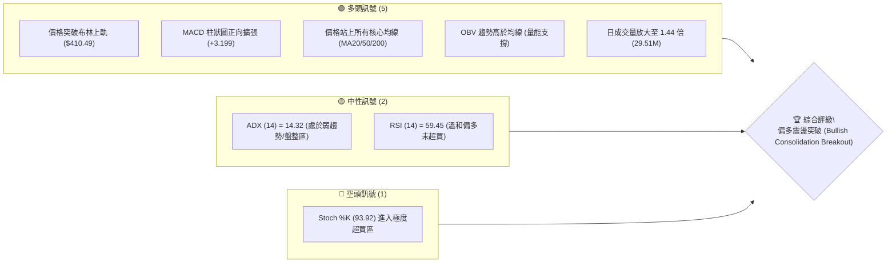
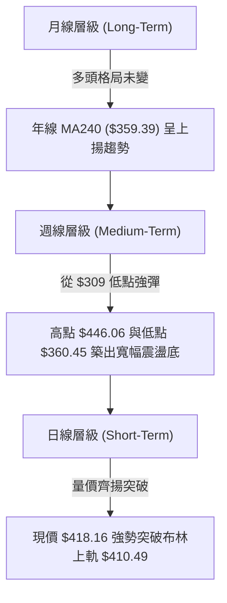
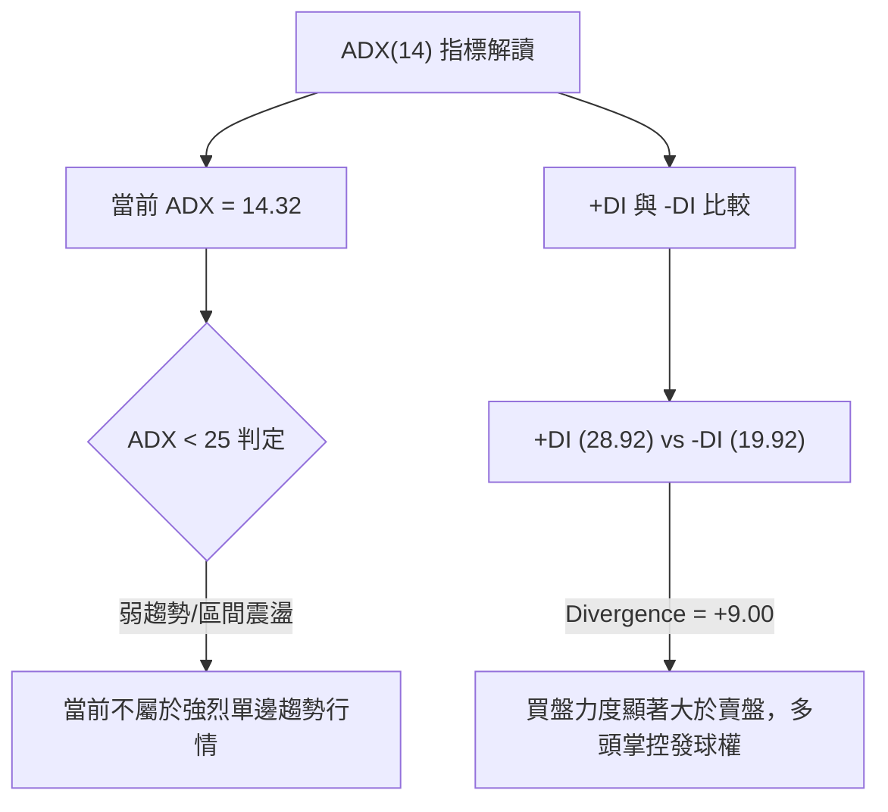
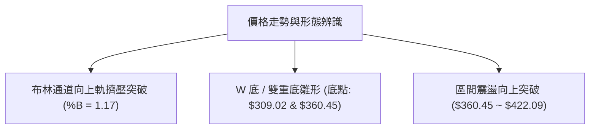
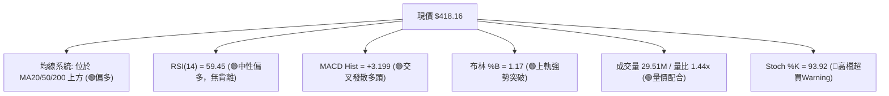
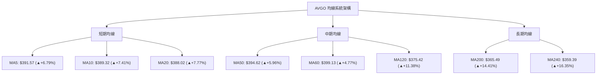
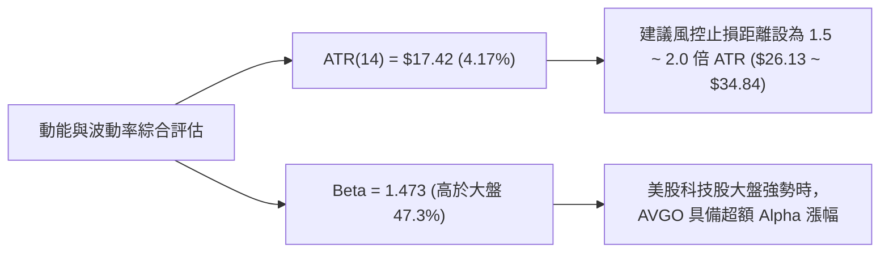
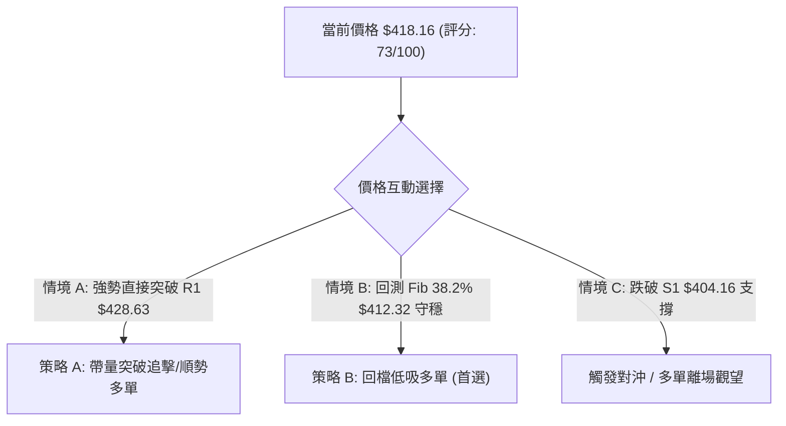
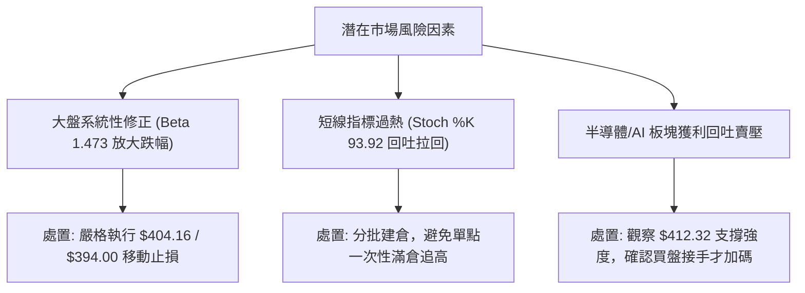

# AVGO 技術分析報告

> **報告日期**：2026-08-05 ｜ **語言**：繁體中文 ｜ **數據來源**：Yahoo Finance ｜ **當前價格**：$418.16

---

## 目錄

| 章節 | 內容 |
|------|------|
| [1. 技術面概覽](#1-技術面概覽) | 訊號儀表板、核心指標、評分卡 |
| [2. 趨勢分析](#2-趨勢分析) | 多時框趨勢、12個月走勢、ADX趨勢強度 |
| [3. 圖表形態分析](#3-圖表形態分析) | 形態識別、信心度評估、K線組合與目標價 |
| [4. 支撐與阻力](#4-支撐與阻力) | 關鍵價位結構、阻力/支撐表、斐波那契回調 |
| [5. 技術指標深度解讀](#5-技術指標深度解讀) | MA排列、RSI/MACD、布林通道與成交量OBV |
| [6. 動能與波動率](#6-動能與波動率) | 動能四象限、ATR波動率、Beta與大盤相關性 |
| [7. 多時框架總結](#7-多時框架總結) | 時框架評分矩陣、多時框收斂結論 |
| [8. 交易策略建議](#8-交易策略建議) | 決策流程圖、情境階梯、主多/對沖策略與風報比 |
| [9. 風險提示與監控](#9-風險提示與監控) | 監控 Checklist、風險情境與倉位管理 |

---

## 1. 技術面概覽

### 🎯 技術訊號儀表板



### 📊 核心指標速覽表

| 指標類別 | 指標名稱 | 當前數值 | 訊號 | 解讀 |
|----------|----------|----------|------|------|
| **價格** | 當前價格 | $418.16 | 🟢 | 位於52週區間 64.5% 位置，短線向上衝刺 |
| **均線** | MA20 | $388.02 | 🟢 | 現價高於 MA20 (+7.77%)，短線多頭占優 |
| **均線** | MA50 | $394.62 | 🟢 | 現價高於 MA50 (+5.96%)，中期趨勢翻多 |
| **均線** | MA200 | $365.49 | 🟢 | 現價高於 MA200 (+14.41%)，長期牛市基底穩固 |
| **動能** | RSI(14) | 59.45 | 🟢 | 處於 50-70 黃金買盤區，未見頂背離 |
| **動能** | MACD | 1.841 | 🟢 | MACD 快線切入零軸上方，Histogram +3.199 強勢擴張 |
| **動能** | Stoch %K/%D | 93.92 / 83.47 | 🔴 | %K 強勢高檔鈍化，短線存在拉回修復需求 |
| **波動** | ATR(14) | $17.42 | 🟡 | 日波幅達 4.17%，屬於典型高貝塔成長股波動 |
| **趨勢** | ADX(14) | 14.32 | 🟡 | ADX < 25 指示大級別仍處區間盤整，但 +DI(28.92) > -DI(19.92) |
| **量能** | 20日量比 | 1.44x | 🟢 | 最新成交量 29.51M 顯著高於 20日均量 20.50M |

### 🏆 技術評分卡

```
╔══════════════════════════════════════════════════════════════════╗
║                    技術評分卡 — AVGO (2026-08-05)                ║
╠══════════════════════════════════════════════════════════════════╣
║  趨勢強度 (Trend)     ▓▓▓▓▓▓▓▓▓▓▓▓█░░░░░░░  65/100  🟡 中性偏多    ║
║  動能指標 (Momentum)  ▓▓▓▓▓▓▓▓▓▓▓▓▓▓▓▓░░░░  80/100  🟢 強勁偏多    ║
║  支撐穩定度 (Support) ▓▓▓▓▓▓▓▓▓▓▓▓▓▓▓░░░░░  75/100  🟢 結構穩固    ║
║  成交量配合 (Volume)  ▓▓▓▓▓▓▓▓▓▓▓▓▓▓▓▓░░░░  80/100  🟢 放量確認    ║
║  形態完整度 (Pattern) ▓▓▓▓▓▓▓▓▓▓▓▓▓█░░░░░░  70/100  🟢 突破進行中  ║
║  均線排列 (MA System) ▓▓▓▓▓▓▓▓▓▓▓▓▓█░░░░░░  70/100  🟡 多頭初現    ║
╠══════════════════════════════════════════════════════════════════╣
║  綜合技術評分         ▓▓▓▓▓▓▓▓▓▓▓▓▓▓▓░░░░░  73/100  🟢 偏多進攻    ║
╚══════════════════════════════════════════════════════════════════╝
```

---

## 2. 趨勢分析

### 🌐 多時框趨勢分析



### 📈 長期趨勢 — 12個月走勢圖（Unicode）

```
AVGO 歷史 12 個月走勢圖 (2025-08 ~ 2026-08)
價格軸 ($)
$450 ┼                                      ● $446.06 (05月高點)
$420 ┼                                    ●   ●             ● $418.16 (現價)
$390 ┼                                  ●       ●   ●     ●
$360 ┼                 ● $367.57      ●           ●   ● ●
$330 ┼         ● $328.07       ●    ●
$300 ┼ ● $295.23                 ● $309.02 (03月低點)
     └─┬───────┬───────┬───────┬───────┬───────┬───────┬───────┬───► 時間
     2025-08  2025-10  2025-12 2026-02  2026-04 2026-06 2026-08
```

#### 走勢特徵分析表格

| 階段 | 月份區間 | 價格變動範圍 | 階段走勢特徵 | 技術面含義 |
|------|----------|--------------|--------------|------------|
| **1. 主升段衝刺** | 2025-08 ~ 2025-11 | $295.23 ➔ $400.71 | 猛烈推升，單月漲幅擴大 | 強勢多頭主升浪 |
| **2. 深度修正** | 2025-12 ~ 2026-03 | $400.71 ➔ $309.02 | 連續 4 個月回落，觸及 52W 低點區 | 估值修復與獲利了結壓回 |
| **3. 強勁 V 型反彈** | 2026-04 ~ 2026-05 | $309.02 ➔ $446.06 | 兩月內拉升近 44%，創下階段新高 | 法人資金重新強力佈局 |
| **4. 洗盤拉回** | 2026-06 ~ 2026-07 | $446.06 ➔ $360.45 | 回測 50% 斐波那契與 MA200 支撐 | 消化前期獲利賣壓 |
| **5. 突破再起** | 2026-08 (當前) | $389.28 ➔ $418.16 | 月線走勢強勁，重新站回 $400 大關 | 多頭重新掌權 |

### 📊 中期趨勢（週線分析）

從近 20 週數據觀察，AVGO 在 2026 年 3 月底見底 $300.20（RSI 超賣至 23.6）後展開第一波強攻，於 5 月底下探 $446.06 高點；隨後進入二次洗盤，於 7 月初落腳於 $360.45（獲得 S2 $369.16 與斐波那契 61.8% $361.72 強力支撐）。

近 4 週（7/19 至 8/09 週）收盤價呈升勢（$370.83 ➔ $381.92 ➔ $389.28 ➔ $418.16），配合週 MACD 柱狀圖由負轉正（+0.874 ➔ +3.199），確立中期底部的二次拉升型態。

### ⚡ 趨勢強度評估（ADX 解讀）



#### ADX 趨勢強度對照

| 指標名稱 | 當前數值 | 參考區間 | 市場狀態解讀 | 交易策略導向 |
|----------|----------|----------|--------------|--------------|
| **ADX(14)** | 14.32 | < 25 (弱趨勢/無趨勢) | 處於盤整渡過期，剛發起突破 | 避免高追，採取支撐低吸或確認突破進場 |
| **+DI (多頭)** | 28.92 | > 20 (買盤活躍) | 買方主導市場方向 | 偏多操作 |
| **-DI (空頭)** | 19.92 | < 20 (賣盤壓制弱) | 賣方無意大幅拋售 | 空頭力道衰退 |

---

## 3. 圖表形態分析

### 🔍 形態識別系統



#### 形態信心度評估表

| 形態類型 | 信心度 (%) | 判斷依據（引用數據） | 完成度 (%) | 目標價（附計算式） |
|----------|------------|----------------------|------------|--------------------|
| **布林通道上軌突破** | 85% | 現價 $418.16 > 布林上軌 $410.49，%B = 1.17，配合 1.44x 放大成交量 | 90% | 突破延伸點 = R1 $428.63 ➔ R2 $439.32 |
| **雙重底 / 雙底 (Double Bottom)** | 70% | 第一底 $309.02 (3月)，第二底 $360.45 (7月)，頸線位位於 5月高點聚類 $422.09 | 75% | 頸線 $422.09 + 形態高度 ($422.09 - $360.45 = $61.64) = **$483.73**（接近 R3 $494.22） |
| **短期箱體震盪突破** | 80% | 7月至今在 $360.45 - $412.32 (Fib 38.2%) 箱體盤整，今日拉長紅K突破箱頂 | 85% | 箱頂 $412.32 + 箱體高度 ($412.32 - $360.45 = $51.87) = **$464.19** |

### 🕯️ 重要K線形態分析

| 日期/週期 | 收盤價 | K線形態 | 技術解讀 | 訊號 |
|-----------|--------|---------|----------|------|
| **2026-06-28 週** | $365.02 | 長黑貫穿 (Bearish Marubozu) | 跌破 MA50，恐慌賣壓宣洩 | 🔴 賣壓沈重 |
| **2026-07-05 週** | $360.45 | 錘頭線 / 下影線長 (Hammer) | 探底 $360.45 後買盤進場支撐 | 🟢 止跌訊號 |
| **2026-07-12 週** | $399.97 | 強勁大陽線 (Bullish Engulfing) | 一舉吞噬前兩週陰線，底部確立 | 🟢 強勢反攻 |
| **2026-08-09 週** | $418.16 | 光腳長紅突破線 (Breakout Green) | 帶量拉升，實體收在當週高檔 | 🟢 突破確認 |

### 📉 ASCII 走勢形態示意圖

```
AVGO 箱體突破與 W 底形態示意圖
===================================================================
$446.06 ┤                ● (前高波段頂)
$428.63 ┤................|........................ (阻力 R1)
$422.09 ┤           ●    |    ▲ 現價 $418.16 (強勢突破箱頂)
$412.32 ┼───────────┼────┼───/──────────────────── (箱頂/Fib 38.2%)
        │           │    │  /
$388.02 ┼───────────┼────┼─/────────────────────── (MA20 中軸)
        │           │    │/
$360.45 ┼─────●─────┴────┴──────────────────────── (箱底/第二底 S2)
$309.02 ┼─● (第一底)
===================================================================
```

### 🎯 形態目標價計算

1. **箱體突破目標價推算**：
   $$\text{目標價} = \text{箱頂突破點 } (\$412.32) + \text{箱體高度 } (\$412.32 - \$360.45 = \$51.87) = \$464.19$$
2. **雙底形態目標價推算**：
   $$\text{目標價} = \text{頸線位 } (\$422.09) + \text{形態高度 } (\$422.09 - \$360.45 = \$61.64) = \$483.73$$
   *(註：推算目標價接近阻力 R3 $494.22 及分析師平均目標價 $527.88)*

---

## 4. 支撐與阻力

### 🗺️ 關鍵價位分布圖（Unicode）

```
AVGO 價位結構分布圖 (由 OHLCV 與歷史高低點精確計算)
═════════════════════════════════════════════════════════════════════
$494.22 ║████████████████████████████████████████; 52週歷史高點 / 阻力 R3
$443.62 ║██████████████████████; 斐波那契 23.6% 回調位
$439.32 ║██████████████████; 近一年波段高點聚類 / 阻力 R2
$428.63 ║████████████; 短線波段高點聚類 / 阻力 R1
$418.16 ╠════════════════════════════════════════ ◄ 當前最新收盤價
$412.32 ║▓▓▓▓▓▓▓▓▓▓▓▓; 斐波那契 38.2% 回調位 / 短線轉支撐
$404.16 ║▓▓▓▓▓▓▓▓▓▓▓▓▓▓▓▓; 近一年波段低點聚類 / 支撐 S1
$388.02 ║▓▓▓▓▓▓▓▓▓▓▓▓▓▓▓▓▓▓▓▓; 布林中軌 (MA20) / 斐波那契 50.0% ($387.02)
$369.16 ║████████████████████████; 波段低點聚類 / 強支撐 S2
$361.72 ║██████████████████████████; 斐波那契 61.8% 黃金分割位
$357.11 ║████████████████████████████; 波段低點聚類 / 強支撐 S3
$279.82 ║████████████████████████████████████████; 52週歷史低點
═════════════════════════════════════════════════════════════════════
```

### 🚧 阻力位分析表

| 阻力級別 | 精確價位 | 形成原因（數據依據） | 突破難度 | 重要性 |
|----------|----------|----------------------|----------|--------|
| **R1** | **$428.63** | 近一年波段高點聚類區，距離現價 +2.50% | 🟡 中等 | 短線多頭衝刺第一關卡 |
| **R2** | **$439.32** | 近一年波段高點聚類區，距離現價 +5.06% | 🔴 較強 | 接近前高 $446.06 賣壓帶 |
| **R3** | **$494.22** | 52週最高價，距離現價 +18.19% | 🔴 極強 | 歷史高點強阻力 |

### 🛡️ 支撐位分析表

| 支撐級別 | 精確價位 | 形成原因（數據依據） | 守住機率 | 重要性 |
|----------|----------|----------------------|----------|--------|
| **S1** | **$404.16** | 近一年波段低點聚類，距離現價 -3.35% | 🟢 高 | 短線多空強弱分水嶺 |
| **S2** | **$369.16** | 近一年波段低點聚類，距離現價 -11.72% | 🟢 極高 | 中期波段防守關鍵大營 |
| **S3** | **$357.11** | 近一年波段低點聚類，距離現價 -14.60% | 🟢 極高 | 長期均線 MA200 ($365.49) 疊加防禦區 |

### 📐 斐波那契回調位分析（52週區間：$279.82 ➔ $494.22）

```
斐波那契回調分層解讀
0.0%  (52W High) ── $494.22 ─── 終極多頭目標區
23.6% 回調位    ── $443.62 ─── 第一道強阻力區
38.2% 回調位    ── $412.32 ─── ◄ 當前價格 $418.16 位於 38.2% ~ 23.6% 區間
50.0% 回調位    ── $387.02 ─── 核心強支撐區 (與 MA20 $388.02 重合)
61.8% 回調位    ── $361.72 ─── 黃金分割防禦點 (與 S2 $369.16 構成雙重防線)
78.6% 回調位    ── $325.70 ─── 空頭極限攻勢區
100.0% (52W Low)─ $279.82 ─── 全年底部
```

**解讀**：現價 $418.16 已成功站上 38.2% 回調位（$412.32），代表價格已擺脫下行趨勢的掌控，正式進入 38.2%（$412.32）至 23.6%（$443.62）的多頭反彈擴張區。若能有效守住 $412.32，上方目標將直接指向 $443.62。

---

## 5. 技術指標深度解讀

### 🎛️ 指標訊號總覽



### 📈 移動平均線排列分析



**詳細解讀**：
1. **短均黃金交叉**：MA5 ($391.57) > MA10 ($389.32) > MA20 ($388.02)，展現極為強勁的短線推升動能。
2. **中期阻力克服**：價格 $418.16 順利升破 MA50 ($394.62) 及 MA60 ($399.13)，使短中期均線轉為多頭防禦支撐。
3. **長均牛市防線**：價格遠高於 MA200 ($365.49) 與 MA240 ($359.39) 達 +14.41% 及 +16.35%，長期多頭基禦極其穩固。

### 📉 RSI(14) 分析

*   **當前數值**：59.45
*   **強度進度條**：`████████████░░░░░░░░` 59.45% (🟡/🟢 溫和偏多)
*   **超買超賣判斷**：處於 50–70 標準多頭推進區，離超買區 (70) 仍有空間，無立即回落壓力。
*   **背離分析**：近 20 週數據顯示，價格由 $360.45 升至 $418.16，RSI 由 41.6 同步升至 59.45，高低點同步墊高，**無頂背離或底背離現象**，趨勢健康。

### 📊 MACD(12/26/9) 訊號解讀

*   **MACD 快線**：1.841
*   **Signal 慢線**：-1.358
*   **柱狀圖 (Histogram)**：+3.199 🟢
*   **分析**：MACD 快線已由下往上穿越慢線形成黃金交叉，且柱狀圖由上週的 +0.874 快速擴張至 +3.199，顯示多頭加速攻擊，動能量能充沛。

### 📦 布林通道分析

```
AVGO 日線布林通道示意圖
===================================================================
$410.49 ┼───────────────────────────────── (BB 上軌) ◄ 突破發散
        │                                 ▲ 現價 $418.16 (%B = 1.17)
$388.02 ┼───────────────────────────────── (BB 中軌 / MA20)
        │
$365.54 ┼───────────────────────────────── (BB 下軌)
===================================================================
```

*   **解析**：%B 達 1.17（> 1.0），代表價格拉出強勢長紅帶量衝出布林通道上軌（$410.49）。此為典型「通道擠壓後的波動率擴張突破」（Volatility Expansion Breakout），短線常伴隨強烈單邊推進。

### 💹 成交量分析（量價配合度）

*   **最新成交量**：29,511,600 股
*   **20日均量**：20,497,450 股（量比 1.44x）
*   **OBV 趨勢**：OBV 指標持續高於其移動平均線，且週成交量在反彈過程中溫和放大，呈現「價漲量增、價跌量縮」的良好多頭配合模式。

---

## 6. 動能與波動率

### ⚡ 動能評估四象限

| 象限分區 | 動能強度 (Momentum) | 波動率 (Volatility) | 當前 AVGO 位置 | 策略意涵 |
|----------|---------------------|---------------------|----------------|----------|
| **Q1 (高動能 / 低波動)** | 強 | 低 | — | 最理想續抱區 |
| **Q2 (高動能 / 高波動)** | 強 | 高 | **✓ AVGO 所在位置** | **衝刺突破階段，收益高但需設置 trailing stop 嚴防回吐** |
| **Q3 (低動能 / 高波動)** | 弱 | 高 | — | 高風險混亂區，應避免進場 |
| **Q4 (低動能 / 低波動)** | 弱 | 低 | — | 沉悶盤整區 |



### 📊 ATR 波動率分析

*   **ATR(14)**：$17.42（佔當前股價 4.17%）
*   **每日波幅參考**：正常交易日高低點波動區間約在 $17–$20 之間。
*   **交易風控應用**：
    *   **短線止損距離**：$17.42 \times 1.0 = \$17.42$（約於 $400.74）
    *   **波段防禦距離**：$17.42 \times 1.5 = \$26.13$（約於 $392.03，緊貼 MA50 $394.62）

### 📐 Beta 與市場相關性

*   **Beta 係數**：1.473（高貝塔成長/半導體龍頭）
*   **解讀**：當標普 500 指數或費城半導體指數上漲 1% 時，AVGO 平均上漲 1.473%。在目前半導體產業成長週期下，高 Beta 屬性提供強勁的向上彈性。

---

## 7. 多時框架總結

### 📋 時框架評分表

| 時框架 | 趨勢方向 | 動能狀態 | 均線排列 | 形態結構 | 綜合評分 | 操作建議 |
|--------|----------|----------|----------|----------|----------|----------|
| **月線 (Long)** | 🟢 看多 | 🟢 溫和 | 🟢 多頭排列 (價格 > MA200) | 大週期牛市架構 | **85/100** | 長線堅定持有 |
| **週線 (Mid)** | 🟢 看多 | 🟢 加速 | 🟡 震盪回升 (站回 MA50) | W 底 / 箱體突破中 | **75/100** | 波段拉回加碼 |
| **日線 (Short)**| 🟢 強勢 | 🔴 高檔過熱| 🟢 均線黃金交叉 | 布林上軌帶量突破 | **70/100** | 追高宜謹慎，拉回 $412 前後佈局 |

### 🔲 綜合訊號矩陣

```
時框架訊號矩陣表
┌──────────┬──────────┬──────────┬──────────┬──────────┐
│ 時框架   │ 趨勢指標 │ 動能指標 │ 量能指標 │ 最終判定 │
├──────────┼──────────┼──────────┼──────────┼──────────┤
│ 長期月線 │ 🟢 看多  │ 🟢 看多  │ 🟢 看多  │ 🟢 多頭  │
│ 中期週線 │ 🟢 看多  │ 🟢 看多  │ 🟢 看多  │ 🟢 多頭  │
│ 短期日線 │ 🟢 看多  │ 🟡 鈍化  │ 🟢 看多  │ 🟢 突破  │
└──────────┴──────────┴──────────┴──────────┴──────────┘
```

### ⚖️ 多時框收斂結論

**收斂規則執行**：
1. **行情性質**：ADX(14) = 14.32 (< 25)，指示大級別處於**寬幅盤整渡過至突破的臨界期**。
2. **主導時框**：因 ADX < 25，需防範假突破，以**中長期（週線與 MA50/MA200）方向為主導**。目前價格（$418.16）已全面站在 MA20 ($388.02)、MA50 ($394.62)、MA200 ($365.49) 上方，週線 RSI 及 MACD 全面轉強。
3. **最終方向性結論**：**🟢 偏多進攻（Bullish Expansion）**。日線布林上軌突破配合量能放大（1.44x），確認波段低點 $360.45 築底成功，主策略確立為**偏多操作（買入/拉回做多）**。

---

## 8. 交易策略建議

### 🗺️ 策略決策流程圖



### 🧭 策略路由

**當前主策略方向 = 🟢 多頭主導 (綜合評分 73/100)**  
由於技術面綜合評分達 73/100，且價格帶量攻破布林上軌及核心均線，策略全面鎖定**多頭進攻與拉回低吸**，空頭僅作為風險對沖防守參考。

### 🎯 價格情境階梯 (Price Scenarios)

| 觸發條件 | 下一目標 | 後續延伸目標 | 情境技術含義 |
|----------|----------|--------------|--------------|
| **突破 R1 $428.63** | R2 $439.32 | R3 $494.22 | 短線強勢發動，開啟全速衝刺波段 |
| **站穩 $412.32 ~ $418.16** | R1 $428.63 | R2 $439.32 | 突破後高檔整固，蓄勢再攻 |
| **跌破 S1 $404.16** | S2 $369.16 | S3 $357.11 | 短線突破失敗，回歸箱體中軸震盪 |

### 📊 情境機率分佈

| 情境劇本 | 估計機率 | 主要技術依據 |
|----------|----------|--------------|
| **強勢突破 / 上行延續** | **55%** | MACD 柱狀圖 (+3.199) 強勢發散、量比 1.44x、站上 MA5/10/20/50/200 |
| **高檔區間震盪 ($404 - $428)** | **30%** | Stoch %K (93.92) 超買需要消化，ADX = 14.32 指示趨勢仍在凝聚中 |
| **突破失敗回落再探底** | **15%** | 若整體美股大盤拉回，價格回測 S2 $369.16 / MA200 $365.49 |

### 🟢 主策略詳情

#### 策略 A：帶量突破追攻策略 (Breakout Continuation)
*   **適用對象**：積極型波段交易者
*   **進場條件**：股價帶量突破並站穩 R1 $428.63，或當前價格 $418.16 分批建倉
*   **進場價格**：**$418.16 ~ $428.63**
*   **目標價 T1**：**$439.32**（阻力 R2，預期報酬 +5.06%）
*   **目標價 T2**：**$494.22**（52週高點 R3 / 雙底形態目標，預期報酬 +18.19%）
*   **止損價格**：**$404.16**（跌破支撐 S1 / 50% 1.0x ATR，下行風險 -3.35%）
*   **風險報酬比 (R:R)**：
    *   至 T1 = $11.16 / $14.00 = **1 : 0.80**
    *   至 T2 = $76.06 / $14.00 = **1 : 5.43**
*   **建議倉位**：10% - 15%

#### 策略 B：拉回支撐低吸策略 (Pullback Dip-Buying — 推薦 ⭐⭐⭐⭐⭐)
*   **適用對象**：穩健型投資者
*   **進場條件**：股價拉回回測 斐波那契 38.2% ($412.32) 或 支撐 S1 ($404.16) 附近出現止跌訊號
*   **進場價格**：**$408.00 ~ $412.32**（均價以 $410.16 計算）
*   **目標價 T1**：**$428.63**（阻力 R1，預期報酬 +4.50%）
*   **目標價 T2**：**$439.32**（阻力 R2，預期報酬 +7.11%）
*   **止損價格**：**$394.00**（跌破 MA50 $394.62 防線，下行風險 -3.94%）
*   **風險報酬比 (R:R)**：
    *   至 T1 = $18.47 / $16.16 = **1 : 1.14**
    *   至 T2 = $29.16 / $16.16 = **1 : 1.80**
*   **建議倉位**：15% - 20%

### 🔴 反向風險觸發點（對沖提示）

若價格未如預期上攻，反向**收盤跌破 S1 $404.16**，代表短線假突破發生：
*   **對沖/平倉條件**：跌破 $404.16 順利收盤，建議多單全面減碼或平倉。
*   **下攻對沖目標**：若進一步跌破 MA50 ($394.62)，股價將下探 S2 **$369.16**。

### ⭐ 整體訊號強度評星

```
做多訊號強度：★★★★☆  (4/5星)  — 均線突破、MACD交叉、放量支持
做空訊號強度：★☆☆☆☆  (1/5星)  — 僅Stoch超買，其餘多頭占優
整體可信度：  ★★★★☆  (4/5星)  — 多時框訊號一致性高
```

---

## 9. 風險提示與監控

### ✅ 關鍵監控指標 Checklist

```
╔══════════════════════════════════════════════════════════════════╗
║                   AVGO 每日交易風控 Checklist                    ║
╠══════════════════════════════════════════════════════════════════╣
║ [ ] 1. 收盤價是否守住斐波那契 38.2% 支撐位 ($412.32)？           ║
║ [ ] 2. 日成交量是否維持在 20,500,000 股 (20日均量) 之上？        ║
║ [ ] 3. MACD 柱狀圖是否持續擴張 (維持在 +3.0 以上)？              ║
║ [ ] 4. Stoch %K 是否向下滑破 %D 形成高檔死叉？                   ║
║ [ ] 5. 股價是否觸及關鍵防守位 S1 ($404.16) 或 MA50 ($394.62)？   ║
╚══════════════════════════════════════════════════════════════════╝
```

### ⚠️ 風險場景分析



### 🛡️ 風險管理重要提醒

1. **嚴禁單點高檔重倉**：當前 Stoch %K 處於 93.92 的高檔超買區，雖然 MACD 與均線極佳，但短線不排除出現 1–2 天的回測洗盤。建議採取 **3-3-4 分批建倉法**（現價建立 30%，回測 $412 建倉 30%，突破 $428 補滿 40%）。
2. **波動率保護（ATR 應用）**：AVGO 日 ATR 高達 $17.42，代表單日正常波幅即達 $17 以上。止損設定**切勿過窄**（不可低於 1.0x ATR = $17.42），否則極易被日常噪音洗出場。
3. **基本面與目標價對照**：45 位華爾街分析師平均目標價為 **$527.88**（最高 $675.00），現價 $418.16 具備約 +26.2% 的理論上行空間，長期基本面對技術面突破提供強大底氣。

---

## 📋 報告總結

```
╔══════════════════════════════════════════════════════════════════╗
║                     AVGO 技術分析報告總結                        ║
╠══════════════════════════════════════════════════════════════════╣
║ 報告日期：2026-08-05                                              ║
║ 當前價格：$418.16                                                 ║
║ 綜合評級：🟢 偏多進攻 / 帶量突破 (Bullish Breakout)               ║
║                                                                  ║
║ 關鍵結論：                                                        ║
║ ├─ 長期趨勢：🟢 強勢多頭 (高於 MA200 $365.49 達 +14.41%)          ║
║ ├─ 中期趨勢：🟢 築底完成 (W 底 $360.45 成功，反彈突破 MA50)       ║
║ ├─ 短期趨勢：🟢 帶量突破 (衝破布林上軌 $410.49，量比 1.44x)       ║
║ ├─ 關鍵支撐：S1 $404.16 / Fib 38.2% $412.32 / MA20 $388.02       ║
║ ├─ 關鍵阻力：R1 $428.63 / R2 $439.32 / R3 $494.22                 ║
║ └─ 分析師目標價：$527.88 (Mean)                                  ║
║                                                                  ║
║ 最優策略組合：                                                    ║
║ 1. 🥇 最佳機會：策略 B — 拉回 $408 - $412 逢低分批佈局 (高風報比) ║
║ 2. 🥈 次選機會：策略 A — 突破 $428.63 確認後追擊攻向 $439 - $494  ║
║ 3. 🥉 風控防線：收盤跌破 $404.16 止損離場，維護資本安全          ║
╚══════════════════════════════════════════════════════════════════╝
```

---

> ⚠️ **免責聲明**：本報告為 AI 自動生成之技術分析，所有數據及估算均基於提供的歷史價格資訊。本報告**僅供研究與學術參考**，**不構成任何投資建議**。投資有風險，入市需謹慎。

---

*報告生成時間：2026-08-05 ｜ 數據來源：Yahoo Finance ｜ 分析框架：多時框技術分析*