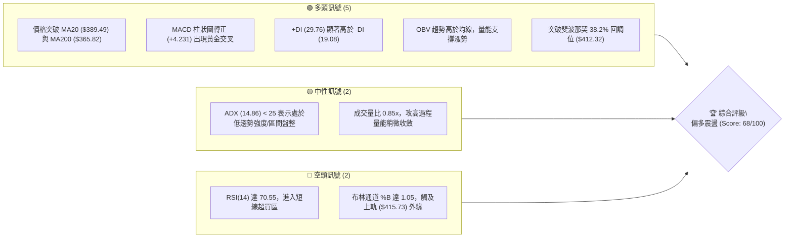
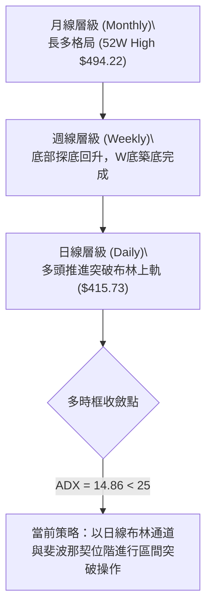
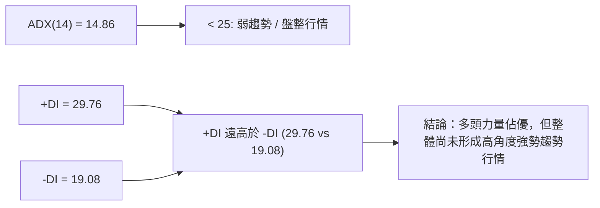
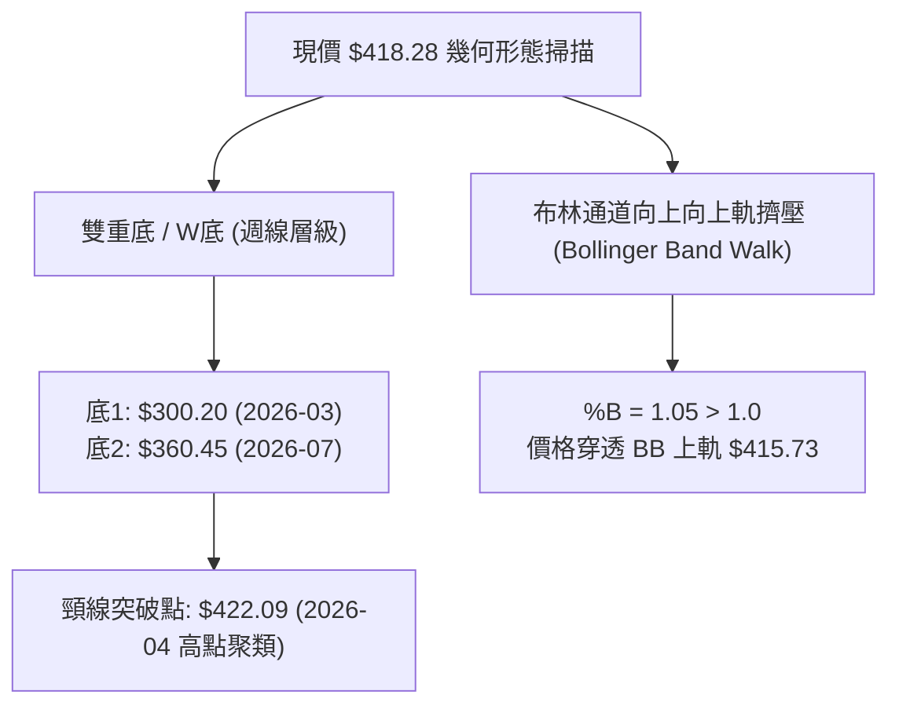
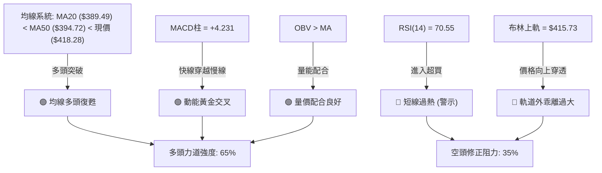
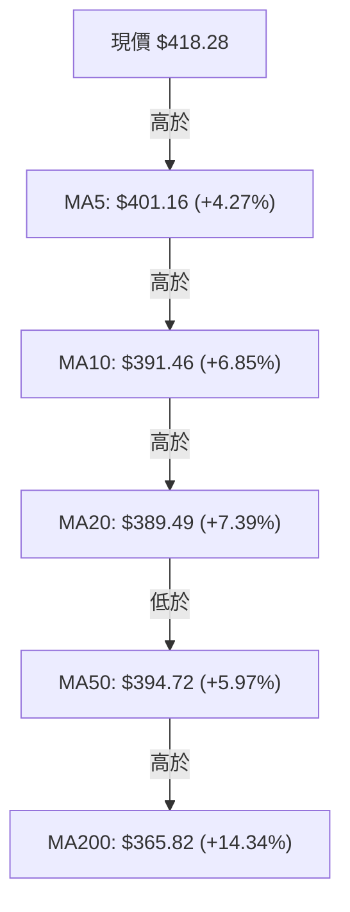
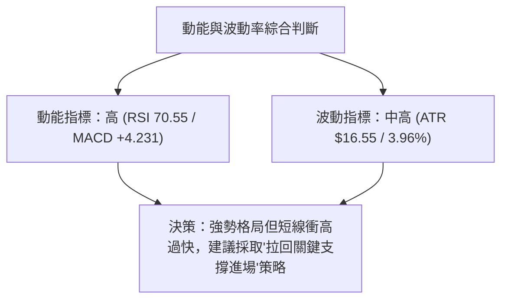
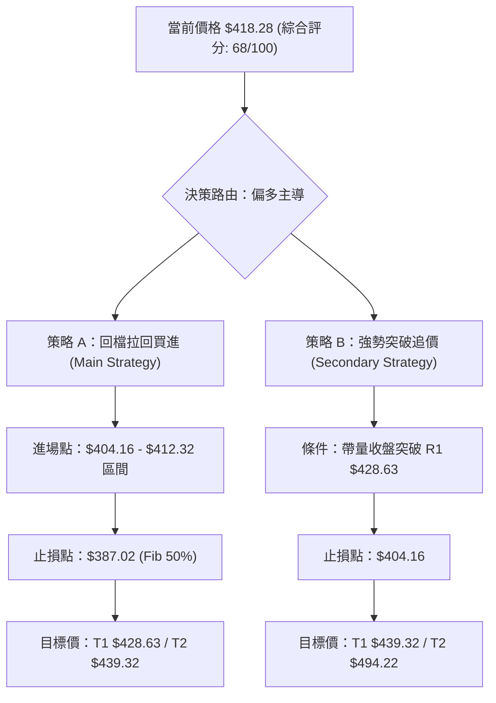
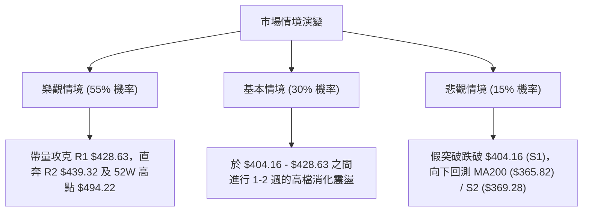

# AVGO 技術分析報告

> **報告日期**：2026-08-06 ｜ **語言**：繁體中文 ｜ **數據來源**：Yahoo Finance ｜ **當前價格**：$418.28

---

## 目錄

| 章節 | 內容 |
|------|------|
| [1. 技術面概覽](#1-技術面概覽) | 訊號儀表板、核心指標、評分卡 |
| [2. 趨勢分析](#2-趨勢分析) | 多時框趨勢、長中短期走勢 |
| [3. 圖表形態分析](#3-圖表形態分析) | 形態識別、K線組合、目標價 |
| [4. 支撐與阻力](#4-支撐與阻力) | 關鍵價位、斐波那契回調 |
| [5. 技術指標深度解讀](#5-技術指標深度解讀) | MA/RSI/MACD/布林/成交量 |
| [6. 動能與波動率](#6-動能與波動率) | 動能評估、ATR、Beta |
| [7. 多時框架總結](#7-多時框架總結) | 時框架評分矩陣 |
| [8. 交易策略建議](#8-交易策略建議) | 多空策略、風險報酬比 |
| [9. 風險提示與監控](#9-風險提示與監控) | 監控指標、風險場景 |

---

## 1. 技術面概覽

### 🎯 技術訊號儀表板



### 📊 核心指標速覽表

| 指標類別 | 指標名稱 | 當前數值 | 訊號 | 解讀 |
|----------|----------|----------|------|------|
| **價格** | 當前價格 | $418.28 | 🟢 多頭 | 位於 52 週區間 64.6% 位置，成功收復關鍵中軌 |
| **均線** | MA20 | $389.49 | 🟢 多頭 | 價格位於 MA20 上方 (+7.39%)，短期均線向上發散 |
| **均線** | MA50 | $394.72 | 🟢 多頭 | 價格位於 MA50 上方 (+5.97%)，中軌形成防守支撐 |
| **均線** | MA200 | $365.82 | 🟢 多頭 | 價格位於 MA200 上方 (+14.34%)，長多基調未變 |
| **動能** | RSI(14) | 70.55 | 🔴 超買 | 進入超買區 (>70)，短線面臨獲利解套過熱壓力 |
| **動能** | MACD | +4.231 | 🟢 多頭 | MACD 柱狀圖由負轉正，快線翻紅上升動能強勁 |
| **動能** | ADX(14) | 14.86 | 🟡 中性 | ADX < 25，顯示當前為「多頭佔優的無強烈單邊趨勢區間」 |
| **通道** | 布林通道 | %B 1.05 | 🔴 超買 | 價格突破布林上軌 ($415.73)，短期存在乖離修正需求 |
| **量能** | 量比 / OBV | 0.85x / 偏多 | 🟢 多頭 | 雖然量比稍降，但 OBV 高於 MA，整體籌碼沉澱良好 |
| **波動** | ATR(14) | $16.55 | 🟡 中性 | 佔股價 3.96%，代表日間平均波動幅度約 $16.55 |

### 🏆 技術評分卡

```
╔══════════════════════════════════════════════════════════════════╗
║                   技術評分卡 — AVGO (2026-08-06)                 ║
╠══════════════════════════════════════════════════════════════════╣
║ 趨勢強度 (ADX)    ███████░░░░░░░░░░░░░  35/100  🟡 弱趨勢/盤整   ║
║ 動能指標 (RSI/MACD)███████████████░░░░  75/100  🟢 動能強勁     ║
║ 支撐穩定度        ██████████████░░░░░░  70/100  🟢 結構穩固     ║
║ 成交量配合度      ████████████░░░░░░░░  60/100  🟡 溫和量縮     ║
║ 形態完整度        ██████████████░░░░░░  70/100  🟢 底部位階完成 ║
║ 均線排列          ████████████████░░░░  80/100  🟢 多頭復甦排列 ║
╠══════════════════════════════════════════════════════════════════╣
║ 綜合技術評分      █████████████░░░░░░░  68/100  🟢 偏多震盪 (BUY)║
╚══════════════════════════════════════════════════════════════════╝
```

---

## 2. 趨勢分析

### 🌐 多時框趨勢分析



### 📈 長期趨勢 — 12個月走勢圖（Unicode）

以下為 AVGO 過去 12 個月（2025-08 至 2026-08）的月線收盤走勢圖：

```
AVGO 月線走勢圖（過去12個月：2025-08 至 2026-08）
價格軸 ($)
$450 ┤                                           ● (2026-05 $446.06)
$420 ┤                                                       ● (現在 $418.28)
$390 ┤                                               ●   ●
$360 ┤               ● (2025-10 $367.57)
$330 ┤           ●                       ●   ●
$300 ┤                                   (2026-03 $309.02 低點)
$270 ┤   ● (2025-08 $295.23)
     └─┬───┬───┬───┬───┬───┬───┬───┬───┬───┬───┬───┬───► 月份
      08  09  10  11  12  01  02  03  04  05  06  07  08
```

#### 走勢特徵分析表格

| 階段 | 時間區間 | 收盤價區間 | 變動幅度 | 主導特徵與技術解讀 |
|------|----------|------------|----------|-------------------|
| **第一階段：強勢主升段** | 2025-08 ~ 2025-11 | $295.23 → $400.71 | +35.73% | AI 晶片需求爆發，攻克 $400 關卡，創當時歷史新高 |
| **第二階段：深幅回調區** | 2025-12 ~ 2026-03 | $344.83 → $309.02 | -22.88% | 高估值修正與大盤獲利了結，於 $309.02 尋得波段鐵底 |
| **第三階段：絕地反彈區** | 2026-04 ~ 2026-05 | $416.77 → $446.06 | +44.35% | 強勢 V 型反彈攻至 52 週次高點 $446.06 |
| **第四階段：二次回檔築底**| 2026-06 ~ 2026-07 | $377.75 → $389.28 | -12.73% | 於 $360.45 進行二次測底，形成堅實的雙重底頸線支撐 |
| **第五階段：重新啟動攻勢**| 2026-08 (現況)    | $418.28            | +7.45%   | 攻克 MA20/MA50，站上 $412.32 (38.2% 斐波位)，逼近 R1 $428.63 |

### 📊 中期趨勢（週線分析）

從近 20 週數據觀察，AVGO 在 2026 年 3 月底探底至 $300.20 後，經歷了兩波顯著的抬升：
1. **第一波衝高**：於 2026-05-31 達到週線收盤高點 $446.06。
2. **中期回測**：於 2026-07-05 回測低點 $360.45，未跌破 3 月底低點 $300.20，構建了更高的底部（Higher Low）。
3. **現階段推升**：近 4 週連續收紅（$370.83 → $381.92 → $389.28 → $418.28），MACD 週線柱狀圖亦在 2026-08-09 週轉為正值 (+4.231)，確認中期多頭波段重新啟動。

```
週線支撐阻力結構圖
$494.22 ───────────────────────────────────── 52週歷史高點 (R3)
$446.06 ───────────────────────────────────── 近期波段高點 / 阻力 (R2附近)
$428.63 ───────────────────────────────────── 近期主要阻力 (R1)
$418.28 ═════════════════════════════════════ 【當前價格】
$412.32 ───────────────────────────────────── 斐波那契 38.2% 回調位
$387.02 ───────────────────────────────────── 斐波那契 50.0% / MA20 ($389.49)
$360.45 ───────────────────────────────────── 中期波段底座 (S2 $369.28 附近)
```

### ⚡ 趨勢強度評估（ADX 解讀）



#### ADX 趨勢強度對照表

| ADX 區間 | 趨勢狀態 | 當前 AVGO 位置 | 建議交易策略 |
|----------|----------|----------------|--------------|
| **0 – 20** | **極弱 / 無趨勢** | **14.86 (當前)** | **區間震盪操作，關注布林上下軌與關鍵斐波那契位階** |
| **20 – 25**| 趨勢形成中 | - | 密切關注突破訊號與成交量變化 |
| **25 – 50**| 強烈單邊趨勢 | - | 順勢操作，持有趨勢部位 |
| **50 +**   | 過熱趨勢 | - | 謹防趨勢末端反轉風險 |

---

## 3. 圖表形態分析

### 🔍 形態識別系統



#### 形態信心度與目標價評估表

| 形態類型 | 信心度 | 判斷依據（引用數據） | 完成度 | 目標價（附計算式） |
|----------|--------|----------------------|--------|--------------------|
| **週線雙重底 (W-Bottom)** | **70%** 🟢 | 低點1 ($300.20) 與低點2 ($360.45) 形成高低底排列；頸線位置為 R1 ($428.63) 附近。 | 85% | **$496.81** (計算式：頸線 $428.63 + 形態高度 [$428.63 - $360.45 = $68.18] = $496.81，接近 52W 高點 $494.22) |
| **日線布林上軌突破** | **80%** 🟢 | 當前價格 $418.28 高於 BB 上軌 $415.73，%B 達 1.05。 | 100% | **$428.63** (短期阻力 R1 測試目標) |
| **頭肩形態 / 三角形** | **20%** 🔴 | 幾何特徵不顯著，數據不足以支撐幾何圖形。 | - | *訊號不足，僅做指標型解讀* |

### 🕯️ 重要 K 線形態分析

| 時間 (週) | 收盤價 | K 線形態 | 解讀 | 訊號 |
|-----------|--------|----------|------|------|
| **2026-06-28** | $365.02 | 大陰線向下下探 | 市場獲利賣壓出籠，洗出不堅定籌碼 | 🔴 空頭 |
| **2026-07-05** | $360.45 | 長下影線錘子線 (Hammer) | 於 S2 區域附近尋得強烈買盤支撐，為探底止跌訊號 | 🟢 看多 |
| **2026-07-12** | $399.97 | 中陽線覆蓋 (Bullish Engulfing) | 一舉收復前一週失地，成交量放大至 1.22 億股，確立反轉 | 🟢 強多 |
| **2026-08-09** | $418.28 | 長紅大陽線 (Marubozu傾向) | 突破前波震盪高點，收盤價直逼 52 週區間高檔 | 🟢 強多 |

### 📉 ASCII 走勢形態示意圖

```
週線 W 底 (Double Bottom) 構造示意圖：

$446.06 📈 ────────────────────── 前波高點 (2026-05)
          \                    /
$428.63 ─── \ ─── 頸線區域 ─── / ─── 攻勢推進中 (現價 $418.28) ◄ 目前位置
             \   / \         /
$360.45 ────── \/ ── \ ─────/ ────── 第二隻腳 (Higher Low, 2026-07)
                      \   /
$300.20 ─────────────── \/ ───────── 第一隻腳 (波段大底, 2026-03)
```

### 🎯 形態目標價計算

以已確認之**週線 W 底**進行測量目標推估：
1. **第一隻腳低點**：$300.20 (2026-03-29)
2. **第二隻腳低點**：$360.45 (2026-07-05) -> 作為堅實底座
3. **形態頸線位**：取 R1 $428.63（亦即近一年波段高點聚類）
4. **形態垂直高度** = 頸線 $428.63 - 第二腳 $360.45 = **$68.18**
5. **最小測量目標價** = 頸線 $428.63 + $68.18 = **$496.81**（與 52 週高點 $494.22 高度吻合）

---

## 4. 支撐與阻力

### 🗺️ 關鍵價位分布圖（Unicode）

```
AVGO 價位結構分布圖 (當前價格: $418.28)
═══════════════════════════════════════════════════════════════════
$494.22 ║████████████████████████████████████████║ 歷史高點 / 阻力 R3
$443.62 ║██████████████████████                  ║ 斐波那契 23.6% 回調位
$439.32 ║████████████████████████                ║ 波段阻力 R2
$428.63 ║████████████████████████████            ║ 關鍵阻力 R1 (頸線區)
$418.28 ╠════════════════════════════════════════╣ ◄ 當前收盤價
$412.32 ║▓▓▓▓▓▓▓▓▓▓▓▓▓▓▓▓▓▓▓▓▓▓▓▓                ║ 斐波那契 38.2% 回調位
$404.16 ║▓▓▓▓▓▓▓▓▓▓▓▓▓▓▓▓▓▓▓▓▓▓▓▓▓▓▓▓            ║ 近期首要支撐 S1
$389.49 ║▓▓▓▓▓▓▓▓▓▓▓▓▓▓▓▓                        ║ MA20 均線支撐 / BB 中軌
$387.02 ║▓▓▓▓▓▓▓▓▓▓▓▓▓▓▓▓▓▓▓▓                    ║ 斐波那契 50.0% 回調位
$369.28 ║████████████████████████████            ║ 強支撐 S2 (波段低點聚類)
$361.72 ║██████████████████                      ║ 斐波那契 61.8% 黃金切割位
$357.11 ║████████████████████████████████        ║ 底部防線 S3
═══════════════════════════════════════════════════════════════════
```

### 🚧 阻力位分析表

| 阻力級別 | 精確價位 | 形成原因 | 突破難度 | 重要性 |
|----------|----------|----------|----------|--------|
| **阻力 R1** | **$428.63** | 近一年波段高點聚類 / 週線 W 底頸線區 | 🟡 中等 | 🟢 極高 (短線多空分水嶺) |
| **阻力 R2** | **$439.32** | 近一年波段高點次強聚類 / 逼近 23.6% 斐波位 ($443.62) | 🔴 較高 | 🟡 中等 (中期解套賣壓區) |
| **阻力 R3** | **$494.22** | 52 週歷史最高價 (52W High) | 🔴 極高 | 🟢 極高 (長線牛熊天花板) |

### 🛡️ 支撐位分析表

| 支撐級別 | 精確價位 | 形成原因 | 守住機率 | 重要性 |
|----------|----------|----------|----------|--------|
| **支撐 S1** | **$404.16** | 近一年波段低點聚類 / 接近 38.2% 斐波位 ($412.32) | 🟢 高 (75%) | 🟢 高 (短線多頭第一防線) |
| **支撐 S2** | **$369.28** | 近一年波段低點堅實聚類 / 接近 MA200 ($365.82) | 🟢 極高 (85%)| 🟢 極高 (中期多頭命脈) |
| **支撐 S3** | **$357.11** | 近一年波段低點底座 / 61.8% 斐波位 ($361.72) 附近 | 🟢 極高 (90%)| 🟡 中等 (強烈長線買點) |

### 📐 斐波那契回調位分析

依據 52 週高低點範圍（$279.82 至 $494.22）計算：

| 斐波那契位階 | 精確價位 | 與當前價差距 | 技術面意義與解讀 |
|--------------|----------|--------------|------------------|
| **0.0% (52W High)** | $494.22 | +18.15% | 歷史頂部壓力區 |
| **23.6%** | $443.62 | +6.06% | 超強勢拉回極限位，亦為 R2 ($439.32) 上方之壓力星系 |
| **38.2%** | **$412.32** | **-1.42%** | **【關鍵位階】現價 $418.28 剛突破此位置，由壓力轉為第一支撐** |
| **50.0%** | $387.02 | -7.47% | 中性強弱分水嶺，與 MA20 ($389.49) 高度重合 |
| **61.8%** | $361.72 | -13.52% | 黃金切割回調位，與 S2 ($369.28) / S3 ($357.11) 形成堅固共振 |
| **78.6%** | $325.70 | -22.11% | 深幅回調防線 |
| **100.0% (52W Low)**| $279.82 | -33.10% | 52 週絕對底部 |

---

## 5. 技術指標深度解讀

### 🎛️ 指標訊號總覽



### 📈 移動平均線排列分析



* **均線狀態解讀**：目前現價一舉收復 MA5、MA10、MA20、MA50 及 MA200。雖 MA20 ($389.49) 暫時略低於 MA50 ($394.72)，呈黃金交叉前的混合排列，但股價站上所有均線，短中期均線（MA5、MA10、MA20）扣底位置低，預期短期內 MA20 將向上向上穿越 MA50 形成**黃金交叉**，進一步增強多頭排列。

### 📉 RSI(14) 分析

* **當前數值**：**70.55**
* **區間進度條**：
  `0 [▓▓▓▓▓▓▓▓▓▓▓▓▓▓▓▓▓▓▓▓▓▓▓▓▓▓▓▓▓▓▓▓▓▓▓█░░░░░░░░░] 100` （70.55%）
* **超買超賣判斷**：突破 70 警戒線，進入**超買區**。
* **背離判斷**：對比近期價格高點與 RSI 走勢，RSI 隨股價同步走高，**無明顯頂背離現象**。超買主要反映短線拉升速度過快，而非趨勢枯竭。

### 📊 MACD(12/26/9) 訊號解讀

* **MACD 快線**：3.931
* **Signal 慢線**：-0.300
* **MACD 柱狀圖 (Histogram)**：**+4.231**
* **解讀**：MACD 快線由下向上穿過 Signal 線發射**黃金交叉**訊號，柱狀圖大幅翻紅放量 (+4.231)，顯示在中期築底完成後，多頭加速衝刺動能正強烈釋放。

### 📦 布林通道分析

```
布林通道現況示意圖 (Bandwidth = $52.47)
──────────────────────────────────────── $415.73 (BB 上軌)  ◄ 現價 $418.28 向上突破 (%B = 1.05)
──────────────────────────────────────── $389.49 (BB 中軌 / MA20)
──────────────────────────────────────── $363.26 (BB 下軌)
```

* **%B 指標**：**1.05** (> 1.0)
* **通道狀態**：股價已穿透布林通道上軌（$415.73）。在 ADX < 25 的環境下，股價穿透上軌常伴隨短線向中軌（$389.49）或 S1（$404.16）進行技術性回測（Mean Reversion）。

### 💹 成交量分析（量價配合度）

* **最新成交量**：16,786,900 股
* **20日均量**：19,758,220 股 (量比：**0.85x**)
* **50日均量**：28,029,828 股
* **OBV 趨勢**：OBV 高於其移動平均線，維持向上累積格局。
* **量價評估**：價格突破高點但當日量比為 0.85x，呈現「價漲量微縮」的溫和推升狀態，籌碼相對安定，但若要一舉攻破 R1 ($428.63)，後續需補量至 20日均量以上。

---

## 6. 動能與波動率

### ⚡ 動能評估

#### 四象限定位表

| 象限 | 動能分類 | 波動度分類 | AVGO 當前位置 | 交易含義與操作指引 |
|------|----------|------------|---------------|--------------------|
| **Q1** | 強動能 (RSI>60, MACD+) | 低/中波動 | - | 最佳趨勢持有區 |
| **Q2** | **強動能 (RSI 70.55)** | **高波動 (ATR 3.96%)** | **✓ 當前位置** | **高動能/高波動區：短線過熱，適合拉回部署，追高風險升** |
| **Q3** | 弱動能 | 低波動 | - | 盤整觀望期 |
| **Q4** | 弱動能 | 高波動 | - | 築底或急跌洗盤期 |



### 📊 ATR 波動率分析

* **ATR(14)**：**$16.55**（佔當前股價 **3.96%**）
* **應用於止損距離計算**：
  * **1.0x ATR (緊密止損)**：$16.55 ➔ 距進場點約 $16.55
  * **1.5x ATR (標準風控)**：$24.83 ➔ 距進場點約 $24.83
  * **2.0x ATR (寬鬆風控)**：$33.10 ➔ 距進場點約 $33.10
* **波動特徵**：每日平均振幅高達 $16.55，操作上需給予足夠的擺動空間，避免因正常日內噪音被震盪洗出場。

### 📐 Beta 與市場相關性

* **Beta 係數**：**1.473**
* **解讀**：AVGO 波動度顯著高於大盤（S&P 500）約 47.3%。當科技股大盤上漲 1% 時，AVGO 平均預期上漲約 1.47%；反之亦然。高 Beta 特性適合在大盤回穩時作為彈升的主力標的。

---

## 7. 多時框架總結

### 📋 時框架評分表

| 時框架 | 趨勢方向 | 動能狀態 | 均線排列 | 形態結構 | 綜合評分 | 建議方向 |
|--------|----------|----------|----------|----------|----------|----------|
| **日線 (Daily)** | 🟢 偏多 | 🔴 超買 (RSI 70.55) | 🟡 預備黃金交叉 | 🟢 穿透 BB 上軌 | **70/100** | 偏多但需防拉回 |
| **週線 (Weekly)**| 🟢 偏多 | 🟢 MACD 翻紅 | 🟢 站上週線均線 | 🟢 週線 W 底完成 | **75/100** | 中線分批買進 |
| **月線 (Monthly)**| 🟢 強多 | 🟢 擴張 | 🟢 長多排列 | 🟢 52W 高檔震盪 | **80/100** | 長線抱牢 |

### 🔲 綜合訊號矩陣

```
╔══════════════════════════════════════════════════════════════════╗
║                       多時框架訊號一致性矩陣                     ║
╠═════════════════════════╦══════════════╦══════════════╦══════════╣
║ 時框架                  ║ 短期 (日線)  ║ 中期 (週線)  ║ 長期(月線)║
╠═════════════════════════╬══════════════╬══════════════╬══════════╣
║ 趨勢 (Trend)            ║  🟢 偏多     ║  🟢 偏多     ║  🟢 強多 ║
║ 動能 (Momentum)         ║  🔴 過熱     ║  🟢 轉強     ║  🟢 強勁 ║
║ 均線 (MA System)        ║  🟡 復甦     ║  🟢 支撐     ║  🟢 多頭 ║
║ 量能 (Volume/OBV)       ║  🟡 溫和     ║  🟢 配合     ║  🟢 支撐 ║
╠═════════════════════════╬══════════════╬══════════════╬══════════╣
║ 時框架收斂結論          ║  🟢 偏多震盪 (多頭主導，短線等待拉回)    ║
╚═════════════════════════╩══════════════════════════════════════════╝
```

### ⚖️ 多時框收斂結論

依據多時框收斂規則：
1. **行情性質**：ADX(14) 為 14.86 (< 25)，屬於**無強烈單邊趨勢之區間震盪/多頭復甦行情**。
2. **主導時框取捨**：依據規則，在 ADX < 25 時，以日線布林通道（$363.26 ~ $415.73）與關鍵斐波那契位階為主要交易參考，配合週線層級之 W 底支撐（$360.45）。
3. **最終收斂方向**：整體方向為 **🟢 偏多震盪**。因日線 RSI 超買且價格突破布林上軌，短線直接追高風險較大，最佳策略為等待股價回測 S1 ($404.16) 或 38.2% 斐波位 ($412.32) 尋求分批佈局做多機會。

---

## 8. 交易策略建議

### 🗺️ 策略決策流程圖



### 🧭 策略路由

* **當前主策略方向 = 🟢 偏多操作 (依綜合技術評分 68/100 路由)**
* 由於評分 ≥ 60，本報告**主推多頭策略**（包含回檔買進與突破追價）。空頭僅作為風險觸發與對沖提示，不建議主動開立空頭部位。

### 🎯 價格情境階梯 (Price Scenarios)

| 觸發條件 | 下一目標 | 後續延伸 | 情境含義與技術解讀 |
|----------|----------|----------|--------------------|
| **突破 R1 $428.63** | **R2 $439.32** | **R3 $494.22** | **多頭主升段再起**：攻克頸線，W底測量目標展開 |
| **站穩現價區間 ($412.32)**| **R1 $428.63** | **S1 $404.16** | **高檔震盪整理**：消化 RSI 超買賣壓，等待 MA20 追上 |
| **跌破 S1 $404.16** | **S2 $369.28** | **S3 $357.11** | **中線回檔測試**：測驗 MA200 支撐，進入深幅洗盤 |

### 📊 情境機率分佈

| 情境 | 機率 | 主要依據 |
|------|------|----------|
| **高檔震盪後突破上行** | **55%** | MACD 翻紅 +4.231、+DI (29.76) 主導、週線 W 底形態支撐 |
| **區間消化震盪 ($404 - $428)** | **30%** | ADX < 25 (14.86) 顯示無單邊暴衝趨勢、日線 RSI 70.55 短線過熱 |
| **深幅回落再探底 (低於 S2)**| **15%** | 除非美股大盤出現黑天鵝系統性風險 |

### 🟢 主策略詳情

| 策略要素 | 策略 A：回檔接買 (優先建議) 🥇 | 策略 B：突破追價 (順勢確認) 🥈 |
|----------|----------------------------------|----------------------------------|
| **策略邏輯** | 趁 RSI 超買修正，於關鍵支撐買進 | 待股價實體 K 線強勢突破頸線 R1 |
| **進場條件** | 股價回測至 S1 ($404.16) ~ 38.2% 斐波位 ($412.32) 止跌 | 每日收盤價強勢突破 R1 ($428.63) 且成交量 > 20日均量 |
| **精確進場價**| **$408.00** (區間中軸) | **$429.50** (突破點上方 0.2%) |
| **目標價 T1** | **$428.63** (阻力 R1) | **$439.32** (阻力 R2) |
| **目標價 T2** | **$439.32** (阻力 R2) | **$494.22** (52W High / R3) |
| **精確止損價**| **$387.02** (50% 斐波位，防守 MA20) | **$404.16** (跌破前波支撐 S1 止損) |
| **風險報酬比**| **1: 1.49** (T1) / **1: 2.00** (T2) | **1: 2.30** (T2 測算) |
| **估計成功率**| **68%** | **60%** |
| **建議倉位** | **15% - 20%** (分批建立) | **10% - 15%** (突破加碼) |

### 🔴 反向風險觸發點（對沖提示）

* **空頭對沖觸發價**：若每日收盤價跌破 **S2 $369.28** 且 MACD 柱狀圖轉負。
* **風險對沖動作**：全面出清多頭部位，或買入 Put 期權進行避險，預期下探 S3 $357.11。

### ⭐ 整體訊號強度評星

```
做多訊號強度：★★★★☆  (4/5 星) — 中長期結構極佳，短線等待最佳入場點
做空訊號強度：★☆☆☆☆  (1/5 星) — 無明顯空頭頭部形態，切勿盲目做空
整體可信度：  ★★★★☆  (4/5 星) — 多指標與價位結構高度共振
```

---

## 9. 風險提示與監控

### ✅ 關鍵監控指標 Checklist

```
╔══════════════════════════════════════════════════════════════════╗
║                   AVGO 每日交易監控清單 (Checklist)               ║
╠══════════════════════════════════════════════════════════════════╣
║ [ ] 價位監控：股價是否能守穩 $412.32 (38.2% 斐波位)？           ║
║ [ ] 阻力監控：攻頂 $428.63 (R1) 時，成交量是否突破 2,000萬股？    ║
║ [ ] 動能監控：RSI(14) 能否在高檔 (60-70) 形成鈍化而非陡峭下滑？  ║
║ [ ] 指標監控：MACD 柱狀圖是否維持在正數 (+4.231 以上發散)？      ║
║ [ ] 均線監控：MA20 ($389.49) 是否順利黃金交叉向上穿越 MA50？     ║
╚══════════════════════════════════════════════════════════════════╝
```

### ⚠️ 風險場景分析



### 🛡️ 風險管理重要提醒

1. **短線超買過熱**：當前 RSI 為 70.55，且價位穿透布林上軌（%B = 1.05），技術面上隨時可能出現 3%-5% 的單日急甩洗盤，**嚴禁在 $418.28 上方直接滿倉追高**。
2. **波動度保護**：ATR 為 $16.55，代表單日正常波幅即達 $16.55。設置止損時，距離進場價至少應維持 1.5x ATR（約 $24.80）以上空間，避免過緊止損被無效震盪掃出場。
3. **大盤連動風險**：AVGO 的 Beta 為 1.473，對費城半導體指數（SOX）與大盤甚為敏感，需密切注意整體半導體板塊之資金流向。

---

## 📋 報告總結

```
╔══════════════════════════════════════════════════════════════════╗
║                     AVGO 技術分析報告總結                        ║
════════════════════════════════════════════════════════════════════
 報告日期：2026-08-06
 當前價格：$418.28
 分析評級：🟢 偏多震盪 (Score: 68/100) — 買進 / 分批佈局

 關鍵結論：
 ├─ 長期趨勢：🟢 強多格局 (月線多頭排列未變，目標指向 52W 高點 $494.22)
 ├─ 中期趨勢：🟢 週線 W 底構築完成 (成功打出更高低點 $360.45)
 ├─ 短期趨勢：🟡 多頭強勁但過熱 (RSI 70.55，短線有拉回消化需求)
 ├─ 關鍵支撐：S1 $404.16 / 斐波 38.2% $412.32 / S2 $369.28
 ├─ 關鍵阻力：R1 $428.63 (頸線) / R2 $439.32 / R3 $494.22
 └─ 分析師目標：均價 $527.88 (潛在漲幅 +26.2%)

 最優策略組合：
 1. 🥇 最佳機會：等待拉回至 $404.16 - $412.32 區間分批買進 (策略 A)
 2. 🥈 次選機會：若帶量突破 $428.63 (R1) 順勢追價加碼 (策略 B)
 3. 🥉 嚴格風控：止損統一設於 $387.02 (跌破 MA20 / Fib 50% 走弱)
════════════════════════════════════════════════════════════════════
```

---

> ⚠️ **免責聲明**：本報告為 AI 自動生成之技術分析報告，所有數據、圖表及估算均基於提供之歷史價格與量能資訊。本報告**僅供研究與學術參考**，**不構成任何個人投資建議或買賣邀約**。投資涉及風險，證券價格可升可跌，入市請獨立思考並嚴格執行風險管理。

---

*報告生成時間：2026-08-06 ｜ 數據來源：Yahoo Finance ｜ 分析框架：多時框技術分析*