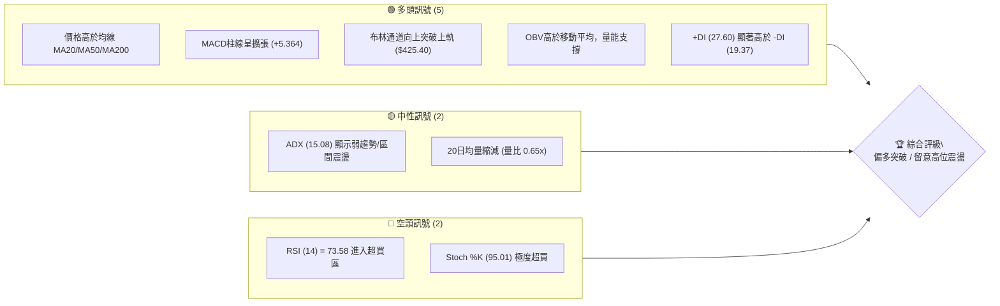
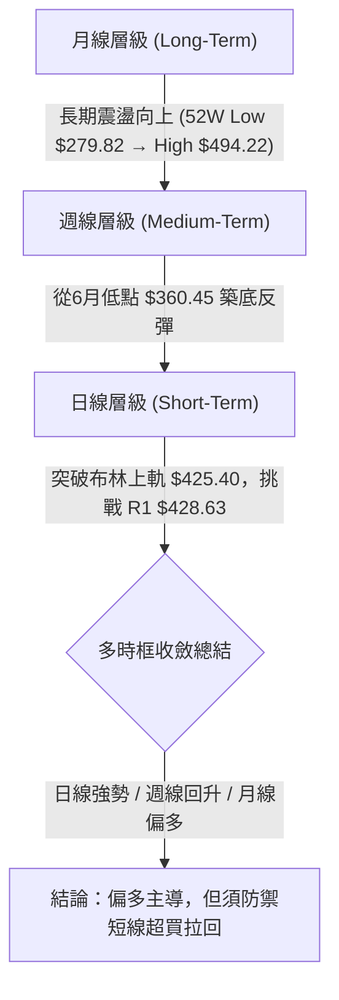
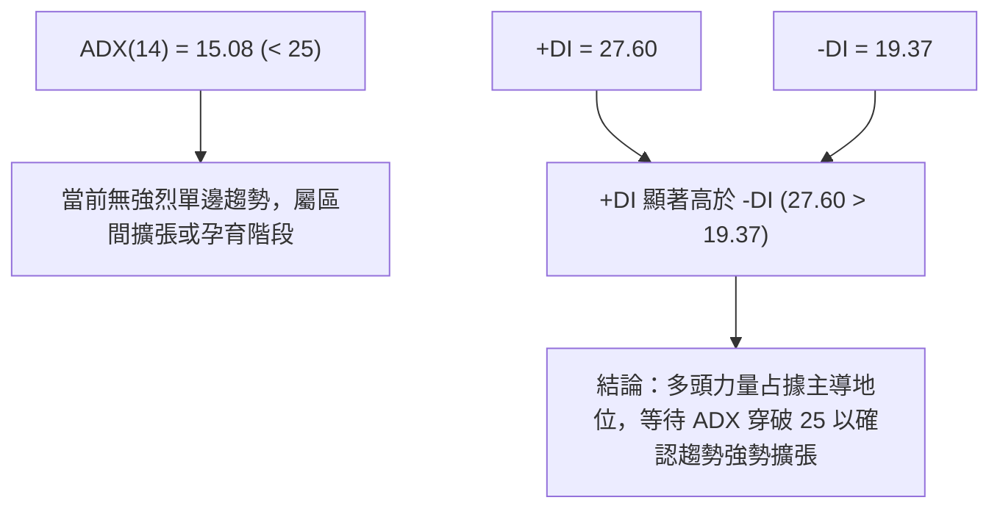
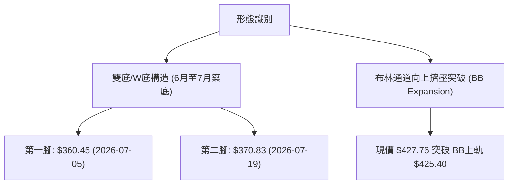
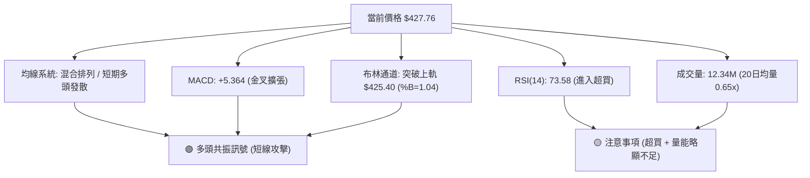
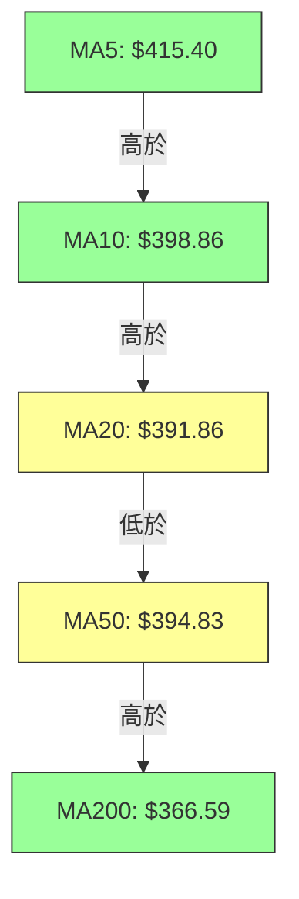
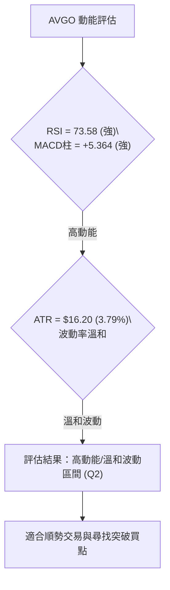
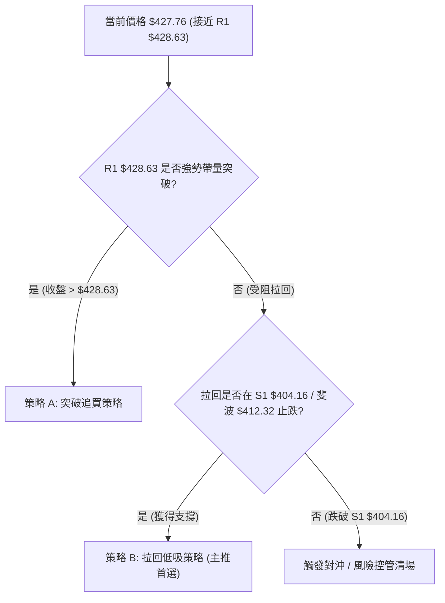
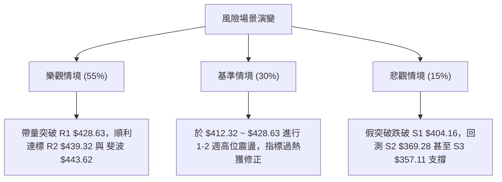

# AVGO 技術分析報告

> **報告日期**：2026-08-08 ｜ **語言**：繁體中文 ｜ **數據來源**：Yahoo Finance ｜ **當前價格**：$427.76

---

## 目錄

| 章節 | 內容 |
|------|------|
| [1. 技術面概覽](#1-技術面概覽) | 訊號儀表板、核心指標、評分卡 |
| [2. 趨勢分析](#2-趨勢分析) | 多時框趨勢、長中短期走勢 |
| [3. 圖表形態分析](#3-圖表形態分析) | 形態識別、K線組合、目標價 |
| [4. 支撐與阻力](#4-支撐與阻力) | 關鍵價位、斐波那契回調 |
| [5. 技術指標深度解讀](#5-技術指標深度解讀) | MA/RSI/MACD/布林/成交量 |
| [6. 動能與波動率](#6-動能與波動率) | 動能評估、ATR、Beta |
| [7. 多時框架總結](#7-多時框架總結) | 時框架評分矩陣 |
| [8. 交易策略建議](#8-交易策略建議) | 多空策略、風險報酬比 |
| [9. 風險提示與監控](#9-風險提示與監控) | 監控指標、風險場景 |

---

## 1. 技術面概覽

### 🎯 技術訊號儀表板



### 📊 核心指標速覽表

| 指標類別 | 指標名稱 | 當前數值 | 訊號 | 解讀 |
|----------|----------|----------|------|------|
| **價格** | 當前價格 | $427.76 | 🟢 看多 | 位於52週區間69.0%分位，短期強勢上攻 |
| **均線** | MA20 | $391.86 | 🟢 看多 | 價格高於MA20 (+9.16%)，提供短線防守支撐 |
| **均線** | MA50 | $394.83 | 🟢 看多 | 價格高於MA50 (+8.34%)，短中期均線向上支撐 |
| **均線** | MA200 | $366.59 | 🟢 看多 | 價格遠高於MA200 (+16.69%)，長期牛市基調明確 |
| **動能** | RSI(14) | 73.58 | 🔴 超買 | 指標進入超買區，無顯著背離但需警惕短線回吐 |
| **動能** | MACD | 7.606 | 🟢 看多 | MACD與Signal(2.242)呈金叉擴張，柱狀圖+5.364 |
| **動能** | Stoch %K | 95.01 | 🔴 超買 | 處於90以上的極高位超買區，短線可能高位鈍化 |
| **趨勢** | ADX(14) | 15.08 | 🟡 盤整 | 低於25，顯示當前為弱趨勢或處於區間擴張階段 |
| **通道** | 布林 %B | 1.04 | 🟢 突破 | 價格突破布林上軌 ($425.40)，展現強勢邊緣推升 |
| **波動** | ATR(14) | $16.20 | 🟡 中性 | 佔股價 3.79%，日間波動處於正常偏活躍區間 |

### 🏆 技術評分卡

```
╔══════════════════════════════════════════════════════════════╗
║              技術評分卡 — AVGO (2026-08-08)                  ║
╠══════════════════════════════════════════════════════════════╣
║ 趨勢強度      ████████████░░░░░░░░  60/100  🟡 中性 (ADX=15) ║
║ 動能指標      ████████████████░░░░  80/100  🟢 強勁 (MACD擴張)║
║ 支撐穩定度    ██████████████░░░░░░  70/100  🟢 良好 (有多層MA)║
║ 成交量配合    ██████████░░░░░░░░░░  50/100  🟡 一般 (量比 0.65x)║
║ 形態完整度    ██████████████░░░░░░  70/100  🟢 良好 (突破通道)║
║ 均線排列      ████████████░░░░░░░░  60/100  🟡 混合 (短強中疊)║
╠══════════════════════════════════════════════════════════════╣
║ 綜合評分      █████████████░░░░░░░  65/100  🟢 偏多突破行情  ║
╚══════════════════════════════════════════════════════════════╝
```

---

## 2. 趨勢分析

### 🌐 多時框趨勢分析



### 📈 長期趨勢 — 12個月走勢圖（Unicode）

```
AVGO 月線走勢圖（過去12個月：2025-09 至 2026-08）
價格軸 ($)
$494.22 ┤                                (52W High $494.22)
$450.00 ┤                                  ● 2026-05 ($446.06)
$427.76 ┤                                      ● 現在 ($427.76)
$400.00 ┤                    ● 2025-11 ($400.71)
$350.00 ┤        ● 2025-10 ($367.57)             ● 2026-06 ($377.75)
$300.00 ┤● 2025-09 ($328.07)   ● 2026-03 ($309.02)
$279.82 ┤                     (52W Low $279.82)
        └─┬───────┬───────┬───────┬───────┬───────┬───────┬───────
       09/25   11/25   01/26   03/26   04/26   05/26   06/26   08/26
```

**走勢特徵分析表格**：

| 時間階段 | 價格區間 | 漲跌特徵 | 關鍵技術事件 |
|----------|----------|----------|--------------|
| **2025-08 ~ 2025-11** | $295.23 → $400.71 | 強勁主升段 (+35.7%) | 創下階段新高，均線呈現多頭發散 |
| **2025-12 ~ 2026-03** | $344.83 → $309.02 | 深度回檔修正 (-22.8%) | 觸及 52 週低點區間（歷史低點 $279.82 附近探底） |
| **2026-04 ~ 2026-05** | $416.77 → $446.06 | 強烈V型反彈 (+44.3%) | 迅速收復所有短期均線，創下 $446.06 波段高點 |
| **2026-06 ~ 2026-07** | $377.75 → $389.28 | 二次洗盤築底 | 在 $360.45~$380.00 建立二次腳（S2/S3 支撐區） |
| **2026-08 (當前)** | $389.28 → $427.76 | 短線強勢發動 (+9.8%) | 站上 MA20/MA50，突破布林上軌，測試 R1 阻力 |

### 📊 中期趨勢（週線分析）

從近20週數據觀察，AVGO 在 2026 年 3 月底觸及 $300.20 低點（RSI 低至 23.6 超賣）後，展開了第一波強勁反彈至 5 月底的 $446.06。隨後經歷了 6 月至 7 月底的第二次整理（最低回測 2026-07-05 的 $360.45）。最新一週（2026-08-09 週期）股價自 $389.28 強勢拉升至 $427.76，RSI 回升至 73.6，MACD 柱狀圖由 +0.874 放大至 +5.364，顯示中期底部二次打腳已經完成，多頭重新發動攻勢。

### ⚡ 趨勢強度評估（ADX 解讀）



| ADX 區間 | 當前狀態 | 市場環境 | 交易策略對策 |
|----------|----------|----------|--------------|
| **0 - 20** | **15.08 (✓)** | **弱趨勢 / 盤整擴張** | **以區間阻力突破與震盪指標高拋低吸為主** |
| **20 - 25** | — | 趨勢孕育中 | 準備順勢突破策略 |
| **25 - 50** | — | 強勁單邊趨勢 | 持股續抱，拉回均線加碼 |
| **> 50** | — | 極端強烈趨勢 | 防範極端吹頂/拉回 |

---

## 3. 圖表形態分析

### 🔍 形態識別系統



**形態信心度與目標價評估**：

| 形態 | 信心度 | 判斷依據（引用數據） | 完成度 | 目標價（附計算式） |
|------|--------|----------------------|--------|--------------------|
| **雙底 (W-Bottom)** | **75%** | 兩次下探 $360.45 與 $370.83 均獲守住（靠近 S3 $357.11 與 S2 $369.28），頸線約在 $428.63 (R1) | **85%** | 頸線 $428.63 + 形態高度 ($428.63 - $360.45 = $68.18) = **$496.81** (近 52W High $494.22) |
| **布林通道上軌突破** | **80%** | 收盤價 $427.76 超過 BB 上軌 $425.40，%B 達 1.04 | **100%** | 第一阻力目標 R2 **$439.32**；第二目標 斐波 23.6% **$443.62** |
| **頭肩底 (逆頭肩)** | 40% | 數據不足以支撐完整肩部結構 | 20% | 訊號不足，僅做指標型解讀 |

### 🕯️ 重要K線形態分析

| 日期/週期 | 收盤價 | K線形態 | 解讀 | 訊號 |
|-----------|--------|---------|------|------|
| **2026-07-05 週** | $360.45 | 錘子線 / 探底長下影 | 股價下探 S3 $357.11 獲強勁買盤支撐，確認中段底部 | 🟢 看多 |
| **2026-07-19 週** | $370.83 | 二次測底小陽線 | 縮量測試 S2 $369.28 不破，完成次低點打腳 | 🟢 看多 |
| **2026-08-09 週** | $427.76 | 大陽線突破 | 一舉穿破 MA20 ($391.86) 與 MA50 ($394.83)，實體漲幅大 | 🟢 看多 |

### 📉 ASCII 走勢形態示意圖

```
AVGO 日線突破與W底構造示意圖
═════════════════════════════════════════════════════════
$443.62 ┤                                    [斐波 23.6%]
$439.32 ┤                                  ┌─ (R2 阻力區)
$428.63 ┤............................●.....├─ (R1 頸線/突破點) $428.63
$427.76 ┤                          ▲ (當前價 $427.76)
$425.40 ┤-------------------------●--------[BB 上軌突破] $425.40
$404.16 ┤                       /          [S1 支撐區]
$391.86 ┤                     /            [MA20 / BB中軌]
$370.83 ┤        ●           /             [第二腳]
$360.45 ┤─────────\─────────●──────────────[第一腳 W底構造]
═════════════════════════════════════════════════════════
```

### 🎯 形態目標價計算

根據雙底突破與布林通道擠壓擴張計算：
1. **短期目標價（突破測試）**：R2 **$439.32** (距離當前 +2.70%) 與 斐波 23.6% **$443.62** (距離當前 +3.71%)。
2. **中期形態測算目標價**：
   - 雙底頸線：R1 **$428.63**
   - 雙底基底：2026-07 低點 **$360.45**
   - 形態垂直高度：$428.63 - $360.45 = $68.18
   - 突破目標價：$428.63 + $68.18 = **$496.81**（與 52 週最高價 **$494.22** 極度接近，具備高度幾何技術共振）。

---

## 4. 支撐與阻力

### 🗺️ 關鍵價位分布圖（Unicode）

```
AVGO 價位結構分布圖
═══════════════════════════════════════════════════════════════
$494.22 ║████████████████████████████████████████║ 52W High / R3 強阻力
$443.62 ║████████████████████                    ║ 斐波 23.6% 回調位
$439.32 ║████████████████████████                ║ R2 阻力位
$428.63 ║████████████████████████████            ║ R1 阻力位 (波段頸線)
$427.76 ╠════════════════════════════════════════╣ ◄ 當前價格 ($427.76)
$412.32 ║▓▓▓▓▓▓▓▓▓▓▓▓▓▓▓▓▓▓▓▓                    ║ 斐波 38.2% 回調位
$404.16 ║▓▓▓▓▓▓▓▓▓▓▓▓▓▓▓▓▓▓▓▓▓▓▓▓▓▓▓▓            ║ S1 支撐位 (第一防線)
$391.86 ║▓▓▓▓▓▓▓▓▓▓▓▓▓▓▓▓▓▓                      ║ MA20 / BB中軌
$387.02 ║▓▓▓▓▓▓▓▓▓▓▓▓▓▓▓▓                        ║ 斐波 50.0% 回調位
$369.28 ║████████████████████████████████        ║ S2 支撐位 (雙底二次腳)
$357.11 ║████████████████████████████████████    ║ S3 強支撐 (近一年低點聚類)
═══════════════════════════════════════════════════════════════
```

### 🚧 阻力位分析表

| 阻力級別 | 精確價位 | 形成原因 | 突破難度 | 重要性 |
|----------|----------|----------|----------|--------|
| **R1** | **$428.63** | 近一年波段高點聚類 / 雙底頸線 | 🟡 中等 | 🟢 極高 (短線多空分水嶺，突破即開啟新一輪主升) |
| **R2** | **$439.32** | 近一年波段高點聚類 | 🟡 中等 | 🟡 中等 (前波 5 月高點反彈解套壓力區) |
| **R3** | **$494.22** | 52 週歷史高點 (52W High) | 🔴 極難 | 🟢 極高 (長線歷史高點，終極多頭目標) |

### 🛡️ 支撐位分析表

| 支撐級別 | 精確價位 | 形成原因 | 守住機率 | 重要性 |
|----------|----------|----------|----------|--------|
| **S1** | **$404.16** | 近一年波段低點聚類 / 靠近 MA10 ($398.86) | 🟢 高 | 🟢 高 (拉回首要防禦點，守住維持強勢姿態) |
| **S2** | **$369.28** | 近一年波段低點聚類 / 7月回測次低點 | 🟢 高 | 🟢 極高 (中期多頭防線，不可跌破) |
| **S3** | **$357.11** | 近一年波段低點聚類 / 接近布林下軌 ($358.32) | 🟢 極高 | 🔴 關鍵 (長期牛熊轉折點) |

### 📐 斐波那契回調位分析

基於 52 週區間 **$279.82 (100.0%) → $494.22 (0.0%)** 計算：

| 斐波那契層級 | 精確價位 | 現價相對位置與意義 |
|--------------|----------|-------------------|
| **0.0% (52W High)** | **$494.22** | 上方終極阻力 |
| **23.6%** | **$443.62** | 上方第一斐波阻力，與 R2 ($439.32) 形成共振阻力帶 |
| **當前價格** | **$427.76** | **位於 38.2% ($412.32) 與 23.6% ($443.62) 之間** |
| **38.2%** | **$412.32** | 下方第一斐波強支撐，跌破將下探 50% |
| **50.0%** | **$387.02** | 中線多空多數區域，靠近 MA20 ($391.86) |
| **61.8%** | **$361.72** | 黃金分割強支撐區，與 S3 ($357.11) 形成堅固底部 |
| **78.6%** | **$325.70** | 深縮修正位 |
| **100.0% (52W Low)** | **$279.82** | 52 週最低點 |

---

## 5. 技術指標深度解讀

### 🎛️ 指標訊號總覽



### 📈 移動平均線排列分析



- **短線均線 (MA5/MA10/MA20)**：呈現完美多頭排列 ($415.40 > $398.86 > $391.86)，推升股價直逼 R1 ($428.63)。
- **中長期均線 (MA50/MA200)**：MA50 ($394.83) 高於 MA200 ($366.59)，長線維持牛市架構；雖然 MA20 ($391.86) 目前略低於 MA50，但若股價維持在 $420 以上，MA20 將於數日內向上金叉 MA50，形成全均線多頭發散。

### 📉 RSI(14) 分析

- **當前數值**：**73.58**
  ```
  [0]─────────────[30]─────────────[50]─────────────[70]──[73.58]──[100]
                                                     ▲ 超買區
  ```
- **狀態**：進入 **🔴 超買區 (>70)**。
- **背離判斷**：檢視價格與 RSI 走勢，價格從 7 月底 $381.92 升至 $427.76，RSI 同步從 53.2 升至 73.58，**無明顯頂背離現象**。顯示買盤動能紮實，但超買指標意味著追高風險增加，短線不排除有拉回回測 $412.32 / $404.16 的技術性需求。

### 📊 MACD(12/26/9) 訊號解讀

- **DIF (MACD線)**：7.606
- **DEA (Signal線)**：2.242
- **MACD Histogram (柱線)**：**+5.364** (🟢 強烈看多)
- **解讀**：MACD 線已遠高於訊號線，且柱線由前週的 +0.874 急劇擴張至 +5.364，顯示多頭衝刺動能非常強勁，尚無收斂跡象，支持股價挑戰上檔阻力區。

### 📦 布林通道分析

```
布林通道現價位置示意圖
════════════════════════════════════════════════════════
$425.40 ┤ --------------------------------- BB 上軌
$427.76 ┤ ●◄ 當前價格 ($427.76, %B = 1.04)
$391.86 ┤ --------------------------------- BB 中軌 (MA20)
$358.32 ┤ --------------------------------- BB 下軌
════════════════════════════════════════════════════════
```

- **軌道位置**：上軌 **$425.40**，中軌 **$391.86**，下軌 **$358.32**。
- **%B 指標**：**1.04**，顯示價格已小幅穿出布林上軌。在強勢突破行情中，股價沿上軌外推（Band Riding）屬於典型的多頭攻擊形態，但若次日收盤回落至 $425.40 之下，則可能轉為通道內震盪。

### 💹 成交量分析（量價配合度）

- **最新成交量**：12,344,165
- **20日均量**：18,941,983 (量比：**0.65x**)
- **50日均量**：27,753,453
- **OBV 狀況**：OBV > MA，顯示整體資金流向仍為淨流入。
- **量價解讀**：雖然股價創近期新高突破 BB 上軌，但最新單日成交量僅為 20日均量的 65%，呈現「價漲量縮」現象。這表明賣壓相對輕盈（籌碼鎖定良好），但也警示若無後續增量買盤加入，突破 R1 ($428.63) 的持續力可能受到考驗。

---

## 6. 動能與波動率

### ⚡ 動能與波動率定位

| 象限區分 | 動能強度 (RSI/MACD) | 波動率水準 (ATR/BB) | 當前狀態評估 | 策略應用 |
|----------|--------------------|--------------------|--------------|----------|
| **Q1 (高動能/高波動)** | 強 | 高 | — | 順勢突破，寬止損 |
| **Q2 (高動能/中低波動)** | **強 (✓)** | **中 (✓)** | **AVGO 目前定位於此區** | **順勢做多，精確設定止損** |
| **Q3 (低動能/低波動)** | 弱 | 低 | — | 區間操作 / 靜待突破 |
| **Q4 (低動能/高波動)** | 弱 | 高 | — | 規避風險 / 空頭防守 |



### 📊 ATR 波動率分析

- **ATR (14)**：**$16.20** (佔股價 **3.79%**)
- **交易風控含義**：
  - **日內波幅預測**：每日正常合理波動範圍為 ±$16.20。
  - **動態止損距離設置**：
    - 短線緊密止損 (1.0x ATR)：現價 $427.76 - $16.20 = **$411.56**（接近 斐波 38.2% $412.32）。
    - 標準波段止損 (1.5x ATR)：現價 $427.76 - $24.30 = **$403.46**（保護在 S1 $404.16 附近）。
    - 寬鬆趨勢止損 (2.0x ATR)：現價 $427.76 - $32.40 = **$395.36**（保護在 MA20/MA50 區域）。

### 📐 Beta 與市場相關性

- **Beta 係數**：**1.473**
- **解讀**：AVGO 的波動性較大盤 (S&P 500) 高出約 47.3%，屬於典型的高貝塔半導體龍頭股。在大盤走多時具備強烈槓桿效應，但在市場整體修正時亦可能放大跌幅。

---

## 7. 多時框架總結

### 📋 時框架評分表

| 時框架 | 趨勢方向 | 動能 (RSI/MACD) | 均線排列 | 形態結構 | 綜合評分 | 交易建議 |
|--------|----------|-----------------|----------|----------|----------|----------|
| **日線 (Daily)** | 🟢 看多 | 🟢 強勁 (73.58) | 🟢 多頭 | 🟢 突破上軌 | **75/100** | 突破追價或拉回買進 |
| **週線 (Weekly)** | 🟢 轉強 | 🟢 改善 (+5.36) | 🟡 混合 | 🟢 雙底打腳完畢 | **70/100** | 偏多操作 |
| **月線 (Monthly)** | 🟢 長多 | 🟢 偏多 | 🟢 向上 | 🟡 高位大箱體 | **65/100** | 長線續抱 |

### 🔲 綜合訊號矩陣

```
╔══════════════════════════════════════════════════════════════╗
║                   多時框架訊號矩陣                           ║
╠══════════════╦══════════════╦══════════════╦═════════════════╣
║  時間框架    ║   趨勢方向   ║   動能狀態   ║    關鍵位狀態   ║
╠══════════════╬══════════════╬══════════════╬═════════════════╣
║  日線 (Short)║   🟢 多頭    ║  🔴 超買區   ║  挑戰 R1 $428.63║
║  週線 (Mid)  ║   🟢 多頭    ║  🟢 向上擴張 ║  站穩 S1 $404.16║
║  月線 (Long) ║   🟢 牛市    ║  🟢 中性偏多 ║  回測52W中高位  ║
╚══════════════╩══════════════╩══════════════╩═════════════════╝
```

### ⚖️ 多時框收斂結論

**多時框收斂判斷**：
1. **行情性質**：當前 ADX 為 **15.08 (< 25)**，依規則判定屬 **盤整/區間擴張行情**。
2. **主導時框與優先級**：在盤整/擴張行情下，以日線布林通道與關鍵阻力/支撐區間為主要交易基準，同時順應週線與月線的長多基調。
3. **一致性結論**：**偏多主導，聚焦 R1 ($428.63) 突破有效性**。日線雖呈現強勢突破布林上軌 ($425.40)，但因 RSI 達 73.58 且 ADX 尚未升破 25，直接追高的風險報酬比較差。優先策略為「等待突破 R1 確認後追價」或「等待技術性拉回 斐波 38.2% ($412.32) / S1 ($404.16) 尋求低吸買點」。此結論與第 8 章主推策略完全一致。

---

## 8. 交易策略建議

### 🗺️ 策略決策流程圖



### 🧭 策略路由

> **當前主策略方向 = 🟢 偏多多頭策略（依綜合評分 65/100）**
> 
> 由於綜合評分為 65/100（>60分），技術面由多頭主導，故本報告**主推多頭交易策略**（包含突破追買與拉回低吸）。空頭僅作為反轉風險觸發點與對沖參考，不推薦建立主力空單。

### 🎯 價格情境階梯（Price Scenarios）

| 觸發條件 | 第一目標 | 第二目標 | 情境含義 |
|----------|----------|----------|----------|
| **帶量突破阻力 R1 $428.63** | **R2 $439.32** | **斐波 23.6% $443.62** | **多頭主升段開啟，挑戰前高** |
| **於 $412.32 ~ $428.63 區間整理** | — | — | **高位消化超買指標，蓄勢再攻** |
| **跌破第一支撐 S1 $404.16** | **S2 $369.28** | **S3 $357.11** | **突破失敗，轉入中期深縮修正** |

### 📊 情境機率分佈

```
情境機率分佈評估
════════════════════════════════════════════════════════
1. 繼續上行 / 帶量突破 (55%) █████████████████████████░░░
2. 高位狹幅震盪消化   (30%) █████████████░░░░░░░░░░░░░░░
3. 假突破拉回探底     (15%) ███████░░░░░░░░░░░░░░░░░░░░░
════════════════════════════════════════════════════════
```

| 情境 | 機率 | 主要依據 |
|------|------|----------|
| **帶量突破 / 續漲** | **55%** | MACD 柱狀圖高位擴張 (+5.364)，+DI 遠高於 -DI，突破布林上軌。 |
| **高位區間震盪** | **30%** | ADX < 25 顯示趨勢強度尚弱，20日均量縮減 (量比 0.65x)，RSI 達 73.58 超買。 |
| **深縮拉回探底** | **15%** | 若受阻於 R1 $428.63 且美股整體半導體板塊出現利空獲利了結。 |

### 🟢 主策略詳情

| 策略要素 | 策略 A：突破追買 (Breakout Buy) | 策略 B：拉回低吸 (Pullback Buy - **首選**) |
|----------|----------------------------------|-------------------------------------------|
| **進場條件** | 日線收盤價強勢突破 R1 **$428.63** | 股價回測 斐波 38.2% **$412.32** 至 S1 **$404.16** 獲支撐 |
| **建議進場價** | **$429.00** | **$412.32** |
| **目標價 T1** | **$439.32** (R2 阻力區，+2.41%) | **$428.63** (R1 頸線區，+3.96%) |
| **目標價 T2** | **$443.62** (斐波 23.6%，+3.41%) | **$439.32** (R2 阻力區，+6.55%) |
| **止損價格** | **$419.00** (跌破布林上軌與均線) | **$399.00** (跌破 MA10 $398.86 與 S1 防線) |
| **風險金額** | $10.00 / 股 (-2.33%) | $13.32 / 股 (-3.23%) |
| **潛在報酬 (T2)** | $14.62 / 股 (+3.41%) | $27.00 / 股 (+6.55%) |
| **風險報酬比** | **1.46 : 1** | **2.03 : 1** |
| **預估成功率** | 50% | **65%** |
| **建議倉位** | 10% - 15% (輕倉試錯) | **20% - 25% (標準主力倉位)** |

### 🔴 反向風險觸發點（對沖提示）

若出現以下極端訊號，主推多頭策略失效，需全面執行風控：
1. **價格跌破 S1 $404.16** 且收盤在 MA20 ($391.86) 之下：多頭結構遭破壞，多單應立即停損出場。
2. **出現巨量長黑 K 線**：單日成交量高於 50日均量 (27.75M) 且跌幅 > 4%，為主力法人高位拋售訊號。

### ⭐ 整體訊號強度評星

```
做多訊號強度：★★██☆  (3.5/5 星 - 趨勢看多，但短線超買)
做空訊號強度：★☆☆☆☆  (1.0/5 星 - 順勢不作空)
整體可信度：  ████☆  (4.0/5 星 - 多時框方向共振度高)
```

---

## 9. 風險提示與監控

### ✅ 關鍵監控指標 Checklist

```
╔══════════════════════════════════════════════════════════════╗
║                   關鍵監控指標風控清單                       ║
╠══════════════════════════════════════════════════════════════╣
║ [ ] R1 $428.63 突破確認：觀察日收盤價是否穩定站在 $428.63 上  ║
║ [ ] 成交量回升：攻擊時單日成交量能否放大至 20M 以上 (突破均量)║
║ [ ] RSI 超買消化：觀察 RSI 是否能在高位鈍化或透過橫盤順利降溫 ║
║ [ ] 支撐守備：S1 $404.16 與 MA20 $391.86 是否提供有效支撐     ║
║ [ ] 市場 Beta 風險：監控半導體 ETF (SOXX) 與大盤整體波動風險   ║
╚══════════════════════════════════════════════════════════════╝
```

### ⚠️ 風險場景分析



### 🛡️ 風險管理重要提醒

1. **嚴格執行動態止損**：當前 ATR 為 **$16.20**，意味著單日股價發生 $15~$20 的波動極為常見。止損價位不可設得過緊（建議不小於 1.0x ATR），防止被噪音掃出場。
2. **倉位管理**：鑑於 RSI 處於 73.58 超買區且成交量比僅 0.65x，當前價位不宜一次性重倉追高。建議採取分批建倉策略（突破時試探性建倉 10%，拉回回測 $412.32 穩定後加碼 15%）。

---

## 📋 報告總結

```
AVGO 技術分析報告總結
════════════════════════════════════════════════════════
報告日期：2026-08-08
當前價格：$427.76
分析評級：🟢 偏多突破行情 (高位蓄勢)

關鍵結論：
├─ 長期趨勢：🟢 多頭牛市架構 (高於 MA200 $366.59)
├─ 中期趨勢：🟢 雙底打腳完成 (自 $360.45 反彈，MACD+5.364)
├─ 短期趨勢：🟢 強勢衝刺 (突破布林上軌 $425.40，測試 R1)
├─ 關鍵支撐：S1 $404.16 / 斐波38.2% $412.32 / MA20 $391.86
├─ 關鍵阻力：R1 $428.63 / R2 $439.32 / 52W High $494.22
└─ 分析師目標：均價 $527.88 (最高 $675.00)

最優策略組合：
1. 🥇 最佳機會 (首選)：策略 B - 等待技術性拉回 $412.32 逢低布局 (風報比 2.03:1)
2. 🥈 次選機會：策略 A - 帶量突破 R1 $428.63 後順勢追買 (風報比 1.46:1)
3. 🥉 保守選擇：等待 ADX 升破 25 且成交量放大回 20M 以上再進行佈局
════════════════════════════════════════════════════════
```

---

> ⚠️ **免責聲明**：本報告為 AI 自動生成之技術分析，所有數據及估算均基於提供的歷史價格資訊。本報告**僅供研究與學術參考**，**不構成任何投資建議**。投資有風險，入市需謹慎。

---

*報告生成時間：2026-08-08 ｜ 數據來源：Yahoo Finance ｜ 分析框架：多時框技術分析*