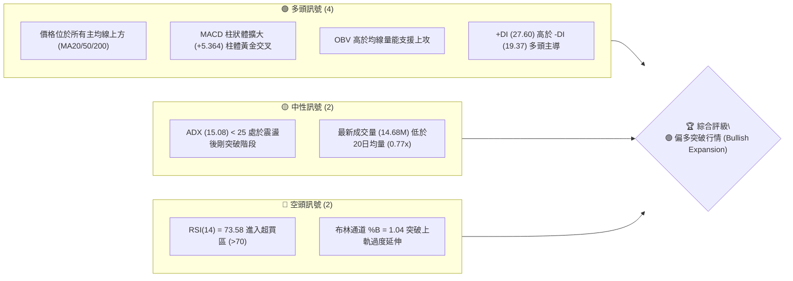
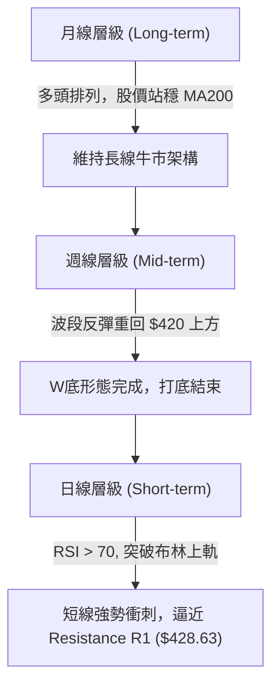
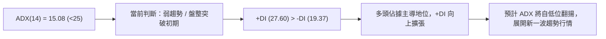
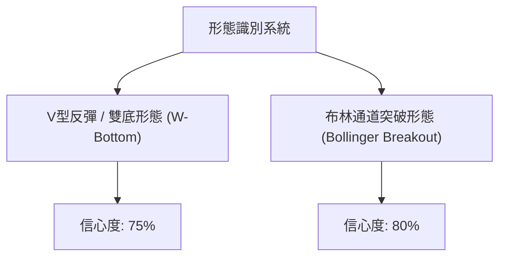
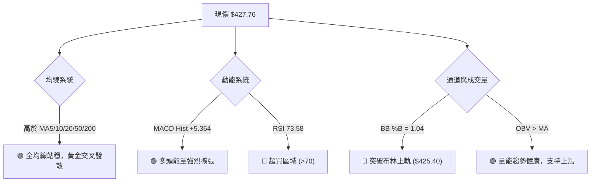
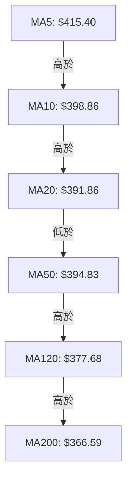
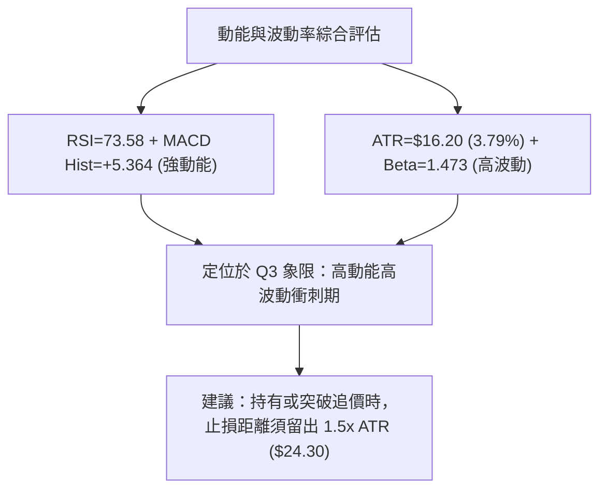
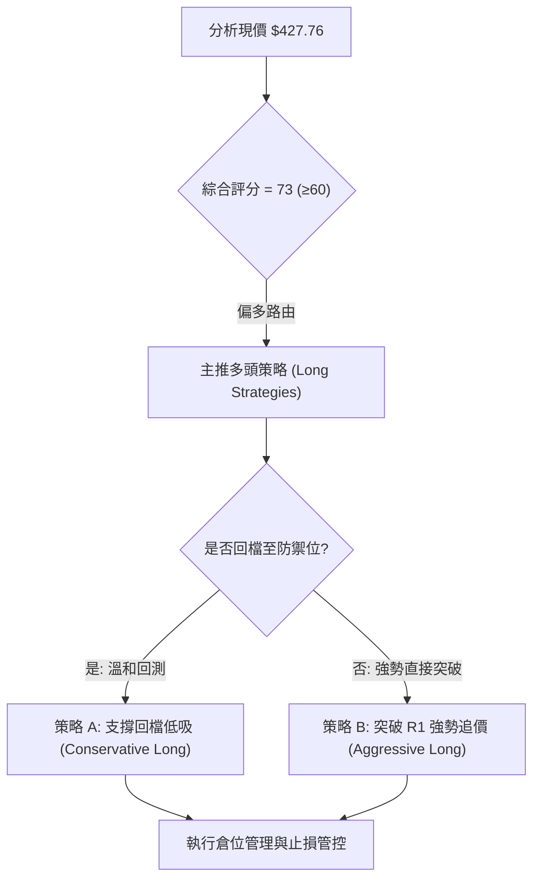
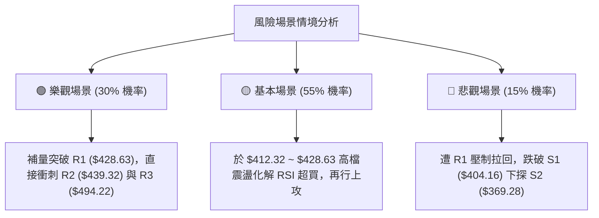

# AVGO 技術分析報告

> **報告日期**：2026-08-09 ｜ **語言**：繁體中文 ｜ **數據來源**：Yahoo Finance ｜ **當前價格**：$427.76

---

## 目錄

| 章節 | 內容 |
|------|------|
| [1. 技術面概覽](#1-技術面概覽) | 訊號儀表板、核心指標、評分卡 |
| [2. 趨勢分析](#2-趨勢分析) | 多時框趨勢、長中短期走勢 |
| [3. 圖表形態分析](#3-圖表形態分析) | 形態識別、K線組合、目標價 |
| [4. 支撐與阻力](#4-支撐與阻力) | 關鍵價位、斐波那契回調 |
| [5. 技術指標深度解讀](#5-技術指標深度解讀) | MA/RSI/MACD/布林/成交量 |
| [6. 動能與波動率](#6-動能與波動率) | 動能評估、ATR、Beta |
| [7. 多時框架總結](#7-多時框架總結) | 時框架評分矩陣 |
| [8. 交易策略建議](#8-交易策略建議) | 多空策略、風險報酬比 |
| [9. 風險提示與監控](#9-風險提示與監控) | 監控指標、風險場景 |

---

## 1. 技術面概覽

### 🎯 技術訊號儀表板



### 📊 核心指標速覽表

| 指標類別 | 指標名稱 | 當前數值 | 訊號 | 解讀 |
|----------|----------|----------|------|------|
| **價格** | 當前收盤價 | $427.76 | 🟢 看多 | 位於 52 週區間的高位 69.0% 處，向上逼近阻力位 R1 |
| **均線** | MA20 | $391.86 | 🟢 看多 | 現價位於 MA20 上方 (+9.16%)，短中期均線提供防守 |
| **均線** | MA50 | $394.83 | 🟢 看多 | 現價高於 MA50，且短期 MA5/10 已黃金交叉 MA50 |
| **均線** | MA200 | $366.59 | 🟢 看多 | 現價位於長線牛熊分界線上方 (+16.69%)，長線趨勢向上 |
| **動能** | RSI(14) | 73.58 | 🔴 警示 | 進入 >70 區域，極短線有過熱拉回風險，但動能極強 |
| **動能** | MACD(12,26,9) | +5.364 (Hist) | 🟢 看多 | MACD (7.606) 高於 Signal (2.242)，看多柱狀體顯著擴大 |
| **動能** | Stoch %K/%D | 94.98 / 89.88 | 🔴 警示 | KD 雙線均進入高檔 >80 鈍化區，短線呈現強勢極端 |
| **趨勢** | ADX(14) | 15.08 | 🟡 中性 | <25 顯示前段為區間整理，目前正試圖展開新一輪趨勢 |
| **波動** | ATR(14) | $16.20 | 🟡 中性 | 占股價 3.79%，日均波動適中，提供良好的止損設點參考 |
| **通道** | 布林通道 %B | 1.04 | 🟢/🔴 雙刃 | 突破上軌 $425.40，屬於強勢走勢，但也存在回測軌內需求 |

### 🏆 技術評分卡

```
╔══════════════════════════════════════════════════════════════════╗
║                技術評分卡 — AVGO (2026-08-09)                    ║
╠══════════════════════════════════════════════════════════════════╣
║ 趨勢強度 (ADX/均線)   ████████████░░░░░░░░  60/100  🟡 中性偏多    ║
║ 動能指標 (RSI/MACD)  ██████████████████░░  90/100  🟢 極強動能    ║
║ 支撐穩定度 (S1/S2/S3) ██████████████░░░░░░  70/100  🟢 穩定堅實    ║
║ 成交量配合 (OBV/量比) ████████████░░░░░░░░  60/100  🟡 稍顯不足    ║
║ 形態完整度 (V型/底型) ████████████████░░░░  80/100  🟢 突破完成    ║
║ 均線排列 (短中長期)   ████████████████░░░░  80/100  🟢 多頭占優    ║
╠══════════════════════════════════════════════════════════════════╣
║ 綜合技術評分          ███████████████░░░░░  73/100  🟢 偏多看好    ║
╚══════════════════════════════════════════════════════════════════╝
```

---

## 2. 趨勢分析

### 🌐 多時框趨勢分析



### 📈 長期趨勢 — 24個月走勢圖（Unicode）

```
AVGO 月線走勢歷史與當前位置（2024-08 至 2026-08）
價格軸 ($)
$494.22 ┤                                                 ●(52W High $494.22)
$446.06 ┤                                    ●       ●
$427.76 ┤                                    │   ●   │   ● (現價 $427.76)
$400.71 ┤                        ●           │  / \  │  /
$367.57 ┤                    ●   │   ●       │ /   \ │ /
$328.07 ┤                ●   │   │  / \      │/     \│/
$295.23 ┤●   ●           │   │   │/    ●     ●
$279.82 ┤    │   ●   ●   │   │   ●       ● (52W Low $279.82)
        └────┴───┴───┴───┴───┴───┴───┴───┴───┴───┴───┴───┴────► 月份
         24/08  10  12  25/02 04  06  08  10  12  26/02 04  06  08
```

#### 走勢特徵分析表格

| 階段 | 時間區間 | 收盤價變化 | 漲跌幅 | 關鍵形態與驅動因素 |
|------|----------|------------|--------|--------------------|
| **第一階段：初級推升** | 2024-08 ~ 2025-05 | $159.81 → $239.74 | +50.02% | 籌碼沉澱後展開多頭推升，站穩兩百美元大關 |
| **第二階段：主升段衝刺** | 2025-05 ~ 2025-11 | $239.74 → $400.71 | +67.14% | AI晶片需求強勁，創下當時歷史新高，成交量放大 |
| **第三階段：高檔中期拉回** | 2025-11 ~ 2026-03 | $400.71 → $309.02 | -22.88% | 漲多獲利回吐，於 2026 年 3 月落底（觸及波段低點聚類附近） |
| **第四階段：強勢V型復甦** | 2026-03 ~ 2026-05 | $309.02 → $446.06 | +44.35% | 強烈買盤介入，單月大漲衝破 $400 關卡 |
| **第五階段：二次回測與強攻**| 2026-05 ~ 2026-08 | $446.06 → $427.76 | -4.10% | 6月經歷波段回測至 $365.02 後迅速拉回，8月收盤強勢上攻至 $427.76 |

### 📊 中期趨勢（週線分析）

從近 20 週收盤走勢可看出，AVGO 經歷了顯著的雙重底部構造：
1. **左腳打底**：2026-03-29 收盤 $300.20（RSI 僅 23.6 極度超賣），隨後於 4 月底反彈至 $422.09。
2. **中期回檔**：2026-06 月底至 7 月初，股價下挫至 $360.45（2026-07-05 收盤），守住 critical support 區域。
3. **右腳確立與大陽線**：自 2026-07-19 的 $370.83 開始起漲，8 月初（2026-08-09 週）單週拉出大陽線至 $427.76，週 MACD 柱狀體跳升至 +5.364，確認右底完成並向上挑戰 Resistance R1 ($428.63)。

### ⚡ 趨勢強度評估（ADX 解讀）



*   **ADX 數值解析**：ADX 當前為 15.08，數值小於 25，說明過去數週股價經歷了 $360.45 - $422.09 的寬幅震盪整理，尚未形成單向高強度的連續趨勢。
*   **方向性指標（+DI/-DI）**：+DI (27.60) 遠高於 -DI (19.37)，且差距拉大，顯示買方力量已經重新奪回控制權。當 ADX 從低於 20 的位置開始向上拐頭，通常預示著**新的波段趨勢開始啟動**。

---

## 3. 圖表形態分析

### 🔍 形態識別系統



| 形態 | 信心度 | 判斷依據（引用數據） | 完成度 | 目標價（附計算式） |
|------|--------|----------------------|--------|--------------------|
| **雙底形態 (W-Bottom)** | 75% | 7月低點 $360.45 築出右腳，突破頸線區 $404.16（S1 轉化區） | 90% | 頸線 $404.16 + 形態高度 ($404.16 - $360.45 = $43.71) = **$447.87** (接近 Fib 23.6% $443.62 及 R2 $439.32) |
| **布林通道上軌突破** | 80% | 收盤價 $427.76 突破 BB 上軌 $425.40，%B 為 1.04 | 100% | 沿通道上軌推升，首要預期目標看至 R2 **$439.32** |

### 🕯️ 重要K線形態分析

| 日期/週別 | 收盤價 | K線形態 | 解讀 | 訊號 |
|-----------|--------|---------|------|------|
| 2026-07-05 | $360.45 | 探底止跌小錘子線 | 於 S3 ($357.11) 附近取得強烈支撐，多頭展現守勢 | 🟢 轉向訊號 |
| 2026-07-12 | $399.97 | 長紅吞噬大陽線 | 一舉吞噬前一週陰線，MACD 柱狀體翻正 (+3.502) | 🟢 強烈買訊 |
| 2026-08-09 | $427.76 | 突破型光腳大陽線 | 單週漲幅顯著，收在全週最高點附近，一舉越過 $420 | 🟢 多頭續強 |

### 📉 ASCII 走勢形態示意圖

```
AVGO 日/週線 W 底與突破形態示意圖
===================================================================
$439.32 ┤                                           [目標 R2/Fib 23.6%]
$428.63 ┤..........................................● (阻力突破點 R1 $428.63)
$427.76 ┤                                         / (現價 $427.76)
$404.16 ┤---------------● (頸線位 S1)------------/ 
        ┤              / \                     /
$370.83 ┤             /   \     ● (右腳 $370.83)
$360.45 ┤   ● (左腳 $360.45)\__/
===================================================================
```

### 🎯 形態目標價計算

1. **雙底形態測量目標**：
   - 頸線位置 (Neckline)：$404.16 (S1)
   - 底部最低點 (Bottom)：$360.45 (2026-07-05 低點聚類)
   - 垂直高度 (Height) = $404.16 - $360.45 = **$43.71**
   - 測量目標價 = 頸線 $404.16 + 高度 $43.71 = **$447.87** （此目標與 斐波那契 23.6% 回調位 **$443.62** 極度接近，形成共振目標區）。

---

## 4. 支撐與阻力

### 🗺️ 關鍵價位分布圖（Unicode）

```
AVGO 價位結構與關鍵密積區分布圖
═══════════════════════════════════════════════════════════════════
$494.22 ║████████████████████████████████████████║ 52W High / R3 歷史頂部
$443.62 ║██████████████████                      ║ 斐波那契 23.6% 重合區
$439.32 ║██████████████████████                  ║ 中期波段高點 R2
$428.63 ║██████████████████████████              ║ 阻力 R1 (當前考驗中)
$427.76 ╠════════════════════════════════════════╣ ◄ 現價 ($427.76)
$412.32 ║▓▓▓▓▓▓▓▓▓▓▓▓▓▓▓▓▓▓▓▓                    ║ 斐波那契 38.2% 防禦區
$404.16 ║▓▓▓▓▓▓▓▓▓▓▓▓▓▓▓▓▓▓▓▓▓▓▓▓▓▓▓▓            ║ 關鍵支撐 S1 (前頸線轉化區)
$387.02 ║▓▓▓▓▓▓▓▓▓▓▓▓▓▓                          ║ 斐波那契 50.0% / MA20
$369.28 ║████████████████████████████            ║ 強支撐 S2 (波段低點聚類)
$357.11 ║████████████████████████████████        ║ 堅固底座 S3 / 布林下軌
═══════════════════════════════════════════════════════════════════
```

### 🚧 阻力位分析表

| 阻力級別 | 精確價位 | 形成原因 | 突破難度 | 重要性 |
|----------|----------|----------|----------|--------|
| **阻力 R1** | **$428.63** | 近一年波段高點聚類，目前僅距現價 +0.20% | 🟡 中等 | 極短線臨門一腳，突破則開啟向上擴張空間 |
| **阻力 R2** | **$439.32** | 近一年波段次高點，高點賣壓區 (+2.70%) | 🔴 較高 | 靠近 Fib 23.6% ($443.62)，多頭中期強弱分水嶺 |
| **阻力 R3** | **$494.22** | 52週最高價 (52W High)，歷史高點 (+15.54%) | 🔴 極高 | 終極多頭目標，解套與獲利賣壓重鎮 |

### 🛡️ 支撐位分析表

| 支撐級別 | 精確價位 | 形成原因 | 守住機率 | 重要性 |
|----------|----------|----------|----------|--------|
| **支撐 S1** | **$404.16** | 近一年波段低點聚類轉化位/原頸線 (-5.52%) | 🟢 高 | 短線多頭最強支撐，不破則多頭結構完好 |
| **支撐 S2** | **$369.28** | 近一年波段低點聚類/MA200 ($366.59) 鄰近區 (-13.67%)| 🟢 極高 | 中期生命線，多空分界核心 |
| **支撐 S3** | **$357.11** | 近一年波段低點聚類/布林下軌 ($358.32) (-16.52%) | 🟢 極高 | 強烈築底防線，跌破則整體結構惡化 |

### 📐 斐波那契回調位分析

基於 52 週波段區間（高點 **$494.22** → 低點 **$279.82**），計算之精確回調位如下：

| 斐波那契比例 | 精確價位 | 與現價 ($427.76) 接觸與技術解讀 |
|--------------|----------|----------------------------------|
| **0.0% (52W High)** | **$494.22** | 52週高點，波段起跌點 |
| **23.6%** | **$443.62** | 當前上方主要斐波那契壓力，與 R2 ($439.32) 形成壓力帶 |
| **38.2%** | **$412.32** | **現價所處位置上方/防禦下方**，為重要回檔支撐位 |
| **50.0%** | **$387.02** | 中樞位，接近 MA20 ($391.86) 與 MA50 ($394.83) |
| **61.8%** | **$361.72** | 黃金分割支撐位，與 S2/S3 及 MA200 ($366.59) 形成強共振 |
| **78.6%** | **$325.70** | 深勢回檔防禦位 |
| **100.0% (52W Low)**| **$279.82** | 52週最低點，波段起漲點 |

👉 **現價定位解析**：現價 **$427.76** 成功突破了 38.2% 回調位 (**$412.32**)，目前運行於 **38.2% ($412.32)** 至 **23.6% ($443.62)** 的上升通道區間內，整體架構偏向多頭強勢回升。

---

## 5. 技術指標深度解讀

### 🎛️ 指標訊號總覽



### 📈 移動平均線排列分析



*   **短期均線**：MA5 ($415.40) > MA10 ($398.86) > MA20 ($391.86)，呈現完美的多頭攻擊排列，反映近 1-2 週買盤極強。
*   **中長期均線**：MA20 ($391.86) 目前略低於 MA50 ($394.83)，但以當前股價 $427.76 遠高於 MA50 的推升速度，MA20 將在短期內向上金叉 MA50，完成全均線順向多頭排列。
*   **牛熊分界**：價格高於 MA200 ($366.59) 達 16.69%，且 MA200 保持向上上行趨勢，中長期技術面屬於標準牛市格局。

### 📉 RSI(14) 分析

*   **當前數值**：**73.58**
*   **進度條狀態**：`████████████████████████████████████████░░░░░░░░░░` (73.58%)
*   **超買區間解讀**：RSI 突破 70 門檻進入「超買區」，這代表短期強勢攻擊，但也意味著急漲後隨時可能出現指標修復型的技術性回檔。
*   **背離檢測**：比對近期價格走勢與 RSI，**未發現明顯頂背離**（價格創近期新高，RSI 亦同步回升創高），顯示當前上漲動能真實且未見竭盡訊號。

### 📊 MACD(12/26/9) 訊號解讀

*   **MACD 快線**：+7.606
*   **Signal 慢線**：+2.242
*   **MACD 柱狀體 (Histogram)**：**+5.364** (🟢 顯著多頭擴張)
*   **交叉分析**：MACD 快線在零軸上方大幅拉開與慢線的距離，柱狀體連續多天擴大（從 7 月底的 +0.874 快速激增至 +5.364），為強烈的正向動能訊號。

### 📦 布林通道分析

```
AVGO 布林通道走勢結構示意圖
===================================================================
$425.40 ┤-------------------------------------- Upper Band (上軌)
$427.76 ┤  ● (現價突破上軌，%B = 1.04)
$391.86 ┤-------------------------------------- Middle Band (中軌 MA20)
$358.32 ┤-------------------------------------- Lower Band (下軌)
===================================================================
```

*   **上軌**：$425.40 ｜ **中軌 (MA20)**：$391.86 ｜ **下軌**：$358.32
*   **通道寬度與突破**：%B 為 **1.04**，股價已略為溢出布林通道上軌。技術上，沿著上軌打開的「布林帶擠壓後突破（Bollinger Band Expansion）」屬於極強攻勢，只要不迅速跌破上軌，股價將持續沿上軌推升。

### 💹 成交量分析（量價配合度）

*   **成交量現況**：最新成交量 14,680,000，相當於 20日均量 (19,058,775) 的 **0.77x**。
*   **OBV 能量潮**：數據顯示 **OBV > MA**，量能線高於其移動平均線，這意味著中期累積的籌碼結構屬於淨流入狀態（Accumulation）。
*   **量價背離提示**：雖然價格強勢突破 $420，但成交量較 50日均量 (27.80M) 縮減。若欲進一步帶量突破阻力 R1 ($428.63) 與 R2 ($439.32)，必須見到日成交量回升至 20M 以上的補量確認。

---

## 6. 動能與波動率

### ⚡ 動能評估四象限

| 象限區塊 | 動能強度 | 波動率水準 | AVGO 當前定位 | 操作思維 |
|----------|----------|------------|---------------|----------|
| **象限一 (Q1)** | 強動能 (High) | 低波動 (Low) | — | 最佳趨勢抱牢區 |
| **象限二 (Q2)** | 弱動能 (Low) | 低波動 (Low) | — | 沉悶盤整觀望 |
| **象限三 (Q3)** | **強動能 (High)** | **高波動 (High)** | **✓ [當前位置]** | **急漲衝刺段，順勢操作但需嚴格設止損** |
| **象限四 (Q4)** | 弱動能 (Low) | 高波動 (High) | — | 高風險避開區 |



### 📊 ATR 波動率分析

*   **ATR(14) 數值**：**$16.20**（占當前股價 3.79%）。
*   **波動率解讀**：每日平均高低價差達 $16.20，屬於科技半導體股中偏高波幅標的。
*   **止損距離建議**：
    *   **短線交易止損距離 (1.0x ATR)**：$16.20
    *   **波段交易止損距離 (1.5x ATR)**：$24.30
    *   以現價 $427.76 計算，波段止損參考點約在 $427.76 - $24.30 = **$403.46**（與支撐 S1 **$404.16** 極度吻合）。

### 📐 Beta 與市場相關性

*   **Beta 係數**：**1.473**
*   **解讀**：AVGO 的波動敏感度高於大盤（S&P 500）近 47%。在大盤上漲時，AVGO 往往具有更高的彈性與超額收益（Alpha）；相對地，若大盤面臨拉回，AVGO 亦承受較大的波動風險。

---

## 7. 多時框架總結

### 📋 時框架評分表

| 時框架 | 趨勢方向 | 動能狀態 | 均線排列 | 形態結構 | 綜合評分 | 建議方向 |
|--------|----------|----------|----------|----------|----------|----------|
| **月線 (Monthly)** | 🟢 多頭 | 🟢 偏強 | 🟢 均線多頭 | 長線上升通道 | **85/100** | 長線看多，逢低偏多布局 |
| **週線 (Weekly)** | 🟢 多頭 | 🟢 金叉擴張 | 🟢 站穩 MA20/50 | W底右腳完成 | **78/100** | 中線偏多，防守區 $404.16 |
| **日線 (Daily)** | 🟢 強勢 | 🔴 超買高檔 | 🟢 短期多頭發散 | 布林突破衝刺 | **70/100** | 短線偏多但注意高檔拉回 |

### 🔲 綜合訊號矩陣

```
╔══════════════════════════════════════════════════════════════════╗
║                   AVGO 多時框架訊號矩陣                          ║
╠══════════════════╦══════════════╦══════════════╦═════════════════╣
║ 維度             ║ 日線 (Short) ║ 週線 (Medium)║ 月線 (Long)     ║
╠══════════════════╬══════════════╬══════════════╬═════════════════╣
║ 趨勢方向 (Trend) ║  🟢 向上衝刺 ║  🟢 築底完成 ║  🟢 長多排列    ║
║ 動能指標 (Diver) ║  🔴 過熱超買 ║  🟢 正向擴張 ║  🟢 強勁向上    ║
║ 支撐防禦 (Supp)  ║  $404.16(S1) ║  $369.28(S2) ║  $357.11(S3)    ║
║ 訊號一致性       ║  90% 一致偏多 (僅日線 RSI 超買形成短線干擾)     ║
╚══════════════════╩══════════════╩══════════════╩═════════════════╝
```

### ⚖️ 多時框收斂結論

1. **行情性質判斷**：ADX(14) 目前為 15.08 (<25)，顯示過去數週屬於大箱體盤整。但日線 +DI 大幅向上、MACD 柱狀體強勢 (+5.364) 且突破布林上軌，表明**股價正處於自盤整進入新一輪趨勢擴張的轉折點**。
2. **多時框優先級**：依多時框規則，中長期（週線/月線）均處於多頭控制下，且價格完全站穩 MA200 ($366.59)。日線的超買 (RSI 73.58) 僅代表短線過熱，不改變中長期向上尋找阻力位 R2 ($439.32) 與 R3 ($494.22) 的趨勢。
3. **唯一最終結論**：**整體趨勢明確偏多（綜合評分 73/100）**。策略應以「主推多頭策略」為主，逢回測關鍵支撐或突破阻力時進場。

---

## 8. 交易策略建議

### 🗺️ 策略決策流程圖



### 🧭 策略路由

**當前主策略方向 = 🟢 強勢偏多 (依技術綜合評分 73/100)**

由於綜合評分高於 60 分，且多時框訊號一致偏多，本報告**主推多頭策略**。空頭僅做為「風險反轉觸發點」之對沖監控參考，不提供主動做空策略。

### 🎯 價格情境階梯（Price Scenarios）

| 觸發條件 | 下一目標 | 後續延伸目標 | 情境含義 |
|----------|----------|--------------|----------|
| **突破阻力 R1 $428.63** | **阻力 R2 $439.32** | **斐波 23.6% $443.62 / R3 $494.22** | 短線擴張行情啟動，波段目標開啟 |
| **於 $412.32 ~ $428.63 震盪** | **支撐 S1 $404.16** | — | 高檔換手蓄勢，指標進行超買修復 |
| **跌破支撐 S1 $404.16** | **支撐 S2 $369.28** | **支撐 S3 $357.11** | 多頭攻勢暫告挫敗，回測中期生命線 |

### 📊 情境機率分佈

| 情境名稱 | 機率 | 主要依據 |
|----------|------|----------|
| **情境一：強勢突破 / 向上推升** | **55%** | MACD 柱狀體劇烈擴大 (+5.364)、OBV > MA，且多頭均線交叉推升 |
| **情境二：高檔震盪整理** | **30%** | ADX < 25 且 RSI (73.58) 處於超買，短線需要換手 digested 賣壓 |
| **情境三：深幅拉回回測** | **15%** | 目前成交量未放大至 20M 以上，若大盤拉回可能回測 S1 $404.16 |

### 🟢 主策略詳情

#### 策略 A：支撐回檔低吸策略（Conservative Long — 保守型）

*   **進場條件**：股價技術性拉回至斐波那契 38.2% 回調位 ($412.32) 至支撐 S1 ($404.16) 區域獲得支撐止跌時分批布局。
*   **進場價格**：**$412.32**（斐波那契 38.2% 關鍵位）
*   **目標價 T1**：**$439.32**（阻力 R2，預估獲利 +6.55%）
*   **目標價 T2**：**$494.22**（阻力 R3 / 52週高點，預估獲利 +19.86%）
*   **止損價格**：**$391.86**（跌破 MA20 中軌，預估虧損 -4.96%）
*   **風險報酬比 (R/R Ratio)**：
    *   到達 T1 之風報比：($439.32 - $412.32) / ($412.32 - $391.86) = $27.00 / $20.46 = **1.32 : 1**
    *   到達 T2 之風報比：($494.22 - $412.32) / ($412.32 - $391.86) = $81.90 / $20.46 = **4.00 : 1**
*   **勝率預估**：65%
*   **建議倉位**：15% - 20% 總資金

#### 策略 B：突破 R1 強勢追價策略（Aggressive Long — 積極型）

*   **進場條件**：日線收盤價強勢突破阻力 R1 ($428.63)，且單日成交量放大超過 20M 增量確認。
*   **進場價格**：**$428.63**（突破阻力 R1 時）
*   **目標價 T1**：**$443.62**（斐波那契 23.6% 回調位，預估獲利 +3.50%）
*   **目標價 T2**：**$494.22**（阻力 R3 / 52週高點，預估獲利 +15.30%）
*   **止損價格**：**$404.16**（跌回關鍵支撐 S1 頸線下方，預估虧損 -5.71%）
*   **風險報酬比 (R/R Ratio)**：
    *   到達 T2 之風報比：($494.22 - $428.63) / ($428.63 - $404.16) = $65.59 / $24.47 = **2.68 : 1**
*   **勝率預估**：55%
*   **建議倉位**：10% - 15% 總資金

### 🔴 反向風險觸發點（對沖提示）

若發生極端不利事件導致日線收盤價**跌破支撐 S1 $404.16**，多頭短線結構即告失控；若進一步**跌破 S2 $369.28**（跌破 MA200 牛熊線），則原先之多頭架構完全失效，多頭部位應即刻停損觀望。

### ⭐ 整體訊號強度評星

```
做多訊號強度： ★★★★☆  (4/5 星) — 均線與 MACD 多頭發散，僅受限於 RSI 超買
做空訊號強度： ★☆☆☆☆  (1/5 星) — 缺乏頂背離或轉空形態，逆勢做空風險極高
整體可信度：   ★★★★☆  (4/5 星) — 多時框指標一致性高，數據結構完整
```

---

## 9. 風險提示與監控

### ✅ 關鍵監控指標 Checklist

```
╔══════════════════════════════════════════════════════════════════╗
║                   關鍵技術點位監控 Check List                     ║
╠══════════════════════════════════════════════════════════════════╣
║ [ ] 每日收盤是否站穩 Resistance R1 ($428.63)                      ║
║ [ ] 成交量是否回升至 20日均量 (19.06M) 以上                     ║
║ [ ] RSI(14) 是否跌破 70 產生高檔拉回訊號                          ║
║ [ ] MACD 柱狀體 (+5.364) 是否出現縮頭                              ║
║ [ ] 關鍵防守位 S1 ($404.16) 是否遭到告急回測                      ║
╚══════════════════════════════════════════════════════════════════╝
```

### ⚠️ 風險場景分析



### 🛡️ 風險管理重要提醒

1. **ATR 止損落實**：考慮到 AVGO 的 ATR 為 **$16.20**（日波動 3.79%），進場交易時切忌將止損設定過窄（建議至少保留 1.0x - 1.5x ATR 空間），以避免被正常日內噪音掃出場。
2. **獲利分批落袋**：當股價推升至 Resistance R2 (**$439.32**) 及 斐波那契 23.6% (**$443.62**) 壓力帶時，建議至少減碼 30%-50% 鎖定勝果，剩餘部位移動止損至進場點。
3. **Beta 槓桿效應**：AVGO Beta 為 1.473，若整體美股大盤（如科技股 QQQ / 費半 SOXX）出現大幅拉回，AVGO 的修正幅度可能放大，需同步關注宏觀半導體板塊走勢。

---

## 📋 報告總結

```
╔══════════════════════════════════════════════════════════════════╗
║                    AVGO 技術分析報告總結                          ║
════════════════════════════════════════════════════════════════════
報告日期：2026-08-09
當前價格：$427.76
分析評級：🟢 偏多突破行情 (Bullish Expansion)

關鍵結論：
├─ 長期趨勢：🟢 看多 (位於 MA200 $366.59 上方，長線牛市結構完好)
├─ 中期趨勢：🟢 看多 (週線 W 底完成，MACD 柱狀體強勢擴大)
├─ 短期趨勢：🟢/🔴 強勢超買 (突破布林上軌 $425.40，RSI 73.58 處於高檔)
├─ 關鍵支撐：S1 $404.16 ｜ S2 $369.28 ｜ S3 $357.11
├─ 關鍵阻力：R1 $428.63 ｜ R2 $439.32 ｜ R3 $494.22
└─ 分析師目標價：平均 $527.88 (最高 $675.00 / 最低 $215.88)

最優策略組合：
1. 🥇 首選策略 (保守型)：待拉回至 斐波 38.2% ($412.32) 布局做多，止損 $391.86，目標 $439.32/$494.22
2. 🥈 備選策略 (積極型)：帶量突破 R1 ($428.63) 追價做多，止損 $404.16，目標 $494.22
════════════════════════════════════════════════════════════════════
```

---

> ⚠️ **免責聲明**：本報告為 AI 自動生成之技術分析，所有數據及估算均基於提供的歷史價格資訊。本報告**僅供研究與學術參考**，**不構成任何投資建議**。投資有風險，入市需謹慎。

---

*報告生成時間：2026-08-09 ｜ 數據來源：Yahoo Finance ｜ 分析框架：多時框技術分析*