# AVGO 技術分析報告

> **報告日期**：2026-08-11 ｜ **語言**：繁體中文 ｜ **數據來源**：Yahoo Finance ｜ **當前價格**：$422.40

---

## 目錄

| 章節 | 內容 |
|------|------|
| [1. 技術面概覽](#1-技術面概覽) | 訊號儀表板、核心指標、評分卡 |
| [2. 趨勢分析](#2-趨勢分析) | 多時框趨勢、長中短期走勢 |
| [3. 圖表形態分析](#3-圖表形態分析) | 形態識別、K線組合、目標價 |
| [4. 支撐與阻力](#4-支撐與阻力) | 關鍵價位、斐波那契回調 |
| [5. 技術指標深度解讀](#5-技術指標深度解讀) | MA/RSI/MACD/布林/成交量 |
| [6. 動能與波動率](#6-動能與波動率) | 動能評估、ATR、Beta |
| [7. 多時框架總結](#7-多時框架總結) | 時框架評分矩陣 |
| [8. 交易策略建議](#8-交易策略建議) | 多空策略、風險報酬比 |
| [9. 風險提示與監控](#9-風險提示與監控) | 監控指標、風險場景 |

---

## 1. 技術面概覽

### 🎯 技術訊號儀表板

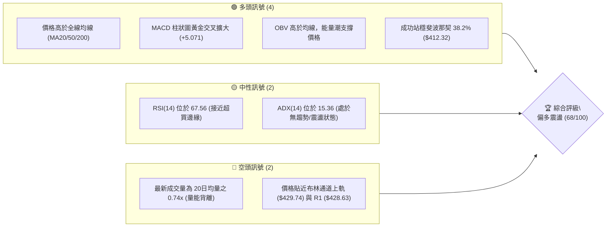

### 📊 核心指標速覽表

| 指標類別 | 指標名稱 | 當前數值 | 訊號 | 解讀 |
|----------|----------|----------|------|------|
| **價格** | 當前收盤價 | $422.40 | 🟢 看多 | 位於 52週區間 ($279.82 - $494.22) 之 66.5% 高位 |
| **均線** | MA20 (月線) | $393.78 | 🟢 看多 | 價格高於 MA20 +7.27%，呈現短中期多頭支撐 |
| **均線** | MA50 (季線) | $394.76 | 🟢 看多 | 價格高於 MA50 +7.00%，短中期均線黃金交叉 |
| **均線** | MA200 (半年線) | $367.00 | 🟢 看多 | 價格高於 MA200 +15.10%，長期牛市基調未變 |
| **動能** | RSI(14) | 67.56 | 🟡 中性偏多 | 未出現頂背離，但逼近 70 超買警戒線 |
| **動能** | MACD (12,26,9) | 8.580 / Hist +5.071 | 🟢 看多 | MACD 與 Signal 零軸上方擴張，多頭動能強勁 |
| **動能** | Stoch %K / %D | 83.66 / 88.63 | 🔴 短期超買 | 隨機指標進入 >80 高位區，警惕短線回檔 |
| **趨勢** | ADX(14) | 15.36 (+DI: 26.91) | 🟡 震盪整理 | ADX < 25 指示非單邊強趨勢，以區間/波段看待 |
| **波動** | ATR(14) | $16.22 (3.84%) | 🟡 中等波動 | 日均波動區間為 $16.22，操作需保留適當止損空間 |
| **通道** | 布林通道 (%B) | $429.74 / %B: 0.90 | 🟡 上軌壓制 | 價格貼近 BB 上軌，短線具備上軌壓制壓力 |
| **量能** | 20日量比 | 0.74x (13.76M) | 🔴 量縮拉升 | 成交量低於均量，突破需後續滾動量能確認 |

### 🏆 技術評分卡

```
╔══════════════════════════════════════════════════════════════════╗
║                   AVGO 技術綜合評分卡 (2026-08-11)               ║
╠══════════════════════════════════════════════════════════════════╣
║ 趨勢方向 (Trend)     ▓▓▓▓▓▓▓▓▓▓▓▓▓▓░░░░░░  70/100  🟢 偏多向上   ║
║ 動能強度 (Momentum)  ▓▓▓▓▓▓▓▓▓▓▓▓▓▓▓▓░░░░  80/100  🟢 動能充沛   ║
║ 支撐穩定度 (Support) ▓▓▓▓▓▓▓▓▓▓▓▓▓▓░░░░░░  72/100  🟢 結構穩固   ║
║ 成交量配合 (Volume)  ▓▓▓▓▓▓▓▓▓▓░░░░░░░░░░  50/100  🟡 量能背離   ║
║ 形態完整度 (Pattern) ▓▓▓▓▓▓▓▓▓▓▓▓░░░░░░░░  60/100  🟡 區間打底   ║
║ 均線結構 (MA Setup)  ▓▓▓▓▓▓▓▓▓▓▓▓▓▓░░░░░░  72/100  🟢 全線呈多   ║
╠══════════════════════════════════════════════════════════════════╣
║ 綜合技術評分         ▓▓▓▓▓▓▓▓▓▓▓▓▓▓░░░░░░  68.0/100  🟢 偏多震盪 ║
╚══════════════════════════════════════════════════════════════════╝
```

---

## 2. 趨勢分析

### 🌐 多時框趨勢分析

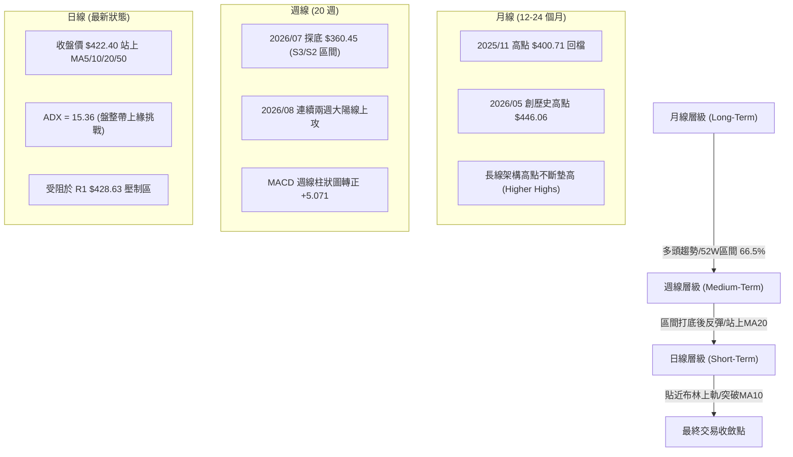

### 📈 長期趨勢 — 12個月走勢圖（Unicode）

```
AVGO 月線走勢圖 (2025-09 至 2026-08)
價格軸 ($)
$450 ┤                                      ● (05月 $446.06)
$420 ┤                                                  ● (08月 $422.40)
$390 ┤                        ● (11月 $400.71)      ● (07月 $389.28)
$360 ┤                  ● (10月 $367.57)      ● (06月 $377.75)
$330 ┤            ● (09月 $328.07)    ● (01-03月底 $309.02)
$300 ┤
     └──────────────────────────────────────────────────────────
       2025/09 10    11    12   2026/01 02   03   04   05   06   07   08
```

#### 走勢特徵分析表

| 時期 | 月份收盤 | 階段漲跌幅 | 走勢特徵與技術意義 |
|------|----------|------------|--------------------+
| **第一階段：強烈攻勢** | 2025-09 ~ 2025-11 | $328.07 ➔ $400.71 (+22.1%) | 主升段推進，成交量配合放大，建立長線多頭基調 |
| **第二階段：中期修正** | 2025-12 ~ 2026-03 | $400.71 ➔ $309.02 (-22.9%) | 獲利賣壓釋放，於 $309.02 建立中期築底支撐區 |
| **第三階段：二次突破** | 2026-04 ~ 2026-05 | $309.02 ➔ $446.06 (+44.3%) | 震撼性強勢反彈，突破前高創下 $446.06 區域高點 |
| **第四階段：深度洗盤** | 2026-06 ~ 2026-07 | $446.06 ➔ $360.45 (-19.2%) | 急速回檔測試 MA200 與支撐位 S2/S3，完成二次洗盤 |
| **第五階段：目前波段** | 2026-07 ~ 2026-08 | $360.45 ➔ $422.40 (+17.2%) | 強勢V型反彈，站回全數主要均線，直逼 R1 壓力區 |

### 📊 中期趨勢（週線分析）

```
週線支撐與壓力結構示意圖
════════════════════════════════════════════════════════════════
$494.22  ------------------------------------- 52週歷史高點 (R3)
$443.62  ------------------------------------- 斐波那契 23.6% / 前高阻力
$428.63  ------------------------------------- 關鍵阻力位 R1 (目前挑戰中)
$422.40  ===================================== [當前收盤價]
$412.32  ------------------------------------- 斐波那契 38.2% (短線支撐)
$404.16  ------------------------------------- 關鍵支撐位 S1 / MA10 ($402.78)
$387.02  ------------------------------------- 斐波那契 50.0% / MA20 ($393.78)
$369.28  ------------------------------------- 關鍵支撐位 S2 / MA200 ($367.00)
════════════════════════════════════════════════════════════════
```

### ⚡ 趨勢強度評估（ADX 解讀）

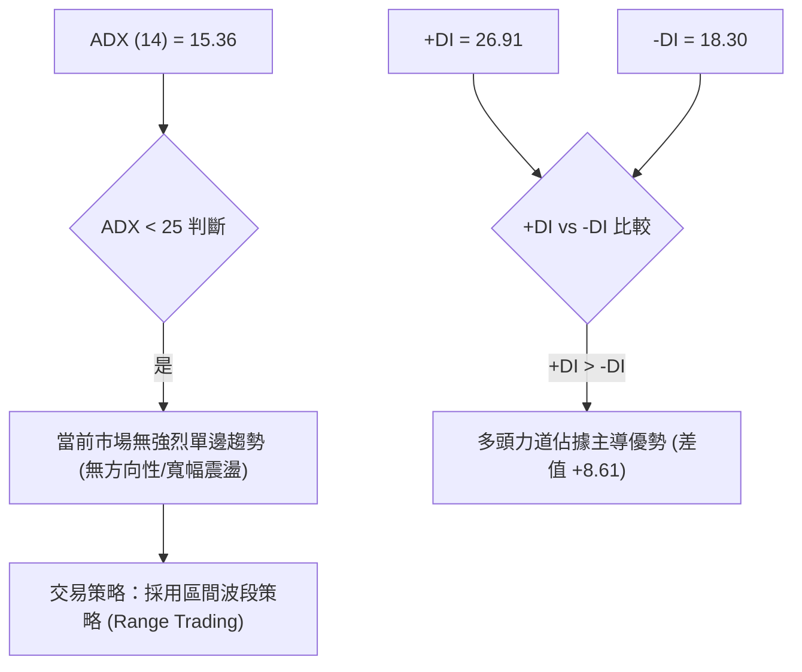

#### ADX 強度對照與解讀表

| ADX 區間 | 趨勢狀態 | 當前數值 | 當前狀態解讀 |
|----------|----------|----------|--------------|
| **0 – 20** | 弱趨勢 / 無趨勢震盪 | **15.36** | 🔴 **當前位置**：市場處於寬幅箱體整理或V型反彈後的修復期，動能尚未轉化為單邊趨勢。 |
| **20 – 25** | 趨勢形成中 | -- | 突破 $428.63 (R1) 需帶量驅動 ADX 跨越 25 關卡。 |
| **25 – 50** | 強烈單邊趨勢 | -- | 若 ADX > 25 且 +DI 保持向上，將啟動強勢主升段。 |
| **> 50** | 極端趨勢 / 超買超賣 | -- | 無 |

---

## 3. 圖表形態分析

### 🔍 形態識別系統

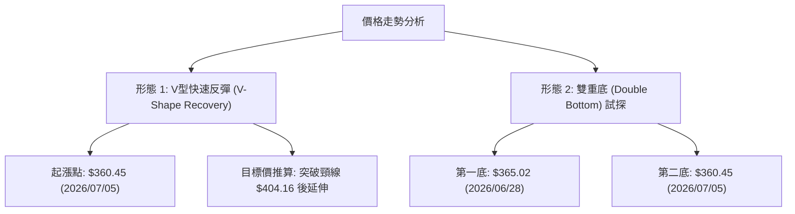

#### 圖表形態信心度評估表

| 形態名稱 | 信心度 | 判斷依據（引用數據） | 完成度 | 形態目標價（附計算式） |
|----------|--------|----------------------|--------|------------------------|
| **雙重底 (W底)** | **75%** | 兩次下探低點 $365.02 與 $360.45 均守住 S3 ($357.11)，頸線位為 $404.16 (S1)。目前價格 $422.40 已成功突破頸線。 | **90%** (已突破) | **$451.21**<br>計算：頸線 $404.16 + (頸線 $404.16 - 底位 $357.11) = $404.16 + $47.05 = $451.21 |
| **上升旗形** | **45%** | 日線拉升至 $427.76 後出現小幅整理，但因為 ADX (15.36) 過低，旗形結構尚不足以認定為標準趨勢持續形態。 | **35%** (未確認) | 數據不足，僅做指標型解讀 |

### 🕯️ 重要K線形態分析

| 週/月份 | 收盤價 | K線形態 | 技術解讀 | 訊號 |
|---------|--------|---------|----------|------|
| **2026-06-28** | $365.02 | 長下影陰線 | 探底測試 MA200 ($367.00) 買盤湧入，確認底部支撐 | 🟢 底態顯現 |
| **2026-07-05** | $360.45 | 錘頭線 (Hammer) | 二次打底不破，賣壓竭盡，為多頭反攻奠定基礎 | 🟢 築底訊號 |
| **2026-08-09** | $427.76 | 大陽線 (Marubozu) | 週漲幅達 +9.88%，強勢穿透 MA20/MA50，確立多頭反攻 | 🟢 強烈買訊 |
| **2026-08-16** | $422.40 | 小陰十字星 (Doji) | 受阻於 R1 ($428.63) 前的高位震盪，多空暫時交鋒 | 🟡 短線消化 |

### 📉 ASCII 走勢形態示意圖

```
AVGO 日線「雙底突破」形態示意圖
═══════════════════════════════════════════════════════════════
$451.21 ┤                                        [形態測幅目標價]
        ┊
$428.63 ┤............................┌─● ($427.76 R1壓制)
$422.40 ┤                          ┌─┘  └─● [當前收盤]
$404.16 ┤.............┌───●────────┘ (突破頸線 S1)
        ┊            │   │
$365.02 ┤    ●───────┘   │ (中間反彈)
$360.45 ┤   (底1)        └─● (底2)
═══════════════════════════════════════════════════════════════
```

### 🎯 形態目標價計算

以已確認突破之 **雙重底形態** 進行幾何推算：
1. **底部支撐均價**：取二次探底與 S3 之聚類值 $357.11
2. **頸線突破點**：$404.16 (即關鍵支撐 S1 / 前期波段高點)
3. **形態高度 (H)**：$404.16 - $357.11 = $47.05
4. **最小測幅目標價**：$404.16 + $47.05 = **$451.21** (落在阻力位 R2 $439.32 與 斐波那契 23.6% $443.62 之上方區間)

---

## 4. 支撐與阻力

### 🗺️ 關鍵價位分布圖（Unicode）

```
AVGO 價位結構與籌碼分布圖
══════════════════════════════════════════════════════════════════
$494.22 ║████████████████████████████████████████║ 52W 歷史最高點 (R3)
$443.62 ║██████████████████                      ║ 斐波那契 23.6%
$439.32 ║████████████████████████                ║ 波段高點聚類阻力 (R2)
$428.63 ║████████████████████████████            ║ 近期密集阻力位 (R1)
$422.40 ╠════════════════════════════════════════╣ ◄ 當前收盤價 ($422.40)
$412.32 ║▓▓▓▓▓▓▓▓▓▓▓▓▓▓▓▓▓▓▓▓                    ║ 斐波那契 38.2% 支撐
$404.16 ║▓▓▓▓▓▓▓▓▓▓▓▓▓▓▓▓▓▓▓▓▓▓▓▓▓▓▓▓            ║ 關鍵突破頸線支撐 (S1)
$387.02 ║▓▓▓▓▓▓▓▓▓▓▓▓▓▓                          ║ 斐波那契 50.0% 中軸
$369.28 ║▓▓▓▓▓▓▓▓▓▓▓▓▓▓▓▓▓▓▓▓▓▓▓▓                ║ 強支撐位 (S2) / MA200
$357.11 ║▓▓▓▓▓▓▓▓▓▓▓▓▓▓▓▓▓▓▓▓▓▓▓▓▓▓▓▓▓▓          ║ 波段低點聚類強支撐 (S3)
══════════════════════════════════════════════════════════════════
```

### 🚧 阻力位分析表

| 阻力級別 | 精確價位 | 形成原因（數據依據） | 突破難度 | 重要性 |
|----------|----------|----------------------|----------|--------|
| **R1** | **$428.63** | 近一年波段高點聚類，接近布林通道上軌 ($429.74) | 🟡 中等 | 短線多空分水嶺，突破將開啟新一輪拉升 |
| **R2** | **$439.32** | 近一年次高點聚類，貼近 2026/05 前高 $446.06 | 🔴 較高 | 中期關鍵解套壓力區 |
| **R3** | **$494.22** | 52週歷史高點 (52W High) | 🔴 極高 | 歷史天花板，需極大成交量配合始能突破 |

### 🛡️ 支撐位分析表

| 支撐級別 | 精確價位 | 形成原因（數據依據） | 守住機率 | 重要性 |
|----------|----------|----------------------|----------|--------|
| **S1** | **$404.16** | 近一年波段低點聚類、W底頸線，疊加 MA10 ($402.78) | 🟢 85% | 短線防守核心，不破則多頭結構完整 |
| **S2** | **$369.28** | 近一年波段低點聚類，疊加 MA200 ($367.00) | 🟢 90% | 長期牛熊分水嶺，具備極強買盤支撐 |
| **S3** | **$357.11** | 近一年波段最低點聚類，疊加布林下軌 ($357.81) | 🟢 95% | 中期極限回檔鐵底 |

### 📐 斐波那契回調位分析

依據 52週高低點區間（$279.82 ➔ $494.22）計算：

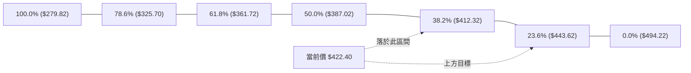

- **位置判定**：當前價格 **$422.40** 位於 **38.2% ($412.32)** 與 **23.6% ($443.62)** 之間。
- **技術意義**：
  1. 價格由下方強勢站回 38.2% ($412.32) 黃金分割位，代表回調結束，重回多頭掌控區。
  2. 上方第一斐波那契阻力為 23.6% ($443.62)，與阻力位 R2 ($439.32) 形成強力阻力帶。

---

## 5. 技術指標深度解讀

### 🎛️ 指標訊號總覽

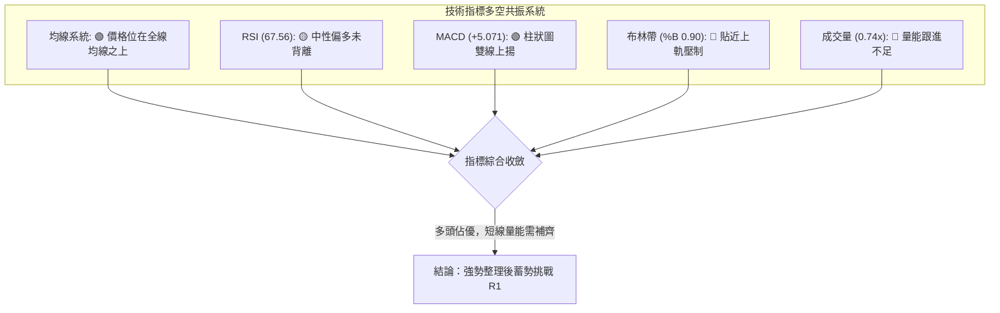

### 📈 移動平均線排列分析

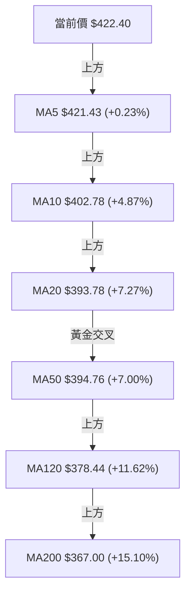

#### 均線狀態矩陣

| 均線天期 | 精確價位 | 價格相對距離 | 排列狀態 | 趨勢涵義 |
|----------|----------|--------------|----------|----------|
| **MA5** | $421.43 | +0.23% | 🟢 多頭 | 超短期極速均線，支撐短線價格高位震盪 |
| **MA10** | $402.78 | +4.87% | 🟢 多頭 | 短期攻擊線，與 S1 ($404.16) 構成重疊支撐 |
| **MA20** | $393.78 | +7.27% | 🟢 黃金交叉 | 月線扣抵位置極佳，呈向上支撐角度 |
| **MA50** | $394.76 | +7.00% | 🟢 向上擴張 | 季線轉升，MA20 正穿越 MA50 形成黃金交叉 |
| **MA200** | $367.00 | +15.10% | 🟢 強烈多頭 | 長期牛市防線，支撐極度穩固 |

### 📉 RSI(14) 分析

```
RSI (14) 當前數值進度條
0             30                      50             70       100
├─────────────┼───────────────────────┼──────────────┼────────┤
[ 超賣區 ]      [       熊市區         ] [ 偏多控盤區 ]  [超買區]
                                                      ▲ (67.56)
```

- **當前數值**：**67.56** (位於 50-70 偏多控盤強勢區)。
- **背離檢測**：
  - **價格走勢**：由 2026/07 的 $360.45 升至 2026/08 的 $422.40 (創波段新高)。
  - **RSI 走勢**：由 41.6 提升至 67.56 (同步創波段新高)。
  - **背離判斷結論**：🟢 **無頂背離現象**，價格上漲獲得動能指標真實確認。

### 📊 MACD(12,26,9) 訊號解讀

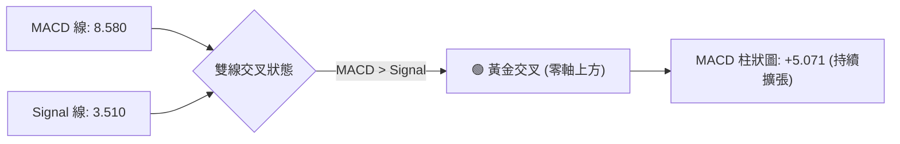

- **數值細節**：MACD (8.580) > Signal (3.510)，柱狀圖 (Histogram) 為 **+5.071**。
- **解讀**：MACD 在零軸上方再次形成黃金交叉，且柱狀圖正值持續放大，顯示多頭加速攻擊動能強勁。

### 📦 布林通道分析

```
布林通道 (Bollinger Bands 20,2) 結構圖
══════════════════════════════════════════════════════════════════
$429.74 ┤......................................... BB 上軌 (Upper)
$422.40 ┤========================================= [當前價格 (%B: 0.90)]
        ┊
$393.78 ┤----------------------------------------- BB 中軌 (MA20)
        ┊
$357.81 ┤......................................... BB 下軌 (Lower)
══════════════════════════════════════════════════════════════════
```

- **通道指標**：上軌 $429.74，中軌 $393.78，下軌 $357.81，%B 指標為 **0.90**。
- **解讀**：%B 達 0.90 代表價格已運行至布林通道頂部 90% 位置，貼近上軌 $429.74。在 ADX < 25 的環境下，布林上軌具有自然均值回歸壓力，短線直接暴漲機率較低，更可能進行上軌附近的震盪消化。

### 💹 成交量分析（量價配合度）

- **最新成交量**：13,766,512 股。
- **量比與均量**：20日均量 18,683,291 股 (量比 **0.74x**)，50日均量 27,718,754 股。
- **OBV 能量潮**：OBV > MA，顯示籌碼整體呈淨流入狀態。
- **量價背離警訊**：價格拉升至 $422.40 逼近前高，但成交量僅為均量 0.74x，顯示買盤出現追高謹慎情緒。若要有效突破 R1 ($428.63)，日成交量必須放大至 2,000 萬股以上 (1.1x 均量以上)。

---

## 6. 動能與波動率

### ⚡ 動能評估四象限

| 象限區塊 | 動能 (Momentum) | 波動率 (Volatility) | 當前位置判斷 | 建議操作策略 |
|----------|-----------------|---------------------|--------------|--------------|
| **Q1 (高動能 / 低波動)** | 強 (RSI>60) | 低 (ATR%<3%) | -- | 最佳突破追漲區 |
| **Q2 (高動能 / 中高波動)**| 強 (RSI 67.56) | 中等 (ATR 3.84%) | 🟢 **當前 AVGO 位置** | **拉回買進 (Buy on Dip)** |
| **Q3 (低動能 / 高波動)** | 弱 (RSI<40) | 高 (ATR%>5%) | -- | 避開/觀望 |
| **Q4 (低動能 / 低波動)** | 弱 (RSI<50) | 低 (ATR%<2%) | -- | 盤整觀望 |

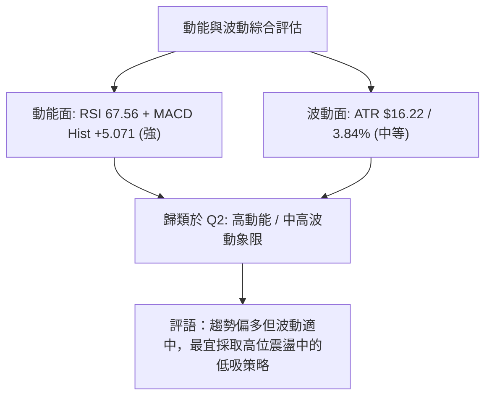

### 📊 ATR 波動率分析

- **ATR(14) 數值**：**$16.22** (占當前股價 3.84%)。
- **交易應用**：
  - **單日波動範圍預估**：$422.40 ± $16.22 (預計區間 $406.18 - $438.62)。
  - **動態止損距離設置**：採用 1.5x 至 2.0x ATR 作為安全止損門檻。
    - 1.5x ATR = $24.33 ➔ 止損位設於 $422.40 - $24.33 = **$398.07** (防守於 S1 $404.16 下方)。

### 📐 Beta 與市場相關性

- **Beta 係數**：**1.473**。
- **解讀**：AVGO 具備高彈性科技股特質，波動度約為標普 500 指數的 1.47 倍。大盤上漲時其漲幅具備放大效應，反之回調時亦承受較高β風險。

---

## 7. 多時框架總結

### 📋 時框架評分表

| 時框架 | 趨勢方向 | 動能狀態 | 均線排列 | 形態結構 | 綜合評分 | 建議方向 |
|--------|----------|----------|----------|----------|----------|----------|
| **長期 (月線)** | 🟢 多頭 | 🟢 強勁 | 🟢 多頭排列 | 創高後高位整理 | **78/100** | 偏多持有 |
| **中期 (週線)** | 🟢 轉強 | 🟢 擴張 | 🟢 站上均線 | 雙底突破成立 | **72/100** | 逢低買進 |
| **短期 (日線)** | 🟡 震盪 | 🟡 接近超買 | 🟢 全線站上 | 上軌壓制/量縮 | **60/100** | 區間高拋低吸 |

### 🔲 綜合訊號矩陣

```
時框架訊號一致性分析表
══════════════════════════════════════════════════════════════════
  指標 / 時框      日線 (Daily)      週線 (Weekly)     月線 (Monthly)
──────────────────────────────────────────────────────────────────
  均線位置 (MA)      🟢 上方           🟢 上方           🟢 上方
  RSI 動能           🟡 67.56 (偏高)   🟢 73.60 (強勢)   🟢 偏多
  MACD 狀態          🟢 金叉擴張       🟢 金叉轉正       🟢 零軸上方
  成交量配合         🔴 量縮 (0.74x)   🟡 中等           🟢 充沛
  趨勢強度 ADX       🟡 15.36 (盤整)   🟡 22.10 (構建中) 🟢 趨勢明確
══════════════════════════════════════════════════════════════════
  一致性結語：長中期強烈偏多，短期受制於 R1 壓力與低 ADX 震盪。
```

### ⚖️ 多時框收斂結論

依據多時框收斂規則：
1. **當前市場環境判定**：ADX(14) = 15.36 (< 25)，代表日線層級處於 **寬幅震盪 / 箱體頂部試探行情**。
2. **主導時框**：由週線與長線多頭結構主導大方向（長多中強），日線則用於精確定位進場與風控價位。
3. **收斂結論**：整體方向為 **🟢 偏多震盪**。價格雖受阻於 R1 ($428.63)，但下有 S1 ($404.16) 與多重均線密集支撐，最佳策略為「**等待回調至 S1/斐波那契 38.2% 區間佈局做多**」，或「**帶量突破 R1 後順勢追價**」。

---

## 8. 交易策略建議

### 🗺️ 策略決策流程圖

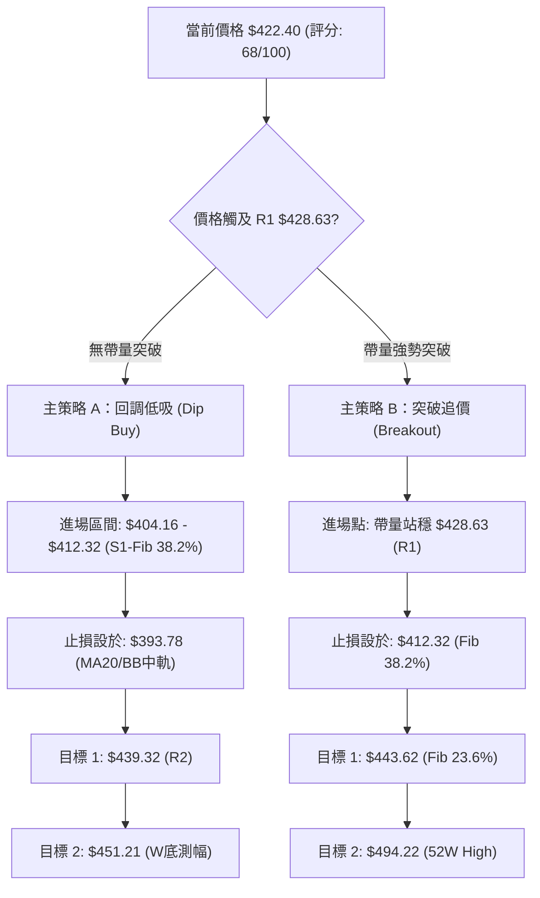

### 🧭 策略路由

**當前主策略方向 = 🟢 多頭拉回低吸與突破雙軌策略 (綜合評分: 68/100)**
由於評分達 68 分（≥60），且長中期均線全面多頭，主推做多策略；做空僅作為風險觸發點提示。

### 🎯 價格情境階梯 (Price Scenarios)

| 觸發條件 | 下一目標價 | 後續延伸目標 | 情境含義與技術解讀 |
|----------|------------|--------------|--------------------+
| **帶量突破 R1 $428.63** | R2 **$439.32** | Fib 23.6% **$443.62** | 短線整理結束，發動新一輪主升段 |
| **站穩 $404.16 - $422.40** | R1 **$428.63** | R2 **$439.32** | 區間蓄勢震盪，以時間換取空間 |
| **跌破 S1 $404.16** | S2 **$369.28** | S3 **$357.11** | 短線V轉失敗，深二次回調測試 MA200 |

### 📊 情境機率分佈

| 情境劇本 | 估計機率 | 主要技術依據 |
|----------|----------|--------------|
| **劇本 1：高位震盪後突破上攻** | **60%** | MACD 金叉擴張、OBV 量能支撐、全線均線多頭排列 |
| **劇本 2：區間打底震盪 (拉回低吸)** | **30%** | ADX = 15.36 (弱趨勢)、日線成交量縮 (0.74x) |
| **劇本 3：深幅回調測試 MA200** | **10%** | 布林上軌壓制、Stoch 處於 >80 超買區 |

### 🟢 主策略詳情（多頭）

| 策略要素 | 策略 A：回調低吸策略 (首選) | 策略 B：突破追攻策略 (次選) |
|----------|-----------------------------|-----------------------------|
| **進場條件** | 股價拉回至 S1 附近，出現止跌K線 | 日收盤價帶量 (量比>1.1x) 突破 R1 |
| **買入價格** | **$408.00** (位於 $404.16 - $412.32 區間) | **$429.50** (確認突破 $428.63 後) |
| **目標價 T1** | **$439.32** (阻力位 R2，預期獲利 +7.68%) | **$451.21** (W底形態測幅，預期獲利 +5.05%) |
| **目標價 T2** | **$451.21** (W底形態測幅，預期獲利 +10.59%) | **$494.22** (52週歷史高點，預期獲利 +15.07%) |
| **止損價格** | **$393.00** (跌破 MA20 $393.78 嚴格止損) | **$412.00** (跌破 38.2% 斐波那契位止損) |
| **單筆損益比**| **2.08 : 1** (風險 $15.00 / 期望獲利 $31.32) | **2.21 : 1** (風險 $17.50 / 期望獲利 $38.71) |
| **勝率估計** | **65%** | **55%** |
| **建議倉位** | **15% - 20%** 總資金 | **10% - 15%** 總資金 |

### 🔴 反向風險觸發點（對沖與避險提示）

- **風控臨界點**：若日收盤價無條件跌破 **$404.16 (S1)** 且 MACD 柱狀圖轉為縮小，多頭邏輯受到破壞，應全面出清多頭部位或進行短線對沖。

### ⭐ 整體訊號強度評星

```
做多訊號強度：★★★★☆  (4.0/5 星 - 均線與 MACD 多頭共振)
做空訊號強度：★☆☆☆☆  (1.0/5 星 - 僅有成交量低迷與布林壓制)
整體可信度：  ★★██☆  (4.0/5 星 - 長中短期多時框方向一致)
```

---

## 9. 風險提示與監控

### ✅ 關鍵監控指標 Checklist

```
╔══════════════════════════════════════════════════════════════════╗
║                   AVGO 每日交易監控清單 (Checklist)               ║
╠══════════════════════════════════════════════════════════════════╣
║ [ ] R1 阻力位突破監控：日收盤價是否站穩 $428.63                   ║
║ [ ] 成交量回升確認：日成交量是否回升至 18.68M (20日均量) 上方      ║
║ [ ] S1 頸線防守測試：價格回調時 $404.16 關卡是否有效守住           ║
║ [ ] MACD 柱狀圖動能：Hist 是否保持在 +5.00 以上正向擴張           ║
║ [ ] RSI 超買警戒：RSI(14) 是否突破 75 進入極端超買區               ║
║ [ ] 均線扣抵安全度：價格是否維持在 MA20 ($393.78) 上方            ║
╚══════════════════════════════════════════════════════════════════╝
```

### ⚠️ 風險場景分析

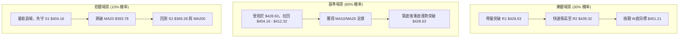

### 🛡️ 風險管理重要提醒

1. **量能背離風險**：當前漲勢伴隨成交量縮小 (0.74x 均量)，顯示高位追價意願不足，嚴禁在逼近 R1 ($428.63) 時重倉追高。
2. **波動度保護**：利用 ATR ($16.22) 動態調整止損，建議短線止損設置不小於 1.5x ATR ($24.33)，避免因正常波動被洗出場。
3. **高 Beta 控制**：AVGO 的 Beta 為 1.473，受大盤科技板塊（如 QQQ、SMH）影響顯著，需同時監控半導體整體指數之走勢。

---

## 📋 報告總結

```
╔══════════════════════════════════════════════════════════════════╗
║                    AVGO 技術分析報告總結                          ║
════════════════════════════════════════════════════════════════════
報告日期：2026-08-11
當前價格：$422.40
分析評級：🟢 偏多震盪 (買進/逢低佈局)
技術評分：68.0 / 100

關鍵價位速查：
├─ 阻力天花板 (R3)：$494.22 (52週最高點)
├─ 中期壓力區 (R2)：$439.32 / $443.62 (Fib 23.6%)
├─ 短線關鍵阻力 (R1)：$428.63 (挑戰中)
├─ 當前價格位置   ：$422.40
├─ 短線核心支撐 (S1)：$404.16 (W底頸線 / 防守點)
├─ 中期牛熊分水 (S2)：$369.28 (MA200 $367.00)
└─ 分析師平均目標價：$527.88 (隱含 +24.97% 潛在空間)

最佳交易機會組合：
1. 🥇 首選策略：等待拉回至 $404.16 - $412.32 區間分批佈局做多，止損 $393.00，目標 $451.21。
2. 🥈 次選策略：若帶量 (量比>1.1x) 強勢突破 $428.63，順勢追買，止損 $412.00，目標 $451.21 / $494.22。
╚══════════════════════════════════════════════════════════════════╝
```

---

> ⚠️ **免責聲明**：本報告為 AI 自動生成之技術分析，所有數據及估算均基於提供的歷史價格資訊。本報告**僅供研究與學術參考**，**不構成任何投資建議**。投資有風險，入市需謹慎。

---

*報告生成時間：2026-08-11 ｜ 數據來源：Yahoo Finance ｜ 分析框架：多時框技術分析*