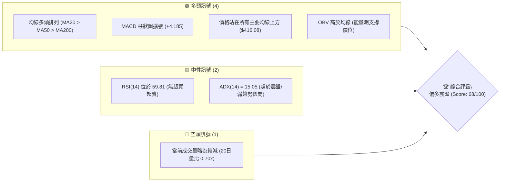
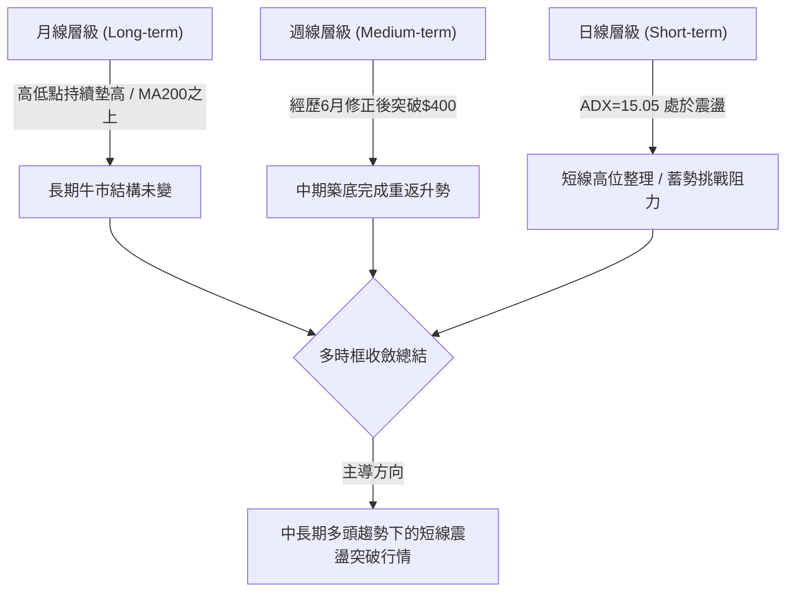
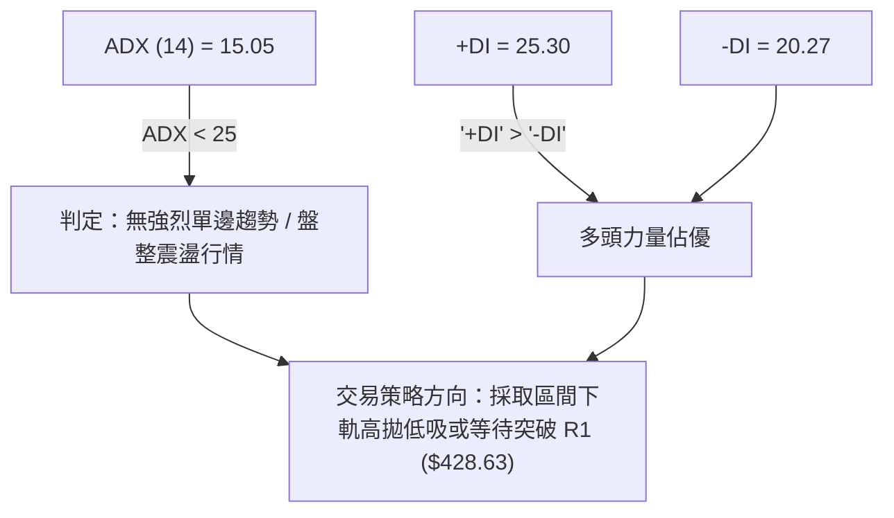
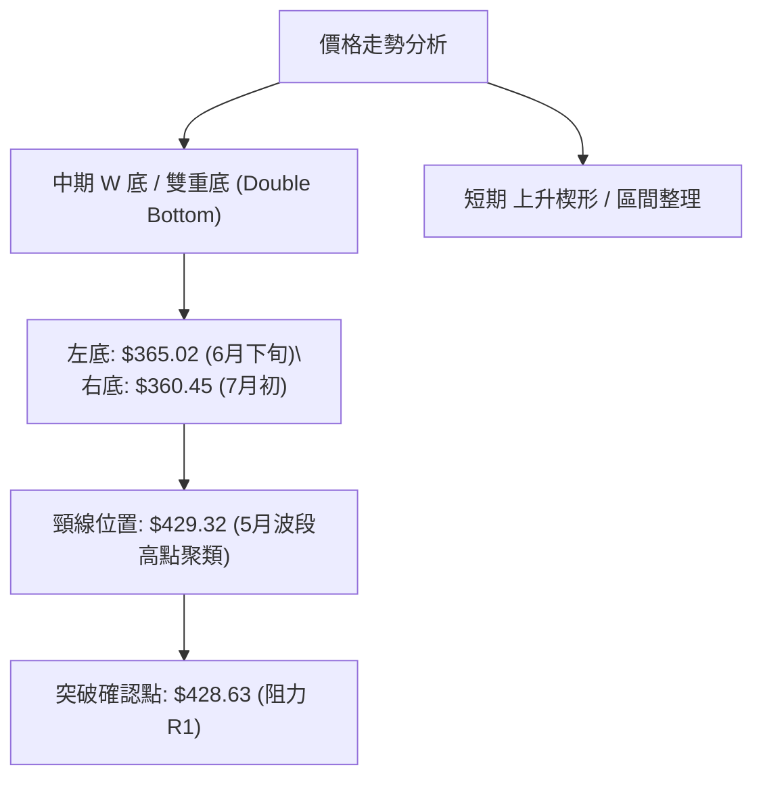
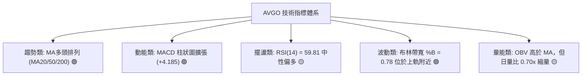
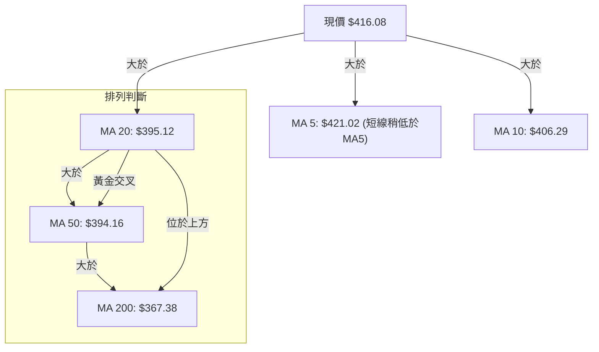
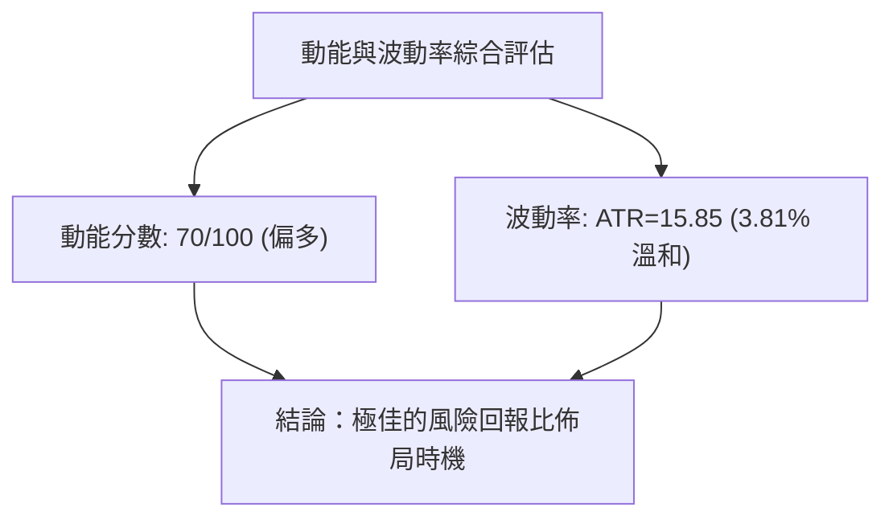
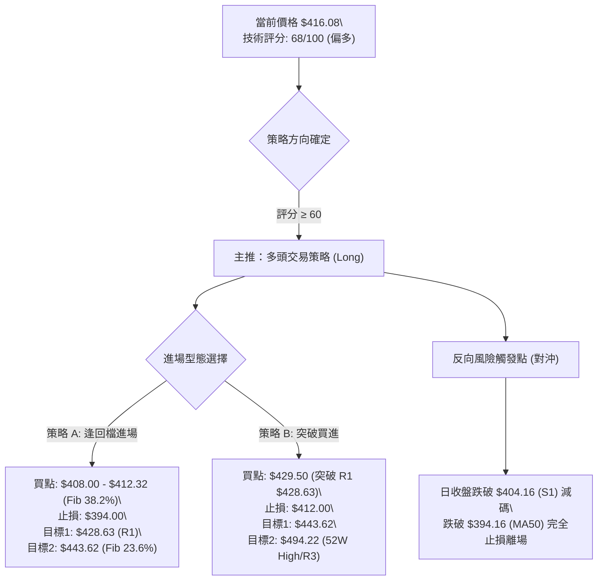
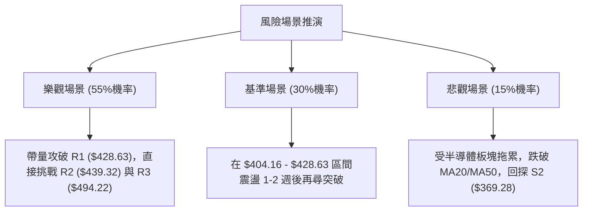

# AVGO 技術分析報告

> **報告日期**：2026-08-12 ｜ **語言**：繁體中文 ｜ **數據來源**：Yahoo Finance ｜ **當前價格**：$416.08

---

## 目錄

| 章節 | 內容 |
|------|------|
| [1. 技術面概覽](#1-技術面概覽) | 訊號儀表板、核心指標、評分卡 |
| [2. 趨勢分析](#2-趨勢分析) | 多時框趨勢、長中短期走勢 |
| [3. 圖表形態分析](#3-圖表形態分析) | 形態識別、K線組合、目標價 |
| [4. 支撐與阻力](#4-支撐與阻力) | 關鍵價位、斐波那契回調 |
| [5. 技術指標深度解讀](#5-技術指標深度解讀) | MA/RSI/MACD/布林/成交量 |
| [6. 動能與波動率](#6-動能與波動率) | 動能評估、ATR、Beta |
| [7. 多時框架總結](#7-多時框架總結) | 時框架評分矩陣 |
| [8. 交易策略建議](#8-交易策略建議) | 多空策略、風險報酬比 |
| [9. 風險提示與監控](#9-風險提示與監控) | 監控指標、風險場景 |

---

## 1. 技術面概覽

### 🎯 技術訊號儀表板



### 📊 核心指標速覽表

| 指標類別 | 指標名稱 | 當前數值 | 訊號 | 解讀 |
|----------|----------|----------|------|------|
| **價格** | 當前價格 | $416.08 | 🟢 | 位於52週區間 63.6% 位置，成功收復$400大關 |
| **均線** | MA20 | $395.12 | 🟢 | 價格在MA20上方 (+5.30%)，短線支撐強勁 |
| **均線** | MA50 | $394.16 | 🟢 | 價格在MA50上方 (+5.56%)，中期趨勢翻多 |
| **均線** | MA200 | $367.38 | 🟢 | 價格在MA200上方 (+13.26%)，長期牛市基調穩固 |
| **動能** | RSI(14) | 59.81 | 🟡 | 健康多頭區域，尚未進入 >70 之超買警戒 |
| **動能** | MACD | 8.741 | 🟢 | MACD線高於訊號線 (4.556)，柱狀圖為 +4.185 正向擴張 |
| **波動** | ATR(14) | $15.85 | 🟡 | 占股價 3.81%，波動度溫和，適合標準止損設定 |

### 🏆 技術評分卡

```
╔══════════════════════════════════════════════════════════════╗
║             技術評分卡 — AVGO (2026-08-12)                   ║
╠══════════════════════════════════════════════════════════════╣
║ 趨勢強度      ▓▓▓▓▓▓▓▓▓░░░░░░░░░░░  45/100  🟡 弱趨勢/震盪  ║
║ 動能指標      ▓▓▓▓▓▓▓▓▓▓▓▓▓▓░░░░░░  70/100  🟢 動能偏多     ║
║ 支撐穩定度    ▓▓▓▓▓▓▓▓▓▓▓▓▓▓▓░░░░░  75/100  🟢 雙重均線防線 ║
║ 成交量配合    ▓▓▓▓▓▓▓▓▓▓▓░░░░░░░░░  55/100  🟡 量能放緩     ║
║ 形態完整度    ▓▓▓▓▓▓▓▓▓▓▓▓▓░░░░░░░  65/100  🟢 築底回升     ║
║ 均線排列      ▓▓▓▓▓▓▓▓▓▓▓▓▓▓▓▓▓░░░  85/100  🟢 完美多頭排列 ║
╠══════════════════════════════════════════════════════════════╣
║ 綜合評分      ▓▓▓▓▓▓▓▓▓▓▓▓▓░░░░░░░  68/100  🟢 偏多震盪蓄勢 ║
╚══════════════════════════════════════════════════════════════╝
```

---

## 2. 趨勢分析

### 🌐 多時框趨勢分析



### 📈 長期趨勢 — 12個月走勢圖（Unicode）

```
AVGO 月線走勢圖（過去12個月：2025-09 至 2026-08）
價格軸 ($)
$450 ┤                                      ● (05月高點 446.06)
$420 ┤                                   ●              ● (08月現價 416.08)
$390 ┤                        ●        ●     ●       ●
$360 ┤               ●      ●              ●   ●
$330 ┤     ●       ●   ●  ●
$300 ┤  ●       ●        ●
$270 ┴──┬───┬───┬───┬───┬───┬───┬───┬───┬───┬───┬───►
       09  10  11  12  01  02  03  04  05  06  07  08 (月份)
```

#### 走勢特徵分析表格

| 時間段 | 開/收盤區間 ($) | 漲跌幅 (%) | 主要技術特徵與驅動因素 |
|--------|-----------------|------------|------------------------|
| **2025 Q3-Q4** | 328.07 → 400.71 | +22.14% | 強勁主升段，成交量放大，創下當時歷史新高 |
| **2025 Q4-2026 Q1**| 400.71 → 309.02 | -22.88% | 獲利了結與半導體板塊修正，落至波段低點 $279.82 附近 |
| **2026 Q2** | 309.02 → 446.06 | +44.35% | 垂直式爆發V型反彈，強勢突破 $400 關卡 |
| **2026 Q3 (至今)** | 446.06 → 416.08 | -6.72% | 回檔測試 $360.45 支撐後反彈，現於 $416.08 進行震盪消化 |

### 📊 中期趨勢（週線分析）

中期走勢顯示，AVGO 在 2026 年 6 月初經歷一次大幅拉回（週收盤最低落至 $360.45，靠近斐波那契 61.8% 的 $361.72），隨後於 7 月底至 8 月強勢拉升，8 月初單週強彈至 $427.76（MACD柱發散至 +5.364）。目前週線結構展現典型的「更高的低點」（Higher Low），奠定了中期偏多的價格結構。

### ⚡ 趨勢強度評估（ADX 解讀）



#### ADX 趨勢強度對照表

| ADX 數值範圍 | 當前數值 | 市場狀態評估 | 建議交易策略 |
|--------------|----------|--------------|--------------|
| 0 - 20 | **15.05** | **極弱趨勢 / 區間震盪** | **逢低佈局、利用通道與支撐位做多** |
| 20 - 25 | - | 趨勢形成中 | 準備順勢突破交易 |
| 25 - 50 | - | 強勁單邊趨勢 | 嚴格順勢持單 |
| > 50 | - | 極端過熱趨勢 | 注意動能背離與反轉風險 |

---

## 3. 圖表形態分析

### 🔍 形態識別系統



#### 形態評估與信心度矩陣

| 形態名稱 | 信心度 (%) | 判斷依據（引用數據） | 完成度 (%) | 目標價計算與精確數值 |
|----------|------------|----------------------|------------|----------------------|
| **雙重底 (W底)** | **72%** | 6月下旬低點 $365.02 與 7月初低點 $360.45 形成雙底，且均在 Fib 61.8% ($361.72) 獲得支撐 | 85% | **形態高度** = $428.63 - $360.45 = $68.18<br>**目標價** = $428.63 + $68.18 = **$496.81** (接近52W高點 $494.22) |
| **均線多頭排列突破** | **85%** | MA20 ($395.12) > MA50 ($394.16) > MA200 ($367.38)，價格站穩於所有均線上 | 100% | 指標型解讀，無幾何幾何延伸高度，以阻力位 **$439.32 (R2)** 為階段目標 |

### 🕯️ 重要K線形態分析

| 週/月份 | 收盤價 ($) | K線形態 | 技術面解讀 | 多空訊號 |
|---------|------------|---------|------------|----------|
| **2026-06-28** | $365.02 | 下影錘子線 | 探底 S3 ($357.11) 附近誘空後強烈買盤介入 | 🟢 轉折買訊 |
| **2026-07-05** | $360.45 | 雙底二次測試 | 再次測試波段低點不破，完成二次打底 | 🟢 打底確認 |
| **2026-08-09** | $427.76 | 大陽線突破 | 週漲幅顯著，一舉克服 MA20 與 MA50 反壓 | 🟢 強勢攻擊 |
| **2026-08-16** | $416.08 | 高位十字星/小陰線 | 遇阻力 R1 ($428.63) 產生正常短線獲利回吐 | 🟡 中性整理 |

### 📉 ASCII 走勢形態示意圖

```
AVGO 中期雙底 (W-Bottom) 形態示意圖
===================================================================
$439.32 ┤                                           [目標價 R2]
$428.63 ┤................. 頸線 (R1) ..............
        │                /\                /  ▲ 現價 $416.08
$395.12 ┤───────────────/──\──────────────/───┼── [MA20/中軌]
        │              /    \            /    │
$360.45 ┤  ● (底1)    /      \  ● (底2) /     │
        │  $365.02   /        \ $360.45/      │
$357.11 ┴───┴───────┴──────────┴──────┴───────┴─────────────────
          2026-06-28          2026-07-05     2026-08-12
===================================================================
```

---

## 4. 支撐與阻力

### 🗺️ 關鍵價位分布圖（Unicode）

```
AVGO 價位結構分布圖
═══════════════════════════════════════════════════════════════
$494.22 ║████████████████████████████████████████║ 52W高點 / 阻力 R3
$443.62 ║██████████████████                      ║ 斐波那契 23.6%
$439.32 ║████████████████████████                ║ 阻力 R2
$428.63 ║████████████████████████████            ║ 關鍵阻力 R1
$416.08 ╠════════════════════════════════════════╣ ◄ 當前價格 ($416.08)
$412.32 ║▓▓▓▓▓▓▓▓▓▓▓▓▓▓▓▓▓▓▓▓▓▓▓▓▓▓▓▓            ║ 斐波那契 38.2% (第一支撐)
$404.16 ║▓▓▓▓▓▓▓▓▓▓▓▓▓▓▓▓▓▓▓▓▓▓▓▓                ║ 關鍵支撐 S1
$395.12 ║▓▓▓▓▓▓▓▓▓▓▓▓▓▓▓                         ║ MA20 / BB中軌
$387.02 ║▓▓▓▓▓▓▓▓▓▓▓▓                            ║ 斐波那契 50.0%
$369.28 ║████████████████████████                ║ 強支撐 S2
$361.72 ║████████████                            ║ 斐波那契 61.8%
$357.11 ║████████████████████████████            ║ 強支撐 S3 / BB下軌 ($357.90)
$279.82 ║████████████████████████████████████████║ 52W低點 / 100% 回調
═══════════════════════════════════════════════════════════════
```

### 🚧 阻力位分析表

| 阻力級別 | 精確價位 | 形成原因 | 突破難度 | 重要性 |
|----------|----------|----------|----------|--------|
| **R1** | **$428.63** | 近一年波段高點聚類 / 8月初高點反壓 | 🟡 中等 | 🟢 突破即確認短線W底完成 |
| **R2** | **$439.32** | 5月高點聚類區間 / 布林上軌 ($432.35) 上方 | 🔴 較高 | 🟡 中期攻防關鍵點 |
| **R3** | **$494.22** | 52週歷史高點 (52W High) | 🔴 極高 | 🔴 歷史強壓區，需大量配合 |

### 🛡️ 支撐位分析表

| 支撐級別 | 精確價位 | 形成原因 | 守住機率 | 重要性 |
|----------|----------|----------|----------|--------|
| **S1** | **$404.16** | 近一年波段低點聚類 / 靠近 MA10 ($406.29) | 🟢 極高 | 🟢 短線多頭防守第一線 |
| **S2** | **$369.28** | 波段密集支撐區 / 靠近 MA200 ($367.38) | 🟢 高 | 🟡 中期趨勢防禦生命線 |
| **S3** | **$357.11** | 近一年波段最低聚類 / 布林下軌 ($357.90) | 🟢 高 | 🔴 長期多空分水嶺 |

### 📐 斐波那契回調位分析

依據 52 週高點 **$494.22** 至 52 週低點 **$279.82** 之完整波段計算：

| 斐波那契層級 | 精確價位 ($) | 當前價格位置與技術意義解讀 |
|--------------|--------------|----------------------------|
| **0.0% (52W High)** | **$494.22** | 歷史頂點，波段最終多頭目標 |
| **23.6%** | **$443.62** | 突破 R2 ($439.32) 後的第一道黃金分割阻力 |
| **38.2%** | **$412.32** | **現價 ($416.08) 位於 38.2% ($412.32) 與 23.6% ($443.62) 之間**。$412.32 已轉化為極強的短線支撐墊 |
| **50.0%** | **$387.02** | 中軸多空分界線，下方靠近 MA20 ($395.12) |
| **61.8%** | **$361.72** | 黃金分割強支撐（6, 7月兩次打底均在此位 $360.45 獲得支撐後反彈） |
| **78.6%** | **$325.70** | 深勢回檔防線 |
| **100.0% (52W Low)**| **$279.82** | 52週最低點 |

---

## 5. 技術指標深度解讀

### 🎛️ 指標訊號總覽



### 📈 移動平均線排列分析



#### 均線數據詳細分析表

| 均線天數 | 精確價位 ($) | 離現價乖離率 (%) | 走勢方向 | 技術面意涵 |
|----------|--------------|------------------|----------|------------|
| **MA 5** | $421.02 | -1.17% | ⬇️ 下彎 | 短線極高位微幅拉回修正 |
| **MA 10** | $406.29 | +2.41% | ⬆️ 上揚 | 短線快速上升支撐 |
| **MA 20** | $395.12 | +5.30% | ⬆️ 上揚 | 月線強勢支撐，短線多頭生命線 |
| **MA 50** | $394.16 | +5.56% | ⬆️ 上揚 | 季線轉銳利上揚，與 MA20 形成雙重黃金交叉 |
| **MA 200**| $367.38 | +13.26% | ⬆️ 上揚 | 年線牛市防線，長期趨勢非常健康 |

### 📉 RSI(14) 分析

*   **當前 RSI 數值**：**59.81**
*   **強度進度條**：`█████████████░░░░░░░` 59.81%
*   **超買超賣判斷**：處於 30-70 的**健康多頭可持續區間**，無過熱（>70）或超賣（<30）現象。
*   **背離分析**：
    *   **頂背離**：無。8 月上旬價格拉升至 $427.76 時，週線 RSI 達到 73.6，日線 RSI 伴隨上升，未出現價格創新高而 RSI 降低之現象。
    *   **底背離**：7 月低點 $360.45 時 RSI 未再創新低，已完成底背離修復。

### 📊 MACD(12, 26, 9) 訊號解讀

*   **MACD 線**：8.741
*   **Signal 線**：4.556
*   **MACD 柱狀圖 (Histogram)**：**+4.185** (🟢 看多)
*   **解讀**：MACD 快線由下向上穿越慢線形成黃金交叉後，柱狀圖持續在正值區間擴張（從 7 月底的 +0.874 擴大至目前的 +4.185），顯示多頭買盤動能仍在強烈釋放中。

### 📦 布林通道分析

```
AVGO 布林通道結構示意圖 ($)
===================================================================
$432.35 ┤......................................... BB 上軌
        │                        ● 現價 $416.08 (%B = 0.78)
$395.12 ┤───────────────────────────────────────── BB 中軌 (MA20)
        │
$357.90 ┤......................................... BB 下軌
===================================================================
```

*   **上軌**：$432.35
*   **中軌 (MA20)**：$395.12
*   **下軌**：$357.90
*   **%B 指標**：**0.78** (位處中軌與上軌之間的黃金上攻區)
*   **帶寬解讀**：布林帶寬呈現擴張狀態，價格貼近上軌震盪，屬於典型的多頭強勢區間。

### 💹 成交量分析（量價配合度）

*   **最新日成交量**：12,814,188 股
*   **20日平均成交量**：18,322,444 股 (量比：**0.70x**)
*   **50日平均成交量**：27,140,822 股
*   **OBV 趨勢**：OBV > MA，量能累積趨勢高於均線，顯示法人大戶籌碼鎖定良好，籌碼並未在大跌中鬆動。
*   **量價關係評估**：當前價格自 $427.76 微幅回檔至 $416.08 時，成交量明顯萎縮（0.70x），呈現完美的「**漲時有量、跌時量縮**」健康的價量配合形態。

---

## 6. 動能與波動率

### ⚡ 動能評估四象限

| 象限分類 | 動能狀態 | 波動率狀態 | AVGO 當前位置與評估 |
|----------|----------|------------|---------------------|
| **象限 I** | 強動能 (MACD/RSI偏多) | 低/中波動率 | **✓ 當前歸屬此區間**：MACD發散且RSI=59.81，ATR僅3.81%，屬於**最佳低風險順勢進場區** |
| **象限 II** | 強動能 | 高波動率 | 盲目追高風險大 |
| **象限 III**| 弱動能 | 高波動率 | 劇烈洗盤，應避免操作 |
| **象限 IV** | 弱動能 | 低波動率 | 沉悶盤整，資金效率低 |



### 📊 ATR 波動率分析

*   **ATR(14) 精確值**：**$15.85**
*   **ATR 百分比**：3.81%
*   **止損與風控應用**：
    *   **短線日內交易止損距離 (1.0x ATR)**：$15.85
    *   **波段交易建議止損距離 (1.5x - 2.0x ATR)**：$23.78 – $31.70
    *   依現價 $416.08 計算，標準波段止損價位可設於 $416.08 - $23.78 = **$392.30**（恰好落在 MA20 $395.12 下方，具備極強的技術雙重防護）。

### 📐 Beta 與市場相關性

*   **Beta 係數**：**1.473**
*   **解讀**：AVGO 的波動度高於大盤 (S&P 500) 約 47.3%。在大盤上漲時具備顯著的高彈性溢價，在技術面轉強時適合做為攻堅標的。

---

## 7. 多時框架總結

### 📋 時框架評分表

| 時框架 | 趨勢方向 | 動能指標 | 均線排列 | 圖表形態 | 綜合評分 | 操作建議 |
|--------|----------|----------|----------|----------|----------|----------|
| **月線 (長期)** | 🟢 看多 | 🟢 偏強 | 🟢 多頭排列 | 多頭格局 | **85/100** | 長線堅定持有 |
| **週線 (中期)** | 🟢 看多 | 🟢 MACD金叉 | 🟢 站穩MA20 | 雙底回升 | **75/100** | 逢拉回加碼 |
| **日線 (短期)** | 🟡 震盪 | 🟢 柱狀圖發散 | 🟢 多頭排列 | 高位整理 | **68/100** | 尋找支撐位佈局 |

### 🔲 綜合訊號矩陣

```
時框架訊號一致性分析:
[長期: 偏多] + [中期: 偏多] + [短期: 偏多震盪] = 🟢 全時框多頭共振
```

### ⚖️ 多時框收斂結論

依據**多時框收斂規則**：當前 ADX(14) 為 15.05 (< 25)，指示日線層級處於**盤整/弱趨勢行情**；但中長期（週線與日線 MA20/50/200）方向均呈**完美多頭排列**。

*   **主導時框**：中長期多頭趨勢主導。
*   **唯一方向性結論**：**偏多震盪，逢回檔支撐位做多**。
*   **交易區間**：以日線支撐 **$404.16 (S1)** 至布林上軌/阻力 **$428.63 (R1)** 為主要操作動態區間，突破 $428.63 後將展開新一輪趨勢行情。

---

## 8. 交易策略建議

### 🗺️ 策略決策流程圖



### 🧭 策略路由

> **當前主策略方向：🟢 多頭操作（依綜合技術評分 68/100 分流）**

### 🎯 價格情境階梯（Price Scenarios）

| 觸發條件 | 下一目標 | 後續延伸目標 | 情境技術面含義 |
|----------|----------|--------------|----------------|
| **突破 R1 $428.63** | **R2 $439.32** | **R3 $494.22** | W底頸線突破，打開挑戰歷史高點通道 |
| **站穩現價 $412.32-$416.08** | **$428.63** | **$439.32** | 消化短線獲利賣壓，蓄勢再次上攻 |
| **跌破 S1 $404.16** | **S2 $369.28** | **S3 $357.11** | 短線回檔加深，測試 MA200 年線防線 |

### 📊 情境機率分佈

| 情境 | 機率 (%) | 主要技術依據 |
|------|----------|--------------|
| **繼續上行 / 反彈突破** | **55%** | 均線完美多頭排列、MACD柱正向發散、OBV向上 |
| **區間震盪整理** | **30%** | ADX = 15.05 趨勢強度較弱，20日成交量比 0.70x 稍顯不足 |
| **拉回再探深層支撐** | **15%** | 遇 R1 $428.63 阻力短線獲利回吐 |

---

### 🟢 主策略詳情

#### 策略方案比較表

| 策略要素 | 策略 A：逢低拉回做多 (Pullback Buy) | 策略 B：突破阻力追多 (Breakout Buy) |
|----------|-------------------------------------|-------------------------------------|
| **適用情境** | 股價回測 Fib 38.2% 支撐區間 | 強勢帶量突破 R1 阻力位 |
| **建議進場價格** | **$408.00 – $412.32** | **$429.50** (確認日線突破 $428.63) |
| **目標價 T1** | **$428.63** (阻力 R1，預期報酬 +4.5%) | **$443.62** (Fib 23.6%，預期報酬 +3.3%) |
| **目標價 T2** | **$443.62** (Fib 23.6%，預期報酬 +8.2%) | **$494.22** (阻力 R3/52W High，報酬 +15.1%) |
| **止損價格** | **$394.00** (跌破 MA20 $395.12 與 S1) | **$412.00** (假突破跌回 Fib 38.2% 下方) |
| **風險報酬比 (T1)** | **1.23 : 1** | **0.81 : 1** |
| **風險報酬比 (T2)** | **2.24 : 1** | **3.70 : 1** |
| **勝率估算** | **65%** | **55%** |
| **建議總倉位** | **15% – 20%** | **10% – 15%** |

---

### 🔴 反向風險觸發點（對沖提示）

*   **觸發條件**：若股價收盤跌破 **S1 $404.16** 並進一步擊穿 **MA20 ($395.12)** 與 **MA50 ($394.16)**。
*   **處置動作**：全面清倉多頭部位，多頭邏輯失效；下看 **S2 $369.28** 附近方可考慮重新評估。

### ⭐ 整體訊號強度評星

```
做多訊號強度：★★██☆  (4.0/5星)  - 均線與MACD共振強烈
做空訊號強度：█░░░░  (1.5/5星)  - 缺乏明確頂背離或空頭形態
整體可信度：  ★★██☆  (4.0/5星)  - 多時框結構極度一致
```

---

## 9. 風險提示與監控

### ✅ 關鍵監控指標 Checklist

```
╔══════════════════════════════════════════════════════════════╗
║               AVGO 技術面每日監控清單 (Checklist)            ║
╠══════════════════════════════════════════════════════════════╣
║ [ ] 1. R1 突破確認：日收盤價是否有效站穩 $428.63 以上         ║
║ [ ] 2. 量能是否放大：日成交量能否回升至 20日均量 (18.3M) 以上║
║ [ ] 3. S1 防線守備：價格是否維持在 $404.16 支撐位上方        ║
║ [ ] 4. 均線生命線：MA20 ($395.12) 與 MA50 ($394.16) 是否支撐 ║
║ [ ] 5. 動能指標：MACD 柱狀圖是否持續維持在正值 (+4.185)      ║
║ [ ] 6. 擺盪指標：RSI(14) 是否在 70 超買區前出現頂背離        ║
╚══════════════════════════════════════════════════════════════╝
```

### ⚠️ 風險場景分析



### 🛡️ 風險管理重要提醒

1.  **波動度防範**：AVGO 的 Beta 為 **1.473**，且 ATR 達 **$15.85**，單日波動幅度較大，嚴格執行單一交易損失不超過總資金 **1.5%-2.0%** 的原則。
2.  **避免過度槓桿**：當前 ADX 為 15.05，顯示市場處於震盪蓄勢期，在未帶量突破 $428.63 之前，不宜過早使用高槓桿追高。

---

## 📋 報告總結

```
╔══════════════════════════════════════════════════════════════╗
║              AVGO 技術分析報告總結 (2026-08-12)              ║
╠══════════════════════════════════════════════════════════════╣
║ 當前價格：$416.08                                            ║
║ 分析評級：🟢 偏多震盪蓄勢 (68/100)                             ║
║                                                              ║
║ 關鍵結構解析：                                               ║
║ ├─ 長期趨勢：🟢 站穩 MA200 ($367.38)，牛市架構穩固           ║
║ ├─ 中期趨勢：🟢 6-7月雙底完成 ($360.45)，週線MACD金叉          ║
║ ├─ 短期趨勢：🟡 $404.16 - $428.63 高位震盪消化賣壓          ║
║ ├─ 關鍵支撐：$412.32 (Fib 38.2%) / $404.16 (S1)              ║
║ ├─ 關鍵阻力：$428.63 (R1) / $439.32 (R2)                     ║
║ └─ 法人目標：分析師平均目標價 $527.88 (Strong Buy)           ║
║                                                              ║
║ 最優策略組合：                                               ║
║ 1. 🥇 最佳機會：逢回檔至 $408.00-$412.32 區間分批做多        ║
║ 2. 🥈 次選機會：待日線實體大陽線突破 $428.63 後順勢追多      ║
║ 3. 🥉 風險控管：跌破 $394.00 (MA20/50) 必須嚴格止損          ║
╚══════════════════════════════════════════════════════════════╝
```

---

> ⚠️ **免責聲明**：本報告為 AI 自動生成之技術分析報告，所有數據及估算均基於提供的歷史價格資訊。本報告**僅供研究與學術參考**，**不構成任何投資建議或買賣指示**。投資有風險，入市需謹慎，請投資人依據個人風險承受度獨立決策。

---

*報告生成時間：2026-08-12 ｜ 數據來源：Yahoo Finance ｜ 分析框架：多時框技術分析 (MTFA)*