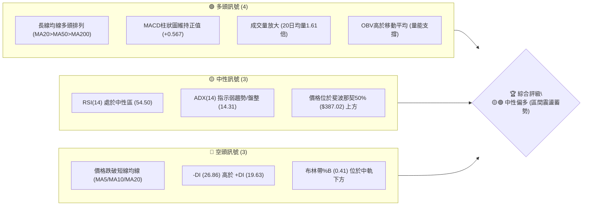
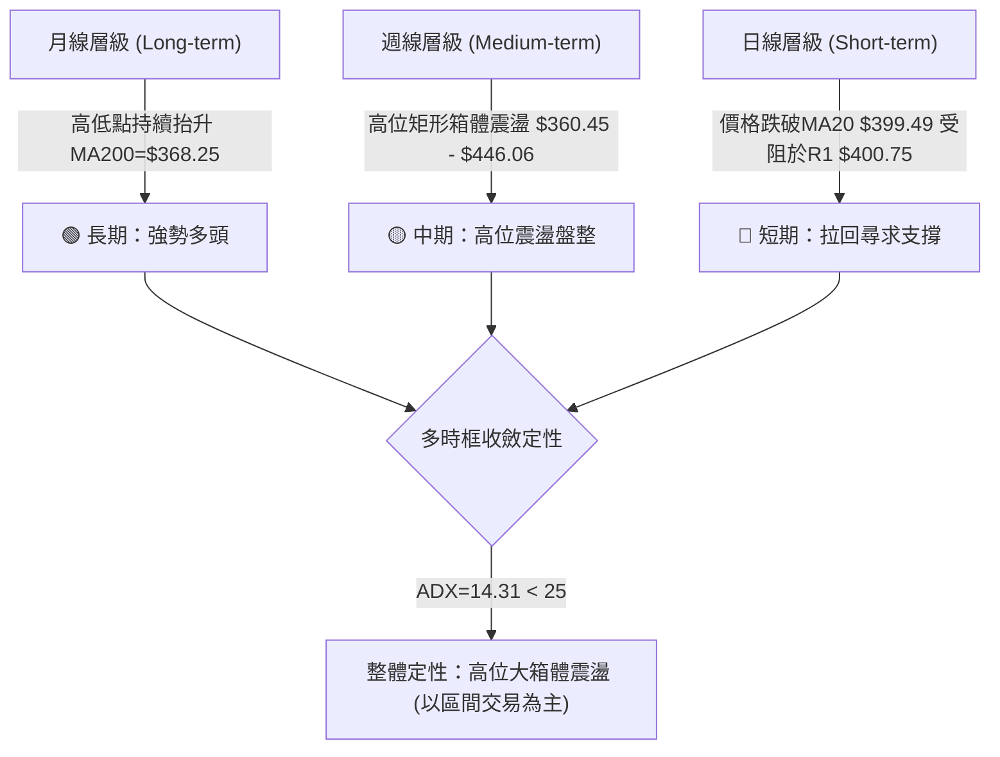
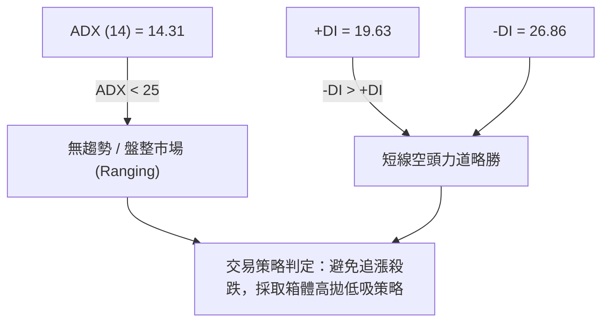
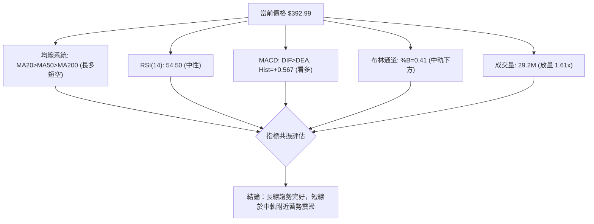
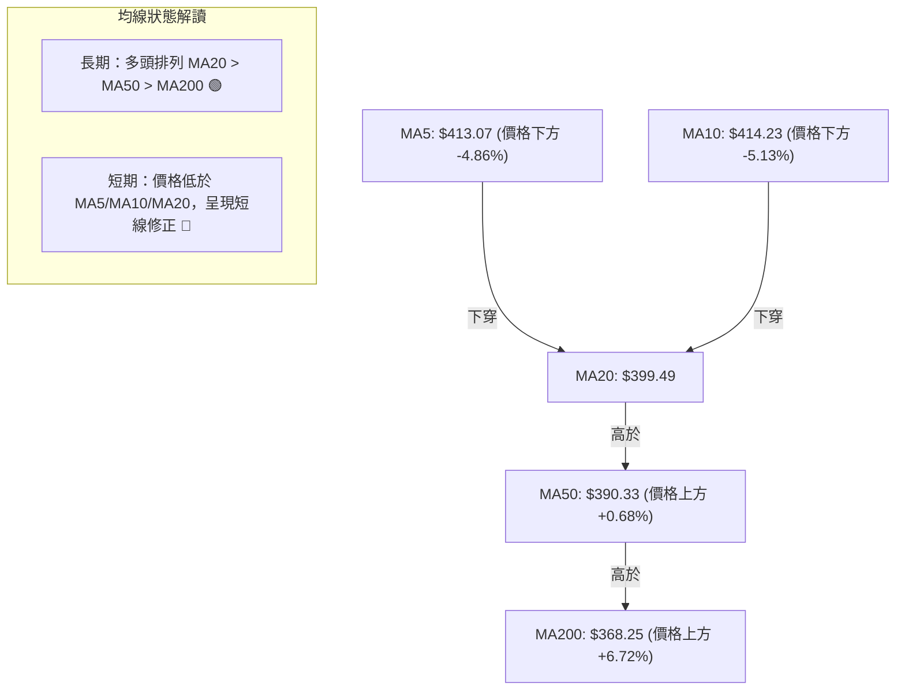
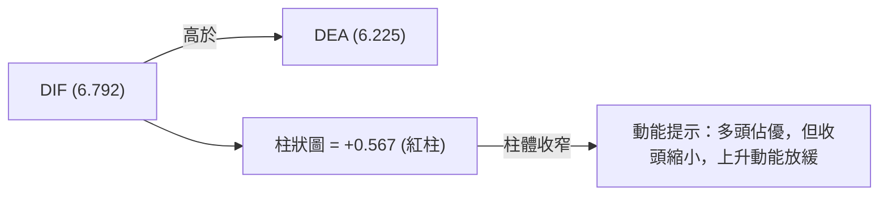
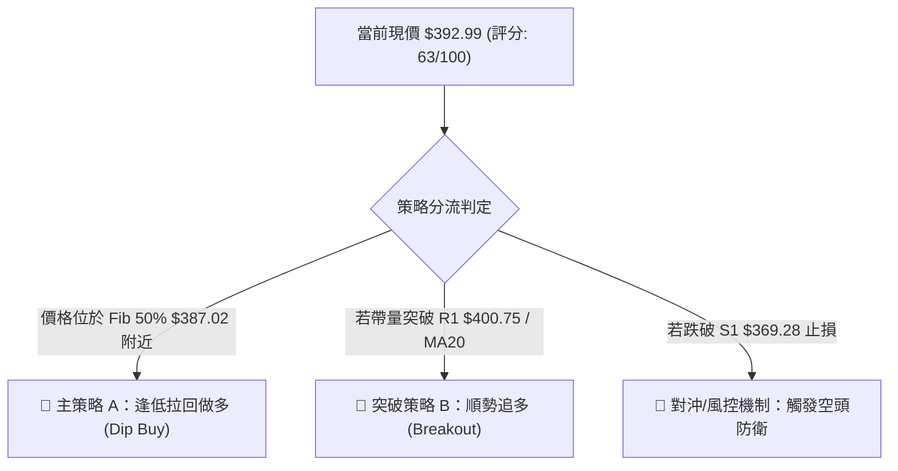
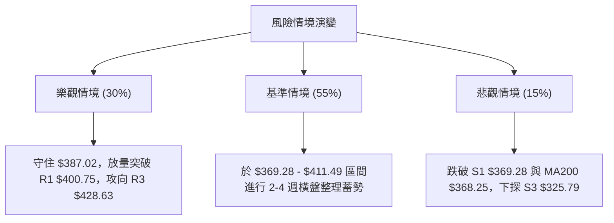

# AVGO 技術分析報告

> **報告日期**：2026-08-15 ｜ **語言**：繁體中文 ｜ **數據來源**：Yahoo Finance ｜ **當前價格**：$392.99

---

## 目錄

| 章節 | 內容 |
|------|------|
| [1. 技術面概覽](#1-技術面概覽) | 訊號儀表板、核心指標、評分卡 |
| [2. 趨勢分析](#2-趨勢分析) | 多時框趨勢、長中短期走勢、ADX解讀 |
| [3. 圖表形態分析](#3-圖表形態分析) | 形態識別、信心度、K線組合、目標價 |
| [4. 支撐與阻力](#4-支撐與阻力) | 關鍵價位、斐波那契回調 |
| [5. 技術指標深度解讀](#5-技術指標深度解讀) | MA/RSI/MACD/布林通道/成交量 |
| [6. 動能與波動率](#6-動能與波動率) | 動能四象限、ATR、Beta |
| [7. 多時框架總結](#7-多時框架總結) | 時框架評分矩陣、多時框收斂結論 |
| [8. 交易策略建議](#8-交易策略建議) | 策略路由、情境階梯、多空策略、風險報酬比 |
| [9. 風險提示與監控](#9-風險提示與監控) | 監控清單、風險場景、風險管理 |

---

## 1. 技術面概覽

### 🎯 技術訊號儀表板



### 📊 核心指標速覽表

| 指標類別 | 指標名稱 | 當前數值 | 訊號 | 解讀 |
|----------|----------|----------|------|------|
| **價格** | 當前收盤價 | $392.99 | 🟡 中性 | 位於52週高低點區間之 52.8% 位置 |
| **均線** | MA20 (月線) | $399.49 | 🔴 空頭 | 價格跌破MA20 (-1.63%)，短線承壓 |
| **均線** | MA50 (季線) | $390.33 | 🟢 多頭 | 價格維持在MA50上方 (+0.68%)，中期支撐有效 |
| **均線** | MA200 (年線) | $368.25 | 🟢 多頭 | 價格遠高於MA200 (+6.72%)，長期多頭格局未變 |
| **動能** | RSI(14) | 54.50 | 🟡 中性 | 無超買超賣，多空動能暫趨均衡 |
| **動能** | MACD(12,26,9) | +0.567 | 🟢 多頭 | DIF(6.792) > DEA(6.225)，柱狀圖維持紅柱 |
| **趨勢** | ADX(14) | 14.31 | 🟡 盤整 | ADX < 25，市場處於無明確單邊趨勢的震盪期 |
| **波動** | ATR(14) | $16.84 | 🟡 中度 | 每日波幅約 4.29%，屬於半導體類股正常波動 |
| **通道** | 布林通道 %B | 0.41 | 🟡 中性 | 價格處於中軌 ($399.49) 與下軌 ($363.53) 之間 |
| **量能** | 成交量 / 20日均量 | 1.61x | 🟢 多頭 | 2,920萬股，量能顯著放大，多空交戰激烈 |

### 🏆 技術評分卡

```
╔══════════════════════════════════════════════════════════════════╗
║                技術評分卡 — AVGO (2026-08-15)                    ║
╠══════════════════════════════════════════════════════════════════╣
║ 趨勢強度 (ADX)     ███████░░░░░░░░░░░░░  35/100  🟡 弱趨勢/盤整   ║
║ 動能指標 (RSI/MACD) ████████████░░░░░░░░  60/100  🟢 中性偏多     ║
║ 支撐穩定度 (S1-S3)  ████████████████░░░░  80/100  🟢 支撐強勁     ║
║ 成交量配合 (OBV)   ██████████████░░░░░░  70/100  🟢 量能支撐     ║
║ 形態完整度 (箱體)   ████████████░░░░░░░░  60/100  🟡 箱體震盪     ║
║ 均線排列 (多頭)     ████████████████░░░░  75/100  🟢 長期多頭     ║
╠══════════════════════════════════════════════════════════════════╣
║ 綜合技術評分        █████████████░░░░░░░  63/100  🟡🟢 中性偏多   ║
╚══════════════════════════════════════════════════════════════════╝
```

---

## 2. 趨勢分析

### 🌐 多時框趨勢分析



### 📈 長期趨勢 — 24個月走勢歷史（Unicode）

```
AVGO 月線走勢圖（2024-08 至 2026-08）
價格軸 ($)
$450 ┤                                                 ● (2026-05: $446.06)
$400 ┤                                           ●  ●     ●      ● (2026-08: $392.99)
$350 ┤                                  ●  ●  ●        ●
$300 ┤                           ●  ●
$250 ┤                 ●  ●   ●
$200 ┤           ●  ●
$150 ┤ ●  ●  ●  ●
     └─┬──┬──┬──┬──┬──┬──┬──┬──┬──┬──┬──┬──┬──┬──┬──┬──┬──┬──┬──┬──┬──┬──┬──┬──
       08 09 10 11 12 01 02 03 04 05 06 07 08 09 10 11 12 01 02 03 04 05 06 07 08
       ─── 2024年 ───┴────────────── 2025年 ──────────────┴──────── 2026年 ─────
```

#### 24個月走勢特徵分析

| 階段 | 時間區間 | 價格區間 | 漲跌幅 | 走勢特徵與技術解讀 |
|------|----------|----------|--------|----------------────|
| **第一階段** | 2024-08 ~ 2024-11 | $159.81 - $159.61 | -0.12% | **底部打底期**：於 $160 附近進行長達4個月的橫盤整理。 |
| **第二階段** | 2024-12 ~ 2025-03 | $228.92 - $165.82 | -27.56%| **爆發後回檔**：12月暴漲至 $228.92，隨後展開降溫修正。 |
| **第三階段** | 2025-04 ~ 2025-11 | $190.62 - $400.71 | +110.21%| **主升段起飛**：AI晶片需求爆發，股價連續8個月推升至400大關。 |
| **第四階段** | 2025-12 ~ 2026-03 | $344.83 - $309.02 | -10.38%| **高位估值修正**：觸及歷史高位後回落，打出 $309 區域中期底部。 |
| **第五階段** | 2026-04 ~ 2026-08 | $416.77 - $392.99 | -5.71% | **高位寬幅震盪**：5月創出 $446.06 階段高點後，於 $360-$430 區間震盪。 |

### 📊 中期趨勢（週線分析）

近20週收盤走勢顯示，AVGO 在2026年4月中旬創下 $429.32 與5月 $446.06 的波段高點後，展開二次回檔。6月底至7月初回探 $360.45 低點，隨後受強勁買盤支撐強勢反彈，8月上旬一度攻至 $427.76，目前收於 $392.99。

週線層面已形成標準的 **$360.00 – $430.00 大箱體震盪區間**。當前價格 $392.99 恰好位於該箱體的中軸區域（50% 斐波那契回調位 $387.02 附近）。

### ⚡ 趨勢強度評估（ADX 解讀）



#### ADX 強度指標對照分析

| 指標參數 | 當前數值 | 臨界值 | 市場狀態 | 策略意涵 |
|----------|----------|--------|----------|----------|
| **ADX(14)** | **14.31** | 25.00 | 🟡 弱趨勢 / 盤整行情 | 趨勢指標（如MA交叉）易出現虛假訊號 |
| **+DI** | **19.63** | - | 🔴 買盤動能衰退 | 多頭主導力道不足 |
| **-DI** | **26.86** | - | 🔴 賣盤動能占優 | 賣壓短期占據上風，但未形成崩潰性趨勢 |

---

## 3. 圖表形態分析

### 🔍 形態識別系統

根據近一年 OHLCV 價格走勢，進行幾何與指標形態判定：

| 形態名稱 | 信心度 | 判斷依據（引用數據） | 完成度 | 目標價計算式與精確數值 |
|----------|--------|----------------------|--------|------------------------|
| **高位矩形箱體** | **75%** | 上軌阻力 R3 $428.63，下軌支撐 S1 $369.28 / 7月低點 $360.45 | 85% | 箱體高度 = $428.63 - $360.45 = $68.18<br>向上突破目標 = $428.63 + $68.18 = **$496.81** |
| **W底（雙重底）** | **40%** | 6/28 低點 $365.02 與 7/5 低點 $360.45 構成雙底雛形 | 40% | 訊號不足，僅做指標型解讀（未突破頸線 $427.76，不成立） |

> **形態信心度規則宣告**：W底形態因未帶量突破頸線 $427.76，信心度僅 40%（<50%），依數據紀律不作為主交易依據，主要以 **75% 信心度的「高位矩形箱體震盪」** 作為研判基礎。

### 🕯️ 重要 K 線形態分析（近3個月）

| 時間區間 | 代表收盤價 | K線形態 | 技術特徵分析 | 多空訊號 |
|----------|------------|---------|--------------|----------|
| 2026-06-07 | $385.12 | 大陰線 | 單週成交量達 2.51 億股（放量下殺），確立高位獲利了結賣壓。 | 🔴 賣出訊號 |
| 2026-07-05 | $360.45 | 錘頭線/下影線 | 週成交量縮至 1.03 億股，於 S1 $369.28 下方見買盤強烈抵抗。 | 🟢 止跌訊號 |
| 2026-08-09 | $427.76 | 長陽線 | 週線放量大漲，再次挑戰 R3 $428.63 阻力區。 | 🟢 突破訊號 |
| 2026-08-16 | $392.99 | 中陰線拉回 | 受到 R3 $428.63 強壓拉回，收在 MA20 ($399.49) 下方，進入回檔測試。 | 🔴 短期壓制 |

### 📉 ASCII 高位矩形箱體形態示意圖

```
AVGO 高位矩形箱體震盪示意圖 (2026-05 至 2026-08)
─────────────────────────────────────────────────────────────────
$446.06 ┬─────────────────────● (5月高點)────────────────────────
        │                     │
$428.63 ┼───────────●─────────┼───────────● (8/9阻力高點 R3)────── 箱體上軌 (Resistance)
        │          ╱ ╲        │          ╱ ╲
$400.75 ┼─────────╱───╲───────┼─────────╱───╲──● $392.99 (現價)── 中軸臨界點
        │        ╱     ╲      │        ╱     ╲
$369.28 ┼───────●───────╲─────┼───────●───────╲────────────────── 箱體下軌 (Support S1)
        │  (6/28低點)    ●────┴─────────── (7/5低點 $360.45)
─────────────────────────────────────────────────────────────────
```

### 🎯 形態目標價計算

若未來價格向上放量突破箱體上軌 R3 ($428.63)：
- **形態高度 (H)** = 箱體頂部 $428.63 - 箱體底部 $360.45 = **$68.18**
- **向上突破目標價** = $428.63 + $68.18 = **$496.81** (接近 52週高點 $494.22)

若未來價格向下放量跌破箱體下軌 S1 ($369.28)：
- **向下跌破目標價** = $369.28 - $68.18 = **$301.10** (接近 S3 $325.79 支撐帶)

---

## 4. 支撐與阻力

### 🗺️ 關鍵價位分布圖（Unicode）

```
AVGO 價位結構分布圖 (當前價格: $392.99)
═════════════════════════════════════════════════════════════════
$494.22 ║████████████████████████████████████║ 52週最高點 (52W High)
$443.62 ║████████████████████████            ║ 斐波那契 23.6% 回調位
$428.63 ║████████████████████████████████████║ 關鍵阻力 R3 (箱體頂部)
$411.49 ║████████████████████                ║ 波段阻力 R2 / Fib 38.2% ($412.32)
$400.75 ║████████████████████████            ║ 近期阻力 R1 / MA20 ($399.49)
$392.99 ╠════════════════════════════════════╣ ◄ 當前收盤價 (Current Price)
$387.02 ║▓▓▓▓▓▓▓▓▓▓▓▓▓▓▓▓▓▓▓▓▓▓▓▓            ║ 斐波那契 50.0% 回調位 / MA50 ($390.33)
$369.28 ║████████████████████████████████████║ 關鍵支撐 S1 (箱體底部)
$361.72 ║████████████████████                ║ 斐波那契 61.8% 回調位 / S2 ($357.11)
$325.79 ║████████████████████████████████████║ 強力支撐 S3 / Fib 78.6% ($325.70)
$279.82 ║████████████████████████████████████║ 52週最低點 (52W Low)
═════════════════════════════════════════════════════════════════
```

### 🚧 阻力位分析表

| 阻力級別 | 精確價位 | 形成原因與技術共振 | 突破難度 | 重要性評級 |
|----------|----------|--------------------|----------|------------|
| **R1** | **$400.75** | 近一年波段高點聚類 + MA20 ($399.49) + 布林中軌 | 🟡 中等 | 🟢🟢🟢 短線多空分水嶺 |
| **R2** | **$411.49** | 波段高點聚類 + MA5 ($413.07) + Fib 38.2% ($412.32) | 🔴 較難 | 🟢🟢🟢🟢 蓋頂均線壓力區 |
| **R3** | **$428.63** | 箱體頂部強壓 + 8/9週線反彈高點 ($427.76) | 🔴🔴 極難 | 🟢🟢🟢🟢🟢 中期多頭突破點 |

### 🛡️ 支撐位分析表

| 支撐級別 | 精確價位 | 形成原因與技術共振 | 守住機率 | 重要性評級 |
|----------|----------|--------------------|----------|------------|
| **S1** | **$369.28** | 近一年波段低點聚類 + MA200 ($368.25) + 布林下軌 ($363.53) | 🟢 高 (75%) | 🟢🟢🟢🟢🟢 生命線強固支撐 |
| **S2** | **$357.11** | 波段低點聚類 + Fib 61.8% ($361.72) | 🟢 中高 (65%) | 🟢🟢🟢🟢 關鍵防守線 |
| **S3** | **$325.79** | 波段低點聚類 + Fib 78.6% ($325.70) | 🟢 極高 (85%) | 🟢🟢🟢🟢🟢 長線牛熊分界線 |

### 📐 斐波那契回調位分析（52週區間：$279.82 → $494.22）

當前價格 **$392.99** 精確部位於 **50.0% 回調位 ($387.02)** 與 **38.2% 回調位 ($412.32)** 之間。

| 回調比例 | 精確價位 | 與現價差距 | 技術解讀與意義 |
|----------|----------|------------|----------------|
| **0.0%** (52W High) | $494.22 | +25.76% | 歷史最高天花板 |
| **23.6%** | $443.62 | +12.88% | 強勢多頭回檔極限（5月高點 $446.06 止步於此） |
| **38.2%** | $412.32 | +4.92% | 上檔關鍵阻力區（與 R2 $411.49 形成高度共振） |
| **50.0%** | **$387.02** | **-1.52%** | **多空中性均衡點（現價貼近此處，下有 MA50 $390.33 支撐）** |
| **61.8%** | $361.72 | -7.96% | 黃金分割強支撐（與 S1 $369.28 / S2 $357.11 形成防禦帶） |
| **78.6%** | $325.70 | -17.12% | 深幅修正極限（與 S3 $325.79 完全重合） |
| **100.0%** (52W Low)| $279.82 | -28.80% | 52週起漲點底部 |

---

## 5. 技術指標深度解讀

### 🎛️ 指標訊號總覽



### 📈 移動平均線排列分析



均線系統數據顯示：
1. **短線死叉壓制**：MA5 ($413.07) 與 MA10 ($414.23) 均高於現價，且扣抵高價區，對現價形成短線第一道重壓。
2. **中期支撐浮現**：現價 $392.99 守在 MA50 ($390.33) 上方，且 MA120 ($381.09) 與 MA200 ($368.25) 持續上揚，顯示中長期買盤基底非常穩固。

### 📉 RSI(14) 分析

**當前 RSI(14) 數值**：`54.50`

```
RSI(14) 指標狀態
0              30              50     54.50      70             100
├──────────────┼───────────────┼───────★─────────┼──────────────┤
  超賣區 (Oversold)    中性偏弱      中性偏多    超買區 (Overbought)
  ███████████████████████████████████████████░░░░░░░░░░░░░░░░░ 54.5%
```

- **超買/超賣判斷**：RSI 位於 54.50，遠離超買區 (>70) 與超賣區 (<30)，處於標準的**中性區間**。
- **背離判斷**：對比 8月上旬價格反彈至 $427.76 時 RSI 為 73.6，隨後價格回落至 $392.99，RSI 降至 54.50，指標跟隨價格調整，**無明顯頂背離或底背離**。

### 📊 MACD(12,26,9) 訊號解讀

- **MACD 線 (DIF)**：`6.792`
- **Signal 線 (DEA)**：`6.225`
- **MACD 柱狀圖 (Histogram)**：`+0.567` 🟢 **看多**



雖然 MACD 柱狀圖維持在正值 (+0.567)，但相比前一週的 +5.364 顯著縮小，說明多頭衝高後買盤追高意願減弱，指標轉入高位整理。

### 📦 布林通道 (Bollinger Bands) 分析

```
布林通道結構與現價位置 ($392.99)
─────────────────────────────────────────────────────────────────
$435.44 ┼──────────────────────────────────────── 布林上軌 (BB Upper)
        │
$399.49 ┼───中軌 (MA20) ───────────────────────── 布林中軌 (BB Middle)
        │    ★ $392.99 (現價位於中軌下方)
$363.53 ┼──────────────────────────────────────── 布林下軌 (BB Lower)
─────────────────────────────────────────────────────────────────
通道位置 (%B): 0.41  [████████████░░░░░░░░░░░] (0=下軌, 0.5=中軌, 1=上軌)
```

- **通道寬度**：上軌 $435.44，下軌 $363.53，通道呈現平行收斂狀態，證實市場進入波動壓縮期。
- **%B 位置**：當前 %B 為 **0.41**，低於 0.5 中軌線，顯示短線價格偏向下軌尋求支撐。

### 💹 成交量與 OBV 分析

- **當日成交量**：29,203,339 股
- **20日平均成交量**：18,087,847 股（**量比 1.61x**）
- **OBV 趨勢**：`OBV > MA` 🟢 **量能支撐上漲**

成交量放大至均量的 1.61 倍，配合 OBV 趨勢高於其移動平均線，表明在 $390.00 – $393.00 區域有積極的換手與低吸買盤接手，並非無量陰跌。

---

## 6. 動能與波動率

### ⚡ 動能評估四象限

根據當前 ADX(14)=14.31 (低趨勢) 與 ATR(14)=$16.84 (中波幅)，AVGO 於四象限中的定位如下：

| 象限區分 | 動能強度 (Momentum) | 波動率 (Volatility) | 當前狀態 | 策略指南 |
|----------|---------------------|---------------------|----------|----------|
| **Q1：高動能 / 低波動** | 強 (ADX > 25) | 低 (ATR% < 3%) | — | 強勢趨勢續抱 |
| **Q2：弱動能 / 低中波動**| **弱 (ADX = 14.31)** | **中 (ATR% = 4.29%)** | **✓ AVGO 當前位置** | **箱體低吸高拋 / 區間震盪** |
| **Q3：強動能 / 高波動** | 強 (ADX > 25) | 高 (ATR% > 5%) | — | 突破追價，嚴設止損 |
| **Q4：弱動能 / 高波動** | 弱 (ADX < 25) | 高 (ATR% > 5%) | — | 觀望，避開洗盤 |

### 📊 ATR 波動率分析

- **ATR(14)**：`$16.84`（佔當前股價 4.29%）
- **每日預期波動範圍**：$392.99 ± $16.84（即 **$376.15 – $409.83**）
- **風控止損距離建議**：
  - **緊密止損 (1.0x ATR)**：$16.84 → 適合日內或極短線交易
  - **標準止損 (1.5x ATR)**：$25.26 → 建議止損距離（如進場點 $387.02 - $25.26 = $361.76）
  - **寬鬆止損 (2.0x ATR)**：$33.68 → 適合中長線佈局防守

### 📐 Beta 與市場相關性

- **Beta 係數**：`1.473`
- **技術解讀**：AVGO 的波動度約為標普500指數的 1.47 倍，屬於高 Beta 科技領導股。在大盤上漲時具備強大的放大彈性，但在市場拉回時回檔幅度亦相對較深。

---

## 7. 多時框架總結

### 📋 時框架評分表

| 時框架 | 趨勢方向 | 動能狀態 | 均線排列 | 形態結構 | 綜合評分 | 交易建議 |
|--------|----------|----------|----------|----------|----------|----------|
| **月線 (Monthly)** | 🟢 多頭 | 🟢 強勁 | 🟢 多頭排列 | 巨型上升通道 | **80/100** | 長線堅定持股 |
| **週線 (Weekly)** | 🟡 震盪 | 🟡 中性 | 🟢 支撐穩固 | 大箱體 ($360-$430) | **65/100** | 逢低分批佈局 |
| **日線 (Daily)** | 🔴 偏空 | 🟡 中性 | 🔴 短線死叉 | 中軌下方打底 | **50/100** | 等待止跌訊號 |

### 🔲 綜合訊號矩陣

```
╔══════════════════════════════════════════════════════════════════╗
║                   多時框訊號一致性評估                           ║
╠══════════════════════════════════════════════════════════════════╣
║ 長期 (月線) ───[ 多頭 🟢 ]──┐                                   ║
║                             ├──► 結論：長期趨勢為底，中期箱體震盪║
║ 中期 (週線) ───[ 震盪 🟡 ]──┤    日線回檔提供箱體下軌買點       ║
║                             │                                    ║
║ 短期 (日線) ───[ 偏空 🔴 ]──┘                                   ║
╚══════════════════════════════════════════════════════════════════╝
```

### ⚖️ 多時框收斂結論

依據多時框收斂規則：當前 ADX = 14.31 (< 25)，屬於典型的**無趨勢箱體盤整行情**。

- **主導時框**：週線與日線布林通道區間（$363.53 – $435.44）主導交易區間。
- **唯一方向性結論**：**🟡🟢 中性偏多（箱體低吸高拋區間操作）**。
- **核心操作邏輯**：無視短線日線級別的指標雜訊，利用股價接近箱體下軌支撐區（Fib 50% $387.02 至 S1 $369.28）時進行分批低吸，目標看回箱體中上軌（R1 $400.75 至 R2 $411.49）。

---

## 8. 交易策略建議

### 🗺️ 策略決策流程圖



### 🧭 策略路由

> **當前主策略方向 = 🟡🟢 中性偏多／箱體低吸操作（依綜合評分 63/100 分流）**

### 🎯 價格情境階梯 (Price Scenarios)

| 觸發條件 | 下一目標價 | 後續延伸目標 | 情境含義與操作指引 |
|----------|------------|--------------|----------------────|
| **強勢突破 R1 $400.75** | R2 **$411.49** | R3 **$428.63** | 短線轉強，阻力變支撐，加碼做多 |
| **站穩 $387.02 – $400.75** | — | — | 箱體內部震盪打底，維持觀望或低吸持股 |
| **跌破 S1 $369.28** | S2 **$357.11** | S3 **$325.79** | 中期箱體破位，嚴格執行止損離場 |

### 📊 情境機率分佈

```
情境機率分佈評估
┌──────────────────────────────────────┬───────────────────┬──────────┐
│ 情境劇本                             │ 機率估計          │ 關鍵依據 │
├──────────────────────────────────────┼───────────────────┼──────────┤
│ 🟢 劇本一：拉回支撐成功反彈 (箱體震盪)│ █████████████ 55% │ MA50/Fib 50% 共振支撐，OBV高於MA │
│ 🟡 劇本二：窄幅橫盤打底              │ ███████ 30%       │ ADX=14.31，買賣雙方動能均受限    │
│ 🔴 劇本三：跌破 S1 深入修正          │ ████ 15%          │ -DI > +DI，短線賣壓尚未完全釋放  │
└──────────────────────────────────────┴───────────────────┴──────────┘
```

### 🟢 主策略詳情

#### 策略 A：逢低拉回做多（主推低吸策略）
- **進場條件**：價格回檔至 Fib 50% 回調位 ($387.02) 至 MA50 ($390.33) 區間，出現日線止跌訊號。
- **建議進場價**：`$388.50`（取 $387.02 與 $390.33 中間值）
- **目標價 T1**：`$411.49`（R2 阻力位 / Fib 38.2%）
- **目標價 T2**：`$428.63`（R3 箱體頂部）
- **止損價格**：`$369.28`（精確取 S1 關鍵支撐位，跌破即代表箱體失守）
- **風險報酬比**：
  - **至 T1**：潛在虧損 $19.22，潛在獲利 $22.99 ➔ **1.20 : 1**
  - **至 T2**：潛在虧損 $19.22，潛在獲利 $40.13 ➔ **2.09 : 1**
- **勝率估計**：`60%`
- **建議倉位**：`15% - 20%`

#### 策略 B：突破確認做多（右側追擊策略）
- **進場條件**：日線收盤價強勢突破 R1 ($400.75) 且站穩 MA20 ($399.49) 上方，成交量 > 2,500萬股。
- **建議進場價**：`$401.50`
- **目標價 T1**：`$428.63`（R3 箱體頂部）
- **目標價 T2**：`$443.62`（Fib 23.6% 回調位）
- **止損價格**：`$387.02`（Fib 50.0% 回調位）
- **風險報酬比**：
  - **至 T1**：潛在虧損 $14.48，潛在獲利 $27.13 ➔ **1.87 : 1**
  - **至 T2**：潛在虧損 $14.48，潛在獲利 $42.12 ➔ **2.91 : 1**
- **勝率估計**：`55%`
- **建議倉位**：`10% - 15%`

### 🔴 反向風險觸發點（對沖與撤退提示）

若股價放量跌破 **S1 ($369.28)** 且日線收低於 **MA200 ($368.25)**：
1. **多頭策略全面失效**，應立即執行止損。
2. 空頭下一目標將直指 **S2 ($357.11)** 與 **S3 ($325.79)**。
3. 建議投資人多單出場，觀望或採取套期保值對沖策略。

### ⭐ 整體訊號強度評星

```
做多訊號強度：★★★☆☆  (3.5/5星)  — 長線多頭，短線等待低吸點位
做空訊號強度：★★☆☆☆  (2.0/5星)  — 下有巨量均線支撐，做空空間受限
整體可信度：  ★★★★☆  (4.0/5星)  — 價位與指標高度共振，可信度高
```

---

## 9. 風險提示與監控

### ✅ 關鍵監控指標 Checklist

```
╔══════════════════════════════════════════════════════════════════╗
║                   每日交易監控 Checklist                         ║
╠══════════════════════════════════════════════════════════════════╣
║ [ ] 價格是否跌破 Fib 50% ($387.02)？ (若跌破，留意 S1 $369.28 防守)║
║ [ ] 價格是否放量突破 R1 ($400.75)？ (若突破，啟動右側加碼)      ║
║ [ ] RSI(14) 是否跌破 50 中軸？ (跌破 50 代表空頭掌控短線動能)   ║
║ [ ] MACD 柱狀圖是否轉為綠柱 (負值)？ (若轉負，修正時間將延長)   ║
║ [ ] 日成交量是否維持在 1,800萬股（20日均量）以上？               ║
╚══════════════════════════════════════════════════════════════════╝
```

### ⚠️ 風險場景分析



### 🛡️ 風險管理重要提醒

1. **嚴格控制倉位**：鑑於 ADX = 14.31 處於無趨勢震盪期，單一股票總持倉建議控制在總投資組合的 **15% – 20%** 以內，切忌滿倉操作。
2. **遵守止損紀律**：策略 A 止損點設於 **$369.28**，策略 B 止損點設於 **$387.02**，一旦觸及必須無條件執行，防範單邊下殺風險。
3. **動態調整止盈**：若股價如預期反彈至 R2 ($411.49) 以上，建議將止損價向上移動至保本點（進場價），鎖定既有利潤。

---

## 📋 報告總結

```
╔══════════════════════════════════════════════════════════════════╗
║                    AVGO 技術分析報告總結                         ║
╠══════════════════════════════════════════════════════════════════╣
║ 報告日期：2026-08-15                                             ║
║ 當前價格：$392.99                                                ║
║ 綜合評級：🟡🟢 中性偏多 (箱體震盪蓄勢)                           ║
║                                                                  ║
║ 關鍵結論：                                                       ║
║ ├─ 長期趨勢：🟢 多頭格局未變 (MA200 = $368.25 強勢支撐)          ║
║ ├─ 中期趨勢：🟡 高位大箱體震盪 ($360.45 – $428.63)               ║
║ ├─ 短期趨勢：🔴 受阻於 R1 $400.75，回檔測試 Fib 50% ($387.02)    ║
║ ├─ 關鍵支撐：S1 $369.28 ｜ S2 $357.11 ｜ S3 $325.79               ║
║ ├─ 關鍵阻力：R1 $400.75 ｜ R2 $411.49 ｜ R3 $428.63               ║
║ └─ 分析師目標價：均價 $527.88 (強烈買入 Consensus)                ║
║                                                                  ║
║ 最優策略組合：                                                   ║
║ 1. 🥇 最佳機會 (策略A)：拉回 $388.50 分批低吸，目標 $411.49/$428.63║
║ 2. 🥈 次選機會 (策略B)：突破 $401.50 順勢追多，目標 $428.63/$443.62║
║ 3. 🥉 保守選擇：等待價格回到 S1 $369.28 附近出現明確止跌K線再進場║
╚══════════════════════════════════════════════════════════════════╝
```

---

> ⚠️ **免責聲明**：本報告為 AI 自動生成之技術分析，所有數據及估算均基於提供的歷史價格資訊。本報告**僅供研究與學術參考**，**不構成任何投資建議**。投資有風險，入市需謹慎。

---

*報告生成時間：2026-08-15 ｜ 數據來源：Yahoo Finance ｜ 分析框架：多時框技術分析*