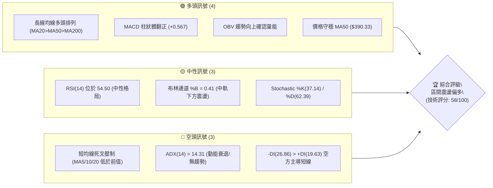
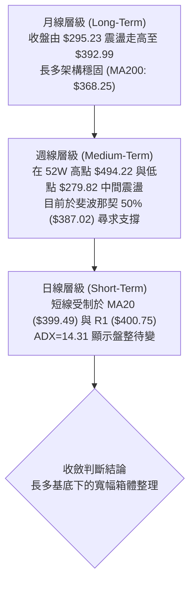
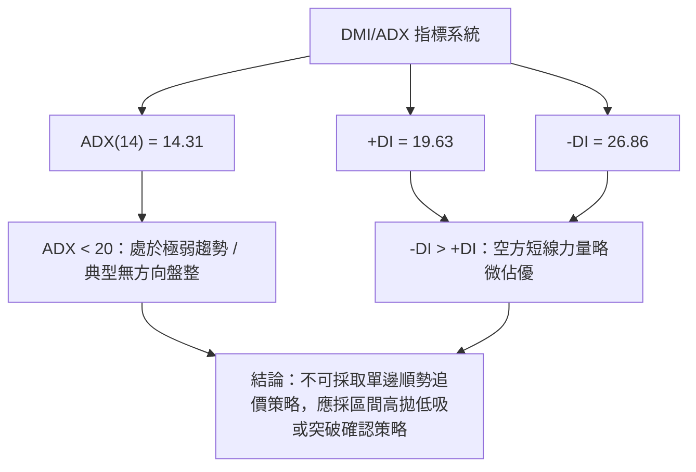
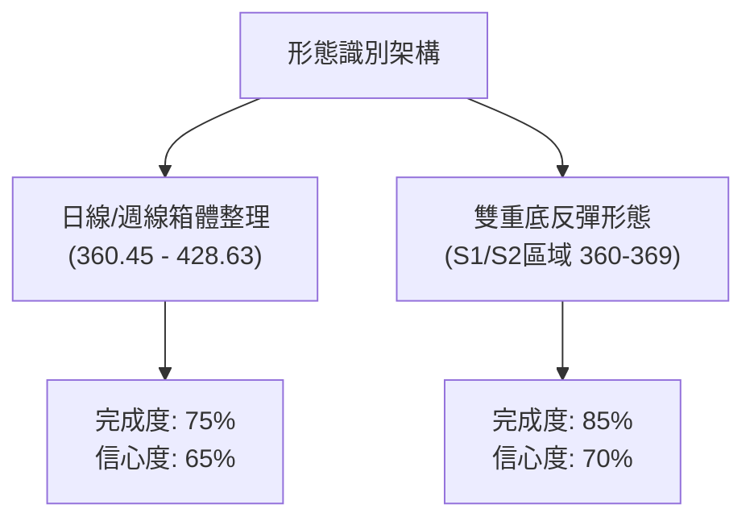
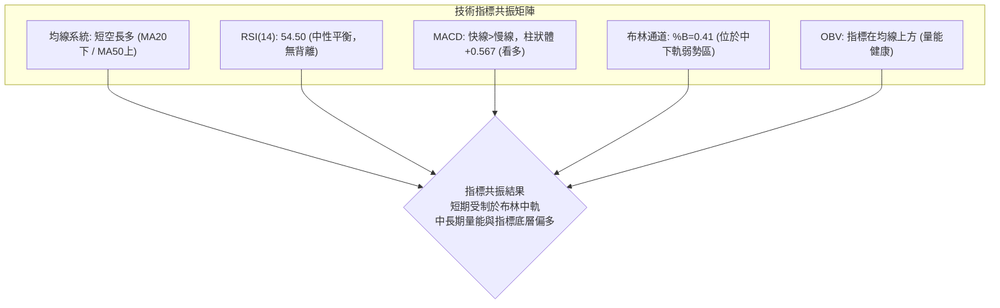
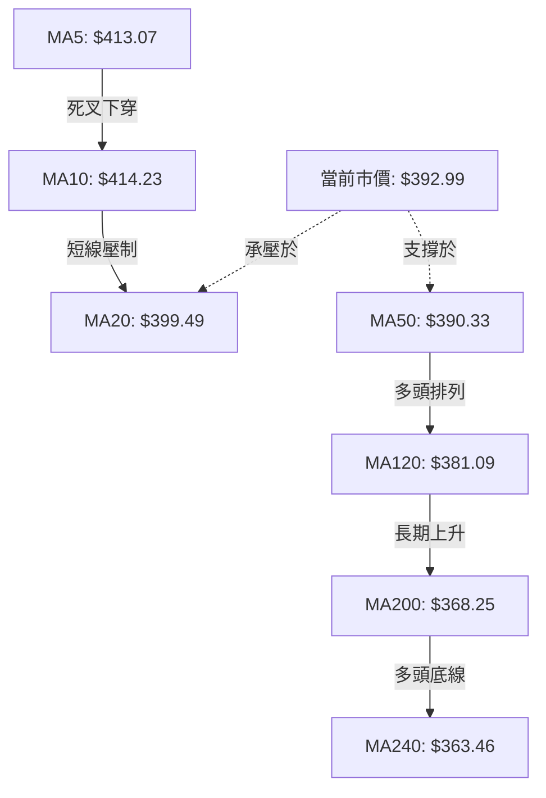
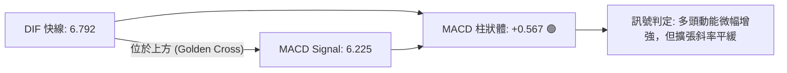
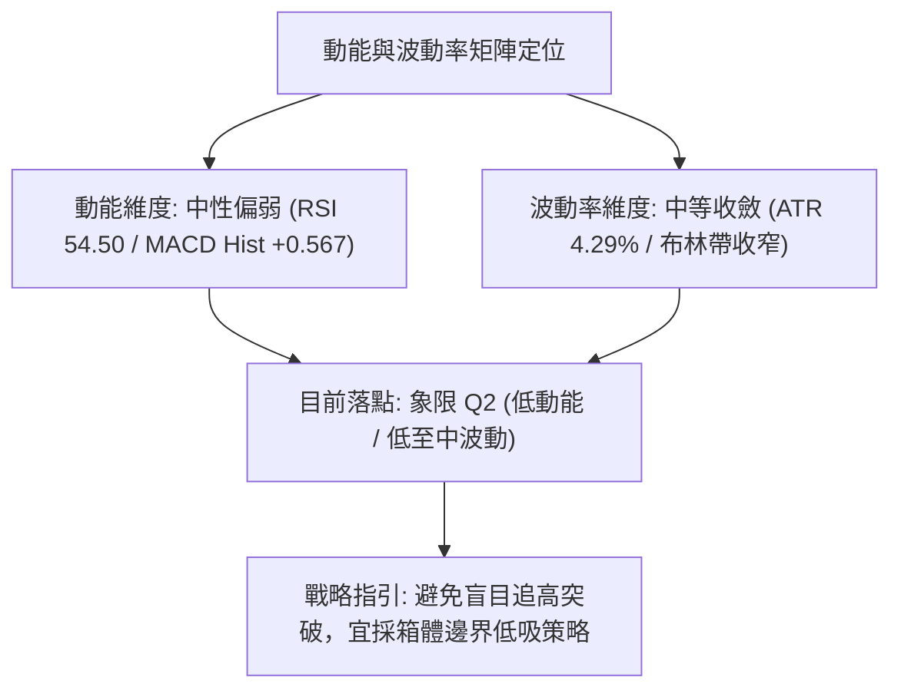
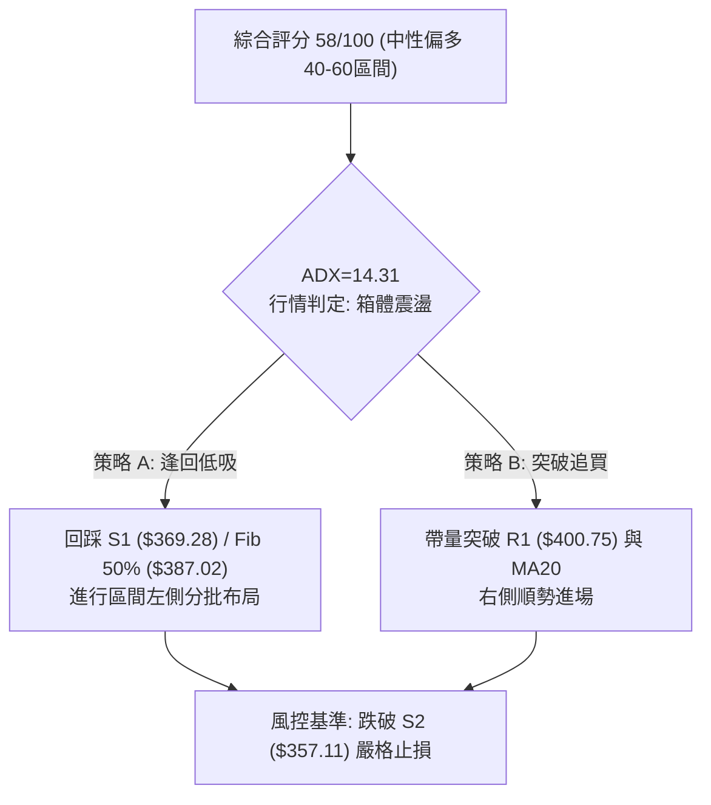
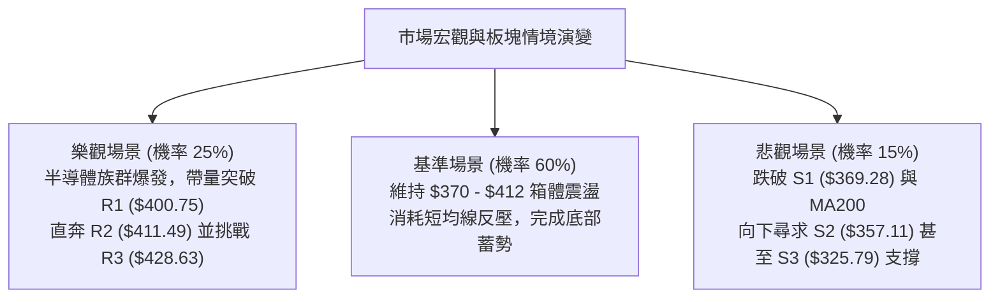

# AVGO 技術分析報告

> **報告日期**：2026-08-17 ｜ **語言**：繁體中文 ｜ **數據來源**：Yahoo Finance ｜ **當前價格**：$392.99

---

## 目錄

| 章節 | 內容 |
|------|------|
| [1. 技術面概覽](#1-技術面概覽) | 訊號儀表板、核心指標、評分卡 |
| [2. 趨勢分析](#2-趨勢分析) | 多時框趨勢、長中短期走勢 |
| [3. 圖表形態分析](#3-圖表形態分析) | 形態識別、K線組合、目標價 |
| [4. 支撐與阻力](#4-支撐與阻力) | 關鍵價位、斐波那契回調 |
| [5. 技術指標深度解讀](#5-技術指標深度解讀) | MA/RSI/MACD/布林/成交量 |
| [6. 動能與波動率](#6-動能與波動率) | 動能評估、ATR、Beta |
| [7. 多時框架總結](#7-多時框架總結) | 時框架評分矩陣 |
| [8. 交易策略建議](#8-交易策略建議) | 多空策略、風險報酬比 |
| [9. 風險提示與監控](#9-風險提示與監控) | 監控指標、風險場景 |

---

## 1. 技術面概覽

### 🎯 技術訊號儀表板



### 📊 核心指標速覽表

| 指標類別 | 指標名稱 | 當前數值 | 訊號 | 解讀 |
|----------|----------|----------|------|------|
| **價格** | 當前收盤價 | $392.99 | 🟡 | 位於52週區間52.8%分位，中樞震盪 |
| **均線** | MA20 (短線) | $399.49 | 🔴 | 價格位於MA20下方（-1.63%），短線承壓 |
| **均線** | MA50 (中期) | $390.33 | 🟢 | 價格守於MA50上方（+0.68%），中期支撐有效 |
| **均線** | MA200 (長期) | $368.25 | 🟢 | 顯著高於牛熊分界線（+6.72%），長牛格局未變 |
| **動能** | RSI(14) | 54.50 | 🟡 | 位於50中軸上方，無超買超賣，多空平衡 |
| **動能** | MACD (12,26,9) | 6.792 / 6.225 | 🟢 | 快線位於慢線上方，柱狀體 +0.567 呈現看多 |
| **動能** | DMI / ADX(14) | ADX: 14.31 | 🟡 | ADX < 25 表明處於盤整市，-DI(26.86)略佔優 |
| **波動** | ATR(14) | $16.84 | 🟡 | 佔股價 4.29%，波動適中，提供操作空間 |
| **通道** | 布林通道 | $363.53–$435.44 | 🟡 | %B = 0.41，運行於中軌($399.49)與下軌間 |
| **量能** | 當日量 / 20日均量 | 29.43M / 18.10M | 🟢 | 量比 1.63x，OBV > MA 顯示資金未實質流出 |

### 🏆 技術評分卡

```
╔══════════════════════════════════════════════════════════════════╗
║                 技術評分卡 — AVGO (2026-08-17)                  ║
╠══════════════════════════════════════════════════════════════════╣
║ 趨勢強度 (ADX=14.31)    ██████░░░░░░░░░░░░░░  30/100  🔴 盤整無勢 ║
║ 動能指標 (RSI/MACD)     ████████████░░░░░░░░  60/100  🟢 弱勢偏多 ║
║ 支撐穩定度 (MA50/S1)    ██████████████░░░░░░  70/100  🟢 支撐扎實 ║
║ 成交量配合 (OBV/量比)   ██████████████░░░░░░  70/100  🟢 量能支撐 ║
║ 形態完整度 (區間箱體)   ████████████░░░░░░░░  60/100  🟡 形態構築 ║
║ 均線架構 (多頭排列)     ████████████░░░░░░░░  60/100  🟡 短空長多 ║
╠══════════════════════════════════════════════════════════════════╣
║ 綜合評分                ███████████░░░░░░░░░  58/100  🟡 區間震盪 ║
╚══════════════════════════════════════════════════════════════════╝
```

---

## 2. 趨勢分析

### 🌐 多時框趨勢分析



### 📈 長期趨勢 — 12個月走勢圖（Unicode）

```
AVGO 月線走勢圖（過去12個月：2025-08 至 2026-08）
價格 ($)
$460 ┤                                  ● May ($446.06)
$440 ┤
$420 ┤                             ● Apr ($416.77)
$400 ┤              ● Nov ($400.71)
$380 ┤                                       ● Jun ($377.75) ──● Jul/Aug ($392.99)
$360 ┤         ● Oct ($367.57)
$340 ┤                   ● Dec ($344.83)
$320 ┤    ● Sep ($328.07)     ● Jan ($330.08) ● Mar ($309.02)
$300 ┤● Aug ($295.23)              ● Feb ($318.38)
$280 ┤
     └────────────────────────────────────────────────────────────
       08   09   10   11   12   01   02   03   04   05   06   07   08 (月份)
```

**走勢特徵分析表格**：

| 階段區間 | 起止價格 | 漲跌幅 | 走勢特徵與量價結構 |
|----------|----------|--------|-------------------|
| **2025/08 - 2025/11** | $295.23 → $400.71 | **+35.73%** | 主升浪行情，月線連四紅，突破 $400 大關 |
| **2025/11 - 2026/03** | $400.71 → $309.02 | **-22.88%** | 獲利回吐修正浪，下探回測前波突破平臺 |
| **2026/03 - 2026/05** | $309.02 → $446.06 | **+44.35%** | 強勁反彈並創波段新高 $446.06（盤中觸及52W高點 $494.22） |
| **2026/05 - 2026/08** | $446.06 → $392.99 | **-11.90%** | 高檔收斂三角/箱體整理，目前於 $390 附近尋求均線支撐 |

### 📊 中期趨勢（週線分析）

從近 20 週數據觀察，AVGO 在 2026 年 5 月底見高 $446.06 後，於 6 月初出現 2.51 億股的巨量長黑回調至 $385.12，並在 2026-07-05 下探波段低點 $360.45。隨後價格於 7 月至 8 月中旬展開震盪修復，8 月初反彈至 $427.76 後遇阻回落，目前收在 $392.99。

- **週線支撐樞紐**：$360.45（7月低點）與斐波那契 61.8%（$361.72）形成雙重底支撐。
- **週線壓力樞紐**：$427.76 - $428.63（R3）為近期反彈頸線壓力區。

### ⚡ 趨勢強度評估（ADX 解讀）



| 指標項 | 當前數值 | 參考閾值 | 趨勢狀態評估 |
|--------|----------|----------|--------------|
| **ADX(14)** | **14.31** | > 25 (強勢) / < 25 (盤整) | 🔴 極弱勢無方向，市場處於能量蓄積期 |
| **+DI(14)** | **19.63** | 數值越高多頭越強 | 🟡 多方進攻意願暫歇 |
| **-DI(14)** | **26.86** | 數值越高空頭越強 | 🔴 空方短線控盤，但無強烈下殺動能 |

---

## 3. 圖表形態分析

### 🔍 形態識別系統



**形態分析與信心度表格**：

| 形態名稱 | 信心度 | 判斷依據（引用數據） | 完成度 | 目標價（附計算式） |
|----------|--------|----------------------|--------|--------------------|
| **箱體震盪 (Rectangle)** | **70%** | 上軌阻力 R3 ($428.63)，下軌支撐 S1 ($369.28) / 7月低點 ($360.45) | **75%** | 箱頂突破目標 = $428.63 + ($428.63 - $360.45) = **$496.81**（逼近52W高點 $494.22） |
| **微型雙底 (Double Bottom)** | **65%** | 兩次低點分別為 2026-06-28 ($365.02) 與 2026-07-05 ($360.45) | **85%** | 頸線 R1 ($400.75)；高度 $400.75 - $360.45 = $40.30；目標 = $400.75 + $40.30 = **$441.05** |
| **大型頭肩頂 (Head & Shoulders)** | **30%** | 左肩 400.71、頭部 494.22、右肩 427.76 | **40%** | *訊號不足，信心度低於50%，僅做風險備忘，不作主操作依據* |

### 🕯️ 重要K線形態分析（近 5 個月月線）

| 月份 | 收盤價 | K線形態 | 解讀 | 訊號 |
|------|--------|---------|------|------|
| **2026-04** | $416.77 | 長陽突破實體 | 帶量突破 340-360 整理區，確認新一輪上升推動 | 🟢 看多 |
| **2026-05** | $446.06 | 帶長上影大陽線 | 盤中衝擊 52W 高點 $494.22 後遭遇獲利了結賣壓 | 🟡 滯漲 |
| **2026-06** | $377.75 | 實體大陰線 | 深度回洗，週量放大至 2.51 億股，殺出恐慌籌碼 | 🔴 看空 |
| **2026-07** | $389.28 | 下影紡錘陽線 | 在 $360.45 止跌回升，收盤重回 MA50 之上，止跌信號 | 🟢 止跌 |
| **2026-08 (現)**| $392.99 | 窄幅十字小陽星 | 多空力量在 $390-$400 關口陷入拉鋸平衡，蓄勢待變 | 🟡 中性 |

### 📉 ASCII 走勢形態示意圖

```
AVGO 近期箱體整理與雙底頸線結構
$430 ┤                    [頂部阻力 R3: $428.63]
     │                      ╭───╮
$410 ┤                      │   │          [頸線 R2: $411.49]
     │        ╭───╮         │   │          [阻力 R1: $400.75]
$390 ┤────────┼───┼─────────┼───┼──────────● 現價: $392.99
     │        │   │  ╭╮     │   │
$370 ┤        │   ╰──╯╰─────╯   │          [底線支撐 S1: $369.28]
     │        │  (底1) (底2)    │          [強支撐 S2: $357.11]
$350 ┤        ╰─────────────────╯
     └───────────────────────────────────────────────
      2026-05   06-28  07-05   08-09  08-17 (當前)
```

---

## 4. 支撐與阻力

### 🗺️ 關鍵價位分布圖（Unicode）

```
AVGO 價位結構分布圖（OHLCV 精確計算）
══════════════════════════════════════════════════════════════════
$494.22 ║████████████████████████████████║ 52W 歷史最高點 (Fib 0.0%)
$443.62 ║████████████████████████        ║ Fib 23.6% 回調壓力
$428.63 ║████████████████████████████    ║ 強阻力 R3 (近一年波段高點)
$411.49 ║████████████████████            ║ 阻力 R2 (Fib 38.2%: $412.32 重合區)
$400.75 ║████████████████████████        ║ 關鍵阻力 R1 (整數心理關卡/頸線)
$392.99 ╠════════════════════════════════╣ ◄ 現價 $392.99 (MA50: $390.33)
$387.02 ║▓▓▓▓▓▓▓▓▓▓▓▓▓▓▓▓▓▓▓▓▓▓▓▓        ║ Fib 50.0% 關鍵平衡位
$369.28 ║▓▓▓▓▓▓▓▓▓▓▓▓▓▓▓▓▓▓▓▓▓▓▓▓▓▓▓▓    ║ 近期支撐 S1 (MA200: $368.25 重合區)
$361.72 ║▓▓▓▓▓▓▓▓▓▓▓▓▓▓▓▓▓▓▓▓▓▓▓▓        ║ Fib 61.8% 黃金分割強支撐
$357.11 ║████████████████████████████    ║ 強支撐 S2 (波段結構性低點聚類)
$325.79 ║████████████████████████████████║ 終極防守 S3 (Fib 78.6%: $325.70)
══════════════════════════════════════════════════════════════════
```

### 🚧 阻力位分析表

| 阻力級別 | 精確價位 | 形成原因 | 突破難度 | 重要性 |
|----------|----------|----------|----------|--------|
| **R1** | **$400.75** | 近一年波段高點聚類、MA20 ($399.49) 下壓處、整數關卡 | 🟡 中等 | 短線多空分水嶺，站穩方能打開上行空間 |
| **R2** | **$411.49** | 波段密集套牢區，與斐波那契 38.2% ($412.32) 形成共振 | 🔴 較高 | 中期轉強確認點 |
| **R3** | **$428.63** | 2026-08-09 波段高點 ($427.76) 及箱體頂部強阻力 | 🔴 極高 | 區間震盪頂部，突破將挑戰歷史新高 |

### 🛡️ 支撐位分析表

| 支撐級別 | 精確價位 | 形成原因 | 守住機率 | 重要性 |
|----------|----------|----------|----------|--------|
| **S1** | **$369.28** | 近一年波段低點聚類，與 MA200 ($368.25) 形成重疊共振 | 🟢 75% | 多頭核心防線，長牛均線生命線所在 |
| **S2** | **$357.11** | 2026年7月波段低點聚類區 ($360.45) 及 Fib 61.8% ($361.72) | 🟢 85% | 強力結構性支撐，跌破則中級趨勢轉空 |
| **S3** | **$325.79** | 歷史成交密集區，與斐波那契 78.6% ($325.70) 精確吻合 | 🟢 95% | 終極多頭底線，機構長線資金護盤位 |

### 📐 斐波那契回調位分析

依據 52 週波動區間（最低點 **$279.82** 至 最高點 **$494.22**，全波段震盪幅度 $214.40）：

- **0.0% ($494.22)**：52 週歷史高點，長期目標位。
- **23.6% ($443.62)**：強勢回調位（5月收盤價 $446.06 遇阻處）。
- **38.2% ($412.32)**：第一關鍵反彈目標，與阻力 R2 ($411.49) 高度共振。
- **50.0% ($387.02)**：**當前核心多空平衡軸心**。現價 $392.99 剛好運行於 50.0% ($387.02) 與 38.2% ($412.32) 之間，顯示價格目前處於多空爭奪的黃金中軸上方。
- **61.8% ($361.72)**：黃金分割強支撐，7月初低點 $360.45 精確在此位止跌。
- **78.6% ($325.70)**：深度回撤位，與支撐 S3 ($325.79) 完全吻合。
- **100.0% ($279.82)**：52 週最低點。

---

## 5. 技術指標深度解讀

### 🎛️ 指標訊號總覽



### 📈 移動平均線排列分析



- **短均線結構（5日 / 10日 / 20日）**：MA5 ($413.07)、MA10 ($414.23)、MA20 ($399.49) 均處於現價上方且短線呈現下行斜率，對當前價格形成即時反壓。
- **中長均線結構（50日 / 120日 / 200日 / 240日）**：MA50 ($390.33) 形成即刻下檔支撐；長線均線保持 `MA20 > MA50 > MA200` 多頭排列，且 MA120 ($381.09, +3.12%) 與 MA240 ($363.46, +8.13%) 持續揚升，顯示中長線牛市骨架完全未遭破壞。

### 📉 RSI(14) 分析

- **當前讀數**：**54.50**
  ```
  0 ─── 30 (超賣) ──────── 50 (中軸) ────● 54.50 ──── 70 (超買) ─── 100
  [████████████████████████████░░░░░░░░░░░░░░░░░░░░] 54.5%
  ```
- **區間解讀**：位於 50 榮枯線略上方，屬於常態多空平衡區，未進入超買（>70）或超賣（<30）極端區。
- **背離分析**：
  - 8月9日當週價格反彈至 $427.76，RSI 升至 73.6；隨後價格拉回至 $392.99，RSI 順利冷卻至 54.50。
  - 與前波高點（5月31日 $446.06，RSI 57.8）相比，指標與價格波動比例協調，**明確結論：RSI 無頂背離亦無底背離**，走勢真實反映籌碼換手。

### 📊 MACD(12/26/9) 訊號解讀



- **數據解析**：快線 DIF (6.792) 高於慢線 DEA (6.225)，Histogram 為 **+0.567**。
- **動能評估**：週線 MACD 柱狀體從 6 月份的負值低點（-8.516）逐步爬升至 8 月份的轉正（+0.567），表明中期下跌動能已完全衰竭，多方正嘗試奪回控盤權，但柱狀體數值較小，屬於溫和修復而非爆發性噴出。

### 📦 布林通道分析

```
布林通道結構圖 (BB 20, 2)
$435.44 ────────────────────────────────────── BB 上軌
        │
$399.49 ─────────┬──────────────────────────── BB 中軌 (MA20)
        │        │
$392.99 ─────────┼──────● (現價: %B = 0.41)
        │        │
$363.53 ────────────────────────────────────── BB 下軌
```

- **通道帶寬與位置**：BB 上軌為 $435.44，中軌為 $399.49，下軌為 $363.53。
- **%B 指標分析**：當前 %B 為 **0.41**，意味著現價處於中軌與下軌之間（低於中軌 0.50 水準），尚未觸發下軌超賣（<0.20），處於中軌下方的蓄勢整理階段。通道開口呈現收斂態勢，預示波動率正在壓縮。

### 💹 成交量分析（量價配合度）

- **量能指標數據**：
  - 最新日成交量：**29,432,900**
  - 20 日均量：**18,099,325**（量比 **1.63x**，顯著放量）
  - 50 日均量：**25,931,262**
- **OBV 能量潮判斷**：
  - 數據標注 `OBV > MA → 量能支撐上漲`。
  - 在近 4 週收盤價由 $370.83 穩步爬升至 $392.99 的過程中，成交量溫和放大且 OBV 保持在均線上方，顯示機構籌碼在 $380-$390 區間進行低吸回補，未見主力出逃引發的量價背離。

---

## 6. 動能與波動率

### ⚡ 動能評估四象限



| 象限 | 動能強度 | 波動率水準 | 當前狀態 | 戰略意涵與操作指引 |
|------|----------|------------|----------|-------------------|
| **Q1 (最佳擴張)** | 強 | 低 | — | 最佳波段加碼機會 |
| **Q2 (震盪蓄勢)** | **弱/中性** | **中/低** | **✓ (當前 AVGO)** | **謹慎觀望，以區間低吸高拋為宜，靜待突破** |
| **Q3 (極端博弈)** | 強 | 高 | — | 高風險高收益突破浪 |
| **Q4 (衰退風險)** | 弱 | 高 | — | 減倉避險，防範破位 |

### 📊 ATR 波動率分析

- **ATR(14) 絕對數值**：**$16.84**
- **ATR 相對百分比**：佔現價（$392.99）之 **4.29%**。
- **風控參數計算**：
  - **日內正常波動區間**：$392.99 ± $16.84 → **$376.15 至 $409.83**。
  - **短線止損緩衝距離 (1.0x ATR)**：$16.84。
  - **波段止損安全距離 (1.5x ATR)**：$16.84 × 1.5 = **$25.26**。若以現價進場，1.5x ATR 止損點應設於 $392.99 - $25.26 = **$367.73**（該位置精確座落於 MA200 $368.25 與支撐 S1 $369.28 下方，極具技術防守價值）。

### 📐 Beta 與市場相關性

- **Beta 係數**：**1.473**（高彈性半導體龍頭特徵）。
- **市場連動分析**：AVGO 對標普 500 與費城半導體指數具有顯著放大效應（大盤波動 1%，AVGO 理論波動 1.47%）。在當前 ADX 為 14.31 的無趨勢環境下，高 Beta 意味著個股極易受宏觀半導體板塊情緒擾動，操作時必須預留充足的 ATR 止損帶，避免被雜訊洗出場。

---

## 7. 多時框架總結

### 📋 時框架評分表

| 時框架 | 趨勢方向 | 動能狀態 | 均線排列 | 圖表形態 | 綜合評分 | 操作建議 |
|--------|----------|----------|----------|----------|----------|----------|
| **月線 (長期)** | 🟢 多頭 | 🟡 中性回調 | 多頭排列 (MA200揚升) | 長期上升通道回測 | **75/100** | 逢低分批布局 |
| **週線 (中期)** | 🟡 震盪 | 🟢 轉多 (MACD翻正) | 均線收斂黏合 | 箱體整理 ($360-$428) | **60/100** | 區間操作 |
| **日線 (短期)** | 🔴 短空 | 🟡 中性 (RSI 54.5) | 短均線空頭排列 (受制MA20)| 下降楔形收斂中 | **45/100** | 暫勿追高，等回踩 |

### 🔲 綜合訊號矩陣

```
時框架訊號矩陣收斂圖
┌──────────────┬──────────────┬──────────────┬──────────────┐
│   時框層級   │   趨勢指標   │   動能指標   │   量價結構   │
├──────────────┼──────────────┼──────────────┼──────────────┤
│  日線 (短期) │   🔴 看空    │   🟡 中性    │   🟢 看多    │
│  週線 (中期) │   🟡 震盪    │   🟢 看多    │   🟢 看多    │
│  月線 (長期) │   🟢 看多    │   🟡 中性    │   🟢 看多    │
└──────────────┴──────────────┴──────────────┴──────────────┘
```

### ⚖️ 多時框收斂結論

依據多時框收斂規則（嚴格要求 14）：
1. **行情性質判定**：當前 ADX(14) = **14.31 (< 25)**，定性為**典型盤整/區間震盪行情**。
2. **主導交易架構**：在盤整行情下，**以布林通道帶寬（$363.53 - $435.44）及日線 S/R 關鍵位（S1: $369.28 / R1: $400.75）為核心操作依據**；同時，由於中長期 MA200 ($368.25) 與月線多頭底蘊扎實，日線拉回不應過度看空，而應視為尋找區間下軌進場的契機。
3. **唯一方向性結論**：**中性偏多（區間震盪逢低做多）**。此結論嚴格貫穿後續第 8 章交易策略。

---

## 8. 交易策略建議

### 🗺️ 策略決策流程圖



### 🧭 策略路由

> **當前主策略方向 = 區間回踩吸納 / 突破確認做多（依評分 58/100 偏多震盪路由）**

### 🎯 價格情境階梯（Price Scenarios）

| 觸發條件 | 下一目標 | 後續延伸目標 | 情境含義與操作指引 |
|----------|----------|--------------|-------------------|
| **強勢突破 R1 ($400.75)** | **R2 ($411.49)** | **R3 ($428.63)** | 短線轉強，突破 MA20 壓制，展開箱頂上攻 |
| **守穩現價 ($392.99)** | **R1 ($400.75)** | **$405.00** | 於 MA50 ($390.33) 獲得支撐，延續中樞震盪 |
| **跌破現價回測 S1 ($369.28)** | **S2 ($357.11)** | **S3 ($325.79)** | 區間下探，回測 MA200 ($368.25) 尋求強支撐 |

### 📊 情境機率分佈

| 情境劇本 | 發生機率 | 主要技術依據 |
|----------|----------|--------------|
| **劇本一：區間震盪蓄勢後上攻** | **55%** | MACD 柱狀體翻正 (+0.567)、OBV 支持量能、守穩 MA50 ($390.33) |
| **劇本二：窄幅橫盤拉鋸 (380-405)** | **30%** | ADX(14) = 14.31 動能偏弱，布林中軌壓制，短期缺乏催化劑 |
| **劇本三：下破 MA50 回探 S1/S2** | **15%** | 短均線 MA5/10 死叉，-DI(26.86) 高於 +DI(19.63)，大盤回調風險 |

### 🟢 主策略詳情

| 策略要素 | 策略 A（區間低吸 / 左側防守型） | 策略 B（突破追強 / 右側順勢型） |
|----------|--------------------------------|--------------------------------|
| **進場條件** | 價格回踩 Fib 50% ($387.02) 至 S1 ($369.28) 止跌 | 日線實體帶量收盤突破 R1 ($400.75) 且站上 MA20 |
| **進場價格** | **$387.02**（回踩 50% 分位） | **$401.50**（突破確認點） |
| **目標價 T1** | **$411.49**（阻力位 R2 / Fib 38.2%） | **$428.63**（阻力位 R3 / 箱體頂部） |
| **目標價 T2** | **$428.63**（阻力位 R3） | **$443.62**（Fib 23.6% 回調位） |
| **止損價格** | **$368.00**（跌破 S1 $369.28 及 MA200） | **$389.00**（跌破 MA50 $390.33 假突破） |
| **風險空間** | $387.02 - $368.00 = **$19.02** | $401.50 - $389.00 = **$12.50** |
| **獲利空間(T1)**| $411.49 - $387.02 = **$24.47** | $428.63 - $401.50 = **$27.13** |
| **風險報酬比** | **1 : 1.29 (至T1) / 1 : 2.19 (至T2)** | **1 : 2.17 (至T1) / 1 : 3.37 (至T2)** |
| **預估勝率** | **60%** | **55%** |
| **建議倉位** | **15% - 20%** | **10% - 15%** |

### 🔴 反向風險觸發點（對沖提示）

- **空方反轉觸發條件**：若日線以大陰線跌破 **S1 ($369.28)** 且伴隨 MA200 ($368.25) 失守，則宣告雙底結構破局。
- **對沖應對措施**：多頭部位應即刻停損離場；積極型交易者可在此建立避險空單，下看 **S2 ($357.11)** 與 **S3 ($325.79)**。

### ⭐ 整體訊號強度評星

```
╔═══════════════════════════════════════════════════╗
║ 做多訊號強度：★★★☆☆  (3.5/5 星 — 中長線扎實但短線蓄勢) ║
║ 做空訊號強度：★★☆☆☆  (2.0/5 星 — 僅限短線均線反壓)     ║
║ 整體可信度：  ★★★★☆  (4.0/5 星 — 支撐阻力數據高度收斂) ║
╚═══════════════════════════════════════════════════╝
```

---

## 9. 風險提示與監控

### ✅ 關鍵監控指標 Checklist

```
╔══════════════════════════════════════════════════════════════════╗
║                   每日交易前技術監控清單 (Checklist)               ║
╠══════════════════════════════════════════════════════════════════╣
║ [ ] 價格是否守穩 MA50 ($390.33) 與 Fib 50% ($387.02) 之上        ║
║ [ ] 突破確認：日線收盤價是否站上 R1 ($400.75) 與 MA20 ($399.49)    ║
║ [ ] 動能確認：ADX(14) 是否由 14.31 向上穿越 20（趨勢啟動標誌）     ║
║ [ ] 柱狀體監控：MACD Histogram 是否持續擴張（> +0.567）          ║
║ [ ] 破位預警：價格是否跌破 S1 ($369.28) 及 MA200 ($368.25) 防線   ║
║ [ ] 異常量能：日成交量是否異常放大超過 50M 且收長黑（出貨訊號）   ║
╚══════════════════════════════════════════════════════════════════╝
```

### ⚠️ 風險場景分析



### 🛡️ 風險管理重要提醒

1. **ATR 動態倉位管理**：鑑於當前 ATR 高達 **$16.84**（單日震幅 4.29%），持倉規模應控制在總資金 15%–20% 內，單筆交易的最大止損金額不得超過總帳戶資產的 **1.5%**。
2. **均線黏合期的假突破風險**：ADX 處於 14.31 的低位時，價格極易在 MA20 ($399.49) 附近出現影線刺穿但收盤拉回的「假突破」或「假跌破」。所有突破進場策略必須以**日線收盤價（Close Price）確認**為準，切忌在盤中盲目追價。
3. **分析師共識保護墊**：華爾街 45 位分析師平均目標價為 **$527.88**（高點 $675.00），高於現價 +34.32%，共識評級為 `strong_buy`，為技術面回調提供了強大的基本面價值底背書。

---

## 📋 報告總結

```
╔══════════════════════════════════════════════════════════════════╗
║                    AVGO 技術分析報告總結                         ║
╠══════════════════════════════════════════════════════════════════╣
║ 報告日期：2026-08-17                                             ║
║ 當前價格：$392.99                                                ║
║ 分析評級：⚖️ 區間震盪偏多 (技術評分: 58/100)                      ║
║                                                                  ║
║ 關鍵結構結論：                                                   ║
║ ├─ 長期趨勢：🟢 多頭強勁（MA200 $368.25 穩步向上，長多完好）    ║
║ ├─ 中期趨勢：🟡 箱體震盪（運行於 $360.45 - $428.63 寬幅區間）    ║
║ ├─ 短期趨勢：🔴 弱勢承壓（受制於 MA20 $399.49 與 R1 $400.75）   ║
║ ├─ 關鍵支撐：S1: $369.28 ｜ S2: $357.11 ｜ Fib 50%: $387.02      ║
║ ├─ 關鍵阻力：R1: $400.75 ｜ R2: $411.49 ｜ R3: $428.63           ║
║ └─ 分析師目標：均價 $527.88（最高 $675.00 / 最低 $215.88）       ║
║                                                                  ║
║ 最優策略組合：                                                   ║
║ 1. 🥇 最佳機會（策略 A）：回踩 Fib 50% ($387.02) 逢低分批進場，   ║
║    止損設於 $368.00，目標上看 R2 ($411.49) 與 R3 ($428.63)。     ║
║ 2. 🥈 次選機會（策略 B）：突破 R1 ($400.75) 右側加碼追強，       ║
║    止損設於 $389.00，目標直指 $428.63 與 $443.62。               ║
║ 3. 🥉 保守選擇：在 ADX < 20 期間保持 50% 以上現金，靜待量能放大。 ║
╚══════════════════════════════════════════════════════════════════╝
```

---

> ⚠️ **免責聲明**：本報告為 AI 自動生成之技術分析，所有數據及估算均基於提供的歷史價格資訊。本報告**僅供研究與學術參考**，**不構成任何投資建議**。投資有風險，入市需謹慎。

---

*報告生成時間：2026-08-17 ｜ 數據來源：Yahoo Finance ｜ 分析框架：多時框技術分析*