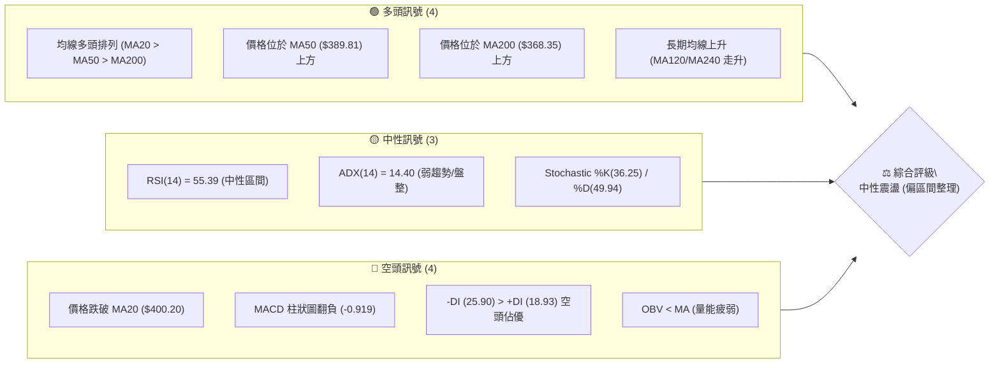
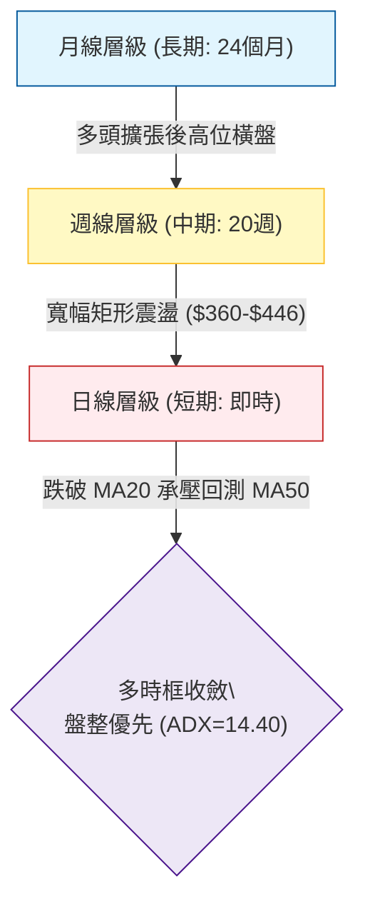
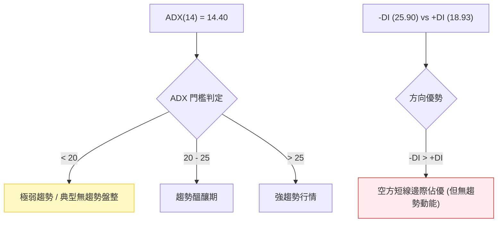
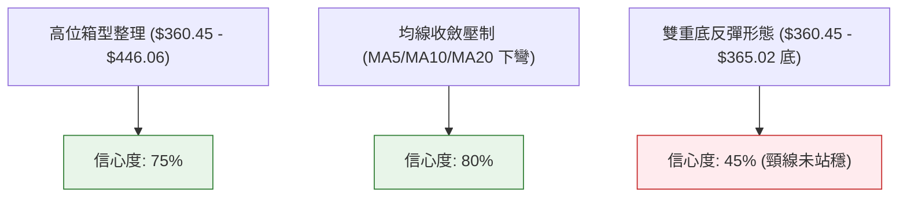
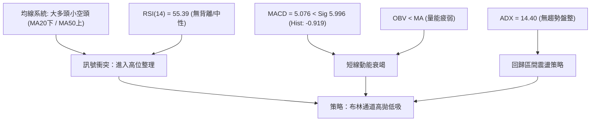
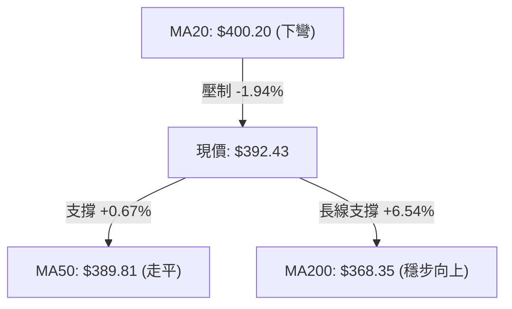
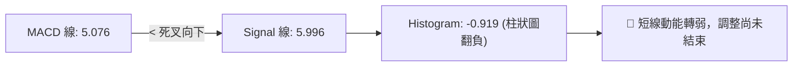
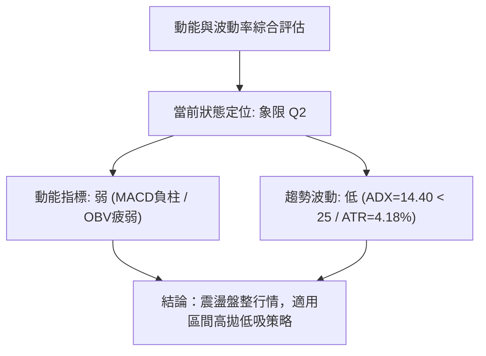
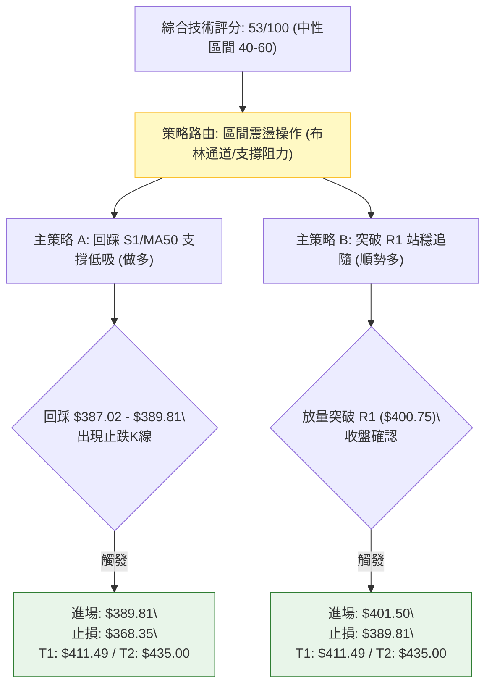
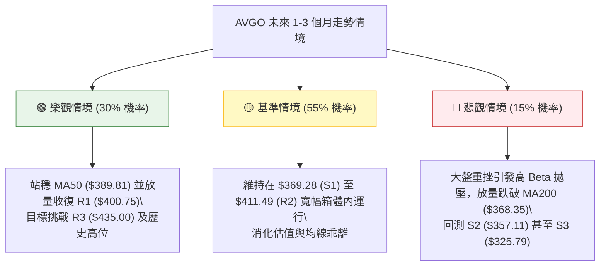

# AVGO 技術分析報告

> **報告日期**：2026-08-18 ｜ **語言**：繁體中文 ｜ **數據來源**：Yahoo Finance ｜ **當前價格**：$392.43

---

## 目錄

| 章節 | 內容 |
|------|------|
| [1. 技術面概覽](#1-技術面概覽) | 訊號儀表板、核心指標、評分卡 |
| [2. 趨勢分析](#2-趨勢分析) | 多時框趨勢、長中短期走勢 |
| [3. 圖表形態分析](#3-圖表形態分析) | 形態識別、K線組合、目標價 |
| [4. 支撐與阻力](#4-支撐與阻力) | 關鍵價位、斐波那契回調 |
| [5. 技術指標深度解讀](#5-技術指標深度解讀) | MA/RSI/MACD/布林/成交量 |
| [6. 動能與波動率](#6-動能與波動率) | 動能評估、ATR、Beta |
| [7. 多時框架總結](#7-多時框架總結) | 時框架評分矩陣 |
| [8. 交易策略建議](#8-交易策略建議) | 多空策略、風險報酬比 |
| [9. 風險提示與監控](#9-風險提示與監控) | 監控指標、風險場景 |

---

## 1. 技術面概覽

### 🎯 技術訊號儀表板



### 📊 核心指標速覽表

| 指標類別 | 指標名稱 | 當前數值 | 訊號 | 解讀 |
|----------|----------|----------|------|------|
| **價格** | 當前收盤價 | $392.43 | 🟡 | 位於52週區間 52.5%，處於中性平衡中樞 |
| **均線** | MA20 | $400.20 | 🔴 | 價格位於 MA20 下方 (-1.94%)，短線承壓 |
| **均線** | MA50 | $389.81 | 🟢 | 價格位於 MA50 上方 (+0.67%)，中軌支撐有效 |
| **均線** | MA200 | $368.35 | 🟢 | 價格位於 MA200 上方 (+6.54%)，長期牛市基底穩固 |
| **均線系統**| 均線排列 | MA20>50>200 | 🟢 | 大週期呈典型多頭排列結構 |
| **動能** | RSI(14) | 55.39 | 🟡 | 位於 30-70 常態中性區，無超買超賣 |
| **動能** | MACD (12,26,9) | 5.076 / 5.996 | 🔴 | MACD 線低於 Signal，Hist 負值 (-0.919) 轉弱 |
| **趨勢強度**| ADX(14) | 14.40 | 🟡 | 數值遠低於 25，表明當前處於無方向之弱趨勢盤整 |
| **方向指標**| +DI / -DI | 18.93 / 25.90 | 🔴 | -DI 高於 +DI，空方短線掌握定價邊際 |
| **通道指標**| 布林通道 %B | 0.39 | 🟡 | 位於中軌 ($400.20) 與下軌 ($365.49) 之間 |
| **量能指標**| 成交量 / OBV | 19.98M (量比 1.09x) | 🔴 | OBV < MA，反彈動能缺乏大資金持續淨流入 |
| **波動** | ATR(14) | $16.39 (4.18%) | 🟡 | 日內平均波幅適中，提供足夠交易緩衝空間 |

### 🏆 技術評分卡

```
╔══════════════════════════════════════════════════════════════════╗
║              技術評分卡 — AVGO (2026-08-18)                     ║
╠══════════════════════════════════════════════════════════════════╣
║ 趨勢強度 (ADX=14.40)   ██████░░░░░░░░░░░░░░  30/100 🔴 弱勢盤整  ║
║ 動能指標 (RSI/MACD)    ██████████░░░░░░░░░░  50/100 🟡 多空拉鋸  ║
║ 支撐穩定度 (MA50/MA200)██████████████░░░░░░  70/100 🟢 底部扎實  ║
║ 成交量配合 (OBV<MA)    ████████░░░░░░░░░░░░  40/100 🔴 動能不足  ║
║ 形態完整度 (區間收斂)  ████████████░░░░░░░░  60/100 🟡 構築中樞  ║
║ 均線排列 (多頭架構)    ██████████████░░░░░░  70/100 🟢 大結構多  ║
╠══════════════════════════════════════════════════════════════════╣
║ 綜合評分               ███████████░░░░░░░░░  53/100 🟡 中性盤整  ║
╚══════════════════════════════════════════════════════════════════╝
```

---

## 2. 趨勢分析

### 🌐 多時框趨勢分析



### 📈 長期趨勢 — 12個月走勢圖（Unicode）

```
AVGO 月線走勢圖（過去12個月：2025-08 至 2026-08）
價格軸 ($)
$450 ┤                                      ● (2026-05: $446.06 高點)
$420 ┤                              ● (04)
$390 ┤                                          ●(07) ●(08: $392.43 現價)
$360 ┤                  ● (10)  ● (11)      ● (06)
$330 ┤              ● (09)  ● (12)  ● (01)
$300 ┤  ● (08)                  ● (02)  ● (03: $309.02 波段底)
     └─────────────────────────────────────────────────────────────
       08   09  10  11  12  01  02  03  04  05  06  07  08 (月份)
```

**走勢特徵分析表格**：

| 階段區間 | 起止價格 | 漲跌幅 | 趨勢特徵描述 |
|----------|----------|--------|--------------|
| **2025-08 至 2025-11** | $295.23 → $400.71 | +35.73% | 主升浪推進，AI 需求推動機構強勢建倉 |
| **2025-11 至 2026-03** | $400.71 → $309.02 | -22.88% | 獲利回吐與估值修正波段，回踩測試 $300 整數關卡 |
| **2026-03 至 2026-05** | $309.02 → $446.06 | +44.35% | 強勁第二波攻勢，創下歷史高位區域 |
| **2026-05 至 2026-08** | $446.06 → $392.43 | -12.02% | 高位巨幅震盪，於 $360-$446 形成寬幅整理平台 |

### 📊 中期趨勢（週線分析）

從近 20 週歷史數據可見，價格在 2026-05 衝頂 $446.06 後進入週線級別箱型震盪：

```
AVGO 中期週線支撐阻力結構
  $446.06 ─────────────────────────────── 箱頂阻力區 (2026-05 高點)
             ▲             ▲
             │  震盪區間   │
             ▼             ▼
  $400.00 ┄┄┄┄┄┄┄┄┄┄┄┄┄┄┄┄┄┄┄┄┄┄┄┄┄┄┄┄┄ 箱體中軸 / MA20
             ▲             ▲  ◄── [現價 $392.43]
             │  下半部運行 │
             ▼             ▼
  $360.45 ─────────────────────────────── 箱底支撐區 (2026-07 低點)
```

### ⚡ 趨勢強度評估（ADX 解讀）



| ADX 區間 | 趨勢狀態 | 當前狀態 | 交易指導方針 |
|----------|----------|----------|--------------|
| **0 - 20** | **極弱 / 橫盤整理** | **✓ (14.40)** | **嚴禁追突破，優先採用箱型震盪指標高拋低吸** |
| 20 - 25 | 趨勢微弱 / 待確認 | - | 觀察突破放量情況，縮小倉位 |
| 25 - 40 | 強趨勢形成 | - | 順勢交易，均線回踩進場 |
| 40 - 100 | 極強 / 單邊暴推 | - | 緊盯反轉訊號與背離風險 |

---

## 3. 圖表形態分析

### 🔍 形態識別系統



**形態信心度與目標評估表**：

| 形態類別 | 信心度 | 判斷依據（引用數據） | 完成度 | 目標價（附計算式） |
|----------|--------|----------------------|--------|--------------------|
| **高位箱型整理** | 75% | 頂部受阻於 52W 高點區域，底部獲得 2026-07 低點 $360.45 與 S1 $369.28 支撐 | 70% | 箱頂：$446.06<br>箱底：$360.45<br>震盪中樞：$403.25 |
| **短期均線壓制態** | 80% | MA5 ($407.07)、MA10 ($414.25)、MA20 ($400.20) 均呈下彎並位於現價上方 | 85% | 短期回測 MA50：$389.81<br>進一步測試 S1：$369.28 |
| **雙重底形態 (潛在)** | 45% | 2026-06 低點 $365.02 與 2026-07 低點 $360.45 構成潛在雙底 | 35% | *訊號不足，頸線 $427.76 未突破，僅做指標型解讀* |

### 🕯️ 重要K線形態分析

| 週/月份 | 收盤價 | K線形態特徵 | 技術解讀 | 訊號 |
|---------|--------|-------------|----------|------|
| **2026-05-31** | $446.06 | 長陽衝頂線 (週量 99.8M) | 創波段新高但遭遇 52W 高點 ($494.22) 阻力壓制 | 🟡 多頭力竭 |
| **2026-06-07** | $385.12 | 巨量長陰破位 (週量 251.1M) | 暴跌 -13.6%，機構高位派發，確立中級調整 | 🔴 強空頭訊號 |
| **2026-07-05** | $360.45 | 縮量探底十字星 (週量 103.2M)| 觸碰斐波那契 61.8% ($361.72) 獲支撐，止跌築底 | 🟢 支撐確認 |
| **2026-08-09** | $427.76 | 衝高回落倒錘頭 (RSI達 73.6) | 測試 R2 ($411.49)/R3 ($435.00) 失敗，留下長上影 | 🔴 假突破遇阻 |
| **2026-08-23** | $392.43 | 縮量小陰線 (日量比 1.09x) | 跌破 MA20 ($400.20)，回測 MA50 ($389.81) 尋求支撐 | 🟡 中性偏弱 |

### 📉 ASCII 走勢形態示意圖

```
AVGO 近期箱體與頸線架構示意圖
$446.06 ┬────────────────────────────────────────── 箱體頂部阻力
        │           ▲ (05-31: $446.06)
        │          ╱ ╲
$427.76 ┼─────────╱───╲───────────▲ (08-09: $427.76) 反彈次高點 (假突破)
        │        ╱     ╲         ╱ ╲
$400.20 ┼───────╱───────╲───────╱───╲────── (MA20 / 中軸多空分水嶺)
        │      ╱         ╲     ╱     ╲  ◄─── [當前價 $392.43]
$389.81 ┼─────╱───────────╲───╱───────●─── (MA50 支撐)
        │    ╱             ╲ ╱
$360.45 ┴───● (06-28:$365)──● (07-05:$360.45) 箱體底部強支撐
```

### 🎯 形態目標價計算

以確認度最高之「**高位箱型整理形態**」計算：
1. **箱體頂部**：$446.06
2. **箱體底部**：$360.45
3. **形態高度 (H)**：$446.06 - $360.45 = $85.61
4. **向上突破理論目標價**：$446.06 + $85.61 = **$531.67**（接近分析師平均目標價 $527.88）
5. **向下破位理論目標價**：$360.45 - $85.61 = **$274.84**（接近 52W 低點 $279.82）
6. **箱體中軸平衡位**：$360.45 + ($85.61 / 2) = **$403.25**（現價 $392.43 處於中軸下方，偏向震盪下軌測試）

---

## 4. 支撐與阻力

### 🗺️ 關鍵價位分布圖（Unicode）

```
AVGO 價位結構分布圖
══════════════════════════════════════════════════════════════════
$494.22 ║██████████████████████████████║ 52週歷史最高點 (極強阻力)
$443.62 ║████████████████████          ║ 斐波那契 23.6% 回調位
$435.00 ║████████████████████████      ║ 強阻力 R3 (近一年波段高點聚類)
$411.49 ║████████████████              ║ 阻力 R2 / 斐波那契 38.2% ($412.32)
$400.75 ║████████████████████          ║ 關鍵阻力 R1 / MA20 ($400.20)
════════╠══════════════════════════════╣ ◄ 現價: $392.43 (位於 MA50 上方)
$387.02 ║▓▓▓▓▓▓▓▓▓▓▓▓                  ║ 斐波那契 50.0% 中樞支撐 / MA50 ($389.81)
$369.28 ║████████████████              ║ 近期支撐 S1 (波段低點聚類) / MA200 ($368.35)
$361.72 ║████████████████████          ║ 斐波那契 61.8% 黃金分割位 / 箱底 ($360.45)
$357.11 ║██████████████████████        ║ 強支撐 S2 (波段低點聚類)
$325.79 ║████████████████████████████  ║ 極強支撐 S3 / 斐波那契 78.6% ($325.70)
$279.82 ║██████████████████████████████║ 52週歷史最低點 (終極防線)
══════════════════════════════════════════════════════════════════
```

### 🚧 阻力位分析表

| 阻力級別 | 精確價位 | 形成原因與技術共振 | 突破難度 | 重要性 |
|----------|----------|-------------------|----------|--------|
| **R1** | **$400.75** | 波段高點聚類 + 布林中軌 ($400.20) + 心理整數關卡 | 中等 🟡 | ★★★☆☆ (短線多空分水嶺) |
| **R2** | **$411.49** | 近期波段高點 + 斐波那契 38.2% ($412.32) + MA10 ($414.25) | 較高 🔴 | ★★★★☆ (中期反彈確認位) |
| **R3** | **$435.00** | 波段高點聚類 + 布林上軌 ($434.92) 共振區間 | 極高 🔴 | ★★★★★ (多頭主升浪重啟點) |

### 🛡️ 支撐位分析表

| 支撐級別 | 精確價位 | 形成原因與技術共振 | 守住機率 | 重要性 |
|----------|----------|-------------------|----------|--------|
| **S1** | **$369.28** | 波段低點聚類 + MA200 ($368.35) + 布林下軌 ($365.49) | 75% 🟢 | ★★★★★ (牛熊生命線) |
| **S2** | **$357.11** | 波段低點聚類 + 2026-07 底部 ($360.45) 緩衝區 | 85% 🟢 | ★★★★☆ (強烈價值防守區) |
| **S3** | **$325.79** | 波段低點聚類 + 斐波那契 78.6% ($325.70) 共振 | 95% 🟢 | ★★★★★ (長期結構底部) |

### 📐 斐波那契回調位分析

基準區間：52週低點 **$279.82** → 52週高點 **$494.22**（總垂直落差 $214.40）

```
斐波那契回調結構與現價定位：
  0.0%  (52W High) ─── $494.22
  23.6% ────────────── $443.62  (2026-05 頂部收盤 $446.06 重合)
  38.2% ────────────── $412.32  (共振 R2: $411.49)
─────────────────────────────────────────────────────────────
  ★ 現價: $392.43 ── 處於 38.2% ($412.32) 與 50.0% ($387.02) 區間
─────────────────────────────────────────────────────────────
  50.0% ────────────── $387.02  (共振 MA50: $389.81，當前第一道緩衝)
  61.8% ────────────── $361.72  (共振 2026-07 低點 $360.45，黃金支撐)
  78.6% ────────────── $325.70  (共振 S3: $325.79)
  100.0%(52W Low)  ─── $279.82
```

**技術解讀**：
當前收盤價 $392.43 剛好位於斐波那契 50.0% 中樞回調位 ($387.02) 之上，且緊貼 MA50 ($389.81)。這代表股價自 52 週高點回落以來，恰好消化了整輪漲幅的一半。只要日線級別收盤不實質跌破 50.0% 回調位與 MA50 共振帶，中長期多頭結構就不會遭受破壞。

---

## 5. 技術指標深度解讀

### 🎛️ 指標訊號總覽



### 📈 移動平均線排列分析



| 均線名稱 | 當前價格 | 乖離率 (%) | 均線斜率狀態 | 支撐/阻力角色 |
|----------|----------|------------|--------------|---------------|
| **MA 5** | $407.07 | -3.60% | 急速下彎 ▁ | 短線動態第一阻力 |
| **MA 10** | $414.25 | -5.27% | 持續下彎 ▁ | 短線強阻力 |
| **MA 20** | $400.20 | -1.94% | 轉向走低 ▁ | 波段多空強弱分界線 (布林中軌) |
| **MA 50** | $389.81 | +0.67% | 走平微升 ▅ | 中期關鍵動態防線 |
| **MA 60** | $397.82 | -1.36% | 下滑走平 ▁ | 中期次級阻力 |
| **MA120**| $381.65 | +2.82% | 穩定上升 █ | 半年線強支撐 |
| **MA200**| $368.35 | +6.54% | 扎實抬升 █ | 牛市基石 (共振 S1 $369.28) |
| **MA240**| $363.86 | +7.85% | 穩定走高 █ | 年線長線買點支撐 |

### 📉 RSI(14) 分析

```
RSI(14) 當前數值: 55.39
超賣區 (0-30)          中性平衡區 (30-70)          超買區 (70-100)
├──────────────┼─────────────────────●─────────────┼──────────────┤
0              30                    55.39         70            100
[指標進度]     ███████████████████████░░░░░░░░░░░░░░░░░░ (55.39%)
```

- **超買超賣評估**：RSI 位於 55.39，完全處於 30-70 的常態平衡區間，脫離了 2026-08-09 衝高時的短線過熱區 (當時 RSI 為 73.6)，市場情緒已有效冷卻。
- **背離分析判斷**：
  - **頂背離**：無。2026-05 高點 $446.06 對應 RSI 57.8，而 2026-04 高點 $422 對應 RSI 92.5，雖有宏觀鈍化，但近期價格在 $392 附近與 RSI 55.39 呈同步收斂狀態。
  - **底背離**：無。近期並未出現價格創新低而 RSI 抬高的底背離結構。
  - **結論**：RSI 呈現健康中性，無即刻反轉之極端訊號。

### 📊 MACD(12/26/9) 訊號解讀



- **MACD 線**：5.076，仍維持在零軸上方，表明中長期趨勢背景仍屬多頭範疇。
- **訊號線 (Signal)**：5.996，MACD 線下穿 Signal 線形成死叉。
- **柱狀圖 (Histogram)**：-0.919，週線與日線級別柱狀圖同步由正轉負，顯示空方動能佔據微弱優勢，短線多頭反彈動能被壓制。

### 📦 布林通道分析

```
AVGO 布林通道位置示意圖 (寬度: $69.43, %B = 0.39)
$434.92 ┬────────────────────────────────────────── 布林上軌 (強阻力)
        │
$400.20 ┼────────────────────────────────────────── 布林中軌 (MA20 阻力)
        │                 
$392.43 ┼────────────────────────●───────────────── [現價位置: %B 0.39]
        │
$365.49 ┴────────────────────────────────────────── 布林下軌 (動態支撐)
```

- **布林上軌**：$434.92（共振 R3 $435.00）
- **布林中軌**：$400.20（共振 MA20 與 R1 $400.75）
- **布林下軌**：$365.49（共振 S1 $369.28 與 MA200 $368.35）
- **%B 指標解讀**：%B 為 0.39，意味著股價處於中軌與下軌之間的弱勢區間。由於 ADX 僅 14.40，布林通道帶寬收窄，預示股價將在 $365.49 至 $434.92 之間進行均值回歸運動。

### 💹 成交量分析（量價配合度）

- **量能規模**：最新成交量 19,981,730 股，高於 20 日均量 18,381,422 股（量比 1.09x），但顯著低於 50 日均量 24,712,923 股。
- **OBV 趨勢解讀**：數據明確提示「**OBV < MA → 量能疲弱**」。在過去幾週反彈過程中，OBV 未能有效向上穿越其均線，反映機構買盤追高意願不足，近期拉升缺乏持續性的實質增量資金支撐。
- **量價背離結論**：短期呈現「價跌量微增、價漲量不足」的弱勢整理特徵，不支持發動單邊突破行情。

---

## 6. 動能與波動率

### ⚡ 動能評估四象限



| 象限 | 動能強度 | 趨勢強度 (ADX) | 當前狀態 | 交易環境與策略評估 |
|------|----------|----------------|----------|--------------------|
| **Q1 (主升/主跌)** | 強動能 | 強趨勢 (ADX>25) | - | 突破追隨，順勢推動單邊倉位 |
| **Q2 (箱型震盪)** | **弱動能** | **弱趨勢 (ADX<25)** | **✓ (AVGO 當前)** | **謹慎觀望，嚴守支撐阻力進行高拋低吸** |
| **Q3 (假突破頻發)** | 強動能 | 弱趨勢 (ADX<25) | - | 容易出現高位假突破與多空雙殺 |
| **Q4 (深幅回調)** | 弱動能 | 強趨勢 (ADX>25) | - | 單邊陰跌，不可盲目抄底 |

### 📊 ATR 波動率分析

- **ATR(14) 當前數值**：**$16.39**
- **價格百分比 (ATR%)**：**4.18%**（處於半導體高貝塔板塊的正常中等波動區間）
- **止損距離與風控建議**：
  - **日內交易緩衝 (1.0 × ATR)**：$16.39
  - **波段交易防守 (1.5 × ATR)**：1.5 × $16.39 = **$24.59**
  - **趨勢保護止損 (2.0 × ATR)**：2.0 × $16.39 = **$32.78**

### 📐 Beta 與市場相關性

- **Beta 係數**：**1.473**（屬於典型高彈性、高動能標的）
- **市場連動分析**：AVGO 對標普 500 (SPY) 與那斯達克 100 (QQQ) 具有 1.47 倍的波動放大效應。當大盤指數出現 1% 的回調時，AVGO 理論預期將產生約 1.47% 的向下波動。在高 Beta 且 ADX 弱勢背景下，嚴禁使用高槓桿持有。

---

## 7. 多時框架總結

### 📋 時框架評分表

| 時框架 | 趨勢方向 | 動能狀態 | 均線排列 | 圖表形態 | 綜合評分 | 操作建議 |
|--------|----------|----------|----------|----------|----------|----------|
| **月線 (長期)** | 🟢 多頭上行 | 🟢 強勁偏多 | 多頭排列 (MA200向上) | 歷史高位震盪平台 | **75/100** | 長期投資者堅定持有 |
| **週線 (中期)** | 🟡 寬幅震盪 | 🟡 中性整理 | MA20平緩 / MA50向上 | $360-$446 寬幅箱體 | **55/100** | 箱底分批低吸，箱頂減碼 |
| **日線 (短期)** | 🔴 弱勢承壓 | 🔴 偏空修正 | 價格跌破 MA20 承壓 | 均線壓制回測 MA50 | **42/100** | 逢反彈減碼，等待回踩確認 |

### 🔲 綜合訊號矩陣

| 維度 | 短期 (日線) | 中期 (週線) | 長期 (月線) | 權重收斂方向 |
|------|-------------|-------------|-------------|--------------|
| **均線系統** | 🔴 跌破 MA20 ($400.20) | 🟢 站穩 MA50 ($389.81) | 🟢 遠高於 MA200 ($368.35) | 🟡 中性偏多 |
| **動能指標** | 🔴 MACD死叉/Hist負 | 🟡 RSI 55.4 平衡 | 🟢 歷史動能基底健康 | 🟡 中性平衡 |
| **量能結構** | 🔴 OBV疲弱 < MA | 🔴 反彈縮量/下跌放量 | 🟢 長期機構持股80.4% | 🔴 短線動能不足 |
| **形態位置** | 🔴 承壓於 R1 ($400.75) | 🟡 處於箱體中軸下方 | 🟢 處於52W高位區間 | 🟡 區間震盪 |

### ⚖️ 多時框收斂結論

依據「**多時框收斂規則 14**」：
1. **行情性質判定**：當前 ADX(14) = 14.40（< 25），明確判定市場處於**典型無趨勢之「盤整行情」**。
2. **時框優先級**：在盤整行情中，單邊趨勢策略失效，必須以**日線與週線布林通道上下軌 ($365.49 - $434.92) 作為主要交易區間**。
3. **最終收斂方向**：**🟡 中性觀望 / 區間箱型操作**。短期日線承壓回調，但中期週線 MA50 ($389.81) 與長期 MA200 ($368.35) 提供強勁支撐，股價無單邊崩跌風險，亦無即刻暴漲動能，整體以圍繞 $387 - $412 斐波那契區間的高拋低吸為主。

---

## 8. 交易策略建議

### 🗺️ 策略決策流程圖



### 🧭 策略路由

> **當前主策略方向 = 🟡 中性震盪區間操作（依綜合評分 53/100）**
> 
> 依據技術評分卡 53 分之定義（處於 40–60 中性區間），當前既不具備單邊做空條件（大週期 MA200 支撐強勁且機構持股高達 80.4%），亦不具備激進追多條件（ADX=14.40 且 MACD 翻負）。**交易核心邏輯為「逢支撐低吸、逢阻力高拋、嚴守止損點」**。

### 🎯 價格情境階梯（Price Scenarios）

| 觸發條件 | 第一目標 (T1) | 第二延伸目標 (T2) | 極端延伸目標 (T3) | 行情含義與應對策略 |
|----------|---------------|-------------------|-------------------|--------------------|
| **向上突破 R1 ($400.75)** | R2 ($411.49) | R3 ($435.00) | 52W 高點 ($494.22) | 突破布林中軌，短線轉強，順勢加碼多單 |
| **維持在 $387.02 - $400.75** | — | — | — | 於 MA50 與 MA20 間窄幅震盪，觀望為主 |
| **向下跌破 S1 ($369.28)** | S2 ($357.11) | S3 ($325.79) | 52W 低點 ($279.82) | 跌破牛熊線 MA200，中期轉弱，嚴格止損離場 |

### 📊 情境機率分佈

| 預期情境 | 發生機率 | 主要技術與量化依據 |
|----------|----------|--------------------|
| **區間震盪整理** | **55%** | **ADX(14)=14.40 顯示極弱趨勢；布林帶寬收窄；價格夾在 MA20 與 MA50 之間** |
| **守住支撐向上反彈** | **30%** | **大週期均線呈多頭排列；價格位於 MA200 ($368.35) 與斐波那契 50% ($387.02) 之上** |
| **跌破支撐深度回調** | **15%** | **MACD 柱狀圖翻負 (-0.919)；-DI (25.90) > +DI (18.93)；OBV 量能偏弱** |

### 🟢 主策略詳情

本報告依據中性震盪路由，提供兩套精準區間操作策略：

| 策略要素 | 策略 A（支撐位低吸策略） | 策略 B（阻力位突破策略） |
|----------|--------------------------|--------------------------|
| **適用場景** | 股價回踩 MA50/斐波那契 50% 企穩 | 股價放量收復 MA20 與 R1 阻力 |
| **進場條件** | 觸及 $387.02 - $389.81 區間且日線收陽 | 日線收盤實質突破 R1 ($400.75) 上方 |
| **精確進場點** | **$389.81** (MA50 當前價) | **$401.50** (突破 R1 濾網價) |
| **目標價 T1** | **$411.49** (阻力位 R2) | **$411.49** (阻力位 R2) |
| **目標價 T2** | **$435.00** (強阻力 R3 / 布林上軌) | **$435.00** (強阻力 R3 / 布林上軌) |
| **精確止損點** | **$368.35** (跌破 MA200 與 S1 $369.28) | **$389.81** (跌回 MA50 之下假突破) |
| **潛在收益 (T1/T2)** | +5.56% / +11.59% | +2.49% / +8.34% |
| **承擔風險** | -5.50% | -2.91% |
| **風險報酬比 (R:R)**| **1 : 2.11** (以 T2 計算) | **1 : 2.87** (以 T2 計算) |
| **執行勝率預估** | 60% | 55% |
| **建議倉位** | **15% - 20%** (分批建倉) | **10% - 15%** (突破追隨) |

### 🔴 反向風險觸發點（對沖提示）

若出現以下訊號，代表震盪格局遭到空頭實質破壞，多頭主策略必須全面終止：
1. **實質跌破 S1 ($369.28)**：若日線連續兩日收於 $369.28 及 MA200 ($368.35) 下方，宣告長達一年的多頭均線結構瓦解。
2. **量能異動確認**：若跌破支撐時伴隨單日成交量放大至 50 日均量 1.5 倍以上（> 37M 股），必須立即對多頭部位進行全額對沖或停損。

### ⭐ 整體訊號強度評星

```
╔══════════════════════════════════════════════════════════════════╗
║ 做多訊號強度：  ★★★☆☆  (3.0 / 5.0 星) — 依託大週期均線逢低買 ║
║ 做空訊號強度：  ★★☆☆☆  (2.0 / 5.0 星) — 逆大趨勢空間有限       ║
║ 整體訊號可信度：★★★★☆  (4.0 / 5.0 星) — 指標共振於區間震盪     ║
╚══════════════════════════════════════════════════════════════════╝
```

---

## 9. 風險提示與監控

### ✅ 關鍵監控指標 Checklist

```
╔══════════════════════════════════════════════════════════════════╗
║              AVGO 每日交易風控監控清單 (Checklist)              ║
╠══════════════════════════════════════════════════════════════════╣
║ [ ] 價格是否跌破 MA50 ($389.81)？                                ║
║     └─ 是：短線防守退至 S1 ($369.28) / 否：維持區間低吸多單      ║
║ [ ] 價格是否放量站上 MA20 ($400.20) 與 R1 ($400.75)？            ║
║     └─ 是：確認短線整理結束，啟動加碼 / 否：維持觀望             ║
║ [ ] MACD Histogram 是否由負轉正 (當前 -0.919)？                  ║
║     └─ 是：動能重啟確認 / 否：短線反彈高度受限                   ║
║ [ ] ADX(14) 是否向上穿越 20 並伴隨 +DI > -DI？                   ║
║     └─ 是：單邊多頭趨勢重啟 / 否 (維持<20)：嚴禁追高追跌         ║
║ [ ] 日成交量是否超越 20日均量 ($18.38M) 且突破 OBV 均線？         ║
║     └─ 是：機構資金回流確認 / 否：警惕假突破                     ║
╚══════════════════════════════════════════════════════════════════╝
```

### ⚠️ 風險場景分析



### 🛡️ 風險管理重要提醒

1. **高 Beta 波動控制**：AVGO 的 Beta 高達 1.473，且 ATR 達 $16.39 (4.18%)。在無明確趨勢的震盪期（ADX=14.40），單筆交易的風險敞口（止損金額）不得超過總帳戶淨值的 **1.0% - 1.5%**。
2. **倉位配置紀律**：建議總持倉比例控制在 **20% - 30%** 以內，採取「**分批建倉、分批停利**」原則，在 S1 ($369.28) 至 MA50 ($389.81) 區間掛單低吸，於 R2 ($411.49) 至 R3 ($435.00) 嚴格執行獲利了結。
3. **極端止損保護**：牛熊分水嶺設定於 **$368.35 (MA200)**。任何跌破該位置的收盤均代表長期牛市邏輯受損，必須無條件執行風控止損。

---

## 📋 報告總結

```
╔══════════════════════════════════════════════════════════════════╗
║                    AVGO 技術分析報告總結                         ║
╠══════════════════════════════════════════════════════════════════╣
║ 報告日期：2026-08-18                                             ║
║ 當前價格：$392.43                                                ║
║ 技術評分：53 / 100                                               ║
║ 分析評級：⚖️ 中性觀望 / 區間震盪整理 (Neutral / Range-Bound)    ║
╠══════════════════════════════════════════════════════════════════╣
║ 關鍵結論：                                                       ║
║ ├─ 長期趨勢：🟢 偏多排列 (MA200 $368.35 穩健向上)                ║
║ ├─ 中期趨勢：🟡 寬幅箱型 ($360.45 - $446.06 震盪整理)            ║
║ ├─ 短期趨勢：🔴 承壓回調 (跌破 MA20 $400.20，回測 MA50 $389.81) ║
║ ├─ 關鍵支撐：S1 $369.28 ｜ S2 $357.11 ｜ MA50 $389.81            ║
║ ├─ 關鍵阻力：R1 $400.75 ｜ R2 $411.49 ｜ R3 $435.00            ║
║ └─ 分析師目標：$527.88 (共識評級: Strong Buy)                    ║
╠══════════════════════════════════════════════════════════════════╣
║ 最優策略組合：                                                   ║
║ 1. 🥇 最佳機會：於 MA50 ($389.81) 附近低吸，止損設於 $368.35，   ║
║                目標上看 R2 ($411.49) 與 R3 ($435.00) (R:R=1:2.11)║
║ 2. 🥈 次選機會：突破 R1 ($400.75) 後追隨進場，止損設於 $389.81    ║
║ 3. 🥉 保守選擇：在 ADX 低於 20 期間保持 70% 現金，等待放量方向   ║
╚══════════════════════════════════════════════════════════════════╝
```

---

> ⚠️ **免責聲明**：本報告為 AI 自動生成之技術分析，所有數據及估算均基於提供的歷史價格資訊。本報告**僅供研究與學術參考**，**不構成任何投資建議**。投資有風險，入市需謹慎。

---

*報告生成時間：2026-08-18 ｜ 數據來源：Yahoo Finance ｜ 分析框架：多時框技術分析*