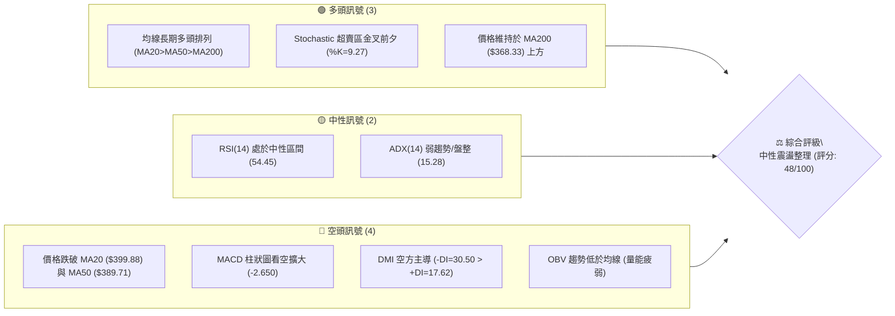
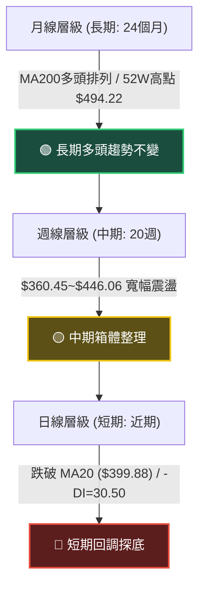
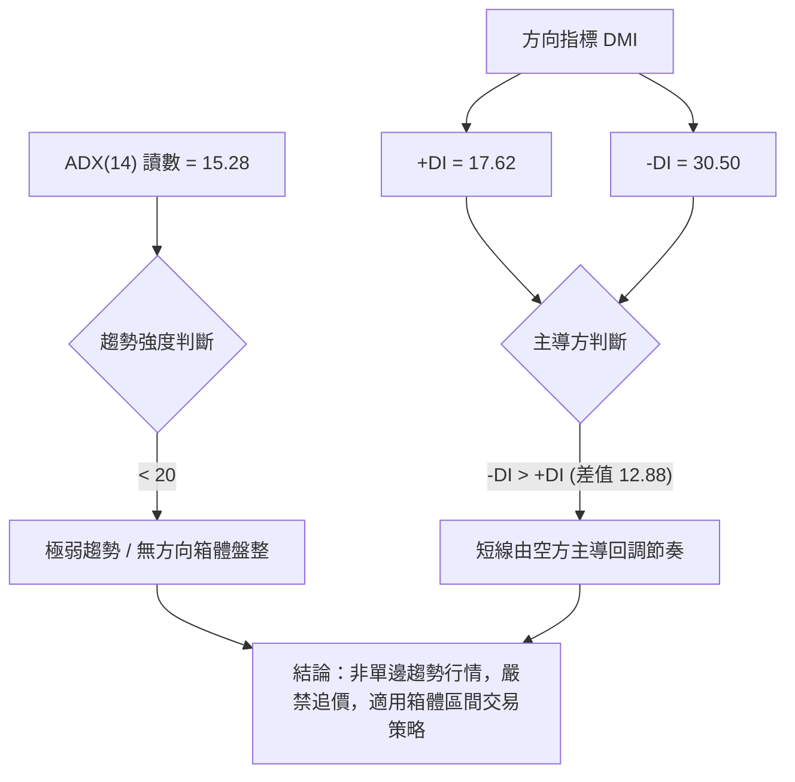
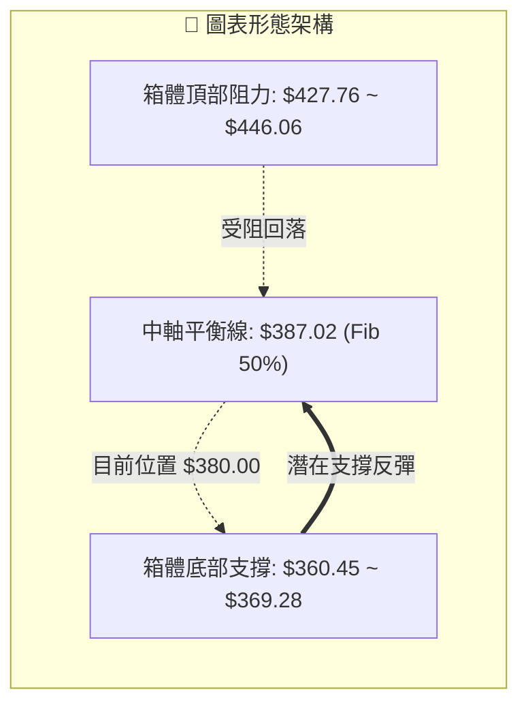
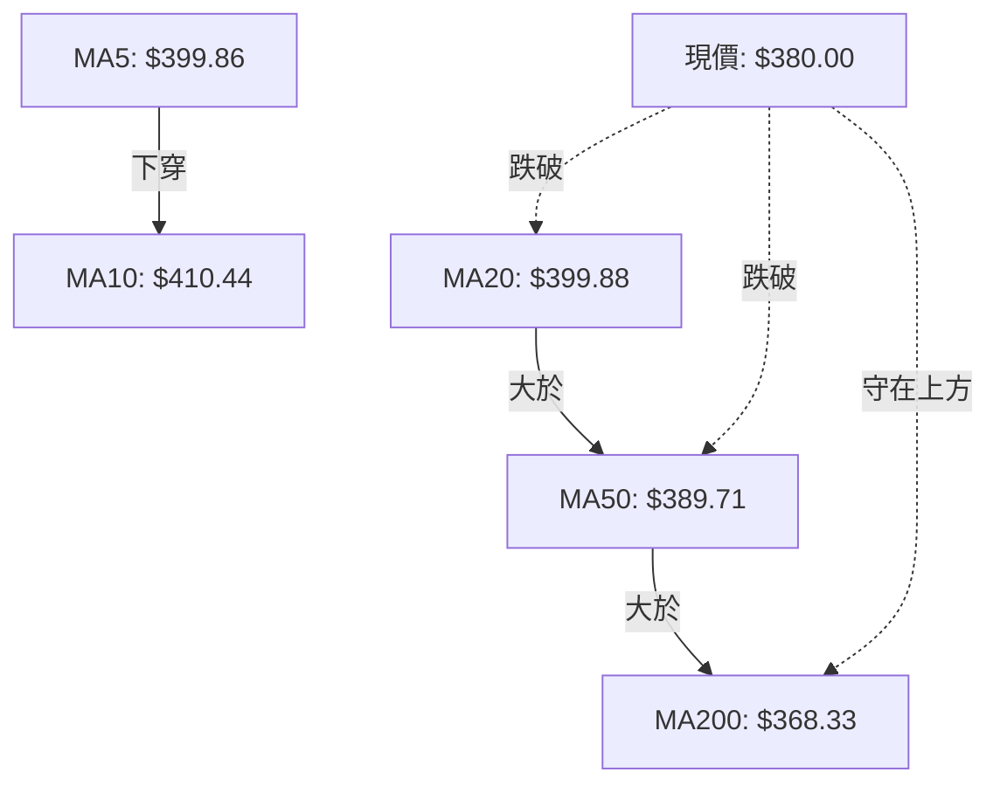
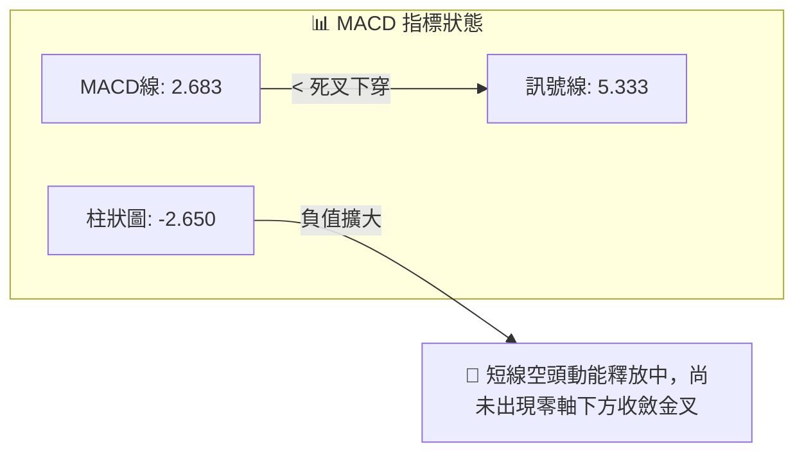
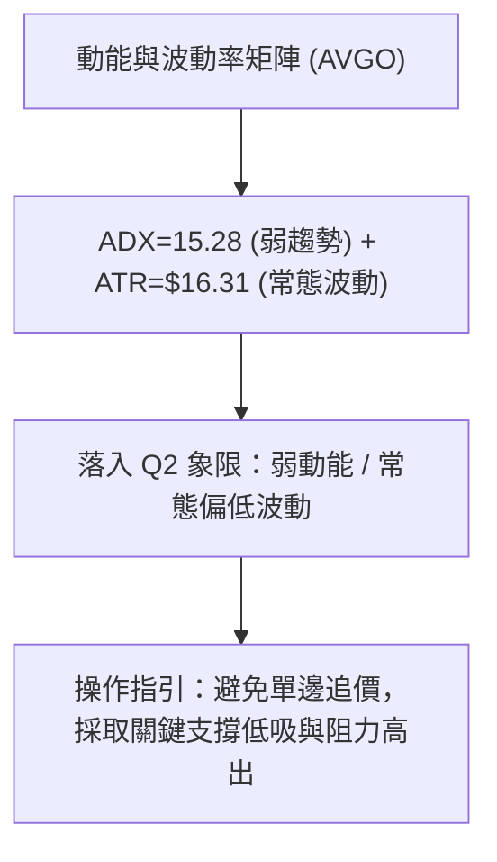
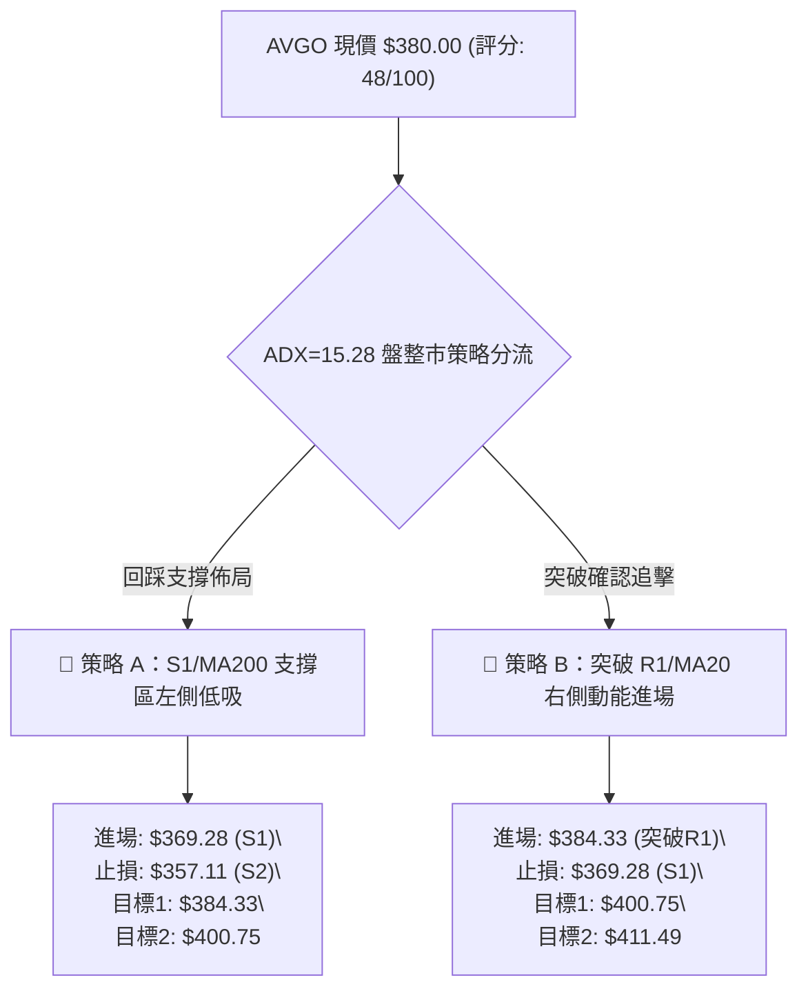
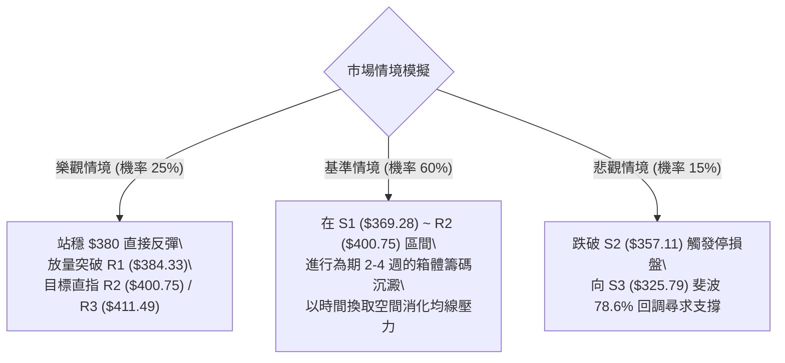

# AVGO 技術分析報告

> **報告日期**：2026-08-19 ｜ **語言**：繁體中文 ｜ **數據來源**：Yahoo Finance ｜ **當前價格**：$380.00

---

## 目錄

| 章節 | 內容 |
|------|------|
| [1. 技術面概覽](#1-技術面概覽) | 訊號儀表板、核心指標、評分卡 |
| [2. 趨勢分析](#2-趨勢分析) | 多時框趨勢、長中短期走勢 |
| [3. 圖表形態分析](#3-圖表形態分析) | 形態識別、K線組合、目標價 |
| [4. 支撐與阻力](#4-支撐與阻力) | 關鍵價位、斐波那契回調 |
| [5. 技術指標深度解讀](#5-技術指標深度解讀) | MA/RSI/MACD/布林/成交量 |
| [6. 動能與波動率](#6-動能與波動率) | 動能評估、ATR、Beta |
| [7. 多時框架總結](#7-多時框架總結) | 時框架評分矩陣 |
| [8. 交易策略建議](#8-交易策略建議) | 多空策略、風險報酬比 |
| [9. 風險提示與監控](#9-風險提示與監控) | 監控指標、風險場景 |

---

## 1. 技術面概覽

### 🎯 技術訊號儀表板



### 📊 核心指標速覽表

| 指標類別 | 指標名稱 | 當前數值 | 訊號 | 解讀 |
|:---|:---|:---|:---:|:---|
| **價格** | 當前收盤價 | $380.00 | 🟡 | 位於52週高低區間 46.7% 位置，多空爭奪中軸 |
| **短期均線** | MA20 (BB中軌) | $399.88 | 🔴 | 現價位於 MA20 下方 -4.97%，短線承壓 |
| **中期均線** | MA50 | $389.71 | 🔴 | 現價跌破中期均線，短中期動能轉弱 |
| **長期均線** | MA200 | $368.33 | 🟢 | 現價高於 MA200 +3.17%，長期牛市基底穩固 |
| **動能震盪** | RSI(14) | 54.45 | 🟡 | 位於 30-70 常態中性區間，無極端超買超賣 |
| **趨勢動能** | MACD (12/26/9) | Hist -2.650 | 🔴 | MACD (2.683) < Signal (5.333)，柱狀體負向發散 |
| **超短期震盪**| Stoch %K / %D | 9.27 / 27.56 | 🟢 | %K 進入極度超賣區間 (<10)，醞釀短線技術反彈 |
| **趨勢強度** | ADX (14) | 15.28 | 🟡 | ADX < 25，市場處於無方向性的箱體震盪盤整 |
| **波動率** | ATR (14) | $16.31 | 🟡 | 每日平均真實波幅佔股價 4.29%，波動維持常態 |
| **通道位置** | Bollinger %B | 0.22 | 🟡 | 逼近下軌 ($364.50)，具備下軌均值回歸支撐 |
| **量能指標** | OBV / 量比 | OBV < MA / 1.22x | 🔴 | 價跌量微增，量能整體偏疲弱，尚未形成買盤共振 |

### 🏆 技術評分卡

```
╔══════════════════════════════════════════════════════════════════╗
║                技術評分卡 — AVGO (2026-08-19)                   ║
╠══════════════════════════════════════════════════════════════════╣
║ 趨勢強度 (ADX=15.28)   ████░░░░░░░░░░░░░░░░  30/100 🔴 弱勢盤整  ║
║ 動能指標 (MACD/RSI)    ████████░░░░░░░░░░░░  40/100 🔴 空方佔優  ║
║ 支撐穩定度 (S1/Fib61.8)██████████████░░░░░░  70/100 🟢 支撐堅固  ║
║ 成交量配合 (OBV<MA)    ████████░░░░░░░░░░░░  40/100 🔴 量能匱乏  ║
║ 形態完整度 (箱體整理)  ████████████░░░░░░░░  60/100 🟡 區間成型  ║
║ 均線排列 (長多短空)    ██████████░░░░░░░░░░  50/100 🟡 均線收斂  ║
╠══════════════════════════════════════════════════════════════════╣
║ 綜合技術評分           ██████████░░░░░░░░░░  48/100 🟡 中性觀望  ║
╚══════════════════════════════════════════════════════════════════╝
```

---

## 2. 趨勢分析

### 🌐 多時框趨勢分析



### 📈 長期趨勢 — 12個月走勢圖（Unicode）

```
AVGO 月線走勢圖（2025-08 至 2026-08）
價格軸 ($)
$450 ┤                                      ● $446.06 (2026-05)
$425 ┤                                  ● $416.77
$400 ┤                   ● $400.71
$375 ┤               ● $367.57                  ● $377.75  ● $389.28
$350 ┤                                                     ● $380.00 (現在)
$325 ┤           ● $328.07   ● $344.83  ● $330.08
$300 ┤   ● $295.23                          ● $318.38  ● $309.02 (2026-03低點)
     └─────────────────────────────────────────────────────────────
        08   09   10   11   12   01   02   03   04   05   06   07   08
       '25  '25  '25  '25  '25  '26  '26  '26  '26  '26  '26  '26  '26
```

#### 走勢特徵分析表格

| 階段區間 | 起始價 → 結束價 | 漲跌幅 | 走勢特徵描述 |
|:---|:---:|:---:|:---|
| **2025-08 ~ 2025-11** | $295.23 → $400.71 | +35.73% | 主升浪推進，AI 需求爆發推動股價突破 $400 大關 |
| **2025-11 ~ 2026-03** | $400.71 → $309.02 | -22.88% | 獲利了結與估值修正，形成波段中期調整底 |
| **2026-03 ~ 2026-05** | $309.02 → $446.06 | +44.35% | 第二波強力上攻，創下歷史收盤新高 $446.06（盤中52W高 $494.22） |
| **2026-05 ~ 2026-08** | $446.06 → $380.00 | -14.81% | 高檔箱體震盪修正，目前回踩斐波那契 50%~61.8% 支撐帶 |

### 📊 中期趨勢（週線分析）

從近 20 週數據觀察，價格在 2026 年 5 月底見頂收於 $446.06 後，於 2026 年 7 月初下探 $360.45 獲得支撐回升，隨後在 8 月初反彈至 $427.76 受阻。目前呈現**高點降低、低點抬高**的收斂三角箱體結構：

```
中期週線壓力與支撐區間架構：
$446.06 ────── 上軌天花板 (2026-05-31 高點)
  ▲
  │   $411.49 ~ $427.76 (R3 / 8月初反彈高點壓力區)
  │   $399.88 ~ $400.75 (MA20 / R2 密集籌碼壓力帶)
  ├── $380.00 ◄── 當前價格 (箱體中軸)
  │   $369.28 ~ $368.33 (S1 / MA200 長期防線)
  ▼   $360.45 ~ $357.11 (7月週線低點 / S2 強支撐)
$325.79 ────── 終極波段底 (S3 / 斐波那契 78.6%)
```

### ⚡ 趨勢強度評估（ADX 解讀）



| 指標項 | 當前數值 | 參考門檻 | 技術狀態解讀 |
|:---|:---:|:---:|:---|
| **ADX (14)** | **15.28** | 25.00 | **弱趨勢/盤整**：低於 25 表明市場處於無明確單邊動能的震盪市 |
| **+DI (14)** | **17.62** | 20.00 | 多頭進攻動能偏弱 |
| **-DI (14)** | **30.50** | 25.00 | 空頭壓制力量佔據短期優勢 |
| **DI 狀態** | -DI 顯著大於 +DI | — | 短線處於回調下探階段，但受制於 ADX 偏低，空方難以引發崩跌 |

---

## 3. 圖表形態分析

### 🔍 形態識別系統

根據近 6 個月的波段走勢分析，AVGO 目前處於**寬幅箱體矩形整理形態（Rectangle Consolidation）**，上下邊界清晰。



#### 形態識別與信心度評估表

| 形態名稱 | 信心度 | 判斷依據（引用數據） | 完成度 | 目標價（附計算式） |
|:---|:---:|:---|:---:|:---|
| **寬幅箱體震盪** | **85%** | 頂部受阻於 $446.06 (5月) 與 $427.76 (8月)；底部獲撐於 $360.45 (7月) 與 MA200 ($368.33) | 75% | 箱體下軌支撐目標：**$364.50 ~ $369.28**<br>反彈目標：中軌 **$399.88**、上軌 **$435.25** |
| **潛在雙重底 (W底)** | **45%** | 訊號不足，僅第 1 底 $360.45 出現，第 2 底尚在尋求 $369.28 支撐確認，未突破頸線 $427.76 | 30% | 若成型：頸線 $427.76 + 高度 ($427.76 - $360.45 = $67.31) = **$495.07**（需突破確認，目前僅指標型解讀） |

### 🕯️ 重要K線形態分析

| 期間/月份 | 收盤價 | K線形態 | 解讀 | 訊號 |
|:---|:---:|:---|:---|:---:|
| **2026-05** | $446.06 | 長上影大陽線 (高見 $494.22) | 創歷史新高後遭遇強烈獲利回吐賣壓，多頭動能消耗 | 🔴 |
| **2026-06** | $377.75 | 長陰下挫實體線 | 跌破短期均線，引發多頭止損盤，空方全面回踩 | 🔴 |
| **2026-07** | $389.28 | 帶長下影線的鎚頭陽線 | 在 $360.45 探底後強勁拉回，確認下檔買盤承接意願 | 🟢 |
| **2026-08 (即時)** | $380.00 | 窄幅十字回調K線 | 8月初衝高 $427.76 後遇阻回吐，現於 $380 爭奪 50% 回調位 | 🟡 |

### 📉 ASCII 走勢形態示意圖

```
AVGO 近期箱體與關鍵波段高低點示意圖
$450 ┬───────────────────────● $446.06 (歷史收盤高點)
     │                      / \
$425 ┼                     /   \       ● $427.76 (次高點 R3)
     │                    /     \     / \
$400 ┼───[MA20 $399.88]──/───────\───/───\───[阻力區 R2 $400.75]
     │                  /         \ /     \
$380 ┼─────────────────/───────────●───────● $380.00 (現價 / 爭奪點)
     │                /             \
$360 ┴───────────────● $360.45       ●───────[強支撐帶 S1 $369.28 / S2 $357.11]
                    (7月低點)       (MA200 $368.33)
```

---

## 4. 支撐與阻力

### 🗺️ 關鍵價位分布圖（Unicode）

```
AVGO 價位結構分布圖
══════════════════════════════════════════════════════════════════
$411.49 ║████████████████████████║ 強阻力 R3 (近一年波段高點聚類)
$400.75 ║████████████████████    ║ 阻力 R2 (MA20/整數心理關卡)
$384.33 ║██████████████          ║ 關鍵阻力 R1 (短線波段高點)
$380.00 ╠════════════════════════╣ ◄── 現價 ($380.00)
$369.28 ║▓▓▓▓▓▓▓▓▓▓▓▓▓▓▓▓        ║ 近期支撐 S1 (波段低點聚類 / 貼近MA200)
$357.11 ║████████████████████    ║ 強支撐 S2 (7月波段支撐區間)
$325.79 ║████████████████████████║ 終極防線 S3 (斐波那契 78.6% 回調位)
══════════════════════════════════════════════════════════════════
```

### 🚧 阻力位分析表

| 阻力級別 | 價位 | 形成原因（依據波段聚類數據） | 突破難度 | 重要性 |
|:---|:---:|:---|:---:|:---:|
| **R1** | **$384.33** | 短線密集成交區，距離現價 +1.14%，為短線多頭反彈第一道關卡 | 🟡 中等 | ★★★☆☆ |
| **R2** | **$400.75** | 波段高點聚類，與 20日均線 ($399.88) 及 $400 整數大關重合 | 🔴 較高 | ★★★★☆ |
| **R3** | **$411.49** | 52週斐波那契 38.2% ($412.32) 聚類區，近一年多次波段反彈頂部 | 🔴 極高 | ★★★★★ |

### 🛡️ 支撐位分析表

| 支撐級別 | 價位 | 形成原因（依據波段聚類數據） | 守住機率 | 重要性 |
|:---|:---:|:---|:---:|:---:|
| **S1** | **$369.28** | 近一年波段低點聚類，與 200日均線 ($368.33) 形成雙重共振保護 | 🟢 75% | ★★★★☆ |
| **S2** | **$357.11** | 52週斐波那契 61.8% ($361.72) 延伸帶，7月份探底回升關鍵防線 | 🟢 85% | ★★★★★ |
| **S3** | **$325.79** | 斐波那契 78.6% ($325.70) 終極黃金分割位，長期牛市分水嶺 | 🟢 95% | ★★★★★ |

### 📐 斐波那契回調位分析

依據 52 週波段低點 **$279.82** 至 52 週歷史高點 **$494.22** 計算：

```
斐波那契回調層級分布：
0.0%  (52W High)  $494.22 ──────────────────────────────────────────────
23.6%             $443.62 ──────── 5月歷史收盤高點 $446.06 壓制區
38.2%             $412.32 ──────── 強阻力 R3 ($411.49) 共振區
50.0%             $387.02 ──────── 多空中軸分水嶺 (MA50 $389.71)
                  $380.00 ◄───────【現價位於 50.0% 與 61.8% 之間】
61.8%             $361.72 ──────── 黃金分割強支撐 (接近 S2 $357.11 / BB下軌)
78.6%             $325.70 ──────── S3 ($325.79) 終極防線
100.0% (52W Low)  $279.82 ──────────────────────────────────────────────
```

**解讀**：現價 $380.00 目前跌破 50.0% 回調位 ($387.02)，正在向 61.8% 黃金分割位 ($361.72) 尋求支撐。61.8% 位置與 MA200 ($368.33) 及 S1 ($369.28) 構成極為厚實的買盤緩衝墊。

---

## 5. 技術指標深度解讀

### 🎛️ 指標訊號總覽

```mermaid
graph TD
    Price["現價 $380.00"] --> MA{"均線系統"}
    Price --> OSC{"震盪動能"}
    Price --> VOL{"量能指標"}
    
    MA -->|"價格 < MA20 ($399.88) & MA50 ($389.71)"| MA_Bear["🔴 短中期承壓"]
    MA -->|"MA20 > MA50 > MA200 (長期多頭排列)"| MA_Bull["🟢 長期多頭架構未破"]
    
    OSC -->|"RSI("14") = 54.45"| RSI_Neu["🟡 RSI 中性無背離"]
    OSC -->|"MACD Hist = -2.650"| MACD_Bear["🔴 MACD 柱狀死叉擴大"]
    OSC -->|"Stoch %K = 9.27"| STOCH_Bull["🟢 隨機指標深度超賣"]
    
    VOL -->|"OBV < MA / 量比 1.22x"| VOL_Bear["🔴 量能動能不足"]
```

### 📈 移動平均線排列分析



| 均線名稱 | 當前價格 | 與現價差距 | 趨勢方向 | 技術意涵 |
|:---|:---:|:---:|:---:|:---|
| **MA 5** | $399.86 | -4.97% | 走跌 | 極短線空方壓制 |
| **MA 10** | $410.44 | -7.42% | 走跌 | 短期反彈第一強壓 |
| **MA 20** | $399.88 | -4.97% | 走平 | 布林中軌，短線多空分水嶺 |
| **MA 50** | $389.71 | -2.49% | 微升 | 中期生命線，現已轉為反彈阻力 |
| **MA 120** | $382.06 | -0.54% | 走升 | 半年線，目前與現價緊密糾結 |
| **MA 200** | $368.33 | +3.17% | 走升 | 牛熊分界線，提供強勁多頭支撐 |
| **MA 240** | $364.19 | +4.34% | 走升 | 長期年線，長線價值投資買盤區 |

### 📉 RSI(14) 分析

```
RSI(14) 讀數：54.45 (中性常態區間)
0 ────────── 30 ──────────────────── 50 ──────●───── 70 ────────── 100
[  極度超賣  ] [      偏弱震盪      ]   [54.45]  [  強勢多頭  ] [ 極度超買 ]
進度條：███████████░░░░░░░░░ 54.45%
```
- **背離判斷**：日線與週線層級 RSI 與價格走勢基本同步，**無明顯頂背離或底背離**。
- **解讀**：54.45 處於 50 多空中軸上方附近，顯示雖然價格短線回調，但中長線多頭元氣並未被實質性摧毀，市場處於常態籌碼換手階段。

### 📊 MACD(12/26/9) 訊號解讀

- **DIF (MACD線)**：2.683
- **DEA (Signal線)**：5.333
- **MACD柱狀圖 (Histogram)**：-2.650 🔴（看空）



### 📦 布林通道分析

```
AVGO 布林通道位置示意圖 (通道寬度: $70.75)
$435.25 ┬────────────────────────────────────────── 上軌 (BB Upper)
        │
$399.88 ┼────────────────────────────────────────── 中軌 (MA20)
        │
$380.00 ┼──────────────● [現價 %B = 0.22]
        │
$364.50 ┴────────────────────────────────────────── 下軌 (BB Lower)
```
- **布林參數**：上軌 **$435.25** ｜ 中軌 **$399.88** ｜ 下軌 **$364.50**
- **位置分析**：%B 為 **0.22**，表示現價已高度偏向通道下軌（0 代表下軌，0.5 代表中軌）。股價已進入下軌超跌反彈防禦圈，隨時存在向中軌 $399.88 回歸的均值修復動能。

### 💹 成交量分析（量價配合度）

- **最新成交量**：22,808,949 股
- **20日均量**：18,660,357 股（量比 1.22x）
- **50日均量**：24,147,397 股
- **量價特徵**：今日成交量較 20日均量放大 22%，但低於 50日均量。
- **OBV 能量潮**：OBV 低於其移動平均線，顯示近幾週回調過程中，機構買盤並未積極放量進場承接，量能配合度偏弱，需要等待縮量止跌或放量突破確認。

---

## 6. 動能與波動率

### ⚡ 動能評估四象限

| 象限 | 動能強度 | 波動率 | 當前狀態 | 評估與策略涵義 |
|:---:|:---:|:---:|:---:|:---|
| **Q1** | 強動能 | 低波動 | — | 穩定單邊推升波段 |
| **Q2** | 弱動能 | 低波動 | **✓ 當前狀態** | **箱體盤整，等待方向選擇，宜區間低吸高拋** |
| **Q3** | 強動能 | 高波動 | — | 主升浪或突破暴衝 |
| **Q4** | 弱動能 | 高波動 | — | 恐慌拋售，需嚴格避險 |



### 📊 ATR 波動率分析

- **ATR(14)**：**$16.31**（佔股價 **4.29%**）
- **單日波動範圍預期**：在無重大事件下，股價每日正常波動區間約為 $363.69 ~ $396.31。
- **風控止損建議**：
  - **保守止損距離（1.5 × ATR）**：$24.47
  - **緊密止損距離（1.0 × ATR）**：$16.31
  - 當前進場做多時，止損位應設於關鍵支撐 S1 ($369.28) 下方約 1 個 ATR 處（即 $357.11 附近）。

### 📐 Beta 與市場相關性

- **Beta 係數**：**1.473**（高彈性半導體龍頭）
- **解讀**：AVGO 波動率較 S&P 500 大盤高出 47.3%。在科技板塊走強時具備顯著的超額進攻性（Alpha），但大盤回調時亦會承受放大 1.5 倍的波動下行風險。
- **機構持股比**：**80.4%**，法人籌碼集中度高，籌碼結構總體穩定。

---

## 7. 多時框架總結

### 📋 時框架評分表

| 時框架 | 趨勢方向 | 動能狀態 | 均線排列 | 形態結構 | 綜合評分 | 操作建議 |
|:---|:---:|:---:|:---:|:---:|:---:|:---|
| **月線 (長期)** | 🟢 偏多 | 🟡 中性 | 🟢 多頭排列 | 🟢 上升趨勢回踩 | **75/100** | 長線多單持股續抱 |
| **週線 (中期)** | 🟡 震盪 | 🔴 空方佔優 | 🟡 均線糾結 | 🟡 寬幅矩形箱體 | **50/100** | 箱體區間高出低進 |
| **日線 (短期)** | 🔴 偏空 | 🔴 MACD死叉 | 🔴 跌破MA20/50 | 🔴 探底尋求支撐 | **35/100** | 等待止跌訊號，不盲目接刀 |

### 🔲 綜合訊號矩陣

```
時框訊號一致性比對：
┌──────────────┬──────────────┬──────────────┐
│  長期 (月線) │  中期 (週線) │  短期 (日線) │
│   🟢 多頭    │   🟡 震盪    │   🔴 回調    │
└──────┬───────┴──────┬───────┴──────┬───────┘
       │              │              │
       └──────────────┼──────────────┘
                      ▼
        【多時框收斂特徵：長多中中短空】
```

### ⚖️ 多時框收斂結論

依據多時框收斂規則：
1. **當前趨勢判定**：ADX(14) 讀數為 **15.28 (<25)**，嚴格定義為**無單邊趨勢之箱體盤整行情**。
2. **主導時框規則**：在盤整行情中，以**日線布林通道 ($364.50 ~ $435.25) 與關鍵支撐阻力 S1/R1** 作為核心交易區間，月線多頭提供長期下檔保護，日線負向指標則提示切勿在區間中軸追價。
3. **唯一方向性結論**：**🟡 中性觀望 / 區間下軌低吸**。當前價格 $380.00 處於箱體中下區域，既不具備單邊做空空間（下方受 MA200 $368.33 及 S1 $369.28 托底），亦未出現日線右側反轉突破訊號（上方受制於 MA20 $399.88），最佳策略為「耐心等待回踩支撐低吸或突破 R1 確認」。

---

## 8. 交易策略建議

### 🗺️ 策略決策流程圖



### 🧭 策略路由

> **當前主策略方向 = 🟡 區間震盪操作 / 逢低佈局（依技術評分 48/100，處於 40–60 震盪分流區）**
> 
> 目前 ADX < 25 且評分為中性，禁止單邊追高，主推以 **支撐位 S1 逢低承接** 與 **突破阻力位 R1 右側順勢** 之區間交易策略。

### 🎯 價格情境階梯（Price Scenarios）

| 觸發條件 | 下一目標 | 後續延伸 | 情境含義 |
|:---|:---:|:---:|:---|
| **向上突破 R1 $384.33** | R2 **$400.75** | R3 **$411.49** | 短線轉強，修復 MA20，挑戰箱體中上軌 |
| **維持於現價 $380.00 震盪** | — | — | 於 Fib 50% ($387.02) 與 MA200 之間消化籌碼 |
| **向下跌破 S1 $369.28** | S2 **$357.11** | S3 **$325.79** | 中期走弱，回踩 7月低點與 Fib 61.8% |

### 📊 情境機率分佈

| 情境劇本 | 發生機率 | 主要技術依據 |
|:---|:---:|:---|
| **情境一：回踩 S1 後反彈震盪向上** | **55%** | Stoch 超賣 (%K=9.27)、MA200 ($368.33) 支撐堅固、布林 %B=0.22 具備均值回歸動能 |
| **情境二：在 $369.28 ~ $384.33 窄幅整理** | **30%** | ADX=15.28 弱趨勢、量能萎縮、MACD 柱狀體尚未收斂金叉 |
| **情境三：跌破 S1 深幅探底 S2/S3** | **15%** | -DI=30.50 空方壓制、OBV 持續疲弱，若半導體大盤出現系統性風險 |

### 🟢 主策略詳情

| 策略要素 | 🥇 策略 A（支撐低吸型 - 推薦） | 🥈 策略 B（突破右側型） |
|:---|:---:|:---:|
| **進場條件** | 股價回踩 S1 支撐位且出下影線 | 日線收盤價強勢突破 R1 阻力位 |
| **進場價格** | **$369.28** | **$384.33** |
| **目標價 T1** | **$384.33** (+4.07%) | **$400.75** (+4.27%) |
| **目標價 T2** | **$400.75** (+8.52%) | **$411.49** (+7.07%) |
| **止損價格** | **$357.11** (S2 支撐下破點, -3.29%) | **$369.28** (跌回 S1, -3.91%) |
| **風險報酬比** | **1 : 2.59** (以 T2 計) | **1 : 1.81** (以 T2 計) |
| **成功機率** | **65%** | **55%** |
| **建議倉位** | **15% ~ 20%** | **10% ~ 15%** |

### 🔴 反向風險觸發點（對沖提示）

若日線收盤價**實體跌破 S2 ($357.11)** 且伴隨成交量放大，意味著長期牛市防線 MA200 失守，原箱體震盪結構破位，應立即執行止損或建立反向空頭對沖，下檔風險將直接指向 S3 ($325.79)。

### ⭐ 整體訊號強度評星

```
╔══════════════════════════════════════════════════════════════════╗
║ 做多訊號強度：  ★★★☆☆  (3.0/5星 - 依托長期均線與超賣反彈)        ║
║ 做空訊號強度：  ★★☆☆☆  (2.0/5星 - 空間受限於 MA200 強支撐)       ║
║ 整體可信度：    ★★★★☆  (4.0/5星 - 區間邊界清晰，風報比明確)       ║
╚══════════════════════════════════════════════════════════════════╝
```

---

## 9. 風險提示與監控

### ✅ 關鍵監控指標 Checklist

```
╔══════════════════════════════════════════════════════════════════╗
║                 AVGO 每日盤後關鍵監控清單                         ║
╠══════════════════════════════════════════════════════════════════╣
║ [ ] 價格是否跌破 MA200 ($368.33) 與 S1 ($369.28) 關鍵支撐區      ║
║ [ ] RSI(14) 是否跌破 45 進入弱勢區，或向上突破 60 轉強           ║
║ [ ] MACD 負向柱狀圖 (-2.650) 是否開始縮短收斂形成金叉            ║
║ [ ] 成交量是否有效放大至 50日均量 (24,147,397 股) 以上           ║
║ [ ] ADX 是否突破 25，確認新一輪單邊趨勢成型                      ║
║ [ ] 價格能否重新站上 MA20 ($399.88) 與 R2 ($400.75)             ║
╚══════════════════════════════════════════════════════════════════╝
```

### ⚠️ 風險場景分析



### 🛡️ 風險管理重要提醒

1. **嚴禁追高殺跌**：在 ADX = 15.28 的弱趨勢市況下，股價極易在阻力位（如 R1/R2）出現假突破後回落，在支撐位（S1）出現假跌破後拉起。交易應嚴格以「逢低佈局、分批止盈」為原則。
2. **嚴格執行止損**：半導體板塊 Beta 高達 1.473，單日波動劇烈（ATR = $16.31）。若跌破 $357.11 必須果斷停損，切勿將短線波段單凹單為長線被動套牢。
3. **倉位配置控制**：總持倉部位建議控制在 15%~20% 以內，保留充足現金以應對潛在的二次探底機會。

---

## 📋 報告總結

```
╔══════════════════════════════════════════════════════════════════╗
║                    AVGO 技術分析報告總結                         ║
╠══════════════════════════════════════════════════════════════════╣
║ 報告日期：2026-08-19                                             ║
║ 當前價格：$380.00                                                ║
║ 分析評級：⚖️ 中性觀望 / 箱體區間操作 (評分: 48/100)               ║
║                                                                  ║
║ 關鍵結論：                                                       ║
║ ├─ 長期趨勢：🟢 偏多 (MA200 $368.33 向上，均線長多排列維持)      ║
║ ├─ 中期趨勢：🟡 震盪 ($360.45 ~ $446.06 寬幅矩形箱體盤整)        ║
║ ├─ 短期趨勢：🔴 偏空 (跌破 MA20，MACD柱狀圖 -2.650 空方主導)     ║
║ ├─ 核心支撐：S1 $369.28 ｜ S2 $357.11 ｜ S3 $325.79              ║
║ ├─ 核心阻力：R1 $384.33 ｜ R2 $400.75 ｜ R3 $411.49              ║
║ └─ 分析師目標：均價 $527.88 (45位分析師，強烈買進共識)           ║
║                                                                  ║
║ 最優交易策略組合：                                               ║
║ 1. 🥇 最佳機會 (左側)：於 S1 ($369.28) 逢低掛單做多，止損 $357.11║
║    目標 T1: $384.33 / T2: $400.75 (風報比 1:2.59)                ║
║ 2. 🥈 次選機會 (右側)：突破 R1 ($384.33) 順勢加碼，止損 $369.28   ║
║    目標 T1: $400.75 / T2: $411.49 (風報比 1:1.81)                ║
║ 3. 🥉 保守選擇：空倉觀望，等待日線 MACD 零軸下金叉再行進場       ║
╚══════════════════════════════════════════════════════════════════╝
```

---

> ⚠️ **免責聲明**：本報告為 AI 自動生成之技術分析，所有數據及估算均基於歷史價格與技術指標模型。本報告**僅供研究與學術參考**，**不構成任何投資建議**。投資有風險，入市需謹慎。

---

*報告生成時間：2026-08-19 ｜ 數據來源：Yahoo Finance ｜ 分析框架：多時框技術分析體系*