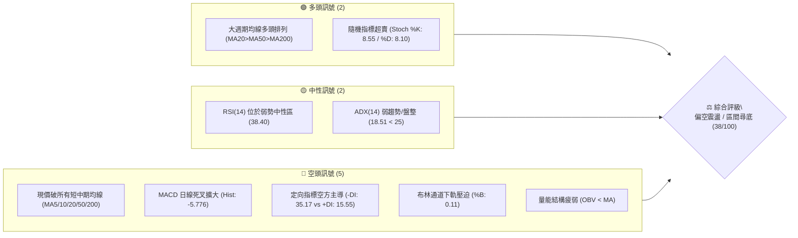
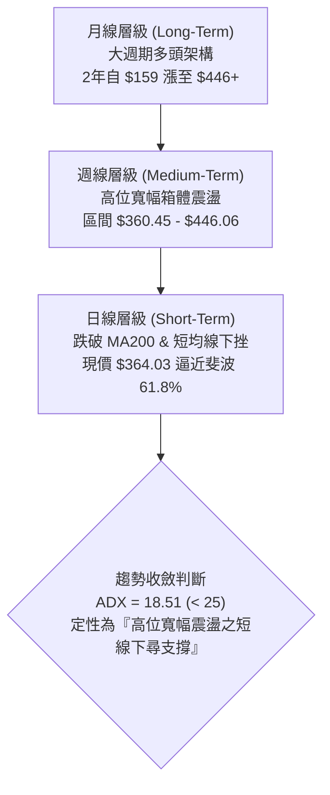
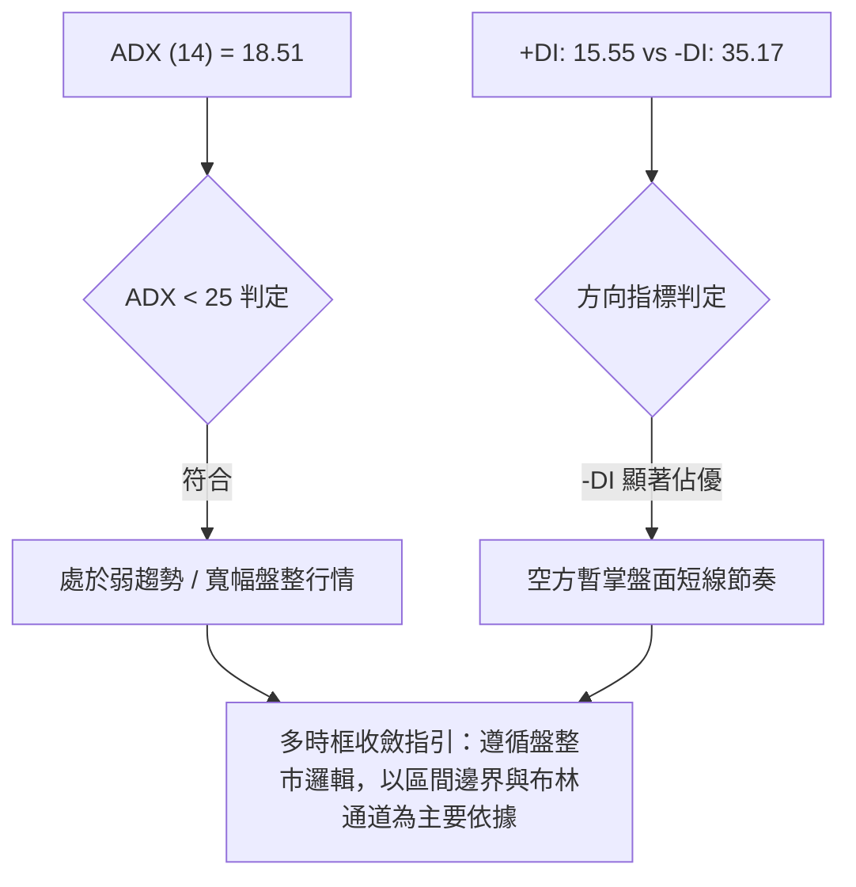
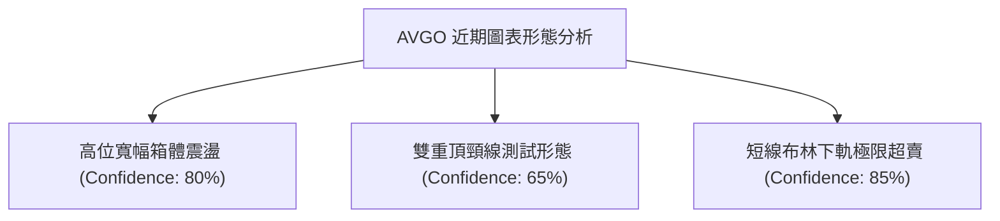
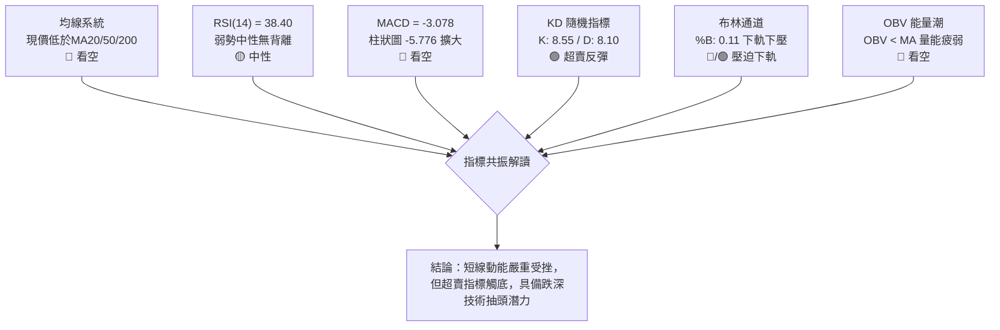
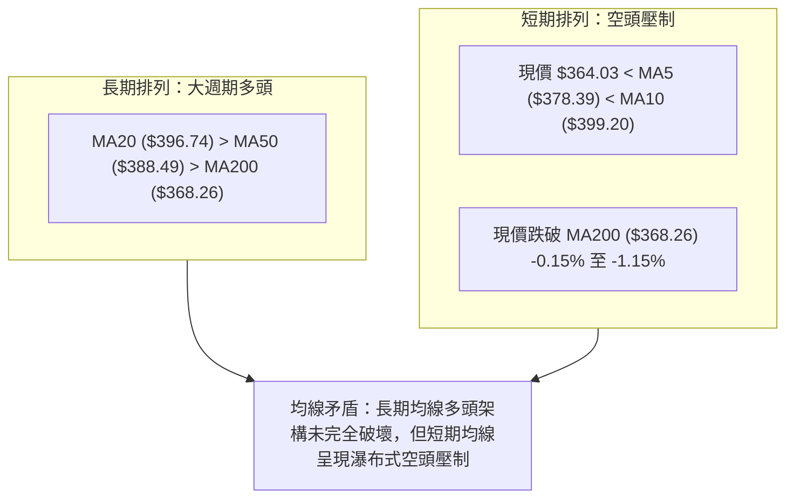
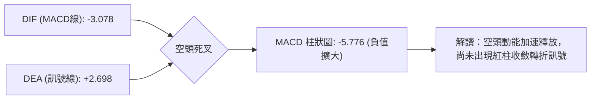
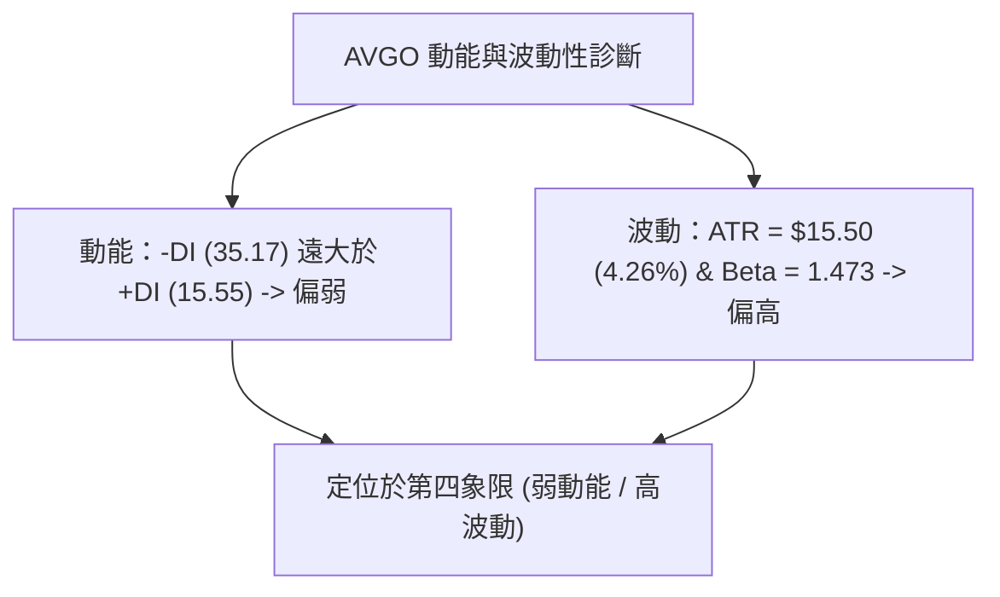
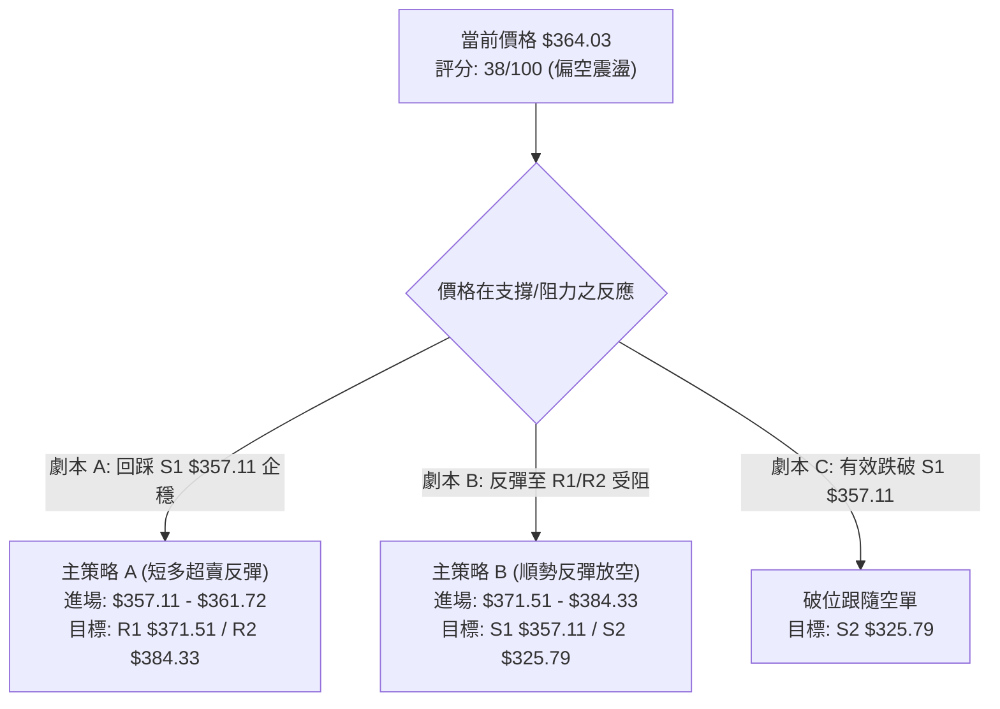
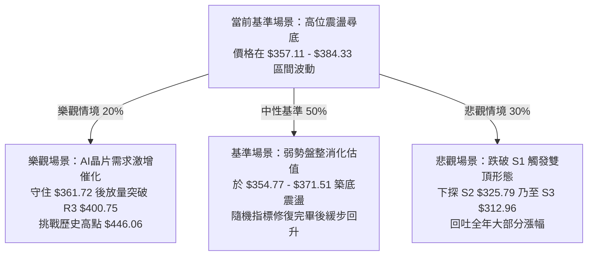

# AVGO 技術分析報告

> **報告日期**：2026-08-21 ｜ **語言**：繁體中文 ｜ **數據來源**：Yahoo Finance ｜ **當前價格**：$364.03

---

## 目錄

| 章節 | 內容 |
|------|------|
| [1. 技術面概覽](#1-技術面概覽) | 訊號儀表板、核心指標、評分卡 |
| [2. 趨勢分析](#2-趨勢分析) | 多時框趨勢、長中短期走勢、ADX解讀 |
| [3. 圖表形態分析](#3-圖表形態分析) | 形態識別、信心度評估、K線組合、目標價 |
| [4. 支撐與阻力](#4-支撐與阻力) | 關鍵價位分布、阻力/支撐表、斐波那契回調 |
| [5. 技術指標深度解讀](#5-技術指標深度解讀) | 均線系統、RSI、MACD、布林通道、成交量與OBV |
| [6. 動能與波動率](#6-動能與波動率) | 動能四象限、ATR波動分析、Beta與市場連動 |
| [7. 多時框架總結](#7-多時框架總結) | 時框矩陣、多時框收斂結論（規則14） |
| [8. 交易策略建議](#8-交易策略建議) | 策略路由分流、價格情境階梯、主策略詳情 |
| [9. 風險提示與監控](#9-風險提示與監控) | 關鍵監控清單、情境模擬、風險管理原則 |
| [📋 報告總結](#-報告總結) | 最終摘要評級卡 |

---

## 1. 技術面概覽

### 🎯 技術訊號儀表板



---

### 📊 核心指標速覽表

| 指標類別 | 指標名稱 | 當前數值 | 訊號 | 解讀 |
|----------|----------|----------|:---:|------|
| **價格** | 當前價格 | $364.03 | 🔴 | 位於 52 週區間之 39.3%，自高點回撤明顯 |
| **均線** | MA20 | $396.74 | 🔴 | 價格低於 MA20 (-8.24%)，短線空頭下壓強勁 |
| **均線** | MA50 | $388.49 | 🔴 | 價格低於 MA50 (-6.30%)，中期趨勢遭遇回調考驗 |
| **均線** | MA200 | $368.26 | 🔴 | 價格剛跌破牛熊分界線 (-1.15%)，需防假突破或轉弱 |
| **動能** | RSI(14) | 38.40 | 🟡 | 弱勢中性區間，未達極端超賣 (<30)，仍有探底慣性 |
| **動能** | MACD (12,26,9) | -3.078 / S: 2.698 | 🔴 | MACD 跌入負值區且柱狀圖擴大至 -5.776，空頭加速 |
| **動能** | Stoch %K / %D | 8.55 / 8.10 | 🟢 | 進入極度超賣區間 (<10)，短線具備技術性反彈動能 |
| **趨勢** | ADX (14) | 18.51 (-DI: 35.17) | 🟡 | ADX < 25 為盤整格局，但 -DI 遠高於 +DI，空方暫掌主導權 |
| **通道** | Bollinger Bands | 上:$438.70 中:$396.74 下:$354.77 | 🔴 | %B = 0.11，價格緊貼下軌，下行空間受下軌支撐限制 |
| **量能** | OBV 趨勢 | OBV < 均線 | 🔴 | 成交量能未能放大配合，反彈量縮，資金偏向離場 |
| **波動** | ATR(14) | $15.50 (4.26%) | 🟡 | 日內波動幅度較大，短線需給予足夠止損緩衝空間 |

---

### 🏆 技術評分卡

```
╔══════════════════════════════════════════════════════════════════╗
║              技術評分卡 — AVGO (2026-08-21)                      ║
╠══════════════════════════════════════════════════════════════════╣
║ 趨勢強度 (Trend)      ██████░░░░░░░░░░░░░░  30/100  🔴 空頭控盤  ║
║ 動能指標 (Momentum)   ███████░░░░░░░░░░░░░  35/100  🔴 動能疲弱  ║
║ 支撐穩定度 (Support)  ██████████░░░░░░░░░░  50/100  🟡 臨近S1/61.8%║
║ 成交量配合 (Volume)   ██████░░░░░░░░░░░░░░  30/100  🔴 量能疲弱  ║
║ 形態完整度 (Pattern)  ████████░░░░░░░░░░░░  40/100  🟡 盤整箱體  ║
║ 均線排列 (MA System)  ████████░░░░░░░░░░░░  42/100  🟡 長多短空  ║
╠══════════════════════════════════════════════════════════════════╣
║ 綜合技術評分          ███████░░░░░░░░░░░░░  38/100  🔴 偏空震盪  ║
╚══════════════════════════════════════════════════════════════════╝
```

---

## 2. 趨勢分析

### 🌐 多時框趨勢分析



---

### 📈 長期趨勢 — 12 個月走勢圖（月線收盤）

```
AVGO 月線走勢圖（2025-08 至 2026-08）
價格軸 ($)
$450 ┤                                     ● $446.06 (2026-05)
$425 ┤                             ● $416.77
$400 ┤             ● $400.71 (2025-11)              ● $389.28
$375 ┤         ● $367.57                       ● $377.75
$350 ┤                     ● $344.83                    ● $364.03 (現價)
$325 ┤     ● $328.07   ● $330.08   ● $318.38
$300 ┤ ● $295.23               ● $309.02
     └─────────────────────────────────────────────────────────────
       08  09  10  11  12  01  02  03  04  05  06  07  08 (月份)
```

#### 走勢特徵分析表格

| 階段區間 | 起止價格 | 漲跌幅 | 走勢特徵與量價解讀 |
|:---|:---|:---:|:---|
| **2025-08 ~ 2025-11** | $295.23 → $400.71 | **+35.73%** | 主升浪推進，月線連續陽線，突破前高創歷史新紀錄。 |
| **2025-12 ~ 2026-03** | $400.71 → $309.02 | **-22.88%** | 獲利了結回調，於 $309.02（接近 S3 $312.96）獲得堅實支撐築底。 |
| **2026-04 ~ 2026-05** | $309.02 → $446.06 | **+44.35%** | 爆發性第二波主升，刷新歷史收盤高點 $446.06（盤中高達 $494.22）。 |
| **2026-06 ~ 2026-08** | $446.06 → $364.03 | **-18.39%** | 高位劇烈震盪下殺，跌破 MA20/50，目前正測試黃金分割 61.8% ($361.72)。 |

---

### 📊 中期趨勢（週線分析）

```
近期週線壓力與支撐結構示意圖：
$446.06 ─────────────────────────────── [中期頂部 / 2026-05 峰值]
                 ▲
$400.75 ─────────┼───────────────────── [R3 強阻力 / 前期平台高點]
$384.33 ─────────┼───────────────────── [R2 阻力 / 斐波 50% 附近]
$371.51 ─────────┼───────────────────── [R1 阻力 / MA200 附近]
                 │  
$364.03 ═════════╪═════════════════════ ◄ 現價位置 ($364.03)
                 │  
$361.72 ─────────┼───────────────────── [斐波那契 61.8% 黃金支撐位]
$357.11 ─────────┴───────────────────── [S1 支撐 / 近期波段密集低點]
$325.79 ─────────────────────────────── [S2 強支撐 / 斐波 78.6% $325.70]
```

從近 20 週表現觀察，AVGO 在 2026-05 衝刺至 $446.06 後，成交量於 2026-06-07 放大至 251.1M 股並伴隨週線下挫至 $385.12，顯示高位機構派發明顯。隨後走勢在 $360.45 至 $427.76 之間展開箱體寬幅拉鋸。最近一週收盤價為 $364.03，已逼近 7 月初之低點 $360.45。

---

### ⚡ 趨勢強度評估（ADX 解讀）



#### ADX 強度對照與解讀

```
ADX 數值強度表：
0 ─────── 18.51 ──────── 25 ──────────────── 50 ────────────── 100
[ 當前位置 18.51 (盤整) ]   [ 趨勢形成門檻 ]     [ 強趨勢行情 ]
```
- **ADX(14) = 18.51**：確認目前市場不具備強烈單邊趨勢，屬於**高位大型震盪箱體**。
- **-DI (35.17) vs +DI (15.55)**：差值高達 19.62，說明在當前盤整結構內部，短期下行動能明顯大於上行反彈動能，短期內直接發動單邊暴漲的機率極低。

---

## 3. 圖表形態分析

### 🔍 形態識別系統



#### 圖表形態信心度與計算表格（依規則 15）

| 形態名稱 | 信心度 | 判斷依據（引用數據） | 完成度 | 目標價（附計算式） |
|:---|:---:|:---|:---:|:---|
| **高位寬幅震盪箱體** | **80%** | 上軌阻力落在 2026-05 高點 $446.06，下軌支撐落在 2026-07 低點 $360.45，價格數次於此區間折返。 | 85% | **箱體下軌支撐目標**：$360.45<br/>**箱體上軌反彈目標**：$446.06 |
| **潛在雙重頂形態** | **65%** | 第一頂為 2026-05 收盤 $446.06，第二頂為 2026-08-09 週線反彈高點 $427.76，頸線為 2026-07-05 低點 $360.45。 | 70% | 形態高度 = $446.06 - $360.45 = $85.61。<br/>**若跌破頸線之理論跌幅目標**：<br/>$360.45 - $85.61 = **$274.84**（接近52週低點 $279.82） |
| **布林下軌超賣反彈** | **85%** | 布林帶 %B 降至 0.11，Stoch %K 降至 8.55，價格緊貼下軌 $354.77。 | 90% | **反彈測試中軌目標**：MA20 = **$396.74** |

---

### 🕯️ 重要 K 線形態分析

| 月份 / 時間 | 收盤價 | K 線形態 | 技術解讀 | 多空訊號 |
|:---|:---:|:---|:---|:---:|
| **2026-05** | $446.06 | 巨陽長上影 | 觸及 52 週高點 $494.22 後大幅回落，留長上影線，多頭耗盡。 | 🔴 頂部滯漲 |
| **2026-06** | $377.75 | 穿頭破腳大陰線 | 單月重挫 -15.3%，週成交量飆升至 2.51 億股，主力高位派發。 | 🔴 強烈看空 |
| **2026-07** | $389.28 | 下影紡錘線（十字星變體） | 於 $360.45 獲得支撐回升，顯示多頭在 $360 附近有護盤動作。 | 🟢 支撐浮現 |
| **2026-08 (即時)** | $364.03 | 回踩陰線 | 上攻 $427.76 受阻後快速回落，二度測試箱體下沿，多空即將攤牌。 | 🟡 關鍵測試 |

---

### 📉 ASCII 走勢形態示意圖

```
AVGO 近4個月「高位箱體 / 潛在雙頂」結構示意圖：
$450 ┤            頂1: $446.06
$425 ┤              /\                      頂2: $427.76
$400 ┤             /  \                        /\
$375 ┤            /    \                      /  \
$364 ┤───────────/──────\────────────────────/────\─── 現價 $364.03
$350 ┤                   \   頸線 / 箱體下沿: $360.45
     └────────────────────\────────────────────────
                       2026-06            2026-08
```

---

## 4. 支撐與阻力

### 🗺️ 關鍵價位分布圖（Unicode）

```
AVGO 價位結構分布圖（OHLCV 精確計算）
══════════════════════════════════════════════════════════════════
$443.62 ║██████████████████████████████║ 斐波那契 23.6% 回調位
$412.32 ║████████████████████████      ║ 斐波那契 38.2% 回調位
$400.75 ║██████████████████████████████║ 強阻力 R3 (近一年波段高點聚類)
$396.74 ║▓▓▓▓▓▓▓▓▓▓▓▓▓▓▓▓▓▓▓▓▓▓        ║ 布林中軌 / MA20
$387.02 ║██████████████████            ║ 斐波那契 50.0% 回調位
$384.33 ║████████████████████          ║ 阻力 R2 (近一年波段高點聚類)
$371.51 ║████████████████████████      ║ 關鍵阻力 R1 (突破轉強點)
$368.26 ║▓▓▓▓▓▓▓▓▓▓▓▓▓▓▓▓              ║ 長期牛熊線 MA200
$364.03 ╠══════════════════════════════╣ ◄ 當前價格 $364.03
$361.72 ║██████████████████████████████║ 斐波那契 61.8% (黃金分割支撐)
$357.11 ║▓▓▓▓▓▓▓▓▓▓▓▓▓▓▓▓▓▓▓▓          ║ 近期支撐 S1 (波段低點聚類)
$354.77 ║░░░░░░░░░░░░░░░░░░            ║ 布林帶下軌
$325.79 ║██████████████████████████████║ 強支撐 S2 (斐波 78.6% $325.70)
$312.96 ║████████████████████████      ║ 強支撐 S3 (前期起漲平台低點)
══════════════════════════════════════════════════════════════════
```

---

### 🚧 阻力位分析表

所有價位均嚴格引用 OHLCV 計算結果：

| 阻力級別 | 精確價位 | 距現價空間 | 形成原因與技術共振 | 突破難度 | 重要性評級 |
|:---|:---:|:---:|:---|:---:|:---:|
| **R1** | **$371.51** | +2.05% | 近一年波段高點聚類，與 MA200 ($368.26) 形成密集阻力帶。 | 🟡 中等 | ★★★★☆ |
| **R2** | **$384.33** | +5.58% | 近一年波段次高點，共振 MA50 ($388.49) 及斐波那契 50% ($387.02)。 | 🔴 較高 | ★★★★☆ |
| **R3** | **$400.75** | +10.09% | 近一年重大波段高點聚類，整數心理關卡，MA20 ($396.74) 壓制區。 | 🔴 極高 | ★★★★★ |

---

### 🛡️ 支撐位分析表

所有價位均嚴格引用 OHLCV 計算結果：

| 支撐級別 | 精確價位 | 距現價空間 | 形成原因與技術共振 | 守住機率 | 重要性評級 |
|:---|:---:|:---:|:---|:---:|:---:|
| **S1** | **$357.11** | -1.90% | 近一年波段低點聚類，共振斐波那契 61.8% ($361.72) 與布林下軌 ($354.77)。 | 🟢 65% | ★★★★★ |
| **S2** | **$325.79** | -10.51% | 近一年波段低點聚類，精確共振斐波那契 78.6% ($325.70)。 | 🟢 85% | ★★★★★ |
| **S3** | **$312.96** | -14.03% | 2026-03 主升起漲平台支撐聚類（2026-03 收盤 $309.02）。 | 🟢 95% | ★★★★☆ |

---

### 📐 斐波那契回調位分析（區間 $279.82 → $494.22）

```
斐波那契回調結構圖：
0.0%  (52W High) ── $494.22
23.6% ───────────── $443.62
38.2% ───────────── $412.32
50.0% ───────────── $387.02
61.8% ───────────── $361.72  ◄ 現價 $364.03 處於 50.0% 與 61.8% 之間
78.6% ───────────── $325.70  (共振 S2 $325.79)
100.0%(52W Low)  ── $279.82
```

**解讀**：現價 $364.03 剛好回撤至黃金分割 **61.8% ($361.72)** 關鍵防禦圈。在經典技術分析中，61.8% 回調位是多頭強弱防守的最後底線。若此處守住並放量回升，屬於健康的牛市深度回調；若有效跌破（收盤跌破 S1 $357.11），則回調目標將直指 78.6% 回調位 **$325.70**（共振 S2 $325.79）。

---

## 5. 技術指標深度解讀

### 🎛️ 指標訊號總覽



---

### 📈 移動平均線排列分析



- **均線系統特徵**：長期均線仍呈現 `MA20 > MA50 > MA200` 多頭排列，但當前收盤價已摜破 MA5、MA10、MA20、MA60、MA120 以及 MA240 ($364.56)。這是典型的**深幅均線乖離**，短期下壓力道偏大，唯 MA200 與 MA240 聚集在 $364.56–$368.26，此區域形成短線多空激烈爭奪的泥沼區。

---

### 📉 RSI(14) 分析

```
RSI(14) 當前數值：38.40
0 ──────────── 30 ────────────── 38.40 ───────────── 70 ─────────── 100
[ 極度超賣區 ]    [ 弱勢區間 30-50 ]                 [ 超買區間 ]
進度條：███████████████░░░░░░░░░░░░░░░  38.40%
```

- **超買超賣狀態**：RSI 報 38.40，處於弱勢偏空中性區間，未進入 <30 的絕對超賣區，說明空頭拋壓雖強但尚未出現恐慌性拋售枯竭。
- **背離分析**：
  - **頂背離**：2026-04-19 週線 RSI 達 93.9 頂峰，隨後 2026-05 股價衝至 $446.06 時 RSI 降至 57.8，形成典型的**中長線週線頂背離**，目前正是該頂背離後的估值回調釋放期。
  - **底背離**：日線 RSI 目前無明顯底背離，指標與價格同步下行。

---

### 📊 MACD (12, 26, 9) 訊號解讀



- **MACD 深度解讀**：DIF 線已跌破零軸至 -3.078，訊號線 DEA 仍在 +2.698，導致負柱狀圖顯著放大至 -5.776。這意味著短期拋售動能仍在加速，在柱狀圖停止擴大並出現首根收斂紅柱之前，盲目抄底風險較高。

---

### 📦 布林通道分析 (Bollinger Bands 20, 2)

```
布林通道結構示意圖：
$438.70 ┬────────────────────────────────────────── [BB 上軌]
        │
$396.74 ┼────────────────────────────────────────── [BB 中軌 / MA20]
        │
$364.03 ┼─────────────────── ◄ 現價 ($364.03, %B: 0.11)
$354.77 ┴────────────────────────────────────────── [BB 下軌]
```

- **通道帶寬與位置**：上軌 $438.70，中軌 $396.74，下軌 $354.77。%B 值為 0.11，顯示價格已逼近下軌極限區域。
- **通道開口狀態**：布林帶寬擴大，下軌向下傾斜，價格貼軌下行。通常當 %B < 0.15 且 Stoch 進入超賣時，價格在觸及或短暫跌破下軌 ($354.77) 後易引發均值回歸反彈，回測中軌 $396.74。

---

### 💹 成交量分析（量價配合度與 OBV）

```
成交量對比：
最新成交量:   ████████████████ 19.69M
20日均量:     ████████████████ 19.74M (量比: 1.00x)
50日均量:     ███████████████████ 23.76M
```

- **量能結構**：最新成交量為 19.69M，量比剛好為 1.00x，量能未見異常恐慌放量，呈現「陰跌縮量」特徵。
- **OBV (能量潮)**：OBV < 移動平均線，顯示資金流向處於持續淨流出狀態。近期每一次小幅反彈成交量均低於 50 日均量，確認當前反彈均屬弱勢修正，非機構主力積極回補所致。

---

## 6. 動能與波動率

### ⚡ 動能評估四象限

| 象限 | 動能維度 | 波動維度 | AVGO 當前狀態 | 評估與操作含義 |
|:---:|:---:|:---:|:---:|:---|
| **Q1** | 強動能 (Bullish) | 低波動 (Low Vol) | — | 穩定主升浪，加碼順勢持有 |
| **Q2** | 弱動能 (Bearish) | 低波動 (Low Vol) | — | 窄幅縮量陰跌，流動性枯竭 |
| **Q3** | 強動能 (Bullish) | 高波動 (High Vol) | — | 爆發性拉升，適合追突破 |
| **Q4** | **弱動能 (Bearish)** | **高波動 (High Vol)** | **✓ (當前位置)** | **空頭下挫伴隨高 ATR，極易洗盤與急跌，需嚴設止損，以反彈減倉或區間下沿博短反為主** |



---

### 📊 ATR 波動率分析與止損建議

- **當前 ATR(14)**：**$15.50**（佔現價比率為 **4.26%**）。
- **波動特性解讀**：AVGO 單日波動區間約 $15–$20，屬於高貝塔半導體權重股特性。
- **風控止損緩衝設置依據**：
  - **短線交易（1.0 × ATR）**：緩衝空間需設定為 **$15.50**。
  - **波段交易（1.5 × ATR）**：緩衝空間需設定為 **$23.25**。
  - **防洗盤極限（2.0 × ATR）**：緩衝空間需設定為 **$31.00**。

---

### 📐 Beta 與市場相關性

- **Beta 係數**：**1.473**。
- **解讀**：AVGO 波動率較 S&P 500 大盤高出 47.3%。當大盤半導體板塊（SOX）出現調整時，AVGO 會呈現放大回撤；反之，若大盤企穩，其超賣反彈動能亦將顯著優於大盤。
- **機構持股比例**：高達 **80.2%**，短期波動主要由機構季度調倉與衍生品期權交割主導。

---

## 7. 多時框架總結

### 📋 時框架評分表

| 時框架 | 趨勢方向 | 動能狀態 | 均線系統 | 形態結構 | 綜合評分 | 操作建議 |
|:---|:---:|:---:|:---:|:---:|:---:|:---|
| **月線 (長期)** | 🟢 多頭趨勢 | 🟡 高位回調 | 🟢 多頭排列 | 歷史高位擴散 | **75/100** | 逢低分批長線佈局 |
| **週線 (中期)** | 🟡 寬幅震盪 | 🔴 空頭修正 | 🟡 測試MA50 | 箱體震盪整理 | **45/100** | 區間操作，嚴控倉位 |
| **日線 (短期)** | 🔴 下行尋底 | 🔴 空頭佔優 | 🔴 跌破短均線 | 緊貼布林下軌 | **32/100** | 觀望或超跌輕倉博反彈 |

---

### 🔲 綜合訊號矩陣

```
時框與指標共振矩陣表：
┌───────────┬─────────────┬─────────────┬─────────────┬─────────────┐
│  時框架   │  趨勢 (ADX) │  動能 (MACD) │  超買超賣   │  量能 (OBV) │
├───────────┼─────────────┼─────────────┼─────────────┼─────────────┤
│ 月線 (長) │ 🟢 強勢多頭 │ 🟢 多頭掌控 │ 🟡 中性回調 │ 🟢 資金沉澱 │
│ 週線 (中) │ 🟡 震盪整理 │ 🔴 死叉釋放 │ 🟡 弱勢區間 │ 🔴 派發跡象 │
│ 日線 (短) │ 🔴 空方主導 │ 🔴 柱狀擴大 │ 🟢 極度超賣 │ 🔴 量能疲弱 │
└───────────┴─────────────┴─────────────┴─────────────┴─────────────┘
```

---

### ⚖️ 多時框收斂結論（嚴格遵守規則 14）

1. **趨勢/盤整定性**：當前 ADX(14) 為 **18.51 (< 25)**，嚴格判定當前行情為**高位寬幅盤整行情**而非單邊趨勢行情。
2. **主導時框與交易邊界**：依多時框收斂規則，在盤整行情中，交易邏輯應以**日線布林通道上下軌（$354.77 – $438.70）與關鍵支撐阻力為主要依據**。
3. **矛盾取捨與收斂**：日線雖然跌破短中期均線呈現空頭排列，但月線長期牛市未改，且日線已觸及布林下軌及斐波那契 61.8% 核心支撐區 ($361.72)；隨機指標 Stoch 亦發出超賣訊號。
4. **唯一方向性結論**：**【偏空震盪中的區間下沿防守，短線孕育技術性反彈】**。第 8 章策略將依評分卡（38/100 偏空震盪）以**區間操作／反彈受阻放空**與**關鍵支撐極輕倉博反彈**進行精準佈局。

---

## 8. 交易策略建議

### 🗺️ 策略決策流程圖



---

### 🧭 策略路由

> **當前主策略方向 = 【偏空震盪，以反彈受阻放空為主（策略 B），超賣區間下沿博反彈為輔（策略 A）】（依技術評分卡 38/100 定調）**

---

### 🎯 價格情境階梯（Price Scenarios）

所有價位均嚴格引用第 4 章計算結果：

| 觸發條件 | 第一目標 | 第二目標 | 情境技術含義 |
|:---|:---:|:---:|:---|
| **向上突破 R1 $371.51** | **R2 $384.33** | **R3 $400.75** | 收復 MA200，短線空頭緩解，向布林中軌展開修復反彈。 |
| **維持於現價 $364.03 震盪** | **S1 $357.11** | **R1 $371.51** | 在斐波 61.8% ($361.72) 附近窄幅拉鋸，消化賣壓。 |
| **向下失守 S1 $357.11** | **S2 $325.79** | **S3 $312.96** | 破位確立，雙頂形態成立，引發向斐波 78.6% 的波段重挫。 |

---

### 📊 情境機率分佈

| 情境劇本 | 機率預估 | 主要技術指標依據 |
|:---|:---:|:---|
| **區間震盪築底 / 超跌反彈** | **50%** | ADX < 25 支持盤整；Stoch (%K: 8.55) 極度超賣；臨近斐波 61.8% ($361.72) 與布林下軌 ($354.77)。 |
| **反彈受阻後再度回落破位** | **35%** | MACD 柱狀圖 (-5.776) 擴大；-DI (35.17) 強勢；OBV 量能不濟；均線空頭排列。 |
| **直接強勢突破 R2/R3 單邊暴漲** | **15%** | 現價距離 MA20 乖離較大，上方套牢籌碼沉重，缺乏巨量資金進場推升。 |

---

### 🟢 主策略詳情

| 策略要素 | 策略 A（區間下沿超賣博反彈） | 策略 B（反彈承壓順勢放空 / 逢高減倉） |
|:---|:---|:---|
| **策略類型** | 逆勢左側短多（波段交易） | 順應日線動能右側空（趨勢防守） |
| **進場條件** | 觸及 S1 $357.11 附近且日線出現下影線，Stoch 金叉 | 反彈測試 R1 $371.51 至 R2 $384.33 遇阻收上影線 |
| **進場價格** | **$358.50**（S1 $357.11 上方） | **$371.50**（R1 阻力位附近） |
| **目標價 T1** | **$371.51**（R1 / MA200 關鍵阻力） | **$357.11**（S1 支撐位） |
| **目標價 T2** | **$384.33**（R2 / 斐波 50% 阻力） | **$325.79**（S2 強支撐 / 斐波 78.6%） |
| **止損價格** | **$351.50**（跌破布林下軌 $354.77 與 S1） | **$379.50**（有效收復 MA5 $378.39 與 R1） |
| **風險空間** | $7.00 (1.95%) | $8.00 (2.15%) |
| **報酬空間 (T2)**| $25.83 (7.20%) | $45.71 (12.30%) |
| **風險報酬比** | **1 : 3.69** | **1 : 5.71** |
| **成功機率** | **55%** | **65%** |
| **建議倉位** | **10% - 15%（輕倉）** | **20% - 25%（標準）** |

---

### 🔴 反向風險觸發點（對沖與風控提示）

1. **多頭策略翻車點**：日線收盤價**實質跌破 $354.77（布林下軌）與 S1 $357.11**，意味著支撐全線崩潰，必須立即無條件止損多單，並反手啟動破位對沖。
2. **空頭策略失效點**：若日線放量陽線**強勢收復 R2 $384.33 並站穩 MA50 ($388.49)**，證明跌破 MA200 為假突破，空單應立即獲利了結或止損出場。

---

### ⭐ 整體訊號強度評星

```
做多訊號強度：★★☆☆☆  (2.5/5星 — 僅限超賣反彈)
做空訊號強度：★★★★☆  (3.8/5星 — 均線與動能共振偏空)
整體可信度：  ★★★★☆  (4.0/5星 — 支撐阻力結構清晰)
```

---

## 9. 風險提示與監控

### ✅ 關鍵監控指標 Checklist

```
╔══════════════════════════════════════════════════════════════════╗
║              AVGO 每日交易監控清單 (Checklist)                    ║
╠══════════════════════════════════════════════════════════════════╣
║ [ ] 支撐防守線：收盤價是否守穩 S1 $357.11 與斐波 61.8% $361.72   ║
║ [ ] 阻力反彈線：上攻 R1 $371.51 與 MA200 $368.26 是否遇阻放量   ║
║ [ ] 動能翻轉點：MACD 柱狀圖是否由擴大轉為收斂（>-5.776）         ║
║ [ ] 極端指標值：Stoch %K 是否自 8.55 向上金叉突破 20 超賣線      ║
║ [ ] 趨勢確認線：ADX 是否突破 25（若突破將形成單邊破位暴跌趨勢） ║
║ [ ] 量能配合度：反彈時日成交量是否放大至 50 日均量 (23.76M) 以上 ║
╚══════════════════════════════════════════════════════════════════╝
```

---

### ⚠️ 風險場景分析



---

### 🛡️ 風險管理重要提醒

1. **半導體板塊系統性風險**：AVGO 具備 1.473 的高 Beta 特性，極易受到科技巨頭資本開支調整及大盤半導體指數波動影響。若 SOX 指數下挫，不可單憑技術指標超賣孤立接刀。
2. **波動率管理原則**：當前 ATR 高達 $15.50，日內震盪劇烈。嚴禁使用過高槓桿，單筆交易虧損額度必須嚴格控制在總資金帳戶的 **1.0% – 1.5%** 以內。
3. **嚴守多時框紀律**：目前日線級別趨勢偏空，盤整期任何多頭操作均屬於**逆短時框之短線博弈**，切忌將短線反彈倉位轉換為長線套牢被動持有。

---

## 📋 報告總結

```
╔══════════════════════════════════════════════════════════════════╗
║                   AVGO 技術分析報告總結                          ║
╠══════════════════════════════════════════════════════════════════╣
║ 報告日期：2026-08-21                                            ║
║ 當前價格：$364.03                                                ║
║ 分析評級：⚖️ 偏空震盪 / 區間下沿測試 (38/100)                     ║
╠══════════════════════════════════════════════════════════════════╣
║ 關鍵結論：                                                       ║
║ ├─ 長期趨勢：🟢 大週期牛市多頭格局未毀，月線位處歷史高位整理   ║
║ ├─ 中期趨勢：🟡 高位寬幅箱體拉鋸 ($360.45 - $446.06)            ║
║ ├─ 短期趨勢：🔴 跌破 MA200 與短期均線，動能偏弱，貼布林下軌下行 ║
║ ├─ 關鍵支撐：S1: $357.11 ｜ S2: $325.79 ｜ 斐波61.8%: $361.72    ║
║ ├─ 關鍵阻力：R1: $371.51 ｜ R2: $384.33 ｜ R3: $400.75          ║
║ └─ 分析師目標價均值：$527.88 (共識: Strong Buy, 45位分析師)     ║
╠══════════════════════════════════════════════════════════════════╣
║ 最優策略組合：                                                   ║
║ 1. 🥇 最佳機會：反彈至 R1 $371.51 - R2 $384.33 受阻建立空頭波段  ║
║ 2. 🥈 次選機會：回踩 S1 $357.11 獲得支撐輕倉博超跌反彈至 R1      ║
║ 3. 🥉 保守選擇：空倉觀望，等待日線突破 R1 站穩 MA200 後順勢進場  ║
╚══════════════════════════════════════════════════════════════════╝
```

---

> ⚠️ **免責聲明**：本報告為技術分析研究成果，所有量化指標、圖表形態及價格區間均嚴格基於歷史量價數據計算。本報告**僅供研究與學術參考**，**不構成任何買賣要約或投資建議**。金融市場瞬息萬變，投資人應獨立評估風險並自負盈虧。

---

*報告生成時間：2026-08-21 ｜ 數據來源：Yahoo Finance ｜ 分析框架：多時框技術分析模型*