# AVGO 技術分析報告

> **報告日期**：2026-08-22 ｜ **語言**：繁體中文 ｜ **數據來源**：Yahoo Finance ｜ **當前價格**：$368.45

---

## 目錄

| 章節 | 內容 |
|------|------|
| [1. 技術面概覽](#1-技術面概覽) | 訊號儀表板、核心指標、評分卡 |
| [2. 趨勢分析](#2-趨勢分析) | 多時框趨勢、長中短期走勢 |
| [3. 圖表形態分析](#3-圖表形態分析) | 形態識別、K線組合、目標價 |
| [4. 支撐與阻力](#4-支撐與阻力) | 關鍵價位、斐波那契回調 |
| [5. 技術指標深度解讀](#5-技術指標深度解讀) | MA/RSI/MACD/布林/成交量 |
| [6. 動能與波動率](#6-動能與波動率) | 動能評估、ATR、Beta |
| [7. 多時框架總結](#7-多時框架總結) | 時框架評分矩陣 |
| [8. 交易策略建議](#8-交易策略建議) | 多空策略、風險報酬比 |
| [9. 風險提示與監控](#9-風險提示與監控) | 監控指標、風險場景 |

---

## 1. 技術面概覽

### 🎯 技術訊號儀表板

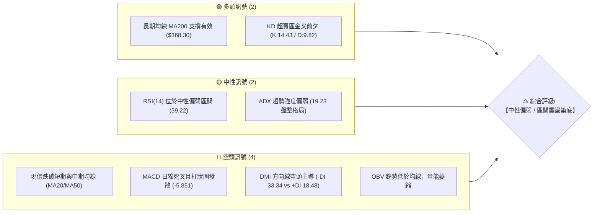

### 📊 核心指標速覽表

| 指標類別 | 指標名稱 | 當前數值 | 訊號 | 解讀 |
|----------|----------|----------|------|------|
| **價格** | 當前收盤價 | $368.45 | 🟡 | 位於52週區間40.1%分位，測試長期均線支撐 |
| **均線** | MA20 | $396.07 | 🔴 | 價格低於MA20達 -6.97%，短線空頭下壓 |
| **均線** | MA50 | $388.43 | 🔴 | 價格低於MA50達 -5.14%，中期動能轉弱 |
| **均線** | MA200 | $368.30 | 🟢 | 現價略高於MA200 (+0.04%)，牛熊分界線得守 |
| **動能** | RSI(14) | 39.22 | 🟡 | 處於40以下弱勢區，但未見顯著底背離 |
| **動能** | MACD(12,26,9) | -4.616 / Signal: 1.235 | 🔴 | 負值區域運行，Histogram為 -5.851，空方主導 |
| **動能** | KD(9,3,3) | %K: 14.43 / %D: 9.82 | 🟢 | 進入深度超賣區（<20），短線具備技術性反彈動能 |
| **趨勢** | ADX(14) | 19.23 (-DI: 33.34) | 🟡 | ADX < 25 表明處於非單邊趨勢之寬幅震盪結構 |
| **通道** | 布林通道 | %B: 0.18 (帶寬 $86.75) | 🟡 | 貼近布林下軌（$352.69），具備向均值回歸潛力 |
| **波動** | ATR(14) | $15.01 (4.07%) | 🟡 | 日內波動幅度中等，適合區間網格或支撐位防守操作 |

### 🏆 技術評分卡

```
╔════════════════════════════════════════════════════════════════╗
║                  技術評分卡 — AVGO (2026-08-22)                ║
╠════════════════════════════════════════════════════════════════╣
║ 趨勢強度      █████░░░░░░░░░░░░░░░  28/100  🔴 弱趨勢/偏空震盪   ║
║ 動能指標      ███████░░░░░░░░░░░░░  36/100  🔴 MACD負值/弱動能  ║
║ 支撐穩定度    █████████████░░░░░░░  65/100  🟢 MA200/斐波61.8%   ║
║ 成交量配合    ████████░░░░░░░░░░░░  40/100  🟡 量能疲弱/OBV下彎  ║
║ 形態完整度    ██████████░░░░░░░░░░  52/100  🟡 高位雙頂回測頸線  ║
║ 均線排列      ████████████░░░░░░░░  60/100  🟡 長期多頭短期空頭  ║
╠════════════════════════════════════════════════════════════════╣
║ 綜合技術評分  █████████░░░░░░░░░░░  46.8/100  評級: 🟡 中性偏弱 ║
╚════════════════════════════════════════════════════════════════╝
```

---

## 2. 趨勢分析

### 🌐 多時框趨勢分析

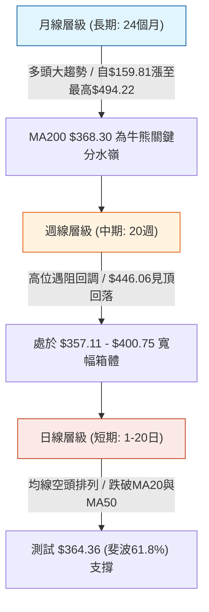

### 📈 長期趨勢 — 12個月走勢圖（Unicode）

```
AVGO 月線收盤走勢圖（2025-08 至 2026-08）
價格軸 ($)
$460 ┤                                           ● (05月: $446.06)
$440 ┤
$420 ┤                                   ● (04月: $416.77)
$400 ┤                   ● (11月: $400.71)               ● (07月: $389.28)
$380 ┤                                           ● (06月: $377.75)  ● (08月現價: $368.45)
$360 ┤           ● (10月: $367.57)
$340 ┤                   ● (12月: $344.83)
$320 ┤   ● (09月: $328.07)       ● (01月: $330.08)
$300 ┤● (08月: $295.23)                 ● (02月: $318.38) ● (03月: $309.02)
     └─┬───────┬───────┬───────┬───────┬───────┬───────┬───────┬───────┬───────┬───────┬───────┬───
     25-08   25-09   25-10   25-11   25-12   26-01   26-02   26-03   26-04   26-05   26-06   26-07   26-08
```

#### 走勢特徵分析表格

| 階段區間 | 起止價位 | 區間漲跌幅 | 形態特徵與量價表現 | 趨勢性質 |
|----------|----------|------------|--------------------|----------|
| **2025/08 - 2025/11** | $295.23 → $400.71 | +35.73% | 突破加速上升段，量能顯著放大，均線呈完美多頭排列 | 強勢多頭主升浪 |
| **2025/11 - 2026/03** | $400.71 → $309.02 | -22.88% | 獲利了結回調，於 $309.02 獲支撐（高於前期低點 $284.09） | 中期健康回檔 |
| **2026/03 - 2026/05** | $309.02 → $446.06 | +44.35% | 第二波強勁拉升，創下歷史次高收盤，動能指標進入超買 | 二次衝頂浪 |
| **2026/05 - 2026/08** | $446.06 → $368.45 | -17.39% | 頂部受阻回落，週線MACD翻綠，現於MA200與斐波61.8%尋求支撐 | 區間修正浪 |

### 📊 中期趨勢（週線分析）

中期走勢呈現「寬幅箱體震盪」。近20週數據顯示，價格在2026年5月觸及 $446.06 後，於2026年6月至7月下探至 $360.45 獲得強烈承接，隨後反彈至 $427.76（2026-08-09），但未能突破前期阻力，近期再次回落至 $368.45。

```
近期週線壓力支撐示意圖：
  $446.06  ────────────────────────────────────── [箱體頂部 / 強阻力]
                       ▲
                       │ 中期箱體震盪區間 ($85.61 寬度)
                       ▼
  $368.45  ══════════════════════════════════════ [現價位置 / MA200測試]
  $360.45  ────────────────────────────────────── [箱體底部 / 強支撐]
```

### ⚡ 趨勢強度評估（ADX 解讀）

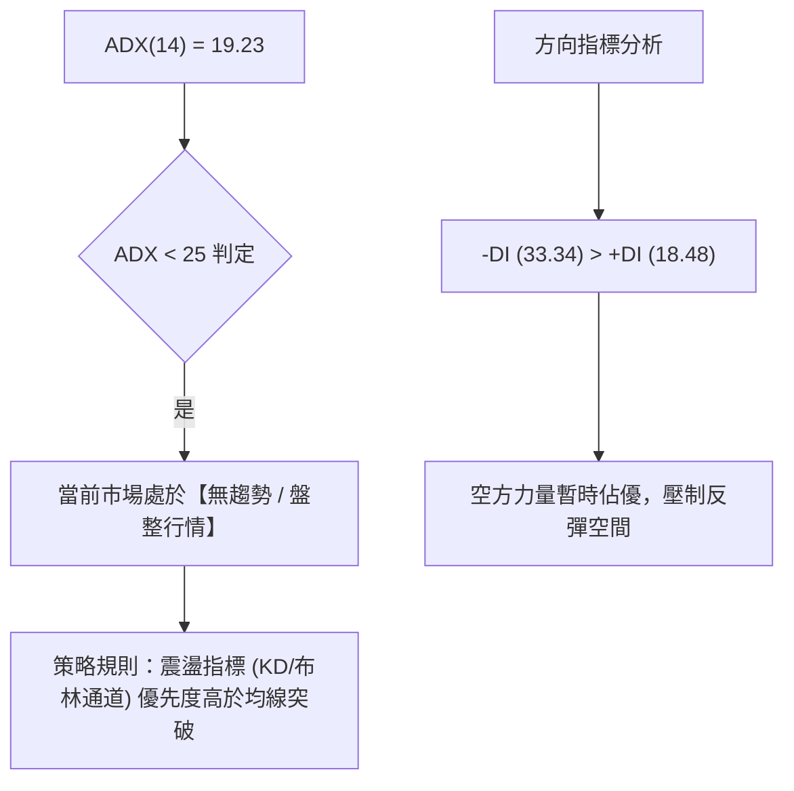

#### ADX 強度對照表

| 指標變數 | 當前讀數 | 門檻區間 | 趨勢狀態判定 | 操作指引 |
|----------|----------|----------|--------------|----------|
| **ADX** | 19.23 | < 25 (弱/無趨勢) | 處於寬幅震盪整固期，非單邊行情 | 避免追漲殺跌，採用高拋低吸策略 |
| **+DI** | 18.48 | 多頭動能偏低 | 買盤推升意願不足 | 不宜進行激進右側突破開倉 |
| **-DI** | 33.34 | 空頭佔主導地位 | 賣壓尚未完全釋放完畢 | 需等待-DI下穿+DI或ADX走平轉向 |

---

## 3. 圖表形態分析

### 🔍 形態識別系統

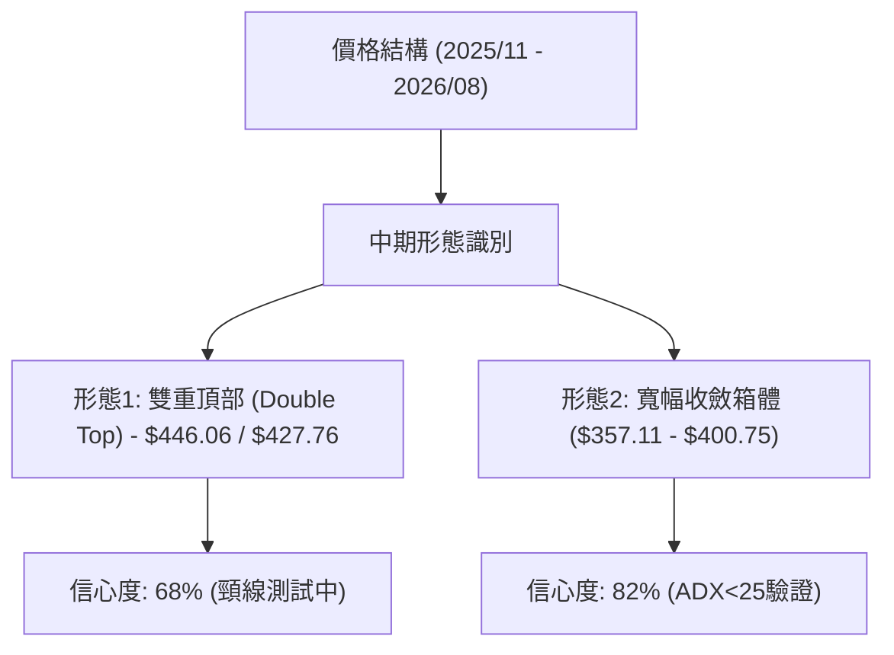

#### 形態識別與信心度評估表

| 形態名稱 | 信心度 | 判斷依據（引用數據） | 完成度 | 目標價（附計算式） |
|----------|--------|----------------------|--------|--------------------|
| **雙重頂回測 (M頂)** | 68% | 兩次波段高點分別為 2026-05 ($446.06) 與 2026-08-09 ($427.76)，頸線位於波段低點聚類 S1 ($357.11) | 75% | 若跌破頸線 $357.11：<br>形態高度 = $427.76 - $357.11 = $70.65<br>理論量度跌幅 = $357.11 - $70.65 = **$286.46** (接近52W低點 $284.09) |
| **箱體震盪區間** | 82% | ADX=19.23確認盤整，價格反覆受阻於 R3 ($400.75) 並於 S1 ($357.11) 獲得支撐 | 90% | 上軌目標：**$400.75**<br>下軌支撐：**$357.11** |
| **斐波那契黃金分割支撐** | 75% | 52週區間 ($284.09 → $494.22) 之 61.8% 回調位剛好落在 **$364.36** | 95% | 依賴 61.8% 支撐反彈目標為 50.0% 回調位：**$389.15** |

### 🕯️ 重要K線形態分析

| 週度/月份 | 收盤價 | K線形態 | 解讀 | 訊號 |
|----------|--------|---------|------|------|
| **2026-05-31** | $446.06 | 長上影線陽線 | 創波段新高後遭遇強烈獲利了結賣壓，多頭動能耗盡 | 🔴 短期見頂 |
| **2026-06-07** | $385.12 | 放量大陰線 (成交量 2.51億股) | 恐慌性拋售，單週重挫跌破MA20與MA50，確立中期調整 | 🔴 空頭突穿 |
| **2026-07-05** | $360.45 | 下影線錘頭線 (Hammer) | 探底至 $360.45（貼近支撐S1 $357.11）後強勢收回，多方進場護盤 | 🟢 階段性底部 |
| **2026-08-09** | $427.76 | 長陽衝高受阻線 | 反彈觸及R3阻力區，但隨後量能萎縮，形成次級高點 | 🟡 反彈遇阻 |
| **2026-08-23** | $368.45 | 連續回落陰線 | 跌至MA200 ($368.30) 邊緣，實體縮小，賣壓有所減緩 | 🟡 支撐測試 |

### 📉 ASCII 走勢形態示意圖

```
AVGO 近期雙頂與箱體結構示意圖：
$450 ┤          頂部1 ($446.06)
$430 ┤            /\                      頂部2 ($427.76)
$410 ┤           /  \                        /\
$390 ┤          /    \                      /  \
$370 ┤─────────/──────\────────────────────/────\─── 現價 $368.45 ── (MA200: $368.30)
$350 ┤                 \  頸線/支撐S1 ($357.11)  \
$330 ┤                  \/                        ▼ 潛在支撐測試區 ($357.11 - $364.36)
     └────────────────────────────────────────────────────────────
```

### 🎯 形態目標價計算

1. **多頭回升目標（箱體下軌反彈場景）**：
   - 基準支撐：$364.36 (斐波 61.8%) / $357.11 (S1)
   - 第一目標 (T1)：斐波 50.0% 回調位 = **$389.15**
   - 第二目標 (T2)：近一年波段高點聚類阻力 R3 = **$400.75**
2. **空頭破位量度目標（破頸線悲觀場景）**：
   - 跌破確認點：日線實體收盤低於 S1 ($357.11)
   - 量度下探支撐：波段低點聚類 S2 = **$325.79** 及 斐波 78.6% 回調位 = **$329.06**

---

## 4. 支撐與阻力

### 🗺️ 關鍵價位分布圖（Unicode）

```
AVGO 價位結構分布圖
═══════════════════════════════════════════════════════════════════
$494.22 ║████████████████████████████████║ 52週歷史高點 (0.0% Fib)
$444.63 ║████████████████████            ║ 斐波那契 23.6% 回調位
$400.75 ║██████████████████████████████  ║ 強阻力 R3 / 近一年高點聚類
$396.07 ║████████████████                ║ 布林中軌 / MA20
$389.15 ║████████████████████            ║ 斐波那契 50.0% 回調位
$384.33 ║████████████████████            ║ 阻力 R2 / 近一年高點聚類
$371.51 ║████████████                    ║ 短線關鍵阻力 R1
$368.45 ╠════════════════════════════════╣ ◄ 現價 ($368.45)
$368.30 ║────────────────────────────────║ 長期牛熊分水嶺 (MA200)
$364.36 ║▓▓▓▓▓▓▓▓▓▓▓▓▓▓▓▓▓▓▓▓            ║ 關鍵斐波那契 61.8% 回調位
$357.11 ║████████████████████████        ║ 強支撐 S1 / 近一年波段低點聚類
$352.69 ║▓▓▓▓▓▓▓▓▓▓                      ║ 布林通道下軌
$325.79 ║████████████████████████████    ║ 次級強支撐 S2 (波段低點聚類)
$312.96 ║████████████████████████████████║ 底部強支撐 S3 (波段低點聚類)
$284.09 ║████████████████████████████████║ 52週低點 (100.0% Fib)
═══════════════════════════════════════════════════════════════════
```

### 🚧 阻力位分析表

| 阻力級別 | 價位 | 形成原因 | 突破難度 | 重要性 |
|----------|------|----------|----------|--------|
| **R1** | **$371.51** | 近一年波段高點聚類 (+0.83%)，緊鄰 MA5 ($373.48) 短期壓制 | 🟡 中等 | 短線轉強第一道門檻，突破方能化解連跌態勢 |
| **R2** | **$384.33** | 近一年波段高點聚類 (+4.31%)，重疊 MA120 ($383.22) 及 MA50 ($388.43) | 🔴 較高 | 中期趨勢反轉關鍵區，多頭重掌主動權的標誌 |
| **R3** | **$400.75** | 近一年波段高點聚類 (+8.77%)，心理整數大關及布林中軌上方阻力 | 🔴 極高 | 2025/11月頂部區域，為強阻力天花板 |

### 🛡️ 支撐位分析表

| 支撐級別 | 價位 | 形成原因 | 守住機率 | 重要性 |
|----------|------|----------|----------|--------|
| **S1** | **$357.11** | 近一年波段低點聚類 (-3.08%)，接近布林下軌 ($352.69) 與 2026/07 底部 ($360.45) | 70% | 🟢 極重要短期防線，跌破則宣告日線破位下行 |
| **S2** | **$325.79** | 近一年波段低點聚類 (-11.58%)，緊鄰斐波那契 78.6% 回調位 ($329.06) | 85% | 🟢 中期強支撐，2026/01-02月築底平台位置 |
| **S3** | **$312.96** | 近一年波段低點聚類 (-15.06%)，2026/03月反彈起點 ($309.02) 聚類區 | 90% | 🟢 長期防守底線，半導體週期回調極限區域 |

### 📐 斐波那契回調位分析

*基準區間：52週最低點 $284.09 → 52週最高點 $494.22，總落差 $210.13*

| 斐波那契比例 | 精確價位 | 技術意義與當前價格關係解讀 |
|--------------|----------|----------------------------|
| **0.0% (高點)** | **$494.22** | 52週極值阻力，長期牛市擴展目標 |
| **23.6%** | **$444.63** | 2026年5月最高收盤價 ($446.06) 所在處，極強阻力 |
| **38.2%** | **$413.95** | 2026年4月突破平台，現轉為中期回升阻力 |
| **50.0%** | **$389.15** | 價值平衡中軸，目前價格在此線下方運行（壓制位） |
| **61.8% (黃金分割)** | **$364.36** | **現價 ($368.45) 關鍵緩衝區**。現價落於 50.0% ($389.15) 與 61.8% ($364.36) 之間，黃金分割位與 MA200 ($368.30) 形成密集共振支撐帶 |
| **78.6%** | **$329.06** | 深度回調防守位，若失守 61.8% 將直奔此處與 S2 ($325.79) 尋求平衡 |
| **100.0% (低點)** | **$284.09** | 52週最低基準點 |

---

## 5. 技術指標深度解讀

### 🎛️ 指標訊號總覽

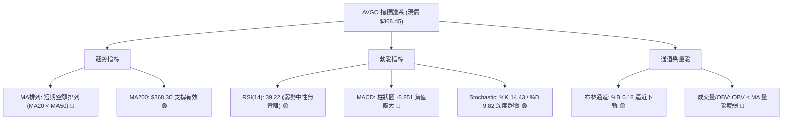

### 📈 移動平均線排列分析

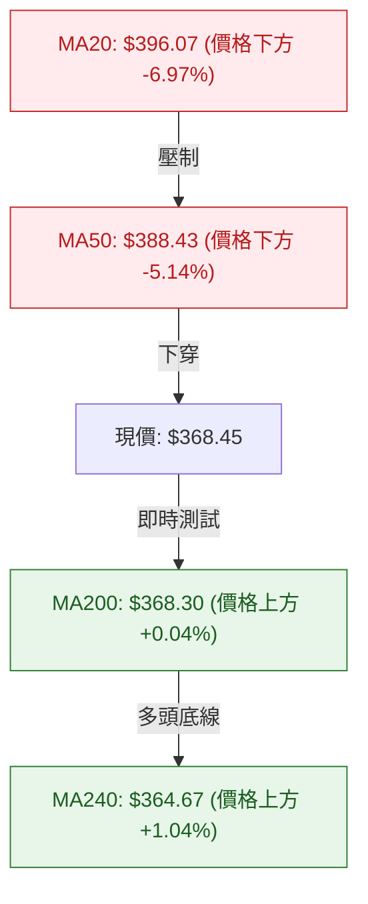

#### 均線各週期狀態解讀：
- **短期均線（MA5: $373.48, MA10: $393.27, MA20: $396.07）**：呈現向下發散形態，且日線收盤價顯著受壓於 MA5 之下，說明短期空方拋壓沉重。
- **中期均線（MA60: $394.57, MA120: $383.22）**：MA60 走平下彎，MA120 仍呈緩慢上升態勢，說明中期多頭趨勢遭到破壞，進入重構期。
- **長期均線（MA200: $368.30, MA240: $364.67）**：價格恰好回踩 MA200，且 MA200 與 MA240 均呈現上升趨勢，奠定長期牛市底座。

### 📉 RSI(14) 分析

- **當前讀數**：**39.22**
- **強度進度條**：`████████░░░░░░░░░░░░  39.22%` （弱勢中性區間）
- **超買超賣分析**：數值低於 40 進入偏弱區域，但尚未跌破 30 極端超賣線。過去20週數據顯示，2026-04曾達 93.9 極端超買，當前數值已經歷充分去泡沫化修正。
- **背離判斷**：
  - **頂背離**：2026-05月價格創 $446.06 高點，但 RSI 僅為 57.8（低於 2026-04月的 93.9），頂背離早已成立並已於6-7月釋放。
  - **底背離**：現階段價格回調至 $368.45，RSI 為 39.22；對比 2026-06-28 價格 $365.02 時 RSI 為 43.9，**當前無底背離形成**，呈現同步下跌特徵。

### 📊 MACD(12/26/9) 訊號解讀

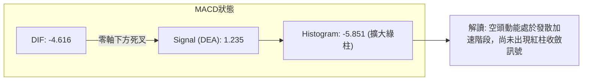

- **MACD 線**（-4.616）下穿 **訊號線**（1.235），DIF 跌入零軸下方，屬典型空頭掌控格局。
- **柱狀圖**（-5.851）為近一個月最大負值，表示空方加速釋放動能，左側交易者需等待柱狀圖縮腳方可確認動能衰竭。

### 📦 布林通道分析

```
布林通道當前結構 ($439.44 ─ $396.07 ─ $352.69)：
  $439.44 ────────────────────────────────────────── 上軌 (Upper Band)
                     帶寬: $86.75 (寬幅)
  $396.07 ┄┄┄┄┄┄┄┄┄┄┄┄┄┄┄┄┄┄┄┄┄┄┄┄┄┄┄┄┄┄┄┄┄┄┄┄┄┄┄ 中軌 (MA20)
  $368.45 ══════════════════════════════════════════ 現價 (BB %B = 0.18)
  $352.69 ────────────────────────────────────────── 下軌 (Lower Band)
```

- **通道帶寬**：$86.75（上軌 $439.44 與 下軌 $352.69 差距顯著），表明波動空間大。
- **%B 指標**：**0.18**（位於 0 至 0.2 極弱區間），說明價格已極度貼近下軌。通常 %B < 0.2 容易引發均值回歸买盤，下軌 $352.69 與波段支撐 S1 ($357.11) 構成堅實緩衝帶。

### 💹 成交量分析（量價配合度）

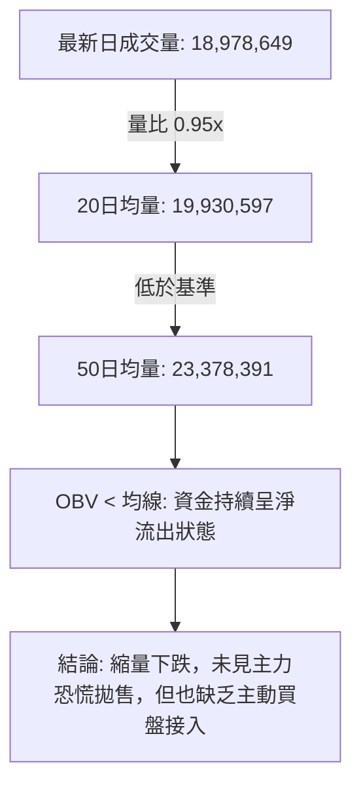

- **量價特徵**：最新成交量（1,897萬股）略低於20日均量（1,993萬股），大幅低於50日均量（2,337萬股）。在下探長期均線 MA200 過程中呈現「量縮回踩」，非恐慌性爆量跌破，屬於技術性籌碼沉澱。
- **OBV 趨勢**：OBV 線位於其移動平均線下方，表明主力資金在當前價位尚未展開大規模建倉，量能配合度偏弱。

---

## 6. 動能與波動率

### ⚡ 動能評估四象限

| 象限 | 動能強度 | 波動率水準 | 股票狀態標記 | 戰術策略特徵 |
|------|----------|------------|--------------|--------------|
| **Q1 (高動能·低波動)** | 強 (RSI>60, MACD>0) | 低 (ATR<3%) | — | 最佳單邊趨勢順勢加碼區間 |
| **Q2 (弱動能·低波動)** | 弱 (RSI<45, MACD<0) | 低 (ATR<3%) | — | 窄幅陰跌或盤整底部，醞釀方向 |
| **Q3 (強動能·高波動)** | 強 (突破阻力, 放量) | 高 (ATR>4%) | — | 高風險高回報，動能追突破模式 |
| **Q4 (弱動能·高波動)** | **弱 (RSI: 39.22, MACD柱負)** | **中高 (ATR: 4.07%)** | **✓ AVGO 當前定位** | **區間震盪偏弱，嚴控止損，採網格防守** |

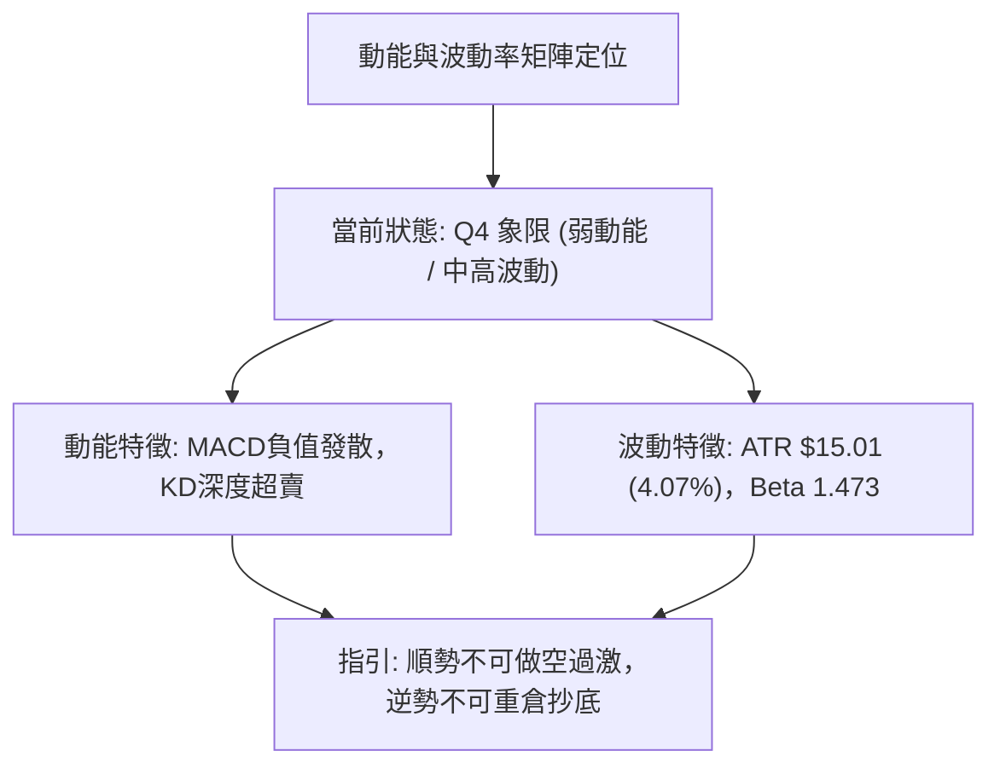

### 📊 ATR 波動率分析

- **ATR(14) 數值**：**$15.01**，佔當前股價的 **4.07%**。
- **止損距離設計建議**：
  - **日內交易/短線波段**：建議止損寬度設為 1.0 × ATR = **$15.00**（對應下檔保護價 $353.45）。
  - **中期波段建倉**：建議止損寬度設為 1.5 × ATR = **$22.50**（對應防守價位 $345.95，位於支撐 S1 $357.11 之下）。

### 📐 Beta 與市場相關性

- **Beta 係數**：**1.473**。
- **特性解讀**：AVGO 具備顯著的高彈性特質（波動幅度為標普500指數的1.47倍）。在科技股和大盤處於回調階段時，AVGO 跌幅會被放大；反之，一旦大盤止跌企穩，AVGO 具備更強的彈性反彈動能。

---

## 7. 多時框架總結

### 📋 時框架評分表

| 時框架 | 趨勢方向 | 動能指標 | 均線排列 | 圖表形態 | 綜合評分 | 戰略建議 |
|--------|----------|----------|----------|----------|----------|----------|
| **月線 (長期)** | 🟢 多頭上行 | 🟡 中性回調 | 🟢 完美多頭 (MA200之上) | 長期上升通道 | **75/100** | 長期投資者逢低分批佈局 |
| **週線 (中期)** | 🟡 寬幅震盪 | 🔴 MACD翻綠 | 🟡 MA20向下/MA50支撐 | 雙頂頸線測試/箱體震盪 | **48/100** | 箱體操作，靠近下軌關注承接力 |
| **日線 (短期)** | 🔴 震盪下行 | 🟢 KD超賣/MACD負 | 🔴 均線空頭排列 | 下跌通道回踩MA200 | **38/100** | 嚴禁追高，短線等待右側企穩訊號 |

### 🔲 綜合訊號矩陣

```
時框訊號一致性矩陣：
┌──────────────┬──────────────┬──────────────┬──────────────┐
│   維度 / 時框 │  長期 (月線)  │  中期 (週線)  │  短期 (日線)  │
├──────────────┼──────────────┼──────────────┼──────────────┤
│ 趨勢方向     │    🟢 偏多   │    🟡 震盪   │    🔴 偏空   │
│ 均線系統     │    🟢 多頭   │    🟡 交叉   │    🔴 空頭   │
│ 動能狀態     │    🟡 修正   │    🔴 減弱   │    🟢 超賣   │
│ 量價結構     │    🟢 健康   │    🟡 萎縮   │    🔴 疲弱   │
└──────────────┴──────────────┴──────────────┴──────────────┘
訊號一致性評估：多時框處於「長多中震短空格局」，訊號產生分歧，非單邊市。
```

### ⚖️ 多時框收斂結論

> **依多時框收斂規則（規則 14）**：
> 1. **行情性質判定**：當前 ADX(14) = 19.23 (< 25)，技術面明確判定為**【盤整行情 / 寬幅箱體結構】**。
> 2. **主導維度確立**：非單邊強趨勢下，交易邏輯應**以日線布林通道上下軌及中期箱體邊界為主要交易區間**，中長期 MA200 ($368.30) 作為核心多空分水嶺。
> 3. **方向性最終結論**：**【中性觀望 / 區間下軌防守型佈局】**。
>    - 短期日線雖受空頭均線壓制，但已觸及 MA200 ($368.30)、斐波那契 61.8% ($364.36) 及布林下軌超賣區（%B=0.18, KD<15），下行空間受限。主策略應以「在支撐位尋求高勝率反彈機會」為主，不宜在當前超賣區盲目追空。

---

## 8. 交易策略建議

### 🗺️ 策略決策流程圖

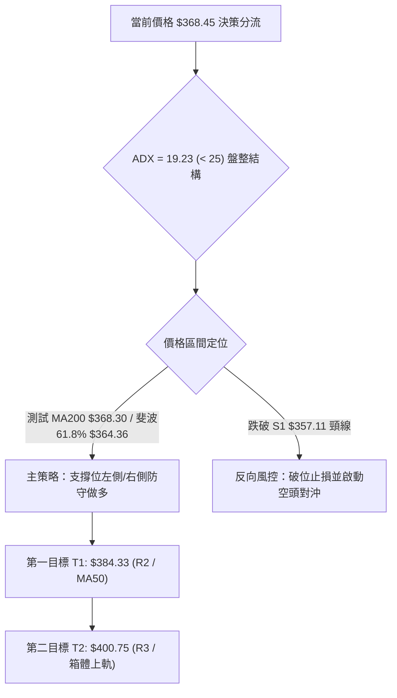

### 🧭 策略路由

> **當前主策略方向 = 【中性區間低吸 / 支撐反彈策略】（依評分卡綜合評分 46.8/100 定位為區間下軌操作）**
> - 由於股價逼近長期關鍵均線 MA200 ($368.30) 與布林下軌超賣區，空頭動能已處於短線極值，因此採取**「依託關鍵支撐區間低吸，嚴格止損」**為核心交易方針。

### 🎯 價格情境階梯（Price Scenarios）

| 觸發條件 | 下一目標 | 後續延伸 | 情境含義與操作指引 |
|----------|----------|----------|--------------------|
| **強勢突破 R1 ($371.51)** | 阻力 R2 (**$384.33**) | 阻力 R3 (**$400.75**) | 短線止跌反彈確立，空單離場，多單加碼 |
| **守住現價區間 ($364.36 - $368.45)** | 阻力 R1 (**$371.51**) | 阻力 R2 (**$384.33**) | 於 MA200 構築築底平台，適合區間網格建倉 |
| **有效跌破 S1 ($357.11)** | 支撐 S2 (**$325.79**) | 支撐 S3 (**$312.96**) | 中期雙頂破位確立，全面轉入深度空頭回調 |

### 📊 情境機率分佈

| 情境分類 | 機率預估 | 主要依據與技術支撐 |
|----------|----------|--------------------|
| **依託支撐反彈 / 回升** | **55%** | KD 深度超賣 (14.43)、布林 %B 達 0.18 極值、MA200 ($368.30) 與斐波 61.8% ($364.36) 共振強支撐 |
| **窄幅區間震盪築底** | **30%** | ADX 僅 19.23 缺乏趨勢動能、成交量萎縮至均量以下，多空雙方在 $360-$385 間反覆換手 |
| **跌破頸線深幅回調** | **15%** | MACD 柱狀圖負值擴大 (-5.851)、-DI 佔據 33.34 高位，若大盤系統性風險爆發可能帶崩 |

### 🟢 主策略詳情

| 策略要素 | 策略 A：左側支撐低吸策略 (保守試倉) | 策略 B：右側突破確認加碼策略 (穩健追擊) |
|----------|-----------------------------------|---------------------------------------|
| **進場條件** | 現價回踩斐波61.8%與MA200共振區企穩 | 日線收盤放量突破阻力 R1 ($371.51) |
| **進場價格** | **$365.00 - $368.45** | **$372.00** |
| **目標價 T1** | **$384.33** (阻力 R2 / 預期收益 +4.3%~+5.3%) | **$389.15** (斐波 50.0% / 預期收益 +4.6%) |
| **目標價 T2** | **$400.75** (阻力 R3 / 預期收益 +8.7%~+9.8%) | **$400.75** (阻力 R3 / 預期收益 +7.7%) |
| **止損價格** | **$356.50** (跌破支撐 S1 $357.11 止損) | **$364.00** (跌破斐波 61.8% $364.36 止損) |
| **風險報酬比** | **1 : 2.70** (風險 $11.95 / 獲利空間 $32.30) | **1 : 3.60** (風險 $8.00 / 獲利空間 $28.75) |
| **成功機率** | **58%** | **65%** |
| **建議倉位** | **10% - 15% (輕倉試探)** | **15% - 20% (標準波段倉)** |

### 🔴 反向風險觸發點（對沖提示）

- **多頭失效觸發線**：若日線收盤價跌破 **$357.11 (S1 支撐)**，宣告箱體底部失守。
- **對沖應對措施**：
  1. 立即清倉所有短線多頭部位。
  2. 跌破 $357.11 後反抽無力時，可反手建立空頭對沖部位，下檔目標看至 **$325.79 (S2)** 及 **$312.96 (S3)**，止損設於 $365.00。

### ⭐ 整體訊號強度評星

```
做多訊號強度：★★★☆☆  (3.0/5星 - 超賣支撐具備博弈價值，但受制於短期均線)
做空訊號強度：★★☆☆☆  (2.0/5星 - 現價極度貼近下軌支撐，追空盈虧比極差)
整體可信度：  ★★★☆☆  (3.5/5星 - 處於震盪市收斂期，技術點位明確)
```

---

## 9. 風險提示與監控

### ✅ 關鍵監控指標 Checklist

```
╔══════════════════════════════════════════════════════════════════╗
║                    AVGO 即時技術監控清單 (Checklist)             ║
╠══════════════════════════════════════════════════════════════════╣
║ [ ] 價格是否跌破長期牛熊分界線 MA200 ($368.30)                   ║
║ [ ] 價格是否有效失守斐波那契 61.8% 黃金支撐 ($364.36)            ║
║ [ ] 日線級別 KD 指標是否在超賣區 (<20) 出現黃金交叉               ║
║ [ ] MACD Histogram 柱狀圖是否由 -5.851 翻紅收斂                  ║
║ [ ] 日成交量是否放大至 2,000 萬股以上並收陽線確認量價配合         ║
║ [ ] 向上反彈時能否有效放量突破第一阻力 R1 ($371.51)              ║
╚══════════════════════════════════════════════════════════════════╝
```

### ⚠️ 風險場景分析

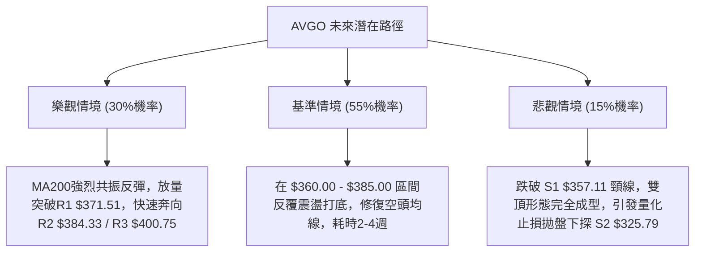

### 🛡️ 風險管理重要提醒

1. **ATR 波動風險管控**：當前 ATR 高達 $15.01，單日波動率逾 4%，交易者應適當降低槓桿，將單筆交易最大虧損嚴格限制在總資產的 **1.0% - 1.5%** 以內。
2. **Beta 放大效應**：AVGO 的 Beta 高達 1.473，若納斯達克 100 指數或費城半導體指數 (SOX) 出現系統性回調，個股可能出現非理性下穿，需同步監控大盤指數動向。
3. **避免左側過度加碼**：當前 MACD 尚未見收斂金叉，在明確右側反轉訊號出現前，嚴格執行分批佈局，不可在下行過程中單點重倉抄底。

---

## 📋 報告總結

```
╔════════════════════════════════════════════════════════════════╗
║                   AVGO 技術分析報告總結                        ║
╠════════════════════════════════════════════════════════════════╣
║ 報告日期：2026-08-22                                           ║
║ 當前價格：$368.45 (52W區間 40.1%)                              ║
║ 分析評級：⚖️ 區間震盪 / 支撐位低吸防守 (綜合評分: 46.8/100)       ║
╠════════════════════════════════════════════════════════════════╣
║ 關鍵結論：                                                     ║
║ ├─ 長期趨勢：🟢 偏多格局 (MA200 $368.30 支撐有效)               ║
║ ├─ 中期趨勢：🟡 寬幅震盪 (處於 $357.11 - $400.75 箱體結構)     ║
║ ├─ 短期趨勢：🔴 偏弱探底 (受 MA20/MA50 壓制，但處超賣極值)     ║
║ ├─ 核心支撐：$364.36 (斐波61.8%) / $357.11 (強支撐 S1)          ║
║ ├─ 核心阻力：$371.51 (阻力 R1) / $384.33 (阻力 R2)             ║
║ └─ 分析師共識：Strong Buy (均價 $527.88 / 最高 $675.00)        ║
╠════════════════════════════════════════════════════════════════╣
║ 最優策略組合：                                                 ║
║ 1. 🥇 最佳機會：依託 $364.36 - $368.45 區間輕倉博反彈 (T1: $384.33)║
║ 2. 🥈 次選機會：突破 $371.51 (R1) 確認後右側加碼 (T2: $400.75) ║
║ 3. 🥉 保守選擇：場外觀望，等待日線 MACD 綠柱收斂及 KD 金叉再進 ║
╚════════════════════════════════════════════════════════════════╝
```

---

> ⚠️ **免責聲明**：本報告為 AI 自動生成之技術分析，所有數據及估算均基於提供的歷史價格資訊。本報告**僅供研究與學術參考**，**不構成任何投資建議**。投資有風險，入市需謹慎。

---

*報告生成時間：2026-08-22 ｜ 數據來源：Yahoo Finance ｜ 分析框架：多時框技術分析*