# AVGO 技術分析報告

> **報告日期**：2026-08-23 ｜ **語言**：繁體中文 ｜ **數據來源**：Yahoo Finance ｜ **當前價格**：$368.45

---

## 目錄

| 章節 | 內容 |
|------|------|
| [1. 技術面概覽](#1-技術面概覽) | 訊號儀表板、核心指標、評分卡 |
| [2. 趨勢分析](#2-趨勢分析) | 多時框趨勢、長中短期走勢、ADX解讀 |
| [3. 圖表形態分析](#3-圖表形態分析) | 形態識別、K線組合、目標價計算 |
| [4. 支撐與阻力](#4-支撐與阻力) | 關鍵價位、斐波那契回調結構 |
| [5. 技術指標深度解讀](#5-技術指標深度解讀) | MA/RSI/MACD/布林/成交量全面解析 |
| [6. 動能與波動率](#6-動能與波動率) | 動能四象限、ATR波動分析、Beta係數 |
| [7. 多時框架總結](#7-多時框架總結) | 時框矩陣、收斂判定 |
| [8. 交易策略建議](#8-交易策略建議) | 策略路由、情境階梯、風報比精算 |
| [9. 風險提示與監控](#9-風險提示與監控) | 關鍵指標Checklist、情境壓力測試 |

---

## 1. 技術面概覽

### 🎯 技術訊號儀表板

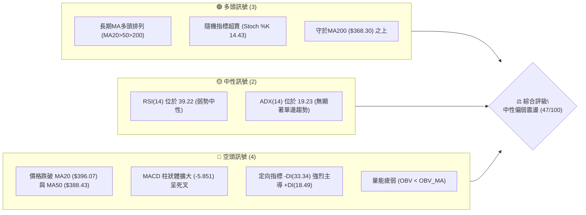

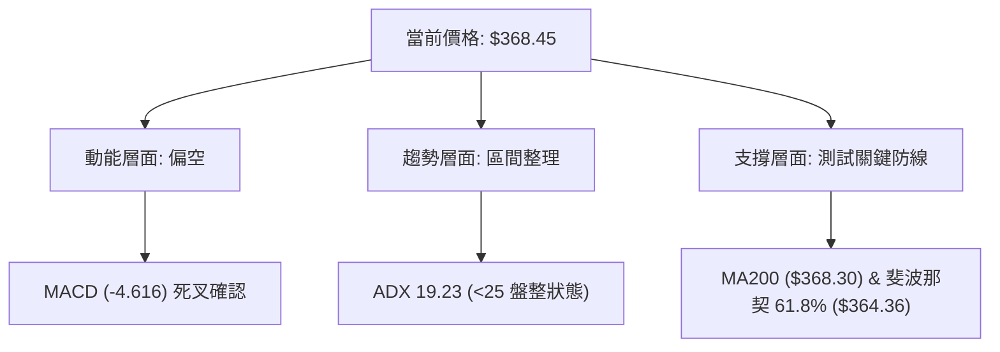

### 📊 核心指標速覽表

| 指標類別 | 指標名稱 | 當前數值 | 訊號 | 解讀 |
|:---|:---|:---|:---:|:---|
| **價格** | 當前收盤價 | $368.45 | 🟡 | 位於52週區間 40.1% 位置，自高點回檔進入防守區 |
| **短期均線** | MA20 | $396.07 | 🔴 | 價格低於MA20達 -6.97%，短線均線下彎形成動態阻力 |
| **中期均線** | MA50 | $388.43 | 🔴 | 價格低於MA50達 -5.14%，中期動能轉弱 |
| **長期均線** | MA200 | $368.30 | 🟢 | 現價略高於MA200 (+0.04%)，正接受牛熊分水嶺考驗 |
| **動能振盪** | RSI(14) | 39.22 | 🟡 | 位於弱勢區但未進入深度超賣 (<30)，無背離訊號 |
| **趨勢指標** | MACD (12,26,9) | -4.616 / 1.235 | 🔴 | DIF下穿DEA形成死叉，柱狀體為 -5.851，空頭動能擴大 |
| **擺動指標** | Stoch %K / %D | 14.43 / 9.82 | 🟢 | 進入極度超賣區間 (<20)，隨時可能引發技術性反彈 |
| **趨勢強度** | ADX(14) | 19.23 | 🟡 | ADX < 25 表明處於盤整震盪市場，單邊空頭趨勢尚未成型 |
| **波動帶** | Bollinger %B | 0.18 | 🟡 | 運行於下軌 ($352.69) 與中軌 ($396.07) 間，偏向弱勢邊界 |
| **波動率** | ATR(14) | $15.01 | 🟡 | 每日平均波動幅度為 4.07%，屬半導體板塊正常波動 |
| **量能指標** | OBV 趨勢 | OBV < MA | 🔴 | 資金呈現流出特徵，量能無法支持持續性推升 |

### 🏆 技術評分卡

```
╔══════════════════════════════════════════════════════════════╗
║              技術評分卡 — AVGO (2026-08-23)                  ║
╠══════════════════════════════════════════════════════════════╣
║ 趨勢強度 (ADX/方向)   ████████░░░░░░░░░░░░  40/100  🟡 中性弱勢  ║
║ 動能指標 (RSI/MACD)   ██████░░░░░░░░░░░░░░  32/100  🔴 明顯偏空  ║
║ 支撐穩定度 (MA200/Fib) ████████████░░░░░░░░  62/100  🟢 關鍵支撐  ║
║ 成交量配合 (OBV/均量) ████████░░░░░░░░░░░░  38/100  🔴 量能不足  ║
║ 形態完整度 (區間震盪) ██████████░░░░░░░░░░  52/100  🟡 形態重整  ║
║ 均線排列 (長期架構)   ████████████░░░░░░░░  58/100  🟡 長多短空  ║
╠══════════════════════════════════════════════════════════════╣
║ 綜合技術評分          █████████░░░░░░░░░░░  47/100  🟡 區間震盪  ║
╚══════════════════════════════════════════════════════════════╝
```

---

## 2. 趨勢分析

### 🌐 多時框趨勢分析

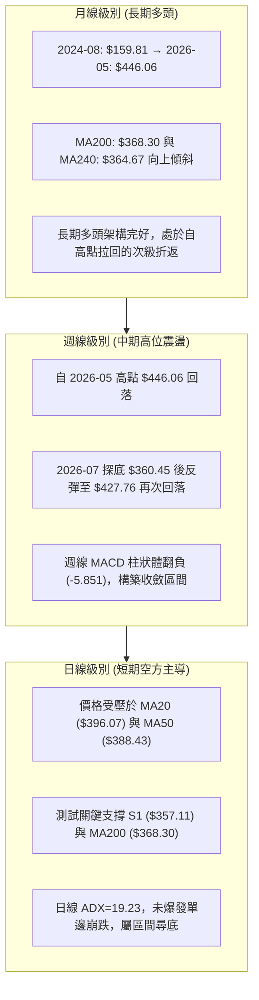

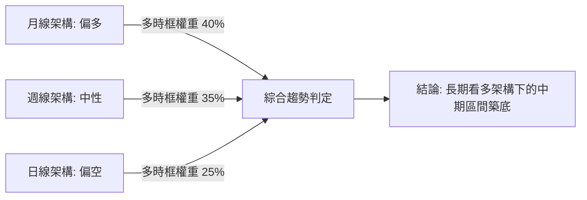

### 📈 長期趨勢 — 12個月走勢圖（ASCII）

```
AVGO 月線走勢圖（過去12個月：2025-08 至 2026-08）
價格 ($)
$460 ┤                                      ● ($446.06 05月)
$440 ┤
$420 ┤                                  ● ($416.77 04月)
$400 ┤                    ● ($400.71 11月)
$380 ┤                                          ● ($377.75 06月) ● ($389.28 07月)
$360 ┤                ● ($367.57 10月)                      ● ($368.45 08月現價)
$340 ┤                    ● ($344.83 12月)
$320 ┤            ● ($328.07 09月)  ● ($330.08 01月)
$300 ┤        ● ($295.23 08月)          ● ($318.38 02月) ● ($309.02 03月)
$280 ┤
     └────────┬───────┬───────┬───────┬───────┬───────┬───────┬───────┬───────┬───────┬───────┬───────┬
           25-08   25-09   25-10   25-11   25-12   26-01   26-02   26-03   26-04   26-05   26-06   26-07   26-08
```

#### 走勢特徵分析表格

| 階段區間 | 時間跨度 | 起訖價位 | 漲跌幅 | 主要走勢特徵與結構意涵 |
|:---|:---:|:---:|:---:|:---|
| **第一波主升段** | 2025/08 - 2025/11 | $295.23 → $400.71 | +35.73% | 突破歷史區間，呈現強勁單邊推升，量能持續放大 |
| **高位箱型整理** | 2025/12 - 2026/03 | $344.83 → $309.02 | -10.38% | 於 $310-$350 進行首輪籌碼沉澱，在 $309.02 確立底部 |
| **第二波衝頂段** | 2026/04 - 2026/05 | $416.77 → $446.06 | +44.35% | 突破 $400 整數關卡並創下 $494.22 歷史高點，動能見頂 |
| **高位獲利回吐** | 2026/06 - 2026/08 | $446.06 → $368.45 | -17.39% | 自歷史高位回落，目前跌破中期均線，尋求 MA200 支撐 |

### 📊 中期趨勢（週線分析）

中期走勢呈現「寬幅高檔箱型震盪」。近20週數據顯示，價格於 2026-05-31 觸及 $446.06 高點後，曾於 2026-07-05 回踩波段低點 $360.45，隨後反彈至 2026-08-09 的 $427.76，但未能突破 $446.06 即再度下挫至本週的 $368.45。這顯示上方在 $400.00 以上存在強勁解套與獲利賣壓，而下方在 $360.00 附近存在逢低承接買盤。

```
週線級別箱型結構示意圖：
$446.06 ─────────────────────────────── [箱型頂部阻力]
          ╲                 ╱
           ╲               ╱
            ╲  $427.76    ╱
             ╲   ╱╲      ╱
$396.07 ──────╲─╱──╲────╱────────────── [箱型中軸 MA20]
               V    ╲  ╱
                     V
$368.45 ─────────────────────────────── [當前位置：測試箱型下緣]
$357.11 ─────────────────────────────── [支撐位 S1 / 斐波那契 61.8%]
```

### ⚡ 趨勢強度評估（ADX 解讀）

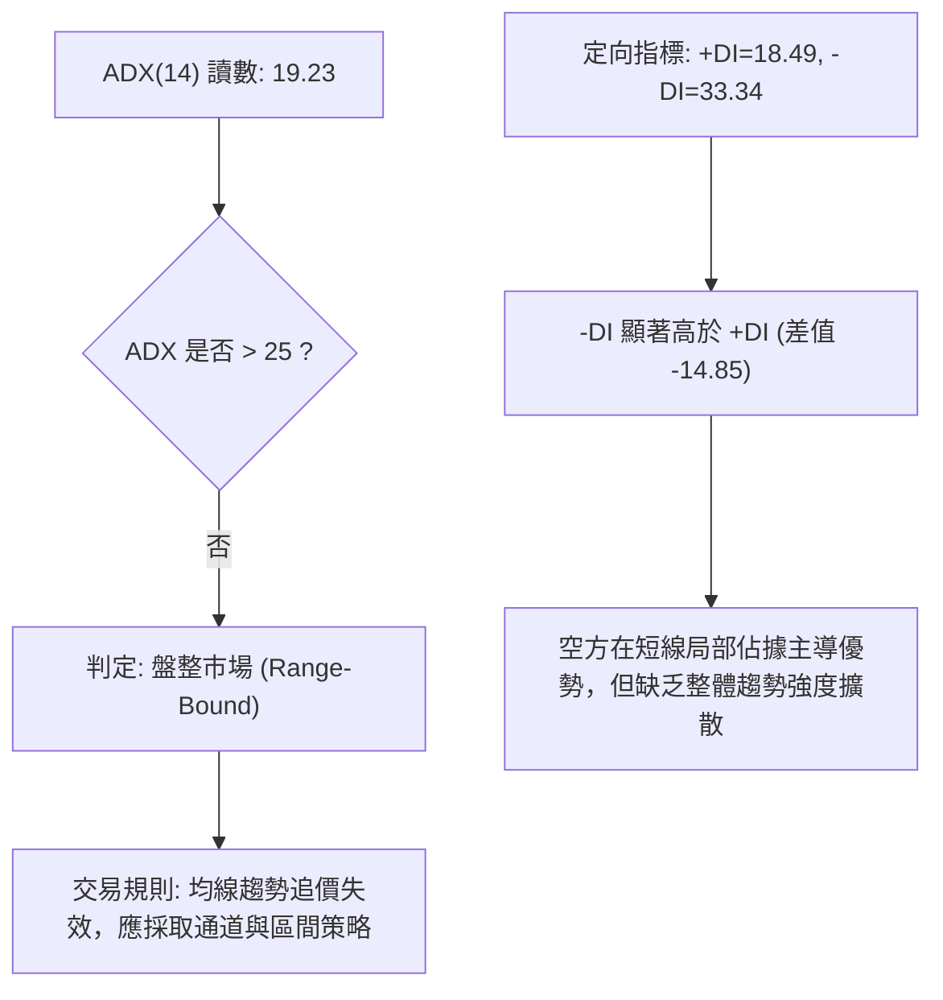

#### ADX 強度與市場狀態對照表

| ADX(14) 區間 | 當前數值 | 市場狀態分類 | 交易指引與架構優先級 |
|:---:|:---:|:---:|:---|
| **0 – 20** | **19.23 (當前)** | **弱趨勢 / 盤整市場** | 嚴禁追漲殺跌；以布林通道與關鍵支撐阻力為交易界限 |
| **20 – 25** | — | 趨勢醞釀期 | 密切注意 ADX 向上勾頭與 DI 交叉訊號 |
| **25 – 40** | — | 強單邊趨勢 | 順勢操作，依 MA50/MA20 進行波段持倉 |
| **40 – 100** | — | 極強趨勢 / 動能過熱 | 注意行情末端加速與背離反轉風險 |

---

## 3. 圖表形態分析

### 🔍 形態識別系統

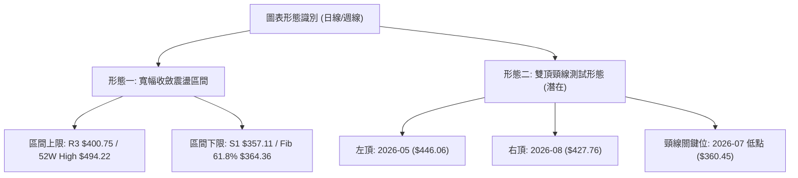

#### 形態識別與信心度評估表

| 形態名稱 | 信心度 | 判斷依據（數據引用） | 完成度 | 目標價（附嚴格計算式） |
|:---|:---:|:---|:---:|:---|
| **寬幅箱型整理** | **75%** | 價格在 S1 ($357.11) 與 R3 ($400.75) 間多次來回震盪，ADX=19.23 確認無趨勢 | 85% | 箱型向上突破目標：$400.75 + ($400.75 - $357.11) = **$444.39**（貼近 Fib 23.6% $444.63） |
| **高檔雙重頂 (M頂)** | **45%** | 高點一 $446.06 (2026-05) 與高點二 $427.76 (2026-08)，目前回測頸線 $360.45 | 50% (未跌破頸線) | 若有效跌破頸線 $360.45，形態跌幅：$360.45 - ($446.06 - $360.45) = **$274.84**（接近 52W Low $284.09） |
| **均線死叉壓制** | **80%** | MA5 ($373.48) 下穿 MA20 ($396.07)，價格跌破 MA50 ($388.43) | 90% | 下檔回測目標：MA200 ($368.30) 及 S1 ($357.11) |

*註：由於雙頂形態尚未有效跌破頸線 $360.45 且 ADX<25，信心度僅評為 45%，目前依規則優先視為「寬幅箱型整理」。*

### 🕯️ 重要K線形態分析

| 週期/月份 | 收盤價 | K線組合形態 | 技術面解讀 | 訊號強度 |
|:---|:---:|:---|:---|:---:|
| **2026-05** | $446.06 | 長上影大陽線 | 觸及 $494.22 歷史高點後遭遇強大解套與獲利了結賣壓 | 🔴 頂部停滯 |
| **2026-06** | $377.75 | 長實體大陰線 | 單月重挫 $68.31 (-15.31%)，量能爆發至 2.51億股，主力高位出貨 | 🔴 強烈看空 |
| **2026-07** | $389.28 | 下影紡錘陽線 | 探底 $360.45 後獲買盤強力拉抬，顯示低檔買盤介入 | 🟢 支撐浮現 |
| **2026-08 (近4週)** | $368.45 | 陰線包覆下挫 | 08-09 反彈至 $427.76 後連續兩週收陰跌破多條均線 | 🔴 短期轉弱 |

### 📉 ASCII 走勢形態示意圖

```
                    [頂部一: $446.06]
                         ▲
                        ╱ ╲                      [頂部二: $427.76]
                       ╱   ╲                            ▲
                      ╱     ╲                          ╱ ╲
                     ╱       ╲                        ╱   ╲
                    ╱         ╲                      ╱     ╲
───────────────────╱───────────╲────────────────────╱───────╲──────────── $400.75 (R3)
                  ╱             ╲                  ╱         ╲
                 ╱               ╲                ╱           ╲
────────────────╱─────────────────╲──────────────╱─────────────╲────────── $384.33 (R2)
               ╱                   ╲            ╱               ▼
──────────────╱─────────────────────╲──────────╱───────────── $368.45 (現價)
             ╱                       ╲        ╱
────────────╱─────────────────────────▼──────╱──────────────────────────── $360.45 (頸線)
                                     [低點一: $360.45]
────────────────────────────────────────────────────────────────────────── $357.11 (S1)
```

---

## 4. 支撐與阻力

### 🗺️ 關鍵價位分布圖（Unicode）

```
AVGO 價位結構分布圖 (當前價格: $368.45)
══════════════════════════════════════════════════════════════════════
$494.22 ║████████████████████████████████████████║ 52週歷史高點 (Fib 0.0%)
$444.63 ║████████████████████████████████        ║ 歷史高檔重壓區 (Fib 23.6%)
$400.75 ║████████████████████████████████████████║ 強阻力 R3 / 整數心理大關
$389.15 ║████████████████████████                ║ Fib 50.0% / MA50 ($388.43)
$384.33 ║████████████████████                    ║ 中期阻力 R2
$371.51 ║████████████████                        ║ 短線動態阻力 R1 (MA5 $373.48)
────────╠════════════════════════════════════════╣ ◄ 現價 $368.45 (MA200 $368.30)
$364.36 ║▓▓▓▓▓▓▓▓▓▓▓▓▓▓▓▓▓▓▓▓                    ║ 斐波那契關鍵回調 (Fib 61.8%)
$357.11 ║▓▓▓▓▓▓▓▓▓▓▓▓▓▓▓▓▓▓▓▓▓▓▓▓▓▓▓▓            ║ 近期核心支撐 S1 (波段聚類低點)
$352.69 ║▓▓▓▓▓▓▓▓▓▓▓▓▓▓                          ║ 布林通道下軌
$325.79 ║████████████████████████████████        ║ 中期強支撐 S2
$312.96 ║████████████████████████████████████████║ 長期底部支撐 S3 (2026-03 低點聚類)
$284.09 ║████████████████████████████████████████║ 52週歷史低點 (Fib 100.0%)
══════════════════════════════════════════════════════════════════════
```

### 🚧 阻力位分析表

| 阻力級別 | 精確價位 | 形成依據（數據源自 OHLCV 計算） | 突破難度 | 技術重要性與策略意義 |
|:---|:---:|:---|:---:|:---|
| **R1** | **$371.51** | 近一年波段高點聚類 / 貼近 MA5 ($373.48) | 🟡 中等 | 短線多空爭奪第一線；站上可化解極端超賣壓力 |
| **R2** | **$384.33** | 中期波段反彈高點聚類 / 接近 MA120 ($383.22) | 🔴 偏高 | 中期分水嶺；此處匯聚 MA50 ($388.43) 密集賣壓 |
| **R3** | **$400.75** | 強波段高點聚類 / 2025-11 高點 $400.71 重疊 | 🔴 極高 | 多頭反轉關鍵關卡；突破方能重新開啟向上主升浪 |

### 🛡️ 支撐位分析表

| 支撐級別 | 精確價位 | 形成依據（數據源自 OHLCV 計算） | 守住機率 | 技術重要性與策略意義 |
|:---|:---:|:---|:---:|:---|
| **S1** | **$357.11** | 近一年波段低點聚類 / 接近布林下軌 $352.69 | 🟢 65% | 當前多頭防線核心；跌破將觸發技術性止損賣壓 |
| **S2** | **$325.79** | 中期波段結構低點聚類 / 接近 Fib 78.6% $329.06 | 🟢 80% | 深度回調防守位；具備強大長期價值買盤支撐 |
| **S3** | **$312.96** | 長期底部低點聚類 / 2026-03 月線低點 $309.02 聚類 | 🟢 90% | 長期多頭終極底線；失守代表長期上升趨勢遭到破壞 |

### 📐 斐波那契回調位分析

*基準區間：52週低點 $284.09 → 52週高點 $494.22（總垂直跨度：$210.13）*

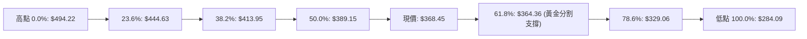

#### 斐波那契回調結構解讀

1. **現價區間位置**：現價 **$368.45** 處於 **50.0% ($389.15)** 與 **61.8% ($364.36)** 回調區間之內。
2. **黃金分割支撐 (61.8% - $364.36)**：此價位為技術分析中最關鍵的黃金回撤支撐，且與 MA240 ($364.67) 及 MA200 ($368.30) 高度共振，構成堅固的複合支撐帶。
3. **上方阻力防線 (50.0% - $389.15)**：該位置與 MA50 ($388.43) 重疊，若無法有效放量收復 $389.15，反彈均視為技術性抽頭。

---

## 5. 技術指標深度解讀

### 🎛️ 指標訊號總覽

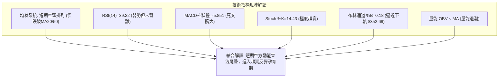

### 📈 移動平均線排列分析

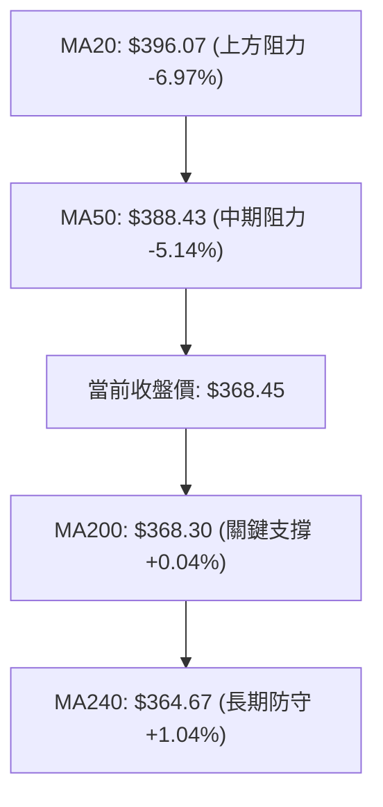

#### 均線各週期數據與偏離度分析

| 均線名稱 | 數值 | 價格相對於均線 | 均線斜率與形態特徵 | 訊號評估 |
|:---|:---:|:---:|:---|:---:|
| **MA 5** | $373.48 | -1.35% | 下降中 (短線第一道動態阻力) | 🔴 空頭壓制 |
| **MA 10** | $393.27 | -6.31% | 下降中 (短線快速回落) | 🔴 空頭壓制 |
| **MA 20** | $396.07 | -6.97% | 下降中 (布林中軌，中期強阻力) | 🔴 空頭壓制 |
| **MA 50** | $388.43 | -5.14% | 下降中 (中期多空分界線) | 🔴 空頭壓制 |
| **MA 60** | $394.57 | -6.62% | 走平略下彎 (季線壓力) | 🔴 空頭壓制 |
| **MA 120** | $383.22 | -3.85% | 上升中 (半年線提供中期底部支撐) | 🟡 中性支撐 |
| **MA 200** | $368.30 | +0.04% | 向上傾斜 (年線牛熊分水嶺，當前精確共振) | 🟢 強烈支撐 |
| **MA 240** | $364.67 | +1.04% | 向上傾斜 (長期牛市基石) | 🟢 強烈支撐 |

**均線結構總結**：目前均線呈現「長多短空」的分歧格局。短期均線（MA5/10/20）呈現空頭排列並快速下壓，但長期均線（MA200/240）保持上揚，且價格於今日精準回踩 MA200（$368.45 vs $368.30）。此處若能獲得均線扣抵支撐，將構築強烈共振反彈。

### 📉 RSI(14) 分析

```
RSI(14) 讀數：39.22 ｜ 弱勢中性區間
[0] ────────── [30 超賣] ────●───── [50 中軸] ────────── [70 超買] ────────── [100]
                         39.22
進度條：████████░░░░░░░░░░░░░░░░ 39.22%
```

- **超買超賣評估**：RSI(14) 降至 39.22，顯示自 08-09 的 73.6 高位快速回落。目前已進入 40 以下的弱勢區間，但尚未跌破 30 的極端超賣門檻。
- **背離判斷**：
  - **頂背離**：2026-05 價格高點 $446.06 時週線 RSI 達 93.9，隨後在 08-09 價格反彈至 $427.76 時 RSI 僅達 73.6，形成標準**週線級別頂背離**，該背離已在近兩週的重挫中得到充分宣洩。
  - **底背離**：日線級別價格回踩 MA200，RSI 同步滑落至 39.22，目前**無明顯底背離**跡象，顯示下行動能仍屬常規釋放。

### 📊 MACD(12/26/9) 訊號解讀

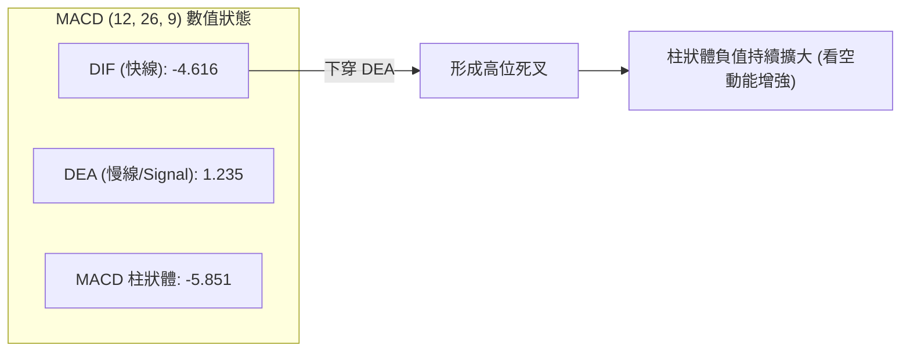

- **數值現狀**：DIF (-4.616) 已跌破零軸並下穿 DEA (1.235)，MACD 柱狀體為 **-5.851**。
- **解讀**：負值柱狀體擴大表明空頭在短線上仍握有進攻主動權。但需注意 DIF 乖離零軸過深，若未來 2-3 個交易日柱狀體開始收斂（由 -5.851 向上縮短），將發出第一道動能衰竭與反彈訊號。

### 📦 布林通道分析

```
AVGO 布林通道 (20, 2) 結構圖
$439.44 ────────────────────────────────── 上軌 (BB Upper)
                ╲
                 ╲
$396.07 ──────────╲─────────────────────── 中軌 (MA20)
                   ╲
$368.45 ────────────●───────────────────── 當前價格 (%B = 0.18)
$352.69 ────────────────────────────────── 下軌 (BB Lower)
```

- **帶寬與位置**：上軌 $439.44，中軌 $396.07，下軌 $352.69，帶寬（Bandwidth）為 21.9%。
- **%B 指標分析**：當前 %B 為 **0.18**，表明價格已進入布林下軌超賣敏感帶（0.0 - 0.20）。在 ADX=19.23 的盤整市場特徵下，%B 接近下軌通常代表回調空間有限，具備向中軌 $396.07 進行均值回歸（Mean Reversion）的強烈技術需求。

### 💹 成交量分析（量價配合度）

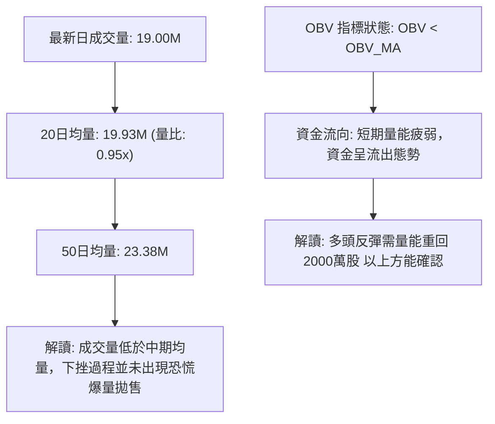

- **量價特徵**：最新成交量為 19.00M，低於 20日均量 19.93M 及 50日均量 23.38M。在價格下挫過程中縮量，表明這是一次「無量回調」，機構持股比高達 80.2% 的背景下，籌碼並未出現結構性潰散。
- **OBV 趨勢**：OBV 位於均線下方，說明短線資金仍在觀望，缺乏主動性買盤推升。

---

## 6. 動能與波動率

### ⚡ 動能評估四象限

| 象限 | 動能維度 (Momentum) | 波動率維度 (Volatility) | AVGO 當前定位 | 交易策略意涵 |
|:---:|:---:|:---:|:---:|:---|
| **第一象限 (Q1)** | 強動能 (Bullish) | 低波動 (Low Vol) | — | 最佳波段加碼區間 |
| **第二象限 (Q2)** | **弱動能 (Bearish)** | **低/中波動 (Moderate)** | **✓ (當前狀態)** | **區間震盪低吸 / 防守觀望** |
| **第三象限 (Q3)** | 強動能 (Bullish) | 高波動 (High Vol) | — | 爆發突破追擊行情 |
| **第四象限 (Q4)** | 弱動能 (Bearish) | 高波動 (High Vol) | — | 恐慌崩跌，嚴禁進場 |

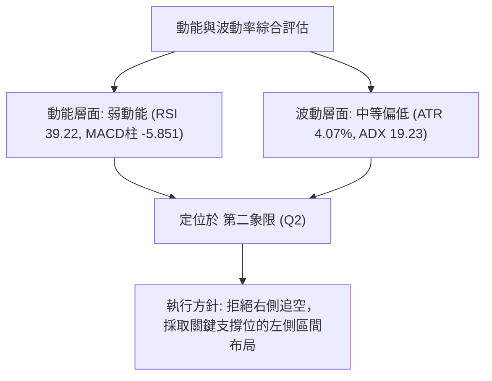

### 📊 ATR 波動率分析

```
ATR(14) 數值：$15.01 ｜ 佔現價比例：4.07%
進度條：████████░░░░░░░░░░░░░░░░ 4.07% (中等波動)
```

- **止損距離建議**：
  - **保守型交易者**：2.0 × ATR = **$30.02**（對應支撐止損位：$368.45 - $30.02 = **$338.43**，保護於 S1 $357.11 之下）
  - **激進型交易者**：1.0 × ATR = **$15.01**（對應支撐止損位：$368.45 - $15.01 = **$353.44**，保護於布林下軌 $352.69 邊緣）
- **單日波動預期**：在正常市況下，AVGO 單日正常波動區間為現價 ±$15.01（即 $353.44 – $383.46）。

### 📐 Beta 與市場相關性

- **Beta 係數**：**1.473**（高彈性特徵）。
- **市場意涵**：AVGO 波動率較標普500指數高出 47.3%。在科技板塊及費城半導體指數（SOX）出現反彈時，AVGO 具備高度向上彈性；同理，在大盤回調時其回撤幅度亦顯著放大。當前處於 Beta 修正期的超跌段。

---

## 7. 多時框架總結

### 📋 時框架評分表

| 時框架 | 趨勢方向 | 動能狀態 | 均線排列 | 形態結構 | 綜合評分 | 策略建議 |
|:---:|:---:|:---:|:---:|:---:|:---:|:---|
| **月線 (長期)** | 🟢 多頭 | 🟡 中性放緩 | 🟢 多頭排列 | 歷史高檔整理 | **78/100** | 長期投資者逢低分批布局 |
| **週線 (中期)** | 🟡 震盪 | 🔴 柱狀體翻負 | 🟡 糾結整理 | 寬幅箱型震盪 | **48/100** | 區間操作，嚴控持倉部位 |
| **日線 (短期)** | 🔴 空頭 | 🟢 極度超賣 | 🔴 空頭下壓 | 測試 MA200 支撐 | **38/100** | 等待止跌訊號，尋找反彈契機 |

### 🔲 綜合訊號矩陣

```
時框架訊號一致性矩陣：
┌─────────────┬───────────┬───────────┬───────────┬───────────┐
│   維度      │  月線 (長期)│  週線 (中期)│  日線 (短期)│  收斂訊號  │
├─────────────┼───────────┼───────────┼───────────┼───────────┤
│ 趨勢方向    │   🟢 多頭 │   🟡 盤整 │   🔴 偏空 │  🟡 震盪  │
│ 均線系統    │   🟢 向上 │   🟡 糾結 │   🔴 下彎 │  🟡 分歧  │
│ 動能指標    │   🟢 強勁 │   🔴 轉弱 │   🟢 超賣 │  🟡 醞釀  │
│ 支撐有效性  │   🟢 極強 │   🟢 良好 │   🟡 測試 │  🟢 有效  │
└─────────────┴───────────┴───────────┴───────────┴───────────┘
```

### ⚖️ 多時框收斂結論

依據多時框收斂規則：
1. **行情性質判定**：當前 ADX(14) 為 **19.23 (<25)**，嚴格判定為**「盤整震盪行情」**而非單邊趨勢行情。
2. **主導時框與權重**：在盤整行情中，單邊均線趨勢追隨失效，以**日線布林通道上下軌（$352.69 – $439.44）**與**關鍵支撐阻力（S1 $357.11 / R2 $384.33 / R3 $400.75）**為主要收斂交易邊界。
3. **方向性唯一結論**：**中性觀望偏區間低吸（震盪尋底）**。日線的短空下挫已抵達週線/月線的長期核心均線 MA200 ($368.30) 與黃金分割 61.8% ($364.36)，下檔空間受限，短期具備強烈均值回歸反彈潛力。

---

## 8. 交易策略建議

### 🗺️ 策略決策流程圖

```mermaid
graph TD
    START["當前價格: $368.45 (評分: 47/100)"] --> ROUTE{"策略路由: 中性區間 (40-60分)"}
    
    ROUTE --> PLAN_A["策略 A (主要): 區間下緣低吸反彈策略"]
    ROUTE --> PLAN_B["策略 B (次要): 突破 R1 右側確認策略"]
    
    PLAN_A --> COND_A["回踩 S1 $357.11 ~ Fib 61.8% $364.36 企穩"]
    COND_A --> EXEC_A["進場: $364.36 |" 止損: $352.69 "| T1: $384.33 | T2: $396.07"]
    
    PLAN_B --> COND_B["日線放量收復 R1 $371.51"]
    COND_B --> EXEC_B["進場: $371.51 |" 止損: $357.11 "| T1: $384.33 | T2: $400.75"]
```

### 🧭 策略路由

**當前主策略方向 = 區間震盪操作（依綜合評分 47/100，處於 40–60 中性區間，以布林下軌/關鍵支撐低吸為主）**

### 🎯 價格情境階梯（Price Scenarios）

| 觸發條件 | 下一目標 | 後續延伸目標 | 技術情境含義與操作指引 |
|:---|:---:|:---:|:---|
| **向上突破 R1 $371.51** | **R2 $384.33** | **R3 $400.75** | 短線轉強，MACD柱狀體收斂，展開均值回歸反彈 |
| **站穩現價區間 ($364 - $368)** | **R1 $371.51** | **R2 $384.33** | 依託 MA200 構築雙底，進行時間換空間的築底 |
| **跌破 S1 $357.11** | **S2 $325.79** | **S3 $312.96** | 區間防線失守，向下回補長期乖離，轉為防守模式 |

### 📊 情境機率分佈

| 情境劇本 | 發生機率 | 主要技術依據與指標支撐 |
|:---|:---:|:---|
| **情境一：依託支撐超跌反彈** | **55%** | Stoch 超賣 (%K=14.43)、布林 %B=0.18 逼近下軌、MA200 ($368.30) 強支撐 |
| **情境二：窄幅橫盤築底** | **30%** | ADX=19.23 弱趨勢、量能縮減至 19.00M，市場進入籌碼沉澱期 |
| **情境三：跌破 S1 向下探底** | **15%** | MACD 死叉持續發散、-DI(33.34) 主導，若大盤系統性風險爆發則破位 |

### 🟢 主策略詳情

| 策略要素 | 策略 A（左側支撐低吸策略） | 策略 B（右側突破確認策略） |
|:---|:---|:---|
| **策略類型** | 斐波那契 61.8% / MA200 逢低布局 | 突破動態阻力 R1 追擊反彈 |
| **進場條件** | 價格回踩 $364.36 - $368.30 區間且出現長下影 | 日K線收盤價明確站穩 R1 ($371.51) 上方 |
| **精確進場點** | **$364.36**（Fib 61.8% 回調位） | **$371.51**（突破 R1 阻力位） |
| **目標價 T1** | **$384.33**（阻力位 R2 / MA120） | **$384.33**（阻力位 R2） |
| **目標價 T2** | **$396.07**（布林中軌 / MA20） | **$400.75**（阻力位 R3 / 整數關卡） |
| **嚴格止損點** | **$352.69**（跌破布林下軌及 S1 $357.11） | **$357.11**（跌破核心支撐 S1） |
| **風險空間** | $364.36 - $352.69 = $11.67 | $371.51 - $357.11 = $14.40 |
| **獲利空間 (T2)**| $396.07 - $364.36 = $31.71 | $400.75 - $371.51 = $29.24 |
| **風險報酬比** | **1 : 2.72** | **1 : 2.03** |
| **預估勝率** | **60%** | **55%** |
| **建議倉位** | **15% - 20%** | **10% - 15%** |

### 🔴 反向風險觸發點（對沖與風控提示）

- **全面停損警戒線**：若日線收盤價帶量**跌破 S1 ($357.11)**，宣告本輪反彈結構徹底失敗，多頭部位應無條件止損或反向建立對沖空單。
- **空頭加速目標**：跌破 $357.11 後，下檔第一延伸目標為 **S2 ($325.79)**，第二目標為 **S3 ($312.96)**。

### ⭐ 整體訊號強度評星

```
做多訊號強度：★★☆☆☆  (2.5/5星 - 處於超賣反彈孕育期，左側機會)
做空訊號強度：★★☆☆☆  (2.0/5星 - 空頭動能衰竭，空間受限於 MA200)
整體可信度：  ★★★★☆  (4.0/5星 - 指標與關鍵支撐共振度高)
```

---

## 9. 風險提示與監控

### ✅ 關鍵監控指標 Checklist

```
╔══════════════════════════════════════════════════════════════╗
║              每日交易風控監控清單 (Checklist)                 ║
╠══════════════════════════════════════════════════════════════╣
║ [ ] 價格是否跌破 MA200 ($368.30) 或 Fib 61.8% ($364.36)      ║
║ [ ] RSI(14) 是否跌破 30 進入極度恐慌區                        ║
║ [ ] MACD 柱狀體是否由 -5.851 開始向上縮短 (動能拐點)          ║
║ [ ] 日成交量是否放大至 23.38M (50日均量) 以上確認買盤介入     ║
║ [ ] 定向指標 -DI 是否由 33.34 向下拐頭並跌破 30              ║
║ [ ] 布林通道帶寬是否收窄，%B 是否由 0.18 向上穿越 0.20        ║
╚══════════════════════════════════════════════════════════════╝
```

### ⚠️ 風險場景分析

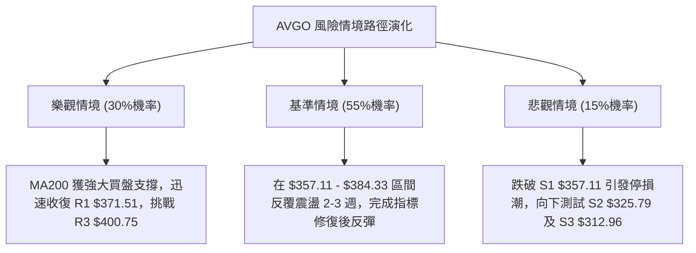

### 🛡️ 風險管理重要提醒

1. **Beta 波動管理**：鑑於 AVGO 的 Beta 為 **1.473**，其波動幅度顯著高於大盤，單筆交易的最大資金回撤應嚴格控制在總資產的 1.5% 以內。
2. **倉位動態調整**：在 ADX 讀數回升至 25 以上前，整體部位不宜超過總資金的 30%，維持靈活現金以應對潛在的二度探底。
3. **嚴禁過早追高**：在價格未能有效帶量站穩 MA20 ($396.07) 之前，所有上漲均定性為技術性反彈而非反轉，切勿在 R2 ($384.33) 附近追漲。

---

## 📋 報告總結

```
╔══════════════════════════════════════════════════════════════╗
║                 AVGO 技術分析報告總結                        ║
╠══════════════════════════════════════════════════════════════╣
║ 報告日期：2026-08-23                                         ║
║ 當前價格：$368.45                                            ║
║ 分析評級：⚖️ 中性觀望 / 區間逢低承接 (技術評分: 47/100)        ║
╠══════════════════════════════════════════════════════════════╣
║ 關鍵結論：                                                   ║
║ ├─ 長期趨勢：🟢 多頭架構完好 (MA200 $368.30 向上傾斜)        ║
║ ├─ 中期趨勢：🟡 寬幅箱型震盪 (介於 $357.11 - $400.75 之間)   ║
║ ├─ 短期趨勢：🔴 偏弱尋底，但隨機指標極度超賣 (%K=14.43)      ║
║ ├─ 核心支撐：S1 $357.11 ｜ 斐波那契 61.8% $364.36           ║
║ ├─ 關鍵阻力：R1 $371.51 ｜ R2 $384.33 ｜ R3 $400.75          ║
║ └─ 分析師共識目標價：$526.30 (評級: Strong Buy)              ║
╠══════════════════════════════════════════════════════════════╣
║ 最優策略組合：                                               ║
║ 1. 🥇 最佳機會：在 $364.36 (Fib 61.8%) 低吸，止損 $352.69    ║
║                 目標 $384.33 / $396.07 (風報比 1:2.72)       ║
║ 2. 🥈 次選機會：突破 R1 $371.51 右側進場，目標 $400.75       ║
║ 3. 🥉 保守選擇：等待日線 MACD 柱狀體翻紅後再行進場           ║
╚══════════════════════════════════════════════════════════════╝
```

---

> ⚠️ **免責聲明**：本報告為 AI 自動生成之技術分析，所有數據及估算均基於提供的歷史價格資訊。本報告**僅供研究與學術參考**，**不構成任何投資建議**。投資有風險，入市需謹慎。

---

*報告生成時間：2026-08-23 ｜ 數據來源：Yahoo Finance ｜ 分析框架：多時框技術分析*