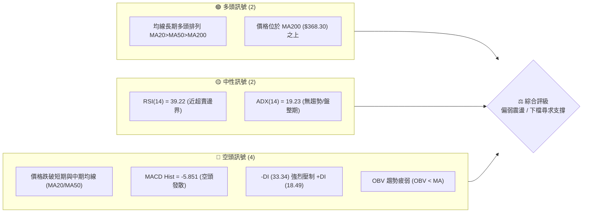
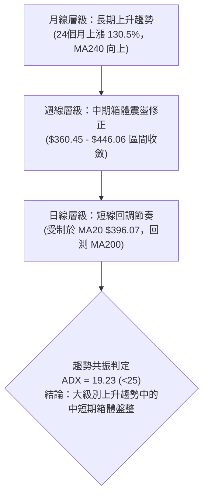
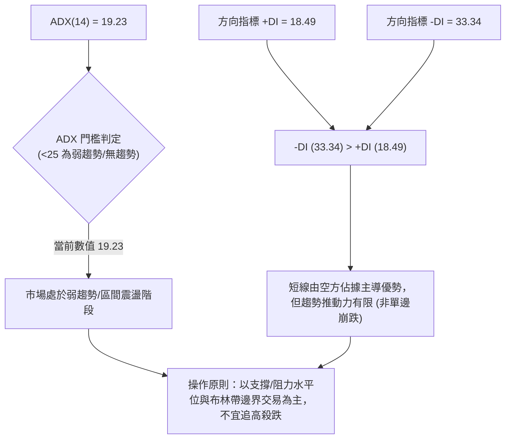
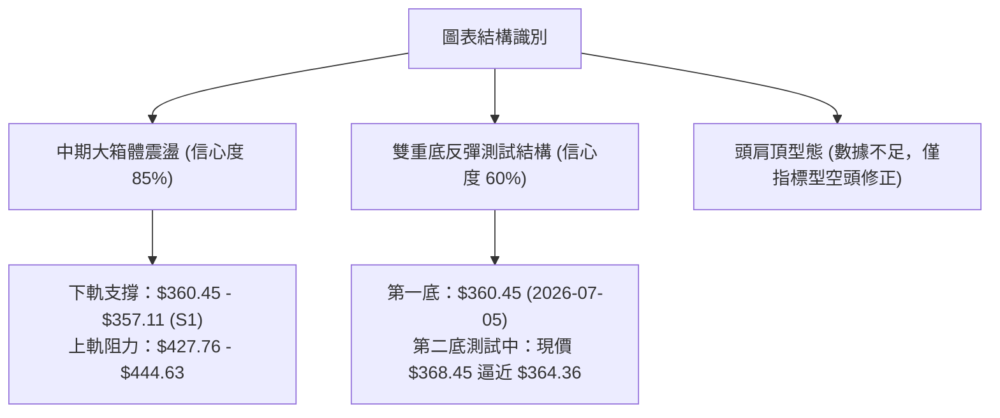
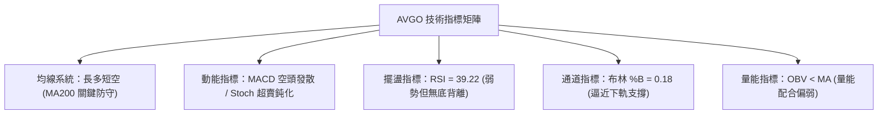
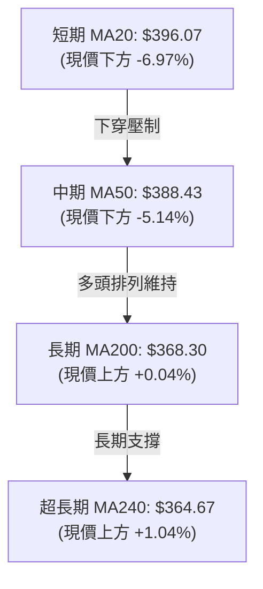
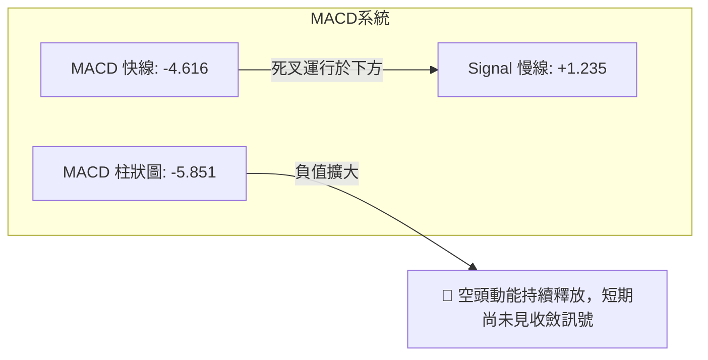
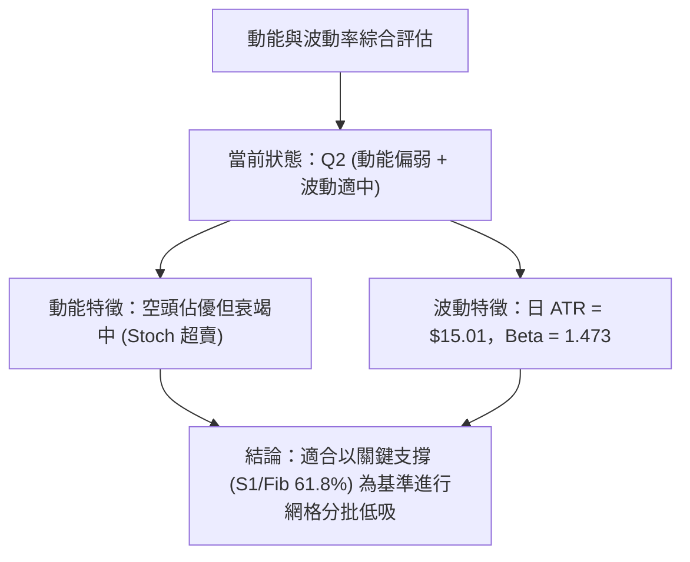
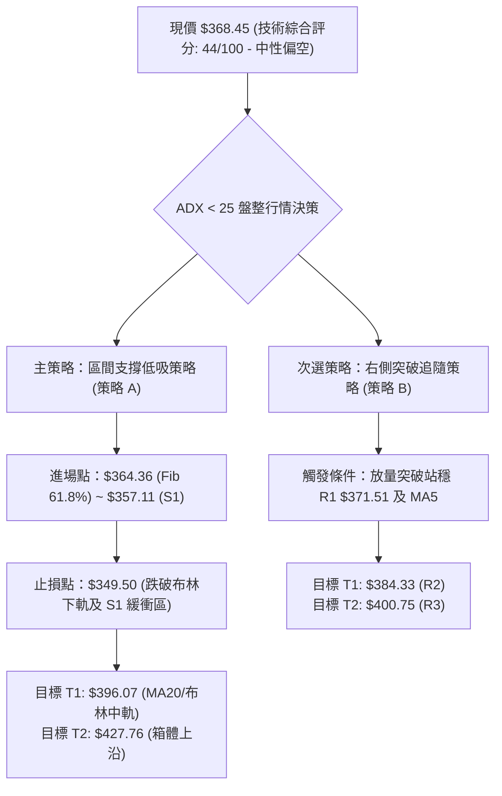
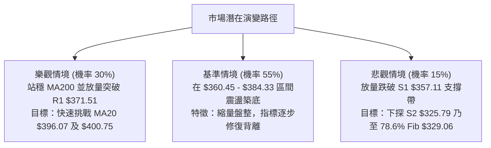

# AVGO 技術分析報告

> **報告日期**：2026-08-24 ｜ **語言**：繁體中文 ｜ **數據來源**：Yahoo Finance ｜ **當前價格**：$368.45

---

## 目錄

| 章節 | 內容 |
|------|------|
| [1. 技術面概覽](#1-技術面概覽) | 訊號儀表板、核心指標、評分卡 |
| [2. 趨勢分析](#2-趨勢分析) | 多時框趨勢、長中短期走勢 |
| [3. 圖表形態分析](#3-圖表形態分析) | 形態識別、K線組合、目標價 |
| [4. 支撐與阻力](#4-支撐與阻力) | 關鍵價位、斐波那契回調 |
| [5. 技術指標深度解讀](#5-技術指標深度解讀) | MA/RSI/MACD/布林/成交量 |
| [6. 動能與波動率](#6-動能與波動率) | 動能評估、ATR、Beta |
| [7. 多時框架總結](#7-多時框架總結) | 時框架評分矩陣 |
| [8. 交易策略建議](#8-交易策略建議) | 多空策略、風險報酬比 |
| [9. 風險提示與監控](#9-風險提示與監控) | 監控指標、風險場景 |
| [10. 報告總結](#-報告總結) | 總結儀表板與核心結論 |

---

## 1. 技術面概覽

### 🎯 技術訊號儀表板



### 📊 核心指標速覽表

| 指標類別 | 指標名稱 | 當前數值 | 訊號 | 解讀 |
|----------|----------|----------|------|------|
| **價格** | 當前價格 | $368.45 | 🟡 | 位於52週區間 40.1% 位置，自高點回調顯著 |
| **均線** | MA20 | $396.07 | 🔴 | 現價低於 MA20 達 -6.97%，短線空頭掌控 |
| **均線** | MA50 | $388.43 | 🔴 | 現價低於 MA50，中期修正持續推進 |
| **均線** | MA200 | $368.30 | 🟢 | 現價極為貼近長期生命線 MA200，多頭關鍵防線 |
| **動能** | RSI(14) | 39.22 | 🟡 | 位於弱勢中性偏冷區間，未達極端超賣 (<30) |
| **動能** | MACD Hist | -5.851 | 🔴 | MACD 線 -4.616 低於訊號線 1.235，空方動能放量 |
| **隨機指標** | Stoch %K / %D | 14.43 / 9.82 | 🟢 | 進入超賣鈍化區，隨時醞釀短線技術性反彈 |
| **趨勢** | ADX(14) | 19.23 | 🟡 | 處於盤整與弱趨勢行情 (<25)，非強單邊跌勢 |
| **波動** | ATR(14) | $15.01 | 🟡 | 日波動率 4.07%，震盪幅度處於正常偏高範圍 |

### 🏆 技術評分卡

```
╔══════════════════════════════════════════════════════════════════╗
║                   技術評分卡 — AVGO (2026-08-24)                 ║
╠══════════════════════════════════════════════════════════════════╣
║ 趨勢強度 (ADX/DI)   ██████░░░░░░░░░░░░░░  30/100  🔴 空方主導   ║
║ 動能指標 (MACD/RSI) ███████░░░░░░░░░░░░░  35/100  🔴 動能疲軟   ║
║ 支撐穩定度 (S1/MA200)████████████░░░░░░░░  60/100  🟡 關鍵考驗   ║
║ 成交量配合 (OBV/VOL)████████░░░░░░░░░░░░  40/100  🔴 縮量整理   ║
║ 形態完整度 (結構)   ██████████░░░░░░░░░░  50/100  🟡 區間震盪   ║
║ 均線排列 (多時框)   ██████████░░░░░░░░░░  50/100  🟡 長多短空   ║
╠══════════════════════════════════════════════════════════════════╣
║ 綜合評分            ████████░░░░░░░░░░░░  44/100  🟡 中性偏空   ║
║ 結論：短線承壓於均線下方，長線依託 MA200 與 61.8% 斐波那契守成  ║
╚══════════════════════════════════════════════════════════════════╝
```

---

## 2. 趨勢分析

### 🌐 多時框趨勢分析



### 📈 長期趨勢 — 12個月走勢圖（ASCII）

```
AVGO 月線走勢圖（2025-08 至 2026-08）
價格軸 ($)
$450 ┤                                  ●(05月 $446.06)
$420 ┤                             ●    │
$390 ┤                        ●    │    │         ●(07月 $389.28)
$360 ┤                   ●    │    │    │    ●    │    ●(08月現價 $368.45)
$330 ┤              ●    │    │    │    │    │    │    │
$300 ┤ ●(08月$295)  │    │    ●    ●    │    ●    │    │
     └─┬────┬────┬───┬────┬───┬────┬────┬────┬────┬───┬────┬───►
      08   09   10  11   12  01   02   03   04   05  06   07   08 (月份)
      25   25   25  25   25  26   26   26   26   26  26   26   26 (年份)
```

**走勢特徵分析表格**：

| 時間區間 | 起始價 → 結束價 | 區間漲跌幅 | 核心形態與技術特徵 | 量能狀態 |
|----------|----------------|-----------|--------------------|----------|
| **2025.08 - 2025.11** | $295.23 → $400.71 | +35.73% | 強勢主升段，突破歷史整數大關 | 持續放量 |
| **2025.11 - 2026.03** | $400.71 → $309.02 | -22.88% | 獲利回吐中期回撤，測試 $300 整數防線 | 縮量洗盤 |
| **2026.03 - 2026.05** | $309.02 → $446.06 | +44.35% | 第二波強力上攻，創下月線收盤新高 | 放量上攻 |
| **2026.05 - 2026.08** | $446.06 → $368.45 | -17.39% | 頂部受阻回落，目前於 MA200 尋求支撐 | 震盪縮量 |

### 📊 中期趨勢（週線分析）

從近20週數據（2026-04-12 至 2026-08-23）觀察：
- **頂部形成**：股價於 2026-05-31 當週見波段收盤高點 $446.06，隨後一週（2026-06-07）爆出 2.51 億股巨量長黑下跌至 $385.12，確認中級波段見頂。
- **區間震盪**：隨後在 $360.45（2026-07-05 低點）至 $427.76（2026-08-09 反彈高點）之間形成大箱體震盪。
- **當前位置**：最新一週（2026-08-23）收在 $368.45，週 MACD 柱翻負至 -5.851，週線 RSI 回落至 39.2，顯示中期正處於箱體下沿尋求支撐階段。

```
近期週線壓力與支撐示意圖：
[波段高點] $446.06 ════════════════════════════ (2026-05-31 頂部阻力)
                     ↑
[反彈高點] $427.76 ──────────────────────────── (2026-08-09 次高點壓力)
                     │
[目前現價] $368.45 ◄─┼─── (測試 MA200 與 61.8% 斐波那契 $364.36)
                     │
[波段低點] $360.45 ════════════════════════════ (2026-07-05 箱體底部支撐)
```

### ⚡ 趨勢強度評估（ADX 解讀）



**ADX 趨勢強度對照表**：

| 指標名稱 | 數值 | 參考標準 | 當前技術狀態解讀 |
|----------|------|----------|------------------|
| **ADX(14)** | **19.23** | 0 - 20 (弱趨勢/盤整) | 趨勢動能衰竭，處於消化均線乖離的箱體震盪期 |
| **+DI(14)** | **18.49** | < 20 (多頭動能偏弱) | 買盤缺乏連續性，推升力道不足 |
| **-DI(14)** | **33.34** | > 30 (空頭主導短線) | 賣壓佔據上風，空方擁有短線定價權 |

---

## 3. 圖表形態分析

### 🔍 形態識別系統

根據近一年日線與週線 OHLCV 數據，針對當前圖表結構進行嚴格量化識別：



**形態信心度與目標價評估表**：

| 形態名稱 | 信心度 | 判斷依據（引用真實數據） | 完成度 | 目標價（附嚴格計算式） |
|----------|--------|--------------------------|--------|------------------------|
| **中期箱體震盪** | **85%** | 箱體下沿由 2026-07-05 低點 $360.45 與 S1 $357.11 構成；箱體上沿為 2026-08-09 反彈高點 $427.76 與斐波那契 23.6% ($444.63)。 | 70% | 若守住下沿反彈，箱體中軸目標 = **$394.11**<br>計算式：($360.45 + $427.76) / 2 = $394.11 |
| **潛在雙底測試** | **60%** | 左底於 2026-07-05 形成 ($360.45)，中間頸線為 2026-08-09 高點 $427.76；目前價格 $368.45 正回測右底區域（接近 61.8% 斐波那契 $364.36）。 | 40% (尚未突破頸線) | 若雙底確立並突破頸線：目標 = **$495.07**<br>計算式：頸線 $427.76 + 形態高度 ($427.76 - $360.45 = $67.31) = $495.07 |
| **頭肩頂形態** | **<30%** | **訊號不足，僅做指標型解讀**。數據中缺乏標準的右肩結構，純屬均線高檔乖離修正，不妄作幾何預測。 | — | 數據未確認，不設目標價 |

### 🕯️ 重要K線形態分析

| 月份/週別 | 收盤價 | K線形態 | 量化技術解讀 | 訊號評級 |
|-----------|--------|---------|--------------|----------|
| **2026-05** | $446.06 | 長陽突破 | 月線強勢收高，接近歷史高點 $494.22，多頭極盛 | 🟢 強烈看多 |
| **2026-06-07** | $385.12 | 巨量烏雲蓋頂 | 週成交量爆出 2.51 億股，單週大跌引發機構籌碼鬆動 | 🔴 強烈看空 |
| **2026-07-05** | $360.45 | 探底長下影線 | 週線收於 $360.45，守住斐波那契 61.8% 上方，迎來反彈 | 🟢 支撐確認 |
| **2026-08-09** | $427.76 | 上衝受阻中陽線 | 反彈觸及阻力區 R3 ($400.75) 上方但未能站穩，留下長上影 | 🟡 多空僵持 |
| **2026-08-23** | $368.45 | 連續回調陰線 | 週成交量 1.16 億股回升，收盤逼近 MA200 ($368.30) | 🔴 短線偏空 |

### 📉 ASCII 走勢形態示意圖

```
AVGO 中期箱體與雙底測試架構圖
$450 ┤                                頂部阻力區 ($446.06)
     │                                ┌───────┐
$428 ┤                                │ 頸線  │ ◄────── 2026-08-09 高點 $427.76
     │                                │$427.76│
$400 ┤                        /\      └───────┘
     │                       /  \      /     \
$375 ┤                      /    \    /       \
$368 ┤─────────────────────/──────\──/─────────● ◄─── 現價 $368.45 (右底測試中)
$360 ┤                    ●        \/          │
     │                 左底 $360.45            │ (支撐帶：S1 $357.11 ~ $364.36)
$330 ┤                (2026-07-05)             ▼
     └──────────────────────────────────────────────────────────► 時間
```

---

## 4. 支撐與阻力

### 🗺️ 關鍵價位分布圖（ASCII）

```
AVGO 價位結構與關鍵密集成交分布圖
═════════════════════════════════════════════════════════════════
$494.22 ║██████████████████████████████║ 52週歷史高點 (0.0% Fib)
$444.63 ║██████████████████████        ║ 強阻力 / 23.6% Fib
$413.95 ║██████████████████            ║ 38.2% Fib
$400.75 ║██████████████████████████    ║ 關鍵波段阻力 R3 / 整數關卡
$389.15 ║██████████████████            ║ 50.0% Fib / MA50 ($388.43)
$384.33 ║████████████████              ║ 近期波段阻力 R2
$371.51 ║████████████                  ║ 短線即時阻力 R1 (MA5 附近)
$368.45 ╠══════════════════════════════╣ ◄── 現價 ($368.45) 緊貼 MA200
$364.36 ║▓▓▓▓▓▓▓▓▓▓▓▓▓▓▓▓▓▓▓▓▓▓▓▓▓▓▓▓▓▓║ 黃金分割核心支撐 61.8% Fib
$357.11 ║▓▓▓▓▓▓▓▓▓▓▓▓▓▓▓▓▓▓▓▓          ║ 一年波段低點聚類支撐 S1
$352.69 ║▓▓▓▓▓▓▓▓▓▓▓▓                  ║ 布林通道下軌
$329.06 ║████████████████████          ║ 78.6% Fib
$325.79 ║██████████████████████████    ║ 強支撐 S2 (近一年波段低點)
$312.96 ║██████████████████████████████║ 極限支撐 S3
$284.09 ║██████████████████████████████║ 52週歷史低點 (100.0% Fib)
═════════════════════════════════════════════════════════════════
```

### 🚧 阻力位分析表

所有價位均直接引用 OHLCV 計算聚類之波段數值：

| 阻力級別 | 精確價位 | 距現價幅幅 | 形成原因與技術共振 | 突破難度 | 重要性 |
|----------|----------|------------|--------------------|----------|--------|
| **R1** | **$371.51** | +0.83% | 近一年波段高點聚類位，貼近 MA5 ($373.48)，短線空頭首道防線 | 🟡 中等 | 實戰短線觀察位 |
| **R2** | **$384.33** | +4.31% | 中期密集交易區間，與 MA120 ($383.22) 及 MA50 ($388.43) 形成阻力共振帶 | 🔴 較高 | 中期趨勢反轉點 |
| **R3** | **$400.75** | +8.77% | 強阻力波段高點，心理整數關卡，MA20 ($396.07) 與布林中軌阻壓區 | 🔴 極高 | 多頭波段展開關鍵 |

### 🛡️ 支撐位分析表

所有價位均直接引用 OHLCV 計算聚類之波段數值：

| 支撐級別 | 精確價位 | 距現價跌幅 | 形成原因與技術共振 | 守住機率 | 重要性 |
|----------|----------|------------|--------------------|----------|--------|
| **S1** | **$357.11** | -3.08% | 近一年波段低點聚類，與布林下軌 ($352.69)、斐波那契 61.8% ($364.36) 構成緩衝支撐帶 | 75% | 核心防守底線 |
| **S2** | **$325.79** | -11.58% | 2026 年初起漲平台密集區，斐波那契 78.6% ($329.06) 支撐區 | 88% | 中長期強支撐 |
| **S3** | **$312.96** | -15.06% | 2026 年 3 月低點 ($309.02) 聚類支撐，年度級別深層多頭防線 | 95% | 極限底線 |

### 📐 斐波那契回調位分析

依據 52 週完整區間（低點 **$284.09** → 高點 **$494.22**，全幅落差 $210.13）計算：

| 斐波那契回調位 | 對應精確價位 | 技術解讀與當前關係 |
|----------------|--------------|--------------------|
| **0.0% (52W High)** | **$494.22** | 歷史極限高點，中期多頭終極目標 |
| **23.6%** | **$444.63** | 2026 年 5 月收盤阻力區 ($446.06)，強阻力 |
| **38.2%** | **$413.95** | 多空分水嶺，回調健康與否的臨界點 |
| **50.0%** | **$389.15** | 箱體中軸，與 MA50 ($388.43) 形成黃金共振 |
| **61.8% (黃金分割)** | **$364.36** | **當前價格 ($368.45) 關鍵依託位**。距現價僅 -1.11%，為牛市回撤極限回調支撐 |
| **78.6%** | **$329.06** | 深度回撤防線，若跌破意味著大級別趨勢轉空 |
| **100.0% (52W Low)**| **$284.09** | 52 週最低點 |

> **回調定位結論**：現價 $368.45 目前精準運行於 **50.0% ($389.15)** 與 **61.8% ($364.36)** 之間，且極度貼近 61.8% 黃金分割位與 MA200 ($368.30)。此處為典型的強支撐匯聚區（Confluence Support Area）。

---

## 5. 技術指標深度解讀

### 🎛️ 指標訊號總覽



### 📈 移動平均線排列分析



- **均線層級解讀**：
  - **長線趨勢**：整體均線結構仍保持 MA20 > MA50 > MA200 多頭排列架構，顯示過去一年的宏觀上行格局未遭到實質性破壞。
  - **短線壓制**：短期均線出現快速下彎，現價 $368.45 跌破 MA5 ($373.48)、MA10 ($393.27)、MA20 ($396.07) 及 MA60 ($394.57)。
  - **關鍵交匯**：現價目前正精確踩在 **MA200 ($368.30)** 上方，與 MA240 ($364.67) 形成密集的長期買盤防守壁壘。

### 📉 RSI(14) 分析

- **RSI 數值進度條**：
  ```
  RSI(14) = 39.22  [████████░░░░░░░░░░░░] 39.22%  (弱勢中性區間)
                   0    30(超賣)  50   70(超買) 100
  ```
- **區間評估**：RSI 位於 39.22，雖跌破 50 中軸進入空方掌控區，但未跌破 30 達到極端恐慌超賣，顯示市場處於陰跌修正而非恐慌拋售。
- **背離分析**：
  - 前次回調低點（2026-07-05）價格收盤 $360.45，對應 RSI 為 41.6。
  - 當前價格 $368.45 高於前低，但 RSI 回落至 39.22。
  - **結論**：RSI 與價格走勢基本同步，**未出現明顯的底背離或頂背離**，走勢遵循正常震盪消化軌跡。

### 📊 MACD(12/26/9) 訊號解讀



- **MACD 指標數值**：DIF = -4.616，DEA = +1.235，柱狀圖 = -5.851。
- **形態特徵**：快線在零軸下方運行且與慢線形成死亡交叉，柱狀圖處於負值擴張狀態，反映空頭動能短期仍在發力，操作上嚴禁盲目重倉抄底，需等待柱狀圖縮頭（收斂）。

### 📦 布林通道分析（ASCII）

```
布林通道當前結構分布示意圖 (20日參數, 2倍標準差)
$439.44 ────────────────────────────────────── BB 上軌 (+19.27%)
         │
$396.07 ────────────────────────────────────── BB 中軌 (MA20) (+7.50%)
         │
$368.45 ══════════════════════════════════════ 現價 (BB %B = 0.18)
         │
$352.69 ────────────────────────────────────── BB 下軌 (-4.28%)
```

- **布林帶寬與位置**：BB 上軌為 $439.44，中軌為 $396.07，下軌為 $352.69。
- **%B 指標解析**：%B = 0.18，表示價格已進入通道下軌 18% 的低位極限區域。在 ADX < 25 的盤整市況下，當 %B 接近 0.10 - 0.20 且伴隨下軌支撐時，通常具備較高的均值回歸（向中軌 $396.07 靠攏）勝率。

### 💹 成交量分析（量價配合度）

- **量能數據**：
  - 最新單日成交量：19,000,300 股
  - 20日均量：19,931,680 股（量比 0.95x，量能持平偏縮）
  - 50日均量：23,378,824 股（長期成交量能降溫）
- **OBV（能量潮）趨勢**：當前 OBV 處於 MA 均線下方，顯示主力資金在近幾週呈現淨流出或觀望態度，尚未出現顯著的主動性吸籌特徵。
- **量價關係判定**：當前價格下跌伴隨成交量微幅低於 20 日均量，並非放量崩盤；量能疲弱反映的是市場買盤追高意願不足，呈現「縮量陰跌陰整」，等待新的催化劑注入。

---

## 6. 動能與波動率

### ⚡ 動能評估四象限

| 象限 | 動能維度 (RSI/MACD) | 波動率維度 (ATR/Beta) | AVGO 當前定位 | 戰術應對策略 |
|------|---------------------|-----------------------|---------------|--------------|
| **Q1 (進攻)** | 強 (RSI>60, MACD金叉) | 低 (ATR%<3%, 穩定) | — | 趨勢加碼，順勢做多 |
| **Q2 (震盪觀望)** | **弱 (RSI=39.2, MACD<0)** | **低至中 (ATR%=4.07%, Beta=1.47)** | **✓ 處於此區間** | **區間低吸高拋，輕倉防守** |
| **Q3 (投機爆發)** | 強 (動能突破) | 高 (ATR%>5%, 劇烈) | — | 突破跟隨，嚴設緊密止損 |
| **Q4 (高危下挫)** | 弱 (恐慌性拋售) | 高 (放量長黑) | — | 空手觀望，全面規避 |



### 📊 ATR 波動率分析

- **ATR(14) 精確數值**：**$15.01**（佔當前股價 **4.07%**）。
- **實戰風控建議**：
  - **短期日內波動範圍**：當前日常安全波幅為 ±$15.01，日內短線交易者停損應至少設置在 1.0x ATR（約 $15.00）之外，以防正常噪音被掃出場。
  - **波段防守止損距離**：波段策略建議採用 **1.5x 至 2.0x ATR**（即 $22.50 - $30.00）作為動態止損緩衝空間。

### 📐 Beta 與市場相關性

- **Beta 係數**：**1.473**。
- **特性解讀**：AVGO 具備典型的高彈性科技權值股屬性，波動幅度比標普 500 大盤高出約 47.3%。在市場整體反彈時具備極高的向上進攻彈性，但在半導體族群回調時亦會放大下跌壓力。

---

## 7. 多時框架總結

### 📋 時框架評分表

| 時框架 | 趨勢方向 | 動能狀態 | 均線排列 | 關鍵圖表形態 | 綜合評分 | 操作建議 |
|--------|----------|----------|----------|--------------|----------|----------|
| **月線 (長期)** | 🟢 多頭向上 | 🟡 擴張後回調 | 🟢 多頭排列 (MA240 向上) | 大級別上升浪回撤 | **75/100** | 長線多頭持股續抱 |
| **週線 (中期)** | 🟡 寬幅震盪 | 🔴 空方釋放中 | 🟡 MA20/50 糾纏 | $360 - $446 大箱體整理 | **48/100** | 箱體下沿低吸，嚴控倉位 |
| **日線 (短期)** | 🔴 震盪下行 | 🔴 MACD 綠柱放量 | 🔴 短期均線空頭壓制 | 回測 MA200 / 雙底測試 | **35/100** | 觀察 $364 - $357 止跌訊號 |

### 🔲 綜合訊號矩陣

```
╔══════════════════════════════════════════════════════════════════╗
║                     AVGO 多時框訊號共振矩陣                      ║
╠═════════════╦══════════════╦══════════════╦══════════════════════╣
║ 維度        ║ 短期 (日線)  ║ 中期 (週線)  ║ 長期 (月線)          ║
╠═════════════╬══════════════╬══════════════╬══════════════════════╣
║ 趨勢方向    ║ 🔴 偏空修正  ║ 🟡 箱體震盪  ║ 🟢 牛市多頭          ║
║ 均線架構    ║ 🔴 受制 MA20 ║ 🟡 糾纏盤整  ║ 🟢 MA20>50>200 多頭  ║
║ 動能指標    ║ 🔴 MACD 看空 ║ 🟡 RSI 39.2  ║ 🟢 長期動能良好      ║
║ 支撐防守    ║ 🟢 MA200支撐 ║ 🟢 S1 $357   ║ 🟢 斐波 61.8% $364   ║
║ 訊號一致性  ║ 衝突：長多與短空交織，中期處於關鍵方向抉擇點        ║
╚═════════════╩══════════════╩══════════════╩══════════════════════╝
```

### ⚖️ 多時框收斂結論

依據多時框收斂規則：
1. **行情性質判定**：當前 ADX(14) = 19.23，**明確小於 25 臨界值**，確認市場目前處於**「非單邊趨勢之盤整行情」**。
2. **時框優先權收斂**：在盤整行情中，中長期趨勢提供大方向背景（長線多頭架構未破），但短期操作應**以日線布林通道下軌與關鍵支撐聚類區為核心錨點**，避免被短線震盪洗盤。
3. **唯一方向性結論**：**【中性觀望，逢箱體下沿支撐輕倉做多】**。日線的短空下行正逼近週線與月線級別的強共振支撐（$364.36 - $357.11），下行空間受限，策略重心應由單純看空轉為**防守型區間低吸**。

---

## 8. 交易策略建議

### 🗺️ 策略決策流程圖



### 🧭 策略路由

> **當前主策略方向 = 區間震盪低吸 / 防守型反彈策略（依評分 44/100，定位於中性偏空箱體下沿操作）**

依據評分卡 44 分的中性偏空定調，此時空頭動能已大部分釋放且接近超賣，不宜在 MA200 支撐處盲目追空，應以**「等待支撐確認後的左側/右側低吸」**為主策略。

### 🎯 價格情境階梯（Price Scenarios）

| 觸發條件 | 第一目標 (T1) | 後續延伸 (T2) | 情境技術含義 |
|----------|---------------|---------------|--------------|
| **強勢突破 R1 $371.51** | **R2 $384.33** | **R3 $400.75** | 短線止跌反轉，回補均線負乖離，挑戰布林中軌 |
| **守住現價至 61.8% 支撐** | **R1 $371.51** | **R2 $384.33** | 於 MA200 ($368.30) 構築底部，展開箱體內縮量震盪 |
| **有效跌破 S1 $357.11** | **S2 $325.79** | **S3 $312.96** | 跌破箱體下沿，中期形態轉弱，向下測試年初起漲平台 |

### 📊 情境機率分佈

| 情境劇本 | 發生機率 | 主要量化依據 |
|----------|----------|--------------|
| **守住支撐展開區間反彈** | **55%** | 價格緊貼 MA200 ($368.30) 與 61.8% 斐波那契 ($364.36)；Stoch 處於 14.43 超賣區；布林 %B = 0.18 逼近下軌。 |
| **窄幅橫盤築底** | **30%** | ADX = 19.23 顯示趨勢疲弱，量能萎縮至 0.95x 均量，市場觀望情緒濃厚。 |
| **放量破位深跌** | **15%** | 需伴隨整體科技板塊重挫或重大基本面黑天鵝，直接跌穿長期均線 MA240 ($364.67)。 |

### 🟢 主策略詳情

| 策略要素 | 策略 A：左側支撐分批佈局 (首選) | 策略 B：右側突破反轉進場 (穩健) |
|----------|----------------------------------|----------------------------------|
| **交易邏輯** | 依託 61.8% 斐波那契與 MA200 支撐低吸 | 確認突破 R1 短期阻力後順勢跟進 |
| **進場條件** | 股價回踩 $364.36 - $368.45 區間獲得支撐 | 日K線實體放量站穩 R1 $371.51 之上 |
| **進場價格** | **$365.00** | **$372.00** |
| **目標價 T1** | **$396.07** (MA20 / 布林中軌，+8.51%) | **$384.33** (阻力位 R2，+3.31%) |
| **目標價 T2** | **$427.76** (週線箱體上沿，+17.19%) | **$400.75** (阻力位 R3 / 整數關，+7.73%) |
| **止損價格** | **$349.50** (跌破布林下軌 $352.69，-4.25%)| **$357.00** (跌破支撐位 S1，-4.03%) |
| **風險報酬比** | **1 : 2.00** (至T1) / **1 : 4.04** (至T2) | **1 : 1.92** (至T2) |
| **預估勝率** | **58%** | **65%** |
| **建議倉位** | **10% - 15%** (分批建立) | **15% - 20%** |

### 🔴 反向風險觸發點（對沖與風控提示）

- **全面轉空觸發價**：若日K線收盤價**跌破 $357.11 (S1)** 且伴隨成交量放大至 2500 萬股以上，主策略立即失效。
- **對沖應對措施**：多頭部位應無條件止損離場，空方可建立以 **$325.79 (S2)** 為目標的下行保護部位。

### ⭐ 整體訊號強度評星

```
做多訊號強度：★★★☆☆  (3.0/5星 - 依託 MA200 強支撐與超賣反彈預期)
做空訊號強度：★★☆☆☆  (2.0/5星 - 接近下軌與支撐密集區，追空性價比差)
整體可信度：  ★★★★☆  (4.0/5星 - 價位聚類清晰，斐波那契與均線共振強烈)
```

---

## 9. 風險提示與監控

### ✅ 關鍵監控指標 Checklist

```
╔══════════════════════════════════════════════════════════════════╗
║                   每日交易前技術監控 Checklist                   ║
╠══════════════════════════════════════════════════════════════════╣
║ [ ] 價格是否跌破 MA200 ($368.30) 或 61.8% Fib ($364.36)          ║
║ [ ] MACD 柱狀圖是否由負值 -5.851 開始收斂縮短                    ║
║ [ ] RSI(14) 是否在 35-40 區間企穩並向上金叉突破 40               ║
║ [ ] 成交量是否突破 20 日均量 (1,993 萬股) 形成放量長陽           ║
║ [ ] 日線布林通道帶寬是否開始收縮或 %B 重新回升至 0.30 以上       ║
╚══════════════════════════════════════════════════════════════════╝
```

### ⚠️ 風險場景分析



### 🛡️ 風險管理重要提醒

1. **嚴禁逆勢重倉**：當前短期均線仍呈空頭排列，任何多頭進場均屬於「左側支撐博弈」或「超賣反彈交易」，單筆最大虧損金額不得超過總帳戶資產的 1.5%。
2. **波動率緩衝**：AVGO 日 ATR 高達 $15.01，切忌將止損設置過緊（如小於 $8.00），否則極易被日內正常雜訊洗出場。
3. **宏觀與板塊聯動**：AVGO 的 Beta 高達 1.473，需密切留意費城半導體指數（SOX）整體走勢與美債殖利率波動對高估值半導體權值股的外溢效應。

---

## 📋 報告總結

```
╔══════════════════════════════════════════════════════════════════╗
║                   AVGO 技術分析報告總結儀表板                     ║
╠══════════════════════════════════════════════════════════════════╣
║ 報告日期：2026-08-24                                             ║
║ 當前價格：$368.45          52W 區間：$284.09 - $494.22           ║
║ 技術評分：44 / 100         分析評級：⚖️ 中性偏空 (支撐位尋求築底) ║
╠══════════════════════════════════════════════════════════════════╣
║ 關鍵結論：                                                       ║
║ ├─ 長期趨勢：🟢 強烈多頭 (MA20>50>200 排列，MA240 向上傾斜)      ║
║ ├─ 中期趨勢：🟡 箱體震盪 ($360.45 下沿至 $446.06 上沿整理)        ║
║ ├─ 短期趨勢：🔴 偏弱回調 (受制於 MA20 $396.07，MACD 柱負向擴張)  ║
║ ├─ 關鍵支撐：S1 $357.11 ｜ Fib 61.8% $364.36 ｜ MA200 $368.30   ║
║ ├─ 關鍵阻力：R1 $371.51 ｜ R2 $384.33 ｜ MA20 $396.07 ｜ R3 $400.75║
║ └─ 分析師目標價：均價 $526.30 (最高 $675.00 / 最低 $215.88)      ║
╠══════════════════════════════════════════════════════════════════╣
║ 最優策略組合：                                                   ║
║ 1. 🥇 最佳機會 (策略 A)：$364.36 - $368.45 區間逢低吸納，       ║
║                       止損設於 $349.50，目標看向 $396.07 / $427.76║
║ 2. 🥈 次選機會 (策略 B)：等待放量突破 R1 $371.51 後右側跟進，   ║
║                       止損設於 $357.00，目標看向 $384.33 / $400.75║
║ 3. 🥉 保守選擇：空手觀望，等待日線 MACD 柱狀圖翻紅收斂後再行介入 ║
╚══════════════════════════════════════════════════════════════════╝
```

---

> ⚠️ **免責聲明**：本報告為 AI 自動生成之技術分析，所有數據及估算均基於所提供的歷史價格與量化指標資訊。本報告**僅供研究與學術參考**，**不構成任何要約、招攬或投資建議**。金融市場瞬息萬變，投資具有本金虧損風險，入市需獨立審慎評估。

---

*報告生成時間：2026-08-24 ｜ 數據來源：Yahoo Finance ｜ 分析框架：多時框量化技術分析體系*