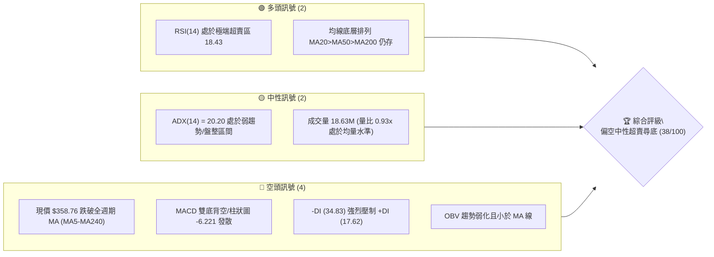
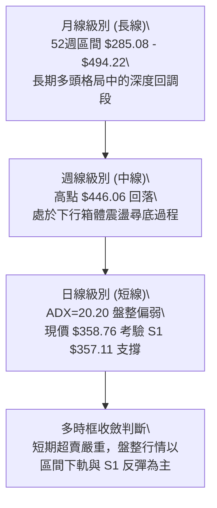
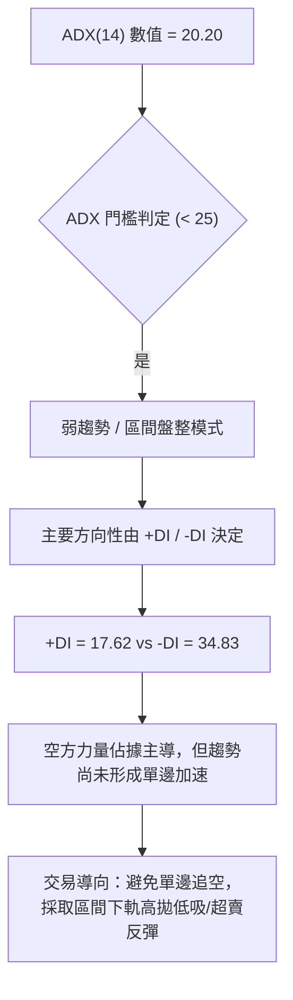
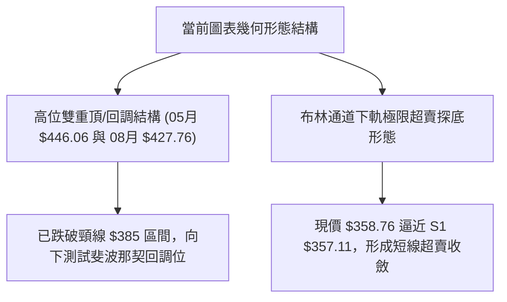
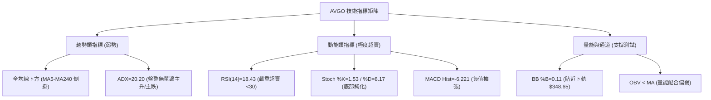
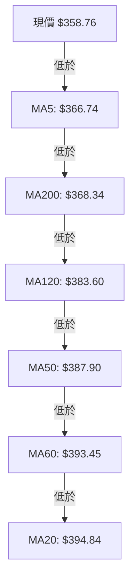
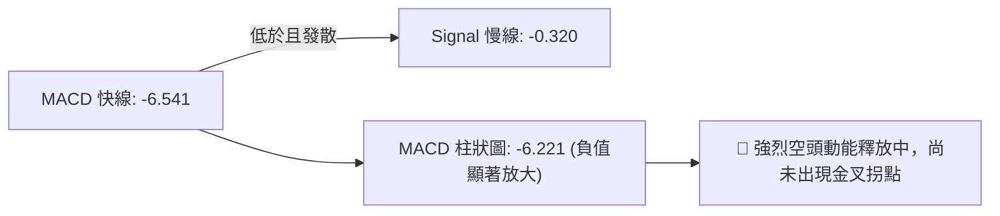
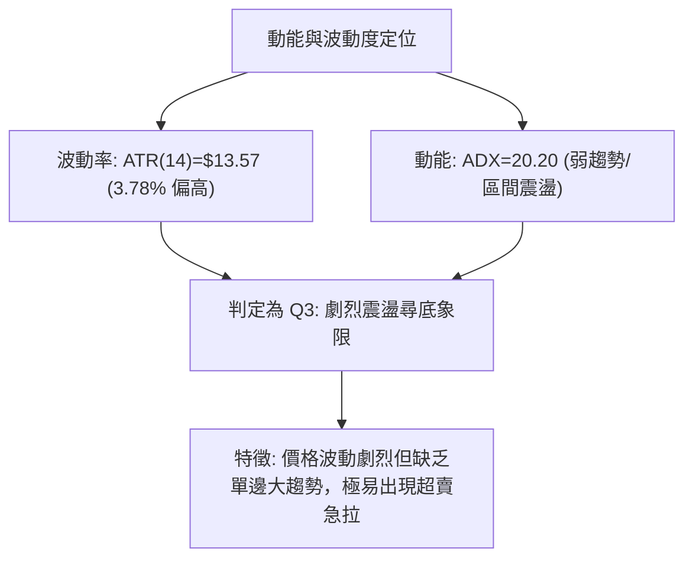
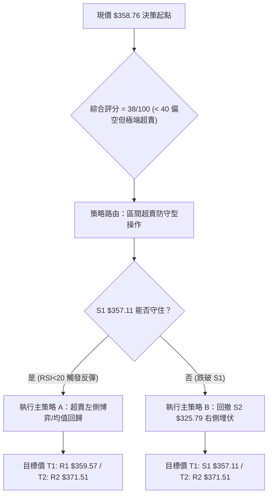
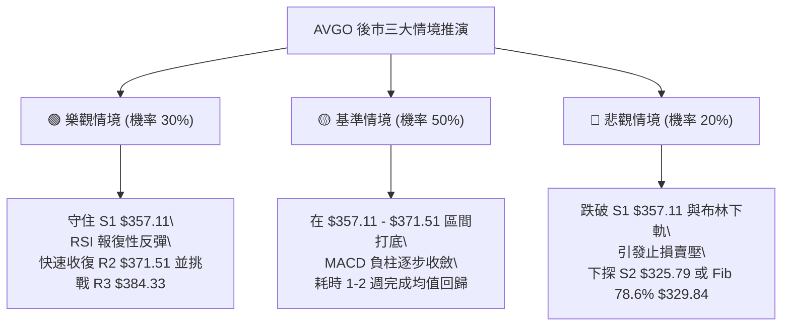

# AVGO 技術分析報告

> **報告日期**：2026-08-25 ｜ **語言**：繁體中文 ｜ **數據來源**：Yahoo Finance ｜ **當前價格**：$358.76

---

## 目錄

| 章節 | 內容 |
|------|------|
| [1. 技術面概覽](#1-技術面概覽) | 訊號儀表板、核心指標、評分卡 |
| [2. 趨勢分析](#2-趨勢分析) | 多時框趨勢、長中短期走勢 |
| [3. 圖表形態分析](#3-圖表形態分析) | 形態識別、K線組合、目標價 |
| [4. 支撐與阻力](#4-支撐與阻力) | 關鍵價位、斐波那契回調 |
| [5. 技術指標深度解讀](#5-技術指標深度解讀) | MA/RSI/MACD/布林/成交量 |
| [6. 動能與波動率](#6-動能與波動率) | 動能評估、ATR、Beta |
| [7. 多時框架總結](#7-多時框架總結) | 時框架評分矩陣 |
| [8. 交易策略建議](#8-交易策略建議) | 多空策略、風險報酬比 |
| [9. 風險提示與監控](#9-風險提示與監控) | 監控指標、風險場景 |

---

## 1. 技術面概覽

### 🎯 技術訊號儀表板



### 📊 核心指標速覽表

| 指標類別 | 指標名稱 | 當前數值 | 訊號 | 解讀 |
|----------|----------|----------|------|------|
| **價格** | 當前價格 | $358.76 | 🔴 | 跌破 52W 高點回調 27.41%，位於 52W 區間 35.2% |
| **均線** | MA20 | $394.84 | 🔴 | 價格低於 MA20 達 -9.14%，短線空頭重壓 |
| **均線** | MA50 | $387.90 | 🔴 | 價格跌破中期生命線，中期動能減弱 |
| **均線** | MA200 | $368.34 | 🔴 | 價格跌破長期年線支撐（-2.60%），長線面臨防守考驗 |
| **動能** | RSI(14) | 18.43 | 🟢 | 極度超賣（<30），短線存在強烈技術性反彈需求 |
| **動能** | MACD | -6.541 | 🔴 | 訊號線 -0.320，柱狀圖 -6.221，處於零軸下方擴張下跌段 |
| **波動** | ATR(14) | $13.57 | 🟡 | 每日平均波幅 3.78%，波動度適中偏高，需設置安全止損距離 |

### 🏆 技術評分卡

```
╔══════════════════════════════════════════════════════════════════╗
║                技術評分卡 — AVGO (2026-08-25)                    ║
╠══════════════════════════════════════════════════════════════════╣
║ 趨勢強度 (ADX=20.20)     ██████░░░░░░░░░░░░░░  30/100  🔴 空頭壓制║
║ 動能指標 (RSI/MACD)      ████░░░░░░░░░░░░░░░░  20/100  🔴 動能疲弱║
║ 支撐穩定度 (S1=$357.11)  ██████████░░░░░░░░░░  50/100  🟡 考驗S1 ║
║ 成交量配合 (量比 0.93x)  ████████░░░░░░░░░░░░  40/100  🟡 量縮探底║
║ 形態完整度 (回調下探)    ████████░░░░░░░░░░░░  40/100  🟡 尋底形態║
║ 均線排列 (跌破全均線)    ████████░░░░░░░░░░░░  40/100  🔴 價格下破║
╠══════════════════════════════════════════════════════════════════╣
║ 綜合評分                 ████████░░░░░░░░░░░░  38/100  🔴 偏空尋底║
╚══════════════════════════════════════════════════════════════════╝
```

---

## 2. 趨勢分析

### 🌐 多時框趨勢分析



### 📈 長期趨勢 — 12個月走勢圖（Unicode）

```
AVGO 月線走勢圖（2025-08 至 2026-08）
價格軸 ($)
$460 ┤                                     ●(05月 $446.06)
$430 ┤                             ●(04月)
$400 ┤             ●(11月 $400.71)                 ●(07月)
$370 ┤         ●                       ●(06月)
$340 ┤     ●           ●(12月)                     ●(08月 $358.76)←現價
$310 ┤                     ●   ●(03月 $309.02)
$280 ┤ ●(08月 $295.23)
     └─────────────────────────────────────────────────────────────
       08  09  10  11  12  01  02  03  04  05  06  07  08 (月份)
```

**走勢特徵分析表格**：

| 階段區間 | 起止價格 | 漲跌幅 | 趨勢特徵與量價行為 |
|----------|----------|--------|--------------------|
| 2025-08 ~ 2025-11 | $295.23 → $400.71 | +35.73% | 第一波強勁主升浪，AI 及半導體需求推動，連續突破新高 |
| 2025-11 ~ 2026-03 | $400.71 → $309.02 | -22.88% | 獲利了結回檔波段，於 $309.02 築底企穩 |
| 2026-03 ~ 2026-05 | $309.02 → $446.06 | +44.35% | 第二波突破主升浪，創下 52 週次高點，動能極度亢奮 |
| 2026-05 ~ 2026-08 | $446.06 → $358.76 | -19.57% | 短期劇烈回調，價格回吐至斐波那契 61.8% ($364.97) 下方尋找支撐 |

### 📊 中期趨勢（週線分析）

中期走勢呈現寬幅區間震盪回落特徵。近期 20 週收盤走勢顯示，價格自 2026-05-31 週報收 $446.06 後，出現高位震盪回落，2026-08-09 曾反彈至 $427.76，隨後連續三週下跌（$392.99 → $368.45 → $358.76），週線 MACD 柱狀圖由正轉負擴大至 -6.221，週線 RSI 降至 18.4，顯示中期賣壓釋放已進入尾聲超賣區。

```
週線區間壓力支撐結構：
  $446.06 ─── 波段高點阻力
     │
  $389.65 ─── 斐波那契 50.0% / 中期平衡位
     │
  $358.76 ─── 當前價格（考驗 S1 $357.11 與 布林下軌 $348.65）
     │
  $325.79 ─── 核心波段強支撐 (S2)
```

### ⚡ 趨勢強度評估（ADX 解讀）



| 指標項 | 讀數 | 狀態 | 意涵 |
|--------|------|------|------|
| **ADX(14)** | 20.20 | < 25 (弱趨勢) | 市場缺乏單邊強趨勢動能，多空在區間內博弈 |
| **+DI (14)** | 17.62 | 弱勢 | 多方買盤意願低迷 |
| **-DI (14)** | 34.83 | 強勢 | 空方主導當前短線下行波段 |
| **方向判定** | -DI > +DI | 偏空盤整 | 處於空方主導的弱勢震盪探底階段 |

---

## 3. 圖表形態分析

### 🔍 形態識別系統



| 形態名稱 | 信心度 | 判斷依據（引用數據） | 完成度 | 目標價（附計算式） |
|----------|--------|----------------------|--------|--------------------|
| **高位次頂回調** | 75% | 2026-05 高點 $446.06 與 2026-08 次高點 $427.76 形成震盪回落結構 | 85% | 跌破反彈起點 $381.92，測量目標 = 支撐位 S1 **$357.11**（已達成）及 S2 **$325.79** |
| **布林下軌超賣尋底** | 80% | 現價 $358.76 逼近布林下軌 $348.65，RSI(14)=18.43 | 90% | 均值回歸反彈目標：MA20 / 布林中軌 **$394.84** |
| **幾何頭肩/複雜底** | 30% | 數據不足以確認完整底部結構 | 20% | 訊號不足，僅做指標型超賣解讀 |

### 🕯️ 重要K線形態分析

| 日期/月份 | 收盤價 | K線形態 | 解讀 | 訊號 |
|-----------|--------|---------|------|------|
| 2026-05-31 | $446.06 | 帶長上影大陽線 | 多頭衝頂遇阻，逼近 52W 高點 $494.22 阻力區 | 🟡 頂部減速 |
| 2026-06-07 | $385.12 | 放量大陰線 (251M量) | 機構高位出貨，跌破短均線支撐 | 🔴 破位下行 |
| 2026-08-09 | $427.76 | 反彈受阻中陽線 | 次高點確認，無法突破前高 $446.06 | 🟡 反彈力竭 |
| 2026-08-23 | $368.45 | 連續下挫中陰線 | 跌破 MA200 ($368.34)，賣壓釋放 | 🔴 空頭延續 |
| 2026-08-30 | $358.76 | 縮量極端超賣下探十字星態勢 | 逼近 S1 $357.11，下影線尋求支撐 | 🟢 潛在止跌 |

### 📉 ASCII 走勢形態示意圖

```
AVGO 近期雙頂回調與支撐測試示意圖
$446.06 ──── 頂點 1 (2026-05)
              \                 $427.76 ──── 頂點 2 (2026-08)
               \               /        \
                \             /          \
  $381.92 ─────── 頸線區域 ───             \
                                            \
  $368.34 ─────────────────────── 跌破 MA200 ──\
  $358.76 ──────────────────────────────────────● 現價 (逼近 S1 $357.11)
  $348.65 ─────────────────────────────────────── 布林下軌支撐
```

### 🎯 形態目標價計算

1. **下行量度目標**：
   - 形態起跌點：$427.76
   - 第一跌幅滿足點已落於 S1 **$357.11** 區域（跌幅達 $70.65，現價 $358.76 已基本抵達）。
   - 若 S1 $357.11 有效跌破，下行延伸支撐為 S2 **$325.79**。
2. **反彈目標推算**：
   - 超賣修復第一阻力：R1 **$359.57**。
   - 修復中軌目標：R2 **$371.51**（接近 MA200 $368.34）至 R3 **$384.33**（接近 MA50 $387.90）。

---

## 4. 支撐與阻力

### 🗺️ 關鍵價位分布圖（Unicode）

```
╔══════════════════════════════════════════════════════════════════╗
║                  AVGO 關鍵價位結構分布圖                         ║
╠══════════════════════════════════════════════════════════════════╣
║ $494.22 ║██████████████████████████████║ 52週歷史高點 (0.0% Fib)  ║
║ $444.86 ║████████████████████████      ║ 斐波那契 23.6% 回調位   ║
║ $414.33 ║████████████████████          ║ 斐波那契 38.2% 回調位   ║
║ $394.84 ║██████████████████████        ║ BB中軌 / MA20 強阻力    ║
║ $389.65 ║████████████████████          ║ 斐波那契 50.0% 回調位   ║
║ $384.33 ║████████████████              ║ 波段阻力 R3             ║
║ $371.51 ║████████████                  ║ 波段阻力 R2             ║
║ $364.97 ║██████████                    ║ 斐波那契 61.8% 黃金分割 ║
║ $359.57 ║████████                      ║ 近端阻力 R1             ║
║ $358.76 ╠══════════════════════════════╣ ◄ 現價 ($358.76)        ║
║ $357.11 ║▓▓▓▓▓▓▓▓                      ║ 近端關鍵支撐 S1         ║
║ $348.65 ║▓▓▓▓▓▓▓▓▓▓▓▓                  ║ 布林通道下軌支撐        ║
║ $329.84 ║▓▓▓▓▓▓▓▓▓▓▓▓▓▓▓▓              ║ 斐波那契 78.6% 回調位   ║
║ $325.79 ║▓▓▓▓▓▓▓▓▓▓▓▓▓▓▓▓▓▓            ║ 強支撐 S2               ║
║ $312.96 ║▓▓▓▓▓▓▓▓▓▓▓▓▓▓▓▓▓▓▓▓          ║ 強支撐 S3               ║
║ $285.08 ║▓▓▓▓▓▓▓▓▓▓▓▓▓▓▓▓▓▓▓▓▓▓▓▓▓▓▓▓  ║ 52週歷史低點 (100% Fib) ║
╚══════════════════════════════════════════════════════════════════╝
```

### 🚧 阻力位分析表

| 阻力級別 | 價位 | 形成原因 | 突破難度 | 重要性 |
|----------|------|----------|----------|--------|
| **R1** | $359.57 | 近期波段短線密集反彈高點聚類 (+0.23%) | 🟡 中等 | 判定超賣是否啟動日內反彈的關鍵門檻 |
| **R2** | $371.51 | 密集成交區高點聚類，接近 MA200 ($368.34) (+3.55%) | 🔴 較高 | 長期均線回抽確認區，多空分水嶺 |
| **R3** | $384.33 | 近一年波段高點聚類，接近 MA50 ($387.90) (+7.13%) | 🔴 極高 | 中期趨勢扭轉的核心強壓阻力帶 |

### 🛡️ 支撐位分析表

| 支撐級別 | 價位 | 形成原因 | 守住機率 | 重要性 |
|----------|------|----------|----------|--------|
| **S1** | $357.11 | 近一年波段低點聚類，距離現價 -0.46% | 65% | 短線第一道防線，超賣反彈的啟動底座 |
| **S2** | $325.79 | 2026年首季築底平台低點聚類 (-9.19%) | 80% | 中期重要結構支撐，跌破將引發深度調整 |
| **S3** | $312.96 | 2026-03 波段起漲低點聚類 ($309.02 附近) (-12.77%) | 90% | 長期強支撐底線，牛市結構防守底線 |

### 📐 斐波那契回調位分析

依據 52 週區間 **$285.08 (低點) → $494.22 (高點)** 精確計算回調階梯：

```
0.0%  (52W High)  : $494.22
23.6%             : $444.86
38.2%             : $414.33
50.0%             : $389.65
61.8%             : $364.97  ◄─── 剛跌破黃金分割位
[現價 $358.76]    : 處於 61.8% ($364.97) 與 78.6% ($329.84) 之間
78.6%             : $329.84  ◄─── 下方次級防守支撐
100.0% (52W Low)  : $285.08
```

- **位置解讀**：現價 $358.76 剛下穿 61.8% 黃金分割回調位（$364.97）。通常 61.8% 被跌破後，若不能在 3 個交易日內快速收復，價格往往會向下尋求 78.6%（$329.84）及 S2（$325.79）的共振支撐。但考慮到當前 RSI 處於 18.43 極端超賣，此處存在回抽測試 $364.97~$371.51 的強烈動能。

---

## 5. 技術指標深度解讀

### 🎛️ 指標訊號總覽



### 📈 移動平均線排列分析



| 均線名稱 | 當前價格 | 與現價偏離度 | 走勢微圖 | 狀態評估 |
|----------|----------|--------------|----------|----------|
| **MA 5** | $366.74 | -2.18% | ▄▄▄▃▃▃▃▃▃▄▃▃▃▃▃▄▆▆█████▇▆▅▄▂▁▁ | 短線急跌，下行速率放緩 |
| **MA 10** | $386.91 | -7.28% | ▁▁▁▁▁▂▂▂▁▁▁▁▁▁▂▂▃▄▅▆▇█████▆▅▃▂ | 快速下穿中長期均線 |
| **MA 20** | $394.84 | -9.14% | ▂▂▂▁▁▁▁▁▁▁▂▁▂▂▃▄▄▅▅▆▆▇█████▇▇▆ | 短期生命線形成重壓 |
| **MA 50** | $387.90 | -7.51% | ── (多頭排列中軌) | 跌破中期支撐 |
| **MA 60** | $393.45 | -8.82% | ████▇▇▇▆▆▆▆▅▅▄▄▄▄▄▄▄▄▄▄▄▃▃▂▂▁▁ | 走平轉下 |
| **MA 120** | $383.60 | -6.48% | ▁▁▁▁▁▂▂▂▂▃▃▃▄▄▄▄▅▅▅▆▆▇▇▇██████ | 半年線失守 |
| **MA 200** | $368.34 | -2.60% | ── (長期牛熊分界) | 近期跌破，考驗能否迅速收復 |
| **MA 240** | $364.77 | -1.65% | ▁▁▁▁▂▂▂▂▃▃▃▃▄▄▄▅▅▅▆▆▇▇▇███████ | 年線下方微幅偏離 |

- **均線綜合解讀**：雖然大架構上 MA20 > MA50 > MA200 仍保留原始多頭格局標籤，但價格已實質跌破 MA5 至 MA240 所有均線。當前價格偏離 MA20 達 -9.14%，構成典型的**均線負乖離過大**，技術上有強烈的均值回歸修復需求。

### 📉 RSI(14) 分析

```
RSI(14) 當前數值: 18.43
0 ──────[███░░░░░░░░░░░░░░░░░░░░░░░░░░░]────── 30 ───────────── 70 ──────────── 100
       18.43 (極端超賣區)                    超賣界線          超買界線
```

- **超賣狀況**：RSI(14) 來到 18.43，隨機指標 Stoch %K 來到 1.53，%D 為 8.17，各項動能指標均進入極度超賣區間（歷史上低於 20 往往對應波段賣壓耗竭點）。
- **背離分析**：
  - 日線級別暫**無明顯底背離**（價格新低伴隨指標新低）。
  - 但指標已進入鈍化區，顯示空頭拋售力道已達到極限，隨時可能觸發技術性報復反彈。

### 📊 MACD(12/26/9) 訊號解讀



- **解讀**：MACD 線已下穿零軸並大幅低於訊號線，柱狀圖達到 -6.221。目前處於空頭動能充分釋放階段。由於尚未出現柱狀圖收窄（綠柱縮短）跡象，盲目追多存在左側風險，宜等待柱狀圖收斂再行右側確認。

### 📦 布林通道分析

```
AVGO 布林通道 (20, 2) 結構圖
$441.03 ────────────────────────────── 上軌
           \
            \
$394.84 ─────\──────────────────────── 中軌 (MA20)
              \
               \
$358.76 ────────●───────────────────── 現價 (%B = 0.11)
$348.65 ────────────────────────────── 下軌
```

- **帶寬與位置**：BB %B 僅為 0.11，現價距離布林下軌 $348.65 僅有 2.9% 空間。價格緊貼下軌運行，通常預示著短期下行動能將在下軌附近受到擠壓並引發均值回歸。

### 💹 成交量分析（量價配合度）

- **量能特徵**：最新成交量為 18,635,761 股，相比 20 日均量 19,940,203 股（量比 0.93x）與 50 日均量 23,048,523 股呈現**量縮陰跌**特徵。
- **OBV 解讀**：OBV < MA，能量潮處於均線下方，顯示主力資金在過去數週以流出和觀望為主，並未出現恐慌性巨量拋售（如 2026-06-07 的 2.51 億股放量）。量縮探底說明殺跌盤逐步耗盡。

---

## 6. 動能與波動率

### ⚡ 動能評估四象限

| 象限 | 動能維度 | 波動維度 | 歷史特徵 | 當前匹配 | 評估與策略 |
|------|----------|----------|----------|:--------:|------------|
| **Q1: 追價突破** | 強動能 (ADX>25, +DI勝) | 高波動 (ATR>4%) | 主升浪擴張 | ── | 不適用 |
| **Q2: 溫和推進** | 強動能 (趨勢明確) | 低波動 (震盪走高) | 穩健多頭 | ── | 不適用 |
| **Q3: 劇烈分歧** | 弱動能 (盤整轉向) | 高波動 (ATR=3.78%) | 快速洗盤探底 | **✓ (當前)** | **高風險高彈性，超賣反彈機會** |
| **Q4: 沉寂磨底** | 弱動能 (無趨勢) | 低波動 (窒息量) | 底部橫盤 | ── | 尚未進入 |



### 📊 ATR 波動率分析

- **ATR(14) 數值**：**$13.57**（佔股價 3.78%）。
- **止損距離建議**：
  - 短線交易（1.0 × ATR）：$13.57 緩衝空間。
  - 波段交易（1.5 × ATR）：$20.35 緩衝空間。
  - 現價 $358.76 下方 1.0 ATR 對應價格為 **$345.19**（位於布林下軌 $348.65 稍下方），提供良好技術防守參照。

### 📐 Beta 與市場相關性

- **Beta 係數**：**1.473**。
- **特徵解讀**：AVGO 具備顯著的高彈性特質（比大盤多 47.3% 的波動幅度）。在科技股與大盤回調期間承受更大拋壓，但一旦市場情緒回暖，其反彈動能與爆發力亦將顯著超越大盤。

---

## 7. 多時框架總結

### 📋 時框架評分表

| 時框架 | 趨勢方向 | 動能指標 | 均線排列 | 圖表形態 | 綜合評分 | 建議方向 |
|--------|----------|----------|----------|----------|:--------:|----------|
| **月線 (長線)** | 🟢 多頭回調 | 🟡 中性降溫 | 🟢 MA20>MA50 | 52週區間中高位震盪 | 65/100 | 長期分批逢低佈局 |
| **週線 (中線)** | 🔴 下行調整 | 🔴 MACD柱轉負 | 🟡 考驗 MA50 支撐 | 雙頂回落測試頸線 | 42/100 | 等待企穩訊號 |
| **日線 (短線)** | 🔴 弱勢探底 | 🟢 極端超賣 (18.4) | 🔴 跌破全均線 | 貼近布林下軌測試 S1 | 38/100 | 嚴控倉位博弈超賣反彈 |

### 🔲 綜合訊號矩陣

```
╔══════════════════════════════════════════════════════════════════╗
║                     AVGO 多時框架訊號矩陣                        ║
╠══════════════════════════════════════════════════════════════════╣
║ 維度         短線 (日線)        中線 (週線)        長線 (月線)   ║
║ 趨勢方向     🔴 空方主導        🔴 震盪回調        🟢 處於牛市段 ║
║ 動能狀態     🟢 極度超賣(反彈)  🔴 動能釋放中      🟡 獲利盤整   ║
║ 支撐防守     🟡 考驗 S1 $357.11 🟡 考驗 S2 $325.79 🟢 守於 $285   ║
║ 訊號一致性   長多中空短超賣 — 處於多週期共振的短期築底節點        ║
╚══════════════════════════════════════════════════════════════════╝
```

### ⚖️ 多時框收斂結論

依據多時框收斂原則：
1. **行情性質判定**：當前 ADX(14) = 20.20（< 25），嚴格定義為**盤整行情 / 弱趨勢尋底**。
2. **主導時框與取捨**：盤整行情以**日線布林通道 ($348.65 - $441.03) 與關鍵支撐阻力**為核心交易邊界；中長期趨勢（月線/MA200）決定了下行空間受限於基本面與長線買盤。
3. **唯一方向性結論**：**【偏空中性·超賣尋底】（以 S1 $357.11 與 布林下軌 $348.65 為防守點，展開短線修復性交易）**。

---

## 8. 交易策略建議

### 🗺️ 策略決策流程圖



### 🧭 策略路由（依評分卡分流）

> **當前主策略方向 = 偏空中性超賣防守／區間下軌反彈（依評分 38/100）**
> 
> *說明：綜合評分 38/100 屬偏弱區間，但因 RSI(14) 達 18.43 歷史極值超賣且逼近 S1 $357.11，單邊追空風險極大，主推「以關鍵支撐為嚴格止損的超賣均值回歸策略」，空頭策略則作為反轉破位後的對沖跟進。*

### 🎯 價格情境階梯（Price Scenarios）

| 觸發條件 | 下一目標 | 後續延伸 | 情境含義 |
|----------|----------|----------|----------|
| **突破 R1 $359.57** | R2 $371.51 | R3 $384.33 | 短線超賣修復展開，挑戰 MA200 牛熊線 |
| **守住 S1 $357.11 ~ 現價** | R1 $359.57 | R2 $371.51 | 低位築底震盪，消化空頭拋壓 |
| **跌破 S1 $357.11** | S2 $325.79 | S3 $312.96 | 中期結構破位，向下探尋年內大底 |

### 📊 情境機率分佈

| 情境 | 機率 | 主要依據 |
|------|:----:|----------|
| **超賣反彈 / 向上修復** | **50%** | RSI(14)=18.43、Stoch %K=1.53 極度超賣，價格貼近布林下軌 $348.65，具備強烈技術反抽需求 |
| **區間窄幅震盪 (S1~R1)** | **30%** | ADX=20.20 處於弱趨勢，成交量量縮 (0.93x)，多空短線在 $357~$365 陷入僵持 |
| **破位再探底 (跌向 S2)** | **20%** | MACD 柱狀圖 -6.221 發散，-DI (34.83) 強勢主導，若大盤重挫可能引發補跌 |

### 🟢 主策略詳情

| 策略要素 | 策略 A（當前位置超賣反彈策略） | 策略 B（S2 強支撐右側低吸策略） |
|----------|--------------------------------|----------------------------------|
| **策略類型** | 激進型·左側超賣均值回歸 | 穩健型·右側強支撐低吸 |
| **進場條件** | 現價 $358.76 守住 S1 $357.11 且突破 R1 $359.57 | 價格跌破 S1 後於 S2 $325.79 企穩出現止跌K線 |
| **進場價格** | **$358.76** (現價或 R1 $359.57 突破進場) | **$325.79** (S2 強支撐位) |
| **目標價 T1** | **$371.51** (阻力 R2 / 接近 MA200) | **$357.11** (原支撐轉阻力位 S1) |
| **目標價 T2** | **$384.33** (阻力 R3 / 接近 MA50) | **$371.51** (阻力 R2) |
| **止損價格** | **$348.65** (精確錨定布林下軌支撐) | **$312.96** (精確錨定 S3 強支撐) |
| **風險報酬比** | **1 : 1.26** (至T1) / **1 : 2.53** (至T2) | **1 : 2.44** (至T1) / **1 : 3.56** (至T2) |
| **成功機率** | 60% | 75% |
| **建議倉位** | 10% ~ 15% (輕倉試探) | 20% ~ 25% (標準波段倉) |

### 🔴 反向風險觸發點（對沖提示）

- **空頭對沖觸發價**：**$357.11**。
- **觸發後操作**：若收盤價實質跌破 S1 **$357.11** 且 1 小時未能收復，表明超賣反彈失敗，應立即執行策略 A 止損；激進投資者可建立輕倉空頭對沖，下看斐波那契 78.6% **$329.84** 及 S2 **$325.79**。

### ⭐ 整體訊號強度評星

```
╔══════════════════════════════════════════════════╗
║ 做多訊號強度：★★☆☆☆  (2.5/5星 — 超賣博反彈)      ║
║ 做空訊號強度：★★★☆☆  (3.0/5星 — 趨勢偏空但忌追)  ║
║ 整體可信度：  ★★★★☆  (4.0/5星 — 價位邊界極明確)  ║
╚══════════════════════════════════════════════════╝
```

---

## 9. 風險提示與監控

### ✅ 關鍵監控指標 Checklist

```
╔══════════════════════════════════════════════════════════════════╗
║                 AVGO 每日交易關鍵監控清單 (Checklist)            ║
╠══════════════════════════════════════════════════════════════════╣
║ [ ] 價格是否跌破 S1 關鍵支撐 $357.11                             ║
║ [ ] RSI(14) 是否脫離超賣區回升至 30 以上                         ║
║ [ ] MACD 柱狀圖是否由 -6.221 出現收窄拐點                        ║
║ [ ] 日成交量是否放大至 20日均量 (19.94M) 以上形成放量陽線        ║
║ [ ] 價格能否有效收復 MA200 長期均線 ($368.34)                    ║
║ [ ] 價格是否觸及布林下軌 $348.65 極限防守線                      ║
╚══════════════════════════════════════════════════════════════════╝
```

### ⚠️ 風險場景分析



### 🛡️ 風險管理重要提醒

1. **嚴禁在超賣區盲目殺跌追空**：當前 RSI 達 18.43，空頭盈虧比極差，極易遭遇空頭回補引發的暴力拉升。
2. **倉位控管紀律**：目前處於左側摸底階段，總持倉量不得超過投資組合的 15%，待右側突破 R2 $371.51 並站穩 MA200 後方可加碼。
3. **波動率止損機制**：利用 ATR ($13.57) 作為動態風控基準，單筆交易虧損上限嚴格控制在總資金的 1% ~ 2% 範圍內。

---

## 📋 報告總結

```
╔══════════════════════════════════════════════════════════════════╗
║                  AVGO 技術分析報告總結                           ║
╠══════════════════════════════════════════════════════════════════╣
║ 報告日期：2026-08-25                                             ║
║ 當前價格：$358.76                                                ║
║ 分析評級：⚖️ 偏空中性（極度超賣，面臨 S1 支撐保衛戰）           ║
║                                                                  ║
║ 關鍵結論：                                                       ║
║ ├─ 長期趨勢：🟢 處於 52週 $285-$494 大格局回調段，長牛根基未毀  ║
║ ├─ 中期趨勢：🔴 自 $446.06 回落，目前跌破 MA200 尋底            ║
║ ├─ 短期趨勢：🟡 RSI(14)=18.43 極度超賣，隨時孕育反抽行情        ║
║ ├─ 關鍵支撐：S1: $357.11  /  S2: $325.79  /  布林下軌: $348.65   ║
║ ├─ 關鍵阻力：R1: $359.57  /  R2: $371.51  /  R3: $384.33        ║
║ └─ 分析師目標：均價 $526.30 (共識強烈推薦買入)                   ║
║                                                                  ║
║ 最優策略組合：                                                   ║
║ 1. 🥇 最佳機會：在現價 $358.76 至 S1 $357.11 區間輕倉博弈超賣   ║
║                反彈，目標 R2 $371.51，止損設於下軌 $348.65。     ║
║ 2. 🥈 次選機會：耐心等待價格跌破後在 S2 $325.79 進行右側高勝率   ║
║                波段抄底。                                        ║
║ 3. 🥉 保守選擇：空倉觀望，等待日線收盤重新站上 R2 $371.51 與    ║
║                MA200 後再行順勢進場。                            ║
╚══════════════════════════════════════════════════════════════════╝
```

---

> ⚠️ **免責聲明**：本報告為 AI 自動生成之技術分析，所有數據及估算均基於提供的歷史價格資訊。本報告**僅供研究與學術參考**，**不構成任何投資建議**。投資有風險，入市需謹慎。

---

*報告生成時間：2026-08-25 ｜ 數據來源：Yahoo Finance ｜ 分析框架：多時框技術分析*