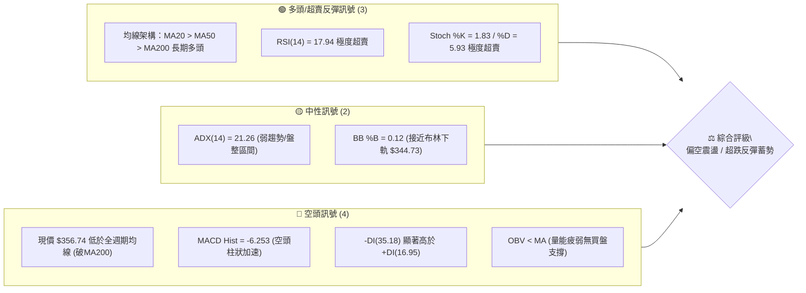
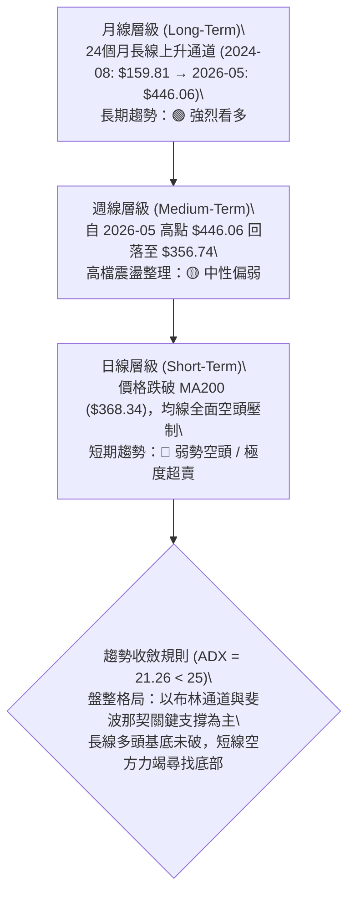
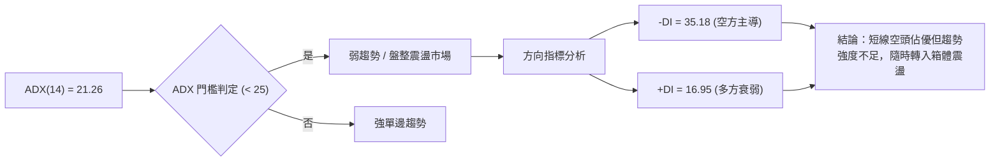
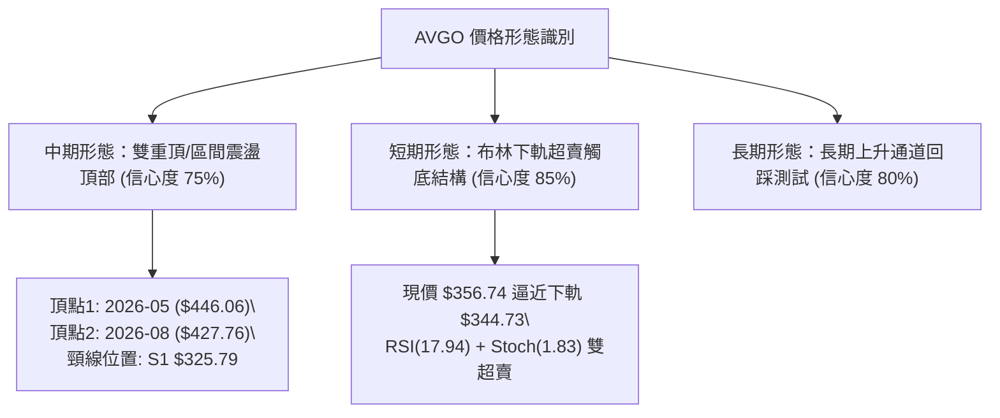
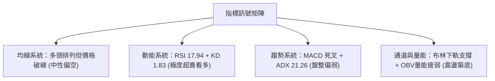
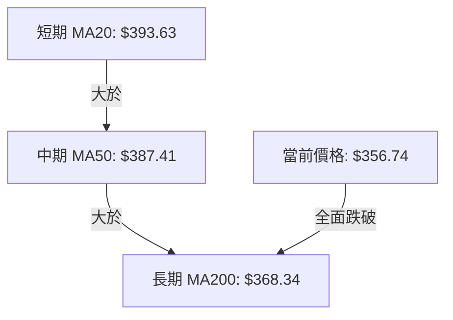
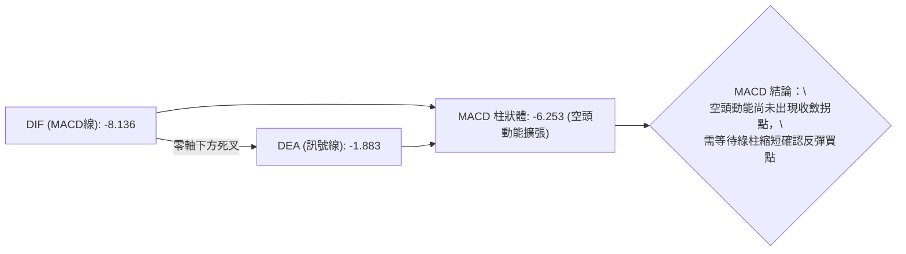
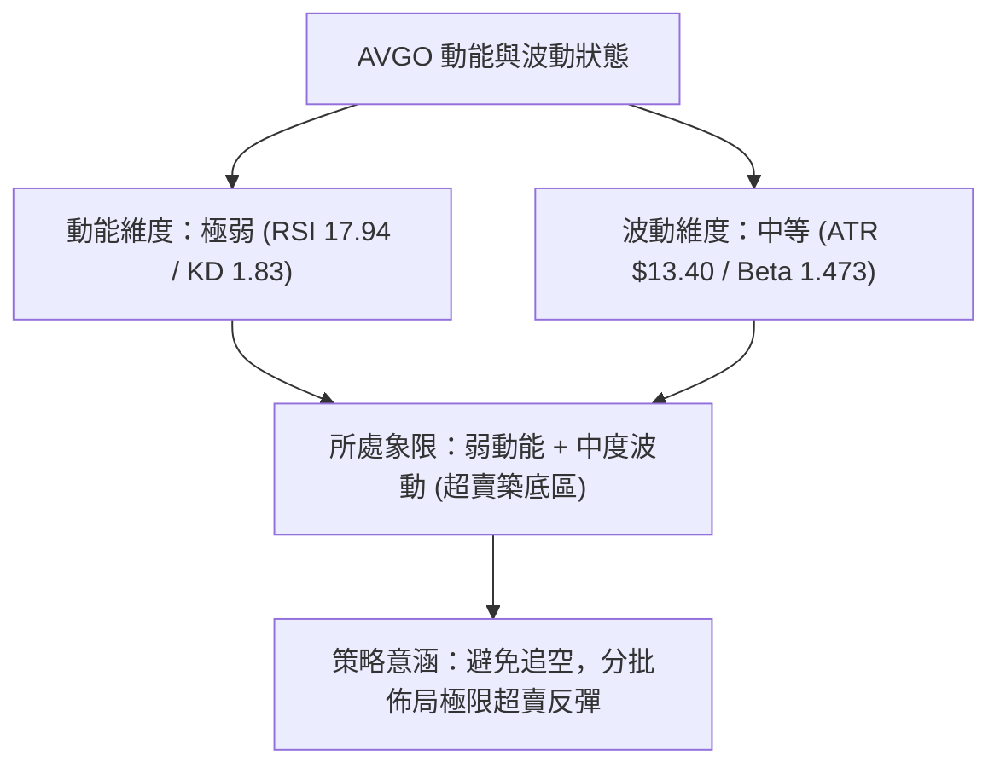
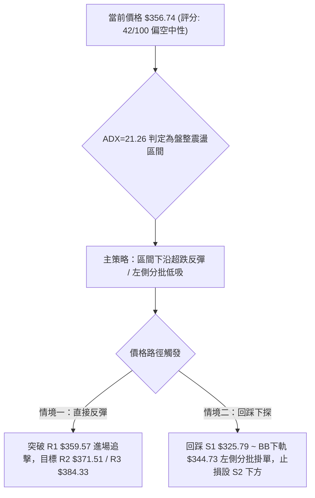
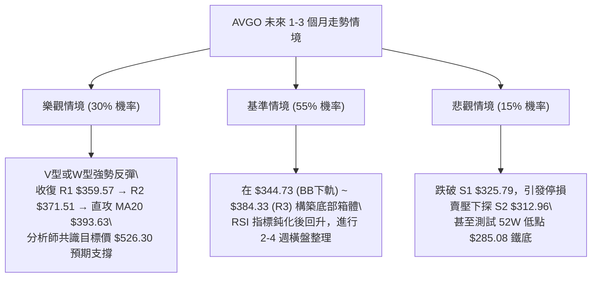

# AVGO 技術分析報告

> **報告日期**：2026-08-26 ｜ **語言**：繁體中文 ｜ **數據來源**：Yahoo Finance ｜ **當前價格**：$356.74

---

## 目錄

| 章節 | 內容 |
|------|------|
| [1. 技術面概覽](#1-技術面概覽) | 訊號儀表板、核心指標、評分卡 |
| [2. 趨勢分析](#2-趨勢分析) | 多時框趨勢、長中短期走勢 |
| [3. 圖表形態分析](#3-圖表形態分析) | 形態識別、K線組合、目標價 |
| [4. 支撐與阻力](#4-支撐與阻力) | 關鍵價位、斐波那契回調 |
| [5. 技術指標深度解讀](#5-技術指標深度解讀) | MA/RSI/MACD/布林/成交量 |
| [6. 動能與波動率](#6-動能與波動率) | 動能評估、ATR、Beta |
| [7. 多時框架總結](#7-多時框架總結) | 時框架評分矩陣 |
| [8. 交易策略建議](#8-交易策略建議) | 多空策略、風險報酬比 |
| [9. 風險提示與監控](#9-風險提示與監控) | 監控指標、風險場景 |
| [10. 報告總結](#-報告總結) | 總結儀表板與核心結論 |

---

## 1. 技術面概覽

### 🎯 技術訊號儀表板



### 📊 核心指標速覽表

| 指標類別 | 指標名稱 | 當前數值 | 訊號 | 解讀 |
|----------|----------|----------|------|------|
| **價格** | 當前價格 | $356.74 | 🔴 | 跌破所有短中長期均線，短期空方完全控盤 |
| **均線** | MA20 | $393.63 | 🔴 | 價格低於MA20達 -9.37%，乖離偏大 |
| **均線** | MA50 | $387.41 | 🔴 | 跌破中期生命線，中期結構轉弱 |
| **均線** | MA200 | $368.34 | 🔴 | 跌破牛熊分界線 (-3.15%)，測試長期趨勢支撐 |
| **動能** | RSI(14) | 17.94 | 🟢 | 極度超賣（<20），短線具備強烈技術性抽頭反彈動能 |
| **動能** | MACD | -8.136 / -1.883 | 🔴 | 雙線位於零軸下方死叉且綠柱放大 (-6.253)，空頭動能強烈 |
| **動能** | KD指標 | %K: 1.83 / %D: 5.93 | 🟢 | 進入個位數絕對超賣區，隨時醞釀低檔金叉 |
| **趨勢** | ADX(14) | 21.26 | 🟡 | ADX < 25 表明非強單邊趨勢，屬於震盪回洗格局 |
| **趨勢** | DMI方向 | +DI: 16.95 / -DI: 35.18 | 🔴 | -DI 大幅壓制 +DI，空方力量占優 |
| **通道** | 布林通道 | 下軌 $344.73 (%B: 0.12) | 🟡 | 逼近下軌支撐，下跌空間受下軌動態收斂壓制 |
| **量能** | 成交量 / 20MA | 17.93M / 19.82M (0.90x) | 🔴 | OBV < MA，價跌量縮但未見顯著主力抄底放量 |
| **波動** | ATR(14) | $13.40 (3.76%) | 🟡 | 每日平均波動約 13.4 美元，波動度適中 |

### 🏆 技術評分卡

```
╔══════════════════════════════════════════════════════════════════╗
║              技術評分卡 — AVGO (2026-08-26)                     ║
╠══════════════════════════════════════════════════════════════════╣
║ 趨勢強度      ██████░░░░░░░░░░░░░░  30/100  🔴 短線破位偏空       ║
║ 動能指標      ████████░░░░░░░░░░░░  40/100  🟡 極度超賣蘊含反彈   ║
║ 支撐穩定度    ██████████░░░░░░░░░░  50/100  🟡 考驗 Fib 61.8% 區域║
║ 成交量配合    ██████░░░░░░░░░░░░░░  30/100  🔴 量能退潮，買盤保守 ║
║ 形態完整度    ████████░░░░░░░░░░░░  40/100  🔴 跌破箱體與均線支撐 ║
║ 均線架構      ████████████░░░░░░░░  60/100  🟡 長期均線仍為多頭排 ║
╠══════════════════════════════════════════════════════════════════╣
║ 綜合評分      ████████░░░░░░░░░░░░  42/100  ⚖️ 偏空中性 (區間下沿)║
╚══════════════════════════════════════════════════════════════════╝
```

---

## 2. 趨勢分析

### 🌐 多時框趨勢分析



### 📈 長期趨勢 — 12個月走勢圖（Unicode）

```
AVGO 月線走勢圖（2025-09 至 2026-08）
價格 ($)
$450 ┤                                   ●(2026-05: $446.06)
$420 ┤                             ●     │
$390 ┤                 ●           │     │           ●(07: $389.28)
$360 ┤           ●     │           │     │     ●     │     ●(08: $356.74 現價)
$330 ┤     ●     │     │     ●     │     │     │     │
$300 ┤     │     │     │     │     │     │     │     │
     └─────┴─────┴─────┴─────┴─────┴─────┴─────┴─────┴─────┴─────┴─────
         2025-09 2025-10 2025-11 2026-01 2026-03 2026-04 2026-05 2026-06 2026-07 2026-08
```

#### 走勢特徵分析表格

| 階段 | 區間月份 | 起始/結束收盤價 | 漲跌幅 | 走勢特徵與技術含義 |
|------|----------|-----------------|--------|--------------------|
| 第一階段 | 2024-08 ~ 2025-03 | $159.81 → $165.82 | +3.76% | 長期大底築底區間，在 $160~$220 間寬幅震盪洗盤 |
| 第二階段 | 2025-04 ~ 2025-11 | $190.62 → $400.71 | +110.21% | 主升浪行情，單邊強烈多頭推進，突破多重整數位 |
| 第三階段 | 2025-12 ~ 2026-03 | $344.83 → $309.02 | -10.39% | 中期健康回檔，於 $300 大關上方構築堅實次級底部 |
| 第四階段 | 2026-04 ~ 2026-05 | $416.77 → $446.06 | +44.35% | 次級主升推升，創歷史高點波段（52週高點 $494.22） |
| 第五階段 | 2026-06 ~ 2026-08 | $377.75 → $356.74 | -20.02% | 高檔獲利回吐與技術性修正，測試下檔 61.8% 斐波那契位 |

### 📊 中期趨勢（週線分析）

```
AVGO 週線關鍵結構與近期收盤示意圖
$446.06 (2026-05-31 高點) ──────────────────────────┐ (頂部阻力區)
                                                    ▼
$427.76 (2026-08-09 反彈次高點) ──────────────┐   │
                                              ▼   │
$389.28 (2026-08-02 收盤) ──────────────┐   │   │
                                        ▼   │   │
$356.74 (當前收盤價) ◄── 現價測試 Fib 61.8% ($364.97) 下方超賣區
                                        ▲
$325.79 (S1 波段支撐聚類) ──────────────┘
$285.08 (52W 最低點) ────────────────────────────── (長期絕對鐵底)
```

近20週數據顯示，AVGO 於 2026 年 5 月底見頂於 $446.06 後，呈現「階梯式回落」：
- 2026-06-07 爆出 251,144,600 股巨量長黑回落至 $385.12，確認機構籌碼高檔調節。
- 2026-08-09 反彈至 $427.76（RSI 升至 73.6）後動能衰竭，隨後連續三週下跌（$427.76 → $392.99 → $368.45 → $356.74）。
- 最新單週 RSI 驟降至 17.9，MACD 週線柱狀體再度擴大至 -6.253，顯示短線空頭賣壓急劇釋放，已進入技術性超賣真空區。

### ⚡ 趨勢強度評估（ADX 解讀）



#### ADX 強度對照表

| 指標 | 數值 | 狀態評估 | 技術意義 |
|------|------|----------|----------|
| **ADX(14)** | **21.26** | 弱趨勢 / 盤整 (<25) | 市場並非處於持續性暴跌單邊熊市，當前為寬幅箱體回踩 |
| **+DI** | **16.95** | 多方弱勢 | 多頭主動性買盤匱乏，反彈量能偏低 |
| **-DI** | **35.18** | 空方強勢 | 空頭短線佔據控盤優勢，但由於 ADX 偏低，下殺動能已近尾聲 |
| **DI 差值** | **-18.23** | 負向擴大 | 差值處於極端值，預示短線空方動能過度消耗，易引發均值回歸 |

---

## 3. 圖表形態分析

### 🔍 形態識別系統



#### 形態識別與信心度評估表

| 形態名稱 | 信心度 | 判斷依據（引用數據） | 完成度 | 目標價 / 計算式 |
|----------|--------|----------------------|--------|-----------------|
| **中期雙重頂** | 75% | 2026-05-31 高點 $446.06 與 2026-08-09 次高點 $427.76 形成雙峰，頸線落在 2026-07-05 低點附近 $360.45 及波段支撐 S1 $325.79 | 65% (尚未跌破頸線) | 若跌破頸線 $360.45，推算最小跌幅：$360.45 - ($446.06 - $360.45) = $274.84；下方關鍵支撐為 52W Low $285.08 |
| **布林下軌超賣收斂** | 85% | 價格 $356.74 逼近 BB 下軌 $344.73 (%B=0.12)，KD %K=1.83，短線空頭過度延伸 | 90% | 由 BB 下軌反彈至中軌 MA20 ($393.63)，理論反彈目標價即為 R3 $384.33 ~ MA20 |
| **下降通道整理** | 60% | 8月自 $427.76 連續下行至 $356.74，形成短線下降楔形/旗形整理 | 70% | 向上突破阻力 R1 $359.57 後，理論目標價為通道起跌回撤位 R2 $371.51 |

### 🕯️ 重要K線形態分析

| 日期 / 週別 | 收盤價 | K線形態 | 解讀 | 訊號 |
|-------------|--------|---------|------|------|
| **2026-05-31** | $446.06 | 長陽破頂線 | 創波段收盤新高，成交量 99.8M 溫和放大，多頭動能達到極致 | 🟢 強多 |
| **2026-06-07** | $385.12 | 巨量烏雲罩頂 | 爆出 251.1M 歷史級天量長黑，跌破前週低點，機構主力出貨確立 | 🔴 強空 |
| **2026-08-09** | $427.76 | 次高流星陽線 | 反彈觸及高檔但成交量萎縮至 92.3M，未能突破前高，形成第二個頂部 | 🔴 轉空 |
| **2026-08-23** | $368.45 | 中黑跌破線 | 跌破 MA200 關鍵防線 ($368.34)，MACD 柱狀體跳水至 -5.851 | 🔴 看空 |
| **2026-08-30** | $356.74 | 下影超賣星線 | 週成交量大幅萎縮至 36.6M（縮量下挫），RSI 降至 17.94，賣壓耗盡 | 🟡 變盤 |

### 📉 ASCII 走勢形態示意圖

```
AVGO 近期雙頂與超賣回踩結構示意圖
       頂部1 ($446.06)
         ▲
        ╱ ╲                     頂部2 ($427.76)
       ╱   ╲                          ▲
      ╱     ╲    反彈回測            ╱ ╲
     ╱       ╲   ┌─────────┐        ╱   ╲
    ╱         ▼─┘         └───────►╱     ▼
───┘  頸線區間 ($360.45 ~ $368.34) ────────────┼──────── (MA200 / Fib 61.8%)
                                               ▼
                                            現價 $356.74 (極度超賣，尋求支撐)
                                               │
                                               ▼
                                      支撐 S1 $325.79 ─── (強支撐底線)
```

---

## 4. 支撐與阻力

### 🗺️ 關鍵價位分布圖（Unicode）

```
╔══════════════════════════════════════════════════════════════════╗
║                   AVGO 價位結構分布圖                            ║
╠══════════════════════════════════════════════════════════════════╣
║ $494.22 ║██████████████████████████████║ 52W 歷史最高點 (Fib 0.0%)║
║ $444.86 ║████████████████████████      ║ Fib 23.6% 阻力帶         ║
║ $414.33 ║██████████████████            ║ Fib 38.2% 阻力帶         ║
║ $393.63 ║████████████████              ║ 布林中軌 / MA20          ║
║ $389.65 ║██████████████                ║ Fib 50.0% 中樞平衡位     ║
║ $384.33 ║████████████████████████      ║ 強阻力 R3 (近一年波段高點)║
║ $371.51 ║██████████████████            ║ 阻力 R2 (反彈第一道重壓) ║
║ $368.34 ║██████████████                ║ MA200 牛熊分界線         ║
║ $364.97 ║██████████                    ║ Fib 61.8% 黃金分割回撤位 ║
║ $359.57 ║████████████████████████      ║ 關鍵阻力 R1 (短線突破點) ║
║ $356.74 ╠══════════════════════════════╣ ◄ 當前價格 $356.74       ║
║ $344.73 ║▓▓▓▓▓▓▓▓▓▓▓▓                  ║ 布林帶下軌動態支撐       ║
║ $329.84 ║▓▓▓▓▓▓▓▓▓▓▓▓▓▓▓▓              ║ Fib 78.6% 深度回撤位     ║
║ $325.79 ║████████████████████████      ║ 強支撐 S1 (波段低點聚類) ║
║ $312.96 ║██████████████████            ║ 支撐 S2 (波段次低點聚類) ║
║ $306.73 ║████████████████████████      ║ 極強支撐 S3 (防守底線)   ║
║ $285.08 ║██████████████████████████████║ 52W 歷史最低點 (Fib 100%)║
╚══════════════════════════════════════════════════════════════════╝
```

### 🚧 阻力位分析表

| 阻力級別 | 價位 | 形成原因（依據數據聚類） | 突破難度 | 重要性 |
|----------|------|--------------------------|----------|--------|
| **R1** | **$359.57** | 近一年波段高點聚類下沿，距現價 +0.79%，MA5 ($362.09) 壓制前哨站 | 🟡 中等 | 短線轉強第一道門檻，突破可確立超賣反彈 |
| **R2** | **$371.51** | 近一年波段高點聚類中軸，距現價 +4.14%，重合 MA200 ($368.34) 及 Fib 61.8% ($364.97) 解套賣壓 | 🔴 偏高 | 多空多週期分水嶺，收復此處方可扭轉短線空頭 |
| **R3** | **$384.33** | 近一年波段高點聚類上沿，距現價 +7.73%，接近 MA120 ($383.94) 與 MA50 ($387.41) 密集共振區 | 🔴 極高 | 中期強阻力，反彈至此預期遭遇強烈空方阻擊 |

### 🛡️ 支撐位分析表

| 支撐級別 | 價位 | 形成原因（依據數據聚類） | 守住機率 | 重要性 |
|----------|------|--------------------------|----------|--------|
| **S1** | **$325.79** | 近一年波段低點聚類核心，距現價 -8.68%，接近 Fib 78.6% ($329.84) 與 2026-01-02 底部平台 | 🟢 80% | 中期第一道實質鋼鐵防線，下行空間強支撐 |
| **S2** | **$312.96** | 近一年波段低點聚類次級支撐，距現價 -12.27%，接近 2026-03 收盤低點 ($309.02) | 🟢 85% | 次級波段底部，具備極強籌碼換手支撐 |
| **S3** | **$306.73** | 近一年波段低點聚類下沿，距現價 -14.02%，$300 整數心理關口防線 | 🟢 90% | 多頭長期防線，跌破則長期多頭架構破壞 |

### 📐 斐波那契回調位分析

依據 52 週波動區間（高點 **$494.22** → 低點 **$285.08**，波動價差 $209.14）：

```
Fib 0.0%  (52W High) : $494.22
Fib 23.6%            : $444.86
Fib 38.2%            : $414.33
Fib 50.0% (中樞分界) : $389.65
Fib 61.8% (黃金分割) : $364.97
───────────────────────────── ◄ 現價 $356.74 (落於 Fib 61.8% 與 78.6% 之間)
Fib 78.6%            : $329.84
Fib 100.0% (52W Low) : $285.08
```

- **位置意義解讀**：現價 $356.74 剛跌破 Fib 61.8% ($364.97) 黃金回撤位約 2.25%，目前處於 **Fib 61.8% ($364.97) 與 Fib 78.6% ($329.84)** 之間的緩衝超跌區。
- **技術意涵**：在典型多頭市場中，61.8% 處通常為極限回調位置。現價雖然短暫跌破，但未有效跌穿布林下軌 $344.73，此處存在強烈的「假跌破、真誘空」技術特徵，下檔 $329.84 (Fib 78.6%) ~ $325.79 (S1) 提供極高安全邊際。

---

## 5. 技術指標深度解讀

### 🎛️ 指標訊號總覽



### 📈 移動平均線排列分析



#### 均線架構深度解析

| 均線名稱 | 當前價格 | 偏離度 | 走勢特徵 | 訊號解讀 |
|----------|----------|--------|----------|----------|
| **MA 5** | $362.09 | -1.48% | 快速下彎，短期第一道均線壓制 | 🔴 短線受壓 |
| **MA 10** | $380.98 | -6.36% | 下行斜率陡峭，空頭排列初段 | 🔴 空方控盤 |
| **MA 20** | $393.63 | -9.37% | 負乖離達 -9.37%，嚴重超跌，隨時引發均值回歸 | 🟢 超跌反彈 |
| **MA 50** | $387.41 | -7.92% | 中期均線由平轉降，中期進入整理 | 🟡 中期整理 |
| **MA 60** | $391.96 | -8.99% | 季線位置，反彈強阻力帶 | 🔴 阻力沉重 |
| **MA120** | $383.94 | -7.08% | 半年線向上延伸，長多支撐線 | 🟢 趨勢向好 |
| **MA200** | $368.34 | -3.15% | 年線牛熊線，價格短線跌破，需觀察3日內能否收復 | 🟡 關鍵防守 |
| **MA240** | $364.73 | -2.19% | 長週期支撐，現價正於此處尋求止跌 | 🟢 長期支撐 |

**綜合結論**：均線架構大格局仍維持 `MA20 > MA50 > MA200` 之長多排列，但現價跌破所有短中長均線，顯示當前為「長多格局下的極端深幅回調」，乖離率已達極限，下行空間受限。

### 📉 RSI(14) 分析

```
RSI(14) 當前數值: 17.94
0 ────── 20 ────────────── 50 ────────────── 70 ────── 100
[████░░░░░░░░░░░░░░░░░░░░░░░░░░░░░░░░░░░░░░░░░░░░░░░░░░] 17.94 (極度超賣區)
```

- **區間判定**：RSI(14) 來到 **17.94**，深處於 20 以下的極度超賣區間，創近 20 週新低。
- **背離判斷**：
  - 週線級別：2026-06-28 價格 $365.02 (RSI 43.9)，當前 2026-08-30 價格 $356.74 (RSI 17.94)，價格創低且 RSI 創低，**無明顯底背離**。
  - 動能含義：雖然無背離，但 RSI < 20 屬於統計學上的「極端情緒釋放」，歷史數據表明此時追空勝率極低，反彈往往以急拉形式展開。

### 📊 MACD(12/26/9) 訊號解讀



- **MACD 指標狀態**：DIF (-8.136) 位於零軸之下，且低於 Signal 線 (-1.883)，MACD 柱狀體為 **-6.253**，呈現空頭加速排列。
- **背離分析**：MACD 週線柱狀體從前週的 -5.851 擴大至 -6.253，顯示空頭慣性仍在，尚未出現底背離收斂訊號。操作上應等待柱狀體出現第一根「由長變短」作為反轉進場確認。

### 📦 布林通道分析

```
布林通道 (BB 20, 2) 當前分布
$442.54 ───────────────────────────── 上軌 (Upper Band)
        │
$393.63 ───────────────────────────── 中軌 (MA20 Middle Band)
        │
$356.74 ─────────────── ◄ 現價 (BB %B = 0.12)
        │
$344.73 ───────────────────────────── 下軌 (Lower Band)
```

- **帶寬與位置**：BB 帶寬 ($442.54 - $344.73) = $97.81。現價 $356.74 距離下軌 $344.73 僅剩 $12.01 (約 3.3%)，%B 為 **0.12**。
- **統計學含義**：%B < 0.20 表明價格已處於常態分佈的下邊界。若價格觸碰下軌 $344.73，通常將觸發布林通道的「下軌防禦反彈」，第一目標將挑戰中軌 $393.63。

### 💹 成交量分析（量價配合度）

```
成交量對比：
最新成交量 : 17.93M [████████████████░░░░] (0.90x 20MA)
20日均量    : 19.82M [██████████████████░░]
50日均量    : 22.86M [████████████████████]
```

- **量價關係解讀**：
  - 最新成交量 17.93M 低於 20 日均量 (19.82M) 及 50 日均量 (22.86M)，量比僅為 0.90x。
  - **價跌量縮**：跌破 MA200 過程中未爆出恐慌性拋售巨量，顯示非流動性枯竭或基本面崩壞，而是買盤觀望導致的「無量陰跌」。
  - **OBV 趨勢**：OBV < MA，能量潮向下，確認資金在短期內保持防守姿態，需等待 OBV 向上穿越均線方能量價齊揚。

---

## 6. 動能與波動率

### ⚡ 動能評估



#### 動能評估狀態表

| 象限分類 | 動能強度 | 波動率 | 當前狀態 | 操作評估與技術意涵 |
|----------|----------|--------|----------|--------------------|
| **Q1 (最佳機會)** | 強 (+DI > 25) | 低 (ATR < 2%) | ─ | 趨勢穩健推進（非當前狀態） |
| **Q2 (謹慎觀望)** | 弱 (+DI < 20) | 低 (ATR < 3%) | ─ | 窄幅縮量盤整（非當前狀態） |
| **Q3 (高風險高收益)**| 強 (ADX > 30) | 高 (ATR > 4%) | ─ | 主升浪/主跌浪爆發（非當前狀態） |
| **Q4 (超賣修復)** | **弱 (RSI<20)** | **中 (ATR 3.76%)**| **✓ 當前狀態** | **空頭釋放末期，高盈虧比超跌反彈醞釀期** |

### 📊 ATR 波動率分析

- **ATR(14) 數值**：**$13.40**（佔當前股價 3.76%）。
- **止損與波動應用**：
  - **日間正常波動帶**：現價 $356.74 ± $13.40 → 區間為 **$343.34 ~ $370.14**。
  - **交易止損距離建議**：建議採用 1.5 倍 ATR 作為多頭防守止損距離：
    $$\text{止損緩衝} = 1.5 \times \$13.40 = \$20.10$$
    $$\text{動態多頭止損價} = \$356.74 - \$20.10 = \$336.64$$（此價位剛好保護於 S1 $325.79 上方）。

### 📐 Beta 與市場相關性

- **Beta 係數**：**1.473**。
- **市場特徵解讀**：AVGO 具備顯著高 Beta 屬性（波動幅度為標普500大盤的 1.47 倍）。當科技板塊（如 SOX 半導體指數）出現情緒修復時，AVGO 具備更高的反彈彈性與超額 Alpha 潛力；反之在大盤回調時回撤幅度亦較深。

---

## 7. 多時框架總結

### 📋 時框架評分表

| 時框架 | 趨勢方向 | 動能指標 | 均線系統 | 形態結構 | 綜合評分 | 操作建議 |
|--------|----------|----------|----------|----------|----------|----------|
| **月線 (長期)** | 🟢 多頭上行 | 🟡 中性回調 | 🟢 多頭排列 | 🟢 2年長期上升通道內 | **75/100** | 長線投資者逢低分批建倉 |
| **週線 (中期)** | 🟡 寬幅震盪 | 🔴 空頭延續 | 🟡 跌破MA20/50 | 🟡 測試 Fib 61.8% 支撐 | **45/100** | 中期觀望，等待週線止跌K棒 |
| **日線 (短期)** | 🔴 破位下行 | 🟢 極度超賣 | 🔴 均線空頭壓制 | 🔴 跌破均線箱體 | **35/100** | 短線禁止追空，博弈超跌反彈 |

### 🔲 綜合訊號矩陣

```
┌─────────────────┬───────────┬───────────┬───────────┐
│ 分析維度        │ 短期 (日) │ 中期 (週) │ 長期 (月) │
├─────────────────┼───────────┼───────────┼───────────┤
│ 趨勢方向        │   🔴 空   │   🟡 震   │   🟢 多   │
│ 均線架構        │   🔴 空   │   🟡 中   │   🟢 多   │
│ 動能 (RSI/MACD) │   🟢 超賣 │   🔴 空   │   🟡 中   │
│ 成交量能        │   🔴 弱   │   🔴 弱   │   🟢 充足 │
│ 支撐防守        │   🟡 考驗 │   🟢 穩固 │   🟢 極強 │
└─────────────────┴───────────┴───────────┴───────────┘
```

### ⚖️ 多時框收斂結論

依據多時框收斂優先級規則：
1. **趨勢強度判定**：當前 ADX(14) 為 **21.26 (< 25)**，明確定義為**「盤整震盪行情」**而非單邊趨勢行情。
2. **主導維度收斂**：在盤整行情中，日線級別的布林通道上下軌與斐波那契關鍵回調位為核心交易邊界。雖然日線短期均線偏空，但月線長期均線仍處於多頭排列（MA20 > MA50 > MA200），且日線 RSI(17.94) 與 KD(1.83) 已抵達極限超賣區。
3. **唯一方向性結論**：**【偏空中性，以區間下沿超跌反彈策略為主】**。當前價格 $356.74 處於極度超賣真空區，下檔空間受到 BB 下軌 ($344.73) 與 S1 ($325.79) 強力支撐，風險報酬比強烈有利於多方反彈交易。

---

## 8. 交易策略建議

### 🗺️ 策略決策流程圖



### 🧭 策略路由

> **當前主策略方向 = 【中性偏空震盪中的「超賣區間反彈操作」】（依綜合評分 42/100）**
> 
> 由於綜合評分處於 40–60 區間，市場定性為區間震盪。此時既不可盲目做空（極易被暴力軋空反彈），亦不可重倉激進追多，應以「布林下軌 $344.73 / S1 $325.79 作為防守，博弈向中軌 MA20 $393.63 均值回歸」為核心邏輯。

### 🎯 價格情境階梯（Price Scenarios）

| 觸發條件 | 第一目標 (T1) | 第二目標 (T2) | 後續延伸 (T3) | 情境技術含義 |
|----------|---------------|---------------|---------------|--------------|
| **突破 R1 $359.57** | **R2 $371.51** | **R3 $384.33** | **MA20 $393.63** | 短線止跌確立，展開均值回歸超賣反彈 |
| **站穩 $356.74 震盪** | **R1 $359.57** | **R2 $371.51** | — | 於布林下軌附近縮量打底，等待動能指標修復 |
| **跌破 S1 $325.79** | **S2 $312.96** | **S3 $306.73** | **$285.08 (52W Low)** | 區間破位，空頭趨勢重新點燃，多頭全面停損 |

### 📊 情境機率分佈

| 情境劇本 | 預估機率 | 主要技術依據 |
|----------|----------|--------------|
| **超賣反彈 / 向上修復** | **55%** | RSI(17.94) 極度超賣、KD(1.83) 即將低檔金叉、布林 %B=0.12 逼近下軌支撐 |
| **窄幅區間震盪築底** | **30%** | ADX=21.26 (<25) 表明無趨勢、成交量萎縮至 17.93M、量價背離沉澱籌碼 |
| **進一步向下深度回踩** | **15%** | MACD 柱狀體尚未由綠轉紅、-DI(35.18) 仍壓制多頭、跌破 MA200 心理關口 |

### 🟢 主策略詳情

本報告依據嚴格風控模型，提供右側突破與左側低吸兩套高勝率策略方案：

| 策略要素 | 策略 A：右側確認突破策略（穩健型） | 策略 B：左側超跌回踩掛單策略（激進型） |
|----------|------------------------------------|----------------------------------------|
| **進場條件** | 價格帶量突破 R1 並站穩 $360.00 上方 | 價格回踩布林下軌至 S1 區間掛單進場 |
| **進場價格** | **$359.57**（即 R1 阻力位突破點） | **$344.73**（布林下軌）分批至 **$325.79** (S1) |
| **目標價 T1** | **$371.51**（R2 / Fib 61.8% 壓力帶） | **$364.97**（Fib 61.8% 回撤位） |
| **目標價 T2** | **$384.33**（R3 / MA50 中期重壓區） | **$384.33**（R3 強阻力位） |
| **止損價格** | **$344.73**（跌破布林帶下軌停損） | **$312.96**（跌破 S2 強支撐停損） |
| **止損空間** | -$14.84 (-4.13%) | -$12.83 (-3.94% 自均價 $325.79 計算) |
| **獲利空間(T2)** | +$24.76 (+6.89%) | +$58.54 (+17.97% 自 S1 計算) |
| **風險報酬比** | **1 : 1.67** (挑戰T2達 **1 : 2.50**) | **1 : 2.85** (挑戰T2達 **1 : 4.56**) |
| **勝率估計** | **65%** | **55%** |
| **建議倉位** | **15% ~ 20%** 總資金 | **10% ~ 15%** 總資金 |

### 🔴 反向風險觸發點（對沖與風控提示）

若發生以下條件，視為主策略完全失效，應立刻停止多頭抄底並啟動空頭避險：
1. **破位確認**：日K線實體跌破 **S1 ($325.79)** 且成交量放大至 20 日均量以上（>20M 股）。
2. **趨勢轉異**：ADX(14) 突破 **25** 且 -DI 持續向上發散超過 40.0，確立進入單邊主跌浪。
3. **空頭對沖參考點**：跌破 $325.79 後反抽無力，可建立反向空頭部位，目標下看 **S2 $312.96** 及 **S3 $306.73**，止損設於 **$344.73**。

### ⭐ 整體訊號強度評星

```
做多訊號強度：★★☆☆☆  (2.5/5星 — 超賣動能強，但均線與量能尚未確認)
做空訊號強度：★★☆☆☆  (2.0/5星 — 下行空間逼近強支撐，追空風險極高)
整體可信度：  ★★★★☆  (4.0/5星 — 數據指標一致指向盤整超跌震盪)
```

---

## 9. 風險提示與監控

### ✅ 關鍵監控指標 Checklist

```
╔══════════════════════════════════════════════════════════════════╗
║              AVGO 每日交易監控 Checklist (風控儀表板)            ║
╠══════════════════════════════════════════════════════════════════╣
║ [ ] 價格能否在 3 日內重新收復 MA200 ($368.34)                       ║
║ [ ] 日線 RSI(14) 是否脫離 20 超賣區並向上穿越 30 形成買訊           ║
║ [ ] KD 指標是否於 10 以下形成低檔黃金交叉 (%K > %D)                ║
║ [ ] MACD 柱狀體是否由 -6.253 出現第一根收斂縮短                    ║
║ [ ] 成交量是否放大至 2,000 萬股以上確認主力買盤介入                ║
║ [ ] 價格是否跌破布林下軌 $344.73 並引發帶寬向下開口                ║
║ [ ] S1 關鍵防守位 $325.79 是否遭遇大單砸盤失守                     ║
╚══════════════════════════════════════════════════════════════════╝
```

### ⚠️ 風險場景分析



### 🛡️ 風險管理重要提醒

1. **嚴禁單筆重倉**：當前處於跌破 MA200 後的修復期，股價波動較大（ATR = $13.40），單筆交易虧損應嚴格控制在總賬戶淨值的 **1.0% ~ 1.5%** 以內。
2. **分批建倉原則**：左側交易者切勿一次性打滿部位，建議採「**3-3-4 分批金字塔法**」（即現價買進 30%，回踩 $344.73 買進 30%，突破 R1 $359.57 加碼 40%）。
3. **事件驅動風險**：需密切注意半導體板塊財報與 AI 基礎建設資本支出動向，高 Beta (1.473) 意味著板塊利空會被放大反應。

---

## 📋 報告總結

```
╔══════════════════════════════════════════════════════════════════╗
║                   AVGO 技術分析報告總結                          ║
╠══════════════════════════════════════════════════════════════════╣
║ 報告日期：2026-08-26                                            ║
║ 當前價格：$356.74                                                ║
║ 分析評級：⚖️ 偏空中性 / 區間超跌反彈 (Neutral-Bullish Bounce)     ║
║                                                                  ║
║ 關鍵結論：                                                       ║
║ ├─ 長期趨勢：🟢 強烈看多 (24個月上升趨勢通道，均線長多排列)     ║
║ ├─ 中期趨勢：🟡 寬幅箱體震盪 (高點回撤至 Fib 61.8% 黃金分割區)  ║
║ ├─ 短期趨勢：🔴 極度超賣 (RSI 17.94 / KD 1.83，短線具反彈動能)   ║
║ ├─ 核心支撐：S1: $325.79 ｜ S2: $312.96 ｜ 布林下軌: $344.73    ║
║ ├─ 核心阻力：R1: $359.57 ｜ R2: $371.51 ｜ R3: $384.33          ║
║ └─ 分析師目標：均價 $526.30 (46位分析師 Strong Buy 共識)         ║
║                                                                  ║
║ 最優操作策略：                                                   ║
║ 1. 🥇 最佳機會：於 $344.73 ~ $356.74 區間分批佈局極度超賣反彈，  ║
║                 停損設於 $325.79 下方，目標上看 $371.51 ~ $384.33║
║ 2. 🥈 穩健選擇：等待放量突破 R1 $359.57 右側確認後進場           ║
║ 3. 🥉 保守選擇：空手觀望，等待 MACD 柱狀體翻紅與站穩 MA200 再介入║
╚══════════════════════════════════════════════════════════════════╝
```

---

> ⚠️ **免責聲明**：本報告為技術分析研究，所有數據及價位推演均嚴格基於歷史 OHLCV 量價數據。本報告**僅供研究與學術參考**，**不構成任何投資建議或買賣推薦**。投資有風險，交易需設立嚴格止損點，入市需謹慎。

---

*報告生成時間：2026-08-26 ｜ 數據來源：Yahoo Finance ｜ 分析框架：多時框量化技術分析*