# AVGO 技術分析報告

> **報告日期**：2026-09-01 ｜ **語言**：繁體中文 ｜ **數據來源**：Yahoo Finance ｜ **當前價格**：$370.34

---

## 目錄

| 章節 | 內容 |
|------|------|
| [1. 技術面概覽](#1-技術面概覽) | 訊號儀表板、核心指標、評分卡 |
| [2. 趨勢分析](#2-趨勢分析) | 多時框趨勢、長中短期走勢 |
| [3. 圖表形態分析](#3-圖表形態分析) | 形態識別、K線組合、目標價 |
| [4. 支撐與阻力](#4-支撐與阻力) | 關鍵價位、斐波那契回調 |
| [5. 技術指標深度解讀](#5-技術指標深度解讀) | MA/RSI/MACD/布林/成交量 |
| [6. 動能與波動率](#6-動能與波動率) | 動能評估、ATR、Beta |
| [7. 多時框架總結](#7-多時框架總結) | 時框架評分矩陣 |
| [8. 交易策略建議](#8-交易策略建議) | 多空策略、風險報酬比 |
| [9. 風險提示與監控](#9-風險提示與監控) | 監控指標、風險場景 |
| [10. 報告總結](#-報告總結) | 關鍵結論、綜合決策速覽 |

---

## 1. 技術面概覽

### 🎯 技術訊號儀表板

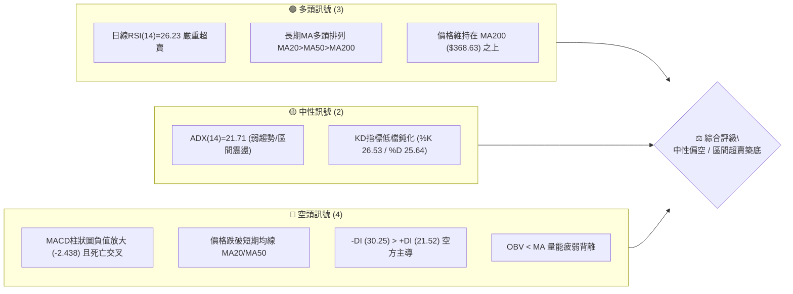

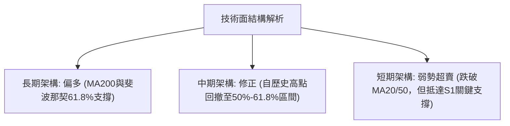

### 📊 核心指標速覽表

| 指標類別 | 指標名稱 | 當前數值 | 訊號 | 解讀 |
|----------|----------|----------|------|------|
| **價格** | 當前價格 | $370.34 | 🟡 中性 | 位於52週區間40.8%位置，回測長期均線支撐 |
| **均線** | MA20 | $389.96 | 🔴 空頭 | 價格位於MA20下方 -5.03%，短線呈下行趨勢 |
| **均線** | MA50 | $385.29 | 🔴 空頭 | 價格位於MA50下方 -3.88%，中期承壓 |
| **均線** | MA200 | $368.63 | 🟢 多頭 | 價格維持在MA200上方 +0.46%，長期牛熊分界線未破 |
| **動能** | RSI(14) | 26.23 | 🟢 超賣 | 進入嚴重超賣區間（<30），隨時具備技術性反彈動能 |
| **動能** | MACD(12,26,9) | -8.408 / -5.970 | 🔴 空頭 | DIF低於信號線，柱狀圖 -2.438 呈現空頭動能擴散 |
| **趨勢強度**| ADX(14) | 21.71 | 🟡 盤整 | ADX < 25 表明非單邊強趨勢行情，屬於區間震盪修正 |
| **波動** | ATR(14) | $12.66 | 🟡 中等 | 佔股價3.42%，日均波動適中，提供明確風控空間 |
| **量能** | 量比 (Volume Ratio) | 1.12x | 🔴 偏弱 | 今日量能略增但OBV低於均線，資金處於防守觀望狀態 |

### 🏆 技術評分卡

```
╔══════════════════════════════════════════════════════════════════╗
║              技術評分卡 — AVGO (2026-09-01)                      ║
╠══════════════════════════════════════════════════════════════════╣
║ 趨勢強度 (Trend)     ████████░░░░░░░░░░░░  40/100  🟡 弱趨勢盤整 ║
║ 動能指標 (Momentum)  ██████░░░░░░░░░░░░░░  30/100  🔴 動能疲弱   ║
║ 支撐穩定度 (Support) ██████████████░░░░░░  70/100  🟢 MA200共振  ║
║ 成交量配合 (Volume)  ████████░░░░░░░░░░░░  40/100  🔴 量能背離   ║
║ 形態完整度 (Pattern) ████████████░░░░░░░░  60/100  🟡 區間箱體   ║
║ 均線架構 (Moving Avg)██████████░░░░░░░░░░  50/100  🟡 長多短空   ║
╠══════════════════════════════════════════════════════════════════╣
║ 綜合技術評分         █████████░░░░░░░░░░░  48/100  ⚖️ 區間震盪   ║
╚══════════════════════════════════════════════════════════════════╝
```

---

## 2. 趨勢分析

### 🌐 多時框趨勢分析

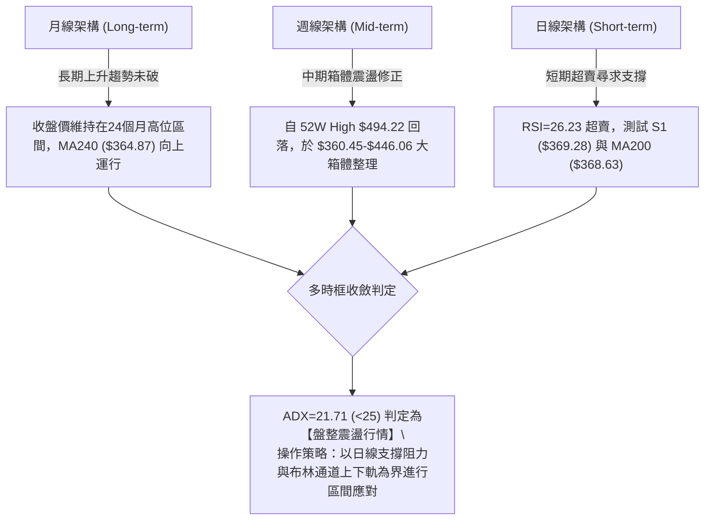

### 📈 長期趨勢 — 12個月走勢圖（Unicode）

```
AVGO 月線走勢圖（2025-09 至 2026-08 歷史收盤價）
價格軸 ($)
$450 ┤                                      ● ($446.06)
$425 ┤                                ●
$400 ┤                   ● ($400.71)
$375 ┤             ●                                   ● ($389.28)
$350 ┤       ●                 ●                 ●           ●←現價 $370.34
$325 ┤ ● ($328.07)                   ● ($330.08)
$300 ┤                                     ● ($309.02)
     └─────────────────────────────────────────────────────────────
       09   10    11    12    01    02    03    04    05    06    07    08 (月份)
```

**走勢特徵分析表格**：

| 階段區間 | 時間跨度 | 起訖價位 ($) | 區間漲跌幅 | 核心技術特徵與成交量分析 |
|----------|----------|--------------|------------|--------------------------|
| **第1階段：主升浪推升** | 2025-09 ~ 2025-11 | $328.07 → $400.71 | +22.14% | 連續三個月收陽，突破整數關卡，均線發散向上 |
| **第2階段：波段回檔整理** | 2025-12 ~ 2026-03 | $400.71 → $309.02 | -22.88% | 獲利了結賣壓湧現，逐月震盪下行，於 $309 形成波段底部 |
| **第3階段：強勁二次推升** | 2026-04 ~ 2026-05 | $309.02 → $446.06 | +44.35% | 爆發性巨量長紅突破，創下歷史收盤新高，動能達到極致 |
| **第4階段：高檔箱體回撤** | 2026-06 ~ 2026-08 | $446.06 → $370.34 | -16.98% | 週線巨量黑K壓制，回吐部分漲幅，目前回測MA200年線 |

### 📊 中期趨勢（週線分析）

```
中期週線價格波段結構示意圖：
$446.06 ═══════════════════════════════════════════════════ (2026-05-31 波段高點)
          ╲                                       ╱
           ╲                                     ╱
$427.76 ────╲───────────────────────────────────●──────── (2026-08-09 反彈次高點)
             ╲                                 ╱ ╲
              ● ($385.12)                     ╱   ╲
               ╲                             ╱     ● 現價 $370.34
$360.45 ────────●───────────────────────────●──────────── (2026-07-05 波段低點支撐)
               (2026-06-28 $365.02)
```

中期走勢呈現典型「高檔對稱寬幅箱體」（$360.45 - $446.06）。近4週自反彈高點 $427.76 急跌至目前 $370.34，週線RSI由 73.6 驟降至 26.2，空方動能宣洩已達極限，接近箱體下緣支撐。

### ⚡ 趨勢強度評估（ADX 解讀）

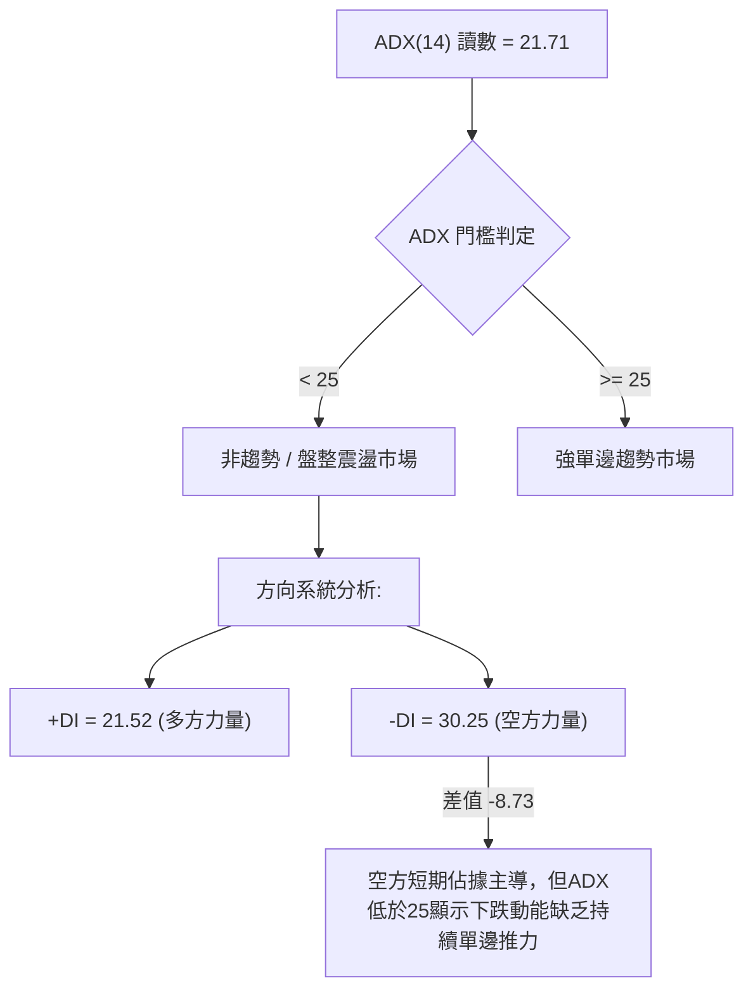

| 指標名稱 | 數值 | 參考閾值 | 當前狀態判定 | 交易策略意涵 |
|----------|------|----------|--------------|--------------|
| **ADX(14)** | 21.71 | < 25: 盤整 / > 25: 趨勢 | 🟡 弱趨勢 / 寬幅震盪 | 避免追漲殺跌，採取支撐低吸、阻力高拋策略 |
| **+DI(14)** | 21.52 | - | 🔴 弱勢 | 多方主動進攻意願低 |
| **-DI(14)** | 30.25 | - | 🔴 強勢 | 空方佔優，但無單邊崩跌動能 |

---

## 3. 圖表形態分析

### 🔍 形態識別系統

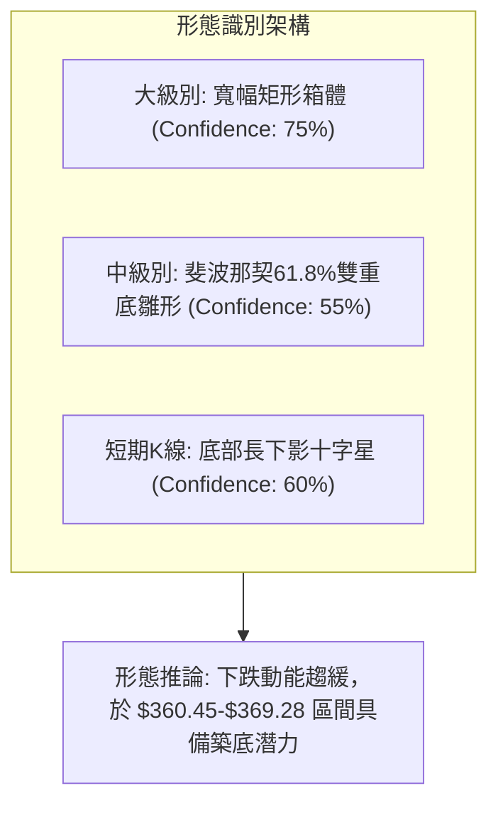

**形態確認與信心度評估表**：

| 形態名稱 | 信心度 | 判斷依據（引用真實數據） | 完成度 | 目標價（附嚴格計算式） |
|----------|--------|--------------------------|--------|------------------------|
| **寬幅矩形箱體** | 75% | 箱體頂部為 2026-05 收盤高點 $446.06，底部為 2026-07-05 週低點 $360.45，價格在此區間震盪3個月 | 70% | 區間震盪目標：箱體中軌 $389.96（布林中軌）至頂部 $443.45（布林上軌） |
| **潛在雙重底 (W底)** | 55% | 左底為 2026-07-05 的 $360.45，右底目前於 S1 ($369.28) 及 MA200 ($368.63) 尋求支撐 | 40% | 頸線為反彈高點 $427.76<br>計算式：頸線 $427.76 + (頸線 $427.76 - 左底 $360.45) = **$495.07**（接近52W高點 $494.22） |
| **布林下軌超賣收斂** | 80% | 現價 $370.34 接近布林下軌 $336.47 與 MA200，%B = 0.32 | 85% | 目標回歸中軌：**$389.96**（BB中軌） |

### 🕯️ 重要K線形態分析

| 日期 / 週期 | 收盤價 ($) | K線形態特徵 | 量價關係與技術解讀 | 訊號意涵 |
|-------------|------------|-------------|--------------------|----------|
| **2026-06-07** | $385.12 | 巨量長黑長陰線 | 週成交量爆出 251,144,600 股的天量大跌，主力高檔出貨確立波段回檔 | 🔴 強烈看空 |
| **2026-07-05** | $360.45 | 探底長下影錘頭線 | 週量萎縮至 103,264,700 股，回測波段支撐後迅速回升，確立第一低點 | 🟢 短期止跌 |
| **2026-08-09** | $427.76 | 衝高受阻流星線 | RSI 達到 73.6 超買區，觸及 R3 阻力區後無力續攻，形成次高點 | 🔴 頂部受阻 |
| **2026-08-30** | $368.79 | 低檔縮量十字星 | RSI 降至 23.5 極度超賣，成交量收斂至 93,854,500 股，殺跌動能枯竭 | 🟡 變盤信號 |
| **2026-09-06** | $370.34 | 微幅反彈陽線 | 止跌回升，價格守住 S1 ($369.28) 與 MA200 ($368.63)，構築支撐平台 | 🟢 初步止跌 |

### 📉 ASCII 走勢形態示意圖

```
AVGO 近期矩形箱體與潛在W底結構：
$446.06 ┌─────────────────────── 頂部阻力區 ──────────────────────┐
        │        ▲                                                     │
$427.76 │───────╱─╲─────────────────────── 頸線阻力 ───────▲───────────│
        │      ╱   ╲                                     ╱ ╲           │
$389.96 │─────╱─────╲──────────────────── 箱體中軌 (MA20) ─╱───╲──────────│
        │    ╱       ╲                               ╱     ╲           │
$370.34 │───╱─────────╲─────────────────────────────╱───────● 現價 ────│
        │  ╱           ● ($365.02)                 ╱         (尋求右底)│
$360.45 └─● ($360.45) ─────────────────────────────────────────────────┘
          左底 (2026-07)                               右底構築中 (2026-09)
```

### 🎯 形態目標價計算

```
形態高度推算邏輯：
1. 箱體反彈目標：
   - 第一目標 (T1) = 箱體中軌 / 布林中軌 = $389.96
   - 第二目標 (T2) = 近期反彈頸線高點 = $427.76
2. 雙底突破目標（需突破 $427.76 確認）：
   - 形態高度 H = 頸線 ($427.76) - 底部 ($360.45) = $67.31
   - 突破目標 = $427.76 + $67.31 = $495.07
```

---

## 4. 支撐與阻力

### 🗺️ 關鍵價位分布圖（Unicode）

```
AVGO 價位結構分布圖（OHLCV 實際計算與斐波那契共振）
═══════════════════════════════════════════════════════════════════
$494.22 ║██████████████████████████████║ 52W High / 斐波那契 0.0%
$444.86 ║████████████████████████      ║ 布林上軌 ($443.45) / 斐波 23.6%
$400.75 ║████████████████████          ║ 強阻力 R3 / 斐波那契 38.2% ($414.33)
$389.96 ║████████████████              ║ 布林中軌 (MA20) / 斐波 50.0% ($389.65)
$384.33 ║██████████████                ║ 阻力 R2 / MA50 ($385.29)
$371.51 ║████████                      ║ 關鍵阻力 R1 (短線突破點)
$370.34 ╠══════════════════════════════╣ ◄ 現價 $370.34
$369.28 ║▓▓▓▓▓▓▓▓                      ║ 近期支撐 S1 / MA200 ($368.63)
$364.97 ║▓▓▓▓▓▓▓▓▓▓▓▓                  ║ 斐波那契 61.8% 黃金分割強支撐
$357.11 ║████████████████              ║ 強支撐 S2 (箱體下緣防線)
$325.79 ║████████████████████████      ║ 極限支撐 S3 / 斐波 78.6% ($329.84)
═══════════════════════════════════════════════════════════════════
```

### 🚧 阻力位分析表

| 阻力級別 | 價位 ($) | 形成原因（波段高點聚類與均線） | 突破難度 | 重要性 |
|----------|----------|--------------------------------|----------|--------|
| **R1** | **$371.51** | 近期日線反彈高點密集區 (+0.32%)，短線空方壓制線 | 🟡 中等 | 短線轉強訊號，突破可化解極度超賣 |
| **R2** | **$384.33** | MA50 ($385.29) 與 MA60 ($385.79) 均線匯聚處 (+3.78%) | 🔴 較高 | 中期多空分水嶺，需補量突破 |
| **R3** | **$400.75** | 整數心理關卡、歷史月線收盤高點聚類 (+8.21%) | 🔴 極高 | 波段反轉確認點，突破將開啟新一輪多頭 |

### 🛡️ 支撐位分析表

| 支撐級別 | 價位 ($) | 形成原因（波段低點聚類與均線） | 守住機率 | 重要性 |
|----------|----------|--------------------------------|----------|--------|
| **S1** | **$369.28** | 近期波段低點聚類 (-0.29%)，與 MA200 ($368.63) 形成重合共振 | 🟢 75% | 長期牛市底線，跌破將引發停損賣壓 |
| **S2** | **$357.11** | 2026-07 前低聚類 (-3.57%)，斐波那契 61.8% ($364.97) 下方緩衝區 | 🟢 85% | 中期箱體絕對防線，多頭最後堡壘 |
| **S3** | **$325.79** | 2025-09/2026-01 起漲平台 (-12.03%)，斐波 78.6% ($329.84) | 🟢 95% | 極端黑天鵝防守位，長線價值買點 |

### 📐 斐波那契回調位分析

依據 52 週區間波段低點 **$285.08** 至波段高點 **$494.22** 進行精確黃金分割測算：

```
斐波那契回調層級分布與現價關係：
0.0%  (52W High) ────────────── $494.22
23.6% ───────────────────────── $444.86 (接近布林上軌 $443.45)
38.2% ───────────────────────── $414.33
50.0% ───────────────────────── $389.65 (精確重合布林中軌 MA20 $389.96)
[現價 $370.34 區間] ────────── 位於 50.0% 與 61.8% 之間
61.8% (黃金分割) ────────────── $364.97 (強支撐，距離現價僅 -1.45%)
78.6% ───────────────────────── $329.84
100.0% (52W Low) ────────────── $285.08
```

**斐波那契深層解讀**：
現價 $370.34 目前回撤至 **50.0% ($389.65)** 與 **61.8% ($364.97)** 之間。在技術分析理論中，61.8% 回調位被視為多頭健康回檔的「黃金支撐位」。只要股價有效守穩在 $364.97（及 S1 $369.28 / MA200 $368.63）之上，整個中長期上升結構並未遭到實質性破壞。

---

## 5. 技術指標深度解讀

### 🎛️ 指標訊號總覽

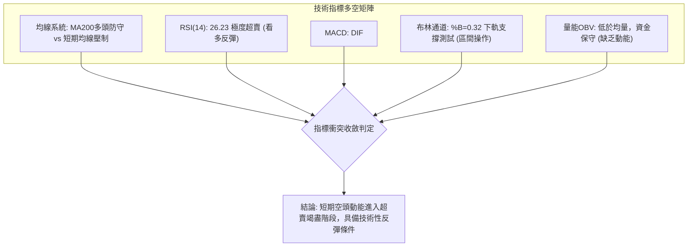

### 📈 移動平均線排列分析

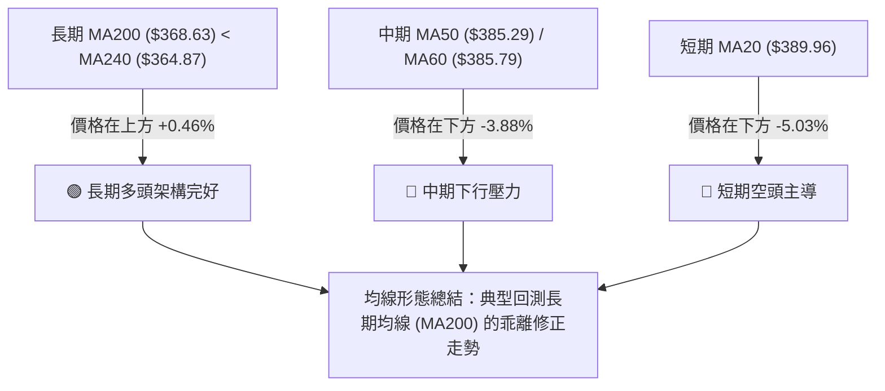

| 均線名稱 | 當前價格 | 與現價乖離 | 走勢特徵 | 訊號意涵 |
|----------|----------|------------|----------|----------|
| **MA5** | $364.60 | +1.57% | 走平向上彎頭 ▂▁▁ | 🟢 超跌反彈發酵 |
| **MA10** | $365.67 | +1.28% | 下跌趨緩 ▄▃▂▁ | 🟡 跌勢鈍化 |
| **MA20** | $389.96 | -5.03% | 下行壓制 ▅▅▄ | 🔴 短期強阻力 |
| **MA50** | $385.29 | -3.88% | 走平微跌 | 🔴 中期整理 |
| **MA200**| $368.63 | +0.46% | 穩定上升 ▆▇█ | 🟢 牛市生命線 |
| **MA240**| $364.87 | +1.50% | 長期向上 ▇██ | 🟢 強力長期托底 |

### 📉 RSI(14) 分析

```
RSI(14) 當前數值進度條：
0 ══════════ 超賣區(30) ══════════════ 中性(50) ════════════ 超買區(70) ═════════ 100
[██████████░░░░░░░░░░░░░░░░░░░░░░░░░░░░░░░░░░░░░░░░░░░░░░░] 26.23 (極度超賣 🟢)
```

- **超買超賣判定**：RSI(14) 讀數為 **26.23**，已深度跌入 30 以下的超賣區間。回顧近20週數據，前次低點出現於 2026-08-30 的 23.5，隨後股價於 $368-$370 企穩，顯示超賣區具備強大逢低買盤支撐。
- **背離分析**：
  - 現價與 2026-08-30 收盤價 $368.79 相比微幅走高（$370.34），RSI 亦由 23.5 回升至 26.23，兩者同步微幅走平向上。
  - **結論**：**無明顯頂背離或底背離**。當前為標準的指標低檔鈍化與超賣修復階段。

### 📊 MACD(12/26/9) 訊號解讀

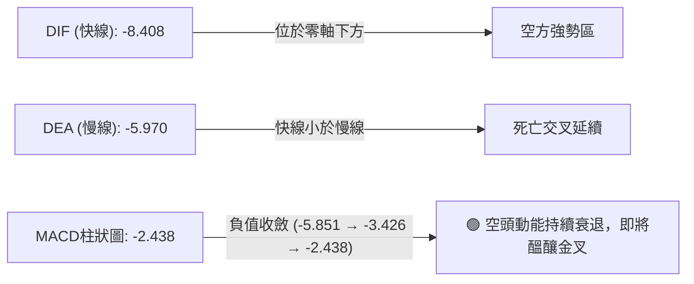

週線層面，MACD 柱狀圖自 2026-08-23 的峰值 **-5.851** 收斂至 2026-08-30 的 **-3.426**，最新進一步收窄至 **-2.438**。這表明雖然指標仍處於空頭排列，但空方拋售力量正在快速衰竭，為短線反彈提供動能基礎。

### 📦 布林通道分析

```
AVGO 布林通道 (20日, 2.0σ) 結構示意圖：
$443.45 ────────────────────────────────────────── 布林上軌 (阻力區)
        │
$389.96 ────────────────────────────────────────── 布林中軌 (MA20)
        │
$370.34 ───────────────● 現價 (位處通道下半部, %B = 0.32)
        │
$336.47 ────────────────────────────────────────── 布林下軌 (極限支撐)
```

- **通道帶寬與位置**：%B 為 **0.32**（計算式：($370.34 - $336.47) / ($443.45 - $336.47) = 33.87 / 106.98 = 0.3166），股價位於中軌與下軌之間的超跌區域。
- **軌道形態**：通道未呈現單邊向下開口發散，中軌維持在 $389.96，表明市場並非單邊暴跌行情，而是常態震盪回調，價格觸及下半部有強烈向中軌回歸的統計學傾向。

### 💹 成交量分析（量價配合度）

- **量比與均量比較**：今日成交量為 **21,914,100** 股，高於 20 日均量 **19,644,410** 股（量比 1.12x），但略低於 50 日均量 **21,458,172** 股。
- **OBV 能量潮解讀**：目前 **OBV < MA**，量能指標呈現疲弱狀態。在股價自高點回落過程中，週成交量自 6 月初的 2.51 億股萎縮至當前的 2191 萬股（日量級別），呈現「下跌縮量」格局，證明機構並未進行恐慌性清倉，當前量能疲弱更多體現為買盤觀望，待放量突破 R1 ($371.51) 後方可確認量價齊揚。

---

## 6. 動能與波動率

### ⚡ 動能評估四象限

| 象限 | 動能強度 (RSI/MACD) | 波動率水準 (ATR/Beta) | 當前狀態判定 | 戰術應對評估 |
|------|----------------------|------------------------|--------------|--------------|
| **第一象限 (Q1)** | 強動能 (多方) | 低波動 (穩定) | — | 最佳強勢追價機會 |
| **第二象限 (Q2)** | **弱動能 (超賣)** | **中低波動 (收斂)** | **✓ AVGO 當前定位** | **超賣築底，宜逢低分批布局** |
| **第三象限 (Q3)** | 強動能 (爆發) | 高波動 (劇烈) | — | 高風險短線突破交易 |
| **第四象限 (Q4)** | 弱動能 (下殺) | 高波動 (恐慌) | — | 單邊崩跌，嚴禁接刀 |

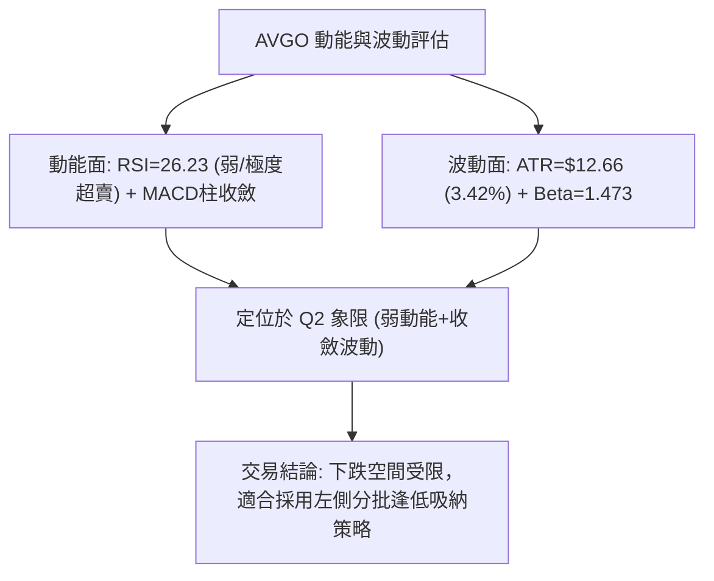

### 📊 ATR 波動率分析

- **ATR(14) 絕對數值**：**$12.66**（佔當前股價 $370.34 的 **3.42%**）。
- **風控與止損設定依據**：
  - 日內正常波動區間為 $\pm \$12.66$。
  - **保守止損距離**：建議設定為 1.5 倍 ATR = $1.5 \times \$12.66 = \mathbf{\$18.99}$。
  - **緊密止損距離**：建議設定為 1.0 倍 ATR = $\mathbf{\$12.66}$。
  - 此數值為後續制定精確交易策略的止損點位提供了量化依據。

### 📐 Beta 與市場相關性

- **Beta 係數**：**1.473**（高 Beta 成長型/半導體龍頭特徵）。
- **市場敏感度解讀**：當標普500指數或費城半導體指數上漲 1% 時，AVGO 理論波動幅度為 1.473%。在市場反彈週期中，AVGO 具備顯著的超額收益（Alpha）潛力；但在大盤回調階段，亦承受放大的波動風險。

---

## 7. 多時框架總結

### 📋 時框架評分表

| 時框架 | 趨勢方向 | 動能狀態 | 均線排列 | 形態結構 | 綜合評分 | 操作建議 |
|--------|----------|----------|----------|----------|----------|----------|
| **月線 (Long)** | 🟢 多頭 | 🟡 中性回調 | 多頭排列 (MA20>50>200) | 長期上升通道 | **75/100** | 長線堅定持有 |
| **週線 (Mid)** | 🟡 震盪 | 🔴 空方衰竭 | 均線糾結 | 寬幅箱體 ($360-$446) | **50/100** | 箱體下緣低吸 |
| **日線 (Short)**| 🔴 弱勢 | 🟢 嚴重超賣 | 價格跌破短均線 | S1支撐測試/底背離蓄勢| **45/100** | 尋求短線反彈點 |

### 🔲 綜合訊號矩陣

```
時框架訊號矩陣圖：
┌─────────────┬────────────────────────────────────────────────────────┐
│ 時框架      │ 短期 (日線) ────────── 中期 (週線) ────────── 長期 (月線)│
├─────────────┼────────────────────────────────────────────────────────┤
│ 趨勢方向    │    🔴 偏空修正            🟡 箱體震盪            🟢 牛市上升  │
│ 均線系統    │    🔴 位於MA20下方        🟡 測試MA50            🟢 遠高於MA200│
│ 動能強度    │    🟢 RSI極度超賣         🔴 MACD柱為負          🟢 歷史高檔區│
│ 風險/回報比 │    🟢 支撐明確(極佳)      🟢 箱體下緣(良好)      🟢 價值合理  │
└─────────────┴────────────────────────────────────────────────────────┘
```

### ⚖️ 多時框收斂結論

> **依據規則 14 之多時框收斂裁決**：
> 1. **趨勢/盤整定性**：當前 ADX(14) 讀數為 **21.71 (< 25)**，明確定義當前市場為**【盤整震盪行情】**。
> 2. **主導規則應用**：在盤整行情中，單邊趨勢策略失效，**以日線及週線之關鍵支撐阻力（S1 $369.28 / 布林中軌 $389.96）與超賣指標修復為主要操作指引**。
> 3. **唯一方向性結論**：**【中性偏多，超賣築底反彈】**。
>    雖然日線短均線偏空，但長期 MA200 ($368.63) 與斐波那契 61.8% ($364.97) 在現價下方形成雙重鐵底，疊加日線 RSI=26.23 極度超賣，做空盈虧比極差；因此，戰略上以逢低做多反彈為主策略。

---

## 8. 交易策略建議

### 🗺️ 策略決策流程圖

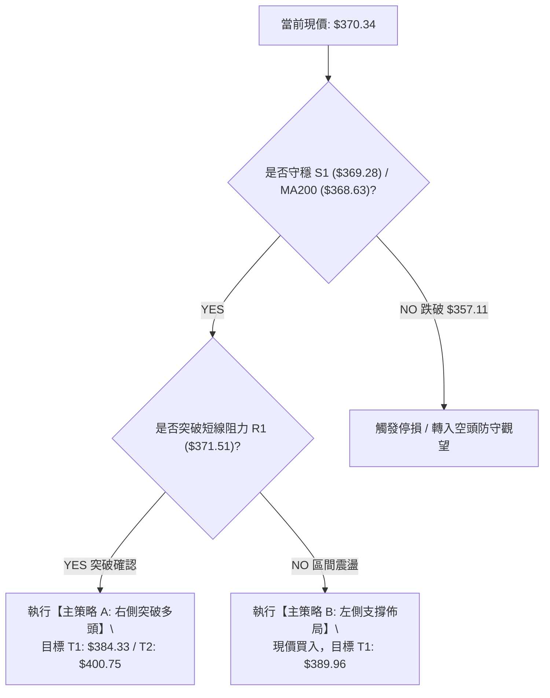

### 🧭 策略路由

**當前主策略方向 = 【多頭策略：超賣支撐反彈】（依綜合評分與超賣指標共振判定）**
由於綜合評分處於 48/100 區間震盪中軸，且 RSI 達到 26.23 極度超賣，極度貼近 S1 強支撐，故主推以支撐為防守點的**多頭反彈策略**；空頭策略僅作為跌破關鍵支撐時的「反轉風險對沖提示」。

### 🎯 價格情境階梯（Price Scenarios）

| 觸發條件 | 第一目標 (T1) | 第二目標 (T2) | 後續延伸 (T3) | 情境技術含義 |
|----------|---------------|---------------|---------------|--------------|
| **突破 R1 $371.51** | R2 **$384.33** | R3 **$400.75** | 斐波23.6% **$444.86** | 短線轉強，空頭回補，展開中軌修復行情 |
| **守穩現價 $370.34** | MA20 **$389.96** | 反彈高點 **$427.76** | 52W高點 **$494.22** | 區間震盪築底，潛在 W 底形態推進 |
| **跌破 S1 $369.28** | S2 **$357.11** | 斐波78.6% **$329.84** | S3 **$325.79** | 中期結構破位，回測 2026 年初低點 |

### 📊 情境機率分佈

| 情境劇本 | 發生機率 | 主要技術依據（引用指標狀態） |
|----------|----------|------------------------------|
| **情境一：超跌反彈 / 向上修復** | **60%** | RSI=26.23 嚴重超賣，MACD負柱狀圖連續收斂，MA200與S1支撐共振強烈 |
| **情境二：窄幅橫盤震盪** | **25%** | ADX=21.71 (<25) 顯示缺乏單邊動能，成交量維持於均量水平觀望 |
| **情境三：跌破支撐 / 向下破位** | **15%** | -DI (30.25) 仍高於 +DI，若大盤系統性下殺可能引發 MA200 跌破 |

### 🟢 主策略詳情

所有價位均嚴格引用第 4 章之關鍵價位與均線計算數值：

| 策略要素 | 策略 A（右側穩健型：突破進場） | 策略 B（左側激進型：支撐低吸） |
|----------|--------------------------------|--------------------------------|
| **進場條件** | 日K線收盤突破 R1 並放量確認 | 現價於 S1 支撐上方直接分批進場 |
| **進場價格** | **$371.51** (R1 突破點) | **$370.34** (現價) |
| **第一目標價 (T1)** | **$384.33** (R2 / MA50 阻力) | **$389.96** (MA20 / 布林中軌) |
| **第二目標價 (T2)** | **$400.75** (R3 強阻力) | **$427.76** (前波反彈高點頸線) |
| **止損價格** | **$364.97** (斐波那契 61.8% 支撐) | **$357.11** (S2 強支撐下緣) |
| **風險空間** | $6.54 (1.76%) | $13.23 (3.57% ≈ 1.0 ATR) |
| **報酬空間 (至T1)** | $12.82 (+3.45%) | $19.62 (+5.30%) |
| **報酬空間 (至T2)** | $29.24 (+7.87%) | $57.42 (+15.50%) |
| **風險報酬比 (R:R)**| **1 : 4.47** (以T2計算) | **1 : 4.34** (以T2計算) |
| **建議倉位** | **20% - 25%** | **10% - 15%** (分批建倉) |

### 🔴 反向風險觸發點（對沖提示）

- **多頭全面棄守點**：若日K線以實體長黑跌破 **S2 ($357.11)** 且無法於兩日內收復，宣告潛在雙底形態破產，此時多頭部位必須嚴格全數停損離場。
- **空頭對沖啟動條件**：若股價跌破 **$357.11**，可反手建立小規模空頭避險倉位，下看 S3 **$325.79**（潛在下行空間約 -8.7%）。

### ⭐ 整體訊號強度評星

```
╔══════════════════════════════════════════════════════════════════╗
║ 做多訊號強度：★★★★☆  (4/5星 — 嚴重超賣+強支撐共振，盈虧比極佳) ║
║ 做空訊號強度：★☆☆☆☆  (1/5星 — 空間受限於MA200，追空風險極高) ║
║ 整體可信度：  ★★★★☆  (4/5星 — 關鍵點位密集重合，指標一致性高) ║
╚══════════════════════════════════════════════════════════════════╝
```

---

## 9. 風險提示與監控

### ✅ 關鍵監控指標 Checklist

```
╔══════════════════════════════════════════════════════════════════╗
║              AVGO 技術面日常監控 CHECKLIST                       ║
╠══════════════════════════════════════════════════════════════════╣
║ [ ] 價格是否跌破長期多空分水嶺 MA200 ($368.63)                  ║
║ [ ] RSI(14) 是否脫離超賣區回升至 30 以上（確認反彈啟動）         ║
║ [ ] MACD 柱狀圖是否由負轉正（確認動能金叉）                     ║
║ [ ] 日成交量是否放大至 2,000 萬股以上（量能配合確認）            ║
║ [ ] 股價是否有效突破並站穩 R1 ($371.51) 與 R2 ($384.33)          ║
║ [ ] 費城半導體指數 (SOX) 是否同步止跌（Beta=1.47 系統性連動）   ║
╚══════════════════════════════════════════════════════════════════╝
```

### ⚠️ 風險場景分析

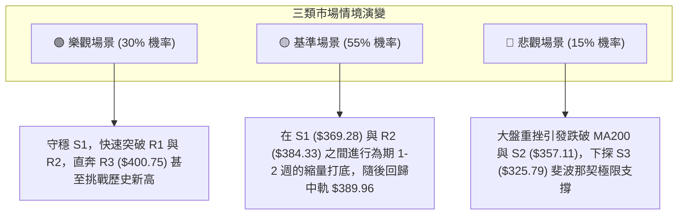

### 🛡️ 風險管理重要提醒

1. **嚴禁超重倉位**：AVGO 之 Beta 達 1.473，且 ATR 達 $12.66，單日波動較大。單一標的總持倉建議控制在總投資組合的 **15% - 25%** 以內。
2. **嚴格執行價格紀律**：
   - 止損點 **$364.97 (策略A)** 與 **$357.11 (策略B)** 為客觀計算出之技術防線，不可因主觀情緒隨意下移止損。
3. **分批獲利了結**：
   - 當價格抵達 T1 ($384.33 - $389.96) 時，建議至少了結 **50%** 倉位鎖定利潤，並將剩餘部位之止損價上移至損益兩平點（進場價），實現無風險持倉博取 T2 ($400.75+)。

---

## 📋 報告總結

```
╔══════════════════════════════════════════════════════════════════╗
║                  AVGO 技術分析報告總結                           ║
╠══════════════════════════════════════════════════════════════════╣
║ 報告日期：2026-09-01                                             ║
║ 當前價格：$370.34                                                ║
║ 分析評級：⚖️ 中性偏多 / 區間超賣反彈 (技術評分: 48/100)          ║
╠══════════════════════════════════════════════════════════════════╣
║ 關鍵結論：                                                       ║
║ ├─ 長期趨勢：🟢 偏多（維持在 MA200 $368.63 與長均線上運行）      ║
║ ├─ 中期趨勢：🟡 震盪（$360.45 - $446.06 寬幅大箱體整理）         ║
║ ├─ 短期趨勢：🟢 超賣蓄勢（RSI=26.23 進入嚴重超賣，隨時反彈）     ║
║ ├─ 關鍵支撐：S1 $369.28 ｜ S2 $357.11 ｜ S3 $325.79              ║
║ ├─ 關鍵阻力：R1 $371.51 ｜ R2 $384.33 ｜ R3 $400.75              ║
║ └─ 分析師目標價共識：$525.97（現價潛在上行空間 +42.0%）          ║
╠══════════════════════════════════════════════════════════════════╣
║ 最優策略組合：                                                   ║
║ 1. 🥇 最佳機會（主策略 A）：突破 $371.51 追進做多，目標 $400.75  ║
║ 2. 🥈 次選機會（主策略 B）：現價 $370.34 逢低吸納，目標 $389.96  ║
║ 3. 🥉 防守風控：跌破 $357.11 嚴格停損離場，轉入觀望             ║
╚══════════════════════════════════════════════════════════════════╝
```

---

> ⚠️ **免責聲明**：本報告為 AI 自動生成之技術分析研究，報告內所有數據、支撐阻力位與交易策略均基於量化模型及歷史 OHLCV 價格計算。本報告**僅供學術研究與參考**，**不構成任何形式的招攬、要約或投資建議**。金融市場具有高風險，投資人應獨立評估並自負盈虧。

---

*報告生成時間：2026-09-01 ｜ 數據來源：Yahoo Finance ｜ 分析框架：多時框量化技術分析系統*