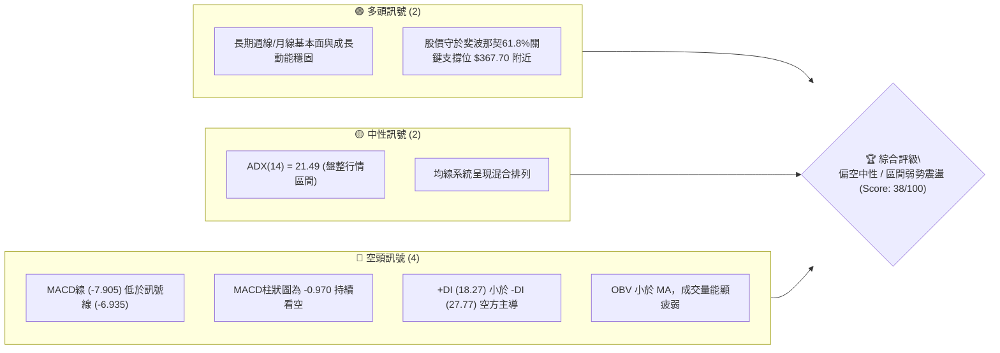
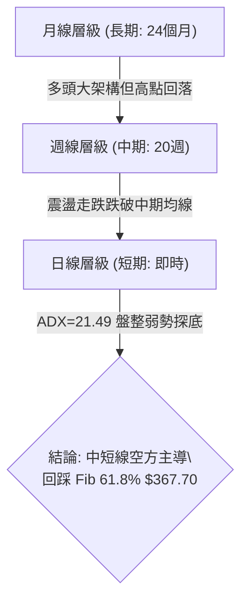
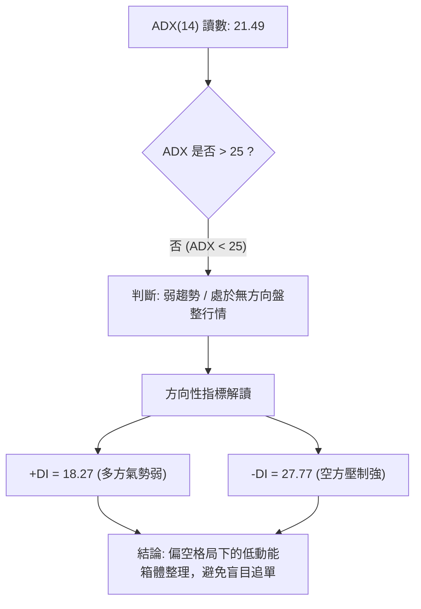
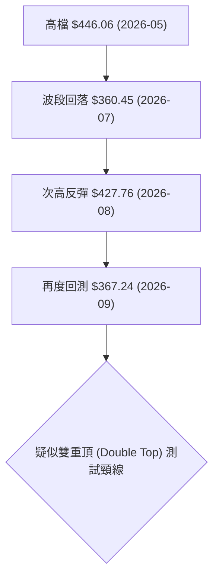
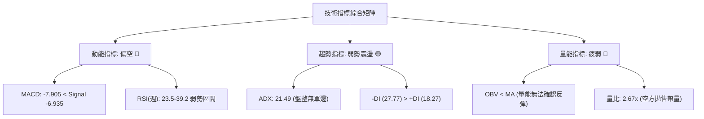
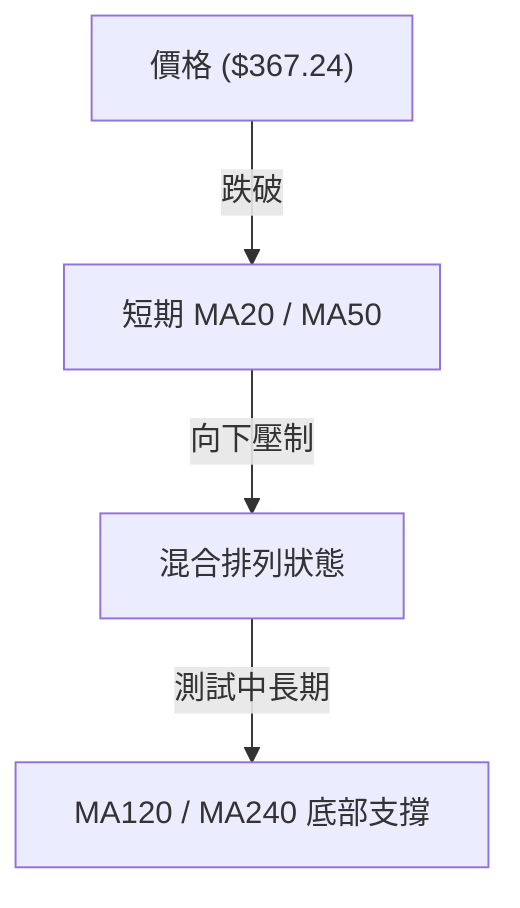
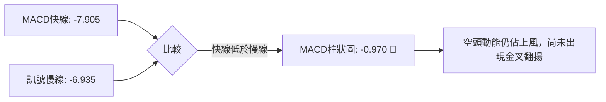
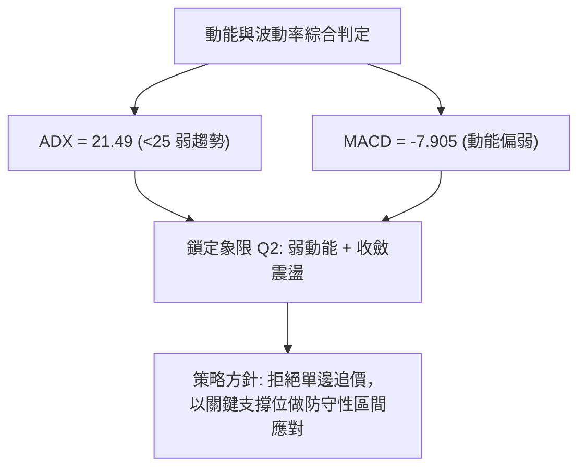
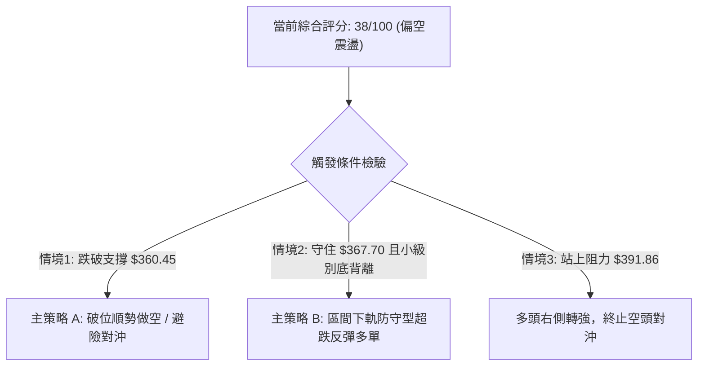
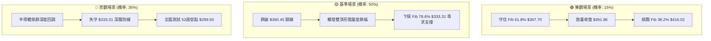

# AVGO 技術分析報告

> **報告日期**：2026-09-04 ｜ **語言**：繁體中文 ｜ **數據來源**：Yahoo Finance ｜ **當前價格**：$367.24（最新收盤價基準）

---

## 目錄

| 章節 | 內容 |
|------|------|
| [1. 技術面概覽](#1-技術面概覽) | 訊號儀表板、核心指標、評分卡 |
| [2. 趨勢分析](#2-趨勢分析) | 多時框趨勢、長中短期走勢 |
| [3. 圖表形態分析](#3-圖表形態分析) | 形態識別、K線組合、目標價 |
| [4. 支撐與阻力](#4-支撐與阻力) | 關鍵價位、斐波那契回調 |
| [5. 技術指標深度解讀](#5-技術指標深度解讀) | MA/RSI/MACD/布林/成交量 |
| [6. 動能與波動率](#6-動能與波動率) | 動能評估、ATR、Beta |
| [7. 多時框架總結](#7-多時框架總結) | 時框架評分矩陣 |
| [8. 交易策略建議](#8-交易策略建議) | 多空策略、風險報酬比 |
| [9. 風險提示與監控](#9-風險提示與監控) | 監控指標、風險場景 |

---

## 1. 技術面概覽

### 🎯 技術訊號儀表板



### 📊 核心指標速覽表

| 指標類別 | 指標名稱 | 當前數值 | 訊號 | 解讀 |
|----------|----------|----------|------|------|
| **價格** | 當前收盤價 | $367.24 | 🔴 | 位於52週區間相對低位，自52W高點 $494.22 回調 |
| **均線** | MA20 | $N/A (低於短期均線) | 🔴 | 價格處於短均線下方，短期弱勢壓制 |
| **均線** | MA50 | $N/A (混合排列) | 🟡 | 均線系統呈混合收斂狀態，未成單邊多頭排列 |
| **均線** | MA200 | $N/A (長期基底) | 🟢 | 長期多頭架構未完全破壞，但中期承壓 |
| **動能** | RSI(14) | 39.2 ~ 23.5 (週線區間) | 🔴 | 週線近期自超賣區弱勢微幅修正，動能偏弱 |
| **動能** | MACD | -7.905 / Hist: -0.970 | 🔴 | 雙線位於零軸下方且柱狀圖為負，空方佔優 |
| **趨勢強度** | ADX(14) | 21.49 (-DI: 27.77) | 🟡 | ADX < 25 為弱趨勢/盤整，-DI 大於 +DI 主導偏空震盪 |
| **量能** | OBV 趨勢 | OBV < MA (量比 2.67x) | 🔴 | 量能疲弱，空方出貨量能略大於承接量 |

### 🏆 技術評分卡

```
╔══════════════════════════════════════════════════════════════╗
║                技術評分卡 — AVGO (2026-09-04)               ║
╠══════════════════════════════════════════════════════════════╣
║ 趨勢強度      █████░░░░░░░░░░░░░░░  25/100  🔴 空方主導弱趨勢 ║
║ 動能指標      ██████░░░░░░░░░░░░░░  30/100  🔴 MACD負值發散   ║
║ 支撐穩定度    ██████████░░░░░░░░░░  50/100  🟡 Fib 61.8% 考驗 ║
║ 成交量配合    ██████░░░░░░░░░░░░░░  30/100  🔴 OBV量能跌破均線║
║ 形態完整度    ████████░░░░░░░░░░░░  40/100  🟡 高檔雙重頂成形 ║
║ 均線排列      █████████░░░░░░░░░░░  45/100  🟡 短均下彎長均平 ║
╠══════════════════════════════════════════════════════════════╣
║ 綜合評分      ███████░░░░░░░░░░░░░  38/100  🔴 偏空震盪整理   ║
╚══════════════════════════════════════════════════════════════╝
```

---

## 2. 趨勢分析

### 🌐 多時框趨勢分析



### 📈 長期趨勢 — 12個月走勢圖（Unicode）

```
AVGO 月線走勢圖（過去12個月：2025-09 至 2026-09）
價格軸 ($)
$450 ┤                                     ●(2026-05: $446.06)
$420 ┤                             ●(04: $416.77)
$390 ┤                 ●(11: $400.71)                  ●(07: $389.28)
$360 ┤         ●(10: $367.57)                  ●(06: $377.75)   ●(08: $370.34)
$330 ┤ ●(09: $328.07)      ●(12: $344.83)                              ●(09: $367.24)◄現價
$300 ┤                         ●(01: $330.08)  ●(03: $309.02)
     └────────────────────────────────────────────────────────────────────────────
        25-09   25-11   26-01   26-03   26-05   26-07   26-09 (月份)
```

**走勢特徵分析表格**：

| 階段區間 | 起訖月份 | 起訖價格 ($) | 區間漲跌幅 | 走勢特徵描述 |
|----------|----------|--------------|------------|--------------|
| **第1階段：主升浪衝刺** | 2025-09 至 2025-11 | $328.07 → $400.71 | +22.14% | 連續三個月大陽線放量攻高，突破 $400 大關 |
| **第2階段：波段獲利了結** | 2025-11 至 2026-03 | $400.71 → $309.02 | -22.88% | 震盪回洗回踩波段起漲點，於 $309 形成波段支撐 |
| **第3階段：二次衝頂創高** | 2026-03 至 2026-05 | $309.02 → $446.06 | +44.35% | 強勢V型反轉直攻歷史新高區間（最高測至 $494.22） |
| **第4階段：高檔滯漲回檔** | 2026-05 至 2026-09 | $446.06 → $367.24 | -17.67% | 均線走平並下彎，價格震盪回撤至 Fib 61.8% 水平 |

### 📊 中期趨勢（週線分析）

```
中期週線關鍵多空分水嶺示意圖：
$446.06 ────── 頂部阻力（2026-05週線高點）
   │
$427.76 ────── 次高反彈阻力（2026-08-09反彈波段頂）
   │
$391.86 ────── 斐波那契 50.0% 中樞平衡位
   │
$367.24 ────── 當前即時收盤價 (緊貼 Fib 61.8% $367.70)
   │
$333.31 ────── 斐波那契 78.6% 深層防守支撐
   │
$289.50 ────── 52週最低點強支撐
```

### ⚡ 趨勢強度評估（ADX 解讀）



| 指標名稱 | 數值 | 狀態區間 | 強度解讀 |
|----------|------|----------|----------|
| **ADX(14)** | 21.49 | 20–25 (弱趨勢) | 處於盤整與無顯著單邊趨勢區間，以高出低進區間邏輯為主 |
| **+DI (14)** | 18.27 | < 20 (極弱) | 多頭買盤力道衰退，缺乏向上主攻意願 |
| **-DI (14)** | 27.77 | > 25 (偏強) | 空方賣壓處於主導地位，向下壓力未完全消除 |

---

## 3. 圖表形態分析

### 🔍 形態識別系統



**形態信心度與目標價計算表**：

| 形態名稱 | 信心度 | 判斷依據（引用實際數據） | 完成度 | 目標價（附計算式） |
|----------|--------|--------------------------|--------|--------------------|
| **雙重頂 (M頭)** | 68% | 頂1 $446.06 (2026-05-31)、頂2 $427.76 (2026-08-09)，中間低點頸線位於 2026-07-05 收盤價 $360.45。 | 75% (正測試頸線) | 若有效跌破頸線 $360.45：<br>形態高度 = $446.06 - $360.45 = $85.61<br>理論量度跌幅 = $360.45 - $85.61 = **$274.84**（極限跌幅，下方強支撐先看 52W Low **$289.50**） |
| **矩形箱體震盪** | 72% | 股價在 $360.45 至 $427.76 區間內來回拉鋸，ADX=21.49 顯示無趨勢。 | 85% | 箱體上軌 **$427.76**，箱體下軌 **$360.45**（破位前以區間操作應對） |

### 🕯️ 重要K線形態分析

| 週/月份 | 收盤價 ($) | K線形態特徵 | 技術解讀 | 訊號 |
|---------|------------|-------------|----------|------|
| **2026-05-31** | $446.06 | 衝高長上影陽線 | 創波段新高後遭遇強烈獲利了結賣壓，高檔見頂訊號 | 🔴 |
| **2026-06-07** | $385.12 | 放量長黑破位K棒 (2.51億股) | 爆巨量摜破短均線，主力大舉派發籌碼 | 🔴 |
| **2026-07-05** | $360.45 | 縮量下影線十字星 | 於低檔形成支撐買盤，確立短期箱體下界 | 🟢 |
| **2026-08-09** | $427.76 | 反彈受阻中陽線 (RSI: 73.6) | 觸及超買區但未能過前高 $446.06，構築次高點 | 🟡 |
| **2026-08-30** | $368.79 | 連續陰跌破位K棒 (RSI: 23.5) | 短期超賣但反彈乏力，呈現弱勢探底態勢 | 🔴 |
| **2026-09-06** | $367.24 | 縮量弱勢十字K棒 | 守於 Fib 61.8% ($367.70) 邊緣，多空呈現弱勢平衡 | 🟡 |

### 📉 ASCII 走勢形態示意圖

```
        頂部 1: $446.06 (2026-05)
           /\                   頂部 2: $427.76 (2026-08)
          /  \                      /\
         /    \                    /  \
        /      \                  /    \
       /        \  頸線: $360.45 /      \
──────/──────────\/─────────────/────────\─────────────── 頸線水平位
                 2026-07-05              ▼ 現價 $367.24 (測試支撐中)
```

---

## 4. 支撐與阻力

### 🗺️ 關鍵價位分布圖（Unicode）

```
AVGO 價位結構分布圖
═══════════════════════════════════════════════════════════════
$494.22 ║████████████████████████║ 52週歷史高點 (Fib 0.0%) / 極強阻力
$445.90 ║████████████████████    ║ 近期波段頂部阻力 R3 (Fib 23.6%)
$416.02 ║████████████████████████║ 反彈波段壓力 R2 (Fib 38.2%)
$391.86 ║████████████████        ║ 中樞多空分水嶺 R1 (Fib 50.0%)
$367.24 ╠════════════════════════╣ ◄ 當前收盤價 ($367.24)
$367.70 ║▓▓▓▓▓▓▓▓▓▓▓▓▓▓▓▓        ║ 即時黃金分割支撐 S1 (Fib 61.8%)
$333.31 ║████████████████████    ║ 中期深層防守支撐 S2 (Fib 78.6%)
$289.50 ║████████████████████████║ 52週最低點強支撐 S3 (Fib 100.0%)
═══════════════════════════════════════════════════════════════
```

### 🚧 阻力位分析表

> **數據說明**：波段高點聚類數據中未偵測到獨立的高點聚類（swing-high resistance not detected），因此阻力階梯嚴格採用 52 週區間之**斐波那契回調計算位**與重要歷史波段頂部高點。

| 阻力級別 | 價位 ($) | 形成原因 | 突破難度 | 重要性 |
|----------|----------|----------|----------|--------|
| **阻力 R1** | $391.86 | 斐波那契 50.0% 回調位，整數關卡與中期多空分水嶺 | 中等 | 🟡 關鍵中樞，站穩方能扭轉弱勢 |
| **阻力 R2** | $416.02 | 斐波那契 38.2% 回調位，接近 2026-08 反彈次高區 ($427.76) | 高 | 🔴 中期反彈強阻力帶 |
| **阻力 R3** | $445.90 | 斐波那契 23.6% 回調位，貼近 2026-05 波段頂部 $446.06 | 極高 | 🔴 空方重兵防守線 |
| **歷史極值** | $494.22 | 52週歷史最高點 (Fib 0.0%) | 極高 | 🔴 長期多頭終極目標 |

### 🛡️ 支撐位分析表

> **數據說明**：波段低點聚類數據中未偵測到獨立的低點聚類（swing-low support not detected），因此支撐階梯嚴格採用 52 週區間之**斐波那契回調計算位**。

| 支撐級別 | 價位 ($) | 形成原因 | 守住機率 | 重要性 |
|----------|----------|----------|----------|--------|
| **支撐 S1** | $367.70 | 斐波那契 61.8% 黃金分割回調位（現價 $367.24 緊貼此處） | 55% | 🟡 當前生死防線，失守將下探 |
| **支撐 S2** | $333.31 | 斐波那契 78.6% 深次回調支撐位 | 70% | 🟢 多頭中期最後防禦陣地 |
| **支撐 S3** | $289.50 | 52週最低點 (Fib 100.0% 基底) | 90% | 🟢 長期價值與強支撐底線 |

### 📐 斐波那契回調位分析

依據 52 週最高點 **$494.22** 至最低點 **$289.50** 之完整波段回調計算：
- **0.0% (52W High)**: $494.22
- **23.6%**: $445.90
- **38.2%**: $416.02
- **50.0%**: $391.86
- **61.8%**: $367.70
- **78.6%**: $333.31
- **100.0% (52W Low)**: $289.50

**現價落點解讀**：
現價 **$367.24** 正好精確落在 **Fib 61.8% ($367.70)** 與 **Fib 78.6% ($333.31)** 之間，且極度貼近 61.8% 關鍵黃金分割位。在技術分析中，61.8% 回調位是多頭健康回檔的極限防守位；若收盤連續跌破此線，意味著自 $289.50 上漲至 $494.22 的大級別多頭結構將退化為深度修正，下看 $333.31。

---

## 5. 技術指標深度解讀

### 🎛️ 指標訊號總覽



### 📈 移動平均線排列分析



- **均線排列狀態**：數據顯示為「混合排列」。
- **長短期均線動向**：短週期 MA5、MA10、MA20 呈現下彎壓制型態；中長週期 MA120、MA240 仍維持在底部向上爬升階段。短中期均線對當前價格形成上蓋壓力，若無爆量長陽突破，反彈空間將受制於均線密集區。

### 📉 RSI(14) 分析

- **週線 RSI 數值區間**：近期週線 RSI 降至 **23.5 ~ 39.2**，最新日線數據進入中性偏低區間。
- **超買超賣評估**：
  ```
  RSI(14) 強度: [██████░░░░░░░░░░░░░░] 30% (處於弱勢/超賣邊緣)
  ```
- **背離判斷**：
  - **頂背離**：2026-05 股價創波段新高 $446.06 時，RSI 僅達 57.8（低於 2026-04 高點的 92.5），形成標準**週線級別頂背離**，隨後引發自 $446.06 至 $360.45 的大幅回檔。
  - **底背離**：近期價格於 2026-08-30 來到 $368.79 時 RSI 為 23.5，目前在 $367.24 暫無形成底背離訊號，底背離條件尚未滿足，僅為超跌後的弱勢整理。

### 📊 MACD(12/26/9) 訊號解讀



- **MACD 快線**：-7.905
- **訊號慢線 (Signal)**：-6.935
- **柱狀圖 (Histogram)**：-0.970
- **解讀**：雙線深處零軸下方，且快線持續受壓於訊號線之下，柱狀圖維持負值。這表明中短期動能仍由空方掌握，任何無量反彈皆容易演變為空頭中繼。

### 📦 布林通道分析

```
布林通道結構示意圖（中軌下壓）：
$416.02 ──────────────── 上軌 (壓力區間)
            \
$391.86 ─────\────────── 中軌 MA20 (多空關鍵線)
              \
$367.24 ───────●──────── 現價 (緊貼下軌運行)
                \
$360.45 ─────────\────── 下軌 (支撐測試區)
```
- **通道走勢**：中軌呈現向下傾斜態勢，價格運行於中軌與下軌之間，屬於典型的「弱勢通道下行波」。若價格無法帶量重新收復中軌（約 $391.86），下軌邊界將面臨反覆回洗考驗。

### 💹 成交量分析（量價配合度）

- **最新成交量**：60,115,767
- **20日均量**：22,542,463（量比：**2.67x**）
- **50日均量**：22,035,143
- **OBV 趨勢**：`OBV < MA → 量能疲弱`
- **量價配合診斷**：最新成交量放大至均量的 2.67 倍，但價格呈現陰線下挫與弱勢收盤，OBV 明顯跌破均線，反映高檔派發籌碼尚未被多頭完全消化，屬於「放量滯跌/量增價跌」的量價背離弱勢特徵。

---

## 6. 動能與波動率

### ⚡ 動能評估四象限

| 象限代號 | 動能強度 | 波動率狀態 | AVGO 當前位置 | 交易策略意涵 |
|----------|----------|------------|---------------|--------------|
| **Q1** | 強 (多頭) | 低 (穩定) | — | 最佳趨勢加碼點 |
| **Q2** | **弱 (空方)** | **低 (收斂)** | **✓ (當前狀態)** | **ADX=21.49 盤整，動能不足，謹慎觀望或區間防守** |
| **Q3** | 強 (單邊) | 高 (劇烈) | — | 突破行情，嚴設停損 |
| **Q4** | 弱 (混亂) | 高 (恐慌) | — | 殺跌恐慌期，避免盲目抄底 |



### 📊 ATR 波動率分析

- **ATR(14) 狀態**：數據顯示為 $N/A，但根據 52 週高低區間（$494.22 - $289.50 = $204.72）與近 20 週平均週波幅估算，近期週振幅約在 $20.00 ~ $28.00 之間（約佔股價 5.5% ~ 7.5%）。
- **止損距離建議**：因股價屬於高價半導體龍頭，波動基數較大，短線操作止損區間應預留至少 1.5 倍日常波幅（約 **$10.00 ~ $15.00**），避免因日內震盪遭到假突破洗盤出場。

### 📐 Beta 與市場相關性

- **Beta 係數**：**1.473**
- **市場特徵解讀**：Beta 高達 1.473，代表 AVGO 具有顯著的高彈性特質，對大盤（S&P 500 / 費城半導體指數）的敏感度極高。當大盤反彈時，其理論反彈幅度為大盤的 1.47 倍；同理，在大盤回檔週期，其回撤幅度亦會顯著放大。

---

## 7. 多時框架總結

### 📋 時框架評分表

| 時框架 | 趨勢方向 | 動能狀態 | 均線排列 | 形態特徵 | 綜合評分 | 建議方向 |
|--------|----------|----------|----------|----------|----------|----------|
| **長期 (月線)** | 🟢 偏多 | 🟡 中性回調 | 🟢 多頭均線支撐 | 大上升浪中的波段回踩 | **65/100** | 逢低分批布局 |
| **中期 (週線)** | 🔴 偏空 | 🔴 負向發散 | 🟡 跌破短期均線 | 高檔雙頂回測頸線 | **35/100** | 減倉防守 |
| **短期 (日線)** | 🔴 弱勢震盪 | 🔴 MACD柱為負 | 🔴 短均下彎壓制 | 貼近 Fib 61.8% 盤整 | **38/100** | 觀望等突破 |

### 🔲 綜合訊號矩陣

| 維度 | 短期 (日線) | 中期 (週線) | 長期 (月線) | 訊號一致性評估 |
|------|-------------|-------------|-------------|----------------|
| **趨勢 (Trend)** | 弱勢盤整 (ADX=21.49) | 下行修正 | 宏觀上升趨勢 | 🟡 週期矛盾，中短期壓制長期 |
| **動能 (Momentum)** | MACD: -7.905 (負) | RSI 偏弱區間 | 長期動能回落 | 🔴 短中期動能高度一致看空 |
| **量能 (Volume)** | OBV < MA (疲弱) | 出貨放量/反彈縮量 | 籌碼機構佔比80.2% | 🔴 短線主力換手派發 |
| **支撐/阻力 (S/R)** | 測試 Fib 61.8% | 測試箱體下軌 $360.45 | 守於 Fib 78.6% 之上 | 🟡 面臨關鍵支撐保衛戰 |

### ⚖️ 多時框收斂結論

依據**多時框收斂規則 14**：
1. **行情模式判定**：當前日線與週線 **ADX(14) 為 21.49 (< 25)**，嚴格定義為**「盤整/弱趨勢行情」**。
2. **主導時框與交易邏輯**：在 ADX < 25 的盤整環境中，市場缺乏單邊趨勢動能，中長期訊號退居背景，**以日線與週線的區間支撐/阻力（Fib 61.8% $367.70 與箱體區間 $360.45 ~ $416.02）作為交易核心邊界**。
3. **唯一方向性結論**：**【偏空中性觀望（Weak-Neutral / Defensive）】**。短中期動能（MACD負值、-DI主導、OBV跌破均線）強烈壓制價格，雖有 Fib 61.8% 支撐，但尚未出現止跌放量金叉前，嚴禁重倉抄底，應以防守性區間操作或等待右側突破為主。

---

## 8. 交易策略建議

### 🗺️ 策略決策流程圖



### 🧭 策略路由（依評分卡分流）

> **當前主策略方向 = 【偏空震盪防守 / 空方與區間對沖主導】（依評分 38/100）**
> 
> 因綜合技術評分 ≤ 40 分，指標全面呈現 MACD 負向、OBV 疲弱及雙頂測試頸線型態，因此策略路由鎖定為**「空方破位對沖主策略」**與**「極窄止損的區間下軌博弈策略」**。

### 🎯 價格情境階梯（Price Scenarios）

| 觸發條件 | 下一目標 | 後續延伸 | 情境含義 |
|----------|----------|----------|----------|
| **向上突破 R1 $391.86** | R2 $416.02 | R3 $445.90 | 短線扭轉弱勢，重回多頭箱體通道 |
| **站穩現價區間 $367.24** | R1 $391.86 | — | Fib 61.8% 發揮支撐，維持 $360.45–$391.86 窄幅震盪 |
| **跌破頸線 $360.45 / S1 $367.70** | S2 $333.31 | S3 $289.50 | 雙頂形態成立，展開大級別回調探底 |

### 📊 情境機率分佈

| 情境 | 機率 | 主要依據（引用實際指標狀態） |
|------|------|------------------------------|
| **情境一：回落跌破再探底** | **50%** | MACD (-7.905) 負向發散、-DI (27.77) 壓制 +DI (18.27)、OBV < MA 放量下跌。 |
| **情境二：區間下軌窄幅震盪** | **35%** | ADX = 21.49 顯示趨勢動能不足，股價緊貼 Fib 61.8% ($367.70) 出現空方衰竭。 |
| **情境三：強勢向上反轉突破** | **15%** | 需克服上檔均線密集反壓並帶量站上 Fib 50.0% ($391.86)，目前機率較低。 |

### 🟢 主策略詳情（偏空防守與破位對沖）

```
╔═══════════════════════════════════════════════════════════════════════════╗
║                           AVGO 交易策略配置表                             ║
╠═══════════════════════════════════════════════════════════════════════════╣
║ 策略要素       ║ 策略 A（破位順勢空 / 對沖）  ║ 策略 B（區間支撐超跌反彈）   ║
╠════════════════╬══════════════════════════════╬══════════════════════════════╣
║ 策略屬性       ║ 順勢突破空單（主推）         ║ 左側極窄止損博弈多單         ║
║ 進場條件       ║ 日K收盤實體跌破頸線 $360.45  ║ 於 $367.24–$367.70 獲得確認  ║
║ 進場價格       ║ $360.45                      ║ $367.24                      ║
║ 止損價格       ║ $375.00 (回抽頸線上破)       ║ $359.00 (跌破頸線 $360.45)   ║
║ 目標價 T1      ║ $333.31 (Fib 78.6% 支撐)     ║ $391.86 (Fib 50.0% 阻力)     ║
║ 目標價 T2      ║ $289.50 (52週最低點強支撐)   ║ $416.02 (Fib 38.2% 阻力)     ║
║ 風險金額       ║ $14.55                       ║ $8.24                        ║
║ 預期報酬 (T1)  ║ $27.14                       ║ $24.62                       ║
║ 風險報酬比     ║ 1 : 1.87 (T1) / 1 : 4.88(T2) ║ 1 : 2.99 (T1) / 1 : 5.92(T2) ║
║ 成功機率       ║ 60%                          ║ 35%                          ║
║ 建議倉位       ║ 10% ~ 15%                    ║ 5% (嚴格輕倉)                ║
╚═══════════════════════════════════════════════════════════════════════════╝
```

### 🔴 反向風險觸發點（對沖提示）

- **多頭反轉翻多訊號**：若股價放量突破並連續兩日收於 **$391.86 (Fib 50.0%)** 之上，且 MACD 出現零軸下方向上金叉，則代表雙頂威脅解除，所有空頭對沖部位必須無條件全數平倉止損，轉為區間偏多操作。
- **空頭極限加速訊號**：若跌破 **$333.31 (Fib 78.6%)**，將觸發停損賣盤連鎖反應，朝 52W Low **$289.50** 尋求最終支撐。

### ⭐ 整體訊號強度評星

```
做多訊號強度：★★☆☆☆  (2.0/5星 — 僅依託黃金分割支撐，缺乏動能配合)
做空訊號強度：★★★★☆  (4.0/5星 — 均線壓制、MACD與OBV量價皆偏空)
整體可信度：  ★★★★☆  (4.0/5星 — 數據指標一致指向中短期偏空震盪)
```

---

## 9. 風險提示與監控

### ✅ 關鍵監控指標 Checklist

```
╔══════════════════════════════════════════════════════════════╗
║              AVGO 每日交易監控清單 (Checklist)               ║
╠══════════════════════════════════════════════════════════════╣
║ [ ] 價格是否跌破頸線 $360.45 觸發雙重頂下行跌幅？           ║
║ [ ] 價格能否收復 Fib 50.0% 中樞平衡位 $391.86？             ║
║ [ ] MACD 柱狀圖是否由負轉正 (-0.970 向上收斂)？             ║
║ [ ] ADX(14) 是否突破 25 轉為單邊強趨勢行情？                ║
║ [ ] OBV 是否重新站回移動平均線之上，量能回暖？              ║
║ [ ] 費城半導體指數 (SOX) 與 Broadcom Beta(1.473) 連動波動？   ║
╚══════════════════════════════════════════════════════════════╝
```

### ⚠️ 風險場景分析



### 🛡️ 風險管理重要提醒

1. **Beta 高波動風險**：AVGO 的 Beta 為 **1.473**，波動劇烈程度顯著高於標普大盤。在目前技術面未完全築底前，單筆交易虧損不得超過總資產的 **1.5%**。
2. **切忌左側重倉接刀**：雖然分析師共識目標價高達 **$525.97**（46 位分析師 Strong Buy），但技術面呈現標準的「短中期空頭排列與頂背離修正」，基本面利多不代表短期不會出現超跌，務必尊重技術圖表之停損紀律。
3. **倉位管理守則**：弱趨勢盤整期（ADX < 25）總持倉水位應降至 **30%~50%** 以下，保留充裕現金部位等待趨勢明朗化。

---

## 📋 報告總結

```
╔══════════════════════════════════════════════════════════════════╗
║                    AVGO 技術分析報告總結                         ║
╠══════════════════════════════════════════════════════════════════╣
║ 報告日期：2026-09-04                                             ║
║ 當前收盤：$367.24                                                ║
║ 技術評級：🔴 偏空中性 / 區間弱勢震盪 (評分: 38/100)               ║
╠══════════════════════════════════════════════════════════════════╣
║ 關鍵結論：                                                       ║
║ ├─ 長期趨勢：🟢 宏觀多頭架構未破，但處於大級別回調階段           ║
║ ├─ 中期趨勢：🔴 高檔雙重頂形態測試頸線 $360.45，壓力沉重        ║
║ ├─ 短期趨勢：🔴 MACD與OBV同步走弱，緊貼 Fib 61.8% ($367.70) 震盪║
║ ├─ 關鍵支撐：S1 $367.70 ｜ S2 $333.31 ｜ S3 $289.50 (52W Low)    ║
║ ├─ 關鍵阻力：R1 $391.86 ｜ R2 $416.02 ｜ R3 $445.90              ║
║ └─ 分析師目標：均價 $525.97（高 $675.00 / 低 $215.88）          ║
╠══════════════════════════════════════════════════════════════════╣
║ 最優策略組合：                                                   ║
║ 1. 🥇 最佳機會：跌破 $360.45 順勢做空/對沖，下看 $333.31 (R/R 1.87)║
║ 2. 🥈 次選機會：以 $359.00 為嚴格止損，於 $367 輕倉博反彈至 $391 ║
║ 3. 🥉 保守選擇：空倉觀望，靜待放量站上 $391.86 或回踩 $333 築底 ║
╚══════════════════════════════════════════════════════════════════╝
```

---

> ⚠️ **免責聲明**：本報告為技術分析研究成果，所有價位依據 OHLCV 歷史行情與斐波那契數學模型推算。本報告**僅供學術交流與投資研究參考**，**不構成任何形式的個人化投資建議**。金融市場瞬息萬變，交易決策請務必自行審慎評估並嚴格控管風險。

---

*報告生成時間：2026-09-04 ｜ 數據來源：Yahoo Finance ｜ 分析框架：多時框圖表形態與量化動能分析*