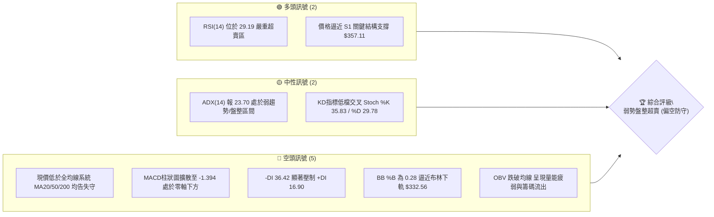
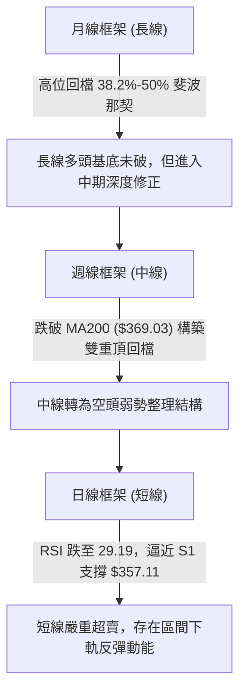
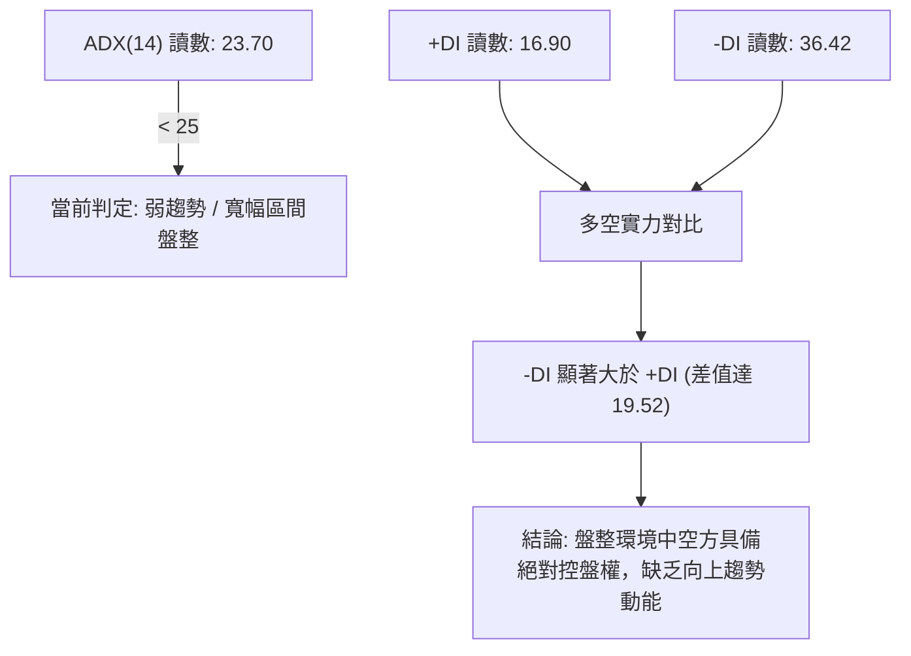
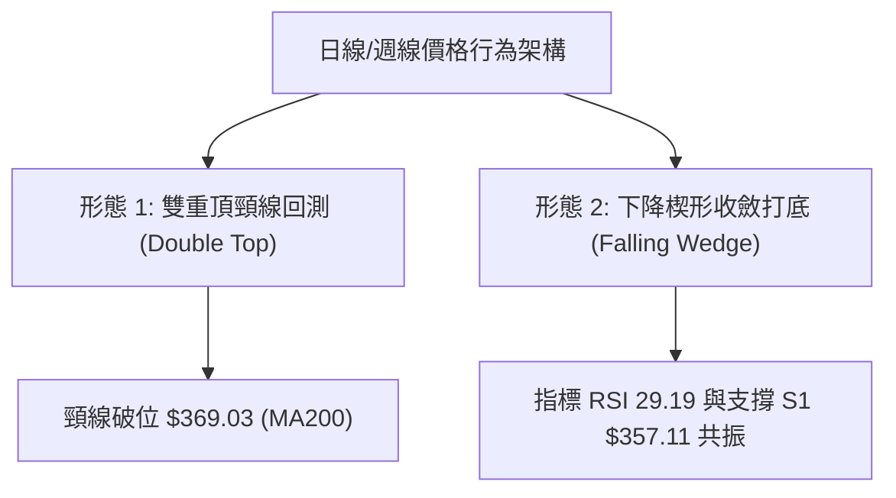
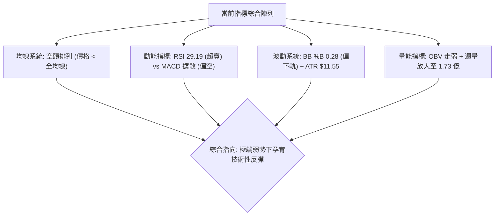
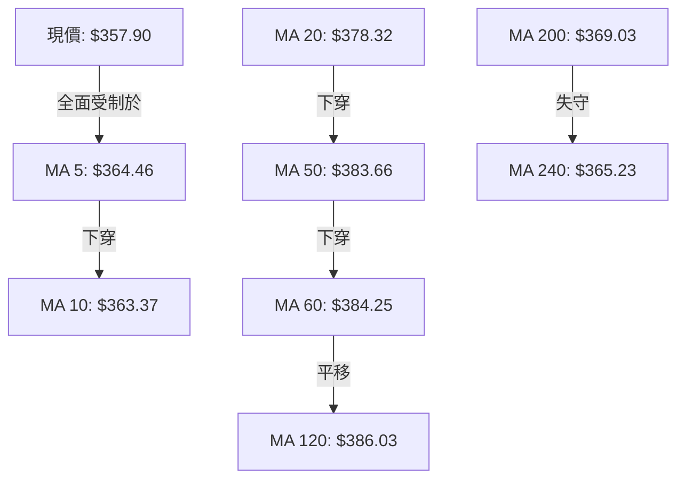
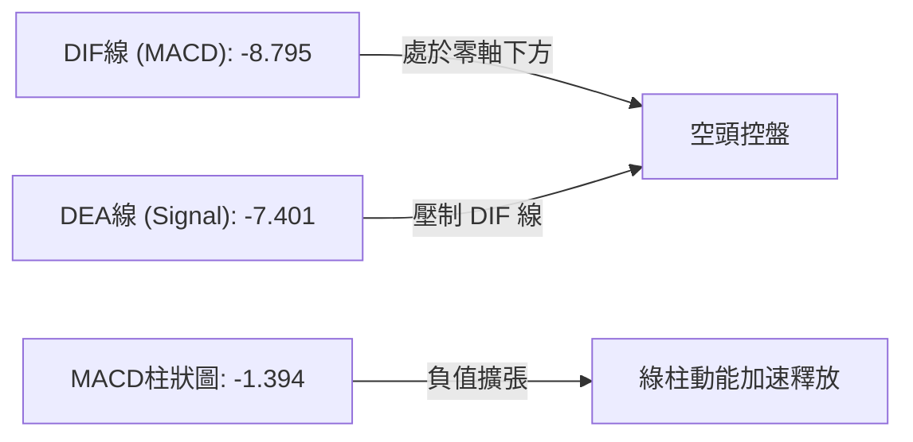
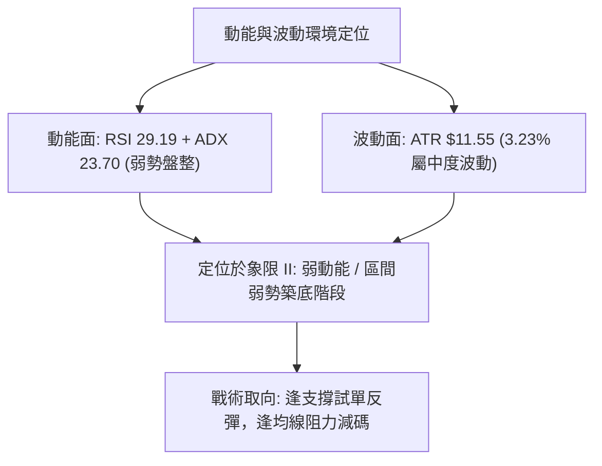
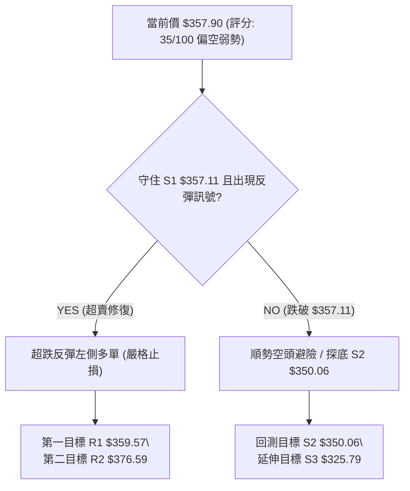
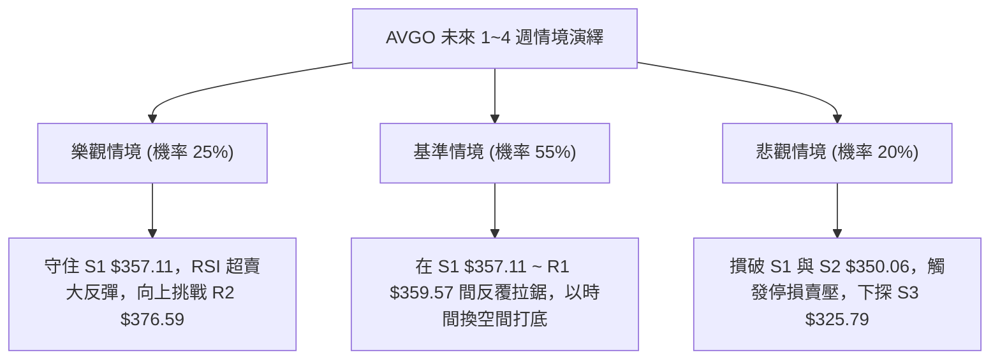

# AVGO 技術分析報告

> **報告日期**：2026-09-05 ｜ **語言**：繁體中文 ｜ **數據來源**：Yahoo Finance ｜ **當前價格**：$357.90

---

## 目錄

| 章節 | 內容 |
|------|------|
| [1. 技術面概覽](#1-技術面概覽) | 訊號儀表板、核心指標、評分卡 |
| [2. 趨勢分析](#2-趨勢分析) | 多時框趨勢、長中短期走勢、ADX解讀 |
| [3. 圖表形態分析](#3-圖表形態分析) | 形態識別、K線組合、目標價推算 |
| [4. 支撐與阻力](#4-支撐與阻力) | 關鍵價位分佈、斐波那契回調結構 |
| [5. 技術指標深度解讀](#5-技術指標深度解讀) | MA系統、RSI、MACD、布林通道、成交量 |
| [6. 動能與波動率](#6-動能與波動率) | 動能四象限、ATR波動率、Beta關聯性 |
| [7. 多時框架總結](#7-多時框架總結) | 多時框矩陣、優先級收斂原則與結論 |
| [8. 交易策略建議](#8-交易策略建議) | 策略路由、情境階梯、交易計劃、評星 |
| [9. 風險提示與監控](#9-風險提示與監控) | 監控清單、極端場景、部位風控紀律 |
| [📋 報告總結](#-報告總結) | 核心技術指標與操作架構一覽表 |

---

## 1. 技術面概覽

### 🎯 技術訊號儀表板



### 📊 核心指標速覽表

| 指標類別 | 指標名稱 | 當前數值 | 訊號 | 解讀 |
|----------|----------|----------|------|------|
| **價格** | 當前價格 | $357.90 | 🔴 | 位於52週區間 33.4%，自歷史高位顯著回吐 |
| **均線** | MA20 | $378.32 | 🔴 | 價格位於 MA20 下方 -5.40%，短線空頭排列 |
| **均線** | MA50 | $383.66 | 🔴 | 價格低於中期生命線，反彈形成首要反壓區 |
| **均線** | MA200 | $369.03 | 🔴 | 跌破牛熊分界線，長期上升多頭結構遭受破壞 |
| **動能** | RSI(14) | 29.19 | 🟢 | 進入極度超賣區（<30），技術性反彈動能蓄積 |
| **動能** | MACD | -8.795 / 柱 -1.394 | 🔴 | 雙線位於零軸之下且負柱狀圖擴張，動能偏空 |
| **擺動** | Stoch %K/%D | 35.83 / 29.78 | 🟡 | 擺動指標低檔金叉初顯，空頭釋放下顯現反彈契機 |
| **趨勢** | ADX / ±DI | 23.70 / -DI: 36.42 | 🔴 | ADX < 25 指向區間無趨勢，但 -DI 壓倒性勝過 +DI |
| **通道** | 布林通道 | %B = 0.28 | 🟡 | 價格運行於下軌 ($332.56) 與中軌 ($378.32) 間 |
| **籌碼** | OBV / 量比 | OBV < MA / 1.40x | 🔴 | 帶量下跌伴隨 OBV 走弱，主動性賣盤主導行情 |
| **波動** | ATR(14) | $11.55 (3.23%) | 🟡 | 日內波動適中，提供明確止損與風控邊界 |

### 🏆 技術評分卡

```
╔══════════════════════════════════════════════════════════════╗
║              技術評分卡 — AVGO (2026-09-05)                   ║
╠══════════════════════════════════════════════════════════════╣
║ 趨勢強度 (Trend)     ██████░░░░░░░░░░░░░░  30/100  🔴 空頭主導  ║
║ 動能指標 (Momentum)  ████████░░░░░░░░░░░░  40/100  🟡 超賣醞釀  ║
║ 支撐穩定度 (Support) ██████████░░░░░░░░░░  50/100  🟡 考驗S1    ║
║ 成交量配合 (Volume)  ██████░░░░░░░░░░░░░░  30/100  🔴 量能背離  ║
║ 形態完整度 (Pattern) ████████░░░░░░░░░░░░  40/100  🟡 區間打底  ║
║ 均線排列 (MA System) ████░░░░░░░░░░░░░░░░  20/100  🔴 空頭壓制  ║
╠══════════════════════════════════════════════════════════════╣
║ 綜合技術評分         ███████░░░░░░░░░░░░░  35/100  🔴 弱勢防守  ║
╚══════════════════════════════════════════════════════════════╝
```

---

## 2. 趨勢分析

### 🌐 多時框趨勢分析



### 📈 長期趨勢 — 12個月走勢圖（Unicode）

以下為 AVGO 過去 12 個月（2025-10 至 2026-09）之月線收盤走勢與關鍵轉折圖：

```
AVGO 月線走勢圖（過去12個月）
價格軸 ($)
$460 ┤                                  ● $446.06 (2026-05 波段次高)
$440 ┤                              
$420 ┤                             ● $416.77
$400 ┤              ● $400.71            
$380 ┤                                      ● $377.75  ● $389.28
$360 ┤        ● $367.57                                    ● $370.34
$340 ┤                    ● $344.83                            ● $357.90 (現價)
$320 ┤                        ● $330.08  ● $318.38
$300 ┤                                      ● $309.02 (2026-03 低點)
     └─────────────────────────────────────────────────────────────
       10    11    12    01    02    03    04    05    06    07    08    09
      2025  2025  2025  2026  2026  2026  2026  2026  2026  2026  2026  2026
```

#### 走勢特徵分析表格

| 階段區間 | 起始價 → 終止價 | 漲跌幅 | 趨勢特徵與結構意涵 |
|----------|----------------|--------|-------------------|
| **第一階段：高檔回調** (2025-10~2026-03) | $367.57 → $309.02 | -15.93% | 自高位回落尋求打底支撐，於 $309.02 成功止跌觸底 |
| **第二階段：主升衝刺** (2026-03~2026-05) | $309.02 → $446.06 | +44.35% | 伴隨 AI 需求催化強勁放量拉升，創下歷史次高收盤 $446.06 |
| **第三階段：回挫整理** (2026-05~2026-07) | $446.06 → $389.28 | -12.73% | 衝高未破歷史極值 $494.22，遭遇獲利了結，回落至 $389.28 |
| **第四階段：破線探底** (2026-07~2026-09) | $389.28 → $357.90 | -8.06% | 跌破關鍵 MA200 反壓，走勢趨緩並逼近 S1 支撐 $357.11 |

### 📊 中期趨勢（週線分析）

中期走勢呈現「高點持續壓低、均線轉向蓋頭」的態勢。近期週線收盤價自 2026-08-09 的 $427.76 連續下挫至當前的 $357.90，累計跌幅達 16.33%。

```
週線價格結構與壓力支撐關係示意圖：
  $427.76 ─────────── 近期反彈波段頂點 (週線頂部)
             ╲
              ╲
  $384.33 ─────*───── R3 強阻力 (斐波那契 50% / MA60 重合區間)
                ╲
  $376.59 ───────*─── R2 阻力 (MA20 均線壓力 $378.32 附近)
                  ╲
  $359.57 ─────────*─ R1 關鍵短壓 (前波平台轉換位)
  ───────────────────
  $357.90 ◄── 現價位置 (考驗 S1 $357.11)
  ───────────────────
  $357.11 ═══════════ S1 近期波段關鍵支撐 (僅差 0.22%)
  $350.06 ─────────── S2 次級強支撐 (整數防線聚類)
  $325.79 ─────────── S3 深幅回撤防線 (近一年低點聚類)
```

### ⚡ 趨勢強度評估（ADX 解讀）



#### ADX 強度與方向矩陣對照

| 參數 | 數值 | 參考標準區間 | 解讀與操作含義 |
|------|------|--------------|----------------|
| **ADX(14)** | 23.70 | < 25 (弱趨勢/盤整) | 缺乏明確的單邊趨勢，切忌追漲殺跌，宜以震盪區間思維操作 |
| **+DI (14)** | 16.90 | > 25 (多頭活躍) | 多頭買盤力道極度疲弱，未形成有效攻擊陣列 |
| **-DI (14)** | 36.42 | > 25 (空頭強勢) | 空頭賣壓沉重，主導盤面波動，反彈易引發解套賣壓 |
| **趨勢判定** | **弱勢盤整** | 空頭壓制型震盪 | 優先依賴日線布林通道與關鍵水平支撐進行區間防守 |

---

## 3. 圖表形態分析

### 🔍 形態識別系統



#### 形態信心度評估表

| 形態類別 | 信心度 | 判斷依據（引用真實數據） | 完成度 | 目標價（精準計算式） |
|----------|--------|--------------------------|--------|----------------------|
| **雙重頂形態** (週線級別) | 70% | 頂部一為 2026-05 收盤 $446.06，頂部二為 2026-08-09 收盤 $427.76；頸線位於波段低點 $368.45 附近，已被有效擊穿。 | 85% | 依形態量度跌幅：頸線 $368.45 - (頂部 $446.06 - 頸線 $368.45 = $77.61) = 理論低點 $290.84，接近 52W 低點 $289.50。 |
| **下降通道/超賣收斂** (日線級別) | 60% | 價格受制於 MA5 ($364.46) 與 MA20 ($378.32)，下探觸及 S1 支撐 $357.11，RSI 跌至 29.19 呈現短線賣壓衰竭。 | 70% | 形態向上反彈目標：填補至通道上沿及 MA20 壓力位，第一目標為 R1 $359.57，第二目標為 R2 $376.59。 |

### 🕯️ 重要K線形態分析

| 週/月份週期 | 收盤價 | K線形態特徵 | 結構技術解讀 | 訊號 |
|-------------|--------|-------------|--------------|------|
| **2026-05-31** | $446.06 | 長上影紡錘陽線 | 衝刺未突破歷史極值 $494.22，多頭動能耗盡之高檔滯漲訊號 | 🔴 |
| **2026-06-07** | $385.12 | 放量大長黑K棒 | 暴量 2.51 億股長黑貫穿短均線，主力機構出貨訊號確立 | 🔴 |
| **2026-08-09** | $427.76 | 次高點假突破十字星 | 反彈至高位放量受阻，確認中期「高點壓低」之弱勢空頭格局 | 🔴 |
| **2026-08-30** | $368.79 | 連續下挫大陰線 | RSI 驟降至 23.5，跌破長期均線 MA200 ($369.03)，空頭全面發動 | 🔴 |
| **2026-09-06** | $357.90 | 帶長下影探底陰線 | 放量至 1.73 億股回測 S1 支撐 $357.11，引發下檔承接買盤初步抵抗 | 🟡 |

### 📉 ASCII 走勢形態示意圖

```
AVGO 日線/週線形態結構示意圖：
$446.06 ──── 頂部1 (2026-05)
             ╲                  $427.76 ──── 頂部2 (2026-08)
              ╲                 ╱      ╲
               ╲  $365.02      ╱        ╲
                ╲ 頸線區域    ╱          ╲
                 *───────────*            ╲
                                           ╲   $369.03 (跌破 MA200 頸線)
                                            ╲ 
                                             *─── $359.57 (短壓 R1)
                                              ╲
                                               ▲ $357.90 (現價 / S1 $357.11 考驗)
                                               │
                                               ▼ $350.06 (潛在回撤支撐 S2)
```

### 🎯 形態目標價計算

根據已確認之雙頂結構破位與日線超賣反彈空間，推導雙向關鍵目標：
1. **下行量度目標**：
   - 中期頸線基準點：$368.45（2026-08-23 週收盤低點）
   - 形態頭部高點：$446.06
   - 形態高度 $H = \$446.06 - \$368.45 = \$77.61$
   - 破位下跌完整目標價 $= \$368.45 - \$77.61 = \$290.84$（高度呼應 52 週最低價 $289.50）。
2. **超賣反彈修復目標**：
   - 支撐基準：S1 $357.11 獲得確認。
   - 短線反彈第一阻力目標（R1）：$359.57。
   - 均線乖離修復波段目標（R2）：$376.59（契合 MA20 壓力位 $378.32）。

---

## 4. 支撐與阻力

### 🗺️ 關鍵價位分布圖（Unicode）

```
AVGO 價位結構分布圖
═══════════════════════════════════════════════════════════════
$384.33 ║████████████████████████████║ 強阻力 R3 (斐波 50% 反壓)
$376.59 ║████████████████████        ║ 阻力 R2 (MA20 均線重壓位)
$359.57 ║████████████                ║ 關鍵阻力 R1 (短線突破點)
$357.90 ╠════════════════════════════╣ ◄ 現價位置 ($357.90)
$357.11 ║▓▓▓▓▓▓▓▓▓▓▓▓▓▓▓▓▓▓▓▓▓▓▓▓▓▓▓▓║ 近期支撐 S1 (距現價 -0.22%)
$350.06 ║████████████████████        ║ 強支撐 S2 (整數波段防線)
$325.79 ║████████████████████████████║ 核心深幅支撐 S3 (年線支撐)
═══════════════════════════════════════════════════════════════
```

### 🚧 阻力位分析表

| 阻力級別 | 具體價位 | 形成技術依據（嚴格引用已知數據） | 突破難度 | 重要性等級 |
|----------|----------|----------------------------------|----------|------------|
| **R1** | $359.57 | 近一年波段高點聚類位，距離現價僅 +0.47%，為日內與短線首道套牢解套關卡。 | 低至中等 | 🟡 次要（短線分水嶺） |
| **R2** | $376.59 | 緊鄰日線 MA20 下降反壓線 ($378.32)，也是前期成交密集換手區。 | 高 | 🔴 極重要（中期多空線） |
| **R3** | $384.33 | 契合斐波那契 50.0% 回調位 ($391.86) 與 MA50 ($383.66)/MA60 ($384.25)。 | 極高 | 🔴 強阻力（強轉弱起跌點） |

### 🛡️ 支撐位分析表

| 支撐級別 | 具體價位 | 形成技術依據（嚴格引用已知數據） | 守住機率 | 重要性等級 |
|----------|----------|----------------------------------|----------|------------|
| **S1** | $357.11 | 近一年波段低點聚類核心，距離現價僅 -0.22%，多頭超賣防守第一線。 | 55% | 🟡 重要（短線命脈） |
| **S2** | $350.06 | 心理整數大關及近一年波段次級密集支撐，下檔流動性緩衝區。 | 65% | 🟢 極重要（波段防禦底線） |
| **S3** | $325.79 | 近一年波段極端低點聚類，接近斐波那契 78.6% 回調位 ($333.31) 與布林下軌。 | 80% | 🟢 終極防線（多頭最後堡壘） |

### 📐 斐波那契回調位分析

依據 52 週波動區間 $289.50（52W Low）至 $494.22（52W High），精算斐波那契關鍵黃金分割位：

```
$494.22 ── 0.0%   (52W High 歷史頂峰)
$445.90 ── 23.6%  (波段強勢高位整理線，2026-05 高點落於此)
$416.02 ── 38.2%  (多空強弱分水嶺，失守後轉入弱勢)
$391.86 ── 50.0%  (中軸平衡位，反彈核心反壓)
$367.70 ── 61.8%  (黃金分割防守位，當前價格已跌破)
$357.90 ── [現價]  位於 61.8% ($367.70) 與 78.6% ($333.31) 之間
$333.31 ── 78.6%  (深幅回撤極限支撐，接近布林下軌 $332.56)
$289.50 ── 100.0% (52W Low 基準底部)
```

#### 結構解讀
- **位階意涵**：現價 $357.90 已有效擊穿 61.8% 黃金分割回調支撐線 ($367.70)，正式進入「深幅回撤區間」（61.8% ~ 78.6%）。
- **當前落點**：價格夾在 $367.70 與 $333.31 之間。若跌破波段低點聚類 S1 $357.11 及 S2 $350.06，行情將加速回測斐波那契 78.6% 回調位 $333.31。

---

## 5. 技術指標深度解讀

### 🎛️ 指標訊號總覽



### 📈 移動平均線排列分析



#### 均線各週期狀態數據表

| 均線名稱 | 當前價格 | 與現價乖離 | 走勢趨向 | 技術狀態與涵義 |
|----------|----------|------------|----------|----------------|
| **MA 5** | $364.46 | -1.80% | ▼ 下行 | 極短線空頭下壓線，反彈首要面臨之動態壓制 |
| **MA 10** | $363.37 | -1.51% | ▼ 下行 | 短線追空成本位，壓制短多反抗 |
| **MA 20** | $378.32 | -5.40% | ▼ 下行 | 月線趨勢轉空，為中短線主要下降壓力軌道 |
| **MA 50** | $383.66 | -6.71% | ▼ 下行 | 中期生命線已實質告破，轉為強固壓力牆 |
| **MA 60** | $384.25 | -6.86% | ▼ 下行 | 季線下移，與 R3 $384.33 形成共振強阻力 |
| **MA 120** | $386.03 | -7.29% | ▲ 平緩 | 半年線位於高位鈍化，中期頭部壓頂結構明確 |
| **MA 200** | $369.03 | -3.02% | ▼ 跌破 | 象徵長期牛熊分水嶺失守，長線多頭趨勢受損 |
| **MA 240** | $365.23 | -2.01% | ▼ 跌破 | 年線防線被摜破，整體架構轉為弱勢修復週期 |

### 📉 RSI(14) 分析

- **當前數值**：**29.19**（正式跌破 30 超賣門檻）。
- **指標進度條**：
  ```
  RSI(14): [██████░░░░░░░░░░░░░░] 29.19% (極度超賣)
  0       20      30             50             70      100
  ├───────┴───────┼──────────────┼──────────────┴───────┤
  │    嚴重超賣   │    中性偏弱  │   強勢區     │ 超買 │
  ```
- **背離分析判斷**：
  - **日線/週線背離檢驗**：觀察近 3 週收盤走勢，2026-08-23 收盤 $368.45（RSI 39.2），2026-08-30 收盤 $368.79（RSI 23.5），2026-09-06 現價 $357.90（RSI 29.2）。
  - **結論**：價格創近幾個月新低（$357.90），而 RSI 數值（29.2）高於前一週低點（23.5），**日線級別呈現潛在底背離（Bullish Divergence）雛形**。但由於當前未收復 MA5 ($364.46)，背離尚未被價格結構實質確認，僅為潛在超賣反彈訊號。

### 📊 MACD(12/26/9) 訊號解讀



- **柱狀圖結構**：MACD 線 (-8.795) 運行於訊號線 (-7.401) 下方，Hist 柱狀圖讀數為 **-1.394**，綠柱仍處於負向發散狀態，尚未收斂。空頭主動動能依然佔據優勢，左側進場風險偏高，宜靜待柱狀圖縮腳。

### 📦 布林通道分析

```
AVGO 布林通道走勢位置圖：
$424.09 ─────────────────────────────────────── 上軌 (Upper Band)
                     │
                     │
$378.32 ─────────────────────────────────────── 中軌 / MA20 (Middle Band)
                     │
                     │  ◄── %B = 0.28 (弱勢下行區)
$357.90 ═════════════*═════════════════════════ 現價位置
                     │
$332.56 ─────────────────────────────────────── 下軌 (Lower Band)
```

- **布林參數狀態**：
  - BB 上軌：$424.09
  - BB 中軌（MA20）：$378.32
  - BB 下軌：$332.56
  - **BB %B = 0.28**：價格位於下軌與中軌之間的偏低位置，且通道呈現向外開口發散跡象，反映下行趨勢正在展開。若價格有效擊穿 S1 $357.11，則有進一步沿下軌尋求 $332.56 支撐的風險。

### 💹 成交量分析（量價配合度）

- **最新成交量**：32,773,600 股。
- **20日均量**：23,452,570 股（**量比 1.40x**，明顯放量）。
- **週級別成交量**：當週放量至 173,127,700 股，為近兩個月來最大量。
- **量價特徵評估**：
  - **量增價跌**：本週放量至 1.73 億股收黑陰線，且日成交量達 20 日均量的 1.4 倍，確認此波下挫為主動性機構籌碼釋出所致。
  - **OBV 能量潮**：當前 OBV 數值低於其均線（OBV < MA），未見資金逆勢建倉痕跡，量能對價格的反彈缺乏實質支撐，量價結構仍處弱勢格局。

---

## 6. 動能與波動率

### ⚡ 動能評估四象限

| 象限標識 | 動能強度 (Momentum) | 波動率狀態 (Volatility) | 標的所屬狀態 | 策略處置含義 |
|----------|---------------------|-------------------------|--------------|--------------|
| **象限 I** | 強動能 (多頭強勢) | 低波動 (溫和上漲) | ── | 穩健持股波段做多 |
| **象限 II** | 弱動能 (空頭超賣) | 低/中波動 (ATR 3.23%) | **✓ AVGO 當前定位** | **超跌盤整、防禦觀察、忌盲目追空** |
| **象限 III** | 強動能 (爆發突破) | 高波動 (急劇拉升) | ── | 突破追隨順勢操作 |
| **象限 IV** | 弱動能 (崩跌潰敗) | 高波動 (恐慌拋售) | ── | 嚴格止損、防範流動性踩踏 |



### 📊 ATR 波動率分析

- **ATR(14) 絕對值**：**$11.55**。
- **ATR 波動百分比**：**3.23%**。
- **交易風控意涵**：
  - AVGO 當前平均每日波幅約為 $11.55。
  - **常規止損距離**：短線防守應設定在 1.0~1.5 倍 ATR（即 $11.55 ~ $17.32 區間）。
  - 若在現價 $357.90 建立超賣反彈多單，防守止損位不得低於 $357.90 - $11.55 = $346.35，此價位與關鍵支撐 S2 $350.06 形成有效保護層。

### 📐 Beta 與市場相關性

- **Beta 係數**：**1.457**。
- **市場特徵解析**：
  - AVGO 具備高彈性（高 Beta）科技半導體屬性，相較標普 500 指數具備 1.457 倍的波動放大倍數。
  - 當大盤科技類股出現回調時，AVGO 跌幅往往擴大；相對地，一旦大盤出現修復性反彈，其超賣特性（RSI 29.19）將賦予其更高的上攻彈性。

---

## 7. 多時框架總結

### 📋 時框架評分表

| 時框架 | 趨勢方向 | 動能狀態 | 均線排列 | 關鍵圖表形態 | 綜合評分 | 操作指導建議 |
|--------|----------|----------|----------|--------------|----------|--------------|
| **月線 (長期)** | 🟡 中性偏多 | 動能趨緩 | 位於 MA240 之上 | 長期主升浪拉回 50% 整理 | **55/100** | 長期底倉觀望，防守 $333.31 |
| **週線 (中期)** | 🔴 明確看空 | 空方主導 | 跌破 MA200 | 雙重頂破位，頸線承壓 | **30/100** | 逢反彈減碼，暫不開大部位波段多 |
| **日線 (短期)** | 🟡 超賣盤整 | 極端超賣 | 空頭下壓排列 | 逼近 S1 支撐，孕育底背離 | **40/100** | 嚴設止損，可小倉位博取反彈 |

### 🔲 綜合訊號矩陣

```
時框訊號一致性矩陣分析：
┌──────────────┬──────────────┬──────────────┬──────────────┐
│ 分析維度     │ 短期 (日線)  │ 中期 (週線)  │ 長期 (月線)  │
├──────────────┼──────────────┼──────────────┼──────────────┤
│ 趨勢方向     │ 🔴 跌破均線  │ 🔴 破位下行  │ 🟡 斐波回撤  │
│ 動能 (RSI)   │ 🟢 超賣蓄勢  │ 🔴 中性偏弱  │ 🟡 高位回調  │
│ 均線系統     │ 🔴 空頭壓制  │ 🔴 跌破MA200 │ 🟢 守住MA240 │
│ 成交量能     │ 🔴 增量走跌  │ 🔴 週量擴大  │ 🟡 均量平穩  │
│ 形態訊號     │ 🟢 考驗S1支撐│ 🔴 雙頂成形  │ 🟢 底部墊高  │
└──────────────┴──────────────┴──────────────┴──────────────┘
訊號一致性評級：🔴 中短期偏空共振，但短線出現極端超賣鈍化。
```

### ⚖️ 多時框收斂結論

依據多時框收斂規則：
1. **行情性質判定**：當前 ADX(14) 讀數為 **23.70**（< 25），依規則嚴格定義為**「盤整行情 / 缺乏單邊強趨勢」**。
2. **主導時框收斂**：在 ADX < 25 的盤整環境下，交易邊界應以**日線布林通道上下軌 ($332.56 ~ $424.09) 及波段支撐阻力為核心交易區間**，而非盲目採用順勢單邊突破策略。
3. **最終唯一收斂結論**：**【中性偏空防守，短線區間超賣博反彈】**。
   - 中長期週線趨勢雖然偏空（跌破 MA200 $369.03），但由於日線 RSI 已下探至 29.19，且價格緊貼關鍵低點聚類 S1 $357.11（相距僅 0.22%），空頭風險收益比已大幅降低。
   - 主策略定調為：**空頭格局下的超跌區間反彈防禦操作（主策略走向依評分分流）**。

---

## 8. 交易策略建議

### 🗺️ 策略決策流程圖



### 🧭 策略路由（依評分卡分流）

> **當前主策略方向 = 【綜合評分偏空（35/100），以空頭防守及順勢避險為主策略，多頭僅限於超賣邊界的極短線波段防禦】**

### 🎯 價格情境階梯（Price Scenarios）

| 觸發條件 | 下一目標價 | 後續延伸位 | 技術情境結構含義 |
|----------|------------|------------|------------------|
| **突破 R1 $359.57** | R2 $376.59 | R3 $384.33 | 突破短線降頻均線，確認日線超賣反彈，回測布林中軌。 |
| **守住 S1 $357.11** | R1 $359.57 | R2 $376.59 | 獲得波段低點支撐，展開 $357.11 ~ $376.59 區間震盪整理。 |
| **跌破 S1 $357.11** | S2 $350.06 | S3 $325.79 | 空頭擴散，下探整數關卡 S2 及布林下軌/年線支撐位。 |

### 📊 情境機率分佈

| 運行情境 | 發生機率 | 主要判定技術依據（引用指標狀態） |
|----------|----------|----------------------------------|
| **情境一：超跌修復反彈** | **35%** | RSI 達 29.19 極端超賣；Stoch 於低檔交叉；現價緊貼波段低點支撐 S1 $357.11。 |
| **情境二：窄幅區間震盪** | **45%** | ADX 23.70 指向盤整格局；多空於 $350.06 ~ $369.03 之間拉鋸換手築底。 |
| **情境三：破位加速下探** | **20%** | MACD 綠柱擴張 (-1.394)；-DI (36.42) 壓制；量能放大且 OBV 跌破均線。 |

### 🔴 主策略詳情（弱勢防守與避險空頭）

由於綜合評分僅 35/100，技術架構全面受制於均線，因此將**破位空頭（或反彈高空）**列為主要標準策略，將超賣短多列為輔助交易方案：

| 交易策略要素 | 策略 A（主力：逢反彈遇阻做空 / 避險） | 策略 B（輔助：S1 支撐超賣試單博反彈） |
|--------------|--------------------------------------|--------------------------------------|
| **交易方向** | 🔴 逢高做空 (Sell Short) | 🟢 超跌反彈做多 (Tactical Long) |
| **進場條件** | 反彈至阻力位承壓收上影線確認 | 價格回測 S1 守穩且 15分K 收陽線 |
| **進場價格** | **$376.59**（R2 阻力位） | **$357.90**（現價 / S1 $357.11 附近） |
| **目標價 T1** | **$359.57**（短線回調目標） | **$369.03**（MA200 頸線位置） |
| **目標價 T2** | **$350.06**（S2 波段支撐目標） | **$376.59**（R2 均線重壓位） |
| **止損價格** | **$384.33**（突破 R3 強阻力止損） | **$350.06**（實體跌破 S2 強制止損） |
| **風險報酬比** | **3.43 : 1** (風險 $7.74 vs 報酬 $26.53) | **2.38 : 1** (風險 $7.84 vs 報酬 $18.69) |
| **勝率評估** | 65% (順中期趨勢) | 45% (逆勢博短線超賣) |
| **建議倉位** | 15% ~ 20% (標準空頭部位) | 5% ~ 10% (嚴格輕倉防守) |

### 🟢 反向風險觸發點（對沖提示）

- **多頭轉強確認點**：若日線放量強勢收盤**站穩 R2 $376.59 及 MA20 ($378.32)**，宣告中期空頭壓制遭到瓦解，此時所有空頭避險單必須無條件平倉退場。
- **極端下行風控點**：若直接帶量摜破 **S2 $350.06**，多頭防禦完全失效，行情恐迅速奔向斐波那契 78.6% 回調位 $333.31 及 S3 $325.79。

### ⭐ 整體訊號強度評星

```
做多訊號強度：★★☆☆☆  (2/5星 — 僅具備超賣反彈價值，無趨勢配合)
做空訊號強度：★★★★☆  (4/5星 — 均線與 MACD 全面看空，順應中期趨勢)
整體可信度：  ★★★☆☆  (3/5星 — 受制於 ADX < 25，單邊動能存在變數)
```

---

## 9. 風險提示與監控

### ✅ 關鍵監控指標 Checklist

```
╔══════════════════════════════════════════════════════════════╗
║              AVGO 每日技術監控 Checklist                     ║
╠══════════════════════════════════════════════════════════════╣
║ [ ] 價格是否跌破支撐位 S1 ($357.11)？ (跌破啟動向下加速風險)   ║
║ [ ] RSI(14) 是否脫離超賣區回升至 35 以上？ (反彈動能確認)     ║
║ [ ] MACD 柱狀圖是否收斂至 -0.50 以上？ (綠柱縮腳即空頭減弱)    ║
║ [ ] 日成交量是否萎縮至 20日均量 ($23.45M) 以下？ (賣壓衰竭)   ║
║ [ ] 收盤價是否突破首道反壓 R1 ($359.57)？ (短線轉強訊號)       ║
║ [ ] ADX(14) 是否向上突破 25？ (確認單邊行情正式爆發)          ║
╚══════════════════════════════════════════════════════════════╝
```

### ⚠️ 風險場景分析



### 🛡️ 風險管理重要提醒

1. **ATR 浮動止損紀律**：
   - 當前 ATR 為 **$11.55**，日內波動較大。無論執行任何多空策略，單筆進場之止損防守寬度切勿低於 1.0 倍 ATR（$11.55），避免遭到盤中隨機雜訊洗盤出場。
2. **籌碼高集中度風險**：
   - 機構持股比例高達 **80.1%**。近期日量放大（量比 1.40x）反映機構調倉操作頻繁。跌破 MA200 後，須提防量化基金與被動型 ETF 的連鎖被動拋售賣壓。
3. **部位規模控管守則**：
   - 在 ADX < 25 且均線全面下行的逆風環境中，總部位曝險比例不得超過投資組合總資金的 **15%**。切勿在跌破 S1 $357.11 時進行逆勢攤平。

---

## 📋 報告總結

```
╔══════════════════════════════════════════════════════════════╗
║                 AVGO 技術分析報告總結                         ║
╠══════════════════════════════════════════════════════════════╣
║ 報告日期：2026-09-05                                         ║
║ 當前價格：$357.90                                             ║
║ 分析評級：⚖️ 弱勢超賣區間整理（中線偏空，短線尋求支撐）        ║
╠══════════════════════════════════════════════════════════════╣
║ 關鍵結論：                                                   ║
║ ├─ 長期趨勢：🟡 中性整理（跌破斐波那契 61.8% $367.70）        ║
║ ├─ 中期趨勢：🔴 空頭主導（週線雙頂成形，跌破 MA200 $369.03） ║
║ ├─ 短期趨勢：🟡 極度超賣（RSI 29.19 逼近 S1 支撐 $357.11）    ║
║ ├─ 關鍵支撐：S1 $357.11 ｜ S2 $350.06 ｜ S3 $325.79         ║
║ ├─ 關鍵阻力：R1 $359.57 ｜ R2 $376.59 ｜ R3 $384.33         ║
║ └─ 分析師目標均價：$533.41 (基本面共識與技術走勢呈現嚴重背離) ║
╠══════════════════════════════════════════════════════════════╣
║ 最優策略組合：                                               ║
║ 1. 🥇 最佳機會（順勢防禦）：反彈至 R2 $376.59 遇阻佈局空單， ║
║    目標 S1 $359.57 / S2 $350.06，止損設 R3 $384.33。         ║
║ 2. 🥈 次選機會（超賣博弈）：現價 $357.90 小倉位博弈反彈，     ║
║    目標 R1 $359.57 / MA200 $369.03，嚴格止損 $350.06。       ║
║ 3. 🥉 保守選擇（空手觀望）：耐心等待行情明確跌破 S1 或有效   ║
║    收復 R2 $376.59 之後，再依據確認訊號進場。                ║
╚══════════════════════════════════════════════════════════════╝
```

---

> ⚠️ **免責聲明**：本報告為 AI 自動生成之技術分析，所有數據及估算均基於提供的歷史價格資訊。本報告**僅供研究與學術參考**，**不構成任何投資建議**。投資有風險，入市需謹慎。

---

*報告生成時間：2026-09-05 ｜ 數據來源：Yahoo Finance ｜ 分析框架：多時框技術分析*