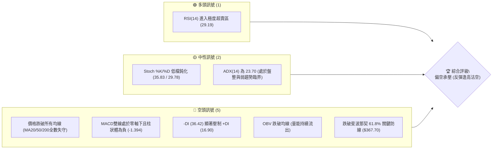
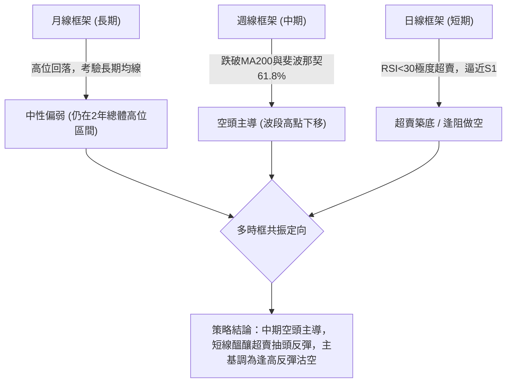
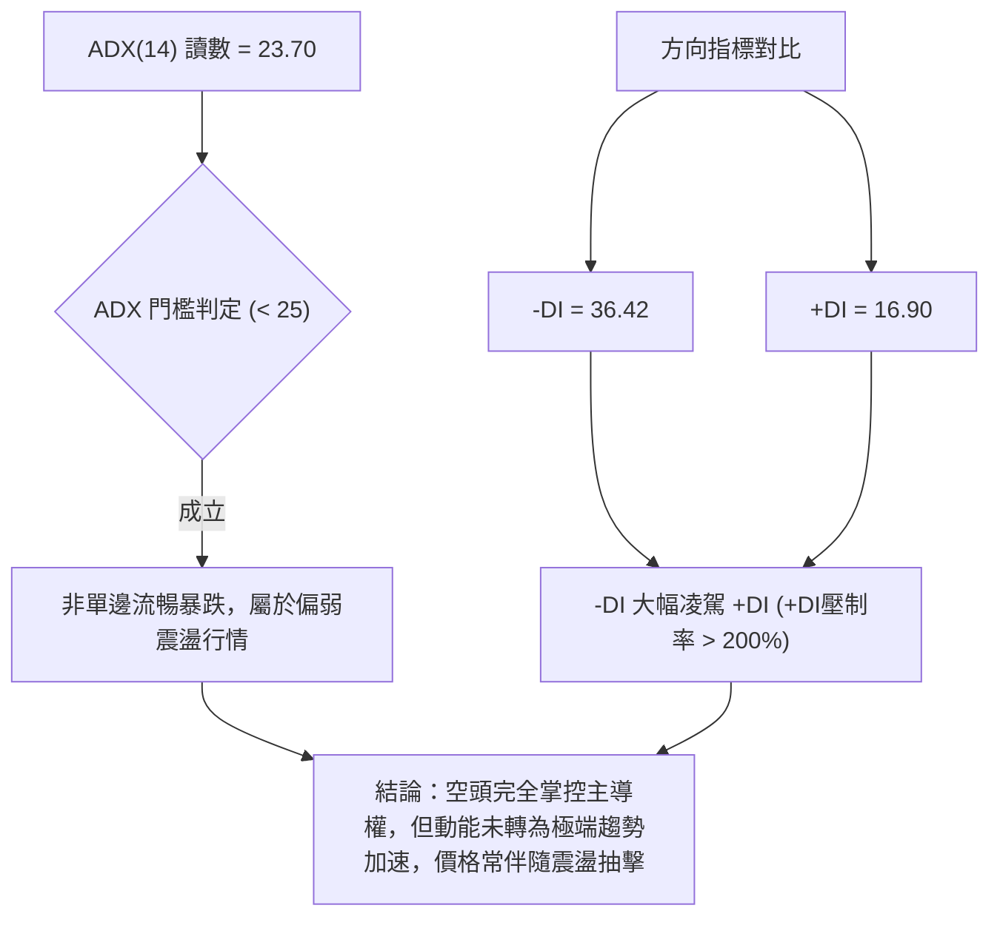
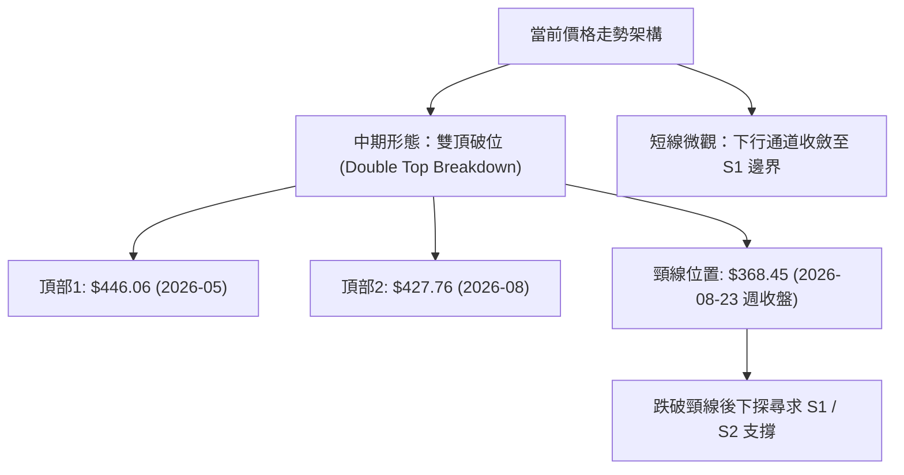
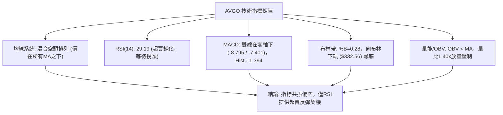
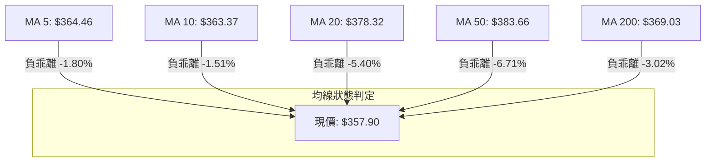
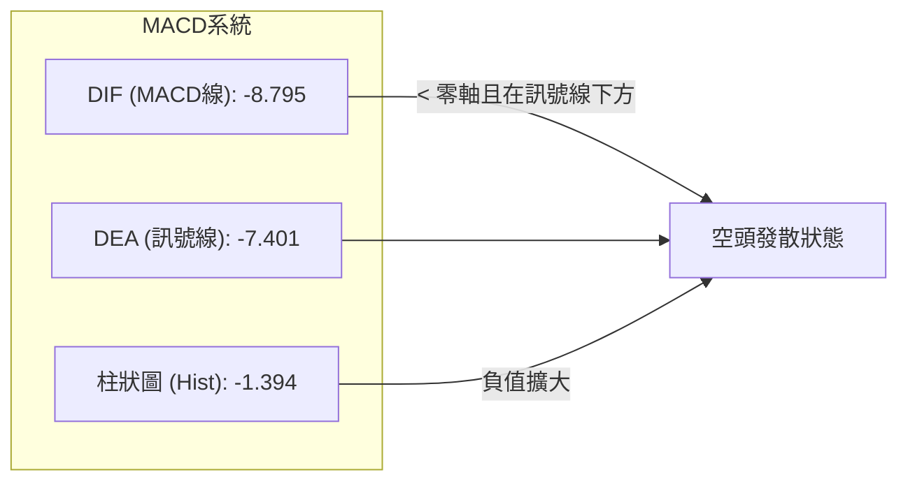
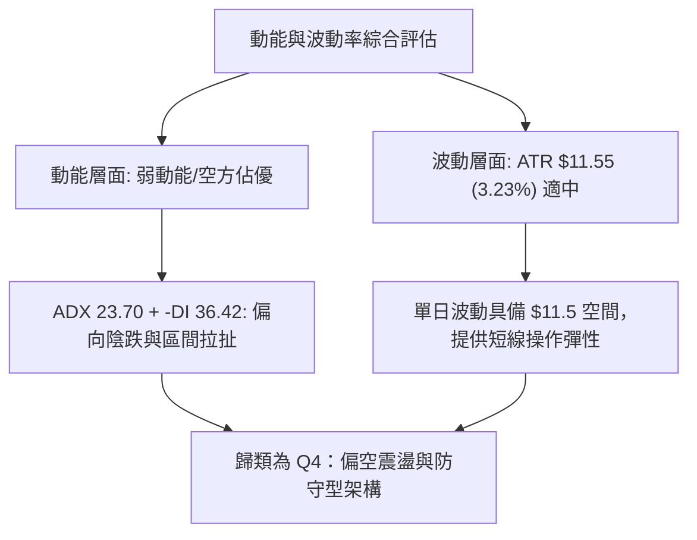
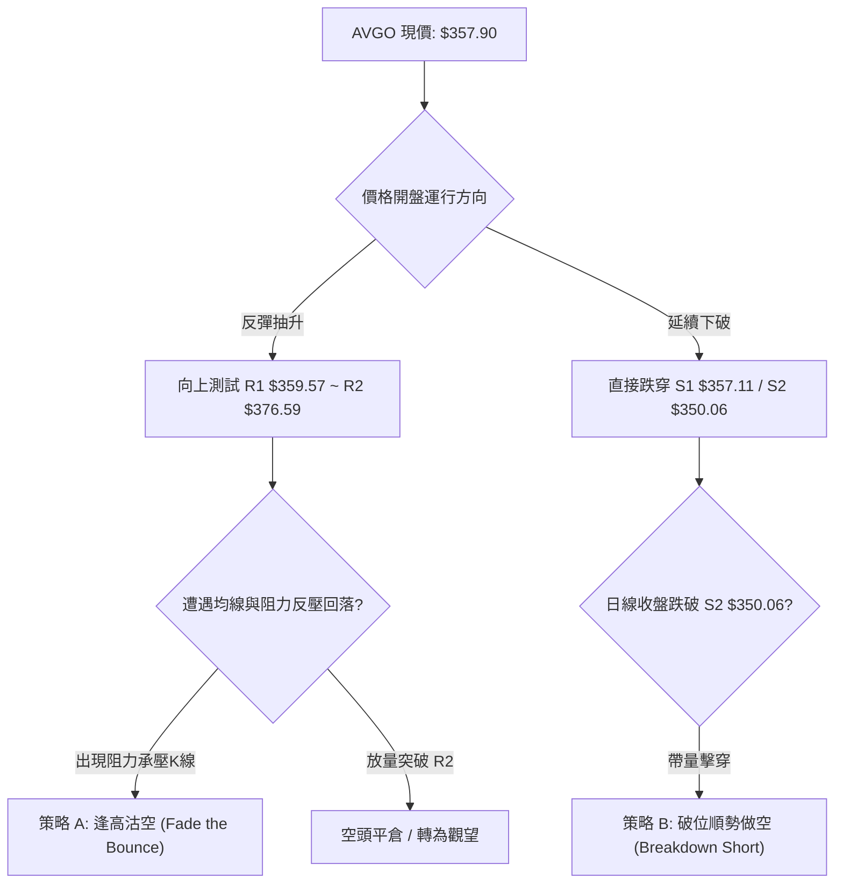
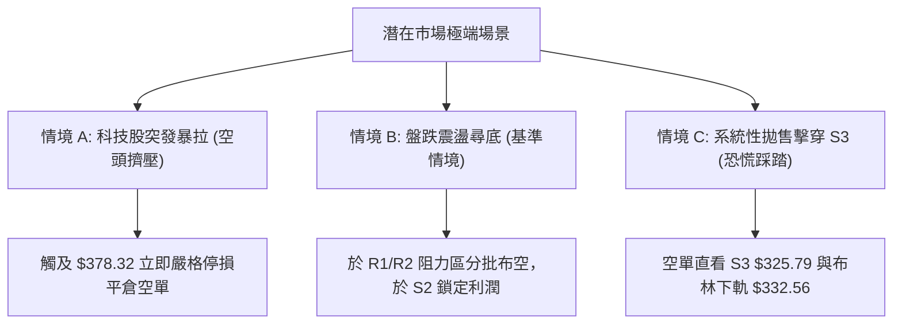

# AVGO 技術分析報告

> **報告日期**：2026-09-06 ｜ **語言**：繁體中文 ｜ **數據來源**：Yahoo Finance ｜ **當前價格**：$357.90

---

## 目錄

| 章節 | 內容 |
|------|------|
| [1. 技術面概覽](#1-技術面概覽) | 訊號儀表板、核心指標、評分卡 |
| [2. 趨勢分析](#2-趨勢分析) | 多時框趨勢、長中短期走勢、ADX解讀 |
| [3. 圖表形態分析](#3-圖表形態分析) | 形態識別、K線組合、形態信心度與目標價 |
| [4. 支撐與阻力](#4-支撐與阻力) | 關鍵價位結構、斐波那契回調區間 |
| [5. 技術指標深度解讀](#5-技術指標深度解讀) | 均線系統、RSI、MACD、布林通道、量能分析 |
| [6. 動能與波動率](#6-動能與波動率) | 動能四象限、ATR波動度、Beta分析 |
| [7. 多時框架總結](#7-多時框架總結) | 時框架矩陣、多時框收斂定調 |
| [8. 交易策略建議](#8-交易策略建議) | 策略路由、情境階梯、精確交易計劃 |
| [9. 風險提示與監控](#9-風險提示與監控) | 關鍵檢核清單、情境模擬、風控指引 |

---

## 1. 技術面概覽

### 🎯 技術訊號儀表板



### 📊 核心指標速覽表

| 指標類別 | 指標名稱 | 當前數值 | 訊號 | 解讀 |
|----------|----------|----------|------|------|
| **價格** | 當前價格 | $357.90 | 🔴 | 位於52週區間 33.4% 低分位，面臨下行尋底壓力 |
| **均線** | MA20 | $378.32 | 🔴 | 價格低於MA20達 -5.40%，短期下行趨勢顯著 |
| **均線** | MA50 | $383.66 | 🔴 | 價格顯著受制於中期均線，形成密集蓋頭反壓 |
| **均線** | MA200 | $369.03 | 🔴 | 跌破牛熊分界線 MA200 (-3.02%)，長期架構轉弱 |
| **動能** | RSI(14) | 29.19 | 🟢 | 跌破30進入超賣區，具技術性超賣反彈修復需求 |
| **動能** | MACD | -8.795 | 🔴 | 快慢線雙雙深陷負值區，柱狀體 -1.394 空頭主導 |
| **波動** | ATR(14) | $11.55 | 🟡 | 每日平均波動幅度達 3.23%，波動適中但須防擴大 |
| **趨勢** | ADX(14) | 23.70 | 🟡 | ADX < 25 指示非單邊暴跌，而是偏弱的震盪下行 |
| **成交量** | 量比 (Volume) | 1.40x | 🔴 | 最新量 32.77M 高於20日均量 23.45M，帶量下挫 |

### 🏆 技術評分卡

```
╔══════════════════════════════════════════════════════════════════╗
║                   技術評分卡 — AVGO (2026-09-06)                 ║
╠══════════════════════════════════════════════════════════════════╣
║ 趨勢強度 (Trend)     ██████░░░░░░░░░░░░░░  30/100  🔴 空頭壓制   ║
║ 動能指標 (Momentum)  ████████░░░░░░░░░░░░  40/100  🟡 超賣醞釀   ║
║ 支撐穩定度 (Support) ██████░░░░░░░░░░░░░░  30/100  🔴 考驗S1/S2  ║
║ 成交量配合 (Volume)  ████████░░░░░░░░░░░░  40/100  🔴 帶量下殺   ║
║ 形態完整度 (Pattern) ████████░░░░░░░░░░░░  40/100  🔴 破位結構   ║
║ 均線排列 (MAs)       ████░░░░░░░░░░░░░░░░  20/100  🔴 空頭排列   ║
╠══════════════════════════════════════════════════════════════════╣
║ 綜合評分             ███████░░░░░░░░░░░░░  36/100  🔴 偏空承壓   ║
╚══════════════════════════════════════════════════════════════════╝
```

---

## 2. 趨勢分析

### 🌐 多時框趨勢分析



### 📈 長期趨勢 — 12個月走勢圖（Unicode）

AVGO 過去一年歷經了從 2025 年秋季的主升浪、高位回調、2026 年春季的暴衝新高（最高達 $494.22，月收盤 $446.06），再到近期震盪重挫的完整週期。

```
AVGO 月線走勢圖（過去12個月：2025-10 至 2026-09）
價格軸 ($)
$450 ┤                                      ● (05月 $446.06)
$420 ┤                              ● (04月)
$390 ┤                                              ● (07月 $389.28)
$360 ┤● (10月)                      │       ● (06月)        ● (08月)
$330 ┤        ● (12月)      ● (01月)│                               ● (現在 $357.90)
$300 ┤              ●(03月 $309.02) ┘
     └─────────────────────────────────────────────────────────────
       10    11    12    01    02    03    04    05    06    07    08    09
      2025                                2026
```

#### 走勢特徵分析表格

| 階段區間 | 時間週期 | 價格區間 | 漲跌幅度 | 核心特徵與形態解讀 |
|----------|----------|----------|----------|-------------------|
| **第一階段：高位修正** | 2025.10 - 2026.03 | $400.71 → $309.02 | -22.88% | 獲利了結盤湧現，形成下行收斂，於 $309.02 見波段中期底 |
| **第二階段：主升暴衝** | 2026.03 - 2026.05 | $309.02 → $446.06 | +44.35% | AI 需求爆發驅動急速噴出，月收盤創 $446.06（盤中歷史高 $494.22） |
| **第三階段：頭部回落** | 2026.05 - 2026.07 | $446.06 → $360.45 | -19.19% | 巨量見頂，6月單週成交量暴增至 2.51億股，主力高檔派發 |
| **第四階段：破位尋底** | 2026.08 - 2026.09 | $427.76 → $357.90 | -16.33% | 次高點反彈夭折，週線連跌破位，現價 $357.90 瀕臨支撐考驗 |

### 📊 中期趨勢（週線分析）

從近 20 週數據觀察，AVGO 呈現典型的「高檔雙頂派發」後跌破頸線格局：
1. **第一次高點**：2026-05-31 週收盤 $446.06（盤中衝擊 52W 高點 $494.22）。
2. **中期回調低點**：2026-07-05 週收盤 $360.45。
3. **第二次反彈高點**：2026-08-09 週收盤 $427.76，量能僅 92.36M，呈現嚴重量價背離。
4. **當前破位確認**：自 8 月中旬起連續四週下挫，最新一週（2026-09-06）成交量擴大至 173.13M，收盤報 $357.90，直接貫穿前波回調低點聚類。

```
週線級別支撐阻力結構示意圖：
[阻力 R3] ── $384.33 (MA50 / 60日均線反壓區)
[阻力 R2] ── $376.59 (近一年波段密集高點 / BB中軌)
[阻力 R1] ── $359.57 (近端跳空下邊界)
───────────────────────────── 現價: $357.90 ──
[支撐 S1] ── $357.11 (近一年波段低點聚類，僅距現價 -0.22%)
[支撐 S2] ── $350.06 (整數關卡重要心理防線)
[支撐 S3] ── $325.79 (長期深層量能沉澱區)
```

### ⚡ 趨勢強度評估（ADX 解讀）



#### ADX 強度對照表

| 指標項目 | 數值 | 狀態等級 | 實戰交易含義 |
|----------|------|----------|--------------|
| **ADX(14)** | 23.70 | 弱趨勢 / 盤整區間 (< 25) | 行情並非單邊無序宣洩，操作切忌於低位過度追空，容易引發劇烈震盪侵蝕成本 |
| **+DI (14)** | 16.90 | 極度萎縮 | 多方反擊動能渙散，缺乏主動買盤介入 |
| **-DI (14)** | 36.42 | 空方高度主導 | 空頭力量佔據絕對優勢，反彈極易遭受賣壓覆蓋 |
| **趨勢綜合性** | 空方控盤 | 震盪偏空架構 | **遵循規則14**：以日線布林通道 ($332.56 - $424.09) 及水平關鍵位作為區間邊界參考 |

---

## 3. 圖表形態分析

### 🔍 形態識別系統



#### 形態信心度評估表（依規則 15）

| 識別形態 | 信心度 | 判斷依據（嚴格引用數據） | 完成度 | 目標價（附嚴格計算式） |
|----------|--------|--------------------------|--------|------------------------|
| **中期雙重頂 (Double Top)** | **75%** | 兩次波段高點分別為 2026-05 之 $446.06 與 2026-08 之 $427.76；頸線取 2026-08-23 週收盤 $368.45，目前現價 $357.90 已收於頸線下方。 | **90%** (已跌破頸線，正進行下行映射) | **理論目標價：$309.14**<br>計算式：頸線 $368.45 - 形態高度 ($427.76 - $368.45 = $59.31) = **$309.14**（該價位與 2026-03 歷史低點 $309.02 形成高度共振） |
| **短線階梯破位 (Step Breakdown)** | **65%** | 價格連續失守 MA20 ($378.32)、MA200 ($369.03)，並跌破關鍵阻力翻轉線 R1 ($359.57)。 | **85%** | **測試支撐目標：$350.06 (S2)**<br>若 S1 $357.11 實質跌破，下一固定階梯直指 S2 $350.06。 |

### 🕯️ 重要K線形態分析

| 週期/月份 | 收盤價 | K線形態特徵 | 專業技術解讀 | 訊號屬性 |
|-----------|--------|-------------|--------------|----------|
| **2026-05** | $446.06 | 長上影大陽線 | 衝高 $494.22 後大幅受挫，顯示 $450 以上主力資金出貨意願強烈 | 🔴 頂部派發 |
| **2026-06** | $377.75 | 實體放量長陰線 | 月跌幅達 -15.31%，伴隨爆量，直接打穿多頭防線 | 🔴 趨勢逆轉 |
| **2026-08** | $370.34 | 假突破倒錘子陰線 | 月初反抽至 $427.76 遭遇空頭伏擊，留下顯著長上影線 | 🔴 誘多失敗 |
| **2026-09 (近週)** | $357.90 | 放量下影光頭陰K | 單週重挫並帶出 173.13M 成交量，直逼支撐位 S1 ($357.11) | 🟡 恐慌拋售/考驗支撐 |

### 📉 ASCII 走勢形態示意圖

```
AVGO 中期雙頂破位走勢形態示意圖
$450 ┤          頂1: $446.06 (05-31)
$430 ┤            /\                          頂2: $427.76 (08-09)
$410 ┤           /  \                             /\
$390 ┤          /    \   回調低點                /  \
$370 ┤─────────/──────\──$360.45 (07-05)───────/────\─── 頸線區域: $368.45
$350 ┤        /        \                      /      \      現價: $357.90 (破位下探中)
$330 ┤       /          \                    /        ▼     [S1: $357.11 / S2: $350.06]
$310 ┤      ● $309.02 (03月)                            [形態目標: $309.14]
     └──────────────────────────────────────────────────────────────
```

### 🎯 形態目標價計算

根據雙重頂幾何高度測算原則：
*   **右頂峰值價位**：2026-08-09 週收盤價 **$427.76**
*   **破位關鍵頸線**：2026-08-23 週收盤價 **$368.45**
*   **形態垂直高度**：$427.76 - $368.45 = **$59.31**
*   **一倍等距下行目標**：$368.45 - $59.31 = **$309.14**
*   **價位共振驗證**：查閱 24 個月歷史價格，2026-03 收盤價精確為 **$309.02**，兩者誤差僅 0.04%，顯示該下行投影具備極強的量化結構支撐意義。若跌破關鍵支撐 S2 ($350.06) 與 S3 ($325.79)，最終深層防守位即指向 $309.14 區域。

---

## 4. 支撐與阻力

### 🗺️ 關鍵價位分布圖（Unicode）

```
AVGO 價位結構分布圖 (由 OHLCV 精確計算)
═════════════════════════════════════════════════════════════════
$384.33 ║████████████████████████████████████████║ 強阻力 R3 (MA50/60密集區)
$376.59 ║████████████████████████████            ║ 阻力 R2 (MA20/反彈頸線)
$359.57 ║████████████████                        ║ 關鍵阻力 R1 (短線反轉分水嶺)
$357.90 ╠════════════════════════════════════════╣ ◄ 現價 ($357.90)
$357.11 ║▓▓▓▓▓▓▓▓▓▓▓▓▓▓▓▓▓▓▓▓▓▓▓▓▓▓▓▓▓▓▓▓▓▓▓▓    ║ 即時支撐 S1 (波段低點聚類)
$350.06 ║████████████████████                    ║ 關鍵支撐 S2 (心理整數關卡)
$325.79 ║████████████████████████████████        ║ 強支撐 S3 (下軌/長期沉澱)
═════════════════════════════════════════════════════════════════
```

### 🚧 阻力位分析表

所有阻力價位均嚴格取自 OHLCV 計算之關鍵價位區塊：

| 阻力級別 | 精確價位 | 距離現價 | 形成原因與技術共振 | 突破難度 | 戰略重要性 |
|----------|----------|----------|-------------------|----------|------------|
| **R1** | **$359.57** | +0.47% | 近一年波段高點聚類下緣，超短線空頭下壓前哨線 | 🟡 中等 | 短線多頭弱反彈之第一道壓力閘門 |
| **R2** | **$376.59** | +5.22% | 接近日線 MA20 ($378.32) 及波段反壓高點聚類 | 🔴 較高 | 空頭防守核心陣地，反彈不破即維持弱勢 |
| **R3** | **$384.33** | +7.38% | 與 MA50 ($383.66)、MA60 ($384.25) 形成重疊共振蓋頭 | 🔴 極高 | 中期牛熊結構分水嶺，未放量站上中期偏空 |

### 🛡️ 支撐位分析表

所有支撐價位均嚴格取自 OHLCV 計算之關鍵價位區塊：

| 支撐級別 | 精確價位 | 距離現價 | 形成原因與技術共振 | 守住機率 | 戰略重要性 |
|----------|----------|----------|-------------------|----------|------------|
| **S1** | **$357.11** | -0.22% | 近一年波段低點聚類核心，目前現價近乎黏合於此 | 🟡 50% | 當前最關鍵防線，跌破則宣告短線下行空間打開 |
| **S2** | **$350.06** | -2.19% | 重要整數關卡上方波段低點密集區，次級買盤緩衝帶 | 🟢 65% | 多頭波段最後防守線，跌破將引發停損拋壓 |
| **S3** | **$325.79** | -8.97% | 接近布林通道下軌 ($332.56) 與斐波那契 78.6% ($333.31) | 🟢 85% | 深度價值投資區與強烈技術性買盤匯聚點 |

### 📐 斐波那契回調位分析

依據 52 週極值區間（低點 **$289.50** → 高點 **$494.22**，垂直跨度 $204.72）精確推算：

```
斐波那契回調位階與當前位置標注：
 0.0%  (52W High)  ── $494.22  ▲ 歷史極值
23.6%              ── $445.90  (05月收盤價 $446.06 精確受阻於此)
38.2%              ── $416.02  (04月收盤價 $416.77 / 08月反彈次高點區域)
50.0%              ── $391.86  (07月高位區域 $389.28)
61.8%              ── $367.70  ◄ 黃金分割關鍵轉折點 (已跌破)
      [當前價格 $357.90] ── 位於 61.8% ($367.70) 與 78.6% ($333.31) 之間
78.6%              ── $333.31  ▼ 下方深層支撐 (共振布林下軌 $332.56)
100.0% (52W Low)   ── $289.50  ■ 週期性歷史底部
```

#### 斐波那契結構深度解讀：
*   現價 **$357.90** 目前正處於 **61.8% ($367.70)** 至 **78.6% ($333.31)** 的回調真空帶中。
*   黃金分割 61.8% 處（$367.70）向來為強勢回調的最後防線，現已告失守，顯示本輪調整已從「強勢上漲途中的回踩」演變為「深度中級修正」。
*   下方 78.6% 位置（$333.31）與日線布林通道下軌（$332.56）形成極為緊密的雙重共振點（相差僅 $0.75）。若 S2 ($350.06) 失守，該共振帶將構成決定性的波段著陸目標。

---

## 5. 技術指標深度解讀

### 🎛️ 指標訊號總覽



### 📈 移動平均線排列分析



#### 均線系統綜合解讀：
*   **均線狀態**：短期（MA5/10/20）呈陡峭下行態勢，中期（MA50/60/120）全數位於 $383-$386 區間形成厚重蓋頭反壓。
*   **牛熊分界失守**：長期 MA200 位於 **$369.03**，當前價格 $357.90 已落於 MA200 之下 -3.02%。MA200 被跌破意味著過去一年持有者的平均成本遭到擊穿，技術架構由牛市主導轉入熊市防禦或中長期洗盤。
*   **乖離率修復壓力**：短期均線乖離率略高（MA20 負乖離 -5.40%），這往往是引發超賣抽籤反彈的觸發器，但在均線修復前，反彈皆應視為空頭阻力測試。

### 📉 RSI(14) 分析

*   **當前讀數**：**29.19** 
*   **進度條標記**：
```
RSI(14) 狀態: [██████░░░░░░░░░░░░░░] 29.19% (進入超賣區 < 30)
```
*   **背離狀態判斷**：
    *   回顧日線走勢，價格自 8 月下旬由 $368.79 續跌至 $357.90，而 RSI 由 23.50 小幅回升至 29.19，但週線級別 RSI 由 39.2 降至 29.2，**整體日線與週線無顯著多頭底背離結構**。
    *   結論：目前屬於標準的「強烈賣壓釋放後的指標鈍化」，尚未出現雙底或底背離結構，確認空頭賣力仍在主導，不可單憑 RSI < 30 盲目抄底。

### 📊 MACD(12/26/9) 訊號解讀



*   **數值狀態**：DIF (-8.795) 處於 DEA (-7.401) 之下，柱狀圖為 **-1.394**。
*   **解讀**：MACD 柱狀體持續為負，顯示空頭下行加速度雖有稍微放緩（近三週柱狀體由 -5.851 → -3.426 → -1.394 收斂），但整體雙線皆處於極深的零軸下方，屬於「零下弱勢整理」，任何微幅反彈若未能帶動 DIF 金叉向上跨越零軸，均屬弱勢反抽。

### 📦 布林通道分析

```
AVGO 布林通道 (20日參數) 示意圖
$424.09 ┬  上軌 (Upper Band)
        │
$378.32 ┼  中軌 (Middle Band = MA20)
        │
$357.90 ┼  現價 (Current Price, %B = 0.28)
        │
$332.56 ┴  下軌 (Lower Band)
```

*   **通道參數**：上軌 **$424.09**，中軌 **$378.32**，下軌 **$332.56**，頻寬（Bandwidth）高達 $91.53。
*   **位置指標 (%B)**：**0.28**。現價處於下半通道，且正朝下軌方向滑落。
*   **波動含義**：價格緊貼下軌邊界運行，表明市場正經歷下行波動擴張，下軌 $332.56 構成極端超跌時的理論動態支撐。

### 💹 成交量分析（量價配合度）

*   **最新成交量**：**32,773,600 股**
*   **20日均量**：**23,452,570 股**（量比：**1.40x**）
*   **OBV (能量潮指標)**：**OBV < MA**，指標持續下行破底。
*   **量價關係解讀**：
    1.  最新交易日成交量擴大至均量的 1.40 倍，且以光頭陰線收盤，呈現典型的「放量下挫」，表明籌碼鬆動，機構避險賣盤湧出。
    2.  近 20 週數據顯示，反彈週（如 07-26 週量 80.17M）成交量萎縮，而下跌週（如 06-07 週量 251.14M、09-06 週量 173.13M）均顯著放量，呈現嚴重的**量價頂背離與空頭量價配合**（跌有量、漲無量），資金淨流出特徵明顯。

---

## 6. 動能與波動率

### ⚡ 動能評估四象限

| 象限 | 動能強度 | 波動率水準 | 當前狀態標註 | 交易戰略評估 |
|------|----------|------------|--------------|--------------|
| **Q1：主升擴張** | 強動能 (多頭) | 低波動 | ─ | 最佳趨勢波段追隨機會 |
| **Q2：高檔震盪** | 弱動能 (分化) | 低波動 | ─ | 區間高拋低吸，收斂防守 |
| **Q3：失控宣洩** | 強動能 (空頭) | 高波動 | ─ | 恐慌性下殺，高風險高回報 |
| **Q4：空頭陰跌** | **弱動能 (空頭)** | **中等波動** | **✓ (AVGO 當前位置)** | **偏弱盤跌尋底，反彈沽空為首選** |



### 📊 ATR 波動率分析

*   **ATR(14) 數值**：**$11.55**（佔現價百分比為 **3.23%**）
*   **波動度意義**：AVGO 每日平均真實波動高達 11.55 美元，表明該股具備極高的高彈性與 Beta 屬性，任何操作均需給予足夠的風控緩衝，避免被日內噪聲掃出場。
*   **基於 ATR 的風控參數計算**：
    *   **超短線日內止損 (1.0x ATR)**：$11.55
    *   **波段防守止損 (1.5x ATR)**：$11.55 × 1.5 = **$17.33**
    *   **寬鬆趨勢止損 (2.0x ATR)**：$11.55 × 2.0 = **$23.10**

### 📐 Beta 與市場相關性

*   **Beta 係數**：**1.457**
*   **大盤敏感度分析**：
    *   AVGO 的 Beta 達 1.457，屬於典型的「高 Beta 科技權值龍頭」。當標普 500 或那斯達克 100 指數波動 1% 時，AVGO 理論上將放大波動至 1.46%。
    *   在當前大盤科技股普遍承壓的背景下，高 Beta 特性加劇了 AVGO 的拋售深度；反之，一旦大盤出現強烈共振反彈，該股亦具備快速反彈的彈性。

---

## 7. 多時框架總結

### 📋 時框架評分表

| 時框架 | 趨勢方向 | 動能狀態 | 均線排列 | 形態特徵 | 綜合評分 | 戰略建議 |
|--------|----------|----------|----------|----------|----------|----------|
| **月線 (長期)** | 🟡 中性整理 | 減弱 | 測試MA10 | 歷史高位雙波段派發 | 50/100 | 長期基本面持股者維持觀望 |
| **週線 (中期)** | 🔴 明顯看空 | 空頭主導 | 跌破MA20/50 | 雙頂破位 ($427.76頂部確立) | 30/100 | 反彈皆為波段空點，不宜長多 |
| **日線 (短期)** | 🔴 弱勢超賣 | 極度超賣 | 空頭發散 | 逼近支撐位 S1 ($357.11) | 35/100 | 短線等待抽籤反彈測試 R1/R2 |

### 🔲 綜合訊號矩陣

```
時框共振度分析：
短期 (日線)：  趨勢 🔴 │ 動能 🟢(超賣) │ 支撐 🟡 │ 均線 🔴
中期 (週線)：  趨勢 🔴 │ 動能 🔴       │ 支撐 🔴 │ 均線 🔴
長期 (月線)：  趨勢 🟡 │ 動能 🟡       │ 支撐 🟢 │ 均線 🟡
━━━━━━━━━━━━━━━━━━━━━━━━━━━━━━━━━━━━━━━━━━━━━━━━━━━━━━
訊號一致性結論：中短期空頭趨勢高度共振，短期超賣僅具備技術反抽性質。
```

### ⚖️ 多時框收斂結論（嚴格遵守規則 14）

1.  **趨勢 vs 盤整判定**：
    *   當前 ADX(14) 讀數為 **23.70 (< 25)**，根據多時框收斂規則，當前行情定性為**「盤整與震盪下行行情」**。
    *   主導交易邊界由日線布林通道上下軌（**$332.56 ～ $424.09**）與水平關鍵位階梯（**S1/S2/R1/R2**）共同約束。
2.  **方向收斂取捨**：
    *   雖然日線 RSI(14) = 29.19 處於超賣狀態，但週線連續放量擊穿 MA200 ($369.03) 及頸線，空頭力量（-DI = 36.42）完全凌駕多頭（+DI = 16.90）。
    *   因此，**日線超賣不得作為反轉做多的理由，而僅用於尋找空頭交易的優質進場點**。
3.  **唯一方向性結論**：
    *   **全盤定調：偏空承壓（Bearish Consolidation & Distribution）**。
    *   戰略核心為：**「逢反彈測試阻力位布空，或跌破關鍵支撐順勢追空」**，徹底杜絕左側猜底。

---

## 8. 交易策略建議

### 🗺️ 策略決策流程圖



### 🧭 策略路由

> **當前主策略方向 = 偏空（依評分卡 36/100 判定）**  
> 綜合評分僅 36/100，嚴格觸發「綜合評分偏空（≤40）主推空頭策略」規則。本章節核心規劃空頭布局，多頭操作僅列為下方的風控與對沖警戒。

---

### 🎯 價格情境階梯（Price Scenarios）

價位嚴格引用第 4 章及關鍵價位區塊計算之精確數值：

| 觸發條件 | 下一目標 | 後續延伸 | 情境含義與操作指引 |
|----------|----------|----------|-------------------|
| **突破 R1 $359.57** | R2 $376.59 | R3 $384.33 | **短線超賣修復**：RSI 引發反抽，接近 R2/MA20 時為最佳空點 |
| **徘徊現價 $357.90** | 考驗 S1 $357.11 | 震盪拉扯 | **極度窄幅博弈**：多空於 S1 處展開短線爭奪，靜待方向明朗 |
| **跌破 S1 $357.11** | S2 $350.06 | S3 $325.79 | **中期破位延續**：宣告支撐失守，打開邁向布林下軌空間 |

---

### 📊 情境機率分佈

| 情境劇本 | 預估機率 | 主要量化與技術依據 |
|----------|----------|-------------------|
| **情境一：超賣微幅反抽後再破底** | **55%** | RSI(14) 處於 29.19 極度超賣，極易在短線引發抽籤反彈；但因 OBV 持續走弱、MACD 處於負軸、均線全空頭排列，反彈至阻力區極易成為主力再次出貨契機。 |
| **情境二：直接放量擊穿 S1/S2 尋底** | **30%** | 最新成交量放量至 32.77M (1.40x)，-DI 高達 36.42，若大盤科技板塊持續走跌，空頭動能將直接引爆停損盤，直灌 S2 ($350.06) 甚至 S3 ($325.79)。 |
| **情境三：強勢 V 型反轉站回 R2** | **15%** | 除非基本面突發重磅利多帶動量能爆發，否則在 MA20/50/200 三重反壓下，直接 V 轉概率極低。 |

---

### 🔴 主策略詳情（空頭進場規劃）

所有點位均嚴格取自數據庫給定之價位或 ATR 風控公式：

| 策略要素 | 策略 A：阻力位逢高反彈沽空 (首選) | 策略 B：跌破關鍵支撐順勢追空 (次選) |
|----------|------------------------------------|--------------------------------------|
| **策略邏輯** | 利用 RSI 超賣抽抽，於阻力位 R1-R2 逢高布局 | 待空頭確認打穿整數防線 S2，順勢加注 |
| **進場條件** | 反抽至 R1 與 R2 區間遇阻，出現上影線確認 | 日線實體陰線跌破 S2，伴隨量能放大 |
| **精確進場價** | **$367.70** (斐波那契61.8%反壓點附近) | **$349.50** (確認跌穿 S2 $350.06 後追進) |
| **止損價格** | **$378.32** (日線 MA20 兼 BB 中軌阻力) | **$357.11** (原支撐 S1 轉化為阻力位之上) |
| **目標價 T1** | **$357.11** (支撐位 S1) | **$333.31** (斐波那契 78.6% 回調位) |
| **目標價 T2** | **$350.06** (支撐位 S2) | **$325.79** (支撐位 S3 / 布林下軌區) |
| **風險空間** | $378.32 - $367.70 = **$10.62** | $357.11 - $349.50 = **$7.61** |
| **獲利空間 (至T2)** | $367.70 - $350.06 = **$17.64** | $349.50 - $325.79 = **$23.71** |
| **風險報酬比 (R:R)**| **1 : 1.66** (至T1為 1:1，至T2達 1:1.66) | **1 : 3.12** (極佳盈虧比) |
| **成功機率** | **65%** | **55%** |
| **建議倉位** | **總資金之 8% - 10%** | **總資金之 5% - 7%** |

---

### 🟢 反向風險觸發點（多頭對沖 / 停損提示）

若出現以下訊號，證明空頭邏輯被市場推翻，空單必須立即無條件平倉停損：
1.  **價位觸發點**：日線收盤價強勢突破 **R2 ($376.59)** 並站穩於 **MA20 ($378.32)** 之上。
2.  **指標確認點**：MACD 出現零軸下金叉，且日線成交量連續兩日高於 50 日均量（>22.2M）伴隨長實體陽線。
3.  **多頭避險對沖指引**：若持有多頭現貨底倉，可在跌破 **S1 ($357.11)** 時買入對應履約價 **$350** 之賣權（Put Options）進行 Delta 中性對沖。

### ⭐ 整體訊號強度評星

```
做多訊號強度：★☆☆☆☆  (1/5星) ── 僅RSI超賣支撐，餘無技術買點
做空訊號強度：★★★★☆  (4/5星) ── 破位趨勢明確，空頭掌控全場
整體可信度：  ★★★★☆  (4/5星) ── 價位聚類與均線排列結構清晰
```

---

## 9. 風險提示與監控

### ✅ 關鍵監控指標 Checklist

```
╔══════════════════════════════════════════════════════════════════╗
║                   AVGO 每日交易前風控檢核清單                    ║
╠══════════════════════════════════════════════════════════════════╣
║ [ ] 支撐檢驗：現價是否守住 S1 $357.11？若失守是否引發加速拋售？  ║
║ [ ] 阻力檢驗：日內反彈是否在 R1 $359.57 或 R2 $376.59 處受阻？    ║
║ [ ] 均線動態：是否重新挑戰 MA200 ($369.03) 關鍵牛熊分水嶺？     ║
║ [ ] 動能背離：RSI(14) 回升時是否創出日線級別底背離？            ║
║ [ ] 量能變化：成交量是否異常放大至 35M 以上（主力對倒/洗盤）？  ║
║ [ ] 宏觀聯動：半導體板塊及那斯達克指數是否出現共振殺跌？        ║
╚══════════════════════════════════════════════════════════════════╝
```

### ⚠️ 風險場景分析



### 🛡️ 風險管理重要提醒

1.  **波動度適應原則**：AVGO 當前 ATR 高達 **$11.55**，日內振幅極大。交易者單筆止損幅度不得小於 1.0x ATR（約 $11.5），倉位規模應嚴格控制在總帳戶資金的 10% 以內，避免被日內插針清洗。
2.  **機構持股特徵**：AVGO 機構持股比例高達 **80.2%**，此類標的在破位時通常會經歷機構的程序化演算法拋售（Selling Programs），跌勢往往呈現階梯狀延續，切忌因「跌多了」而逆勢盲目搶反彈。
3.  **分析師共識分歧**：儘管 46 位華爾街分析師給予 `strong_buy` 且平均目標價達 $533.41，但最低目標價下探至 **$215.88**。技術面上「趨勢大於基本面預期」，在盤面未形成右側止跌形態前，堅決服從客觀圖表走勢。

---

## 📋 報告總結

```
╔══════════════════════════════════════════════════════════════════╗
║                   AVGO 技術分析報告終極總結                      ║
╠══════════════════════════════════════════════════════════════════╣
║ 報告日期：2026-09-06                                             ║
║ 當前價格：$357.90                                                ║
║ 分析評級：🔴 偏空承壓 (Bearish - 評分 36/100)                    ║
║                                                                  ║
║ 關鍵結論矩陣：                                                   ║
║ ├─ 長期趨勢：🟡 中性偏弱 (月線高檔回落，考驗 52W 區間低分位)     ║
║ ├─ 中期趨勢：🔴 空頭主導 (雙頂頸線跌破，失守牛熊線 MA200 $369)   ║
║ ├─ 短期趨勢：🔴 弱勢超賣 (RSI=29.19 處於超賣，黏貼 S1 支撐)     ║
║ ├─ 關鍵阻力：R1: $359.57 ｜ R2: $376.59 ｜ R3: $384.33           ║
║ ├─ 關鍵支撐：S1: $357.11 ｜ S2: $350.06 ｜ S3: $325.79           ║
║ └─ 形態目標：雙頂垂直測量目標價直指 $309.14 (共振前低 $309.02)   ║
║                                                                  ║
║ 最優策略組合：                                                   ║
║ 1. 🥇 最佳機會：策略 A (反彈至 $367.70 斐波反壓沽空，止損 $378) ║
║ 2. 🥈 次選機會：策略 B (實體跌破 S2 $350 順勢追空，下看 $325)    ║
║ 3. 🥉 保守選擇：持幣觀望，等待日線級別底背離成形再作定奪         ║
╚══════════════════════════════════════════════════════════════════╝
```

---

> ⚠️ **免責聲明**：本報告為 AI 自動生成之技術分析，所有數據及估算均基於提供的歷史價格資訊。本報告**僅供研究與學術參考**，**不構成任何投資建議**。投資有風險，入市需謹慎。

---

*報告生成時間：2026-09-06 ｜ 數據來源：Yahoo Finance ｜ 分析框架：多時框技術分析*