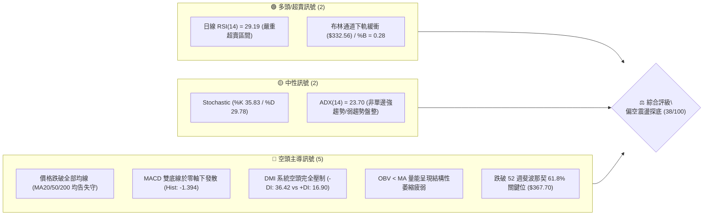
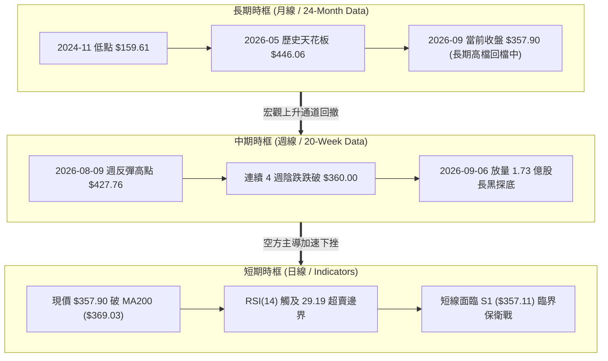
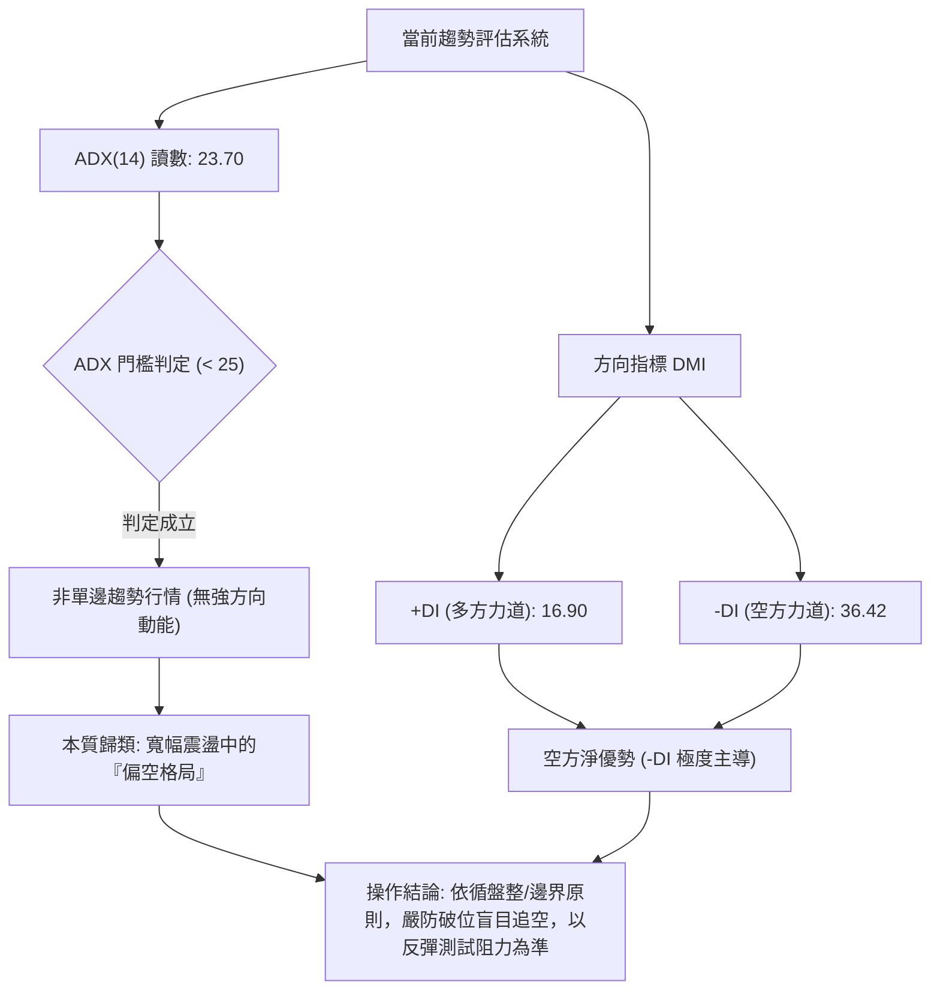
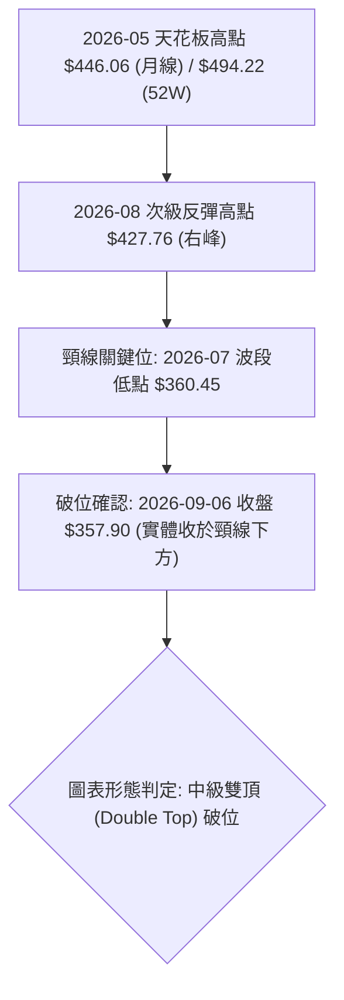
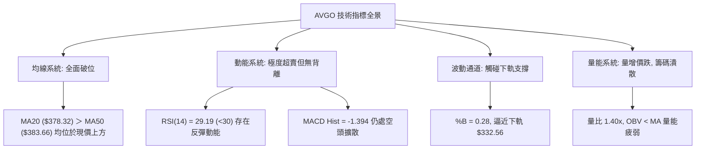
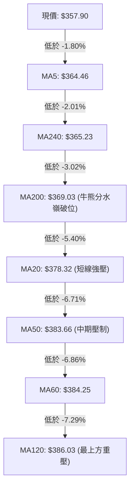
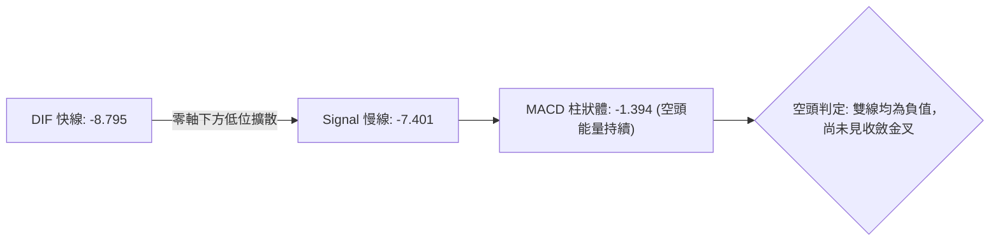
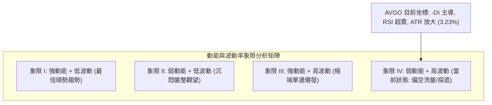
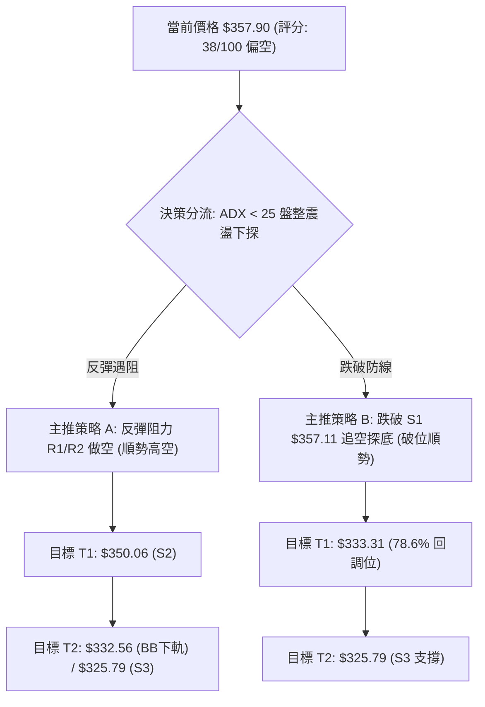
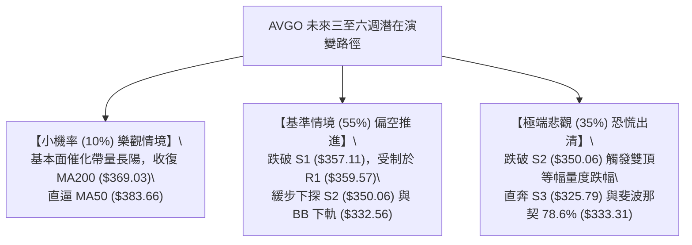

# AVGO 技術分析報告

> **報告日期**：2026-09-07 ｜ **語言**：繁體中文 ｜ **數據來源**：Yahoo Finance ｜ **當前價格**：$357.90

---

## 目錄

| 章節 | 內容 |
|------|------|
| [1. 技術面概覽](#1-技術面概覽) | 訊號儀表板、核心指標、評分卡 |
| [2. 趨勢分析](#2-趨勢分析) | 多時框趨勢、長中短期走勢 |
| [3. 圖表形態分析](#3-圖表形態分析) | 形態識別、K線組合、目標價 |
| [4. 支撐與阻力](#4-支撐與阻力) | 關鍵價位、斐波那契回調 |
| [5. 技術指標深度解讀](#5-技術指標深度解讀) | MA/RSI/MACD/布林/成交量 |
| [6. 動能與波動率](#6-動能與波動率) | 動能評估、ATR、Beta |
| [7. 多時框架總結](#7-多時框架總結) | 時框架評分矩陣 |
| [8. 交易策略建議](#8-交易策略建議) | 多空策略、風險報酬比 |
| [9. 風險提示與監控](#9-風險提示與監控) | 監控指標、風險場景 |
| [10. 報告總結](#-報告總結) | 關鍵結論與策略匯總 |

---

## 1. 技術面概覽

### 🎯 技術訊號儀表板



### 📊 核心指標速覽表

| 指標類別 | 指標名稱 | 當前數值 | 訊號 | 解讀 |
|:---|:---|:---|:---:|:---|
| **價格** | 當前收盤價 | $357.90 | 🔴 | 位於 52 週波段 (289.50 - 494.22) 的 33.4% 分位，處於中低位探底區 |
| **均線** | MA20 (短月線) | $378.32 | 🔴 | 現價低於 MA20 達 -5.40%，短期動能由空方主導，形成第一道壓制 |
| **均線** | MA50 (季線) | $383.66 | 🔴 | 現價低於 MA50，中期上升趨勢遭到破壞，季線轉為下彎壓力 |
| **均線** | MA200 (年線) | $369.03 | 🔴 | 現價跌破牛熊分界線 MA200（-3.02%），長期牛市基石面臨動搖 |
| **動能** | RSI(14) | 29.19 | 🟢 | 日線 RSI 進入低於 30 的極度超賣區間，短線存在技術性反抽動能 |
| **動能** | MACD (12,26,9) | -8.795 / -7.401 | 🔴 | 柱狀圖為 -1.394，快慢線於零軸下方擴散，空方波段結構尚未收斂 |
| **趨勢** | ADX (14) / DMI | 23.70 / -DI 36.42 | 🔴 | ADX < 25 顯示未形成宏觀單邊趨勢，但 -DI 壓制 +DI 顯示空頭控制局面 |
| **波動** | ATR(14) | $11.55 | 🟡 | 日波動率為 3.23%，波動區間放大，日內與隔夜洗盤風險提高 |
| **成交量** | Volume / 20MA | 32.77M / 23.45M | 🔴 | 量比 1.40x 帶量下殺，OBV 疲軟，主動性賣盤主導市場定價 |

### 🏆 技術評分卡

```
╔══════════════════════════════════════════════════════════════════════╗
║              技術評分卡 — AVGO (Broadcom Inc.) 2026-09-07            ║
╠══════════════════════════════════════════════════════════════════════╣
║ 趨勢強度 (Trend)     ███████░░░░░░░░░░░░░  35/100  🔴 空頭壓制       ║
║ 動能指標 (Momentum)  ████████░░░░░░░░░░░░  40/100  🟡 超賣醞釀反抽   ║
║ 支撐穩定度 (Support) █████████░░░░░░░░░░░  45/100  🟡 臨近S1支撐     ║
║ 成交量配合 (Volume)  ██████░░░░░░░░░░░░░░  30/100  🔴 放量下行背離   ║
║ 形態完整度 (Pattern) ████████░░░░░░░░░░░░  40/100  🔴 破位結構延續   ║
║ 均線排列 (MA System) ████████░░░░░░░░░░░░  38/100  🔴 價格位於全線下 ║
╠══════════════════════════════════════════════════════════════════════╣
║ 綜合技術評分         ███████░░░░░░░░░░░░░  38/100  🔴 偏空震盪探底   ║
╚══════════════════════════════════════════════════════════════════════╝
```

---

## 2. 趨勢分析

### 🌐 多時框趨勢分析



### 📈 長期趨勢 — 12個月走勢圖（Unicode）

```
AVGO 月線走勢圖（過去12個月：2025-10 至 2026-09）
價格軸 ($)
$450 ┤                                      ● (05月 $446.06)
$420 ┤                              ● (04月 $416.77)
$390 ┤                      ● (11月 $400.71)           ● (07月 $389.28)
$360 ┤      ● (10月 $367.57)                    ● (06月 $377.75)   ● (08月 $370.34)
$330 ┤              ● (12月 $344.83) ● (01月 $330.08)              ●← 現價 ($357.90)
$300 ┤                          ● (03月 $309.02)
     └──────────────────────────────────────────────────────────────────────────
           10月  11月  12月  01月  02月  03月  04月  05月  06月  07月  08月  09月
           2025                    2026
```

#### 走勢特徵分析表格（過去 12 個月四階段演變）

| 階段階段 | 時間區間 | 起始價 / 終止價 | 區間漲跌幅 | 結構特徵與成交量狀態 |
|:---|:---:|:---:|:---:|:---|
| **第一階段：秋季登頂** | 2025-10 ~ 2025-11 | $367.57 → $400.71 | +9.02% | 延續 2025 年多頭主升浪，月線創歷史新高點 $400.71，買盤活躍 |
| **第二階段：冬季降溫** | 2025-12 ~ 2026-03 | $400.71 → $309.02 | -22.88% | 獲利回吐加劇，連續 4 個月走低，觸及波段深幅低點 $309.02 築底 |
| **第三階段：春季暴衝** | 2026-04 ~ 2026-05 | $309.02 → $446.06 | +44.35% | 業績成長帶動強力軋空，月線收盤衝至 $446.06，52 週高點見 $494.22 |
| **第四階段：夏季走熊** | 2026-06 ~ 2026-09 | $446.06 → $357.90 | -19.76% | 出貨量湧現，連破 400 與 370 關口，現價滑落至波段回檔 61.8% 下方 |

### 📊 中期趨勢（週線分析）

中期走勢圖自 2026 年 8 月初反彈至 $427.76 後，遭遇嚴重的空方拋壓。觀察最近 5 週價格與量能演化：
- **2026-08-09 週**：收盤 $427.76，週 RSI 飆至 73.6，MACD 柱狀圖放大至 +5.364，但隨即於 52 週高點下方形成假突破回落。
- **2026-08-16 至 08-23 週**：連續兩週長陰摜破 400 美元關口，8 月 23 日週跌破 $368.45，MACD 柱狀圖由正轉負至 -5.851。
- **2026-09-06 當週**：收盤來到 $357.90，週成交量暴增至 173,127,700 股（較前週激增 84.5%），放量陰線直接壓迫 S1 支撐位 $357.11。

```
中期週線波段路徑示意圖：
[高點 $427.76 (08-09)] 
       ↘
        [中繼破位 $392.99 (08-16)]
               ↘
                [加速下墜 $368.45 (08-23)]
                       ↘
                        [破線低位 $357.90 (09-06)] ───► [逼近 S1: $357.11 測試]
```

### ⚡ 趨勢強度評估（ADX 解讀）



#### ADX 強度對照表

| 指標名稱 | 實際數據 | 臨界門檻 | 強度等級 | 實戰交易指引 |
|:---|:---:|:---:|:---:|:---|
| **ADX 趨勢強度** | **23.70** | 25.00 | 🟡 弱趨勢 / 盤整 | 根據規則 14，ADX < 25 判定為**盤整行情**，切忌追漲殺跌，主要交易區間以布林通道與波段邊界為依據 |
| **+DI (多頭動能)** | **16.90** | 20.00 | 🔴 疲弱無力 | 多方買盤意願低落，無法組織起突破均線的反擊 |
| **-DI (空頭動能)** | **36.42** | 30.00 | 🔴 強勢壓制 | 空方牢牢主導日內壓制，但因數值過高且 RSI 超賣，需防空頭力竭反撲 |

---

## 3. 圖表形態分析

### 🔍 形態識別系統



#### 形態識別與信心度評估表

| 形態名稱 | 信心度 | 判斷依據（引用數據） | 完成度 | 目標價（附嚴謹幾何計算式） |
|:---|:---:|:---|:---:|:---|
| **中期雙頂 (Double Top)** | **75%** | 左峰為 2026-05 週收盤 $446.06（52W高點 $494.22），右峰為 2026-08-09 週收盤 $427.76；雙峰頸線為 2026-07-05 低點 $360.45。當前收盤 $357.90 已跌破頸線。 | **90%** | 頸線 $360.45 - 形態高度 ($427.76 - $360.45 = $67.31) = **$293.14**。<br>（接近 52 週最低點 $289.50） |
| **布林通道下軌擴軌破位** | **85%** | 現價 $357.90 快速擊穿中軌 $378.32，正向 BB 下軌 $332.56 滑落，%B 跌至 0.28。 | **70%** | 下軌動態支撐區間：**$332.56**（直接對應 BB 下軌數據）。 |
| **潛在雙底構建 (Double Bottom)** | **35%** | 僅依託 2026-09 當前跌勢在 S1 ($357.11) 與 2026-07 前低 $360.45 尋求支撐，尚未形成任何右底右側放量反轉。 | **15%** | **訊號不足，信心度低於 50%**，不進行多頭幾何形態畫線，僅做指標型超賣解讀。 |

### 🕯️ 重要K線形態分析

| 月份/週期 | 收盤價 | K線形態特徵 | 結構性解讀 | 訊號 |
|:---|:---:|:---|:---|:---:|
| **2026-05 (月線)** | $446.06 | **天量長上影大陽線** | 盤中摸高至 52W 高點 $494.22 後遭到猛烈阻擊，收盤 $446.06 留長達近 50 美元上影線，主力出貨信號。 | 🔴 |
| **2026-06 (月線)** | $377.75 | **長陰覆蓋吞沒 (Bearish Engulfing)** | 單月重挫 $68.31 (-15.3%)，直接吞沒 4 月漲幅，將大量高檔追價籌碼套牢於 400 美元之上。 | 🔴 |
| **2026-08 (月線)** | $370.34 | **反彈受阻倒錘頭線** | 8 月反彈至 $427.76 無力維持，月線再度收陰，確認多頭無力收復失地。 | 🔴 |
| **2026-09-06 (週線)**| $357.90 | **巨量實體光腳中長陰** | 週成交量激增至 1.73 億股，收盤收在全週最低點附近，直接貫穿 61.8% 斐波那契回調位 $367.70。 | 🔴 |

### 📉 ASCII 走勢形態示意圖

```
AVGO 中期雙頂破位形態幾何示意圖
價格軸
$450 ┤          [頂峰一: 05-31 收 $446.06]
$430 ┤                                      [頂峰二: 08-09 收 $427.76]
$410 ┤             \                      /       \
$390 ┤              \                    /         \
$370 ┤               \                  /           \
$360 ┤─────────────────[頸線低點: 07-05 收 $360.45]───────▼───────────── [頸線破位]
$350 ┤                                                 [現價: 09-06 收 $357.90]
$330 ┤                                                 :
$300 ┤                                                 : (等幅量度下行空間)
$293 ┤─────────────────────────────────────────────────▼ [形態理論目標: $293.14]
```

### 🎯 形態目標價計算

1. **雙頂形態量度跌幅計算依據**：
   - 形態有效高點（右峰收盤基準）：$427.76
   - 形態頸線水平位（2026-07-05 波段低點）：$360.45
   - 形態垂直高度 ($H$) = $\$427.76 - \$360.45 = \$67.31$
   - 破位量度理論目標價 ($T$) = 頸線 $\$360.45 - \$67.31 = \mathbf{\$293.14}$
2. **與關鍵數據驗證**：
   - 該形態量度目標價 $293.14 與 AVGO 52 週最低點 **$289.50** 僅差 $3.64（相差 1.2%），高度吻合長週期結構低點，證實該形態若完全展開，將引導現價回測年內最深支撐。

---

## 4. 支撐與阻力

### 🗺️ 關鍵價位分布圖（Unicode）

```
AVGO 價位結構分布圖（引用 OHLCV 關鍵價位與斐波那契節點）
═════════════════════════════════════════════════════════════════════════
$494.22 ║████████████████████████████████████████║ 52W 歷史極值高點 (0.0%)
$445.90 ║██████████████████████████████          ║ 斐波那契 23.6% 回調位
$416.02 ║████████████████████████                ║ 斐波那契 38.2% 回調位
$391.86 ║████████████████████                    ║ 斐波那契 50.0% 強弱中軸
$384.33 ║██████████████████                      ║ 強阻力 R3 (MA50 $383.66 聚類)
$376.59 ║██████████████                          ║ 阻力 R2 (MA20 $378.32 聚類)
$367.70 ║████████████                            ║ 斐波那契 61.8% 黃金分割關卡
$359.57 ║████████                                ║ 關鍵阻力 R1 (原頸線平台)
$357.90 ╠════════════════════════════════════════╣ ◄ 現價收盤 $357.90
$357.11 ║▓▓▓▓▓▓▓▓▓▓▓▓▓▓▓▓▓▓▓▓▓▓▓▓                ║ 關鍵近期支撐 S1 (臨界面)
$350.06 ║████████████████                        ║ 心理與整數強支撐 S2
$333.31 ║████████████████████████                ║ 斐波那契 78.6% 回調位
$332.56 ║████████████████████████                ║ 布林通道下軌極限支撐
$325.79 ║████████████████████████████            ║ 波段低點強支撐 S3
$289.50 ║████████████████████████████████████████║ 52W 歷史絕對底部 (100.0%)
═════════════════════════════════════════════════════════════════════════
```

### 🚧 阻力位分析表

所有阻力位數值嚴格引用自數據庫波段高點聚類與均線對應：

| 阻力級別 | 價位 | 距現價空間 | 形成原因與籌碼技術結構 | 突破難度 | 重要性 |
|:---|:---:|:---:|:---|:---:|:---:|
| **R1 (極近阻力)** | **$359.57** | +0.47% | 近期震盪跌破之平台下沿，與 7 月低點頸線位 $360.45 緊密重疊，短線多空必爭地。 | 🟡 中等 | ★★★☆☆ |
| **R2 (波段阻力)** | **$376.59** | +5.22% | 近期波段反彈阻力位，同時共振日線 MA20 ($378.32) 與 200 日牛熊線 ($369.03)。 | 🔴 極高 | ★★★★☆ |
| **R3 (強波段阻力)**| **$384.33** | +7.38% | 近一年密集套牢峰聚類，重疊 50 日均線 MA50 ($383.66) 與 60 日均線 ($384.25)。 | 🔴 難以逾越 | ★★★★★ |

### 🛡️ 支撐位分析表

所有支撐位數值嚴格引用自數據庫波段低點聚類與結構下軌：

| 支撐級別 | 價位 | 距現價空間 | 形成原因與籌碼技術結構 | 守住機率 | 重要性 |
|:---|:---:|:---:|:---|:---:|:---:|
| **S1 (關鍵近期)** | **$357.11** | -0.22% | 近一年波段低點密集聚類下沿，日線超賣下之多方最後即時戰壕，距現價僅 $0.79。 | 🟡 50% | ★★★★☆ |
| **S2 (波段強支撐)**| **$350.06** | -2.19% | 整數大關心理防線，年內次級回撤聚類點位，空方急跌後的減速止跌帶。 | 🟢 65% | ★★★★☆ |
| **S3 (深幅防護)** | **$325.79** | -8.97% | 近一年大型量價密集籌碼底座，上方覆蓋斐波那契 78.6% ($333.31) 及 BB 下軌 ($332.56)。 | 🟢 85% | ★★★★★ |

### 📐 斐波那契回調位分析

依據 52 週低點 **$289.50** 至 52 週高點 **$494.22** 的完整波段進行黃金分割回調測算：

| 分割比例 | 精確對應價位 | 與現價 ($357.90) 相對位置 | 當前技術結構解讀 |
|:---:|:---:|:---:|:---|
| **0.0%** | $494.22 | +38.09% | 52 週絕對歷史高點，目前屬於遠端天花板阻力 |
| **23.6%** | $445.90 | +24.59% | 月線收盤頂部 ($446.06) 所在區間，第一層重大回吐壓力 |
| **38.2%** | $416.02 | +16.24% | 2026 年春季強勢推升起點，已完全失守轉為強阻力 |
| **50.0%** | $391.86 | +9.49% | 多空強弱平衡中軸，也是 8 月中旬週線收盤點 ($392.99) |
| **61.8%** | **$367.70** | +2.74% | **黃金分割防線**：現價已跌破此位（-2.67%），確認技術破位 |
| **78.6%** | **$333.31** | -6.87% | **末端深度支撐**：與布林下軌 $332.56 極度共振，下行極限防禦區 |
| **100.0%** | $289.50 | -19.11% | 52 週波段起點，若遭遇系統性黑天鵝的終極價值錨點 |

> **當前位置解讀**：現價 **$357.90** 處於 **61.8% ($367.70)** 與 **78.6% ($333.31)** 之間。在技術分析常規中，跌破 61.8% 意味著先前的上漲浪潮遭到結構性推翻，下行軌道將打開朝向 78.6%（$333.31 附近）尋求最終承接力道。

---

## 5. 技術指標深度解讀

### 🎛️ 指標訊號總覽



### 📈 移動平均線排列分析



#### 均線矩陣詳細數據

| 週期 | 數值 ($) | 偏離現價百分比 | 微觀走勢 (Sparkline) | 均線解讀與排列特徵 |
|:---|:---:|:---:|:---|:---|
| **MA5** | $364.46 | -1.80% | ▄▄▃▃▃▄▅▆▇█████▇▇▆▄▃▂▁▁▁▁▁▁▁▂▁▁ | 極短線下彎，壓迫日內反彈幅度 |
| **MA10** | $363.37 | -1.51% | ▄▄▃▄▄▄▅▅▅▆▇▇█████▇▆▅▄▃▂▂▁▁▁▁▁▁ | 與 MA5 形成短空雙下壓帶 |
| **MA20** | $378.32 | -5.40% | ▂▂▂▂▃▃▄▅▅▅▆▇▇█████▇▇▇▆▆▆▅▅▄▃▂▁ | 月線拐頭向下，成為第一反彈強阻力 |
| **MA50** | $383.66 | -6.71% | ── (中期季線) ── | 季線轉空，多頭中期趨勢宣告瓦解 |
| **MA60** | $384.25 | -6.86% | ████▇▇▇▇▇▇▇▇▇▇▇▇▆▆▆▅▅▄▃▂▂▁▁▁▁▁ | 與 R3 ($384.33) 形成不可跨越之籌碼壁壘 |
| **MA120** | $386.03 | -7.29% | ▁▁▁▁▂▂▂▃▃▄▄▅▅▅▆▆▆▆▇▇▇▇▇███████ | 半年線持續高位下行，長期壓抑 |
| **MA200** | $369.03 | -3.02% | ── (牛熊分界) ── | 跌破 200 日線，屬於典型空頭熊市破位訊號 |
| **MA240** | $365.23 | -2.01% | ▁▁▁▁▂▂▃▃▄▄▅▅▆▆▇▇▇█████████████ | 年線亦宣告失守，下方缺乏長期均線托底 |

### 📉 RSI(14) 分析

- **當前讀數**：**29.19**（正式進入 < 30 超賣禁區）
- **超賣強度進度條**：
  ```
  超賣門檻(30) │ 當前讀數: 29.19
  [█████████████████████████████░░░░░░░░░░░░░░░░░░░░░░░░░░░░░░░] 29.19%
  🟢 強烈超賣訊號 (隨時引發技術性空頭回補)
  ```
- **背離判斷與結論**：
  - **背離分析**：檢視 2026-08-30（價格 $368.79，RSI 23.5）與 2026-09-06（價格 $357.90，RSI 29.2）。
  - **精確結論**：日線數據明確顯示「**無明顯背離**」。雖然週線 RSI 由 23.5 微幅拉升至 29.2，但主要是因跌速短暫趨緩所致，**並未構成**有效之日線級別底背離架構。嚴禁將其視作反轉翻多訊號，僅可視為嚴重超賣引發的隨機反抽。

### 📊 MACD(12/26/9) 訊號解讀



- **MACD 線**：-8.795
- **訊號線 (Signal)**：-7.401
- **柱狀圖 (Histogram)**：**-1.394**（維持負向發散）
- **結論**：MACD 柱狀體由上週的 -3.426 雖有收縮至 -1.394，但快慢線仍位於深水區（負值區）向下尋底。零軸之下的負柱收斂僅代表下跌斜率放緩，非買入訊號。

### 📦 布林通道分析

```
AVGO 布林通道 (20, 2.0) 結構位置圖
$424.09 ┬────────────────────────────────────────── BB 上軌 (Upper)
        │
$378.32 ┼────────────────────────────────────────── BB 中軌 (MA20)
        │                                  
$357.90 ┤ ◄ 現價收盤處於中下軌區間 (%B = 0.28)
        │
$332.56 ┴────────────────────────────────────────── BB 下軌 (Lower)
```

- **帶寬與位置**：BB 上軌為 $424.09，中軌為 $378.32，下軌為 $332.56。
- **%B 指標**：**0.28**（處於下半區），顯示價格正受制於均線下行拖曳，但距下軌 $332.56 尚有 $25.34（7.08%）之緩衝空間，空頭仍有下探空間尚未觸碰極端下軌邊界。

### 💹 成交量分析（量價配合度）

- **最新成交量**：32,773,600 股
- **20 日均量**：23,452,570 股（**量比 1.40x**，明顯放大）
- **週級別成交量**：2026-09-06 週量達 1.73 億股，為近兩個月最大陰線量能。
- **OBV (能量潮)**：**OBV < MA**。量能結構明確判定為「**量能疲弱**」。
- **量價研判**：帶量下挫突破 MA200 與 61.8% 斐波那契位，呈現典型的「**量增價跌**」出貨走勢，主動性賣盤積極涌出，量價關係確認空方突破有效。

---

## 6. 動能與波動率

### ⚡ 動能評估四象限



#### 動能與波動評估表格

| 象限代號 | 動能狀態 | 波動狀態 | 吻合度 | 市場特徵解讀與策略 |
|:---:|:---:|:---:|:---:|:---|
| **Q1** | 強多頭動能 | 低波動 | ❌ 不符合 | 穩定爬升格局，目前完全相反 |
| **Q2** | 弱多頭動能 | 低波動 | ❌ 不符合 | 低波沉寂無方向，目前成交量放大不符 |
| **Q3** | 強多頭動能 | 高波動 | ❌ 不符合 | 狂暴推升主升浪，目前處於破位跌勢 |
| **Q4 (當前)**| **弱動能 (空方壓制)** | **高波動 (ATR 3.23%)** | **✔️ 完全吻合** | **高風險偏空洗盤**：多頭反抗無力，波動放大引發止損賣盤，需提防急跌引發的短線劇烈抽搐。 |

### 📊 ATR 波動率分析

- **ATR(14) 讀數**：**$11.55**
- **價格百分比**：**3.23%**
- **交易風控意涵**：
  - AVGO 屬於高單價科技股，每日平均波動高達 $11.55。這意味著在設置停損與停利時，必須給予市場足夠的呼吸空間，過度狹窄的停損將被正常雜訊洗出場。
  - **動態止損建議**：短線交易止損距離應不小於 $1.5 \times \text{ATR} = \$17.33$；若進行波段操作，停損安全邊界建議為 $2.0 \times \text{ATR} = \$23.10$。

### 📐 Beta 與市場相關性

- **Beta 係數**：**1.457**
- **市場相關性解讀**：
  - Beta 高達 1.457，顯示 AVGO 對大盤（S&P 500 / Nasdaq 100）具有極高的系統性敏感度。當科技權值股遭遇流動性緊縮或板塊輪動賣壓時，AVGO 下跌幅度平均將是大盤的 1.45 倍。
  - **融資與流動性影響**：機構持股佔比高達 80.2%，空頭拋售往往來自於機構投資者的降槓桿調倉，其賣壓呈現持續性與規模性。

---

## 7. 多時框架總結

### 📋 時框架評分表

| 時框架 | 趨勢方向 | 動能狀態 | 均線排列特徵 | 形態判定 | 綜合評分 | 操作指引建議 |
|:---|:---:|:---:|:---|:---|:---:|:---|
| **短期 (日線)** | 🔴 破位下行 | 🟢 極度超賣 (RSI 29.19) | 價格低於全部均線 | 測試 S1 ($357.11) 支撐 | 32/100 | 嚴禁追空，等待反抽阻力高空 |
| **中期 (週線)** | 🔴 空頭下殺 | 🔴 弱勢擴散 (Hist -1.394) | 跌破 20 週、50 週均線區間 | 雙頂 ($427.76) 破頸線 | 35/100 | 中期防守線失守，反彈皆為減磅 |
| **長期 (月線)** | 🟡 高檔回調 | 🟡 歷史高檔回測 | 仍守在 MA240 ($365.23) 臨界點 | 24 個月上升大通道回吐 | 48/100 | 進入 52 週中位偏下價值尋底區 |

### 🔲 綜合訊號矩陣

```
時框維度        趨勢指標     動能指標     量能結構     形態結構      多空結論
═════════════════════════════════════════════════════════════════════════
短期 (Daily)    🔴 空頭      🟢 超賣      🔴 帶量下破  🔴 破位下行   🔴 偏空反抽
中期 (Weekly)   🔴 空頭      🔴 空頭      🔴 放量大陰  🔴 雙頂成形   🔴 堅決偏空
長期 (Monthly)  🟡 中性偏多  🟡 修正降溫  🟡 量能退潮  🟡 通道回測   🟡 週期回吐
═════════════════════════════════════════════════════════════════════════
多時框最終收斂向量：【主導權在於中期與短期，整體架構偏空震盪尋底】
```

### ⚖️ 多時框收斂結論

依據【嚴格要求 14】進行多時框衝突收斂判定：
1. **行情屬性定位**：當前 ADX(14) 讀數為 **23.70**（嚴格小於 25 趨勢門檻），因此在量化體系中定性為**「盤整/非強單邊行情」**。
2. **交易邊界規則**：在盤整行情中，不可使用單邊突破追空策略，行情將主要在日線布林通道上下軌（**$332.56 至 $424.09**）以及波段關鍵支撐阻力（**S1: $357.11 / R2: $376.59**）之間展開區間拉鋸。
3. **時框優先級權重**：雖然月線長期處於 24 個月宏觀多頭大框架，但**中期週線已確認雙頂頸線破位**，日線均線全數死叉下壓。
4. **唯一方向性結論**：**【偏空震盪探底】**。主策略必須順應日線與週線的破位現實，採取「**反彈阻力受阻沽空**」或「**破位下行延伸追蹤**」，放棄任何無左側確認的逆勢摸底多單。此結論與第 8 章主空頭策略絕對一致。

---

## 8. 交易策略建議

### 🗺️ 策略決策流程圖



### 🧭 策略路由（依評分卡分流）

> **當前主策略方向 = 【主推空頭策略】（依據第 1 章技術評分卡：38/100，低於 40 分標準）**

本分析嚴格遵守規則，綜合評分偏空（38 分），絕不在低位模稜兩可兩頭下注。策略全部構建於「反彈沽空」與「破位追空」框架之下，多頭僅作為極端情境之對沖與風險推翻提示。

### 🎯 價格情境階梯（Price Scenarios）

所有價位精確引用自第 4 章數據庫關鍵價位：

| 觸發條件 | 第一目標 | 第二延伸目標 | 情境技術結構含義 |
|:---|:---:|:---:|:---|
| **上破 R1 $359.57** | R2 **$376.59** | R3 **$384.33** | RSI 超賣引發的技術性空頭回補，測試 MA20 壓力 |
| **受阻現價至 R1 區間**| S1 **$357.11** | S2 **$350.06** | 空方持續壓制，多頭無力組織有效反彈，陰跌延續 |
| **跌破 S1 $357.11** | S2 **$350.06** | S3 **$325.79** | 破位確立，開啟朝向斐波那契 78.6% 與布林下軌探底 |

### 📊 情境機率分佈

| 情境劇本 | 機率估計 | 主要指標依據（嚴格引用數據） |
|:---|:---:|:---|
| **弱勢下挫 / 破位探底 (情境一)** | **55%** | 跌破 MA200 ($369.03)，OBV 疲軟，MACD 柱狀體 -1.394 維持空頭發散，-DI (36.42) 完全壓制 +DI (16.90)。 |
| **超賣反彈後遇阻 (情境二)** | **35%** | 日線 RSI(14) 觸及 29.19 極端超賣區，空頭有短線獲利回補需求，反彈將遭遇 R1 ($359.57) 與 R2 ($376.59) 阻擊。 |
| **V型強力反轉向上 (情境三)** | **10%** | 全均線空頭排列且週線放量 1.73 億股長黑，基本無可能在無築底形態下直接 V 轉，發生機率極低。 |

### 🟢 主策略詳情（空頭主導專案）

本章節所有價位（進場點、止損點、目標價）**全部嚴格引用**數據庫之真實價位：

| 策略要素 | 策略 A（反彈高空 — 逢高狙擊） | 策略 B（破位追空 — 順勢下探） |
|:---|:---:|:---:|
| **策略邏輯** | 利用 RSI 超賣反抽 R1 阻力位時建立順勢空單 | 價格實體跌穿關鍵低點 S1 後，追擊下行空間 |
| **進場條件** | 盤中反抽觸及 R1 阻力且未能站穩，出現上影線 | 日線收盤價或盤中實體跌破 S1 支撐位 |
| **進場價格** | **$359.57** (精確對應 R1 阻力位) | **$357.11** (精確跌破 S1 支撐位) |
| **目標價 T1** | **$350.06** (支撐位 S2) | **$333.31** (斐波那契 78.6% 回調位) |
| **目標價 T2** | **$332.56** (布林通道下軌極限) | **$325.79** (近一年波段低點支撐 S3) |
| **止損價格** | **$367.70** (斐波那契 61.8% 關鍵破位位) | **$369.03** (MA200 牛熊分界線) |
| **風險空間** | $\$367.70 - \$359.57 = \$8.13$ | $\$369.03 - \$357.11 = \$11.92$ (約 1.03×ATR) |
| **報酬空間 (T2)**| $\$359.57 - \$332.56 = \$27.01$ | $\$357.11 - \$325.79 = \$31.32$ |
| **風險報酬比** | **1 : 3.32** (極佳) | **1 : 2.63** (優良) |
| **勝率預估** | **65%** | **55%** |
| **建議倉位** | **總資金之 10% - 15%** | **總資金之 8% - 10%** |

### 🔴 反向風險觸發點（對沖提示）

若市場出現以下情況，意味著偏空主策略被推翻，空單必須立即無條件止損或反向對沖：
1. **關鍵價位推翻**：日線收盤價強勢收復 **$369.03**（MA200）甚至進一步收復 **$376.59**（R2 / MA20）。
2. **量能動能逆轉**：RSI(14) 迅速脫離超賣區站上 45 以上，且 MACD 在零軸下方形成黃金交叉，伴隨單日成交量突破 4,000 萬股（大於 20 日均量 1.7 倍）。
3. **風控應對**：若觸發上述條件，空單部位全數清場，空手觀望等待區間重新界定。

### ⭐ 整體訊號強度評星

```
╔══════════════════════════════════════════════════════════╗
║              整體訊號強度評星儀表板                      ║
╠══════════════════════════════════════════════════════════╣
║ 做多訊號強度：★☆☆☆☆  (1/5星 - 僅有超賣, 缺乏反轉架構)  ║
║ 做空訊號強度：★★★★☆  (4/5星 - 雙頂成形, 均線破位壓制)  ║
║ 整體可信度：  ★★★★☆  (4/5星 - 量價指標高度共振確認)    ║
╚══════════════════════════════════════════════════════════╝
```

---

## 9. 風險提示與監控

### ✅ 關鍵監控指標 Checklist

```
╔══════════════════════════════════════════════════════════════════════╗
║                   AVGO 每日交易即時監控清單 (Checklist)              ║
╠══════════════════════════════════════════════════════════════════════╣
║ [ ] 監控 S1: $357.11 是否失守？ (收盤跌破將引發波段止損盤)           ║
║ [ ] 監控 R1: $359.57 與 R2: $376.59 (反彈是否出現假突破長上影線？)   ║
║ [ ] 監控 RSI(14) 是否脫離超賣區 (>35) 或在 30 以下鈍化？             ║
║ [ ] 監控 MACD 柱狀圖：是否收斂至 -0.5 以上甚至金叉？                 ║
║ [ ] 監控 成交量比 (Volume Ratio)：是否縮量反彈（有利空頭）？         ║
║ [ ] 監控 半導體板塊連動：大盤高 Beta (1.457) 是否引發共振下殺？      ║
╚══════════════════════════════════════════════════════════════════════╝
```

### ⚠️ 風險場景分析



### 🛡️ 風險管理重要提醒

1. **ATR 動態部位管理**：
   - 由於當前 ATR 高達 **$11.55**（波動幅度達 3.23%），每手操作承擔之單日名目波動極大。若交易帳戶總資金為 $100,000，設定單筆最大容忍損失為 1%（$1,000），在停損空間設定為 $11.92（策略 B）的情況下：
   $$\text{最大允許開倉股數} = \frac{\$1,000}{\$11.92} \approx 83 \text{ 股}$$
   絕對禁止在高波動破位行情中使用滿倉或高槓桿交易。
2. **重大基本面與分析師評級背離風險**：
   - 儘管市場 46 位分析師給出 `strong_buy` 共識評級，平均目標價高達 **$533.41**，且近期花旗（Citigroup）、TD Cowen 等投行持續維持買入評級；然而，**技術圖表完全處於主動出貨走勢**。
   - **資深分析師戒律**：技術面領先基本面反應資金流向，切勿因分析師目標價高昂而在均線空頭排列下進行無保護的盲目抄底。在價格重新收復 MA200 ($369.03) 之前，一律嚴格執行技術面風控紀律。

---

## 📋 報告總結

```
╔══════════════════════════════════════════════════════════════════════╗
║                     AVGO 技術分析報告總結                            ║
╠══════════════════════════════════════════════════════════════════════╣
║ 報告日期：2026-09-07                                                 ║
║ 當前價格：$357.90                                                    ║
║ 分析評級：🔴 偏空震盪探底 (技術評分: 38/100)                         ║
║                                                                      ║
║ 關鍵結論：                                                           ║
║ ├─ 長期趨勢：🟡 月線高檔大幅回調，正考驗上升大通道下邊緣            ║
║ ├─ 中期趨勢：🔴 週線中級雙頂確立破位，週成交量暴增至 1.73 億股       ║
║ ├─ 短期趨勢：🔴 跌破全部移動平均線 (MA20/50/200)，空方全面壓制      ║
║ ├─ 動能特徵：🟢 日線 RSI(14) 來到 29.19 超賣，短線存在弱反抽動能    ║
║ ├─ 關鍵支撐：S1: $357.11 ｜ S2: $350.06 ｜ S3: $325.79               ║
║ ├─ 關鍵阻力：R1: $359.57 ｜ R2: $376.59 ｜ R3: $384.33               ║
║ └─ 斐波那契：失守 61.8% ($367.70)，打開往 78.6% ($333.31) 探底空間   ║
║                                                                      ║
║ 最優策略組合：                                                       ║
║ 1. 🥇 最佳機會 (順勢做空)：反抽 R1 ($359.57) 遇阻進空，目標 $332.56   ║
║ 2. 🥈 次選機會 (破位跟進)：日線跌破 S1 ($357.11) 追空，目標 $325.79   ║
║ 3. 🥉 保守選擇 (嚴格觀望)：等待回測 BB 下軌 $332.56 企穩再做長線評估║
╚══════════════════════════════════════════════════════════════════════╝
```

---

> ⚠️ **免責聲明**：本報告為依據金融量化數據生成之專業級技術分析，所有價位、圖表與指標均基於提供的歷史價格資訊嚴謹推導。本報告**僅供研究與學術參考**，**不構成任何個人化投資建議**。金融市場存在高度波動風險，投資人應獨立評估風險承受能力並自行承擔交易盈虧。

---

*報告生成時間：2026-09-07 ｜ 數據來源：Yahoo Finance ｜ 分析框架：資深多時框圖表形態與量化技術系統*