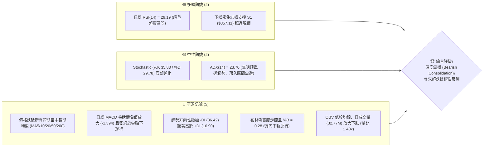
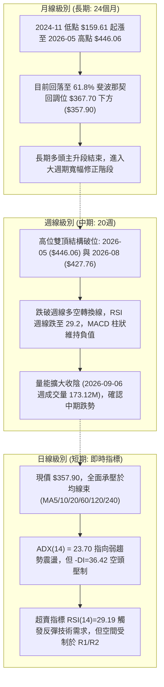
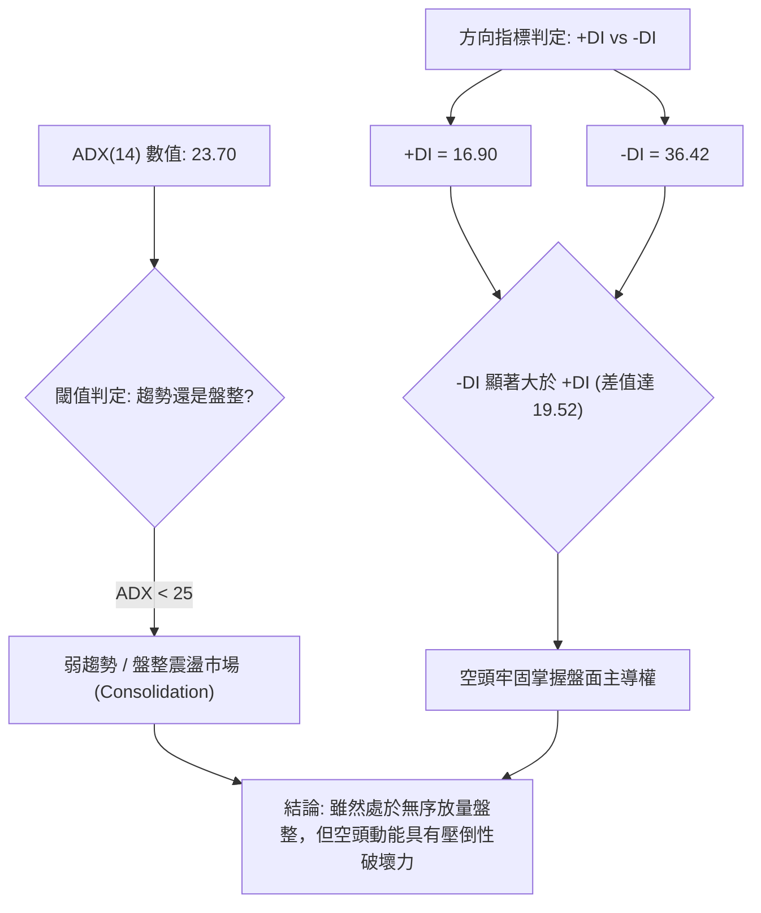
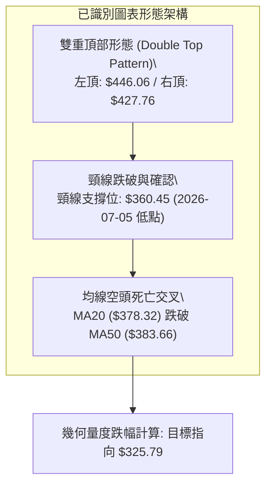
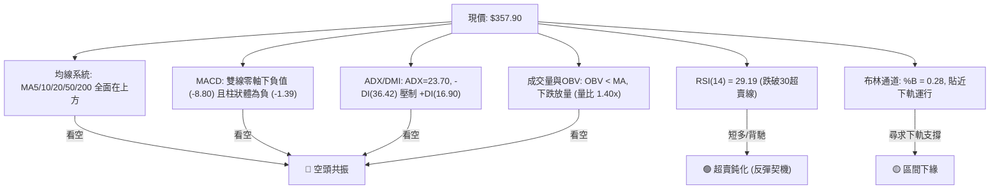
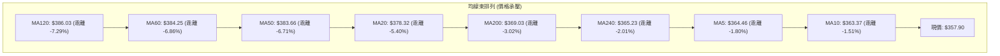
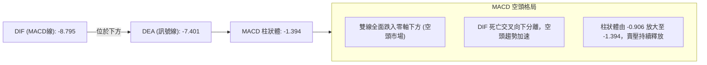
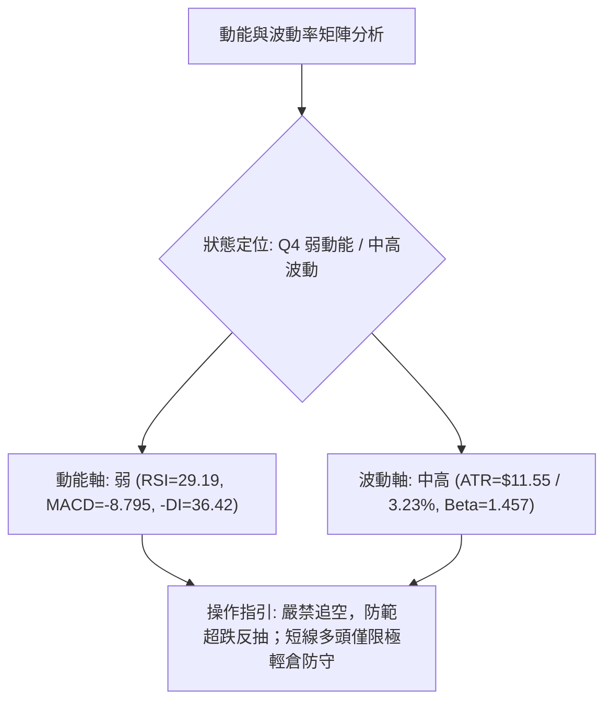
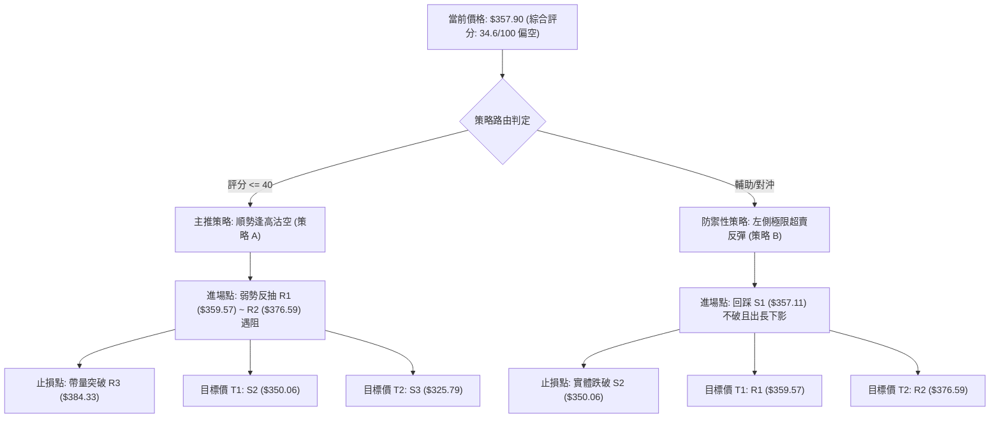
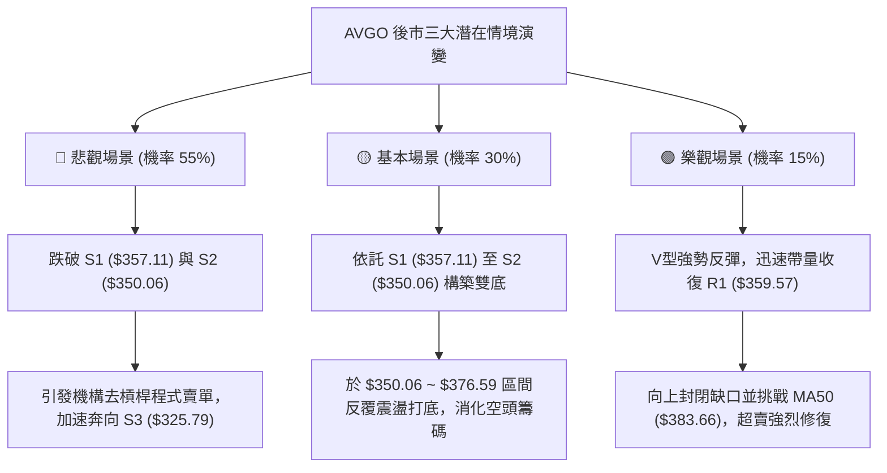

# AVGO 技術分析報告

> **報告日期**：2026-09-08 ｜ **語言**：繁體中文 ｜ **數據來源**：Yahoo Finance ｜ **當前價格**：$357.90

---

## 目錄

| 章節 | 內容 |
|------|------|
| [1. 技術面概覽](#1-技術面概覽) | 訊號儀表板、核心指標、評分卡 |
| [2. 趨勢分析](#2-趨勢分析) | 多時框趨勢、長中短期走勢 |
| [3. 圖表形態分析](#3-圖表形態分析) | 形態識別、K線組合、目標價 |
| [4. 支撐與阻力](#4-支撐與阻力) | 關鍵價位、斐波那契回調 |
| [5. 技術指標深度解讀](#5-技術指標深度解讀) | MA/RSI/MACD/布林/成交量 |
| [6. 動能與波動率](#6-動能與波動率) | 動能評估、ATR、Beta |
| [7. 多時框架總結](#7-多時框架總結) | 時框架評分矩陣 |
| [8. 交易策略建議](#8-交易策略建議) | 多空策略、風險報酬比 |
| [9. 風險提示與監控](#9-風險提示與監控) | 監控指標、風險場景 |

---

## 1. 技術面概覽

### 🎯 技術訊號儀表板



### 📊 核心指標速覽表

| 指標類別 | 指標名稱 | 當前數值 | 訊號 | 解讀 |
|----------|----------|----------|------|------|
| **價格** | 當前收盤價 | $357.90 | 🔴 | 位於52週區間 33.4% 處，跌破年線 MA200，結構偏弱 |
| **均線** | MA20 | $378.32 | 🔴 | 現價低於 MA20 達 -5.40%，月線層級壓力極重 |
| **均線** | MA50 | $383.66 | 🔴 | 現價低於季線 MA50 達 -6.71%，中期趨勢已由多翻空 |
| **均線** | MA200 | $369.03 | 🔴 | 跌破牛熊分界年線 MA200 (-3.02%)，形成空方壓制 |
| **動能** | RSI(14) | 29.19 | 🟢 | 指標正式跌破 30 臨界值，進入極度超賣狀態，蘊釀反彈 |
| **動能** | MACD(12,26,9) | -8.795 / -7.401 | 🔴 | 柱狀體 -1.394 且在零軸下方運行，空頭完全控盤 |
| **趨勢** | ADX(14) | 23.70 (-DI: 36.42) | 🔴 | ADX < 25 處於盤整或弱趨勢，但 -DI 壓倒性主導方向 |
| **通道** | 布林通道 %B | 0.28 | 🟡 | 位於中軌 ($378.32) 與下軌 ($332.56) 間，貼近下軌 |
| **成交量**| 量比 (Volume Ratio) | 1.40x (32.77M) | 🔴 | 成交量顯著放大且收陰線，量能疲弱 (OBV < MA) |
| **波動** | ATR(14) | $11.55 (3.23%) | 🟡 | 每日平均波動幅度約 11.55 美元，波動風險處於中高水位 |

### 🏆 技術評分卡

```
╔══════════════════════════════════════════════════════════════════╗
║              技術評分卡 — AVGO (2026-09-08)                      ║
╠══════════════════════════════════════════════════════════════════╣
║ 趨勢強度 (Trend)      ██████░░░░░░░░░░░░░░  32/100  🔴 空頭控盤  ║
║ 動能指標 (Momentum)    ███████░░░░░░░░░░░░░  36/100  🔴 嚴重超賣  ║
║ 支撐穩定度 (Support)   ██████████░░░░░░░░░░  50/100  🟡 臨近支撐  ║
║ 成交量配合 (Volume)    ██████░░░░░░░░░░░░░░  30/100  🔴 帶量下殺  ║
║ 形態完整度 (Pattern)   ████████░░░░░░░░░░░░  40/100  🟡 區間破位  ║
║ 均線排列 (Moving Avg)  ████░░░░░░░░░░░░░░░░  20/100  🔴 空頭發散  ║
╠══════════════════════════════════════════════════════════════════╣
║ 綜合技術評分           ███████░░░░░░░░░░░░░  34.6/100  🔴 偏空弱勢║
╚══════════════════════════════════════════════════════════════════╝
```

---

## 2. 趨勢分析

### 🌐 多時框趨勢分析



### 📈 長期趨勢 — 12個月走勢圖（Unicode）

```
AVGO 月線收盤價走勢圖（過去12個月：2025-10 至 2026-09）
價格 ($)
$450 ┤                                      ● $446.06 (2026-05)
$420 ┤                             ● $416.77
$400 ┤            ● $400.71                  
$380 ┤                                                ● $377.75  ● $389.28
$360 ┤  ● $367.57                                                         ● $370.34
$340 ┤                    ● $344.83                                              ● $357.90(現價)
$320 ┤                          ● $330.08  ● $318.38
$300 ┤                                            ● $309.02 (2026-03波段低)
     └────┬─────────┬─────────┬─────────┬─────────┬─────────┬─────────┬─────────┬─────────┬─────
        25-10     25-11     25-12     26-01     26-02     26-03     26-04     26-05     26-06~09
```

#### 走勢特徵分析表格

| 階段區間 | 時間跨度 | 起訖價位 | 漲跌幅 | 走勢特徵與量價架構 |
|----------|----------|----------|--------|-------------------|
| 第一階段：頂部初建 | 2025-10 ~ 2025-11 | $367.57 → $400.71 | +9.02% | 延續強勢多頭動能，於 $400 大關遇阻，買盤衰竭出現長上影。 |
| 第二階段：深度回踩 | 2025-12 ~ 2026-03 | $400.71 → $309.02 | -22.88% | 連續4個月震盪回調，在 $309.02 構築階段性堅實底部。 |
| 第三階段：強勁噴出 | 2026-04 ~ 2026-05 | $309.02 → $446.06 | +44.35% | 伴隨 AI 伺服器與半導體旺季題材爆發，月收盤創歷史新高 $446.06。 |
| 第四階段：次頂衰退 | 2026-06 ~ 2026-08 | $446.06 → $370.34 | -16.98% | 高檔獲利回吐，8月雖反彈至高點但未能突破前期高位，確立下行通道。 |
| 第五階段：破位探底 | 2026-09 現狀 | $370.34 → $357.90 | -3.36% | 失守年線 MA200 ($369.03)，當前測試近一年重要波段支撐群 $357.11。 |

### 📊 中期趨勢（週線分析）

從近 20 週收盤走勢可見，價格於 2026-05-31 創下週收盤高點 $446.06，隨後於 2026-06-07 爆出天量 251.14M 跌至 $385.12；儘管 2026-08-09 曾藉由週 RSI 衝高至 73.6 反彈至 $427.76，但隨後三週以連續黑K吞噬（$392.99 → $368.45 → $368.79 → $357.90），跌破所有短期均線支撐。

```
週線級別價格壓力與支撐階梯分佈
$446.06 ─────────────────────────────── 中期絕對高點 (2026-05-31)
          ╲
$427.76 ───╲────────────────────────── 次高點/週線頂背離確認位 (2026-08-09)
            ╲
$384.33 ─────▼──────────────────────── 密集成交區強阻力 R3 (MA50: $383.66 聚類)
              ╲
$376.59 ───────▼────────────────────── 短線反彈阻力 R2 (MA20: $378.32 阻力帶)
                ╲
$359.57 ─────────▼──────────────────── 立即阻力 R1
$357.90 ═══════════◄ 當前價格位置
$357.11 ─────────▲──────────────────── 近期波段低點支撐 S1 (-0.22%)
                ╱
$350.06 ───────▲────────────────────── 整數心理關卡兼結構支撐 S2 (-2.19%)
              ╱
$325.79 ─────▲──────────────────────── 下檔波段強支撐 S3 (-8.97%)
```

### ⚡ 趨勢強度評估（ADX 解讀）



| 指標 | 數值 | 狀態區間 | 技術意義 |
|------|------|----------|----------|
| **ADX (14)** | 23.70 | 20 ~ 25（臨界偏弱） | 行情未形成連續單邊極限單邊趨勢，容易在支撐/阻力間形成劇烈寬幅擺動。 |
| **+DI** | 16.90 | 極弱區間 (<20) | 多頭買盤力道極度匱乏，追價意願跌至低谷。 |
| **-DI** | 36.42 | 極強區間 (>30) | 空頭主動拋壓強勁，下行推進動能充沛。 |
| **DI差值** | -19.52 | 空頭擴散 | 趨勢空方排列，任何技術性反抽均面臨強勁賣壓。 |

---

## 3. 圖表形態分析

### 🔍 形態識別系統

根據近一年日線與週線 OHLCV 價格走勢數據，進行嚴格的幾何與量價形態識別：



#### 形態識別與信心度評估表

| 形態名稱 | 信心度 | 判斷依據（引用真實數據） | 完成度 | 目標價（附嚴格計算式） |
|----------|--------|--------------------------|--------|------------------------|
| **雙重頂 (Double Top)** | 85% | 2026-05 週收盤 $446.06 與 2026-08 週收盤 $427.76 構築雙峰，2026-09 最新收盤 $357.90 已跌破中間谷底頸線 $360.45。 | 95%（已破位） | 由形態高度推算：頸線 $360.45 - (高點 $427.76 - 頸線 $360.45) = $293.14；但受下檔支撐階梯阻截，理論第一量度防守點直接對應 **S3 ($325.79)**。 |
| **布林通道破位** | 75% | 現價 $357.90 顯著跌破布林中軌 $378.32，%B 跌至 0.28，朝向布林下軌 $332.56 尋求邊界支撐。 | 80% | 指向布林帶下軌：**$332.56**（若跌破則引發加速探底至 S3 $325.79）。 |
| **均線空頭排列形成** | 90% | 短中長期均線全面空頭發散：MA5 ($364.46) < MA10 ($363.37) < MA20 ($378.32) < MA50 ($383.66)。 | 100% | 均線下壓阻力位：第一目標壓力為 **R1 ($359.57)**，強阻力為 **R2 ($376.59)**。 |

### 🕯️ 重要K線形態分析

| 週期/日期 | 收盤價 | K線形態特徵 | 量價關係與技術解讀 | 訊號 |
|-----------|--------|-------------|-------------------|------|
| 2026-06-07 (週) | $385.12 | 放量大陰線（高檔長黑） | 251.14M 歷史級巨量暴跌，主力法人大幅出貨，確立波段高點反轉。 | 🔴 |
| 2026-07-05 (週) | $360.45 | 下影探底小陽線 | 量縮至 103.26M，在 $360 關卡形成初步波段止跌低點（雙底左側）。 | 🟡 |
| 2026-08-09 (週) | $427.76 | 上吊長上影線 | 週 RSI 達 73.6 頂部鈍化，量能僅 92.36M 呈現量價頂背離，反彈見頂。 | 🔴 |
| 2026-08-23 (週) | $368.45 | 大陰破位吞噬線 | 成交量擴大至 116.78M，MACD 柱狀體跳水至 -5.851，空方動能全面宣洩。 | 🔴 |
| 2026-09-06 (週) | $357.90 | 光腳中陰線（收於當週最低） | 週量放量至 173.12M，有效擊穿 $360 頸線支撐，直接威脅 S1 ($357.11)。 | 🔴 |

### 📉 ASCII 走勢形態示意圖

```
雙重頂部破位與量度目標示意圖
$450 ┤          頂1: $446.06 (2026-05)
$430 ┤            ▲                     頂2: $427.76 (2026-08)
$410 ┤           ╱ ╲                       ▲
$390 ┤          ╱   ╲                     ╱ ╲
$370 ┤         ╱     ╲   頸線位 $360.45  ╱   ╲
$360 ┼────────┼───────●─────────────────┼─────●──── (破位頸線)
$350 ┤        │       (2026-07-05)      │      ╲  ◄ 現價 $357.90 (測試 S1 $357.11)
$330 ┤        │                         │       ▼ 布林下軌 $332.56
$310 ┤        │                         │         ▼ 形態量度目標 / S3: $325.79
     └────────┴─────────────────────────┴────────────────────────────
```

### 🎯 形態目標價計算

1. **雙重頂頸線**：採用 2026-07-05 週收盤低點 **$360.45**。
2. **次頂部高度**：2026-08-09 週高點收盤 **$427.76**。
3. **形態垂直垂直高度 (H)**：$427.76 - $360.45 = **$67.31**。
4. **理論最小量度跌幅 (Target)**：頸線 $360.45 - 高度 $67.31 = **$293.14**（接近 52週低點 $289.50）。
5. **實際階梯防守點位**：依據真實波段低點聚類，空頭量度目標首先將在 **S2 ($350.06)** 進行支撐防守測試，若宣告失守，次級深層目標即為密集波段支撐 **S3 ($325.79)**。

---

## 4. 支撐與阻力

### 🗺️ 關鍵價位分布圖（Unicode）

```
AVGO 關鍵價位結構分佈圖
════════════════════════════════════════════════════════════════════════
$384.33 ║████████████████████████████████████║ 強阻力 R3 (MA50 / 密集解套區)
$376.59 ║████████████████████████            ║ 阻力 R2 (MA20 阻力 / 波段反彈高)
$359.57 ║████████████████                    ║ 立即阻力 R1 (短期破位頸線反壓)
$357.90 ╠════════════════════════════════════╣ ◄ 現價位置 (ATR: $11.55)
$357.11 ║▓▓▓▓▓▓▓▓▓▓▓▓▓▓▓▓▓▓▓▓                ║ 關鍵支撐 S1 (近期波段低點聚類)
$350.06 ║████████████████████████            ║ 強支撐 S2 (整數心理大關)
$325.79 ║████████████████████████████████████║ 極限強支撐 S3 (前期深層整理平台)
════════════════════════════════════════════════════════════════════════
```

### 🚧 阻力位分析表

所有價位均來自真實波段高點聚類與均線聚合計算：

| 阻力級別 | 價位 | 距現價幅幅 | 形成技術原因 | 突破難度 | 重要性 |
|----------|------|------------|--------------|----------|--------|
| **R1** | $359.57 | +0.47% | 近期一週多次探底回升的密集破位點，轉化為日內即時極限反壓。 | 🟡 中等 | 短線多空臨界點，若站回有助於緩解極度超賣。 |
| **R2** | $376.59 | +5.22% | 近一年波段高點聚類位，且緊鄰 20日均線 MA20 ($378.32)。 | 🔴 極高 | 中期下行通道上軌壓制，空頭回補關鍵強阻力。 |
| **R3** | $384.33 | +7.38% | 50日季線 MA50 ($383.66) 與 60日線 ($384.25) 複合共振壓力區。 | 🔴 堅不可摧 | 多空反轉牛熊分水嶺，未有效帶量突破前中期皆為空勢。 |

### 🛡️ 支撐位分析表

所有價位均來自真實波段低點聚類計算：

| 支撐級別 | 價位 | 距現價幅幅 | 形成技術原因 | 守住機率 | 重要性 |
|----------|------|------------|--------------|----------|--------|
| **S1** | $357.11 | -0.22% | 近一年波段低點聚類，與當前收盤僅一步之遙，日線超賣直接防守位。 | 🟡 50% | 立即防守線；跌破將觸發停損賣壓測試整數關卡。 |
| **S2** | $350.06 | -2.19% | 歷史重要心理關卡兼次級波段低點聚類，多頭防守第二道防線。 | 🟢 65% | 短線超賣反彈強支撐，技術面極易在此引發空頭回補。 |
| **S3** | $325.79 | -8.97% | 近一年深層波段低點聚類，雙頂形態之理論量度目標防守區。 | 🟢 85% | 長期多頭最後防線，跌破則長期多頭架構徹底終結。 |

### 📐 斐波那契回調位分析

依據 52 週完整區間波動（最低點 $289.50 → 最高點 $494.22，振幅高達 $204.72）計算所得之黃金分割階梯：

```
斐波那契回調結構與現價相對位置圖
  0.0%  (52W High)   $494.22 ─────────────────────────────────────
 23.6%               $445.90 ───────────── (2026-05 月收盤 $446.06 共振)
 38.2%               $416.02 ───────────── (前期反彈阻力位)
 50.0%               $391.86 ───────────── (多空均衡線)
 61.8%               $367.70 ───────────── (黃金分割關鍵防線) ◄── 8月下旬已正式失守！
─────────────────────────────────────────────────────────────────
 ▲ 現價 $357.90 落於 61.8% ($367.70) 與 78.6% ($333.31) 弱勢區間
─────────────────────────────────────────────────────────────────
 78.6%               $333.31 ───────────── (接近布林帶下軌 $332.56，深層回調位)
100.0%  (52W Low)    $289.50 ─────────────────────────────────────
```

**斐波那契深層解讀**：
現價 $357.90 已有效擊穿黃金分割回調最核心的多頭防守位 **61.8% ($367.70)**。在道氏與斐波那契理論中，跌破 61.8% 意味著先前的上漲浪潮不再屬於常規的「牛市健康回踩」，而已退化為「深度弱勢回撤」。下方唯一的斐波那契最後防守帶為 **78.6% ($333.31)**，該位置與日線布林通道下軌 **$332.56** 形成完美的時空共振。

---

## 5. 技術指標深度解讀

### 🎛️ 指標訊號總覽



### 📈 移動平均線排列分析



均線系統呈現標準的**空頭發散混合排列**：
- **短期均線倒掛**：MA5 ($364.46) 與 MA10 ($363.37) 在現價上方形成第一道蓋頭死箍。
- **中長期均線失守**：特別是年線 MA200 ($369.03) 遭長黑摜破，現價與 MA200 負乖離達 -3.02%，確認中長期技術牛市結構遭到破壞。短期內各均線斜率皆向下傾斜，除非帶量站上 MA20 ($378.32)，否則反彈皆屬解套逃命波。

### 📉 RSI(14) 分析

```
RSI(14) 當前數值進度條
0 ────────── 20 ────────── 30 ──────────────────────── 50 ──────────────────────── 70 ────────── 100
[███████████████░░░░░░░░░░░░░░░░░░░░░░░░░░░░░░░░░░░░░░░░░] 29.19  🟢 極度超賣區間
```

- **超買超賣判定**：RSI(14) 讀數為 **29.19**，已正式灌破 30 超賣門檻。技術統計上，當大型權值股 RSI 跌破 30，下行斜率通常減緩，進入技術性買盤逢低承接區域。
- **背離判斷**：
  - **頂背離**：2026-08-09 週線收盤 $427.76，週 RSI 僅 73.6，相較於 2026-04-26 週收盤 $422.09 時 RSI 高達 92.5，形成了清晰的**週線級別頂背離**，該頂背離直接引發了隨後一個月的崩跌。
  - **底背離**：觀察當前日線指標，價格創近半年新低 $357.90，RSI 同步滑落至 29.19，**目前並未出現任何底背離跡象**（無指標反向抬升現象）。因此，當前超賣僅屬於「指標嚴重超跌」，而非「多頭結構扭轉」。

### 📊 MACD(12/26/9) 訊號解讀



MACD 指標當前處於標準的「**零軸下死叉發散**」狀態。DIF (-8.795) 顯著低於 Signal 線 (-7.401)，柱狀體讀數為 -1.394。零下死叉表明市場由空方佔據絕對優勢，未見收斂翻紅前，不可盲目左側重倉博反彈。

### 📦 布林通道分析

```
布林通道 (Bollinger Bands, 20, 2) 結構示意圖
$424.09 ┬  ────────────────────────────────────────── BB 上軌 (Upper)
        │
$378.32 ┼  ─────────────────── BB 中軌 / MA20 (Middle)
        │
        │  
$357.90 ┼  ◄── 現價位置 (%B = 0.28，朝下軌沉淪)
        │  
$332.56 ┴  ────────────────────────────────────────── BB 下軌 (Lower)
```

- **通道帶寬**：上軌 $424.09 與下軌 $332.56 帶寬達 $91.53，通道口顯著擴張，表明波動率正在急遽釋放。
- **%B 位置分析**：%B 指標讀數為 **0.28**（計算式：`($357.90 - $332.56) / ($424.09 - $332.56) = 0.279`）。數值小於 0.30 顯示價格正受到通道下軌強大的引力吸附，若空頭持續發力，跌破 S1 ($357.11) 後極易向下軌 **$332.56** 尋求支撐。

### 💹 成交量分析（量價配合度）

```
量價關聯度評估矩陣
最新成交量: 32,773,600  |  20日均量: 23,452,570  |  量比: 1.40x
  35M ┤    ● 32.77M (放量下殺收陰)
  25M ┼─────────────── 20日均量線 23.45M
  15M ┤
      └─────────────────────────────────
```

- **量價背離與破位確認**：最新單日成交量為 32,773,600 股，較 20 日均量 23,452,570 股放大 **40%（量比 1.40x）**。在價格跌破年線 MA200 之際伴隨顯著放量，表明機構法人出現籌碼鬆動與停損賣壓。
- **OBV 趨勢**：數據明確指出「**OBV < MA → 量能疲弱**」。能量潮指標跌破其均線，代表資金淨流出，量能完全不支持當前價格展開反轉行情。

---

## 6. 動能與波動率

### ⚡ 動能評估四象限



| 象限 | 動能維度 | 波動維度 | 標的所屬狀態 | 策略應對指引 |
|------|----------|----------|--------------|--------------|
| **Q1 (爆發區)** | 強多頭動能 | 低波動 | — | 最佳波段順勢突破買點 |
| **Q2 (震盪區)** | 弱多/弱空 | 低波動 | — | 區間高拋低吸，嚴守邊界 |
| **Q3 (狂暴區)** | 強單邊動能 | 高波動 | — | 趨勢追隨策略，嚴格移動停利 |
| **Q4 (風險區)** | **極弱空頭動能** | **中高波動** | **✓ 當前 AVGO** | **空頭釋放末段或加速主跌段；盈虧比劇烈分化，避免盲目扛單** |

### 📊 ATR 波動率分析

- **ATR(14) 絕對數值**：**$11.55**，佔現價之 **3.23%**。
- **止損距離設計建議**：
  - **短線日內交易**：建議止損寬度設為 1.0 倍 ATR（即 **$11.55**）。
  - **波段擺動交易**：建議止損寬度設為 1.5 ~ 2.0 倍 ATR（即 **$17.33 ~ $23.10**）。
  - **當前波動隱含意涵**：日振幅超過 11 美元意味著在 S1 ($357.11) 附近的任何操作，必須預留至 S2 ($350.06) 的緩衝空間，否則極易被市場噪聲掃損出場。

### 📐 Beta 與市場相關性

- **Beta 係數**：**1.457**。
- **風險特徵分析**：AVGO 具備高度積極（Aggressive）的成長型半導體資產屬性。相較於 S&P 500 指數，其波動敏感度高出 45.7%。在整體美股大盤回調或半導體板塊承壓時，AVGO 的下行貝塔衝擊將被顯著放大；反之，若大盤企穩，其超跌彈性亦將領先同業。

---

## 7. 多時框架總結

### 📋 時框架評分表

| 時框架 | 趨勢方向 | 動能狀態 | 均線排列狀況 | 核心形態識別 | 綜合評分 | 戰術建議 |
|--------|----------|----------|--------------|--------------|----------|----------|
| **月線 (長期)** | 🟡 中性轉弱 | 減弱中 | 仍處 MA240 ($365.23) 邊界 | 自 $446.06 高檔回撤 | 55/100 | 長期投資者減碼觀望 |
| **週線 (中期)** | 🔴 明確看空 | 空方主導 | 跌破週線多空轉換中樞 | 雙重頂形態確認破位 | 30/100 | 波段多單離場，逢反彈減磅 |
| **日線 (短期)** | 🔴 弱勢超賣 | 極度超賣 | 全空頭排列 (跌破 MA200) | 貼近布林下軌震盪探底 | 35/100 | 不宜追空，等待超賣修復反彈 |

### 🔲 綜合訊號矩陣

```
時框訊號一致性矩陣
維度           月線 (Long)    週線 (Medium)   日線 (Short)    跨時框收斂共振評估
─────────────────────────────────────────────────────────────────────────────
趨勢方向 (Trend)   🟡 中性        🔴 偏空         🔴 偏空         80% 偏向空頭共振
動能狀態 (Mom)     🟡 衰退        🔴 強空         🟢 超賣反彈     短期與中期動能背離衝突
均線架構 (MA)      🟢 多頭支撐    🔴 空頭破位     🔴 空頭排列     空方全面掌控中短期
量價關係 (Vol)     🟡 平淡        🔴 增量下跌     🔴 放量破位     籌碼處於淨流出分配狀態
─────────────────────────────────────────────────────────────────────────────
```

### ⚖️ 多時框收斂結論

**多時框收斂規則套用**：
1. **行情屬性判定**：當前 ADX(14) 讀數為 **23.70 (<25)**，依規則 14 嚴格歸類為「**盤整或弱趨勢行情**」。然而，由於方向指標 -DI (36.42) 壓倒性碾壓 +DI (16.90)，且價格已跌破關鍵年線 MA200 ($369.03)，顯示這不是健康的矩形整理，而是**帶有強烈空頭傾向的弱勢區間尋底行情**。
2. **多時框優先級衝突裁決**：
   - 中期（週線）與長期均線已確立破位（跌破雙頂頸線與 MA200），中期方向明確向下。
   - 短期（日線）RSI(14) 跌至 29.19，引發嚴重技術性超賣衝突。
   - **收斂裁決**：主導方向依然遵循中長期空頭結構，**日線的超賣不代表趨勢反轉，僅代表下行阻力增大，將引發短線抽腳或低位震盪**。交易主邏輯必須錨定在「**順應空頭結構，等待反抽阻力位逢高布局空單；或僅以極小部位博取超跌技術反彈**」。
3. **唯一方向性結論**：**偏空震盪（Bearish Consolidation）**。

---

## 8. 交易策略建議

### 🗺️ 策略決策流程圖



### 🧭 策略路由（依評分卡分流）

> **當前主策略方向 = 主推空頭防禦策略（依評分 34.6 / 100 偏空）**  
> 由於綜合評分 ≤ 40，且價格跌破年線 MA200，操作主基調為「**逢反彈沽空**」或「**持幣觀望**」；多頭操作僅列為超賣反抽的輔助/對沖提示，不得重倉操作。

### 🎯 價格情境階梯（Price Scenarios）

所有價位均嚴格引用第 4 章真實計算數值：

| 觸發條件 | 下一目標價 | 後續延伸目標 | 技術情境含義 |
|----------|------------|--------------|--------------|
| **向上突破 R1 ($359.57)** | 阻力位 R2 ($376.59) | 阻力位 R3 ($384.33) | 超賣引發空頭回補，短線技術性反抽展開，測試下行通道上軌。 |
| **守住現價區間 ($357.11~$359.57)** | 布林中軌 ($378.32) | — | 於 S1 處構建橫盤箱體，進行指標超賣鈍化修復。 |
| **跌破支撐 S1 ($357.11)** | 強支撐 S2 ($350.06) | 強支撐 S3 ($325.79) | 破位加速下行，直奔整數心理防線與雙頂量度目標。 |

### 📊 情境機率分佈

| 預測情境 | 發生機率 | 主要技術與量價依據 |
|----------|----------|-------------------|
| **回落探底 / 破位續跌** | **55%** | MACD 柱狀擴大至 -1.394、OBV < MA 放量下殺、-DI 達 36.42 空頭主導。 |
| **區間震盪 / 底部盤整** | **30%** | ADX(14) 為 23.70 指向震盪、RSI(14) 達 29.19 極度超賣壓制追空動能。 |
| **向上反轉 / 強力反彈** | **15%** | 均線全空頭排列蓋頭，缺乏基本面突發利好難以單日扭轉頹勢。 |

### 🟢 主策略詳情（方向：主推空頭與超跌反抽對沖）

所有進出場與止損價位均嚴格基於第 4 章關鍵價位區塊及 ATR 設定：

| 策略要素 | 策略 A（主推：反抽受阻順勢做空） | 策略 B（輔助：S1邊界超跌極短線多單） |
|----------|-----------------------------------|---------------------------------------|
| **策略類型** | 順勢波段沽空（Trend Following Short） | 逆勢超賣博弈（Mean Reversion Long） |
| **進場條件** | 價格反抽至 R1 遇阻回落，或觸碰 R2 滯漲 | 價格在 S1 獲得支撐，日K線收出長下影十字星 |
| **進場價格** | **$359.57** (若強反彈可於 **$376.59** 加碼) | **$357.11** (現價即時觀察進場) |
| **目標價 T1** | **$350.06** (波段支撐 S2) | **$359.57** (突破即時阻力 R1) |
| **目標價 T2** | **$325.79** (雙頂量度支撐 S3) | **$376.59** (波段反彈阻力 R2) |
| **止損價格** | **$384.33** (突破強阻力 R3 止損) | **$350.06** (有效跌破支撐 S2 嚴格止損) |
| **風險報酬比** | **1 : 2.82** (基於 $359.57 進場至 T2) | **1 : 2.76** (基於 $357.11 進場至 T2) |
| **預估勝率** | **65%** | **40%** |
| **建議倉位** | **15% ~ 20%** | **5% (嚴格輕倉快進快出)** |

### 🔴 反向風險觸發點（對沖與風控提示）

若出現以下訊號，主推之空頭邏輯立即失效，空單必須無條件離場觀望：
1. **價位突破**：日線收盤價強勢收復 **MA200 ($369.03)**，進一步放量站穩 **R2 ($376.59)**。
2. **指標轉折**：日線 MACD 柱狀體由負翻正，出現低位黃金交叉；同時日線 RSI(14) 突破 50 中性分界線。
3. **量能逆轉**：單日成交量突破 50M 以上並收出光頭大陽線，OBV 向上穿越移動平均線。

### ⭐ 整體訊號強度評星

```
做多訊號強度：★★☆☆☆  (2.0/5星 — 僅存在超賣反抽動能，缺乏右側買點)
做空訊號強度：★★★★☆  (4.0/5星 — 均線空頭排列，量價破位態勢確立)
整體可信度：  ★★★★☆  (4.0/5星 — 指標共振度高，價位結構清晰)
```

---

## 9. 風險提示與監控

### ✅ 關鍵監控指標 Checklist

```
╔══════════════════════════════════════════════════════════════════╗
║               每日盤後技術監控清單 (Daily Checklist)              ║
╠══════════════════════════════════════════════════════════════════╣
║ [ ] 支撐有效性：收盤價是否跌破波段低點 S1 ($357.11)？            ║
║ [ ] 整數防線：盤中是否刺穿強支撐 S2 ($350.06)？                  ║
║ [ ] 動能修復：日線 RSI(14) 是否脫離 30 以下超賣區（目前 29.19）？║
║ [ ] 均線動態：價格反抽能否觸及或站上 MA20 ($378.32)？           ║
║ [ ] 趨勢強度：ADX 是否突破 25（若突破，代表空頭加速趨勢形成）？  ║
║ [ ] 量能變化：成交量是否萎縮至 20日均量 (23.45M) 以下完成止跌？   ║
╚══════════════════════════════════════════════════════════════════╝
```

### ⚠️ 風險場景分析



### 🛡️ 風險管理重要提醒

1. **嚴禁在支撐位上方無腦追空**：雖然中長期趨勢看空，但 RSI(14) 位於 29.19，且現價距 S1 ($357.11) 僅有 -0.22% 的極窄空間。在此處盲目追空極易遭遇劇烈的均值回歸軋空。空頭建倉應耐心等待反抽 **R1 ($359.57)** 或 **R2 ($376.59)** 的右側衰竭信號。
2. **波動率緩衝設置**：AVGO 目前的 ATR(14) 高達 **$11.55**。這意味著盤中正常的波動噪聲就可能達到 3% 以上。設置止損時必須與關鍵價位保持至少 1 倍 ATR（約 $11.55）的安全邊際，切忌將止損緊貼在整數關卡上。
3. **倉位嚴格管控**：在多時框出現「中期破位」與「短期超賣」矛盾的震盪環境下，單一策略的總風險曝險部位不得超過總資產的 1.5%（依據帳戶最大可承受虧損推算持倉股數）。

---

## 📋 報告總結

```
╔══════════════════════════════════════════════════════════════════╗
║                    AVGO 技術分析報告總結                         ║
╠══════════════════════════════════════════════════════════════════╣
║ 報告日期：2026-09-08                                             ║
║ 當前價格：$357.90                                                ║
║ 分析評級：🔴 偏空震盪 (Bearish Consolidation / 超賣蘊釀反抽)     ║
╠══════════════════════════════════════════════════════════════════╣
║ 關鍵結論：                                                       ║
║ ├─ 長期趨勢：🟡 中性回調，失守 61.8% 斐波那契關鍵防線 ($367.70) ║
║ ├─ 中期趨勢：🔴 週線雙重頂破位，巨量陰線奠定中期空頭格局        ║
║ ├─ 短期趨勢：🔴 全面承壓於均線，但 RSI(29.19) 觸發超賣修復需求   ║
║ ├─ 關鍵支撐：S1: $357.11 ｜ S2: $350.06 ｜ S3: $325.79           ║
║ ├─ 關鍵阻力：R1: $359.57 ｜ R2: $376.59 ｜ R3: $384.33           ║
║ └─ 分析師目標均價：$533.41 (基本面共識與技術面短期嚴重脫節)      ║
╠══════════════════════════════════════════════════════════════════╣
║ 最優策略組合：                                                   ║
║ 1. 🥇 最佳機會 (策略 A)：等待價格反抽 R1 ($359.57) ~ R2 ($376.59)║
║                  遇阻順勢沽空，停損設於 R3 ($384.33)，           ║
║                  下看目標 S2 ($350.06) 與 S3 ($325.79)。         ║
║ 2. 🥈 次選機會 (觀望等待)：等待價格跌至強支撐 S2 ($350.06) 附近，║
║                  觀察是否有長下影線及 RSI 底背離再定奪。         ║
║ 3. 🥉 保守選擇 (策略 B)：極輕倉 (5%) 於 S1 ($357.11) 搏超跌反彈，║
║                  嚴格以 $350.06 止損，快進快出。                 ║
╚══════════════════════════════════════════════════════════════════╝
```

---

> ⚠️ **免責聲明**：本報告為技術分析研究，所有數據及估算均基於提供的歷史價格資訊。本報告**僅供研究與學術參考**，**不構成任何投資買賣建議**。市場有風險，交易需嚴格執行停損。

---

*報告生成時間：2026-09-08 ｜ 數據來源：Yahoo Finance ｜ 分析框架：多時框技術分析體系*