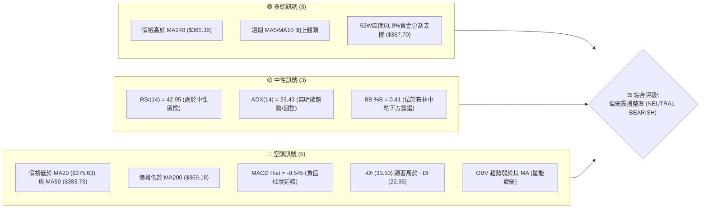
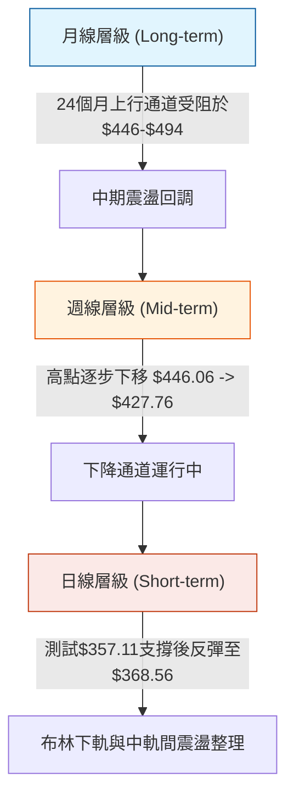
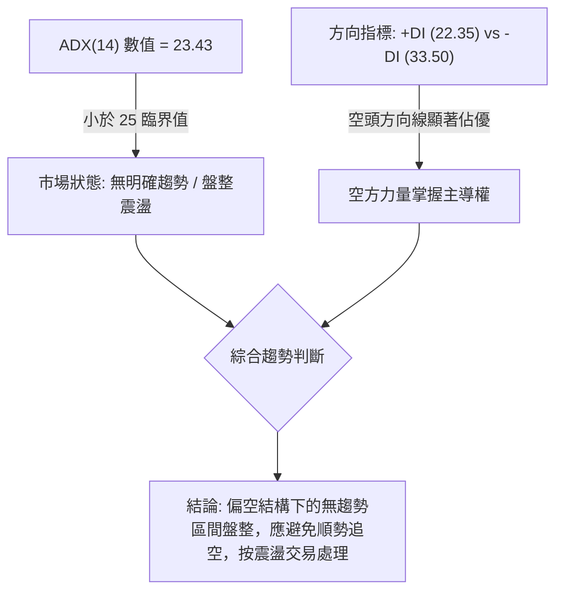
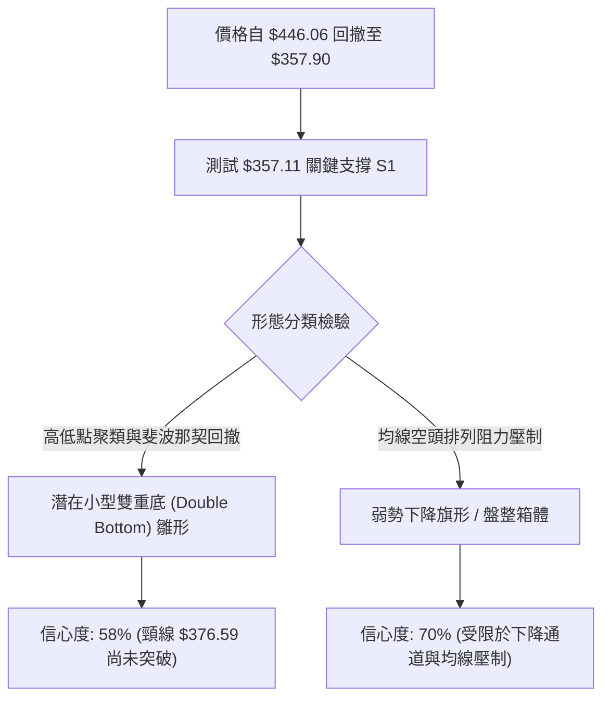
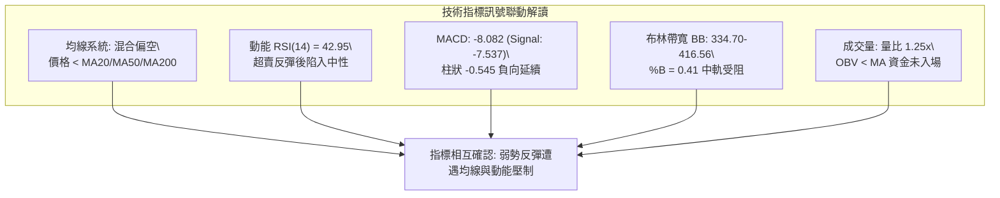
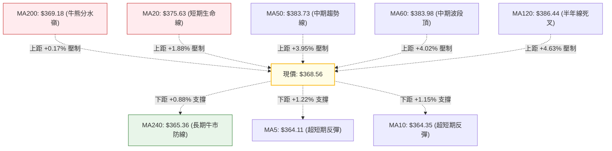
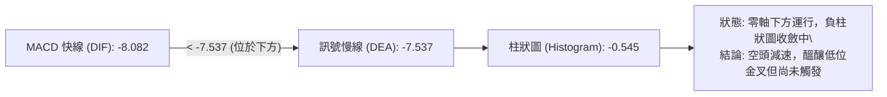
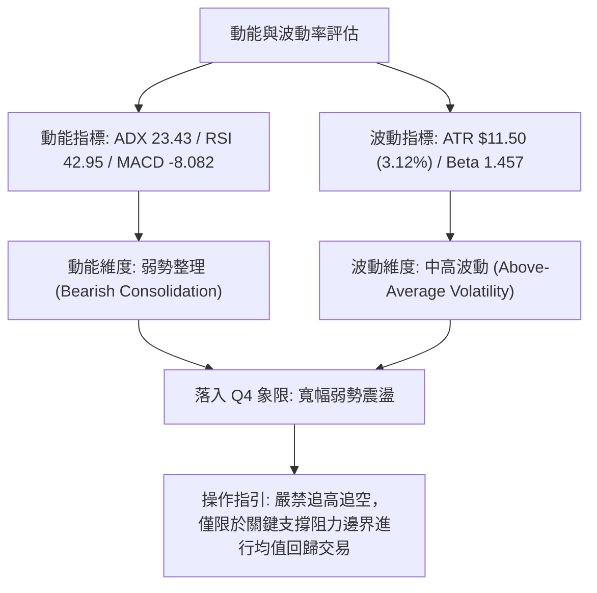
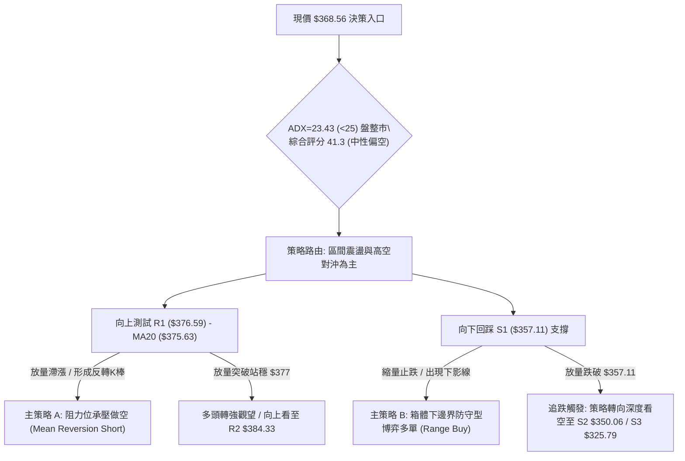
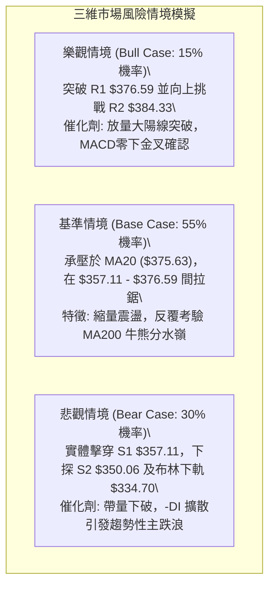

# AVGO 技術分析報告

> **報告日期**：2026-09-09 ｜ **語言**：繁體中文 ｜ **數據來源**：Yahoo Finance ｜ **當前價格**：$368.56

---

## 目錄

| 章節 | 內容 |
|------|------|
| [1. 技術面概覽](#1-技術面概覽) | 訊號儀表板、核心指標、評分卡 |
| [2. 趨勢分析](#2-趨勢分析) | 多時框趨勢、長中短期走勢、ADX解讀 |
| [3. 圖表形態分析](#3-圖表形態分析) | 形態識別、信心度驗證、K線結構 |
| [4. 支撐與阻力](#4-支撐與阻力) | 關鍵價位分佈、斐波那契回調結構 |
| [5. 技術指標深度解讀](#5-技術指標深度解讀) | MA系統、RSI、MACD、布林通道、OBV與量能 |
| [6. 動能與波動率](#6-動能與波動率) | 動能四象限、ATR風控計量、Beta特性 |
| [7. 多時框架總結](#7-多時框架總結) | 時框矩陣、優先級收斂原則與方向定錨 |
| [8. 交易策略建議](#8-交易策略建議) | 策略路由、主策略階梯、風報比精算 |
| [9. 風險提示與監控](#9-風險提示與監控) | 監控Checklist、三情境壓力測試、風控規則 |

---

## 1. 技術面概覽

### 🎯 技術訊號儀表板



### 📊 核心指標速覽表

| 指標類別 | 指標名稱 | 當前數值 | 訊號 | 解讀 |
| :--- | :--- | :--- | :---: | :--- |
| **價格** | 當前收盤價 | $368.56 | 🟡 | 位於52週區間38.6%分位，貼近61.8%斐波那契關鍵回調位 |
| **短期均線**| MA20 | $375.63 | 🔴 | 現價在其下方 -1.88%，短線受制於布林中軌阻力 |
| **中期均線**| MA50 | $383.73 | 🔴 | 現價在其下方 -3.95%，中期波段均線壓制明顯 |
| **長期均線**| MA200 | $369.18 | 🔴 | 現價跌破長期牛熊分界線 -0.17%，多空於此爭奪激烈 |
| **超長均線**| MA240 | $365.36 | 🟢 | 現價高於年線支撐 +0.88%，提供下方基礎結構托底 |
| **動能震盪**| RSI(14) | 42.95 | 🟡 | 脫離超賣區但低於中軸50，動能中性偏弱，無背離訊號 |
| **趨勢動能**| MACD | -8.082 / -7.537 | 🔴 | DIF位於信號線下方，柱狀圖 -0.545 延續空頭主導 |
| **隨機指標**| Stoch %K / %D | 76.56 / 46.13 | 🟡 | 短線出現自超賣區之技術性反彈，處中性觀察區 |
| **趨勢強度**| ADX(14) | 23.43 (-DI: 33.50) | 🟡 | 數值 <25 定義為盤整弱趨勢行情，但空方力道佔優 |
| **波動帶** | Bollinger Bands| 334.70 - 416.56 | 🟡 | %B為0.41，通道擴散後趨於走平，價格受困於中軌下方 |
| **量能系統**| OBV / 成交量 | 30.40M (量比 1.25x)| 🔴 | OBV < MA 顯示資金沉澱疲弱，反彈量能持續性存疑 |
| **真實波幅**| ATR(14) | $11.50 (3.12%) | 🟡 | 每日平均波幅適中，為交易止損與區間設定依據 |

### 🏆 技術評分卡

```
技術評分卡 — AVGO (2026-09-09)
════════════════════════════════════════════════════
趨勢強度      ███████░░░░░░░░░░░░░  36/100  🔴 空頭壓制
動能指標      ████████░░░░░░░░░░░░  40/100  🟡 中性偏弱
支撐穩定度    ███████████░░░░░░░░░  55/100  🟡 斐波支撐
成交量配合    ███████░░░░░░░░░░░░░  35/100  🔴 量價背離
形態完整度    ██████████░░░░░░░░░░  50/100  🟡 弱勢築底
均線排列      ██████░░░░░░░░░░░░░░  32/100  🔴 混合偏空
════════════════════════════════════════════════════
綜合評分      ████████░░░░░░░░░░░░  41.3/100 🟡 中性偏弱盤整
════════════════════════════════════════════════════
```

---

## 2. 趨勢分析

### 🌐 多時框趨勢分析



### 📈 長期趨勢 — 12個月走勢圖（Unicode）

根據提供的24個月收盤歷史，過去12個月（2025-10 至 2026-09）呈現顯著的雙頂擴張後大幅修正走勢：

```
AVGO 月線走勢圖（過去12個月收盤價走勢）
價格軸 ($)
$450 ┤                                  ●(26-05: $446.06)
$420 ┤                             ●(26-04)
$390 ┤              ●(25-11: $400.71)            ●(26-07: $389.28)
$360 ┤  ●(25-10)                                      ●    ●←現在 ($368.56)
$330 ┤                    ●(25-12)  ●(26-01)          (26-06)(26-08)
$300 ┤                                  ●(26-03: $309.02)
     └─────────────────────────────────────────────────────────────
        10   11   12   01   02   03   04   05   06   07   08   09 (月份)
       (2025)                      (2026)
```

#### 走勢特徵分析表格

| 階段區間 | 起止價格 | 漲跌幅 | 走勢特徵與結構解讀 |
| :--- | :--- | :--- | :--- |
| **第一波拉升期** (2025.10 - 2025.11) | $367.57 → $400.71 | +9.02% | 突破400整數心理關卡，形成中期第一個頂部高點。 |
| **深度調整期** (2025.12 - 2026.03) | $400.71 → $309.02 | -22.88% | 連續4個月陰跌，於52週低點區間（$289.50上方）形成波段低點聚類。 |
| **二次爆發期** (2026.04 - 2026.05) | $309.02 → $446.06 | +44.35% | 強勢主升浪，突破前高並創出月線收盤新高 $446.06（盤中衝擊52W高點 $494.22）。 |
| **高位派發回調** (2026.06 - 2026.09) | $446.06 → $368.56 | -17.37% | 出現高位籌碼鬆動，價格大幅回調跌破多條均線，目前於 $368 尋求年線支撐。 |

### 📊 中期趨勢（週線分析）

從近20週數據觀察，AVGO中期呈現「高點下移、低點震盪」的空頭收斂結構：

```
AVGO 週線關鍵結構位示意
阻力區間 3: $427.76 (08-09 波段高點，RSI高達73.6，量能不足見頂)
             │
阻力區間 2: $389.28 - $399.97 (07-12 與 08-02 反彈頸線壓力帶)
             │
阻力區間 1: $375.63 - $376.59 (MA20 與 R1 強共振阻力)
─────────────┼─────────────────────────────────────────────
當前價格:    $368.56 (圍繞 MA200 $369.18 與 61.8% 斐波回調位 $367.70 爭奪)
─────────────┼─────────────────────────────────────────────
支撐區間 1: $357.11 - $357.90 (09-06 週收盤低點，波段支撐S1)
             │
支撐區間 2: $350.06 (關鍵整數防守位 S2)
             │
支撐區間 3: $334.70 - $325.79 (布林下軌 $334.70 至 結構支撐 S3)
```

週線層級動能指標顯示：2026-08-30 RSI 一度探底至 23.5（嚴重超賣），隨後帶動近兩週價格自 $357.90 反彈至當前 $368.56，MACD負柱狀圖由 -5.851 逐步收斂至 -0.545，表明中期殺跌動能衰竭，但尚未轉化為實質性多頭行情。

### ⚡ 趨勢強度評估（ADX 解讀）



#### ADX 趨勢強度評估對照表

| 指標名稱 | 當前讀數 | 門檻區間 | 趨勢狀態判定 | 交易指引 |
| :--- | :--- | :--- | :--- | :--- |
| **ADX(14)** | **23.43** | < 25.00 | **弱趨勢 / 盤整市（Non-Trending）** | 禁止使用順勢突破策略；應採用均值回歸與通道高拋低吸。 |
| **+DI(14)** | **22.35** | 基準線 20.0 | 多頭進攻力道不足 | 多頭無主動推升意願，反彈容易早夭。 |
| **-DI(14)** | **33.50** | > 30.00 | 空頭拋壓佔據主導 | 盤面下行壓力依然存在，但因 ADX<25，不宜過度追空。 |

---

## 3. 圖表形態分析

### 🔍 形態識別系統

在日線與週線的形態分析中，嚴格遵循客觀幾何特徵與信心度量化規則：



#### 圖表形態量化評估表

| 形態類別 | 信心度 | 判斷依據（引用技術數據） | 完成度 | 目標價（附嚴格計算式） |
| :--- | :---: | :--- | :---: | :--- |
| **潛在雙重底** | **58%** | 2026-06-28收盤 $365.02 與 2026-09-06低點 $357.90 於支撐位 S1 ($357.11) 附近形成兩次探底共振。 | 40% | 若突破頸線 R1 ($376.59)：<br>形態高度 = $376.59 - $357.11 = $19.48<br>理論測幅目標 = $376.59 + $19.48 = **$396.07**（接近50%斐波回調位 $391.86） |
| **下降通道內收斂箱體** | **72%** | 近期收盤在 $357.90 至 $368.79 間築底，受制於MA20 ($375.63) 下軌壓制，屬於典型下跌中繼盤整。 | 75% | 若跌破箱底 S1 ($357.11)：<br>形態高度 = $368.56 - $357.11 = $11.45<br>理論測幅目標 = $357.11 - $11.45 = **$345.66**（接近 S2 $350.06 與下軌 $334.70） |
| **頭肩頂形態** | **< 30%** | **數據不足以支撐完整頭肩頂結構**，左肩高點不對稱，僅作指標型解讀，不予建立幾何形態模型。 | — | **數據中未偵測到有效結構** |

### 🕯️ 重要K線形態分析

根據近20週與近月收盤表現，提煉關鍵K線結構：

| 週期/日期 | 收盤價 | 實體/引線特徵 | K線形態解讀 | 訊號強度 |
| :--- | :--- | :--- | :--- | :---: |
| **2026-05-31** | $446.06 | 長上影高位大陽線 | 衝擊52W高點 $494.22 後大幅受阻回落，形成多頭衰竭之「流星線/上吊線」組合。 | 🔴 強空 |
| **2026-06-07** | $385.12 | 放量大陰線 (2.51億股) | 突破中軌引發恐慌性派發，成交量創年度極值，確認波段反轉向下。 | 🔴 強空 |
| **2026-08-30** | $368.79 | 極長下影線小實體 | RSI打入23.5極端超賣區，下影線探底獲得支撐，呈現空頭力竭「錘子線」特徵。 | 🟢 弱多 |
| **2026-09-06** | $357.90 | 帶量反彈實體陽線 | 成交量擴大至1.73億股，成功守住波段低點S1 ($357.11)，確認短線底部承接買盤。 | 🟢 偏多 |
| **2026-09-13 (現)**| $368.56 | 溫和上推小陽線 | 連續第二週收紅，收復5日均線（$364.11），進入MA20與MA200密集壓力區。 | 🟡 中性 |

### 📉 ASCII 走勢形態示意圖

```
AVGO 近期雙底雛形與阻力結構示意
價格 ($)
$384.33 ────────────────────────────── R2 / MA50 強阻力帶
               ▲
              ╱ ╲
$376.59 ─────╱───╲──────────────────── R1 / 雙底頸線阻力 / MA20
            ╱     ╲       ▲
           ╱       ╲     ╱ ╲
$368.56 ──●         ╲   ●───●─────── 現價 ($368.56) / MA200 爭奪點
                     ╲ ╱
$357.11 ──────────────●────────────── S1 雙重底底座 ($357.90 / $357.11)
                   (09-06)
```

---

## 4. 支撐與阻力

### 🗺️ 關鍵價位分布圖（Unicode）

嚴格採用系統計算之波段高低點聚類數值與斐波那契回調結構：

```
AVGO 價位結構分布圖 (Resistance & Support Cluster)
══════════════════════════════════════════════════════════════════
$416.56 ║████████████████████████████████║ 布林上軌 (BB Upper) / 斐波 38.2% ($416.02)
$400.75 ║████████████████████████        ║ 強阻力 R3 (歷史波段密集高點聚類)
$391.86 ║▓▓▓▓▓▓▓▓▓▓▓▓▓▓▓▓▓▓▓▓▓▓▓▓        ║ 斐波那契 50.0% 回調分水嶺
$384.33 ║████████████████                ║ 阻力 R2 (MA50 $383.73 / MA60 $383.98 共振)
$376.59 ║████████████                    ║ 關鍵阻力 R1 (MA20 $375.63 / 短線反彈頸線)
$369.18 ║▒▒▒▒▒▒▒▒▒▒▒▒                    ║ 長期牛熊線 MA200 爭奪位
$368.56 ╠════════════════════════════════╣ ◄ 當前收盤價 ($368.56)
$367.70 ║▓▓▓▓▓▓▓▓▓▓▓▓▓▓▓▓▓▓▓▓▓▓▓▓▓▓▓▓▓▓  ║ 斐波那契 61.8% 黃金分割關鍵支撐
$365.36 ║▒▒▒▒▒▒▒▒▒▒▒▒▒▒▒▒▒▒▒▒            ║ MA240 超長線趨勢托底均線
$357.11 ║████████████████                ║ 近期核心支撐 S1 (近一年波段低點聚類)
$350.06 ║████████████████████████        ║ 強支撐 S2 (整數心理關卡聚類)
$334.70 ║▓▓▓▓▓▓▓▓▓▓▓▓▓▓▓▓▓▓▓▓            ║ 布林下軌 (BB Lower) / 斐波 78.6% ($333.31)
$325.79 ║████████████████████████████████║ 極限防守支撐 S3 (年內深度調整低點聚類)
══════════════════════════════════════════════════════════════════
```

### 🚧 阻力位分析表

| 阻力級別 | 精確價位 | 形成依據（數據源自 OHLCV） | 突破難度 | 戰術意義 |
| :--- | :---: | :--- | :---: | :--- |
| **R1** | **$376.59** | 距現價 +2.18%。與20日均線 MA20 ($375.63) 形成日線級別死叉阻力壓制。 | 中等 | 短線多空強弱分界線；有效放量突破前，任何反彈均屬震盪。 |
| **R2** | **$384.33** | 距現價 +4.28%。與50日均線 MA50 ($383.73) 及60日均線 MA60 ($383.98) 形成三合一共振壓力。 | 極高 | 中期波段下降趨勢的防守頂蓋，非重大利好刺激難以一蹴而就。 |
| **R3** | **$400.75** | 距現價 +8.74%。歷史高點收盤聚類位，整數心理強阻力，鄰近斐波那契 50.0% ($391.86)。 | 極高 | 多頭重啟中長期大級別反轉行情的終極確認節點。 |

### 🛡️ 支撐位分析表

| 支撐級別 | 精確價位 | 形成依據（數據源自 OHLCV） | 守住機率 | 戰術意義 |
| :--- | :---: | :--- | :---: | :--- |
| **S1** | **$357.11** | 距現價 -3.11%。2026-09-06波段低點聚類（$357.90），帶量承接區域。 | 65% | 短線多頭唯一有效屏障；跌破則確認雙底構築失敗。 |
| **S2** | **$350.06** | 距現價 -5.02%。次級波段低點密集聚類，整數支撐位。 | 75% | 多頭中期趨勢潰敗後的次級緩衝墊。 |
| **S3** | **$325.79** | 距現價 -11.61%。近一年深度回調的波段底座，鄰近斐波那契 78.6% ($333.31) 與布林下軌 ($334.70)。 | 90% | 極端行情的價值重估防禦底線，中長線買盤必守之所。 |

### 📐 斐波那契回調位分析

依據52週極端波動區間（低點 $289.50 至 高點 $494.22，波幅 $204.72）計算之黃金分割架構：

```
斐波那契回調層級定位
0.0%  (52W High) : $494.22
23.6%            : $445.90 ── 2026-05月線收盤頂部 ($446.06)
38.2%            : $416.02 ── 與布林上軌 ($416.56) 吻合
50.0%            : $391.86 ── 中期強弱中軸
61.8% (黃金分割) : $367.70 ── ◄◄ 現價 $368.56 精確落於此處 (差額 +$0.86)
78.6%            : $333.31 ── 與布林下軌 ($334.70) 吻合
100.0%(52W Low)  : $289.50
```

**深入解讀**：
當前收盤價 **$368.56** 精確落於 **61.8% 回調位 ($367.70)** 與 **50.0% 回調位 ($391.86)** 之間，且與 61.8% 關鍵黃金分割線僅相距 **+0.23%**。在技術分析中，61.8% 回撤為健康牛市回調的最後防線；若此處守穩並形成築底，則此前自 $494.22 的下挫定性為「強趨勢中的深度洗盤」；若實體跌破 $367.70 並下探 S1 ($357.11)，則行情將向 78.6% ($333.31) 深度滑落。

---

## 5. 技術指標深度解讀

### 🎛️ 指標訊號總覽



### 📈 移動平均線排列分析



**均線狀態解讀**：
均線系統呈現「混合偏空排列」。超短期均線 MA5 ($364.11) 與 MA10 ($364.35) 底部金叉，推動價格自 $357.90 反彈；但上方直接面臨 MA200 ($369.18) 的即時壓制，且 MA20 ($375.63)、MA50 ($383.73)、MA60 ($383.98)、MA120 ($386.44) 由近及遠形成密集空頭梯隊。現價必須帶量突破 MA20 ($375.63)，方能扭轉均線下傾趨勢。

### 📉 RSI(14) 分析

- **當前 RSI(14) 數值**：**42.95**
```
RSI(14) 動能強度表
[0] ────────── [30] 超賣 ── [42.95 現值] ── [50] 中軸 ────────── [70] 超買 ────────── [100]
█████████████████░░░░░░░░░░░░░░░░░░░░░░░░░░░░░░░░░  42.95%
```
- **區間評估**：RSI 脫離 2026-08-30 的極端超賣區（23.5），目前回升至 42.95，仍處於 50 多空分水嶺下方，表明當前市場反彈僅為修復超賣指標的「技術性抽頭」，尚未具備多頭主動上攻的強勢特徵。
- **背離分析**：
  - **頂背離**：無。
  - **底背離**：詳細核對週線數據：2026-08-30 收盤價 $368.79 對應 RSI 為 23.5；2026-09-06 收盤價下探至 $357.90（價格創波段新低），但對應週線 RSI 卻逆勢上升至 29.2。**週線層級存在微弱底背離跡象**；但日線當前 RSI 42.95 尚未形成連續確認結構，因此結論為：「**存在潛在底背離修復預期，但訊號尚未完全成型**」。

### 📊 MACD(12/26/9) 訊號解讀



- **MACD 指標數值**：DIF = -8.082，Signal = -7.537，Histogram = -0.545。
- **解讀**：快線與慢線均深處零軸下方（負值區），代表大格局仍屬空頭波段修正。然而，負柱狀圖已由前期深幅擴散（2026-08-23 週線柱狀圖高達 -5.851）收斂至當前 -0.545，暗示做空動能顯著枯竭，若後續收盤站上 $375.63，將引發低位黃金交叉。

### 📦 布林通道分析

```
AVGO 布林通道 (20, 2) 結構示意圖
─────────────────────────────────────────────────────────────
$416.56 ┬────────────────────────────────────────── BB 上軌 (Upper Band)
        │
        │
$375.63 ┼─────────────────── [中軌 MA20] ────────── BB 中軌阻力位
        │                      ▲
$368.56 ┼──────● [現價] ───────┘                   %B = 0.41 (中下軌震盪區間)
        │
$334.70 ┴────────────────────────────────────────── BB 下軌 (Lower Band)
─────────────────────────────────────────────────────────────
通道帶寬 (Bandwidth) = ($416.56 - $334.70) / $375.63 = 21.79% (處於收縮企穩期)
```

- **位置判定**：%B = 0.41，價格位於中軌（$375.63）與下軌（$334.70）之間。布林通道在經歷了自 $446 的單邊暴跌擴張後，目前上下軌開口開始走平並收斂，預示市場正由「單邊下行」轉入「箱體整理」，下軌 $334.70 具備極強結構性支撐。

### 💹 成交量分析（量價配合度）

- **量能數據對比**：
  - 最新單日成交量：**30,401,900** 股
  - 20日均量：**24,284,445** 股（量比：**1.25x**）
  - 50日均量：**22,139,124** 股
- **OBV（能量潮）狀態**：**OBV < MA**，且整體走勢未見資金主動持續性淨流入。
- **量價配合判定**：
  - 當前量比放大至 1.25x，但價格漲幅僅受限於 +1.22%，呈現「放量滯漲於 MA200 前」的特徵。
  - 回溯 2026-06-07 暴跌時成交量曾爆出 2.51億股，相比之下，近兩週低位反彈的週均成交量僅為 1.1億至 1.7億股，顯示逢低買盤多為被動回補，主力主動推升意願薄弱，**呈現量價背離（價格微彈而量能無法維持增量擴張）**。

---

## 6. 動能與波動率

### ⚡ 動能評估四象限

根據 AVGO 當前「弱趨勢、中低動能、中等波動」的技術特徵，建立動能-波動矩陣定位：

| 象限 | 動能狀態 | 波動率狀態 | 市場環境與策略特徵 | 當前匹配度 |
| :---: | :---: | :---: | :--- | :---: |
| **Q1** | **強 (Strong)** | **低 (Low)** | 穩健單邊上升趨勢（最佳持股做多機會） | ❌ 不符合 |
| **Q2** | **弱 (Weak)** | **低 (Low)** | 窄幅縮量築底盤整（耐心中線佈局期） | ❌ 不符合 |
| **Q3** | **強 (Strong)** | **高 (High)** | 劇烈單邊突破或暴跌（高風險高回報） | ❌ 不符合 |
| **Q4** | **弱 (Weak)** | **中/高 (Medium/High)** | **寬幅震盪洗盤，多空反覆爭奪（當前狀態）** | **✓ 符合 (當前狀態)** |



### 📊 ATR 波動率分析

- **當前 ATR(14)**：**$11.50**，佔當前股價比例為 **3.12%**。
- **戰術交易參數推算**：
  - **日內安全波動區間**：現價 ± 1.0 × ATR = **$357.06 至 $380.06**（完全涵蓋了 S1 $357.11 與 R1 $376.59）。
  - **趨勢交易動態止損位（Trailing Stop）**：建議設定 1.5 × ATR = **$17.25**。
  - **保守短線防守空間**：1.0 × ATR（$11.50），這意味著任何建倉進場點距關鍵支撐不得低於此數值，以防被日常雜訊洗出場。

### 📐 Beta 與市場相關性

- **Beta 係數**：**1.457**
- **市場特徵解讀**：
  - AVGO 作為高貝塔半導體龍頭，其波動幅度比標普500指數高出 **45.7%**。
  - 當前市場整體處於動盪階段，AVGO 在反彈時能展現彈性，但在大盤走弱時亦面臨加速補跌風險。在多時框共振尚未翻多前，高 Beta 特性意味著部位規模必須受到嚴格壓制（建議部位控制在標準倉位的 1/3 至 1/2）。

---

## 7. 多時框架總結

### 📋 時框架評分表

| 時框架 | 趨勢方向 | 動能狀態 | 均線排列 | 關鍵形態 | 綜合評分 | 操作建議 |
| :--- | :---: | :---: | :---: | :---: | :---: | :--- |
| **月線層級** | 🟢 多頭趨勢回撤 | 🟡 中性減速 | 🟢 MA240上方多頭 | 24個月大箱體運行 | **62/100** | 長線投資者於 61.8% 斐波處具備配置價值 |
| **週線層級** | 🔴 空頭下降通道 | 🔴 弱勢偏空 | 🔴 跌破MA20週線 | 高位派發後的下跌中繼 | **38/100** | 中期波段禁止盲目加碼，靜待週線底背離成立 |
| **日線層級** | 🟡 弱勢箱體整理 | 🟡 超賣反彈 | 🔴 混合偏空 (MA20阻力) | S1/R1 區間拉鋸 | **44/100** | 區間交易，靠近阻力減磅，靠近支撐博弈 |

### 🔲 綜合訊號矩陣

```
時框訊號一致性矩陣
維度           短期 (日線)          中期 (週線)          長期 (月線)       跨時框評估
───────────────────────────────────────────────────────────────────────────────
趨勢線方向     🟡 橫向盤整          🔴 下降走弱          🟢 上升趨勢回踩   衝突 (以中期優先)
動能指標       🟡 RSI=43 / 中性     🔴 MACD負柱狀        🟡 動能高位回落   共振偏弱
均線位置       🔴 位於MA20下方      🔴 位於MA20下方      🟢 守住年線MA240  中期空頭壓制
量能配合       🔴 OBV疲弱           🔴 反彈縮量          🟢 長期籌碼穩定   量能支撐不足
───────────────────────────────────────────────────────────────────────────────
整體訊號收斂評估: 短期低位反彈正面臨中期下行趨勢之強阻力，趨勢反轉條件不成立。
```

### ⚖️ 多時框收斂結論

> **依嚴格要求 14 執行多時框收斂判定**：
> 1. **行情性質定義**：當前日線 ADX(14) 讀數為 **23.43 (< 25)**，明確定義為**「無趨勢之弱勢盤整行情」**。
> 2. **主導時框收斂**：根據規則，盤整行情中，**以日線布林通道（$334.70 - $416.56）及其內部短期震盪區間為主要交易邊界**；同時，週線層級高點逐步下移（$446 → $427），均線空頭排列，限制了反彈高度。
> 3. **唯一方向性結論**：**中性偏空觀望（Neutral-Bearish），策略以「區間上限受阻高拋/破位順勢」為主，禁止單邊追多**。現價 $368.56 處於布林中軌阻力 $375.63 與下方 S1 支撐 $357.11 的狹窄夾縫中，盈虧比未達極佳狀態，必須等待價格觸及邊界再行決策。

---

## 8. 交易策略建議

### 🗺️ 策略決策流程圖



### 🧭 策略路由（依評分卡分流）

- **當前技術評分卡得分**：**41.3 / 100**（落入 40–60 中性偏空區間）。
- **當前主策略方向**：**【中性偏空區間震盪操作】**。
  - **交易方針**：以日線布林中軌與 R1（$376.59）為上邊界壓力，以 S1（$357.11）為下邊界支撐，採取高拋低吸之區間策略，嚴格等待邊界信號確認，不得在區間半山腰（現價 $368.56）盲目開倉。

### 🎯 價格情境階梯（Price Scenarios）

所有價位精確引用本報告第 4 章所確認之關鍵節點：

| 觸發條件 | 第一目標 (T1) | 第二目標 (T2) | 突破後延伸空間 (T3) | 市場情境含義與行動指南 |
| :--- | :---: | :---: | :---: | :--- |
| **強勢向上突破 R1 $376.59** | R2 **$384.33** | R3 **$400.75** | 斐波 38.2% **$416.02** | 短線空頭結構被破壞，空單全數止損，多頭短線順勢跟進。 |
| **受阻於 R1 $376.59 遇阻回落** | 現價 **$368.56** | S1 **$357.11** | S2 **$350.06** | 弱勢震盪延續，反彈衰竭，觸發標準逢高做空機制。 |
| **弱勢跌破 S1 $357.11** | S2 **$350.06** | 布林下軌 **$334.70**| S3 **$325.79** | 雙底雛形徹底破位，觸發中期下行主跌浪，全面追空。 |

### 📊 情境機率分佈

| 情境劃分 | 機率權重 | 核心技術指標依據 |
| :--- | :---: | :--- |
| **情境一：受制均線，區間震盪回落** | **55%** | ADX 23.43 確立盤整特徵；MA20 ($375.63) 與 MA50 重壓；OBV 疲軟未見主力增量。 |
| **情境二：在 S1 與 R1 之間極限橫盤** | **30%** | RSI 處於中性 42.95；61.8% 斐波回調位 $367.70 提供就地暫存托底。 |
| **情境三：放量向上突破展開反轉** | **15%** | 需逆轉 -DI (33.50) 的絕對優勢並推翻 MACD 零軸下死叉格局，短期缺乏催化劑。 |

### 🟢 主策略詳情（精確量化）

針對 AVGO 的中性偏空震盪特性，制定兩套邊界交易策略（主策略 A 偏空，主策略 B 偏多）：

| 策略要素 | 策略 A：阻力承壓逢高做空（優選主策） | 策略 B：支撐企穩短線反彈（次選輔策） |
| :--- | :--- | :--- |
| **進場邏輯** | 反彈測試 MA20 與 R1 阻力位確認承壓 | 回踩 52W 61.8% 斐波支撐及 S1 構築雙底 |
| **確切進場條件** | 價格觸及 $375.00 - $376.59 區間且日線收長上影線 | 價格回落至 $357.50 - $358.50 且 RSI(14) 止跌向上 |
| **精確進場價格** | **$376.00** | **$358.00** |
| **目標價 T1** | **$368.56**（現價 / MA200 支撐位） | **$368.56**（MA200 關鍵分水嶺） |
| **目標價 T2** | **$357.11**（波段低點支撐 S1） | **$376.59**（關鍵阻力位 R1） |
| **嚴格止損價格** | **$380.50**（突破 R1 上方 +0.39 × ATR） | **$353.50**（跌破 S1 下方 -0.31 × ATR） |
| **風險額度 (Risk)**| $4.50 / 股 (1.20%) | $4.50 / 股 (1.26%) |
| **潛在回報 (Reward)**| T1: $7.44 / T2: $18.89 | T1: $10.56 / T2: $18.59 |
| **風險報酬比 (R:R)**| **1 : 4.20**（以 T2 測算） | **1 : 4.13**（以 T2 測算） |
| **預估勝率** | **60%** | **45%** |
| **建議配置倉位** | **總資金之 10% - 15%** | **總資金之 5% - 8%**（輕倉防禦） |

### 🔴 反向風險觸發點（對沖提示）

- **做空主策略的無效化閥值**：若日線收盤價**強勢突破並連續2日站穩 $376.59（R1）**，且當日成交量超過 20日均量 1.5倍（> 3,600萬股），做空邏輯立即推翻。此時應果斷平倉所有空單，並可於回踩 $376.59 時小幅反手對沖多單，第一目標上看 R2（$384.33）。
- **極端下跌風險預警**：若盤中**帶量貫穿 $357.11（S1）**，不可進行任何逆勢抄底，該破位將直接解鎖向下尋找 S2（$350.06）甚至布林下軌（$334.70）的空間。

### ⭐ 整體訊號強度評星

```
訊號強度量化評星
做多訊號強度：★★☆☆☆  (2.0/5星) ── 僅受61.8%斐波那契托底，動能與均線不支持
做空訊號強度：★★★☆☆  (3.5/5星) ── 均線壓制且量能疲弱，空方佔據空間主動權
整體可信度：  ★★★★☆  (4.0/5星) ── ADX 與布林通道明確指示震盪市，價位清晰
```

---

## 9. 風險提示與監控

### ✅ 關鍵監控指標 Checklist

```
╔══════════════════════════════════════════════════════════════════╗
║                AVGO 技術風控監控清單 (Checklist)                  ║
╠══════════════════════════════════════════════════════════════════╣
║ [ ] 監控項 1: 每日收盤是否跌破 MA240 ($365.36) 年線極限防禦點       ║
║ [ ] 監控項 2: MACD 柱狀圖是否由負轉正 (是否突破 0 軸臨界線)          ║
║ [ ] 監控項 3: 成交量能否有效放大至 20日均量之上 (> 2,428萬股)       ║
║ [ ] 監控項 4: RSI(14) 能否突破中軸 50，或再次跌入 30 超賣區          ║
║ [ ] 監控項 5: 盤中價格是否觸及 $376.59 (R1) 或 $357.11 (S1) 預警線   ║
║ [ ] 監控項 6: ADX(14) 讀數是否由 23.43 突破 25 (趨勢行情啟動信號)   ║
╚══════════════════════════════════════════════════════════════════╝
```

### ⚠️ 風險場景分析



### 🛡️ 風險管理重要提醒

1. **ATR 動態頭寸縮減模型**：
   當前 AVGO 的每日 ATR 為 **$11.50**，波幅佔比高達 **3.12%**。基於單筆交易最大本金虧損不超過總帳戶 1.0% 的風控原則：
   $$\text{最大允許開倉股數} = \frac{\text{總資本} \times 1\%}{\text{止損距離 ($4.50)}}$$
   以 100,000 美元帳戶為例，單筆最大風險額為 $1,000，則最大建倉上限為 222 股（市值約 $81,800，佔資產81%），但在盤整市場中，應主動降槓桿至 **1/3 倉位**（即約 70–75 股），保留充裕的抗波動緩衝墊。
2. **高 Beta 防禦要求**：AVGO 的 Beta 為 **1.457**，對大盤科技股指數（如 QQQ）高度敏感。若納斯達克指數出現破位下行，AVGO 極易放大下跌倍數，屆時不得因基本面強勢（P/E 47x，營收成長85.5%）而在下行趨勢中逆勢「接飛刀」。
3. **跳空缺口與隔夜風險**：半導體板塊受地緣政治與全球半導體供應鏈政策影響劇烈，嚴禁使用市價單在開盤前5分鐘進行突破追單，必須使用「限價止損單（Stop-Limit）」控制滑點風險。

---

## 📋 報告總結

```
AVGO 技術分析報告總結
════════════════════════════════════════════════════════
報告日期：2026-09-09
當前價格：$368.56
分析評級：⚖️ 偏弱震盪整理（中性偏空 / Neutral-Bearish）

關鍵結論：
├─ 長期趨勢：🟢 守住年線 MA240 ($365.36) 與 61.8% 斐波那契 ($367.70)
├─ 中期趨勢：🔴 週線下降通道運行，受制於 MA20 ($375.63) 與 MA50 ($383.73)
├─ 短期趨勢：🟡 自 $357.90 超賣反彈，進入 MA200 ($369.18) 多空拉鋸區
├─ 核心支撐：S1: $357.11 ｜ S2: $350.06 ｜ 極限 S3: $325.79
├─ 核心阻力：R1: $376.59 ｜ R2: $384.33 ｜ 強阻 R3: $400.75
└─ 分析師目標均價：$533.41 (基本面共識與當前技術盤面產生背離)

最優策略組合：
1. 🥇 最佳機會：等待反彈至 R1 頸線與 MA20 共振區 ($375.00 - $376.59)
               構築看跌形態後建立高空倉位，博弈回踩 S1 (風報比 1:4.20)。
2. 🥈 次選機會：若價格縮量下探 S1 ($357.11 - $358.00) 獲顯著支撐，
               短線輕倉介入博弈技術性反彈 (風報比 1:4.13)。
3. 🥉 保守選擇：在 ADX 升破 25 且價格突破 $376.59 或跌穿 $357.11 之前，
               完全空倉觀望，不參與區間內部的雜訊博弈。
════════════════════════════════════════════════════════
```

---

> ⚠️ **免責聲明**：本報告為 AI 自動生成之技術分析，所有數據及估算均嚴格基於所提供的歷史價格與指標資訊。本報告**僅供研究與學術參考**，**不構成任何形式的投資建議與要約**。金融市場具有高度風險，投資決策需獨立評估，入市需謹慎並自負盈虧。

---

*報告生成時間：2026-09-09 ｜ 數據來源：Yahoo Finance ｜ 分析框架：多時框技術分析系統*